# CDF Documentation
Generated from: docs.cognite.com (cdf)


<!-- SOURCE_START: docs.cognite.com/docs\cdf\3d\guides\360images_contextualize.mdx -->
## File: docs.cognite.com/docs\cdf\3d\guides\360images_contextualize.mdx

---
title: Contextualize 360° images
description: Manually contextualize 360° images by using a single 360° image file or leveraging the 360° image contextualization within a scene.
content-type: procedure
audience: dataEngineer
experience-level: 100
lifecycle: use
article-type: article
---
<Tip>
When you're <span class="ui-element">contextualizing 3D objects</span>, use the unified 3D contextualization editor for CAD, Point clouds, or 360° images. You'll see the context for a scene and locate specific structures, such as identifying where a 360° image is positioned in the scene or determining which equipment a point cloud represents.
</Tip>

{/*The automatic tag detection now processes all 360° images and generates suggestions for discovered tags. You can review these suggestions, link them to assets if correct, edit incomplete tags, or discard incorrect suggestions.*/}

## Before you start

Make sure you've already uploaded the 360° images you want to contextualize.
For more information on uploading 360° images, see [Upload 360° images](/cdf/3d/guides/360images_upload).

{/*## Get started

Before contextualizing, you should <span class="ui-element">Run asset tag detection</span> to mark all detected tags in the 360° images that you can link to the correct asset to accelerate contextualization.

Select the 360° images model and select `...` > <span class="ui-element">Run asset tag detection</span> to start the 360° tag detection.

Once a tag is detected, you can link them to an asset. */}

## Contextualize

Select the 360° image collection and **Open** it to start the contextualization process within the 3D environment. You can also add the 360° image collection to a scene and start contextualizing from within the scene.

<Info>
**Contextualize 360° images within a scene**

In the scene overview, under the <span class="ui-element">3D content</span> tab, find the 360° image collection you want to contextualize. Select the 360° image and select <span class="ui-element">Contextualize</span> to start the contextualization. For more information, see [Unified 3D contextualization](/cdf/3d/guides/scene#unified-3d-contextualization).
</Info>

{/*You can trigger tag detection from the scene overview if you need to run tag detection. Once a collection has gone through the tag detection process, suggestions and annotations indicate how many tags were detected. */}

Now, select a 360° image to open it. Inside the 360° image, you'll have the contextualization tools.

<Steps>
<Step title="Create a bounding area">
Select <Icon icon="vector-square" /> to create a bounding area in a 360° image. Select a point and move the cursor to create a box of any shape. Press <kbd>Esc</kbd> to complete the drawing.

You can create multiple bounding areas. By default, the color of the area is blue, but it switches to pink once you link it to an asset.
</Step>

<Step title="Find the asset">
Use the search bar in the resource selector on the top right to find the asset you want to map to the selected object.
</Step>

<Step title="Link the asset">
Select the asset, verify it is correct, and select **Link**. {/*The object's color changes to purple.*/}

You've created an annotation (contextualized bounding area).
</Step>
</Steps>

The newly created annotation appears under the selected image in the left sidebar. You can see which 360° images have annotations.

### Tools in contextualization

- <span class="ui-element">Settings</span> opens <span class="ui-element">visualization controls</span>:

    - <span class="ui-element">Image transparency</span>: Use the slider to control the transparency level of the 360° image with the CAD model in the background. This fine-tunes the visibility between the two layers.

    - <span class="ui-element">360° markers</span>: Customize marker visibility to enhance your image analysis and inspection experience:

    - <span class="ui-element">X-ray mode</span>: Turn on and off to reveal the hidden markers or display all the 360° markers within the same view.

    - <span class="ui-element">Visibility</span>: Turn markers on and off.

    - <span class="ui-element">Transparency</span>: Adjust marker transparency to balance visibility with other visual elements.

- Turn on and off grid axis directions using <span class="ui-element">Show or hide axis</span> in the toolbar.

- In the top bar, navigate between 360° images. <span class="ui-element">X</span> closes the image, and you can return to the last one you opened.

- To zoom an annotation, select <span class="ui-element">Zoom to annotation</span>.

## Delete annotation

To delete the annotation:

<Steps>
<Step title="Select the annotated area">
Select the <Icon icon="mouse-pointer" /> icon from the toolbar and select the annotated area.
</Step>

<Step title="Delete the annotation">
Select <Icon icon="trash-2" /> in the top right corner.

You've deleted the annotation.
</Step>
</Steps>


<!-- SOURCE_END: docs.cognite.com/docs\cdf\3d\guides\360images_contextualize.mdx -->

================================================================================


<!-- SOURCE_START: docs.cognite.com/docs\cdf\3d\guides\360images_upload.mdx -->
## File: docs.cognite.com/docs\cdf\3d\guides\360images_upload.mdx

---
title: Upload 360° images
description: You can upload 360° images to Cognite Data Fusion (CDF) and display them in various applications with the Reveal 3D viewer.
content-type: procedure
audience: dataEngineer
experience-level: 200
lifecycle: use
article-type: article
---
360° images can be captured as part of a point cloud scan, such as an E57 format file, but you can also capture and upload them manually or using robots.

When displayed in Reveal 3D viewer, the locations of the 360° images are displayed as round **markers** in the 3D view. Select a marker to enter the 360° image, and use your mouse to rotate the camera in any direction. You can select other markers to move to nearby 360° images.

<Frame>

</Frame>

You need to **upload** the image files to CDF. Each station has six **cube map images** with a specific set of **metadata**. These cube map images together form a 360° image, representing six directions (left, front, right, back, top, and bottom). You can access the cube map images separately through file exports from the lidar scanning software or in E57 point cloud files.

<Frame>

</Frame>

### Automatic conversion for E57 files

E57 files can contain 360° images in various formats, including **cube maps** and **equirectangular** (spherical) projections.

If a 360° image is in a format other than a cube map, the extraction process will try to convert it to the cube map format. This conversion may require additional processing time and result in a slight quality loss compared to images that are already in cube map format.

See [E57 files with 360° images](#e57-files-with-360-images) for upload instructions.

### Manual conversion for other file formats

If you have equirectangular images in other file formats (not E57), convert them to cube maps before uploading to CDF:

1. Use a conversion tool such as [py360convert](https://github.com/sunset1995/py360convert) to convert your images to cube map format.
2. Upload the converted cube maps following the steps in [Custom script for other formatted 360° images](#custom-script-for-other-formatted-360-images).

## Get started

You can upload 360° images to CDF in two ways:

- [By uploading E57 files with 360° images](/cdf/3d/guides/360images_upload#e57-files-with-360-images), if you have a point cloud file in the E57 file format that includes both 360° images and point cloud data. A zip file of E57 files is also supported. This is only supported for the asset-centric 3D models.

- [By uploading other formatted 360° images](/cdf/3d/guides/360images_upload#custom-script-for-other-formatted-360-images), if you have 360° images and related custom metadata in separate, other (not E57) formatted files.

After uploading in the user interface or using a custom script, you can view 360° images in Search by adding the 360° image collection to a [scene](#add-360-images-to-the-scene). To view 360° images in custom Reveal applications, see [Reveal documentation](https://cognitedata.github.io/reveal-docs/docs).

<Warning>
Uploading the 360° image metadata (pose information) to the [Events API](https://api-docs.cognite.com/20230101/tag/Events/) is no longer possible. This functionality has been deprecated and will stop working in the future.
</Warning>

## Access capabilities

See [access capabilities](/cdf/access/guides/capabilities#upload-3d-models) to add the necessary capabilities to upload and view 360° images.

## Limitations

3D API processing now supports extracting 360° images from E57 files for a 3D model with a `data set` when starting from a script.

<Warning>
The CDF user interface currently doesn't support triggering extraction 360° images when either the source `fileId` or `modelId` has a data set.
</Warning>

The extracted 360° image files will be stored in the same data set as the 3D model. If the 3D model doesn't have a `data set`, the 3D API will also check and use any data set associated with the source file specified for the revision.

If you want the extracted 360° images to be available in a different data set, change the `data set` association for the files after processing is complete using file update requests.

If a data set is used in a `modelId` or source `fileId`, specify a `dmsInstancesSpaceId` value in the *indexingOptions* for the revision's request body. See [Trigger 360° image extraction from E57 files using Python](#trigger-360°-image-extraction-from-e57-files-using-python) for more information. This specifies the `space` where the data model instances for 360° images are stored.

<a id="e57-files-with-360-images"></a>
## E57 files with 360° images

Follow the steps to upload the E57 files to CDF, trigger point cloud filtering and indexing, and opt-in to 360° image extraction.

<Steps>
<Step title="Upload your E57 files to CDF">
If these files are large:

- Upload the files in the ZIP format using the [file extractor](/cdf/3d/guides/3d_file_extractor_guide).

- Or, upload them as individual E57 files, referenced through a JSON file using [a custom Python script](/cdf/3d/guides/3dmodels_upload_pointcloud).
</Step>

<Step title="Copy the main/primary file ID">
Individual E57, ZIP, or JSON.
</Step>

<Step title="Create a new model">
Navigate to **Data management** > **Configure** > **3D** > **New** > **Model**.
</Step>

<Step title="Enter model details">
Enter a model name, leave the data set field empty, and then select <span class="ui-element">Upload new model</span>.
</Step>

<Step title="Upload the file">
Upload the file, if needed, or select *Choose existing uploaded file to process to create a 3D model* and enter the file ID (from step 2).
</Step>

<Step title="Start processing the point cloud">
Select **Upload and process**.
</Step>

<Step title="Wait for processing to complete">
For smaller files, this can take a few minutes. For larger files, this might take several hours or days. Refresh the page if necessary.
</Step>

<Step title="Configure filtering and indexing">
1. Once the model's status changes to *Done*, select the model > <span class="ui-element">...</span> > <span class="ui-element">Filtering and indexing</span>.
2. Select <span class="ui-element">Use the file ID from the previous revision</span>.
3. Select <span class="ui-element">Extract 360° images</span> and clear <span class="ui-element">Generate tiles</span> option.
4. **Optional**: Expand the <span class="ui-element">Filtering</span> section and manage more settings.
5. Select **OK** to start the point cloud processing.

You can view the processed point cloud model once the processing is complete.

</Step>
</Steps>

<a id="trigger-360°-image-extraction-from-e57-files-using-python"></a>
### Trigger 360° image extraction from E57 files using Python

Use Python to trigger the 360° image extraction from E57 files. Set `extractPhotoSphereImages` to `true` to turn on this setting. Adjust the `file_id`, `model_id`, and `dmsInstancesSpaceId`. This only works for the asset-centric data model.

The example shows the Python script that triggers the extraction of 360° images.

```python
from cognite.client import CogniteClient
client = CogniteClient()

# Specify previously created model ID
model_id = 12346789

# Specify the E57 fileId to be processed for the revision
file_id = 987654321

# Specify the spaceId where the Image360 DMS instances will be stored
space_id = "threed_data"

session = client.iam.sessions.create()

payload = {
  "items": [
    {
      "fileId": file_id,
      "nonce": session.nonce,
      "pipelineConfiguration":
      {
        "indexingOptions" :
        {
          "extractPhotosphereImages": "true",
          "dmsInstancesSpaceId": space_id
        }
      }
    }
  ]
}

response = client.post(f"/api/v1/projects/{client.config.project}/3d/models/{model_id}/revisions", payload)

```

<a id="custom-script-for-other-formatted-360-images"></a>
## Custom script for other formatted 360° images

Follow these steps to **upload** the cube map images to CDF for 360° formats other than E57 and specify the **location and orientation** of the 360° images in the data modeling service (DMS) instances.

<Steps>
<Step title="Upload cubemap images">
**Upload** the cubemap images to the [Files API](https://api-docs.cognite.com/20230101/tag/Files/), for example, using a Python script. Each image file needs an externalID and a specific set of metadata.

A unique `externalID` should be set for each file, and it should be the same as referenced from the corresponding Image360 instances `image-360-cubemap-front` and similar property fields.

| Name               | Value                                                                                                                          | Example                   |
| ------------------ | ------------------------------------------------------------------------------------------------------------------------------ | ------------------------- |
| `site_id`          | A common identifier across all 360° images in the set. You will use this identifier when including the images in a scene.      | "site-S01-area-a03"       |
| `site_name`        | A human-readable site name.                                                                                                    | "Norway Site S01 Area 03" |
| `station_id`       | A unique identifier for the scanning position.                                                                                 | "s01-a03-0012"            |
| `station_name`     | A human-readable station name.                                                                                                 | "Area 03 - 0012"          |
| `image_type`       | Always "cubemap".                                                                                                              | "cubemap"                 |
| `image_resolution` | The resolution of the cubemap image. The recommended resolution of cubemap images is 2048 x 2048 pixels.                       | 2048                      |
| `face`             | The direction of the image (one of left, front, right, back, top, and bottom).                                                 | "left"                    |
</Step>

<Step title="Create DMS instances">
For each 360° image collection, use the [Data modeling API](https://api-docs.cognite.com/20230101/tag/Instances/operation/applyNodeAndEdges/) to create a set of instances to **specify the location and orientation** of the images. For more information about ingesting and removing instances, see [Ingesting instances into a graph](/cdf/dm/dm_concepts/dm_ingestion) or [Create or update nodges/edges](https://api-docs.cognite.com/20230101/tag/Instances/operation/applyNodeAndEdges/).

Three data model views are made explicitly for 360° images:

- `Image360Collection`
- `Station360`
- `Image360`

If your project admin has allowed this, the models will be available with the `cdf_360_image_schema` system data model in all CDF projects.

You can store the instances in the same space, when ingesting instances for a collection through these three data model views.
The DMS instances should have the following metadata:
</Step>
</Steps>

**Image360Collection**

   ```json
   {
     "items": [
     {
         "instanceType": "node",
         "space": collection-space-id,
         "externalId": collection-external-id,
         "sources": [
         {
            "source": {
               "type": "view",
               "space": "cdf_360_image_schema",
               "externalId": "Image360Collection",
               "version": "v1"
            },
            "properties": {
               "label": collection-label
            }
         }
         ]
     }
    ],

   "autoCreateDirectRelations": true,
   "autoCreateStartNodes": false,
   "autoCreateEndNodes": false,
   "skipOnVersionConflict": false,
   "replace": false
   }
   ```

| Value | Description |
| ----- | ----------- |
| `collection_label` | The name of the collection, for example, "site-factory1-area-a01". |
| `collection-space-id` | The space ID to store the `Image360Collection` instance. |
| `collection-external-id` | The external ID of the `Image360Collection` instance. |

**Station360**

   ```json
   {
      "items": [
         {
            "instanceType": "node",
            "space": station-space-id,
            "externalId": station-external-id,
            "sources": [
            {
               "source": {
                  "type": "view",
                  "space": "cdf_360_image_schema",
                  "externalId": "Station360",
                  "version": "v1"
               },
               "properties": {
                  "label": station-label
               }
            }
            ]
         }
      ],
      "autoCreateDirectRelations": true,
      "autoCreateStartNodes": false,
      "autoCreateEndNodes": false,
      "skipOnVersionConflict": false,
      "replace": false
   }
   ```

| Value | Description |
| ----- | ----------- |
| `station-space-id` | The space ID to store the `Station360` instance. |
| `station-external-id` | The external ID of the `Station360` instance. |
| `station-label` | The name of the station, for example, "station-0012". |

**Image360**

   ```json
   {
      "items": [
         {
            "instanceType": "node",
            "space": image-360-space-id,
            "externalId": image-360-external-id,
            "sources": [
            {
               "source": {
                  "type": "view",
                  "space": "cdf_360_image_schema",
                  "externalId": "Image360",
                  "version": "v1"
               },
               "properties": {
                  "image": {
                     "label": image-360-label,
                     "translationX": image-360-translation-x,
                     "translationY": image-360-translation-y,
                     "translationZ": image-360-translation-z,
                     "eulerRotationX": image-360-euler-rotation-x,
                     "eulerRotationY": image-360-euler-rotation-y,
                     "eulerRotationZ": image-360-euler-rotation-z,
                     "scaleX": image-360-scale-x,
                     "scaleY": image-360-scale-y,
                     "scaleZ": image-360-scale-z,
                     "cubeMapFront": image-360-cubemap-front,
                     "cubeMapBack": image-360-cubemap-back,
                     "cubeMapLeft": image-360-cubemap-left,
                     "cubeMapRight": image-360-cubemap-right,
                     "cubeMapTop": image-360-cubemap-top,
                     "cubeMapBottom": image-360-cubemap-bottom,
                     "collection": image-360-collection,
                     "station": image-360-station,
                     "timeTaken": image-360-time-taken
                  }
               }
            }
            ]
         }
      ],
      "autoCreateDirectRelations": true,
      "autoCreateStartNodes": false,
      "autoCreateEndNodes": false,
      "skipOnVersionConflict": false,
      "replace": false
      }
   ```

| Value | Description |
| ----- | ----------- |
| `image-360-space-id`  | The space ID to store the `Image360` instance. Normally, the same as the space ID for the `Image360Collection` and `Station360` instances. |
| `image-360-external-id` | The external ID of the `Image360` image set instance. Note that there's only one `Image360` instance for each set of 6 images. |
| `image-360-label` | The name of the image set, for example, "station-0012-images". |
| `image-360-translation-x`, `image-360-translation-y`, `image-360-translation-z` | The translation coordinates of the image set. |
| `image-360-euler-rotation-x`, `image-360-euler-rotation-y`, `image-360-euler-rotation-z` | The rotation angles for the front image in the image set. The rotation angles are in radians. |
| `image-360-scale-x`, `image-360-scale-y`, `image-360-scale-z` | The scale factors of the image set. Normally, 1.0. |
| `image-360-cubemap-front`, `image-360-cubemap-back`, `image-360-cubemap-left`, `image-360-cubemap-right`, `image-360-cubemap-top`, `image-360-cubemap-bottom` | The external IDs of the cube map images stored in the Files API. |
| `image-360-collection` | The external ID of the `Image360Collection` instance. |
| `image-360-station` | The name of the `Station360` instance. |
| `image-360-time-taken` | The time when the images were taken. |

<a id="add-360-images-to-the-scene"></a>
## Add 360 images to the scene

To see the 360° images in CDF programs and applications using the Reveal 3D viewer, [add 360° images to the scene](/cdf/3d/guides/scene).

For the E57 file (set) with both point cloud and 360° images, add 3D data when you configure or edit the scene. See [Unified 3D contextualization](/cdf/3d/guides/scene#unified-3d-contextualization) for more information.

<Note>
The 360° images extracted from the E57 file set will be put in a 360° image collection named `site-<modelId>-<revisionId>`. For example, `site-111-222`, where 111 is the model ID and 222 is the revision ID.
</Note>


<!-- SOURCE_END: docs.cognite.com/docs\cdf\3d\guides\360images_upload.mdx -->

================================================================================


<!-- SOURCE_START: docs.cognite.com/docs\cdf\3d\guides\3d_file_extractor_guide.mdx -->
## File: docs.cognite.com/docs\cdf\3d\guides\3d_file_extractor_guide.mdx

---
title: Upload 3D models with file extractor
description: From **Upload 3D models** in Cognite Data Fusion (CDF), you can upload 3D models and revisions to CDF without writing any code.
content-type: procedure
audience: dataEngineer
experience-level: 100
lifecycle: use
article-type: article
---
CDF supports CAD files from common systems and standard formats such as RVM, OBJ, and FBX.
For more information on supported formats, see [Supported 3D file formats](/cdf/3d/guides/3dmodels_intro#supported-3d-file-formats).

## Get started

To upload 3D models, use the **file extractor** in the CDF. The file extractor is a tool that extracts 3D models from CAD files and uploads them to CDF. The file extractor is available in the CDF under **Integrate** > **Connect to source systems**.

<Steps>
<Step title="Set up the file extractor">
See the [Cognite File Extractor](/cdf/integration/guides/extraction/file/file_setup).
</Step>

<Step title="Upload 3D models">
Once you set up the file extractor, you can upload 3D models to CDF by following the extractor's instructions.
</Step>

<Step title="Find the file ID">
Once the upload is complete, find the **file-id** of the uploaded 3D model and use it to create a 3D model or revision for an existing 3D model in CDF.

<Tabs>
<Tab title="From console logs">
Identify the **file-id** of the uploaded 3D model by enabling console logs in the file extractor and examining the logs for the **file-id**. Adjust the log level to DEBUG in the file extractor configuration file and subsequently run the file extractor.

For example:

```yaml
logger:
    # Logging to console/terminal. Remove or comment out to turn off the terminal
    # logging
console:
level: DEBUG
```

<Frame>

</Frame>
</Tab>

<Tab title="From Data explorer">
Locate the **file-id** of the uploaded 3D model. Navigate to the [CDF homepage](https://fusion.cognite.com) > **Data management** > **Data explorer**. Next, select **Files**, and find the **file-id** of the uploaded 3D model by searching for the file name.

<Frame>

</Frame>
</Tab>
</Tabs>
</Step>
</Steps>

## Process a 3D model

<Steps>
<Step title="Navigate to Data management > Configure > 3D">

</Step>

<Step title="Create a new model">
Select <span class="ui-element">New</span> > <span class="ui-element">Model</span> and follow the wizard to create the model and upload the initial revision of the model.

<Frame>

</Frame>
</Step>

<Step title="Select an existing file to create a new revision">


<Frame>

</Frame>
</Step>
</Steps>

## More information

To upload a revision to an existing 3D model, see [Upload a revision](/cdf/3d/guides/3dmodels_upload#upload-a-revision-to-an-existing-3d-model).

<!-- SOURCE_END: docs.cognite.com/docs\cdf\3d\guides\3d_file_extractor_guide.mdx -->

================================================================================


<!-- SOURCE_START: docs.cognite.com/docs\cdf\3d\guides\3dmodels_contextualize.mdx -->
## File: docs.cognite.com/docs\cdf\3d\guides\3dmodels_contextualize.mdx

---
title: Contextualize CAD models
description: With the manual contextualization of CAD models, you can map assets to 3D objects, improving the assets discoverability when using search.
content-type: procedure
audience: dataEngineer
experience-level: 100
lifecycle: use
article-type: article
---
## Before you start

Before contextualizing, make sure you have already uploaded the CAD model. If you haven't uploaded yet:

* Navigate to **Data management** > **Configure** > **3D** to upload your CAD models.
* Select <span class="ui-element">New</span> > <span class="ui-element">Model</span> and follow the wizard to upload a model.

For more information on uploading CAD models, see [Upload 3D models](/cdf/3d/guides/3dmodels_upload).

## Get started

Find the CAD model you want to contextualize from the list of uploaded models. Select **Open**.

Within the 3D environment:

<Steps>
<Step title="Select the objects to contextualize">

- Choose the objects by selecting them directly.
- Alternatively, select the system or objects you want to contextualize by navigating the *3D node hierarchy*.

</Step>

<Step title="Find the asset you want to map to the selected objects">
Use the search bar on the right to search for an existing asset and scroll through the list.
</Step>

<Step title="Link the asset">
Select the asset, verify it is correct, and select **+ Add** at the top right to add the asset.
</Step>

<Step title="View the linked asset">
Use the *3D node hierarchy* to view the linked asset. Select the linked asset to highlight it in the 3D environment.
</Step>

<Step title="Create annotation">

Select **Create annotation**.
<Info>
If you want to map additional assets to the same node selection, repeat steps 2-4 for each asset.
</Info>
To map an asset to a selection that includes already selected objects, add the additional objects to the existing selections. Once you have finished mapping assets to the selection, check your selection to avoid ending up with incorrectly contextualized objects.

</Step>
</Steps>


<a id="validate-mappings"></a>
## Validate mappings

To validate and check your mapping, select **Annotations** in the top left corner of the viewer. This will collapse a list of all the mapped assets in the model. Hover over the list item to highlight the mapped objects.
Select a list item to reposition the camera view to display all linked objects to the asset.

To open the 3D model in Data Explorer, select `...` in the top right corner and select **Open in Data Explorer**. Select <Icon icon="box" /> in the left corner of the toolbar to highlight the contextualized objects. Now, when you select an object, the detail card for the asset will appear.

<Tip>
In CAD, you can map several assets to one object.
</Tip>

<a id="delete-links"></a>
## Delete links

If you incorrectly map one or more objects to an asset, you can delete this link by selecting **Annotations** in the top left corner. This will collapse a list of all the mapped assets in the model.

Find the mapped asset you want to delete and select <Icon icon="trash-2" />. The action will delete all the mappings between the model and the asset.


<!-- SOURCE_END: docs.cognite.com/docs\cdf\3d\guides\3dmodels_contextualize.mdx -->

================================================================================


<!-- SOURCE_START: docs.cognite.com/docs\cdf\3d\guides\3dmodels_edit.mdx -->
## File: docs.cognite.com/docs\cdf\3d\guides\3dmodels_edit.mdx

---
title: Edit 3D models and revisions
description: In CDF, you can delete 3D models, and publish, unpublish, and delete revisions.
content-type: procedure
audience: dataEngineer
experience-level: 100
lifecycle: use
article-type: article
---
## View existing 3D models

<Steps>
<Step title="Navigate to 3D models">
Navigate to **Data management** > **Configure** > **3D**.
</Step>

<Step title="Browse the table to view the available 3D models">
Select a model to see more details.
</Step>
</Steps>

## Delete a model

<Steps>
<Step title="Navigate to 3D models">
Navigate to **Data management** > **Configure** > **3D**.
</Step>

<Step title="Select the model">
Select the model you want to delete.
</Step>

<Step title="Delete the model">
In the resource selector, select `...` > **Delete model** and **Delete**.

<Frame>

</Frame>
</Step>
</Steps>

## Publish, unpublish or delete a revision

<Steps>
<Step title="Navigate to 3D models">
Navigate to **Data management** > **Configure** > **3D**.
</Step>

<Step title="Select the model">
Select the model you want to view the revisions for.
</Step>

<Step title="Select the revision">
In the resource selector, select the revision you want to publish, unpublish or delete.
</Step>

<Step title="Choose action">
Select `...` > **Publish** / **Unpublish** or **Delete revision**.

<Frame>

</Frame>
</Step>
</Steps>


<!-- SOURCE_END: docs.cognite.com/docs\cdf\3d\guides\3dmodels_edit.mdx -->

================================================================================


<!-- SOURCE_START: docs.cognite.com/docs\cdf\3d\guides\3dmodels_intro.mdx -->
## File: docs.cognite.com/docs\cdf\3d\guides\3dmodels_intro.mdx

---
title: Introduction to 3D models
description: Upload and optimize large 3D models in Cognite Data Fusion (CDF) to better visualize and contextualize data.
content-type: concept
audience: dataEngineer
experience-level: 100
lifecycle: use
article-type: article
---
CDF automatically analyzes and optimizes the 3D models to enable devices with different form factors to render the models at high frame rates and with great detail.

Cognite's [REVEAL 3D Web Viewer SDK](https://cognitedata.github.io/reveal-docs/docs) lets you integrate 3D model visualizations in any web-based application.
Users can view and interact with the 3D models in a web browser on desktop and mobile devices and in Cognite applications.

3D data is organized in **models** and **revisions**:

- **Models** are placeholders for a set of revisions.
- **Revisions** contain the 3D data.

For example, you can have a model named _Compressor_ and upload different revisions of that model. When you create a revision, you need to attach a 3D file. For each new version of the 3D model, you upload a new revision under the same model. Revisions can be **published** or **unpublished** so that applications can decide whether to list the revision. You can publish multiple revisions at the same time, for example, for different versions of the model (high detail vs. low detail).

You can [upload through CDF](/cdf/3d/guides/3dmodels_upload) or [upload with File Extractor](/cdf/3d/guides/3d_file_extractor_guide) or [edit](/cdf/3d/guides/3dmodels_edit) 3D models without writing any code using the CDF user interface, or you can [upload them programmatically](/dev/guides/upload-3d) using our API and SDKs.

## 3D models and project types

The way you work with 3D models depends on the type of CDF project you are working on. A project is categorized as either **data modeling** or **asset-centric**.

In **data modeling** projects, 3D models are stored in Cognite's core data model and are connected to core data model assets. You can only contextualize **core data model assets** to 3D models in these projects.

The **asset-centric** projects support **hybrid contextualization**, which means you can contextualize both **asset-centric** and **core data model** assets to your 3D models.

## Hardware and system requirements

Hardware and system requirements depend on your use case: viewing models in a web browser requires different specifications than processing large CAD or point cloud files.

### Minimum requirements

<Info>
These requirements apply to users viewing and interacting with 3D models through the Reveal 3D viewer in a web browser.
</Info>

**Software requirements:**

  - **Web browser**: A browser with WebGL2 support, for example, Google Chrome or Mozilla Firefox
  - **Operating system**: Windows, MacOS, Linux

<Note>
iOS and Android devices are also supported for viewing 3D models.
</Note>

**Hardware requirements:**

  - **Graphics card (GPU)**: Dedicated NVIDIA GeForce GTX 900 series (or newer) or AMD Radeon HD 7000 series (or newer) with at least 2 GB VRAM
  - **Processor (CPU)**: Intel i5 or i7 Core series, AMD Ryzen 7000 series, or similar
  - **Memory (RAM)**: 16 GB minimum, 32 GB recommended
  - **Graphics drivers updates**: Keep GPU drivers up to date for optimal performance

### Requirements by project size

Your hardware needs scale with the complexity and data size of the 3D models in your project:

| Project size | Number of nodes (for CAD models) | Number of points (for point clouds) | Example 3D projects | Recommended specifications |
| --- | --- | --- | --- | --- |
| **Small** | &lt;= 500,000 | &lt;= 100 million | Single equipment pieces, small buildings, individual production units | [Minimum requirements](/cdf/3d/guides/3dmodels_intro#minimum-requirements) |
| **Medium** | &lt;= 3 million | &lt;= 2 billion | Medium-sized facilities, multi-building sites, partial plant models | 32 GB RAM, GPU with 2 GB+ VRAM, high-core processor recommended for better performance |
| **Large** | > 3 million | &lt;= 10 billion | Entire production facilities, large industrial plants, full offshore platforms, complete infrastructure sites | 32 GB+ RAM, higher-end GPU (4 GB+ VRAM), modern multi-core CPU |


### Limitations

<Tabs>
<Tab title="CAD models">

**File and processing limits:**

- Maximum 3D CAD file size: 100 GiB
- Maximum number of nodes: 16.7 million
- Maximum size of each node's metadata: 512 KiB (as represented in the list 3D nodes 'properties' JSON object)

**Texture visualization:**

Textured surfaces can only be visualized for simple textured CAD models with the following constraints:

- Only one Albedo / Diffuse texture per node is supported
- Textures can be PNG and JPG files
- Textures may be scaled down for better performance
- UV coordinates outside the [0, 1] range aren't supported and can result in artifacts

<Warning>
CDF doesn't support complex photogrammetry models with heavy textures.
</Warning>

</Tab>

<Tab title="Point clouds">

**File and processing limits:**

- Maximum point cloud file size: 1 TiB
- Maximum number of points: 20 billion per model

</Tab>
</Tabs>

<a id="supported-3d-file-formats"></a>
## Supported 3D file formats

{/* the table below is reused in Contextualization of 3D models in Entity matching*/}

| Extension(s)   | Type                                 | Version                       | Description                                                                                                                                                                                                                                                                                                       |
| -------------- | ------------------------------------ | ----------------------------- | ----------------------------------------------------------------------------------------------------------------------------------------------------------------------------------------------------------------------------------------------------------------------------------------------------------------- |
| DWG (Beta)           | CAD                                  | Up to 2024                 | [AutoCAD](https://www.autodesk.com/products/autocad/overview) models.                        |
| RVM            | CAD                                  | Binary: 1 - 3                 | [Aveva E3D and PDMS](https://www.aveva.com/en/products/e3d-design) models. Attributes are supported by providing ATT or TXT files in a zipped folder with the RVM files. See [RVM standard colors for CDF](/cdf/3d/rvm-colors) for color-specific information. RVM ASCII is not supported.                        |
| NWD            | CAD                                  | 2012 - 2026                   | [Navisworks](https://www.autodesk.com/products/navisworks/overview) models.                                                                                                                                                                                                                                       |
| SLDASM, SLDPRT | CAD                                  | 97 - 2025                     | [SOLIDWORKS](https://www.solidworks.com) parts and assemblies. Assemblies (.sldasm) and parts (.sldprt) can be combined in a ZIP archive. To upload part files (.sldprt), you must add an assembly file (.sldasm). You can upload assembly files without any part files.                                         |
| X_T, X_B       | CAD                                  | Up to 37.1                    | [Parasolid](https://www.plm.automation.siemens.com/global/en/products/plm-components/parasolid.html). Parasolid files can be exported from a range of 3D design tools.                                                                                                                                            |
| STP, STEP      | CAD                                  | AP 203 E1/E2, AP 214, AP 242 E1/E2/E3 | [STEP](https://en.wikipedia.org/wiki/ISO_10303-21). STEP files can be exported from a range of 3D design tools.                                                                                                                                                                                                   |
| IFC            | BIM/CAD                              | IFC2x2, IFC2x3 and IFC4 up to 4.3 | [Industry Foundation Classes (IFC)](https://www.buildingsmart.org/standards/bsi-standards/industry-foundation-classes) is an exchange format frequently used in BIM. IFC files can be exported from a range of 3D design tools                                                                                 |
| FBX            | CAD/General 3D                       | ASCII: 7100-7500, Binary: All | [Autodesk Filmbox](https://en.wikipedia.org/wiki/FBX) is a generic 3D format. Several 3D tools supports this format, in particular Autodesk products.                                                                                                                                                             |
| OBJ            | CAD/General 3D                       | Any                           | [Wavefront OBJ](https://en.wikipedia.org/wiki/Wavefront_.obj_file) is a simple text-based 3D format suitable for small models. It can be combined with materials in a MTL file in a ZIP archive.                                                                                                                  |
| PTX            | Point cloud                          |                               | Text based point cloud scan. Note that binary formats are recommended.                                                                                                                                                                                                                                            |
| PTS            | Point cloud                          |                               | Text based point cloud scan. Note that binary formats are recommended.                                                                                                                                                                                                                                            |
| E57            | Point cloud                          |                               | [ASTM E57](https://www.astm.org/e2807-11r19e01.html) is an exchange format for 3D image data. See [E57 files with 360 degree images](/cdf/3d/guides/360images_upload#e57-files-with-360-images) for more information.                                                                                                                                                   |
| LAS            | Point cloud                          |                               | [ASPRS LAS](https://en.wikipedia.org/wiki/LAS_file_format) is a commonly used format for storing laser scans and point cloud models.                                                                                                                                                                              |
| LAZ            | Point cloud                          |                               | [LASzip](https://downloads.rapidlasso.de/doc/laszip.pdf) is a lossless compression of LAS files. Because of the compression capabilities, LAZ is a recommended format.                                                                                                                             |
| ZIP            | Zip files with CAD/Point cloud files |                               | Combine multiple model files into a single ZIP archive to combine the models during processing. The supported ZIP archive format is PKZIP. Note that point cloud models cannot be combined with CAD models during processing, but that this is supported in certain Cognite applications and by the [Reveal SDK](https://cognitedata.github.io/reveal-docs). |


## Measurement units in CAD

In CAD models, measurement units define the design's size, scale, and accuracy. Measurement units are the standard units (for example, millimeters, inches, and feet) that specify the objects' dimensions within the design. Units ensure the design is correctly scaled and interpreted when shared with others or converted into real-world objects through manufacturing processes.

If the source CAD file in CDF has measurement units, it's converted to meters. After conversion, all internal geometry data will be in meters. The Reveal 3D viewer can then load the data correctly since it needs data in metric units like millimeters (mm), centimeters (cm), and meters (m).

<Note>
For CAD metadata, any numeric values aren't converted. They're passed on in a string format.
</Note>

<!-- SOURCE_END: docs.cognite.com/docs\cdf\3d\guides\3dmodels_intro.mdx -->

================================================================================


<!-- SOURCE_START: docs.cognite.com/docs\cdf\3d\guides\3dmodels_PowerBI.mdx -->
## File: docs.cognite.com/docs\cdf\3d\guides\3dmodels_PowerBI.mdx

---
title: Configure CDF 3D Visual in Power BI
description: Display and interact with 3D CAD models from Cognite Data Fusion (CDF) directly in Power BI reports.
content-type: procedure
audience: business_user
experience-level: 100
lifecycle: use
article-type: article
---
The **Cognite Data Fusion 3D Visual** uses Cognite's [Reveal 3D](https://cognitedata.github.io/reveal-docs/docs) library to embed industrial asset models in your dashboards.

You can navigate and select model components to connect your Power BI data with physical asset locations for enhanced spatial analysis.

<Frame>

</Frame>

## Before you start

Make sure you have:

- Access to a **CDF project** with permissions to view 3D models
- An active **CDF license** that allows token acquisition
- [Power BI Desktop](https://powerbi.microsoft.com/desktop/) installed.
{/* **Cognite Data Fusion 3D Visual** (.pbiviz file) downloaded from [Microsoft AppSource](https://appsource.microsoft.com/en-us/product/power-bi-visuals/cogniteas1587119376546.cognite_3d_visual?tab=overview) */}

<Info>
To use this visual, your 3D models must be stored in CDF using Cognite's **asset-centric data models**. Models stored in CDF core data models are not yet supported.
</Info>

## Step 1: Configure Microsoft Entra ID permissions 

This allows the Power BI visual to securely connect to your CDF project.

<Note>
This step requires administrator permissions and is a one-time setup per tenant.
</Note>

<Steps>
<Step title="Prepare two consent URLs by replacing the placeholders with your information">
- Replace **TENANTID** with your tenant ID (found in Azure Portal > Microsoft Entra ID > Overview)
- Replace **CLUSTER** with your Cognite cluster name

First URL:
```
https://login.microsoftonline.com/<TENANTID>/adminconsent?client_id=https://powerbivisual.cognitedata.com
```

Second URL:
```
https://powerbivisual.cogniteapp.com/consent?tenantid=<TENANTID>&cluster=<CLUSTER>
```
</Step>

<Step title="Grant permissions">
Open both URLs in your browser and sign in with an admin account to grant permissions.
</Step>
</Steps>

## Step 2: Add data to your report

<Steps>
<Step title="Prepare your data set">
Prepare a data set that you'll connect to your Power BI report. It should include the following 3D model information:

- **Model name** (string) — the name of the 3D model
- **Model ID** (number) — the unique identifier for the model in CDF
- **Revision ID** (number) — the revision identifier for the model
</Step>

<Step title="Connect to data">
Select **Get data** from the **Home** ribbon in Power BI to connect to data. Once you load the data to the report, it's visible in the **Data** pane.
</Step>
</Steps>

## Step 3: Add the 3D visual to your report

<Steps>
<Step title="Open the Visualizations pane">
In your Power BI report, select **More options (...)** in the **Visualizations** pane.
</Step>

<Step title="Add Cognite Data Fusion 3D Visual to your report">
<Tabs>
<Tab title="Option 1: Import from local file">
Import the visual from a local _.pbiviz_ file.

1. Select **Import a visual from a file**.
2. Browse to your file location and select it.
3. Confirm the import when prompted.
</Tab>

<Tab title="Option 2: Download from AppSource">
Download the visual directly from AppSource.

1. Select **Get more visuals**.
2. Search for **Cognite Data Fusion 3D Visual** in the AppSource marketplace.
3. Add the visual and confirm the import.
</Tab>
</Tabs>
</Step>

<Step title="Activate the visual">
Select the new visual icon in the **Visualizations** pane to use this visual in the report.
</Step>
</Steps>

## Step 4: Authenticate with CDF 

Connect the visual to your CDF project.

<Steps>
<Step title="Start the authentication process">
Select **Get Started** on the landing page.
</Step>

<Step title="Enter your credentials">
In the authentication dialog, enter your **CDF project name** and **cluster name**.
</Step>

<Step title="Complete authentication">
Select **OK** to authenticate.

<Note>
If authentication fails, verify that your CDF project name and cluster name are correct, and that your access token is valid.
</Note>
</Step>
</Steps>

## Step 5: Bind the data

<Steps>
<Step title="Bind data fields">
From the **Data** pane, drag **Model name**, **Model ID**, and **Revision ID** to the visual's **Filters** section.

<Tip>
If your data set doesn't have these fields, or they are incomplete, you can browse and select models manually using the **Show model list** icon in the 3D toolbar.
</Tip>
</Step>

<Step title="Verify that the model loads">
After binding the data, verify that the visual loads the specified 3D model in the viewer.
</Step>
</Steps>

## Step 6: Interact with the 3D viewer

Once a 3D model is loaded, you can navigate and interact with it using the viewer's toolbar. 

**Toolbar features**
- Filter the list of available 3D models
- Analyze and measure objects 
- View node properties of the selected CAD model components

## Troubleshooting

Find information to help you troubleshoot common issues.

<AccordionGroup>
<Accordion title="Token acquisition issues">
If the authentication fails or you cannot acquire a token:

<Steps>
<Step title="Verify license permissions">
Verify your CDF license includes token acquisition permissions.
</Step>

<Step title="Refresh your access token">
Check if your access token has expired:

1. Sign out of Power BI.
2. Sign back in to generate a new token.
</Step>
</Steps>
</Accordion>

<Accordion title="No data available">
If the visual displays **No data available**:

<Steps>
<Step title="Verify data set columns">
Check that your data set includes **Model ID** and **Revision ID** columns.
</Step>

<Step title="Verify data binding">
Ensure the data is bound to the visual.
</Step>
</Steps>
</Accordion>

<Accordion title="Server errors">
If you see a server error message:

<Steps>
<Step title="Check cluster status">
Verify the CDF cluster is operational.
</Step>

<Step title="Re-authenticate with CDF">

1. Select **Get Started** in the visual.
2. Enter your credentials again.
</Step>
</Steps>
</Accordion>
</AccordionGroup>

## More information

- [Introduction to 3D models](./3dmodels_intro.md)
- [Upload 3D models and revisions](./3dmodels_upload.md)
- [Reveal 3D Web Viewer SDK](https://cognitedata.github.io/reveal-docs/docs)


<!-- SOURCE_END: docs.cognite.com/docs\cdf\3d\guides\3dmodels_PowerBI.mdx -->

================================================================================


<!-- SOURCE_START: docs.cognite.com/docs\cdf\3d\guides\3dmodels_upload.mdx -->
## File: docs.cognite.com/docs\cdf\3d\guides\3dmodels_upload.mdx

---
title: Upload 3D models and revisions
description: Upload 3D models and revisions to Cognite Data Fusion (CDF) using the web interface or programmatically through API and SDKs.
content-type: procedure
audience: dataEngineer
experience-level: 100
lifecycle: use
article-type: article
---
From **Upload 3D models** in CDF, you can upload 3D models and revisions to CDF without writing any code. CDF supports CAD files from common systems and standard formats such as RVM, OBJ, and FBX.

## Upload a 3D model

<Steps>
<Step title="Navigate to 3D models">
Navigate to **Data management** > **Configure** > **3D**.
</Step>

<Step title="Create a new model">
Select **New** > **Model** and follow the wizard to create the model and upload the initial revision of the model.

<Frame>

</Frame>
</Step>
</Steps>

<a id="upload-a-revision-to-an-existing-3d-model"></a>
## Upload a revision to an existing 3D model

<Steps>
<Step title="Navigate to 3D models">
Navigate to **Data management** > **Configure** > **3D**.
</Step>

<Step title="Select the model">
Select the model you want to add a new revision to.
</Step>

<Step title="Upload new revision">
In the resource selector, select `...` > **Upload new revision** and follow the wizard to upload a new revision of the model.

<Frame>

</Frame>
</Step>
</Steps>

CDF shows what type of 3D data, CAD or point cloud, is used for each model based on the type of last revision. Use revisions in a 3D model for the same type of 3D data and the physical site. The revisions reflect different points in time in a CAD model or a point cloud model.

<Tip>
Use only one type of 3D data within each model ID.
</Tip>

## Upload 3D models using the API and SDKs

To upload multiple 3D models programmatically using our API and SDKs, for instance for nightly updates, see [Upload 3D models programmatically](/dev/guides/upload-3d).

## Upload large point clouds

Use the Cognite API with a custom script to upload point clouds. This upload approach is recommended if the total size of point cloud files is larger than 1 GB, stored locally as multiple files, and you are on a slow and unreliable network. See [Upload point clouds](/cdf/3d/guides/3dmodels_upload_pointcloud) for more information.

## More information

[3D models resource type](/dev/concepts/resource_types/3dmodels) has more information.


<!-- SOURCE_END: docs.cognite.com/docs\cdf\3d\guides\3dmodels_upload.mdx -->

================================================================================


<!-- SOURCE_START: docs.cognite.com/docs\cdf\3d\guides\3dmodels_upload_pointcloud.mdx -->
## File: docs.cognite.com/docs\cdf\3d\guides\3dmodels_upload_pointcloud.mdx

---
title: Upload point cloud
description: Upload large point clouds to CDF using Python SDK to avoid file transfer failures and long upload times.
content-type: procedure
audience: dataEngineer
experience-level: 200
lifecycle: use
article-type: article
---
<Info>
With large point clouds, we don't recommend using the Upload 3D Models feature in Cognite Data Fusion (CDF). This is due to longer upload times and potential file transfer failures. 
</Info>

To upload point clouds, the new approach removes the need to compress individual files into a single zip file. You only need to specify the folder or directory containing the files.

You don't need to compress individual files into a single zip file when uploading a point cloud. You only need to specify the folder.

To create a new model:

<Steps>
<Step title="Navigate to 3D models">
Go to [<span class="ui-element">CDF</span>](https://fusion.cognite.com) > <span class="ui-element">Data management</span> > <span class="ui-element">Configure</span> > <span class="ui-element">3D</span>.
</Step>

<Step title="Create a new model">
Select **New** > **Model** and follow the wizard to create a new model. In the wizard:
- Select <span class="ui-element">Create empty model</span> to create a model without uploading an initial file.
- Select <span class="ui-element">Upload new model</span>. You can upload a new file or choose an existing file to process it to create a model.
</Step>

<Step title="Trigger filtering and indexing">
When a new model is created, select **Trigger the point cloud filtering and indexing**.
</Step>
</Steps>

## Prerequisites

Install Python and [Python SDK](https://github.com/cognitedata/cognite-sdk-python) in your environment before you get started. To download and install Python, see [Download Python](https://www.python.org/downloads). 

To install the Python Cognite API, use:

```bash
pip install cognite-sdk
```

If you have multiple Python versions installed, to specify the version, use:

```bash
py -version -m pip install cognite-sdk/  
```
Replace **version** with the specific Python version. 

## Create and implement

Copy the code into a local Python file. The script will upload all the files, and generate a file containing the IDs of the point cloud files in JSON format. You can use the JSON file's file ID in the **Point cloud filtering and indexing** dialog. The script will automatically trigger a browser pop-up for authentication.

<Info>
It'll take a significant amount of time to complete the uploading process. Don't interrupt or shut down the computer until the process is completed.
</Info>

Use the Python script below to implement the solution.

```bash
from cognite.client import global_config, ClientConfig, CogniteClient
from cognite.client.credentials import OAuthInteractive
import json

# Note: Input the details for your environment
# ******************************************************

TENANT_ID = '<TENANT_ID>'
CLIENT_ID = '<CLIENT_ID>'
CDF_CLUSTER = '<CDF_CLUSTER>'
COGNITE_PROJECT = '<PROJECT NAME>'
DIRECTORY_NAME = "<Specify the directory containing all point cloud files>"
AUTHORITY_URL =f"https://login.microsoftonline.com/{TENANT_ID}"

# ******************************************************

BASE_URL = f"https://{CDF_CLUSTER}.cognitedata.com"

# Using OAuth in Azure Entra Id
tokenProvider = OAuthInteractive(
  authority_url=AUTHORITY_URL,
  client_id=CLIENT_ID,
  scopes= [f'{BASE_URL}/.default']
)

clientConfig = ClientConfig(
    client_name="upload point cloud script",
    project=COGNITE_PROJECT,
    credentials=tokenProvider,
    base_url=BASE_URL,
    timeout=300,
)

global_config.default_client_config = clientConfig
client = CogniteClient()

# A directory with point cloud files will be uploaded as individual files
print(f"Uploading files from {DIRECTORY_NAME} .... (Uploading is in progress; it can take hours)")
directory_upload_result = client.files.upload(DIRECTORY_NAME, recursive=True)
print(f"Number of files uploaded: {len(directory_upload_result)}")

# Create and upload file_id list json file
file_ids = [file.id for file in directory_upload_result]
file_content = {"dataType": "PointCloud", "fileIds": file_ids}
file_name = "Result.json"
print(f"Uploading {file_name} ....")
with open(file_name, 'w') as outfile:
    json.dump(file_content, outfile)

file_upload_result = client.files.upload(file_name)

# Print the result
print("Summary:")
print(f"File id   :  {file_upload_result.id}")
print(f"File name :  {file_name}")
```


<!-- SOURCE_END: docs.cognite.com/docs\cdf\3d\guides\3dmodels_upload_pointcloud.mdx -->

================================================================================


<!-- SOURCE_START: docs.cognite.com/docs\cdf\3d\guides\pointcloud_contextualize.mdx -->
## File: docs.cognite.com/docs\cdf\3d\guides\pointcloud_contextualize.mdx

---
title: Contextualize point cloud
description: Contextualize point clouds manually or using automated segmentation and object detection in CDF.
content-type: procedure
audience: dataEngineer
experience-level: 100
lifecycle: use
article-type: article
---
You can contextualize point clouds in two ways: by manually creating each object you want to contextualize or by leveraging the point cloud's segmentation. You must use both services to achieve a fully contextualized point cloud. 

## Before you start

Make sure you have already uploaded the point cloud you want to contextualize.
For more information on uploading point clouds, see [Upload point cloud](/cdf/3d/guides/3dmodels_upload_pointcloud).

The following section will explain how to contextualize point clouds.

## Get started

Before contextualizing, you should filter and index the point cloud to generate tiles that you can use for object detection and accelerate the contextualization process.

It is an automated process triggered by selecting the filter icon in your model's action column.

<Steps>
<Step title="Filter and index the point cloud">
1. Select the point cloud model and select `...` > <Icon icon="funnel"/> **Filtering and indexing**.

2. In the wizard, select the check box to generate tiles.
3. Select **OK** to start the process.

Once the filtering and indexing are processed, trigger the object detection. The **Run classification** <Icon icon="wand-sparkles"/> icon will now be enabled.

</Step>


<Step title="Run the point cloud object detection">
1. Select `...` > **Run classification**.
2. Enable both **Classification** and **Pipe detection**.
3. Select **Run**.


Classification will perform semantic segmentation of the point cloud, while pipe detection will detect segments in the point clouds that resemble pipes.

</Step>

</Steps>
Once an object is detected, you will see an orange tag on the right, *suggested annotations* indicating how many objects were detected.


## Contextualization

Once the filtering and detecting objects are ready, select the point cloud file, and select **Open** to start the contextualization process. This opens the point cloud, and you can contextualize within the 3D environment window.

### Tools in contextualization

In the top navigation bar, there is a drop-down menu for all the suggestions. These are suggestions for classifications and pipes. After contextualizing, you will see a drop-down for all the contextualized objects.

Use slicing <Icon icon="slice"/> to get a better overview of the model you are contextualizing. For example, you can slice your viewpoint below ceiling height.

- You can turn on and off the highlights of the different suggestions of object types from the drop-down. To focus on contextualizing one object type at a time, select **Toggle annotation visibility** <Icon icon="box" /> in the toolbar on the left to turn off the highlight for all other suggestions.

- Select the crop box icon to create crop boxes and slice planes. You can create:
  - A vertical slice along the X and Y direction.
  - A vertical slice by selecting two points.
  - A horizontal slice by selecting a point.
  - A crop box by selecting four points.

- Turn on and off X, Y, and Z axis directions using **Show or hide axis** in the toolbar.

- Use the **Settings** <Icon icon="settings"/> icon to adjust the coloring of the points in the model.

- You can also color the model by classification. Use the filter <Icon icon="funnel"/> icon from the left toolbar. Enable **View classification** to view all or a selection of the classifications.

- Select **Fit to view** <Icon icon="expand"/> to reorient yourself and reposition the camera view outside the model.

- When you start the contextualization, you will see that the cursor <Icon icon="mouse-pointer" /> icon is activated and blue. Use **Select Annotation** to select any detected object and annotations.

- Select **+** (**Add annotation**) to add an annotation in the point cloud.

- After adding an annotation, in the resource selector, use the <Icon icon="funnel"/> **Filters** to refine the results. Use <Icon icon="columns-2"/> to sort and select columns. You can sort by name, object type, location and more. See [Search](/cdf/explore/search) for more information.

- To zoom an annotation, select **Zoom to annotation**.

## Contextualize automatically detected objects

To link an object to another asset:

<Steps>
<Step title="Find the object you want to contextualize">
Navigate to **Suggestions** in the top bar and select an object.
</Step>

<Step title="Relink the object">
In the resource selector on the top right, select **Relink**.
</Step>

<Step title="Find the asset you want to map to the selected object">
Use the search bar in the resource selector.
</Step>

<Step title="Link the asset">
Select the asset, verify it is correct, and select **+ Add**.

You have contextualized the object. The annotation count and contextualization count show how many objects you annotated.

</Step>
</Steps>


## Contextualize undetected objects

Point clouds are sets of data points in a three-dimensional coordinate system. Each point in the cloud represents a specific position in space and can contain additional information like color or intensity. This means a point is not related to nearby points, and some objects might not be recognized. To contextualize a group of points as an object, you draw a shape around the points and contextualize that shape. 

To contextualize an undetected object:


<Steps>
<Step title="Add an annotation in the point cloud">

1. Use the <Icon icon="box" /> icon to add an annotation in the point cloud.

2. Select **+** (**Add annotation**) from the toolbar on the left.
</Step>

<Step title="Select the location">
In the model, select where you want to contextualize the object.
</Step>

<Step title="Adjust the cube to fit the object">
A blue cube will appear in the 3D view. To adjust the cube, use either:

- **Translate (T)** will move the cube in the x, y, and z directions.
- **Rotate (R)** will rotate the cube.
- **Scale (G)** will scale the size of the box.
</Step>

<Step title="Find the asset you want to map to the selected object">
After creating the shape, you can use the resource selector on the right to map an asset to the selected object. Use the search bar to find an existing asset.
</Step>

<Step title="Link the asset">
Select the asset, verify it is correct, and select **+ Add**.
</Step>

<Step title="Create the annotation">
Select **Create annotation** in the toolbar at the bottom of the screen.
</Step>
</Steps>

## Update or delete annotation

In point clouds, you have a 1:1 relationship between assets and objects. This means you can only link one asset to a detected object. You can relink, update, or delete an annotation.
### Relink the object to a different asset

<Steps>
<Step title="Select the annotated object">
Use the cursor tool and select the annotated object.
</Step>

<Step title="Start relinking">
Select **Relink** in the top right of the resource selector.
</Step>

<Step title="Search for the asset">
Search for the asset you want to map to the selected object.
</Step>

<Step title="Link the asset">
Select **+ Add**.

You have updated the annotation.
</Step>
</Steps>

### Delete annotation

To delete the annotation using **Annotations**:

<Steps>
<Step title="Open Annotations">
Open the **Annotations** dropdown.
</Step>

<Step title="Find the asset to delete">
Search for the asset you want to delete. Hover over each annotation to see the highlighted objects.
</Step>

<Step title="Delete the annotation">
Select <Icon icon="trash-2" /> to delete the annotation.

You have deleted the annotation.
</Step>
</Steps>


<!-- SOURCE_END: docs.cognite.com/docs\cdf\3d\guides\pointcloud_contextualize.mdx -->

================================================================================


<!-- SOURCE_START: docs.cognite.com/docs\cdf\3d\guides\rule_based_coloring.mdx -->
## File: docs.cognite.com/docs\cdf\3d\guides\rule_based_coloring.mdx

---
title: Set thresholds
description: Create rule-based color overlays in 3D models to visualize threshold conditions for assets and time series data.
content-type: procedure
audience: dataEngineer
experience-level: 100
lifecycle: use
article-type: article
---
The overlays highlight the objects in the 3D model and change the colors of nodes based on selected thresholds for contextualized data on assets and time series.

For example, the 3D nodes are *green* when the metadata, `pipe_pressure` of the linked pipe pressure assets, indicates low values, *yellow* indicates medium values, or *red* when the thresholds are breached.

You can create nested thresholds with AND or OR operations. You can also create nested operations and groups of expressions for a specific type of output.

<Note>
 You can set thresholds for metadata fields from assets and time series contextualized in 3D.
</Note>

## Before you start

Make sure you create and set up a data model the first time you create a rule.

## Set a threshold

<Steps>
<Step title = "Create a thershold">

1. Navigate <span class="ui-element">Data management</span> > <span class="ui-element">Configure</span> > <span class="ui-element">3D</span>.

1. Switch to <span class="ui-element">Set thresholds</span> and select **+ Create rule**.

1. Name the threshold.

You have now created an empty threshold and can continue setting the rules. 

<Frame>

</Frame>
<Tip>
A threshold can consist of a rule, a group of rules, or nested rules. When you name a threshold, you are naming a threshold that contains rules. When you set a threshold, it consists of triggers that activate when the rule is true. 
</Tip>


</Step>

<Step title = "Add a rule">

Define the rules for your thresholds.

1. Select **+ Add rule**.

2. If the rule is valid, select the color the overlay should give the 3D node from the **Fill** dropdown.

3. Select the **trigger type**: *Asset metadata string*, *Metadata numeric*, *Time series*, or *Data model*.

    <Info>
    The data type for a data model supports only `string`, `boolean`, `numeric`, and `date time`.
    </Info>

4. Add the metadata or time series field. When you start typing, you can view the first five items retrieved from CDF based on the metadata prefix. For _data model_ trigger type, select the **Data model**, **Category**, and **Property**.

5. Select **Operator**.

6. Define the **Criteria**.

7. Select **+ Add line** to add another line to create nested operations or **Add group** to add another group to build a rule for scenarios with diverse conditions.

8. Select **Save** to publish the rule. The rule is now accessible in search.

To view the new rule, navigate to **Search** and select the **Color overlay** menu/settings.

<Frame>

</Frame>
</Step>
</Steps>
### Nested operations

To create a nested operation, select **+ Add line**. Nested operations for threshold rules are useful in complex scenarios when:

* Multiple conditions must be met simultaneously.
* Thresholds depend on variable relationships.
* Criteria are hierarchical.
* You need to combine logical operators.
* Scalability {/*and modifiability*/} is required.

### Grouped rules

By grouping threshold rules, you can easily manage diverse conditions and ensure clarity in situations with different scenarios.

To group the thresholds, select **Add group**. It is best if you group the threshold rules for the below scenarios where:

* Different sets of conditions govern distinct outcomes or actions.
* Thresholds vary based on specific categories or contexts.
* Rules need organization for clarity and management.
* Complex decision-making requires segmented criteria.
* Scalability and modifiability are essential for rule management and updates.

You can delete a line, group, or rule. Use the <Icon icon="trash-2" /> icon across the respective parameter to delete a line, group or rule.

<!-- SOURCE_END: docs.cognite.com/docs\cdf\3d\guides\rule_based_coloring.mdx -->

================================================================================


<!-- SOURCE_START: docs.cognite.com/docs\cdf\3d\guides\scene.mdx -->
## File: docs.cognite.com/docs\cdf\3d\guides\scene.mdx

---
title: Scene
description: Create and configure 3D scenes to view all related 3D data for a physical location in a unified view.
content-type: procedure
audience: dataEngineer
experience-level: 100
lifecycle: use
article-type: article
---
You can create a scene by adding all the 3D data available for a location into one space and aligning the different models to position them correctly in the physical space. Viewing the different 3D content in one scene will give the user a richer context and understanding of the physical conditions of their location.

You can also add a skybox and a ground plane to the scene. This will make it easier to read the depth and perceive the contrast of the scene.

## Before you start

- Make sure you create and set up a data model the first time you create a scene for your project.
- You must upload and process all the 3D data you want to add to your scene. For more information, see [upload 3D models](/cdf/3d/guides/3dmodels_upload).

<Tip>
**IMPORTANT**

To use [3D in Search](/cdf/explore/search#search-in-3d-models), configure a scene and link it to a location. [Configure CDF locations](/cdf/locations/guides/index) has more information.
</Tip>

## Create a scene

<Steps>
<Step title="Navigate to 3D models">
Go to [<span class="ui-element">CDF</span>](https://fusion.cognite.com) > <span class="ui-element">Data management</span> > <span class="ui-element">Configure</span> > <span class="ui-element">3D</span>.
</Step>

<Step title="Create a new scene">
Select <span class="ui-element">New</span> > <span class="ui-element">Scene</span> and follow the wizard to create a scene.

<Info>
The **geoposition** field includes both the latitude and longitude. A **location** is the global location filter across CDF. You can also link a scene to a location. [CDF locations](/cdf/locations/index) has more information.
</Info>
</Step>
</Steps>

## Configure a scene

<Steps>
<Step title="Open the scene overview">
Select the newly created scene to open the scene overview.

<Frame>

</Frame>
</Step>

<Step title="Add 3D resources">
To configure your scene and select the 3D resources you want to add to the scene, select **+ Add 3D data**. 3D resources can be CAD, point cloud, or 360 images. Use the search box to find an existing 3D resource and select **Add**.

<Frame>

</Frame>
</Step>

<Step title="Adjust the model position">
Select the added 3D resource and adjust the model's position in the x, y, and z directions. You can adjust the rotation and scale of the model.
</Step>

<Step title="Configure the environment">
Switch to the <span class="ui-element">Environment</span> tab and select the texture you want to use for the 3D resource.

Textures can be skyboxes and ground planes. You can add existing images or upload images to use for the 3D resource by selecting <span class="ui-element">Add custom</span>.

- Select the <span class="ui-element">Skybox</span> you want for the selected 3D resource.
- Select the <span class="ui-element">Ground texture</span> you want for the selected 3D resource.

You can view the 3D model from different angles using the options in the top bar within a scene:

- Use the <span class="ui-element">Orbit mode</span> to rotate around the objects to view all the sides.
- Use the <span class="ui-element">Fly mode</span> to view the interior and exterior of any closed model.
- Double-click anywhere in the 3D model to move instantly.
</Step>

<Step title="Configure the camera settings">
Once you're done, switch to the **Camera** tab. Position the camera at the desired view and select **Set camera position**. The camera position is the view a user gets when they enter a scene.
</Step>

<Step title="Set thumbnail and publish">
You can set the scene thumbnail in three ways:
- Select the **Use default camera position for thumbnail** option. 

<Note>
If this option was turned on while setting the default camera position, a thumbnail is already set.
</Note>

- Position the camera to your desired view and select **Set thumbnail**.
- Upload a custom image by selecting **Upload custom thumbnail**.

After setting the thumbnail, **Publish** the scene to the project.

<Check>
You have published the scene.
</Check>
</Step>
</Steps>


<Tip>
You can edit and update scenes. Switch to the **Details** tab in the scene overview to edit the scene configurations. Select **Edit**, make the necessary changes, and **Save**.
If you haven't linked your existing scene to a location, you can do so from the **Details** tab.
</Tip>


### Toolbar tips
- <span class="ui-element">Measurements</span> <Icon icon="ruler" /> let you measure various dimensions in your models, such as:
  - Point coordinates
  - Point to point and multipoint measurements
  - Vertical and horizontal areas, and the area of a polygon
  - Volumes, including cylinder measurements
  - Circles and diameter measurements for pipes, vessels, and tanks

- Use the <span class="ui-element">Settings</span> <Icon icon="settings" /> to set the rendering quality, configure point cloud settings, and change the units.

<Note>
**Default scene settings**

You can configure default settings for your scene, such as model visibility, rendering quality, point cloud settings, and default camera position.
These settings persist across sessions, so you don't need to manually adjust scene configurations each time.
</Note>

- <span class="ui-element">Ghost mode</span> grays out areas that are out of focus for your work.

<Tip>
Select <span class="ui-element">Help</span> <Icon icon="circle-question-mark" /> on the toolbar for instructions on navigating in a 3D model.
</Tip>


<a id="unified-3d-contextualization"></a>
## Unified 3D Contextualization

When you're <span class="ui-element">contextualizing 3D objects</span>, use the unified 3D contextualization editor for CAD, point cloud, or 360° images within a scene.

In the scene overview, under the <span class="ui-element">3D content</span> tab, find the _CAD_, _point cloud_, or _360° image_ you want to contextualize. Select the 3D model and select <span class="ui-element">Contextualize</span> to start the contextualization.

<Frame>

</Frame>

For more information on how to contextualize each of the 3D models using the single select model, see [CAD](/cdf/3d/guides/3dmodels_contextualize), [Point cloud](/cdf/3d/guides/pointcloud_contextualize), and [360° image](/cdf/3d/guides/360images_contextualize).


<!-- SOURCE_END: docs.cognite.com/docs\cdf\3d\guides\scene.mdx -->

================================================================================


<!-- SOURCE_START: docs.cognite.com/docs\cdf\3d\index.mdx -->
## File: docs.cognite.com/docs\cdf\3d\index.mdx

---
title: About 3D models
description: Learn how to upload and contextualize 3D models, set thresholds, and create scenes in Cognite Data Fusion.
content-type: map
audience: dataEngineer
mode: 'wide'
experience-level: 100
lifecycle: use
article-type: map
---
## Get started

Learn the fundamentals of 3D models in CDF.

<CardGroup cols={1}>
  <Card
    title="Understand 3D models"
    icon="box"
    href="/cdf/3d/guides/3dmodels_intro"
  >
    Learn about 3D models, revisions, and supported file formats in CDF.
  </Card>
</CardGroup>

## Upload 3D data

Upload CAD models, point clouds, and 360° images to CDF.

<CardGroup cols={4}>
  <Card
    title="Upload 3D models and revisions"
    icon="upload"
    href="/cdf/3d/guides/3dmodels_upload"
  >
    Upload CAD models and revisions through the CDF interface.
  </Card>
  <Card
    title="Upload 3D models with file extractor"
    icon="folder"
    href="/cdf/3d/guides/3d_file_extractor_guide"
  >
    Automate 3D model uploads using the file extractor for batch processing.
  </Card>
  <Card
    title="Upload point clouds"
    icon="cloud"
    href="/cdf/3d/guides/3dmodels_upload_pointcloud"
  >
    Upload large point cloud files using the API with custom scripts.
  </Card>
  <Card
    title="Upload 360° images"
    icon="camera"
    href="/cdf/3d/guides/360images_upload"
  >
    Upload 360° images from E57 files or custom cube map formats.
  </Card>
</CardGroup>

## Configure and manage

Create scenes, set thresholds, and manage your 3D models.

<CardGroup cols={4}>
  <Card
    title="Edit models and revisions"
    icon="pen"
    href="/cdf/3d/guides/3dmodels_edit"
  >
    Publish, unpublish, or delete 3D models and revisions.
  </Card>
  <Card
    title="Create and manage scenes"
    icon="image"
    href="/cdf/3d/guides/scene"
  >
    Combine multiple 3D models, point clouds, and 360° images into unified scenes.
  </Card>
  <Card
    title="Set visualization thresholds"
    icon="gauge"
    href="/cdf/3d/guides/rule_based_coloring"
  >
    Create rule-based color overlays based on asset metadata and time series data.
  </Card>
  <Card
    title="Configure CDF 3D Visual in Power BI"
    icon="chart-line"
    href="/cdf/3d/guides/3dmodels_PowerBI"
  >
    Display and interact with 3D CAD models from CDF directly in Power BI reports.
  </Card>
</CardGroup>

## Contextualize 3D data

Link assets to 3D objects for improved discoverability and navigation.

<CardGroup cols={3}>
  <Card
    title="Contextualize CAD models"
    icon="link"
    href="/cdf/3d/guides/3dmodels_contextualize"
  >
    Map assets to 3D objects in CAD models for improved discoverability.
  </Card>
  <Card
    title="Contextualize point clouds"
    icon="database"
    href="/cdf/3d/guides/pointcloud_contextualize"
  >
    Use automated object detection or manual annotations to link point cloud objects to assets.
  </Card>
  <Card
    title="Contextualize 360° images"
    icon="map-pin"
    href="/cdf/3d/guides/360images_contextualize"
  >
    Link 360° images to assets to provide visual context at specific locations.
  </Card>
</CardGroup>

## Reference

Technical reference documentation for 3D models.

<CardGroup cols={1}>
  <Card
    title="RVM color standards"
    icon="palette"
    href="/cdf/3d/rvm-colors"
  >
    View color index tables for Aveva RVM files imported into CDF.
  </Card>
</CardGroup>


<!-- SOURCE_END: docs.cognite.com/docs\cdf\3d\index.mdx -->

================================================================================


<!-- SOURCE_START: docs.cognite.com/docs\cdf\3d\rvm-colors.mdx -->
## File: docs.cognite.com/docs\cdf\3d\rvm-colors.mdx

---
title: CDF color table for Aveva RVM files
description: Reference tables for standard and custom color indices used when importing RVM files to CDF.
content-type: reference
audience: dataEngineer
experience-level: 100
lifecycle: use
article-type: article
---
When you import RVM files, CDF uses the same standard colors as Autodesk Navisworks.

If the RVM file doesn't contain an embedded color table, a standard color index is used, see below.

The color index references standard color names, where the RGB values are defined in a separate standard RGB table.


## Indexed colors

| Index  | Color         |
|--------|---------------|
| 1      | Black         |
| 2      | Red           |
| 3      | Orange        |
| 4      | Yellow        |
| 5      | Green         |
| 6      | Cyan          |
| 7      | Blue          |
| 8      | Magenta       |
| 9      | Brown         |
| 10     | White         |
| 11     | Salmon        |
| 12     | LightGrey     |
| 13     | Grey          |
| 14     | Plum          |
| 15     | WhiteSmoke    |
| 16     | Maroon        |
| 17     | SpringGreen   |
| 18     | Wheat         |
| 19     | Gold          |
| 20     | RoyalBlue     |
| 21     | LightGold     |
| 22     | DeepPink      |
| 23     | ForestGreen   |
| 24     | BrightOrange  |
| 25     | Ivory         |
| 26     | Chocolate     |
| 27     | SteelBlue     |
| 28     | White         |
| 29     | Midnight      |
| 30     | NavyBlue      |
| 31     | Pink          |
| 32     | CoralRed      |
| 33     | Black         |
| 34     | Red           |
| 35     | Orange        |
| 36     | Yellow        |
| 37     | Green         |
| 38     | Cyan          |
| 39     | Blue          |
| 40     | Magenta       |
| 41     | Brown         |
| 42     | White         |
| 43     | Salmon        |
| 44     | LightGrey     |
| 45     | Grey          |
| 46     | Plum          |
| 47     | WhiteSmoke    |
| 48     | Maroon        |
| 49     | SpringGreen   |
| 50     | Wheat         |
| 51     | Gold          |
| 52     | RoyalBlue     |
| 53     | LightGold     |
| 54     | DeepPink      |
| 55     | ForestGreen   |
| 56     | BrightOrange  |
| 57     | Ivory         |
| 58     | Chocolate     |
| 59     | SteelBlue     |
| 60     | White         |
| 61     | Midnight      |
| 62     | NavyBlue      |
| 63     | Pink          |
| 64     | CoralRed      |
| 206    | Black         |
| 207    | White         |
| 208    | WhiteSmoke    |
| 209    | Ivory         |
| 210    | Grey          |
| 211    | LightGrey     |
| 212    | DarkGrey      |
| 213    | DarkSlate     |
| 214    | Red           |
| 215    | BrightRed     |
| 216    | CoralRed      |
| 217    | Tomato        |
| 218    | Plum          |
| 219    | DeepPink      |
| 220    | Pink          |
| 221    | Salmon        |
| 222    | Orange        |
| 223    | BrightOrange  |
| 224    | OrangeRed     |
| 225    | Maroon        |
| 226    | Yellow        |
| 227    | Gold          |
| 228    | LightYellow   |
| 229    | LightGold     |
| 230    | YellowGreen   |
| 231    | SpringGreen   |
| 232    | Green         |
| 233    | ForestGreen   |
| 234    | DarkGreen     |
| 235    | Cyan          |
| 236    | Turquoise     |
| 237    | Aquamarine    |
| 238    | Blue          |
| 239    | RoyalBlue     |
| 240    | NavyBlue      |
| 241    | PowderBlue    |
| 242    | Midnight      |
| 243    | SteelBlue     |
| 244    | Indigo        |
| 245    | Mauve         |
| 246    | Violet        |
| 247    | Magenta       |
| 248    | Beige         |
| 249    | Wheat         |
| 250    | Tan           |
| 251    | SandyBrown    |
| 252    | Brown         |
| 253    | Khaki         |
| 254    | Chocolate     |
| 255    | DarkBrown     |

## RGB color values

This table defines the named colors. Color components are in the order Red, Green, and Blue and have a range of 0–100.

A value of 100 means 100 percent, which maps to the byte value 255. A percentage value can be converted to the RGB byte value using the formula `byte_value = 255 * percentage_value / 100`.


| Color       |  R  |  G  |  B  |
|-------------|-----|-----|-----|
| Black       | 0   | 0   | 0   |
| White       | 100 | 100 | 100 |
| WhiteSmoke  | 96  | 96  | 96  |
| Ivory       | 93  | 93  | 88  |
| Grey        | 66  | 66  | 66  |
| LightGrey   | 75  | 75  | 75  |
| DarkGrey    | 32  | 55  | 55  |
| DarkSlate   | 18  | 31  | 31  |
| Red         | 80  | 0   | 0   |
| BrightRed   | 100 | 0   | 0   |
| CoralRed    | 80  | 36  | 27  |
| Tomato      | 100 | 39  | 28  |
| Plum        | 55  | 40  | 55  |
| DeepPink    | 93  | 7   | 54  |
| Pink        | 80  | 57  | 62  |
| Salmon      | 98  | 50  | 44  |
| Orange      | 93  | 60  | 0   |
| BrightOrange| 100 | 65  | 0   |
| OrangeRed   | 100 | 50  | 0   |
| Maroon      | 56  | 14  | 42  |
| Yellow      | 80  | 80  | 0   |
| Gold        | 93  | 79  | 20  |
| LightYellow | 93  | 93  | 82  |
| LightGold   | 93  | 91  | 67  |
| YellowGreen | 60  | 80  | 20  |
| SpringGreen | 0   | 100 | 50  |
| Green       | 0   | 80  | 0   |
| ForestGreen | 14  | 56  | 14  |
| DarkGreen   | 18  | 31  | 18  |
| Cyan        | 0   | 93  | 93  |
| Turquoise   | 0   | 75  | 80  |
| Aquamarine  | 46  | 93  | 78  |
| Blue        | 0   | 0   | 80  |
| RoyalBlue   | 28  | 46  | 100 |
| NavyBlue    | 0   | 0   | 50  |
| PowderBlue  | 69  | 88  | 90  |
| Midnight    | 18  | 18  | 31  |
| SteelBlue   | 28  | 51  | 71  |
| Indigo      | 20  | 0   | 40  |
| Mauve       | 40  | 0   | 60  |
| Violet      | 93  | 51  | 93  |
| Magenta     | 87  | 0   | 87  |
| Beige       | 96  | 96  | 86  |
| Wheat       | 96  | 87  | 70  |
| Tan         | 86  | 58  | 44  |
| SandyBrown  | 96  | 65  | 37  |
| Brown       | 80  | 17  | 17  |
| Khaki       | 62  | 62  | 37  |
| Chocolate   | 93  | 46  | 13  |
| DarkBrown   | 55  | 27  | 8   |
| BlueGrey    | 41  | 49  | 58  |

# Model with custom color table

If you're using Aveva PDMS and your model doesn't follow the color standards, export the model's custom color table along with the RVM file. 

The RVM file will then include the custom color table.


<!-- SOURCE_END: docs.cognite.com/docs\cdf\3d\rvm-colors.mdx -->

================================================================================


<!-- SOURCE_START: docs.cognite.com/docs\cdf\access\aws\guides\add_service_principal_cognito.mdx -->
## File: docs.cognite.com/docs\cdf\access\aws\guides\add_service_principal_cognito.mdx

---
title: 'Add a service account to a CDF group'
description: 'Create a service account in Amazon Cognito and add it as a member to a Cognite Data Fusion (CDF) group.'
content-type: 'procedure'
audience: administrator
experience-level: 100
lifecycle: use
article-type: article
---
<Info>
**Prerequisites**

Make sure that you have already [registered the Cognite API and the Cognite Data Fusion application](/cdf/access/aws/guides/configure_cdf_cognito) in Amazon Cognito.
</Info>

<a id="create-a-service-account-in-amazon-cognito"></a>
## Create a service account in Amazon Cognito

<Steps>
<Step title="Sign in to the Amazon Cognito">
Sign in to the [Amazon Cognito console](https://console.aws.amazon.com/cognito/home) as an admin. If prompted, enter your AWS credentials.
</Step>

<Step title="Select a user pool">
Select <span class="ui-element">User Pools</span> and select an existing user pool from the list, or create a user pool.
</Step>

<Step title="Select App integration">
Select the **App integration** tab.
</Step>

<Step title="Create an app client">
1. Under **App client list**, select <span class="ui-element">Create app client</span>.

2. Under **App type**, select **Confidential client**.

3. Enter an **App client name**.

4. Under **Client secret**, select **Generate a client secret**.

5. Under **Authentication flow**, select **ALLOW_REFRESH_TOKEN_AUTH**.  Keep the default settings for the remaining fields under **Authentication flows**.

6. Under **Hosted UI settings**, set **Allowed callback URLs** to *https://cognitedata.com*.

7. In **Identity providers**, select **Cognito user pool**.

8. In **OAuth 2.0 grant types**, select **Client credentials**.

9. In **Custom scopes**, select **https://cognitedata.com/user_impersonation** and **https://\{\{cluster\}\}.cognitedata.com**.

10. At the bottom of the page, select **Create app client**.
</Step>

<Step title="Copy the Client ID">
Copy and make a note of the **Client ID**. You'll use this name to add the service account as a [member to a CDF group](#add-a-service-account-to-a-new-cdf-group).
</Step>
</Steps>

<a id="add-a-service-account-to-a-new-cdf-group"></a>
## Add a service account to a new CDF group

To add an Amazon Cognito service account to a new group in Cognite Data Fusion:

<Steps>
<Step title="Sign in to Cognite Data Fusion">
Sign in to [Cognite Data Fusion](https://fusion.cognite.com) as an admin.
</Step>

<Step title="Create a group">
Select the **Admin** workspace, and then select **Groups** > **Create group**.
</Step>

<Step title="Configure the group">
1. Enter a **Unique name** for the group and **Add capabilities**.
2. Under **Members**, select **Externally managed**.
3. In the **Source ID** field, enter the **Client ID** you copied from Amazon Cognito in the previous section.
</Step>

<Step title="Create the group">
Select **Create**.
</Step>

</Steps>

<!-- SOURCE_END: docs.cognite.com/docs\cdf\access\aws\guides\add_service_principal_cognito.mdx -->

================================================================================


<!-- SOURCE_START: docs.cognite.com/docs\cdf\access\aws\guides\configure_cdf_cognito.mdx -->
## File: docs.cognite.com/docs\cdf\access\aws\guides\configure_cdf_cognito.mdx

---
title: 'Register core Cognite apps'
description: 'Register the Cognite API and applications in Amazon Cognito for organizational sign-in.'
content-type: 'procedure'
audience: administrator
experience-level: 100
lifecycle: use
article-type: article
---
To allow users to sign in to Cognite Data Fusion (CDF) and Cognite apps with their existing organizational ID, you first need to register the Cognite API and permit it to access user profiles in your Amazon Cognito tenant. You then register the Cognite applications you want to allow users to access.

Follow the steps below to allow users to sign in to Cognite Data Fusion (CDF) and Cognite apps.

<a id="step-1"></a>
## Step 1: Register the Cognite API and authentication and authorization servers

<Steps>

<Step title="Sign in to Amazon Cognito">
Sign in to the [Amazon Cognito console](https://console.aws.amazon.com/cognito/home) as an admin. If prompted, enter your AWS credentials.
</Step>

<Step title="Select a user pool">
Select an existing user pool from the list, or create a user pool.
</Step>

<Step title="Register the Cognite API:">

1. Under **Branding**, select **Domain**.

2. Under **Resource servers**, select **Create resource server**.

3. In **Resource server name**, enter _Cognite API_.

4. In **Resource server identifier**, enter *https://cognitedata.com*.

5. Under **Custom scopes**, add two scopes:

   - Scope name: `IDENTITY` and description: `identity`
   - Scope name: `user_impersonation` and description: `User impersonation`.

   [**Learn more**](/cdf/access/concepts/access_token_scopes) about the scopes.

6. Select **Create resource server**.
</Step>

<Step title="Register the resource server">
Register the resource server for Cognito **service account authentication**:

1. Under **Branding**, select **Domain**.

2. Under **Resource servers**, select **Create resource server**.

3. In **Resource server name**, enter _Service account_.

4. In **Resource server identifier**, enter _https:/_. (NOTE: It's _https:/_ and not _https://_ )

5. Under **custom scopes**, add a scope:

   - Scope name: _IDENTITY_ and description: _identity_
   - Scope name: _\{\{cluster\}\}.cognitedata.com_ and description: _audience_.

   [**Learn more**](/cdf/access/concepts/access_token_scopes) about the scopes.

6. Select **Create resource server**.
</Step>

<Step title="Register a Cognite authorization server">

1. Under **Applications**, select **App clients** > <span class="ui-element">Create app client</span>.

2. Under **Application type**, select **Machine-to-machine application**.

3. Name your application _Cognite authorization server_ and select **Create app client**. The client secret is created automatically.

4. In **App client information**, select **Edit**.

   - Under **Authentication flows**, select **ALLOW_USER_AUTH**, **ALLOW_USER_SRP_AUTH**, and **ALLOW_REFRESH_TOKEN_AUTH**, and then select **Save changes**.

5. Under the **Login pages** tab, select **Edit**.

   - In **Identity providers**, select **Cognito user pool**.
   - In **OAuth 2.0 grant types**, select **Client credentials**.
   - In **Custom scope**, select _\{\{cluster\}\}.cognitedata.com_.
   - At the bottom of the page, select **Save changes**.
</Step>
</Steps>

<a id="step-2"></a>
## Step 2: Register the Cognite Data Fusion application

<Steps>
<Step title="Sign in to Amazon Cognito">
Sign in to the [Amazon Cognito console](https://console.aws.amazon.com/cognito/home) as an admin. If prompted, enter your AWS credentials.
</Step>

<Step title="Select a user pool">
Select an existing user pool from the list, or create a user pool.
</Step>

<Step title="Select Create app client">
Under **Applications**, select **App clients**, and then select <span class="ui-element">Create app client</span>.
</Step>

<Step title="Under Application type, select Traditional web application"/>

<Step title="Name the application">
 Name your application _Cognite Data Fusion_.
</Step>

<Step title="Create a client secret">
In **Return URL**, enter _https://auth.cognite.com/oauth2/external/callback_, and select **Create app client**. The client secret is created automatically.
</Step>

<Step title="In App client information, select Edit">

   - Under **Authentication flows**, select **ALLOW_USER_AUTH**, **ALLOW_USER_SRP_AUTH**, and **ALLOW_REFRESH_TOKEN_AUTH**, and then select **Save changes**.
</Step>

<Step title="Under the Login pages tab, select Edit">

   - In **Identity providers**, select **Cognito user pool**.
   - In **OAuth 2.0 grant types**, select **Authorization code grant**.
   - In **OpenID Connect scopes**, select **Email**, **OpenID**, and **Profile**.
   - In **Custom scopes**, select **https://cognitedata.com/user_impersonation**.
   - At the bottom of the page, select **Save changes**.
</Step>

<Step title="Activate the Cognite Data Fusion sign-in page">

   - Under **Branding**, select **Managed login** > **Create a style**.
   - Select the **Cognite Data Fusion** app client, and then select **Create**.
</Step>
</Steps>

<!-- SOURCE_END: docs.cognite.com/docs\cdf\access\aws\guides\configure_cdf_cognito.mdx -->

================================================================================


<!-- SOURCE_START: docs.cognite.com/docs\cdf\access\aws\guides\create_groups_oidc_cognito.mdx -->
## File: docs.cognite.com/docs\cdf\access\aws\guides\create_groups_oidc_cognito.mdx

---
title: 'Manage groups and group membership'
description: 'Create groups in Cognite Data Fusion (CDF) and link them to Amazon Cognito groups to manage group membership.'
content-type: 'procedure'
audience: administrator
experience-level: 100
lifecycle: use
article-type: article
---
Instead of assigning capabilities to individual users and service accounts, you use **groups** in CDF to define what **capabilities** members (users or applications) have to work with different CDF resources.

Follow the steps below to manage CDF group **membership** from Amazon Cognito.

<Note>
When you create users in Amazon Cognito, the _email_ and _name_ user attributes are mandatory.
</Note>

<a id="step-1"></a>
## Step 1: Create a group in Amazon Cognito

<Steps>
<Step title="Sign in to Amazon Cognito">
Sign in to the [Amazon Cognito console](https://console.aws.amazon.com/cognito/home) as an admin. If prompted, enter your AWS credentials.
</Step>

<Step title="Select a user pool">
Select <span class="ui-element">User Pools</span> and select an existing user pool from the list, or create a user pool.
</Step>

<Step title="Create a group">

1. Select the **Groups** tab.

2. Select **Create group**.

3. Under **Group information**, enter a **Group name**.

4. **Copy and make a note** of the **Group name**. You'll use this name to [link the group to a group in Cognite Data Fusion](#step-2).

5. Select **Create group**.
</Step>

<Step title="Add users to the group">
Select the newly created group and **add users** to the group.
</Step>
</Steps>

<a id="step-2"></a>
## Step 2: Create a group in CDF and link it to the Amazon Cognito group

<Steps>
<Step title="Sign in to Cognite Data Fusion">
Sign in to [Cognite Data Fusion](https://fusion.cognite.com) as an admin.
</Step>

<Step title="Create a group">
Select the **Admin** workspace, and then **Access management** > **Groups** > **Create group**.
</Step>

<Step title="Configure the group">
Enter a **Unique name** for the group and **Add capabilities**.
</Step>

<Step title="Link the group">
In **Members** select **Externally managed** and in **Source ID** field, enter the **Group name** you copied from Amazon Cognito in [Step 1](#step-1).

<Frame>

</Frame>
</Step>

<Step title="Select Create">

The members of the Amazon Cognito group automatically become members of the linked CDF group with the associated capabilities.
</Step>
</Steps>


<!-- SOURCE_END: docs.cognite.com/docs\cdf\access\aws\guides\create_groups_oidc_cognito.mdx -->

================================================================================


<!-- SOURCE_START: docs.cognite.com/docs\cdf\access\aws\guides\register_custom_webapp_cognito.mdx -->
## File: docs.cognite.com/docs\cdf\access\aws\guides\register_custom_webapp_cognito.mdx

---
title: 'Register a custom web app in Amazon Cognito'
description: 'Register a custom web application in Amazon Cognito for user authentication.'
content-type: 'procedure'
audience: administrator
experience-level: 100
lifecycle: use
article-type: article
---
<Steps>
<Step title="Sign in to the Amazon Cognito">
Sign in to the [Amazon Cognito console](https://console.aws.amazon.com/cognito/home) as an admin. If prompted, enter your AWS credentials.
</Step>

<Step title="Select a user pool">
Select <span class="ui-element">User Pools</span> and select an existing user pool from the list, or create a user pool.
</Step>

<Step title="Select App integration">
Select the **App integration** tab.
</Step>

<Step title="Create an app client">
1. Under **App client list**, select <span class="ui-element">Create app client</span>.

2. Under **App type**, select **Public client**.

3. Enter _Cognite Data Fusion_ as the **App client name**.

4. Under **Client secret**, select **Don't generate a client secret**.

5. Under **Authentication flows**, select **ALLOW_USER_SRP_AUTH** and **ALLOW_REFRESH_TOKEN_AUTH**.

6. Under **Hosted UI settings**, set the **Allowed callback URLs** to your custom web app.

7. In **Identity providers**, select **Cognito user pool**.

8. In **OAuth 2.0 grant types**, select **Authorization code grant**.

9. In **OpenID Connect scopes**, select **OpenID**.

10. In **Custom scopes**, select **https://cognitedata.com/IDENTITY** and **https://cognitedata.com/user_impersonation**.

11. At the bottom of the page, select **Create app client**.
</Step>
</Steps>


<!-- SOURCE_END: docs.cognite.com/docs\cdf\access\aws\guides\register_custom_webapp_cognito.mdx -->

================================================================================


<!-- SOURCE_START: docs.cognite.com/docs\cdf\access\cdf\guides\create_groups_oidc_cdf.mdx -->
## File: docs.cognite.com/docs\cdf\access\cdf\guides\create_groups_oidc_cdf.mdx

---
title: 'Manage groups and group membership'
description: 'Create groups in Cognite Data Fusion (CDF) and manage group membership for user and service accounts.'
content-type: 'procedure'
audience: administrator
experience-level: 100
lifecycle: use
article-type: article
---
Instead of assigning capabilities to individual users and service accounts, use **groups** in CDF to define what **capabilities** members (users or applications) have to work with different CDF resources.

You can manage group **membership** in your identity provider (IdP), for instance, [in Microsoft Entra ID](/cdf/access/entra/guides/create_groups_oidc), or [in Cognite Data Fusion](#manage-group-membership-in-cognite-data-fusion), or in a combination of the two.

<Tip>
For a seamless first-time sign-in for users, we recommend creating a CDF group with capabilities to view and use data and apps. Then, [include **all** user accounts](#create-a-group-in-cdf-and-add-members) in the group.
</Tip>

<a id="manage-group-membership-in-cognite-data-fusion"></a>
## Manage group membership in Cognite Data Fusion

To manage group membership for **user accounts** in Cognite Data Fusion, you can add **all** authenticated users or **individual** users to CDF groups. To add individual users, they need to already have signed in to a CDF project.

Groups that have <span class="ui-element">All user accounts</span> as members display first in the <span class="ui-element">Groups</span> overview page.

To manage membership for **service accounts**, use [your identity provider](/cdf/access).

<a id="create-a-group-in-cdf-and-add-members"></a>
### Create a group in CDF and add members

<Steps>
<Step title="Sign in to Cognite Data Fusion">
Sign in to [Cognite Data Fusion](https://fusion.cognite.com) as an admin.
</Step>

<Step title="Create a group">
Select the **Admin** workspace, and then **Access management** > **Groups** > **Create group**.
</Step>

<Step title="Configure the group">
Enter a unique name and add capabilities.
</Step>

<Step title="Configure group members">
Under **Members**:

- To add **all** users of the organization to the group, select **All user accounts**.

<Warning>
**All** authenticated users automatically become members of the group and are granted all the capabilities assigned to the group. Make sure that the group has only the minimum required capabilities to access the necessary applications and data.
</Warning>

- To add **individual** users, select **List of users** and then the users you want to add.

<Frame>

</Frame>

<Info>
Only profiles of users who have logged into the organization at least once are visible.
</Info>

<Warning>
Group membership can be one of **Externally managed** or **List of user** or **All user accounts**. Exercise caution when updating group membership. Any unintended changes can lead to failures in transformations, extractors, monitoring jobs or functions.
</Warning>
</Step>

<Step title="Link to Application (Client) ID">
In the **Application (Client) ID** dropdown, select the existing or create a new Application (Client) ID to link groups to specific applications to improve query efficiency. Application (Client) ID is a unique public identifier for an application registered with an authorization server. You can set more than one Application (Client) ID for a group.

When users make a query to CDF, their Effective Access (EA) is determined by the union of all capabilities and scopes from the groups they're members of. When users make a query from an application, only the groups linked to that application are considered for EA.

<Info>
This feature is currently supported only for CDF organizations configured with Microsoft Entra ID as their identity provider (IdP).
</Info>

<Warning>
If a group isn't linked to any application and the user is a member of that group, the group is considered for all queries, regardless of the application used.

If a service account is a member of a group, and the group is linked to an Application (Client) ID different from the service account's client ID, the group is ignored for the service account's effective access.
</Warning>
</Step>

<Step title="Select Create">

<Note>
Currently, you can only add user accounts as members of a CDF group. For **service accounts** you need to create the service accounts in your identity provider and manage their group membership as **Externally managed**.
</Note>
</Step>
</Steps>


<!-- SOURCE_END: docs.cognite.com/docs\cdf\access\cdf\guides\create_groups_oidc_cdf.mdx -->

================================================================================


<!-- SOURCE_START: docs.cognite.com/docs\cdf\access\concepts\access_token_scopes.mdx -->
## File: docs.cognite.com/docs\cdf\access\concepts\access_token_scopes.mdx

---
title: 'Access token scopes'
description: 'Understand how OAuth 2.0 scopes expand or restrict access granted by the Cognite Data Fusion (CDF) groups.'
content-type: 'reference'
audience: administrator
experience-level: 100
lifecycle: use
article-type: article
---
Scopes are a part of the **[OAuth 2 framework](https://oauth.net/2)** and allow you to expand or restrict the access granted by the CDF groups a user or app is a member of.

Except for the `IDENTITY` scope, scopes don't grant access beyond the access granted by the group memberships. Instead, scopes act as filters for the capabilities in the groups. The access granted by scopes is additive, and if there are many scopes in an access token, the access granted is the union of the access granted by each scope.

The scope parameter value is a list of space-delimited, case-sensitive strings defined by the Identity provider (IdP). For example, to request the `user_impersonation` scope in the `my_cluster` cluster, add `scope='https://my_cluster.cognitedata.com/user_impersonation` in the request to your IdPs token endpoint.

The scopes defined by CDF:

<a id="data-view"></a>
### DATA.VIEW

The data view scope grants read-only access to data in CDF, for example, to view files, time series, RAW, and other CDF resources.

<a id="data-change"></a>
### DATA.CHANGE

The data change scope grants the ability to write or update data in CDF, for example, to create and update assets, 3D models, time series, and other CDF resources.

<a id="compute-view"></a>
### COMPUTE.VIEW

The compute view scope grants read-only access to computational tasks in CDF, for example, to list sessions, view document pipeline configurations, view functions, and view properties associated with other computational tasks.

<a id="compute-change"></a>
### COMPUTE.CHANGE

The compute change scope grants the ability to run computational tasks in CDF, for example, to create and update function schedules, run document pipelines, and create, modify or run other computational tasks.

<a id="admin"></a>
### ADMIN

The admin scope grants the ability to perform administrative operations in CDF. The scope grants full privileges to the access management module of CDF.

<a id="user-impersonation"></a>
### user_impersonation

The user impersonation scope grants all capabilities associated with all groups the principal is a member of.

<a id="identity"></a>
### IDENTITY

The scopes above **filter** the access the principal has. In contrast, the identity scope **adds** the ability to use the [token inspection endpoint](https://api-docs.cognite.com/20230101/tag/Token/operation/inspectToken).


<!-- SOURCE_END: docs.cognite.com/docs\cdf\access\concepts\access_token_scopes.mdx -->

================================================================================


<!-- SOURCE_START: docs.cognite.com/docs\cdf\access\concepts\authentication_flows_oidc.mdx -->
## File: docs.cognite.com/docs\cdf\access\concepts\authentication_flows_oidc.mdx

---
title: 'Authentication flows'
description: 'Understand OAuth 2.0 and OpenID Connect authentication flows for user and service applications in Cognite Data Fusion (CDF).'
content-type: 'concept'
audience: administrator
experience-level: 200
lifecycle: use
article-type: article
---
CDF uses **[OAuth 2.0](https://oauth.net/2)** and **[OpenID Connect](https://openid.net/connect)** protocols to authenticate and authorize users and applications.

**Identity providers** (IdPs) issue OAuth 2.0/OIDC tokens in the JSON Web Tokens format ([JWT](https://tools.ietf.org/html/rfc7519), pronounced "jot"). Users, services, and applications are responsible for obtaining the appropriate JWT from the IdP to access the Cognite API.

The way these tokens are granted may vary, depending on the software vendor's implementation. OAuth 2.0 specifies five types of grants designed to satisfy different use cases. For CDF, the relevant grants are:

- The **[Authorization code grant](#authorization-code-grant)** and the **[Implicit grant](#implicit-grant)** (to authenticate and authorize **user applications**).
- The **[Client credentials grant](#client-credentials-grant)** and **[On behalf of](#on-behalf-of-flow)** (to authenticate and authorize **service applications**).

<a id="authorization-code-grant"></a>
## Authorization code grant

This type of grant is the most commonly used in OAuth 2.0 deployments. It's geared toward a **user** (resource owner) using an application to perform some action that first requires authentication and authorization. The application or client can **run for an extended period** and needs both the **client credentials** AND your **interactive approval**. This flow allows the app to both get a token and a **refresh token** and to continue to get renewed access without your approval. We refer to this OAuth2 communication flow as an **authorization code grant with PKCE**.

The diagram below illustrates the communications flow in this grant type. When Open ID Connect is implanted with OAuth 2.0, an ID token is returned along with the access token (denoted in the flow in brackets).

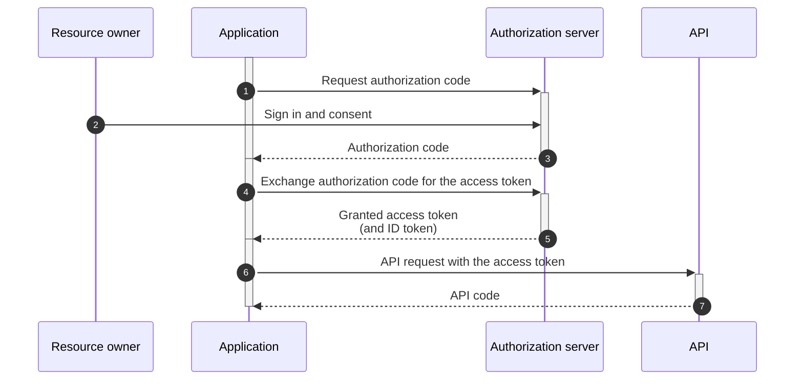

**Learn more:** [Microsoft identity platform and authorization code flow](https://learn.microsoft.com/en-us/entra/identity-platform/v2-oauth2-auth-code-flow)

<a id="implicit-grant"></a>
## Implicit grant

In this flow, you have to interact as part of the sign-in process to approve that the application can get a token on your behalf. This token is time-limited, but the application will **NOT** get a **refresh token**. When the token expires, the application has to recheck with Microsoft Entra ID (ME-ID) to see if you are signed in to ME-ID in your browser. If not, it will prompt you to sign in again. If you're signed in and the session hasn't timed out (dependent on the organization's security policies), the application will silently get another token in the background.

The implicit grant is similar to the authorization code grant, with two distinct differences.

- Firstly, it's intended for user-agent-based clients (such as single-page web apps) that can't keep a client secret because all the application code and storage are easily accessible.

- Secondly, instead of the authorization server returning an authorization code that's exchanged for an access token, the authorization server returns an access token.

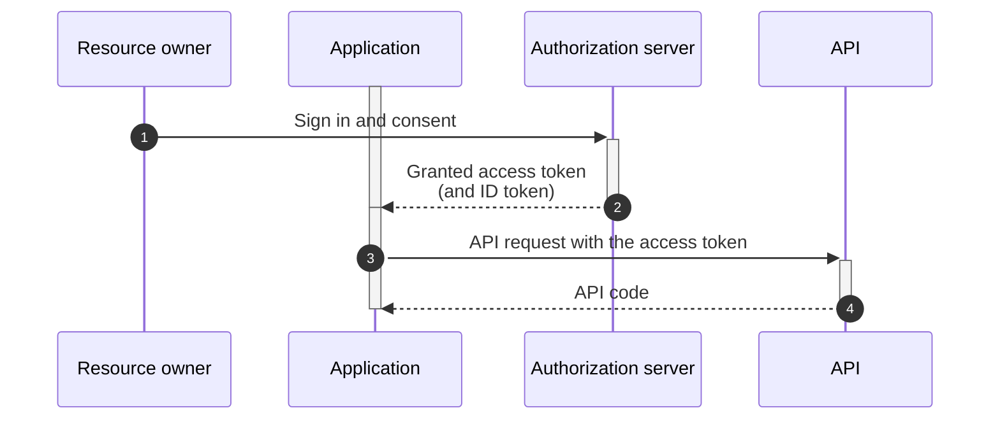

**Learn more:** [Microsoft identity platform and implicit grant flow](https://learn.microsoft.com/en-us/entra/identity-platform/v2-oauth2-implicit-grant-flow)

<a id="client-credentials-grant"></a>
## Client credentials grant

Use this type of grant when authentication of **system-to-system** communications is required and where a user's specific permission isn't required to perform its functions. Applications must authenticate before writing data to CDF. For example, you have a Python script running locally on your computer, it's secure, and has a start and a stop time. However, you expect it to run for several hours, so you don't want to sit there and wait. You also don't want it to run as you since it will only operate on some of the data in CDF, and you want to ensure that the script runs with the least number of privileges to avoid that something bad happens if you have made a mistake in the script.

In the client credentials grant flow the ME-ID app registration gives you a **client id** and a **client secret**. You configure your application with these values, and the application interacts with the CDF project and the ME-ID instance to get a time-limited token. As long as you secure your script, intercepting the communications will only yield a token that's not valid for long. The Python app also gets a **refresh token** that it can use to get a new token. This can continue for days and months.

This grant type is critical to successfully implement userless software services such as extractors, as they meet the need for these applications to be able to authenticate without any user interaction (beyond the initial configuration).

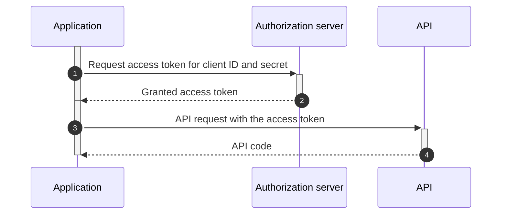

**Learn more:** [Microsoft identity platform and client credentials flow](https://learn.microsoft.com/en-us/entra/identity-platform/v2-oauth2-client-creds-grant-flow)

<a id="on-behalf-of-flow"></a>
## On-behalf-of flow

This flow allows an application to delegate your access for CDF to run some computation (such as a transformation or function). Because it's associated with your identity, the access will be a subset of yours and is explicitly authorized by you.

For an application to invoke this flow:

1. You interactively start an **on-behalf-of** flow using a special API in CDF from the application. CDF will use your identity against your IdP in an OAuth2 flow and send you back an interim token called a **nonce**.

1. You must supply this nonce to the transformation or function, which will then connect to the started flow and get a token, and be allowed to refresh tokens on your behalf.

The time allowed for the function or transformation to complete can vary, but you can set it to an hour, a day, or even a week or longer.

Usually, this two-step process happens in the background for you. It's essential to understand that as opposed to the "client credentials" case, you need to be present and approve at the start of this process, and the app or script will run with your access rights, not their own like for the client credentials case.

**Learn more:** [Microsoft identity platform and on-behalf-of flow](https://learn.microsoft.com/en-us/entra/identity-platform/v2-oauth2-on-behalf-of-flow)


<!-- SOURCE_END: docs.cognite.com/docs\cdf\access\concepts\authentication_flows_oidc.mdx -->

================================================================================


<!-- SOURCE_START: docs.cognite.com/docs\cdf\access\concepts\best_practices_oidc.mdx -->
## File: docs.cognite.com/docs\cdf\access\concepts\best_practices_oidc.mdx

---
title: 'Design principles and best practices'
description: 'Design principles and best practices for managing authentication and authorization in Cognite Data Fusion (CDF).'
content-type: 'concept'
audience: administrator
experience-level: 100
lifecycle: use
article-type: article
---
By connecting CDF to your identity provider (IdP), you can use the IdP framework to manage access to CDF data securely.

This article explains the [design principles](#design-principles-openid-connect-and-cdf) and [best practices](#best-practices-register-applications-and-set-up-groups) to manage access to CDF.

<a id="design-principles-openid-connect-and-cdf"></a>
## Design principles: OpenID Connect and CDF

This section outlines the design principles to manage access to CDF.

<a id="authentication-and-applications"></a>
### Authentication and applications

**Authentication** is about determining the identity of a person or application trying to access a resource. It establishes if they are who they say they are.

Applications and users need to get a **token** from the IdP to authenticate and get access to CDF. The token is a very targeted key that grants access to an identity (a **user identity** for people, a **service principal** for applications.)

<a id="authorization-and-groups"></a>
### Authorization and groups

**Authorization** is about determining what level of access an authenticated person or application has. It specifies what data they're allowed to access and what they can do with it.

Access to CDF data and capabilities in CDF projects are governed by policies defined in the customer's IdP and by resolving the policies into one or more CDF groups where the access scope is defined. The policies are specified in the claims in the tokens that the IdP issues.

You can configure CDF groups to use any OAUTH v2.0 claim to determine access. The most commonly used claim type is `groups`, which is also the claim type recommended by Cognite.

You need to create AD groups to govern access rights to CDF for applications (service principals). For each security group a service principal is a member of, a groups claim is created and entered into an access token for the service principal.

<Warning>
**Group membership limits**

In larger organizations, the number of groups a principal is a member of may exceed the limit of 200 groups that AAD will add to a token.

To resolve the issue, you need to configure your CDF project to call the MS Graph groups endpoint to obtain group information for the principal:

1. Sign in to CDF as an admin and navigate to **Admin** > **OpenID Connect**.
2. In the **Token URL** field, enter `https://login.microsoftonline.com/$TENANT_ID/oauth2/v2.0/token`.

      Where `$TENANT_ID` is the ID of your Microsoft Entra ID tenant.

3. Select **Save configuration**.
</Warning>
{/*
#### CDF group mappings for service applications

The configuration tasks to provide the appropriate claims and claim values for **service applications** can vary between IdPs. The relationships between the entities illustrated above describe the principle you should apply.


To use the most appropriate object (security groups) attributes to populate a groups claim's value, the service application must be associated with the security group. The configuration method to achieve this varies between Microsoft Entra ID and on-premises AD/ADFS. However, the principle outlined above remains the same.

#### CDF group mappings for users

In large organizations, **users** are likely to be members of multiple security groups.


CDF has a limit of 50 groups claims in a single access token. You may need to define rules on the IdP to limit the number of claims that are entered into the token. You should create rules that filter the CDF-specific security groups such that only claims values relevant to CDF are included in the access token.  */}

<a id="best-practices-register-applications-and-set-up-groups"></a>
## Best practices: Register applications and set up groups

This section outlines the best practices for registering and configuring applications to **authenticate** with CDF. You'll also find information about setting up groups to **authorize** what data users and applications can access and what they can do with the data.

<a id="register-and-configure-applications-for-authentication"></a>
### Register and configure applications for authentication

The general rules for applications are:

- **Service applications** (applications that have no human interaction, for example extractors) use the [client credentials](/cdf/access/concepts/authentication_flows_oidc#client-credentials-grant) authentication flow. Service applications are sometimes referred to as _daemon applications_. You need to register each service application separately to provide specific access for different service applications and distinguish between security contexts.

- **User applications** (applications that require human interaction, for example the CDF application, connectors, and web applications) use either the [authorization code grant](/cdf/access/concepts/authentication_flows_oidc#authorization-code-grant) flow or the [implicit grant](/cdf/access/concepts/authentication_flows_oidc#implicit-grant) flow, depending on the implementation choices of the client application. Where supported, you should use **PKCE**.

Visit [Register and configure applications and components](/cdf/access/entra/guides/configure_apps_oidc) to find the detailed configuration and registration steps for Cognite apps and components.

<Warning>
When you register applications using the **client credentials** flow, you should **NOT** share client IDs and secrets across multiple applications, even if the applications have common authentication requirements in CDF. Sharing client IDs and secrets across multiple applications can cause issues with audit logs, with events from multiple entities being identified under a common client ID. The applications may also be subject to rate-limiting.
</Warning>
{/*
### Set up groups for authorization

| I want to set up                                                                                                                                                                                                                                                                           | Do this                                                                                                                       |
| ------------------------------------------------------------------------------------------------------------------------------------------------------------------------------------------------------------------------------------------------------------------------------------------ | ----------------------------------------------------------------------------------------------------------------------------- |
| <ul><li>Generic read/write access to assets, time series, events, sequences, files, and RAW</li><li>Scoped access to through data sets, one group per dataset or related datasets.</li><li>Scoped access to CDF RAW databases and tables (access to certain databases or tables)</li></ul> | Create an AD group per a distinct set of capabilities, and assign group memberships to the service principal in AD.           |
| <ul><li>Extractor type and data source</li><li>Scheduled scripts</li><li>Transformations, split into multiple for different transformation categories / use cases</li><li>Cognite Functions - long-running scheduled functions (split per needed access)</li></ul>                         | Create one AD group per service principal and assign the CDF linked group the capabilities required by the service principal. |  */}


<!-- SOURCE_END: docs.cognite.com/docs\cdf\access\concepts\best_practices_oidc.mdx -->

================================================================================


<!-- SOURCE_START: docs.cognite.com/docs\cdf\access\concepts\concepts.mdx -->
## File: docs.cognite.com/docs\cdf\access\concepts\concepts.mdx

---
title: 'Access management concepts'
description: 'Main concepts in securely managing access to the Cognite applications and the data stored in your Cognite Data Fusion (CDF) projects.'
content-type: 'concept'
audience: administrator
experience-level: 100
lifecycle: use
article-type: article
---
<a id="organizations-clusters-and-projects"></a>
## Organizations, clusters, and projects

When you subscribe to CDF and connect to and use our cloud-based apps and services, you'll manage a CDF **organization**. An organization is a collection of CDF **projects**, and the data in one project is **completely isolated** from the data in other projects.

Depending on your existing infrastructure and needs, you decide which **cluster** to run your CDF organization in. A cluster determines which **cloud provider** to use; Microsoft Azure, Amazon Web Services (AWS), or Google Cloud Platform (GCP). Each provider has [different clusters](/cdf/admin/clusters_regions#cognite-multi-tenant-clusters) to store data in your preferred **region**, such as North America, Asia, or Europe.

Also, you can choose between a **multi-tenant** or a **dedicated** cluster:

- In a **multi-tenant** cluster, you share cloud storage and computing resources with other Cognite tenants.

- In a **dedicated** cluster, your organization uses cloud storage and computing resources exclusively. To request a dedicated cluster, contact your Cognite representative.

You can configure your organization to use your existing **identity provider (IdP)** &mdash; for example, Microsoft Entra ID, Amazon Cognito, or Auth0 &mdash; to manage access to your CDF projects. Only users registered in your IdP can sign in to the organization and the projects. Each CDF organization can be configured with **only one** identity provider. **All** projects in the organization are automatically configured to use the identity provider configured for the organization.

<Frame>

</Frame>

When users sign in to their organization, they see a list of the projects they can access.

<Note>
For a project to appear in the list of available projects, a user needs to be a member of at least one group in the project.
</Note>

The first time users sign in to their organization, CDF creates an organization **user profile** for them from the information in the IdP. The profile typically includes the user's first and last name, email, and job title.

<a id="principals-user-accounts-and-service-accounts"></a>
## Principals, user accounts, and service accounts

**Principal** is an umbrella term for **user accounts** and **service accounts**. Both entities can be uniquely identified, authenticated, and authorized in CDF. Principals are unique within an organization and not within a project in the organization. Principals can access data and create and run processes (transformations, Functions) in a CDF project.

- A **user account** is associated with a **person** who wants to interact with CDF. Each user account has a user profile containing a unique user ID.

- A **service account** is associated with an **application** or **process** that wants to interact with CDF, such as an extractor or Cognite Functions, rather than a person.

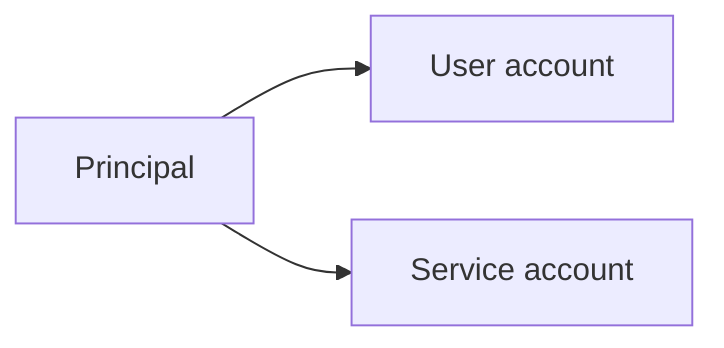

<a id="capabilities-and-groups"></a>
## Capabilities and groups

**Capabilities** define what permissions principals (user accounts and service accounts) have to work with different **data** resources in a CDF project, for example, if they can read a time series (`timeseries:read`). Capabilities also decide which **features** they have access to. For instance, they need the `3d:create` capability to upload 3D models to CDF.

<Frame>

</Frame>

A capability is defined by a **resource type**, a **scope**, and **actions**. The resource type and scope define **the data** the capability applies to, while the action represents **the operations** you can perform.

Instead of assigning capabilities to individual users and applications, you use **groups** in CDF to define what capabilities members (user accounts or service accounts) have.

You can manage group membership with your identity provider (IdP), CDF, or a combination of both.

<a id="cdf-administrators"></a>
## CDF administrators

CDF has two levels of administrators (admins):

- **Organization (org) admins** can update the identity provider (IdP) configured for the organization.

- **Project admins** can create new groups and add or remove capabilities and scopes from groups in a project. Typically, they're members of a group with the `groups:create` and `groups:delete` capabilities.

<a id="cdf-audit-logs"></a>
## CDF audit logs

You can control access to the Cognite API through group membership. When a principal makes a request to the API, it's captured in the CDF audit logs. The CDF audit logs contain the following information:

- Who: principal ID (user or service account)
- When: timestamp
- What: project name, request URL, group IDs
- Where: CDF headers in the request (`x-cdp-sdk`, `x-cdp-app`, `x-cdp-clienttag`)

Audit logs contain detailed information from all valid access tokens used to make the requests. They are stored for 400 days and can be requested in case of a security incident.


<!-- SOURCE_END: docs.cognite.com/docs\cdf\access\concepts\concepts.mdx -->

================================================================================


<!-- SOURCE_START: docs.cognite.com/docs\cdf\access\concepts\minimum_idp_requirements.mdx -->
## File: docs.cognite.com/docs\cdf\access\concepts\minimum_idp_requirements.mdx

---
title: 'Minimum IdP requirements'
description: 'Identity provider requirements to access Cognite Data Fusion (CDF).'
content-type: 'reference'
audience: administrator
experience-level: 100
lifecycle: use
article-type: article
---
The IdP must issue access tokens that the Cognite API can validate. The access tokens must be a valid [JWT](https://datatracker.ietf.org/doc/html/rfc7519), signed using RS256, with a public key at the location specified by the JWKS URL. Also, the IdP must have a JWKS URL that's reachable by the Cognite API, and respond to requests for the JWKS end or the token endpoint within 1 second, as measured from the Cognite API. Contact Cognite to have the JWKS URL added to the list of allowed JWKS URLs.

The IdP must support the following [OAuth 2.0](https://oauth.net/2) flows:

- [Client credentials](https://learn.microsoft.com/en-us/entra/identity-platform/v2-oauth2-client-creds-grant-flow)
- [Auth code grant](https://learn.microsoft.com/en-us/entra/identity-platform/v2-oauth2-auth-code-flow)

<a id="tokens-and-claims"></a>
## Tokens and claims

Within a token, there are multiple **claims** used to assert pieces of information about a subject. Tokens issued to authenticate and authorize a subject to access CDF should contain the following claims, some are reserved, and the others are custom configured. See [this article](https://auth0.com/docs/tokens/json-web-tokens/json-web-token-claims) for more information about tokens and claims.

The table below shows the minimum claims required in a token for CDF to authenticate and authorize the subject, if you are using **Microsoft Entra ID** as your IdP.

| Claim    | Required?                     | Description                                                                                 | Expected value                                           |
| -------- | ----------------------------- | ------------------------------------------------------------------------------------------- | -------------------------------------------------------- |
| `aud`    | Must                          | Audience of the JWT (intended recipient).                                                   | URI of the service requiring authentication.             |
| `exp`    | Must                          | Expiration time of the JWT.                                                                 | Datetime stamp.                                          |
| `iat`    | Must                          | Issued at Time of the JWT.                                                                  | Datetime stamp.                                          |
| `iss`    | Must                          | Issuer of the JWT.                                                                          | URI and path from the IdP from which the JWT was issued. |
| `sub`    | Must                          | Subject of the JWT (the user).                                                              | User name from IdP.                                      |
| `kid`    | Should                        | Key identifier.                                                                             | RS256                                                    |
| `nbf`    | Should                        | Not Before Time of the JWT (before which the token shouldn't be accepted).                  | Datetime stamp.                                          |
| `scp`    | Should (strongly recommended) | Scope of the JWT (attribute inherited from the scopes defined for the subject in the IdP).  | Text field.                                              |
| `groups` | Should (strongly recommended) | Groups of the JWT (attribute inherited from the groups defined for the subject in the IdP). | Object ID of a security group.                           |


<!-- SOURCE_END: docs.cognite.com/docs\cdf\access\concepts\minimum_idp_requirements.mdx -->

================================================================================


<!-- SOURCE_START: docs.cognite.com/docs\cdf\access\entra\guides\add_service_principal.mdx -->
## File: docs.cognite.com/docs\cdf\access\entra\guides\add_service_principal.mdx

---
title: 'Add a service account to a CDF group'
description: 'Create a client secret in Microsoft Entra ID and add the service principal to a Cognite Data Fusion (CDF) group.'
content-type: 'procedure'
audience: administrator
experience-level: 100
lifecycle: use
article-type: article
---
<a id="create-a-client-secret-in-microsoft-entra-id"></a>
## Create a client secret in Microsoft Entra ID

<Steps>
<Step title="Sign in to the Azure portal">
Sign in to the [Azure portal](https://portal.azure.com) as an admin.
</Step>

<Step title="Select a tenant">
If you have access to multiple tenants, use the Directory + subscription filter in the top menu to select the tenant in which you want to register an application.
</Step>

<Step title="Select Microsoft Entra ID">
Search for and select **Microsoft Entra ID**.
</Step>

<Step title="Navigate to New registrations">
Under **Manage**, select **App registrations** > **New registrations**.
</Step>

<Step title="Register an application">
In the **Register an application** window, enter the app name, and then select **Register**.
</Step>

<Step title="Select name and type">
Specify the **name** and select the supported **account types**.
</Step>

<Step title="Copy the Application (client) ID">
Copy and make a note of the **Application (client) ID**. This value is required for authentication.
</Step>

<Step title="Create a client secret">
1. Under **Manage**, select **Certificates & secrets** > **New client secret**.

<Frame>

</Frame>

2. Enter a client secret description and an expiry time, and then select **Add**.
</Step>

<Step title="Copy the client secret">
Copy and make a note of the client secret in the **Value** field.

<Warning>
Make sure you copy this value now. This value will be hidden after you leave this page.
</Warning>
</Step>
</Steps>

<a id="add-the-service-principal-to-a-cdf-group"></a>
## Add the service principal to a CDF group

<Warning>
You need to link your newly created app in Microsoft Entra ID to a group in CDF. For more information, see [Create a group in CDF and link it to Microsoft Entra ID group](/cdf/access/entra/guides/create_groups_oidc#step-2-create-a-group-in-cdf-and-link-it-to-the-azure-ad-group).
</Warning>

<Steps>
<Step title="Navigate to Microsoft Entra ID group">
To add the service principal, navigate to your Microsoft Entra ID group.
</Step>

<Step title="Navigate to Add members">
Under **Manage**, select **Members** > **Add members**.

<Frame>

</Frame>
</Step>

<Step title="Add members">
Search for your service principal in the search box and **Select**.

<Frame>

</Frame>
</Step>

<Step title="Verify members added">
Verify that the service principal is added to your Microsoft Entra ID group.

The service principal, as a member of the Microsoft Entra ID group, is automatically a member of the linked CDF group with the associated capabilities.

<Tip>
For more information on service principals, see [How to create a service principal](https://learn.microsoft.com/en-us/entra/identity-platform/howto-create-service-principal-portal).
</Tip>
</Step>
</Steps>


<!-- SOURCE_END: docs.cognite.com/docs\cdf\access\entra\guides\add_service_principal.mdx -->

================================================================================


<!-- SOURCE_START: docs.cognite.com/docs\cdf\access\entra\guides\configure_apps_oidc.mdx -->
## File: docs.cognite.com/docs\cdf\access\entra\guides\configure_apps_oidc.mdx

---
title: 'Register and configure applications and components'
description: 'The table below lists applications and components with links to configuration steps and details about the authentication flows they use.'
content-type: 'reference'
audience: administrator
experience-level: 100
lifecycle: use
article-type: article
---
| Application configuration steps                                                                                                                                      | Authentication flow                                                                                                                                                                                                                                                                            | Client secret required? | Microsoft Entra ID multi-tenant | Comments                                                                                                                                                                                                                                                                                                                                                                                                                      |
| -------------------------------------------------------------------------------------------------------------------------------------------------------------------- | ---------------------------------------------------------------------------------------------------------------------------------------------------------------------------------------------------------------------------------------------------------------------------------------------- | ----------------------- | ------------------------------- | ----------------------------------------------------------------------------------------------------------------------------------------------------------------------------------------------------------------------------------------------------------------------------------------------------------------------------------------------------------------------------------------------------------------------------- |
| [The CDF application, InField, Maintain](/cdf/access/entra/guides/configure_cdf_azure_oidc#step-2-register-a-cognite-application-in-azure-ad) | [Authorization code grant](/cdf/access/concepts/authentication_flows_oidc#authorization-code-grant)                                                                                                                                                                                                  | N                       | Y                               | The registration is automatically created when signing in. Needs administrator consent.                                                                                                                                                                                                                                                                                                                                       |
| [Cognite extractors/ scheduled custom scripts](/cdf/integration/guides/extraction/admin_oidc)                                                                    | [Client credentials](/cdf/access/concepts/authentication_flows_oidc#client-credentials-grant)                                                                                                                                                                                                        | Y                       | N                               | One app registration per extractor/script and environment (for example, _dev_, _test_, _prod_).                                                                                                                                                                                                                                                                                                                               |
| [CDF Transformations](/cdf/integration/guides/transformation/admin_oidc)                                                                                         | <ul><li>[Client credentials](/cdf/access/concepts/authentication_flows_oidc#client-credentials-grant)</li><li>[On behalf of](/cdf/access/concepts/authentication_flows_oidc#on-behalf-of-flow)<sup>\*</sup></li></ul>                                                                                      | Y\*                     | N                               | Needs multiple app registrations. Transformations that logically belong together (access rights are managed together) can share the app registration but may be subject to rate-limiting. <p></p>\* Time-limited jobs can run on behalf of a user.                                                                                                                                                                            |
| [Cognite Data Source for Grafana](/cdf/dashboards/guides/grafana/admin_oidc)                                                                                     | <ul><li>[Authorization code grant](/cdf/access/concepts/authentication_flows_oidc#authorization-code-grant)</li><li>[Client credentials](/cdf/access/concepts/authentication_flows_oidc#client-credentials-grant)</li></ul>                                                                                | Y                       | N                               | The Cognite Data Source for Grafana uses Grafana credentials to connect to CDF. Therefore, you need to set up the Grafana instance to authenticate the user towards the same identity provider (IdP) as your CDF project. <p></p> Alternatively, you can provide client credentials for each instance of the Cognite Data Source.                                                                                             |
| [Cognite Power BI connector](/cdf/dashboards/guides/powerbi/admin)                                                                                               | [Authorization code grant](/cdf/access/concepts/authentication_flows_oidc#authorization-code-grant)                                                                                                                                                                                                  | N                       | Y                               | The registration is automatically created when signing in. Needs administrator consent. <p></p> The Cognite Power BI connector and Excel both use the Microsoft Power Query for Excel enterprise application to retrieve data from CDF. If your organization is using both the Cognite Power BI connector app and Excel to retrieve data from CDF, you only need to register Microsoft Power Query for Excel for one of them. |
| [Excel](/cdf/dashboards/guides/powerbi/admin)                                                                                                                     | [Implicit grant](/cdf/access/concepts/authentication_flows_oidc#implicit-grant)                                                                                                                                                                                                                      | N                       | Y                               | The registration is automatically created when signing in. Needs administrator consent.                                                                                                                                                                                                                                                                                                                                       |
| [Custom web applications](/cdf/access/entra/guides/register_custom_webapp)                                                                                                                 |                                                                                                                                                                                                                                                                                                | N                       | N                               | Redirect URI of type _Web_.                                                                                                                                                                                                                                                                                                                                                                                                   |
| [Desktop apps/ Postman/Python SDK/Jupyter/ One-off/short-term scripts](/dev/sdks/python/register_app_jupyter_sdk)                 | <ul><li>[Implicit grant](/cdf/access/concepts/authentication_flows_oidc#implicit-grant)</li><li>[Client credentials](/cdf/access/concepts/authentication_flows_oidc#client-credentials-grant)</li><li>[Authorization code grant](/cdf/access/concepts/authentication_flows_oidc#authorization-code-grant)</li></ul> | N                       | N                               | Redirect URI of type InstalledClient (Mobile / Desktop application). Users can sign in using their browser and use the acquired token in, for example Jupyter.                                                                                                                                                                                                                                                                |

<Warning>
When you register applications using the **client credentials** flow, you should **NOT** share client IDs and secrets across multiple applications, even if the applications have common authentication requirements in CDF. Sharing client IDs and secrets across multiple applications can cause issues with audit logs, with events from multiple entities being identified under a common client ID. The applications may also be subject to [rate-limiting](/dev/concepts/resource_throttling#rate-limiting).
</Warning>


<!-- SOURCE_END: docs.cognite.com/docs\cdf\access\entra\guides\configure_apps_oidc.mdx -->

================================================================================


<!-- SOURCE_START: docs.cognite.com/docs\cdf\access\entra\guides\configure_cdf_azure_oidc.mdx -->
## File: docs.cognite.com/docs\cdf\access\entra\guides\configure_cdf_azure_oidc.mdx

---
title: 'Register core Cognite apps'
description: 'Register the Cognite API and applications in Microsoft Entra ID for organizational sign-in.'
content-type: 'procedure'
audience: administrator
experience-level: 100
lifecycle: use
article-type: article
---
To allow users to sign in to Cognite Data Fusion (CDF) and Cognite apps with their existing organizational ID, you first need to **register the Cognite API** and permit it to access user profiles in your Microsoft Entra ID tenant. You then **register the applications** you want to allow users to access.

As an Microsoft Entra ID (ME-ID) administrator, you can consent for your entire organization to use Cognite Data Fusion (CDF) and other Cognite applications. Users can sign in to CDF and Cognite applications with their organizational identity without having to consent.

<a id="register-cdf-and-cognite-apps-in-microsoft-entra-id"></a>
## Register CDF and Cognite apps in Microsoft Entra ID

<Info>
To perform the steps below, you must be a Microsoft Entra ID administrator.
To register the Cognite API, the Microsoft Entra ID administrator should set up Postman and follow the [authorization process](/dev/guides/postman).
</Info>

<a id="step-1"></a>
### Step 1: Permit the Cognite API to access user profiles in Microsoft Entra ID

<Steps>
<Step title="Navigate to the admin consent URL">

In your browser, make sure that you've signed in to Microsoft Entra ID as the tenant administrator, and then navigate to:

```text
https://login.microsoftonline.com/YOUR_ME-ID_TENANT_ID/adminconsent?client_id=YOUR_CDF_CLUSTER_URL
```

Where:
- `YOUR_ME-ID_TENANT_ID` is the ID of your Microsoft Entra ID tenant. To find your tenant ID, see [this article.](https://learn.microsoft.com/en-us/entra/identity-platform/application-consent-experience)
- `YOUR_CDF_CLUSTER_URL` is usually equal to the fully-qualified URL: `https://<clustername>.cognitedata.com`. If you don't know the cluster name, contact [Cognite support](https://cognite.zendesk.com/hc/en-us/requests/new).

<Accordion title="Example">
If you have the following:
- `YOUR_ME-ID_TENANT_ID=12345678-1234-1234-1234-123456789012`; and
- `YOUR_CDF_CLUSTER=mycluster`,

Then you'll have to navigate to the following URL:

- https://login.microsoftonline.com/12345678-1234-1234-1234-123456789012/adminconsent?client_id=https://mycluster.cognitedata.com
</Accordion>
</Step>

<Step title="Confirm the account">
If prompted, confirm the account you want to use to consent to the request.
</Step>

<Step title="Review and accept">
Review and accept the permission request information, and select **Accept**.

For more information, see [Understanding Microsoft Entra ID application consent experiences](https://learn.microsoft.com/en-us/entra/identity-platform/application-consent-experience).

<Frame>

</Frame>

<Info>
You can safely ignore any HTTP 400 errors you receive.
</Info>
</Step>
</Steps>

You have now permitted the Cognite API to access user profiles in your Microsoft Entra ID and can register applications you wish to authorize to access the API.

<Tip>
If you try to sign in to CDF without these permissions, you'll get an error message. The message states which cluster you're in and provides links to install and consent.
</Tip>

<a id="step-2"></a>
### Step 2: Register a Cognite application in Microsoft Entra ID

<Steps>
<Step title="Navigate to the application URL">
In your browser, make sure that you've signed in to Microsoft Entra ID as the tenant administrator, and then navigate to the URL of the application you want to register:

   - Cognite Data Fusion: [https://fusion.cognite.com.](https://fusion.cognite.com) _(used in the steps below)_
   - Cognite InField: [https://cognite-infield.cogniteapp.com.](https://cognite-infield.cogniteapp.com)

If your application instance is installed in a separate cluster, you need to specify the `[.cluster]`. If you don't know the cluster name, contact [Cognite support](https://cognite.zendesk.com/hc/en-us/requests/new).
</Step>

<Step title="Confirm the account">
If prompted, confirm the account you want to use to consent to the request.
</Step>

<Step title="Sign in with Entra ID">
Specify your **Organization** (cluster) and then select **Sign in with Entra ID**.
</Step>

<Step title="Review and accept">
Review and accept the permission request on behalf of your organization, and then select **Accept**.

<Frame>

</Frame>

If the registration is successful, you are signed in to the Cognite application.
</Step>

<Step title="Verify the configuration">
Sign in with a non-admin identity to confirm that regular users in your Microsoft Entra ID can access the application.
</Step>
</Steps>

You have now registered the Cognite application in your Microsoft Entra ID, and users can sign in to the application with their Microsoft Entra ID username and password without having to consent themselves.


<!-- SOURCE_END: docs.cognite.com/docs\cdf\access\entra\guides\configure_cdf_azure_oidc.mdx -->

================================================================================


<!-- SOURCE_START: docs.cognite.com/docs\cdf\access\entra\guides\create_groups_oidc.mdx -->
## File: docs.cognite.com/docs\cdf\access\entra\guides\create_groups_oidc.mdx

---
title: 'Manage groups and group membership'
description: 'Create groups in Cognite Data Fusion (CDF) and link them to Microsoft Entra ID groups to manage group membership.'
content-type: 'procedure'
audience: administrator
experience-level: 100
lifecycle: use
article-type: article
---
Instead of assigning capabilities to individual users and applications, you use **groups** in CDF to define what **capabilities** members (users or applications) have to work with different CDF resources.

You can manage CDF group **membership** from your identity provider - Microsoft Entra ID.

<a id="step-1"></a>
## Step 1: Create a group in Microsoft Entra ID

<Steps>
<Step title="Sign in to the Azure portal">
Sign it to your Azure portal > Search for and select **Microsoft Entra ID**.
</Step>

<Step title="Navigate to New group">
Under **Manage**, select **Groups** > **New group**.
</Step>

<Step title="Create a group">
In the New Group window, select **Security** as the **Group type**, enter a **Group name**, and then select **Create**.

<Frame>

</Frame>
</Step>

<Step title="Add members">
Select the group to open it, add **members** - users or service accounts, to the group (service accounts are called applications).
</Step>

<Step title="Copy the Object Id">
Copy and make a note of the **Object Id**.

<Frame>

</Frame>
</Step>
</Steps>

<a id="step-2"></a>
## Step 2: Create a group in CDF and link it to the Microsoft Entra ID group

<Steps>
<Step title="Sign in to Cognite Data Fusion">
Sign in to [Cognite Data Fusion](https://fusion.cognite.com) as an admin.
</Step>

<Step title="Create a group">
Select the **Admin** workspace, and then **Access management** > **Groups** > **Create group**.
</Step>

<Step title="Configure the group">
Enter a **Unique name** for the group and **Add capabilities**.
</Step>

<Step title="Link the group">
In **Members** select **Externally managed**, and in the **Source ID** field, enter the **Object Id** for the Microsoft Entra ID (ME_ID) group exactly as it exists in ME-ID. It will link the CDF group to an Azure AD group.

<Frame>

</Frame>
</Step>

<Step title="Link the group to an application">
In the **Application (Client) ID** dropdown, select the existing or create a new Application (Client) ID to link groups to specific applications to improve query efficiency. Application (Client) ID is a unique public identifier for an application registered with an authorization server. You can set more than one Application (Client) ID for a group.

When users make a query to CDF, their Effective Access (EA) is determined by the union of all capabilities and scopes from the groups they're members of. When users make a query from an application, only the groups linked to that application are considered for EA.

<Info>
This feature is currently supported only for CDF organizations configured with Microsoft Entra ID as their identity provider (IdP).
</Info>

<Warning>
If a group isn't linked to any application and the user is a member of that group, the group is considered for all queries, regardless of the application used.

If a service account is a member of a group, and the group is linked to an Application (Client) ID different from the service account's client ID, the group is ignored.
</Warning>
</Step>

<Step title="Select Create">

The members of the Microsoft Entra ID group automatically become members of the linked CDF group with the associated capabilities.
</Step>
</Steps>


<!-- SOURCE_END: docs.cognite.com/docs\cdf\access\entra\guides\create_groups_oidc.mdx -->

================================================================================


<!-- SOURCE_START: docs.cognite.com/docs\cdf\access\entra\guides\register_custom_webapp.mdx -->
## File: docs.cognite.com/docs\cdf\access\entra\guides\register_custom_webapp.mdx

---
title: 'Register a custom web app in Microsoft Entra ID'
description: 'Register a custom web application in Microsoft Entra ID for user authentication.'
content-type: 'procedure'
audience: administrator
experience-level: 100
lifecycle: use
article-type: article
---
Users can sign in to the web app using their browser and the acquired token.

<a id="register-a-custom-web-app"></a>
## Register a custom web app

<Steps>
<Step title="Sign in to the Azure portal">
Sign in to the [Azure portal](https://portal.azure.com) as an admin.
</Step>

<Step title="Select a tenant">
If you have access to multiple tenants, use the Directory + subscription filter in the top menu to select the tenant in which you want to register an application.
</Step>

<Step title="Select Microsoft Entra ID">
Search for and select **Microsoft Entra ID**.
</Step>

<Step title="Navigate to New registrations">
Under **Manage**, select **App registrations** > **New registrations**.
</Step>

<Step title="Select name and type">
Specify the **name** and select an **account type**. Select the first option unless your organization's preferences specify otherwise.
</Step>

<Step title="Select redirect URI">
Under **Redirect URI (optional)**, select **Web** and specify the **redirect URI**. Typically, this is the URL of your web app, or [localhost](#) for development. You can add more **redirect URIs** under **Manage** > **Authentication**.
</Step>

<Step title="Select Register">

<Frame>

</Frame>

Under **Overview**, you can copy and make a note of the **Application (client) ID**. You need this value for authentication.
</Step>
</Steps>

<a id="create-a-client-secret"></a>
## Create a client secret

<Steps>
<Step title="Navigate to New client secret">
Under **Manage**, select **Certificates & secrets** > **New client secret**.
</Step>

<Step title="Configure the client secret">
Enter a description and how long the client secret will be valid. Then, select **Add**.
</Step>

<Step title="Copy the client secret">
Copy and make a note of the client secret in the **Value** field.

<Info>
Make sure you copy this value now. This value will be hidden after you leave this page.
</Info>

<Frame>

</Frame>
</Step>
</Steps>

<a id="configure-api-permissions"></a>
## Configure API permissions

<Steps>
<Step title="Navigate to API permissions">
Under **Manage**, select **API permissions**. The Microsoft Graph `User.Read` permissions should already be selected.
</Step>

<Step title="Select the Cognite API">
Select **+ Add a permission**. In the side panel, open the **APIs my organization uses** tab, and select the Cognite API, for example `westeurope-1`.
</Step>

<Step title="Select application permissions">
For **Delegated permissions**, select the required permissions for your application, for example `user_impersonation`. The delegated permissions filter the permissions a user has based on group memberships, but don't add any permissions.

To use the [token inspection endpoint](https://api-docs.cognite.com/20230101/tag/Token/operation/inspectToken), select `IDENTITY`.

Learn more about the available permissions [here](/cdf/access/concepts/access_token_scopes).
</Step>

<Step title="Add permissions">
Select **Add permissions**. The API permissions should look similar to this:

<Frame>

</Frame>
</Step>

<Step title="Grant admin consent">
Select **Grant admin consent for...** and confirm that you want to make the new list of permissions active.
</Step>
</Steps>

<!-- SOURCE_END: docs.cognite.com/docs\cdf\access\entra\guides\register_custom_webapp.mdx -->

================================================================================


<!-- SOURCE_START: docs.cognite.com/docs\cdf\access\guides\capabilities.mdx -->
## File: docs.cognite.com/docs\cdf\access\guides\capabilities.mdx

---
title: 'Assign capabilities'
description: 'Control access to data and features in Cognite Data Fusion (CDF) by assigning capabilities to groups.'
content-type: 'procedure'
audience: administrator
experience-level: 100
lifecycle: use
article-type: article
---
To control access to data and features in Cognite Data Fusion (CDF), you define what **capabilities** users or applications have to work with different **resource types** in CDF, for example, if they can _read_ a _time series_ (`timeseries:read`) or _create_ a _3D model_ (`3D:create`).

Capabilities also decide which **features** you have access to. For example, you need the `3d:create` capability to upload 3D models to CDF.

A capability is defined by a **resource type**, a **scope**, and **actions**. The resource type and scope define **the data** the capability applies to, while the action defines **the operations** you are allowed to perform.

<Frame>

</Frame>

Instead of assigning capabilities to individual users and applications, you use **groups** in CDF to define which capabilities the group members (users or applications) should have. You **link** and synchronize the CDF groups to user groups in your identity provider (IdP), for instance, Microsoft Entra ID or Amazon Cognito.

For example, if you want users or applications to _read_, but not _write_, time series data in CDF, you first create a group in your IdP to add the relevant users and applications. Next, you create a CDF group with the necessary capabilities (`timeseries:read`) and link the CDF group and the IdP group.

You can tag sensitive resources with additional **security categories** for even more fine-grained access control and protection.

This flexibility lets you manage and update your data governance policies quickly and securely. You can continue to manage users and applications in your organization's IdP service outside of CDF.

This article explains how to [add capabilities to groups](#create-a-group-and-add-capabilities), [create and assign security categories](#create-and-assign-security-categories). You will also find overviews of the necessary [capabilities to access and use different features in CDF](#feature-capabilities).

<Info>
For users to successfully sign in and use Fusion UI, the following minimum set of capabilities is required : `projects:list`, `groups:list` and `groups:read`
</Info>

<a id="create-a-group-and-add-capabilities"></a>
## Create a group and add capabilities

<Steps>
<Step title="Navigate to the Groups page">
Navigate to <span class="ui-element">Admin</span> > <span class="ui-element">Groups</span> > <span class="ui-element">Create group</span>.
</Step>

<Step title="Enter a name">
Enter a unique name for the group.
</Step>

<Step title="Add capabilities">

- In the **Capability type** field, select a resource type, such as assets and time series, CDF groups, data sets, or specific functionality.
- In the **Action** field, allow for actions on the data, such as `read`, `write` or `list`.
- In the **Scope** field, scope the access to **all data** or **a subset** within the selected capability type. The subset differs according to the capability type but always includes all data as an option.
</Step>

<Step title="Save the group">
Select **Save**.
</Step>

<Step title="Link the group to your identity provider">
In the **Source ID** field, enter the **Object Id** (Entra ID) or **Group name** (Cognito) exactly as it exists in your identity provider (IdP). It will link the CDF group to a group in Microsoft Entra ID or Amazon Cognito.

<Frame>

</Frame>
</Step>
</Steps>

<a id="create-and-assign-security-categories"></a>
## Create and assign security categories

You can add an extra access level for **time series** and **files** by tagging resources with **security categories** via the Cognite API. This is useful if you want to protect market-sensitive data. To access resources tagged with a security category, you must have both the standard capabilities for the resource type and capabilities for the security category.

To access, create, update, and delete security categories, you need these capabilities via a group membership:

- `securitycategories:create`
- `securitycategories:update`
- `securitycategories:delete`

To assign security categories to groups:

<Steps>
<Step title="Open the group">
Open the group where you want to add security categories.
</Step>

<Step title="Select Security categories">
In the **Capability type** field, select **Security categories**.
</Step>

<Step title="Set the security category">
In the **Action** field, select `securitycategories:memberof`.
</Step>

<Step title="Set the scope">
In the **Scope** field, select **Security categories**, associate a security category or select **All**.
</Step>
</Steps>

To perform actions, such as `read` or `write` on **time series** and **files** tagged with capabilities and security categories:

- You must be a member of a group with actions that give access to a times series or files, for instance, `timeseries:read`.
- You must be a member of a group with the `securitycategories:memberof` capability for the same time series or files.

<a id="share-data-and-mention-coworkers"></a>
## Share data and mention coworkers

User profiles let users share data and mention (@name) coworkers. By default, CDF will collect user information, such as name, email, and job title.

All users with **any** group membership in a CDF project get the `userProfilesAcl:READ` capability and can search for other users.

{/* ## Grant access to CDF data

[_arne: do we need this?_]


You grant access and allow actions on the **data** by defining capabilities on the **CDF resource types** listed in the **Add capability** window. You can set actions for all data in the selected resource type or for a specific data set. See best practices [here](/cdf/access/concepts/best_practices_oidc#best-practices-register-applications-and-set-up-groups). */}

<a id="feature-capabilities"></a>
## Feature capabilities

The tables below describe the necessary capabilities to access different CDF features.

<Note>
In addition to the capabilities listed in the sections below, users and applications need these **minimum** capabilities to access any feature in CDF.

| Capability type | Action          | Scope             | Description                                                                                                                                 |
| --------------- | --------------- | ----------------- | ------------------------------------------------------------------------------------------------------------------------------------------- |
| Groups          | `groups:list`   | Current user, All | Verifies user group access.                                                                                                                 |
| Projects        | `projects:list` | All               | Verifies that a user or application has access to a CDF project. To access the resources in the project, see the capabilities listed below. |
</Note>

### Atlas AI

Build and deploy AI agents to automate tasks and workflows.

| Capability type      | Action                                      | Scope | Description                                |
| -------------------- | ------------------------------------------- | ----- | ------------------------------------------ |
| Agents               | `agents:read`, `agents:write`, `agents:run` | All   | Build agents.                              |
| Agents               | `agents:run`, `agents:read`                 | All   | Interact with agents.                      |
| Data models          | `datamodels:read`                           | Space | When using agent tools for data retrieval. |
| Data model instances | `datamodelinstances:read`                   | Space | When using agent tools for data retrieval. |

<Note>
You may need more capabilities depending on the tools used by the agent.
</Note>

<a id="canvas"></a>
### Canvas

Add assets, engineering diagrams, sensor data, images, and 3D models to a canvas.

To set up a canvas and its features, you'll need <span class="ui-element">extended access</span>. To work on a canvas, you'll need <span class="ui-element">end-user access</span>.

<span class="ui-element">Extended access</span>

Users with extended access can set up the <span class="ui-element">Canvas</span> tool, create [threshold rules](/cdf/explore/canvas#set-threshold-rules-beta), and set up [canvas labels](/cdf/configure/canvas_settings):

| Capability type      | Action                                                | Scope                                                                                                                         | Description                                                                                                                                                       |
| -------------------- | ----------------------------------------------------- | ----------------------------------------------------------------------------------------------------------------------------- | ----------------------------------------------------------------------------------------------------------------------------------------------------------------- |
| Data models          | `datamodels:read`, `datamodels:write`                 | `cdf_industrial_canvas`, `cdf_apps_shared`, `IndustrialCanvasInstanceSpace`                                                   | - Scope `IndustrialCanvasInstanceSpace` to set up the <span class="ui-element">Canvas</span> tool. <br></br><br></br> - `datamodels:write` is required to set up the canvas labels feature. |
| Data model instances | `datamodelinstances:read`, `datamodelinstances:write` | `cdf_industrial_canvas`, `cdf_apps_shared`, `IndustrialCanvasInstanceSpace`, `SolutionTagsInstanceSpace`, `RuleInstanceSpace` | - Scope `SolutionTagsInstanceSpace` to create, edit, and delete canvas labels. <br></br><br></br> - Scope `RuleInstanceSpace` to set up threshold rules.          |

<span class="ui-element">End-user access</span>

Add these capabilities for users that will work on a <span class="ui-element">canvas</span>:

| Capability type      | Action                                                          | Scope                                                                                                                                                 | Description                                                                                                                                                                                                                          |
| -------------------- | --------------------------------------------------------------- | ----------------------------------------------------------------------------------------------------------------------------------------------------- | ------------------------------------------------------------------------------------------------------------------------------------------------------------------------------------------------------------------------------------ |
| Data models          | `datamodels:read`                                               | `cdf_industrial_canvas`, `cdf_apps_shared`, `IndustrialCanvasInstanceSpace`, `CommentInstanceSpace`                                                   | - Scope `IndustrialCanvasInstanceSpace`to use the Canvas tool. <br></br><br></br> - Scope `CommentInstanceSpace` to use the Comment feature on a canvas.                                                                             |
| Data model instances | `datamodelinstances:read`                                       | `cdf_industrial_canvas`, `cdf_apps_shared`, `IndustrialCanvasInstanceSpace`, `CommentInstanceSpace`, `SolutionTagsInstanceSpace`, `RuleInstanceSpace` | - View, create, update, delete canvas data. <br></br><br></br> - Scope `CommentInstanceSpace` to use the Comment feature on a canvas. <br></br><br></br> - Scope `SolutionTagsInstanceSpace` to add and remove labels from a canvas. |
| Resource types       | `read` actions for the resource types you want to add to canvas | Data sets, All                                                                                                                                        | View assets, events, files, time series, and 3D models                                                                                                                                                                               |
| Files                | `write`                                                         | Data sets or All                                                                                                                                      | Add [local files](/cdf/explore/canvas#supported-file-formats) on a canvas. This is an optional capability.                                                                                                                |

<Info>
**Private canvases**

Private canvases aren't governed by CDF access management.
</Info>

<a id="charts"></a>
### Charts

| Capability type | Action             | Scope             | Description                        |
| --------------- | ------------------ | ----------------- | ---------------------------------- |
| Assets          | `assets:read`      | Data sets, All    | Search for assets.                 |
| Time series     | `timeseries:read`  | Data sets, All    | Search for time series.            |
| Time series     | `timeseries:write` | Data sets,        | Schedule calculations.             |
| Files           | `files:read`       | Data sets, All    | Search for files.                  |
| Groups          | `groups:list`      | Current user, All | Use calculations.                  |
| Projects        | `projects:list`    | All               | Use calculations                   |
| Sessions        | `Sessions:list`    | All               | Monitor and schedule calculations. |
| Sessions        | `Sessions:create`  | All               | Monitor and schedule calculations. |
| Sessions        | `Sessions:delete`  | All               | Monitor and schedule calculations. |

### Configure InField

Set up the InField application.

| Capability type | Action             | Scope                                    | Description                                                       |
| --------------- | ------------------ | ---------------------------------------- | ----------------------------------------------------------------- |
| Assets          | `assets:read`      | Data sets, All                           | View asset data from the CDF project that InField runs on top of. |
| Groups          | `groups:read`      | Current user, All                        | For InField administrators to grant access to users.              |
| 3D              | `3d:read`          | Data sets, All                           | Upload 3D models to be displayed in InField.                      |
| Files           | `files:write`      | Data sets                                | Allow users to upload images.                                     |
| Time series     | `timeseries:write` | Data sets, Time series, Root assets, All | Allow users to upload measurement readings.                       |

Add the InField admin users to an access group named `applications-configuration`. [Learn more](/cdf/infield/guides/config#create-an-admin-group)

<a id="configure-inrobot"></a>
### Configure InRobot

<a id="configure-access-for-users"></a>
#### Configure access for users

Set up the InRobot application.

| Capability type       | Action                                                                   | Scope                                                                                                             | Description                                                            |
| --------------------- | ------------------------------------------------------------------------ | ----------------------------------------------------------------------------------------------------------------- | ---------------------------------------------------------------------- |
| Assets                | `assets:read`                                                            | Data sets, All                                                                                                    | Find asset tags of equipment the robot works with and view asset data. |
| Data models           | `datamodels:read`                                                        | Space IDs: `APM_Config`, `cdf_core`, `cdf_apm`, and `cdf_apps_shared`                                             | View data models.                                                      |
| Data models instances | `datamodelinstances:read`                                                | Space IDs: `cognite_app_data`, `cdf_apm`, `<yourRootLocation_source_data>`[^1], `<yourRootLocation_app_data>`[^2] | View data in data models.                                              |
| Events                | `events:read`                                                            | Data sets, All                                                                                                    | View events in the canvas.                                             |
| Files                 | `files:read`, `files:write`                                              | Data sets, All                                                                                                    | Allow users to upload images.                                          |
| Groups                | `groups:read`, `groups:create`, `groups:update`                          | Data sets, All                                                                                                    | For InRobot administrators to grant access to users.                   |
| 3D                    | `3d:read`                                                                | Data sets, All                                                                                                    | Upload 3D models of maps.                                              |
| Projects              | `projects:read`, `projects:list`                                         | Data sets, All                                                                                                    | Extract the projects the user has access to.                           |
| Robotics              | `robotics:read`, `robotics:create`, `robotics:update`, `robotics:delete` | Data sets, All                                                                                                    | Control robots and access robotics data.                               |
| Time series           | `timeseries:read`                                                        | Data sets, All                                                                                                    | Allow users to view measurement readings as time series.               |

#### Configure access for robots

Set up a robot's access for the InRobot application.

| Capability type      | Action                                                                   | Scope                                                                                                                                               | Description                                                                                                           |
| -------------------- | ------------------------------------------------------------------------ | --------------------------------------------------------------------------------------------------------------------------------------------------- | --------------------------------------------------------------------------------------------------------------------- |
| Assets               | `assets:read`                                                            | Data sets, All                                                                                                                                      | For the robot to find asset tags of equipment so that the data collected can be connected to the corresponding asset. |
| Data models          | `datamodels:read`, `datamodels:write`                                    | Select Space IDs: `APM_Config`, `cdf_core`, `cdf_apm`, and `cdf_apps_shared`. <br></br> Otherwise, All.                                             | For the robot to write the robotics data to the APM data model.                                                       |
| Data model instances | `datamodelinstances:read`                                                | Select Space IDs: `APM_Config`. <br></br> Otherwise, All.                                                                                           | For the robot to write the robotics data to the APM data model.                                                       |
| Data model instances | `datamodelinstances:read`, `datamodelinstances:write`                    | Select Space IDs: `cognite_app_data`, `cdf_apm`, `<yourRootLocation_source_data>`[^1], `<yourRootLocation_app_data>`[^2]. <br></br> Otherwise, All. | For the robot to write the robotics data to the APM data model.                                                       |
| Files                | `files:read`                                                             | All                                                                                                                                                 | For the robot to download robot-specific files, such as maps; read or access uploaded robot data.                     |
| Files                | `files:write`                                                            | Robot dataSetID                                                                                                                                     | For the robot to upload the data collected by the robot to CDF.                                                       |
| Labels               | `labels:read`, `labels:write`                                            | All                                                                                                                                                 | For the robot to label data according to how the data should be processed in CDF.                                     |
| Robotics             | `robotics:read`, `robotics:create`, `robotics:update`, `robotics:delete` | Data sets (robot's data set ID)                                                                                                                     | For the robot to access robotics data.                                                                                |

[^1]: `<yourRootLocation_source_data>` space holds space data coming from a customer source system for a particular location. Can be used for InRobot and InField.
[^2]: `<yourRootLocation_app_data>` space holds data coming from InRobot for a particular location. Can be used for InRobot and InField.

### Project settings

Configure default settings for how data is displayed in <span class="ui-element">search</span> and configure location filters to help users find and select data related to a specific physical location.

| Capability type  | Action                                          | Scope                 | Description                                                          |
| ---------------- | ----------------------------------------------- | --------------------- | -------------------------------------------------------------------- |
| Location-filters | `locationfilters:read`, `locationfilters:write` | Location-filters, All | View, create, edit, and delete location filters.                     |
| App-config       | `appconfig:read`, `appconfig:write`             | app-scope: Search     | Create, edit, and delete search display settings for search results. |

### Data explorer and Image and video data

Find, validate, and learn about the data you need to build solutions in the **Data explorer** and **Image and video management**.

| Capability type | Action              | Scope          | Description                                 |
| --------------- | ------------------- | -------------- | ------------------------------------------- |
| Resource types  | `files:read`        | Data sets, All | All resource types used in the CDF project. |
| Annotations     | `annotations:write` | All            | Create new/edit existing annotations.       |

### Data modeling

Create data models and ingest data into them.

| Capability type      | Action                                | Scope      | Description                                                       |
| -------------------- | ------------------------------------- | ---------- | ----------------------------------------------------------------- |
| Data models          | `datamodels:read`                     | All, Space | View data models.                                                 |
| Data models          | `datamodels:write`                    | All, Space | Create, update, delete data models.                               |
| Data model instances | `datamodelinstances:read`             | All, Space | View data in data models.                                         |
| Data model instances | `datamodelinstances:write`            | All, Space | Create, update, delete instances.                                 |
| Data model instances | `datamodelinstances:write_properties` | All, Space | Write properties without allowing creation/deletion of instances. |

For more details, see [Access control lists](/cdf/dm/dm_concepts/dm_access_control#access-control-lists-acls).

### Records

Manage streams and ingest or read records in the defined streams.

| Capability type | Action                | Scope      | Description               |
| --------------- | --------------------- | ---------- | ------------------------- |
| Data models     | `datamodels:write`    | All, Space | Create containers         |
| Data models     | `datamodels:read`     | All, Space | View containers           |
| Streams         | `streams:read`        | All        | View streams              |
| Streams         | `streams:create`      | All        | Create streams            |
| Streams         | `streams:delete`      | All        | Delete streams            |
| Records         | `streamrecords:read`  | All, Space | Read records from streams |
| Records         | `streamrecords:write` | All, Space | Write records to streams  |

<Note>
To read or write records, you must have the `datamodels:read` capability scoped to **All** or to at least the **Space** where the container is located, in addition to the stream records capabilities. For more details, see [Records and Streams](/cdf/dm/records/concepts/records_and_streams).
</Note>

### Data sets and Data catalog

Use the **Data sets** capability type to grant users and applications access to add or edit metadata for data sets.

To add or edit data within a data set, use the relevant resource type capability. For instance, to write time series to a data set, use the **Time series** capability type. Read more [here](/cdf/data_governance/guides/datasets/create_data_sets).

| Capability type | Action           | Scope          | Description               |
| --------------- | ---------------- | -------------- | ------------------------- |
| Data sets       | `datasets:read`  | Data sets, All | View data sets.           |
| Data sets       | `datasets:write` | Data sets, All | Create or edit data sets. |

### Data workflows

Use data workflows to coordinate interdependent processes.

| Capability type | Action                        | Scope          | Description                                                                                |
| --------------- | ----------------------------- | -------------- | ------------------------------------------------------------------------------------------ |
| Data workflows  | `workfloworchestration:read`  | Data sets, All | View data workflows, versions, executions, tasks, and triggers.                            |
| Data workflows  | `workfloworchestration:write` | Data sets, All | Create, update, delete, and run data workflows, versions, executions, tasks, and triggers. |

### Diagram parsing for asset-centric data models

Find, extract, and match tags on engineering diagrams and link them to an asset hierarchy or other resource types.

| Capability type | Action                        | Scope          | Description                                                                        |
| --------------- | ----------------------------- | -------------- | ---------------------------------------------------------------------------------- |
| Files           | `files:read`, `files:write`   | Data sets, All | List and extract tags from engineering diagrams.                                   |
| Assets          | `assets:read`                 | All            | List assets.                                                                       |
| Events          | `events:read`, `events:write` | Data sets, All | View and create annotations manually or automatically in the engineering diagrams. |
| Data sets       | `datasets:read`               | Data sets, All | List data sets.                                                                    |
| Annotations     | `annotations:write`           | All            | View and create annotations manually or automatically in the engineering diagrams. |
| Labels          | `labels:read`, `labels:write` | All            | View the approval status of parsed engineering diagrams.                           |

### Diagram parsing for data modeling

Analyze and detect symbols and tags on engineering diagrams and link them to an asset hierarchy or other resource type in CDF.

| Capability type      | Action                                                | Scope                 | Description                                                                       |
| -------------------- | ----------------------------------------------------- | --------------------- | --------------------------------------------------------------------------------- |
| Diagram parsing      | `diagramParsing:read`                                 | No scope              | See the results of completed parsing jobs and read the outputs from parsed files. |
| Data model instances | `dataModelInstances:read`                             | Space IDs, All        | See the results of completed parsing jobs and read the outputs from parsed files. |
| Diagram parsing      | `diagramParsing:read`, `diagramParsing:write`         | No scope              | Start a diagram parsing job.                                                      |
| Data model instances | `dataModelInstances:read`, `dataModelInstances:write` | Space IDs, All        | Start a diagram parsing job.                                                      |
| Sessions             | `sessions:create`                                     | All                   | Start a diagram parsing job.                                                      |
| Location filters     | `locationFilters:read`                                | Location filters, All | List files belonging to a location.                                               |

### Document parser

Extract data from documents, such as datasheets, equipment specifications, or process flow diagrams.

| Capability type | Action             | Scope          | Description                                                                                 |
| --------------- | ------------------ | -------------- | ------------------------------------------------------------------------------------------- |
| Data models     | `datamodels:read`  | Space IDs, All | Start a document parsing job or see the results of completed parsing jobs.                  |
| Data models     | `datamodels:write` | Space IDs, All | Approve the results of completed parsing jobs. The data are saved in a data model instance. |
| Files           | `files:read`       | Data sets, All | Start a document parsing job or see the results of completed parsing jobs.                  |

### Extraction pipelines

Set up and monitor extraction pipelines and report the pipeline run history.

<table>
    <tr>
        <th>User</th>
        <th>Action</th>
        <th>Capability</th>
        <th>Description</th>
    </tr>
    <tr>
     <th rowspan="5">End-user</th>
        <td>Create and edit extraction pipelines</td>
        <td><code>extractionpipelines:write</code></td>
        <td>Gives access to create and edit individual pipelines and edit notification settings. Ensure that the pipeline has <code>read</code> access to the data set being used by the extraction pipeline.</td>
    </tr>
    <tr>
        <td>View extraction pipelines</td>
        <td><code>extractionpipelines:read</code></td>
        <td>Gives access to list and view pipeline metadata.</td>
    </tr>
        <tr>
        <td>Create and edit extraction configurations</td>
        <td><code>extractionconfigs:write</code></td>
        <td>Gives access to create and edit an extractor configuration in an extraction pipeline.</td>
    </tr>
       <tr>
        <td>View extraction configurations</td>
        <td><code>extractionconfigs:read</code></td>
        <td>Gives access to view an extractor configuration in an extraction pipeline.</td>
      </tr>
       <tr>
        <td>View extraction logs</td>
        <td><code>extractionruns:read</code></td>
        <td>Gives access to view run history reported by the extraction pipeline runs.</td>
     </tr>
        <tr>
        <th rowspan="2">Extractor</th>
        <td>Read extraction configurations</td>
        <td><code>extractionconfigs:read</code></td>
        <td>Gives access to read an extractor configuration from an extraction pipeline.</td>
    </tr>
    <tr>
        <td>Post extraction logs</td>
        <td><code>extractionruns:write</code></td>
        <td>Gives access to post run history reported by the extraction pipeline runs.</td>
    </tr>
    <tr>
        <th rowspan="2">Third-party actors</th>
        <td>Create and edit extraction pipelines</td>
        <td><code>extractionpipelines:write</code></td>
        <td>Gives access to create and edit individual pipelines and edit notification settings. Ensure that the pipeline has <code>read</code> access to the data set being used by the extraction pipeline.</td>
    </tr>
  <tr>
        <td>Create and edit extraction configurations</td>
        <td><code>extractionconfigs:write</code></td>
        <td>Gives access to create and edit the extractor configuration from an extraction pipeline.</td>
    </tr>
</table>

### Functions

Deploy Python code to CDF and call the code on-demand or schedule the code to run at regular intervals.

| Capability type | Action            | Scope | Description                                                                 |
| --------------- | ----------------- | ----- | --------------------------------------------------------------------------- |
| Functions       | `functions:write` | All   | Create, call and schedule functions.                                        |
| Functions       | `functions:read`  | All   | Retrieve and list functions, retrieve function responses and function logs. |
| Files           | `files:read`      | All   | View functions.                                                             |
| Files           | `files:write`     | All   | Create functions.                                                           |
| Sessions        | `sessions:create` | All   | Call and schedule functions.                                                |

### Hosted extractors

#### Cognite Event Hub extractor

| Capability type   | Action                                            | Scope                                    | Description                        |
| ----------------- | ------------------------------------------------- | ---------------------------------------- | ---------------------------------- |
| Hosted extractors | `hostedextractors:read`, `hostedextractors:write` | All                                      | Create an Event Hub extractor.     |
| Time series       | `timeseries:read`, `timeseries:write`             | Data sets, Time series, Root assets, All | Write data points and time series. |
| Events            | `event:read`, `events:write`                      | Data sets, All                           | Write events.                      |
| RAW               | `raw:read`, `raw:write`                           | Tables, All                              | Write RAW rows.                    |
| Data models       | `datamodelinstances:write`                        | Space IDs, All                           | Write to data models.              |

#### Cognite Kafka extractor

| Capability type   | Action                                            | Scope                                    | Description                        |
| ----------------- | ------------------------------------------------- | ---------------------------------------- | ---------------------------------- |
| Hosted extractors | `hostedextractors:read`, `hostedextractors:write` | All                                      | Create a Kafka extractor.          |
| Time series       | `timeseries:read`, `timeseries:write`             | Data sets, Time series, Root assets, All | Write data points and time series. |
| Events            | `event:read`, `events:write`, `assets:read`       | Data sets, All                           | Write events.                      |
| RAW               | `raw:read`, `raw:write`                           | Tables, All                              | Write RAW rows.                    |
| Data models       | `datamodelinstances:write`                        | Space IDs, All                           | Write to data models.              |

#### Cognite MQTT extractor

| Capability type   | Action                                            | Scope                                    | Description                        |
| ----------------- | ------------------------------------------------- | ---------------------------------------- | ---------------------------------- |
| Hosted extractors | `hostedextractors:read`, `hostedextractors:write` | All                                      | Create an MQTT extractor.          |
| Time series       | `timeseries:read`, `timeseries:write`             | Data sets, Time series, Root assets, All | Write data points and time series. |
| Events            | `event:read`, `events:write`, `assets:read`       | Data sets, All                           | Write events.                      |
| RAW               | `raw:read`, `raw:write`                           | Tables, All                              | Write RAW rows.                    |
| Data models       | `datamodelinstances:write`                        | Space IDs, All                           | Write to data models.              |

#### Cognite REST extractor

| Capability type   | Action                                            | Scope                                    | Description                        |
| ----------------- | ------------------------------------------------- | ---------------------------------------- | ---------------------------------- |
| Hosted extractors | `hostedextractors:read`, `hostedextractors:write` | All                                      | Create a REST extractor.           |
| Time series       | `timeseries:read`, `timeseries:write`             | Data sets, Time series, Root assets, All | Write data points and time series. |
| Events            | `event:read`, `events:write`, `assets:read`       | Data sets, All                           | Write events.                      |
| RAW               | `raw:read`, `raw:write`                           | Tables, All                              | Write RAW rows.                    |
| Data models       | `datamodelinstances:write`                        | Space IDs, All                           | Write to data models.              |

### Match entities

Create and tune models to automatically contextualize resources.

| Capability type | Action                    | Scope          | Description                                    |
| --------------- | ------------------------- | -------------- | ---------------------------------------------- |
| Entity matching | `entitymatchingAcl:read`  | All            | List and view entity matching models.          |
| Entity matching | `entitymatchingAcl:write` | All            | Create, update, delete entity matching models. |
| Assets          | `assets:read`             | Data sets, All | Match entities to assets.                      |

### On-premises extractors

<Info>
The service principal used by the on-premises extractors must also be assigned the capabilities listed in the [Feature capabilities table](#feature-capabilities).
</Info>

#### DB extractor

Extract data from any database supporting Open Database Connectivity (ODBC) drivers.

| Capability type            | Action                                | Scope                                | Description                                                      |
| -------------------------- | ------------------------------------- | ------------------------------------ | ---------------------------------------------------------------- |
| RAW                        | `RAW:read`, `RAW:write`, `RAW:list`   | Tables, All                          | Ingest to CDF RAW and for state store configured to use CDF RAW. |
| Time series                | `timeseries:read`, `timeseries:write` | Data sets, All                       | Use when query destination is set to `time_series`.              |
| Events                     | `events:read`, `events:write`         | Data sets, All                       | Use when query destination is set to `events`.                   |
| Files                      | `files:read`, `files:write`           | Data sets, All                       | Use when query destination is set to `files`.                    |
| Sequences                  | `sequences:read`, `sequences:write`   | Data sets, All                       | Use when query destination is set to `sequences`.                |
| Extraction pipeline runs   | `extractionruns:write`                | Data sets, Extraction pipelines, All | Allow the extractor to report state and heartbeat back to CDF.   |
| Remote configuration files | `extractionconfigs:read`              | Data sets, Extraction pipelines, All | Use versioned extractor configuration files stored in the cloud. |

#### Documentum extractor

Extract documents from OpenText Documentum or OpenText D2 systems.

| Capability type            | Action                              | Scope                                | Description                                                      |
| -------------------------- | ----------------------------------- | ------------------------------------ | ---------------------------------------------------------------- |
| Files                      | `files:read`, `files:write`         | Data sets, All                       | Ingest files.                                                    |
| RAW                        | `raw:read`, `raw:write`, `raw:list` | Tables, All                          | Ingest metadata to CDF RAW.                                      |
| Extraction pipeline runs   | `extractionruns:write`              | Data sets, Extraction pipelines, All | Allow the extractor to report state and heartbeat back to CDF.   |
| Remote configuration files | `extractionconfigs:read`            | Data sets, Extraction pipelines, All | Use versioned extractor configuration files stored in the cloud. |

#### EDM extractor

Connect to the [Landmark Engineers Data Model](https://www.landmark.solutions/Engineers-Data-Model) server and extract data through the [Open Data protocol](https://www.odata.org) (OData) from DecisionSpace Integration Server (DSIS) to [CDF RAW](/cdf/integration/guides/extraction/raw_explorer).

| Capability type | Action                              | Scope       | Description                                       |
| --------------- | ----------------------------------- | ----------- | ------------------------------------------------- |
| RAW             | `raw:read`, `raw:write`, `raw:list` | Tables, All | Ingest data from Landmark EDM model into CDF RAW. |

#### File extractor

Connect to local file systems, SharePoint Online Document libraries, and network sharing protocols, like FTP, FTPS, and SFTP, and extract files into CDF.

| Capability type            | Action                                                | Scope                                | Description                                                      |
| -------------------------- | ----------------------------------------------------- | ------------------------------------ | ---------------------------------------------------------------- |
| Files                      | `files:read`, `files:write`                           | Data sets, All                       | Ingest files.                                                    |
| RAW                        | `raw:read`, `raw:write`, `raw:list`                   | Tables, All                          | For state store configured to use CDF RAW.                       |
| Data models                | `datamodelinstances:read`, `datamodelinstances:write` | Space IDs, All                       | Use when `data_model` is set as destination                      |
| Extraction pipeline runs   | `extractionruns:write`                                | Data sets, Extraction pipelines, All | Allow the extractor to report state and heartbeat back to CDF.   |
| Remote configuration files | `extractionconfigs:read`                              | Data sets, Extraction pipelines, All | Use versioned extractor configuration files stored in the cloud. |

#### OPC classic extractor

| Capability type      | Action                                                                       | Scope          | Description                                        |
| -------------------- | ---------------------------------------------------------------------------- | -------------- | -------------------------------------------------- |
| Time series          | `timeseries:read`, `timeseries:write`                                        | Data sets, All | Ingest time series                                 |
| Extraction pipelines | `extractionpipelines:read`, `extractionruns:write`, `extractionconfigs:read` | Data sets, All | For extraction pipelines and remote configuration. |
| Assets               | `assets:read`, `assets:write` if `metadata-sinks.clean.assets` is set        | Data sets, All | Ingest assets                                      |
| RAW                  | `raw:read`, `raw:write`, `raw:list` if `state-store` is set to use CDF RAW   | Tables, All    |                                                    |
| Data sets            | `datasets:read`, if using `dataset-external-id`                              | Data sets, All |                                                    |

#### OPC UA extractor

Extract time series, events, and asset data via the OPC UA protocol.

| Capability type | Action | Scope | Description |
| --------------- | ------ | ----- | ----------- |
| Time series | `timeseries:read`, `timeseries:write` | Data sets, All | Ingest time series. |
| Assets | `assets:read`, `assets:write` | Data sets, All | Use if the configuration parameters `raw-metadata` or `skip-metadata` aren't set. |
| Events | `events:read`, `events:write` | Data sets, All | Ingest events if enabled. |
| RAW | `RAW:read`, `RAW:write`, `RAW:list` | Tables, All | Ingest metadata to CDF RAW or the state-store is set to use CDF RAW. |
| Relationships | `relationships:read`, `relationships:write` | Data sets, All | Ingest relationships if enabled in the configuration. |
| Data sets | `data-sets:read` | Data sets, All | Ingest the data set external ID if enabled in the configuration. |
| Extraction pipeline runs | `extractionruns:write` | Data sets, Extraction pipelines, All | Allow the extractor to report state and heartbeat back to CDF. |
| Extraction pipeline runs | `extractionruns:write` | Data sets, Extraction pipelines, All | Allow the extractor to report state and heartbeat back to CDF. |
| Remote configuration files | `extractionconfigs:read` | Data sets, Extraction pipelines, All | Use versioned extractor configuration files stored in the cloud. |
| Data model instances | `datamodelinstances:read`, `datamodelinstances:write` | Space IDs, All | Use when writing to Core Data Models. |
| Data models | `datamodel:read`, `datamodel:write` | Space IDs, All | Use when creating data models from OPC-UA extractor (alpha feature) |
| Streams | `streamrecords:read` , `streamrecords:write`, `streams:read`, and `streams:write` | Space IDs, All | Use when ingesting to CDF streams (alpha feature) |

#### OSDU extractor

Connect to the Open Group OSDU™ Data Platform and ingest data into CDF.

| Capability type          | Action                                                  | Scope                                | Description                                                                |
| ------------------------ | ------------------------------------------------------- | ------------------------------------ | -------------------------------------------------------------------------- |
| RAW                      | `raw:read`, `raw:write`, `raw:list`                     | Tables, All                          | Ingest configurable OSDU records, such as wells, wellbores, and well logs. |
| Files                    | `files:read`, `files:write`                             | Data sets, All                       | Ingest linked data files.                                                  |
| Extraction pipelines     | `extractionpipelines:read`, `extractionpipelines:write` | Data sets, Extraction pipelines, All | Create and edit extraction pipelines.                                      |
| Extraction pipeline runs | `extractionruns:read`, `extractionruns:write`           | Data sets, Extraction pipelines, All | Allow the extractor to report state and heartbeat back to CDF.             |

#### PI AF extractor

Extract data from the OSIsoft PI Asset Framework (PI AF).

| Capability type            | Action                              | Scope                                | Description                                                      |
| -------------------------- | ----------------------------------- | ------------------------------------ | ---------------------------------------------------------------- |
| RAW                        | `raw:read`, `raw:write`, `raw:list` | Tables, All                          | Ingest to CDF RAW and for state store configured to use CDF RAW. |
| Extraction pipeline runs   | `extractionruns:write`              | Data sets, Extraction pipelines, All | Allow the extractor to report state and heartbeat back to CDF.   |
| Remote configuration files | `extractionconfigs:read`            | Data sets, Extraction pipelines, All | Use versioned extractor configuration files stored in the cloud. |

#### PI extractor

Extract time series data from the OSISoft PI Data Archive.

| Capability type            | Action                                                | Scope                                | Description                                                      |
| -------------------------- | ----------------------------------------------------- | ------------------------------------ | ---------------------------------------------------------------- |
| Timeseries                 | `timeseries:read`, `timeseries:write`                 | Data set, All                        | Ingest time series                                               |
| RAW                        | `raw:read`, `raw:write`, `raw:list`                   | Tables, All                          | Ingest to CDF RAW and for state store configured to use CDF RAW. |
| Events                     | `events:read`, `events:write`                         | Data sets, All                       | Log extractor incidents as events in CDF.                        |
| Extraction pipeline runs   | `extractionruns:write`                                | Data sets, Extraction pipelines, All | Allow the extractor to report state and heartbeat back to CDF.   |
| Remote configuration files | `extractionconfigs:read`                              | Data sets, Extraction pipelines, All | Use versioned extractor configuration files stored in the cloud. |
| Data models                | `datamodelinstances:read`, `datamodelinstances:write` | Space IDs, All                       | Use when writing to Core Data Models.                            |

#### PI Replace utility

Re-ingest time series to CDF by optionally deleting a data point time range and ingesting the data points in PI for that time range.

| Capability type            | Action                                                | Scope                                | Description                                                      |
| -------------------------- | ----------------------------------------------------- | ------------------------------------ | ---------------------------------------------------------------- |
| Time series                | `timeseries:read`, `timeseries:write`                 | Data sets, All                       | Re-ingest time series into CDF.                                  |
| RAW                        | `RAW:read`, `RAW:write`, `RAW:list`                   | Tables, All                          | Ingest to CDF RAW and for state store configured to use CDF RAW. |
| Events                     | `events:read`, `events:write`                         | Data sets, All                       | Log extractor incidents as events in CDF.                        |
| Extraction pipeline runs   | `extractionruns:write`                                | Data sets, Extraction pipelines, All | Allow the extractor to report state and heartbeat back to CDF.   |
| Remote configuration files | `extractionconfigs:read`                              | Data sets, Extraction pipelines, All | Use versioned extractor configuration files stored in the cloud. |
| Data models                | `datamodelinstances:read`, `datamodelinstances:write` | Space IDs, All                       | Use when writing to Core Data Models.                            |

#### SAP extractor

Extract data from SAP ERP servers into Cognite Data Fusion.

| Capability type            | Action                                | Scope                                | Description                                                      |
| -------------------------- | ------------------------------------- | ------------------------------------ | ---------------------------------------------------------------- |
| RAW                        | `RAW:read`, `RAW:write`, `RAW:list`   | Tables, All                          | Ingest to CDF RAW and for state store configured to use CDF RAW. |
| Time series                | `timeseries:read`, `timeseries:write` | Data sets, All                       | Use when destination is set to `time_series`.                    |
| Events                     | `events:read`, `events:write`         | Data sets, All                       | Use when destination is set to `events`.                         |
| Files                      | `files:read`, `files:write`           | Data sets, All                       | Use when extracting `attachments` from SAP to CDF files.         |
| Extraction pipeline runs   | `extractionruns:write`                | Data sets, Extraction pipelines, All | Allow the extractor to report state and heartbeat back to CDF.   |
| Remote configuration files | `extractionconfigs:read`              | Data sets, Extraction pipelines, All | Use versioned extractor configuration files stored in the cloud. |

#### Studio for Petrel extractor

Connect to SLB Studio for Petrel through the Ocean SDK and stream Petrel object data to the CDF files service as protobuf objects.

| Capability type | Action                                    | Scope          | Description                                        |
| --------------- | ----------------------------------------- | -------------- | -------------------------------------------------- |
| Files           | `files:read`, `files:write`, `files:list` | Data sets, All | Ingest SLB Studio for Petrel object data into CDF. |

#### WITSML extractor

Connect via the Simple Object Access Protocol (SOAP) and the Energistics Transfer Protocol (ETP) and extract data using the Wellsite Information Transfer Standard Markup Language (WITSML) into CDF.

| Capability type          | Action                                                   | Scope                                | Description                                                                                                                                          |
| ------------------------ | -------------------------------------------------------- | ------------------------------------ | ---------------------------------------------------------------------------------------------------------------------------------------------------- |
| Time series              | `timeseries:read`, `timeseries:write`, `timeseries:list` | Data sets, All                       | Ingest WITSML [growing objects](/cdf/integration/guides/extraction/witsml/witsml_guide), such as WITSML logs, into the CDF time series services. |
| Sequences                | `sequences:read`, `sequences:write`, `sequences:list`    | Data sets, All                       | Ingest WITSML [growing objects](/cdf/integration/guides/extraction/witsml/witsml_guide), such as WITSML logs, into the CDF sequences services.   |
| RAW                      | `raw:read`, `raw:write`, and `raw:list`                  | Tables, All                          | Ingest WITSML [non-growing objects](/cdf/integration/guides/extraction/witsml/witsml_guide), such as `wellbore`, into CDF RAW.                   |
| Files                    | `files:read` and `files:write`                           | Data sets, All                       | Ingest WITSML SOAP queries and responses to CDF files.                                                                                               |
| Extraction pipelines     | `extractionpipelines:write`, `extractionpipelines:read`  | Data sets, Extraction pipelines, All | Allow the extractor to report state and heartbeat back to CDF.                                                                                       |
| Extraction pipeline runs | `extractionruns:write`                                   | Data sets, Extraction pipelines, All | Allow the extractor to report state and heartbeat back to CDF.                                                                                       |

### PostgreSQL gateway

Ingest data into CDF using the Cognite PostgreSQL gateway.

| Capability type | Action          | Scope          | Description                                                                                                                                                       |
| --------------- | --------------- | -------------- | ----------------------------------------------------------------------------------------------------------------------------------------------------------------- |
| Resource types  | `read`, `write` | Data sets, All | Add `read` and `write` capabilities for the CDF resources you want to ingest data into. For instance, to ingest **assets**, add `assets:read` and `assets:write`. |

<Info>
If you revoke the capabilities in the CDF group, you also revoke access for the PostgreSQL gateway.
</Info>

### Simulator connectors

Integrate existing simulators with CDF to remotely run simulations.

| Capability type      | Action                                                  | Scope          | Description                                                    |
| -------------------- | ------------------------------------------------------- | -------------- | -------------------------------------------------------------- |
| Simulators           | `simulators:manage`                                     | Data sets, All | Connect to the simulators API.                                 |
| Time series          | `timeseries:read`, `timeseries:write`                   | Data sets, All | Use CDF time series as source/destination for simulation data. |
| Extraction pipelines | `extractionpipelines:read`, `extractionpipelines:write` | Data sets, All | Store the connector configuration remotely.                    |
| Files                | `files:read`                                            | Data sets, All | Download simulation model files.                               |
| Data sets            | `datasets:read`                                         | Data sets, All | View data sets.                                                |

### Simulators users

Set access to the user interface for integrating existing simulators with CDF to remotely run simulations.

| Capability type | Action                                                                        | Scope          | Description                                                    |
| --------------- | ----------------------------------------------------------------------------- | -------------- | -------------------------------------------------------------- |
| Simulators      | `simulators:read`, `simulators:write`, `simulators:delete` , `simulators:run` | Data sets, All | Connect to the simulators API.                                 |
| Time series     | `timeseries:read`,                                                            | Data sets, All | Use CDF time series as source/destination for simulation data. |
| Files           | `files:read`, `files:write`                                                   | Data sets, All | Upload and download simulation model files.                    |
| Data sets       | `datasets:read`                                                               | Data sets, All | View data sets.                                                |

### Staged data

Work with tables and databases in CDF RAW.

| Capability type | Action                 | Scope       | Description                                             |
| --------------- | ---------------------- | ----------- | ------------------------------------------------------- |
| RAW             | `RAW:read`, `RAW:list` | Tables, All | View tables and databases in CDF RAW.                   |
| RAW             | `RAW:write`            | Tables, All | Create, update, delete tables and databases in CDF RAW. |

### Streamlit apps

Build custom web applications in CDF.

| Capability type | Action                      | Scope          | Description                  |
| --------------- | --------------------------- | -------------- | ---------------------------- |
| Files           | `files:read`, `files:write` | Data sets, All | Edit Streamlit applications. |
| Files           | `files:read`                | Data sets, All | Use Streamlit applications.  |

### Transform data

Transform data from RAW tables into the CDF data model.

| Capability type | Action                                                                                                              | Scope          | Description                                                                                                                                |
| --------------- | ------------------------------------------------------------------------------------------------------------------- | -------------- | ------------------------------------------------------------------------------------------------------------------------------------------ |
| Resource types  | `read` and `write` actions according to the CDF resources you want to read from and write to using transformations. | Data sets, All | For instance, to transform data in CDF RAW and write data to assets, add `RAW:read` and `assets:write`.                                    |
| Transformations | `transformations:read`                                                                                              | All            | View transformations.                                                                                                                      |
| Transformations | `transformations:write`                                                                                             | All            | Create, update, delete CDF transformations.                                                                                                |
| Session         | `sessions:create`                                                                                                   | All            | Run scheduled transformations. You must also set the `token_url`. Read more [here](/cdf/integration/guides/transformation/admin_oidc). |

<Warning>
**Legacy access to transformations via group name**

To ensure backward compatibility, groups named `transformations` or `jetfire` are treated as having both `transformations:read:All` and `transformations:write:All`. We're deprecating this access control method and will remove it in a future release.
</Warning>

### Upload 3D models

Upload and work with 3D models, 3D revisions and 3D files.

| Capability type      | Action                              | Scope          | Description                                                               |
| -------------------- | ----------------------------------- | -------------- | ------------------------------------------------------------------------- |
| 3D                   | `3d:read`, `file:read`              | Data sets, All | View 3D models.                                                           |
| 3D                   | `3d:create`, `file:read`            | Data sets, All | Upload 3D models to CDF.                                                  |
| 3D                   | `3d:update`                         | Data sets, All | Update existing 3D models in CDF.                                         |
| 3D                   | `3d:delete`                         | Data sets, All | Delete 3D models.                                                         |
| Files                | `files:write`                       | Data sets, All | Upload source 3D files to CDF, and write the 360° images to files API.    |
| Data sets (Optional) | `dataset:read`, `dataset:owner`     | Data sets, All | Read and write the dataset scoped source file, 3D model, and its outputs. |
| Data model instances | `datamodelinstances:read`           | Space IDs, All | View 360° image data stored in data models.                               |
| Data model instances | `datamodelinstances:write`          | Space IDs, All | Create, update, delete data model instances for 360° images.              |
| Data models          | `datamodel:read`, `datamodel:write` | Space IDs, All | Upload 360° image metadata to data model views.                           |
| Sessions             | `sessions:create`                   | All            | Start 360° image upload/processing.                                       |


<!-- SOURCE_END: docs.cognite.com/docs\cdf\access\guides\capabilities.mdx -->

================================================================================


<!-- SOURCE_START: docs.cognite.com/docs\cdf\access\guides\configure_outbound_private_link_aws.mdx -->
## File: docs.cognite.com/docs\cdf\access\guides\configure_outbound_private_link_aws.mdx

---
title: 'Configure outbound AWS PrivateLink'
description: 'Set up outbound AWS PrivateLink for Cognite Data Fusion (CDF) to make private connections to your AWS resources.'
content-type: 'procedure'
audience: administrator
experience-level: 100
lifecycle: use
article-type: article
---
Outbound [AWS PrivateLink](https://docs.aws.amazon.com/vpc/latest/privatelink/what-is-privatelink.html)
enables CDF to make outbound connections to your subscriptions over a **private link**. Traffic between your virtual network and the CDF services uses the AWS backbone network and isn't exposed to the public internet.

Currently, the feature is limited to outbound connections from hosted extractors in CDF to MQTT brokers in your account.

<a id="before-you-start"></a>
## Before you start

To configure an outbound AWS PrivateLink for CDF, you need:

- An active AWS PrivateLink subscription.
- A network administrator or infrastructure-as-code automation with permission to create AWS PrivateLink service resources.

<a id="step-1"></a>
## Step 1: Set up the PrivateLink service and share the service name with Cognite

<Steps>
<Step title="Create a PrivateLink service">
Follow the [AWS documentation](https://docs.aws.amazon.com/vpc/latest/privatelink/create-endpoint-service.html) to create a PrivateLink service.
</Step>

<Step title="Share the name with Cognite">
Share the [PrivateLink service name](https://docs.aws.amazon.com/vpc/latest/privatelink/create-endpoint-service.html#share-endpoint-service) with Cognite.

<Frame>

</Frame>

If you use AWS IoT Core as your MQTT broker, you don't need to set up a PrivateLink service, but share the AWS IoT Core `iot:Data-ATS` endpoint domain with Cognite. This will have the format `<id>-ats.iot.<region>.amazonaws.com`, or will be a custom domain that you have configured.

<Warning>
Make sure that you exchange confidential information through a secret and encrypted channel, for example via [Yopass](https://yopass.cogheim.net).
</Warning>
</Step>
</Steps>

<a id="step-2"></a>
## Step 2: Approve the VPC endpoint connection request

<Steps>
<Step title="Receive the Cognite endpoint setup">
Cognite sets up a VPC endpoint for the PrivateLink service, and provides you with the **VPC Endpoint ID** and the **Private IP Address(es)** of the VPC endpoint interfaces.
</Step>

<Step title="Verify the PrivateLink Service connection">
In the [AWS VPC Portal](https://console.aws.amazon.com/vpc), use the **VPC Endpoint ID** to verify the incoming PrivateLink Service connection, and [accept the connection request](https://docs.aws.amazon.com/vpc/latest/privatelink/configure-endpoint-service.html#accept-reject-connection-requests).

<Frame>

</Frame>

If you use AWS IoT Core as your MQTT broker, you will not need to accept a connection request. However, Cognite will still need to share VPC endpoint IP adresses to set up DNS in Step 3.
</Step>
</Steps>

<a id="step-3"></a>
## Step 3: Set up DNS and TLS and share the hostname with Cognite

<Steps>
<Step title="Create a DNS entry">
Create a DNS entry for the **Private IP Addresses** provided by Cognite and configure TLS.
</Step>

<Step title="Share the hostname with Cognite">
The hosted extractors in CDF use the hostname to connect to the MQTT broker with the default MQTT ports.

If you are using AWS IoT Core with a custom domain, follow the [AWS documentation](https://docs.aws.amazon.com/iot/latest/developerguide/iot-custom-endpoints-configurable-custom.html) to configure your custom domain, including setting up a `CNAME` record from your custom domain to your AWS IoT endpoint.
</Step>
</Steps>

<!-- SOURCE_END: docs.cognite.com/docs\cdf\access\guides\configure_outbound_private_link_aws.mdx -->

================================================================================


<!-- SOURCE_START: docs.cognite.com/docs\cdf\access\guides\configure_outbound_private_link_azure.mdx -->
## File: docs.cognite.com/docs\cdf\access\guides\configure_outbound_private_link_azure.mdx

---
title: 'Configure outbound Azure Private Link'
description: 'Set up outbound Azure Private Link for Cognite Data Fusion (CDF) to make private connections to your Azure resources.'
content-type: 'procedure'
audience: administrator
experience-level: 100
lifecycle: use
article-type: article
---
Outbound [Azure Private Link](https://learn.microsoft.com/en-us/azure/private-link/private-link-overview) enables CDF to make outbound connections to your subscriptions over a **private endpoint**. Traffic between your virtual network and the CDF services uses the Microsoft backbone network and isn't exposed to the public internet.

Currently, the feature is limited to outbound connections from hosted extractors in CDF to MQTT brokers in your account. Outbound Private link for hosted extractors can be enabled only for those CDF projects for which private link is enabled.

<a id="before-you-start"></a>
## Before you start

To configure an outbound Azure Private Link for CDF, you need:

- The private link add-on purchased and part of the customer contract.
- A network administrator or infrastructure-as-code automation with permission to create Azure Private Link service resources.

<a id="step-1"></a>
## Step 1: Set up the Private Link service and share the Private Link service alias/resource ID with Cognite

<Steps>
<Step title="Create a Private Link service">
Follow the [Azure documentation](https://learn.microsoft.com/en-us/azure/private-link/create-private-link-service-portal?tabs=dynamic-ip) to create a Private Link service.
</Step>

<Step title="Share the alias with Cognite">
Share the [Private Link service alias](https://learn.microsoft.com/en-us/azure/private-link/private-link-service-overview#alias) with Cognite.

If you use Azure Event Grid as your MQTT broker, you don't need to set up a Private Link service, but share the Azure Event Grid **resource ID** with Cognite. The resource ID has this format:

`/subscriptions/<subscription_id>/resourceGroups/<resourcegroup_name>/providers/Microsoft.EventGrid/namespaces/<eventgridns_name>`.
</Step>
</Steps>

<a id="step-2"></a>
## Step 2: Approve the private endpoint connection request

Cognite will set up a private endpoint against the Private Link service alias/resource ID, and will provide you with the **private IP address** associated with the private endpoint. You need to [approve the private endpoint request](https://learn.microsoft.com/en-us/azure/private-link/private-link-service-overview#manage-your-connection-requests) in the Azure portal.

The request will have the name `NNN-outbound-plink-endpoint` and the description `Cognite Data Fusion (CDF) private endpoint`.

<a id="step-3"></a>
## Step 3: Set up DNS and TLS and share the hostname with Cognite

<Steps>
<Step title="Create a DNS entry">
Create a DNS entry for the **private IP address** provided by Cognite and configure TLS. The hosted extractors in CDF uses the hostname to connect to the MQTT broker. The hosted extractors uses the default MQTT ports for communication.
</Step>

<Step title="Complete the configuration">
If the MQTT broker is an Azure Eventgrid namespace, follow the [Azure documentation](https://learn.microsoft.com/en-us/azure/event-grid/assign-custom-domain-name) to configure a custom DNS and set up an a record to point to the above-mentioned private IP.
</Step>
</Steps>


<!-- SOURCE_END: docs.cognite.com/docs\cdf\access\guides\configure_outbound_private_link_azure.mdx -->

================================================================================


<!-- SOURCE_START: docs.cognite.com/docs\cdf\access\guides\configure_private_link_aws.mdx -->
## File: docs.cognite.com/docs\cdf\access\guides\configure_private_link_aws.mdx

---
title: 'Configure AWS PrivateLink and CDF'
description: 'Set up AWS PrivateLink to access Cognite Data Fusion (CDF) over a private connection.'
content-type: 'procedure'
audience: administrator
experience-level: 100
lifecycle: use
article-type: article
---
[AWS PrivateLink](https://docs.aws.amazon.com/vpc/latest/privatelink/what-is-privatelink.html) lets you access CDF over a **private link**. Traffic between your virtual network and CDF uses the AWS backbone network and isn't exposed to the public internet.

Follow the steps in this article to set up a PrivateLink VPC endpoint to access the Cognite API. The steps include submitting information to Cognite to configure your CDF projects to reject traffic from sources other than the PrivateLink service.

Currently, you can only request PrivateLink to be enabled for **new CDF projects**, not for existing ones.

<Warning>
Make sure that you exchange confidential information through a secret and encrypted channel, for example, via [Yopass](https://yopass.cogheim.net).
</Warning>

{/* All browsers and API clients using a Private Link-enabled CDF project require HTTPS (port 443) network connectivity to the private endpoint. If you require additional protocols, for instance to use the [PostgreSQL gateway](/cdf/integration/guides/interfaces/postgres_gateway) with the PostgreSQL protocol, repeat the process below for each protocol. In CDF, each private endpoint supports one network protocol.

We currently support the _REST API_ and _PostgreSQL_ protocols. */}

<a id="before-you-start"></a>
## Before you start

To complete the configuration, you need to be a network administrator or use infrastructure-as-code automation, with permission to create AWS VPC endpoints.

<a id="step-1"></a>
## Step 1: Request a PrivateLink service name from Cognite

<Steps>
<Step title="Contact Cognite support">
Contact Cognite customer support and request a **PrivateLink service name** for your CDF projects.
</Step>

<Step title="Note the alias">
Make a note of the alias you receive from Cognite. It'll look similar to this:

`com.amazonaws.vpce.eu-west-1.vpce-svc-06c768f583a9af42a`
</Step>
</Steps>

<a id="step-2"></a>
## Step 2: Create a VPC endpoint in AWS

<Steps>
<Step title="Create a VPC endpoint">
Follow the [AWS documentation](https://docs.aws.amazon.com/vpc/latest/privatelink/create-interface-endpoint.html) to create a VPC endpoint.
</Step>

<Step title="Select an endpoint type">
When prompted to select a **Type** under **Endpoint settings**, select **Endpoint services that use NLBs and GWLBs**.
</Step>

<Step title="Enter the service name">
In the **Service name** field under **Service settings** enter the **PrivateLink service name** you received from Cognite.

<Frame>

</Frame>
</Step>

<Step title="Complete configuration">
Configure the **Network settings**, **Subnets**, and **Security groups**, according to your organization's preferences and create the VPC endpoint.
</Step>
</Steps>

<a id="step-3"></a>
## Step 3: Provide the VPC endpoint details to Cognite

Contact Cognite customer support and provide **the VPC endpoint details** to configure your CDF projects:

      - The **VPC Endpoint ID** of the endpoint:

<Frame>

</Frame>

      - The **Private IPv4 addresses** of the VPC endpoint network interface controllers (NIC):

<Frame>

</Frame>

<a id="step-4"></a>
## Step 4: Receive the base URL from Cognite

<Steps>
<Step title="Copy the base URL">
Make a note of the **base URL** you receive from Cognite. It'll be in this format:

`pNNN.plink.<cluster>.cognitedata.com`

</Step>

<Step title="Registe the Cognite API and applications">
Use the base URL to register [the Cognite API and applications](/cdf/access/aws/guides/configure_cdf_cognito) and to register and configure [other applications and components](/cdf/access/aws/guides/register_custom_webapp_cognito).
</Step>
</Steps>


<!-- SOURCE_END: docs.cognite.com/docs\cdf\access\guides\configure_private_link_aws.mdx -->

================================================================================


<!-- SOURCE_START: docs.cognite.com/docs\cdf\access\guides\configure_private_link_azure.mdx -->
## File: docs.cognite.com/docs\cdf\access\guides\configure_private_link_azure.mdx

---
title: 'Configure Azure Private Link and CDF'
description: 'Set up Azure Private Link to access Cognite Data Fusion (CDF) over a private connection.'
content-type: 'procedure'
audience: administrator
experience-level: 100
lifecycle: use
article-type: article
---
[Azure Private Link](https://learn.microsoft.com/en-us/azure/private-link/private-link-overview) enables you to access CDF over a **private endpoint**. Traffic between your virtual network and CDF uses the Microsoft backbone network and isn't exposed to the public internet.

Follow the steps in this article to set up a private endpoint to access the Cognite API. The steps include submitting information to Cognite to configure your CDF project(s) to reject traffic from sources other than the Private Link service.

Currently, you can only request Private Link to be enabled for **new CDF projects**, not for existing ones.

<Warning>
Make sure that you exchange confidential information through a secret and encrypted channel, for example via [Yopass](https://yopass.cogheim.net).
</Warning>

{/* All browsers and API clients using a Private Link-enabled CDF project require HTTPS (port 443) network connectivity to the private endpoint. If you require additional protocols, for instance to use the [PostgreSQL gateway](/cdf/integration/guides/interfaces/postgres_gateway) with the PostgreSQL protocol, repeat the process below for each protocol. In CDF, each private endpoint supports one network protocol.

We currently support the _REST API_ and _PostgreSQL_ protocols. */}

<a id="before-you-start"></a>
## Before you start

To complete the configuration, you need to be a network administrator or use infrastructure-as-code automation, with permission to create Azure private endpoints.

<a id="step-1"></a>
## Step 1: Request a Private Link connection alias from Cognite

<Steps>
<Step title="Contact Cognite support">
If you have purchased Private Link, contact Cognite customer support and request a **Private Link connection alias** for your CDF projects.
</Step>

<Step title="Note the alias">
Make a note of the alias you receive from Cognite. It'll look similar to this:

`cdf-api.361db72b-......-52a2bf4c6832.westeurope.azure.privatelinkservice`
</Step>
</Steps>

<a id="step-2"></a>
## Step 2: Create a private endpoint in Azure

<Steps>
<Step title="Create a private endpoint">
Follow the [Azure documentation](https://learn.microsoft.com/en-us/azure/private-link/create-private-endpoint-portal?tabs=dynamic-ip) to create a private endpoint.
</Step>

<Step title="Enter the connection alias">
When prompted, select **Connect to an Azure resource by resource ID or alias**, and enter the **connection alias** you received from Cognite.

<Frame>

</Frame>
</Step>

<Step title="Enter the organization name">
For **Request message**, enter the name of your **CDF organization**.
</Step>

<Step title="Complete configuration">
Fill in the remaining information according to your organization's preferences to create the private endpoint.
</Step>
</Steps>

<a id="step-3"></a>
## Step 3: Provide the private endpoint details to Cognite

Contact Cognite customer support and provide **the private endpoint details** to configure your CDF projects:

      - The **Resource GUID** of the private endpoint:

<Frame>

</Frame>

      - The **Private IPv4 address** of the private endpoint network interface controller (NIC):

<Frame>

</Frame>

<a id="step-4"></a>
## Step 4: Receive the base URL from Cognite

<Steps>
<Step title="Copy the base URL">
Make a note of the **base URL** you receive from Cognite. It'll be in this format:

`pNNN.plink.<cluster>.cognitedata.com`

</Step>

<Step title="Register the Cognite API and applications">
Use the base URL to register [the Cognite API and applications](/cdf/access/entra/guides/configure_cdf_azure_oidc) and to register and configure [other applications and components](/cdf/access/entra/guides/configure_apps_oidc).
</Step>
</Steps>


<!-- SOURCE_END: docs.cognite.com/docs\cdf\access\guides\configure_private_link_azure.mdx -->

================================================================================


<!-- SOURCE_START: docs.cognite.com/docs\cdf\access\index.mdx -->
## File: docs.cognite.com/docs\cdf\access\index.mdx

---
title: 'Identity and access management'
description: 'Manage access to Cognite Data Fusion (CDF)applications and data using your existing identity provider framework with OAuth 2.0 and OpenID Connect.'
content-type: 'map'
audience: administrator
mode: 'wide'
experience-level: 100
lifecycle: use
article-type: map
---
With CDF, you can use your existing IdP framework to **manage access** to applications and data. Users authenticate with a single account to multiple applications. Use **identity providers** (IdPs) that support OAuth 2.0 and OpenID Connect, the two standards used in establishing trust between the CDF services, the front-end applications, and the identity provider.

<Info>
We currently support **Microsoft Entra ID** and **Amazon Cognito**. If you want to use another IdP to manage access to CDF, it must meet [these minimum requirements](/cdf/access/concepts/minimum_idp_requirements).
</Info>

<Frame>

</Frame>

<a id="step-1-get-set-up"></a>
## Step 1: Get set up

<a id="register-core-cognite-applications"></a>
### Register core Cognite applications

As an IdP administrator, you can consent for your entire organization to use the CDF application and other Cognite applications. Users can sign in with their organizational identity without having to consent themselves.

<CardGroup cols={2}>
<Card title="Integrate Microsoft Entra ID" icon="microsoft" href="/cdf/access/entra/guides/configure_cdf_azure_oidc">
  Register Cognite applications in Entra ID, create linked groups, and configure authentication flows for users and services.
</Card>

<Card title="Integrate Amazon Cognito" icon="aws" href="/cdf/access/aws/guides/configure_cdf_cognito">
  Set up Cognito user pools, register CDF applications, and establish secure authentication with AWS-based identity management.
</Card>
</CardGroup>

<Info>
Need help choosing an identity provider? CDF fully supports **Microsoft Entra ID** and **Amazon Cognito**. Other providers must meet [minimum requirements](/cdf/access/concepts/minimum_idp_requirements) for OAuth 2.0 and OpenID Connect.
</Info>

<a id="set-up-groups-to-control-access"></a>
### Set up groups to control access

Instead of assigning capabilities to individual users and applications, you create **groups** in CDF to define what **capabilities** members (users or applications) have to work with different CDF resources. Then you link and synchronize the CDF groups to user groups in the IdP and continue to manage users and applications in your IdP.

<CardGroup cols={2}>
<Card title="Create and link Entra ID groups" icon="users" href="/cdf/access/entra/guides/create_groups_oidc">
  Create groups in CDF and link them to Microsoft Entra ID user groups. Define capabilities and synchronize membership for centralized access control.
</Card>

<Card title="Create and link Cognito groups" icon="users" href="/cdf/access/aws/guides/create_groups_oidc_cognito">
  Create groups in CDF and link them to Amazon Cognito user groups. Configure capabilities and manage access through your AWS identity provider.
</Card>

<Card title="Assign capabilities to groups" icon="shield-check" href="/cdf/access/guides/capabilities">
  Define what users and applications can do with CDF resources. Configure capabilities for resource types, actions, and security categories.
</Card>

<Card title="Learn core concepts" icon="book" href="/cdf/access/concepts/concepts">
  Explore organizations, projects, groups, and capabilities. Understand how these components work together to secure your CDF environment.
</Card>
</CardGroup>

<a id="step-2-register-and-configure-local-apps"></a>
## Step 2: Register and configure local apps

When you have set up the core applications and groups and verified that users can sign in with their organizational IDs, it's time to register and configure the apps and components you need for your data integration pipelines, contextualization flows, and data dashboards and to start developing solutions.

<CardGroup cols={2}>
<Card title="Register and configure applications" icon="code" href="/cdf/access/entra/guides/configure_apps_oidc">
  Configure local applications and components to enable secure access to CDF resources.
</Card>
</CardGroup>

<a id="step-3-dive-deeper"></a>
## Step 3: Dive deeper

Get in-depth knowledge that will help you implement an entire project.

<CardGroup cols={2}>
<Card title="Learn design principles" icon="compass" href="/cdf/access/concepts/best_practices_oidc#design-principles-openid-connect-and-cdf">
  Understand the design principles for using Microsoft Entra ID's OpenID Connect implementation to manage access to CDF.
</Card>

<Card title="Follow best practices" icon="star" href="/cdf/access/concepts/best_practices_oidc#best-practices-register-applications-and-set-up-groups">
  Learn the best practices for registering applications and setting up groups to authenticate with CDF.
</Card>

<Card title="Understand authentication flows" icon="shuffle" href="/cdf/access/concepts/authentication_flows_oidc">
  Learn how OAuth 2.0 grant types work with CDF. Understand how tokens are obtained and choose the right authentication flow for users, services, and applications.
</Card>

<Card title="Understand access token scopes" icon="tag" href="/cdf/access/concepts/access_token_scopes">
  Learn how OAuth 2.0 scopes expand or restrict access granted by CDF groups. View the most relevant scopes defined by CDF.
</Card>
</CardGroup>

<a id="step-4-fix-issues"></a>
## Step 4: Fix issues

If you are receiving errors or seeing unexpected behavior, our troubleshooting tips can help you resolve the issues.

<CardGroup cols={2}>
<Card title="Troubleshoot access issues" icon="wrench" href="/cdf/access/troubleshooting/troubleshoot_oidc">
  Resolve common authentication and authorization problems. Debug token issues, permission errors, and configuration mistakes.
</Card>
</CardGroup>

<!-- SOURCE_END: docs.cognite.com/docs\cdf\access\index.mdx -->

================================================================================


<!-- SOURCE_START: docs.cognite.com/docs\cdf\access\troubleshooting\troubleshoot_oidc.mdx -->
## File: docs.cognite.com/docs\cdf\access\troubleshooting\troubleshoot_oidc.mdx

---
title: 'Troubleshooting'
description: 'Resolve common access management issues in Cognite Data Fusion (CDF).'
content-type: 'troubleshooting'
audience: administrator
experience-level: 100
lifecycle: support
article-type: article
---
<a id="token-and-claims"></a>
## Token and claims

If there are any issues with a user's authentication, you can retrieve and read issued JWTs from a web browser using the **Network** section of the **Developer tools**. By default, the content of the claims in the token is encoded in a non-human readable format. To read the token content, you must paste it into a JWT decoding tool such as [jwt.ms](https://jwt.ms).

Check that the token contains the claims listed in [this article](/cdf/access/concepts/best_practices_oidc#tokens-and-claims) and that the values within the token match the expected values defined in CDF.

<a id="missing-groups-claim"></a>
### Missing groups claim

If the `ext_group_ids` claim is missing from your token, try these solutions.

#### Check the token configuration

1. Make sure that the app's token configuration is set to emit the `groups` claim in tokens.

#### Check the group membership limit

CDF has a limit of 50 groups claims in a single access token. In larger organizations, the number of groups a principal is a member of may exceed the limit of 200 groups that the IdP will add to a token.

To resolve the issue, if you are using Microsoft Entra ID as your IdP, you need to configure your CDF project to call the MS Graph groups endpoint to obtain group information for the principal. See [Best practices: Authorization and groups](/cdf/access/concepts/best_practices_oidc#authorization-and-groups) for details.

<a id="remove-cached-permissions"></a>
### Remove cached permissions

If you have created/updated a CDF group and linked it to a group in the IdP but don't have access to the CDF project with the new permissions, sign out and delete your browser cache, or wait for the token to expire.

<a id="access-cdf-projects-with-new-permissions"></a>
### Access CDF projects with new permissions

If you have created/updated a CDF group and linked it to a group in the IdP but don't have access to the CDF project with the new permissions, sign out and delete your browser cache, or wait for the token to expire.

<a id="using-other-idps-than-microsoft-entra-id"></a>
## Using other IdPs than Microsoft Entra ID

If you want to use another IdP than Microsoft Entra ID to manage CDF access, such as Amazon Cognito, Google Cloud Platform, Auth0, and Keycloak, see the [Minimum identity provider (IdP) requirements](/cdf/access/concepts/minimum_idp_requirements) and contact your Cognite representative or one of our partners.


<!-- SOURCE_END: docs.cognite.com/docs\cdf\access\troubleshooting\troubleshoot_oidc.mdx -->

================================================================================


<!-- SOURCE_START: docs.cognite.com/docs\cdf\admin\allowlist.mdx -->
## File: docs.cognite.com/docs\cdf\admin\allowlist.mdx

---
title: Allowlist URLs
description: To load user interfaces correctly, add these URLs to your firewall allowlist.
content-type: reference
audience: administrator
experience-level: 100
lifecycle: use
article-type: article
---
<table>
<thead>
<tr>
<th>User interface</th> 
<th>URL</th> 
<th>Protocol</th> 
<th>Port</th>
<th>Direction</th>
</tr>
</thead>

<tbody>
  <tr>
    <td rowspan="7">CDF application<br/> InField <br/>Maintain</td>
    <td><code>*.cognite.com</code> <sup><a href="#fn1" id="ref1">[1]</a></sup></td>
    <td>TCP</td>
    <td>443</td>
    <td>Out</td>
  </tr>
  <tr>
    <td><code>*.cognitedata.com</code></td>
    <td>TCP</td>
    <td>443</td>
    <td>Out</td>
  </tr>
  <tr>
    <td><code>*.cogniteapp.com</code> <sup><a href="#fn2" id="ref2">[2]</a></sup></td>
    <td>TCP</td>
    <td>443</td>
    <td>Out</td>
  </tr>
  <tr>
    <td><code>*.cognite.ai</code></td>
    <td>TCP</td>
    <td>443</td>
    <td>Out</td>
  </tr>  
  <tr>
    <td><code>*.googleapis.com</code></td>
    <td>TCP</td>
    <td>443</td>
    <td>Out</td>
  </tr>
  <tr>
    <td><code>*.locize.app</code></td>
    <td>TCP</td>
    <td>443</td>
    <td>Out</td>
  </tr>
  <tr>
    <td><code>*.mixpanel.com</code></td>
    <td>TCP</td>
    <td>443</td>
    <td>Out</td>
  </tr>

  <tr>
    <td>Cognite extractors</td>
    <td><code>*.cognitedata.com</code></td>
    <td>TCP</td>
    <td>443</td>
    <td>Out</td>
  </tr>

  <tr>
    <td rowspan="5">InRobot</td>
    <td rowspan="3"><code>*.twilio.com</code></td>
    <td>TLS/WSS</td>
    <td>443</td>
    <td>Out</td>
  </tr>
  <tr>
    <td>UDP</td>
    <td>3478</td>
    <td>In/Out</td>
  </tr>
  <tr>
    <td>UDP/SRTP/SRTCP</td>
    <td>10000-60000</td>
    <td>Out</td>
  </tr>
  <tr>
    <td><code>*.cognitedata.com</code></td>
    <td>HTTPS, GRPC, TCP</td>
    <td>443</td>
    <td>Out</td>
  </tr>
  <tr>
    <td><code>*.microsoftonline.com</code></td>
    <td>HTTPS, TCP</td>
    <td>443</td>
    <td>Out</td>
  </tr>


  <tr>
    <td rowspan="4">Streamlit</td>
    <td><code>cognite-stlite-standalone-production.web.app</code></td>
    <td>TCP</td>
    <td>443</td>
    <td>Out</td>
  </tr>
  <tr>
    <td><code>cdn.jsdelivr.net</code></td>
    <td>TCP</td>
    <td>443</td>
    <td>Out</td>
  </tr>

  <tr>
    <td><code>pypi.org</code></td>
    <td>TCP</td>
    <td>443</td>
    <td>Out</td>
  </tr>
  <tr>
    <td><code>files.pythonhosted.com</code></td>
    <td>TCP</td>
    <td>443</td>
    <td>Out</td>
  </tr>

  <tr>
    <td rowspan="3">Jupyter Notebook</td>
    <td><code>cdn.jsdelivr.net</code></td>
    <td>TCP</td>
    <td>443</td>
    <td>Out</td>
  </tr>
  <tr>
    <td><code>pypi.org</code></td>
    <td>TCP</td>
    <td>443</td>
    <td>Out</td>
  </tr>
  <tr>
    <td><code>files.pythonhosted.com</code></td>
    <td>TCP</td>
    <td>443</td>
    <td>Out</td>
  </tr>

</tbody>

</table>

<sup id="fn1">[1]</sup> Also applies to InRobot. <a href="#ref1">↩</a>

<sup id="fn2">[2]</sup> Also applies to InRobot. <a href="#ref2">↩</a>


<!-- SOURCE_END: docs.cognite.com/docs\cdf\admin\allowlist.mdx -->

================================================================================


<!-- SOURCE_START: docs.cognite.com/docs\cdf\admin\clusters_regions.mdx -->
## File: docs.cognite.com/docs\cdf\admin\clusters_regions.mdx

---
title: Clusters and regions
description: Learn about available Cognite clusters and regions across different cloud providers.
content-type: reference
audience: administrator
experience-level: 100
lifecycle: use
article-type: article
---
Depending on your existing infrastructure and needs, you decide which **cluster** to run your CDF organization and projects in.

Your preferred **cloud provider** determines which clusters you can choose. Microsoft Azure, Amazon Web Services (AWS), and Google Cloud Platform (GCP) have different clusters to store data in your preferred **region**, such as North America, Asia, or Europe.

Also, you can choose between a [multi-tenant](#cognite-multi-tenant-clusters) or a dedicated cluster:

- In a **multi-tenant** cluster, you share cloud storage and computing resources with other Cognite tenants.
- In a **dedicated** cluster, your organization uses cloud storage and computing resources exclusively. To request a dedicated cluster, contact your Cognite representative.

## Cognite multi-tenant clusters

This table lists the available Cognite **multi-tenant** clusters.

| Cloud provider              | Cluster           | Region                                                                                        | Cognite API URL                   |
| --------------------------- | ----------------- | --------------------------------------------------------------------------------------------- | --------------------------------- |
| Amazon Web Services (AWS)   | aw-bah-001        | [Middle East (Bahrain)](https://aws.amazon.com/about-aws/global-infrastructure/regions_az/)   | aw-bah-001.cognitedata.com        |
| Amazon Web Services (AWS)   | aw-dub-gp-001     | [Europe (Ireland)](https://aws.amazon.com/about-aws/global-infrastructure/regions_az/)        | aw-dub-gp-001.cognitedata.com     |
| Amazon Web Services (AWS)   | aw-was-gp-001     | [US East (N. Virginia)](https://aws.amazon.com/about-aws/global-infrastructure/regions_az/)   | aw-was-gp-001.cognitedata.com     |
| Amazon Web Services (AWS)   | aw-tyo-001        | [Japan East](https://aws.amazon.com/about-aws/global-infrastructure/regions_az/)              | aw-tyo-001.cognitedata.com        |
| Google Cloud Platform (GCP) | asia-northeast1-1 | [Japan (Tokyo)](https://cloud.google.com/docs/geography-and-regions#regions_and_zones)        | asia-northeast1-1.cognitedata.com |
| Google Cloud Platform (GCP) | europe-west1-1    | [Europe](https://cloud.google.com/docs/geography-and-regions#regions_and_zones)               | api.cognitedata.com               |
| Microsoft Azure             | az-arn-001        | [Sweden](https://azure.microsoft.com/en-us/explore/global-infrastructure/geographies/)        | az-arn-001.cognitedata.com        |
| Microsoft Azure             | az-eastus-1       | [US East](https://azure.microsoft.com/en-us/explore/global-infrastructure/geographies/)       | az-eastus-1.cognitedata.com       |
| Microsoft Azure             | az-gru-001        | [Brazil South](https://azure.microsoft.com/en-us/explore/global-infrastructure/geographies/)  | az-gru-001.cognitedata.com        |
| Microsoft Azure             | az-pnq-gp-001     | [Central India](https://azure.microsoft.com/en-us/explore/global-infrastructure/geographies/) | az-pnq-gp-001.cognitedata.com     |
| Microsoft Azure             | az-tyo-gp-001     | [Japan East](https://azure.microsoft.com/en-us/explore/global-infrastructure/geographies/)    | az-tyo-gp-001.cognitedata.com     |
| Microsoft Azure             | westeurope-1      | [West Europe](https://azure.microsoft.com/en-us/explore/global-infrastructure/geographies/)   | westeurope-1.cognitedata.com      |


<!-- SOURCE_END: docs.cognite.com/docs\cdf\admin\clusters_regions.mdx -->

================================================================================


<!-- SOURCE_START: docs.cognite.com/docs\cdf\admin\connectivity.mdx -->
## File: docs.cognite.com/docs\cdf\admin\connectivity.mdx

---
title: Improving latency
description: Bandwidth guidelines and recommendations to optimize performance across CDF applications and features.
content-type: reference
audience: administrator
experience-level: 100
lifecycle: use
article-type: article
---
Latency is affected by many factors, including your IT systems and setup, the data volume and data types, and the combination of Cognite Data Fusion features and applications you use. Below are a few general bandwidth guidelines to help improve any latency issues.

We recommend a minimum bandwidth of 30Mbps to use basic **3D** and **search** functionality and 15Mbps to load a **canvas**.

To use **InField** on a tablet, we recommend a minimum bandwidth of 10Mbps. If the bandwidth drops below 2.2Kbps, InField goes into offline mode. When you're back online, all the data collected offline is uploaded. See also [Work offline](/cdf/infield/guides/perform#work-offline).

To use **Spot** in **InRobot**, we recommend a minimum bandwidth of 5Mbps. Video streaming for Spot requires a minimum bandwidth of 200-2000 Mbps, depending on the streaming quality set.

We also recommend using the most [up-to-date browser](/cdf/admin/supported_devices_browsers) that's compatible with your operating system.


<!-- SOURCE_END: docs.cognite.com/docs\cdf\admin\connectivity.mdx -->

================================================================================


<!-- SOURCE_START: docs.cognite.com/docs\cdf\admin\index.mdx -->
## File: docs.cognite.com/docs\cdf\admin\index.mdx

---
title: About CDF administration
description: Learn how to manage access to CDF, configure apps and solutions, and stay updated on [new](/cdf/whatsnew) and [deprecated](/cdf/deprecated) features to prepare for future CDF releases.
content-type: map
audience: administrator
mode: wide
experience-level: 100
lifecycle: use
article-type: map
---
## Stay updated

<CardGroup cols={3}>
<Card title="Explore what's new" icon="gift" href="/cdf/whatsnew">
  Discover the latest updates to Cognite Data Fusion features and products.
</Card>

<Card title="Check release states" icon="circle-check" href="/cdf/product_feature_status">
  Learn about product feature status.
</Card>

<Card title="Review deprecated features" icon="clock" href="/cdf/deprecated">
  View features scheduled for deprecation.
</Card>
</CardGroup>

## Set up your environment

<CardGroup cols={4}>
<Card title="Select your cluster" icon="globe" href="/cdf/admin/clusters_regions">
  Choose your deployment cluster across Azure, AWS, or GCP.
</Card>

<Card title="Allowlist required URLs" icon="list-check" href="/cdf/admin/allowlist">
  Configure firewall rules for seamless access to CDF applications.
</Card>

<Card title="Verify system compatibility" icon="laptop" href="/cdf/admin/supported_devices_browsers">
  Confirm your devices and browsers meet the requirements for CDF.
</Card>

<Card title="Optimize connectivity" icon="gauge" href="/cdf/admin/connectivity">
  Review bandwidth guidelines to optimize latency and performance.
</Card>
</CardGroup>

## Manage access and security

<CardGroup cols={3}>
<Card title="Manage access" icon="key" href="/cdf/access">
  Set up authentication and manage permissions for your organization.
</Card>

<Card title="Configure apps and solutions" icon="wrench" href="/cdf/configure">
  Customize settings for CDF applications.
</Card>

<Card title="Trust and security" icon="shield" href="/cdf/trust/security">
  Explore security practices, compliance standards, and policies.
</Card>
</CardGroup>

<!-- SOURCE_END: docs.cognite.com/docs\cdf\admin\index.mdx -->

================================================================================


<!-- SOURCE_START: docs.cognite.com/docs\cdf\admin\supported_devices_browsers.mdx -->
## File: docs.cognite.com/docs\cdf\admin\supported_devices_browsers.mdx

---
title: Supported browsers and devices
description: Browser and device requirements for accessing Cognite Data Fusion and business applications.
content-type: reference
audience: administrator
experience-level: 100
lifecycle: use
article-type: article
---
[Cognite Data Fusion (CDF)](https://fusion.cognite.com) and our web-based business applications run in a browser on modern desktops. [InField](https://cognite-infield.cogniteapp.com) also runs on tablets and mobile devices, and is available as an Android application on Google Play.

To use the applications, you must have JavaScript enabled in your browser.

## Recommended browsers

We recommend using the most up-to-date browser that's compatible with your operating system. We support these browsers:

- Microsoft Edge (latest version)
- Chrome (latest version)

We do not recommend using Safari for InField.

<!-- SOURCE_END: docs.cognite.com/docs\cdf\admin\supported_devices_browsers.mdx -->

================================================================================


<!-- SOURCE_START: docs.cognite.com/docs\cdf\atlas_ai\concepts\atlas_ai_agent_evaluation_overview.mdx -->
## File: docs.cognite.com/docs\cdf\atlas_ai\concepts\atlas_ai_agent_evaluation_overview.mdx

---
title: About AI agent evaluations
description: Learn about AI agent evaluations and understand how to measure performance and verify behavior.
content-type: concept
audience: aiEngineer
experience-level: 200
lifecycle: verify
article-type: article
---
Atlas AI agent evaluations test how agents respond to specific prompts, like questions about equipment status or maintenance history, to help you identify where to improve agent performance.

## How evaluations work

Evaluations use test cases to verify agent behavior. You create test cases by defining prompts and expected responses. 

For example, you can create a test case with the prompt, "What is the status of pump P-101?" and an expected response like "Pump P-101 is operational and running at 85% capacity with no active alerts." The expected response specifies information like operational status, performance metrics, and alert status to define what a successful response includes.

The following diagram shows the workflow for evaluating Atlas AI agents:

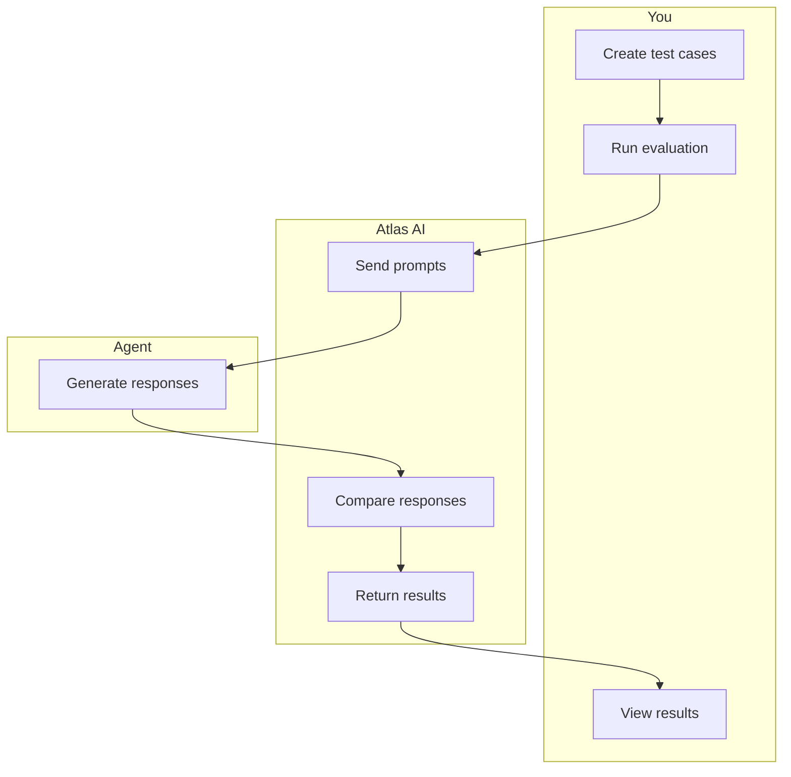

Test cases are examples of scenarios that you want your agents to understand how to respond to.

When you run evaluations, you can view results to see how your agents perform when Atlas AI compares their responses to your expected responses. These results help you identify patterns, like which types of prompts your agents struggle to understand, so you can improve performance.

## Why evaluations matter

When you build agents to solve business problems and automate workflows, evaluations help you verify that they provide the results that you expect.

To verify that agents provide the expected results, you can run evaluations at different stages of your agent workflows to monitor performance:

- **Check for regression** - Verify that agents still work after you update prompts, add tools, or change configuration.

- **Test before deployment** - Verify agents work as expected before you make them available to users.

- **Record expected behavior** - Use test cases to document how agents should respond.

- **Track performance over time** - Track how changes affect agent responses to identify where to improve.

When you run evaluations at these stages, you can test different areas of performance to understand where your agents can improve:

- **Response accuracy** - Test if agents provide the information you expect when prompted about industrial data.

- **Consistency** - Test if agents respond the same way to similar questions.

- **Edge cases** - Test how agents handle unclear questions, missing data, or unusual scenarios.

{/* ## Getting started

To create and run your first evaluation, see the evaluation guide (coming soon). The guide walks through creating test cases, configuring evaluations, and interpreting results. */}


<!-- SOURCE_END: docs.cognite.com/docs\cdf\atlas_ai\concepts\atlas_ai_agent_evaluation_overview.mdx -->

================================================================================


<!-- SOURCE_START: docs.cognite.com/docs\cdf\atlas_ai\concepts\index.mdx -->
## File: docs.cognite.com/docs\cdf\atlas_ai\concepts\index.mdx

---
title: About Atlas AI agents
description: Learn how Atlas AI agents use language models, knowledge graphs, prompts, and tools to solve industrial business problems.
content-type: conceptual
audience: dataEngineer
experience-level: 100
lifecycle: use
article-type: map
---
Atlas AI agents use generative AI (GenAI) [**language models**](#language-models) to solve **specific** industrial business problems, like providing insights into historical and planned maintenance and analysis of time series data for root cause analysis.

They include [**prompts**](#prompts-and-prompt-engineering) with **instructions**, industry-relevant [**tools**](#tools), and access to industrial data stored in the Cognite Data Fusion (CDF) [**knowledge graph**](#knowledge-graphs).

{/*  */}

Agents interact with humans to meet predetermined objectives. Humans provide instructions, and the AI agent suggests the best actions to take to achieve those objectives.

### Language models

Language models are one of the main ingredients of industrial AI agents. They're probabilistic models designed to **understand** and **generate** human language. **Large language models** (LLMs) are trained on vast amounts of data, making them versatile and useful for **general purposes**.

{/* We recommend that you use the information in the [Choose a language model](/cdf/atlas_ai/guides/atlas_ai_agent_choosing_lm) article and the [Language model benchmark report](/cdf/atlas_ai/concepts) to carefully evaluate and find the best language model for your agent and use case. Also, t */}

The [Language model library](/cdf/atlas_ai/references/atlas_ai_agent_language_models) has detailed reference information about the available language models to help you choose.

### Knowledge graphs

Cognite Data Fusion (CDF) has [data modeling features](/cdf/dm/dm_concepts) and [out-of-the-box data models](/cdf/dm/dm_reference/dm_core_data_model) to get you started building a structured, flexible, and contextualized **knowledge graph** of your industrial data.

Leveraging the knowledge graph, AI agents have the **context** they need to deliver more **deterministic** and accurate insights and recommendations, improving their effectiveness in tasks such as data analysis and problem-solving. The decisions are **traceable** and **transparent** so that you can always see how the AI agent arrived at its answers.

Industrial data is not static, and the knowledge graph ensures that the language models always work with the **most recent** data. **Access control** is another advantage of using knowledge graphs, controlling what data is provided to the language model.

Language models and knowledge graphs **complement** each other, and the strengths of one technology compensate for the limitations of the other.

For guidance on making your data model agent-ready, see [Optimizing data models for AI](/cdf/dm/dm_guides/dm_best_practices_ai_search).

### Prompts and prompt engineering

Prompts—prompt engineering—is how you optimize the output from the agents by helping the language models understand what output you want them to produce. **Instructions** are crucial for effectively guiding AI models.

**Instructions** are the specific directives and guidelines provided to the agent that define both what you want to achieve and how to achieve it. They detail the desired outcomes, objectives, and the specific approach the language model should take. For instance, an instruction might specify that you want to generate a summary, define the format of that summary, and include the key points to cover.

Instructions should clearly outline both **what** you want to accomplish and **how** to get there.

<Note>
**Learn more**

- Amazon Bedrock: [Prompt engineering concepts](https://docs.aws.amazon.com/bedrock/latest/userguide/prompt-engineering-guidelines.html)
- Open AI/ChatGPT: [Prompt engineering](https://platform.openai.com/docs/guides/prompt-engineering)
- Anthropic/Claude: [How to prompt engineer](https://docs.anthropic.com/en/docs/build-with-claude/prompt-engineering/overview#how-to-prompt-engineer)
- Google/Gemini: [Introduction to prompt design](https://ai.google.dev/gemini-api/docs/prompting-intro)
- Microsoft/ChatGPT: [Prompt engineering techniques](https://learn.microsoft.com/en-us/azure/ai-services/openai/concepts/prompt-engineering)
- DAIR.AI: [Prompt Engineering Guide](https://www.promptingguide.ai)
</Note>

### Tools

Atlas AI agents can interact with tools and functions, allowing the agent to perform complex tasks or interact with your application. We provide built-in tools for Atlas AI agents, but you can also define your own tools to extend their capabilities.

Typically, tools fall into these broad categories:

- **Querying and exploring data** from the industrial knowledge graph ensuring that the information is relevant and task-specific.
- **Running code** and **algorithms**, or perform **computations** in real time based on input or operational requirements.
- **Integration with external systems** via APIs to pull data, trigger workflows, or update records.

- **Integration with collaboration and communication tools**, for example, Slack and Microsoft Teams, ensuring seamless human-machine interaction.

To view the currently available tools, see the [Agent tools library](/cdf/atlas_ai/references/atlas_ai_agent_tools).

### Runtime versions

Runtime versions define the capabilities and behavior of your Atlas AI agents. Each version includes a specific system prompt, a set of agent tools, and a defined feature set. When you create an agent, Atlas AI automatically pins it to the latest stable runtime version.

The agent uses a specific runtime version to provide **stability** for production deployments. Cognite regularly releases improvements to Atlas AI, but your agent maintains **consistent behavior** with a pinned runtime version. You control when to upgrade your agent to a newer runtime version. 

For detailed information about available versions and their features, see [Agent runtime versions](/cdf/atlas_ai/references/atlas_ai_agent_runtime_versions).

{/* ## Trust

Intro + link to data governance, security, etc. */}


<!-- SOURCE_END: docs.cognite.com/docs\cdf\atlas_ai\concepts\index.mdx -->

================================================================================


<!-- SOURCE_START: docs.cognite.com/docs\cdf\atlas_ai\guides\atlas_ai_agent_building.mdx -->
## File: docs.cognite.com/docs\cdf\atlas_ai\guides\atlas_ai_agent_building.mdx

---
title: Build and publish agents
description: Create custom Atlas AI agents using the low-code Agent builder to solve business problems and automate workflows.
content-type: procedure
audience: dataEngineer
experience-level: 100
lifecycle: use
article-type: article
---
Use the low-code **Agent builder** to create Atlas AI agents that solve business problems and automate workflows. Start from scratch or use a template.

Test your agent with the chat preview, then publish it to the **Agent library** for all CDF project users.

## Before you start

Complete these steps before building your agent:

1. **Scope your use case** &mdash; define the specific problem or workflow you want to automate.
2. **Identify an evaluation dataset** &mdash; gather sample data to test your agent's performance.
3. **Choose a language model** &mdash; select the [language model](/cdf/atlas_ai/references/atlas_ai_agent_language_models) that best fits your use case.

## Build and publish an agent

<Steps>
<Step title="Navigate to Agent builder">
In CDF, navigate to **Atlas AI** > **Agent builder**.

Select **+ Create agent** or select a template to use as a starting point.
</Step>

<Step title="Configure basic information">
Enter a **Name** that clearly describes the agent's purpose.

Write a **Description** that explains what problems the agent solves or tasks it automates.

Add **Sample prompts** that show users how to interact with the agent. Make these specific and representative of real use cases.
</Step>

<Step title="Set up prompting">
Select the [**Language model**](/cdf/atlas_ai/references/atlas_ai_agent_language_models) you identified earlier.

Write **Instructions** that define what you want the agent to accomplish and how it should achieve it. Be clear and specific about:

- The agent's role and expertise.
- The expected output format.
- Any constraints or limitations.
- How to handle edge cases.

<Tip>
See [Prompts and prompt engineering](/cdf/atlas_ai/concepts#prompts-and-prompt-engineering) for more details on writing effective instructions.
</Tip>
</Step>

<Step title="Configure tools">
Add [**Tools**](/cdf/atlas_ai/references/atlas_ai_agent_tools) to let the agent access CDF data, perform complex tasks, or interact with other applications.

For the **data retrieval** tools, specify the **data model** and **view** to query, and which **access scope** to use:

- **Inherit scope from the user's location:** the [location](/cdf/locations) configured in CDF determines which data to find.
- **Inherit scope based on user's access rights:** find data without filtering on [spaces](/cdf/dm/dm_concepts/dm_spaces_instances#space).
- **Follow access scope defined manually:** select the [spaces](/cdf/dm/dm_concepts/dm_spaces_instances#space) to scope the query to.
</Step>

<Step title="Test and refine">
Test the agent using the chat interface. Refine the language model, instructions, and tools as needed.

Test with various scenarios, including:

- Typical use cases
- Edge cases
- Error conditions
- Different types of user input
</Step>

<Step title="Publish">
Select **Publish** to make the agent available in the **Agent library** for all CDF project users.
</Step>

<Step title="Monitor and iterate">
Monitor the agent's performance and make ongoing improvements based on user feedback and usage patterns.
</Step>
</Steps>


<!-- SOURCE_END: docs.cognite.com/docs\cdf\atlas_ai\guides\atlas_ai_agent_building.mdx -->

================================================================================


<!-- SOURCE_START: docs.cognite.com/docs\cdf\atlas_ai\guides\atlas_ai_agent_choosing_lm.mdx -->
## File: docs.cognite.com/docs\cdf\atlas_ai\guides\atlas_ai_agent_choosing_lm.mdx

---
title: Choosing a language model
description: Learn how to select the right language model for your Atlas AI agent based on task complexity, speed, cost, and data sensitivity.
content-type: conceptual
unlisted: true
audience: dataEngineer
experience-level: 100
lifecycle: use
article-type: article
---
Selecting the right language model is crucial for your agent's performance and effectiveness. Consider these key factors when making your choice:

## Factors to consider

- **Task complexity**: More complex reasoning tasks may benefit from higher-quality models
- **Response speed requirements**: Real-time applications may need faster models
- **Context length needs**: Longer conversations or documents require models with larger context windows
- **Cost considerations**: Balance model performance with usage costs
- **Data sensitivity**: Consider where your data will be processed

## Evaluation approach

Use the information in this article and the [Language model benchmark report](https://www.cognite.com/en/resources/white-papers/atlas-ai-slm-llm-benchmark-report) to carefully evaluate and find the best language model for your agent and use case.

The [Language model library](/cdf/atlas_ai/references/atlas_ai_agent_language_models) has reference information about the available language models to help you choose.

## Best practices

- Start with a mid-tier model for prototyping
- Test with real data from your use case
- Monitor performance metrics after deployment
- Consider switching models as your requirements evolve


<!-- SOURCE_END: docs.cognite.com/docs\cdf\atlas_ai\guides\atlas_ai_agent_choosing_lm.mdx -->

================================================================================


<!-- SOURCE_START: docs.cognite.com/docs\cdf\atlas_ai\guides\atlas_ai_agent_evaluating.mdx -->
## File: docs.cognite.com/docs\cdf\atlas_ai\guides\atlas_ai_agent_evaluating.mdx

---
title: Evaluate Atlas AI agents
description: Test Atlas AI agents to verify that they provide the results that you want and identify where they can improve performance.
content-type: procedure
audience: aiEngineer
experience-level: 100
lifecycle: verify
article-type: article
---
Configure evaluations to verify that your agents provide the results that you expect. Create test cases with prompts and expected responses, run evaluations to generate agent responses, then review results to identify where your agents can improve.

## Before you start

You must create an agent in the [Agent builder](/cdf/atlas_ai/guides/atlas_ai_agent_building).

## Configure evaluation

Configure an evaluation with test cases that define prompts and expected responses.

<Steps>
<Step title="Start configuration">
1. In CDF, navigate to **Atlas AI** > **Evaluate agents**.
2. Select **+ Create new evaluation**.
</Step>

<Step title="Enter evaluation details">
1. Enter a **Name** for your evaluation.

<Tip>
Use descriptive names like "Pump maintenance agent - v1" to help you identify your evaluations.
</Tip>

2. Add a **Description** to explain the purpose of the evaluation.
</Step>

<Step title="Define test cases">
Add test cases to define prompts and the expected responses.

1. In the **Test cases** section, enter a **Prompt**. 
2. Enter the **Expected response**. Atlas AI compares your expected response to the agent's response to test performance.
3. Optionally, choose an agent and select **Generate answer** to use the agent to generate the expected response.

<Tip>
Be specific about what details, like operational status, metrics, or alert information, you want agents to include in their responses.
</Tip>
</Step>
</Steps>

## Run and monitor evaluation

Run an evaluation to test your agent. Monitor real-time progress as the agent processes test cases.

<Steps>
<Step title="Navigate to evaluation">
1. Go to **Evaluation overview**.
2. Select **Run evaluation**.
</Step>

<Step title="Select your agent">
1. Use the search or filter to find your agent by name, status, or latest version.
2. Select the agent from the list.
3. Select **Run with selected agent** to run the evaluation.
</Step>

<Step title="Confirm code tool access">
If Atlas AI prompts you to allow code tool access for your agent, select **Confirm and run** to continue running the evaluation or **Cancel** to go back to the list of agents.
</Step>

<Step title="Monitor evaluation progress">
When you run the evaluation, Atlas AI sends your prompts to the agent and records the responses in real time. This can take several minutes depending on how many test cases you have. 

You can select **Cancel run** to stop the evaluation at any time.

<Warning>
Do not close the browser tab while the evaluation is running. Evaluations run in the browser, and closing or navigating away from the tab will stop the evaluation.
</Warning>
</Step>
</Steps>

## View and analyze results

Review evaluation results to identify where agents need improvement and track performance across multiple runs.

<Steps>
<Step title="View completed evaluations">
On the **Evaluation overview** tab, review the list of completed evaluations.
</Step>

<Step title="Review test case status">
Select an evaluation to view the status of your test cases.
</Step>

<Step title="Compare responses">
Select **View details** to compare the agent responses to your expected responses for each test case.

<Tip>
Use evaluation insights to improve your agent by refining instructions in the Agent builder, updating tools or data access, or editing test cases.
</Tip>
</Step>
</Steps>

## Learn more

- [Build and publish agents](/cdf/atlas_ai/guides/atlas_ai_agent_building) - Learn how to create and configure agents
- [Agent tools](/cdf/atlas_ai/references/atlas_ai_agent_tools) - Reference for available agent tools


<!-- SOURCE_END: docs.cognite.com/docs\cdf\atlas_ai\guides\atlas_ai_agent_evaluating.mdx -->

================================================================================


<!-- SOURCE_START: docs.cognite.com/docs\cdf\atlas_ai\guides\index.mdx -->
## File: docs.cognite.com/docs\cdf\atlas_ai\guides\index.mdx

---
title: Implementing Atlas AI agents
description: A step-by-step guide to scope, build, test, and deploy Atlas AI agents in your organization.
content-type: procedure
unlisted: true
audience: dataEngineer
experience-level: 100
lifecycle: use
article-type: map
---
Follow these steps to implement Atlas AI agents in your organization.

## Prerequisites

Atlas AI features require a separate license from your standard Cognite Data Fusion (CDF) subscription. To enable Atlas AI functionality for your organization, contact your Cognite representative or fill out [this form](https://www.cognite.com/en/contact).

## Step 1: Scope your use case

Identify a specific problem to solve or workflow to automate with an Atlas AI agent.

Define clear requirements by determining what **capabilities** the agent should have, establishing accuracy and speed requirements for **performance**, setting your budget for model usage **costs**, and defining **success metrics** to measure the agent's effectiveness.

## Step 2: Identify and prepare your data

Identify a **representative** evaluation data set that allows you to measure the agent's performance against your use case.

Ensure your data covers the full range of scenarios the agent will encounter, and that is has high quality with clean, accurate, and **well-structured** content. It must be accessible through your CDF knowledge graph, and documented with metadata and documentation to help the agent understand the data context. See [Optimizing data models for AI](/cdf/dm/dm_guides/dm_best_practices_ai_search).

## Step 3: Choose the language model

We recommend that you use the information in the [Choosing a language model](/cdf/atlas_ai/guides/atlas_ai_agent_choosing_lm) article and the [Language model benchmark report](https://www.cognite.com/en/resources/white-papers/atlas-ai-slm-llm-benchmark-report) to evaluate and find the best language model for your agent and use case. The [Language model library](/cdf/atlas_ai/references/atlas_ai_agent_language_models) article has reference information about the available language models.

## Step 4: Build the agent

Use the low-code [Atlas AI Agent builder](/cdf/atlas_ai/guides/atlas_ai_agent_building) to rapidly build and prototype agents. Start with simple instructions and gradually add complexity.

## Step 5: Test the agent

Publish agents for testing and monitor performance for further refinement. Testing can include:

- **Functional testing**: Verify that the agent produces correct outputs.
- **Performance testing**: Measure the response times and accuracy.
- **Red-team testing**: Test for potential misuse or harmful outputs.
- **A/B testing**: Compare different configurations.

## Step 6: Deploy to production

Once your agent runs smoothly end-to-end, deploy to production with proper monitoring and access controls in place.

## Step 7: Monitor and improve

Monitor performance and effectiveness to make ongoing improvements. Track key metrics and user feedback to identify areas for enhancement.


<!-- SOURCE_END: docs.cognite.com/docs\cdf\atlas_ai\guides\index.mdx -->

================================================================================


<!-- SOURCE_START: docs.cognite.com/docs\cdf\atlas_ai\index.mdx -->
## File: docs.cognite.com/docs\cdf\atlas_ai\index.mdx

---
title: Atlas AI
description: Create and manage industrial AI agents to solve specific business needs using generative AI, language models, and industrial data.
content-type: conceptual
audience: dataEngineer
experience-level: 100
lifecycle: use
article-type: map
---
Cognite Atlas AI extends Cognite Data Fusion (CDF) with a workspace to create and manage industrial AI agents that can help solve your specific business needs.


AI agents use generative AI (genAI) [language models](/cdf/atlas_ai/references/atlas_ai_agent_language_models) and include prompts with instructions, industry-relevant [tools](/cdf/atlas_ai/references/atlas_ai_agent_tools), and access to industrial data stored in your CDF [knowledge graph](/cdf/dm).


Cognite provides example agent templates that you can use as a starting point for building your agents, or you can use our low-code tools to create agents from scratch.


<Info>
Atlas AI features require a separate license from your standard Cognite Data Fusion (CDF) subscription. To enable Atlas AI functionality for your organization, contact your Cognite representative or fill out [this form](https://www.cognite.com/en/contact).
</Info>


<!-- SOURCE_END: docs.cognite.com/docs\cdf\atlas_ai\index.mdx -->

================================================================================


<!-- SOURCE_START: docs.cognite.com/docs\cdf\atlas_ai\references\atlas_ai_agent_language_models.mdx -->
## File: docs.cognite.com/docs\cdf\atlas_ai\references\atlas_ai_agent_language_models.mdx

---
title: Language model library
description: Detailed reference of available language models in Atlas AI, including stable, legacy, and retired models with release and retirement dates.
content-type: reference
audience: dataEngineer
experience-level: 100
lifecycle: use
article-type: article
---
This article details the language models available in Atlas AI. Choose the right model based on your specific requirements for speed, quality, and context length. The availability of language models depends on your preferred cloud vendor and [the location](/cdf/admin/clusters_regions) of your Cognite Data Fusion (CDF) project.

Cognite continuously refreshes language models with newer and more capable models for building agents. As part of this process, we retire older models.

We use these terms to describe lifecycle stages and important dates for language models available in Atlas AI:

- **Stable model**: A released model version **supported for production use**. Stable models include a retirement date when Cognite Atlas AI will no longer support them.

  - [**Latest stable model**](#latest-stable-models): The most current version within the model family, recommended for new agents or agents in development. Use this model when migrating from older versions.

  - [**Legacy stable model**](#legacy-stable-models): An older model version that the latest stable model has replaced. While we still support legacy models, migrate to the latest model to access new features and improvements.

- **Recommended upgrade**: The latest stable model to migrate to for improved performance and additional features.

- **Retired model**: A model version that Atlas AI has permanently deactivated after reaching its retirement date. Atlas AI no longer supports retired models. If you don't migrate agents using retired models before the retirement date, they automatically upgrade to the latest stable model.

### Latest stable models

| Model ID              | Release date  | Retirement date                    |
|-----------------------| ------------- | ---------------------------------- |
| azure/gpt-5           | August 2025   | No earlier than July 15th, 2026    |
| azure/gpt-5-mini      | August 2025   | No earlier than July 15th, 2026    |
| azure/gpt-5-nano      | August 2025   | No earlier than July 15th, 2026    |
| azure/gpt-4.1         | August 2025   | No earlier than April 1st, 2026    |
| azure/gpt-4.1-nano    | August 2025   | No earlier than April 1st, 2026    |
| azure/gpt-4.1-mini    | August 2025   | No earlier than April 1st, 2026    |
| azure/o3              | August 2025   | No earlier than April 1st, 2026    |
| azure/o4-mini         | August 2025   | No earlier than April 1st, 2026    |
| gcp/gemini-2.5-pro    | August 2025   | No earlier than June 1st, 2026     |
| gcp/gemini-2.5-flash  | August 2025   | No earlier than June 1st, 2026     |
| aws/claude-4-sonnet   | August 2025   | No earlier than December 1st, 2025 |
| aws/claude-4-opus     | August 2025   | No earlier than December 1st, 2025 |
| aws/claude-4.1-opus   | August 2025   | No earlier than December 1st, 2025 |

### Legacy stable models

| Model ID              | Release date  | Retirement date     | Recommended upgrade |
|-----------------------| ------------- |---------------------| ------------------- |
| azure/gpt-4o          | December 2024 | February 1, 2026    | azure/gpt-4.1       |
| azure/gpt-4o-mini     | December 2024 | February 1, 2026    | azure/gpt-4.1-mini  |
| aws/claude-3.5-sonnet | December 2024 | February 15, 2026   | aws/claude-4-sonnet |

### Retired models

| Model ID              | Release date  | Retirement date     | Recommended upgrade |
|-----------------------| ------------- |---------------------| ------------------- |
| gcp/gemini-1.5-pro    | December 2024 | September 15, 2025  | gemini-2.5-pro      |
| gcp/gemini-1.5-flash  | December 2024 | September 15, 2025  | gemini-2.5-flash    |
| gcp/gemini-2.0-flash  | February 2025 | September 15, 2025  | gemini-2.5-flash    |
| aws/claude-3-haiku    | December 2024 | September 15, 2025  | aws/claude-4-sonnet |


<!-- SOURCE_END: docs.cognite.com/docs\cdf\atlas_ai\references\atlas_ai_agent_language_models.mdx -->

================================================================================


<!-- SOURCE_START: docs.cognite.com/docs\cdf\atlas_ai\references\atlas_ai_agent_limits_restrictions.mdx -->
## File: docs.cognite.com/docs\cdf\atlas_ai\references\atlas_ai_agent_limits_restrictions.mdx

---
title: Limits and restrictions
description: Current Atlas AI limits for total agents, published agents, and tools per agent in a CDF project.
content-type: reference
audience: dataEngineer
experience-level: 100
lifecycle: use
article-type: article
---
This section outlines the current Atlas AI limits for a CDF project. If you need to increase these limits for your organization, contact [Cognite support](https://cognite.zendesk.com/hc/en-us/requests/new).

## Current limits

|                                 | Maximum value |
| ------------------------------- | ------------- |
| Total number of Atlas AI agents | 30            |
| Published Atlas AI agents       | 10            |
| Tools per Atlas AI agent        | 20            |


<!-- SOURCE_END: docs.cognite.com/docs\cdf\atlas_ai\references\atlas_ai_agent_limits_restrictions.mdx -->

================================================================================


<!-- SOURCE_START: docs.cognite.com/docs\cdf\atlas_ai\references\atlas_ai_agent_python_tool.mdx -->
## File: docs.cognite.com/docs\cdf\atlas_ai\references\atlas_ai_agent_python_tool.mdx

---
title: 'Run Python code'
description: 'Reference information for using the Run Python code tool in Atlas AI agents, including supported parameter types, code structure requirements, and best practices'
content-type: 'reference'
audience: 'developer'
experience-level: '200'
lifecycle: use
article-type: article
---
The **Run Python code** tool enables Atlas AI agents to run custom Python scripts with runtime arguments. The tool automatically validates your code, generates contracts for the agent from Python type annotations, and provides testing capabilities within the Atlas AI interface.

## Required code structure

To ensure your script works with the Atlas AI agent, you must define specific entry points and follow the required function signatures.

### The handle() function

Every Python script must include a `handle()` function that serves as the entry point. The function must be named `handle` and must have type annotations for all parameters. The function must also include a docstring following the [Google Python Style Guide](https://google.github.io/styleguide/pyguide.html#383-functions-and-methods).

```python wrap 
def handle(param1: str, param2: int) -> str:
    """
    Brief description of what the function does.
    
    Args:
        param1 (str): Description of the first parameter.
        param2 (int): Description of the second parameter.
    
    Returns:
        str: Description of what is returned.
    """
    # Your implementation here
    return f"Processed {param1} with value {param2}"
```

**Requirements:**
- The function must be named `handle`.
- All parameters must have type annotations. See [Supported parameter types](#supported-parameter-types).
- The function should include a docstring following the [Google Python Style Guide](https://google.github.io/styleguide/pyguide.html#383-functions-and-methods).
- The return type annotation is recommended but not required.

<Warning>
Only the parameter descriptions in the `Args:` section of the docstring are used by the AI agent. The function description and return value description are not passed to the agent. To provide descriptions for the agent on how to use the tool, use the <span class="ui-element">Instructions</span> field in the agent configuration interface.
</Warning>

### The test() function

Include a `test()` function for validation and testing. Use the  <span class="ui-element">Test code</span> button in the Atlas AI agent builder to trigger the function.

```python wrap
def test():
    """Test function that runs when you click 'Test code' in the UI."""
    # You can use assertions
    assert handle("test", 42) == "Processed test with value 42"
    
    # Or return a value to display in the console
    return handle("example", 100)
```

**Requirements:**
- The function must be named `test`.
- No parameters are allowed.
- The function can use assertions or return values for display.
- The function is run when you click the <span class="ui-element">Test code</span> button in the UI.

## Supported parameter types

Parameters can be of primitive types, `DateTime`, `NodeId` and lists of these. Primitive types can have a default value.

### Primitive types

| Python type | JSON schema type | Example usage        | Runtime value |
|-------------|------------------|----------------------|---------------|
| `str`       | `"string"`       | `name: str`          | `"John Doe"`  |
| `int`       | `"integer"`      | `age: int`           | `25`          |
| `float`     | `"number"`       | `temperature: float` | `23.5`        |
| `bool`      | `"boolean"`      | `is_active: bool`    | `true`        |

```python wrap
def handle(
    name: str,
    age: int,
    temperature: float,
    is_active: bool
) -> dict:
    """
    Example with primitive types.
    
    Args:
        name (str): User's name.
        age (int): User's age in years.
        temperature (float): Temperature in Celsius.
        is_active (bool): Whether user is active.
    
    Returns:
        dict: Processed user data.
    """
    return {
        "name": name,
        "age": age,
        "temperature": temperature,
        "is_active": is_active
    }
```

### Default values

Primitive types support default values:

```python
def handle(
    message: str,
    count: int = 1,
    multiplier: float = 1.0,
    enabled: bool = True
) -> str:
    """
    Example with default values.
    
    Args:
        message (str): The message to process.
        count (int): Number of repetitions (default=1).
        multiplier (float): Multiplier factor (default=1.0).
        enabled (bool): Whether processing is enabled (default=True).
    
    Returns:
        str: Processed message.
    """
    if not enabled:
        return "Processing disabled"
    
    return (message * count) * int(multiplier)
```

### List types

We support lists of primitive types:

```python
def handle(
    names: list[str],
    values: list[int],
    temperatures: list[float]
) -> dict:
    """
    Example with list parameters.
    
    Args:
        names (list[str]): List of names.
        values (list[int]): List of integer values.
        temperatures (list[float]): List of temperature readings.
    
    Returns:
        dict: Summary of the lists.
    """
    return {
        "name_count": len(names),
        "total_value": sum(values),
        "avg_temperature": sum(temperatures) / len(temperatures) if temperatures else 0
    }
```

<Warning>
We don't support nested lists (e.g., `list[list[str]]`).
</Warning>

### DateTime type

For temporal data use `datetime`:

```python wrap
import datetime

def handle(
    start_time: datetime.datetime,
    end_time: datetime.datetime,
    timestamps: list[datetime.datetime]
) -> dict:
    """
    Example with datetime parameters.
    
    Args:
        start_time (datetime.datetime): Start of time range.
        end_time (datetime.datetime): End of time range.
        timestamps (list[datetime.datetime]): List of timestamps.
    
    Returns:
        dict: Time range information.
    """
    duration = end_time - start_time
    return {
        "duration_seconds": duration.total_seconds(),
        "timestamp_count": len(timestamps)
    }
```

### NodeId type

To work with Cognite Data Fusion (CDF) instances from data models, use [`NodeId`](https://cognite-sdk-python.readthedocs-hosted.com/en/latest/data_modeling.html) to identify the instances:

```python wrap
from cognite.client.data_classes.data_modeling import NodeId

def handle(asset_id: NodeId, related_asset_ids: list[NodeId]) -> dict:
    """
    Example with NodeId parameters.
    
    Args:
        asset_id (NodeId): Primary asset identifier with space and external_id.
        related_asset_ids (list[NodeId]): List of related asset identifiers.
    
    Returns:
        dict: Asset information.
    """
    # NodeId objects have .space and .external_id properties
    return {
        "primary_asset": {
            "space": asset_id.space,
            "external_id": asset_id.external_id
        },
        "related_count": len(related_asset_ids)
    }
```

**Runtime format:** `NodeId` parameters are passed to the language model as objects with `space` and `externalId` properties:

```json
{
  "space": "my-space",
  "externalId": "asset-123"
}
```

<Info>
The `NodeId` class uniquely identifies nodes in Cognite's data modeling framework, combining a `space` (workspace identifier) and `external_id` to form a unique node reference. See the [Cognite Python SDK data modeling documentation](https://cognite-sdk-python.readthedocs-hosted.com/en/latest/data_modeling.html) for details.
</Info>

### Limitations and restrictions

The following types are **not supported** as arguments to `handle()`:

- Custom classes and objects
- Nested lists (`list[list[str]]`)
- Complex generics beyond `list[T]`
- Union types (`str | int`)
- Optional types (`Optional[str]`)
- Tuples, sets, and other collections
- String literal types (e.g., `Literal["A"]`, `Literal["A", "B"]`)

The following restrictions apply for default argument values for `handle()`:

- Default values are only supported for primitive types (`str`, `int`, `float`, `bool`).
- Lists cannot have default values.
- `NodeId` and `datetime` parameters cannot have default values.

## Supported return types

Your `handle()` function can return any JSON-serializable data. The following return types are supported:

### Primitive return types

```python
def handle() -> str:
    return "Success message"

def handle() -> int:
    return 42

def handle() -> float:
    return 3.14159

def handle() -> bool:
    return True
```

### Dictionary returns

```python
def handle() -> dict:
    return {
        "status": "completed",
        "count": 10,
        "results": ["item1", "item2"]
    }
```

### List returns

```python
def handle() -> list[str]:
    return ["result1", "result2", "result3"]

def handle() -> list[dict]:
    return [
        {"id": 1, "name": "Item 1"},
        {"id": 2, "name": "Item 2"}
    ]
```

### None/null returns

```python
def handle() -> None:
    # Perform an action and return None
    print("Operation completed")
    return None
```

### Unsupported return types

The following return types are **not supported**:

- Raw Cognite SDK objects
- Custom class instances
- Functions or callable objects
- File handles or binary data
- Complex objects that can't be serialized to JSON

## Cognite SDK and authentication

The Cognite Python SDK is pre-installed and automatically configured with your session credentials. The current user credentials are used and no additional configuration is needed.

```python wrap
from cognite.client import CogniteClient
from cognite.client.data_classes.data_modeling.cdm.v1 import CogniteAsset

def handle() -> dict:
    """
    List assets.
    
    Returns:
        dict: Asset information including ID and metadata.
    """
    # Client is automatically configured - no setup required
    client = CogniteClient()
    
    # List assets
    assets = client.data_modeling.instances.list(sources=[CogniteAsset.get_source()])
    
    if assets:
        return assets[0].dump()  # Use .dump() for JSON serialization
    
    return {"error": "No assets found"}
```

For complete SDK usage and API reference, see the [Cognite Python SDK documentation](https://cognite-sdk-python.readthedocs-hosted.com/en/latest/).

### Cognite SDK return types

We don't support direct serialization of Cognite SDK objects. To reduce the number of LLM tokens the result will require and to make the data understandable to the agent, we recommend extracting relevant values and potentially reshaping the data.

```python wrap
from cognite.client import CogniteClient
from cognite.client.data_classes.data_modeling.cdm.v1 import CogniteAsset

def handle() -> list[dict]:
    """
    Get simplified asset information.
    
    Returns:
        list[dict]: List of assets with only essential fields.
    """
    client = CogniteClient()
    assets = client.data_modeling.instances.list(
        sources=[CogniteAsset.get_source()],
        limit=10
    )
    
    # Extract only relevant fields
    return [
        {
            "external_id": asset.external_id,
            "name": asset.name,
            "description": asset.description
        }
        for asset in assets
    ]
```

<Tip>
As a last resort, you can use the `.dump()` method to serialize all information from Cognite SDK objects, but this may include unnecessary data that increases token usage.
</Tip>

```python wrap
def handle() -> dict:
    """Get complete asset data using dump()."""
    from cognite.client import CogniteClient
    from cognite.client.data_classes.data_modeling.cdm.v1 import CogniteAsset
    
    client = CogniteClient()
    assets = client.data_modeling.instances.list(sources=[CogniteAsset.get_source()])
    return assets[0].dump()  # ✅ Correct - JSON serializable

def handle() -> list[dict]:
    """Get all assets using dump()."""
    from cognite.client import CogniteClient
    from cognite.client.data_classes.data_modeling.cdm.v1 import CogniteAsset
    
    client = CogniteClient()
    assets = client.data_modeling.instances.list(sources=[CogniteAsset.get_source()])
    return assets.dump()  # ✅ Correct - JSON serializable
```

## Best practices

We recommend the following best practices when writing Python code for the **Run Python code** tool.

### Error handling

Use descriptive error messages:

```python wrap
def handle(value: float) -> float:
    """
    Process a value with validation.
    
    Args:
        value (float): Input value to process.
    
    Returns:
        float: Processed value.
    """
    if value < 0:
        raise ValueError("The value must be non-negative.")  # Clear, actionable message
    
    if value > 1000:
        raise ValueError("The value exceeds the maximum allowed limit of 1000.")
    
    return value * 2
```

### Documentation

- Always include docstrings following the [Google Python Style Guide](https://google.github.io/styleguide/pyguide.html#383-functions-and-methods).
- **Parameter descriptions are critical**: Only the `Args:` section descriptions are passed to the AI agent as part of the JSON schema.
- Write clear, specific parameter descriptions that help the agent understand what values to provide.
- Include examples in the parameter descriptions when helpful.

**Example of parameter documentation for the agent:**

```python wrap
def handle(asset_id: NodeId, threshold: float) -> dict:
    """
    Analyze asset performance against threshold.
    
    Args:
        asset_id (NodeId): The specific asset to analyze. Provide both space and externalId.
        threshold (float): The performance threshold value in percentage (0-100).
    
    Returns:
        dict: The analysis results with performance metrics.
    """
    # Implementation here
    pass
```

### Testing

Write comprehensive test functions:

```python wrap
def test():
    """Comprehensive test coverage."""
    # Test normal cases
    result1 = handle("test", 42)
    assert result1 == expected_value, "Normal case failed"
    
    # Test edge cases
    result2 = handle("", 0)
    assert result2 is not None, "Edge case failed"
    
    # Test error conditions
    try:
        handle("invalid", -1)
        assert False, "Should have raised ValueError"
    except ValueError:
        pass  # Expected
    
    # Return a sample result for display
    return handle("sample", 100)
```

## Troubleshooting

Below are some common errors you might encounter when using the **Run Python code** tool, and how to fix them.

### "Function 'handle' not found"

- Ensure your function is named `handle`.
- Check for indentation errors.

### "Missing type annotation for parameter(s)"

- Make sure all parameters have type annotations.
- Use supported types only.

### "Duplicate argument name(s) found"

- Make sure the parameter names are unique.
- Check for copy-paste errors.

### "Unsupported type for parameter"

- Use only [supported types](#supported-parameter-types).
- Check for typos in type annotations.

### Serialization errors

- Use the `.dump()` method on Cognite SDK objects.
- Make sure the return values are serializable to JSON.

## Code execution environment capabilities and limitations

The **Run Python code** tool runs in a controlled WebAssembly environment with specific capabilities and limitations:

- **Runtime**: Pyodide (Python 3.11 in WebAssembly).
- **Execution context**: Runs in a web worker for isolation.
- **Performance**: WebAssembly execution may be slower than native Python.
- **Memory**: Limited by browser memory constraints.

## Pre-installed packages

The following packages are automatically available:

- **Cognite Python SDK** (`cognite-sdk`): Pre-configured with authentication.
- **Standard library**: Full Python 3.11 standard library.
- **Core scientific packages** (via Pyodide):
  - `numpy`: Numerical computing
  - `pandas`: Data analysis and manipulation
  - `json`: JSON encoding/decoding
  - `datetime`: Date and time handling
  - `uuid`: UUID generation

<Warning>
We don't support installing custom packages. This includes:
- `pip install` commands
- Dynamic package installation
- Custom or third-party packages not included in Pyodide
</Warning>

If you need custom packages or more advanced functionality, consider using [Cognite Functions](/cdf/functions/) instead. Functions run on Cognite's cloud infrastructure and support:

- Custom package installation via `requirements.txt`
- Longer execution times
- More memory and compute resources
- Full Python ecosystem access


## System limitations

The execution environment has certain constraints that you should be aware of when writing your scripts.

- **File system**: No access to local file system or file I/O operations. The scripts have access to a virtual memory-based file system.
- **Network access**: Only API calls to Cognite Data Fusion APIs are supported. Network calls to other servers might get blocked.
- **Process control**: No subprocess or system command execution.
- **Threading**: Limited threading capabilities in WebAssembly environment.
- **Graphics**: Matplotlib backend set to 'AGG' (non-interactive).

## How the AI agent uses your code

The Atlas AI agent processes your Python code through these steps to understand and execute your tool functions:

1. **JSON schema as tool descriptor**: The generated JSON schema is passed to the AI agent's language model as a tool descriptor. This tells the agent exactly what parameters are available, their types, and what they're for.

2. **Parameter descriptions guide the agent**: The parameter descriptions from your docstring's `Args:` section are included in the schema and used by the agent to understand what values to provide.

3. **Type validation**: The schema ensures the language model provides correctly typed arguments that match your function signature.

4. **Runtime execution**: When the agent calls your tool, the arguments are validated against the schema and then transformed (e.g., NodeId objects are created from dictionaries) before being passed to your `handle()` function.

<Note>
Your parameter docstrings are critical. They directly influence how the agent understands and uses your tool.
</Note>


<!-- SOURCE_END: docs.cognite.com/docs\cdf\atlas_ai\references\atlas_ai_agent_python_tool.mdx -->

================================================================================


<!-- SOURCE_START: docs.cognite.com/docs\cdf\atlas_ai\references\atlas_ai_agent_runtime_versions.mdx -->
## File: docs.cognite.com/docs\cdf\atlas_ai\references\atlas_ai_agent_runtime_versions.mdx

---
title: Agent runtime versions
description: Reference of Atlas AI agent runtime versions including stable, preview, and retired versions with feature support and retirement dates.
content-type: reference
audience: dataEngineer
experience-level: 100
lifecycle: use
article-type: article
---
Agent runtime versions define the capabilities and behavior of your Atlas AI agents. Each version includes a specific system prompt, agent tools and their prompts, and agent-specific features. When you create an agent, Atlas AI automatically pins it to the latest stable runtime version.

The agent uses a specific runtime version to provide stability for production deployments. Cognite regularly releases improvements to Atlas AI, but your agent maintains consistent behavior with the assigned runtime version. You control when to upgrade your agent to a newer version.

## Lifecycle stages

We use these terms to describe lifecycle stages for runtime versions:

- **Stable version**: A released runtime version that **supports production use**. Each stable version includes a retirement date when support ends. 

  - **Latest stable version**: The most current stable version. Use this version for new agents, agents in development, or when migrating from older versions.

  - **Legacy stable version**: An older stable version that is supported but has been replaced by a newer stable version. Migrate to the latest version to access new features and improvements.

- **Preview version**: A pre-release version that provides early access to some features. We recommend that you **don't** use these versions in production systems.

- **Retired version**: A runtime version that is no longer supported and has reached its retirement date. Atlas AI automatically upgrades agents using a retired version to the latest stable version if you don't migrate them before the retirement date. 

## Agent runtime version overview

This table lists all available runtime versions with their current status and support timeline.

| Version     | Status        | Release date      | Retirement date                   |
| ----------- | ------------- | ----------------- | --------------------------------- |
| 1.0.2       | Latest stable | November 27, 2025 | No earlier than November 27, 2026 |
| 1.0.1       | Legacy        | November 27, 2025 | No earlier than November 27, 2026 |
| 1.0.0       | Legacy        | November 27, 2025 | No earlier than November 27, 2026 |
| 0.9.9       | Legacy        | November 27, 2025 | No earlier than November 27, 2026 |
| 2.0.0-alpha | Preview       | November 27, 2025 | -                                 |

### Stable version features

This table lists the features available in each stable version.

| Feature                                                                                    | 1.0.2 | 1.0.1 | 1.0.0 | 0.9.9 |
| ------------------------------------------------------------------------------------------ | ----- | ----- | ----- | ----- |
| [Query memory](#query-memory)                                                              | ❌     | ❌     | ❌     | ❌     |
| [Examine data semantically](/cdf/atlas_ai/references/atlas_ai_agent_tools#analysis-tools)  | ❌     | ❌     | ❌     | ❌     |

### Preview version features

This table lists the features available in preview versions.

| Feature                                                                                    | 2.0.0-alpha |
| ------------------------------------------------------------------------------------------ | ----------- |
| [Query memory](#query-memory)                                                              | ✅           |
| [Examine data semantically](/cdf/atlas_ai/references/atlas_ai_agent_tools#analysis-tools)  | ✅           |

<Warning>
We recommend that you **don't** use preview versions in production systems. Features and behavior may change without notice.
</Warning>


## Feature overview

This section describes the features that vary between runtime versions.

### Query memory

Query memory is a caching capability that allows agents to store results from [Query tools](/cdf/atlas_ai/references/atlas_ai_agent_tools#query-tools) and pass the results as input to other tools in the same conversation. Some tools require Query memory to function, such as the [Examine data semantically](/cdf/atlas_ai/references/atlas_ai_agent_tools#analysis-tools) tool.

### Examine data semantically

This feature enables you to add the [Examine data semantically tool](/cdf/atlas_ai/references/atlas_ai_agent_tools#analysis-tools) to your Atlas AI agent.

## Select a runtime version

New agents automatically use the latest stable runtime version. You can select a different version in the agent builder user interface (UI) or through the Cognite API.

<Tabs>
<Tab title="Agent builder UI">
The agent builder displays the runtime version in the agent configuration. Change the version from the dropdown.
</Tab>

<Tab title="Cognite API">
When you create or update an agent via the [Cognite API](https://api-docs.cognite.com/20230101-beta/tag/Agents/operation/main_ai_agents_post), specify the `runtimeVersion` field. If you leave this field empty, the agent defaults to the latest stable version.

```json
{
  "name": "My Agent",
  "runtimeVersion": "1.0.2"
}
```

</Tab>
</Tabs>

## Upgrade to a new version

Complete these steps before you upgrade your agent to a new runtime version:

1. Review the feature differences between your current version and the target version.

1. Test your agent thoroughly in a non-production environment.

1. Verify that any custom tools or integrations work correctly with the new version.

<Note>
Atlas AI automatically upgrades agents to the latest stable version when their runtime version reaches the retirement date.
</Note>


<!-- SOURCE_END: docs.cognite.com/docs\cdf\atlas_ai\references\atlas_ai_agent_runtime_versions.mdx -->

================================================================================


<!-- SOURCE_START: docs.cognite.com/docs\cdf\atlas_ai\references\atlas_ai_agent_templates.mdx -->
## File: docs.cognite.com/docs\cdf\atlas_ai\references\atlas_ai_agent_templates.mdx

---
title: Agent templates library
description: Pre-built agent templates for common industrial use cases including maintenance, operations, data analysis, and document processing.
content-type: reference
unlisted: true
audience: dataEngineer
experience-level: 100
lifecycle: use
article-type: article
---
Agent templates provide pre-built starting points for common industrial use cases. These templates include optimized instructions, recommended tools, and best practices for specific scenarios.

## Available templates

### Maintenance and operations

Templates focused on equipment maintenance, work order management, and operational efficiency.

### Data analysis and insights

Templates designed for analyzing time series data, generating reports, and identifying trends.

### Document processing

Templates for extracting information from technical documents, manuals, and reports.

## Custom development

If no existing template fits your needs, you can build an agent from scratch using the [Agent builder](/cdf/atlas_ai/gu
ides/atlas_ai_agent_building).


<!-- SOURCE_END: docs.cognite.com/docs\cdf\atlas_ai\references\atlas_ai_agent_templates.mdx -->

================================================================================


<!-- SOURCE_START: docs.cognite.com/docs\cdf\atlas_ai\references\atlas_ai_agent_tools.mdx -->
## File: docs.cognite.com/docs\cdf\atlas_ai\references\atlas_ai_agent_tools.mdx

---
title: Agent tools library
description: Complete reference of built-in Atlas AI agent tools including query tools, analysis tools, and integration tools for interacting with data and external systems.
content-type: reference
audience: dataEngineer
experience-level: 100
lifecycle: use
article-type: article
---
Atlas AI agents can interact with tools and functions, allowing them to perform complex tasks and interact with your applications. We provide built-in tools for Atlas AI agents, and you can also define custom tools to extend their capabilities.

Tools enable agents to move beyond simple text generation by providing access to data, computational capabilities, and external systems integration.

## Query tools

The query tools use [**query features**](/cdf/dm/dm_concepts/dm_querying) to retrieve and explore information from the [Cognite knowledge graph](/cdf/dm/dm_concepts/dm_property_graph).

| Tool                                    | Use to                                                                                                                                                                                                                                                                                                                                                                                                 | Parameters                                                                                                                  |
| --------------------------------------- | ------------------------------------------------------------------------------------------------------------------------------------------------------------------------------------------------------------------------------------------------------------------------------------------------------------------------------------------------------------------------------------------------------ | --------------------------------------------------------------------------------------------------------------------------- |
| Query knowledge graph                   | Retrieve data instances from data models in Cognite Data Fusion (CDF). For high accuracy, configure the tool instructions with additional information on the selected data type.                                                                                                                                                                                                                       | Specify which **data model**, [**view**](/cdf/dm/dm_concepts/dm_containers_views_datamodels#views), and credentials to use. |
| Query&nbsp;time&nbsp;series data points | Retrieve data instances for **data points**. Use another tool to identify the relevant time series ID. <br/><br/>See also: [Time series in data modeling](/cdf/dm/dm_guides/dm_integrate_with_time_series).                                                                                                                                                                                            |                                                                                                                             |
| Find activities                         | Retrieve data instances for [**activities**](/cdf/dm/dm_reference/dm_core_data_model#activity) using the generic <span class="ui-element">Query knowledge graph</span> tool. The data model is [<span class="ui-element">Cognite core data model</span>](/cdf/dm/dm_reference/dm_core_data_model), and the view is set to <span class="ui-element">Activity</span>.                                                                                                            | Specify which **data model**, [**view**](/cdf/dm/dm_concepts/dm_containers_views_datamodels#views), and credentials to use. |
| Find assets                             | Retrieve data instances for [**assets**](/cdf/dm/dm_reference/dm_core_data_model#asset) using the generic <span class="ui-element">Query knowledge graph</span> tool. The data model is [<span class="ui-element">Cognite core data model</span>](/cdf/dm/dm_reference/dm_core_data_model), and the view is set to <span class="ui-element">Asset</span>.                                                                                                                      | Specify which **data model**, [**view**](/cdf/dm/dm_concepts/dm_containers_views_datamodels#views), and credentials to use. |
| Find equipment                          | Retrieve data instances for [**equipment**](/cdf/dm/dm_reference/dm_core_data_model#equipment) using the generic <span class="ui-element">Query knowledge graph</span> tool. The data model is [<span class="ui-element">Cognite core data model</span>](/cdf/dm/dm_reference/dm_core_data_model), and the view is set to <span class="ui-element">Equipment</span>.                                                                                                           | Specify which **data model**, [**view**](/cdf/dm/dm_concepts/dm_containers_views_datamodels#views), and credentials to use. |
| Find files                              | Retrieve data instances for [**files**](/cdf/dm/dm_reference/dm_core_data_model#file) using the generic <span class="ui-element">Query knowledge graph</span> tool. The data model is [<span class="ui-element">Cognite core data model</span>](/cdf/dm/dm_reference/dm_core_data_model), and the view is set to <span class="ui-element">Files</span>. <br/><br/>See also: [Files in data modeling](/cdf/dm/dm_guides/dm_integrate_files).                                    | Specify which **data model**, [**view**](/cdf/dm/dm_concepts/dm_containers_views_datamodels#views), and credentials to use. |
| Find maintenance orders                 | Retrieve data instances for [**maintenance orders**](/cdf/dm/dm_reference/dm_process_industry_data_model#cognitemaintenanceorder) using the generic <span class="ui-element">Query knowledge graph</span> tool. The data model is [<span class="ui-element">Cognite process industries data model</span>](/cdf/dm/dm_reference/dm_process_industry_data_model), and the view is set to <span class="ui-element">Maintenance order</span>.                                         | Specify which **data model**, [**view**](/cdf/dm/dm_concepts/dm_containers_views_datamodels#views), and credentials to use. |
| Find notifications                      | Retrieve data instances for [**notifications**](/cdf/dm/dm_reference/dm_process_industry_data_model#cognitenotification) using the generic <span class="ui-element">Query knowledge graph</span> tool. The data model is [<span class="ui-element">Cognite process industries data model</span>](/cdf/dm/dm_reference/dm_process_industry_data_model), and the view is set to <span class="ui-element">Notifications</span>.                                                      | Specify which **data model**, [**view**](/cdf/dm/dm_concepts/dm_containers_views_datamodels#views), and credentials to use. |
| Find operations                         | Retrieve data instances for [**operations**](/cdf/dm/dm_reference/dm_process_industry_data_model#cogniteoperation) using the generic <span class="ui-element">Query knowledge graph</span> tool. The data model is [<span class="ui-element">Cognite process industries data model</span>](/cdf/dm/dm_reference/dm_process_industry_data_model), and the view is set to <span class="ui-element">Operations</span>.                                                               | Specify which **data model**, [**view**](/cdf/dm/dm_concepts/dm_containers_views_datamodels#views), and credentials to use. |
| Find time series                        | Retrieve data instances for [**time series**](/cdf/dm/dm_reference/dm_core_data_model#timeseries) using the generic <span class="ui-element">Query knowledge graph</span> tool. The data model is [<span class="ui-element">Cognite core data model</span>](/cdf/dm/dm_reference/dm_core_data_model), and the view is set to <span class="ui-element">Time series</span>. <br/><br/>See also: [Time series in data modeling](/cdf/dm/dm_guides/dm_integrate_with_time_series). | Specify which **data model**, [**view**](/cdf/dm/dm_concepts/dm_containers_views_datamodels#views), and credentials to use. |

## Analysis tools

| Tool                                        | Use to                                                                                                                                                                                                                                                                                                                                                                                                                              | Parameters |
| --------------------------------------------| ----------------------------------------------------------------------------------------------------------------------------------------------------------------------------------------------------------------------------------------------------------------------------------------------------------------------------------------------------------------------------------------------------------------------------------- | ---------- |
| Answer&nbsp;document questions              | Get answers to questions from a [**file**](/cdf/dm/dm_reference/dm_core_data_model#file) using semantic search. Use in combination with a query tool that retrieves files. <br/><br/>See also: [Files in data modeling](/cdf/dm/dm_guides/dm_integrate_files) and [Optimizing data models for AI search](/cdf/dm/dm_guides/dm_best_practices_ai_search).                                                                            |            |
| Summarize documents                         | Summarize the information in specific [**files**](/cdf/dm/dm_reference/dm_core_data_model#file). Use in combination with a query tool that retrieves files. <br/><br/>See also: [Files in data modeling](/cdf/dm/dm_guides/dm_integrate_files).                                                                                                                                                                                     |            |
| Analyze time series (**Preview**)           | Perform advanced calculations on time series **data points**. Use another tool to identify the relevant time series ID. <br/><br/>See also: [Time series in data modeling](/cdf/dm/dm_guides/dm_integrate_with_time_series).                                                                                                                                                                                                        |            |
| Examine data semantically<br/>(**Preview**) | Analyze the semantic meaning of data from previously executed queries using natural language prompts. Use to extract insights, identify patterns, or find specific information within query results. This tool analyzes up to 500 instances with a maximum of 150,000 tokens per request. <br/><br/> **Note**: Requires [agent runtime version 2.0.0-alpha](/cdf/atlas_ai/references/atlas_ai_agent_runtime_versions) or higher. |            |

## Integration tools

The integration tools enable Atlas AI agents to interact with external systems and services.

<Warning>
**Beta:** The integration tools are currently in [beta](/cdf/product_feature_status) testing and are subject to change.
</Warning>

| Tool                      | Use to                                                               | Parameters                                                  |
| ------------------------- | -------------------------------------------------------------------- | ----------------------------------------------------------- |
| Call REST API             | Call a [Cognite API](https://api-docs.cognite.com/20230101/) endpoint.   | Specify the API endpoint to call and the method to use.     |
| Run&nbsp;Python&nbsp;code | Run custom Python code, and supply instructions for the code to run. See the [referenceguide](/cdf/atlas_ai/references/atlas_ai_agent_python_tool) for details. | Specify the Python code to run or select an example script. |

{/* Call function tool not available yet

| Call Function             | Call a [**Cognite Function**](/cdf/functions). Select the function to call and specify the polling time. | Specify the schema of the arguments to pass to the function. | */}


<!-- SOURCE_END: docs.cognite.com/docs\cdf\atlas_ai\references\atlas_ai_agent_tools.mdx -->

================================================================================


<!-- SOURCE_START: docs.cognite.com/docs\cdf\atlas_ai\references\index.mdx -->
## File: docs.cognite.com/docs\cdf\atlas_ai\references\index.mdx

---
title: Reference overview
description: Comprehensive reference information for language models, available tools, usage limits, and pre-built templates for Atlas AI agents.
content-type: reference
mode: 'wide'
audience: dataEngineer
experience-level: 100
lifecycle: use
article-type: map
---
This section provides comprehensive reference information to help you build effective Atlas AI agents. Find detailed specifications for language models, available tools, usage limits, and pre-built templates.

<CardGroup cols={2}>
  <Card
    title="Choose language models"
    icon="brain"
    href="/cdf/atlas_ai/references/atlas_ai_agent_language_models"
  >
    Explore available language models for Atlas AI agents including stable, legacy, and retired versions. Compare model capabilities, release dates, and retirement schedules to select the right model for your use case.
  </Card>

  <Card
    title="Configure agent tools"
    icon="wrench"
    href="/cdf/atlas_ai/references/atlas_ai_agent_tools"
  >
    Discover built-in tools for querying knowledge graphs, analyzing data, and integrating with external systems. Learn how to extend agent capabilities with query tools, analysis tools, and integration tools.
  </Card>

  <Card
    title="Review limits and restrictions"
    icon="shield-check"
    href="/cdf/atlas_ai/references/atlas_ai_agent_limits_restrictions"
  >
    Understand current Atlas AI limits for agents, published agents, and tools per agent in your CDF project. Contact support if you need to increase limits for your organization.
  </Card>

  <Card
    title="Agent runtime versions"
    icon="git-branch"
    href="/cdf/atlas_ai/references/atlas_ai_agent_runtime_versions"
  >
    Learn how runtime versions determine your agent's feature set and tools, including available versions and retirement timelines.
  </Card>
</CardGroup>


<!-- SOURCE_END: docs.cognite.com/docs\cdf\atlas_ai\references\index.mdx -->

================================================================================


<!-- SOURCE_START: docs.cognite.com/docs\cdf\build\index.mdx -->
## File: docs.cognite.com/docs\cdf\build\index.mdx

---
title: "Build solutions"
description: "Learn how to build and deploy your CDF solutions."
audience: data_engineering, data_science
mode: wide
content-type: concept
experience-level: 100
lifecycle: use
article-type: map
---
<CardGroup cols={2}>
<Card title="Atlas AI" icon="sparkles" href="/cdf/atlas_ai/index">
  Build, configure, and deploy AI agents and tools for advanced analytics.
</Card>
<Card title="Dashboards" icon="circle-gauge" href="/cdf/dashboards/index">
  Visualize and monitor your data with Grafana, Power BI, and OData dashboards.
</Card>

<Card title="Functions" icon="bolt" href="/cdf/functions/index">
  Automate tasks and extend CDF with custom serverless functions.
</Card>
<Card title="Jupyter notebook" icon="notebook" href="/cdf/jupyter/index">
  Analyze and visualize your data interactively using Jupyter notebooks in CDF.
</Card>
<Card title="Streamlit apps" icon="monitor" href="/cdf/streamlit/index">
  Build and deploy interactive data applications with Streamlit in CDF.
</Card>
<Card title="Data science and machine learning" icon="atom" href="/cdf/data_science/index">
  Develop, train, and deploy machine learning models and data science workflows.
</Card>

</CardGroup>


<!-- SOURCE_END: docs.cognite.com/docs\cdf\build\index.mdx -->

================================================================================


<!-- SOURCE_START: docs.cognite.com/docs\cdf\configure\canvas_settings.mdx -->
## File: docs.cognite.com/docs\cdf\configure\canvas_settings.mdx

---
title: 'Canvas labels'
description: 'Organize and categorize canvases by adding labels. Labels are keywords that describe the content on a canvas. Use them as a filter on the canvas overview.'
content-type: 'procedure'
audience: administrator
experience-level: 100
lifecycle: use
article-type: article
---
<Warning>
The features described in this section are currently in [beta](/cdf/product_feature_status) testing and are subject to change.
</Warning>

## Before you start

The first time you set up labels, make sure to set up these [access capabilities](/cdf/access/guides/capabilities#set-up-canvas-labels):

<Steps>
  <Step title="Set up data models capabilities">
    Navigate to <span class="ui-element">Admin</span> > <span class="ui-element">Access management</span> > <span class="ui-element">Groups</span> and set `datamodels:read` and `datamodels:write` to make the <span class="ui-element">Set up labels</span> button available on the canvas overview.
  </Step>
  
  <Step title="Set up labels">
    Navigate to <span class="ui-element">Industrial tools</span> > <span class="ui-element">Canvas</span> and select <span class="ui-element">Set up labels</span>.
  </Step>
  
  <Step title="Scope data model instances">
    Navigate to <span class="ui-element">Admin</span> > <span class="ui-element">Access management</span> > <span class="ui-element">Groups</span> and scope `datamodelinstances:read` and `datamodelinstances:write` to `SolutionTagsInstanceSpace`.
  </Step>
</Steps>

## Create, edit, and delete labels

<Steps>
  <Step title="Open label management">
    Navigate to <span class="ui-element">Industrial tools</span> > <span class="ui-element">Canvas</span> and select <span class="ui-element">Manage labels</span>.
  </Step>
  
  <Step title="Create or modify labels">
    Select <span class="ui-element">Create label</span> to create labels and edit or delete existing labels.
  </Step>
</Steps>

## Assign labels to a canvas

<Steps>
  <Step title="Set data model instance capability">
    Set `datamodelinstance:read` with scope `SolutionTagsInstanceSpace`.
  </Step>
  
  <Step title="Open canvas settings">
    Open a canvas and select the arrow on the canvas' name.
  </Step>
  
  <Step title="Edit labels">
    Select <span class="ui-element">Edit name and labels</span> to select the labels you want to assign to the canvas.
  </Step>
</Steps>


<!-- SOURCE_END: docs.cognite.com/docs\cdf\configure\canvas_settings.mdx -->

================================================================================


<!-- SOURCE_START: docs.cognite.com/docs\cdf\configure\charts_monitoring.mdx -->
## File: docs.cognite.com/docs\cdf\configure\charts_monitoring.mdx

---
title: 'Email setup for time series monitoring'
description: 'Time series monitoring jobs in Charts send emails for any set threshold breach.'
content-type: 'concept'
audience: business_user
to-L10N: false
experience-level: 100
lifecycle: use
article-type: article
---
If there are several breaches within the minimum duration period, you'll only receive one email for the period. We recommend that you set a minimum duration period of 5 minutes to limit the number of email alerts.

<Info>
The minimum expected data point frequency is 1 minute. If the data points have a lower frequency, alerts may not trigger as expected. A buffer time of 5 minutes is subtracted from each monitoring job's start time to make sure it overlaps with the previous job.
</Info>

Monitoring jobs use a _merge interval time_ for combining the breach notifications into one email. This the minimum time difference between breaches and equals the value you set for minimum duration. 

This example illustrates how emails are triggered. Note that _activation interval_ refers to _minimum duration_.

<Frame>

</Frame>

- **First scenario:** The threshold is breached twice for a period longer than the minimum duration. In this monitoring job, the time interval between the two breaches is larger than the merge interval time. These breaches aren't merged, and users receive two emails.

- **Second scenario:** The threshold is breached twice for a period longer than the minimum duration. The time interval between the last breach in the previous monitoring job and the first breach in the current monitoring job is higher than the merge interval time. These emails aren't merged, and users receive two emails.

- **Third scenario:** The threshold is breached twice, but there's no time interval between the last breach in the previous monitoring job and the first breach in the current monitoring job. These emails are merged, and users receive one email. 

 - **Fourth scenario:** The threshold is breached once and the time interval between the previous breach and the current breach is lower than the merge interval. These emails are merged and users don't receive any emails for this monitoring job. 


## Emails triggered from threshold values

**Example 1**

- Threshold value = 0
- Threshold type = above 
- Minimal duration value = 5 min.

<Frame>

</Frame>

**Explanation:** The time series value continuously exceeds the threshold. Only one email is generated since there is one continuous breach.


**Example 2**
 
- Threshold value = 0.5
- Threshold type = above
- Minimal duration value = 3 min

<Frame>

</Frame>

**Explanation:** The time series value has breached the threshold twice. The merge interval is 3 minutes, while the time interval between breaches is 30 minutes. These emails aren't merged, and users receive two emails. 

 
 **Example 3**

- Threshold value = 0.5
- Threshold type = below
- Minimal duration value = 5 min

<Frame>

</Frame>

**Explanation:** Three time series values breach the threshold. However, due to the set values, these time series only breach the threshold for 1 minute. This is less than the minimum duration value. Since the time series has a frequency larger than the minimum duration and merge interval, emails aren't merged. 

## Data granularity for monitoring and alerting

The monitoring and alerting system operates on continuous data. The minimum expected granularity is 1 minute, so data points must be ingested at a frequency finer than or equal to the selected activation interval. The activation interval is by default 1 minute.

<Info>
If the ingested data has a lower frequency, e.g., data points arriving less frequently than every minute, alerts may not trigger as expected. This is the intended behavior of the system, which relies on timely and granular data to compute metrics and detect anomalies.
</Info>


<!-- SOURCE_END: docs.cognite.com/docs\cdf\configure\charts_monitoring.mdx -->

================================================================================


<!-- SOURCE_START: docs.cognite.com/docs\cdf\configure\index.mdx -->
## File: docs.cognite.com/docs\cdf\configure\index.mdx

---
title: 'Configure apps and solutions'
description: 'Configure apps and solutions to work seamlessly with data from Cognite Data Fusion (CDF).'
content-type: 'map'
audience: administrator
mode: wide
experience-level: 100
lifecycle: use
article-type: map
---
Before users can sign in with their organizational ID and retrieve data from CDF in [**Grafana**](/cdf/dashboards/guides/grafana/admin_oidc), [**Power BI**](/cdf/dashboards/guides/powerbi/admin), and [**Excel**](/cdf/dashboards/guides/powerbi/admin), an administrator needs to register and consent for the organization to use the solutions.

## Project settings

<CardGroup cols={2}>
  <Card
    title="Manage search categories"
    icon="list-check"
    href="/cdf/configure/project_settings"
  >
    Configure default display settings for search results in Industrial tools.
  </Card>

  <Card
    title="Location filters"
    icon="map-pin"
    href="/cdf/locations/"
  >
    Set up location-based filtering to organize and access data by geographic or operational areas.
  </Card>

 

  <Card
    title="Organize with canvas labels"
    icon="tags"
    href="/cdf/configure/canvas_settings"
  >
    Create and manage labels to categorize and filter canvases effectively.
  </Card>
</CardGroup>

## InField configuration

<CardGroup cols={2}>
  <Card
    title="Configure InField"
    icon="clipboard-check"
    href="/cdf/infield/guides/config"
  >
    Set up APM configuration, root locations, assets, and work order visualization for InField.
  </Card> 

  <Card
    title="Configure data models for InField"
    icon="database"
    href="/cdf/infield/guides/config_idm"
  >
    Configure data modeling spaces and IDM-based structures to power InField workflows.
  </Card> 

</CardGroup>


## Monitoring and alerting

<CardGroup cols={2}>
  <Card
    title="Configure email alerts for time series"
    icon="bell"
    href="/cdf/configure/charts_monitoring"
  >
    Set up threshold breach notifications and email alerts for time series monitoring in Charts.
  </Card>
</CardGroup>

## Data source integrations

<CardGroup cols={2}>
  <Card
    title="Integrate Grafana with CDF"
    icon="chart-line"
    href="/cdf/dashboards/guides/grafana/admin_oidc"
  >
    Register Grafana in Microsoft Entra ID and connect to CDF using OpenID Connect for data visualization.
  </Card>

  <Card
    title="Integrate Power BI and Excel with CDF"
    icon="table"
    href="/cdf/dashboards/guides/powerbi/admin"
  >
    Grant admin consent for Microsoft Power Query to retrieve and analyze CDF data in Power BI and Excel.
  </Card>
</CardGroup>

## Private endpoints

<CardGroup cols={2}>
 

  <Card
    title="Configure AWS Private Link"
    icon="link"
    href="/cdf/access/guides/configure_private_link_aws"
  >
    Enable inbound private connectivity to CDF from AWS VPC using PrivateLink service endpoints.
  </Card>

 <Card
    title="Configure Azure Private Link"
    icon="link"
    href="/cdf/access/guides/configure_private_link_azure"
  >
    Set up inbound private endpoint to access CDF from Azure Virtual Network without public internet exposure.
  </Card>


</CardGroup>


<!-- SOURCE_END: docs.cognite.com/docs\cdf\configure\index.mdx -->

================================================================================


<!-- SOURCE_START: docs.cognite.com/docs\cdf\configure\project_settings.mdx -->
## File: docs.cognite.com/docs\cdf\configure\project_settings.mdx

---
title: 'Manage search categories'
description: 'Set up the default display of data when users search in the Industrial tools workspace.'
content-type: 'procedure'
audience: administrator
experience-level: 100
lifecycle: use
article-type: article
---
You can set and order properties that'll show up as **default columns**, and set the order of properties in the <span class="ui-element">Filters</span> list and on the <span class="ui-element">Properties</span> preview card and tab.

<Warning>
The features described in this section are currently in [beta](/cdf/product_feature_status) testing and are subject to change.
</Warning>

## Before you start

Make sure you have the necessary [access capabilities](/cdf/access/guides/capabilities#project-settings). 

## Configure categories and properties

<Steps>
<Step title="Navigate to Categories">

Navigate to the <span class="ui-element">Admin</span> workspace > <span class="ui-element">Project settings</span> > <span class="ui-element">Categories</span>.

</Step>

<Step title="Configure or select a category">

Select <span class="ui-element">Configure</span> > <span class="ui-element">+ Add</span> to configure a category or select a category from the list to edit. {/*Filter the categories by data model name or location filters. You can also search for a category by the category name. */}

</Step>

<Step title="Choose settings type">

In the <span class="ui-element">Settings</span> panel, select <span class="ui-element">Columns</span>, <span class="ui-element">Filters</span>, or <span class="ui-element">Properties</span>.

</Step>
</Steps>


<Tabs>
<Tab title="Columns">

Select the properties to appear as **default columns** when you search. Drag properties to reorder the list. Select <Icon icon="eye" /> to hide properties. Users can override the default settings on the search pages. Keep the number of default columns below 10 to avoid slow performance.

</Tab>

<Tab title="Filters">

Drag properties to reorder the <span class="ui-element">Filters</span> list on the search pages. Select <Icon icon="eye" /> to hide properties from filtering.

</Tab>

<Tab title="Properties">

Drag properties to reorder the list on the  <span class="ui-element">Properties</span> preview card and on the <span class="ui-element">Properties</span> tab on the search results page. The first eight properties appear on the card. The remaining properties display when you expand to the <span class="ui-element">Properties</span> tab. Select <Icon icon="eye" /> to hide properties. 

</Tab>

</Tabs>

<Note>
Users can't interact with any hidden properties.
</Note>


<!-- SOURCE_END: docs.cognite.com/docs\cdf\configure\project_settings.mdx -->

================================================================================


<!-- SOURCE_START: docs.cognite.com/docs\cdf\dashboards\guides\excel\retrieve_data_from_cdf.mdx -->
## File: docs.cognite.com/docs\cdf\dashboards\guides\excel\retrieve_data_from_cdf.mdx

---
title: 'Excel: Retrieve data from CDF'
description: Connect a Cognite Data Fusion project as a data source and use Excel to query, transform, and visualize CDF data.
content-type: guide
audience: data_analyst
experience-level: 100
lifecycle: use
article-type: article
---
<span translate="no">Microsoft Excel</span> fetches data using <span translate="no">Cognite</span>'s [<span translate="no">OData</span> services](/cdf/dashboards/references/odata/index). To authenticate to <span translate="no">CDF</span> in <span translate="no">Excel</span>, your <span translate="no">CDF</span> project must use <span translate="no">Microsoft Entra ID</span> as the identity provider (IdP). Before users can sign in with their organizational ID and retrieve data from <span translate="no">CDF</span>, an administrator must register and consent for your organization to use [<span translate="no">**Microsoft Power Query for Excel**</span>](/cdf/dashboards/guides/powerbi/admin) app registration.

Follow these steps to use a <span translate="no">CDF</span> project as a data source in <span translate="no">Excel</span>:

<Steps>
<Step title="Open OData Feed connection">
In <span translate="no">**Excel**</span>, select <span class="ui-element">Data</span> > <span class="ui-element">Get data</span> > <span class="ui-element">From Other Sources</span> > <span class="ui-element">From OData Feed</span>.
</Step>

<Step title="Enter the OData Feed URL">
Enter the <span class="ui-element">URL</span> for the <span class="ui-element">OData Feed</span> you want to connect to. If you are a guest user in the <span translate="no">Entra ID</span> directory, you may also have to add the <span translate="no">Entra</span> tenant ID as a query variable, for example, `oDataUrl?tenantID=MyEntraIDTenant.onmicrosoft.com`.

<Frame>

</Frame>
</Step>

<Step title="Sign in with your organizational account">
In the <span class="ui-element">Authentication</span> dialog, select <span class="ui-element">Organizational account</span> and then <span class="ui-element">Sign in</span> with your organizational ID.

<Frame>

</Frame>
</Step>

<Step title="Connect to the data source">
Select <span class="ui-element">Connect</span>.
</Step>

<Step title="Select the data to transform">
Select a table, for instance, <span class="ui-element">Time series</span>, and then select <span class="ui-element">Transform Data</span>.

<Info>
A table can contain hundreds of thousands of entries. Don't select <span class="ui-element">Load</span> unless you want to load all entries.
</Info>

<Frame>

</Frame>
</Step>

<Step title="Transform the data">
Transform the data with the <span translate="no">Power Query Editor</span>.
</Step>
</Steps>


<!-- SOURCE_END: docs.cognite.com/docs\cdf\dashboards\guides\excel\retrieve_data_from_cdf.mdx -->

================================================================================


<!-- SOURCE_START: docs.cognite.com/docs\cdf\dashboards\guides\grafana\admin_oidc.mdx -->
## File: docs.cognite.com/docs\cdf\dashboards\guides\grafana\admin_oidc.mdx

---
title: Setup and administration for Grafana
description: Use the Cognite Data Source for Grafana to connect a CDF project as a data source in Grafana with OpenID Connect authentication.
content-type: procedure
audience: administrator
experience-level: 100
lifecycle: use
article-type: article
---
You can use OpenID Connect and your existing identity provider (IdP) framework to manage access to CDF data securely. We currently support Microsoft Entra ID, Microsoft's cloud-based identity and access management service.

Follow the steps below to connect to a CDF project with OpenID Connect and use CDF as a data source in Grafana.

<Info>
To perform the steps below, you need to be an administrator of Microsoft Entra ID and your Grafana instance.
</Info>

## Before you start

Make sure that you have administrator access to your Grafana instance. We support the [Enterprise](https://grafana.com/products/enterprise/grafana), [self-hosted](https://grafana.com/docs/grafana/latest/installation) and [Cloud Pro](https://grafana.com/auth/sign-up/create-user) editions of Grafana. We also support free cloud instances, but then you need to [set up a client credentials grant flow](#set-up-a-client-credentials-grant-flow) for each instance of the Cognite Data Source.

## Step 1: Register Grafana as an application in Microsoft Entra ID

The Cognite Data Source for Grafana uses the credentials you use to sign in to Grafana to connect to CDF. Therefore, you need to set up the Grafana instance to authenticate the user towards the same identity provider (IdP) as your CDF project.

The first step is to configure the Grafana instance to use OAuth2. The example below uses Microsoft Entra ID as the IdP.

<Steps>
<Step title="Register the Cognite API and CDF application">
Make sure that you have already [registered the Cognite API and the CDF application in Microsoft Entra ID](/cdf/access/entra/guides/configure_cdf_azure_oidc).
</Step>

<Step title="Enable Microsoft Entra ID authentication in Grafana">
To enable users to sign in to Grafana with their organizational ID, follow the steps in the Grafana documentation to [register Grafana as an application in Microsoft Entra ID and enable Microsoft Entra ID authentication in Grafana](https://grafana.com/docs/grafana/latest/auth/azuread).

<Info>
**Grafana Cloud**: To enable OIDC sign-in using Microsoft Entra ID with Grafana Cloud, follow the [configuration steps](https://grafana.com/docs/grafana-cloud/authentication-and-permissions/authorization#configure-oauth-with-microsoft-azure-ad).

Handle the changes to the [Grafana configuration file](https://grafana.com/docs/grafana/latest/administration/configuration#config-file-locations) by using the configuration form at [Grafana Labs](https://grafana.com) > Security > Advanced Auth.
</Info>

<Info>
Use these permission **scopes** in the [Grafana configuration file](https://grafana.com/docs/grafana/latest/administration/configuration#config-file-locations):
`scopes = openid email profile offline_access https://<your-cluster>.cognitedata.com/user_impersonation https://<your-cluster>.cognitedata.com/IDENTITY`
</Info>

<Tip>
If you are running Grafana locally, use `http` in the **redirect URL**. For example: `http://localhost:3000/login/azuread`.
</Tip>
</Step>

<Step title="Restart the Grafana service">
Close the Grafana configuration file after updating it and restart the Grafana service.
</Step>

<Step title="Verify configuration as administrator">
Sign in to Grafana to use the Microsoft Entra ID Global administrator role. The role lets you **verify** that the configuration is successful and enables you to grant admin consent.
</Step>

<Step title="Grant organization consent">
Select **Consent on behalf of your organization**.
</Step>
</Steps>

## Step 2: Decide access to CDF data

<Steps>
<Step title="Link Microsoft Entra ID and CDF groups">
To decide what access users should have to **data in CDF**, follow the steps in [Link Microsoft Entra ID and CDF groups](/cdf/access/entra/guides/create_groups_oidc).
</Step>

<Step title="Configure required capabilities">
The account needs these capabilities:

- `timeSeriesAcl:READ:` **required** to find and plot time series.

- `groupsAcl:LIST:` **required** to verify Grafana connectivity.

- `projectsAcl:LIST:` **required** to verify Grafana connectivity.

- `assetsAcl:READ:` **optional** to use template variables and select time series from an asset.

- `eventsAcl:READ:` **optional** to use annotations.
</Step>
</Steps>

## Step 3: Install the Cognite Data Source for Grafana

To install the Cognite Data Source for Grafana:

<Tabs>
<Tab title="Grafana Enterprise">
<Steps>
<Step title="Sign in as administrator">
Make sure you're signed in to Grafana as an administrator in your browser.
</Step>

<Step title="Install the plugin">
Navigate to the [Cognite Data Source for Grafana plugin](https://grafana.com/grafana/plugins/cognitedata-datasource) and select **Install plugin**.
</Step>
</Steps>
</Tab>

<Tab title="Self-hosted Grafana">
<Steps>
<Step title="Follow installation instructions">
Follow the instructions on the [Installation](https://grafana.com/grafana/plugins/cognitedata-datasource/?tab=installation) tab to install the plugin.
</Step>
</Steps>
</Tab>
</Tabs>

## Step 4: Configure the Cognite Data Source for Grafana

To configure the Cognite Data Source for Grafana:

<Steps>
<Step title="Sign in to Grafana">
In your browser, sign in to Grafana as an administrator.
</Step>

<Step title="Add the Cognite data source">
In Grafana, navigate to **Configuration** > **Data sources** > **Add data source** > Search for "**Cognite**".

<Frame>

</Frame>
</Step>

<Step title="Configure the data source">
Enter your **project name**, the **API URL** and select **Forward OAuth Identity**.

<Frame>

</Frame>

<Info>
The Grafana free tier doesn't allow you to set an identity provider for the whole Grafana instance, and you can not select a **Forward OAuth Identity**. Instead, you need to [set up a client credentials grant flow](#set-up-a-client-credentials-grant-flow) for each instance of the Cognite Data Source.
</Info>
</Step>

<Step title="Save and test the configuration">
Select **Save & Test** to validate your Cognite credentials.
</Step>

<Step title="Verify the configuration">
**Verify** that the configuration is successful: Sign in to Grafana with a non-admin identity and [create a dashboard](/cdf/dashboards/guides/grafana/timeseries#create-a-dashboard) to confirm that regular users in your Microsoft Entra ID can access Grafana and work with data from CDF.
</Step>
</Steps>

**Learn more** about managing Grafana at [grafana.com](https://grafana.com) and [community.grafana.com](https://community.grafana.com).

## Set up a client credentials grant flow

In some cases, for example, if you're using the Grafana free tier, you can not set up an identity provider for the whole Grafana instance. Instead, follow these steps to set up a client credentials grant flow for each instance of the Cognite Data Source:

### Before you start

<Steps>
<Step title="Set up application registration">
Use an application registration with capabilities to access the target CDF project. If you don't have an application registration, follow the guide: [Register a custom web app in Microsoft Entra ID](/cdf/access/entra/guides/register_custom_webapp).
</Step>

<Step title="Register Cognite API and CDF application">
Make sure that you have [registered the Cognite API and the CDF application in Microsoft Entra ID](/cdf/access/entra/guides/configure_cdf_azure_oidc).
</Step>

<Step title="Configure required capabilities">
Configure the [required capabilities](/cdf/dashboards/guides/grafana/admin_oidc#step-2-decide-access-to-cdf-data).
</Step>

<Step title="Add service principal to CDF group">
[Add the service principal to a CDF group](/cdf/access/entra/guides/add_service_principal#add-the-service-principal-to-a-cdf-group).
</Step>

<Step title="Install the plugin">
Navigate to [Cognite Data Source for Grafana plugin](https://grafana.com/grafana/plugins/cognitedata-datasource) and select **Install plugin**.
</Step>
</Steps>

Follow these steps to set up client credentials grant flow:

<Steps>
<Step title="Navigate to data sources">
In Grafana, navigate to Configuration > Data sources > Add data source.
</Step>

<Step title="Select Cognite data source">
Search for **Cognite** and select Cognite Data Fusion data source.
</Step>

<Step title="Configure OAuth2 client credentials">
1. Disable **Forward OAuth identity**.
2. Enable **OAuth2 client credentials**.
3. Enter the credentials.
</Step>

<Step title="Validate credentials">
Select **Save & Test** to validate your Cognite credentials.

<Frame>

</Frame>
</Step>
</Steps>


<!-- SOURCE_END: docs.cognite.com/docs\cdf\dashboards\guides\grafana\admin_oidc.mdx -->

================================================================================


<!-- SOURCE_START: docs.cognite.com/docs\cdf\dashboards\guides\grafana\annotations.mdx -->
## File: docs.cognite.com/docs\cdf\dashboards\guides\grafana\annotations.mdx

---
title: Visualize events
description: Set up and filter queries on CDF events and annotate the events to graphs on your Grafana dashboard.
content-type: guide
audience: data_analyst
experience-level: 100
lifecycle: use
article-type: article
---
You can customize the time range, the events to display, and the columns according to your needs.

<a id="work-with-events-in-a-table"></a>
## Work with events in a table

Open the <span class="ui-element">Event</span> tab in <span translate="no">Grafana</span> to work with the events in a table.

<Frame>

</Frame>

<a id="define-a-query"></a>
### Define a query

The `events` query uses the [events/list](https://api-docs.cognite.com/20230101/#operation/advancedListEvents) endpoint to retrieve data.

**Format:** `events{someFilter=number, otherFilter="string"}`

**Example:**

```
events{externalIdPrefix='WORKORDER', assetSubtreeIds=[{id=12}, {externalId='ext_id'}]}
```

You can filter on these properties:
`externalIdPrefix`, `metadata`, `assetIds`, `assetExternalIds`, `rootAssetIds`, `assetSubtreeIds`, `dataSetIds`, `source`, `type`, and `subtype`.

By default, the query returns active events in the time range, but you can customize a query with the additional time filters `startTime`, `endTime`, `activeAtTime`, `createdTime`, and `lastUpdatedTime`.

This example returns all finished events that started in the current time range:

```
events{startTime={min=$__from}, endTime={isNull=false}}
```

This example returns only finished events:

```
events{endTime={isNull=false}}
```


*_Client-side filtering_*

Specify more client-side filtering with the `=~`, `!~`, and `!=` operators. A comma between several filters acts as a logical `AND`.

**Format:**

- `=~` - regex equality. Returns results satisfying the regular expression.

- `!~` - regex inequality. Excludes results satisfying the regular expression.

- `!=` - strict inequality. Returns items where a property doesn't equal a given value.

**Example:**

```
events{type='WORKORDER', subtype=~'SUB.*'}
```

<Info>
Don't use the client-side filters as the primary filtering method.
<span translate="no">Grafana</span> applies the filters after items have been returned from <span translate="no">CDF</span>, and you may not see all data if <span translate="no">CDF</span> returns the maximum number of items (1000).
</Info>

*_Create templates_*

Create templates by using the `$variable_name` syntax.

**Example:**

```
events{type='WORKORDER', subtype=$variable}
```

<a id="rename-and-organize-fields"></a>
### Rename and organize fields

Select the <span class="ui-element">Transform</span> tab to rename and organize fields.

 <Frame>
 
 </Frame>

<a id="annotate-graphs-with-events"></a>
## Annotate graphs with events

Use annotations to overlay rich event information from <span translate="no">CDF</span> on graphs in <span translate="no">Grafana</span>.

<Steps>
<Step title="Open dashboard annotations settings">
Navigate to your dashboard's settings, and select <span class="ui-element">Annotations</span>.
</Step>

<Step title="Select the data source">
Select your <span translate="no">CDF</span> project in the <span class="ui-element">Data Source</span> field.

<Frame>

</Frame>
</Step>

<Step title="Specify the query">
Specify the query to fetch and filter events from <span translate="no">CDF</span>. For example:

```
events{type="some", subtype=~"sub.*"}
```

The query above requests events with parameter `type="some"` and filters the results by `subtype` that matches `sub.*`.

- For a complete list of **valid parameters**, see [the API documentation](https://api-docs.cognite.com/20230101/#operation/listEvents).

- Learn how to [**filter**](/cdf/dashboards/guides/grafana/timeseries#filtering) the results.

<Frame>

</Frame>
</Step>
</Steps>


<!-- SOURCE_END: docs.cognite.com/docs\cdf\dashboards\guides\grafana\annotations.mdx -->

================================================================================


<!-- SOURCE_START: docs.cognite.com/docs\cdf\dashboards\guides\grafana\getting_started.mdx -->
## File: docs.cognite.com/docs\cdf\dashboards\guides\grafana\getting_started.mdx

---
title: Cognite Data Source for Grafana
description: Connect a Cognite Data Fusion (CDF) project as a data source and use Grafana to query, transform, and visualize your data.
content-type: map
audience: data_analyst
mode: wide
experience-level: 100
lifecycle: setup
article-type: article
---
<Info>
We support <span translate="no">Grafana Pro</span>, <span translate="no">Advanced</span>, and <span translate="no">Enterprise</span>. You can also use the <span translate="no">Cognite Data Source for Grafana</span> on the <span translate="no">Grafana</span> instances that you host yourself.
</Info>

<CardGroup cols={2}>
<Card title="Plot time series data" icon="chart-line" href="/cdf/dashboards/guides/grafana/timeseries">
Create dashboards with custom queries, filtering, aggregation, and data model instances.
</Card>

<Card title="Visualize events" icon="calendar" href="/cdf/dashboards/guides/grafana/annotations">
Display events in tables and annotate graphs with filtered event data from CDF.
</Card>
</CardGroup>

<CardGroup cols={2}>

<Card title="Create template variables" icon="list-check" href="/cdf/dashboards/guides/grafana/variables">
Build dynamic dashboards with variables and nested asset hierarchy navigation.
</Card>
<Card title="Troubleshoot connection issues" icon="wrench" href="/cdf/dashboards/guides/grafana/troubleshoot">
Resolve common issues when configuring the API host and connecting to CDF.
</Card>
</CardGroup>

<Tip>
Find more information about <span translate="no">Grafana</span> at [https://grafana.com](https://grafana.com).
</Tip>


<!-- SOURCE_END: docs.cognite.com/docs\cdf\dashboards\guides\grafana\getting_started.mdx -->

================================================================================


<!-- SOURCE_START: docs.cognite.com/docs\cdf\dashboards\guides\grafana\timeseries.mdx -->
## File: docs.cognite.com/docs\cdf\dashboards\guides\grafana\timeseries.mdx

---
title: Plot time series
description: Create dashboards and select the time series you want to plot using custom queries, filtering, aggregation, and advanced features.
content-type: guide
audience: data_analyst
experience-level: 100
lifecycle: use
article-type: article
---
<a id="create-a-dashboard"></a>
## Create a dashboard

To create a dashboard with time series data from <span translate="no">Cognite Data Fusion</span> (<span translate="no">CDF</span>):

<Steps>
<Step title="Sign in and create a dashboard">
Sign in to your <span translate="no">Grafana</span> instance and create a dashboard.
</Step>

<Step title="Select time series for your dashboard">
Use the query tabs below the main chart area to select time series for your dashboard:

- **Time series search** - fetch data from a specific time series. Start typing the name or description of the time series and select it from the dropdown list.

  Specify [aggregation](/dev/concepts/aggregation) and [granularity](/dev/concepts/aggregation#granularity) directly in the query. By default, the aggregation is set to _average_, and the granularity is determined by the chart's selected time interval.

  <Tip>
  Optionally, set a custom **label** and use the format `{{property}}` to pull data from the time series. You can use all the available [time series properties](https://api-docs.cognite.com/20230101/tag/Time-series/operation/getTimeSeries/) to define a label, for example, `{{name}} - {{description}}` or `{{metadata.key1}}`.
  </Tip>

- **Time series from asset** - fetch data from time series related to a specific asset. Start typing the name or description of the asset and select it from the dropdown list. Optionally, decide whether you want to include time series from sub-assets.

- **Time series custom query** - fetch time series that matches a query.
</Step>

<Step title="Review and adjust the timeframe">
The time series matching your selection will be rendered in the chart area. Adjust the timeframe as necessary to display relevant data.

<Frame>

</Frame>
</Step>
</Steps>

<a id="custom-queries"></a>
## Use custom queries

Custom queries offer fine-grained control over the selection of time series data. You can use arithmetic operations, functions, and a special syntax for fetching synthetic time series. This section also outlines the limitations related to data filtering and how to effectively use regex and server-side filters.

<a id="define-a-query"></a>
### Define a query

To request time series, specify a query with the parameters inside. For example, to query for a time series where the `id` equals `123`, specify `ts{id=123}`.

You can request time series using `id`, `externalId`, or [time series filters](https://api-docs.cognite.com/20230101/tag/Time-series/operation/listTimeSeries/).

<Frame>

</Frame>

For **synthetic time series**, you can specify several property types:

- `bool`: `ts{isString=true}` or `ts{isStep=false}`
- `string` or `number`: `ts{id=123}` or `ts{externalId='external_123'}`
- `array`: `ts{assetIds=[123, 456]}`
- `object`: `ts{metadata={key1="value1", key2="value2"}}`

To create complex synthetic time series, you can combine the types in a single query:

```
ts{name="test", assetSubtreeIds=[{id=123}, {externalId="external_123"}]}
```

<a id="filtering"></a>
### Filtering

Queries also support filtering based on time series properties which apply as logical `AND`. For instance, the query below finds time series:

- that belong to an asset with an `id` that equals `123`
- where `name` starts with `"Begin"`
- where `name` doesn't end with `"end"`
- where `name` doesn't equal `"Begin query"`

```
ts{assetIds=[123], name=~"Begin.*", name!~".*end", name!="Begin query"}
```

The query syntax contains different types of equality operators:

- `=` - strict equality. Specifies parameters for the time series request to <span translate="no">CDF</span>. Use with filtering attributes.
- `=!` - strict inequality. Filters fetched time series by properties that aren't equal to the string. Supports string, numeric, and boolean values.
- `=~` – regex equality. Filters the fetched time series by properties that match the regular expression. Supports string values.
- `!~` - regex inequality. Filters the fetched time series by properties that don't match the regular expression. Supports string values.

You can also filter on metadata:

```
ts{externalIdPrefix="test", metadata={key1="value1", key2=~"value2.*"}}
```

The query above requests for time series where:

- `externalIdPrefix` equals `"test"`
- `metadata.key1` equals `"value1"`
- `metadata.key2` starts with `"value2"`

<a id="query-limitations"></a>
### Query limitations

When performing custom queries, it's important to understand the underlying limitations for fetching timeseries:

- **Client-side Filtering**: The connector applies regex queries (`=~` for matches and `!~` for exclusions) and inexact inequality filters (`=!`) on the _client-side_. This process occurs after the initial retrieval of up to 1000 time series items from Cognite Data Fusion (CDF). Due to this approach, there's a possibility that not all relevant time series will be included in the fetched subset if the total number exceeds 1000.

- **Server-side Filtering**: To mitigate this limitation, it's recommended to use _server-side_ filtering whenever possible. This can be achieved by applying strict equality filters (`=`) on specific [time series filter properties](https://api-docs.cognite.com/20230101/tag/Time-series/operation/listTimeSeries/). By doing so, you effectively narrow down the set of time series retrieved from CDF, ensuring that the subsequent client-side filters are applied to a more targeted dataset. This is particularly useful for ensuring that all relevant time series, especially those of interest, are included within the initial dataset fetched from CDF.

Combine _server-side_ filtering with specific attributes or metadata to refine your query's scope before applying _regex_ or other _client-side_ filters. This approach significantly increases the chances of selecting all time series of interest in your Grafana dashboard.

<a id="aggregation-granularity-and-alignment"></a>
### Aggregation, granularity, and alignment

You can specify aggregation and granularity for each time series using the dropdowns in the user interface.

If, for example, the aggregation is set to `average` and the granularity equals `1h`, **all** queries request datapoints with the selected aggregation and granularity. By default, aggregation with synthetic time series is aligned to Thursday 00:00:00 UTC, 1 January 1970.

With the synthetic time series query syntax, you can define aggregation, granularity, and alignment for **each time series separately**:

```
ts{externalId='houston.ro.REMOTE_AI[34]', alignment=1599609600000, aggregate='average', granularity='24h'}
```

The query above overrides the aggregation and granularity values set in the user interface. See the API documentation for a list of [supported aggregates](/dev/concepts/resource_types/synthetic_timeseries#aggregation).

<a id="arithmetic-operations"></a>
### Arithmetic operations

You can apply arithmetic operations to combine time series. For example:

```
ts{id=123} + ts{externalId="test"}
```

The result of the above query is a single plot where data points are summed values of each time series.

In this example, the query `ts{name~="test1.*"}` can return more than one time series, but let's assume that it returns three time series with IDs `111`, `222`, and `333`:

```
ts{name~="test1.*"} + ts{id=123}
```

The result of the query is three plots, a combination of summed time series values returned by the first and second expressions in the query. The resulting plots represent these queries:

- `ts{id=111} + ts{id=123}`
- `ts{id=222} + ts{id=123}`
- `ts{id=333} + ts{id=123}`

You can see an example of this behavior (each `ts{}` expression returns two time series) in the image below (notice the labels below the chart).

<Frame>

</Frame>

<a id="functions"></a>
### Functions

We support a wide range of functions that you can apply to synthetic time series:

- **Trigonometric:** `sin(ts{})`, `cos(ts{})`, `pi()`.
- **Variable-length functions:** `max(ts{}, ...)`, `min(ts{}, ...)`, `avg(ts{}, ...)`.
- **Algebraic:** `ln(ts{})`, `pow(ts{}, exponent)`, `sqrt(ts{})`, `exp(ts{})`, `abs(ts{})`.
- **Error handling**: `on_error(ts{}, default_value)`. See [Error handling for calculations](#error-handling-for-calculations).
- **String time series:** `map(expression, [list of strings to map from], [list of values to map to], default_value)`. See [String time series](#string-time-series).

<a id="error-handling-for-calculations"></a>
### Error handling for calculations

The `on_error(ts{...})` function allows chart rendering even if some exception appears. It handles errors like:

- `BAD_DOMAIN` - If bad input ranges are provided. For example, division by zero, or the square root of a negative number.
- `OVERFLOW` - If the result is more than 10^100 in absolute value.

If any of these are encountered, instead of returning a value for the timestamp, <span translate="no">CDF</span> returns an error field with an error message. To avoid these, you can wrap the (sub)expression in the `on_error()` function:

```
on_error(1/ts{externalId='canBeZero'}, 0)
```

<a id="string-time-series"></a>
### String time series

The `map()` function can handle time series with string values to convert strings to doubles. If, for example, a time series for a valve can have the values `"OPEN"` or `"CLOSED"`, you can convert it to a number with:

```
map(TS{externalId='stringstate'}, ['OPEN', 'CLOSED'], [1, 0], -1)
```

`"OPEN"` is mapped to 1, `"CLOSED"` to 0, and everything else to -1.

Aggregates on string time series are currently not supported. All string time series are considered to be stepped time series.

<a id="unit-conversion"></a>
### Unit conversion

If a time series has a defined `unitExternalId`, you can convert its values to a different unit within the same quantity when querying data using custom queries.

Example:

```
{ts{externalId='temperature_f_houston', targetUnit='temperature:deg_c'} + ts{id='123', targetUnitSystem='SI'}}
```

You can choose either `targetUnit` or `targetUnitSystem` for each time series or aggregate. The target unit you choose must be compatible with the original unit.

When querying data points using synthetic time series, the units for the values will not be kept. This means it's possible to add values from a **temperature** time series to a **distance** time series, even though it's not physically accurate.

**Note** that if you try to access the `unit` or `unitExternalId` properties of each time series on the **label** field, Grafana will return the original unit of the time series, not the unit of the data points.

## Display time series data from data model instances

You can display time series data from instances of <span translate="no">CDF</span> data models:

<Steps>
<Step title="Select the data model and version">
On the <span class="ui-element">Data models</span> tab, select the <span class="ui-element">data model</span> and <span class="ui-element">version</span>.
</Step>

<Step title="Specify the query">

<Warning>
Add `__typename` and `externalId` below the fields that contain the time series. In this example, below `temperature` and `pressure`:

```graphql
{
  listPump {
    items {
      temperature {
        __typename
        externalId
      }
      pressure {
        __typename
        externalId
      }
    }
  }
}
```
</Warning>

<Frame>

</Frame>
</Step>
</Steps>

<p></p>


<!-- SOURCE_END: docs.cognite.com/docs\cdf\dashboards\guides\grafana\timeseries.mdx -->

================================================================================


<!-- SOURCE_START: docs.cognite.com/docs\cdf\dashboards\guides\grafana\troubleshoot.mdx -->
## File: docs.cognite.com/docs\cdf\dashboards\guides\grafana\troubleshoot.mdx

---
title: Troubleshooting
description: Find information to help you troubleshoot issues using CDF as a data source in Grafana.
content-type: reference
audience: data_analyst
experience-level: 100
lifecycle: support
article-type: article
---
{/* <a id="dashboard-frequently-timeout"></a>
### Dashboard frequently timeout

**Symptom**

Receive network errors (429, 503) when you have many dashboards sharing the same data source.

**Causes**

Might happen when too many requests are firing at the same time from the different dashboards.

**Fixes**

Reduce the number of dashboards that use the same data source or reduce the refresh rate of the dashboard.

**or**

Create a few data sources with different API keys for the same tenant. */}

<a id="Bad-Gateway-when-setting-up-the-API-Host-in-the-Grafana-instance"></a>
## <span translate="no">Bad Gateway</span> error when setting up the <span translate="no">API Host</span>

**Symptom**

When selecting <span class="ui-element">Save & test</span> in the <span translate="no">CDF</span> plugin configuration, the user gets a <span translate="no">**Bad Gateway**</span> error. The <span class="ui-element">developer</span> tab in <span translate="no">Grafana</span> has a 502 error in the <span translate="no">network</span> tab.

**Causes**

The <span class="ui-element">API Host</span> in the setup is wrong, but the user only gets the <span class="ui-element">Bad Gateway</span> error message.

**Fixes**

Check that the <span class="ui-element">API Host</span> field has a valid <span translate="no">Cognite</span> hostname.

- If the project uses the default multi-tenant cluster (`api.cognitedata.com`), keep the default value and don't change the hostname.
- If the project uses another cluster like, `westeurope-1.cognitedata.com`, change the hostname to point to the API server for the cluster.
- If you're unsure, use the default hostname.
- Do not use `https://` or trailing slashes `/` in the <span class="ui-element">API Host</span> field.


<!-- SOURCE_END: docs.cognite.com/docs\cdf\dashboards\guides\grafana\troubleshoot.mdx -->

================================================================================


<!-- SOURCE_START: docs.cognite.com/docs\cdf\dashboards\guides\grafana\variables.mdx -->
## File: docs.cognite.com/docs\cdf\dashboards\guides\grafana\variables.mdx

---
title: Create templates with global variables
description: Use variables to create templates in Grafana dashboards.
content-type: procedure
audience: data_analyst
experience-level: 100
lifecycle: use
article-type: article
---
Use the `$variable` or `[[variable]]` syntax  to create templates.

<Steps>
<Step title="Open variables settings">
Navigate to your dashboard's settings, and select <span class="ui-element">Variables</span> from the left-hand side.
</Step>

<Step title="Configure the data source">
Set <span class="ui-element">Type</span> to <span class="ui-element">Query</span>, and select your <span translate="no">Cognite Data Source</span> as the <span class="ui-element">Data source</span>.
</Step>

<Step title="Enter the query">
In the <span class="ui-element">Query</span> field, enter the query to fetch and filter assets from <span translate="no">CDF</span>.

For example, this query requests assets with the parameter `parentIds=[123]` and filters the results by `name` that matches the `test-.*` regular expression:

```
assets{parentIds=[123], name=~"test-.*"}
```

<Tip>
For a list of **valid parameters**, see [the API documentation](https://api-docs.cognite.com/20230101/#operation/listAssets).

Also, see [this article](/cdf/dashboards/guides/grafana/timeseries#filtering) to learn how to **filter** the results.

You can **format variables** to fit into the query, for instance, if you have a multi-value variable like `ts{assetIds=[${variable:csv}]}`.

If you select several assets from the dropdown, the variable is serialized to comma-separated values. Learn more about the variable format options in the [<span translate="no">Grafana</span> documentation](https://grafana.com/docs/grafana/latest/variables/advanced-variable-format-options).
</Tip>
</Step>

<Step title="Save the variable">
Select <span class="ui-element">Update</span>.
</Step>
</Steps>

<a id="nested-chained-variables"></a>
## Nested (chained) variables

With nested variables, you can create a template to visualize time series related to a branch of the asset subtree and let users navigate the subtree.

<Steps>
<Step title="Create nested variables">
Create the necessary nested variables.

<Frame>

</Frame>
</Step>

<Step title="Use the variable as a filter">
Use the variable as the asset filter on the dashboard.

<Frame>

</Frame>

<Check> 
Users can choose assets on each level of the hierarchy.

<Frame>

</Frame>
</Check>
</Step>
</Steps>


<!-- SOURCE_END: docs.cognite.com/docs\cdf\dashboards\guides\grafana\variables.mdx -->

================================================================================


<!-- SOURCE_START: docs.cognite.com/docs\cdf\dashboards\guides\powerbi\admin.mdx -->
## File: docs.cognite.com/docs\cdf\dashboards\guides\powerbi\admin.mdx

---
title: Microsoft Power Query for Power BI and Excel
description: Register and grant consent for an organization to use Microsoft Power Query for Excel and Power BI Data Refresh applications to retrieve data from CDF.
content-type: procedure
audience: administrator
experience-level: 100
lifecycle: use
article-type: article
---
You can use OpenID Connect and your existing identity provider (IdP) framework to manage access to Cognite Data Fusion (CDF) data securely. We currently support Microsoft Entra ID, Microsoft's cloud-based identity and access management service.

This article explains how a Microsoft Entra ID (ME-ID) administrator registers and grants consent for an organization to use the **Microsoft Power Query for Excel** application for desktop usage and the **Power BI Data Refresh** application for service usage. This registration and consent enables the **Cognite Power BI OData Connector** and **Excel's OData feed connector** to impersonate and act on behalf of a user to retrieve data from CDF.

When an administrator has granted consent, users can sign in with their organizational ID and use the **Cognite Power BI OData Connector** in Power BI Desktop or **Excel's OData feed connector** to retrieve data from CDF. Granting consent for the **Power BI Data Refresh** application is necessary for scheduled data refreshes in the Power BI Service.

<Info>
The **Cognite Power BI OData Connector** (in Power BI Desktop) and **Excel** use the **Microsoft Power Query for Excel** enterprise application (`client_id: a672d62c-fc7b-4e81-a576-e60dc46e951d`) to retrieve data from CDF via user interaction.

Scheduled data refreshes in the **Power BI Service** use the **Power BI Data Refresh** enterprise application (`client_id: b52893c8-bc2e-47fc-918b-77022b299bbc`).

If your organization uses both interactive connections (Excel/Power BI Desktop) and scheduled refreshes (Power BI Service), you may need to grant admin consent for **both** applications separately.
</Info>

## Before you start

    * [Register the Cognite API and the CDF application in Microsoft Entra ID](/cdf/access/entra/guides/configure_cdf_azure_oidc).
    * [Set up Microsoft Entra ID and CDF groups](/cdf/access/entra/guides/create_groups_oidc) to control access to CDF data.

## Step 1: Identify the correct client IDs

<Steps>
<Step title="Determine which applications require consent">
Determine which applications require admin consent based on how users will access CDF data:

- **For Excel and Power BI Desktop connections:** Use the **Microsoft Power Query for Excel** client ID:
    `a672d62c-fc7b-4e81-a576-e60dc46e951d`

- **For Power BI Service scheduled data refreshes:** Use the **Power BI Data Refresh** client ID:
    `b52893c8-bc2e-47fc-918b-77022b299bbc`

See also [Microsoft's documentation](https://learn.microsoft.com/en-us/power-query/configure-microsoft-entra-for-connector#preauthorize-the-power-query-client-applications).
</Step>
</Steps>

## Step 2: Grant admin consent via URL

<Steps>
<Step title="Construct the consent URL">
Construct the consent URL by replacing the placeholders in the template below with the appropriate values:

```
https://login.microsoftonline.com/<tenant_id>/oauth2/v2.0/authorize?client_id=<client_id>&response_type=code&scope=https://<cluster>.cognitedata.com/IDENTITY%20https://<cluster>.cognitedata.com/user_impersonation&redirect_uri=https://login.microsoftonline.com/common/oauth2/nativeclient&response_mode=fragment
```

- Replace `<tenant_id>` with your organization's Microsoft Entra ID tenant ID.

- Replace `<cluster>` with the name of your CDF cluster, for instance `westeurope-1`, `az-eastus-1`.

- Replace `<client_id>` with the specific client ID identified in the previous step. This is either for **Microsoft Power Query for Excel** or for **Power BI Data Refresh**.
</Step>

<Step title="Open the URL as administrator">
Open the constructed URL in your web browser. You need an **Azure Global Administrator** role or any role capable of granting tenant-wide admin consent.
</Step>

<Step title="Review the requested permissions">
Sign in with your administrator account credentials. Review the requested permissions carefully. The application requests permission to access the Cognite API (`<cluster>.cognitedata.com`) and act on behalf of the signed-in user (`user_impersonation` and `IDENTITY`).
</Step>

<Step title="Grant consent">
Select **Consent on behalf of your organization** and select **Accept** to approve.

<Frame>

</Frame>

<Info>
This action registers the necessary permissions in your Microsoft Entra ID tenant for the specified client application. You may be redirected to a blank page (`login.microsoftonline.com/common/oauth2/nativeclient`) after accepting. This is expected.
</Info>
</Step>

<Step title="Repeat for additional client IDs">
Repeat this step to grant consent for client IDs for both desktop use and service refresh.
</Step>
</Steps>

## Step 3: Test the connection (admin or test user)

When you've granted consent for the **Microsoft Power Query for Excel** client ID, test the connection using Excel or Power BI Desktop. The steps below use Excel as an example:

<Steps>
<Step title="Open Microsoft Excel">
Open **Microsoft Excel**.
</Step>

<Step title="Open OData Feed connection">
Select **Data** > **Get data** > **From Other Sources** > **From OData Feed**.

<Frame>

</Frame>
</Step>

<Step title="Enter the OData Feed URL">
Enter the URL for the OData Feed you want to connect to, for instance `https://<cluster>.cognitedata.com/odata/v1/projects/<projectName>`. 

If you need to sign in to Microsoft Entra ID as a guest user, you might also have to add the tenant ID as a query variable at the end of the URL, for example, `oDataUrl?tenantID=MyEntraIDTenant.onmicrosoft.com`. 

Read more about [OData services](/cdf/dashboards/references/odata).
</Step>

<Step title="Sign in with organizational account">
In the **Authentication** dialog, select **Organizational account** > **Sign in**.

<Frame>

</Frame>

Sign in with your organizational account. This can be the admin account used for consent or any user account that should have access. Since admin consent was granted previously for this client ID, you won't see the consent prompt again.
</Step>

<Step title="Connect to the data source">
Once authenticated, select **Connect**.
</Step>
</Steps>

## Step 4: Verify data access

In **Navigator**, you'll see the CDF OData tables and data you have access to based on your CDF group memberships.

<Frame>

</Frame>

To verify for regular users:

<Steps>
<Step title="Test with a non-admin user">
Sign in to **Power BI Desktop** or **Excel** with a non-admin identity belonging to the appropriate CDF access groups. This confirms that regular users in your Microsoft Entra ID can sign in and [retrieve data from the CDF project](/cdf/dashboards/guides/excel/retrieve_data_from_cdf).
</Step>

<Step title="Test scheduled data refresh">
If applicable, configure and test a scheduled data refresh in the Power BI Service to ensure the consent granted for the **Power BI Data Refresh** client ID is working correctly.
</Step>
</Steps>


<!-- SOURCE_END: docs.cognite.com/docs\cdf\dashboards\guides\powerbi\admin.mdx -->

================================================================================


<!-- SOURCE_START: docs.cognite.com/docs\cdf\dashboards\guides\powerbi\index.mdx -->
## File: docs.cognite.com/docs\cdf\dashboards\guides\powerbi\index.mdx

---
title: Use CDF with Power BI and Excel
description: Connect a Cognite Data Fusion (CDF) project as a data source and use Microsoft Power BI and Excel to query, transform, and visualize your data.
content-type: overview
audience: data_analyst
mode: wide
experience-level: 100
lifecycle: use
article-type: map
---
<CardGroup cols={2}>
<Card title="Connect with Power BI REST API connector" icon="bolt" href="/cdf/dashboards/guides/powerbi/set_up_rest_connector">
Access all CDF features with improved performance using GET, POST, and GraphQL queries.
</Card>

<Card title="Connect with Power BI OData connector" icon="cable" href="/cdf/dashboards/guides/powerbi/set_up_odata_connector">
Use the legacy OData connector for existing reports with Azure Entra ID authentication.
</Card>

<Card title="Retrieve data in Excel" icon="table" href="/cdf/dashboards/guides/excel/retrieve_data_from_cdf">
Connect CDF as a data source and use Excel to query and transform data with OData.
</Card>

<Card title="Explore OData services" icon="book" href="/cdf/dashboards/references/odata">
Learn about asset-centric and data modeling OData services with filtering and query capabilities.
</Card>
</CardGroup>


<!-- SOURCE_END: docs.cognite.com/docs\cdf\dashboards\guides\powerbi\index.mdx -->

================================================================================


<!-- SOURCE_START: docs.cognite.com/docs\cdf\dashboards\guides\powerbi\set_up_odata_connector.mdx -->
## File: docs.cognite.com/docs\cdf\dashboards\guides\powerbi\set_up_odata_connector.mdx

---
title: Power BI OData connector
description: Connect a Cognite Data Fusion project as a data source in Power BI using the OData connector.
content-type: guide
audience: data_analyst
experience-level: 200
lifecycle: use
article-type: article
---
<Warning>
**Deprecated - For existing reports only**: This connector only supports Azure Entra ID and lacks access to newer CDF features. **All new reports must use the [REST API connector](/cdf/dashboards/guides/powerbi/set_up_rest_connector)**. The REST API connector supports all identity providers supported in CDF, better performance, and access to all CDF features.

See the [migration guide](#migration-guide).
</Warning>

Before users can sign in with their organizational ID and retrieve data from <span translate="no">CDF</span>, an administrator must register and consent for your organization to use [<span translate="no">**Microsoft Power Query for Excel**</span>](/cdf/dashboards/guides/powerbi/admin) app registration.

<a id="setup-a-connection-to-cognite-data-fusion"></a>
## Connect to <span translate="no">Cognite Data Fusion</span> from Power Query Desktop
{/* not sure if we should change the {#setup-a-connection-to-cognite-data-fusion}. Does it affect the URL? No, this only affects linking in non-English languages */}

Follow these steps to connect a <span translate="no">Cognite Data Fusion (CDF)</span> project as a data source in <span translate="no">Power BI</span>.

<Steps>
<Step title="Sign in to Power BI Desktop">
In <span translate="no">**Power BI Desktop**</span>, sign in with your organization account.
</Step>

<Step title="Select the Cognite Data Fusion OData connector">
On the **Home** tab, select **Get Data** and then **More**. In the **Get Data** dialog, search for **Cognite** and select the **Cognite Data Fusion (Odata)** connector.

<Frame>

</Frame>
</Step>

<Step title="Configure the connection details">
In the dialog box, enter details to configure the connection to <span translate="no">CDF</span>:

- <span class="ui-element">Data Source Identifier</span>: Enter the <span translate="no">CDF</span> project name, a data model URL, or a custom <span translate="no">OData</span> query to retrieve data from <span translate="no">CDF</span>. This is a required field.

  To authenticate as a guest user in <span translate="no">Entra ID</span>, add the <span translate="no">Entra ID</span> tenant ID, for example, `dataSource?tenantId=MyEntraIDTenant.onmicrosoft.com`.

  If you're passing a custom <span translate="no">OData</span> URL that already contains query parameters, then you can add the `tenantId` at the end with this syntax: `dataSource?$filter={Filter}&tenantId=MyEntraIDTenant.onmicrosoft.com`.

- <span class="ui-element">CDF API URL</span>: Enter the URL to the <span translate="no">Cognite</span> API, for example, `https://api.cognitedata.com` or `https://az-eastus-1.cognitedata.com`. To access some OData services, you might also need to add the API version, for example, `https://bluefield.cognitedata.com/20230821`.

<Frame>

</Frame>
</Step>

<Step title="Authenticate with your account">
When prompted, sign in with your <span translate="no">Entra ID</span> account credentials.
</Step>

<Step title="Connect to the data source">
Select <span class="ui-element">Connect</span> to open the <span class="ui-element">Navigator</span> window.
</Step>

<Step title="Select the data to load">
Select the data you want to load or transform. For example, select the **Assets** table.
</Step>

<Step title="Load or transform data">
Select **Load** to import the data directly or **Transform Data** to open the <span translate="no">Power Query editor</span> for data filtering and transformation.
</Step>
</Steps>

<a id="connect-to-cognite-data-fusion-from-power-query-online"></a>
## Connect to <span translate="no">Cognite Data Fusion</span> from Power Query Online

Follow these steps to connect to CDF from Power Query Online.

<Steps>
<Step title="Select Cognite Data Fusion OData">
Select **Cognite Data Fusion (OData)** under <span class="ui-element">Get data</span>. See [Where to get data](https://learn.microsoft.com/en-us/power-query/where-to-get-data) for finding <span class="ui-element">Get data</span> in Power Query Online.

<Frame>

</Frame>
</Step>

<Step title="Configure connection settings">
In **Connection settings**, enter the following information:

- <span class="ui-element">Data Source Identifier</span>: Enter the <span translate="no">CDF</span> project name, a data model URL, or a custom <span translate="no">OData</span> query to retrieve data from <span translate="no">CDF</span>.
  - To authenticate as a guest user in <span translate="no">Entra ID</span>, add the <span translate="no">Entra ID</span>  tenant ID, for example, `dataSource?tenantId=MyEntraIDTenant.onmicrosoft.com`.
  - If you're passing a custom <span translate="no">OData</span> URL that already contains query parameters, then you can add the `tenantId` at the end with this syntax: `dataSource?$filter={Filter}&tenantId=MyEntraIDTenant.onmicrosoft.com`.
- <span class="ui-element">CDF API URL</span>: Enter the URL to the Cognite API, for example, `https://api.cognitedata.com` or `https://az-eastus-1.cognitedata.com`. To access some <span translate="no">OData</span> services, you might also need to add the API version, for example, `https://bluefield.cognitedata.com/20230821`.

<Frame>

</Frame>
</Step>

<Step title="Enter connection credentials">
In **Connection credentials**, enter the following information:

-  If you're connecting to <span translate="no">CDF</span> for the first time, select <span class="ui-element">Create new connection</span> under <span class="ui-element">Connection</span>.

-  If you've connected previously, select an existing connection under <span class="ui-element">Connection</span>.

-  For <span class="ui-element">Data gateway</span>: If your organization uses a gateway to access <span translate="no">CDF</span>, select the appropriate gateway from the menu. If <span class="ui-element">Data gateway</span> is set to **(none)**, the connector uses the Power BI service to connect to <span translate="no">CDF</span> directly.

-  You can also select <span class="ui-element">Privacy Level</span> for the data connection.

-  For new connections, select **Sign in** and follow the authentication process.

<Frame>

</Frame>
</Step>

<Step title="Proceed after authentication">
Select **Next** when you've signed in.
</Step>

<Step title="Choose and create data connection">
In **Choose data**, select the data you require, then select **Create** to open the <span translate="no">Power Query editor</span> and retrieve data from <span translate="no">CDF</span>.

<Frame>

</Frame>
</Step>
</Steps>

<a id="filtering-data"></a>
### Filter data

Use **Transform Data** to apply filters and reduce the amount of data loaded into <span translate="no">Power BI</span>.

<a id="scheduled-refresh"></a>
### Scheduled refresh

After publishing your report to the <span translate="no">Power BI</span> service, you can schedule data refreshes to keep your data current.

<a id="data-model-urls"></a>
### Data model URLs

If you're using data models, make sure <span class="ui-element">Data Source Identifier</span> includes the correct data model URL. See [Data modeling OData service](/cdf/dashboards/references/odata/dm_odata).

<a id="custom-queries"></a>
### Custom queries

Enter custom <span translate="no">OData</span> queries in <span class="ui-element">Data Source Identifier</span> to retrieve specific data sets. See [Custom OData queries](/cdf/dashboards/references/odata/custom_queries).

<a id="migration-guide"></a>
## Migrate to the REST API connector

Migrate existing Power BI reports from the OData connector to the REST API connector. This involves updating the Power Query code at the beginning of each data query.

### Understand the differences

The OData connector uses the function signature `Cognite.Contents` and directly accesses tables through URL manipulation:

```js
let
    CogniteCDMViews = Cognite.Contents(
        "publicdata/models/spaces/cdf_cdm/datamodels/CogniteCore/versions/v1",
        "https://api.cognitedata.com/20230821"
    ),
    CogniteTimeSeriesTable = CogniteCDMViews{[Name = "CogniteTimeSeries", Signature = "table"]}[Data]
in
    CogniteTimeSeriesTable
```

The REST API connector uses the function signature `CogniteDataSource.Contents` and separates authentication from data fetching, exposing a table of functions you can choose from.

### Migration approach

Choose a migration approach based on the effort you want to invest and the performance improvements you need:

**Option 1: Minimal changes using ODataCDF**

For the fastest migration with minimal code changes, use the `ODataCDF` function which maintains compatibility with your existing OData URLs:

```js
let
    Source = CogniteDataSource.Contents("publicdata", "publicdata"),
    ODataCDF = Source{[Key="ODataCDF"]}[Data],
    CogniteCDMViews = ODataCDF("publicdata/models/spaces/cdf_cdm/datamodels/CogniteCore/versions/v1", "20230821"),
    CogniteTimeSeriesTable = CogniteCDMViews{[Name="CogniteTimeSeries",Signature="table"]}[Data]
in
    CogniteTimeSeriesTable
```

Make the following changes: 

1. Replace `Cognite.Contents(` in the original query with the code to access the `ODataCDF` function as shown above.

1. Update the function call to `ODataCDF(` with the URL from the original query and the API version.

1. Remove `?tenantId=xxx` from your URLs if present. This was only needed for guest authentication in Azure ENtra ID.

1. Keep other OData query parameters, such as `$filter` and `$select`, unchanged.

**Option 2: Simplified data model access using ODataDataModel**

For cleaner code when working with data models, use the dedicated `ODataDataModel` function. This option gives cleaner syntax, no URL construction, direct parameters for `space`, `model`, and `version`, and the same OData protocol with improved usability.

```js
let
    Source = CogniteDataSource.Contents("publicdata", "publicdata"),
    ODataDataModel = Source{[Key="ODataDataModel"]}[Data],
    CogniteCDMViews = ODataDataModel("cdf_cdm", "CogniteCore", "v1"),
    CogniteTimeSeriesTable = CogniteCDMViews{[Name="CogniteTimeSeries",Signature="table"]}[Data]
in
    CogniteTimeSeriesTable
```

**Option 3: Better performance with GraphQL**

For improved performance while querying data models, migrate to GraphQL. This option gives better performance than OData and enables all features supported by the GraphQL service.

```js
let
    Source = CogniteDataSource.Contents("publicdata", "publicdata"),
    GraphQL = Source{[Key="GraphQL"]}[Data],
    CogniteTimeSeriesTable = GraphQL(
        "cdf_cdm",
        "CogniteCore",
        "v1",
        "query MyQuery($cursor: String) { 
            listCogniteTimeSeries(first: 1000, after: $cursor) { 
                items { 
                    space 
                    externalId 
                    createdTime 
                    lastUpdatedTime 
                    name 
                    description 
                    isStep 
                    type 
                    sourceUnit 
                } 
            } 
        }"
    )
in
    CogniteTimeSeriesTable
```

**Option 4: Maximum performance with direct REST API**

For best performance, use direct REST API calls. This option gives maximum performance, access to all Cognite API features, and full control over request parameters.

```js
let
    Source = CogniteDataSource.Contents("publicdata", "publicdata"),
    PostCDF = Source{[Key="PostCDF"]}[Data],
    Body = [
        sources = {
            [
                source = [
                    type = "view",
                    space = "cdf_cdm",
                    externalId = "CogniteTimeSeries",
                    version = "v1"
                ]
            ]
        },
        limit = 1000
    ],
    BodyText = Text.FromBinary(Json.FromValue(Body)),
    CogniteTimeSeriesTable = PostCDF("/models/instances/list", BodyText)
in
    CogniteTimeSeriesTable
```

### Migration steps

<Steps>
<Step title="Open the report">
Open the Report in Power BI Desktop.
</Step>

<Step title="Update each query">

1. Open the Power Query editor.

2. Select a query using the OData connector.

3. Replace the connector code following one of the options above.

4. Remove `tenantId` parameter if present in URLs.
</Step>

<Step title="Sign in">
Sign in using your CDF organization credentials.
</Step>

<Step title="Update all queries">
Update all queries in your report.
</Step>

<Step title="Test the changes">
Test thoroughly before publishing.
</Step>

<Step title="Publish and update scheduled refreshes">
Publish and update scheduled refreshes in the Power BI service.
</Step>
</Steps>


<!-- SOURCE_END: docs.cognite.com/docs\cdf\dashboards\guides\powerbi\set_up_odata_connector.mdx -->

================================================================================


<!-- SOURCE_START: docs.cognite.com/docs\cdf\dashboards\guides\powerbi\set_up_rest_connector.mdx -->
## File: docs.cognite.com/docs\cdf\dashboards\guides\powerbi\set_up_rest_connector.mdx

---
title: Power BI REST API connector
description: Use the Power BI REST API connector to fetch data with Cognite's OData services or other Cognite APIs using GET, POST, and GraphQL queries.
content-type: procedure
audience: data_analyst
experience-level: 100
lifecycle: use
article-type: article
---
## Select data access method

The REST API connector provides three ways to access Cognite Data Fusion (CDF) data:

| Method | Best for | Performance | Coding required |
|--------|----------|-------------|----------------|
| **OData services** | Quick exploration, simple queries, no-code users | Baseline | No |
| **GraphQL** | CDF data Models, precise field selection | Good | Minimal |
| **Direct REST (GET/POST)** | Large data sets, complex integrations, full Cognite API support | Up to 10x faster | Yes (Power Query) |

<Tip>
Start with OData for simplicity. Use GraphQL for data models. Switch to direct REST calls when you need maximum performance or access to specific Cognite APIs.
</Tip>

<a id="set-up-a-connection-to-cognite-data-fusion-cdf"></a>
## Connect to <span translate="no">Cognite Data Fusion</span> from Power Query Desktop
{/* not sure if we should change the {#set-up-a-connection-to-cognite-data-fusion-cdf}. Does it affect the URL? */}

Follow these steps to connect a <span translate="no">**Cognite Data Fusion**</span> (<span translate="no">CDF</span>) project as a data source in <span translate="no">Power BI</span>.

<Steps>
<Step title="Sign in to Power BI Desktop">
In <span translate="no">**Power BI Desktop**</span>, sign in with your organizational account.
</Step>

<Step title="Select the Cognite Data Fusion REST API connector">
On the **Home** tab, select **Get Data** and then **More**. In the **Get Data** dialog, search for **Cognite** and select the **Cognite Data Fusion (REST API)** connector.

<Frame>

</Frame>
</Step>

<Step title="Configure the connection details">
In the dialog box, enter details to configure the connection to <span translate="no">CDF</span>:

- <span class="ui-element">CDF project</span>: Enter the name of the <span translate="no">CDF</span> project you're connecting to.

- <span class="ui-element">CDF organization</span>: Enter the organization to use to sign in to <span translate="no">CDF</span>.

<Frame>

</Frame>
</Step>

<Step title="Authenticate with your account">
When prompted, sign in with your account credentials.
</Step>

<Step title="Connect to the data source">
Select <span class="ui-element">Connect</span> to open the <span class="ui-element">Navigator</span> window.
</Step>

<Step title="Select functions and transform data">
Select the [function(s)](/cdf/dashboards/references/rest/powerbi_rest_functions) you want to use, and then select <span class="ui-element">Transform Data</span> to open the <span translate="no">Power Query editor</span> and retrieve data from <span translate="no">CDF</span>.

<Frame>

</Frame>
</Step>
</Steps>

<a id="set-up-a-connection-to-cognite-data-fusion-cdf"></a>
## Connect to <span translate="no">Cognite Data Fusion</span> from Power Query Online

Follow these steps to connect to <span translate="no">CDF</span> from Power Query Online.

<Steps>
<Step title="Select Cognite Data Fusion REST API">
Select **Cognite Data Fusion (REST API)** under <span class="ui-element">Get data</span>. See [Where to get data](https://learn.microsoft.com/en-us/power-query/where-to-get-data) for finding <span class="ui-element">Get data</span> in Power Query Online.

<Frame>

</Frame>
</Step>

<Step title="Configure connection settings">
In <span class="ui-element">Connection settings</span>, enter the following information:

- <span class="ui-element">CDF project</span>: Enter the name of the <span translate="no">CDF</span> project you're connecting to.
- <span class="ui-element">CDF organization</span>: Enter the organization to use to sign in to <span translate="no">CDF</span>.

<Frame>

</Frame>
</Step>

<Step title="Enter connection credentials">
In **Connection credentials**, enter the following information:

- If you're connecting to <span translate="no">CDF</span> for the first time, select <span class="ui-element">Create new connection</span> under <span class="ui-element">Connection</span>.

- If you've connected previously, select an existing connection under <span class="ui-element">Connection</span>.

- For <span class="ui-element">Data gateway</span>: If your organization uses a gateway to access <span translate="no">CDF</span>, select the appropriate gateway from the menu. If <span class="ui-element">Data gateway</span> is set to **(none)**, the connector uses the Power BI service to connect to <span translate="no">CDF</span> directly.

- You can also select <span class="ui-element">Privacy Level</span> for the data connection.

- For new connections, select **Sign in** and follow the authentication process.

<Frame>

</Frame>
</Step>

<Step title="Proceed after authentication">
Select **Next** when you've signed in.
</Step>

<Step title="Choose function and create data connection">
In **Choose data**, select the function you require, then select <span class="ui-element">Create</span> to open the <span translate="no">Power Query editor</span> and retrieve data from <span translate="no">CDF</span>.

<Frame>

</Frame>
</Step>
</Steps>

<a id="filtering-data"></a>
### Filter data

Use the maximum supported page size if you make requests that support pagination via `limit` parameters in GET/POST requests, or the `first` parameter in GraphQL queries. Smaller page sizes increase API calls and can significantly impact load times. See the [Cognite API documentation](https://api-docs.cognite.com) for the maximum supported page size for each endpoint. For <span translate="no">GraphQL</span> queries, the maximum limit is 1000 instances per page.

When using the REST API functions, you can **apply server-side filters** to reduce the initial data loaded into <span translate="no">Power BI</span>.

If you're using OData, <span translate="no">Power BI</span> can **push down** some filters to the <span translate="no">OData</span> service when using the <span translate="no">Power Query</span> editor.

For <span translate="no">GraphQL</span> queries, you can **apply filters directly in the query** to reduce the amount of data loaded into <span translate="no">Power BI</span>. You can also use <span translate="no">GraphQL</span> query variables to parameterize your queries and make them more reusable.

<a id="understanding-schema-and-type-handling"></a>
### About schema and type handling

This is how schema and type information is handled when retrieving data using the different functions in the connector. 

<span class="ui-element">OData functions</span>

When fetching data with the `ODataCDF` or `ODataDataModel` functions:

- Tables always include type information as the OData protocol includes metadata for every property.

- Even if the result contains no data, for instance due to filtering or an empty resource, the returned table will have a defined schema with properly typed columns.

<span class="ui-element">REST and GraphQL functions</span>

When fetching data with the `GetCDF`, `PostCDF`, or `GraphQL` functions, the outcome can vary:

**Successful with data**: Returns a table with columns based on the unique properties found in all records present in the API response. Column types are initially set as `any` since the REST API doesn't provide type metadata.

**Successful but empty**: Returns an empty table with no columns, since the API response doesn't include schema information when no data is present.

**Failed request**: Throws an error, similar to OData functions.

<span class="ui-element">Best practices for REST functions</span>

Due to the variable schema behavior with REST functions, it's recommended to:

- Manually define an expected schema with column names and types when using REST functions.

- Apply type transformations to ensure consistent data types across refreshes.

-  Consider using a sample query to establish a schema template, then applying that schema even when results might be empty.

You can find examples and more information about schema handling for REST and GraphQL functions in [incremental refresh with Power BI](/cdf/dashboards/references/rest/powerbi_rest_incremental_refresh).

<a id="scheduled-refresh"></a>
### Scheduled refresh

After publishing your report to the <span translate="no">Power BI</span> service, you must configure scheduled data refreshes to keep your data current and maintain authentication.

<Warning>
**Token expiration**: The REST API connector uses refresh tokens that expire after 26 hours. To prevent authentication failures:

- **Schedule at least 2 daily refreshes** in the Power BI service.
- Refreshes must occur within 24 hours of each other to maintain the authentication token.
- If the token expires, you must manually re-authenticate by selecting <span class="ui-element">Edit credentials</span> in the data set settings.
</Warning>

<a id="error-handling"></a>
### Error handling

When you're writing custom `GET` and `POST` requests, you may get errors if you provide an invalid URL or body. If you receive a `CogniteAPIError` error message, see the [Cognite API reference documentation](https://api-docs.cognite.com/20230101/) and adjust your request.


<!-- SOURCE_END: docs.cognite.com/docs\cdf\dashboards\guides\powerbi\set_up_rest_connector.mdx -->

================================================================================


<!-- SOURCE_START: docs.cognite.com/docs\cdf\dashboards\index.mdx -->
## File: docs.cognite.com/docs\cdf\dashboards\index.mdx

---
title: About dashboards
description: Use out-of-the-box and custom tools to explore, trend, and analyze industrial data stored in Cognite Data Fusion (CDF).
content-type: overview
audience: data_analyst
mode: wide
experience-level: 100
lifecycle: use
article-type: map
---
## Get started with dashboard tools

<CardGroup cols={2}>

<Card title="Visualize data with Grafana" icon="chart-line" href="/cdf/dashboards/guides/grafana/getting_started">
Connect CDF as a data source and create interactive dashboards with real-time monitoring capabilities.
</Card>

<Card title="Analyze data with Power BI and Excel" icon="chart-column" href="/cdf/dashboards/guides/powerbi/index">
Query and transform CDF data using Microsoft Power BI and Excel with OData and REST API connectors.
</Card>

</CardGroup>


<!-- SOURCE_END: docs.cognite.com/docs\cdf\dashboards\index.mdx -->

================================================================================


<!-- SOURCE_START: docs.cognite.com/docs\cdf\dashboards\references\odata\best_practices.mdx -->
## File: docs.cognite.com/docs\cdf\dashboards\references\odata\best_practices.mdx

---
title: Best practices and troubleshooting
description: Get the most out of your OData client with these best practices and troubleshooting tips for optimal performance.
content-type: reference
audience: data_analyst
experience-level: 100
lifecycle: use
article-type: article
---
<a id="performance"></a>
## Performance

The performance of the <span translate="no">OData</span> services depends on the type of data you access. For example, reading 1M data points takes about 2:30 to 3:00 minutes (6K data points per second). Each full request takes an average of 120 ms, and the <span translate="no">OData</span> client might add additional overhead for processing and data handling.

Follow these general best practices to make sure you get the best and most reliable performance:

- Don't use `OR` expressions or expanding tables.
- Use multiple queries when possible.
- Use incremental refresh.
- Partition data sets if possible.
- Keep only the data you need. Remove unnecessary columns and data.
- Keep historical data in a separate report if you don't need it daily. Refresh the historical data report when you need it.

<a id="write-performant-queries"></a>
## Write performant queries​

The <span translate="no">OData</span> services accept multiple concurrent requests, and processes the requests in parallel. <span translate="no">OData</span> clients can also dispatch multiple queries concurrently when possible.

It's better to compose and use **multiple queries** instead of a single complex query with, for example, `OR` expressions or expands. A single complex query must be iterated sequentially with the added round-trip latency for each request.

Download the data using multiple queries and join the resulting tables in your <span translate="no">OData</span> client to work with the tables as if they were a single table.

<a id="use-incremental-refresh"></a>
## Use incremental refresh​

Incremental refresh enables large datasets with the following benefits:

- Only changed data needs to be refreshed.
- You don't have to maintain long-running connections to source systems.
- Less data to refresh reduces the overall consumption of memory and other resources.

Each <span translate="no">OData</span> client might have different incremental refresh features. For <span translate="no">Microsoft Power BI</span>, see [Incremental refresh for semantic models in Power BI](https://learn.microsoft.com/en-us/power-bi/connect-data/incremental-refresh-overview).

<a id="partition-large-data-sets"></a>
## Partition large data sets​

If you need to download large data sets, partition them and have a separate query to read each partition. Some <span translate="no">OData</span> clients, like <span translate="no">Microsoft Power BI</span>, can process multiple queries concurrently. Partitioning the data set can significantly improve performance.

For example, if you read data points from the last two years, try splitting the query into two queries, each reading one year of data. Then, merge (concatenate) the tables in <span translate="no">Power BI</span>.

<a id="property-naming-in-metadata-and-cdf-raw"></a>
## Property naming in metadata and <span translate="no">CDF RAW​</span>

Property keys for metadata and the <span translate="no">CDF</span> staging area (<span translate="no">RAW</span>) must be valid identifiers and can only contain letters, numbers, or underscores. The <span translate="no">OData</span> services rewrite other characters to an underscore. For the best and most predictable results, make sure that ingested data follow this naming convention for property keys: `^[a-zA-Z][_a-za-z0-9]\*[a-zA-Z0-9]\$`.

<a id="troubleshooting"></a>
## Troubleshooting​

Find information to help you troubleshoot issues using <span translate="no">CDF</span> as a data source for <span translate="no">OData</span> clients.

<a id="queries-take-too-long"></a>
### Queries take too long​

A <span translate="no">CDF</span> project can contain hundreds of millions of rows of data, and loading them all into an <span translate="no">OData</span> client isn't feasible. If your query takes hours, you're likely trying to load too much data.

See [Filter items in data models](/cdf/dashboards/references/odata/dm_odata#filter-items-in-data-models) and [Filtering asset-centric resource types](/cdf/dashboards/references/odata/classic_odata#filtering-asset-centric-resource-types) to learn about the filtering capabilities supported by the <span translate="no">OData</span> services.

<a id="not-getting-all-results"></a>
### Not getting all results​

If you get fewer results than expected, you may be using a filter function that <span translate="no">CDF</span> doesn't support, for example, `startswith` on the **Name** column for **TimeSeries**.

See [Filter items in data models](/cdf/dashboards/references/odata/dm_odata#filter-items-in-data-models) and [Filtering asset-centric resource types](/cdf/dashboards/references/odata/classic_odata#filtering-asset-centric-resource-types) to learn about the filtering capabilities supported by the <span translate="no">OData</span> services.

<a id="unable-to-retrieve-minimal-values-from-cdf-raw"></a>
### Unable to retrieve minimal values from <span translate="no">CDF RAW​</span>

If you're using data from the <span translate="no">CDF</span> staging area, <span translate="no">CDF RAW</span>, in an <span translate="no">OData</span> client, you can experience issues retrieving small numbers in exponential notation.

<span translate="no">CDF RAW</span> doesn't have a schema, but the <span translate="no">OData</span> libraries in some <span translate="no">OData</span> clients, like <span translate="no">Power BI</span>, try to select the correct format for the data. Currently, <span translate="no">Power BI</span> chooses the wrong decoder for small numbers in exponential notation, and you may get an error similar to this:

```
DataSource,Error: OData: Cannot convert the literal '2.89999206870561 to the expected type 'Edm.Decimal',
```

To resolve the issue, ingest the values into <span translate="no">CDF RAW</span> as **strings** instead of **numbers**, and convert the strings back to numbers in <span translate="no">Power BI</span>, for example, using the `Decimal.From` <span translate="no">Power Query</span> M-function. You won't lose precision, and because most JSON decoders accept strings for numbers, clients that expect numbers will still work.


<!-- SOURCE_END: docs.cognite.com/docs\cdf\dashboards\references\odata\best_practices.mdx -->

================================================================================


<!-- SOURCE_START: docs.cognite.com/docs\cdf\dashboards\references\odata\classic_odata.mdx -->
## File: docs.cognite.com/docs\cdf\dashboards\references\odata\classic_odata.mdx

---
title: Asset-centric OData service
description: Connect Cognite Data Fusion as a data source and use OData clients to query, transform, and visualize data stored in CDF asset-centric resources.
content-type: reference
audience: data_analyst
experience-level: 100
lifecycle: use
article-type: article
---
The asset-centric <span translate="no">OData</span> service lets you access <span translate="no">CDF</span> resources such as <span translate="no">assets</span>, <span translate="no">time series</span>, <span translate="no">events</span>, <span translate="no">files</span>, <span translate="no">sequences</span>, and <span translate="no">RAW</span> data via an <span translate="no">OData</span> API.

The asset-centric <span translate="no">OData</span> service accepts URLs with the following schema:

```
https://{cluster}.cognitedata.com/odata/{apiVersion}/projects/{project}
```

Where:

- `{cluster}`: the name of the <span translate="no">CDF</span> cluster, e.g., `westeurope-1`.
- `{apiVersion}`: the version of the <span translate="no">OData</span> service API (latest is `v1`).
- `{project}`: the name of the <span translate="no">CDF</span> project, e.g., `publicdata`.

If you point the <span translate="no">OData</span> client to the correct asset-centric <span translate="no">OData</span> URL and [authenticate](/cdf/access/concepts/authentication_flows_oidc), the server returns a table with all asset-centric types currently supported by the <span translate="no">OData</span> service in addition to [supported <span translate="no">OData</span> functions](#supported-odata-functions).

<a id="filtering-asset-centric-resource-types"></a>
## Filtering asset-centric resource types

The asset-centric OData service can push filters down to <span translate="no">CDF</span>. This improves performance by ensuring that filtering happens on the server side, reducing the amount of data transmitted to the client.

<a id="filtering-options"></a>
### Filtering options

- **Pushdown**: Filter functions that are pushed down to the <span translate="no">CDF</span> backend. This is the most efficient filtering.
- **Local**: Filtering done by the<span translate="no"> OData</span> service before returning the result to the client. Less efficient than pushdown.
- **Client-side**: Filtering done by the client after data is retrieved. Least efficient.

<a id="definitions"></a>
### Definitions

- **FilterFunctions**: `Contains`, `StartsWith`, and `EndsWith`.
- **Comparison**: `<`, `<=`, `>`, `>=`, and `=`.
- **Search**: uses the search API and may require additional local filtering.

<Info>
Search returns a limited number of rows, and you may not receive all matching data in <span translate="no">CDF</span>.
</Info>

<a id="assets"></a>
### <span translate="no">Assets</span>

| Property                      | Pushdown        | Local              |
| ----------------------------- | --------------- | ------------------ |
| `Id`                          | =               | =                  |
| `ExternalId`                  | =, `StartsWith` | =, FilterFunctions |
| `Name`                        | =, Search       | =, FilterFunctions |
| `Description`                 | Search          | =, FilterFunctions |
| `ParentId`                    | =               | =                  |
| `ParentExternalId`            | =               | =                  |
| `DataSetId`                   | =               | =                  |
| `Source`                      | =               | =                  |
| [`MetaData`](#custom-queries) | =               |                    |
| `RootId`                      | =               | =                  |
| `CreatedTime`                 | Comparison      | Comparison         |
| `LastUpdatedTime`             | Comparison      | Comparison         |

<a id="time-series"></a>
### <span translate="no">Time series</span>

| Property                      | Pushdown        | Local              |
| ----------------------------- | --------------- | ------------------ |
| `Id`                          | =               | =                  |
| `ExternalId`                  | =, `StartsWith` | =, FilterFunctions |
| `Name`                        | =, Search       | =, FilterFunctions |
| `Description`                 | Search          | =, FilterFunctions |
| `IsString`                    | =               | =                  |
| [`MetaData`](#custom-queries) | =               |                    |
| `Unit`                        | =               | =                  |
| `IsStep`                      | =               | =                  |
| `AssetId`                     | =               | =                  |
| `SecurityCategories`          |                 |                    |
| `DataSetId`                   | =               | =                  |
| `CreatedTime`                 | Comparison      | Comparison         |
| `LastUpdatedTime`             | Comparison      | Comparison         |

<a id="data-point"></a>
### <span translate="no">Data point</span>

| Property    | Pushdown   | Local      |
| ----------- | ---------- | ---------- |
| `Id`        | =          | =          |
| `TimeStamp` | Comparison | Comparison |

<a id="events"></a>
### <span translate="no">Events</span>

| Property                      | Pushdown        | Local              |
| ----------------------------- | --------------- | ------------------ |
| `Id`                          | =               | =                  |
| `ExternalId`                  | =, `StartsWith` | FilterFunctions    |
| `Description`                 | Search          | =, FilterFunctions |
| `Source`                      | =               | =                  |
| `Type`                        | =               | =                  |
| `SubType`                     | =               | =                  |
| [`MetaData`](#custom-queries) | =               |                    |
| `DataSetId`                   | =               | =                  |
| `StartTime`                   | Comparison      | Comparison         |
| `EndTime`                     | Comparison      | Comparison         |
| `CreatedTime`                 | Comparison      | Comparison         |
| `LastUpdatedTime`             | Comparison      | Comparison         |
| `AssetIds`                    | `Contains`      | `Contains`         |

<a id="files"></a>
### <span translate="no">Files</span>

| Property             | Pushdown        | Local              |
| -------------------- | --------------- | ------------------ |
| `Id`                 | =               | =                  |
| `ExternalId`         | =, `StartsWith` | =, FilterFunctions |
| `Name`               | =, Search       | =, FilterFunctions |
| `Source`             | =               | =                  |
| `MimeType`           | =               | =                  |
| `MetaData`           |                 |                    |
| `DataSetId`          | =               | =                  |
| `SourceCreatedTime`  | Comparison      | Comparison         |
| `SourceModifiedTime` | Comparison      | Comparison         |
| `CreatedTime`        | Comparison      | Comparison         |
| `LastUpdatedTime`    | Comparison      | Comparison         |
| `UploadedTime`       | Comparison      | Comparison         |
| `Uploaded`           | =               | =                  |
| `AssetIds`           | `Contains`      | `Contains`         |

<a id="sequences"></a>
### <span translate="no">Sequences</span>

| Property          | Pushdown     | Local              |
| ----------------- | ------------ | ------------------ |
| `Id`              | \*           | =                  |
| `ExternalId`      | `StartsWith` | =, `StartsWith`    |
| `Name`            | =, Search    | =, FilterFunctions |
| `Description`     | =, Search    | =, FilterFunctions |
| `MetaData`        |              |                    |
| `AssetId`         | =            | =                  |
| `DataSetId`       | =            | =                  |
| `CreatedTime`     | Comparison   | Comparison         |
| `LastUpdatedTime` | Comparison   | Comparison         |
| `Columns`         |              |                    |

<Note>
Supported via the `Sequences(id)` syntax.
</Note>

<a id="cdf-raw-databases"></a>
### <span translate="no">CDF RAW</span> databases

| Property | Pushdown | Local |
| -------- | -------- | ----- |
| `Name`   | =        | =     |

<a id="cdf-raw-tables"></a>
### <span translate="no">CDF RAW</span> tables

| Property | Pushdown | Local |
| -------- | -------- | ----- |
| `Name`   | =        | =     |

<a id="cdf-raw-rows"></a>
### <span translate="no">CDF RAW</span> rows

| Property          | Pushdown   | Local             |
| ----------------- | ---------- | ----------------- |
| `Key`             | =          | =, FilterFunction |
| `LastUpdatedTime` | Comparison | Comparison        |

<a id="supported-odata-functions"></a>
## Supported OData functions

<a id="assetsroots"></a>
### AssetsRoots

Fetch the root assets for a <span translate="no">CDF</span> project.

| Parameter     | Type | Description |
| ------------- | ---- | ----------- |
| No parameters |      |             |

<a id="assetssearch"></a>
### AssetsSearch

Search assets in a <span translate="no">CDF</span> project.

| Parameter | Type | Description                                                                                                                                                                                                  |
| --------- | ---- | ------------------------------------------------------------------------------------------------------------------------------------------------------------------------------------------------------------ |
| `Search`  | Text | Whitespace-separated terms to search for in assets. Does a best-effort fuzzy search in relevant fields (currently `name` and `description`) for variations of any search terms. Orders results by relevance. |

<a id="eventssearch"></a>
### EventsSearch

Search events in a <span translate="no">CDF</span> project.

| Parameter | Type | Description                                                                                                                                                                                       |
| --------- | ---- | ------------------------------------------------------------------------------------------------------------------------------------------------------------------------------------------------- |
| `Search`  | Text | Whitespace-separated terms to search for in events. Does a best-effort fuzzy search in relevant fields (currently `description`) for variations of any search terms. Orders results by relevance. |

<a id="timeseriesaggregate"></a>
### TimeseriesAggregate

Aggregate data points from multiple time series.

| Parameter     | Type            | Description                                                                                        |
| ------------- | --------------- | -------------------------------------------------------------------------------------------------- |
| `Tags`        | Text            | A comma-separated list of time series IDs or external IDs to include in the query.                 |
| `Granularity` | Text            | The granularity used to fetch data point aggregates.                                               |
| `Start`       | Text            | Get datapoints starting from and including this time.                                              |
| `End`         | Text (optional) | Get datapoints up to, but excluding, this point in time. If no value is provided, defaults to now. |

<a id="timeseriessearch"></a>
### TimeseriesSearch

Search time series in a <span translate="no">CDF</span> project.

| Parameter | Type | Description                                                                                                                                                                                                            |
| --------- | ---- | ---------------------------------------------------------------------------------------------------------------------------------------------------------------------------------------------------------------------- |
| `Search`  | Text | A whitespace-separated terms to search for in time series. Does a best-effort fuzzy search in relevant fields (currently `name` and `description`) for variations of any search terms and orders results by relevance. |


<!-- SOURCE_END: docs.cognite.com/docs\cdf\dashboards\references\odata\classic_odata.mdx -->

================================================================================


<!-- SOURCE_START: docs.cognite.com/docs\cdf\dashboards\references\odata\custom_queries.mdx -->
## File: docs.cognite.com/docs\cdf\dashboards\references\odata\custom_queries.mdx

---
title: Custom OData queries
description: Use custom queries in asset-centric and data-modeling OData services to filter properties and retrieve specific datasets.
content-type: reference
audience: data_analyst
experience-level: 100
lifecycle: use
article-type: article
---
<a id="custom-query-urls"></a>
## Custom query URLs

<a id="asset-centric-odata-service-example"></a>
### Asset-centric OData service example

To filter on a resource type property:

```
GET .../{resourceType}/?$filter={Filter}
```

Where:

- `{resourceType}`: a resource type, such as <span translate="no">Assets</span>, <span translate="no">TimeSeries</span>, <span translate="no">Events</span>, etc.
- `{Filter}`: the <span translate="no">OData</span> filter expression.

<a id="data-modeling-odata-service-example"></a>
### Data-modeling OData service example

To filter on a <span translate="no">view</span> property in a data model:

```
GET .../{view}/?$filter={Filter}
```

Where:

- `{view}`: the name of the <span translate="no">view</span> in your data model.
- `{Filter}`: the <span translate="no">OData</span> filter expression.

<a id="custom-query-examples"></a>
## Custom query examples

<a id="simple-equality-filter"></a>
### Simple equality filter

An equality filter uses the format `AttributeName eq 'AttributeValue'`:

```
GET .../Assets?$filter=Name eq '23-TE-96116-04'
```

<a id="data-modeling-filtering"></a>
### Data modeling filtering

A filter applied directly to a property of a data model <span translate="no">view</span>:

```
GET .../City?$filter=iso2 eq 'MX'
```

<a id="metadata-filtering"></a>
### Metadata filtering

For metadata, filtering is performed on properties nested inside the metadata object:

```
GET .../Assets?$filter=MetaData/RES_ID eq '525283'
```

<a id="combined-filter"></a>
### Combined filter

```
GET .../Assets?$filter=MetaData/RES_ID eq '525283' and Name eq '23-TE-96116-04'
```

<a id="using-functions-in-filters"></a>
## Using functions in filters

<span translate="no">OData</span> supports functions like `startswith`, `endswith`, and `contains`.

For example, to filter time series where `ExternalId` starts with `'Sensor'`:

```
GET .../TimeSeries?$filter=startswith(ExternalId,'Sensor')
```

**Note**: Not all functions are supported for pushdown to <span translate="no">CDF</span>. Check the filtering capabilities of the specific resource type.

<a id="combining-multiple-query-parameters"></a>
## Combining multiple query parameters

You can combine multiple query options to refine your data retrieval.

For example, to retrieve assets where `Name` starts with `'Pump'`, select only `Id` and `Name`, and order by `Name`:

```
GET .../Assets?$filter=startswith(Name,'Pump')&$select=Id,Name&$orderby=Name asc
```

<a id="debugging-custom-queries"></a>
## Debugging custom queries

- **Use separate tools**: Tools like [Fiddler](https://www.telerik.com/fiddler) allow you to inspect the HTTP traffic between your client and the server.
- **Check the filter syntax**: Ensure that your filters are correctly formatted according to the <span translate="no">OData</span> specification.
- **Review supported filters**: See [Filter items in data models](/cdf/dashboards/references/odata/dm_odata#filter-items-in-data-models) and [Filtering asset-centric resource types](/cdf/dashboards/references/odata/classic_odata#filtering-asset-centric-resource-types) to learn about the filtering capabilities supported by the <span translate="no">OData</span> services.

<a id="limitations"></a>
## Limitations

Not all <span translate="no">OData</span> functions and features are supported. For detailed information on supported features and limitations, refer to the individual [service documentation](https://api-docs.cognite.com/20230101/).


<!-- SOURCE_END: docs.cognite.com/docs\cdf\dashboards\references\odata\custom_queries.mdx -->

================================================================================


<!-- SOURCE_START: docs.cognite.com/docs\cdf\dashboards\references\odata\dm_odata.mdx -->
## File: docs.cognite.com/docs\cdf\dashboards\references\odata\dm_odata.mdx

---
title: Data modeling OData service
description: Connect a Cognite Data Fusion data model as a data source and use OData clients to query, transform, and visualize data stored in CDF data models.
content-type: reference
audience: data_analyst
experience-level: 100
lifecycle: use
article-type: article
---
The data modeling <span translate="no">OData</span> service allows you to access data models created in <span translate="no">CDF</span> using <span translate="no">OData</span> protocols and accepts URLs with the following schema:

```
https://{cluster}.cognitedata.com/odata/{apiVersion}/projects/{project}/models/spaces/{spaceExternalId}/datamodels/{dataModelExternalId}/versions/{dataModelVersion}
```

Where:

- `{cluster}`: the name of the <span translate="no">CDF</span> cluster, e.g., `westeurope-1`.
- `{apiVersion}`: the version of the <span translate="no">OData</span> service API (latest is `20230821`).
- `{project}`: the name of the <span translate="no">CDF</span> project, e.g., `publicdata`.
- `{spaceExternalId}`: the external ID of the <span translate="no">space</span> where the data model is published.
- `{dataModelExternalId}`: the external ID of the data model.
- `{dataModelVersion}`: the version of the data model.

If you point the <span translate="no">OData</span> client to the correct data model <span translate="no">OData</span> URL and [authenticate](/cdf/access/concepts/authentication_flows_oidc), the server returns a table with all <span translate="no">views</span> existing on the associated data model.

## Character guidelines

Follow these character usage guidelines for the `space` and `externalId` fields in <span translate="no">Power BI</span>:

- **Safe to use**:

  - Alphanumeric characters: `a-z` `A-Z` `0-9`
  - Unreserved special characters: `-` `_` `.` `~`

- **Use with caution**:

  - The following reserved characters may work but are not guaranteed to function consistently: `!` `*` `'` `(` `)` `;` `:` `@` `&` `=` `+` `$` `,`

- **Avoid**:
  - Any special characters not listed above may prevent <span translate="no">Power BI</span> from loading or navigating data correctly.

<a id="filter-items-in-data-models"></a>
## Filter items in data models

Use filters to create workable data sets for reporting or dashboarding. The data modeling <span translate="no">OData</span> service supports server-side filtering that allows you to push down filters to the server to avoid downloading all data into the client.

| Type                   | Pushdown                              |
| ---------------------- | ------------------------------------- |
| Model property         | Yes, except `EndsWith` and `Contains` |
| Time series metadata   | No                                    |
| Data and string points | `timestamp` only                      |
| Files metadata         | No                                    |

<span translate="no">Power Query</span> performs `EndsWith` and `Contains` string filtering operations in memory.

`JSONObjects` are presented as text values in <span translate="no">Power BI</span>.

<a id="working-with-time-series-and-data-points"></a>
## Working with time series and data points

The data modeling <span translate="no">OData</span> service supports fetching `Timeseries` from data models.

To get data points for a specific time series, you can navigate to `string` or `dataPoints`. To get data points from a time range, filter the data point on a timestamp value.

<span translate="no">CDF</span> doesn't support filtering time series based on their values.

Time series can contain highly granular data. To improve performance and reduce the data load, use the dataPoint `Aggregate` function.

## Known limitations and issues

The sections below cover current known limitations and issues related to using <span translate="no">CDF</span> data models as the data source for <span translate="no">Power BI</span>.

### Types with relations to other types

The integration between <span translate="no">CDF</span> data models and <span translate="no">Power BI</span> has limited support for traversing direct relations between nodes using the [<span translate="no">OData</span> "expand" concept](https://learn.microsoft.com/en-us/odata/webapi/odata-expand).

<span translate="no">Power BI</span> processes an operation to flatten a table using an expand relation by issuing a separate API request for each instance/row to be expanded. This is very time-consuming for any significant data volume.

### Graph edges and attached properties

Currently, we don't support retrieval of properties on edges.

### Data refreshes

The minimum refresh rate for data in <span translate="no">Power BI</span> is 15 minutes. The <span translate="no">OData</span> service doesn't let you load data in small increments for dashboard updates. If a dashboard contains a large amount of data that requires frequent updates, there may be better options than using the data modeling <span translate="no">OData</span> service.


<!-- SOURCE_END: docs.cognite.com/docs\cdf\dashboards\references\odata\dm_odata.mdx -->

================================================================================


<!-- SOURCE_START: docs.cognite.com/docs\cdf\dashboards\references\odata\index.mdx -->
## File: docs.cognite.com/docs\cdf\dashboards\references\odata\index.mdx

---
title: Cognite OData services
description: Fetch data from Cognite Data Fusion using OData clients such as Microsoft Power BI, Microsoft Excel, and TIBCO Spotfire.
content-type: overview
audience: data_analyst
experience-level: 200
lifecycle: use
article-type: map
---
**<span translate="no">Open Data Protocol (OData)</span>** is an open standard defining best practices for building and consuming RESTful APIs. <span translate="no">OData</span> offers:

- **Standardized query syntax**: Enables consistent filtering, sorting, pagination, and projections across different data sources.

- **Metadata support**: Clients can discover the data structure and types via metadata documents.
- **Interoperability**: Any client that supports HTTP and understands <span translate="no">OData</span> can consume <span translate="no">OData</span> services.

Cognite provides an [**asset-centric <span translate="no">OData</span> service**](/cdf/dashboards/references/odata/classic_odata) and a [**data-modeling <span translate="no">OData</span> service**](/cdf/dashboards/references/odata/dm_odata). Both services wrap the standard <span translate="no">Cognite</span> APIs, implementing an <span translate="no">OData Version 4 API</span> for read-only purposes. They translate <span translate="no">OData</span> requests into corresponding <span translate="no">Cognite API</span> calls, allowing you to interact with <span translate="no">CDF</span> data using <span translate="no">OData</span>-compatible clients and tools.

<a id="using-the-odata-services"></a>
## Using the <span translate="no">OData</span> services

To interact with the <span translate="no">Cognite</span> <span translate="no">OData</span> services, you make HTTP GET requests to specific endpoints.

<a id="authenticate"></a>
### Authenticate

To authenticate with the <span translate="no">OData</span> services, you must include a bearer token in the authorization header of your HTTP requests.

For example:

```
Authorization: Bearer {YourAccessToken}
```

You can obtain an access token using the appropriate authentication flow for your setup (e.g., OAuth 2.0, OpenID Connect). For more details, refer to the [Authentication documentation](/cdf/access/concepts/authentication_flows_oidc).

<a id="make-requests"></a>
### Make requests

<a id="example-get-request"></a>
##### Example GET request

To retrieve all assets in a project:

```
GET https://{cluster}.cognitedata.com/odata/{apiVersion}/projects/{project}/Assets
```

Where:

- `{cluster}`: The <span translate="no">CDF</span> cluster name (e.g., westeurope-1).
- `{apiVersion}`: The <span translate="no">OData</span> service API version (e.g., v1).
- `{project}`: Your <span translate="no">CDF</span> project name.

<a id="query-parameters"></a>
##### Query parameters

Use query parameters to filter, sort, select, and paginate data.

- **Filtering** - use the `$filter` query parameter to filter data.

  _Example_: Retrieve assets where `Name` equals `'Pump 1'`: `GET .../Assets?$filter=Name eq 'Pump 1'`

- **Selecting fields**- use the `$select` query parameter to retrieve specific fields.

  _Example_: Retrieve only the `Id` and `Name` of assets: `GET .../Assets?$select=Id,Name`

- **Sorting** - use the `$orderby` query parameter to sort results.

  _Example_: Order assets by `Name` ascending: `GET .../Assets?$orderby=Name asc`

- **Expanding related entities** - use the `$expand` query parameter to include related entities.
  _Example_: Retrieve an asset along with its parent: `GET .../Assets(702630644612)/Parent?$expand=Parent`

  **Note**: Not all entities and relationships support expansion. Refer to the individual [service documentation](https://api-docs.cognite.com/20230101/) for details.

- **Combining query parameters** - you can combine multiple query parameters to refine your request.

  _Example_: Retrieve the `Id` and `Name` of assets where `Name` starts with `'Pump'`, ordered by `Name`, and retrieve the first 10 results:
  `GET .../Assets?$filter=startswith(Name,'Pump')&$select=Id,Name&$orderby=Name asc&$top=10`

<a id="response-format"></a>
##### Response format

The <span translate="no">OData</span> services return responses in JSON format, following the <span translate="no">OData</span> V4 standard.

Example response:

```json
{
  "@odata.context": "https://{cluster}.cognitedata.com/odata/{apiVersion}/projects/{project}/$metadata#Assets/",
  "value": [
    {
      "Id": "12345",
      "DataSetId": null,
      "ExternalId": "WMT:VAL",
      "Name": "Pump 1",
      "Description": "Main pump"
      // other properties
    }
  ]
}
```

<a id="pagination-in-responses"></a>
##### Pagination in responses

The OData service may paginate the response for large result sets. The response includes a `@odata.nextLink` property with a URL to retrieve the next page of results.

Example:

```json
{
  "@odata.context": "https://{cluster}.cognitedata.com/odata/{apiVersion}/projects/{project}/$metadata#Assets",
  "value": [ // records ],
  "@odata.nextLink": "https://{cluster}.cognitedata.com/odata/{apiVersion}/projects/{project}/Assets?$skipToken=123"
}
```

<a id="limitations-and-supported-features"></a>
### Limitations and supported features

The <span translate="no">OData</span> services aim to conform to the <span translate="no">OData</span> V4 standard, but some features may be limited or unsupported due to underlying constraints of the <span translate="no">Cognite</span> APIs.

Refer to the individual [service documentation](https://api-docs.cognite.com/20230101/) for detailed information on supported features and limitations.


<!-- SOURCE_END: docs.cognite.com/docs\cdf\dashboards\references\odata\index.mdx -->

================================================================================


<!-- SOURCE_START: docs.cognite.com/docs\cdf\dashboards\references\odata\timeseries_aggregates.mdx -->
## File: docs.cognite.com/docs\cdf\dashboards\references\odata\timeseries_aggregates.mdx

---
title: Get aggregated time series data
description: Query Cognite Data Fusion for pre-calculated aggregates of numerical time series data points with short response times.
content-type: reference
audience: data_analyst
experience-level: 100
lifecycle: use
article-type: article
---
<span translate="no">Cognite Data Fusion</span> (<span translate="no">CDF</span>) pre-calculates the most common aggregates for numerical data points in time series. These aggregates are available with short response times even when you are querying across large data sets.

Instead of downloading and manually aggregating data in an <span translate="no">OData</span> client, you can query <span translate="no">CDF</span> for the aggregates. Specify the **time range** and the **granularity** (the unit of time to compute the aggregates for) and let <span translate="no">CDF</span> do the computational work.

<a id="get-aggregates-for-a-single-time-series-using-the-odata-services"></a>
## Get aggregates for a single time series using the <span translate="no">OData</span> services​

In the asset-centric and data modeling OData services, when listing time series, the service exposes a function to retrieve aggregates for **a single time series** from <span translate="no">CDF</span>. To use the function in <span translate="no">Microsoft Power BI</span>:

<Steps>
<Step title="Navigate to time series table">
In the <span translate="no">Power Query Editor</span>, navigate to a list of time series table using a <span translate="no">Cognite Power BI</span> connector.
</Step>

<Step title="Select the Aggregate function">
Use filtering to find the time series you want aggregates from, and then in the <span class="ui-element">Aggregate</span> column, select <span class="ui-element">Function</span>.

<Frame>

</Frame>
</Step>

<Step title="Configure time range and granularity">
Specify the time range and granularity, and then select OK.

<Frame>

</Frame>
</Step>

<Step title="Review and finalize aggregates">
The <span translate="no">Power Query Editor</span> displays a table with the aggregates for the specified time range. Remove the columns you don't need, then select **Close and apply**.
</Step>
</Steps>

<a id="get-aggregates-for-many-time-series"></a>
## Get aggregates for many time series​

To retrieve aggregates from many time series in the same time range, use the **TimeseriesAggregate** function, exposed by the asset-centric OData service. Instead of calling the function on a single time series, create a time series table with all the time series you want to retrieve aggregates from.

In <span translate="no">Microsoft Power BI</span>:

<Steps>
<Step title="Add Timeseries table andTimeseriesAggregate function as new query">
Open a connection to the asset-centric <span translate="no">OData</span> service using a <span translate="no">Cognite Power BI</span> connector. Right-click the **Timeseries** table and the **TimeseriesAggregate** function and add them as new query.

<Frame>

</Frame>
</Step>

<Step title="Filter time series">
Use filtering on the <span class="ui-element">Timeseries</span> table to find the time series you want aggregates from.
</Step>

<Step title="Configure function parameters">
In the <span class="ui-element">Queries</span> panel, select the <span class="ui-element">TimeseriesAggregate</span> function and set the granularity, start time, and end time. Then select <span class="ui-element">Choose column</span>.
</Step>

<Step title="Select time series column">
In the <span class="ui-element">Select Column</span> window, select your <span class="ui-element">Timeseries</span> table and the <span class="ui-element">Id</span> column from the table to specify which time series to fetch aggregates from in <span translate="no">CDF</span>.

<Frame>

</Frame>
</Step>

<Step title="Invoke the function">
Select <span class="ui-element">Invoke</span> to start retrieving the aggregates.
</Step>

<Step title="Review and finalize aggregates">
The <span translate="no">Power Query Editor</span> displays a new table named <span class="ui-element">Invoked Function</span> in the <span class="ui-element">Query</span> panel with the aggregates for the specified time range. Remove the columns you don't need, then select <span class="ui-element">Close and apply</span>.

<Info>
If the <span class="ui-element">TimeseriesAggregate</span> function takes a long time to finish or fails after a long time:

- Make sure you have filtered the time series table to contain only the time series you need.
- Consider if you are using the right granularity. The granularity significantly affects the query performance.
- Request a realistic number of data points. Aggregating large numbers of time series with short granularity may return vast amounts of data points, and <span translate="no">Power BI</span> doesn't handle many gigabytes of data in a single query.
</Info>
</Step>
</Steps>


<!-- SOURCE_END: docs.cognite.com/docs\cdf\dashboards\references\odata\timeseries_aggregates.mdx -->

================================================================================


<!-- SOURCE_START: docs.cognite.com/docs\cdf\dashboards\references\rest\powerbi_rest_examples.mdx -->
## File: docs.cognite.com/docs\cdf\dashboards\references\rest\powerbi_rest_examples.mdx

---
title: Power Query functions and example queries
description: Combine functions from the Cognite Data Fusion REST API connector for Power BI with Power Query to fetch and transform data.
content-type: reference
audience: data_analyst
experience-level: 200
lifecycle: use
article-type: article
---
Copy and adapt the queries and Power Query functions on this page to fit your business needs.

<a id="utility-functions"></a>
## Utility functions

<a id="convert-timestamps-fromto-epoch"></a>
### Convert timestamps from/to epoch

CDF resource types expect and return timestamps using _milliseconds since the Unix epoch_. Power Query doesn't have methods to automatically parse this format to a `datetimezone` type to represent timezone-aware timestamps. CDF [data models](/cdf/dm) represent timestamps using the [_ISO 8601_](https://en.wikipedia.org/wiki/ISO_8601) format for primitive fields.

Use the functions below to convert between a `datetimezone` variable and _milliseconds since the Unix epoch_ and from a `datetimezone` variable to text in _ISO 8601_ format.

**ConvertDateTimeZoneToMs**

```js title="Convert datetimezone to milliseconds since epoch"
(dtz as nullable datetimezone) as nullable number =>
if dtz = null then null else
let
    // Convert the input DateTimeZone to UTC
    UtcDateTime = DateTimeZone.RemoveZone(DateTimeZone.SwitchZone(dtz, 0)),
    // Define the Unix epoch start
    UnixEpochStart = #datetime(1970, 1, 1, 0, 0, 0),
    // Calculate the duration between the input date and Unix epoch start
    Delta = UtcDateTime - UnixEpochStart,
    // Convert duration to total milliseconds
    TotalMilliseconds = Number.RoundDown(Duration.TotalSeconds(Delta) * 1000)
in
    TotalMilliseconds
```

**ConvertMsToDateTimeZone**

```js title="Convert milliseconds since epoch to datetimezone"
(ms as nullable number) as nullable datetimezone =>
if ms = null then null else
let
    // Convert ms to seconds
    SecondsSinceEpoch = ms / 1000,
    // Create a duration
    DurationSinceEpoch = #duration(0, 0, 0, SecondsSinceEpoch),
    // Add duration to Unix epoch start to get UTC datetime
    UnixEpochStart = #datetime(1970, 1, 1, 0, 0, 0),
    UtcDateTime = UnixEpochStart + DurationSinceEpoch,
    // Convert UTC datetime to local time zone
    LocalDateTimeZone = DateTimeZone.From(UtcDateTime)
in
    LocalDateTimeZone
```

**ConvertDateTimeZoneToIso**

```js title="Convert DateTimeZone to ISO 8601 text representation"
(dtz as nullable datetimezone) as nullable text =>
if dtz = null then null else
let
    // Use DateTimeZone.ToText with ISO 8601 format
    Result = DateTimeZone.ToText(dtz, [Format="yyyy-MM-ddTHH:mm:sszzz", Culture="en-US"])
in
    Result
```

<a id="add-function"></a>
## Add function

To add a new function in Power Query, select **Get Data** > **Blank Query** and write your function or copy one of the functions below.

<a id="time-deltas"></a>
### Time deltas

It's common to define **start** and **end** timestamps based on time deltas. The values will be updated when a dataset is refreshed. In the example below, `EndTime` is the current time, and `StartTime` is 7 days before `EndTime`. You can adapt this example to use different time deltas.

```js title="Time deltas"
CurrentTime = DateTimeZone.LocalNow(),
EndTime = CurrentTime,
StartTime = CurrentTime - #duration(7, 0, 0, 0)
```

<a id="common-get-request"></a>
### Common GET request

When you fetch data from CDF using the [`GetCDF`](/cdf/dashboards/references/rest/powerbi_rest_functions#getcdf) function from the <span translate="no">CDF REST API connector for Power BI</span>, you must use query parameters to pass on filters to select which data to fetch.

The example below shows how you can add the `externalIdPrefix` and `limit` query parameters from the `/timeseries` endpoint to the URL to filter data on the server side.

```js title="List all time series instances with an externalId starting with a specific string"
let
    Source = GetCDF("/timeseries?externalIdPrefix=EVE&limit=1000")
in
    Source
```

<a id="common-post-request"></a>
### Common POST request

When you fetch data from <span translate="no">CDF</span> with the [`PostCDF`](cdf/dashboards/references/rest/powerbi_rest_functions#postcdf) function, you must write a request body to select which data to fetch. The function accepts a text representation of the JSON body, but you can also write the body using a <span translate="no">Power Query</span> record data type and then convert it to a JSON text data type before passing the value to the `PostCDF` function.

```js title="List all data modeling instances for a view using the DMS API"
let
    SpaceExternalId = "Geography",
    ViewExternalId = "City",
    ViewVersion = "1",
    Body = [
        sources = {
            [
                source = [
                    type = "view",
                    space = SpaceExternalId,
                    externalId = ViewExternalId,
                    version = ViewVersion
                ]
            ]
        },
        limit = 1000
    ],
    BodyText = Text.FromBinary(Json.FromValue(Body)),
    Source = PostCDF("/models/instances/list", BodyText)
in
    Source
```

Alternatively, you can manually write the POST body as text, but you need to escape double quotes (`"`) with another set of double-quote characters:

```js
let
    BodyText = "{""sources"": [{""source"": {""type"": ""view"", ""space"": ""Geography"", ""externalId"": ""City"", ""version"": ""1""}}], ""limit"": 1000}",
    Source = PostCDF("/models/instances/list", BodyText)
in
    Source
```

If you need to reuse a POST request, you can transform it into a <span translate="no">Power Query</span> function. For example:

```js
(SpaceExternalId as text, ViewExternalId as text, ViewVersion as text) as table =>
let
    Body = [
        sources = {
            [
                source = [
                    type = "view",
                    space = SpaceExternalId,
                    externalId = ViewExternalId,
                    version = ViewVersion
                ]
            ]
        },
        limit = 1000
    ],
    BodyText = Text.FromBinary(Json.FromValue(Body)),
    Source = PostCDF("/models/instances/list", BodyText)
in
    Source
```

You can define the function name by right-clicking on the entry in the query list in the <span translate="no">Power Query</span> editor and selecting <span class="ui-element">Rename</span>.

If the function above is named `ListInstancesDMS`, you can use it in a new query by entering the field values in <span translate="no">Power Query</span> or by writing a new query:

```js
let
    Source = ListInstancesDMS("Geography", "City", "1")
in
    Source
```

<a id="graphql-requests"></a>
### <span translate="no">GraphQL</span> requests

When you fetch data from <span translate="no">CDF</span> using the [`GraphQL`](/cdf/dashboards/references/rest/powerbi_rest_functions#graphql) function, you must write a GraphQL request to select which data to fetch from a specific data model. The function expects you to specify the external ID of the <span translate="no">space</span>, the external ID of the <span translate="no">view</span>, the version of the <span translate="no">view</span>, the <span translate="no">GraphQL</span> query to run, and optionally a set of variables to be used in the query.

The query below uses the <span translate="no">GraphQL</span> syntax and passes the variables as <span translate="no">JSON</span> texts. Using variables in the query makes it easier to parameterize and use with external values.

```js title="List all work orders with an end date greater than a specific date"
let
    Source = GraphQL(
        "cdf_idm",
        "CogniteProcessIndustries",
        "v1",
        "query MyQuery($cursor: String, $endTime: Timestamp) {#(lf)  listCogniteMaintenanceOrder(#(lf)    first: 1000#(lf)    after: $cursor#(lf)    filter: {endTime: {gte: $endTime}}#(lf)  ) {#(lf)    items {#(lf)      name#(lf)      type#(lf)      startTime#(lf)      endTime#(lf)      priority#(lf)    }#(lf)    pageInfo {#(lf)      endCursor#(lf)      hasNextPage#(lf)    }#(lf)  }#(lf)}",
        "{""endTime"": ""2024-10-01T00:00:00+02:00""}"
    )
in
    Source
```

The `#(lf)` represents a line-break character. In the example above, the query was pasted into the text area field in <span translate="no">Power BI</span> and the variables were passed as <span translate="no">JSON</span> text. Notice how <span translate="no">Power BI</span> added the line breaks to the original query and expressed it as a single-line text variable.

Alternatively, you can write the query directly as a multi-line text variable. You can define the variables as <span translate="no">Power Query</span> records and convert them to <span translate="no">JSON</span> text before passing them to the `GraphQL` function. For example, see how the [`ConvertDateTimeZoneToIso`](#convertdatetimezonetoiso) function converts a `datetimezone` variable to a text representation of the ISO 8601 format and then passes it as a variable to the query.

```js
let
    // This could be a parameter or referenced from another query
    EndTime = #datetimezone(2024, 10, 1, 0, 0, 0, 2, 0),
    VariablesRecord = [
        endTime = ConvertDateTimeZoneToIso(EndTime)
    ],
    VariablesText = Text.FromBinary(Json.FromValue(VariablesRecord)),
    Query = "query MyQuery($cursor: String, $endTime: Timestamp) {
        listCogniteMaintenanceOrder(
            first: 1000
            after: $cursor
            filter: {endTime: {gte: $endTime}}
        ) {
            items {
                name
                type
                startTime
                endTime
                priority
            }
            pageInfo {
                endCursor
                hasNextPage
            }
        }
    }",
    Data = GraphQL(
        "cdf_idm",
        "CogniteProcessIndustries",
        "v1",
        Query,
        VariablesText
    )
in
    Data
```

<a id="advanced-examples"></a>
## Advanced examples

Depending on the shape of the Cognite API response, you may need additional <span translate="no">Power Query</span> transformations to fetch and transform the data. Copy and adapt the examples below to fit your business needs.

<a id="fetch-sequence-rows-with-the-postcdf-function"></a>
### Fetch sequence rows with the `PostCDF` function

The <span translate="no">Power Query</span> function below fetches and processes sequence rows data for a sequence external ID from <span translate="no">CDF</span>. It sends a POST request, extracts column information, expands nested response data, and reorganizes it into tabular format. The function handles data type conversion, removes unnecessary fields, and groups data by row. The final output is a well-structured table with correctly typed columns.

```js title="Fetch sequence rows with PostCDF"
(externalId as text) as table =>
let
    RequestBody = "{""externalId"": """ & externalId & """, ""limit"": 10000}",
    Response = PostCDF("/sequences/data/list", RequestBody),
    // Extract columns information from the first page
    FirstPage = Response{0},
    Columns = FirstPage[columns],
    ColumnNames = List.Transform(Columns, each [externalId]),
    ColumnTypes = List.Transform(Columns, each
        if [valueType] = "STRING" then type text else
        if [valueType] = "DOUBLE" then type number else
        if [valueType] = "LONG" then Int64.Type
        else type any
    ),
    // Extract the 'values' from each row
    Rows = Table.ExpandListColumn(Response, "rows"),
    ValuesTable = Table.ExpandRecordColumn(Rows, "rows", {"rowNumber", "values"}, {"rows.rowNumber", "rows.values"}),
    RemoveColumns = Table.RemoveColumns(ValuesTable,{"id", "externalId", "columns", "nextCursor"}),
    ExpandValues = Table.ExpandListColumn(RemoveColumns, "rows.values"),
    // Group by rowNumber and create a record for each row
    GroupedRows = Table.Group(ExpandValues, {"rows.rowNumber"}, {
        {"RowData", (t) => Record.FromList(t[rows.values], ColumnNames)}
    }),
    // Expand the RowData column
    ExpandRows = Table.ExpandRecordColumn(GroupedRows, "RowData", ColumnNames),
    // Set column data types
    FinalTable = Table.TransformColumnTypes(ExpandRows, List.Zip({ColumnNames, ColumnTypes}))
in
    FinalTable
```

To use the function:

```js
let
    Source = RetrieveSequenceRows("sequence-externalId")
in
    Source
```

<a id="fetch-instances-from-the-dms-query-endpoint-with-the-postcdf-function"></a>
### Fetch instances from the DMS query endpoint with the `PostCDF` function

The <span translate="no">Power Query</span> function below retrieves and processes data modeling instances for a DMS query. It paginates through the response, extracts the instances, and expands the nested data.

```js title="Fetch instances from the DMS query endpoint with PostCDF"
(query as text) as table =>
    let
        FetchPage = (query as text, optional cursors as nullable record) as table =>
            let
                Query = Json.Document(query),
                UpdatedQuery =
                    if cursors <> null then
                        let
                            // Get all field names of both records
                            QueryWithFields = Record.FieldNames(Query[with]),
                            QuerySelectFields = Record.FieldNames(Query[select]),
                            CursorsFields = Record.FieldNames(cursors),
                            // Find the intersection of field names
                            CommonFields = List.Intersect({QueryWithFields, QuerySelectFields, CursorsFields}),
                            // Create new records containing only the common fields
                            UpdatedQueryWithAndSelect = Record.TransformFields(
                                Query,
                                {
                                    {"with", each Record.SelectFields(_, CommonFields)},
                                    {"select", each Record.SelectFields(_, CommonFields)}
                                }
                            )
                        in
                            UpdatedQueryWithAndSelect
                    else
                        Query,
                // Add cursors if they are provided
                UpdatedQueryWithCursors =
                    if cursors <> null then
                        Record.AddField(UpdatedQuery, "cursors", cursors)
                    else
                        UpdatedQuery,
                FinalBody = Text.FromBinary(Json.FromValue(UpdatedQueryWithCursors)),
                Response = PostCDF("/models/instances/query", FinalBody)
            in
                Response,
        // Helper function to create next cursor record from result table
        CreateNextCursorRecordFromTable = (inputTable as table) as record =>
            let
                RecordsList = List.Transform(
                    Table.ToRecords(inputTable), each Record.FromList({[nextCursor]}, {[resultExpression]})
                ),
                CombinedRecord = Record.Combine(RecordsList)
            in
                CombinedRecord,
        // Helper function to check if all cursors are null
        AllCursorsNull = (cursorsRecord as record) as logical =>
            let
                CursorValues = Record.ToList(cursorsRecord),
                NullCount = List.Count(List.Select(CursorValues, each _ = null))
            in
                NullCount = List.Count(CursorValues),
        // Helper function to aggregate items from all pages and convert to tables
        AggregateResults = (results as list) as table =>
            let
                // Combine all tables
                CombinedTable = Table.Combine(results),
                // Group by resultExpression and convert items to tables
                GroupedTable = Table.Group(
                    CombinedTable,
                    {"resultExpression"},
                    {
                        {
                            "items",
                            each
                                Table.FromRecords(
                                    List.Combine(List.Transform([items], each if Value.Is(_, type list) then _ else {
                                        _
                                    }))
                                ),
                            type table
                        }
                    }
                )
            in
                GroupedTable,
        // Main pagination logic
        FetchAllPages = () as list =>
            let
                // Initialize accumulator
                InitialAcc = [
                    results = {},
                    currentCursors = null,
                    hasMore = true
                ],
                // Pagination function
                PaginationFunction = (acc as record) =>
                    let
                        CurrentPage = FetchPage(query, acc[currentCursors]),
                        NextCursors = CreateNextCursorRecordFromTable(CurrentPage),
                        HasMoreResults = not AllCursorsNull(NextCursors) and Table.RowCount(CurrentPage) > 0,
                        UpdatedResults = List.Combine({acc[results], {CurrentPage}})
                    in
                        [
                            results = UpdatedResults,
                            currentCursors = NextCursors,
                            hasMore = HasMoreResults
                        ],
                // Keep fetching until no more results
                AllResults = List.Generate(
                    () => InitialAcc, each _[hasMore], each PaginationFunction(_), each _[results]
                ),
                // Get the final list of results
                FinalResults = List.Last(AllResults)
            in
                FinalResults,
        // Execute pagination and combine results
        AllPages = FetchAllPages(),
        FinalTable = AggregateResults(AllPages)
    in
        FinalTable
```

To use the function:

```js
let
    Query = [
        with = [
            cities = [
                nodes = [
                    filter = [
                        hasData = {
                            [
                                space = "Geography",
                                externalId = "City",
                                version = "1",
                                #"type" = "view"
                            ]
                        }
                    ],
                    chainTo = "destination",
                    direction = "outwards"
                ]
            ],
            countries = [
                nodes = [
                    filter = [
                        hasData = {
                            [
                                space = "Geography",
                                externalId = "Country",
                                version = "1",
                                #"type" = "view"
                            ]
                        }
                    ],
                    chainTo = "destination",
                    direction = "outwards"
                ]
            ]
        ],
        select = [
            cities = [
                sources = {
                    [
                        source = [
                            space = "Geography",
                            externalId = "City",
                            version = "1",
                            #"type" = "view"
                        ],
                        properties = {
                            "name"
                        }
                    ]
                }
            ],
            countries = [
                sources = {
                    [
                        source = [
                            space = "Geography",
                            externalId = "Country",
                            version = "1",
                            #"type" = "view"
                        ],
                        properties = {
                            "name"
                        }
                    ]
                }
            ]
        ]
    ],
    QueryText = Text.FromBinary(Json.FromValue(Query)),
    Source = QueryDMS(QueryText)
in
    Source
```

<Tip>
Add filters like the `hasData` filter in the example above to avoid fetching all instances from <span translate="no">CDF</span>.
</Tip>

<a id="fetch-time-series-datapoints-with-the-postcdf-function"></a>
### Fetch time series datapoints with the `PostCDF` function

The <span translate="no">Power Query</span> function below retrieves and processes aggregated time series datapoints for a time series within a time range. It converts local timezone inputs to <span translate="no">UTC</span> for the <span translate="no">CDF</span> API requests, supports multiple aggregates and custom granularity, and handles data pagination. The function then converts the returned UTC timestamps back to the local timezone, expands the nested API response, and outputs a well-formatted table with properly typed columns. It also includes local timestamps and decimal aggregate values.

The example uses the [`ConvertDateTimeZoneToMs`](#convertdatetimezonetoms) and [`ConvertMsToDateTimeZone`](#convertmstodatetimezone) functions to convert timestamps.

```js title="Fetch time series datapoints with PostCDF"
(
    item as record,
    start as datetimezone,
    optional end as nullable datetimezone,
    optional aggregates as nullable text,
    optional granularity as nullable text,
    optional targetUnit as nullable text,
    optional targetUnitSystem as nullable text,
    optional timeZone as nullable text
) =>
    let
        // Function to detect query type based on item record structure
        DetectQueryType = (item as record) =>
            let
                Fields = Record.FieldNames(item),
                HasId = List.Contains(Fields, "id"),
                HasExternalId = List.Contains(Fields, "externalId"),
                HasSpace = List.Contains(Fields, "space"),
                FieldCount = List.Count(Fields),
                QueryType =
                    if HasId and not HasExternalId and not HasSpace and FieldCount = 1 then
                        "id"
                    else if HasExternalId and not HasId and not HasSpace and FieldCount = 1 then
                        "externalId"
                    else if HasExternalId and HasSpace and not HasId and FieldCount = 2 then
                        "instanceId"
                    else
                        Error.Record(
                            "Invalid item content", "The item record does not match any supported query type", item
                        )
            in
                QueryType,
        // Detect query type
        queryType = DetectQueryType(item),
        // Determine limit based on presence of aggregates
        limit = if aggregates <> null then 10000 else 100000,
        // Convert aggregates from comma-separated string to list format accepted by the API
        AggregatesList = Text.Split(aggregates, ","),
        AggregatesTrimmedList = List.Transform(AggregatesList, each Text.Trim(_)),
        StartMs = Number.Round(ConvertDateTimeZoneToMs(start)),
        EndMs = Number.Round(ConvertDateTimeZoneToMs(end)),
        // Function to fetch a single page of data
        FetchPage = (cursor as nullable text) =>
            let
                // Build body item
                bodyItem =
                    if queryType = "id" then
                        [id = Record.Field(item, "id")]
                            & (if targetUnit <> null then [targetUnit = targetUnit] else [])
                            & (if targetUnitSystem <> null then [targetUnitSystem = targetUnitSystem] else [])
                            & (if cursor <> null then [cursor = cursor] else [])
                    else if queryType = "externalId" then
                        [externalId = Record.Field(item, "externalId")]
                            & (if targetUnit <> null then [targetUnit = targetUnit] else [])
                            & (if targetUnitSystem <> null then [targetUnitSystem = targetUnitSystem] else [])
                            & (if cursor <> null then [cursor = cursor] else [])
                    else if queryType = "instanceId" then
                        [ instanceId = [ space = Record.Field(item, "space"), externalId = Record.Field(item, "externalId") ] ]
                            & (if targetUnit <> null then [targetUnit = targetUnit] else [])
                            & (if targetUnitSystem <> null then [targetUnitSystem = targetUnitSystem] else [])
                            & (if cursor <> null then [cursor = cursor] else [])
                    else
                        error "Invalid query type",
                // Build request body
                body = [
                    items = {bodyItem},
                    limit = limit,
                    ignoreUnknownIds = true,
                    start = Text.From(StartMs)
                ]
                    & (if end <> null then [end = Text.From(EndMs)] else [])
                    & (if aggregates <> null then [aggregates = AggregatesTrimmedList] else [])
                    & (if granularity <> null then [granularity = granularity] else [])
                    & (if timeZone <> null then [timeZone = timeZone] else []),
                Response = PostCDF("/timeseries/data/list", Text.FromBinary(Json.FromValue(body))),
                // Try to fetch the cursor from the first item in the response
                FirstItem =
                    if Type.Is(Value.Type(Response), type table) and Table.RowCount(Response) > 0 then
                        Table.First(Response)
                    else
                        null,
                NextCursor = if FirstItem <> null then Record.FieldOrDefault(FirstItem, "nextCursor", null) else null,
                // Handles empty response and extracts data points when present
                FinalItemsList =
                    if Table.HasColumns(Response, "datapoints") then
                        let
                            // Clean up the response table
                            ColumnsToRemove = {"nextCursor", "isStep", "unit"},
                            ColumnsPresent = List.Intersect({Table.ColumnNames(Response), ColumnsToRemove}),
                            CleanedTable = Table.RemoveColumns(Response, ColumnsPresent),
                            // Expand the "datapoints" column
                            ExpandedDatapointsList = Table.ExpandListColumn(CleanedTable, "datapoints"),
                            // Handles the case where the list of "datapoints" is empty
                            FinalDataPointsList =
                                if List.NonNullCount(ExpandedDatapointsList[datapoints]) > 0 then
                                    let
                                        // Extract a sample record to determine available fields dynamically
                                        SampleRecord = ExpandedDatapointsList[datapoints]{0},
                                        AvailableFields = Record.FieldNames(SampleRecord),
                                        // Expand the "datapoints" records using the available fields
                                        ExpandedDatapointsRecords = Table.ExpandRecordColumn(
                                            ExpandedDatapointsList, "datapoints", AvailableFields, AvailableFields
                                        ),
                                        DataPointsList = Table.ToRecords(ExpandedDatapointsRecords)
                                    in
                                        DataPointsList
                                else
                                    {}
                        in
                            FinalDataPointsList
                    else
                        Table.ToRecords(Response)
            in
                {FinalItemsList, NextCursor},
        // Recursive function to accumulate all pages of data
        AccumulateData = (cursor as nullable text, accumulatedItems as list) =>
            let
                CurrentPage = FetchPage(cursor),
                NewItems = CurrentPage{0},
                NextCursor = CurrentPage{1},
                UpdatedAccumulatedItems = accumulatedItems & NewItems,
                Result =
                    if NextCursor <> null then
                        @AccumulateData(NextCursor, UpdatedAccumulatedItems)
                    else
                        UpdatedAccumulatedItems
            in
                Result,
        // Fetch all data
        AllItems = AccumulateData(null, {}),
        // Convert the accumulated items to a table
        ConvertToTable =
            if List.IsEmpty(AllItems) then
                Table.FromList({}, Splitter.SplitByNothing(), null, null, ExtraValues.Error)
            else
                Table.FromList(AllItems, Splitter.SplitByNothing(), null, null, ExtraValues.Error),
        // Expand the table column and convert timestamps
        ExpandedTable =
            if not Table.IsEmpty(ConvertToTable) and Table.HasColumns(ConvertToTable, "Column1") then
                let
                    TmpTable = Table.ExpandRecordColumn(
                        ConvertToTable, "Column1", Record.FieldNames(ConvertToTable{0}[Column1])
                    ),
                    // timestamp should be always present when there are datapoints
                    FixType = Table.TransformColumnTypes(TmpTable, {{"timestamp", Int64.Type}}),
                    ParseTimestamp = Table.TransformColumns(FixType, {"timestamp", each ConvertMsToDateTimeZone(_)}),
                    ParsedWithType = Table.TransformColumnTypes(ParseTimestamp, {{"timestamp", type datetimezone}}),
                    // check if the timeseries is of type string
                    FirstEntry = ParsedWithType{0},
                    IsString = FirstEntry[isString],
                    CleanedTable = Table.RemoveColumns(ParsedWithType, {"isString"}),
                    // Convert aggregate/value columns to decimal number
                    ValuesAsDecimal =
                        if aggregates <> null then
                            Table.TransformColumnTypes(
                                CleanedTable, List.Transform(AggregatesTrimmedList, each {_, type number})
                            )
                        else if IsString then
                            CleanedTable
                        else
                            Table.TransformColumnTypes(
                                CleanedTable, List.Transform({"value"}, each {_, type number})
                            ),
                    // Check if "id" column is present and convert to integer
                    IdAsInteger =
                        if Table.HasColumns(ValuesAsDecimal, "id") then
                            Table.TransformColumnTypes(ValuesAsDecimal, {{"id", Int64.Type}})
                        else
                            ValuesAsDecimal
                in
                    IdAsInteger
            else
                ConvertToTable
    in
        ExpandedTable
```

The function is more complex than the previous examples and handles many different scenarios, with pagination, data type conversion, and nested data expansion. To use the function:

```js
let
    Source = RetrieveDataPoints(
        [ externalId = "EVE-TI-FORNEBU-01-3" ],
        #datetimezone(2024, 10, 1, 0, 0, 0, 2, 0),
        #datetimezone(2024, 10, 13, 10, 0, 0, 2, 0),
        "average,max,min",
        "1d",
        null,
        "SI",
        "Europe/Oslo"
    )
in
    Source
```

Based on this function, you can create another function to iterate over a list of time series external IDs and combine the results into a large table. The list can be a column in another table, where you, for example, filter time series. You can adapt the function to iterate over a list of internal IDs or instance IDs.

```js
(
    externalIds as list,
    start as datetimezone,
    end as datetimezone,
    aggregates as text,
    granularity as text,
    optional targetUnitSystem as nullable text,
    optional timeZone as nullable text
) =>
let
    // Iterate over each externalId and get corresponding table
    TablesList = List.Transform(
        externalIds,
        each RetrieveDataPoints(
            [ externalId = _ ],
            start,
            end,
            aggregates,
            granularity,
            null,
            targetUnitSystem,
            timeZone
        )
    ),
    // Combine all tables into one
    CombinedTable = Table.Combine(TablesList)
in
    CombinedTable
```

To use the function:

```js
let
    Source = RetrieveDataPointsMultipleTs(
        {"EVE-TI-FORNEBU-01-2", "EVE-TI-FORNEBU-01-3"},
        #datetimezone(2024, 10, 1, 0, 0, 0, 2, 0),
        #datetimezone(2024, 10, 13, 10, 0, 0, 2, 0),
        "average,max,min",
        "1d",
        "SI",
        "Europe/Oslo"
    )
in
    Source
```

<Info>
**Learn more**: Microsoft [<span translate="no">Power Query</span> documentation](https://docs.microsoft.com/en-us/power-query)
</Info>


<!-- SOURCE_END: docs.cognite.com/docs\cdf\dashboards\references\rest\powerbi_rest_examples.mdx -->

================================================================================


<!-- SOURCE_START: docs.cognite.com/docs\cdf\dashboards\references\rest\powerbi_rest_functions.mdx -->
## File: docs.cognite.com/docs\cdf\dashboards\references\rest\powerbi_rest_functions.mdx

---
title: Power BI REST API functions
description: Available Power BI REST API functions to use with the Cognite APIs for fetching and transforming data.
content-type: reference
audience: data_analyst
experience-level: 100
lifecycle: use
article-type: article
---
<a id="getcdf"></a>
## GetCDF

Use this function to fetch data from Cognite APIs using the HTTP GET method. The function auto-paginates <span translate="no">CDF</span> until the request cursor is exhausted. For optimal performance, see the [Cognite API specifications](https://api-docs.cognite.com) for endpoints that support this HTTP method and the maximum supported page size for each endpoint.

| Parameter | Type | Description                                                                                                      |
| --------- | ---- | ---------------------------------------------------------------------------------------------------------------- |
| `url`     | Text | The URL path to make the request, starting directly after the project name. For example, `"/timeseries"`, `"/assets"`. |

<a id="postcdf"></a>
## PostCDF

Use this function to fetch data from Cognite APIs using the HTTP POST method. The function auto-paginates <span translate="no">CDF</span> until the request cursor is exhausted. For optimal performance, see the [Cognite API specifications](https://api-docs.cognite.com) for endpoints that support this HTTP method.

| Parameter | Type | Description                                                                                                                                                                                                                                                                                                                                                                                                                                                                                                                                             |
| --------- | ---- | ------------------------------------------------------------------------------------------------------------------------------------------------------------------------------------------------------------------------------------------------------------------------------------------------------------------------------------------------------------------------------------------------------------------------------------------------------------------------------------------------------------------------------------------------------- |
| `url`     | Text | The URL path to make the request, starting directly after the project name. For example, `"/timeseries/list"`, `"/assets/list"`.                                                                                                                                                                                                                                                                                                                                                                                                                              |
| `body`    | Text | A text representation of the JSON body to send with the request. For example, `"{}"`, `"{"limit": 1000}"`. When available, set the `limit` parameter to the maximum supported value for the endpoint. For optimal performance, see the [Cognite API specifications](https://api-docs.cognite.com). When invoking this function with <span translate="no">Power BI</span>, the query is presented as a multiline text area.You don't need to escape double quote characters. If you provide an invalid JSON body, the function will return an error of type `CogniteConnectorError`. |

<Info>
The `PostCDF` function offers auto-pagination for simple requests that expect a `cursor` field (`string`) at the top level of the request body. For more complex requests, write a custom pagination logic using the <span translate="no">Power Query</span> M language. See [Power Query functions and example queries](/cdf/dashboards/references/rest/powerbi_rest_examples#advanced-examples).
</Info>

<a id="graphql"></a>
## GraphQL

Use this function to fetch data from a <span translate="no">CDF</span> data model using <span translate="no">GraphQL</span>.

| Parameter   | Type | Description                                                                                                                                                                                                                                                                                                                                                                                                                                                                                                                                                                                                                                                                               |
| ----------- | ---- | ----------------------------------------------------------------------------------------------------------------------------------------------------------------------------------------------------------------------------------------------------------------------------------------------------------------------------------------------------------------------------------------------------------------------------------------------------------------------------------------------------------------------------------------------------------------------------------------------------------------------------------------------------------------------------------------- |
| `space`     | Text | The external ID of the data model space.                                                                                                                                                                                                                                                                                                                                                                                                                                                                                                                                                                                                                                                  |
| `datamodel` | Text | The external ID of the data model.                                                                                                                                                                                                                                                                                                                                                                                                                                                                                                                                                                                                                                                        |
| `version`   | Text | The version of the data model.                                                                                                                                                                                                                                                                                                                                                                                                                                                                                                                                                                                                                                                            |
| `query`     | Text | A text representation of the <span translate="no">GraphQL</span> query to send when making the request. Include `after:$cursor and pageInfo { hasNextPage endCursor }` in the query to enable auto-pagination. Consider setting the `first` parameter to 1000 (maximum supported limit) for optimal performance. <br></br> For example, `"query MyQuery($cursor: String) { listMovies(first: 1000, after: $cursor) { items { name } pageInfo { endCursor hasNextPage }}}"`. <br></br> When invoking this function with Power BI, the query is presented as a multiline text area. You don't need to escape double quote characters. If you provide an invalid <span translate="no">GraphQL</span> query, the function returns an error of type `CogniteAPIError`. |
| `variables` | Text | A text representation of the <span translate="no">JSON</span> variables to send when making the request. <br></br> For example, `"{""country"": ""Norway""}"`. <br></br> Don't include the `cursor` variable in the `variables` parameter, since this is automatically managed by the connector. If you provide an invalid JSON body, the function returns an error of type `CogniteConnectorError`.                                                                                                                                                                                                                                                                                                                                              |

<Info>
The GraphQL function offers auto-pagination for GraphQL queries that include only one query expression with one pagination target, identified by the `after: $cursor` and `pageInfo { hasNextPage endCursor }` fields.

For more complex queries, write a custom pagination logic using the <span translate="no">Power Query</span> M language. See [Power Query functions and example queries](/cdf/dashboards/references/rest/powerbi_rest_examples#advanced-examples). Always test the queries and variables in <span translate="no">Power BI</span> with <span translate="no">CDF Query Explorer</span> to ensure they're correct.
</Info>

<a id="odatacdf"></a>
## ODataCDF

Use this function to fetch data from the <span translate="no">Cognite</span> [<span translate="no">OData</span> services](/cdf/dashboards/references/odata).

| Parameter    | Type            | Description                                                                                                                                                                                                                      |
| ------------ | --------------- | -------------------------------------------------------------------------------------------------------------------------------------------------------------------------------------------------------------------------------- |
| `url`        | Text            | The URL path starting from the project name only. **Do not include the cluster or full URL** - the connector handles this automatically. Examples: `"publicdata"` for the project root, `"publicdata/Timeseries"` for time series data, `"publicdata/Assets"` for assets. Note: This differs from the full OData URL format used in other clients. For guidance on constructing OData query paths and available endpoints, see the [OData Services documentation](/cdf/dashboards/references/odata). |
| `apiVersion` | Text (optional) | The API version of the <span translate="no">OData</span> service to use with the request. The default value is `"v1"`. The latest version of the asset-centric OData service is `"v1"`. For the data modeling <span translate="no">OData</span> service, the latest version is `"20230821"`. |

<a id="odatadatamodel"></a>
## ODataDataModel

Use this funtion to fetch data from a <span translate="no">CDF</span> data model using the data modeling <span translate="no">OData</span> service.

| Parameter    | Type            | Description                                                                                                                                                        |
| ------------ | --------------- | ------------------------------------------------------------------------------------------------------------------------------------------------------------------ |
| `space`      | Text            | The external ID of the data model space.                                                                                                                           |
| `datamodel`  | Text            | The external ID of the data model.                                                                                                                                 |
| `version`    | Text            | The version of the data model.                                                                                                                                     |
| `apiVersion` | Text (optional) | The API version of the OData service to use when making the request. The default value is `"20230821"`. The latest version of the data modeling OData service is `"20230821"`. |


<!-- SOURCE_END: docs.cognite.com/docs\cdf\dashboards\references\rest\powerbi_rest_functions.mdx -->

================================================================================


<!-- SOURCE_START: docs.cognite.com/docs\cdf\dashboards\references\rest\powerbi_rest_incremental_refresh.mdx -->
## File: docs.cognite.com/docs\cdf\dashboards\references\rest\powerbi_rest_incremental_refresh.mdx

---
title: Power BI incremental refresh
description: Configure incremental refresh with the Cognite Data Fusion REST API connector for Power BI to efficiently load large volumes of data.
content-type: reference
audience: data_analyst
experience-level: 200
lifecycle: use
article-type: article
---
This feature lets you refresh only the most recent data, reducing refresh times and improving reliability.

## About incremental refresh

Incremental refresh in <span translate="no">Power BI</span> partitions your data based on date ranges and refreshes only the most recent data. With this approach, only recent data is refreshed, not the entire data set. Shorter connections to data sources reduce the risk of timeouts, and you can work with data sets that would be impractical to refresh entirely.

## Before you start

- Make sure the endpoint you want to fetch data from supports timestamp-based filtering. 

- The schema must be consistent. Your queries must return a consistent schema even when filtering results in no data.


## Set up incremental refresh

<Steps>
<Step title="Create parameters">
Create two <span translate="no">Power Query</span> parameters named `RangeStart` and `RangeEnd` of type `datetime`.
</Step>

<Step title="Apply parameter filters">
Use these parameters to filter data. The parameters can be set to any date range.
</Step>

<Step title="Configure incremental refresh policy">
[Configure incremental refresh policy](https://learn.microsoft.com/en-us/power-bi/connect-data/incremental-refresh-configure) in <span translate="no">Power BI Desktop</span>.
</Step>

<Step title="Publish the model">
Publish the model to <span translate="no">Power BI Service</span>.
</Step>
</Steps>

<Tip>
Set `RangeStart` and `RangeEnd` to a small time period while developing to limit the amount of data loaded into <span translate="no">Power BI Desktop</span>. Once the model is published, the Power BI Service will automatically adjust these parameters to load the archive partition and the most recent data based on the incremental refresh policy you defined.
</Tip>

For more information about incremental refresh concepts, see Microsoft's [Incremental refresh and real-time data for semantic models](https://learn.microsoft.com/en-us/power-bi/connect-data/incremental-refresh-overview).

## Utility functions

Since  <span translate="no">CDF</span> endpoints expect timezone-aware timestamps in specific formats, you must convert the `RangeStart` and `RangeEnd` values  to the appropriate format for each request type: 

- **GetCDF/PostCDF**: Normal GET/POST requests to the Cognite APIs expect timestamps in milliseconds since epoch (UTC).

- **GraphQL**: Data modeling GraphQL requests expect timestamps in ISO 8601 string format.

- **ODataCDF**: OData requests expect timestamps in `datetimezone` format for column filtering.

### ConvertDateTimeToMs

```js title="Convert DateTime to milliseconds since epoch"
(dt as nullable datetime) as nullable number =>
if dt = null then null else
let
    // Convert the input datetime to a DateTimeZone
    LocalDateTimeZone = DateTimeZone.From(dt),
    // Convert the local time to UTC
    UTCDateTimeZone = DateTimeZone.SwitchZone(LocalDateTimeZone, 0),
    // Remove the zone information to work with a pure datetime value
    UTCDateTime = DateTimeZone.RemoveZone(UTCDateTimeZone),
    // Define the Unix epoch start in UTC
    UnixEpochStart = #datetime(1970, 1, 1, 0, 0, 0),
    // Calculate the duration between the UTC datetime and Unix epoch start
    Delta = UTCDateTime - UnixEpochStart,
    // Convert duration to total milliseconds and floor the result
    TotalMilliseconds = Number.RoundDown(Duration.TotalSeconds(Delta) * 1000)
in
    TotalMilliseconds
```

### ConvertDateTimeToIso

```js title="Convert DateTime to ISO 8601 text representation"
(dt as nullable datetime) as nullable text =>
if dt = null then null else
let
    // Convert the input datetime to a DateTimeZone
    LocalDateTimeZone = DateTimeZone.From(dt),
    // Convert the local time to UTC
    UTCDateTimeZone = DateTimeZone.SwitchZone(LocalDateTimeZone, 0),
    // Use DateTimeZone.ToText with ISO 8601 format
    Result = DateTimeZone.ToText(UTCDateTimeZone, [Format="yyyy-MM-ddTHH:mm:sszzz", Culture="en-US"])
in
    Result
```

### ConvertDateTimeToDateTimeZone

```js title="Convert DateTime to DateTimeZone"
(dt as nullable datetime) as nullable datetimezone =>
if dt = null then null else
let
    // Convert the input datetime to a DateTimeZone
    LocalDateTimeZone = DateTimeZone.From(dt),
    // Convert the local time to UTC
    UTCDateTimeZone = DateTimeZone.SwitchZone(LocalDateTimeZone, 0)
in
    UTCDateTimeZone
```

### EnforceSchema

The `EnforceSchema` function ensures that the output table has a consistent schema, even when the API response is empty. This function takes an input table and a list of expected column names, and returns a table with the specified columns. If any of the expected columns are missing in the input table, they're added with null values.

```js title="Enforce schema for a table"
(InputTable as table, Columns as list) as table =>
let
    // If the input table is empty, create an empty table with the required columns.
    BaseTable = if Table.IsEmpty(InputTable) then
                    #table(Columns, {})
                else
                    InputTable,
    // For each required column, if it's missing in the response, add it with null values.
    TableWithAllColumns = List.Accumulate(
        Columns,
        BaseTable,
        (state, currentColumn) =>
            if List.Contains(Table.ColumnNames(state), currentColumn) then
                state
            else
                Table.AddColumn(state, currentColumn, each null)
    ),
    // Reorder (or select) the columns to match the order provided in the Columns list.
    FinalTable = Table.SelectColumns(TableWithAllColumns, Columns)
in
    FinalTable
```

### ColumnNamesToText

The `ColumnNamesToText` function generates a list of column names in a format that can be used in the `EnforceSchema` function. You can use it once with the response from the `GetCDF`, `PostCDF`, or `GraphQL` functions (when the current filter returns at least one entry) to create a list of column names that are returned by the API. This list can be used in the `EnforceSchema` function to ensure that the schema is consistent even when no data is returned.

```js title="Convert column names to text"
(InputTable as table) as text =>
let
    // Get the column names
    columnNames = Table.ColumnNames(InputTable),
    // Wrap each column name in quotes
    quotedColumnNames = List.Transform(columnNames, each """" & _ & """"),
    // Combine them into a single text with comma separation
    combinedText = Text.Combine(quotedColumnNames, ", "),
    // Add curly braces around the combined text
    ColumnNamesAsText = "{ " & combinedText & " }"
in
    ColumnNamesAsText
```

## Incremental refresh examples

### GetCDF example

This example shows how to configure an incremental refresh when fetching CDF events using the `GetCDF` function with a URL parameter filter:

```js title="Incremental refresh with GetCDF"
let
    // Convert parameters to milliseconds since epoch
    RangeStartMs = ConvertDateTimeToMs(RangeStart),
    RangeEndMs = ConvertDateTimeToMs(RangeEnd),
    // Create the request URL with timestamp filters
    QueryURL = Text.Format(
        "/events?includeMetadata=true&minCreatedTime=#{0}&maxCreatedTime=#{1}",
        { Number.ToText(RangeStartMs), Number.ToText(RangeEndMs) }
    ),
    // Fetch data using GetCDF
    EventsTable = GetCDF(QueryURL),
    // Define the expected schema
    Columns = {
        "externalId",
        "dataSetId",
        "startTime",
        "type",
        "subtype",
        "description",
        "metadata",
        "assetIds",
        "source",
        "id",
        "lastUpdatedTime",
        "createdTime"
    },
    // Enforce the schema to ensure a consistent table even if no data is returned
    FinalTable = EnforceSchema(EventsTable, Columns)
in
    FinalTable
```

### PostCDF example

This example shows shows an incremental refresh when fetching data modeling nodes with the `PostCDF` function:

```js title="Incremental refresh with PostCDF"
let
    // Convert parameters to milliseconds since epoch
    RangeStartMs = ConvertDateTimeToMs(RangeStart),
    RangeEndMs = ConvertDateTimeToMs(RangeEnd),
    // Create the request body with timestamp filters
    Body = [
        sources = {
            [
                source = [
                    type = "view",
                    space = "cdf_cdm",
                    externalId = "CogniteActivity",
                    version = "v1"
                ]
            ]
        },
        filter = [
            range = [
                property = { "node", "createdTime" },
                gt = RangeStartMs,
                lt = RangeEndMs
            ]
        ],
        limit = 1000
    ],
    // Convert the body to JSON text
    BodyText = Text.FromBinary(Json.FromValue(Body)),
    // Fetch data using PostCDF
    NodesTable = PostCDF("/models/instances/list", BodyText),
    // Remove null rows
    CleanedTable = Table.SelectRows(
        NodesTable,
        each List.NonNullCount(Record.ToList(_)) > 0
    ),
    // Define the expected schema
    Columns = {
        "instanceType",
        "version",
        "space",
        "externalId",
        "createdTime",
        "lastUpdatedTime",
        "properties"
    },
    // Enforce the schema to ensure a consistent table even if no data is returned
    FinalTable = EnforceSchema(CleanedTable, Columns)
in
    FinalTable
```

### GraphQL example

This example shows how to implement an incremental refresh with a GraphQL query for data model instances:

```js title="Incremental refresh with GraphQL"
let
    // Convert parameters to ISO 8601 format
    StartIso = ConvertDateTimeToIso(RangeStart),
    EndIso = ConvertDateTimeToIso(RangeEnd),
    // Create the GraphQL query with timestamp filters
    QueryText = "query MyQuery(
        $cursor: String,
        $rangeStart: Timestamp,
        $rangeEnd: Timestamp
        ) {
        listCogniteTimeSeries(
            first: 1000,
            filter: {
            and: [
                { createdTime: { gt: $rangeStart } },
                { createdTime: { lt: $rangeEnd } }
            ]
            },
            after: $cursor
        ) {
            items {
            type
            space
            sourceUnit
            name
            lastUpdatedTime
            isStep
            externalId
            description
            createdTime
            }
        }
    }",
    // Define the variables for the GraphQL query
    QueryVariables = [
        rangeStart = StartIso,
        rangeEnd = EndIso
    ],
    // Convert the variables to JSON text
    QueryVariablesText = Text.FromBinary(Json.FromValue(QueryVariables)),
    // Fetch data using GraphQL
    NodesTable = GraphQL("cdf_cdm", "CogniteCore", "v1", QueryText, QueryVariablesText),
    // Define the expected schema
    Columns = {
        "type",
        "space",
        "sourceUnit",
        "name",
        "lastUpdatedTime",
        "isStep",
        "externalId",
        "description",
        "createdTime"
    },
    // Enforce the schema to ensure a consistent table even if no data is returned
    FinalTable = EnforceSchema(NodesTable, Columns)
in
    FinalTable
```

### ODataCDF example

This example shows incremental refresh with ODataCDF using column-level filtering, which <span translate="no">Power BI</span> can push down to the server. Note that when using OData you don't need to enforce any schema since the OData service always returns a table with the same schema, even if no data is returned.

```js title="Incremental refresh with ODataCDF (column filtering)"
let
    // Convert parameters to datetimezone format
    RangeStartUTC = ConvertDateTimeToDateTimeZone(RangeStart),
    RangeEndUTC = ConvertDateTimeToDateTimeZone(RangeEnd),
    // Access the OData service
    Source = ODataCDF("publicdata"),
    // Access the Events table
    EventsTable = Source{[Name="Events",Signature="table"]}[Data],
    // Filter the Events table using RangeStart and RangeEnd parameters
    // This filter will be pushed down to the OData service
    EventsWithRangeFilter = Table.SelectRows(
        EventsTable,
        each [CreatedTime] > RangeStartUTC and [CreatedTime] < RangeEndUTC
    )
in
    EventsWithRangeFilter
```

## Configure an incremental refresh

When you've implemented the filtering using `RangeStart` and `RangeEnd`, follow these steps to configure an incremental refresh:

<Steps>
<Step title="Define parameter values for testing">
In <span translate="no">Power BI Desktop</span>, define `RangeStart` and `RangeEnd` with values that limit the data loaded to a small period for development and testing.
</Step>

<Step title="Apply filtering logic">
Apply the filtering logic using one of the supported functions shown in the examples.
</Step>

<Step title="Load the data">
Load the data by selecting **Close & Apply** in the Power Query editor.
</Step>

<Step title="Configure incremental refresh policy">
Go to the main <span translate="no">Power BI Desktop</span> window, right-click the table you want to configure for incremental refresh in the **Fields** pane. Select **Incremental refresh** to open the incremental refresh policy configuration window.
</Step>

<Step title="Publish to Power BI Service">
Publish your model to the <span translate="no">Power BI Service</span> when you've configured the policy.
</Step>
</Steps>

## Refresh in Power BI Service

When you've published your model with an incremental refresh policy, follow these steps to refresh data:

<Steps>
<Step title="Perform initial manual refresh">
Perform a manual refresh to load all historical data according to your policy. This initial refresh will take longer as it needs to build all partitions and load the historical data.
</Step>

<Step title="Configure scheduled refresh">
Configure a scheduled refresh to update only the incremental data according to your policy. These subsequent refreshes will be much faster as they only process the most recent data.
</Step>
</Steps>

<Info>
**Learn more**:
- Microsoft: [Incremental refresh and real-time data for semantic models](https://learn.microsoft.com/en-us/power-bi/connect-data/incremental-refresh-overview)
- Microsoft: [Configure incremental refresh for semantic models](https://learn.microsoft.com/en-us/power-bi/connect-data/incremental-refresh-configure)
- Microsoft: [Troubleshoot incremental refresh](https://learn.microsoft.com/en-us/power-bi/connect-data/incremental-refresh-troubleshoot)
</Info>

<!-- SOURCE_END: docs.cognite.com/docs\cdf\dashboards\references\rest\powerbi_rest_incremental_refresh.mdx -->

================================================================================


<!-- SOURCE_START: docs.cognite.com/docs\cdf\data_engineering\index.mdx -->
## File: docs.cognite.com/docs\cdf\data_engineering\index.mdx

---
title: About data engineering
audience: data_engineering
description: Model, integrate, transform, and consolidate data into structures that are suitable for building analytics solutions.
mode: wide
content-type: concept
experience-level: 100
lifecycle: use
article-type: map
---
<CardGroup cols={2}>
<Card title="Explore data" icon="search" href="/cdf/integration/guides/exploration/data_explorer">
  Find, verify, visualize, and learn more about your data using Data explorer and Data catalog.
</Card>

<Card title="Govern data quality" icon="shield-check" href="/cdf/data_governance/">
  Ensure data quality and integrity through secure access management and data set tracking.
</Card>

<Card title="Model data structures" icon="database" href="/cdf/dm/">
  Build expressive and scalable data models to create a structured knowledge graph.
</Card>

<Card title="Orchestrate workflows" icon="workflow" href="/cdf/data_workflows/">
  Automate interdependent processes with built-in retry logic and error handling.
</Card>

<Card title="Integrate data sources" icon="plug" href="/cdf/integration/">
  Connect external systems and transfer data into CDF using extractors and connectors.
</Card>

<Card title="Stage raw data" icon="arrows-up-from-line" href="/cdf/integration/guides/extraction/raw_explorer">
  Stream or batch-extract data into the CDF staging area for quality checks and cleanup.
</Card>

<Card title="Transform data" icon="repeat" href="/cdf/integration/guides/transformation/transformations">
  Move and enrich data from source systems into CDF's data model or custom models.
</Card>

<Card title="Contextualize data" icon="link" href="/cdf/integration/concepts/contextualization/">
  Connect and enrich industrial data by matching entities and building relationships.
</Card>
</CardGroup>


<!-- SOURCE_END: docs.cognite.com/docs\cdf\data_engineering\index.mdx -->

================================================================================


<!-- SOURCE_START: docs.cognite.com/docs\cdf\data_governance\concepts\datasets\index.mdx -->
## File: docs.cognite.com/docs\cdf\data_governance\concepts\datasets\index.mdx

---
title: "About data sets"
description: "Data sets let you document and track data lineage, ensure data integrity, and allow 3<sup>rd</sup> parties to write their insights to your Cognite Data Fusion (CDF) project securely."
audience: dataEngineer
content-type: concept
experience-level: 100
lifecycle: use
article-type: map
---
## What is a data set?

Data sets group and track data by **its source**. For example, a data set can contain all work orders originating from SAP or the output data from a 3<sup>rd</sup> party partner's machine-learning model. Typically, organizations have one data set for each data ingestion pipeline in CDF.

<Frame>

</Frame>

{/*Source illustration: https://docs.google.com/presentation/d/1-1DOGRnmnZIZcN-0M9QjoBQ2RosWDKA-ortNnV1PF6c/edit#slide=id.p */}

A **data set** is a container for data objects with metadata about the data it contains. For example, you can use the data set metadata to document who is responsible for the data, upload documentation files, and describe the data lineage. In CDF, data sets are a separate resource type with a `/datasets` API endpoint.

To define which **data objects**, such as events, files, and time series, belong to a data set, you specify the relevant `dataSetId` field for each data object. This is typically done programmatically in the data ingestion pipelines. Data objects can belong to only one data set so you can unambiguously trace the data lineage for each data object.

You can organize the following resource types into data sets:

- Assets
- Events
- Files
- Time series
- Sequences

## Why use data sets?

For proper data governance, you need to trace the **data lineage** to understand where data originates from and be confident that the data is reliable. Data managers need to ensure **data integrity** and let **3rd parties write data** to CDF.

### Trace data lineage

- **IT managers** need to know which data is currently available in their CDF project.
- **Data scientists** need to know if they can rely on the input data for the use cases they're solving and who to contact if they need more information.
- **IT support staff** need to know how the data is integrated to help troubleshoot any issues.

### Ensure data integrity

- When **data engineers** and **IT managers** have designed, implemented, and approved the data ingestion pipelines, they need to protect the pipelines from accidental changes to keep the data valid and accurate.

### Let 3<sup>rd</sup> parties write data securely back to CDF

- When you want **3<sup>rd</sup> parties** to write their insights back to your CDF project, you need to provide a safe container to hold their data and, at the same time, safeguard data from your other data pipelines.

## Data set concepts

{/* Do not change the headings below - they're used in links from Fusion to the docs */}

### Write-protection

We recommend that you **write-protect** data sets that contain production-critical data to preserve the integrity of the data.

Only members of groups you explicitly grant access can write data to a write-protected data set. Other users, apps, or services can not change the data in the data set even if they have the necessary access rights to change the data objects contained in the data set.

**To write-protect a data set:**

<Steps>
<Step title="Mark the data set as write protected">
[Create](/cdf/data_governance/guides/datasets/create_data_sets) or [edit](/cdf/data_governance/guides/datasets/edit_explore_data_sets) a data set and mark it as write protected.
</Step>

<Step title="Set the owner action for a group">
In [access management](/cdf/access/entra/guides/create_groups_oidc), use the **datasets** capability to set the **owner** action for a group and **scope** it to the `dataSetId`.

| Desired access                               | Capability | Action | Scope     |
| -------------------------------------------- | ---------- | ------ | --------- |
| Write to a specific write-protected data set | datasets   | owner  | dataSetId |
</Step>
</Steps>

### Governance status

Set the governance status to define if the data set is **Governed** or **Ungoverned**.

- **Governed** data sets have a designated owner and follow the governance processes for data in your organization.

- **Ungoverned** data sets indicate to users that the data may not be reliable. If you want to use data from an ungoverned data set, we recommend contacting the owner or creator of the data set to learn more about the data.

### Labels

Use labels to make data sets more discoverable and to group similar data sets. For example, you can use labels to specify the type of data it contains, the geographical region covered by the data, or which business unit uses the data. You can search for data sets by their labels.

### Archiving

You can archive data sets to hide them from the user interface and make the data set unavailable to users. The data set and the data it contains won't be deleted, and you can always restore archived data sets later.

### Lineage

Data lineage helps you be confident that the data in a data set is reliable. On the **lineage tab** for each data set, you can see who has created a data set, where the data comes from, and how the data has been processed.

You can provide information about the lineage when you [create](/cdf/data_governance/guides/datasets/create_data_sets) or [edit](/cdf/data_governance/guides/datasets/edit_explore_data_sets) the data set.


<!-- SOURCE_END: docs.cognite.com/docs\cdf\data_governance\concepts\datasets\index.mdx -->

================================================================================


<!-- SOURCE_START: docs.cognite.com/docs\cdf\data_governance\guides\datasets\create_data_sets.mdx -->
## File: docs.cognite.com/docs\cdf\data_governance\guides\datasets\create_data_sets.mdx

---
title: "Create data sets and add data"
description: "Learn how to create data sets in Cognite Data Fusion, configure access control, and add data objects to track data lineage and ensure data integrity."
audience: dataEngineer
content-type: procedure
experience-level: 200
lifecycle: use
article-type: article
---
A **data set** is a container for data objects with metadata about the data. For instance, you can use the data set metadata to document who is responsible for the data, upload documentation files, and describe the data lineage. In Cognite Data Fusion (CDF), you'll see data sets as a separate resource type with a `/datasets` API endpoint.

To define which **data objects**, such as events, files, and time series, belong to a data set, you specify the relevant `dataSetId` for each data object, typically in a data ingestion pipeline. Data objects can belong to only one data set, so you can unambiguously trace the data lineage for each data object.

## Step 1: Create a data set

<Steps>
<Step title="Navigate to Data catalog">
Navigate to <span class="ui-element">Data management</span> > <span class="ui-element">Data catalog</span>.
</Step>

<Step title="Create data set">
1. Select **Create data set**.
2. Fill in the basic information and select **Create** to create the data set.
</Step>


<Step title="Complete the wizard">
Follow the steps in the wizard to fill in **basic information** about the data set, document the [data extraction](/cdf/integration/concepts/extraction/index) and [transformation](/cdf/integration/concepts/transformation/index) processes, and add extra **documentation** for your data set.

The documentation provides data consumers and data managers with the lineage documentation they need for the data set. We recommend that you upload documentation about how the data is ingested. For example, the documentation could include instructions about how to sign in to a computer where an extractor is running and describe the type of data processing that has been done.

You don't have to add all documentation at once. We recommend that you update the information for the data set as you proceed with your data ingestion work.

You can also:

- Mark the data set as **write protected** to ensure the integrity of the data it contains.

- Set **labels** for the data set, for instance, to group similar group data sets and make them more discoverable.

- Set the **governance status** for the data set to indicate whether it has a defined owner and follows the data governance processes in your organization.
</Step>
</Steps>

## Step 2: Set up and scope access to the data set

You manage access to the data set **metadata** and the **data objects** within the data set separately:

- Use the **datasets** capability to grant users, apps, or services access to add or edit **metadata** for data sets.
- Use the **resource type(s)** capabilities to grant users, apps, or services access to add or edit **data objects** within data sets.
- Use **scope** to specify which data set(s) the users, apps, or services have access to.
- Use **action** to specify what the group is allowed to do with the data they have access to.

For example:

| Desired access                           | Capability | Action             | Scope     |
| ---------------------------------------- | ---------- | ------------------ | --------- |
| Read the metadata for **all** data sets. | datasets   | read               | all       |
| Read and edit metadata for a data set.   | datasets   | read <p></p> write | dataSetId |
| Write-protect a data set.                | datasets   | owner              | dataSetId |
| Write time series data to a data set.    | timeseries | write              | dataSetId |
| Read time series data from a data set.   | timeseries | read               | dataSetId |

<Note>
Users, apps, or services with the capability _datasets_ and action _write_ can add data sets and edit the metadata. Also, they can edit the metadata even if a data set is write-protected and they're not the owner of the data set.
</Note>

Learn more about managing access for users, apps, and services in the [Access management](/cdf/access/index) section.

We recommend that you:

- **Write-protect** data sets that contain production-critical data to preserve the integrity of the data it contains.

  To write-protect a data set, set the _owner_ action for a group and scope it to the `dataSetId`. Only members of groups with the _owner_ action can write data to the data set. Other users, apps, or services can't change the data in the data set even if they have the necessary access rights to change the relevant resource types for the data objects contained in the data set.

- **Scope write access for 3<sup>rd</sup> parties** to let them securely write data back to CDF.

  Create a dedicated data set for the 3<sup>rd</sup> party and scope its write access to data in that data set. This ensures that they can write data only to that specific data set and not accidentally overwrite any other data.

## Step 3a: Ingest new data into the data set

If your extractor writes data to the CDF staging area (RAW) before the data is transformed into the CDF data model, make sure that **the transformation tool** sets the appropriate `dataSetId` of the data objects when it transforms the data.

If your extractor writes directly to a **CDF resource type**, make sure that **the extractor** sets the appropriate `dataSetId` when it creates the CDF data objects.

Learn more about extractors and transformations in the [data integration](/cdf/integration/index) section.


<Steps>
<Step title="Get the dataSetId">
Get the `dataSetId` for the data set you want to add the data object to.

1. In the left-hand menu, select **Data sets**.
2. Select the data set you want to add the data object to.
3. Copy the **data set ID** from the Basic information section.


</Step>

<Step title="Set the dataSetId for the data objects">
Set the `dataSetId` for the data objects you are ingesting. For example, this request shows how to set the `dataSetId` when you create an _event_ in CDF with our API:

**URL:** `https://api.cognitedata.com/api/v1/projects/project-name/events`

**Body:**

```json
{
   "items": [
     {
       "externalId": "my.known.id",
       "startTime": 0,
       "endTime": 0,
       "type": "string",
       "subtype": "string",
       "description": "string",
       "metadata": {
         "property1": "string",
         "property2": "string"
        },
       "assetIds": [
         1
       ],
       "source": "string",
       "dataSetId": <yourDataSetId>
   }
 ]
}
```
</Step>
</Steps>

## Step 3b: Add existing CDF data to the data set

If you have data objects in CDF that don't belong to a data set, you can update the data objects' `dataSetId` field to include them in a data set, for instance, to trace the data lineage and ensure the data integrity.

To update the `dataSetId` field, you can use SQL transformations, a Python script, or another tool of your choice.

<Steps>
<Step title="Get the dataSetId">
Get the `dataSetId` for the data set you want to add the data object to.

1. In the left-hand menu, select **Data sets**.
2. Select the data set you want to add the data object to.
3. Copy the **data set ID** from the Basic information section.

</Step>

<Step title="Set the dataSetId for the data objects">
Set the `dataSetId` for the data objects you are adding. For example:

<Tabs>
<Tab title="API">
To use **the API** to update the `dataSetId` for an _event_ with `externalId` 123, use a request like this:

**URL:** `https://api.cognitedata.com/api/v1/projects/{project}/events/update`

**Body:**

```json
{
  "items": [
    {
      "update": {
        "dataSetId": {
          "set": <yourDataSetId>
        },
      },
  "externalId": 123
    }
  ]
}
```
</Tab>

<Tab title="SQL transformations">
To use [SQL transformations](/cdf/integration/guides/transformation/transformations) to set the `dataSetId`, use a SQL statement like this:

```sql
SELECT <yourDataSetId> as dataSetId, id
FROM _cdf.<yourResourceType>
where <yourFilterCondition>
```

For `<yourResourceType>`, see [this section](/cdf/integration/guides/transformation/transformations#from-other-cdf-resource-types) to find the syntax for the supported CDF resource types.
</Tab>
</Tabs>
</Step>
</Steps>


<!-- SOURCE_END: docs.cognite.com/docs\cdf\data_governance\guides\datasets\create_data_sets.mdx -->

================================================================================


<!-- SOURCE_START: docs.cognite.com/docs\cdf\data_governance\guides\datasets\edit_explore_data_sets.mdx -->
## File: docs.cognite.com/docs\cdf\data_governance\guides\datasets\edit_explore_data_sets.mdx

---
title: "Edit and explore data sets"
description: "Learn how to edit data set information, explore data lineage, and manage data sets in Cognite Data Fusion to ensure data quality and governance."
audience: dataEngineer
content-type: procedure
experience-level: 100
lifecycle: use
article-type: article
---
When you or someone else in your organization has [created data sets and added data](/cdf/data_governance/guides/datasets/create_data_sets) to them, you can:

- Explore the data sets to trace the **data lineage** to understand where data originates from and be confident of the **data integrity** and the **data quality**.

- Set the governance status to **make the data available** as input to the use cases your organization is looking to solve.

You can also edit the data sets to add more documentation or to **write-protect** to provide an extra layer of protection to production-critical data. By **archiving** data sets, you can hide data sets that are no longer used.

## Edit data sets

Data sets evolve as you ingest more data, update a data ingestion pipeline, or take steps to increase the data set quality.

By adding information and documentation about your data set, you provide a shared understanding in your organization about the data in the data set.

<Steps>
<Step title="Navigate to Data catalog">
Navigate to <span class="ui-element">Data management</span> > <span class="ui-element">Data catalog</span>.
</Step>

<Step title="Select the data set">
Select the data set you want to edit.
</Step>

<Step title="Open the editor">
Select **Edit**.
</Step>

<Step title="Update the data set information">
Use the data set wizard to update the information about the data set. For example, you can:

- Edit the **name**, **description**, **owner**, and other data set details to help other users understand the data set content.

- Set **labels** for data sets to make the data set easier to discover by others. For instance, you can specify the type of data, geographic region, or business unit in the labels.

- Set the **governance status**. If a data set has a defined owner and follows the governance processes for data in your organization, we recommend that you mark the data set as **governed**. If the data set isn't maintained, lacks a clear owner, or lacks necessary governance, mark the data set as **ungoverned**.

- Upload additional **documentation files** or specify **links** to further information about the data set. We recommend that you upload documentation about the data ingestion process, such as instructions on how to sign in to a computer where an extractor is running and describe the type of data processing done.

- **Write-protect** data sets that contain production-critical data to preserve the integrity of the data. Only members of groups that you explicitly grant access can write data to a write-protected data set.

- **Archive** data sets to hide them from the UI and make the data set unavailable to users. The data set and the data it contains aren't deleted, and you can always restore archived data sets later.
</Step>
</Steps>

## Explore data sets

<Steps>
<Step title="Navigate to Data catalog">
Navigate to <span class="ui-element">Data management</span> > <span class="ui-element">Data catalog</span>.


</Step>

<Step title="Find the data set">
To find the data sets you want to explore, you can **filter** data sets by label or **search** for data sets by their name or description.

</Step>

<Step title="View data set details">
1. Select the data set you want to see more details about.

    In the **Basic information** section, you can see key information about the data set, for example:

   - The **data set ID**. This is the CDF ID for the data set. You need to use this ID to add data objects to the data set.
   - The **name** and **description**. A small padlock in front of the name indicates that the data set is write-protected.
   - The **Governance status**. "Governed" indicates that the data set has a designated owner and follows the governance processes for data in your organization.
   - Who **created** the data set.
   - The **owner** of the data set.
   - When the data set was last updated.

2. Select the different **tabs** to see more detailed information about the data set:

   - **Explore data** - see how many data objects of each resource type the data set contains. Select a data object to view more details.
   - **Lineage** - understand where data originates from and be confident of the **data integrity** and the **data quality**.
   - **Documentation** - access any uploaded files or documentation links for the data set.
   - **Access control** - see who has their read or write access scoped to the data set.
</Step>
</Steps>


<!-- SOURCE_END: docs.cognite.com/docs\cdf\data_governance\guides\datasets\edit_explore_data_sets.mdx -->

================================================================================


<!-- SOURCE_START: docs.cognite.com/docs\cdf\data_governance\index.mdx -->
## File: docs.cognite.com/docs\cdf\data_governance\index.mdx

---
title: "About data governance"
description: "Data governance is a set of principles and practices that ensure high quality through the complete lifecycle of your data and is a must for scalable digitalization in all industries."
audience: dataEngineer
content-type: concept
experience-level: 100
lifecycle: use
article-type: map
---
Cognite Data Fusion (CDF) provides tools and features to make sure your data conforms to the user and organizational expectations:

- **Secure access management** to control access for users, apps, and services to the various types of resources (data sets, assets, files, events, time series, etc.) in CDF.

  **Learn more**: [About access management](/cdf/access/index)

- **Data sets** let you document and track data lineage, ensure data integrity, and allow 3<sup>rd</sup> parties to write their insights to your CDF project securely.

  Data sets group and track data by **its source**. For example, a data set can contain all work orders originating from SAP. Typically, an organization will have one data set for each data ingestion pipeline in CDF. Each data object in CDF can belong to only one data set.

  **Learn more**: [Getting started with data sets](/cdf/data_governance/concepts/datasets/index)


<!-- SOURCE_END: docs.cognite.com/docs\cdf\data_governance\index.mdx -->

================================================================================


<!-- SOURCE_START: docs.cognite.com/docs\cdf\data_science\guides\ds_mlops.mdx -->
## File: docs.cognite.com/docs\cdf\data_science\guides\ds_mlops.mdx

---
title: "Machine learning operations (MLOps)"
description: "Machine learning operations (MLOps) aims to deploy and maintain machine learning models reliably, efficiently, and at scale."
content-type: "concept"
audience: data_scientist
experience-level: 100
lifecycle: use
article-type: article
---
This article covers the core parts of MLOps:

- [Registering and tracking models](#register-and-track-models)
- [Orchestration and pipelines](#orchestration-and-pipelines)
- [Monitoring and alerting](#monitoring-and-alerting)

{/* The 10 components of a generally applicable solution architecture is nicely described in the following image ([source](https://towardsdatascience.com/mlops-in-practice-de-constructing-an-ml-solution-architecture-into-10-components-c55c88d8fc7a))


The Data Science Journey and the current products available in Cognite Data Fusion as of September 2023:

 */}

## Registering and tracking models

Registering and tracking models is crucial for version control, collaboration, monitoring, resource management, and documentation.

- **Version control** &mdash; maintain a record of different versions of machine learning models. This is crucial for **reproducibility**, **compliance** and **governance**, **deployment** and **rollback**, and **tracking changes** over time.

- **Model collaboration** &mdash; provide a central repository where data scientists and machine learning engineers can **store** and **share** their models.

- **Monitoring and accountability** &mdash; monitor models by recording metrics and statistics. This monitoring makes sure that models continue to meet their **performance criteria** and helps **identify deviations** that may require intervention.

- **Resource management** &mdash; manage resources efficiently by identifying underutilized or overutilized models. It allows organizations to allocate computational resources more effectively and reduce operational costs.

- **Documentation** &mdash; store documentation and metadata about each model, including its purpose, hyperparameters, training data, and more.

[**MLFlow**](https://mlflow.org) is available as a Python library and is a commonly used open-source tool to manage the entire machine learning lifecycle.

## Orchestration and pipelines

Orchestration and pipelines automate repetitive tasks, ensure reproducibility, enable version control, facilitate scalability, allow for monitoring and optimization, streamline deployment, and aid in resource management and governance.

- **Automation** &mdash; reduces human errors and speeds up the machine learning workflow.

- **Version control** &mdash; maintain versions of both data and code. This is crucial for **reproducibility**, **compliance** and **governance**, **deployment** and **rollback**, and **tracking changes** over time.

- **Scalability** &mdash; orchestratation allows you to scale pipelines to handle large datasets and complex workflows.

- **Monitoring and optimization** &mdash; include monitoring and feedback loops that continuously assess the models' performance in production. Trigger retraining or alert the appropriate teams if there are any issues with the pipeline, for example, a drop in accuracy.

- **Resource management** &mdash; manage computational resources efficiently to reduce infrastructure costs.

Use the [**data workflows**](/cdf/data_workflows) service in Cognite Data Fusion (CDF) to effectively coordinate and manage workflows for MLOps.

## Monitoring and alerting

Monitoring and alerting track model performance, detect data and model drift, monitor resource utilization, detect anomalies, prevent downtime, identify security threats, improve operational efficiency, ensure compliance, and enable continuous improvement.

- **Performance tracking** &mdash; monitor **metrics** such as accuracy, precision, recall, and F1-score to ensure that models meet their performance targets.

- **Data drift detection** &mdash; monitor **data quality** to detect data drift and ensure that models remain accurate and reliable.

- **Model drift detection** &mdash; monitor **predictions** to detect any deviation from expected behavior.

- **Resource utilization** &mdash; keep track of resource utilization, including CPU, memory, and GPU usage to optimize resource allocation and manage operational costs.

- **Anomaly detection** &mdash; detect anomalies or unexpected behavior in model predictions or system performance. Trigger alerts to help you quickly mitigate potential problems.

- **Downtime prevention** &mdash; detect system failures or downtime in real-time to minimize disruptions to services.

- **Security** &mdash; identify security threats or vulnerabilities, for example, unusual data access patterns or unauthorized access attempts.

- **Compliance** &mdash; ensure that machine learning systems meet compliance requirements. Timely alerts can help maintain audit trails and provide evidence of compliance.

- **Continuous improvement** &mdash; get valuable insights into model behavior over time. The insights can inform decisions about model retraining, fine-tuning, or even redesign.

Learn more about monitoring and alerting in these guidelines:

- [A Guide to Monitoring Machine Learning Models in Production](https://developer.nvidia.com/blog/a-guide-to-monitoring-machine-learning-models-in-production)
- [Monitoring Machine Learning Models in Production](https://christophergs.com/machine%20learning/2020/03/14/how-to-monitor-machine-learning-models)


<!-- SOURCE_END: docs.cognite.com/docs\cdf\data_science\guides\ds_mlops.mdx -->

================================================================================


<!-- SOURCE_START: docs.cognite.com/docs\cdf\data_science\guides\ds_tools.mdx -->
## File: docs.cognite.com/docs\cdf\data_science\guides\ds_tools.mdx

---
title: "Data science tools"
description: "Explore the tools you need to develop data science applications for the data in Cognite Data Fusion (CDF), including both built-in tools and tools made by other companies."
content-type: "concept"
audience: data_scientist
experience-level: 100
lifecycle: use
article-type: article
---
## APIs and SDKs

The Cognite [REST API](https://api-docs.cognite.com/20230101/) is the main interface to CDF. We recommend that you use one of our SDKs to develop your solution and interact with the API.

The [Python](/dev/sdks/python) and [JavaScript](/dev/sdks/js) SDKs for CDF are primarily for backend and frontend work, respectively. The Python SDK is also used in the Jupyter Notebook and Streamlit-powered web experiences, and the JavaScript SDK is used with Node.js.

We also offer [toolkits](/dev/sdks#toolkits) for setting up and handling CDF projects, and for creating extractors to import data into CDF.

Learn more about our SDKs and toolkits [here](/dev/sdks).

## Jupyter Notebook

Jupyter Notebook is integrated with Cognite Data Fusion (CDF) and you can create interactive notebook documents that can contain live code, equations, visualizations, and media. For details, see [Jupyter Notebook](/cdf/jupyter).

## Cognite data analysis tools

Cognite has support for using out-of-the-box and custom tools to explore, trend, and analyze the industrial data stored in CDF.

### Cognite Charts

[Charts](/cdf/charts/index) is a built-in CDF tool that helps you explore, track, and analyze time series and engineering diagrams.

### Industrial Canvas

Add assets, engineering diagrams, sensor data, charts, images, work orders (events), and 3D models to a [canvas](/cdf/explore/canvas). Visualize and explore data from different data sets, summarize results, leave comments, and mention people to collaborate with your coworkers.

### Cognite Data Source for Grafana

Grafana is an open-source web app to analyze and visualize data. It works on different devices and connects to CDF using the [Grafana Data Source](/cdf/dashboards/guides/grafana/getting_started) connector included with CDF. You need to set up your own Grafana instance to visualize your data and share insights across your organization.

### Cognite Power BI Connector

Power BI is Microsoft's interactive data visualization software focused on business intelligence. It connects to CDF using the [Power BI connector](/cdf/dashboards/guides/powerbi/index) included with CDF. You need to set up your own Power BI instance to visualize your data and share insights across your organization.

## Custom data analysis tools

These are examples of other data analysis tools we often use:

| Name                                    | Description                                                                                                                                                                                                                                                                                                                                                                                          |
| --------------------------------------- | ---------------------------------------------------------------------------------------------------------------------------------------------------------------------------------------------------------------------------------------------------------------------------------------------------------------------------------------------------------------------------------------------------- |
| [Streamlit](https://streamlit.io)      | Streamlit is an open-source app framework for machine learning and data science teams. CDF includes a simple Streamlit interface, and we often use Streamlit for simple proof-of-concept projects. It's easy to set up and it integrates with the [Python SDK](/dev/sdks/python).                                                                                          |
| [Plotly Dash](https://plotly.com/dash) | Dash is Plotly's Python framework for creating interactive web applications. We typically use Dash for applications with a high level of user interaction, and when we need more flexibility than what Streamlit offers. Dash integrates with the [Python SDK](/dev/sdks/python).                                                                                          |
| [React](https://react.dev)             | React is an open-source front-end JavaScript library for building user interfaces. We use React when we need even more flexibility than what we get with Plotly's Dash. You can connect to CDF with the [JavaScript SDK](/dev/sdks/js). One common alternative is to use the Python SDK for back-end integration and the JavaScript SDK only for the front-end components. |

## Testing

Testing is essential to ensure that the algorithms, models, and data used in the data science application are accurate and producing the expected results. Without proper testing, the app could produce unreliable or misleading results.

As an example, one common approach to testing data science applications is to use [test-driven development (TDD)](https://en.wikipedia.org/wiki/Test-driven_development) in combination with
the [Given-When-Then framework](https://en.wikipedia.org/wiki/Given-When-Then).

Regardless of the tools and frameworks you use, we strongly recommend that you make testing an integral part of your development process.

### Unit testing

For unit testing, we recommend using a tool like [pytest](https://docs.pytest.org) to establish strategies for basic testing, mocking, snapshot testing, and integration testing.

#### Basic testing strategies

These are some strategies you can use to test different components of a function:

- **Assertion**: An assertion is a boolean expression which will be true unless there is a bug in the function. For example, you can use an `assert` statement if you know what the output should be for a specific set of inputs.

- **Instance**: If the value is less important than the **type** returned by the function, you can use the `isinstance` keyword instead of an `assert` statement.

- **Error**: To catch errors in your Python code, you can use the `with` keyword in combination with the exception handlers in pytest. For example, you use the `pytest.raises(ZeroDivisionError)` to check an operation involving division.

- **Parameterization**: Parameterization allows you to group tests that use the same code and avoid code duplication. This is particularly useful for functions that have to account for different corner cases.

#### Mocking

Mocking means replacing the part of the application you are testing with a dummy version that works in the same way as the part itself. You can use the `monkeypatch_cognite_client` object from the `cognite.client.testing` module in the Python SDK to set up mocking for your Cognite Client.

#### Other testing tools

The [coverage library](https://coverage.readthedocs.io) can generate reports to help you identify lines that aren't run by your tests. You can also use [doctest](https://docs.python.org/3/library/doctest.html) to find edge cases in your functions that may not be covered by your unit tests.

### Snapshot testing

Snapshot testing compares the output of text or UI to the last time the test was run. It can help you evaluate the output differences for inconsistencies, for example to understand if your application is failing due to changes in the code or changes in CDF.

To perform snapshot testing with [pytest](https://docs.pytest.org), you can, for example, use the [pytest-regressions](https://pypi.org/project/pytest-regressions) plugin.

### Integration and end-to-end testing

Integration testing is to test two or more components together, and end-to-end testing is to test the entire pipeline.

Integration testing could be as simple as pinging an endpoint and checking it is reachable. However, real-world integration testing is often much more complex and involves testing the interdependencies of modules, data flow, error handling, etc. Its primary purpose is to verify the functionality, performance, and reliability between the units that are integrated.

{/* [_do we have any tools to recommend for integration testing and e2e testing?_] */}


<!-- SOURCE_END: docs.cognite.com/docs\cdf\data_science\guides\ds_tools.mdx -->

================================================================================


<!-- SOURCE_START: docs.cognite.com/docs\cdf\data_science\index.mdx -->
## File: docs.cognite.com/docs\cdf\data_science\index.mdx

---
title: "About data science and machine learning"
description: "Learn about tools, processes, strategies, and methodologies for developing and deploying data science and machine learning solutions with Cognite Data Fusion (CDF)."
content-type: "map"
audience: data_scientist
mode: "wide"
experience-level: 100
lifecycle: use
article-type: map
---
<CardGroup cols={2}>
  <Card title="Explore data science tools" icon="code" href="/cdf/data_science/guides/ds_tools">
    Discover APIs, SDKs, notebooks, and analysis tools to build and test data science applications with CDF.
  </Card>
  
  <Card title="Implement machine learning operations" icon="chart-line" href="/cdf/data_science/guides/ds_mlops">
    Deploy and maintain machine learning models using orchestration, tracking, and monitoring.
  </Card>
</CardGroup>


<!-- SOURCE_END: docs.cognite.com/docs\cdf\data_science\index.mdx -->

================================================================================


<!-- SOURCE_START: docs.cognite.com/docs\cdf\data_workflows\index.mdx -->
## File: docs.cognite.com/docs\cdf\data_workflows\index.mdx

---
title: About Data workflows
description: Orchestrate interdependent processes and tasks in Cognite Data Fusion (CDF) with built-in retry logic, error handling, and failure recovery.
content-type: conceptual
audience: dataEngineer
experience-level: 100
lifecycle: use
article-type: map
---
**Data workflows** integrates with CDF Transformations, Cognite Functions, API requests, and simulations. 

This service lets you track execution history, monitor task status, and debug failures. Data workflows can be [triggered on schedules or on data changes](/cdf/data_workflows/triggers). These are the **core concepts of data workflows**:

<Frame>

</Frame>

## Workflows

Workflows are collections of workflow versions, each tied to a **workflow definition** and the workflow version executions. An external ID uniquely identifies a workflow.

## Workflow versions

Workflow versions are used for **systematic handling of changes and iterations**. A version is tied to a **workflow definition** and the executions of the workflow versions. Updates to the workflow definition don't automatically require a version change. This means you can decide how to handle versioning and updates.

## Workflow definitions

Workflow definitions contain the details about the **tasks to be run and their interdependencies**. The definition outlines the structural layout and progression of the workflow, determining the sequence of tasks to be executed, and serves as a blueprint for the execution process.

## Tasks

[**Tasks**](/cdf/data_workflows/task_types#task-types) are **fundamental units of work within a workflow**. Tasks trigger the execution of a process, like running transformations or simulations, calling functions, making API requests, or orchestrating other tasks.

## Workflow executions

Workflow executions document the **history of runs for a workflow version**. Whenever the `run` endpoint is called, a workflow definition is executed. A workflow execution incorporates particulars such as start time, end time, status, and relevant logs or execution details. It also contains granular task-level execution specifics. This information gives insights into individual tasks' advancement, success, or potential failure and facilitates active monitoring, debugging, and in-depth workflow performance analysis.

## Triggers

Triggers automate the execution of workflows based on specific conditions. Instead of manually starting workflows, triggers can run workflows on a schedule or in response to data changes.

<!-- SOURCE_END: docs.cognite.com/docs\cdf\data_workflows\index.mdx -->

================================================================================


<!-- SOURCE_START: docs.cognite.com/docs\cdf\data_workflows\limits_and_restrictions_workflows.mdx -->
## File: docs.cognite.com/docs\cdf\data_workflows\limits_and_restrictions_workflows.mdx

---
title: Limits and restrictions
description: Technical specifications and limits for data workflows service in CDF.
content-type: reference
audience: dataEngineer
experience-level: 100
lifecycle: use
article-type: article
---
## Data workflows service limitations

The table row _Task input/output size_ limit applies to the input and output of a workflow task. A process triggered by a workflow task, such as a Cognite Function, may have different limits for parameters and inputs.

|   Name    |  Limit per CDF project   |
|----------------------------------------------------------------|-----------------|
| Workflows                                                      | 500             |
| Workflow definitions                                   | 500             |
| Total number in a single workflow execution, including tasks generated by dynamic tasks | 200             |
| Concurrent workflow executions                                 | 50              |
| Concurrent workflow task executions                                 | 50              |
| Task input/output size                               | 0.2 MB              |
| Triggers                               | 200             |

## Workflow execution limitations

- Dynamic tasks can't include new dynamic tasks or subworkflow tasks.
- Subworkflow tasks can't include dynamic tasks or new subworkflow tasks.
- The maximum duration of a workflow execution is 24 hours.
- Workflow execution data is stored for three months, unless the total size of the execution payload exceeds 20MB.

<!-- SOURCE_END: docs.cognite.com/docs\cdf\data_workflows\limits_and_restrictions_workflows.mdx -->

================================================================================


<!-- SOURCE_START: docs.cognite.com/docs\cdf\data_workflows\task_types.mdx -->
## File: docs.cognite.com/docs\cdf\data_workflows\task_types.mdx

---
title: Tasks in data workflows
description: Define and configure tasks that trigger the execution of transformations, simulations, functions, API requests, and more.
content-type: reference
audience: dataEngineer
experience-level: 200
lifecycle: use
article-type: article
---
To trigger tasks in a workflow, you must first **define the tasks**. The task definitions are core components of **workflow definitions** and have the following anatomy:

```json
{
  "tasks": [
    {
      "externalId": "<Task external Id>",
      "type": "<Type of task>",
      "parameters": {
        ...
      },
      "retries": 3,
      "timeout": 3600,
      "dependsOn": [
        ...
      ]
    }
    ...
  ]
}
```

| Name   |  Description      |
|----------|:-------------|
|   `externalId`    | A unique ID to reference a task within a workflow.    |
|   `type`  | The type of task to run: `transformation`, `function`, `simulation`, `cdf`, `dynamic`, or `subworkflow`.   |
|   `parameters`    | For each `type`, a distinct set of parameters is required.   | 
|   `dependsOn` | The list of tasks to run before this task is triggered. The list is an array of task external IDs.   |
|   `timeout`   | The maximum duration a task can run before it's terminated. The default value is 3600 seconds (1 hour). The value is always in seconds.    |
|   `retries`   | The number of retries if the task fails. You can set any value from 0 to 10. The default value is 3.   |
|   `onFailure`   | Defines how task failures and timeouts will be handled and helps you decide if task completion should be required or optional for the workflow to continue. The default value is `abortWorkflow`, which will mark the workflow as `FAILED` if the task fails or times out. Optionally, set the parameter to `skipTask`, which will mark the task as `COMPLETED_WITH_ERRORS` if the task fails or times out, and continue the workflow execution.   |

<Tip>
See also the [API specifications](https://api-docs.cognite.com/20230101/#tag/Workflows) for tasks in data workflows.
</Tip>

## Dynamic references

Dynamic references are expressions used to dynamically inject data into **task parameters** during workflow executions. Define references to create [parametric workflows](/cdf/data_workflows/workflow_user_guide#define-workflow-input-data) by passing data from workflow inputs or between tasks.

### Reference syntax

References must follow the format `${prefix.jsonPath}`, where:
- **prefix** specifies the data source. This is the workflow input or task output/input.
- **jsonPath** uses a JSONPath notation to access nested properties.

### Reference types


| Reference type | Format | Description |
|----------------|--------|-------------|
| Workflow input | `${workflow.input}` | The entire input object passed to the workflow. |
| Workflow input property | `${workflow.input.propertyName}` | A specific property from the workflow input. |
| Task output | `${taskExternalId.output}` | The entire output object from a completed task. |
| Task output property | `${taskExternalId.output.propertyName}` | A specific property from the output of a completed task. |
| Task input | `${taskExternalId.input}` | The entire input object that was passed to a task. |
| Task input property | `${taskExternalId.input.propertyName}` | A specific property from the input of a task. |

### JSONPath for nested data

Use a dot notation to access nested properties. This is an example of workflow input data:

```json
{
  "data": {
    "user": {
      "email": "user@example.com",
      "preferences": {
        "timezone": "UTC"
      }
    },
    "items": ["item1", "item2"]
  }
}
```

-   `${workflow.input.data.user.email}` → `"user@example.com"`
-   `${workflow.input.data.user.preferences.timezone}` → `"UTC"`
-   `${workflow.input.data.items}` → `["item1", "item2"]`

### Make workflows parametric

Use references to create reusable workflows that behave differently based on input data:

```json
{
  "externalId": "process-data",
  "type": "function",
  "parameters": {
    "function": {
      "externalId": "data-processor",
      "data": {
        "source": "${workflow.input.dataSource}",
        "config": "${workflow.input.processingConfig}",
        "previous_result": "${prepare-data.output.result}"
      }
    }
  },
  "dependsOn": ["prepare-data"]
}

```

<Info>
Not all task parameters support dynamic references. See the [API documentation](https://api-docs.cognite.com/20230101/#tag/Workflows) for specific parameter support.
</Info>

## Task statuses

During workflow execution, each task progresses through different statuses that indicate its current state:


| Status | Description |
|--------|-------------|
| `SCHEDULED` | The task has been scheduled and is waiting to be picked up by an available worker. |
| `IN_PROGRESS` | The task is currently being executed by a worker. |
| `COMPLETED` | The task has been successfully completed without any errors. |
| `FAILED` | The task failed to complete due to an error. It may be automatically retried if attempts remain within the configured limit. |
| `FAILED_WITH_TERMINAL_ERROR` | The task failed to complete due to an error and cannot be automatically retried. |
| `TIMED_OUT` | The task did not complete within its configured time limit and was marked as timed out by the system. Note: Any external process initiated by this task might still be running. Check the target system for its status. |
| `CANCELED` | The task was canceled without being completed because another task failed, and the workflow was configured to stop on failure. Note: Any external process initiated by this task might still be running. Check the target system for the status. |
| `COMPLETED_WITH_ERRORS` | The task encountered errors but is considered complete because it was marked as optional in the workflow version. The workflow continued execution despite the errors in this task. |
| `NOT STARTED` | The task is defined in the workflow version but has not yet been reached in the workflow execution. This state is only present in the User Interface of data workflows. |

## Task types

### CDF Transformations tasks

Orchestrate CDF Transformation tasks, such as running SQL transformations to process and aggregate data, schedule data ingestions and clean pipelines, or coordinate multiple transformations with dependencies.

<Steps>
<Step title="Set type to transformation">
Set **type** to `transformation`.
</Step>

<Step title="Configure parameters">
Under **parameters**, set  `externalId` as the external ID of the CDF Transformation to be triggered.

```json
{
  "type": "transformation",
  "parameters": {
    "transformation": {
      "externalId": "<CDF Transformation externalId>"
      "concurrencyPolicy": "fail",
    }
  }
}
```
</Step>

<Step title="Optional. Set concurrency policy">
The optional parameter `concurrencyPolicy` determines the behavior of a task if the triggered transformation is already running. The following options are available:

|Option|Description|
|------|------------| 
| `fail` | The task fails if another instance of the transformation is currently running. This is the default option. |
| `waitForCurrent` | The task will pause and wait for the already running transformation to complete. Once the transformation is completed, the task is completed. This mode is useful in preventing redundant transformation runs. |
| `restartAfterCurrent` | The task waits for the ongoing transformation to complete. After completion, the task restarts the transformation. This mode ensures that the upcoming/following tasks can use the most recent data. | 
|`useTransformationCredentials`| This is an optional parameter that determines whether the transformation job will use the credentials specified in the transformation or the credentials of the workflow run. The default value is `false`, meaning the transformation job will use the credentials of the workflow run. | 
</Step>
</Steps>

### Cognite Functions tasks

Orchestrate Cognite Functions tasks, such as integrating with external APIs and systems for complex calculations, custom data processing logic, or data validation and quality checks.

<Steps>
<Step title="Set type to function">
Set **type** to `function`.
</Step>

<Step title="Configure external ID">
Under **parameters**, set the `externalId` as the external ID of the function to be triggered.
</Step>

<Step title="Provide input data">
Use **data** to provide input to the function. Use a JSON string that will be passed as the [data](/cdf/functions/use_functions#call-a-function) argument to the function when it's triggered during the workflow execution.

```json
{
  "type": "function",
  "parameters": {
    "function": {
      "externalId": "<Cognite Function externalId>",
      "data": "<JSON object to be passed as input to the Cognite Function>"
    }
    "isAsyncComplete": false,
  }
}
```
</Step>
</Steps>

**Asynchronous task completion**

A Cognite Function task can trigger a process running in a third-party system or prompt a user to take manual action as part of a workflow. Asynchronous completion of Cognite Function tasks uses the `isAsyncComplete` parameter:

When `isAsyncComplete` is set to `false` (default), the workflow will trigger the function. The status of the workflow task will reflect the status of the execution of the function. For instance, the task's status will be marked as `COMPLETED` in the workflow when the function has run and completed successfully.

When `isAsyncComplete` is set to `true`, the workflow will trigger the function. The status of the workflow task will remain `IN_PROGRESS` until the workflow receives an explicit callback to the update task status endpoint to change the status to one of `COMPLETED`, `FAILED`, or `FAILED_WITH_TERMINAL_ERROR`.

<Info>
You must define the required logic in the Cognite Function to trigger the third-party process and the logic in the third-party process to update the task status in the data workflow.
Your Function receives the task ID in its input data under the key `cogniteOrchestrationTaskId`. Use this ID to update the task status in your callback.
</Info>

This is an example of an asynchronous task completion:

<Frame>

</Frame>

### Cognite simulation tasks

Orchestrate Cognite simulation tasks, such as engineering simulations for process optimization, predictive maintenance simulations to assess equipment health,  what-if scenario analysis,  or to integrate simulation results into data pipelines.

<Steps>
<Step title="Set type to simulation">
Set **type** to `simulation`.
</Step>

<Step title="Configure routine external ID">
Under **parameters**, set the `routineExternalId` as the external ID of the simulator routine to be triggered.
</Step>

<Step title="Optional. Override inputs">
Use the optional `inputs` parameter to override inputs in the routine. It accepts a list of input overrides that will be passed to the routine when it's triggered during workflow execution.
</Step>

<Step title="Optional. Specify run time">
Use the optional `runTime` parameter to specify when the simulation should run.

```json
{
  "type": "simulation",
  "parameters": {
    "simulation": {
      "routineExternalId": "<Cognite simulator routine externalId>",
      "inputs": "<List of input overrides>",
      "runTime": "<Time at which the simulation should run>"
    }
  }
}
```
</Step>
</Steps>
### CDF request task

Orchestrate a CDF task, such as reading data from CDF APIs to use in subsequent tasks, or to create or update CDF resources dynamically. 

<Steps>
<Step title="Set type to cdf">
Set **type** to `cdf`. The task type makes authenticated requests to the Cognite APIs using the credentials provided when the workflow is run.
</Step>

<Step title="Configure HTTP request parameters">
Under **parameters**, fill in the details of the HTTP request to be made:
- `resourcePath`: define the endpoint to be called and is prefixed by `{cluster}.cognitedata.com/api/v1/project/{project}` based on the CDF cluster and project. For example, to filter time series, the `resourcePath` would be `/timeseries/list`.
- `queryParameters`: enter any additional parameters that should be part of the CDF query.
- `method`: give the request `method` - `POST`, `GET`, `PUT` and `DELETE`.
- `requestTimeoutInMillis`: is set in milliseconds. There should be a response after triggering a request to the URL. No response from the URL within the timeout interval indicates that the task fails with the status `TIMED_OUT`.
- Specifying the `body` of the request is optional.

<Info>
If you use a `GET` method, you don't need the `body` parameter.
</Info>

```json
{
  "type": "cdf",
  "parameters": {
    "cdfRequest": {
    "resourcePath": "<CDF resource path>",
    "queryParameters": "<custom parameters>",
    "method": "<HTTP request method>",
    "requestTimeoutInMillis": <milliseconds>,
    "body": "<body>"
    },
  }
}
```
</Step>
</Steps>


### Dynamic tasks

Use dynamic tasks when a set of workflow tasks and their execution order are determined at runtime.  For instance, dynamic tasks can be used to process variable numbers of data sources, create workflows based on runtime conditions, handle different processing paths based on data content, or create fan-out patterns where the number of parallel tasks depends on input data.

The task takes the `tasks` parameter, which must be an array of valid task definitions.

The array of tasks must be determined during the runtime of the workflow and can't be included statically in the workflow definition. Instead, use a [reference](#dynamic-references), meaning a dynamic value that will be evaluated when the workflow is run. The dynamic value can either refer to a part of the input to the execution or the output of another task in the workflow.


```json
{
  "type": "dynamic",
  "parameters": {
    "dynamic": {
      "tasks": [
        <Reference>
      ]
    }
  }
}
```
This is an example workflow with dynamic task functionality.
- The first task of the workflow is a **Cognite Function**, which generates and outputs an array of task definitions. The Python code run in the Function returns a dictionary that includes a `tasks` key.

- The second task is a **Dynamic task**, which references and runs the set of tasks defined by the preceding step: `"tasks": "${first-task.output.response.tasks}"`.

```json
{
  tasks: [
    {
      "externalId": "first-task",
      "type": "function",
      "parameters": {
        "function": {
          "externalId": "my-cognite-function",
        }
      }
    },
    {
      "externalId": "second-task",
      "type": "dynamic",
      "parameters": {
        "dynamic": {
          "tasks": "${first-task.output.response.tasks}",
          
        }
      },
      "dependsOn": [{"externalId": "first-task"}]
    }
  ]
}
```

### Subworkflow task

Use subworkflow tasks to run a collection of tasks as a workflow within a workflow. This streamlines your workflows by grouping tasks with shared dependencies into a subworkflow or enhances the composability and reusability of your workflows by incorporating subworkflows through references. For instance, you can use subworkflow tasks to group related tasks for better organization, create reusable task blocks within the same workflow, logically separate workflow phases, or isolate error handling for specific task groups.

Define these tasks directly in the current workflow definition or reference the tasks to another workflow. 


#### Inline subworkflow (List of tasks)

Use the `tasks` parameter and provide an array of valid task definitions to include a list of tasks directly in the workflow definition:

```json
{
  "type": "subworkflow",
  "parameters": {
    "subworkflow": {
      "tasks": [
        ...
      ]
    }
  }
}
```

#### External workflow reference

Use external workflows to reuse existing workflows across multiple parent workflows, create modular workflow architectures, version and maintain complex workflow components separately, and build workflows from tested, proven components

Use the `workflowExternalId` and `version` parameters to reference another workflow and to specify the workflow version to be embedded as a subworkflow:

```json
{
  "type": "subworkflow",
  "parameters": {
    "subworkflow": {
      "workflowExternalId": "my-other-workflow",
      "version": "v1"
    }
  }
}
```

<Info>
A workflow referenced in a subworkflow task can't contain a subworkflow task, limiting the depth to 1.
</Info>


<!-- SOURCE_END: docs.cognite.com/docs\cdf\data_workflows\task_types.mdx -->

================================================================================


<!-- SOURCE_START: docs.cognite.com/docs\cdf\data_workflows\triggers.mdx -->
## File: docs.cognite.com/docs\cdf\data_workflows\triggers.mdx

---
title: Triggers for data workflows
description: Automate workflow execution with schedule-based or data modeling event triggers.
content-type: procedure
audience: dataEngineer
experience-level: 200
lifecycle: use
article-type: article
---
A data workflow can have one or more triggers associated with it, each uniquely identified by an external ID. 

<Tip>
See also [API workflow triggers](https://api-docs.cognite.com/20230101/#tag/Workflow-triggers).
</Tip>

## Pass data to workflows

When a trigger starts, it creates a workflow execution and passes data through the workflow input. This data becomes accessible to all tasks in the workflow through [dynamic references](/cdf/data_workflows/task_types#dynamic-references) using the `${workflow.input}` syntax. The workflow input can contain a combination of:

- **Static input**: Data you define when creating the trigger.

- **Dynamic input**: Data collected by the trigger. Data modeling triggers are available as `${workflow.input.items}`.

- **System input**: Metadata added by the system, for instance `${workflow.input.version}`.

## Set up trigger rules

Specify a `triggerRule` to define the conditions for running a trigger. `triggerRule` consists of a trigger type and its associated parameters.

### Schedule a data workflow

Use the `schedule` trigger type to run a data workflow at regular intervals. The interval is specified by a [cron expression](https://en.wikipedia.org/wiki/Cron).

For example, to run the trigger every day at 12:00 AM, use the cron expression `"0 0 * * *"`. The time zone for the cron expression is UTC.

Scheduled triggers pass only the static input data you define when you create a trigger, and system metadata, such as workflow version.

### Trigger on data modeling events

Use the `dataModeling` trigger type to run a data workflow based on changes to data modeling instances matching a filter.

Specify the filter using the trigger's `dataModelingQuery` parameter. See also [data modeling queries](/cdf/dm/dm_concepts/dm_querying#how-to-define-a-graph-query).

Data modeling triggers use a **change-based polling mechanism**:

- **Polling**: The system periodically checks for instances matching your filter criteria.
- **Change detection**: Triggers detect changes based on the `lastUpdatedTime` of instances.
- **Batching**: Multiple matching instances are collected into batches.
- **Execution**: When batch criteria are met, a workflow execution starts with the collected instances as input.

#### Prevent excessive data modeling trigger runs

Data modeling triggers fire on any change that updates the `lastUpdatedTime` property of instances matching your filter. To prevent excessive trigger runs:

- **Use specific filters**: Ensure your filter is specific enough to avoid matching instances that shouldn't trigger the workflow.
- **Implement processing flags**: Include a property like `isProcessed` in your data model to track workflow completion.
  - Filter for instances where `isProcessed` is `False`.
  - Update `isProcessed` to `True` after processing to prevent re-triggering on the same instance


#### Control batching

You can control the batching of changes using the following parameters:

- `batchSize`: The maximum number of items to pass as input to a workflow execution.
- `batchTimeout`: The maximum time in seconds to wait for the batch to complete before passing it to a workflow execution.

After the `batchTimeout` has passed, a partial batch will be passed to the workflow execution. A complete batch will be passed to the workflow execution without further delay.

#### Match `batchSize` with data modeling query limits

When using a `dataModelingQuery`, each `with` clause that is referenced in the `select` block **must specify a `limit` equal to the trigger’s `batchSize`**.

This ensures that the number of instances returned by the data modeling query matches the size of the workflow input batch.

If the `limit` is missing or does not match `batchSize`, the trigger will fail validation.

- `with` clauses **referenced** in `select`:  
  Must include a `limit` equal to `batchSize`.

- `with` clauses **not referenced** in `select`:  
  Can omit or use a different `limit`; they are validated separately by the data modeling API.

There is **no default `limit`** — it must always be explicitly defined in the query.

### Example

This example shows how to create a trigger using the Python SDK. The trigger starts a workflow based on changes to instances of `ExampleView` with the property `site` equal to _Site A_. According to the batch configurations, the trigger starts the workflow when it reaches 100 instance changes or 60 seconds after the first change.

```python
# Specify the relevant data model view
example_view_id = ViewId(space="ExampleSpace", external_id="ExampleView", version="1")

# Define the trigger rule, including the data modeling query
trigger_rule = WorkflowDataModelingTriggerRule(
    data_modeling_query=WorkflowTriggerDataModelingQuery(
        # Query instances of ExampleView with property site="Site A"
        with_={
            "example_view": NodeResultSetExpression(
                limit=100, # a with clause referenced by a select should always equal batchSize
                filter=Equals(
                    property=example_view_id.as_property_ref("site"), value="Site A"
                )
            )
        },
        # Return properties "site" and "name" from the instances
        select={
            "example_view": Select(
                sources=[
                    SourceSelector(source=example_view_id, properties=["site", "name"])
                ]
            )
        },
    ),
    batch_size=100,  # Start the workflow when reaching 100 changes
    batch_timeout=60,  # Start the workflow when reaching 60 seconds after the first change
)

# Create the trigger
client.workflows.triggers.upsert(
   WorkflowTriggerUpsert(
    external_id="my-data-modeling-trigger",
    trigger_rule=trigger_rule,
    workflow_external_id="my-workflow-external-id",
    workflow_version="v1",
   )
)
```

## Target triggers

The trigger targets a data workflow, defined by a `workflowExternalId` and `workflowVersion`.

## Trigger input data

You can define an `input` data object as part of the trigger. When the trigger starts executing the target data workflow, this input object will be provided as input to the workflow.

### Static input data

Static input data is defined when creating the trigger and remains constant for all executions:

```json
{
  "external_id": "my-trigger",
  "input": {
    "environment": "production",
    "notification_email": "admin@company.com"
  }
}
```

This data is accessible in workflow tasks as `${workflow.input.environment}` and `${workflow.input.notification_email}`.

### Dynamic input data (Data modeling triggers)

For data modeling triggers, the system automatically adds an `items` array to the workflow input containing the instances that matched the trigger criteria:

```json
{
  "version": "v1",
  "items": [
    {
      "instanceType": "node",
      "externalId": "instance1",
      "space": "mySpace",
      "properties": {
        "mySpace": {
          "myView/version": {
            "site": "Site A",
            "name": "Equipment 1",
            "email": "user@company.com"
          }
        }
      }
    },
    {
      "instanceType": "node",
      "externalId": "instance2",
      "space": "mySpace",
      "properties": {
        "mySpace": {
          "myView/version": {
            "site": "Site A",
            "name": "Equipment 2",
            "email": "admin@company.com"
          }
        }
      }
    }
  ]
}
```

Access this data in your tasks using `${workflow.input.items}`. Each item in the array represents a data modeling instance that matched the trigger criteria, including the properties you selected in the data modeling query.

### Process multiple items

Since data modeling triggers provide arrays of items, design your workflow to handle multiple items appropriately:

<Tabs>
<Tab title="Option 1: Process all items in a single function">
```json
{
  "externalId": "process-all-items",
  "type": "function",
  "parameters": {
    "function": {
      "externalId": "batch-processor",
      "data": {
        "items": "${workflow.input.items}"
      }
    }
  }
}
```
</Tab>

<Tab title="Option 2: Use dynamic tasks to process items individually">
```json
{
  "externalId": "generate-individual-tasks",
  "type": "function",
  "parameters": {
    "function": {
      "externalId": "task-generator",
      "data": {
        "items": "${workflow.input.items}"
      }
    }
  }
},
{
  "externalId": "process-individual-items",
  "type": "dynamic",
  "parameters": {
    "dynamic": {
      "tasks": "${generate-individual-tasks.output.tasks}"
    }
  },
  "dependsOn": ["generate-individual-tasks"]
}
```
</Tab>
</Tabs>

## Authenticate a trigger

The trigger requires a [nonce](/cdf/access/concepts/authentication_flows_oidc#on-behalf-of-flow) for authentication. This is a temporary token that's used for authentication when the data workflow execution starts. A nonce can be retrieved from the [Sessions API](https://api-docs.cognite.com/20230101/#tag/Function-calls/operation/postFunctionsCall#operation/createSessions) when creating a session.

<Info>
Make sure that the nonce has the necessary capabilities to create a workflow run and perform the tasks in the workflow.
</Info>

## Trigger run history

You can retrieve a trigger's run history. This gives detailed information about each run, such as when it happened, which data workflow it successfully started, or why the trigger run failed. Use this information to monitor trigger performance and troubleshoot issues with automated workflow executions.

The run history includes:
- **Fire time**: When the trigger has executed.

- **Status**: Whether the trigger successfully started a workflow (`success`) or failed (`failed`).

- **Workflow execution ID**: The ID of the workflow execution that was started (if successful).

- **Reason for failure**: Details about why the trigger failed.


<!-- SOURCE_END: docs.cognite.com/docs\cdf\data_workflows\triggers.mdx -->

================================================================================


<!-- SOURCE_START: docs.cognite.com/docs\cdf\data_workflows\workflow_user_guide.mdx -->
## File: docs.cognite.com/docs\cdf\data_workflows\workflow_user_guide.mdx

---
title: Use data workflows
description: Create, run, and monitor data workflows using Cognite API or Cognite Python SDK. Use Data workflows in the CDF user interface to automate and manage workflow tasks and process runs.
content-type: procedure
audience: dataEngineer
experience-level: 100
lifecycle: use
article-type: article
---
## Before you start

To add the necessary capabilities for data workflows, see [assign capabilities](/cdf/access/guides/capabilities#data-workflows).

<Tip>
You can assign a workflow to a [data set](/cdf/data_governance/concepts/datasets) when you create a workflow. All `read` or `write` operations on the workflow or related resources, such as versions, runs, tasks, and triggers, need access to this data set.
</Tip>

## Create data workflows

Use <span class="ui-element">Data workflows</span> in the CDF user interface to automate and manage tasks and processes runs. 

<Steps>
<Step title="Navigate to Data workflows">
Navigate to <span class="ui-element">Data management</span> > <span class="ui-element">Data workflows</span>.
</Step>

<Step title="Create and configure workflow">
Select <span class="ui-element">+ Create workflow</span> and follow the wizard to start building your workflow:

- Add [workflow tasks](/cdf/data_workflows/task_types#task-types).

- Create [workflow triggers](/cdf/data_workflows/triggers).

- Switch between editing the workflow and viewing the workflow run history.

- View or modify workflow versions.

- Run the workflow, with or without input data.
</Step>
</Steps>

## Run data workflows

To run a workflow, call the API endpoint [`/run`](https://api-docs.cognite.com/20230101/#tag/Workflow-executions/operation/TriggerRunOfSpecificVersionOfWorkflow), and provide `workflowExternalId` and `version`.

### Authenticate a workflow

To start a workflow run, the workflow requires a [nonce](/cdf/access/concepts/authentication_flows_oidc#on-behalf-of-flow). This is a temporary token used for authentication when the workflow triggers the processes defined by its tasks. A nonce can be retrieved from the [Sessions API](https://api-docs.cognite.com/20230101/#tag/Function-calls/operation/postFunctionsCall#operation/createSessions) when creating a session. The session will be created behind the scenes when triggering a workflow using the Python SDK.

All tasks in the workflow execution use the same nonce for authentication, except for transformation tasks. These tasks are configured with `useTransformationCredentials` set to `true`. The transformation job uses the credentials specified in the transformation. When a trigger creates a workflow run, the nonce configured for the trigger will be passed to the workflow run.

<Info>
Make sure that the nonce has the necessary capabilities to perform the tasks in the workflow.
</Info>

### Define workflow input data

You can define custom `input` data as part of the workflow run. This means workflows can behave differently based on the input ([parametric workflows](/cdf/data_workflows/task_types#make-workflows-parametric)). The input data is accessible throughout the workflow using [dynamic references](/cdf/data_workflows/task_types#dynamic-references).

<Info>
Don't use input data to pass large amounts of data to the workflow. For large data sets, we recommend using CDF's data stores and setting the tasks to directly read from and write to these. See [Limits and restrictions](/cdf/data_workflows/limits_and_restrictions_workflows) for input size limits.
</Info>

The workflow input can come from multiple sources:
- **Manual execution input**: Data you provide when manually triggering a workflow.
- **Trigger input**: Static data defined when you create triggers.
- **Trigger-generated input**: Dynamic data collected by triggers, such as data modeling triggers, add `items` to arrays.
- **System input**: Metadata automatically added by the system, such as `version`.

### Add  metadata

A workflow run can also have custom, application-specific metadata, which is separate from the input data. Use metadata to track execution context, add operational information, and facilitate debugging and monitoring.

## Workflow execution statuses

During execution, each workflow progresses through different statuses that indicate its current state:

| Status       | Description                                                                 |
|--------------|-----------------------------------------------------------------------------|
| `RUNNING`   | The workflow is currently running.                                         |
| `COMPLETED` | All tasks have completed successfully.                                           |
| `FAILED`    | The workflow failed to complete due to an error and could not continue to run.                  |
| `TIMED_OUT` | The workflow exceeded its maximum execution time.                |
| `TERMINATED`| The workflow was manually canceled or stopped by another workflow or process.         |

<Tip>
Monitor these statuses to understand workflow health and take any appropriate actions.
</Tip>

## Task input and output

Each task receives a task definition as input during a workflow run. Different outputs are returned depending on the task type:

| Task type     | Output                                                                 |
|---------------|-------------------------------------------------------------------------|
| **Transformation** | `jobId` of the transformation job in CDF.                                 |
| **Function**       | `callId`, `functionId`, and `response` of the [Cognite Functions](/cdf/functions). |
| **Simulation**     | `runId`, `logId`, and `statusMessage` of the [simulation run in CDF](/cdf/integration/guides/simulators/simulator_trigger). |
| **CDF**            | `statusCode` and `response` (body) of the API call.                        |
| **Dynamic**        | `dynamicTasks`, an array of dynamically generated tasks based on the input data. Each task in this array has its own `externalId` and `type`. |

These outputs can be referenced by subsequent tasks using [dynamic references](/cdf/data_workflows/task_types#dynamic-references), enabling data flow between tasks. For dynamic tasks, refer to the `externalId` of the dynamically generated tasks to access their outputs.

<Warning>
**Using client secrets as input to workflows and tasks**

Some tasks in a workflow run may need access to client secrets, client credentials, or other confidential information. <span class="ui-element">Data workflows</span> currently don't support secure storage of client secrets as input to workflows or tasks. 

We recommend leveraging the capabilities for secure storage of secrets in [Cognite Functions](/cdf/functions), combined with a Function task in the workflow.
</Warning>

## Automate workflows with triggers

Use triggers to **automate your data workflow runs**. Run workflows at regular intervals for scheduled automation, for instance for daily reports or maintenance tasks or to  react to data changes in real-time. Monitor specific conditions and automatically start workflow executions when the conditions are met. 

Triggers also automatically handle groups of related data changes (batch processing). For details about trigger types, configuration, and how they pass data to workflows, see [Triggers for data workflows](/cdf/data_workflows/triggers) and [API workflow triggers](https://api-docs.cognite.com/20230101/tag/Workflow-triggers).

## Error handling and retries

Workflows provide built-in error-handling mechanisms:

- **Task-level retries**: Each task can be configured with retry attempts.

- **Failure policies**: Tasks can be marked as optional (`skipTask`) or required (`abortWorkflow`).

- **Compensation flows**: Use subsequent tasks to handle failures or cleanup

- **Manual intervention**: Use Function tasks with `isAsyncComplete=true` to create approval points where the workflow waits for human review and manual task completion.

For details about task configuration and error handling, see [Tasks in data workflows](/cdf/data_workflows/task_types).


<!-- SOURCE_END: docs.cognite.com/docs\cdf\data_workflows\workflow_user_guide.mdx -->

================================================================================


<!-- SOURCE_START: docs.cognite.com/docs\cdf\deploy\cdf_deploy\cdf_deploy_access_management.mdx -->
## File: docs.cognite.com/docs\cdf\deploy\cdf_deploy\cdf_deploy_access_management.mdx

---
title: Configure access management
description: This article outlines the steps to set up a Microsoft Entra ID tenant and a Cognite Data Fusion project to allow users to sign in to Cognite apps with their organizational ID.
content-type: procedure
audience: dataEngineer
experience-level: 100
lifecycle: use
article-type: article
---
When you sign up with Cognite, you'll receive information about the environment where your CDF project(s) will be hosted. Follow the instructions in this article to configure the necessary **groups**, **applications**, and **URLs** in your Entra ID tenant. You will also receive a list of Cognite or partner users to add as guest users to your Entra ID tenant to help set up the project.

To configure the CDF project to manage access to your data securely, we also ask you to provide us with the necessary information about your Entra ID tenant. **Collect** the information as you go through the steps, and **submit** the information to Cognite when you have completed the steps.

<Warning>
Make sure that you submit client secrets through a secret and encrypted channel, for example via [Yopass](https://yopass.cogheim.net).
</Warning>

<Steps>
<Step title="Collect the Entra ID tenant information">

To connect the CDF project to your Entra ID tenant, we need to know the domain name and ID of the tenant.

1. Sign in to the [Azure portal](https://portal.azure.com) as an admin.
2. If you have access to multiple tenants, select the tenant you want to use.
3. Search for and select **Microsoft Entra ID**.
4. On the <span class="ui-element">Overview</span> page:

   1. Copy and make a note of the <span class="ui-element">Primary domain</span>.
   1. Copy and make a note of the <span class="ui-element">Tenant ID</span>.

</Step>

<Step title="Create groups in Entra ID to link to CDF groups">

Groups in CDF define what capabilities members (users or applications) have to work with CDF data. To manage the group membership from Entra ID, you link and synchronize the CDF groups to groups in Entra ID.

It is common to have at least two CDF projects &mdash; one for production and one for testing. The two projects will share the same AAD, but to separate the access rights, you need to create different groups for each project.

1. Sign in to the [Azure portal](https://portal.azure.com) as an admin.
2. Select the tenant.
3. Search for and select **Microsoft Entra ID**.
4. On the <span class="ui-element">Overview</span> page, select <span class="ui-element">Add</span> > <span class="ui-element">Group</span>.
5. For **each row** in the table below, create a **security group** and copy and **make a note** of the <span class="ui-element">Object Id</span> for each group.

| Group name                            | Group description                                                                                                    |
| ------------------------------------- | -------------------------------------------------------------------------------------------------------------------- |
| CDF-Prod-Admin                        | Administration of the CDF project.                                                                                   |
| CDF-Prod-ReadWrite                    | Read and write access to all data in the project. Access to data contextualization and data governance capabilities. |
| CDF-Prod-ReadWrite-_Dataset_          | Same as CDF-Prod-ReadWrite, but scoped on specific dataset.                                                          |
| CDF-Prod-ReadWrite-_Site_<sup>2</sup> | Same as CDF-Prod-ReadWrite, but scoped on specific site.                                                             |
| CDF-Prod-ReadOnly                     | Read access to data in the project. Used for people developing or using dashboards and Cognite applications.         |
| CDF-Prod-ReadOnly-_Dataset_           | Same as CDF-Prod_ReadOnly, but scoped on specific dataset.                                                           |
| CDF-Prod-ReadOnly-_Site_<sup>2</sup>  | Same as CDF-Prod-ReadOnly, but scoped on specific site.                                                              |
| CDF-Test-Admin<sup>1</sup>            | Administration of the Cognite Data Fusion project.                                                                   |
| CDF-Test-ReadWrite<sup>1</sup>        | Read and write access to all data in the project. Access to data contextualization and data governance capabilities. |
| CDF-Test-ReadOnly<sup>1</sup>         | Read access to data in the project. Used for people developing or using dashboards and Cognite applications.         |

<sup>1</sup> Only if you will be using a dedicated test environment.<br/>
<sup>2</sup> For customers who uses sites.

<Tip>
For a seamless first-time sign-in for users, we recommend [**creating a CDF group**](/cdf/access/entra/guides/create_groups_oidc#manage-group-membership-in-cognite-data-fusion) with capabilities to view and use data and apps. Then, include all user accounts in the group.

**CAUTION:** All authenticated users automatically become members of the group and are granted all the capabilities assigned to the group. Make sure that the group has only the **minimum required capabilities** to access the necessary applications and data.
</Tip>
</Step>

<Step title="Add guest users to the Entra ID groups">

You have received a list of Cognite or partner users who will help configure the CDF project. Add them as **guest users** to your Entra ID tenant:

1. Add the solution architect(s) (often the primary technical contact points) to _CDF-Prod_Admin_, _CDF-Test-Admin_, _CDF-Prod_ReadWrite_, and _CDF-Test-ReadWrite_.
2. Add other Cognite or partner users to _CDF-Prod_ReadWrite_ and _CDF-Test-ReadWrite_.
</Step>

<Step title="Add app registration in Entra ID">

Each Cognite application runs independently and accesses data from Cognite Data Fusion. Because of this, they have to be registered in Entra ID.

We recommend that you use a different application registration for each extractor and tool, for example, one registration for transformations, one for functions, etc. If you have many functions and transformations, we recommend splitting them across multiple application registrations.

1. Sign in to the [Azure portal](https://portal.azure.com) as an admin.
2. Select the tenant.
3. Search for and select <span class="ui-element">Microsoft Entra ID</span>.
4. On the <span class="ui-element">Overview</span> page, select <span class="ui-element">Add</span> > <span class="ui-element">App registration</span>.
5. In the <span class="ui-element">Register an application</span> window, enter _CDF-Data_Processing_ as the <span class="ui-element">Name</span> and under <span class="ui-element">Supported account types</span>, select <span class="ui-element">Accounts in this organization directory only</span>.
6. Select <span class="ui-element">Register</span>.
7. Copy and make a note of the <span class="ui-element">Application (client) ID</span>.


8. Under <span class="ui-element">Manage</span>, select <span class="ui-element">Certificates & secrets</span> > <span class="ui-element">New client secret</span>.

9. Enter a client secret description and an expiry time of minimum 3 months, and then select **Add**.


10. Copy and make a note of the client secret in the **Value** field.

    <Warning>
    Make sure you copy this value now. This value will be hidden after you leave this page.
    </Warning>

11. Add the app registration to the required group in Entra ID, for example to _CDF-Prod_ReadWrite_.
</Step>

<Step title="Send Cognite the Azure AD tenant information and Azure Admin Group ID">

To configure the CDF project to manage access to your data securely, return the information you have collected in the steps above to Cognite.

<Warning>
Make sure that you submit the information about client secrets through a secret and encrypted channel, for example via [Yopass](https://yopass.cogheim.net).
</Warning>
</Step>

<Step title="Register the Cognite API and applications in Entra ID">

Use the information you have received from Cognite and follow the steps in [register the Cognite API and applications in Microsoft Entra ID](/cdf/access/entra/guides/configure_cdf_azure_oidc) to register the Cognite API and the Cognite applications you want to allow users to access.

When you have completed the registrations, **test** and **verify** that your Entra ID users can access the Cognite applications and the relevant CDF data.
</Step>
</Steps>


<!-- SOURCE_END: docs.cognite.com/docs\cdf\deploy\cdf_deploy\cdf_deploy_access_management.mdx -->

================================================================================


<!-- SOURCE_START: docs.cognite.com/docs\cdf\deploy\cdf_deploy\cdf_deploy_devops_dataops.mdx -->
## File: docs.cognite.com/docs\cdf\deploy\cdf_deploy\cdf_deploy_devops_dataops.mdx

---
title: Establish deployment workflows
description: The main goal of establishing deployment workflows is to promote changes to production frequently, resulting in faster feedback and reduced risk.
content-type: conceptual
audience: dataEngineer
experience-level: 100
lifecycle: use
article-type: article
---
To deploy Cognite Data Fusion (CDF), we recommend that you use the [Agile methodology](https://en.wikipedia.org/wiki/Agile_software_development) and establish **DevOps** and **DataOps** workflows to manage the implementation.

- [**DevOps**](#devops) is the combination of [people](/cdf/deploy/cdf_plan/cdf_plan_set_up_team), processes, and tools that enable you to rapidly deliver high-quality solutions and value from **software development** (Dev) and **IT operations** (Ops).

- [**DataOps**](#dataops) (Data Operations) is a set of tools and practices to manage your data's lifecycle through **collaboration** and **automation**.

{/* In union with the **Agile** methodology, DevOps promotes accountability, automation, continuous improvement, and autonomy.

## Agile - the overall methodology

Agile is the overall methodology and mindset that's the foundation of how we deploy Cognite Data Fusion (CDF). Agile is **a software development methodology** that emphasizes incremental delivery, team collaboration, continual planning, and continual learning. Agile comes in many flavors, and we recommend using an **iterative process** to implement CDF, integrate data, and build your solutions regardless of the exact way you implement the methodology.

The Agile approach focuses on **continuous feedback** to alter and add deliverables to the project as your organization develops a deeper understanding of your business and solution needs. For example, when you have defined the requirements for one integration, developers can begin working on that integration even if other integrations are still in a requirements-gathering phase.


Implementation projects are typically separated into **sprints** with a defined duration (usually one or two weeks). Each sprint has a set of deliverables that the project team commits to finishing during the sprint.

Every sprint also includes **feedback and validation** to detect potential issues early. The sprints help you gain more knowledge through repetition and create your solutions with more confidence. **Telemetry** is also crucial to monitor the solution's performance and usage patterns and to improve as you iterate. */}

## DevOps

To automate how you build and test your code, we recommend that you run **continuous integration** (**CI**) every time a team member commits changes to the version control system.

**Continuous delivery** (**CD**) is the preferred method to test, configure, and deploy from one environment to the next.

### Continuous integration (CI)

The continuous integration (CI) process **automates** the **building** and **testing** of code. For each small task they complete, developers merge their code and configuration changes into a shared version control repository. This triggers the integration process to build, test, and validate the full branch that the code is a part of.

CI helps you **identify defects** and bugs early, making them less expensive to fix. Another benefit is that CI enables you to **shorten the release cycle** and **improve your release pipeline** by deploying more frequently.

Teams typically use modern version control systems such as Git to organize their code and isolate their work. Depending on the type of component they're working on and the development phase they're in, each development team establishes policies, strategies, documentation, and automated testing to ensure that they **keep a consistent build quality**.

### Continuous deployment (CD)

Continuous delivery (CD) is the process to test, configure, and **promote from a development to a production environment**. By establishing successive testing and staging areas, you create **a release pipeline** with automatic setup of infrastructure and deployment of new builds. All environments use the same type and version of infrastructure components and allow you to test solutions in production-like environments early in the development cycle.

The CD process starts from the continuous integration (CI), and the release pipeline promotes code from one area to the next as it meets the necessary **quality requirements**. Promoting code from one area to the next can also depend on approval and sign-off from a decision-maker.

For a production grade Cognite Data Fusion (CDF) implementation that contain solutions with high requirements on availability and reliability, we recommend that you set up a **three separate areas** in your release pipeline:

- **Development**

  This is the area where the development team **write the code** and **configure the solution**. In this area, the **data characteristics** are the most critical factor, and the volume of data is less critical. All code and configuration go through mandatory testing. When a single change or a whole module has been validated and passes the requisite test criteria, the CI/CD pipelines promote it to the Testing environment.

- **Testing**

  This area is where the subject matter experts and other stakeholders do rigorous **acceptance testing** of new code and configurations. Ideally, they test a single change or module at the time, but depending on their bandwidth, they may test several changes or modules concurrently. In this area, the data should include all the production data sets. Key representatives from the development team should have access to this area to validate (or debug) modules with production data.

- **Production**

  This is the area where end-users of the solution work with live data. If necessary, representatives from the development team can have access to this area to monitor the solution.

## DataOps

When you rely on data to make operational decisions, you must know when the data is reliable and that end-users understand when they can depend on the data to make decisions.

Tools like [extractors](/cdf/integration/concepts/extraction), [transformations](/cdf/integration/concepts/transformation), [data sets](/cdf/data_governance/concepts/datasets), [contextualization](/cdf/integration/concepts/contextualization), and machine learning models allow people from different disciplines across your organization to work together to establish, automate, and **continuously optimize** your data management and decision making practices.

When **deploying Cognite Data Fusion (CDF)**, we recommend that you use CDF's robust data operations features combined with you preferred **DevOps** tools to ensure that the implementation teams have access to source data representing the final production environment in all project stages. The feature set from CDF will, for example, provide improved lineage, observability, and alerting mechanisms if there are failures in your data pipeline.

For some part of your **data operations** you will want to complement the CDF tools with your preferred toolset. This may be for version handling of contextualization, deployment pipelines for transformations, or monitoring of a custom data cleansing step. CDF integrates well with many such tools using our API or connectors.


<!-- SOURCE_END: docs.cognite.com/docs\cdf\deploy\cdf_deploy\cdf_deploy_devops_dataops.mdx -->

================================================================================


<!-- SOURCE_START: docs.cognite.com/docs\cdf\deploy\cdf_deploy\cdf_deploy_security_reliability.mdx -->
## File: docs.cognite.com/docs\cdf\deploy\cdf_deploy\cdf_deploy_security_reliability.mdx

---
title: Understand security, reliability, and service availability
description: This article discusses the importance of security in protecting sensitive data and the reliability of Cognite Data Fusion with measures for high availability and disaster recovery.
content-type: conceptual
audience: dataEngineer
experience-level: 100
lifecycle: use
article-type: article
---
Additionally, it explains how service **availability** is continuously monitored and updated, and provides information on how to request **data restoration**.

## Security

Security is about protecting the **data** that your organization uses, stores, and transmits. This data might be sensitive data about customers, financial information, or critical line-of-business data for your organization.

Visit the [**Security**](/cdf/trust/security/security_intro) article to understand the shared responsibility between **you**, **Cognite**, and the **cloud service provider** to secure and protect your data.

You'll also find links to information about how you can **control access** to your data and learn about our **compliance** certifactions.

Don't store client credentials or secrets in configuration files or source files. Instead, protect this information with GitHub secrets or Key Vaults.

## Reliability

Architecting for reliability ensures that Cognite Data Fusion (CDF) is **available** to end-users during incidents and quickly **recovers** from failures.

The [**Reliability**](/cdf/trust/security/reliability_intro) article helps you understand how we've designed the Cognite Data Fusion (CDF) cloud components for **high availability** and has recommendations for configuring on-premises components, like **extractors**.

You'll also learn about our setup for **disaster recovery**, **redundancy**, and **incident** handling.

## Service availability

We continuously release **software updates** and perform maintenance to keep services running smoothly and measure the **availability** and **performance** metrics on specific tenants or CDF clusters per month.

The [**Availability and business continuity**](/cdf/trust/security/availability_continuity) article explains how we measure availability and performance, and details our **backup frequency** and **retention** for each resource type. You'll also find information about how to request data to be **restored**.


<!-- SOURCE_END: docs.cognite.com/docs\cdf\deploy\cdf_deploy\cdf_deploy_security_reliability.mdx -->

================================================================================


<!-- SOURCE_START: docs.cognite.com/docs\cdf\deploy\cdf_deploy\index.mdx -->
## File: docs.cognite.com/docs\cdf\deploy\cdf_deploy\index.mdx

---
title: Deploy with the Cognite Toolkit
description: The Cognite Toolkit is a command-line tool to configure and administer Cognite Data Fusion projects with pre-built templates to get quickly started.
content-type: conceptual
audience: dataEngineer
experience-level: 100
lifecycle: use
article-type: map
---
The [Cognite Toolkit](/cdf/deploy/cdf_toolkit/index) is a command-line tool to configure and administer Cognite Data Fusion (CDF) projects. It also includes pre-built templates to get quickly started on your CDF project. You can use it to:

- **Retrieve and push configurations** of CDF services like data sets, data models, transformations, and more, for example, to support iterations in a development project.

- **Script and automate configuration** of CDF projects, for example, to support [DevOps](/cdf/deploy/cdf_deploy/cdf_deploy_devops_dataops#devops) workflows with development, staging, and production projects. The CDF configurations are defined in YAML files stored in a version control system.

- **Deploy project templates** to a CDF project. The tool includes templates to get started with CDF, and for use cases delivered by Cognite or our partners. You can create and share your own templates.

To **learn more**, visit [Cognite Toolkit](/cdf/deploy/cdf_toolkit/index).

<Note>
The Cognite Toolkit is actively developed and is community-supported with contributions from Cognite engineers. It's provided as-is, without any support or warranties from Cognite.
</Note>


<!-- SOURCE_END: docs.cognite.com/docs\cdf\deploy\cdf_deploy\index.mdx -->

================================================================================


<!-- SOURCE_START: docs.cognite.com/docs\cdf\deploy\cdf_plan\cdf_plan_integration.mdx -->
## File: docs.cognite.com/docs\cdf\deploy\cdf_plan\cdf_plan_integration.mdx

---
title: Data sources and integration
description: What data you need to solve your business problems directly influences which data sources you choose to integrate with Cognite Data Fusion (CDF) first.
content-type: conceptual
audience: dataEngineer
experience-level: 100
lifecycle: use
article-type: article
---
To get started, we recommend that you focus on **well-defined data sets** for the asset/equipment in your scope and on the **essential** data to solve the business problem.

Often, it's helpful to start with data sets that have an **immediate integration option** available. Beginning with a relatively straight-forward ingestion pipeline can provide immediate project benefits. For example, you discover how the team best works together, and you can quickly showcase CDF's visualization capabilities to business and application users. **Visualization** is a potent tool for data exploration and often generates further excitement and interest in your CDF project.

It's common first to integrate one or more of these types of data:

- Asset hierarchy (or equipment hierarchy if applicable). This is often built using a data dump.
- Process data (time series).
- Work orders or alarms.
- 3D/photogrammetry models of assets integrated into the CDF data model (at the moment the Asset Hierarchy).
- Documents associated with an asset integrated into the CDF data model (at the moment the Asset Hierarchy).

These questions can help you plan your integration:

| Key questions                                                                                                                                                                                                                                                                                                                                                                                                                                                                      | Insights                                                                                                                                                                                                                                                                                                                                                                                                         |
| ---------------------------------------------------------------------------------------------------------------------------------------------------------------------------------------------------------------------------------------------------------------------------------------------------------------------------------------------------------------------------------------------------------------------------------------------------------------------------------- | ---------------------------------------------------------------------------------------------------------------------------------------------------------------------------------------------------------------------------------------------------------------------------------------------------------------------------------------------------------------------------------------------------------------- |
| At what frequency does the data need to be updated (for example, live vs. batch)?                                                                                                                                                                                                                                                                                                                                                                                                  | Understand the business requirements for the update frequency and data freshness.                                                                                                                                                                                                                                                                                                                                |
| What is the data source, and who is the system administrator?                                                                                                                                                                                                                                                                                                                                                                                                                      | Figure out where and in what type of system the data is stored.                                                                                                                                                                                                                                                                                                                                                  |
| Is the data available, and how is it being used today?                                                                                                                                                                                                                                                                                                                                                                                                                             | Contact source system administrators and data consumers to learn more.                                                                                                                                                                                                                                                                                                                                           |
| Is the data in the source system what you expected?                                                                                                                                                                                                                                                                                                                                                                                                                                | Get a data dump from the source system. Verify with data consumers and subject matter experts that the data meets the requirements to build your solution.                                                                                                                                                                                                                                                       |
| Do you understand the data model in the source system?                                                                                                                                                                                                                                                                                                                                                                                                                             | Read the source system data model's technical documentation, or find a technical expert who can answer data questions.                                                                                                                                                                                                                                                                                           |
| What are the integration options?<ul><li>Are there any existing connection interfaces available for the source?</li><li>Are there any existing connectors in place for the system? Can I use existing connectors, or do I need to build a new?</li><li>What connectivity, access, and infrastructure is required to extract data from the source system?</li><li>Are there security principles for the data source in scope (for example, types of users, access, etc.)?</li></ul> | Work closely with the enterprise architect and the infrastructure and security engineers to determine your business's optimal integration options. Get approval for system architecture and data source access. Identify if you can use existing or if you have to build new ones. You can find information about our standard extractors [here](/cdf/integration/concepts/extraction). |
| When can the integration be finished?                                                                                                                                                                                                                                                                                                                                                                                                                                              | Align on a team plan and the deliverables necessary for setting up the live integrations.                                                                                                                                                                                                                                                                                                                        |


<!-- SOURCE_END: docs.cognite.com/docs\cdf\deploy\cdf_plan\cdf_plan_integration.mdx -->

================================================================================


<!-- SOURCE_START: docs.cognite.com/docs\cdf\deploy\cdf_plan\cdf_plan_objectives.mdx -->
## File: docs.cognite.com/docs\cdf\deploy\cdf_plan\cdf_plan_objectives.mdx

---
title: Identify business objectives
description: Before you begin implementing Cognite Data Fusion (CDF), make sure that you have a good understanding of your organization's current IT architecture and how CDF will fit in.
content-type: conceptual
audience: dataEngineer
experience-level: 100
lifecycle: use
article-type: article
---
Your executive sponsor and Cognite representative can provide valuable insight into how your project fits with the organization's **high-level strategy** for CDF. Aligning with your enterprise architect will also help you align your project with the organization's overall digital strategy.

## Identify and prioritize your business objectives

CDF and Cognite applications have the potential to solve a broad range of business problems. We recommend that you set both your **short-term** and **long-term** **objectives** for CDF. Define your vision, identify the operational pain points you want to address, recognize and prioritize your use cases and data needs, and define measurements to determine if you're reaching your objectives.

Our recommended strategy to identify and prioritize your business objectives is that you start by focusing on a **distinct** type of asset/equipment or a process/manufacturing plant to limit your first implementation **scope**. This approach helps you learn and test your hypotheses faster.

Industry experts from Cognite or one of our partners are available to help you identify pain points and design data-driven solutions for your business. We have vast experience in data science and application development across different industries and digital themes, and we're excited to help you meet your business needs.

Finding the answers to the **initial questions** in the table below can help your team get off to a great start. Reach out to your Cognite representative to discuss and analyze the results of your investigations.

| Key questions                                                                                                                                                                                                                              | Insight                                                                                                                                         |
| ------------------------------------------------------------------------------------------------------------------------------------------------------------------------------------------------------------------------------------------ | ----------------------------------------------------------------------------------------------------------------------------------------------- |
| What are your existing high-level cloud and on-premises solutions? What are your critical IT and OT systems? Do you have data warehouses or other aggregation systems in place?                                                            | Your organization's Enterprise Architect can provide valuable insight into existing solutions and how CDF will impact the broader IT strategy.  |
| What are your critical business applications (and users)?                                                                                                                                                                                  | Discovering digital business needs across your organization, and determining who your solutions will benefit can help scope your project plans. |
| Do you have any security principles or documentation requirements, e.g. for cloud solutions?                                                                                                                                               | Confirming your organization’s best practices for security can help ensure your project upholds any existing standards.                         |
| Do you have any existing integration principles or guidelines, e.g.<ul><li>Any preferences for push vs. pull of data between systems?</li><li>Any existing integration patterns?</li><li>What IdP solution do you have in place?</li></ul> | Your organization’s system integrators, or Enterprise Architect can provide guidelines on ingesting your company’s data.                        |

## Lock scope and define success

Common factors that can drive the project timeline and complexity include:

- The **expertise** and **experience** available within your organization. For example, knowledge about how to access live data sources and developing integrations.
- The internal approval process for getting **access to data**.
- The complexity of **the source systems** and mapping their data model to CDF.
- The complexity of **the business problems** you want to solve.

### Define your success metrics and validation approach

As part of your planning process, we also recommend defining **success metrics** for your CDF implementation.

CDF’s core purpose is to enable and scale solutions for your business. You probably have both **direct** and **indirect** CDF users. For example, solution builders work directly with CDF, while business users interact with the solutions and applications you develop on top of CDF data. You should validate and define success metrics for both user groups.

The questions below can help you get started, and your Cognite representative can support you in refining the metrics.

#### Usage of CDF

- Who are my direct and indirect users of CDF?
- How many direct and indirect recurring users do I have?
- How do my users interact with CDF and the data it stores?
- How are my applications and solutions used?

#### User feedback

- Is the training helping you make the most out of CDF and the solutions you develop?
- Have you become more efficient at performing your tasks?

#### Business performance

- How do CDF and the solutions impact cost, revenue, and quality?
- Can you see the effect of the solutions on operational efficiency or direct financial performance?

{/* ## Data Foundations milestones

[_arne: use this section to outline typical milestones in a CDF deployment. Link to the CDF toolkit when relevant for the actual implementation steps_]

- [ ] Azure Active Directory ready and configured
- [ ] CDF project created
- [ ] Integration with AAD complete, credentials available
- [ ] Access Management setup with CDF Toolkit
- [ ] Datasets created
- [ ] RAW DB/Tables
- [ ] Extractor Pipeline CI/CD configured
- [ ] Transformations CI/CD configured
- [ ] Configuration of extractors completed
- [ ] Data models created
- [ ] Extractors setup

- [ ] Contextualization tasks setup (for example: Mapping of Time series to Assets, Mapping of 3D nodes to Assets, Annotations of P&ID documents)
- [ ] Deploy & Run Contextualization tasks on used infrastructure (CDF functions, External infrastructure, Foundation Infrastructure (Cognite Only)) */}


<!-- SOURCE_END: docs.cognite.com/docs\cdf\deploy\cdf_plan\cdf_plan_objectives.mdx -->

================================================================================


<!-- SOURCE_START: docs.cognite.com/docs\cdf\deploy\cdf_plan\cdf_plan_prepare.mdx -->
## File: docs.cognite.com/docs\cdf\deploy\cdf_plan\cdf_plan_prepare.mdx

---
title: Preparing for implementation
description: We typically separate projects into sprints with a defined duration, with each sprint having a set of deliverables that the project team commits to finishing.
content-type: conceptual
audience: dataEngineer
experience-level: 100
lifecycle: use
article-type: article
---
We typically separate projects into **sprints** with a defined duration (usually two or three weeks). Each sprint has a set of deliverables that the project team commits to finishing during the sprint.


Every sprint also includes **feedback and validation** to detect potential issues early. The sprints help you gain more knowledge through repetition and create your solutions with more confidence.

We typically use an Agile methodology when delivering but this is not an absolute requirement. The most important thing it being able to deploy to production environment at least every other week.

## Preparing for implementation

At the start of every implementation project, we set aside time to do the groundwork to prepare for the implementation. During this period, we work with you to complete these tasks:

| What                                                                                                                                                                                                                      | Who              |
| ------------------------------------------------------------------------------------------------------------------------------------------------------------------------------------------------------------------------- | ---------------- |
| Register your CDF organization in the relevant cloud service.                                                                                                                                                             | Cognite          |
| Create the agreed CDF projects.                                                                                                                                                                                           | Cognite          |
| [Allowlist URLs](/cdf/admin/allowlist) to load user interfaces correctly.                                                                                                                                             | Customer         |
| [Identify data sources](/cdf/deploy/cdf_plan/cdf_plan_integration) and plan data integration, for example, which [extractors](/cdf/integration/concepts/extraction/index) to install, and the server requirements for them. | Cognite/customer |
| [Establish DevOps processes](/cdf/deploy/cdf_deploy/cdf_deploy_devops_dataops#devops), for example, define a CI/CD plan and set up code review processes.                                                                       | Cognite/customer |
| Establish development and source control processes, for example, how to set up and work with GitHub.                                                                                                                      | Cognite/customer |
| [Configure access management](/cdf/deploy/cdf_deploy/cdf_deploy_access_management).                                                                                                                                             | Cognite/customer |


<!-- SOURCE_END: docs.cognite.com/docs\cdf\deploy\cdf_plan\cdf_plan_prepare.mdx -->

================================================================================


<!-- SOURCE_START: docs.cognite.com/docs\cdf\deploy\cdf_plan\cdf_plan_set_up_team.mdx -->
## File: docs.cognite.com/docs\cdf\deploy\cdf_plan\cdf_plan_set_up_team.mdx

---
title: Roles in a CDF implementation
description: Implementing CDF projects often requires the expertise and skills of many individuals across different roles and responsibilities.
content-type: conceptual
audience: dataEngineer
experience-level: 100
lifecycle: use
article-type: article
---
CDF project teams are often cross-functional, with people with different functional competencies working together towards a common goal. Data is often distributed across organizations, and one of the main goals is to share the data between teams. Each team owns its data and provides access to the other team as necessary.

Individuals can have multiple responsibilities, and we split the roles across:

- Project team roles
- Supporting roles
- Other stakeholders

## Project team roles

- **Business owner** &mdash; Has intimate knowledge of the business problems to solve and understands what data is required to solve them. Helps define and design data-driven solutions.

- **CDF system administrator** &mdash; Sets up and manages CDF and data pipelines. Is responsible for access and data management.

- **Solution builder** &mdash; Builds data-driven solutions. Typically, these are data scientists, data analysts, data engineers, or subject matter experts.

## Supporting roles

- **Executive sponsor** &mdash; Champions the project and sets the business vision for the implementation. Articulates the value, communicates strategy and encourages adoption.

- **System integrator** &mdash; Sets up live connections between CDF and source systems during the implementation. Works closely with infrastructure engineers and source system administrators.

## Other stakeholders

- **Solution architect** &mdash; Uses technical expertise to integrate and optimize the use of CDF across the organization, tailoring solutions to meet developer and business needs

- **Infrastructure engineer** &mdash; Typically in charge of implementing, managing, and monitoring the organization's cloud and on-premises environments and solutions. Responsible for providing (if needed) on-prem infrastructure access and connectivity.

- **Security engineer** &mdash; Secures systems and protects data. Responsible for the design and implementation of digital security controls, managing access, and protecting your data in cloud networks and hybrid environments.

- **Source system administrator** &mdash; Grants access to source systems, helps understand their data models, and how to connect and extract data from them.

- **Subject matter expert (SME)** &mdash; Functional expert that supports implementation team.

- **Data scientist** &mdash; Analytical professional who interpretes large amounts of data to help drive decision-making.

- **Information modeler** &mdash; Ensures that the organization's data is organized correctly and optimized to achieve critical objectives.

## Provide CDF training

Before you start implementing, ensure that the system administrator, the solution builders, and other organizational stakeholders receive training in CDF.

[Cognite Academy](https://learn.cognite.com) and [Cognite Docs](/cdf) have courses and technical product information to help you learn about the overall concepts and develop practical skills to support the implementation.


<!-- SOURCE_END: docs.cognite.com/docs\cdf\deploy\cdf_plan\cdf_plan_set_up_team.mdx -->

================================================================================


<!-- SOURCE_START: docs.cognite.com/docs\cdf\deploy\cdf_plan\index.mdx -->
## File: docs.cognite.com/docs\cdf\deploy\cdf_plan\index.mdx

---
title: Planning your CDF implementation
description: Proper planning is crucial to manage the lifecycle of the applications, data integrations, and other modules implemented with Cognite Data Fusion (CDF).
content-type: map
audience: administrator
experience-level: 100
mode: 'wide'
lifecycle: use
article-type: map
---
Plan your CDF implementation to achieve a reliable, high-quality production environment while supporting fast iterative development.

<CardGroup cols={2}>
  <Card
    title="Identify business objectives"
    icon="target"
    href="/cdf/deploy/cdf_plan/cdf_plan_objectives">
    Define your vision, prioritize use cases, and align with your organization's digital strategy.
  </Card>

  <Card
    title="Roles in a CDF implementation"
    icon="users"
    href="/cdf/deploy/cdf_plan/cdf_plan_set_up_team">
    Understand the cross-functional roles and responsibilities for your project team.
  </Card>

  <Card
    title="Preparing for implementation"
    icon="list-check"
    href="/cdf/deploy/cdf_plan/cdf_plan_prepare">
    Organize your work into sprints and prepare your implementation checklist.
  </Card>

  <Card
    title="Data sources and integration"
    icon="plug"
    href="/cdf/deploy/cdf_plan/cdf_plan_integration">
    Choose which data sources to integrate first and plan your ingestion pipelines.
  </Card>
</CardGroup>


<!-- SOURCE_END: docs.cognite.com/docs\cdf\deploy\cdf_plan\index.mdx -->

================================================================================


<!-- SOURCE_START: docs.cognite.com/docs\cdf\deploy\cdf_toolkit\api\alpha_flags.mdx -->
## File: docs.cognite.com/docs\cdf\deploy\cdf_toolkit\api\alpha_flags.mdx

---
title: Alpha flags
description: The Cognite Toolkit uses alpha flags to enable experimental functionality that is often planned for support in the next minor release.
content-type: reference
audience: dataEngineer
experience-level: 200
lifecycle: use
article-type: article
---
<Warning>
Alpha flags are experimental features that are in an early testing phase and is likely to change or be removed without prior notice. Do **not** use the product or functionality in production systems.
</Warning>

The Cognite Toolkit uses alpha flags to enable experimental functionality that we often plan to support in the next minor release.

By default, alpha flags aren't enabled. To enable them, you must update the [`cdf.toml`](/cdf/deploy/cdf_toolkit/api/cdf_toml) file. For example, to enable the `module-repeat` alpha flag,
add the following to your `cdf.toml` file:

```toml
[alpha_flags]
module-repeat = true
```

## Cognite Toolkit versioning and releases

The Cognite Toolkit uses semantic versioning to manage versions as **major**, **minor**, and **patch** (for example, `0.3.17`).

- A **major** version increases with **breaking changes** in the CLI or the format of modules and configuration files. Installing a new major toolkit version may require updating your configuration files or modules.

- **Minor** versions increase with **new features** and **patch** versions with **bug fixes**.

As long as the major version is 0, breaking changes may happen between minor versions.

The Cognite Toolkit follows a release cycle of **alpha**, **beta**, and **stable** releases, shown by 'a' and 'b' in the version number.

- **Alpha** releases (for example, `0.3.0a1`) test new features, may contain breaking changes, and aren't recommended for production.
- **Beta** releases (`0.3.0b1`) focus on stability and bug fixes and are suitable for non-production testing.
- **Stable** releases (`0.3.0`) are production-ready.

Introducing new functionality in stable versions can lead to new bugs. Alpha flags allow you to selectively enable new functionality, minimizing the risk of introducing new bugs. The state of alpha flags vary, with some planned for future releases and others being experimental, requiring further testing.

## Alpha flag: module-repeat

**Status**: experimental

```toml
[alpha_flags]
module-repeat = true
```

This flag enables you to deploy the same module multiple times, for example, if you have multiple locations that should all have the same module deployed.

To deploy the same module multiple times, you must define a list of variables in the `config.[env].yaml` file. For
example, if you have a module `my_module` with a data set resource:

```shell
modules/
  my_module/
    data_sets/
      location.DataSet.yaml

config.dev.yaml
```

The `location.DataSet.yaml` file looks like this:

```yaml title="location.DataSet.yaml"
- externalId: ds_{{ location }}_assets
  name: Dataset for assets on {{ location }}
  description: This is the dataset for all assets on {{ location }}
```

In the `config.dev.yaml` file, define a list under the `my_module` key:

```yaml title="config.dev.yaml"
environment: ...

variables:
  modules:
    to_repeat:
      - location: oslo
      - location: new_york
```

This creates two data sets, one for `Oslo` and one for `New York`.

In the `build` directory, you'll get these two files:

```yaml title="1.location.DataSet.yaml"
- externalId: ds_oslo_assets
  name: Dataset for assets on oslo
  description: This is the dataset for all assets on oslo
```

```yaml title="2.location.DataSet.yaml"
- externalId: ds_new_york_assets
  name: Dataset for assets on new_york
  description: This is the dataset for all assets on new_york
```

## Alpha flag: import-cmd

**Status**: experimental

```toml
[alpha_flags]
import-cmd = true
```

This flag enables the `cdf import` command. The only subcommand available is `transformation-cli`. The command
converts the `transformation-cli` manifest files to the Cognite API (Toolkit) format. Use this, for example, if you have
transformations managed by the `transformation-cli` and want to convert them to the Cognite Toolkit format.

## Alpha flag: infield

**Status**: planned for `0.8.0`

**Available from**: `0.5.10`

```toml
[alpha_flags]
infield = true
```

This flag enables the `infield` configuration resource. See [`cdf.toml`](/cdf/deploy/cdf_toolkit/references/resource_library#infieldv1)
for more information about the `infield` configuration resource.

## Alpha flag: migrate

**Status**: experimental

**Available from**: `0.5.45`

```toml
[alpha_flags]
migrate = true
```

This flag enables the `cdf migrate` command. This command migrates asset-centric resources to data modeling. This
is currently an experimental feature and isn't recommended for production use.

## Alpha flag: profile

**Status**: experimental

**Available from**: `0.5.27`

```toml
[alpha_flags]
profile = true
```

This flag enables the `cdf profile` command. This command allows you to profile CDF resources and their dependencies.
Use the `cdf profile --help` command to see the available options. Note that this command is currently in development and
will change in future releases.

## Alpha flag: streams

**Status**: planned for `0.8.0`

**Available from**: `0.6.105`

```toml
[alpha_flags]
streams = true
```

This flag enables the `Streams` resource, which allows you to create streams.
The [`YAML Reference Library`](/cdf/deploy/cdf_toolkit/references/resource_library#streams) has more information about the `Streams` resource.

## Alpha flag: create

**Status**: planned for `0.8.0`

**Available from**: `0.7.3`

```toml
[alpha_flags]
create = true
```

This flag enables the `create` subcommand under the `dev` plugin, which allows you to create resource YAML files from the CLI.
To use this subcommand, you need to enable the `dev` plugin. Once enabled, you can create resource YAML files with `cdf dev create`. To get more information about the subcommand, use the `--help` flag.

```shell
cdf dev create --help
```


<!-- SOURCE_END: docs.cognite.com/docs\cdf\deploy\cdf_toolkit\api\alpha_flags.mdx -->

================================================================================


<!-- SOURCE_START: docs.cognite.com/docs\cdf\deploy\cdf_toolkit\api\cdf_toml.mdx -->
## File: docs.cognite.com/docs\cdf\deploy\cdf_toolkit\api\cdf_toml.mdx

---
title: cdf.toml
description: Use the cdf.toml file to configure the Cognite Toolkit CLI with settings for the organization directory, environment, plugins, and modules.
content-type: reference
audience: dataEngineer
experience-level: 200
lifecycle: use
article-type: article
---
**Expected location:** the current working directory (the directory where you run the Cognite Toolkit.)

Use the `cdf.toml` to configure the Cognite Toolkit CLI. The file is created automatically when you run the `cdf modules init` command.

The `cdf.toml` file is written in the [TOML](https://toml.io/en) format and looks similar to this:

```toml
[cdf]
default_organization_dir = "my_organization"
default_env = "dev"
file_encoding = "utf-8"

[plugins]
run = true
pull = true
dump = true

[alpha_flags]
require-kind = true
run-workflow = true
streamlit = true
module-repeat = true

[modules]
version = "0.3.14"
```

## The `cdf` section

The `cdf` section contains these keys:

- `default_organization_dir` (string): specifies the default organization directory to use if the `--organization-dir`/`-o` flag isn't specified.
  The key is used by all commands that require the organization directory.
- `default_env` (string): specifies the default environment to use when the `--env`/`-e` flag isn't specified.
  The key is used by all commands that require the environment.
- `file_encoding` (string, available from version `0.5.14`): specifies the encoding used by the Cognite Toolkit when reading configuration files
  from the `/modules` directory. If not specified, the default depends on the operating system, typically `utf-8`
  on Linux and MacOS, and `cp1252` on Windows. We recommend using `utf-8` to avoid issues with special characters and
  ensure compatibility across different platforms.

## The `plugins` section

This section turns plugins on or off. See the [Plugins](/cdf/deploy/cdf_toolkit/guides/plugins/index) for more information.

## The `alpha_flags` section

This section enables alpha features. Alpha features are experimental and may change or be removed in future releases.

## The `modules` section

This section specifies the version of the modules found in the [modules/ directory](/cdf/deploy/cdf_toolkit/api/modules_dir). The Cognite Toolkit uses it to ensure that the CLI matches the modules. It's automatically updated when you run the `cdf modules upgrade` command.


<!-- SOURCE_END: docs.cognite.com/docs\cdf\deploy\cdf_toolkit\api\cdf_toml.mdx -->

================================================================================


<!-- SOURCE_START: docs.cognite.com/docs\cdf\deploy\cdf_toolkit\api\config_yaml.mdx -->
## File: docs.cognite.com/docs\cdf\deploy\cdf_toolkit\api\config_yaml.mdx

---
title: config.[env].yaml
description: The config.[env].yaml file configures the modules for a specific environment, including project settings, selected modules, and variables.
content-type: reference
audience: dataEngineer
experience-level: 200
lifecycle: use
article-type: article
---
**Expected location:** `config.[env].yaml` adjacent to the `modules/` directory.

The `config.[env].yaml` file configures the modules for a specific environment. It's in YAML format in the same directory as the `modules/` directory. You'll likely have at least one `config.[env].yaml` for each CDF project in your organization.

```yaml title="Example config.[env].yaml file"
environment:
name: dev
project: demo
type: dev
selected: 
  - modules/

variables:
  modules:
    cdf_ingestion:
      workflow: ingestion
      groupSourceId: b89b117a-9f2e-4588-b7dc-bee39f2258d8
      pandidContextualizationFunction: contextualization_p_and_id_annotater
      contextualization_connection_writer: contextualization_connection_writer
    instanceSpaces:
      - springfield_instances
      - cdf_cdm_units
```

## The `environment` section

The `environment` section specifies the configuration of a CDF project.

- `name` (string): a descriptive name of the environment. The Cognite Toolkit doesn't use the string.
- `project` (string): the name of the CDF project.
- `validation-type` (string): the type of environment, for example, `dev`, `test`, `staging`, `qa`, or `prod`. The toolkit
  strictly validates all environments except `dev`. For instance, if the environment variable `CDF_PROJECT` doesn't match the `project` value, the toolkit throws an error in all environments except `dev`.
- `selected` (list): a list of modules to include in the configuration. You can override the list using the `--modules`/`-m` flag in the `build` command.

  An entry in the list can be either a **module name**, for example, `cdf_ingestion`, or a **path**. If it's a path, it must be relative to the organization directory.

  If you specify a path, all modules in subdirectories are included. Using `modules/` as an entry will include all modules in the `modules/` directory and all subdirectories.

## The `variables` section

The `variables` section contains variables used by the `cdf build` command.

You can use variables to define values used in **multiple places** in the configuration. For example, when creating a data model, it's helpful to specify the `space` as a variable since it's also referred to in containers, views, nodes, and data models. If the space name changes, you only need to update it in one place.

You can also use variables to define values that **differ** depending on the environment. For example, when you set up authentication, you can have a variable for `sourceId` that differs in `dev` and `prod` CDF projects.

The toolkit uses the variables when you **create module templates** with either `cdf modules init` or `cdf modules add` to show which values must be filled in by the user.

### Specifying variables

Variables are organized as key-value pairs. This example has a variable named `space` with the value `my_space`;

```yaml
variables:
  modules:
    space: my_space
```

If you have a data model that uses the `space` variable, you can reference it like this:

```yaml
space: {{ space }}}
externalId: MyDataModel
version: v1
views:
 ...
```

When you run `cdf build`, the toolkit replaces `{{ space }}` with `my_space` in the data model configuration,
and puts the results in the `build/` directory.

```yaml
space: my_space
externalId: MyDataModel
version: v1
views: ...
```

### Variables structure

You can organize the `variables` section to match the module directory structure, for example, if you
have variables that are only used by a single module, and other variables that are used by multiple
modules.

For example, you can have this module directory structure:

```shell
modules/
  cdf_ingestion/
    auth/
    data_models/
    workflow/
  
  industrial_tools/
    cdf_search/
      auth/
      data_models/
      locations/
```

And this variables section in the `config.[env].yaml` file:

```yaml
variables:
  modules:
    space: my_space
    cdf_ingestion:
      sourceId: 1234
    industrial_tools:
      cdf_search:
        sourceId: 5678
```

The example has three variables: `space`, `sourceId` for `cdf_ingestion`, plus `sourceId` for `cdf_search`.

The `space` variable is used by **all** modules, `cdf_ingestion` and `cdf_search` in this example.

The `sourceId` for `cdf_ingestion` is used only by the `cdf_ingestion` module, and the `sourceId` for `cdf_search` is used only by the `cdf_search` module.


<!-- SOURCE_END: docs.cognite.com/docs\cdf\deploy\cdf_toolkit\api\config_yaml.mdx -->

================================================================================


<!-- SOURCE_START: docs.cognite.com/docs\cdf\deploy\cdf_toolkit\api\environment_vars.mdx -->
## File: docs.cognite.com/docs\cdf\deploy\cdf_toolkit\api\environment_vars.mdx

---
title: Environment variables
description: The Cognite Toolkit supports injecting environment variables into the configuration files to inject secrets or other sensitive information.
content-type: reference
audience: dataEngineer
experience-level: 200
lifecycle: use
article-type: article
---
The Cognite Toolkit injects environment variables in the `cdf deploy/clean/pull` commands. You don't need to declare environment variables. The Cognite Toolkit will inject all the variables into the OS environment. The syntax
for injecting environment variables is `${MY_ENV_VAR}` and you can place it anywhere in the configuration file.

For example, if you have the following configuration file for a workflow trigger:

```yaml title="my_trigger.WorkflowTrigger.yaml"
externalId: my_trigger
triggerRule:
  triggerType: schedule
  cronExpression: '0 0 * * *'
metadata:
  origin: cognite-toolkit
workflowExternalId: wf_my_workflow
workflowVersion: '1'
authentication:
  clientId: ${IDP_WF_TRIGGER_CLIENT_ID}
  clientSecret: ${IDP_WF_TRIGGER_SECRET}
```

Then, in your environment, you'll have the following environment variables:

```text
IDP_WF_TRIGGER_CLIENT_ID=my_client_id
IDP_WF_TRIGGER_SECRET=my_secret
```

When you run the `cdf deploy` command, the Cognite Toolkit injects the environment variables into the configuration file.

```yaml title="my_trigger.WorkflowTrigger.yaml"
externalId: my_trigger
triggerRule:
  triggerType: schedule
  cronExpression: '0 0 * * *'
metadata:
    origin: cognite-toolkit
workflowExternalId: wf_my_workflow
workflowVersion: '1'
authentication:
  clientId: my_client_id
  clientSecret: my_secret
```

<Warning>
The Cognite Toolkit doesn't inject environment variables for `ExtractionPipelineConfig` in the `config` parameter. This is because the extraction pipeline configurations and the Cognite Toolkit use the same syntax for injecting environment variables.
</Warning>

## Environment variables with build variables

The environment variables are independent of the [build variables](/cdf/deploy/cdf_toolkit/api/config_yaml#the-variables-section)
specified in the `config.[env].yaml` file and used in the `cdf build` command. 
You can combine the environment and build variables together.

For example, you can define a function schedule in `modules/my_module/functions/my_function.Function.yaml`:

```yaml title="my_function.Function.yaml"
name: daily-8am
cronExpression: '0 8 * * *'
functionExternalId: my_function
authentication:
  clientId: {{ functionClientId }}
  clientSecret: {{ functionClientSecret }}
```

Then, in your `config.dev.yaml` file, you'll have the following build variables:

```yaml title="config.dev.yaml"
variables:
  modules:
    functionClientId: ${IDP_FUNCTION_CLIENT_ID}
    functionClientSecret: ${IDP_FUNCTION_CLIENT_SECRET}
```

When you run `cdf build` command, the Cognite Toolkit replaces the `{{ functionClientId }}` and `{{ functionClientSecret }}` with the environment variable placeholders. Hence, after running `cdf build`, your function schedule configuration in `build/functions/1.my_function.Function.yaml` will look like:

```yaml title="my_function.Function.yaml"
name: daily-8am
cronExpression: '0 8 * * *'
functionExternalId: my_function
authentication:
  clientId: ${IDP_FUNCTION_CLIENT_ID}
  clientSecret: ${IDP_FUNCTION_CLIENT_SECRET}
```

In `cdf deploy` command, specify the environment variables, `IDP_FUNCTION_CLIENT_ID` and `IDP_FUNCTION_CLIENT_SECRET`.
The Cognite Toolkit will inject these environment variables into the configuration file.

```yaml title="my_function.Function.yaml"
name: daily-8am
cronExpression: '0 8 * * *'
functionExternalId: my_function
authentication:
  clientId: my_client_id
  clientSecret: my_secret
```


<!-- SOURCE_END: docs.cognite.com/docs\cdf\deploy\cdf_toolkit\api\environment_vars.mdx -->

================================================================================


<!-- SOURCE_START: docs.cognite.com/docs\cdf\deploy\cdf_toolkit\api\index.mdx -->
## File: docs.cognite.com/docs\cdf\deploy\cdf_toolkit\api\index.mdx

---
title: Configuring the Cognite Toolkit
description: Configure the Cognite Toolkit with settings for projects, modules, and environments.
content-type: map
audience: administrator
experience-level: 100
mode: 'wide'
lifecycle: use
article-type: map
---
<CardGroup cols={2}>
  <Card
    title="cdf.toml"
    icon="settings"
    href="/cdf/deploy/cdf_toolkit/api/cdf_toml">
    Configure the Cognite Toolkit CLI with organization, environment, and plugin settings.
  </Card>

  <Card
    title="config.[env].yaml"
    icon="file-code"
    href="/cdf/deploy/cdf_toolkit/api/config_yaml">
    Configure modules for specific environments with project settings and variables.
  </Card>

  <Card
    title="modules/"
    icon="folder-tree"
    href="/cdf/deploy/cdf_toolkit/api/modules_dir">
    Organize your configuration in modules with resource directories.
  </Card>

  <Card
    title="Environment variables"
    icon="dollar-sign"
    href="/cdf/deploy/cdf_toolkit/api/environment_vars">
    Inject environment variables to manage secrets and sensitive information.
  </Card>

  <Card
    title="Alpha flags"
    icon="flag"
    href="/cdf/deploy/cdf_toolkit/api/alpha_flags">
    Enable experimental features with alpha flags for early testing.
  </Card>

  <Card
    title="Toolkit versions"
    icon="history"
    href="/cdf/deploy/cdf_toolkit/api/toolkit_update">
    Review the main changes between Cognite Toolkit versions.
  </Card>
</CardGroup>


<!-- SOURCE_END: docs.cognite.com/docs\cdf\deploy\cdf_toolkit\api\index.mdx -->

================================================================================


<!-- SOURCE_START: docs.cognite.com/docs\cdf\deploy\cdf_toolkit\api\modules_dir.mdx -->
## File: docs.cognite.com/docs\cdf\deploy\cdf_toolkit\api\modules_dir.mdx

---
title: modules/
description: The modules directory contains the modules with the configuration that the Cognite Toolkit reads, including resource directories for different CDF resource types.
content-type: reference
audience: dataEngineer
experience-level: 200
lifecycle: use
article-type: article
---
**Expected location:** `modules/` or `<your organization>/modules/`

The `modules` directory contains the modules with the configuration that the Cognite Toolkit reads. This directory
must be named `modules` and located either in the directory you run the toolkit from or one level
below. If you have it one level below, you must specify the parent directory with the `--organization-dir`/`-o` flag. You can also set the `default_organization_dir` key in the `cdf.toml` file.

The Cognite Toolkit searches the `modules` directory for modules. A **module** is a directory that contains a **resource directory**. A **resource directory** is a set of reserved names such as `auth`, `data_models`, `files`, `functions`, `workflows`, etc. See the [**official modules**](/cdf/deploy/cdf_toolkit/references/resource_library) for a complete list.

In the example below, `cdf_search` is a module that contains the `auth`, `data_models`, and `locations` resource directories. Similarly, `cdf_ingestion, `cdf_pi`, and `cdf_sap_assets` are modules that contain their respective resource directories.

```shell
modules/
  cdf_ingestion/
    auth/
    data_models/
    workflow/
  
  industrial_tools/
    cdf_search/
      auth/
      data_models/
      locations/
  
  sourcesystem/
    cdf_pi/
      auth/
      extraction_pipeline/
      transformations/
      workflows/
    
    cdf_sap_assets/
      auth/
      data_models/
      transformations/
```

You can have an arbitrary directory structure within the `module` directory if you only use the resource directories to define modules. In the example above, the `cdf_ingestion` module is a top-level module. `cdf_search`, `cdf_pi`, and `cdf_sap_assets` are organized in subdirectories.

## Resource directories

The resource directories contain the **configuration files** that define the **resources**. The configuration files are in YAML format with the `.yaml` extension. The toolkit expects the configuration files to be in matching directories. For example, you must define resources related to data models in the `data_models` directory. This makes it predictable where to find the configuration files for a specific resource type.

```shell
data_models/
  containers/
    asset.Container.yaml
    equipment.Container.yaml
  
  views/
    asset.View.yaml
    equipment.View.yaml
  
  schema.Space.yaml
  model.Datamodel.yaml
```

You can have an arbitrary directory structure within the resource directories. The toolkit searches for all `.yaml` files and parses them based on their filename and the resource directory they're in.

To name the resource configuration files, use the format `filename.ResourceType.yaml`.

Where:

- `filename` is a unique name to identify the resource.
- `ResourceType` specifies what type of resource the file defines and is used by the toolkit to determine how to parse the file. `ResourceType` is case-insensitive.

The toolkit uses this naming standard for resource directories and resource types:

- Resource directories: **plural** nouns, for example, `data_models`, `files`, `functions`, `workflows`, etc.
- Resource types: **singular** nouns, for example, `Container`, `View`, `Datamodel`, `File`, `Function`, `Workflow`, etc.


<!-- SOURCE_END: docs.cognite.com/docs\cdf\deploy\cdf_toolkit\api\modules_dir.mdx -->

================================================================================


<!-- SOURCE_START: docs.cognite.com/docs\cdf\deploy\cdf_toolkit\api\toolkit_update.mdx -->
## File: docs.cognite.com/docs\cdf\deploy\cdf_toolkit\api\toolkit_update.mdx

---
title: Toolkit versions
description: This article lists the main changes between the Cognite Toolkit versions.
content-type: changelog
audience: dataEngineer
experience-level: 100
lifecycle: use
article-type: article
---
To see when support for the different resources was added, visit the [resource library](/cdf/deploy/cdf_toolkit/references/resource_library). To upgrade the Cognite Toolkit, follow the steps in the [upgrade guide](/cdf/deploy/cdf_toolkit/guides/upgrade).

<Update label="Version 0.7" description="Introduced new data plugin">

This release introduced a new `data` plugin that included the previous `purge` plugin, as well as several data-related dump commands. In addition,
through versions 0.5-0.7, the `build` command has reworked the validation of input files and improved user feedback on errors and warnings.

## Breaking changes

- **Moved purge plugin**<br/>
  The `purge` plugin has been moved to the new `data` plugin. This means you can now activate it by setting the `plugins.data` flag to `true` and
  the command is available under `cdf data purge` instead of `cdf purge`.

- **Removed dumping of assets and timeseries**<br/>
  The `dump` plugin commands `cdf dump asset/timeseries` have been removed and are replaced by the `cdf data download assets/timeseries` commands.

- **Function code uploaded to CogniteFile for DataModelingOnly projects**<br/>
  For DataModelingOnly projects, functions must now specify a `space` in their configuration. This is used to upload the function
  code to CogniteFile instead of FileMetadata.

## New features

- **New data plugin**<br/>
  The `cdf data` command now supports download, upload, and purge operations of data such as assets, timeseries, events, files, instances,
  raw tables, charts, and canvases.

- **Enhanced dump command support**<br/>
  The `cdf dump` command now supports location-filter, extraction-pipelines, functions, datasets, and streamlit apps.

- **Support for building and deploying new resources**<br/>
  The `cdf build/deploy` now supports Agents and SearchConfig.

</Update>

<Update label="Version 0.6" description="Bug fixes and maintenance release">

This release was an accidental republishing of version `0.5`. No changes were made except for bug fixes. Therefore, it continues the `0.5.x` release series.

</Update>

<Update label="Version 0.5" description="Improved credential handling and data model management">

This release enhances how the Cognite Toolkit handles credentials for function schedules, transformations, and workflow triggers, and improves data model dumping capabilities.

## Breaking changes

- **Renamed environment configuration key**  
  The `environment.type` key in the `config.[env].yaml` file is renamed to `environment.validation-type`. Update your configuration files accordingly.

- **Changed default credentials for function schedules and workflow triggers**  
  Function schedules and workflow triggers no longer default to Toolkit credentials, unless the `environment.validation-type` is set to `dev`. Review your credential configurations before upgrading.

- **Automatic redeployment of resources with credentials**  
  All function schedules, transformations with credentials, and workflow triggers are redeployed the first time you run `cdf deploy` after upgrading to version `0.5`.

- **System space data models excluded from dump by default**  
  The `cdf dump datamodel` command no longer lists data models in the system space. Use the `--include-global` flag to include them.

## New features

- **Automatic credential change detection**  
  The `cdf deploy` command now detects changes in credentials for function schedules, transformations with credentials, and workflow triggers. Resources are automatically redeployed when credentials change.

- **Enhanced dump command support**  
  The `cdf dump` command now supports workflows, transformations, groups, and nodes, making it easier to export resource configurations.

</Update>

<Update label="Version 0.4" description="Improved module management and workflow execution">

This release introduces new commands for pulling resource configurations, running workflows, and enforces consistent file naming conventions across all resource types.

## Breaking changes

- **Configuration file suffix requirement**  
  All configuration files now require suffixes to specify which resources they configure. For example, transformation configuration files must have a `.Transformation.yaml` suffix, for example, `my_transformation.Transformation.yaml`. This is already the case for all resources added since the `0.2` release.

- **All functions will be redeployed**  
  In version `0.3`, the Cognite Toolkit used a hash of the function code directory to detect changes. In version `0.4`, the Toolkit hashes individual files instead, causing all functions to be redeployed the first time you run `cdf deploy` after upgrading.

- **Replaced cdf pull plugin command**  
  The `cdf pull` plugin command is removed and replaced with `cdf modules pull`. While the `cdf pull` command only worked with transformations and nodes, the new `cdf modules pull` command works with almost all resources.

## New features

- **Run workflows from command line**  
  New `cdf run workflow` command lets you run workflows directly from the command line. This feature requires the [`run` plugin](/cdf/deploy/cdf_toolkit/guides/plugins/run_plugin) to be enabled.

- **Force update flag**  
  The `cdf deploy` command has a `--force-update` flag to force an update of all resources. This is useful when you've rotated credentials and need to update all resources.

- **Azure DevOps pipeline support**  
  The `cdf repo init` command now has an option for Azure DevOps pipelines, making it easier to set up CI/CD workflows.

- **Pull resource configurations from CDF**  
  New `cdf modules pull` command pulls resource configurations from CDF to your local file system. This command requires that the resources are already governed by the Cognite Toolkit.

- **Device code login flow**  
  Added support for device code login flow, providing an alternative authentication method for local development.

</Update>

<Update label="Version 0.3" description="Simplified configuration and new Docker support">

This release simplifies the Toolkit configuration, introduces Docker support for CI/CD pipelines, and enhances module management with new commands.

## Breaking changes

- **Optional config files**  
  The `config.[env].yaml` file is now optional. If you don't need variable substitution in your `cdf build` step, you can skip this file.

- **Split authentication commands**  
  The `cdf auth verify` command has been split into `cdf auth init` and `cdf auth verify` for setting up and verifying authentication separately.

- **Removed naming convention requirements**  
  The Toolkit no longer enforces naming conventions for resources, giving you more flexibility in how you name your configuration files.

- **Removed cdf describe command**  
  The `cdf describe` command has been removed from the Toolkit.

- **Python 3.10+ required**  
  The Cognite Toolkit no longer supports Python 3.9. The minimum supported version is now Python 3.10.

- **Replaced cdf init command**  
  The `cdf init` command has been replaced with `cdf repo init` and `cdf modules init` for more granular initialization options.

## New features

- **Docker image support**  
  The Cognite Toolkit is now released as a Docker image. This is the recommended way to run the Toolkit in CI/CD pipelines.

- **Initialize repository with CI/CD files**  
  New `cdf repo` command with `init` subcommand initializes a new repository with `.gitignore` and CI/CD pipeline files.

- **Enhanced module management**  
  New `cdf modules` command manages modules with subcommands for `init`, `add`, `upgrade`, and `list`.

- **Dump data to files**  
  New `cdf dump asset/timeseries` command dumps data sets and asset hierarchies to CSV or Parquet files.

- **Interactive data model dump**  
  The `cdf dump datamodel` command now has an interactive mode for easier data model exports.

- **Module selection flag**  
  The `cdf build` command now has a `-m/--modules` flag to specify which module names or paths to build. This overrides the `environment.selected` key in the `config.[env].yaml` file.

</Update>

<Update label="Version 0.2" description="Simplified function management and interactive login">

This release simplifies function code management, improves build directory handling, and adds support for interactive login.

## Breaking changes

- **Removed common_function_code support**  
  The `common_function_code` feature is no longer supported. Update your function configurations to use alternative approaches for shared code.

- **Build directory cleaning by default**  
  The `cdf build` command now cleans the build directory by default. Use the `--no-clean` flag to disable this behavior if needed.

- **Optional cognite_modules folder**  
  The `cognite_modules` folder is no longer required in your project structure.

## New features

- **Interactive login flow**  
  Added support for interactive login flow, making it easier to authenticate when working locally.

</Update>


<!-- SOURCE_END: docs.cognite.com/docs\cdf\deploy\cdf_toolkit\api\toolkit_update.mdx -->

================================================================================


<!-- SOURCE_START: docs.cognite.com/docs\cdf\deploy\cdf_toolkit\guides\auth.mdx -->
## File: docs.cognite.com/docs\cdf\deploy\cdf_toolkit\guides\auth.mdx

---
title: Authentication and authorization for Cognite Toolkit
description: How you set up authentication and authorization for Cognite Toolkit depends on whether you'll use it in a CI/CD pipeline with full access or a local development environment with limited access.
content-type: procedure
audience: dataEngineer
experience-level: 100
lifecycle: use
article-type: article
---
In both cases, you can use the [Auth commands](#auth-commands) to set up and verify authentication and authorization for the Cognite Toolkit according to your needs.

## Set up full access to CDF resources

To set up the Cognite Toolkit with full access to the resources in a CDF project, you typically create a dedicated service account and add it as the sole member of a CDF group with all the required capabilities.

If you're running the Cognite Toolkit as part of a [CI/CD pipeline](/cdf/deploy/cdf_toolkit/guides/cicd), create a service account for each CDF project you are running. For production projects, the service account should be the only entity that can write configuration settings to the CDF project.

Run the `cdf auth init` command to set up **authentication** for the service account. The command automatically calls the `cdf auth verify` command to guide you through **authorization** and setting up the necessary group with the required capabilities. See the [auth init](#auth-init) command for more information.

### Quick setup guide

Follow the steps below to set up the Cognite Toolkit with full access to your CDF project using Microsoft Entra ID as the identity provider. The steps to use [Amazon Cognito](/cdf/access/aws/guides/create_groups_oidc_cognito) as the identity provider are similar.

<Steps>
<Step title="Create a group in your identity provider">

[Create a group in your identity provider](/cdf/access/entra/guides/create_groups_oidc) and name it, for example, _\<Name of your CDF project> Toolkit_. Store the <span class="ui-element">Object Id</span> of the group securely.
</Step>

<Step title="Register a new application in your identity provider">

[Register a new application in your identity provider](/cdf/access/entra/guides/register_custom_webapp) and name it, for example, _\<Name of your CDF project> Toolkit service account_. Store the <span class="ui-element">Application (client) ID</span> and the <span class="ui-element">Directory (tenant) ID</span> securely.
</Step>

<Step title="Add the service principal to the group">

[Add the service principal to the group](/cdf/access/entra/guides/add_service_principal). Store the <span class="ui-element">client secret</span> securely.
</Step>

<Step title="Create a group in your CDF project">

Sign in to your CDF project. Create a new group and name it _cognite_toolkit_service_principal_. Give it the <span class="ui-element">Project</span> and <span class="ui-element">Group</span> capabilities. Set the <span class="ui-element">sourceId</span> to the <span class="ui-element">Object Id</span> of the group you created in step 1.
<Frame>


</Frame>

</Step>

<Step title="Run cdf auth init">

Run `cdf auth init` and select <span class="ui-element">client_credentials</span> as the sign-in flow.

1. Enter the <span class="ui-element">Application (client) ID</span>, <span class="ui-element">client secret</span>, <span class="ui-element">Directory (tenant) ID</span>, and <span class="ui-element">cluster</span> and <span class="ui-element">project name</span> for your CDF project.
2. Select <span class="ui-element">yes</span> to store the credentials in a `.env` file so you can reuse the credentials to authenticate for all Toolkit commands.
3. The command automatically calls `cdf auth verify` to guide you through setting up the  _cognite_toolkit_service_principal_ group with the required capabilities.
</Step>

<Step title="Verify the setup (optional)">

If you decided to create the `.env` file manually, or you want to check that you have the necessary capabilities set up correctly, you can run `cdf auth verify`.
</Step>
</Steps>

## Set up with limited access to CDF resources

You can use the Cognite Toolkit for local development with limited access to CDF project(s), but you will not be able to deploy or clean resources that you don't have access to.

To check the authorization of your credentials, run the `cdf auth init --no-verify` command. This helps you set up the necessary credentials for authentication, but will not create the necessary group with the required capabilities. See the [auth init](#auth-init) command for more information.

## Auth commands

This section assumes that you've already registered the Cognite API and core application in your identity provider, for example, [Microsoft Entra ID](/cdf/access/entra/guides/configure_cdf_azure_oidc) or [Amazon Cognito](/cdf/access/aws/guides/configure_cdf_cognito).

### auth init

Cognite Toolkit commands look for a `.env` file in the current directory and load the environment variables from that file. The `auth init` command guides you through creating the `.env` file. You can also create the file manually, for example, from the `.env.tmpl` file you get when running the `cdf repo init` command.

Running `cdf auth init` prompts you to select the sign-in flow, specify the credentials for the flow, and store the credentials in a `.env` file. Unless your using the `--no-verify` flag, the command next calls `cdf auth verify` to guide you through setting up a group with the necessary capabilities. See [auth verify](#auth-verify) for more information.

<Tip>
Choosing the correct sign-in flow

The sign-in flow you choose depends on how you plan to use the Cognite Toolkit.

* The `client_credentials` flow is recommended for CI/CD pipelines.
* The `device_code` flow is recommended for local development.
* The `token` flow is used when you have an OAuth2 token that you want to use, for example if you've created a token with Postman.

* The `interactive` flow is similar to the `device_code` flow and is supported as a legacy feature. It opens a browser window for you to sign in.

Each sign-in flow requires different environment variables. See the [sign-in flow environment variables](#sign-in-flow-environment-variables) section for more information.
</Tip>

### auth verify

Use this command to create the _cognite_toolkit_service_principal_ toolkit group in CDF with the required capabilities to use it without any restrictions. The name of the group is fixed and can't be changed.

This illustration shows the target setup (with Microsoft Entra ID as the identity provider):

    ```mermaid
    graph LR
        ServiceAccount -->|member of| EntraIDGroup
        EntraIDGroup -->|objectId| CDFGroup
        CDFGroup -->|has capabilites| ToolkitCapabilities
    ```

To run this command, you must be authenticated and have these CDF capabilities:

* `projects:list` and `projects:read`
* `groups:list`, `groups:read`, `groups:create`, `groups:update`, and `groups:delete`

If you haven't authenticated with a service account that's a member of a group named _cognite_toolkit_service_principal_, the command creates (or updates) the _cognite_toolkit_service_principal_ group, and prompts you to switch to the service account that's a member of this group. 

For example, if you are an admin in your CDF project and use your own authorization to create the _cognite_toolkit_service_principal_ group, you shouldn't continue to use the admin account to run the Cognite Toolkit commands. Instead, you should switch to the service account connected to the newly created _cognite_toolkit_service_principal_ group.

<Tip>
Troubleshooting .env file loading

Note that if your local environment has environment variables set, they will take precedence over the values in the `.env` file as is standard practice. If you're seeing unexpected behaviour, it can be due to the environment variables set in your local environment. To verify, you can use the --override-env flag to make sure the `.env` file takes precedence.

```bash
cdf --override-env <command>
```
</Tip>

<Warning>
The `.env` files can contain secrets &mdash; do not check them into version control repositories. The `.env` extension is added to the `.gitignore` file created in your project directory.
</Warning>

## Sign-in flow environment variables

The Cognite Toolkit supports the following sign-in flows. The environment variables they expect are listed below.

### client_credentials

This sign-in flow sets up a service account with client credentials. It's the recommended sign-in flow for CI/CD pipelines. The sign-in flow requires that you have created a group and service account credentials in your identity provider.

| Description                                                                                       | Environment&nbsp;variable |
|---------------------------------------------------------------------------------------------------|---------------------------|
| The variable selecting the login flow, set to `client_credentials` to use client credentials flow. | `LOGIN_FLOW`              |
| The **cluster** where your CDF project is running, for example, `westeurope-1`.                   | `CDF_CLUSTER`             |
| The **CDF project name**, for example, `myproject`.                                               | `CDF_PROJECT`             |
| The **client ID** of the application/service account in your identity provider.                   | `IDP_CLIENT_ID`           |
| The **client secret** of the application/service account in your identity provider.               | `IDP_CLIENT_SECRET`       |
| The **TENANT ID**, only used with Microsoft Entra ID as the identity provider.                    | `IDP_TENANT_ID`           |
| The **token URL** of your identity provider.                                                      | `IDP_TOKEN_URL`           |
| The **CDF URL**. The URL to your CDF project.                                                     | `CDF_URL`                 |


### device_code

This sign-in flow lets you authenticate as a user. It's the recommended sign-in flow for local development. The sign-in flow requires that you have authorization to give consent to the application in your identity provider.

| Description                                                                          | Environment&nbsp;variable |
|--------------------------------------------------------------------------------------|---------------------------|
| The variable selecting the login flow, set to `device_code` to use device code flow. | `LOGIN_FLOW`              |
| The **cluster** where your CDF project is running, for example, `westeurope-1`.      | `CDF_CLUSTER`             |
| The **CDF project name**, for example, `myproject`.                                  | `CDF_PROJECT`             |
| The **TENANT ID**, only used with Microsoft Entra ID as the identity provider .      | `IDP_TENANT_ID`           |
| The **IDP URL** of your identity provider.                                           | `IDP_TOKEN_URL`           |
| The **CDF URL**. The URL to your CDF project.                                        | `CDF_URL`                 |

### interactive

This sign-in flow is similar to the **device_code** sign-in flow but opens a browser window for you to sign in.

| Description                                                                          | Environment&nbsp;variable |
|--------------------------------------------------------------------------------------| ------------------------- |
| The variable selecting the login flow, set to `interactive` to use interactive flow. | `LOGIN_FLOW`              |
| The **cluster** where your CDF project is running, for example, `westeurope-1`.      | `CDF_CLUSTER`             |
| The **CDF project name**, for example `myproject`.                                   | `CDF_PROJECT`             |
| The **client ID** of the application/service account in your identity provider.      | `IDP_CLIENT_ID`           |
| The **TENANT ID**, only used with Microsoft Entra ID as the identity provider.       | `IDP_TENANT_ID`           |
| The **IDP URL** of your identity provider.                                           | `IDP_TOKEN_URL`           |
| The **CDF URL**. The URL to your CDF project.                                        | `CDF_URL`                 |

### token

Use this sign-in flow when you have an OAuth2 token that you want to use, for example if you've created a token with Postman.

| Description                                                                     | Environment&nbsp;variable |
|---------------------------------------------------------------------------------| ------------------------- |
| The variable selecting the login flow, set to `token` to use token flow.        | `LOGIN_FLOW`              |
| The **cluster** where your CDF project is running, for example, `westeurope-1`. | `CDF_CLUSTER`             |
| The **CDF project name**, for example, `myproject`.                             | `CDF_PROJECT`             |
| The **token** to authenticate.                                                  | `CDF_TOKEN`               |
| The **CDF URL**. The URL to your CDF project.                                   | `CDF_URL`                 |

<Info>
Learn more

* Create a group for the service account: [Microsoft Entra ID](/cdf/access/entra/guides/create_groups_oidc), [Amazon Cognito](/cdf/access/aws/guides/create_groups_oidc_cognito).
* Register an application in your identity provider: [Microsoft Entra ID](/cdf/access/entra/guides/register_custom_webapp), [Amazon Cognito](/cdf/access/aws/guides/register_custom_webapp_cognito).
* Add a service account to a CDF group: [Microsoft Entra ID](/cdf/access/entra/guides/add_service_principal), [Amazon Cognito](/cdf/access/aws/guides/add_service_principal_cognito).
</Info>


<!-- SOURCE_END: docs.cognite.com/docs\cdf\deploy\cdf_toolkit\guides\auth.mdx -->

================================================================================


<!-- SOURCE_START: docs.cognite.com/docs\cdf\deploy\cdf_toolkit\guides\cicd\ado_setup.mdx -->
## File: docs.cognite.com/docs\cdf\deploy\cdf_toolkit\guides\cicd\ado_setup.mdx

---
title: Setting up Azure DevOps pipelines
description: Step-by-step guide to automate Cognite Toolkit deployments using Azure DevOps Pipelines with version control.
content-type: procedure
audience: dataEngineer
experience-level: 100
lifecycle: use
article-type: article
---
This guide helps you set up the Cognite Toolkit in Azure DevOps Pipelines to automate the deployment of your modules with version control and continuous integration.

**Prerequisites:**

- Access to an Azure DevOps project with pipeline creation permissions
- A CDF project with [authentication configured](/cdf/deploy/cdf_toolkit/guides/auth) for the Cognite Toolkit
- The Cognite Toolkit [installed and configured](/cdf/deploy/cdf_toolkit/guides/setup) locally
- A Git repository connected to Azure DevOps

You'll set up two pipelines: one for validating pull requests (CI) and one for automatic deployments (CD).

## Add pipelines to your repository

<Steps>
<Step title="Generate pipeline configuration files">

In a terminal, run these commands and select **Azure DevOps** as the CI/CD provider to create a folder with example pipelines:

```sh
git switch -c add-ado-pipelines
cdf repo init
```

The example pipelines are created in a `.devops` folder in your repository.
</Step>

<Step title="Customize and commit the pipelines">

Adapt the pipelines to your needs, and then commit the changes to a new branch and push it to your repository:

```sh
git add .devops
git commit -m "Adding Toolkit pipelines"
git push -u origin add-ado-pipelines
```
</Step>

<Step title="Create a pull request">

Create a pull request to merge the `add-ado-pipelines` branch into `main`.

<Check>
After merging, the `.devops` folder with pipeline configuration files is available in your main branch.
</Check>
</Step>
</Steps>

## Enable pull request validation (CI)

Automatic validation ensures that modules are valid before merging pull requests into the main branch.

<Steps>
<Step title="Create a dry-run pipeline">

1. In your [DevOps project](https://dev.azure.com), navigate to <span class="ui-element">Pipelines</span>.
2. Select <span class="ui-element">New pipeline</span>.
3. Select the repository you pushed the changes to.
4. Select <span class="ui-element">Existing Azure Pipelines YAML file</span> and specify:
   - **Branch**: main
   - **Path**: `./.devops/dry-run-pipeline.yml`

<Frame>


</Frame>

5. Select <span class="ui-element">Save</span> (alternative to the **Run** button).
6. In the pipeline overview, click the three dots and select <span class="ui-element">Rename/move</span> to set a descriptive name, for example "Pull request checks".
</Step>

<Step title="Create variable groups for the dev environment">

1. In your DevOps project, navigate to <span class="ui-element">Pipelines</span> > <span class="ui-element">Library</span>.
2. Select <span class="ui-element">+ Variable group</span>.
3. Create a variable group with the name `dev-toolkit-credentials`.
4. Select <span class="ui-element">Pipeline permissions</span> and grant access to the pipelines that should use these credentials.
5. Add these variables with the correct values for your environment:

   - `CDF_CLUSTER` - Your CDF cluster (e.g., westeurope-1)
   - `CDF_PROJECT` - Your CDF project name
   - `LOGIN_FLOW` - Set to `client_credentials`
   - `IDP_CLIENT_ID` - Your application client ID
   - `IDP_CLIENT_SECRET` - Your client secret (**important**: mark as secret using the padlock icon)
   - `IDP_TOKEN_URL` - Your token URL (if not using Entra ID)

<Tip>
For Entra ID, the `IDP_TOKEN_URL` is automatically configured. Only set this variable if you're using a different identity provider.
</Tip>
</Step>

<Step title="Add the pipeline to branch policy">

1. In your DevOps project, navigate to <span class="ui-element">Repos</span> > <span class="ui-element">Branches</span>.
2. Click the three dots next to the `main` branch and select <span class="ui-element">Branch policies</span>.
3. Under <span class="ui-element">Build Validation</span>, click the `+` button.
4. Select the dry-run pipeline you created.
5. Set the minimum number of reviewers to 1.

<Check>
All new pull requests now require a successful build and dry-run before merging.
</Check>
</Step>
</Steps>

## Set up automatic deployment (CD)

Automatically deploy modules when changes are pushed to the main branch.

<Steps>
<Step title="Create a deployment pipeline">

1. In your [DevOps project](https://dev.azure.com), navigate to <span class="ui-element">Pipelines</span>.
2. Select <span class="ui-element">New pipeline</span>.
3. Select your repository.
4. Select <span class="ui-element">Existing Azure Pipelines YAML file</span> and specify:
   - **Branch**: main
   - **Path**: `./.devops/deploy-pipeline.yml`
5. Select <span class="ui-element">Save</span> (alternative to the **Run** button).
</Step>

<Step title="Create variable groups for the target environment">

1. In your DevOps project, navigate to <span class="ui-element">Pipelines</span> > <span class="ui-element">Library</span>.
2. Select <span class="ui-element">+ Variable group</span>.
3. Create a variable group with the name `<environment>-toolkit-credentials` (e.g., `prod-toolkit-credentials` for production).
4. Select <span class="ui-element">Pipeline permissions</span> and grant access to the deployment pipeline.
5. Add these variables with the correct values for your target environment:

   - `CDF_CLUSTER` - Your CDF cluster
   - `CDF_PROJECT` - Your CDF project name
   - `LOGIN_FLOW` - Set to `client_credentials`
   - `IDP_CLIENT_ID` - Your application client ID
   - `IDP_CLIENT_SECRET` - Your client secret (**important**: mark as secret using the padlock icon)
   - `IDP_TOKEN_URL` - Your token URL (if not using Entra ID)

<Warning>
Use separate variable groups and credentials for each environment (dev, test, prod) to maintain proper security boundaries.
</Warning>

<Check>
The pipeline now automatically deploys modules when changes are pushed to the main branch.
</Check>


</Step>
</Steps>

## Troubleshooting

### OAuth 2 MUST utilize https error

**Error message:**
```
authlib.auth2.rfc6749.errors.InsecuretransportError: OAuth 2 MUST utilize https.
```

**Solution:**
This error indicates incorrectly configured environment variables. Verify that all environment variables are set correctly in your variable group, particularly the `IDP_TOKEN_URL` which must use HTTPS.


<!-- SOURCE_END: docs.cognite.com/docs\cdf\deploy\cdf_toolkit\guides\cicd\ado_setup.mdx -->

================================================================================


<!-- SOURCE_START: docs.cognite.com/docs\cdf\deploy\cdf_toolkit\guides\cicd\github_setup.mdx -->
## File: docs.cognite.com/docs\cdf\deploy\cdf_toolkit\guides\cicd\github_setup.mdx

---
title: 'Setting up GitHub Actions'
description: 'Configure GitHub Actions to build and deploy Cognite Toolkit modules. You create a workflow with jobs, add environment variables and secrets, run a dry run, and verify deployments on the main branch.'
content-type: 'procedure'
audience: dataEngineer
experience-level: 200
lifecycle: use
article-type: article
---
## Add actions to your repository

<Steps>
<Step title="Generate workflow files">

In a terminal, run these commands and select <span class="ui-element">GitHub Actions</span> as the CI/CD provider to create a folder with example actions:

```sh
git switch -c add-gh-actions
cdf repo init
```

The command creates the example actions "**deploy**" and "**dry run**" in a `.github/workflows` folder. Adapt the actions to your requirements.

```yaml
name: Toolkit Deploy

on:
  push:
    branches:
      - main
```
</Step>

<Step title="Adapt the actions">

Use the `on:` section to specify when the action should run. In this example, it runs on every push to the `main` branch. Use GitHub's branch protection rules to prevent direct pushes to the `main` branch and require pull requests for changes. This ensures that all changes can be reviewed before they're deployed.

You can also set `workflow_dispatch` to allow the action to be triggered manually. See GitHub's [Events that trigger workflows](https://docs.github.com/en/actions/writing-workflows/choosing-when-your-workflow-runs/events-that-trigger-workflows) article for more options.

Use `build` or `deploy` actions with the `--dry-run` flag to validate modules on any branch. You can configure these as pull request checks.

```yaml
jobs:
  build-modules:
    runs-on: ubuntu-latest
    # refers to the Environment concept in GitHub
    environment: dev
    name: Deploy
    container:
      image: cognite/toolkit:0.0.0
      env:
        CDF_CLUSTER: ${{ vars.CDF_CLUSTER }}
        CDF_PROJECT: ${{ vars.CDF_PROJECT }}
        IDP_CLIENT_ID: ${{ vars.IDP_CLIENT_ID }}
        IDP_CLIENT_SECRET: ${{ secrets.IDP_CLIENT_SECRET }}
        IDP_TENANT_ID: ${{ vars.IDP_TENANT_ID }}
```

The `environment` property lets you keep different secrets and values for variables like `IDP_CLIENT_SECRET` and `IDP_TENANT_ID` for each CDF environment (for example, _dev_, _staging_, _prod_) you're deploying to.

```yaml
steps:
  - uses: actions/checkout@v4
  - name: Build the modules
    run: cdf build
  - name: Deploy the modules
    run: cdf deploy
```

You can also add flags and arguments to the `cdf build` and `cdf deploy` commands. For example, you can add `--verbose` to get richer logs.
</Step>
</Steps>

## Add environment variables and secrets

<Steps>
<Step title="Set up environment variables and secrets">

To use the GitHub Actions, you need to set up [environment variables](https://docs.github.com/en/actions/managing-workflow-runs-and-deployments/managing-deployments/managing-environments-for-deployment#environment-variables) and [secrets](https://docs.github.com/en/actions/managing-workflow-runs-and-deployments/managing-deployments/managing-environments-for-deployment#environment-secrets) in your repository settings.

<Frame>

</Frame>

The values are used in the GitHub Actions workflow file. **Environment** variables (for example `${{ vars.CDF_CLUSTER }}`) are visible to anyone with access to the repository. **Secrets** (for example `${{ secrets.IDP_CLIENT_SECRET }}`) are encrypted and only available to the GitHub Actions workflow.

A standard **client credentials flow** requires these environment variables and secrets:

**Variables**

- CDF_CLUSTER
- CDF_PROJECT
- LOGIN_FLOW: (client_credentials)
- IDP_CLIENT_ID
- IDP_TOKEN_URL (if you're not using Entra ID)

**Secrets**

- IDP_CLIENT_SECRET
</Step>
</Steps>

## View Action run details

<Steps>
<Step title="View Action run details">

You can see the status of each run and step of the actions in the **Actions** tab of your repository. Click a step to see the logs.

<Frame>

</Frame>
</Step>
</Steps>


<!-- SOURCE_END: docs.cognite.com/docs\cdf\deploy\cdf_toolkit\guides\cicd\github_setup.mdx -->

================================================================================


<!-- SOURCE_START: docs.cognite.com/docs\cdf\deploy\cdf_toolkit\guides\cicd\gitlab_setup.mdx -->
## File: docs.cognite.com/docs\cdf\deploy\cdf_toolkit\guides\cicd\gitlab_setup.mdx

---
title: 'Setting up GitLab CI/CD'
description: 'Configure GitLab CI/CD to build and deploy Cognite Toolkit modules. You create stages and jobs, add secure variables for authentication, run a dry run, and verify deployments on the main branch.'
content-type: 'procedure'
audience: dataEngineer
experience-level: 200
lifecycle: use
article-type: article
---
## Create a CI/CD pipeline

<Steps>
<Step title="Create a CI/CD pipeline">

1. In the GitLab UI, open your repository. In the left menu, select <span class="ui-element">Build</span> > <span class="ui-element">Pipeline editor</span>.
1. Click <span class="ui-element">Configure pipeline</span> to be guided through creating a `.gitlab-ci.yml` file to add to your repository to orchestrate the pipeline.

   The edit section shows a skeleton pipeline that you can configure. You can use this example CI/CD pipeline as a starting point:

   ```yaml
   stages:
     - build
     - deploy_dry_run
     - deploy_to_cdf

   variables:
     CDF_CLUSTER: $CDF_CLUSTER
     CDF_URL: $CDF_URL
     CDF_PROJECT: $CDF_PROJECT
     CDF_CLIENT_TIMEOUT: 100
     IDP_CLIENT_ID: $IDP_CLIENT_ID
     IDP_CLIENT_SECRET: $IDP_CLIENT_SECRET
     IDP_TENANT_ID: $IDP_TENANT_ID
     CONTAINER_IMAGE: 'cognite/toolkit:0.5.35'

   build_modules:
     stage: build
     image: $CONTAINER_IMAGE
     script:
       - cdf build
     artifacts:
       paths:
         - build/
     rules:
       - if: '$CI_PIPELINE_SOURCE == "push"'
     retry: 2

   deploy_dry_run:
     stage: deploy_dry_run
     image: $CONTAINER_IMAGE
     script:
       - cdf deploy --dry-run
     dependencies:
       - build_modules
     rules:
       - if: '$CI_PIPELINE_SOURCE == "push"'
     retry: 2

   deploy_to_cdf:
     stage: deploy_to_cdf
     image: $CONTAINER_IMAGE
     script:
       - cdf deploy
     dependencies:
       - build_modules
     rules:
       - if: '$CI_COMMIT_BRANCH == "main"'
     retry: 2
   ```

Where:

- `stages` defines the order of the jobs in a pipeline. A job has to finish successfully before the next one starts.

- `variables` defines configuration data to authenticate to CDF. `CONTAINER_IMAGE` defines the version of the Cognite Toolkit to use for the jobs.

The next three blocks describe a job, in this example: `build_modules`, `deploy_dry_run` and `deploy_to_cdf`.

- Use `stage` to define the name of the job.

- Use `script` to pass the code to run during the job.

- Within the build job, the `artifacts` section defines where build files are stored. Go to <span class="ui-element">Build</span> > <span class="ui-element">Artifacts</span> to see previous artifacts.

- For deployment jobs (for example, `deploy_dry_run`), include a `dependencies` section. The deployment jobs depend on output from the previous job.

- The `rules` section lists all rules for the job. In this example configuration, the rules are identical for `build` and `deploy_dry_run`, so these jobs run on push to any branch. `deploy_to_cdf` run only on pushes to main branch.

- Use the `retry` section to define how many retry attempts to allow on failure. 2 is the maximum.

   {/*  */}

3. Commit your `.gitlab-ci.yml` file to a branch. The jobs will fail until you finish the setup in the next section.

For more information, see the [GitLab CI/CD pipelines documentation](https://docs.gitlab.com/ci/pipelines).
</Step>
</Steps>

## Create variables for running the pipeline

<Steps>
<Step title="Create variables for running the pipeline">

1. In the left-hand menu of your project, navigate to <span class="ui-element">Settings</span> > <span class="ui-element">CI/CD</span>.

2. Select <span class="ui-element">Variables</span>.

3. In empty table in the <span class="ui-element">Project variables</span> section, use the <span class="ui-element">Add variable</span> button to enter these variables with the correct values for your environment:

   - CDF_CLUSTER
   - CDF_PROJECT
   - CDF_URL
   - IDP_CLIENT_ID
   - IDP_CLIENT_SECRET (**Visibility** > "Masked and hidden")
   - IDP_TENANT_ID

4. **Important**: Hide the `IDP_CLIENT_SECRET` value. Visibility for other variables can normally be set to "Visible."

{/*  */}
</Step>
</Steps>

## Confirm that the pipeline runs as expected

<Steps>
<Step title="Confirm that the pipeline runs as expected">

To check that the setup is successful, push a small change to a branch other than _main_. Follow the progress of your pipeline in <span class="ui-element">Build</span> > <span class="ui-element">Pipelines</span>.

   {/*  */}
</Step>
</Steps>


<!-- SOURCE_END: docs.cognite.com/docs\cdf\deploy\cdf_toolkit\guides\cicd\gitlab_setup.mdx -->

================================================================================


<!-- SOURCE_START: docs.cognite.com/docs\cdf\deploy\cdf_toolkit\guides\cicd\index.mdx -->
## File: docs.cognite.com/docs\cdf\deploy\cdf_toolkit\guides\cicd\index.mdx

---
title: Setting up CI/CD for the Cognite Toolkit
description: Automate configuration management workflows with Continuous Integration and Continuous Delivery/Deployment.
content-type: map
audience: administrator
experience-level: 100
mode: 'wide'
lifecycle: use
article-type: map
---
CI/CD, or Continuous Integration and Continuous Delivery/Deployment, is a set of practices and tools to automate configuration management workflows.

In **Continuous Integration (CI)**, developers regularly merge their configuration changes into a shared repository. These changes are automatically tested and integrated, ensuring that new updates are compatible with the existing configurations. This reduces the chance of integration issues and allows for rapid, reliable change cycles.

**Continuous Delivery/Deployment (CD)** extends this by automating the release of configuration changes into production. Continuous Delivery ensures that configuration is always in a deployable state, whereas Continuous Deployment goes a step further by automatically deploying changes to production as soon as they pass all tests.

The Cognite Toolkit can run on any CI/CD platform that can install and run a CLI or a Docker container. Choose your CI/CD provider below to get started.

<CardGroup cols={2}>
  <Card
    title="Setting up GitHub Actions"
    icon="github"
    href="/cdf/deploy/cdf_toolkit/guides/cicd/github_setup">
    Configure GitHub Actions workflows to automate builds and deployments.
  </Card>

  <Card
    title="Setting up Azure DevOps pipelines"
    icon="microsoft"
    href="/cdf/deploy/cdf_toolkit/guides/cicd/ado_setup">
    Use Azure DevOps Pipelines for continuous integration and deployment.
  </Card>

  <Card
    title="Setting up GitLab CI/CD"
    icon="gitlab"
    href="/cdf/deploy/cdf_toolkit/guides/cicd/gitlab_setup">
    Create GitLab CI/CD pipelines to automate your deployment workflows.
  </Card>

  <Card
    title="Establish deployment workflows"
    icon="workflow"
    href="/cdf/deploy/cdf_deploy/cdf_deploy_devops_dataops">
    Learn about DevOps and DataOps best practices for CDF deployments.
  </Card>
</CardGroup>


<!-- SOURCE_END: docs.cognite.com/docs\cdf\deploy\cdf_toolkit\guides\cicd\index.mdx -->

================================================================================


<!-- SOURCE_START: docs.cognite.com/docs\cdf\deploy\cdf_toolkit\guides\inrobot_toolkit.mdx -->
## File: docs.cognite.com/docs\cdf\deploy\cdf_toolkit\guides\inrobot_toolkit.mdx

---
title: Setting up InRobot
description: Follow the steps in this article to set up InRobot with the Cognite Toolkit.
content-type: procedure
audience: dataEngineer
experience-level: 200
lifecycle: use
article-type: article
---
<Warning>
When deploying InRobot with the toolkit, all changes you make in the user interface will be overwritten by the next change in the toolkit.
</Warning>

## Before you start

Make sure you have the following:

- A Cognite project you can use to access [Cognite Data Fusion](https://fusion.cognite.com).

- A classic asset hierarchy. In <span class="ui-element">Data explorer</span> in <span translate="no">CDF</span>, note the **External ID** of the root asset; you'll need it for your location.
- The following groups in your source system ([<span translate="no">Azure portal</span>](https://portal.azure.com)):

  | Group                | Purpose                                                                                                                                                         |
  | -------------------- | --------------------------------------------------------------------------------------------------------------------------------------------------------------- |
  | `Users_<Location>`   | The users can access all InRobot functionality, such as controlling the robot, creating and running missions, etc.                                              |
  | `Admin_<Location>`   | The users can access the CDF project and create assets, data models, 3D models, see functions, etc.                                                             |
  | `Robot_1_<Location>` | The robot can write the robotics data, download robot-specific files, such as maps, read or access uploaded robot data, upload the collected data to CDF, etc.  |
  | `Run_Function_User`  | The function that runs on images that the robot has created. The function can write labels, time series, files, data model instances, events, annotations, etc. |

If you need to add more locations and robots, ensure that the groups are clearly named.

- A [3D model](/cdf/3d) of the location where the robot inspection will take place. In <span class="ui-element">Data management</span> > <span class="ui-element">Data explorer</span> > <span class="ui-element">3D</span>, select your model and note its name; from the URL, note the model `modelId` and `revisionId`.

- [An application registered](/cdf/access/entra/guides/register_custom_webapp) in the Azure portal. Copy and store the **Application (client) ID** (clientId) and the **Directory (tenant) ID** (tenantID) values securely.

- [A client secret](/cdf/access/entra/guides/add_service_principal#create-a-client-secret-in-azure-ad). Copy and store the client secret value securely.

- [Access groups](/cdf/access/entra/guides/create_groups_oidc#step-1-create-a-group-in-azure-ad). Copy and store the **Object Id** of the created group securely.

- [The application added to the group](/cdf/access/entra/guides/add_service_principal#add-the-service-principal-to-a-cdf-group).

- Functions service activated for your project. Go to <span translate="no">CDF</span> > **Data management** > **Build solutions** > **Functions** > **Activate functions**. It can take up to 2 hours to activate the functions service.

## Use toolkit

<Steps>
<Step title="Install and configure the Cognite Toolkit">

[Install and configure](/cdf/deploy/cdf_toolkit/guides/setup) the Cognite Toolkit.
</Step>

<Step title="Add URLs to your allowlist">

Make sure you added [URLs to your allowlist](/cdf/admin/allowlist).
</Step>

<Step title="Enable sign-in to InRobot">

If necessary, contact [Cognite Support](https://support.cognite.com) to enable sign-in to InRobot.
</Step>

<Step title="Configure the modules">

In _config.\<env>.yaml_, replace the `<change_me>` values. The config file has three modules `inrobot`, `common`, and `cdf_apm_base` that must be used together.

See the sections below for details on each module configuration.
</Step>
</Steps>

### InRobot module

Set up the following InRobot variables:

```yaml
inrobot:
  first_root_asset_external_id: '<change_me>'
  inrobot_admin_first_location_source_id: <change_me>
  inrobot_users_first_location_source_id: <change_me>
  robot_1_first_location_source_id: <change_me>
  run_function_user_group_source_id: <change_me>
  run_function_client_id: <change_me>
  run_function_secret: ${<change_me>}

  robot_1_dataset_ext_id: '<change_me>'
  three_d_model_name: '<change_me>'
  three_d_type: '<change_me>' # either THREEDMODEL or POINTCLOUD
  three_d_model_id: <change_me>
  three_d_revision_id: <change_me>
```


| Variable name                            | Description                                                                                                                  |
| ---------------------------------------- | ---------------------------------------------------------------------------------------------------------------------------- |
| `first_root_asset_external_id`           | The external ID for your root asset.                                                                                         |
| `first_location`                         | A human-readable name included as a part of different location-specific spaces and groups.                                   |
| `inrobot_admin_first_location_source_id` | The ID for the admin group for the location.                                                                                 |
| `inrobot_users_first_location_source_id` | The ID for the user group for the location.                                                                                  |
| `robot_1_first_location_source_id`       | The ID for the robot group for the location.                                                                                 |
| `run_function_user_group_source_id`      | The ID for the run function group.                                                                                           |
| `run_function_client_id`                 | The run function client ID (app registration in Azure).                                                                      |
| `run_function_secret`                    | The secret for the run function app registration. This will be stored in your `.env` file and should be referenced securely. |
| `robot_1_dataset_ext_id`                 | This is the data set for your robot. You can give this whatever value you want.                                              |
| `three_d_model_name`                     | The name of the 3D model as named in CDF.                                                                                    |
| `three_d_type`                           | The type of 3D model, either `THREEDMODEL` or `POINTCLOUD`.                                                                  |
| `three_d_model_id`                       | The model ID of your 3D model.                                                                                               |
| `three_d_revision_id`                    | The revision ID of your 3D model.                                                                                            |


### CDF APM Base module

<Warning>
Do not include this module if you've already set up InField. If you've included the module and run into an error, rerun the toolkit command without the `cdf_apm_base` module.
</Warning>


Set up the following data modeling configuration variables:

```yaml
cdf_apm_base:
  apm_datamodel_space: '<change_me>'
  apm_datamodel_version: '<change_me>'
```


| Variable name           | Description                                                                     |
| ----------------------- | ------------------------------------------------------------------------------- |
| `apm_datamodel_space`   | The space used for the APM data model. Most customers can use `APM_SourceData`. |
| `apm_datamodel_version` | The version of the APM data model. Most customers can use `1`.                  |

<Info>
To introduce a new robot or location, contact InRobot support for help. There will be toolkit support for this process in the future.
</Info>

### Common module


If you've created the toolkit [admin groups in Azure](/cdf/access/entra/guides/create_groups_oidc#step-1-create-a-group-in-azure-ad), you can set up the following variables:

```yaml
cdf_auth_readwrite_all:
  readwrite_source_id: <change_me>
  readonly_source_id: <change_me>
```

| Variable name         | Description                                                                                          |
| --------------------- | ---------------------------------------------------------------------------------------------------- |
| `readwrite_source_id` | The ID for the group that can create, edit, and delete groups, access spaces, etc., for the toolkit. |
| `readonly_source_id`  | The ID for the group that can only view groups, spaces, functions, data, etc.                        |


<!-- SOURCE_END: docs.cognite.com/docs\cdf\deploy\cdf_toolkit\guides\inrobot_toolkit.mdx -->

================================================================================


<!-- SOURCE_START: docs.cognite.com/docs\cdf\deploy\cdf_toolkit\guides\modules\custom.mdx -->
## File: docs.cognite.com/docs\cdf\deploy\cdf_toolkit\guides\modules\custom.mdx

---
title: Customizing modules
description: This article describes the design of the example modules and provides guidelines to create custom modules or to adjust the existing ones.
content-type: conceptual
audience: dataEngineer
experience-level: 200
lifecycle: use
article-type: article
---
A [**module**](/cdf/deploy/cdf_toolkit/references/packages/index) is a bundle of logically connected **resource configuration** files, each of which sets up **one** CDF resource type with the minimum required access controls. For example, a module can contain resource configuration files to set up the necessary extractors, extraction pipelines, data sets, and transformation resources for a **complete data pipeline**.

Other use cases for modules include:

- **Transfer data** between different data structures.
- **Contextualize** data.
- **Set up** the required resources for an application, such as [InField](/cdf/deploy/cdf_toolkit/guides/set_up_infield).
- Load static **demo data**.

In general, modules should be **self-contained** and not rely on external resources. In some cases, referring to resources outside of the module makes sense. However, inter-module dependencies often come at the cost of maintainability, and you should avoid them if possible.

## Directory structure and naming standards

Establishing a directory structure and naming standard for modules and configuration files is vital to successfully deploying and administering CDF projects with the Cognite Toolkit.

### Module directory structure

Each module is implemented as a **directory** in the file system. The directory's name describes the content or the purpose of the module. Use **lowercase** for the name and **underscores** to separate words.

For example, a module that sets up the required resources to transfer asset data from a source system called "Scada" in the "Springfield" location could be named _springfield_scada_asset_data_pipeline_. To add more information, create a _README.md_ file in the module directory.

Modules contain YAML configuration files that describe the resources needed to solve the task, including [access groups](/cdf/access/entra/guides/create_groups_oidc). The Cognite Toolkit requires that the YAML files are stored in subdirectories according to the resource type they describe. For an overview of the default resource hierarchy, see the [reference section](/cdf/deploy/cdf_toolkit/references/resource_library).

Example module structure for a data pipeline:

```shell
modules/
  springfield_scada_asset_data_pipeline/
    auth/
      asset.extractor.groups.yaml
      asset.processing.groups.yaml
      asset.read.groups.yaml
    
    data_sets/
      dataset.yaml
    
    extraction_pipelines/
      extractor_asset_valhall_workmate.yaml
      extractor_springfield_scada_asset.config.yaml
    
    transformations/
      springfield_scada_asset_hierarchy.sql
      springfield_scada_asset_hierarchy.Transformation.yaml
      springfield_scada_asset_hierarchy.yaml
    
    README.md
```

To organize large modules, the Cognite Toolkit accepts additional directory levels with arbitrary names:

```shell
modules/
  springfield_scada_asset_data_pipeline/
    access/
      auth/
        asset.extractor.groups.yaml
        asset.processing.groups.yaml
        asset.read.groups.yaml
    
    data_sets/
      dataset.yaml
    
    processing/
      extraction_pipelines/
        extractor_asset_valhall_workmate.yaml
        extractor_springfield_scada_asset.config.yaml
      
      transformations/
        springfield_scada_asset_hierarchy.sql
        springfield_scada_asset_hierarchy.Transformation.yaml
        springfield_scada_asset_hierarchy.yaml
    
    README.md
```

In both the examples above, the _config.[env].yaml_ file needs only to mirror the path to the module, not its content:

```yaml
environment:
  name: dev
  project: my-project
  type: dev
  selected:
    - modules/springfield_scada_asset_data_pipeline
```

### Resource configuration files (YAML)

To establish logical coherence across modules in Cognite Data Fusion, we highly recommend using the external IDs and following [the naming conventions](/cdf/deploy/cdf_toolkit/references/naming_conventions) in your configuration files. The Cognite Toolkit accepts configurations that don't follow these recommendations but will display warnings.

The structure of the YAML resource configuration files matches the [Cognite Data Fusion API specification](https://api-docs.cognite.com/20230101/). The required formats are described in the [YAML configuration reference](/cdf/deploy/cdf_toolkit/references/resource_library) article.

<Tip>
To include an existing CDF resource in a module, you can use the Python SDK to export it to a YAML file using the `dump_yaml()` method. See the [Python SDK documentation](https://cognite-sdk-python.readthedocs-hosted.com/en/latest/base_data_classes.html#cognite.client.data_classes._base.CogniteResource) for more information.
</Tip>

With a few exceptions, you can describe all resources as a list or a single instance in a YAML file:

**Option 1:**

```yaml
# first.dataset.yaml
externalId: df_asset_{{location}}
description: 'Asset data from {{location}}'
```

```yaml
# second.dataset.yaml
externalId: df_files_{{location}}
description: 'Files from {{location}}'
```

**Option 2:**

```yaml
# my.datasets.yaml
- externalId: df_asset_{{location}}
  description: 'Asset data from {{location}}'
- externalId: df_files_{{location}}
  description: 'Files from {{location}}'
```

## Security

Access control should be self-contained within each module. You need to configure which roles (**groups**) each module requires and which **resources** the groups can access.

Follow the principle of least privilege and allow each module to access only the information and resources necessary for its purpose. A module can have multiple groups, but those groups should not have access to resources defined outside of the module.

<Warning>
Changing a Cognite Data Fusion project requires elevated privileges. Using elevated groups requires strict governance and should not be available to individual contributors in production environments or other environments containing sensitive data. Instead, approval mechanisms and dedicated IdP service principals/accounts should be established.  
</Warning>

Example:

```yaml
# waterdata.reader.group.yaml
name: gp_waterdata_reader
sourceId: '{{ waterdata_reader_source_id }}'
description: ''
metadata:
  origin: cdf-project-templates
  sourceName: '{{ waterdata_reader_source_name }}'
capabilities:
  - dataModelsAcl:
      actions:
        - READ
      scope:
        spaceIdScope:
          spaceIds:
            - sp_waterdomain_data
            - sp_waterdomain_models
  - dataModelInstancesAcl:
      actions:
        - READ
      scope:
        spaceIdScope:
          spaceIds:
            - sp_waterdomain_data
            - sp_waterdomain_models
  - datasetsAcl:
      actions:
        - READ
      scope:
        idScope:
          ids:
            - ds_waterdomain
            - ds_hydrology
  - assetsAcl:
      actions:
        - READ
      scope:
        datasetScope:
          ids:
            - ds_waterdomain
            - ds_waterprep
            - ds_hydrology
  - filesAcl:
      actions:
        - READ
      scope:
        datasetScope:
          ids:
            - ds_waterdomain
            - ds_waterprep
            - ds_hydrology
```

The datasets, spaces, and RAW databases should be known to the module.

<Note>
`idscopes` uses the **external** ID, while the API uses the **internal** ID. The Cognite Toolkit resolves the external ID to the internal ID before sending the request to the Cognite API to make the configuration transferrable between environments.
</Note>


<!-- SOURCE_END: docs.cognite.com/docs\cdf\deploy\cdf_toolkit\guides\modules\custom.mdx -->

================================================================================


<!-- SOURCE_START: docs.cognite.com/docs\cdf\deploy\cdf_toolkit\guides\plugins\data_plugin\download.mdx -->
## File: docs.cognite.com/docs\cdf\deploy\cdf_toolkit\guides\plugins\data_plugin\download.mdx

---
title: Download data using the Data plugin
sidebarTitle: Download
description: Use the Data plugin to download data from Cognite Data Fusion to your local machine.
content-type: procedure
audience: dataEngineer
experience-level: 100
lifecycle: use
article-type: article
---
Use the `cdf data download` command to download data from Cognite Data Fusion (CDF) to your local machine. This command provides multiple subcommands for downloading different types of data, including raw tables, assets, time series, events, files, hierarchies, instances, and charts.

All subcommands have an interactive prompt if you do not specify any arguments, making it easy to select what you want to download.

## Prerequisites

Before downloading data, ensure you have:

- Installed and configured the Cognite Toolkit.
- Authenticated with CDF using appropriate credentials.
- Read permissions for the data you want to download.
- Sufficient disk space for the downloaded files.

## Download data

<Steps>
  <Step title="Run the interactive download">
    To download data interactively, run the command for your specific data type without arguments. For example, for **raw tables**:

    ```bash
    cdf data download raw
    ```

    Follow the prompts to select which raw tables you want to download.
  </Step>

  <Step title="Specify resources directly (pptional)">
    Alternatively, you can specify the resources directly in the command line. For example, to download specific tables from a database:

    ```bash wrap
    cdf data download raw my_table1 my_table2 --database my_database
    ```
  </Step>
</Steps>

## Supported data types

The following data types are currently supported for download:

- Raw tables
- Assets
- Time series
- Events
- Files
- Hierarchies (assets, events, time series, and files)
- Instances
- Charts

For an up-to-date list of available data types and their arguments, use the `cdf data download --help` command.

## Further reading

- [Upload data using the Data plugin](/cdf/deploy/cdf_toolkit/guides/plugins/data_plugin/upload)
- [Purge data using the Data plugin](/cdf/deploy/cdf_toolkit/guides/plugins/data_plugin/purge)
- [Cognite Toolkit documentation](/cdf/deploy/cdf_toolkit)

<!-- SOURCE_END: docs.cognite.com/docs\cdf\deploy\cdf_toolkit\guides\plugins\data_plugin\download.mdx -->

================================================================================


<!-- SOURCE_START: docs.cognite.com/docs\cdf\deploy\cdf_toolkit\guides\plugins\data_plugin\index.mdx -->
## File: docs.cognite.com/docs\cdf\deploy\cdf_toolkit\guides\plugins\data_plugin\index.mdx

---
title: Using the Data plugin
sidebarTitle: Data plugin
description: Use the Data plugin to download, upload, and delete data in Cognite Data Fusion (CDF).
content-type: map
audience: dataEngineer
experience-level: 200
lifecycle: use
article-type: map
---
Enable the Data plugin in your `cdf.toml` file:

```toml cdf.toml
# ...

[plugins]
data = true

# ...
```

<CardGroup cols={2}>
  <Card
    title="Download data"
    icon="download"
    href="/cdf/deploy/cdf_toolkit/guides/plugins/data_plugin/download">
    Download data from CDF to your local machine.
  </Card>
  <Card
    title="Upload data"
    icon="upload"
    href="/cdf/deploy/cdf_toolkit/guides/plugins/data_plugin/upload">
    Upload data files from your local machine to CDF.
  </Card>
  <Card
    title="Purge data"
    icon="trash"
    href="/cdf/deploy/cdf_toolkit/guides/plugins/data_plugin/purge">
    Delete data from CDF using purge commands.
  </Card>
</CardGroup>

For up-to-date information on the available commands, use the `cdf data --help` command.


<!-- SOURCE_END: docs.cognite.com/docs\cdf\deploy\cdf_toolkit\guides\plugins\data_plugin\index.mdx -->

================================================================================


<!-- SOURCE_START: docs.cognite.com/docs\cdf\deploy\cdf_toolkit\guides\plugins\data_plugin\purge.mdx -->
## File: docs.cognite.com/docs\cdf\deploy\cdf_toolkit\guides\plugins\data_plugin\purge.mdx

---
title: Purge data using the Data plugin
sidebarTitle: Purge
description: Use the Data plugin to delete data from Cognite Data Fusion (CDF).
content-type: procedure
audience: dataEngineer
experience-level: 100
lifecycle: use
article-type: article
---
Use the `cdf data purge` command to delete data from Cognite Data Fusion (CDF). The command has subcommands for deleting different types of data, including data sets, spaces, and instances.

<Warning>
Purging data is a destructive operation that cannot be undone. Always verify what you are deleting before running purge commands.
</Warning>

## Prerequisites

Before purging data, ensure you have:

- Installed and configured the Cognite Toolkit.
- Authenticated with CDF using appropriate credentials.
- Admin or delete permissions for the data you want to purge.
- Backed up any data you might need to restore later.

## Purge data sets

To delete all data in a data set, use the `dataset` subcommand. You can also specify to include all configuration resources in the data set.

```bash
cdf data purge dataset <dataset-external-id>
```

## Purge spaces

To delete all data in a space, use the `space` subcommand. This is typically used to delete a schema space (a space containing data models, views, and containers).

<Note>
Do not use this command to delete large amounts of data unless you intend to delete **everything** in the space.
</Note>

```bash
cdf data purge space <space-external-id>
```

## Purge instances

To delete instances, use the `instances` subcommand. You can select which instances to delete in multiple ways:

### Delete by view
Delete all instances that have data in a view:

```bash
cdf data purge instances --view <space>:<view-external-id>/<version>
```

### Delete by instance space
Delete all instances in an instance space:

```bash
cdf data purge instances --instance-space <space-external-id>
```

### Delete by CSV
Delete instances listed in a CSV file:

```bash
cdf data purge instances --file <path-to-csv-file>
```

## Further reading

- [Upload data using the Data plugin](/cdf/deploy/cdf_toolkit/guides/plugins/data_plugin/upload)
- [Download data using the Data plugin](/cdf/deploy/cdf_toolkit/guides/plugins/data_plugin/download)
- [Cognite Toolkit documentation](/cdf/deploy/cdf_toolkit)


<!-- SOURCE_END: docs.cognite.com/docs\cdf\deploy\cdf_toolkit\guides\plugins\data_plugin\purge.mdx -->

================================================================================


<!-- SOURCE_START: docs.cognite.com/docs\cdf\deploy\cdf_toolkit\guides\plugins\data_plugin\upload.mdx -->
## File: docs.cognite.com/docs\cdf\deploy\cdf_toolkit\guides\plugins\data_plugin\upload.mdx

---
title: Upload data using the Data plugin
sidebarTitle: Upload
description: Use the Data plugin to upload data from your local machine to Cognite Data Fusion (CDF).
content-type: procedure
audience: dataEngineer
experience-level: 200
lifecycle: use
article-type: article
---
Use the `cdf data upload` command to upload data files from your local machine to Cognite Data Fusion (CDF). The command processes structured directories containing data files and their corresponding manifest files. The manifest files define how the data should be uploaded.

## Prerequisites

Before uploading data, ensure you have:

- Installed and configured the Cognite Toolkit.
- Authenticated with CDF using appropriate credentials.
- Prepared your data files in the required directory structure.
- Created manifest files for each data file you want to upload.

## Directory structure

The upload command requires a directory containing your data files. Organize the directory using this structure:

```shell wrap
input_dir/
  resources/                  # Optional, only if deploy_resources is True
    raw/
      table1.Table.yaml
      table2.Table.yaml
  
  datafile1.<kind>.ndjson     # Data file of a specific kind
  datafile1.Manifest.yaml     # Manifest for datafile1
  
  datafile2-part-0001.<kind2>.ndjson   # Another data file
  datafile2-part-0002.<kind2>.ndjson   # Part 2 of data file
  datafile2.Manifest.yaml     # Manifest file for datafile2
```

When you run the upload command, the Cognite Toolkit performs the following steps:

1. Searches for all YAML files with the `.Manifest.yaml` suffix.
2. For each manifest file, locates the data file with the same prefix.
3. If `--deploy-resources`, deploys all resources in the resource directory.
4. Uploads the data files for each manifest.

The manifest file tells the Cognite Toolkit what kind of data is being uploaded and provides any additional information necessary for the upload. For example, if you are uploading a RAW table, the manifest file specifies which database and table the data should be uploaded to.

The format of the manifest file and the supported data types depend on the data you are uploading. Below is a complete list of all supported data types with the expected format of the manifest file for each type.

The resources directory contains configurations for resources that must be created before uploading the data. For example, in the case of RAW data, this can be table definitions. If you set the `--deploy-resources` flag when running the upload command, these resources are created before the data is uploaded.

<Note>
When you download a resource, the Cognite Toolkit automatically places the downloaded files in your selected directory with the specified format.
</Note>

## Assets

**Kind: Assets**

**Supported data file formats**: _.ndjson_, _.csv_, _.parquet_

**API endpoint:** [/assets](https://api-docs.cognite.com/20230101/tag/Assets/operation/createAssets)

You can upload assets both from a record (`.ndjson`) and tabular (`.csv`, `.parquet`) formats. 

The manifest file for assets can specify a data set or a hierarchy:

```yaml title="myDataSet.Manifest.yaml"
kind: Assets
type: dataSet
dataSetExternalId: my_data_set_external_id
```

```yaml title="myHierarchy.Manifest.yaml"
kind: Assets
type: assetSubtree
hierarchy: root_asset_external_id
```

The data file for records looks like this:

```json title="myHierarchy-part-0001.Assets.ndjson" wrap
{"externalId":"root_asset_external_id","name":"Root Asset", "depth": 0, "metadata": {"department": "engineering"}}
{"externalId":"child_asset_1","name":"Child Asset 1","parentExternalId":"root_asset_external_id", "depth": 1}
{"externalId":"child_asset_2","name":"Child Asset 2","parentExternalId":"root_asset_external_id" , "depth": 1}
# ...
```

Or for tabular formats:

```csv title="myDataSet.Assets.csv" wrap
externalId,name,parentExternalId,depth,metadata.department
root_asset_external_id,Root Asset,,0,engineering
child_asset_1,Child Asset 1,root_asset_external_id,1,
child_asset_2,Child Asset 2,root_asset_external_id,1,
# ...
```

<Warning>
All assets in the data file must have `depth` defined when uploading an asset hierarchy. The Cognite Toolkit
uses this to ensure that parents are created before their children.
</Warning>


## Charts

**Kind: Charts**

**Supported data file format**: _.ndjson_

**API endpoint:** No public API

You can upload charts using a record (`.ndjson`) format. The manifest file specifies the external IDs of the charts to upload:

```yaml title="myCharts.Manifest.yaml" wrap
kind: Charts
type: chartExternalId
externalIds:
  - chart_external_id_1
  - chart_external_id_2
```


The data file for records looks like this:

```json title="myCharts-part-0001.Charts.ndjson" wrap
{"externalId": "5400ab34-37f1-470d-b965-d81404ac92d8", "visibility": "PUBLIC", "data": ...}
```

<Note>
Charts are typically downloaded using the `cdf data download charts` command.
</Note>


## Datapoints

**Kind: Datapoints**

**Supported data file formats**: _.csv_, _.parquet_

**API endpoint:** [/timeseries/data](https://api-docs.cognite.com/20230101/tag/Time-series/operation/postMultiTimeSeriesDatapoints)

You can upload datapoints using tabular (`.csv`, `.parquet`) formats. The manifest file specifies the mapping between the columns in the data file and the time series identifiers. The identifiers can be either internal IDs, external IDs, instance IDs, or a mix of these. In addition, you need to specify the column containing the timestamps:

```yaml title="myDatapoints.Manifest.yaml" wrap
kind: Datapoints
type: datapointsFile
timestampColumn: timestamp
columns:
- columnType: instance
  column: ts_instance_id
  dType: numeric
  space: my_timeseries_instance_space
  externalId: my_cognite_timeseries_id
- columnType: externalId
  column: ts_external_id
  dType: string
  externalId: my_external_timeseries_id
- columnType: internalId
  column: ts_internal_id
  dType: numeric
  internalId: 1234567890123
```
The data file for tabular formats looks like this:

```csv title="myDatapoints.Datapoints.csv"
timestamp,ts_instance_id,ts_external_id,ts_internal_id
1633036800000,30.0,value1,1111111111111
1633036860000,34.0,value2,1111111111111
1633036920000,34.1,value3,1111111111111
```


## Events

**Kind: Events**

**Supported data file formats**: _.ndjson_, _.csv_, _.parquet_

**API endpoint:** [/events](https://api-docs.cognite.com/20230101/tag/Events/operation/createEvents)

You can upload events using record (`.ndjson`) and tabular (`.csv`) formats. The manifest file specifies the target data set or the root asset for the event hierarchy:

```yaml title="myDataSet.Manifest.yaml" wrap
kind: Events
type: dataSet
dataSetExternalId: my_data_set_external_id
```

```yaml title="myHierarchy.Manifest.yaml" wrap
kind: Events
type: assetSubtree
hierarchy: root_asset_external_id
```

The data file for records looks like this:

```json title="myEvents-part-0001.Events.ndjson"
{"externalId":"event_1","type":"inspection","startTime":1633036800000,"dataSetExternalId":"my_data_set_external_id"}
{"externalId":"event_2","type":"maintenance","startTime":1633123200000,"dataSetExternalId":"my_data_set_external_id"}
# ...
```

Or for tabular formats:

```csv title="myEvents.Events.csv" wrap
externalId,type,startTime,dataSetExternalId,metadata.location
event_1,inspection,1633036800000,my_data_set_external_id,Oslo
event_2,maintenance,1633123200000,my_data_set_external_id,Oslo
# ...
```


## Instances

**Kind: Instances**

**Supported data file format**: _.ndjson_

**API endpoint:** [/models/instances](https://api-docs.cognite.com/20230101/tag/Instances/operation/applyNodeAndEdges)

You can upload instances using the record (`.ndjson`) format. The manifest file specifies the instance space for the instances:

```yaml title="myInstances.Manifest.yaml" wrap
kind: Instances
type: instanceSpace
instanceSpace: my_instance_space
instanceType: node # Either 'node' or 'edge'. Defaults to 'node'
view: # Optional
  space: my_view_space
  externalId: my_view_external_id
  version: v1
```

The data file for records:

```json title="myInstances-part-0001.Instances.ndjson" wrap
{"space":"my_instance_space", "externalId":"instance_1", "type":"node", "sources": [{"source": {"space":"my_view_space", "externalId":"my_view", "version": "v1", "type": "view"}}], "properties": {"prop1": "value1"}}
# ...
```

## Raw

**Kind: RawRows**

**Supported data file formats**: _.ndjson_, _.csv_, _.parquet_

**API endpoint:** [/raw/dbs/{dbName}/tables/{tableName}/rows](https://api-docs.cognite.com/20230101/tag/Raw/operation/postRows)

You can upload raw rows using the record (`.ndjson`) and tabular (`.csv`, `.parquet`) formats. The manifest file specifies the
database and table the data should be uploaded to. In addition, for table formats, you can specify the column that should be used as the unique row identifier. If not specified, CDF automatically generates row IDs.

```yaml title="myRawData.Manifest.yaml" wrap
kind: RawRows
type: rawTable
table:
  dbName: my_database_name
  tableName: my_table_name
key: my_unique_key_column   # Optional
```

The data file for records:

```json title="myRawData-part-0001.RawRows.ndjson" wrap
{"key": "row1", "columns": {"col1": "value1", "col2": 123}}
{"key": "row2", "columns": {"col1": "value2", "col2": 456, "col3": true}}
# ...
```

Or for tabular formats:

```csv title="myRawData.RawRows.csv" wrap
my_unique_key_column,col1,col2,col3
row1,value1,123,
row2,value2,456,true
# ...
```


## Time series

**Kind: TimeSeries**

**Supported data file formats**: _.ndjson_, _.csv_, _.parquet_

**API endpoint:** [/timeseries](https://api-docs.cognite.com/20230101/tag/TimeSeries/operation/createTimeSeries)

You can upload time series definitions using the record (`.ndjson`) and tabular (`.csv`) formats. The manifest file specifies the target data set
or the root asset for the hierarchy the time series is connected to:

```yaml title="myDataSet.Manifest.yaml" wrap
kind: TimeSeries
type: dataSet
dataSetExternalId: my_data_set_external_id
```

```yaml title="myHierarchy.Manifest.yaml" wrap
kind: TimeSeries
type: assetSubtree
hierarchy: root_asset_external_id
```


The data file for records looks like this:

```json title="myTimeSeries-part-0001.TimeSeries.ndjson" wrap
{"externalId":"ts_1","name":"Temperature","isString":false,"dataSetExternalId":"my_data_set_external_id"}
{"externalId":"ts_2","name":"Status","isString":true,"dataSetExternalId":"my_data_set_external_id"}
# ...
```

Or for tabular formats:

```csv title="myTimeSeries.TimeSeries.csv" wrap
externalId,name,isString,dataSetExternalId
ts_1,Temperature,false,my_data_set_external_id
ts_2,Status,true,my_data_set_external_id
# ...
```

## Further reading

- [Download data using the Data plugin](/cdf/deploy/cdf_toolkit/guides/plugins/data_plugin/download)
- [Cognite Toolkit documentation](/cdf/deploy/cdf_toolkit)


<!-- SOURCE_END: docs.cognite.com/docs\cdf\deploy\cdf_toolkit\guides\plugins\data_plugin\upload.mdx -->

================================================================================


<!-- SOURCE_START: docs.cognite.com/docs\cdf\deploy\cdf_toolkit\guides\plugins\dump_plugin.mdx -->
## File: docs.cognite.com/docs\cdf\deploy\cdf_toolkit\guides\plugins\dump_plugin.mdx

---
title: Using the Dump plugin
sidebarTitle: Dump plugin
description: Use the Dump plugin to download the configuration of a Cognite Data Fusion resource that is not governed by the Cognite Toolkit.
content-type: procedure
audience: dataEngineer
experience-level: 200
lifecycle: use
article-type: article
---
Use the information in the downloaded configuration files to create new modules to manage with the Cognite Toolkit.

<Steps>
<Step title="Enable the plugin in the cdf.toml file">

```toml title="cdf.toml"
...

[plugins]
dump = true

```
</Step>

<Step title="Dump the configuration">

```bash
cdf dump
```

Follow the prompts to select the configuration you want to dump.
</Step>
</Steps>

For up-to-date information on the available resources to dump, use the `cdf dump --help` command.


<!-- SOURCE_END: docs.cognite.com/docs\cdf\deploy\cdf_toolkit\guides\plugins\dump_plugin.mdx -->

================================================================================


<!-- SOURCE_START: docs.cognite.com/docs\cdf\deploy\cdf_toolkit\guides\plugins\index.mdx -->
## File: docs.cognite.com/docs\cdf\deploy\cdf_toolkit\guides\plugins\index.mdx

---
title: Using Cognite Toolkit plugins
description: Plugins add extra functionality to interact with Cognite Data Fusion including run, pull, and dump capabilities.
content-type: map
mode: 'wide'
audience: dataEngineer
experience-level: 200
lifecycle: use
article-type: map
---
<CardGroup cols={4}>
  <Card
    title="Run plugin"
    icon="play"
    href="/cdf/deploy/cdf_toolkit/guides/plugins/run_plugin">
    Run Cognite Functions locally and live.
  </Card>
  <Card
    title="Pull plugin"
    icon="download"
    href="/cdf/deploy/cdf_toolkit/guides/plugins/pull_plugin">
    Download a governed configuration created or updated in the CDF application, to your local machine.
  </Card>
  <Card
    title="Dump plugin"
    icon="file-down"
    href="/cdf/deploy/cdf_toolkit/guides/plugins/dump_plugin">
    Download the configuration of a CDF resource to your local machine.
  </Card>
  <Card
    title="Data plugin"
    icon="database"
    href="/cdf/deploy/cdf_toolkit/guides/plugins/data_plugin/index">
    Download, upload, and delete data in Cognite Data Fusion.
  </Card>
</CardGroup>


<Note>
Plugins are only supported for Cognite Toolkit **version&nbsp;0.3.0** and later.
</Note>

## Enable and disable plugins

To enable or disable plugins, edit your `cdf.toml` file. This example enables the `run` and `dump` plugins, and disables the `pull` plugin:

```toml
...

[plugins]
run = true
dump = true
pull = false

...
```


<!-- SOURCE_END: docs.cognite.com/docs\cdf\deploy\cdf_toolkit\guides\plugins\index.mdx -->

================================================================================


<!-- SOURCE_START: docs.cognite.com/docs\cdf\deploy\cdf_toolkit\guides\plugins\pull_plugin.mdx -->
## File: docs.cognite.com/docs\cdf\deploy\cdf_toolkit\guides\plugins\pull_plugin.mdx

---
title: Using the Pull plugin
sidebarTitle: Pull plugin
description: Use the Pull plugin to develop a configuration in Cognite Data Fusion and pull the configuration down to your local machine.
content-type: procedure
audience: dataEngineer
experience-level: 200
lifecycle: use
article-type: article
---
<Warning>
This plugin was removed in the Cognite Toolkit v0.4.0. Use the `cdf modules pull` command instead.
</Warning>


The plugin assumes that **the configuration is already governed** by the Cognite Toolkit. You can not pull down a configuration that is not governed by the Cognite Toolkit.

<Steps>
<Step title="Enable the plugin in the cdf.toml file">

```toml title="cdf.toml"
...

[plugins]
pull = true

```
</Step>

<Step title="Pull the configuration">

```bash
cdf pull transformation
```

Follow the prompts to select the configuration you want to pull.
</Step>
</Steps>

For up-to-date information on the available resources to pull, use the `cdf pull --help` command.


<!-- SOURCE_END: docs.cognite.com/docs\cdf\deploy\cdf_toolkit\guides\plugins\pull_plugin.mdx -->

================================================================================


<!-- SOURCE_START: docs.cognite.com/docs\cdf\deploy\cdf_toolkit\guides\plugins\run_plugin.mdx -->
## File: docs.cognite.com/docs\cdf\deploy\cdf_toolkit\guides\plugins\run_plugin.mdx

---
title: Using the Run plugin
sidebarTitle: Run plugin
description: Use the Run plugin to run Cognite Functions locally and live, for example to debug or test Functions before deploying them to Cognite Data Fusion.
content-type: procedure
audience: dataEngineer
experience-level: 200
lifecycle: use
article-type: article
---
<Steps>
<Step title="Enable the plugin in the cdf.toml file">

```toml title="cdf.toml"
...

[plugins]
run = true

```
</Step>

<Step title="Run a Function">

Follow the steps in the illustration below to run a Function:
<Frame>

</Frame>
</Step>
</Steps>

For up-to-date information on the available resources to run, use the `cdf run --help` command


<!-- SOURCE_END: docs.cognite.com/docs\cdf\deploy\cdf_toolkit\guides\plugins\run_plugin.mdx -->

================================================================================


<!-- SOURCE_START: docs.cognite.com/docs\cdf\deploy\cdf_toolkit\guides\set_up_infield.mdx -->
## File: docs.cognite.com/docs\cdf\deploy\cdf_toolkit\guides\set_up_infield.mdx

---
title: Setting up InField
description: Follow the steps in this article to set up InField with the Cognite Toolkit.
content-type: procedure
audience: dataEngineer
experience-level: 100
lifecycle: use
article-type: article
---
<Steps>
<Step title="Install and configure the Cognite Toolkit">

[Install and configure](/cdf/deploy/cdf_toolkit/guides/setup) the Cognite Toolkit.
</Step>

<Step title="Allowlist necessary URLs on your firewall">

Make sure that you have [allowlisted](/cdf/admin/allowlist) the necessary URLs on your firewall.
</Step>

<Step title="Enable sign-in to InField">

If necessary, contact [Cognite Support](https://support.cognite.com) to enable sign-in to InField.
</Step>

<Step title="Collect identity provider group IDs">

Collect the IDs for the identity provider (IdP) groups that you will use to control access to InField.
</Step>

<Step title="Configure IdP group IDs">

In _config.\<env>.yaml_, replace the `<change_me>` values with the IdP group IDs you collected, to use them as `source_id`s for the relevant CDF groups:

```yaml
readwrite_source_id: <change_me>
readonly_source_id: <change_me>
---
infield_location_checklist_admin_users_source_id: <change_me>
infield_location_normal_users_source_id: <change_me>
infield_location_template_admin_users_source_id: <change_me>
infield_location_viewer_users_source_id: <change_me>
```

See [InField groups](#infield-groups) for an overview of the groups that will be created in CDF.
</Step>

<Step title="Deploy the InField package">

Configure, build, and deploy the `cdf_demo_infield` package or the `cdf_infield` package (no sample data) as described in [Configure, build, and deploy CDF modules](/cdf/deploy/cdf_toolkit/guides/usage).
</Step>
</Steps>

## InField groups

The group names are suggestions only. Each group in the identity provider is bound to a corresponding group in CDF by setting the `sourceId` parameter of the CDF group to the group ID in the identity provider.

| Group                                       | Purpose                                                                                                                                       |
| ------------------------------------------- | --------------------------------------------------------------------------------------------------------------------------------------------- |
| `cdf_tk_<dev>_readwrite_all`                | Programmatic access to provision and update services in the `<dev>` environment. Necessary for running the toolkit.                          |
| `cdf_tk_<dev>_readonly_all`                 | Programmatic access to list or read services in the `dev` environment. Useful for manually inspecting toolkit runs in the CDF user interface. |
| **Per location:**                           |                                                                                                                                               |
| `infield_<dev>_application_configuration`   | Users who can view the InField configuration in the built-in user interface across all locations in `dev`.                                    |
| `infield_<dev>_<location>_checklist_admins` | Admin users for checklists in location `<location>` in environment `<dev>`.                                                                   |
| `infield_<dev>_<location>_normal_users`     | Regular users for checklists in location `<location>` in environment `<dev>`.                                                                 |
| `infield_<dev>_<location>_template_admins`  | Admin users for templates in location `<location>` in environment `<dev>`.                                                                    |
| `infield_<dev>_<location>_viewers`          | Users who can view, but not change, checklists in location `<location>` in environment `<dev>`.                                               |

<Info>
_Locations_ are typically used to distinguish between different sites, plants, geographical locations, or systems.
</Info>

## Moving from Open Industrial Data (OID) to your own data

If you have used the `cdf_demo_infield` package to deploy the default InField setup with sample data from Open Industrial Data (OID), you can modify the configuration to use your organization's data instead. Use one of these methods:

- Copy the `cdf_oid_example_data` module from `cognite_modules` to `custom_modules`, rename it (remove the \_cdf\_\_ prefix). Then, update the configuration to use your .csv files, engineering diagrams, etc., before you deploy.

OR

- Set up an extraction pipeline for each data type to feed live data into CDF. You can find an example pipeline in the _examples/cdf_data_pipeline_asset_valhall_ module.


<!-- SOURCE_END: docs.cognite.com/docs\cdf\deploy\cdf_toolkit\guides\set_up_infield.mdx -->

================================================================================


<!-- SOURCE_START: docs.cognite.com/docs\cdf\deploy\cdf_toolkit\guides\setup.mdx -->
## File: docs.cognite.com/docs\cdf\deploy\cdf_toolkit\guides\setup.mdx

---
title: Setting up
description: Follow the steps in this article to install the Cognite Toolkit and the basic file structure on your computer and prepare the configuration for integration with version control repository.
content-type: procedure
audience: dataEngineer
experience-level: 200
lifecycle: use
article-type: article
---
We highly recommend that you use Git and a service like GitHub or Azure DevOps to manage the project configurations "as code". For governance of production projects, we also recommend using a **CI/CD pipeline** to deploy changes to Cognite Data Fusion.

## Prerequisites

- A recent version of [Python](https://www.python.org), at minimum v3.10.
- Recommended: a virtual environment manager like [Poetry](https://python-poetry.org) or [pyenv](https://github.com/pyenv/pyenv) for Python versions and dependencies.
- Recommended: Basic knowledge of Git.


<Steps>
<Step title="Create a working root directory">

To create the working directory, in a terminal window, run this command specifying the directory name:

```sh
mkdir <your-working-root-directory>
```
</Step>

<Step title="Install the Cognite Toolkit from PyPi">

The Cognite Toolkit is available as a [Python package](https://pypi.org/project/cognite-toolkit) and can be installed with _pip_ or _Poetry_, ideally by using a virtual environment. 

<Tabs>
  <Tab title="pip">
    ```sh
    cd <your-working-root-directory>
    
    pyenv shell 3.11 # optional, but recommended
    pip install cognite-toolkit
    cdf --version
    ```
  </Tab>
  <Tab title="poetry">
    ```sh
    cd <your-working-root-directory>

    poetry init . # please follow the interactive setup.
    poetry add cognite-toolkit
    poetry run cdf --version
    ```

    This will add a pyproject.toml file to that can be checked in to Git to track dependencies.
  </Tab>
</Tabs>

If you're using a virtual Python environment manager, and you get a `"command not found"` message in the terminal window, make sure you have activated the virtual environment, for example by using `source .venv/bin/activate` or [Poetry](https://python-poetry.org).

<Note>
If the installation fails, see the [troubleshooting section](#troubleshooting).
</Note>
</Step>

<Step title="Initialize the configuration files and modules">

The Cognite Toolkit manages Cognite Data Fusion projects within an organization. You can find your organization name in the browser address when you sign in to CDF: `https://<organization>.fusion.cognite.com`.

To initialize the configuration files and modules, run this command:

```sh
cdf modules init <organization_dir>
```

This starts the interactive setup process to create the _organization_dir_ directory and populate it with a set of configuration files and template modules to [**configure**](/cdf/deploy/cdf_toolkit/guides/usage) for your CDF projects.

For each organization the most common setup is to have one project per environment. In this example, the organization is called "acme" and the environments are "dev" and "prod":

```shell
my-working-root-directory/
  .env
  .gitignore
  README.md
  
  acme/                   # Organization directory
    config.dev.yaml       # Dev environment config
    config.prod.yaml      # Prod environment config
    modules/              # Toolkit modules
```

</Step>

<Step title="Convert the working directory to a Git repository">

To prepare for version control and collaboration, convert the working directory into a Git repository:

```sh

git init .
cdf repo init

```

The directory can now be version-controlled and is ready for further configuration. The `cdf repo init` command adds a `.gitignore` file and a `README.md` file to the repository. Use the README file to document the purpose of the repository and the configuration files.
</Step>

<Step title="Set up authentication and authorization">

See the [authentication and authorization](/cdf/deploy/cdf_toolkit/guides/auth) article.
</Step>
</Steps>

## Troubleshooting

In Windows environments, you might get this error: `ERROR: Could not install package due to an OSError: [Errno 2] No such file or directory: ...`. 


The Cognite Toolkit comes installed with built-in modules. These modules are part of a directory structure that can exceed the Windows limit of 260 characters for a file path, depending on the location where you install the toolkit.

To enable support for long paths, see the [maximum path length limitation](https://docs.microsoft.com/en-us/windows/win32/fileio/maximum-file-path-limitation?tabs=cmd#enable-long-paths-in-windows-10-version-1607-and-later) article.

<!-- SOURCE_END: docs.cognite.com/docs\cdf\deploy\cdf_toolkit\guides\setup.mdx -->

================================================================================


<!-- SOURCE_START: docs.cognite.com/docs\cdf\deploy\cdf_toolkit\guides\upgrade.mdx -->
## File: docs.cognite.com/docs\cdf\deploy\cdf_toolkit\guides\upgrade.mdx

---
title: Upgrading
description: Follow these steps to upgrade the Cognite Toolkit CLI and modules to the latest version.
content-type: procedure
audience: dataEngineer
experience-level: 100
lifecycle: use
article-type: article
---
<Steps>
<Step title="Upgrade the Cognite Toolkit CLI">

To upgrade the Cognite Toolkit to the **latest** version:

<Tabs>
  <Tab title="pip">
   ```sh
   pip install --upgrade cognite-toolkit
   ```
  </Tab>
  <Tab title="poetry">
    ```sh
    poetry add cognite-toolkit@latest
    ```
  </Tab>
</Tabs>

To upgrade to a **specific** version, for example a beta version:

<Tabs>
  <Tab title="pip">
   ```sh
   pip install cognite-toolkit==0.3.0b4
   ```
  </Tab>
  <Tab title="poetry">
    ```sh
    poetry add cognite-toolkit@0.3.0b4
    ```
  </Tab>
</Tabs>

Replace `0.3.0b4` with the version you want to install.
</Step>

<Step title="Upgrade the Cognite Toolkit modules">

To update the Cognite Toolkit modules to be compatible with the installed version of the Cognite Toolkit CLI:

1. Run this command:

   ```bash
   cdf modules upgrade
   ```

2. Follow the Cognite Toolkit instructions to manually update settings that the Cognite Toolkit couldn't upgrade automatically.
</Step>
</Steps>


<!-- SOURCE_END: docs.cognite.com/docs\cdf\deploy\cdf_toolkit\guides\upgrade.mdx -->

================================================================================


<!-- SOURCE_START: docs.cognite.com/docs\cdf\deploy\cdf_toolkit\guides\usage.mdx -->
## File: docs.cognite.com/docs\cdf\deploy\cdf_toolkit\guides\usage.mdx

---
title: Configure, build, and deploy modules
description: With the Cognite Toolkit, you configure access to the CDF project(s), define and configure modules, build artifacts, and deploy them to your CDF project.
content-type: procedure
audience: dataEngineer
experience-level: 200
lifecycle: use
article-type: article
---
With the Cognite Toolkit, you **first** configure access to the CDF project(s) you'll administer. **Next**,
you **define** and **configure** the modules you want to build and deploy. **Then**, you run the `cdf build` command 
to **build** the necessary artifacts to deploy the modules.

Before you deploy the artifacts, we recommend that you always do a **dry-run** deployment to verify 
that the configurations and deployment perform as expected.

When you've verified the configuration, you run the `cdf deploy` command to **deploy** the artifacts to the CDF project using the CDF SDK and APIs.


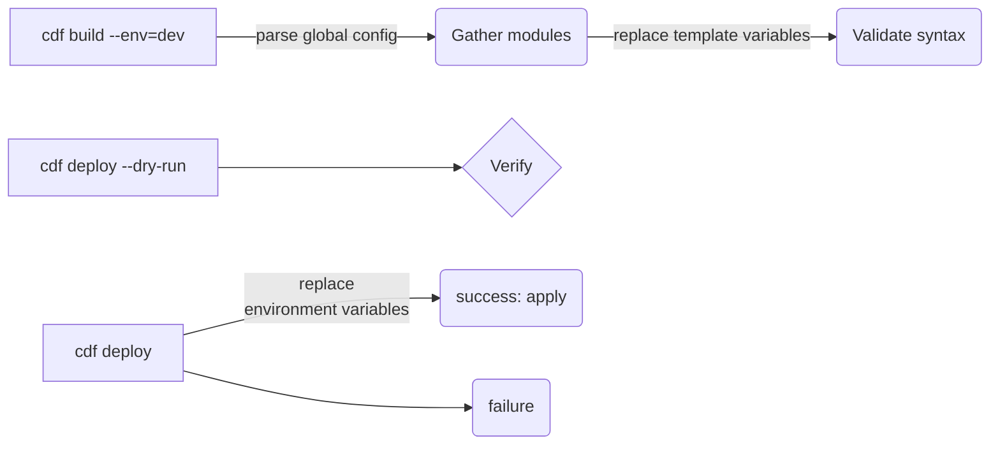


<Steps>
<Step title="Configure access to the CDF project">

You must set up authentication for the Cognite Toolkit to access the target CDF Project. Check the 
[Authentication](/cdf/deploy/cdf_toolkit/guides/auth) section for details.
</Step>

<Step title="Configure modules">

To configure the modules to deploy to a CDF project:

1.  The `cdf modules init` command will usually have created a `config.<env>.yaml` file for each of your environnments.

    <Note>
    You need one _config.\<env>.yaml_ file for each CDF project you deploy to. For example, if you have `prod`, `staging`, and `dev` projects/environments, you need _config.prod.yaml_, _config.staging.yaml_, and _config.dev.yaml_ configuration files.
    </Note>

2.  Open the configuration file, and edit the `project` property to match the name of your CDF project (line 3 in this example):

    ```yaml showLineNumbers
    environment:
      name: dev
      project: <customer-dev>
      type: dev
      selected:
        - cdf_demo_infield
        - cdf_oid_example_data
    ```

3.  In the `selected` property, list the modules you want to deploy (lines 6-7 above).

    You can list any of the modules in the _modules_ sub-directory.

4.  Update the variables in the `variables` section to match the CDF project you're deploying to, for example, to change the name of your default location.

    <Warning>
    Make sure that you update all the variables that are set to _\<change_me>_. If not, the module won't be deployed correctly.
    </Warning>

{/* See [Changing the default variables](#changing-the-default-variables) for details. */}

5.  Save the configuration file.
</Step>

<Step title="Build deployment artifacts">

To build the artifacts to deploy for the modules you have configured:

1. In a terminal, run these commands:

   ```sh
   cd <proj_dir>
   cdf build --env=dev
   ```

   The `--env=<env>` parameter specifies which configuration file to use, in this example _config.dev.yaml_.

The Cognite Toolkit substitutes the variables in the templates and creates a _build/_ output directory with the artifacts to deploy.
</Step>

<Step title="Deploy to the CDF project">

To deploy the configured artifacts to your CDF project:

1. In a terminal, run these commands to do a dry-run of the deployment:

   ```sh
   cdf deploy --dry-run
   ```

1. Inspect the output from the dry run and verify that the configurations and deployment perform as expected.

   

1. Run this command to deploy the artifacts to your CDF project:

   ```sh
     cdf deploy
   ```

To ensure that history and logs are not overwritten, the Cognite Toolkit deploys only configurations that have changed since the last run, and updates the configurations in the CDF project.

### Clean up configurations and data

To deploy from a clean state, you can remove configurations and data before you deploy. This is typically not
necessary for regular deployments, but can be useful, for example, for resources that rejects updates, and
you want to force a clean deployment. 

One use case is data modeling views. Views can reject an update as the change might require a version bump. If
you want to delete and recreate the view, which is common in development, you can use the `--drop` option to
remove the view before deploying it again.

<Warning>
Use these commands with caution to be sure that you do not accidentally delete configurations and data. 
Always run the commands first with the `--dry-run` option to inspect the potential impact.
</Warning>

#### Remove and redeploy configurations and data

To remove and redeploy configurations, but **keep the data**, run this command:

```sh
  cdf deploy --drop
```

To also remove and redeploy the data, add the `--drop-data` option:

```sh
  cdf deploy --drop --drop-data
```

To **delete everything** in your project that is managed by your configurations:

```sh
  cdf clean --dry-run
```
</Step>
</Steps>


<!-- SOURCE_END: docs.cognite.com/docs\cdf\deploy\cdf_toolkit\guides\usage.mdx -->

================================================================================


<!-- SOURCE_START: docs.cognite.com/docs\cdf\deploy\cdf_toolkit\index.mdx -->
## File: docs.cognite.com/docs\cdf\deploy\cdf_toolkit\index.mdx

---
title: Working with the Cognite Toolkit
description: Use the Cognite Toolkit to configure, deploy, and manage your Cognite Data Fusion projects.
content-type: map
audience: administrator
experience-level: 100
mode: 'wide'
lifecycle: use
article-type: map
---
<CardGroup cols={2}>
  <Card
    title="Setting up"
    icon="download"
    href="/cdf/deploy/cdf_toolkit/guides/setup">
    Install the Cognite Toolkit and establish your project file structure.
  </Card>

  <Card
    title="Configure, build, and deploy modules"
    icon="settings"
    href="/cdf/deploy/cdf_toolkit/guides/usage">
    Define modules, build artifacts, and deploy them to your CDF projects.
  </Card>

  <Card
    title="Working with modules"
    icon="box"
    href="/cdf/deploy/cdf_toolkit/references/packages/index">
    Explore official modules to configure common CDF use cases and workflows.
  </Card>

  <Card
    title="YAML reference library"
    icon="file-code"
    href="/cdf/deploy/cdf_toolkit/references/resource_library">
    Configure resource types with YAML files supported by the Toolkit.
  </Card>

  <Card
    title="API reference"
    icon="book"
    href="/cdf/deploy/cdf_toolkit/api/index">
    Learn about Cognite Toolkit configuration options and settings.
  </Card>

  <Card
    title="Upgrading"
    icon="arrow-up"
    href="/cdf/deploy/cdf_toolkit/guides/upgrade">
    Upgrade the Cognite Toolkit CLI and modules to the latest version.
  </Card>
</CardGroup>


<!-- SOURCE_END: docs.cognite.com/docs\cdf\deploy\cdf_toolkit\index.mdx -->

================================================================================


<!-- SOURCE_START: docs.cognite.com/docs\cdf\deploy\cdf_toolkit\references\naming_conventions.mdx -->
## File: docs.cognite.com/docs\cdf\deploy\cdf_toolkit\references\naming_conventions.mdx

---
title: Naming standards
description: Establishing a naming standard for CDF resource types and configurations is key to successfully deploy and administer CDF projects with the Cognite Toolkit.
content-type: reference
audience: dataEngineer
experience-level: 200
lifecycle: use
article-type: article
---
Establishing a naming standard for CDF resource types and configurations is key to successfully deploy and
administer CDF projects with the Cognite Toolkit.

## Separation tokens

In the naming standard, use separation tokens for "namespacing":

- For **external IDs**, use "\_" (underscore).

  External IDs are often used in code and configuration files and must be easily processed by code.

- For **names**, use ":" (colon) or "\_" (underscore).

  Names often appear in reports or user interfaces and should be easy to read.

## Example naming standard

The example below sets up a project based on the Open Industry Data (OID), and uses _oid_ as the location.

- The **location_name** = oid

- Source systems:

  - Workmate (asset and workorder data)
  - Fileshare (files and 3D)
  - PI (time series and data points)

```shell
CDF project
  Data sets:
    extId: ds_asset_oid ── name: asset:oid
      Extraction pipelines:
        extId: ep_src_asset_oid_workmate ── name: src:asset:oid:workmate
      
      RAW DB tables:
        DB: asset_oid_workmate ── table: assets
      
      Transformations:
        extId: tr_asset_oid_workmate_asset_hierarchy ── name: asset:oid:workmate:asset_hierarchy
      
      Authorization groups:
        id: asset:oid:extractor
        id: asset:oid:prosessing
        id: asset:oid:read
    
    extId: ds_files_oid ── name: files:oid
      Extraction pipelines:
        extId: ep_src_files_oid_fileshare ── name: src:files:oid:fileshare
        extId: ep_ctx_files_oid_fileshare:annotation ── name: ctx:files:oid:fileshare:annotation
      
      RAW DB tables:
        DB: files_oid_fileshare ── table: file_metadata
      
      Transformations:
        extId: tr_file_oid_fileshare_file_metadata ── name: file:oid:metadata:fileshare:file_metadata
      
      Functions:
        extId: fn_files_oid_fileshare_annotation ── name: files:oid:fileshare:annotation
      
      Authorisation groups:
        id: gp_files_oid_extractor
        id: gp_files_oid_prosessing
        id: gp_files_oid_read
    
    extId: ds_workorder_oid ── name: workorder:oid
      ...
    
    extId: ds_timeseries_oid ── name: timeseries:oid
      ...
    
    extId: ds_3d_oid ── name: 3d:oid
      ...
  
  Spaces:
    extId: sp_apm_oid ── name: oid
```

## Naming elements

- **Data type:** Asset, timeseries, workorder, files, 3d,... (use what is relevant for the project)
- **Source:** Source system (SAP, Workmate, Aveva, PI, Fileshare, SharePoint,..)
- **Location:** Location for asset, system, plant, installation, ...
- **Pipeline type:** _src_ = source data, _ctx_ = contextualization, _uc_ = use case, ...
- **Operation type:** Type of operation/action/functionality in transformation or CDF function.
- **Access type:** Type of access used in authorization groups (extractor, processing, read, ...)

### Data sets

```txt
External ID: ds_<data type>_<location>
Name: <data type>:<location>
Example: ds_asset_oid / asset:oid
```

### Extraction pipelines

```txt
External ID: ep_<pipeline type>_<data type>_<location>_<source>
Name: <pipeline type>:<data type>:<location>:<source>:
Example: ep_src_asset_oid_workmate / src:asset:oid:workmate
```

### RAW DB tables

```txt
DB: <data type>_<location>_<source>
Table: use name from source, or other descriptive name.
Example: asset_oid_workmate
```

### Transformations

```txt
External ID: tr_<data type>_<location>_<source>_<operation type>
Name: <data type>:<location>:<source>:<operation type>
Example: tr_asset_oid_workmate_asset_hierarchy / asset:oid:workmate:asset_hierarchy
```

### Functions

```txt
External ID: fn_<data type>_<location>_<source>_<operation type>
Name: <data type>:<location>:<source>:<operation type>
Example: fn_files_oid_fileshare_annotation / files:oid:fileshare:annotation
```

### Authorization groups

Groups don't have external IDs. We still recommend using the same naming convention as for external IDs.

```txt
Name: gp_<data type>_<location>_<access type>
Example:  gp_asset_oid_extractor / gp_asset_oid_processing / gp_asset_oid_read
```

### Authorization security categories

Security categories don't have external IDs. We still recommend using the same naming convention as for external IDs.

```txt
Name: sc_<data type>_<location>_<access type>
Example:  sc_asset_oid_extractor / sc_asset_oid_processing / sc_asset_oid_read
```

### Data model spaces

For data model spaces, it's important to distinguish between **data** spaces and **schema** spaces.
Schema spaces store the schema for the data model, `containers`, `views`, `node_types`, `data_models`,
but not data itself. Data spaces stores data, `nodes` and `edges`.

#### Data model spaces for data

```txt
space: sp_<data type>_<source>
Name: <data type>:<source>
Example: sp_apm_oid / apm:oid
```

#### Data model spaces for schema

```txt
space: sp_<model_type>_<model_identifier>
Name: <model_type>:<model_identifier>
Example: sp_enterprise_model_cognite / enterprise_model:cognite
Example: sp_solution_model_finance_predictonis / solution_model:finance_prediction
```


<!-- SOURCE_END: docs.cognite.com/docs\cdf\deploy\cdf_toolkit\references\naming_conventions.mdx -->

================================================================================


<!-- SOURCE_START: docs.cognite.com/docs\cdf\deploy\cdf_toolkit\references\packages\bootcamp.mdx -->
## File: docs.cognite.com/docs\cdf\deploy\cdf_toolkit\references\packages\bootcamp.mdx

---
title: Bootcamp
description: This set of modules are used in Cognite's bootcamp training material.
content-type: reference
audience: dataEngineer
experience-level: 100
lifecycle: use
article-type: article
---


<!-- SOURCE_END: docs.cognite.com/docs\cdf\deploy\cdf_toolkit\references\packages\bootcamp.mdx -->

================================================================================


<!-- SOURCE_START: docs.cognite.com/docs\cdf\deploy\cdf_toolkit\references\packages\cdf_demo_infield.mdx -->
## File: docs.cognite.com/docs\cdf\deploy\cdf_toolkit\references\packages\cdf_demo_infield.mdx

---
title: InField demo
description: A fully working demo for InField with sample data that is a good starting point for production projects.
content-type: reference
audience: dataEngineer
experience-level: 100
lifecycle: use
article-type: article
---
A fully working demo for InField with sample data. The **cdf_demo_infield** package is a good starting point
for production projects.

The recommended use is to start out with this package for all InField deployments. If you have a data dump that you want
to use instead of the Open Industrial Data sample data, you can copy the _cdf_oid_example_data_ into a new module
and then change the transformations to load your own data.

You can also replace the static data dump with data from data pipelines.

See [Stepwise guide to Infield](/cdf/deploy/cdf_toolkit/guides/set_up_infield) for more information.

| Package              | Modules                                                                                                                                                                 | Description                                                                                                                  |
| -------------------- | ----------------------------------------------------------------------------------------------------------------------------------------------------------------------- | ---------------------------------------------------------------------------------------------------------------------------- |
| **CDF_DEMO_INFIELD** |                                                                                                                                                                         | **A fully working demo for InField with sample data**.                                                                       |
|                      | [cdf_auth_readwrite_all](https://github.com/cognitedata/toolkit/blob/release/cognite_toolkit/cognite_modules/common/cdf_auth_readwrite_all)&nbsp;<sup>1</sup>           | Default access group for the Toolkit service account.                                                                        |
|                      | [cdf_oid_example_data](https://github.com/cognitedata/toolkit/blob/release/cognite_toolkit/cognite_modules/examples/cdf_oid_example_data)&nbsp;<sup>4</sup>             | Example data from [Open Industrial Data](https://hub.cognite.com/open-industrial-data-211/what-is-open-industrial-data-994). |
|                      | [cdf_apm_base](https://github.com/cognitedata/toolkit/blob/release/cognite_toolkit/cognite_modules/core/cdf_apm_base)&nbsp;<sup>2</sup>                                 | Basic data models for Asset Performance Management (APM) projects, including InField and Maintain.                           |
|                      | [cdf_infield_common](https://github.com/cognitedata/toolkit/blob/release/cognite_toolkit/cognite_modules/infield/cdf_infield_common)&nbsp;<sup>2</sup>                  | Common configurations for InField that are only needed once per CDF project.                                                 |
|                      | [cdf_infield_location](https://github.com/cognitedata/toolkit/blob/release/cognite_toolkit/cognite_modules/infield/cdf_infield_location)&nbsp;<sup>2,</sup><sup>3</sup> | Per location configurations necessary when setting up a new location for InField.                                            |

<sup>1</sup> Common, shared, CDF-project wide module.<br/>
<sup>2</sup> Module that defines a distinct capability or feature.<br/>
<sup>3</sup> Module with example data. Copy and use as starting point for new modules.<br/>
<sup>4</sup> Experimental module. Not ready for production use.


<!-- SOURCE_END: docs.cognite.com/docs\cdf\deploy\cdf_toolkit\references\packages\cdf_demo_infield.mdx -->

================================================================================


<!-- SOURCE_START: docs.cognite.com/docs\cdf\deploy\cdf_toolkit\references\packages\cdf_infield.mdx -->
## File: docs.cognite.com/docs\cdf\deploy\cdf_toolkit\references\packages\cdf_infield.mdx

---
title: InField
description: A production-ready package for InField that supports loading data from RAW tables and can be combined with data pipelines.
content-type: reference
audience: dataEngineer
experience-level: 100
lifecycle: use
article-type: article
---
A production-ready package for InField. The **cdf_infield** package supports loading data from RAW tables and
can also be combined with a number of data pipelines.

This module has no example data.

See [Setting up InField](/cdf/deploy/cdf_toolkit/guides/set_up_infield) for more information.

| Package         | Modules                                                                                                                                                                 | Description                                                                                        |
| --------------- | ----------------------------------------------------------------------------------------------------------------------------------------------------------------------- | -------------------------------------------------------------------------------------------------- |
| **CDF_INFIELD** |                                                                                                                                                                         | **Production-ready package for InField**.                                                          |
|                 | [cdf_auth_readwrite_all](https://github.com/cognitedata/toolkit/blob/release/cognite_toolkit/cognite_modules/common/cdf_auth_readwrite_all)&nbsp;<sup>1</sup>           | Default access group for the Toolkit service account.                                              |
|                 | [cdf_apm_base](https://github.com/cognitedata/toolkit/blob/release/cognite_toolkit/cognite_modules/core/cdf_apm_base)&nbsp;<sup>2</sup>                                 | Basic data models for Asset Performance Management (APM) projects, including InField and Maintain. |
|                 | [cdf_infield_common](https://github.com/cognitedata/toolkit/blob/release/cognite_toolkit/cognite_modules/infield/cdf_infield_common)&nbsp;<sup>2</sup>                  | Common configurations for InField that are only needed once per CDF project.                       |
|                 | [cdf_infield_location](https://github.com/cognitedata/toolkit/blob/release/cognite_toolkit/cognite_modules/infield/cdf_infield_location)&nbsp;<sup>2,</sup><sup>3</sup> | Per location configurations necessary when setting up a new location for InField.                  |

<sup>1</sup> Common, shared, CDF-project wide module.<br/>
<sup>2</sup> Module that defines a distinct capability or feature.<br/>
<sup>3</sup> Module with example data. Copy and use as starting point for new modules


<!-- SOURCE_END: docs.cognite.com/docs\cdf\deploy\cdf_toolkit\references\packages\cdf_infield.mdx -->

================================================================================


<!-- SOURCE_START: docs.cognite.com/docs\cdf\deploy\cdf_toolkit\references\packages\contextualization.mdx -->
## File: docs.cognite.com/docs\cdf\deploy\cdf_toolkit\references\packages\contextualization.mdx

---
title: Contextualization
description: These modules are examples of contextualization pipelines that can be used to connect data from different data sources.
content-type: reference
audience: dataEngineer
experience-level: 200
lifecycle: use
article-type: article
---
## cdf_connection_sql

This module assumes that data is ingested into the Cognite core data model (CDM) and that connections between data can be done with exact matches or with simple string manipulations. The module contains multiple transformations that read from CDM and write back to connections in the CDM.

## cdf_p_and_id_parser

This module assumes that data is ingested into the Cognite core data model (CDM) and that you have P&ID diagrams uploaded into CogniteFile or extensions of this view. The module contains a pipeline detecting assets, equipment, and time series in the P&ID diagrams and connecting them to the data in the CDM.


<!-- SOURCE_END: docs.cognite.com/docs\cdf\deploy\cdf_toolkit\references\packages\contextualization.mdx -->

================================================================================


<!-- SOURCE_START: docs.cognite.com/docs\cdf\deploy\cdf_toolkit\references\packages\data_model_examples.mdx -->
## File: docs.cognite.com/docs\cdf\deploy\cdf_toolkit\references\packages\data_model_examples.mdx

---
title: Data model examples
description: A tutorial to start using data models with Open Industrial Data example data and a simplified example data model for Asset Performance Management use cases.
content-type: reference
audience: dataEngineer
experience-level: 100
lifecycle: use
article-type: article
---
A tutorial to start using data models. The **data_model_examples** package contains the Open Industrial Data example data and a simplified example data model for Asset Performance Management (APM) use cases.

| Package                 | Modules                                                                                                                                                               | Description                                                                                                                  |
| ----------------------- | --------------------------------------------------------------------------------------------------------------------------------------------------------------------- | ---------------------------------------------------------------------------------------------------------------------------- |
| **DATA_MODEL_EXAMPLES** |                                                                                                                                                                       | **A tutorial to start using data models**.                                                                                   |
|                         | [cdf_auth_readwrite_all](https://github.com/cognitedata/toolkit/blob/release/cognite_toolkit/cognite_modules/common/cdf_auth_readwrite_all)&nbsp;<sup>1</sup>         | Default access group for the Toolkit service account.                                                                        |
|                         | [cdf_oid_example_data](https://github.com/cognitedata/toolkit/blob/release/cognite_toolkit/cognite_modules/examples/cdf_oid_example_data)&nbsp;<sup>2</sup>           | Example data from [Open Industrial Data](https://hub.cognite.com/open-industrial-data-211/what-is-open-industrial-data-994). |
|                         | [cdf_apm_simple_data_model](https://github.com/cognitedata/toolkit/blob/release/cognite_toolkit/cognite_modules/examples/cdf_apm_simple_data_model)&nbsp;<sup>2</sup> | Simplified example data model for Asset Performance Management (APM) use cases.                                              |

<sup>1</sup> Common, shared, CDF-project wide module.<br/>
<sup>2</sup> Experimental module. Not ready for production use.


<!-- SOURCE_END: docs.cognite.com/docs\cdf\deploy\cdf_toolkit\references\packages\data_model_examples.mdx -->

================================================================================


<!-- SOURCE_START: docs.cognite.com/docs\cdf\deploy\cdf_toolkit\references\packages\data_models.mdx -->
## File: docs.cognite.com/docs\cdf\deploy\cdf_toolkit\references\packages\data_models.mdx

---
title: Data models
description: These modules are examples of extensions of Cognite data models including CDM and IDM extensions.
content-type: reference
audience: dataEngineer
experience-level: 100
lifecycle: use
article-type: article
---
## cdf_cdm_extension

This is an example of an extension of the Cognite core data model (CDM). This is a minimal example that does not contain 3D and annotation views. It's intended to be used as a starting point for creating a more complex extension.

## cdf_cdm_extension_full

This is an example of an extension of the Cognite core data model (CDM). This is a complete extension of the entire CDM, including 3D and annotation views

## cdf_idm_extension

This is an example of an extension of the Cognite process industries data model (IDM). This is a minimal example that does not contain 3D and annotation views. It is intended to be used as a starting point for creating a more complex extension.

## cdf_idm_extension_full

This is an example of an extension of the Cognite process industries data model (IDM). This is a complete extension of the entire IDM, including 3D and annotation views.


<!-- SOURCE_END: docs.cognite.com/docs\cdf\deploy\cdf_toolkit\references\packages\data_models.mdx -->

================================================================================


<!-- SOURCE_START: docs.cognite.com/docs\cdf\deploy\cdf_toolkit\references\packages\example_pump.mdx -->
## File: docs.cognite.com/docs\cdf\deploy\cdf_toolkit\references\packages\example_pump.mdx

---
title: Pump example
description: Illustrates how to model an extension to the core Asset data model and create multiple sub-types with sample data and transformation.
content-type: reference
audience: dataEngineer
experience-level: 100
lifecycle: use
article-type: article
---
Illustrates how to model an extension to the core Asset data model, extend the data model, and then create multiple
different sub-types of this extended Asset data model. The package also includes a sample data set and a transformation to load the data
from the RAW tables.

| Package          | Modules                                                                                                                                                                     | Description                                                                                         |
| ---------------- | --------------------------------------------------------------------------------------------------------------------------------------------------------------------------- | --------------------------------------------------------------------------------------------------- |
| **EXAMPLE_PUMP** |                                                                                                                                                                             | **Example data models that extend the core asset data model**.                                      |
|                  | [example_pump_asset_hierarchy](https://github.com/cognitedata/toolkit/blob/release/cognite_toolkit/cognite_modules/examples/example_pump_asset_hierarchy)&nbsp;<sup>1</sup> | RAW data tables, data set, and transformation to load pump data into the asset hierarchy.           |
|                  | [cdf_asset_source_model](https://github.com/cognitedata/toolkit/blob/release/cognite_toolkit/cognite_modules/experimental/cdf_asset_source_model)&nbsp;<sup>2</sup>         | Example extended Asset data model for the pump asset hierarchy extending the core asset data model. |
|                  | [example_pump_data_model](https://github.com/cognitedata/toolkit/blob/release/cognite_toolkit/cognite_modules/experimental/example_pump_data_model)&nbsp;<sup>2</sup>       | Example Pump and LiftStation data models extending the extended Asset.                              |

<sup>1</sup> Module with example data. Copy and use as starting point for new modules.<br/>
<sup>2</sup> Experimental module. Not ready for production use.


<!-- SOURCE_END: docs.cognite.com/docs\cdf\deploy\cdf_toolkit\references\packages\example_pump.mdx -->

================================================================================


<!-- SOURCE_START: docs.cognite.com/docs\cdf\deploy\cdf_toolkit\references\packages\fieldops.mdx -->
## File: docs.cognite.com/docs\cdf\deploy\cdf_toolkit\references\packages\fieldops.mdx

---
title: FieldOps
description: These modules help you set up InField and InRobot with minimal configuration examples.
content-type: reference
audience: dataEngineer
experience-level: 100
lifecycle: use
article-type: article
---
## InField

This is a minimal example of the configuration you need to run InField.

## InRobot

This is a minimal example of the configuration you need to run InRobot.


<!-- SOURCE_END: docs.cognite.com/docs\cdf\deploy\cdf_toolkit\references\packages\fieldops.mdx -->

================================================================================


<!-- SOURCE_START: docs.cognite.com/docs\cdf\deploy\cdf_toolkit\references\packages\index.mdx -->
## File: docs.cognite.com/docs\cdf\deploy\cdf_toolkit\references\packages\index.mdx

---
title: Working with Cognite Toolkit modules
sidebar_title: Modules
description: Use pre-built modules to configure common CDF use cases and workflows.
content-type: map
audience: administrator
experience-level: 100
mode: 'wide'
lifecycle: use
article-type: map
---
Use pre-built modules as a starting point to configure common CDF use cases and workflows.

<CardGroup cols={2}>
  <Card
    title="Quickstart"
    icon="rocket"
    href="/cdf/deploy/cdf_toolkit/references/packages/quickstart">
    Configure data pipelines to ingest and contextualize data with industrial tools.
  </Card>

  <Card
    title="InField"
    icon="smartphone"
    href="/cdf/deploy/cdf_toolkit/references/packages/cdf_infield">
    Deploy a production-ready package for InField with RAW table support.
  </Card>

  <Card
    title="Bootcamp"
    icon="graduation-cap"
    href="/cdf/deploy/cdf_toolkit/references/packages/bootcamp">
    Access modules used in Cognite's bootcamp training material.
  </Card>

  <Card
    title="Data models"
    icon="network"
    href="/cdf/deploy/cdf_toolkit/references/packages/data_models">
    Extend Cognite data models including CDM and IDM extensions.
  </Card>

  <Card
    title="Contextualization"
    icon="link"
    href="/cdf/deploy/cdf_toolkit/references/packages/contextualization">
    Connect data from different sources with contextualization pipelines.
  </Card>

  <Card
    title="Industrial tools"
    icon="wrench"
    href="/cdf/deploy/cdf_toolkit/references/packages/industrial_tools">
    Configure built-in CDF applications including location filters and search.
  </Card>


  <Card
    title="Source systems"
    icon="database"
    href="/cdf/deploy/cdf_toolkit/references/packages/source_systems">
    Configure source system integrations and data pipelines.
  </Card>
</CardGroup>


<!-- SOURCE_END: docs.cognite.com/docs\cdf\deploy\cdf_toolkit\references\packages\index.mdx -->

================================================================================


<!-- SOURCE_START: docs.cognite.com/docs\cdf\deploy\cdf_toolkit\references\packages\industrial_tools.mdx -->
## File: docs.cognite.com/docs\cdf\deploy\cdf_toolkit\references\packages\industrial_tools.mdx

---
title: Industrial tools
description: These modules are examples of how to configure the built-in applications in Cognite Data Fusion including location filters and search configurations.
content-type: reference
audience: dataEngineer
experience-level: 100
lifecycle: use
article-type: article
---
## cdf_location_filter_asset_centric

This contains two examples of `LocationFilter` configurations that are based on a classical asset centric data model.

## cdf_location_filter_datamodel_based

This contains an example of a `LocationFilter` configuration that is based on a data model.

## cdf_search

This contains an example of a `LocationFilter` configuration that is based on a data model.


<!-- SOURCE_END: docs.cognite.com/docs\cdf\deploy\cdf_toolkit\references\packages\industrial_tools.mdx -->

================================================================================


<!-- SOURCE_START: docs.cognite.com/docs\cdf\deploy\cdf_toolkit\references\packages\quickstart.mdx -->
## File: docs.cognite.com/docs\cdf\deploy\cdf_toolkit\references\packages\quickstart.mdx

---
title: Running the quickstart demo
description: Run the quickstart package in the CDF Notebook environment to configure data pipelines and industrial tools.
content-type: procedure
audience: developer
experience-level: 200
lifecycle: setup
article-type: article
---
<Warning>
The quickstart demo is currently in alpha and is likely to change. Do **not** use this in production systems.
</Warning>

The quickstart package has a Notebook interface to run it as a demo and in the CDF Notebook environment. This procedure is for developers and data engineers who want to test the quickstart modules that configure Cognite Data Fusion with data pipelines to ingest and contextualize data and set up industrial tools.

**Prerequisites:** Access to a CDF project with permissions to create service accounts and access Jupyter Notebook.

## Run the quickstart package in CDF Notebook

<Steps>
<Step title="Create a service account and credentials">
  1. Go to `Admin` -> `My organization`.
  2. Create a CDF service account. Store the Client ID.
  3. Click the newly created service account and create new credentials. Store the Client Secret.
</Step>

<Step title="Create a new Notebook">
  1. Go to `Data management` -> `Build solutions` and select `Jupyter Notebook`.
  2. Create a new Notebook.
</Step>

<Step title="Install cognite-toolkit">
  Copy-paste the content below into a cell and execute it.

  Installing cognite-toolkit in the CDF notebook environment:
  ```python
  import micropip

  micropip.uninstall("prompt-toolkit")

  %pip install cognite-toolkit
  ```
  We uninstall `prompt-toolkit` because the Pyodide environment has an issue resolving dependencies. The dependency is reinstalled in a compatible version when you install `cognite-toolkit`.
</Step>

<Step title="Import and instantiate the Cognite ToolkitDemo">
  ```python
  from cognite_toolkit.demo import CogniteToolkitDemo

  toolkit = CogniteToolkitDemo()
  ```
</Step>

<Step title="Set up the configuration and credentials">
  Set up the configuration and credentials to run the quickstart package:
  ```
  # This is used in the extension of the Cognite Process Indusdry Model
  my_organization = "<your_organization_name>"
  client_id = "<your_client_id>" # The client ID of the service account
  client_secret = "<your_client_secret>" # The client secret of the service account
  ```
</Step>

<Step title="Run the quickstart package">
  Running the quickstart package:
  ```python
  toolkit.quickstart(my_organization, client_id, client_secret)
  ```

  The last cell does the equivalent of running `cdf auth verify`, `cdf modules init` (selecting quickstart and choosing example data), `cdf build` and `cdf deploy`.
</Step>
</Steps>


<!-- SOURCE_END: docs.cognite.com/docs\cdf\deploy\cdf_toolkit\references\packages\quickstart.mdx -->

================================================================================


<!-- SOURCE_START: docs.cognite.com/docs\cdf\deploy\cdf_toolkit\references\packages\source_systems.mdx -->
## File: docs.cognite.com/docs\cdf\deploy\cdf_toolkit\references\packages\source_systems.mdx

---
title: Source systems
description: This set of modules are data pipelines that extract data from source systems like OSIsoft/AVEVA PI, SAP, and SharePoint into CDF.
content-type: reference
audience: dataEngineer
experience-level: 200
lifecycle: use
article-type: article
---
## cdf_pi

This is an example of OSIsoft/AVEVA PI data source system ingestion into CDF.

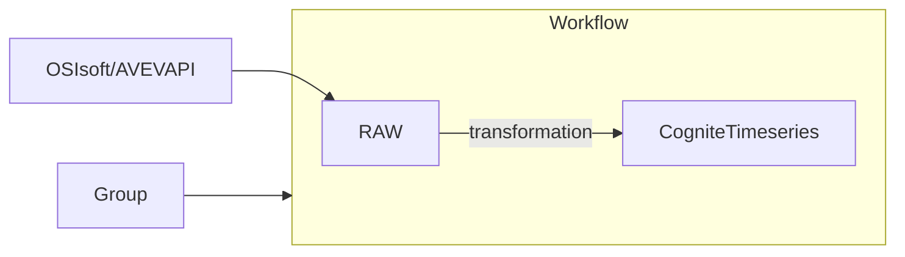

### Managed resources

- [RAW Table] &mdash; the staging area for the data from the source system.
- [Transformation] &mdash; moves the data from the RAW table to the CogniteTimeSeries.
- [Space] &mdash; the data space where the data is stored.
- [Group] &mdash; the group that controls the access of the workflow that executes the transformation.
- [DataSet] &mdash; controls the access to the transformation.
- [Workflow] &mdash; the workflow that runs the transformation that moves the data from the RAW table to the Cognite time series.

### Variables

| Key                                | Description                                                         | Example Value                           |
| ---------------------------------- | ------------------------------------------------------------------- | --------------------------------------- |
| sourceName                         | The display name of the source.                                     | Springfield AVEVA PI                    |
| sourceId                           | The identifier of the source.                                       | springfield_aveva_pi                    |
| timeseriesTransformationExternalId | The identifier of the transformation.                               | pi_timeseries_springfield_aveva_pi      |
| dataset                            | The dataset to control access to the transformation.                | ingestion                               |
| rawSourceDatabase                  | The staging area database.                                          | ingestion                               |
| schemaSpace                        | The schema space for the target CogniteTimeSeries.                  | cdf_cdm                                 |
| instanceSpace                      | The data space to store the time series.                            | springfield_instances                   |
| groupSourceId                      | The source ID for the service principal that runs the workflow.     | 12345-6789                              |
| workflow                           | The name of the workflow to run the transformation.                 | aveva_pi_population                     |
| workflowClientId                   | The client ID for the service principal that runs the workflow.     | `${AVEVA_PI_SPRINGFIELD_CLIENT_ID}`     |
| workflowClientSecret               | The client secret for the service principal that runs the workflow. | `${AVEVA_PI_SPRINGFIELD_CLIENT_SECRET}` |

The variable values `${AVEVA_PI_SPRINGFIELD_CLIENT_ID}` and `${AVEVA_PI_SPRINGFIELD_CLIENT_SECRET}` are
placeholders for environment variables. Use these for secrets and other sensitive information. In
the build process, the variable `{{ workflowClientId }}` is replaced with the `${AVEVA_PI_SPRINGFIELD_CLIENT_ID}`
which in the deployment process will be replaced with the actual value of the environment variable.

## cdf_sap_assets

This is an example of SAP source system asset/equipment data pipeline into CDF.

## SAP source system events

This is an example of SAP source system event data pipeline into CDF.

## Sharepoint files

This is an example of SharePoint source system file data pipeline into CDF.


<!-- SOURCE_END: docs.cognite.com/docs\cdf\deploy\cdf_toolkit\references\packages\source_systems.mdx -->

================================================================================


<!-- SOURCE_START: docs.cognite.com/docs\cdf\deploy\cdf_toolkit\references\resource_library.mdx -->
## File: docs.cognite.com/docs\cdf\deploy\cdf_toolkit\references\resource_library.mdx

---
title: YAML reference library
description: The YAML resource configuration files are core to the Cognite Toolkit, with each file configuring one of the resource types supported by the Cognite Toolkit and the Cognite API.
content-type: reference
audience: dataEngineer
experience-level: 200
lifecycle: use
article-type: article
---
The YAML **resource configuration files** are core to the Cognite Toolkit. Each of the files configures one of the
**resource types** that are supported by the Cognite Toolkit and the Cognite API. This article describes how to configure the
different resource types.

The Cognite Toolkit bundles logically connected resource configuration files in **modules**, and each module stores the
configuration files in directories corresponding to the resource types, called **resource directories**. The available
resource directories are:

```shell
<module_name>/
  3dmodels/
  agents/ (alpha)
  auth/
  cdf_applications/
  classic/
  data_models/
  data_sets/
  extraction_pipelines/
  files/
  functions/
  hosted_extractors/
  locations/
  raw/
  robotics/
  streamlit/
  timeseries/
  transformations/
  workflows/
```

A resource directory can host one or more configuration types. For example, the `data_models/` directory hosts
the configuration files for spaces, containers, views, data models, and nodes. While the `classic/` directory hosts the
configuration files for labels, assets, and sequences.

When you deploy, the Cognite Toolkit uses the Cognite API to implement the YAML configurations in the CDF project.

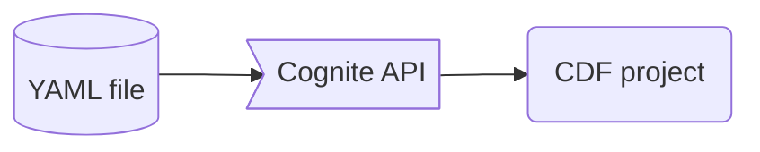

In general, the format of the YAML files matches the [API specification](https://api-docs.cognite.com/20230101) for the resource types. We recommend
that you use the `externalId` of the resources as (part of) the name of the YAML file. This is to enable using the same resource
configuration across multiple CDF projects, for example, a development, staging and production project. Use number prefixes
(_1.\<filename.suffix>_) to control the order of deployment within each resource type.

## 3D Models

**Resource directory: _3dmodels/_**

_Requires Cognite Toolkit v0.3.0 or later_

**API documentation:** [3D models](https://api-docs.cognite.com/20230101/tag/3D-Models/operation/create3DModels)

3D model configurations are stored in the module's _3dmodels/_ directory. You can have one or more 3D models in a single YAML file.
The filename must end with `3DModel`, for example, `my_3d_model.3DModel.yaml`.

Example 3D model configuration:

```yaml title="my_3d_model.3DModel.yaml"
name: my_3d_model
dataSetExternalId: ds_3d_models
metadata:
  origin: cognite-toolkit
```

<Note>
The 3D model API uses an **internal ID** for the `dataSetId`, while the YAML configuration files reference the **external ID**; `dataSetExternalId`.
The Cognite Toolkit resolves the external ID to the internal ID before sending the request to the Cognite API.
</Note>

## Agents

**Resource directory: _agents/_**

_Requires Cognite Toolkit v0.5.85 or later and alpha flag `agents` enabled_

**API documentation:** [Agents](https://api-docs.cognite.com/20230101-beta/tag/Agents/operation/main_ai_agents_post)

Agent configurations are stored in the module's _agents/_ directory. You can have one or more agents in a single YAML file.
It's recommended to have one agent per file. The filename must end with `Agent`, for example, `my_agent.Agent.yaml`.

Example agent configuration:

```yaml title="my_agent.Agent.yaml"
externalId: my_agent
name: My Agent
description: This is my agent
instructions: This is instructions the agent.
model: azure/gpt-4o-mini
tools:
  - type: askDocument
    name: Document Search
    description: Search for information in documents.
```

### Available tools

This section lists the available tools that you can use in the agent configuration. Note that this is a service
in rapid development, and there may be more tools available than what is listed here. When you use a tool that
the Cognite Toolkit doesn't recognize, you will get a warning when running the `cdf build` command. However, you
can still deploy the tool to CDF as long as the CDF API supports the tool.

**Ask document**

```yaml fragment="AskDocument"
...
- type: askDocument
  name: Document Search
  description: Search for information in documents.
```

**Summarize document**

```yaml fragment="SummarizeDocument"
- type: summarizeDocument
  name: Document Summarization
  description: Summarize the content of a document.
```

**Ask knowledge graph**

```yaml fragment="AskKnowledgeGraph"
- type: queryKnowledgeGraph
  name: Knowledge Graph Query
  description: Query the knowledge graph for information.
  configuration:
    dataModels:
      - space: cdf_cdm
        externalId: CogniteCore
        version: v1
        viewExternalIds:
        - CogniteAsset
        - CogniteEquipment
        - CogniteTimeSeries
        - CogniteFile
        - CogniteActivity
    instanceSpaces:
      type: manual
      spaces:
      - my_space
      - my_other_space
    # Or you can include all instance spaces with
   # instanceSpaces:
   #  type: all
   
```

**Query time series data points**

```yaml fragment="queryTimeSeriesDatapoints"
- type: queryTimeSeriesDatapoints
  name: Time Series Query
  description: Query time series data.
```


## Assets

**Resource directory: _classic/_**

_Requires Cognite Toolkit v0.3.0 or later_

**API documentation:** [Assets](https://api-docs.cognite.com/20230101/tag/Assets/operation/createAssets)

Asset configurations are stored in the module's _classic/_ directory. You can have one or more asset in a single YAML file.
The filename must end with `Asset`, for example, `my_asset.Asset.yaml`.

Example Asset configuration:

```yaml title="my_root.Asset.yaml"
externalId: my_root_asset
name: SAP hierarchy
description: The root asset in the SAP hierarchy
dataSetExternalId: ds_sap_assets
source: SAP
metadata:
  origin: cognite-toolkit
```

<Note>

The asset API uses an **internal ID** for the data set, while the YAML configuration files reference the **external ID**; `dataSetExternalId`. The Cognite Toolkit resolves the external ID to the internal ID before sending the request to the Cognite API.

</Note>

The Cognite Toolkit supports all fields in the Asset API. See below for a complete example:

```yaml title="my_asset.Asset.yaml"
externalId: my_asset
name: My asset
parentExternalId: my_root_asset
description: This is my asset
dataSetExternalId: ds_assets
source: SAP
metadata:
  origin: cognite-toolkit
  my_custom_field: my_custom_value
labels:
  externalId: my_label
```

<Note>

The CogniteToolkit doesn't support the field `parentId` in the asset configuration. Instead, use `parentExternalId`.
The `parentId` field is an **internal ID** that is not consistent across environments.

</Note>

### Table formats

In addition to `yaml`, the Cognite Toolkit supports `csv` and `parquet` formats for asset configurations. As with the `yaml` format,  the filename must end with `Asset`, for example, `my_asset.Asset.csv`.

```csv title="my_root.Asset.csv" wrap
externalId,name,description,dataSetExternalId,source,metadata.origin
my_root_asset,SAP hierarchy,The root asset in the SAP hierarchy,ds_sap_assets,SAP,cognite-toolkit
```

The column names must match the field names in the `yaml` configuration. The exception is the `metadata` field,
which is a dictionary in the `yaml` configuration, but a string in the `csv` configuration. This is solved by using the
notation `metadata.origin` column in the `csv` configuration.

## Groups

**Resource directory: _auth/_**

**API documentation:** [Groups](https://api-docs.cognite.com/20230101/tag/Groups/operation/createGroups)

The group configuration files are stored in the module's _auth/_ directory. You can have one or more groups in a single YAML file.
The filename must end with `Group`, for example, `my_group.Group.yaml`.

The `name` field is used as a unique identifier for the group. If you change the name of the group manually in CDF,
it will be treated as a different group and will be ignored by the Cognite Toolkit.

**Example group configuration:**

```yaml title="my_group.Group.yaml"
name: 'my_group'
sourceId: '{{mygroup_source_id}}'
metadata:
  origin: 'cognite-toolkit'
capabilities:
  - projectsAcl:
      actions:
        - LIST
        - READ
      scope:
        all: {}
```

We recommend using the `metadata:origin` property to indicate that the group is created by the Cognite Toolkit

You can specify each ACL capability in CDF as in the `projectsAcl` example above. Scoping to dataset, space, RAW table,
current user, or pipeline is also supported (see [ACL scoping](#ACL-scoping)).

### Groups and group deletion

If you delete groups with the `cdf clean` or `cdf deploy --drop` command, the Cognite Toolkit skips the groups that the running
user or service account is a member of. This prevents the cleaning operation from removing access rights from
the running user and potentially locking the user out from further operation.

### ACL scoping

#### Dataset scope

Use to restrict access to data in a specific **data set**.

```yaml title="<fragment>"
- threedAcl:
    actions:
      - READ
    scope:
      datasetScope: { ids: ['my_dataset'] }
```

<Note>
The groups API uses an **internal ID** for the data set, while the YAML configuration files reference the **external ID**. The Cognite Toolkit resolves the external ID to the internal ID before sending the request to the Cognite API.
</Note>

#### Space scope

Use to restrict access to data in a **data model space**.

```yaml title="<fragment>"
- dataModelInstancesAcl:
    actions:
      - READ
    scope:
      spaceIdScope: { spaceIds: ['my_space'] }
```

#### Table scope

Use to restrict access to a **database**.

```yaml title="<fragment>"
- rawAcl:
    actions:
      - READ
      - WRITE
    scope:
      tableScope:
        dbsToTables:
          my_database: []
```
Use to restrict access to a **table** in a database.

```yaml title="<fragment>"
- rawAcl:
    actions:
      - READ
      - WRITE
    scope:
      tableScope:
        dbsToTables:
          my_database: ["my_table", "my_other_table"]
```


<Caution>
The CDF API also supports `my_database: {"tables": []}` and `my_database: {"tables": ["my_table"]}` to restrict
access to all tables in a database or a specific table in a database. The Cognite Toolkit will warn you if you use 
these notations, because the `cdf dump group` and `cdf modules pull` commands work better with consistent YAML files.
The toolkit recommends using only the list notation.
</Caution>

#### Current user-scope

Use to restrict actions to the **groups the user is a member of**.

```yaml title="<fragment>"
- groupsAcl:
    actions:
      - LIST
      - READ
    scope:
      currentuserscope: {}
```

## Security categories

_Requires Cognite Toolkit v0.2.0 or later_

**Resource directory: _auth/_**

**API documentation:** [Security categories](https://api-docs.cognite.com/20230101/tag/Security-categories)

The security categories are stored in the module's _auth/_ directory. You can have one or more security categories in a single YAML file.

We recommend that you start security category names with `sc_` and use `_` to separate words. The file name is not significant,
but we recommend that you name it after the security categories it creates.

```yaml title="project_categories.SecurityCategory.yaml"
- name: sc_my_security_category
- name: sc_my_other_security_category
```

## Data models

**Resource directory: _data_models/_**

**API documentation:** [Data modeling](https://api-docs.cognite.com/20230101/tag/Data-Modeling)

The data model configurations are stored in the module's _*data_models*_ directory.

A data model consists of a set of data modeling entities: one or more [spaces](#spaces), [containers](#containers), [views](#views), and [data models](#data-models). Each entity has its own file with a suffix to indicate the entity type: _my.space.yaml_, _my.container.yaml_, _my.view.yaml_, _my.datamodel.yaml_.

You can also use the Cognite Toolkit to create [nodes](#nodes) to keep configuration for applications (for instance, InField) and to create node types that are part of the data model. Define nodes in files with the _.node.yaml_ suffix.

The Cognite Toolkit applies configurations in the order of dependencies between the entity types: first **spaces**, next **containers**, then **views**, and finally **data models**.

If there are dependencies between the entities of the same type, you can use prefix numbers in the filename to have the Cognite Toolkit apply the files in the correct order.

The Cognite Toolkit supports using subdirectories to organize the files, for example:

```shell
data_models/
  containers/
  views/
  nodes/
  my_data_model.datamodel.yaml
  data_model_space.space.yaml
```

### Spaces

**API documentation:** [Spaces](https://api-docs.cognite.com/20230101/tag/Spaces/operation/ApplySpaces)

Spaces are the top-level entities and is the home of containers, views, and data models. You can create a space with a _.space.yaml_ file in the _data_models/_ directory.

```yaml title="sp_cognite_app_data.space.yaml"
space: sp_cognite_app_data
name: cognite:app:data
description: Space for InField app data
```

CDF doesn't allow a space to be deleted unless it's empty. If a space contains, for example, nodes that aren't governed
by the Cognite Toolkit, the Cognite Toolkit will not delete the space.

### Containers

**API documentation:** [Containers](https://api-docs.cognite.com/20230101/tag/Containers/operation/ApplyContainers)

Containers are the home of properties and data. You can create a container with a _.container.yaml_ file in
the _data_models/_ directory. You can also create indexes and constraints according to the API specification.

```yaml title="MyActivity.container.yaml"
externalId: MyActivity
usedFor: node
space: sp_activity_data
description: 'A container for activity data.'
name: The display name of the container
properties:
  id:
    type:
      type: text
      list: false
      collation: ucs_basic
    nullable: true
    immutable: false
    autoIncrement: false
  title:
    type:
      type: text
      list: false
      collation: ucs_basic
    nullable: true
    defaultValue: No title
    description: The title of the activity
    name: Display name of the title property
  description:
    type:
      type: text
      list: false
      collation: ucs_basic
    nullable: true
  asset:
    type:
      type: direct
      list: false
    nullable: true
    description: The asset the activity is related to
indexes:
  idLookup:
    properties:
      - id
    indexType: btree
    cursorable: true
constraints:
  idUnique:
    constraintType: uniqueness
    properties:
      - id
```

The example container definition creates a container with the properties `id`, `title`, `description`, and `asset`.

Note that `sp_activity_data` requires its own _activity_data.space.yaml_ file in the _data_models/_ directory.

### Views

**API documentation:** [Views](https://api-docs.cognite.com/20230101/tag/Views/operation/ApplyViews)

Use views to ingest, query, and structure the data into meaningful entities in your data model. You can create a view with a _.view.yaml_ file in the _data_models/_ directory.

```yaml title="MyActivity.view.yaml" wrap
externalId: MyActivity
name: MyActivity
description: 'An activity represents a set of maintenance tasks with multiple operations for individual assets. The activity is considered incomplete until all its operations are finished.'
version: '3'
space: sp_activity_model
implements:
  - type: view
    externalId: CogniteActivity
    space: cdf_cdm
    version: v1
properties:
  id:
    description: 'Unique identifier from the source, for instance, an object ID in SAP.'
    container:
      type: container
      space: sp_activity_data
      externalId: MyActivity
    containerPropertyIdentifier: id
  title:
    description: 'A title or brief description of the maintenance activity or work order.'
    container:
      type: container
      space: sp_activity_data
      externalId: MyActivity
    containerPropertyIdentifier: title
  description:
    description: 'A detailed description of the maintenance activity or work order.'
    container:
      type: container
      space: sp_activity_data
      externalId: MyActivity
    containerPropertyIdentifier: description
  asset:
    description: 'The asset the activity is related to.'
    container:
      type: container
      space: sp_activity_data
      externalId: MyActivity
    containerPropertyIdentifier: asset
    source:
      type: view
      externalId: MyAsset
      space: sp_activity_model
      version: '2'
```

This example view configuration creates a view with the properties `id`, `title`, `description`, and `asset`.
The `asset` property references the `MyAsset` view in the `sp_activity_model` space.

The view references the properties from the container `MyActivity` in the `sp_activity_data` space. The view
exists in a space called `sp_activity_model`, while the container exists in the `sp_activity_data` space.

### Data models

**API documentation:** [Data models](https://api-docs.cognite.com/20230101/tag/Data-models/operation/createDataModels)

Use data models to structure the data into knowledge graphs with relationships between views using edges.
From an implementation perspective, a data model is a collection of views.

You can create a data model with a _.datamodel.yaml_ file in the _data_models/_ directory.

```yaml title="ActivityDataModel.datamodel.yaml" wrap
externalId: ActivityDataModel
name: My activity data model
version: '1'
space: sp_activity_model
description: 'A data model for structuring and querying activity data.'
views:
  - type: view
    externalId: MyActivity
    space: sp_activity_model
    version: '3'
  - type: view
    externalId: MyTask
    space: sp_activity_model
    version: '2'
```

The example data model configuration creates a data model with two views: `MyActivity` and `MyTasks`.
The data model exists in a space called `sp_activity_model` together with the views.

### Nodes

**API documentation:** [Instances](https://api-docs.cognite.com/20230101/tag/Instances/operation/applyNodeAndEdges)

Use nodes to populate a data model. You can create nodes with a _.node.yaml_ file in the _data_models/_ directory.

```yaml title="myapp_config.node.yaml" wrap
- space: sp_config
  externalId: myapp_config
  type:
    space: sp_config_schema
    externalId: ConfigNode
  sources:
    - source:
        space: sp_config
        externalId: MY_APP_Config
        version: '1'
        type: view
      properties:
        rootLocationConfigurations:
          - assetExternalId: 'my_root_asset_external_id'
            adminGroup:
              - gp_template_admins
        dataSpaceId: sp_activity_data
        modelSpaceId: sp_activity_model
        activityDataModelId: MyActivity
        activityDataModelVersion: '1'
```

This example node configuration creates a node instance with data that configures a node of the
type `MY_APP_Config` with version '1' in the `sp_config` space. The instance has data that is read by MY_APP and used to configure the application.

The node instance is created in the `sp_config` space with `myapp_config` as the `externalId`. The example also
configures a root location for the application and specifies how to find the application's data: in the `sp_activity_data`
space with version `1` of the `MyActivity`view.

Another example is **node types**. They are part of a data model schema (the description of how data is structured),
and creates a type of node that can be created in the data model. This is an example of a YAML file
with multiple node types defined.

```yaml title="myapp_config.node.yaml" wrap
- space: sp_my_model
  externalId: pump
- space: sp_my_model
  externalId: valve
- space: sp_config_schema
  externalId: ConfigNode
```

### Edges

_Requires Cognite Toolkit v0.4.0 or later_

**API documentation:** [Instances](https://api-docs.cognite.com/20230101/tag/Instances/operation/applyNodeAndEdges)

Use edges to define connections between nodes in a data model. You can create edges with a _.edge.yaml_ file in the _data_models/_ directory.

You can have one or more edges in a single YAML file. The filename must end with `Edge`, for example, `my_edge.Edge.yaml`.

```yaml title="my_edge.Edge.yaml" wrap
space: sp_instance
externalId: 'MyEdge'
startNode:
  space: sp_instance
  externalId: 'startNode'
endNode:
  space: sp_instance
  externalId: 'endNode'
type:
  space: sp_schema
  externalId: 'AnEdgeType'
sources:
  - source:
      space: sp_schema
      externalId: 'MyView'
      version: v1
      type: 'view'
    properties:
      myProperty: 'myValue'
```

## Data sets

**Resource directory: _data_sets/_**

**API documentation:** [Data sets](https://api-docs.cognite.com/20230101/tag/Data-sets/operation/createDataSets)

You can not delete data sets in CDF, but you can use the Cognite Toolkit to create new data sets or update existing ones.
You can create multiple data sets in the same YAML file. The filename must end with `DataSet`, for example, `my_data_set.DataSet.yaml`.

<Note>

The data sets API uses an **internal ID** for the data set, while the YAML configuration files reference the
**external ID**; `dataSetExternalId`. The Cognite Toolkit resolves the external ID to the internal ID before
sending the request to the Cognite API. For an example, see [files](#files-dir-files).

</Note>

```yaml title="data_sets.DataSet.yaml" wrap
- externalId: ds_asset_hamburg
  name: asset:hamburg
  description: This dataset contains asset data for the Hamburg location.
  writeProtected: false
  metadata:
    origin: cognite-toolkit
- externalId: ds_files_hamburg
  name: files:hamburg
  description: This dataset contains files for the Hamburg location.
  writeProtected: false
  metadata:
      origin: cognite-toolkit
```

This example configuration creates two data sets using the [naming conventions](/cdf/deploy/cdf_toolkit/references/naming_conventions) for data sets.

## Events

_Requires Cognite Toolkit v0.4.0 or later_

**Resource directory: _classic/_**

**API documentation:** [Events](https://api-docs.cognite.com/20230101/tag/Events/operation/createEvents)

Events can be found in the module's `classic/` directory. You can define one or more events in a single YAML file.
The filename must end with `Event`, for example, `my_event.Event.yaml`.

The Cognite Toolkit ensures that dependent resources are created before the events. For example, if you reference an
asset or a data set in an event, the Cognite Toolkit creates the asset or data set before creating the event.

Example event definition:

```yaml title="my_event.Event.yaml" wrap
externalId: MyEvent
dataSetExternalId: ds_complete_org
startTime: 1732959346052
endTime: 1732959346052
type: 'success'
subtype: 'info'
description: 'My event description'
metadata:
  key: value
assetExternalIds:
  - MyAsset
  - MyAsset2
source: 'my_source'
```

<Note>
The data set is referenced by the `dataSetExternalId` and `assetExternalIds`. The Cognite Toolkit automatically
resolves the external ID to the internal ID of the data set and assets before sending the request to CDF.
</Note>


## InfieldV1

_Requires Cognite Toolkit v0.5.10 or later and alpha flag `infield` enabled_

**Resource directory: _cdf_applications/_**

InfieldV1 can be found in the modules `cdf_applications/` directory. You can define one or more InfieldV1 configurations in a single YAML file.
The filename must end with `InfieldV1`, for example, `my_infield_app.InfieldV1.yaml`.

The Cognite Toolkit ensures that dependent resources are created before the InfieldV1 applications. For example, if you 
reference a space, data sets, assets, or groups in the InfieldV1 configuration, the Cognite Toolkit creates it before creating the InfieldV1 configuration.

Example InfieldV1 configuration:

```yaml title="my_infield_app.InfieldV1.yaml" wrap
externalId: default_infield_config_minimal
featureConfiguration:
  rootLocationConfigurations:
  - assetExternalId: WMT:VAL
    appDataInstanceSpace: sp_infield_oid_app_data
    sourceDataInstanceSpace: sp_asset_oid_source
    templateAdmins:
    - gp_infield_oid_template_admins
    checklistAdmins:
    - gp_infield_oid_checklist_admins
    dataSetExternalId: ds_complete_org
customerDataSpaceId: APM_SourceData
customerDataSpaceVersion: '1'
name: Infield APM App Config
```

<Note>
The data set is referenced by the `dataSetExternalId`. The Cognite Toolkit automatically
resolves the external ID to the internal ID of the data set.
</Note>


## Labels

_Requires Cognite Toolkit v0.3.0 or later_

**Resource directory: _classic/_** (_labels/_ in `v0.2.0`)

**API documentation:** [Labels](https://api-docs.cognite.com/20230101/tag/Labels/operation/createLabelDefinitions)

Labels can be found in the module's `classic/` directory. You can define one or more labels in a single YAML file.
The filename must end with `Label`, for example, `my_equipment.Label.yaml`.

The Cognite Toolkit creates labels before files and other resources that reference them.

Example label definition:

```yaml title="my_equipment.Label.yaml" wrap
- externalId: label_pump
  name: Pump
  description: A pump is an equipment that moves fluids.
  dataSetExternalId: ds_labels_{{example_variable}}
```

<Note>
The Cognite API doesn't support updating labels. When you update a label with the Cognite Toolkit, it deletes the previous label and creates a new one.
</Note>

## Extraction pipelines

**Resource directory: _extraction_pipelines/_**

**API documentation:** [Extraction pipelines](https://api-docs.cognite.com/20230101/tag/Extraction-Pipelines/operation/createExtPipes)

**API documentation Configuration:** [Extraction pipeline config](https://api-docs.cognite.com/20230101/tag/Extraction-Pipelines-Config/operation/createExtPipeConfig)

**Documentation:** [Extraction pipeline documentation](/cdf/integration/guides/interfaces/add_integrations)

Extractor pipelines and configurations are stored in the module's _extraction_pipelines/_ directory. You can define one or
more extraction pipelines in a single YAML file. It is, however, most common to have one pipeline per file. In
addition, one or more the extraction pipeline configurations must be stored in a separate file. Extraction pipeline
configurations are detected by the `.config` suffix, while extraction pipeline filenames end with `ExtractionPipeline`.

```yaml title="ep_src_asset_hamburg_sap.ExtractionPipeline.yaml"
externalId: 'ep_src_asset_hamburg_sap'
name: 'src:asset:hamburg:sap'
dataSetExternalId: 'ds_asset_{{location_name}}'
description: 'Asset source extraction pipeline with configuration for a DB extractor reading data from Hamburg SAP'
rawTables:
  - dbName: 'asset_hamburg_sap'
    tableName: 'assets'
source: 'sap'
documentation: "The DB Extractor is a general database extractor that connects to a database, runs one or several queries, and sends the result to CDF RAW.\n\nThe extractor connects to a database over ODBC, which means that you need an ODBC driver for your database. If you are running the Docker version of the extractor, ODBC drivers for MySQL, MS SQL, PostgreSql and Oracle DB are preinstalled in the image. See the example config for details on connection strings for these. If you are running the Windows exe version of the extractor, you must provide an ODBC driver yourself. These are typically provided by the database vendor.\n\nFurther documentation is available [here](/cdf/deploy/cdf_toolkit/references/docs/documentation)\n\nFor information on development, consider the following guides:\n\n * [Development guide](/cdf/deploy/cdf_toolkit/references/guides/development)\n * [Release guide](/cdf/deploy/cdf_toolkit/references/guides/release)"
schedule: Continuous
contacts:
  - name: 'John Doe'
    email: john.doe@company.com
    role: 'Extractor developer'
    sendNotification: true
metadata:
    origin: 'cognite-toolkit'
    my_custom_field: 'my_custom_value'
notificationConfig:
  allowedNotSeenRangeInMinutes: 120
createdBy: 'John Doe'
```

This example configuration creates an extraction pipeline with the external ID `ep_src_asset_hamburg_sap` and the name `src:asset:hamburg:sap`.

The configuration allows an extractor installed inside a closed network to connect to CDF and download the extractor's configuration file.
The Cognite Toolkit expects the configuration file be in the same directory and have the same name as the extraction
pipeline configuration file, but with the suffix `.config.yaml`. The configuration file is not strictly required,
but the Cognite Toolkit warns if the file is missing during the deployment process.

The extraction pipeline can be connected to a data set and to the RAW tables that the extractor will write to.

This is an example configuration file for the extraction pipeline above:

```yaml title="ep_src_asset_hamburg_sap.config.yaml" wrap
externalId: 'ep_src_asset_hamburg_sap'
description: 'DB extractor config reading data from Hamburg SAP'
config:
  logger:
    console:
      level: INFO
    file:
      level: INFO
      path: 'file.log'
  # List of databases
  databases:
    - type: odbc
      name: postgres
      connection-string: 'DSN={MyPostgresDsn}'
  # List of queries
  queries:
    - name: test-postgres
      database: postgres
      query: >
        SELECT
```

<Note>
The Cognite Toolkit expects the `config` property to be valid YAML and will not validate the content of the config property
beyond the syntax validation. The extractor that is configured to download the configuration file validates the content of the `config` property.
</Note>

## Files

**Resource directory _files/_**

**API documentation:** [Files](https://api-docs.cognite.com/20230101/tag/Files/operation/initFileUpload)

`CogniteFile` Requires Cognite Toolkit v0.3.0 or later

<Caution>
Use the Cognite Toolkit only to upload **example data**, and not as a general solution to ingest files into CDF.
</Caution>

Files can be found in the module's `files/` directory. You can define the metadata for one or more files using either a single YAML file or multiple YAML files. Mark the files as `CogniteFile` or `FileMetadata` by using the suffix `.CogniteFile.yaml` or `.FileMetadata.yaml`.
Files with a suffix other than `.yaml`, such as `.txt`, or YAML files that do not end with `FileMetadata` or `CogniteFile`, are expected to be content of a configuration file.

To upload a file with the metadata, the `name` in the `YAML` file must match the filename of the file that should be uploaded.

<Note>
You can also use the [template for uploading multiple files](#uploading-multiple-files)
to upload multiple files without specifying the metadata for each file.
</Note>

Below is an example of a classic file metadata configuration for multiple files, `my_file.pdf` and `my_other_file.pdf`:

```yaml title="my_files.FileMetadata.yaml" wrap
- externalId: 'sharepointABC_my_file.pdf'
  name: 'my_file.pdf'
  source: 'sharepointABC'
  dataSetExternalId: 'ds_files_hamburg'
  directory: 'files'
  mimeType: 'application/pdf'
  metadata:
    origin: 'cognite-toolkit'
  assetExternalIds:
    - 'my_root_asset'
  sourceCreatedTime: 1640995200000
  sourceModifiedTime: 1640995200000
  securityCategories:
    - 'sc_my_security_category'
  labels:
    - externalId: 'my_label'
- externalId: 'sharepointABC_my_other_file.pdf'
  name: 'my_other_file.pdf'
  source: 'sharepointABC'
  dataSetExternalId: 'ds_files_hamburg'
  directory: 'files'
  mimeType: 'application/pdf'
  metadata:
    origin: 'cognite-toolkit'
```

Classic metadata configuration for a single file, `my_file.pdf`:

```yaml title="my_file.FileMetadata.yaml" wrap
externalId: 'sharepointABC_my_file.pdf'
name: 'my_file.pdf'
source: 'sharepointABC'
dataSetExternalId: 'ds_files_hamburg'
directory: 'files'
mimeType: 'application/pdf'
metadata:
  origin: 'cdf-project-templates'
```

<Note>
The data set is referenced by the `dataSetExternalId`. The Cognite Toolkit automatically
resolves the external ID to the internal ID of the data set.
</Note>

Below is an example of a `CogniteFile` metadata configuration for a single file, `my_file.pdf`:

```yaml title="my_file.CogniteFile.yaml" wrap
externalId: 'sharepointABC_my_file.pdf'
space: 'sp_files_hamburg'
name: 'my_file.pdf'
description: 'This is a file uploaded from SharePoint.'
tags:
  - 'file'
  - 'sharepoint'
sourceId: 'sharepointABC'
sourceContext: 'sharepointABC'
source:
  space: 'sp_files_hamburg'
  externalId: 'sharepointABCSource'
sourceCreatedTime: '2022-01-01T00:00:00Z'
sourceUpdatedTime: '2022-01-01T00:00:00Z'
assets:
  - space: 'sp_assets'
    externalId: 'my_root_asset'
mimeType: 'application/pdf'
directory: 'files'
category:
  - space: 'sp_categories'
    externalId: 'sc_my_category'
```

Below is an example of a `CogniteFile` metadata configuration for multiple files, `my_file.pdf` and `my_other_file.pdf`:

```yaml title="my_files.CogniteFile.yaml" wrap
- space: 'sp_files_hamburg'
  externalId: 'sharepointABC_my_file.pdf'
  name: 'my_file.pdf'
  description: 'This is a file uploaded from SharePoint.'
- space: 'sp_files_hamburg'
  externalId: 'sharepointABC_my_other_file.pdf'
  name: 'my_other_file.pdf'
  description: 'This is another file uploaded from SharePoint.'
```

### Uploading multiple files

To upload multiple files without specifying the metadata configuration for each file individually, use this template format
for the `FileMetadata` configuration file:

```yaml title="files.FileMetadata.yaml" wrap
- externalId: sharepointABC_$FILENAME
  dataSetExternalId: ds_files_hamburg
  name: $FILENAME
  source: sharepointABC
```

or for the `CogniteFile` configuration file:

```yaml title="files.CogniteFile.yaml"
- space: 'sp_files_hamburg'
  externalId: sharepointABC_$FILENAME
  name: $FILENAME
  description: 'This is a file uploaded from SharePoint.'
```

This template is recognized by the Cognite Toolkit by

- It is a YAML file given in `list/array` format.
- There is a single entry in the list.
- The `externalId` contains the `$FILENAME` variable.

All files will be uploaded with the same properties except for the `externalId` and `name` properties.
The `$FILENAME` variable will be replaced with the filename of the file being uploaded.

## Functions

**Resource directory _functions/_**

**API documentation:** [Functions](https://api-docs.cognite.com/20230101/tag/Functions/operation/postFunctions)

The function configuration files are stored in the module's _functions/_ directory. You can define one or more
functions in a single or multiple YAML file(s). The Cognite Toolkit creates the functions in the order they are defined
in the file. Functions files must end with `Function`, for example, `my_function.Function.yaml`.

<Note>
The functions YAML files must be located in the _functions/_ directory and not in subdirectories. This allows you to
store YAML files that are not configuration files in subdirectories as part of the function's code.
</Note>

Place the function code and files to deploy to CDF as a function in a subdirectory with the same name
as the `externalId` of the function.

**Example function configuration:**

Folder structure, including a function schedule:

```shell
functions/
  my_function.yaml
  schedules.yaml
  fn_example_repeater/
```

Configuration file:

```yaml title="my_functions.Function.yaml" wrap
# The directory with the function code must have the same name
# and externalId as the function itself as defined below.
- name: 'example:repeater'
  externalId: 'fn_example_repeater'
  owner: 'Anonymous'
  description: 'Returns the input data, secrets, and function info.'
  metadata:
    version: '{{version}}'
  secrets:
    mysecret: '{{example_secret}}'
  envVars:
    # The two environment variables below are set by the Toolkit
    ENV_TYPE: '${CDF_BUILD_TYPE}'
    CDF_ENV: '${CDF_ENVIRON}'
  runtime: 'py311'
  functionPath: './src/handler.py'
  # Data set id for the zip file with the code that is uploaded.
  dataSetExternalId: 'ds_files_{{default_location}}'
```

The `functionPath` is the path to the _handler.py_ in the function code directory. In this case, _handler.py_
is expected to be in the _fn_example_repeater/src/_ directory.

Note that `dataSetExternalId` is not part of the function API. The Cognite Toolkit uploads the function code 
to a `FileMetadata` and references the uploaded file when creating a Cognite Function. If the `dataSetExternalId`
is set, the Cognite Toolkit uses it on the `FileMetadata` upload. If not set, the code file will be uploaded
without a data set.

Alternatively, you can define `space` to store the function code as a `CogniteFile` instead of a `FileMetadata`:

```yaml title="my_dm_function_code.Function.yaml" wrap
# The directory with the function code must have the same name
# and externalId as the function itself as defined below.
name: my_function
externalId: my_function 
# This will enable storing the function code as a CogniteFile instead of FileMetadata. The Cognite Toolkit will
# create a node in the specified by the space and the same externalId as the function.
space: sp_function_code
```

Note that before `v0.7.0` of the Cognite Toolkit this requires the alpha flag `function-cognite-file` to be enabled.


### Function schedules

**Resource directory: _functions/_**

**API documentation:** [Schedules](https://api-docs.cognite.com/20230101/tag/Function-schedules/operation/postFunctionSchedules)

Schedules for functions are also stored in the module's _functions/_ directory. The Cognite Toolkit expects the YAML
filename to end with `Schedule`, for example, _run_calculation_x.Schedule.yaml_. You can specify more than
one schedule in a single file.

To ensure that the function exists before the schedule is created, schedules are deployed after functions
Schedules don't have `externalId`s, and the Cognite Toolkit identifies the schedule by a combination of the
`functionExternalId` and the `name`. Consequently, **you can't deploy two schedules for a function with the
exact same name**, and with two different sets of data.

```yaml title="daily.Schedule.yaml" wrap
- name: 'daily-8am-utc'
  functionExternalId: 'fn_example_repeater'
  description: 'Run every day at 8am UTC'
  cronExpression: '0 8 * * *'
  data:
    breakfast: 'today: peanut butter sandwich and coffee'
    lunch: 'today: greek salad and water'
    dinner: 'today: steak and red wine'
  authentication:
    # Credentials to use to run the function in this schedule.
    # In this example, we just use the main deploy credentials, so the result is the same, but use a different set of
    # credentials (env variables) if you want to run the function with different permissions.
    clientId: { { myfunction_clientId } }
    clientSecret: { { myfunction_clientSecret } }
- name: 'daily-8pm-utc'
  functionExternalId: 'fn_example_repeater'
  description: 'Run every day at 8pm UTC'
  cronExpression: '0 20 * * *'
  data:
    breakfast: 'tomorrow: peanut butter sandwich and coffee'
    lunch: 'tomorrow: greek salad and water'
    dinner: 'tomorrow: steak and red wine'
```

The `functionExternalId` must match an existing function or a function deployed by the tool.

For schedules, the `authentication` property is optional but recommended. You can use it to specify
credentials for the schedule that are different from the default credentials used by the Cognite Toolkit. 
We recommend using credentials with the **minimum** required access rights to run the function . If
you don't specify the `authentication` property, the Cognite Toolkit uses its own credentials to run the function.
This only works if the `config.[env].yaml` has set `validation-type: dev`. If it is set to `prod` or anything else,
the Cognite Toolkit will raise an error when trying to deploy the schedule without the `authentication` property.

## Hosted extractors

_Requires Cognite Toolkit v0.3.0 or later_

**Resource directory: _hosted_extractors/_**

**Hosted extractor documentation:** [Hosted extractors](/cdf/integration/guides/extraction/hosted_extractors)

The hosted extractors are stored in the module's `hosted_extractors/` directory. A hosted extractor has four types of
resources: `Source`, `Destination`, `Job`, and `Mapping`. Each resource type has its suffix in the filename, for example,
`my_kafka.Source.yaml`.

When creating, updating, and deleting hosted extractors, the Cognite Toolkit applies changes in the correct order
based on the dependencies between the source, destination, job, and mapping versions.

### Source

**API documentation:** [Hosted extractor source](https://api-docs.cognite.com/20230101-beta/tag/Sources/operation/create_sources)

Below is an example of a source configuration file.

```yaml title="my_mqtt.Source.yaml"
type: mqtt5
externalId: my_mqtt
host: mqtt.example.com
port: 1883
authentication:
  username: myuser
  password: ${my_mqtt_password}
```

### Destination

**API documentation:** [Hosted extractor destination](https://api-docs.cognite.com/20230101-beta/tag/Destinations/operation/create_destinations)

Below is an example of a destination configuration file.

```yaml title="my_cdf.Destination.yaml"
externalId: my_cdf
credentials:
  clientId: ${my_cdf_clientId}
  clientSecret: ${my_cdf_clientSecret}
targetDataSetExternalId: ds_files_hamburg
```

<Note>
The Cognite Toolkit automatically resolves the external ID to the internal ID of the data set.
</Note>

### Job

**API documentation:** [Hosted extractor job](https://api-docs.cognite.com/20230101-beta/tag/Jobs/operation/create_jobs)

Below is an example of a job configuration file.

```yaml title="my_mqtt_to_cdf.Job.yaml"
externalId: my_mqtt_to_cdf
sourceId: my_mqtt
destinationId: my_cdf
format:
  type: value
  encoding: utf-16
  compression: gzip
```

### Mapping

**API documentation:** [Hosted extractor mapping](https://api-docs.cognite.com/20230101-beta/tag/Mappings/operation/create_mappings)

Below is an example of a mapping configuration file.

```yaml title="my_mqtt_to_cdf.Mapping.yaml"
externalId: my_mqtt_to_cdf
mapping:
  expression: '[{
  "type": "datapoint",
  "timestamp": to_unix_timestamp(input.timestamp, "%Y-%m-%dT%H:%M:%S"),
  "value": try_float(input.value, null),
  "externalId": input.tag
}].filter(datapoint => datapoint.value is not null)'
input:
  type: json
published: true
```

For more information about the mapping configuration, see the [Hosted extractor documentation](/cdf/integration/guides/extraction/hosted_extractors/kuiper_concepts).

## Locations

_Requires Cognite Toolkit v0.3.0 or later_

**Resource directory: _locations/_**

The location filters are stored in the module's _locations/_ directory. You can have one or multiple locations in a
single YAML file. The location YAML file name must end with `LocationFilter`, for example, `my.LocationFilter.yaml`.

Location filters work with data modeling or with asset-centric resource types. The below example shows a
location filter for data modeling.

```yaml title="example.LocationFilter.yaml"
externalId: unique-external-id-123
name: 'Example location name'
description: 'This is a description of the location.'
parentExternalId: 'The parent location external ID'
dataModels:
  - externalId: CogniteProcessIndustries
    space: cdf_idm
    version: v1
instanceSpaces:
  - instance-space-main
  - instance-space-secondary
dataModelingType: DATA_MODELING_ONLY
```

Asset-centric location filters apply to assets, time series, events, sequences, and events. You
can use a shared filter for all of these:

```yaml title="shared_filter.LocationFilter.yaml"
externalId: unique-external-id-123
name: 'Example location name'
parentId: 1
description: 'This is a description of the location.'
assetCentric:
  dataSetExternalIds:
    - ds_data_set_890
  assetSubtreeIds:
    - externalId: general-subtree-id-890
  externalIdPrefix: general-prefix
dataModelingType: HYBRID
```

It's common to use either `dataSetExternalId`, `assetSubtreeId`, or `externalIdPrefix` in the filter. The example
below illustrates all the options.

You can also set filters for specific resource types, such as `assets`, `events`, `files`,
`timeseries`, and `sequences`:

```yaml title="shared_filter.LocationFilter.yaml" wrap
externalId: unique-external-id-123
name: 'Example location name'
parentId: 1
description: 'This is a description of the location.'
assetCentric:
  assets:
    dataSetExternalIds:
      - ds_data_set_123
    assetSubtreeIds:
      - externalId: root-asset
    externalIdPrefix: asset-prefix
  events:
    dataSetExternalIds:
      - ds_data_set_456
    assetSubtreeIds:
      - externalId: event-subtree-id-678
    externalIdPrefix: event-prefix
  files:
    dataSetExternalIds:
      - ds_data_set_789
    assetSubtreeIds:
      - externalId: file-subtree-id-901
    externalIdPrefix: file-prefix
  timeseries:
    dataSetExternalIds:
      - ds_data_set_234
    assetSubtreeIds:
      - externalId: timeseries-subtree-id-234
    externalIdPrefix: timeseries-prefix
  sequences:
    dataSetExternalIds:
      - ds_data_set_567
    assetSubtreeIds:
      - externalId: sequence-subtree-id-567
    externalIdPrefix: sequence-prefix
```

<Note>
The location filter API uses an **internal ID** for the `parentId` and `dataSetId`, while the YAML configuration files reference the **external ID**; `parentExternalid` and `dataSetExternalId`.
The Cognite Toolkit resolves the external ID to the internal ID before sending the request to the Cognite API.
</Note>

## RAW

**Resource directory: _raw/_**

**API documentation:** [RAW](https://api-docs.cognite.com/20230101/tag/Raw/operation/postRows)

The RAW configuration files are stored in the module's _raw/_ directory.

You can have one or more RAW configurations in a single YAML file. For example, multiple tables can be defined
in a single file. RAW table configuration filenames must end with `Table`, for example, `my_table.Table.yaml`. Database configuration filenames must end with `Database`, for example, `my_database.Database.yaml`.

```yaml title="raw_tables.Table.yaml" wrap
- dbName: sap
  tableName: workorder_mdi2_sap
- dbName: sap
  tableName: workorxder_mdi2_sap2
```

Or you can define one table per file.

```yaml title="sap_workorder_mdi2_sap.Table.yaml" wrap
dbName: sap
tableName: workorder_mdi2_sap
```

### Uploading data to RAW tables

<Caution>
Use the Cognite Toolkit only to upload **example data**, and not as a general solution to ingest data into CDF. However, there are use cases where uploading data to RAW tables can be useful see [Use case: Uploading data to RAW tables](#use-case-uploading-data-to-raw-tables).
</Caution>

You can upload data to RAW tables. You need to create one YAML file per table you want to upload. The data file
can either be a _.csv_ or _.parquet_ file and must be named the same name as the YAML file.

This example configuration creates a RAW database called `asset_hamburg_sap` with a table called `assets` and
populates it with data from the _asset_hamburg_sap.csv_ file.

```yaml title="asset_hamburg_sap.Table.yaml" wrap
dbName: asset_hamburg_sap
tableName: assets
```

```csv title="asset_hamburg_sap.Table.csv" wrap
"key","categoryId","sourceDb","parentExternalId","updatedDate","createdDate","externalId","isCriticalLine","description","tag","areaId","isActive"
"WMT:48-PAHH-96960","1152","workmate","WMT:48-PT-96960","2015-10-06 12:28:33","2013-05-16 11:50:16","WMT:48-PAHH-96960","false","VRD - PH STG1 COMP WTR MIST RELEASED : PRESSURE ALARM HIGH HIGH","48-PAHH-96960","1004","true"
"WMT:48-XV-96960-02","1113","workmate","WMT:48-XV-96960","2015-10-08 08:48:04","2009-06-26 15:36:40","WMT:48-XV-96960-02","false","VRD - PH STG1 COMP WTR MIST WTR RLS","48-XV-96960-02","1004","true"
"WMT:23-TAL-96183","1152","workmate","WMT:23-TT-96183","2015-10-06 12:28:32","2013-05-16 11:50:16","WMT:23-TAL-96183","false","VRD - PH 1STSTG COMP OIL TANK HEATER : TEMPERATURE ALARM LOW","23-TAL-96183","1004","true"
```

<Tip>
If the leftmost column in the CSV file is named `key`, the Cognite Toolkit will use this column as the index column for the table.
</Tip>

#### Use case: Uploading data to RAW tables

The Cognite Toolkit governs resource configurations, typically **metadata** rather than **data**. For example,
a sensor's name, location, type, and the asset it's attached to are metadata, while the actual sensor readings are data.

Metadata is typically available from a source system. You can, for example, use an extraction pipeline to extract and ingest the metadata to CDF.

If the metadata isn't available for extraction from a source system, a potential option is to store the metadata
as .csv files and have them version-controlled, for example, in a Git repository. Next, you can use the
Cognite Toolkit to deploy the metadata to RAW tables in CDF. Then, you can use Transformations to write
the metadata to the correct destination resources. This way, you can track changes to the metadata and use
the Git repository as the single source of truth for the metadata.

## Relationships

_Requires Cognite Toolkit v0.4.0 or later_

**Resource directory: _classic/_**

**API documentation:** [Relationships](https://api-docs.cognite.com/20230101/tag/Relationships/operation/createRelationships)

Relationships can be found in the module's `classic/` directory. You can define one or more relationships in a single YAML file. The filename must end with `Relationship`, for example, `my_relationship.Relationship.yaml`.

The Cognite Toolkit ensures that dependent resources are created before the relationships. For example, if you reference an asset or a data set in a relationship, the Cognite Toolkit creates the asset or data set before creating the relationship.

Example relationship definition:

```yaml title="my_relationship.Relationship.yaml" wrap
externalId: MyRelationship
sourceType: asset
sourceExternalId: MyAsset
targetType: event
targetExternalId: MyEvent
dataSetExternalId: ds_complete_org
confidence: 0.42
startTime: 1732959346052
endTime: 1732959346052
labels:
- externalId: my_label
- externalId: my_other_label
```

<Note>
The data set is referenced by the `dataSetExternalId`. The Cognite Toolkit automatically
resolves the external ID to the internal ID of the data set.
</Note>

## Resource view mapping

_Requires Cognite Toolkit v0.6.73 or later and the alpha flag `migration` enabled_

**Resource directory: _migration/_**

<Warning>
`ResourceViewMapping` is not an API. It is a special resource that is used by the migration tooling available as an alpha
feature in the Cognite Toolkit. It requires the migration model to be present in your CDF project.
</Warning>

`ResourceViewMapping` can be found in the modules `migration/` directory. You can define one or more `ResourceViewMapping` in a single YAML file.
The filename must end with `ResourceViewMapping`, for example, `my_asset_mapping.ResourceViewMapping.yaml`.

Example ResourceViewMapping:

```yaml title="my_asset_mapping.ResourceViewMapping.yaml" wrap
externalId: my_asset_mapping # Unique identifier for the mapping
resourceType: asset # The resource type being mapped, e.g., asset, timeseries, event, file, sequence
viewId: # The ID of the ingestion view
  space: cdf_cdm
  externalId: CogniteAsset
  version: v1
propertyMapping: # The mapping from asset-centric properties to properties in the ingestion view
  # Expects json path for the asset-centric property values.
  name: name
  description: description
  labels: tags
  parentId: parent
  metadata.altName: alias
```


## Robotics

_Requires Cognite Toolkit v0.3.0 or later_

**Resource directory: _robotics/_**

**API documentation:** The Robotics API is not yet publicly available.

The Robotics configuration files are stored in the module's _robotics/_ directory. There are multiple types of Robotics
resources: `RobotCapability`, `Map`, `Location`, `Frame`, `DataPostProcessing`. You can have one or more resources
in a single YAML file, but all resources in the file must be of the same type. Each resource type has its suffix in the
filename, for example, `my_robot_capability.RobotCapability.yaml`.

### Robot capabilities

Below is an example of a RobotCapability configuration file.

```yaml title="my_robot_capability.RobotCapability.yaml" wrap
name: ptz
externalId: ptz
method: ptz
description: Description of the PTZ camera capability
inputSchema:
  $schema: http://json-schema.org/draft-07/schema#
  id: robotics/schemas/0.1.0/capabilities/ptz
  title: PTZ camera capability input
  type: object
  properties:
    method:
      type: string
    parameters:
      type: object
      properties:
        tilt:
          type: number
          minimum: -90
          maximum: 90
        pan:
          type: number
          minimum: -180
          maximum: 180
        zoom:
          type: number
          minimum: 0
          maximum: 100
      required:
        - tilt
        - pan
        - zoom
  required:
    - method
    - parameters
  additionalProperties: false
dataHandlingSchema:
  $schema: http://json-schema.org/draft-07/schema#
  id: robotics/schemas/0.1.0/data_handling/ptz
  type: object
  properties:
    uploadInstructions:
      type: object
      properties:
        image:
          type: object
          properties:
            method:
              const: uploadFile
            parameters:
              type: object
              properties:
                filenamePrefix:
                  type: string
              required:
                - filenamePrefix
          required:
            - method
            - parameters
          additionalProperties: false
      additionalProperties: false
  required:
    - uploadInstructions
```

In the above schema, we have:

- **Required properties**: `name`, `externalId` and `method`.
- **Optional properties**: `description`, `inputSchema`, `dataHandlingSchema`.
- `inputSchema` and `dataHandlingSchema` are objects and are not verified by the Cognite Toolkit, they
  are passed as is to the Robotics API.

### Map

Below is an example of a Map configuration file.

```yaml title="my_map.Map.yaml" wrap
name: Robot navigation map
externalId: robotMap
mapType: POINTCLOUD
description: A map of the robot's navigation environment
frameExternalId: robotFrame
data:
  filename: map.ply
  mimeType: application/octet-stream
locationExternalId: robotLocation
scale: 1.0
```

In the above schema, we have:

- **Required properties**: `name`, `externalId`, and `mapType`.
- **Optional properties**: `description`, `data`, `locationExternalId`, `scale`.
- `MapType` has allowed values `WAYPOINTMAP`, `THREEDMODEL`, `TWODMAP`, and `POINTCLOUD`
- `data` is an object that is not verified by the Cognite Toolkit, it is passed as is to the Robotics API.

### Location

Below is an example of a Location configuration file.

```yaml title="my_location.Location.yaml" wrap
name: Water treatment plant
externalId: waterTreatmentPlant1_Windows_3_11_8
description: Original Description
```

In the above schema, we have:

- **Required properties**: `name` and `externalId`.
- **Optional properties**: `description`.

### Frame

Below is an example of a Frame configuration file.

```yaml title="my_frame.Frame.yaml" wrap
name: Some coordinate frame
externalId: someCoordinateFrame
transform:
  parentFrameExternalId: rootCoordinateFrame
  translation:
    x: 0
    y: 0
    z: 0
  orientation:
    x: 0
    y: 0
    z: 0
    w: 1
```

In the above schema, we have:

- **Required properties**: `name` and `externalId`.
- **Optional properties**: `transform`.
- In `transform`,
  - **Required properties**: `parentFrameExternalId`, `translation`, `orientation`.
  - **Optional properties**: None.
  - For `translation` and `orientation`, all properties are required.

### Data post-processing

Below is an example of a DataPostProcessing configuration file.

```yaml title="my_data_post_processing.DataPostProcessing.yaml" wrap
name: Read dial gauge
externalId: read_dial_gauge
method: read_dial_gauge
description: Original Description
inputSchema:
  $schema: http://json-schema.org/draft-07/schema#
  id: robotics/schemas/0.1.0/capabilities/ptz
  title: PTZ camera capability input
  type: object
  properties:
    method:
      type: string
    parameters:
      type: object
      properties:
        tilt:
          type: number
          minimum: -90
          maximum: 90
        pan:
          type: number
          minimum: -180
          maximum: 180
        zoom:
          type: number
          minimum: 0
          maximum: 100
      required:
        - tilt
        - pan
        - zoom
  required:
    - method
    - parameters
  additionalProperties: false
```

In the above schema, we have:

- **Required properties**: `name`, `externalId`, and `method`.
- **Optional properties**: `description`, `inputSchema`.
- `inputSchema` is an object and is not verified by the Cognite Toolkit, it is passed as is to the Robotics API.

## Search configuration

_Requires Cognite Toolkit v0.6.26 or later and alpha flag `search-config` enabled_

**Resource directory: _cdf_applications/_**

SearchConfig can be found in the modules `cdf_applications/` directory. You can define search configurations for a view in a single YAML file.
The filename must end with `SearchConfig`, for example, `MyActivity_view.SearchConfig.yaml`.

The Cognite Toolkit accepts a single SearchConfig YAML for a view where you can define the configurations that you want to see in your search applications.

Example SearchConfig configuration:

```yaml title="MyActivity_view.SearchConfig.yaml" wrap
view:
  externalId: MyActivity
  space: sp_activity_model
useAsName: MyActivity Search Configuration
useAsDescription: MyActivity view's search application configurations
columnsLayout:
- property: name
  selected: true
  hidden: false
- property: description
  selected: false
  hidden: true
- property: externalId
  selected: true
  hidden: false
filterLayout:
- property: name
  selected: true
  hidden: false
- property: description
  selected: false
  hidden: true
- property: externalId
  selected: true
  hidden: false
propertiesLayout:
- property: name
  selected: true
  hidden: false
- property: description
  selected: false
  hidden: true
- property: externalId
  selected: true
  hidden: false
```

<Note>
Only one YAML resource can be created for a view. If multiple resources are created, the toolkit will skip other resources with warning.

It is prefered to list down all the properties under `columnsLayout`, `filterLayout` and `propertiesLayout`.
Mention the properties, filters, and columns in the order you want them to appear in the search application.
</Note>

## Sequences

_Requires Cognite Toolkit v0.3.0 or later_

Sequence rows requires Cognite Toolkit v0.4.0 or later

**Resource directory: _classic/_**

**API documentation:** [Sequences](https://api-docs.cognite.com/20230101/tag/Sequences/operation/createSequence)

**API documentation Rows:** [Sequence Rows](https://api-docs.cognite.com/20230101/tag/Sequences/operation/postSequenceData)

Sequences can be found in the module's `classic/` directory. You can define one or more sequences in a single YAML file.
The filename must end with `Sequence`, for example, `my_sequence.Sequence.yaml`.

Below is an example of a sequence configuration file.

```yaml title="my_sequence.Sequence.yaml" wrap
externalId: windturbine_powercurve_xyz
name: Wind turbine power curve XYZ
description: A power curve for a wind turbine model XYZ
dataSetExternalId: ds_sequences
assetExternalId: wind_turbine_xyz
metadata:
  manufacturer: WindTurbineCorp
  model: XYZ
columns:
  - externalId: wind_speed
    valueType: DOUBLE
    description: Wind speed in m/s
    name: Display name for wind speed
  - externalId: power
    valueType: DOUBLE
    description: Power in kW
    name: Display name for power
```

<Note>
The data set is referenced by the `dataSetExternalId`. The Cognite Toolkit automatically resolves the external ID to the internal ID of the data set.
</Note>

### Sequence rows

Sequence **rows** are a separate resource type from sequences. The sequence row configuration files are expected in the *classic/* directory and must have the suffix `SequenceRow`, for example, `my_sequence.SequenceRow.yaml`. 
Below is an example of a sequence row configuration file.

```yaml title="powercurve.SequenceRow.yaml" wrap
externalId: SequenceWithRows
columns:
- wind_speed
- power
rows:
- rowNumber: 1
  values:
  - 0.0
  - 0.0
- rowNumber: 2
  values:
  - 5.0
  - 309000.0
- rowNumber: 3
  values:
  - 10.0
  - 2693000.0
- rowNumber: 4
  values:
  - 15.0
  - 3450000.0
- rowNumber: 5
  values:
  - 20.0
  - 3450000.0
- rowNumber: 6
  values:
  - 25.0
  - 3450000.0
```

The `externalId` is the same as the sequence's `externalId`. The `columns` property lists the columns in the sequence.
The `rows` property contains the data for the sequence. Each row has a `rowNumber` and a `values` property. The `values`
property is an array of values for each column in the sequence.

## Streamlit applications

_Requires Cognite Toolkit v0.4.0 or later_

**Resource directory: _streamlit/_**

**API documentation:** This uses the files API: [Files](https://api-docs.cognite.com/20230101/tag/Files/operation/initFileUpload)

Streamlit applications are stored in the module's _streamlit/_ directory. You can define one or more Streamlit applications in a single YAML file. The filename must end with `Streamlit`, for example, `myapp.Streamlit.yaml`.

Below is an example of a Streamlit application configuration file.

```yaml title="myapp.Streamlit.yaml" wrap
externalId: myapp
name: MySuperApp
creator: doctrino@github.com
description: This is a super app
published: true
theme: Light
thumbnail: 'data:image/webp;base64,....'
dataSetExternalId: ds_complete_org
entrypoint: main.py
```

<Note>
The data set is referenced by the `dataSetExternalId`. The Cognite Toolkit automatically resolves the external ID to the internal ID of the data set.
</Note>

The `externalId` of the application must be unique within the project and must match the name of a directory
where the `.py` files are located, including the `entrypoint` file. In addition, there must be a `requirements.txt`
file in the same directory. For the above example, the directory structure would look like this:

```shell
<my_module>/
  streamlit/
    myapp.Streamlit.yaml
    
    myapp/
      main.py
      requirements.txt
```

## Streams

_Requires Cognite Toolkit v0.6.105 or later and alpha flag `streams` enabled_

**Resource directory: _streams/_**

**API documentation:** [Streams](https://api-docs.cognite.com/20230101/tag/Streams)

Streams are stored in the modules' `streams/` directory. The filename must end with `Streams`, for example, `my_stream.Streams.yaml`.
The number of active streams has limits that depend on the template name. For more information about these limits, see the API documentation.

Example stream configuration:

```yaml title="my_stream.Streams.yaml"
externalId: my-stream
settings:
  template:
    name: ImmutableTestStream
```

<Note>
Currently, three template types are available for the `name` field: `ImmutableTestStream`, `BasicArchive`, and `BasicLiveData`.
</Note>

## Transformations

**Resource directory: _transformations/_**

Transformation Notifications requires Cognite Toolkit v0.3.0 or later

**API documentation Transformations:** [Transformations](https://api-docs.cognite.com/20230101/tag/Transformations/operation/createTransformations)

**API documentation Schedules:** [Schedule](https://api-docs.cognite.com/20230101/tag/Transformation-Schedules/operation/createTransformationSchedules)

**API documentation Notifications:** [Notifications](https://api-docs.cognite.com/20230101/tag/Transformation-Notifications/operation/createTransformationNotifications)

The transformation configuration files are stored in the module's _transformations/_ directory. You can have
one or more transformations in a single YAML file, but typically you have one transformation per file. The
filename must end with `Transformation`, for example, `my_transformation.Transformation.yaml`.

Each transformation can have a corresponding _.sql_ file with the accompanying SQL code. The _.sql_ file should
have the same filename as the YAML file that defines the transformation (without the number prefix) or
use the _externalId_ of the transformation as the filename.

The transformation schedule is a separate resource type, tied to the transformation by `external_id`.

The Cognite Toolkit detects the transformation schedule YAML file by the `schedule` suffix in the filename,
for example, `my_transformation.schedule.yaml`. The transformation notification YAML file is detected by the
`Notification` suffix in the filename, for example, `my_transformation.Notification.yaml`. All other YAML files are
considered transformation configurations.

### Transformation configuration

**Example transformation configuration:**

```yaml title="tr_asset_oid_workmate_asset_hierarchy.Transformation.yaml"
externalId: 'tr_asset_{{location_name}}_{{source_name}}_asset_hierarchy'
dataSetExternalId: 'ds_asset_{{location_name}}'
name: 'asset:{{location_name}}:{{source_name}}:asset_hierarchy'
destination:
  type: 'asset_hierarchy'
ignoreNullFields: true
isPublic: true
conflictMode: upsert
tags:
- 'asset_hierarchy' 
# Specify credentials separately like this:
# You can also use different credentials for running the transformations than the credentials you use to deploy.
authentication:
  clientId: { { cicd_clientId } }
  clientSecret: { { cicd_clientSecret } }
  tokenUri: { { cicd_tokenUri } }
  # Optional: If idP requires providing the cicd_scopes
  cdfProjectName: { { cdfProjectName } }
  scopes: { { cicd_scopes } }
  # Optional: If idP requires providing the cicd_audience
  audience: { { cicd_audience } }
```

```sql title="tr_asset_oid_workmate_asset_hierarchy.Transformation.sql"
SELECT
  externalId                      as externalId,
  if(parentExternalId is null,
     '',
     parentExternalId)            as parentExternalId,
  tag                             as name,
  sourceDb                        as source,
  description,
  dataset_id('{{asset_dataset}}')     as dataSetId,
  to_metadata_except(
    array("sourceDb", "parentExternalId", "description"), *)
                                  as metadata
FROM
  `{{asset_raw_input_db}}`.`{{asset_raw_input_table}}`

```

You can configure the transformation with both **from** and **to** sets of credentials. Use the `authentication` section 
to specify the credentials. See below for more information on how to configure the credentials.

You can specify the SQL inline in the transformation YAML file, using the `query` property (str), but we recommend
that you use a separate _.sql_ file for readability.

In the above transformation, the transformation re-uses the globally defined credentials for the Cognite Toolkit.
For production projects, we recommend that you use a service account with the **minimum** required access
rights instead.

### Transformation credentials

You can specify the credentials in the `authentication` section of the transformation YAML file. The most 
common way is as follows:

```yaml title=<fragment>
...
authentication:
  clientId: my_client_id
  clientSecret: my_client_secret
```

Here, `clientId` and `clientSecret` are used to authenticate against a service principal that is connected to a 
Cognite group with the capabilities (authorization) needed to run the transformation. The service principal must be 
authorized to read from the source table and write to the transformation destination, for example, a data model.

You can also specify two sets of credentials, one for reading from the source and one for writing to the destination.

```yaml title=<fragment>
...
authentication:
  read:
    clientId: read_service_principle_client_id
    clientSecret: read_service_principle_client_secret
  write:
    clientId: destination_service_principle_client_id
    clientSecret: destination_service_principle_client_secret
```

In this case, the `read` credentials are used to read from the source table, and the `write` credentials are used to
write to the destination.

If you need to authenticate against a different CDF project, you can specify full credentials:

```yaml title=<fragment>
authentication:
  clientId: my_client_id
  clientSecret: my_client_secret
  tokenUri: https://cognite.com/oauth/token
  cdfProjectName: my_cdf_project_name
  scopes: ['https://cognite.com/.default']
  audience: 'https://cognite.com'
```

or full credentials for both reading and writing:

```yaml title=<fragment>
authentication:
  read:
    clientId: read_service_principle_client_id
    clientSecret: read_service_principle_client_secret
    tokenUri: https://cognite.com/oauth/token
    cdfProjectName: my_cdf_project_name
    scopes: ['https://cognite.com/.default']
    audience: 'https://cognite.com'
  write:
    clientId: destination_service_principle_client_id
    clientSecret: destination_service_principle_client_secret
    tokenUri: https://cognite.com/oauth/token
    cdfProjectName: my_cdf_project_name
    scopes: ['https://cognite.com/.default']
    audience: 'https://cognite.com'
```

The most common use case for this is to read from one CDF project and write to another CDF project.


### Transformation schedule

The transformation `schedule` is optional. If you do not specify a schedule, the transformation will be created,
but not scheduled. You can then schedule it manually in the CDF UI or using the Cognite API.
Schedule is a separate API endpoint in CDF.

**Example transformation schedule configuration:**

```yaml title="tr_asset_oid_workmate_asset_hierarchy.schedule.yaml"
externalId: 'tr_asset_{{location_name}}_{{source_name}}_asset_hierarchy'
interval: '{{scheduleHourly}}'
isPaused: {{ pause_transformations }}
```

### Transformation notifications

The transformation `notification` is optional. Below is an example of a transformation notification configuration file.

```yaml title="tr_notifications.Notification.yaml"
- transformationExternalId: tr_first_transformation
  destination: john.smith@example.com
- transformationExternalId: tr_first_transformation
  destination: jane.smith@example.com
```

<Caution>
CDF identifies notifications by their **internal ID** while the Cognite Toolkit uses a combination of the
**transformation external ID** and the **destination** to identify each notification
Running `cdf clean` deletes **all** notifications for a transformation external ID and destination.
</Caution>

## Time series

**Resource directory: _timeseries/_**

**API documentation:** [Time-series](https://api-docs.cognite.com/20230101/tag/Time-series/operation/postTimeSeries)

<Caution>
Use the Cognite Toolkit only to upload **example data**, and not as a general solution to ingest time series into CDF.
</Caution>

TimeSeries can be found in the module's `timeseries/` directory. You can define the metadata of one or more time series
in a single or multiple YAML file(s). The filename must end with `TimeSeries`, for example, `my_timeseries.TimeSeries.yaml`.

<Note>
Typically, you create time series when ingesting data into CDF by configuring the
data pipelines with the corresponding data sets, databases, groups, and so on.
</Note>

Example time series configuration:

```yaml title="timeseries.TimeSeries.yaml"
- externalId: 'pi_160696'
  name: 'VAL_23-PT-92504:X.Value'
  dataSetExternalId: ds_timeseries_hamburg
  isString: false
  metadata:
    compdev: '0'
    location5: '2'
    pointtype: Float32
    convers: '1'
    descriptor: PH 1stStgSuctCool Gas Out
    contextMatchString: 23-PT-92504
    contextClass: VAL
    digitalset: ''
    zero: '0'
    filtercode: '0'
    compdevpercent: '0'
    compressing: '0'
    tag: 'VAL_23-PT-92504:X.Value'
  isStep: false
  description: PH 1stStgSuctCool Gas Out
  assetExternalId: '23-PT-92504'
- externalId: 'pi_160702'
  name: 'VAL_23-PT-92536:X.Value'
  dataSetExternalId: ds_timeseries_hamburg
  isString: false
  metadata:
    compdev: '0'
    location5: '2'
    pointtype: Float32
    convers: '1'
    descriptor: PH 1stStgComp Discharge
    contextMatchString: 23-PT-92536
    contextClass: VAL
    digitalset: ''
    zero: '0'
    filtercode: '0'
    compdevpercent: '0'
    compressing: '0'
    tag: 'VAL_23-PT-92536:X.Value'
```

This configuration creates two timeseries in the `ds_timeseries_hamburg` data set with the external IDs `pi_160696` and `pi_160702`.

### Uploading datapoints to time series

<Caution>
Use the Cognite Toolkit only to upload **example data**, and not as a general solution to ingest time series into CDF.
</Caution>

You can upload datapoints to times series using the Cognite Toolkit. The datapoints are stored in the
module's _timeseries/_ directory. Datapoints are stored in `csv` or `parquet` files. There is no requirements for the
filename of the datapoints file.

<Note>
Typically, you create time series when ingesting data into CDF by configuring the
data pipelines with the corresponding data sets, databases, groups, and so on.
</Note>

Example of datapoints:

```csv title="datapoints.csv"
timestamp,pi_160696,pi_160702
2013-01-01 00:00:00,0.9430412044195982,0.9212588490581821
2013-01-01 01:00:00,0.9411303320132799,0.9212528389403117
2013-01-01 02:00:00,0.9394743147709556,0.9212779911470234
2013-01-01 03:00:00,0.9375842300608798,
2013-01-01 04:00:00,0.9355836846172971,0.9153202184209938
```

This _.csv_ file loads data into the time series created in the previous example. The first column is the timestamp,
and the following columns are the external ID for the time series at that timestamp.

## Timeseries subscriptions

_Requires Cognite Toolkit v0.2.0 or later_

**Resource directory: _timeseries_/**

**API documentation:** [Timeseries subscriptions](https://api-docs.cognite.com/20230101/tag/Data-point-subscriptions)

Timeseries subscriptions are stored in the module's _timeseries/_ directory. We recommend to
have a separate YAML file for each subscription. Use the `DatapointSubscription` suffix in the filename,
for example `my_subscription.DatapointSubscription.yaml`.

The Cognite Toolkit create the timeseries subscription after the timeseries.

Example timeseries subscription configuration:

```yaml title="my_subscription.DatapointSubscription.yaml" wrap
externalId: my_subscription
name: My Subscription
description: All timeseries with externalId starting with ts_value
partitionCount: 1
dataSetExternalId: ds_timeseries_hamburg
filter:
  prefix:
    property:
      - externalId
    value: ts_value
```

## Workflows

_Requires Cognite Toolkit v0.2.0 or later_

WorkflowTrigger requires Cognite Toolkit v0.3.0 or later

**Resource directory: _workflows/_**

**API documentation:** [Workflows](https://api-docs.cognite.com/20230101/tag/Workflows)

The workflows are stored in the module's `workflows/` directory. A workflow has three types of resources: `Workflow`, `WorkflowVersion`,
and `WorkflowTrigger`. They are identified by the `Workflow.yaml`, `WorkflowVersion.yaml`, and `WorkflowTrigger` suffixes.
We recommend having one file per workflow and workflow version.

When creating, updating, and deleting workflows, the Cognite Toolkit applies changes in the correct order based on the
dependencies between the workflows and workflow versions. The Cognite Toolkit creates transformations and functions before
the workflow versions to ensure that the workflow versions can reference them.

Example workflow:

```yaml title="my_workflow.Workflow.yaml" wrap    
externalId: wf_my_workflow
description: A workflow for processing data
dataSetExternalId: ds_workflow_data
```

Example workflow version:

```yaml title="my_version.WorkflowVersion.yaml" wrap
workflowExternalId: wf_my_workflow
version: '1'
workflowDefinition:
  description: 'Run tasks in sequence'
  tasks:
    - externalId: '{{ workflow_external_id }}_function_task'
      type: 'function'
      parameters:
        function:
          externalId: 'fn_first_function'
          data: {}
        isAsyncComplete: false
      name: 'Task One'
      description: First task
      retries: 3
      timeout: 3600
      onFailure: 'abortWorkflow'
    - externalId: '{{ workflow_external_id }}_transformation_task'
      type: 'transformation'
      parameters:
        transformation:
          externalId: 'tr_first_transformation'
          concurrencyPolicy: fail
      name: 'Task Two'
      description: Second task
      retries: 3
      timeout: 3600
      onFailure: 'skipTask'
      dependsOn:
        - externalId: '{{ workflow_external_id }}_function_task'
```

Example workflow trigger:

```yaml title="my_trigger.WorkflowTrigger.yaml" wrap
externalId: my_trigger
triggerRule:
  triggerType: schedule
  cronExpression: '0 0 * * *'
input:
  my_input: 'data'
metadata:
  origin: cognite-toolkit
workflowExternalId: wf_my_workflow
workflowVersion: '1'
authentication:
  clientId: {{ my_trigger_clientId }}
  clientSecret: ${IDP_WF_TRIGGER_SECRET}
```

<Tip>
You can specify the credentials for the workflow trigger by adding a `authentication` property to the `WorkflowTrigger` configuration.
</Tip>

```yaml title="<fragment>" wrap
externalId: my_trigger
---
authentication:
  clientId: { { my_trigger_clientId } }
  clientSecret: ${IDP_WF_TRIGGER_SECRET}
```

<Caution>
The Cognite API doesn't support updating workflow Triggers. When you update a trigger with the Cognite Toolkit,
the Cognite Toolkit deletes the existing trigger and creates a new one with the updated configuration. This means that the run history of the trigger is lost.
</Caution>


<!-- SOURCE_END: docs.cognite.com/docs\cdf\deploy\cdf_toolkit\references\resource_library.mdx -->

================================================================================


<!-- SOURCE_START: docs.cognite.com/docs\cdf\deploy\index.mdx -->
## File: docs.cognite.com/docs\cdf\deploy\index.mdx

---
title: Planning and deploying Cognite Data Fusion
sidebarTitle: Deploy Cognite Data Fusion
description: Learn best practices for planning and deploying Cognite Data Fusion in your organization.
content-type: map
audience: administrator
experience-level: 100
mode: 'wide'
lifecycle: use
article-type: map
---
Learn best practices for planning and deploying Cognite Data Fusion in your organization.

<CardGroup cols={2}>
  <Card
    title="Planning your CDF implementation"
    icon="map"
    href="/cdf/deploy/cdf_plan/index">
    Define objectives, set up your team, and prepare for a successful implementation.
  </Card>

  <Card
    title="Deploy with the Cognite Toolkit"
    icon="wrench"
    href="/cdf/deploy/cdf_toolkit/index">
    Use the command-line tool to configure and manage your CDF projects efficiently.
  </Card>

  <Card
    title="Configure access management"
    icon="key"
    href="/cdf/deploy/cdf_deploy/cdf_deploy_access_management">
    Set up Microsoft Entra ID integration to allow users to sign in with organizational IDs.
  </Card>

  <Card
    title="Establish deployment workflows"
    icon="arrow-down-up"
    href="/cdf/deploy/cdf_deploy/cdf_deploy_devops_dataops">
    Implement DevOps and DataOps practices to manage your deployment lifecycle.
  </Card>

  <Card
    title="Understand security and reliability"
    icon="lock"
    href="/cdf/deploy/cdf_deploy/cdf_deploy_security_reliability">
    Learn about security measures, high availability, and disaster recovery.
  </Card>
</CardGroup>


<!-- SOURCE_END: docs.cognite.com/docs\cdf\deploy\index.mdx -->

================================================================================


<!-- SOURCE_START: docs.cognite.com/docs\cdf\deprecated\2021-2022.mdx -->
## File: docs.cognite.com/docs\cdf\deprecated\2021-2022.mdx

---
title: "Deprecated and retired features in 2021-2022"
description: 'Deprecated and retired features in Cognite Data Fusion in 2021-2022.'
content-type: reference
audience: administrator
experience-level: 100
lifecycle: support
article-type: article
---


| Feature                                                                                                                                                                                                                                                                                                                                                                                                                          | Deprecated&nbsp;date | Retired&nbsp;date       | Details and mitigations (actions required by you)                                                                                                                                                                                                                                                                                                                                                                |
| -------------------------------------------------------------------------------------------------------------------------------------------------------------------------------------------------------------------------------------------------------------------------------------------------------------------------------------------------------------------------------------------------------------------------------- | -------------------- | ----------------------- | ---------------------------------------------------------------------------------------------------------------------------------------------------------------------------------------------------------------------------------------------------------------------------------------------------------------------------------------------------------------------------------------------------------------- |
| Cognite API v0.5, v0.6                                                                                                                                                                                                                                                                                                                                                                                                               | July, 2019           | 2021-03-22              |                                                                                                                                                                                                                                                                                                                                                                                                                  |

<!-- SOURCE_END: docs.cognite.com/docs\cdf\deprecated\2021-2022.mdx -->

================================================================================


<!-- SOURCE_START: docs.cognite.com/docs\cdf\deprecated\2023.mdx -->
## File: docs.cognite.com/docs\cdf\deprecated\2023.mdx

---
title: "Deprecated and retired features in 2023"
description: 'Deprecated and retired features in Cognite Data Fusion in 2023.'
content-type: reference
audience: administrator
experience-level: 100
lifecycle: support
article-type: article
---


| Feature                                                                                                                                                                                                                                                                                                                                                                                                                          | Deprecated&nbsp;date | Retired&nbsp;date       | Details and mitigations (actions required by you)                                                                                                                                                                                                                                                                                                                                                                |
| -------------------------------------------------------------------------------------------------------------------------------------------------------------------------------------------------------------------------------------------------------------------------------------------------------------------------------------------------------------------------------------------------------------------------------- | -------------------- | ----------------------- | ---------------------------------------------------------------------------------------------------------------------------------------------------------------------------------------------------------------------------------------------------------------------------------------------------------------------------------------------------------------------------------------------------------------- |
| Cognite Discover                                                                                                                                                                                                                                                                                                                                                                                                                 | 2023-11-10           | 2023-12-31              | Note that the Well Data Layer (WDL), including the Python and JavaScript SDKs, was retired with Discover. Document Search has been integrated into Data Explorer.                                                                                                                                                                                                                                                |
| Automatic Identification and Reporting (AIR)                                                                                                                                                                                                                                                                                                                                                                                     | 2023-10-06           | 2023-12-31              | The core functionality of AIR has been integrated into Charts.                                                                                                                                                                                                                                                                                                                                                   |
| Asset Data Insight (ADI)                                                                                                                                                                                                                                                                                                                                                                                                         | 2023-10-05           | 2023-12-31              | Asset Data Insight (ADI) has not seen active development since May 2020. <br/><br/> Cognite Charts, Industrial Canvas, and Data Explorer are available through fusion.cognite.com to replace the key ADI workflows.                                                                                                                                                                                              |
| Playground API                                                                                                                                                                                                                                                                                                                                                                                                                   | 2023-03-08           | 2023-06-01              | If you have any questions or issues moving to API v1, contact [support@cognite.com](mailto:support@cognite.com).                                                                                                                                                                                                                                                                                                 |
| Data quality monitoring                                                                                                                                                                                                                                                                                                                                                                                                          | March, 2023          | 2023-05-01              | No actions necessary.                                                                                                                                                                                                                                                                                                                                                                                            |
| DirectQuery in the Power BI PostgreSQL connector (Early Adopter program)                                                                                                                                                                                                                                                                                                                                                         |                      | 2023-05-01              | No actions necessary.                                                                                                                                                                                                                                                                                                                                                                                            |
| Authentication via CDF service accounts and API keys, and user sign-in via `/login`                                                                                                                                                                                                                                                                                                                                              | 2021-04-06           | 2023-02-20              |                                                                                                                                                                                                                                                                                                                                                                                                                  |
| Using reserved group names, `transformations` and `jetfire`, to access transformations                                                                                                                                                                                                                                                                                                                                           | August, 2023         | TBD                     | No actions necessary, but we recommend that you move away from using the reserved group names to give access to transformations.                                                                                                                                                                                                                                                                                 |


<!-- SOURCE_END: docs.cognite.com/docs\cdf\deprecated\2023.mdx -->

================================================================================


<!-- SOURCE_START: docs.cognite.com/docs\cdf\deprecated\2024.mdx -->
## File: docs.cognite.com/docs\cdf\deprecated\2024.mdx

---
title: "Deprecated and retired features in 2024"
description: 'Deprecated and retired features in Cognite Data Fusion in 2024.'
content-type: reference
audience: administrator
experience-level: 100
lifecycle: support
article-type: article
---


| Feature                                                                                                                                                                                                                                                                                                                                                                                                                          | Deprecated&nbsp;date | Retired&nbsp;date       | Details and mitigations (actions required by you)                                                                                                                                                                                                                                                                                                                                                                |
| -------------------------------------------------------------------------------------------------------------------------------------------------------------------------------------------------------------------------------------------------------------------------------------------------------------------------------------------------------------------------------------------------------------------------------- | -------------------- | ----------------------- | ---------------------------------------------------------------------------------------------------------------------------------------------------------------------------------------------------------------------------------------------------------------------------------------------------------------------------------------------------------------------------------------------------------------- |
| PostgreSQL gateway at `skywarp.{clusternavn}.cognite.ai`                                                                                                                                                                                                                                                                                                                                                         | 2024-09-01           | 2024-12-01              | Use the new [PostgreSQL gateway](https://api-docs.cognite.com/20230101-beta/tag/Postgres-Gateway-Users). Table and user management REST API endpoints are available at `api.cognitedata.com/api/v1/projects/{cdf-project}/postgresgateway/[users\|tables]`. For more information, refer to the [migration documentation](/cdf/integration/guides/interfaces/postgres_gateway#migrate-to-postgresql-gateway-20). |
| Python 3.8 in <span translate="no">**Cognite Functions**</span>                                                                                                                                                                                                                                                                                                                                                                                          | 2024-03-11           | 2024-10-01              | Update the Python runtime to version 3.11 or later to continue using <span translate="no">**Cognite Functions**</span>.                                                                                                                                                                                                                                                                                                                  |
| Cognite Remote                                                                                                                                                                                                                                                                                                                                                                                                                   | 2023-09-01           | Target:<br/> 2024-06-30 | Starting September 1, 2023, we'll no longer develop new features for Cognite Remote. <br/><br/> No actions necessary.                                                                                                                                                                                                                                                                                            |
| Documentum extractor                                                                                                                                                                                                                                                                                                                                                                                                             | 2024-04-02           | 2024-04-02              | The [Cognite File extractor](/cdf/integration/guides/extraction/configuration/file-extractor#-documentum) can now connect to OpenText Documentum and OpenText Documentum D2. We encourage users to update to the File Extractor as we'll discontinue downloads of the Documentum Extractor. Already installed Documentum extractors will continue to run. {/* trigger new build */}                             |
| InField ([old version](/cdf/infield))                                                                                                                                                                                                                                                                                                                                                                                               | 2023-02-01           | Target: 2024-12-31      | Since February 1, 2023, we've stopped developing new features for this version of InField. We'll gradually retire the app for all users when all data is migrated to the new version. <br/><br/> You can already use InField ([new version](/cdf/infield)) with improved and extended features.                                                                                                               |


<!-- SOURCE_END: docs.cognite.com/docs\cdf\deprecated\2024.mdx -->

================================================================================


<!-- SOURCE_START: docs.cognite.com/docs\cdf\deprecated.mdx -->
## File: docs.cognite.com/docs\cdf\deprecated.mdx

---
title: 'Deprecated and retired features'
description: 'Announcements and deprecations for Cognite Data Fusion features to help admins and IT professionals prepare for future releases.'
content-type: reference
audience: administrator
experience-level: 100
lifecycle: support
article-type: article
mode: 'wide'
---

See the [API changelog](https://api-docs.cognite.com/20230101/tag/Changelog/) for changes in the Cognite API.

## Terminology

We use these terms to describe the status of a feature or functionality:

- **Deprecated**: We no longer actively develop a feature or functionality and will remove it in a future release.
- **End of support**: We no longer offer support and servicing for a product.
- **Retired**: We remove a feature or functionality after it has been deprecated. It's no longer available for use.
- **Replace a feature**: We replace a feature or functionality with a different feature or functionality.

## Deprecated and retired features and functionality

| Feature                                                                                                                                                                                                                                                                                                                                                                                                                          | Deprecated&nbsp;date | Retired&nbsp;date       | Details and mitigations (actions required by you)                                                                                                                                                                                                                                                                                                                                                                |
| -------------------------------------------------------------------------------------------------------------------------------------------------------------------------------------------------------------------------------------------------------------------------------------------------------------------------------------------------------------------------------------------------------------------------------- | -------------------- | ----------------------- | ---------------------------------------------------------------------------------------------------------------------------------------------------------------------------------------------------------------------------------------------------------------------------------------------------------------------------------------------------------------------------------------------------------------- |
| CDF CLI package (`@cognite/cdf-cli`) | 2025-12-18 | 2026-02-18 | The `@cognite/cdf-cli` package will be unpublished from npm on February 18, 2026. <br/><br/> **Action required**: Remove `@cognite/cdf-cli` from your CI/CD pipelines and local development environments before February 18, 2026, to avoid build failures. |
[Set threshold rules](/cdf/explore/canvas#set-threshold-rules-beta) in Canvas | N/A | N/A  | Starting January 1, 2026, we are moving the Set threshold rules feature from public beta to private beta. <br/><br/> The change will not affect existing users who have previously enabled and are using the feature daily. <br/><br/> No actions necessary. |
| Current backend for <span translate="no">**Cognite Functions**</span> on Azure | 2025-12-02 | 2026-12-02 | We're deprecating the current backend for <span translate="no">**Cognite Functions**</span> on Azure. A new backend is now in production and all functions deployed from now onwards will automatically use the new backend. <br/><br/> **Action required**: Existing functions will continue to run on the current backend, but to benefit from improved performance and future updates, you need to redeploy your functions. We will not automatically migrate existing functions. |
| AI integration in Jupyter Notebook| October, 2025 | December, 2025 | As of early December 2025, we will no longer support AI features in Jupyter Notebook for generating code snippets and modifying existing code through natural language queries.   <br/><br/> No actions necessary. |
| InRobot | December, 2025 | January, 2026 | Starting at the end of December 2025,  we'll no longer be developing new features or providing support for InRobot. However, you can still access the data in your project in CDF and the Robotics API after retirement.  <br/><br/> No actions necessary. |
| Python 3.10 in <span translate="no">**Cognite Functions**</span>                                                                                                                                                                                                                                                                                                                                                                                         | 2025-10-01           | 2026-10-01              | Update the Python runtime to version 3.11 or later to continue using <span translate="no">**Cognite Functions**</span>.                                                                                                                                                                                                                                                                                                                  |
| Data profiling in Charts | 2025-08-11 | 2026-08-11 | Starting August 11, 2025, we'll no longer be updating and supporting the Data profiling functionality in Charts. <br/><br/> No actions necessary. |
| Power BI OData connector                                                                                                                                                                                                                                                                                                                                                                                                         | 2025-08-18           | 2026-08-18              | The Power BI OData connector is deprecated in favor of the [Power BI REST API connector](/cdf/dashboards/guides/powerbi/set_up_rest_connector). [Migrate existing reports](/cdf/dashboards/guides/powerbi/set_up_odata_connector#migration-guide) to the REST API connector before the retirement date. |
| Navigate categories and filters using AI in search                                                                                                                                                                                                                                                                                                                                                                                                                         | 2025-04-04           | 2025-06-04              | No actions necessary.                                                                                                                                                                                                                                                                                         |
|Features in the Data modeling user interface | 2025-04-03| 2025-06-03 | Applies to <span class="ui-element">Population</span>, <span class="ui-element">Smart suggestions</span>, and <span class="ui-element">Knowledge graph</span>.|
| Templates API `/templates` (Beta)                                                                                                                                                                                                                                                                                                                                                                                                | 2025-03-01           | 2025-05-31              | Migrate to the [Data Modeling Service (DMS)](https://api-docs.cognite.com/20230101/tag/Data-Modeling).                                                                                                                                                                                                                                                                                                          |
| The [assetIds](https://api-docs.cognite.com/20230101/tag/Documents/operation/documentsList#!c=200&path=items/assetIds&t=response), [labels](https://api-docs.cognite.com/20230101/tag/Documents/operation/documentsList#!c=200&path=items/labels&t=response) and [geoLocation](https://api-docs.cognite.com/20230101/tag/Documents/operation/documentsList#!c=200&path=items/geoLocation&t=response) fields in the Documents API | 2025-02-01           | 2026-02-01              | Use the `sourceFile.assetIds`, `sourceFile.labels` and `sourceFile.geoLocation` fields instead.                                                                                                                                                                                                                                                                                                                  |
| Python 3.9 in <span translate="no">**Cognite Functions**</span>                                                                                                                                                                                                                                                                                                                                                                                          | 2024-10-01           | 2025-10-01              | Update the Python runtime to version 3.10 or later to continue using <span translate="no">**Cognite Functions**</span>.                                                                                                                                                                                                                                                                                                                  |
| Transformations CLI                                                                                                                                                                                                                                                                                                                                                                                                              | 2024-10-01           | 2025-10-01              | [CDF Toolkit](/cdf/deploy/cdf_toolkit) replaces Transformations CLI.                                                                                                                                                                                                                                                                                                                    |
| Maintain v1                                                                                                                                                                                                                                                                                                                                                                                                                      | 2024-08-06           | 2025-08-06              | Maintain v2 replaces Maintain v1.                                                                                                                                                                                                                                                                                                                                                                                |
| Runtime for <span translate="no">**Cognite Functions**</span> on Google Cloud                                                                                                                                                                                                                                                                                                                                                                            | 2024-04-23           | 2025-04-23              | A new runtime for Cognite Functions has been rolled out. Functions created before March 22, 2024 on a Google Cloud cluster will need to be re-created to continue using <span translate="no">**Cognite Functions**</span>.                                                                                                                                                                                                               |


## Previous retirements

View retirements from previous years:
- [2024 updates](/cdf/deprecated/2024)
- [2023 updates](/cdf/deprecated/2023)
- [2021-2022 updates](/cdf/deprecated/2021-2022)


<!-- SOURCE_END: docs.cognite.com/docs\cdf\deprecated.mdx -->

================================================================================


<!-- SOURCE_START: docs.cognite.com/docs\cdf\dm\dm_concepts\dm_access_control.mdx -->
## File: docs.cognite.com/docs\cdf\dm\dm_concepts\dm_access_control.mdx

---
title: Access control features
description: Learn how to control access to graphs using spaces and access control lists (ACLs) in the Data Modeling Service.
content-type: concept
audience: developer
experience-level: 200
lifecycle: use
article-type: article
---

Data modeling access control is based on [**spaces**](/cdf/dm/dm_concepts/dm_spaces_instances#space). When you control access to a space, you can control read and write for schemas and instances separately. For each space, you can give some users write access to the schema while allowing others to read the schema and write data instances.

## Access control lists (ACLs)

The ACLs used to control access in DMS are:

- `dataModelInstances`: controls access to instances (nodes and edges.)

  - `READ`: allows reading instances.
  - `WRITE`: allows reading, creating, modifying, and deleting instances.
  - `WRITE_PROPERTIES`: allows writing properties without allowing creation/deletion of instances.

- `dataModels`: controls access to schemas (spaces, containers, views, and data models.)
  - `READ`: allows reading schemas.
  - `WRITE`: allows reading, creating, modifying, and deleting schemas.

The ACLs support these two scopes:

- `all`: grants access to all resources in **all** spaces
- `space`: grants access to resources in the specified spaces

For example, the capabilities in the example below grant access to:

- Read instances in all spaces.
- Modify/delete instances in `space1`.
- Write properties to instances in `space2` using views/containers you have read access to.
- Read and modify schemas in all spaces.

```
- dataModelInstances
    actions: [READ]
    scope:
      all: {}
- dataModelInstances
    actions: [WRITE]
    scope:
      space: [space1]
- dataModelInstances
    actions: [WRITE_PROPERTIES]
    scope:
      space: [space2]
- dataModels:
    actions: [READ, WRITE]
    scope:
      all: {}
```

## Autocreate instances

You can only autocreate instances in spaces you have **write** access to. Even if you set `autoCreateDirectRelations` to `true` when ingesting, the nodes in the spaces you only have read access to **must** already exist.

## Edges and direct relations

You need **read** access to the target space to point edges and direct relations to nodes in other spaces.


<!-- SOURCE_END: docs.cognite.com/docs\cdf\dm\dm_concepts\dm_access_control.mdx -->

================================================================================


<!-- SOURCE_START: docs.cognite.com/docs\cdf\dm\dm_concepts\dm_aggregate.mdx -->
## File: docs.cognite.com/docs\cdf\dm\dm_concepts\dm_aggregate.mdx

---
title: Aggregation features
description: Learn how to summarize and analyze data using aggregation functions, grouping, and filters in the Data Modeling Service.
content-type: concept
audience: developer
experience-level: 200
lifecycle: use
article-type: article
---
Use the [aggregation endpoint](https://api-docs.cognite.com/20230101/#tag/Instances/operation/aggregateInstances) to summarize and analyze data by computing advanced metrics and bucketed distributions. For example, you can use the aggregation endpoint to generate data for dashboards and summaries, create numeric summaries, and obtain grouped statistical insights.

The aggregation endpoint supports:

- **Group by**: partition or group data based on specified properties. For instance, to see the average temperature for equipment, you can group by the `equipment` property.

- **Aggregation functions**: compute metrics on the grouped data. This includes calculating sums, averages, minimums, maximums, counts, and histograms.

- **Filters and sorting**: like the search endpoint, the aggregation endpoint supports filtering and sorting. This allows you to refine your data set before performing aggregations.

## Recommendations

- **Combine filters and aggregations:** to minimize the volume of data to process, always apply filters before running aggregations.
- **Use groupBy efficiently:** restrict grouping to properties that are meaningful for your analysis. Excessive grouping can make results difficult to interpret and reduce performance.
- **Understand tokenization for text queries:** when searching for text, refer to the search endpoint's [tokenization rules](/cdf/dm/dm_concepts/dm_search#text-analysis-and-tokenization).
- **Plan around indexing delays:** because of indexing delays, it may take a few seconds for new or updated data to be available for aggregation.

## Example aggregation request

The aggregation request below groups by `equipment` and computes an average of the `temperature` property.

```json title="Example aggregation request"
{
  "view": {
    "type": "view",
    "space": "testSpace",
    "externalId": "Equipment",
    "version": "v1"
  },
  "query": "temperature sensor",
  "operator": "AND",
  "groupBy": ["equipment"],
  "aggregates": [
    {
      "avg": {
        "property": "temperature"
      }
    }
  ],
  "instanceType": "node",
  "properties": ["name", "description"],
  "targetUnits": [],
  "filter": {
    "range": {
      "property": "temperature",
      "lt": 25,
      "gt": 15
    }
  },
  "includeTyping": false,
  "limit": 100
}
```

Where:

- `view`: defines which view the query will read from. Required.
- `aggregates`: lists one or more aggregation operations. Maximum five operations in a single request.
- `groupBy`: is an array of property names used for grouping.
- `query` and `properties`: combine to perform text-based matching on the specified properties (`name`, `description`).
- `filter`: restricts data before aggregation. Only results with `temperature` between 15 and 25 are included.

### Aggregating a single type

The examples below show different aggregations for a type called **Company** with these properties:

| id         | name                      | industry                            | revenue  | head_count |
| ---------- | ------------------------- | ----------------------------------- | -------- | ----------- |
| 2001c18... | Ryan and Friesen and Sons | Internet                            | 80734000 | 5           |
| fe8bf42... | Pfannerstill Inc          | Biotechnology                       | 37038000 | 50          |
| 6dc069...  | Boyer and Kohler Group    | Public Relations and Communications | 21598000 | 1           |
| f23a8a...  | Mohr Group                | Fund-Raising                        | 7440000  | 56          |
| d346e0...  | Veum LLC                  | Real Estate                         | 5224000  | 10          |

#### Average `head_count` across all companies

Calculate the average `head_count` across every company in the dataset.

##### Request

```json
{
  "aggregates": [
    { "avg": { "property": "head_count" } }
  ],
  "instanceType": "node",
  "view": {
    "type": "view",
    "space": "Companies",
    "externalId": "Company",
    "version": "1"
  }
}
```

##### Response

```json
[
  {
    "instanceType": "node",
    "aggregates": [
      {
        "aggregate": "avg",
        "property": "head_count",
        "value": 32.29912284331168
      }
    ]
  }
]
```

#### Average `head_count` grouped by industry

Group companies by `industry` and compute the average `head_count` for each distinct industry value.

##### Request

```json
{
  "aggregates": [{ "avg": { "property": "head_count" } }],
  "groupBy": ["industry"],
  "view": {
    "type": "view",
    "space": "Companies",
    "externalId": "Company",
    "version": "1"
  }
}
```

##### Response

```json
[
  {
    "instanceType": "node",
    "aggregates": [
      {
        "aggregate": "avg",
        "property": "head_count",
        "value": 310.941333333333333
      }
    ],
    "group": {
      "industry": "Automotive"
    }
  },
  {
    "instanceType": "node",
    "aggregates": [
      {
        "aggregate": "avg",
        "property": "head_count",
        "value": 39.10427807486631
      }
    ],
    "group": {
      "industry": "Writing and Editing"
    }
  }
]
```

#### Histogram aggregation

Use the `histogram` function to divide a numeric property (`head_count`) into buckets. Below, each bucket has a width of 10. The result shows how many companies fall into each bucket, grouped by `industry`.

##### Request

```json
{
  "aggregates": [
    { "histogram": { "property": "head_count", "interval": 10.0 } }
  ],
  "groupBy": ["industry"],
  "view": {
    "type": "view",
    "space": "Companies",
    "externalId": "Company",
    "version": "1"
  }
}
```

##### Response (abbreviated)

```json
{
  "instanceType": "node",
  "group": { "industry": "Automotive" },
  "aggregates": [
    {
      "aggregate": "histogram",
      "interval": 10.0,
      "property": "head_count",
      "buckets": [
        { "start": 0.0, "count": 52 },
        { "start": 10.0, "count": 65 },
        { "start": 20.0, "count": 55 },
        ...
      ]
    }
  ]
},
{
  "instanceType": "node",
  "group": { "industry": "Writing and Editing" },
  "aggregates": [
    {
      "aggregate": "histogram",
      "interval": 10.0,
      "property": "head_count",
      "buckets": [
        { "start": 0.0, "count": 58 },
        { "start": 10.0, "count": 55 },
        ...
      ]
    }
  ]
}
```

#### Text search within an aggregation

Similar to the search endpoint, you can combine text-based queries with aggregations.
You can also use the `operator` field to control whether all (`"AND"`) or any (`"OR"`) query terms must match.
See [Search features documentation](/cdf/dm/dm_concepts/dm_search) for details.
This example computes the average `head_count` for companies where `name` starts with "Inc".

##### Request

```json
{
  "query": "Inc",
  "properties": ["name"],
  "aggregates": [{ "avg": { "property": "head_count" } }],
  "groupBy": ["industry"],
  "instanceType": "node",
  "view": {
    "type": "view",
    "space": "Companies",
    "externalId": "Company",
    "version": "1"
  }
}
```

##### Response

```json
[
  {
    "instanceType": "node",
    "group": { "industry": "Farming" },
    "aggregates": [
      {
        "aggregate": "avg",
        "property": "head_count",
        "value": 31.4811320754717
      }
    ]
  },
  ...
]
```

## GraphQL examples

You can also perform the examples above through the GraphQL API as well:

```graphql
# Average head_count for all companies:
aggregateCompany {
  items {
    avg {
      head_count
    }
  }
}

# Average head_count grouped by industry:
aggregateCompany(groupBy: industry) {
  items {
    avg {
      head_count
    }
  }
}

# Histogram of head_count (interval of 10)
aggregateCompany {
  items {
    histogram(interval: 10) {
      head_count {
        count
        start
      }
    }
  }
}

# Search by string ("Inc") combined with aggregation:
aggregateCompany(query: "Inc") {
  items {
    avg {
      head_count
    }
  }
}
```


<!-- SOURCE_END: docs.cognite.com/docs\cdf\dm\dm_concepts\dm_aggregate.mdx -->

================================================================================


<!-- SOURCE_START: docs.cognite.com/docs\cdf\dm\dm_concepts\dm_containers_views_datamodels.mdx -->
## File: docs.cognite.com/docs\cdf\dm\dm_concepts\dm_containers_views_datamodels.mdx

---
title: Containers, views, polymorphism, data models
description: Learn how to define schemas using containers, views, and data models to bring your own properties into the knowledge graph.
content-type: concept
audience: developer
experience-level: 200
lifecycle: use
article-type: article
---
You can create your own schemas to enrich instances with custom properties. The schemas consist of three key elements:

- **Containers**: define physical storage which contains properties.
- **Views**: establish logical schemas which map properties.
- **Data models** are collections of one or more views, used for graph data consumption and ingestion.

All three elements are scoped to a space, just like instances:

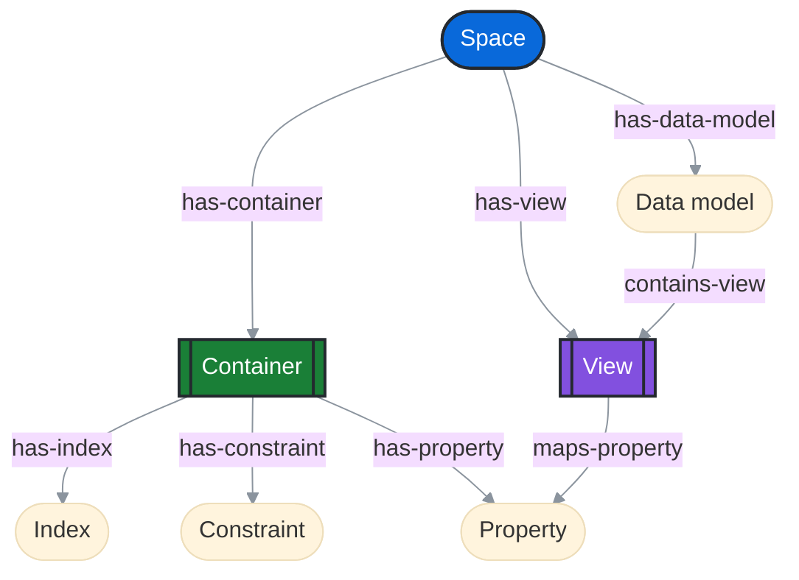

## Containers

Containers are the physical storage for **properties**. They are defined within a space, and hold a set of properties that logically belong together. 

You must define **types** for your properties, and you can add optional **constraints** that the data must adhere to, and define **indexes** to optimize query performance. You can also define **indexes** for properties or groups of properties to optimize query performance.

Containers store properties for instances (nodes and edges.) An instance can have properties in multiple containers:

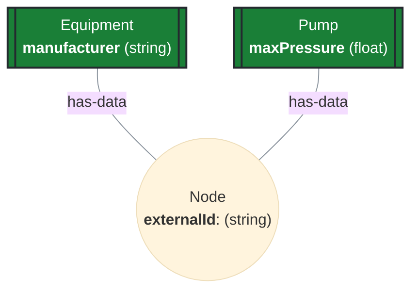

You can populate the containers for an instance, in this example below, for a node.

This data:

```yaml
externalId: 'xyz42'
equipment:
  manufacturer: 'Acme Inc.'
pump:
  maxPressure: 1.2
```

translates to this:

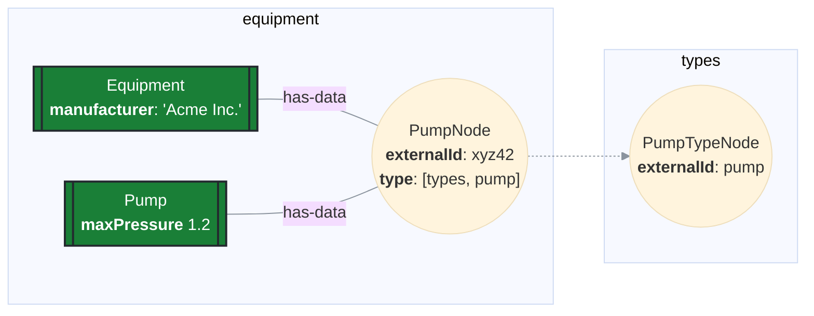

<Note>
You can define containers in different space than the space holding the instances. This can be useful if you want to use the same schema for nodes in different spaces, which is often the case given the [access control model](/cdf/dm/dm_concepts/dm_access_control).
</Note>

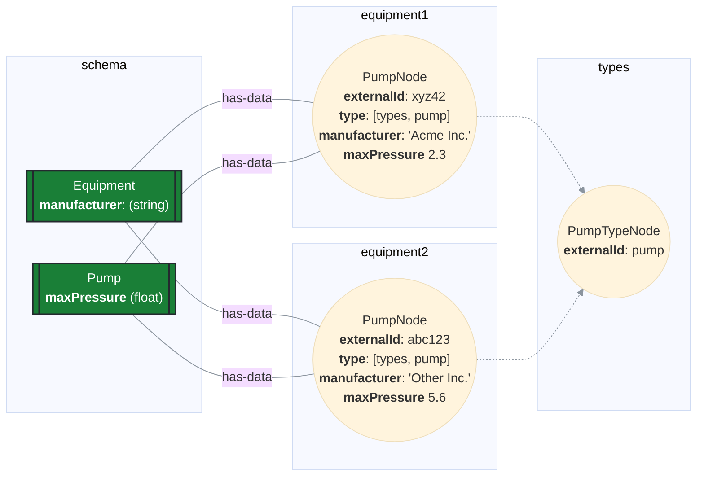

As you add data to these containers for more nodes, the physical storage of the containers will look similar to this:

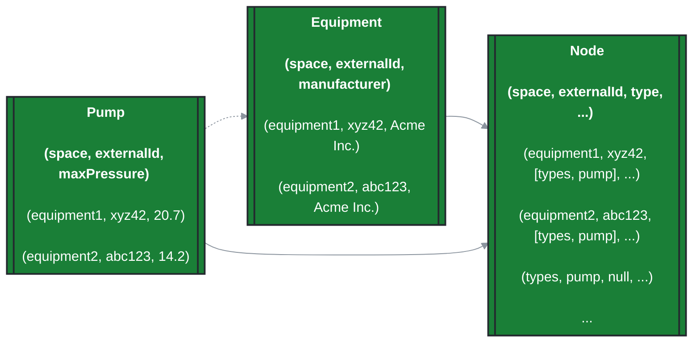

Note that only `node.{space, externalId, type}` is included in the `Node` base container for brevity.

This is similar to relational database schemas where `(space, externalId)` constitutes a foreign key to the core node table, and results in a [snowflake schema](https://en.wikipedia.org/wiki/Snowflake_schema). Importantly, this data lives on a different plane than the graph data discussed in the previous section. For example, nothing ensures that a node has data in `Pump` just because it has `node.type` set to `[types, pump]`. Validation of data content is left to the client to determine, but you can use [**views**](#views) to make it more ergonomic.

### Which types of instances can you use a container for?

The `usedFor` field lets you define which types of instances the containers can be used for. Specify one of these values:

- `node`: the container can only be used to populate properties on nodes.
- `edge`: the container can only be used to populate properties on edges.
- `all`: the container can be used to populate properties on both nodes and edges.
- `record`: the container can only be used for [records](/cdf/dm/records/).

<Note>
You can only ingest records into containers with `usedFor` set to `record`. Containers designated for records support significantly more properties than standard containers. See [Limits and restrictions](/cdf/dm/dm_reference/dm_limits_and_restrictions).
</Note>

<Note>
If you use `all`, ingesting to the container will be more expensive than using only `node` or `edge`.
</Note>

### Properties

When you define a container, you must specify the properties it will contain. Data modeling supports the following basic data types for properties:

| Property type | Description                            |
| ------------- |----------------------------------------|
| `text`        | A string of characters.                |
| `int64`       | A 64-bit integer.                      |
| `float64`     | A 64-bit floating point number.        |
| `float32`     | A 32-bit floating point number.        |
| `boolean`     | A boolean value.                       |
| `timestamp`   | A timestamp (with timezone).           |
| `date`        | A date (without timezone).             |
| `json`        | A JSON object.                         |
| `direct`      | A direct relation to another instance. |
| `enum`        | A fixed set of named values.           |

In addition to these property types, we support native reference types that point to resources in other Cognite APIs. This lets you reference data not suited for storage in a property graph. We support the following native resource reference types:

| Native resource reference type | Description                                                                                                                      |
| ------------------------------ | -------------------------------------------------------------------------------------------------------------------------------- |
| `TimeSeries`                   | A reference to one specific time series. You can use GraphQL queries to expand data from the time series, including data points. |
| `File`                         | A reference to a file stored in CDF and uploaded through the files service.                                                      |
| `Sequences`                    | A reference to a sequence stored in CDF.                                                                                         |

We support declaring all of these base and reference types as **lists**. For example, to store a list of file references: `files: [File]`

You can specify whether the property is **nullable**, **immutable**, and provide a **default value**. Marking a property as immutable means that its value cannot be changed after it is set, although it is possible to toggle this setting.

The full specification of a required string property can look like this:

```yaml
name: myStringProperty
description: A string property
nullable: false
immutable: true
defaultValue: foo
type:
  type: text
  list: false
```

<Tip>
When creating your containers, it is important to consider how they will be queried. Identify the properties likely to be used to filter and sort on when querying, and create indexes or composite indexes to support your queries. Since indexes can represent additional update overhead when data is mutated or ingested, make sure the indexes you create are useful and necessary with testing and performance validation.
</Tip>

It is possible to set `nullable` to false on an existing property. New null values will be rejected, but existing null values remain. To check for existing null values, fetch the container and check the `constraintState.nullability` field on the property. This field has four possible values:

- `null`: The property is nullable.
- `"current"`: The nullability constraint is valid. No null values exist.
- `"failed"`: The nullability constraint is violated. Null values exist in the non-nullable property.
- `"pending"`: The validity has not been computed yet. Check back later.

### Indexes

Well-designed indexes speed up data access, they support constraints such as uniqueness, and efficient cursoring with custom sort operations. Data modeling supports up to 10 indexes per container.

An index belongs to the container and is not a flag on a property. When you're laying out your physical schema, it's important to remember that you can only build indexes using properties from the same container. Indexes cannot be built from properties hosted in different containers.

We support two index types:

- `btree`: Use a btree index on primitive base types for efficient lookups and range scans. You can set btree indexes to be `cursorable`, and enable efficient cursoring with custom sorts. Set btree indexes to `bySpace`, indicating that they'll include the `node.space` property as a prefix on the index.

- `inverted`: Use an inverted index for list-type properties to enable efficient searching for values that appear within the list.

After an index is created through an API call, the service will start building the index in the background. To check the progress, fetch the container and check the `state` field of the index. This state field has three possible values:

- `"current"`: The index is successfully built, and will speed up data access.
- `"pending"`: The index is still building. Data accesses can't yet make use of it.
- `"failed"`: Building the index failed. See below for one common reason why B-tree indexes can fail.

#### Size bounds on btree indexes

B-tree indexes are less effective for very large property values. Large indexed values can exceed datastore limits and cause data ingestion to fail. Large pre-existing values can cause new indexes to fail to build.

To prevent ingestion failures and guard against broken B-tree indexes, you should limit the size of indexed properties. You can bound the property size in two ways:

- `maxListSize` limits the number of elements in a list property. The limit can be set as high as 2000. To be included in a B-tree index, the limit must be at most 300 or 600, depending on the property type.

- `maxTextSize` limits the number of UTF-8-encoded bytes in a text property. The limit can be set as high as 128k. To be included in a B-tree index, the limit mustn't exceed 2400 bytes.

If a btree index has several indexed properties, the combined limits on all the properties must not exceed 2400 bytes.

You must set `maxListSize` to include a property in a new B-tree index. We currently allow properties without `maxTextSize` to be included in B-tree indexes, but this will be disallowed in the future.

#### Existing data that exceeds size bounds

You can add size limits to existing properties that already contain oversized data. New data that exceeds the limits will be rejected, but existing oversized data remains.
To see if oversized data exists in a property, check the `constraintState` field. It contains two subfields:

- `maxListSize` indicates the state of any limit on the number of elements in a list property.
- `maxTextSize` indicates the state of any limit on the size of a text property.

These state fields have four possible values:

- `null`: There is no corresponding size bound on the property.
- `"current"`: The size limit is valid. No oversized data exists.
- `"failed"`: The size limit is invalid. The property contains oversized values.
- `"pending"`: The state is still computing. Check back later.

Clean up existing data that exceeds size bounds before creating B-tree indexes. Oversized data can break new indexes and stop them from improving query performance.

### Constraints

Use constraints to restrict the values that can be stored by a property, or in a container. Constraints ensure that the data has integrity, and reflects the real world. We support up to 10 constraints per container.

Currently, we support two constraint types:

- `uniqueness`: Ensures that the values of a property or a set of properties are unique within the container. Set a uniqueness constraint to `bySpace`, indicating that the uniqueness will apply per space.

- `requires`: Points to another container, and requires that the instance has data in that other container used to populate this container.

You can add constraints to existing containers that already contain data that violates the constraint. New data that violates the constraint will be rejected, but existing data remains.
To see if existing data violates the constraint, fetch the container and check the `state` field of the constraint. The `state` field has three possible values:

- `"current"`: The constraint is satisfied. No data violates the constraint.
- `"failed"`: Data exists that violates the constraint.
- `"pending"`: The validity of the constraint has not been computed yet. Check back later.

### Example container definition

This example defines two containers, `Equipment` and `Pump`:

- It sets `usedFor` to `node` on both containers to allow them to be populated for nodes, not edges.
- The `btree` index on `Equipment.manufacturer` enables efficient sorting/filtering on the `manufacturer` property. The index is cursorable and lets you efficiently cursor through equipment nodes when sorting on `manufacturer`.
- The `requires` constraint on `Pump` ensures that any node with data in the `Pump` container also has data in the `Equipment` container.

```yaml title="Pump-Equipment definition"
- space: equipment
  externalId: Equipment
  usedFor: node
  properties:
    - manufacturer:
      type:
        type: text
        list: false
        nullable: false
  indexes:
    manufacturer:
      type: btree
      properties:
        - manufacturer
      cursorable: True
- space: equipment
  externalId: Pump
  usedFor: node
  properties:
    - maxPressure:
      type:
        type: float64
        list: false
        nullable: false
  constraints:
    requireEquipment:
      constraintType: requires
      require:
        space: equipment
        externalId: Equipment
```

## Views

Use **views** to create logical **schemas** to consume and populate a graph tailored for specific use cases. Like containers, views contain a group of properties. You define the views by either mapping container properties, or by creating connection properties to express the expected relationships in the graph.

<Info>
You query data through your defined views. Data is not queried directly from the containers.
</Info>


### Mapped properties

Views let you **map properties** from different containers in a "flat" object and rename or alias properties.

For example, this view creates a flat object with the properties `manufacturer` and `maxPressure`
from the `Equipment` and `Pump` containers. It also renames the `manufacturer` property to `producer`:

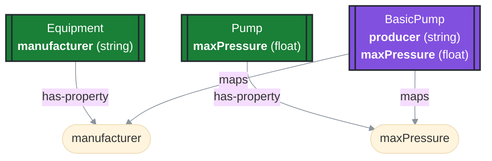

You can use the view to populate a node with data from both the `Equipment` and `Pump` containers at the same time, and query for the properties when retrieving the nodes.

### Connection properties

Connection properties let you describe that you expect certain direct relations or edges to exist between nodes in the graph. When this metadata is persisted, you can retrieve related data when consuming instances through a particular view.

#### Reverse direct relation

Defining a reverse direct relation property between two data types is useful for describing the connections that exist in the graph. In the example below the Equipment has a direct relation to a Manufacturer. Since the relation property is part of the Equipment properties, the manufacturer view can describe the reverse direct relation.

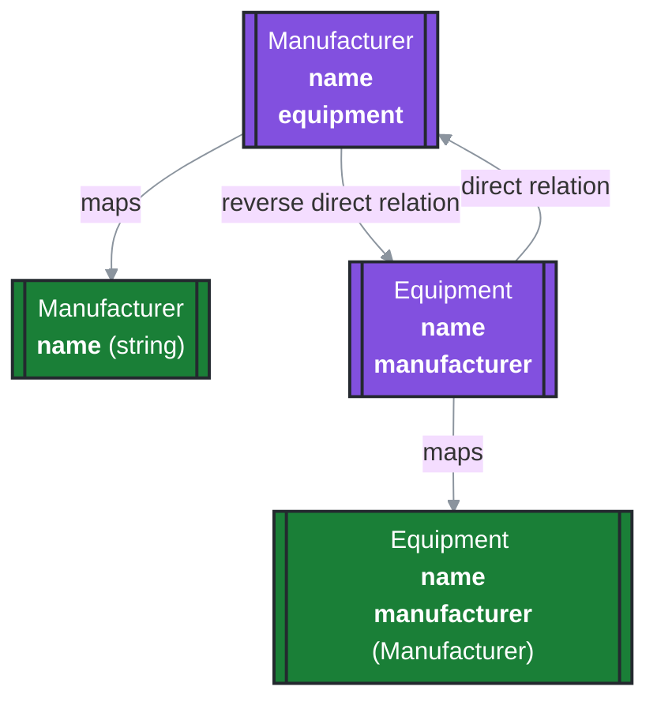

- `connectionType`: Either `single_reverse_direct_relation` or `multi_reverse_direct_relation`, depending on if you expect a single relation or multiple objects.
- `name`: The name of the property.
- `description`: The description of the property.
- `through`: The source and identifier of the direct relation property.
- `source`: The source definition of the expected data.
- `targetsList` (read-only): Whether the reverse direct relation targets a _list_ of direct relations or not.

<Warning>
The `single_reverse_direct_relation` doesn't ensure that **only** a single instance is connected. If you want to ensure only a single instance can be connected you need to ensure that the Direct Relation property has a uniqueness constraint.
</Warning>

<Warning>
As reverse direct relations traverse the graph, it is highly recommended that there is a b-tree index on the direct relation property.
</Warning>

```yaml
equipments:
  name: 'Equipments'
  description: 'All equipments made by the manufacturer'
  connectionType: multi_reverse_direct_relation
  through:
    identifier: manufacturer
    source:
      type: view
      space: vendor_schema
      externalId: Equipment
      version: 1
  source:
    type: view
    space: vendor_schema
    externalId: Equipment
    version: 1
```

#### Edges

You can also define a connection using an edge. For example, you can express that you expect nodes with data in `BasicPump` to have `flows-to` edges to `Valve` nodes.

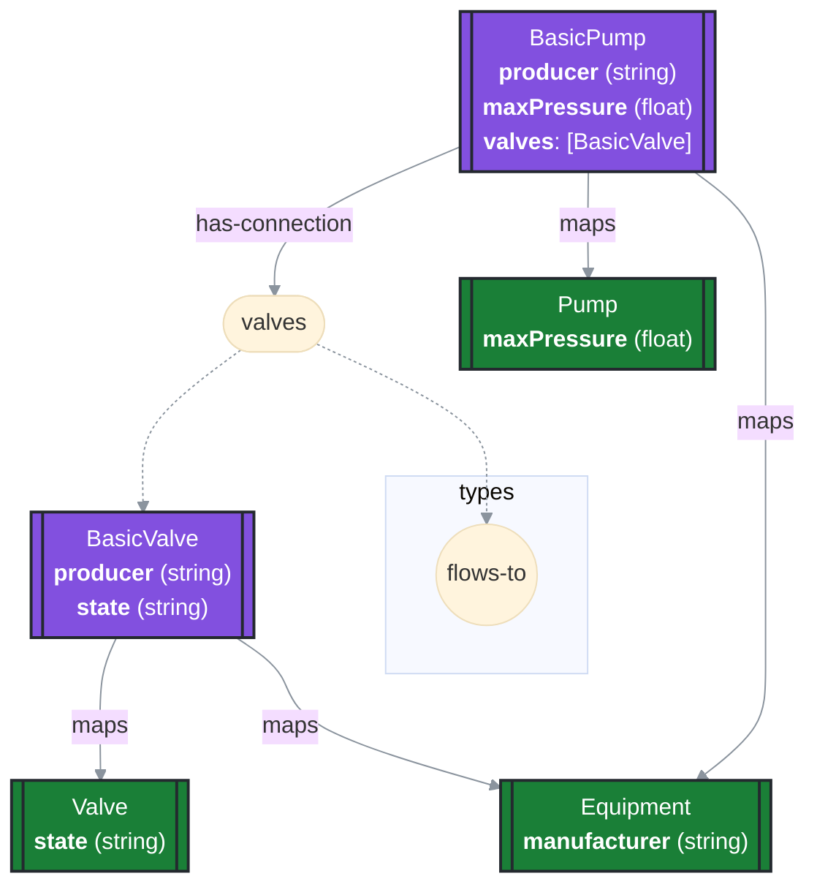

The example above encodes that nodes with data in `BasicPump` can have `flows-to` edges to nodes with data
in `BasicValve`. You can describe this with these fields in a connection property:

- `connectionType`: Supports `single_edge_connection` or `multi_edge_connection` (default).
- `type`: the fully qualified external ID of the node representing the edge type.
- `source`: a reference to the view which you can view the node in the other end through.
- `direction`: the direction to traverse the edge (inwards/outwards).
- `edgeSource`: an optional reference to a view.

A Pump/Valve would look like this:

```yaml
type:
  space: types
  externalId: flows-to
source:
  space: equipment
  externalId: BasicValve
  version: v1
direction: outwards
```

### Implementing other views

Views can implement other views and inherit their properties. This is useful when you want to create a view that combines the properties of multiple other views. For example:

```yaml wrap
- space: equipment
  externalId: Equipment
  version: v1
  properties:
    manufacturer:
      container:
        space: equipment
        externalId: Equipment
      containerPropertyIdentifier: manufacturer
- space: equipment
  externalId: Pump
  version: v1
  implements: # <-- Declares that the view implements the Equipment view
    - space: equipment
      externalId: Equipment
      version: v1
  properties:
    maxPressure:
      container:
        space: equipment
        externalId: Pump
      containerPropertyIdentifier: maxPressure
```

The effective properties of the `Pump` view are now `manufacturer` _and_ `maxPressure`.

The effective properties of a view are resolved at query time. We do not allow breaking changes to views, but if a view implemented by another view is deleted, the inherited properties will be removed from the implementing view. This could break clients if it removes any required properties.

#### Implemented property conflicts and precedence

If you, for example, have four views; A, B, C, and D, each with a single property with the following implements
graph, you can see the effective properties on the right.

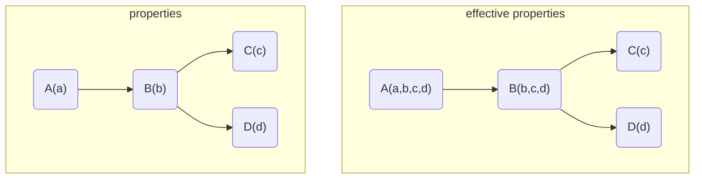

If you introduce conflicting property identifiers in this graph, they are resolved by sorting the `implements` graph topologically. The order beneath a node is determined by the order of the implements array, where later entries are preferred.

If `B implements [C, D]`, the order of precedence is `A, B, D, C`.

If `B implements [D, C]`, the order is `A, B, C, D`.

In these examples `B implements [C, D]`:

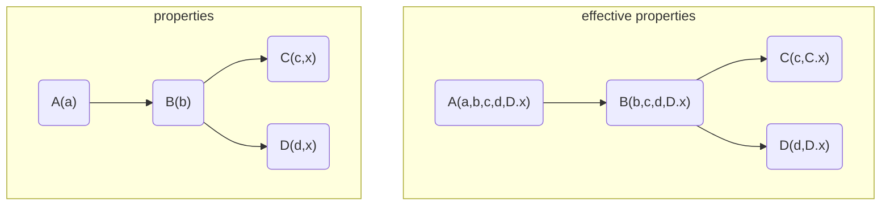

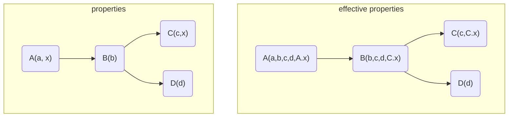

### View versioning

Views are versioned, and you can not introduce breaking changes without changing the version.

See [view versioning](#view-versioning) and [data model changes](#data-model-changes) sections for information about data model and view changes that force a version update.

You can adapt the versioning scheme to your needs. If you don't have a preference, we recommend using an integer (whole numbers). Start your version scheme at 1, and increment the version number by one for each new version.

You can use decimals &mdash; 1.1, 1.2, and 2.0 &mdash; if you want higher version granularity. In this example, the **first digit** typically increments each time you make a **significant** or a **breaking** change. Breaking changes could require changes to your application's business logic. The **fractional number** &mdash; 2<sup>nd</sup> and 3<sup>rd</sup> digits &mdash; increments when you make **minor** changes that doesn't break your API. These kinds of changes don't typically break the logic required to use the API (and models).

[Semantic versioning](https://semver.org) is a widely used versioning scheme. All version increments to a data model will break, as non-breaking changes are allowed without changing the version. You can choose to implement semantic versioning, but doing so requires close attention to the reusability factor designed for CDF data modeling. The semantic versioning scheme is not designed for data modeling but for software development. The `a.b.c` versioning scheme in semantic versioning specifies that both changes in `a` and `b` are breaking changes. This leaves only `c` for non-breaking changes.

In CDF, we allow certain changes to the data model without forcing you to increment the version number for the view or data model. For example, adding a new data type to an existing data model isn't a breaking change. However, in semantic versioning, this would be a breaking change.

### View filters

All views have a filter field that lets you filter the nodes that are included when querying the view. For most higher-level query endpoints in DMS, the filters are applied automatically. For advanced endpoints, you have to apply the filters manually.

If no filter is specified, the default `hasData` filter is applied on the list of views specified when querying. Learn more about `hasData` filters in the [querying](/cdf/dm/dm_concepts/dm_querying) article.

### Equipment example view

This example illustrates a view definition for equipment:

```yaml wrap 
- space: equipment
  externalId: BasicEquipment
  properties:
    producer:
      container:
        space: equipment
        externalId: Equipment
      containerPropertyIdentifier: manufacturer
- space: equipment
  externalId: BasicValve
  version: v1
  # Since this only maps properties in the Equipment view, we can't rely on hasData filtering.
  # We add a custom filter to make sure we only include nodes of the correct type.
  filter:
    equals:
      property: ['node', 'type']
      value: { 'space': 'types', 'externalId': 'valve' }
  implements: # Inherit the properties from the BasicEquipment view
    - space: equipment
      externalId: BasicEquipment
- space: equipment
  externalId: BasicPump
  version: v1
  implements: # Inherit the properties from the BasicEquipment view
    - space: equipment
      externalId: BasicEquipment
  properties:
    maxPressure:
      container:
        space: equipment
        externalId: Pump
      containerPropertyIdentifier: maxPressure
    valves:
      type: # The edge type to traverse
        space: types
        externalId: flows-to
      source: # The view to view the other node in
        space: equipment
        externalId: BasicValve
        version: v1
      direction: outwards
```

### Caveats

- When a property mapped by a view is modified or deleted, the `lastUpdatedTime` of the view will _not_ be updated.
- It's important to inspect which views are affected by the deletion of container. When a container is deleted, its properties are removed from any views that map the container. This can break clients if the properties are required.

## Polymorphism in views

You can achieve polymorphism for views in two ways:

- [Using `implements` and the implicit view `hasData` filter](#using-implements-and-implicit-view-hasdata-filtering).
- [Using explicit view filters on `type`](#using-explicit-view-filters-on-type).

In the sections below, `BasicPump` and `BasicValve` are subtypes of `BasicEquipment`.

### Using `implements` and implicit view `hasData` filtering

When the `BasicPump` view implements the `BasicEquipment` view, the default filter on `BasicPump` is a `hasData` filter across the underlying containers: `Pump` and `Equipment`.

If you filter using the `BasicEquipment` view, you'll get anything with data in the `Equipment` container. If you filter using the `BasicPump` view, you'll get anything with data in both the `Equipment` _and_ the `Pump` containers.

This approach to polymorphism resembles **structural** subtyping: "_if it looks like a duck and quacks like a duck, it's a duck._"

This breaks down in some cases. For example, if a view only has connection properties, there are no backing containers to apply the `hasData` filtering on. In this case, you can [use the `type` property and view filters](#using-explicit-view-filters-on-type) - see the next section.

### Using explicit view filters on `type`

If, for example, you associate all pump nodes with the type `[types, pump]`, you can use a view filter to only include nodes with that type:

```yaml
filter:
  equals:
    property: ['node', 'type']
    value: { 'space': 'types', 'externalId': 'pump' }
```

To list all equipment nodes, you must explicitly include the subtypes of the view in your filter:

```yaml
filter:
  in:
    property: ['node', 'type']
    values:
      [
        { 'space': 'types', 'externalId': 'pump' },
        { 'space': 'types', 'externalId': 'valve' },
      ]
```

This approach to polymorphism resembles **nominal** subtyping: "_if it's a duck, it's a duck._"

## Data models

Use **data models** to **group views** that belong together for a purpose. For example, you might define a `EquipmentInspection` data model containing a `BasicValve` and a `BasicPump` view.

```yaml
space: equipment
externalId: EquipmentInspection
version: v1
views:
  - space: equipment
    externalId: BasicPump
    version: v1
  - space: equipment
    externalId: BasicValve
    version: v1
```

## Impact of changes to views and data models

The tables in this section describe the impact of changes to a container, a view, or a data model. Changes that force a
visible change for a consumer of data from a view or a data model are considered **breaking changes**, and require a
version change to be submitted to the service.

<Note>
You can change the version for a data model, or view even if a version change is _not_ required. This operation should be considered a controlled switch for any consumer of data from the configuration.
</Note>

### Container changes

Containers are not versioned and changes to containers are not **breaking** in the same sense as for views and data models.
To change a container, we recommend using a _delete_ > _recreate_ > _re-ingest_ pattern. Alternatively, create a new parallel container and re-ingest its data.

<Warning>
After deleting, recreating, re-ingesting or creating a parallel container, you need to recreate any existing view-to-container mapping(s).
</Warning>

In the table below, the "_Not allowed_" description means that the operation can't be safely implemented in the underlying data store.

| Operation                                              | Breaking change | Allowed | Description                                                                                                                |
| ------------------------------------------------------ | --------------- | ------- | -------------------------------------------------------------------------------------------------------------------------- |
| Change name.                                           | No              | Yes     | Changes metadata.                                                                                                          |
| Change description.                                    | No              | Yes     | Changes metadata.                                                                                                          |
| Change `usedFor`.                                      | N/A             | No      | Not allowed.                                                                                                               |
| Add property.                                          | No              | Yes     | When the property identifier isn't in use.                                                                                 |
| Delete property.                                       | N/A             | No      | Not allowed.                                                                                                               |
| Add `requires` or `check` constraint.                  | No              | Yes     | Identifier must be unique and constraint will apply to any new values (not pre-existing ones).                             |
| Add `unique` constraint.                               | N/A             | Yes     | Can only be included during the initial creation of the container.                                                         |
| Change constraint.                                     | N/A             | No      | Not allowed.                                                                                                               |
| Delete constraint.                                     | No              | Yes     | Allowed.                                                                                                                   |
| Add new index.                                         | No              | Yes     | Allowed.                                                                                                                   |
| Delete index.                                          | No              | Yes     | Allowed.                                                                                                                   |
| Change index.                                          | N/A             | No      | Not allowed.                                                                                                               |
| Change property: `nullable` > `non-nullable`.          | Yes             | Yes     | Changing to non-nullable may break ingestion clients, but represents an acceptable breakage. This shouldn't be unexpected. |
| Change property: `non-nullable` > `nullable`.          | N/A             | No      | Not allowed.                                                                                                               |
| Change property: `autoIncrement`.                      | N/A             | No      | Not allowed.                                                                                                               |
| Change property: `defaultValue`.                       | No              | Yes     | Changes are applied to new values added. Previously existing values remain the same.                                       |
| Change property: `description`.                        | No              | Yes     | Changes metadata meant for human consumption.                                                                              |
| Change property: `name`.                               | No              | Yes     | Changes metadata meant for human consumption.                                                                              |
| Change property: `type`.                               | N/A             | No      | Not allowed.                                                                                                               |
| Change (text) property: `list` state.                  | N/A             | No      | Not allowed.                                                                                                               |
| Change (text) property: `collation`.                   | N/A             | No      | Not allowed.                                                                                                               |
| Change (primitive) property: `list` state.             | N/A             | No      | Not allowed.                                                                                                               |
| Change (direct relation) property: target `container`. | N/A             | No      | Not allowed.                                                                                                               |
| No change.                                             | Yes             | Yes     | Allows idempotent updates.                                                                                                 |

### View changes

Operations and the impact of the operation for data modeling views.

| Operation                                     | View | Property | Relation | Direct relation | Breaking change | Description                                                                                                                                                                                                                             |
| --------------------------------------------- | ---- | -------- | -------- | --------------- | --------------- | --------------------------------------------------------------------------------------------------------------------------------------------------------------------------------------------------------------------------------------- |
| Change name.                                  | Yes  | Yes      | Yes      | Yes             | No              | Changes metadata.                                                                                                                                                                                                                       |
| Change description.                           | Yes  | Yes      | Yes      | Yes             | No              | Changes metadata.                                                                                                                                                                                                                       |
| Change filter.                                | Yes  | Yes      | Yes      | Yes             | No              | Changes the result of the view, but doesn't change the form of it.                                                                                                                                                                      |
| Change implements.                            | N/A  | N/A      | N/A      | N/A             | Yes             | May break clients.                                                                                                                                                                                                                      |
| Change version.                               | N/A  | N/A      | N/A      | N/A             | Yes             | A version can be bumped even if there are no changes (allows alignment of version numbers for different combinations of views).                                                                                                         |
| Add nullable property.                        | Yes  | Yes      | N/A      | N/A             | No              | Safe change as long as there's no collision with other inherited properties, and it doesn't introduce a new mapped container. Still safe as long as the type is the same and the property doesn't change from `nullable` to `required`. |
| Add non-nullable.                             | Yes  | Yes      | N/A      | N/A             | Yes             | Breaking since a client may depend on its existence.                                                                                                                                                                                    |
| Delete property.                              | Yes  | N/A      | N/A      | N/A             | Yes             |                                                                                                                                                                                                                                         |
| Change property type.                         | N/A  | Yes      | N/A      | N/A             | Yes             | Version change to not break consumers.                                                                                                                                                                                                  |
| Change container reference for base property. | N/A  | Yes      | N/A      | N/A             | No              | Permit remapping consumers to new data, from other containers, without forcing a version change for consumers.                                                                                                                          |
| Change source hint.                           | N/A  | N/A      | Yes      | Yes             | Yes             | Equivalent of changing the property type.                                                                                                                                                                                               |
| Change type of relation.                      | N/A  | N/A      | Yes      | Yes             | Yes             | As long as the source type remains the same (not changed).                                                                                                                                                                              |
| Change direction of relation.                 | N/A  | N/A      | Yes      | Yes             | Yes             | As long as the source type remains the same (not changed).                                                                                                                                                                              |
| Change source of relation.                    | N/A  | N/A      | Yes      | N/A             | Yes             | As long as the source type remains the same (not changed).                                                                                                                                                                              |
| No change.                                    | N/A  | N/A      | N/A      | N/A             | No              | Support idempotent updates.                                                                                                                                                                                                             |

### Data model changes

Operations and the impact of the operation for data models in the data modeling service.

| Operation           | Breaking change | Allowed | Description                                                                                                                                         |
| ------------------- | --------------- | ------- | --------------------------------------------------------------------------------------------------------------------------------------------------- |
| Change name.        | No              | Yes     | Changes metadata.                                                                                                                                   |
| Change description. | No              | Yes     | Changes metadata.                                                                                                                                   |
| Add a view.         | No              | Yes     | Non-breaking if the new view doesn't conflict with any existing views in the data model. A conflict is a view using the same external ID.           |
| Remove a view.      | Yes             | Yes     | Breaking since a client may depend on the existence of the data model.                                                                              |
| Replace a view.     | Yes             | Yes     | When updating the view identified by the (`space`, `externalId`, `version`). Typically done to update the version of a view used by the data model. |
| Change version.     | Yes             | Yes     | A version bump without other changes is still a version bump.                                                                                       |
| Change space.       | N/A             | No      | Not supported.                                                                                                                                      |


<!-- SOURCE_END: docs.cognite.com/docs\cdf\dm\dm_concepts\dm_containers_views_datamodels.mdx -->

================================================================================


<!-- SOURCE_START: docs.cognite.com/docs\cdf\dm\dm_concepts\dm_ingestion.mdx -->
## File: docs.cognite.com/docs\cdf\dm\dm_concepts\dm_ingestion.mdx

---
title: Ingestion features
description: Learn how to ingest and remove instances in your graph using apply, patch, replace, and delete operations.
content-type: concept
audience: developer
experience-level: 200
lifecycle: use
article-type: article
---
This section describes how to ingest and remove instances in a graph using the [/model/instances](https://api-docs.cognite.com/20230101/#tag/Instances/operation/applyNodeAndEdges) and [/delete](https://api-docs.cognite.com/20230101/#tag/Instances/operation/deleteBulk) endpoints.

## Applying instances

This example `apply` request attempts to ingest a node with the external ID `pump42` into the space `equipment`, and set the `Pump/v1.producer` view property to "Acme Inc.".

```yaml
items:
  - instanceType: node
    space: equipment
    externalId: pump42
    sources:
      - source:
          type: view
          space: equipment
          externalId: Pump
          version: v1
        properties:
          producer: 'Acme Inc.'
```

You can also ingest properties directly into containers. All instances in a request are applied atomically, and you can apply a mix of nodes and edges. Consequently, all instances in a request are applied, or the entire request fails.

### Create, patch, and replace

When you apply instances, you can use three distinct modes depending on the existing state and the request parameters.

- If the instance does not exist at the time of ingestion, it will be **created**. This means that all required properties must be set.

- If the instance already exists, you have two updating methods: **`patch`** and **`replace`**. You choose the method by setting the value of the `replace` flag. The value can be `true` or `false`, and the default value is `false`.

  With `patch`, only the properties that are provided in the `sources` section of the request will be updated, leaving all other properties unchanged.

With `replace`, all properties will be updated, and omitted properties will be set to null. Consequently, all required properties must have a value specified in the request body when you update an instance with `replace=true`.

### Autocreate nodes

When ingesting instances, you can autocreate the targets of direct relation properties and ingest a graph without worrying about the order in which you ingest the instances. Use these properties to control this behavior:

- `autoCreateDirectRelations`: automatically create all direct relations in the request if a relation is not previously created (default: `true`.)
- `autoCreateStartNodes`: when set to `true`, automatically create any missing start nodes for the edge (default: `false`.) When the parameter is set to `false` and the indicated start node is not present, the request will fail with a HTTP status code of 409, indicating a conflict with the current state of the service.
- `autoCreateEndNodes`: when set to `true`, automatically create any missing end nodes for the edge (default: `false`.) When the parameter is set to `false` and the indicated end node is not present, the request will fail with a HTTP status code of 409, indicating a conflict with the current state of the service.

You need write access to a space to autocreate nodes in it.

### Optimistic concurrency control

Every instance has a version number. It starts at `version: 1` and increments by 1 each time the instance is changed. The `apply` endpoint supports optimistic concurrency control and allows you to specify an expected **existing** version on the instance. If an actual version is greater than the expected version, the request fails with status code `409`.

The following example creates a pump node with the external ID "pump42". We set `existingVersion` to `0` to make sure the node does not exist, and that you will be **creating** the node.

If the node `equipment.pump42` already exists, the request will fail. If it doesn't exist, the node is created.

```yaml
items:
  - instanceType: node
    space: equipment
    externalId: pump42
    existingVersion: 0
```

The next example illustrates a case where you want to update the node `equipment.pump42` and set the `Pump/v1.producer` property to "Acme Inc.", but only if the `producer` property is currently null, to prevent you from overwriting someone else's changes.

First, read the node and verify that the `producer` property is null and then apply the update specifying `existingVersion=$currentVersion`. If the first read request returns `version: 1`, you can apply the instance:

```yaml
items:
  - instanceType: node
    space: equipment
    externalId: pump42
    existingVersion: 1
    sources:
      - source:
          type: view
          space: equipment
          externalId: Pump
          version: v1
        properties:
          producer: 'Acme Inc.'
```

If someone has set the `producer` property in the meantime, their request has bumped the node's version to 2. Because you specified `existingVersion: 1`, but the actual value is `version: 2`, the request fails with status code `409`. You can read the node again, check if the `producer` property is null, and repeat the process with `existingVersion` set to 2.

You can also **not** fail the entire request when there are version conflicts, and instead ignore updates to the instances that have version conflicts. You do this by setting `skipOnVersionConflict` to `true` in the request.

<Note>
Sending an update request that will **not** update the instance's properties will **not** bump the `version` or `lastUpdatedTime` of the instance.
</Note>

## Deleting instances

<Warning>
If you have stored data across multiple containers using the **same** space and externalId combination, calling delete will delete all the data pertaining to the node.
</Warning>

To delete nodes and edges from the graph, you send a list of fully qualified external IDs to the `/delete` endpoint. This example deletes a node and an edge:

```yaml
items:
  - instanceType: node
    space: equipment
    externalId: pump42
  - instanceType: edge
    space: equipment
    externalId: i-dont-exist
```

The response from this request contains only the successfully deleted instances. In this case, only the node `equipment.pump42`, since the `equipment.i-dont-exist` edge does not exist:

```yaml
items:
  - instanceType: node
    space: equipment
    externalId: pump42
```

### Soft deletion

To support syncing deletes to secondary stores, instances are always soft deleted at first. The soft-deleted instances will be returned by the [/sync](/cdf/dm/dm_concepts/dm_querying#syncing---subscribing-to-changes) endpoint with `deletedTime` set to a non-null value.

After a grace period (3 days by default), the instances are deleted by the system. Soft deleted instances count towards the total instance [limits](/cdf/dm/dm_reference/dm_limits_and_restrictions#limits) for you CDF project.

<Note>
You can not restore soft deleted instances.
</Note>

### Delete edges before nodes

Deleting a node will delete all edges connected to that node. It is a best practice to delete the edges before the nodes in order to avoid long running cascading deletes. It is critical to delete edges before the nodes when you have nodes with a large number of edges pointing to/from them.


<!-- SOURCE_END: docs.cognite.com/docs\cdf\dm\dm_concepts\dm_ingestion.mdx -->

================================================================================


<!-- SOURCE_START: docs.cognite.com/docs\cdf\dm\dm_concepts\dm_inspect.mdx -->
## File: docs.cognite.com/docs\cdf\dm\dm_concepts\dm_inspect.mdx

---
title: Schema and instance inspection
description: Learn how to inspect schemas and instances to understand their structure and relationships in your data model.
content-type: concept
audience: developer
experience-level: 100
lifecycle: use
article-type: article
---
Inspection endpoints offer detailed views of the schemas and instances in your project. They let you perform operations to understand how your schema resources relate to other schema resources and what data resides in your instances. The endpoints help you understand the structure of your schema and data. They are particularly helpful for performing deletion operations and knowing as much as possible about the consequences of the deletions.

## Inspecting containers

The DMS API exposes an endpoint for inspecting [containers](https://api-docs.cognite.com/20230101/#tag/Containers/operation/containerInspect) with these operations:

- `involvedViews`: Retrieve all views that map a container.
- `totalInvolvedViewCount`: Retrieve a count of all views that map a container, optionally including views unavailable to the current user.

## Inspecting instances

The DMS API also exposes an endpoint for inspecting [instances](https://api-docs.cognite.com/20230101/#tag/Instances/operation/instanceInspect) with these operations:

- `involvedContainers`: Retrieve the containers in which an instance has data.
- `involvedViews`: Retrieve the views that map the containers in which an instance has data.


<!-- SOURCE_END: docs.cognite.com/docs\cdf\dm\dm_concepts\dm_inspect.mdx -->

================================================================================


<!-- SOURCE_START: docs.cognite.com/docs\cdf\dm\dm_concepts\dm_property_graph.mdx -->
## File: docs.cognite.com/docs\cdf\dm\dm_concepts\dm_property_graph.mdx

---
title: Property graph
description: Understand how property graphs in CDF use nodes, edges, and properties to model complex industrial systems.
content-type: concept
audience: developer
experience-level: 200
lifecycle: use
article-type: article
---
In graph modeling, a **property graph** represents a well-defined structure consisting of **nodes** and **edges**, which can be associated with **properties**. These fundamental elements form a simple toolkit for modeling complex systems intuitively and powerfully.

### Nodes

**Nodes** serve as fundamental building blocks and can be used to represent anything, for example, real-world objects like _pumps_:

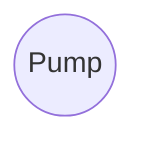

### Edges

**Edges** denote relationships between nodes. This example adds a _valve_ node and an edge to illustrate their connection:

```mermaid
graph LR;
Pump((Pump))
Valve((Valve))
Pump-- flows-to -->Valve
```

### Properties

Nodes and edges can have **properties** that provide additional context or information. These properties can include **types**, such as `Pump` or `flows-to`, but they can also include other attributes describing the nodes and edges. For example:

```mermaid
graph LR;
Pump(("Pump<br>equipmentId: xyz123"))
Valve(("Valve<br>state: OPEN"))
Pump--"flows-to<br>maxPressure: 60"-->Valve
```


<!-- SOURCE_END: docs.cognite.com/docs\cdf\dm\dm_concepts\dm_property_graph.mdx -->

================================================================================


<!-- SOURCE_START: docs.cognite.com/docs\cdf\dm\dm_concepts\dm_querying.mdx -->
## File: docs.cognite.com/docs\cdf\dm\dm_concepts\dm_querying.mdx

---
title: Query features
description: Learn how to query your industrial knowledge graph using filters, parameters, recursive edge traversal, and subscriptions to changes.
content-type: concept
audience: developer
experience-level: 200
lifecycle: use
article-type: article
---
The query interface has these endpoints:

- `/query` - graph query to retrieve instances matching a query.
- `/sync` - graph query to retrieve instances matching a query that have changed since the
  previously issued cursor.
- `/search` - retrieve instances matching full-text search queries.
- `/aggregate` - aggregate instance data.

A few higher level query endpoints, like `/byids` and `/list`, provide simpler
interfaces building on the `/query` endpoint.

The query interface supports a wide array of features.

- [Advanced filters](#compound-filters)
- [Parameterization](#parameters)
- [Recursive edge traversal](#graph-traversal)
- [Chaining of result sets](#node-result-set-expressions)
- [Granular property selection](#selects)
- [Subscribing to changes](#syncing---subscribing-to-changes)

## How to define a graph query

You can use a query in both the `/query` and the `/sync` endpoints.

Queries are composed of:

- A `with` section defining result expressions that describe which instances to retrieve.
- A `parameters` section with optional parameter substitutions if the query is parameterized.
- A `select` section that defines which properties to return as part of the result.

The below examples use a pump and valve example, represented as two sets of nodes with edges between them indicating which pumps flow to which valves.

```mermaid
%%{init: {'theme':'base', 'themeVariables': { 'lineColor':'#8b949e'}}}%%
graph LR
Pump(("Pump<br>externalId: pump42"))
Valve1(("Valve<br>externalId: valve1"))
Valve2(("Valve<br>externalId: valve2"))

PumpValve1Edge("FlowsTo <br> externalId: 42To1")
PumpValve2Edge("FlowsTo <br> externalId: 42To2")

Pump---PumpValve1Edge
Pump---PumpValve2Edge
PumpValve1Edge-->Valve1
PumpValve2Edge-->Valve2
```

This query fetches a specific pump as well as the valves it flows to:

```yaml wrap
with: # Define the result expressions
  pumps:
    nodes:
      filter:
        equals:
          property: ['node', 'externalId']
          value: { 'parameter': 'pumpExternalId' }
    limit: 1
  pump_flows_to_valves:
    edges:
      from: pumps
      maxDistance: 1
      direction: outwards
      filter:
        equals:
          property: ['edge', 'type']
          value: { 'space': 'types', 'externalId': 'flows-to' }
  valves:
    nodes:
      from: pump_flows_to_valves
parameters: # Provide parameter values
  pumpExternalId: pump42
select: # Define the result sets to return
  pumps: {}
  valves: {}
```

The query returns a result similar to this:

```yaml
items:
  pumps:
    - instanceType: node
      version: 1
      space: equipment
      externalId: pump42
      createdTime: 123
      lastUpdatedTime: 456
  valves:
    - instanceType: node
      version: 2
      space: equipment
      externalId: valve1
      createdTime: 321
      lastUpdatedTime: 654
    - instanceType: node
      version: 3
      space: equipment
      externalId: valve2
      createdTime: 213
      lastUpdatedTime: 546
nextCursor:
  pumps: cursorForPumps
  valves: cursorForValves
```

## Result expressions

Result expressions appear directly below `with` in a query, and define a set of either nodes or
edges. You can use the set to return results, as stepping stones to derive other sets from, or both.
Result expressions are named and can be chained.

A result expression can also define `sort` order and a `limit`. See [sorting](#sorting-and-limiting) for more details.

Result expressions can relate to each other via chaining, but they don't have to. You can query for unrelated items in the same query, but you'll generally use different sets to power graph traversals.

A set either queries nodes **or** edges, possibly recursively.

All fields:

- `nodes`: An object to specify a result set of matching nodes.
- `edges`: An object to specify a result set of matching edges.
- `sort`: A list of sort configurations.
- `limit`: How many nodes or edges to return in the result. Default: 100.

### Pagination

The max limit you can set for any result expression is 10,000. To retrieve the entire result set, queries accept a `cursor` object mapping result sets to cursors. Pagination cursors in the `nextCursor` object are emitted for each result set, allowing you to page through everything.

You can't combine pagination cursors with custom sorts, unless they are backed by a cursorable index. If no pagination cursor is present for a given result expression in the response, there is no more matching data.

<Warning>
We do **not** recommend paging through result sets repeatedly using the `/query` endpoint. Instead, use [sync](#syncing---subscribing-to-changes), which is designed to keep clients up to date with changes.
</Warning>

### Node result expressions

A `nodes` statement in your result expression makes the set contain nodes.

A node result expression can be chained off an optional node or edge result expression.

When chaining off another **node result set**, you'll retrieve the nodes pointed to by a direct relation property. The direct relation property is defined using the `through` field.

When chaining off an **edge result set**, you'll retrieve the end nodes defined by the edges in the set.

- `from`: an optional result expression to chain from.
- `filter`: restrict which nodes to return in the result set.
- `through`: required when `from` is a node result expression. Specify a direct relation property to traverse.
- `direction`: applicable when `through` is defined. Specify which direction to traverse the direct relation.
- `chainTo`: applicable when `from` is an edge result expression. Control which side of the edges in `from` to chain to. The behavior depends on the `direction` setting in the `from` result expression:
  - If `from` follows edges outwards, `direction="outwards"` (default), then `"source"` selects `startNode` and `"destination"` selects `endNode`.
  - If `from` follows edges inwards, `direction="inwards"`, then `"source"` selects `endNode` and `"destination"` selects `startNode`.

### Edge result expressions

An `edges` statement in a result expression makes the set contain edges, and the statement
defines the rules the graph traversal will follow.

A graph traversal can start from an initial set, defined by `from`, which names another result expression.

The graph traversal follows edges in a particular direction, controlled by `direction` (Default: `outwards`.)

```
    Alice -is_parent-> Bob
    Bob -fancies-> Mallory
```

In the above graph, if you follow any edge from `Bob` **outwards** (the default), you'll get
the edge `Bob -fancies-> Mallory`.

If you follow edges **inwards**, `direction=inwards`, you'll
get `Alice -is-parent-> Bob`.

The traversal happens breadth-first. See [limitations](#limitations) for more details.

A traversal is defined by what edges to follow, what nodes to match, and what nodes to terminate
the traversal at. This is controlled by `filter`, `nodeFilter` and `terminationFilter`:

- `filter` is a filter on edges. You would typically filter on the property `[edge, type]`, but you can filter on any property on an edge.

- `nodeFilter` is a node filter, which the node on the "other" side must match.

  - With `direction: outwards`, that means the "end node" of the edge must match.

  - With `direction: inwards`, the "start node" must match.

- `terminationFilter` is similar to `nodeFilter`, except if it matches, the traversal ends. A node must also match `nodeFilter` (if any) to steer the traversal to the node to terminate at in the first place.

  `maxDistance` controls how many hops away from the initial set traversal will go. `maxDistance` defaults to unlimited (but the set must respect its `limit`, defined on the result expression). If `maxDistance` is 1, execution might be faster. If you know there will only be one level, use `maxDistance: 1`.

Full options:

| Option              |                                                                                                                                                                                                                                                                                                                                                                                                                                                                                                            |
| ------------------- | ---------------------------------------------------------------------------------------------------------------------------------------------------------------------------------------------------------------------------------------------------------------------------------------------------------------------------------------------------------------------------------------------------------------------------------------------------------------------------------------------------------- |
| `from`              | Result expression to chain from.                                                                                                                                                                                                                                                                                                                                                                                                                                                                           |
| `filter`            | Edges traversed must match this filter.                                                                                                                                                                                                                                                                                                                                                                                                                                                                    |
| `nodeFilter`        | Nodes on the "other" side of the edge must match this filter.                                                                                                                                                                                                                                                                                                                                                                                                                                              |
| `terminationFilter` | Do not traverse beyond nodes matching this filter.                                                                                                                                                                                                                                                                                                                                                                                                                                                         |
| `maxDistance`       | How many levels to traverse. Default unlimited.                                                                                                                                                                                                                                                                                                                                                                                                                                                            |
| `direction`         | Whether to traverse edges pointing out of the initial set, or **into** the initial set.                                                                                                                                                                                                                                                                                                                                                                                                                    |
| `limitEach`         | Limit the number of returned edges for each of the source nodes in the result set. <br/> <br/>The indicated uniform limit applies to the result set from the referenced from. `limitEach` only has meaning when you also specify `maxDistance=1` and `from`.                                                                                                                                                                                                                                               |
| `chainTo`           | applicable when `from` is an edge result expression. Control which side of the edges in `from` to chain to. The behavior depends on the `direction` setting in the `from` result expression: <br/> <br/> - If `from` follows edges outwards, `direction="outwards"` (default), then `"source"` selects `startNode` and `"destination"` selects `endNode`. <br/> <br/> - If `from` follows edges inwards, `direction="inwards"`, then `"source"` selects `endNode` and `"destination"` selects `startNode`. |

## Selects

Select configurations appear directly below `select` in a query and specify which data to retrieve for the respective result expression. The configuration specifies a number of sources (views) and a property selector for each. The property selectors define which view properties to emit in the query result.

You can have sets whose properties aren't emitted. This is useful if the sets are necessary for chaining, but can be excluded in the final results. Sets that are neither chained nor selected aren't run, but they'll cause a slight query processing overhead.

The results are grouped by their respective sets and contain properties that match the property selectors for the set.

## Filters

Filters define what a part of the query matches. Filters are tree structures where the operator comes first and then the parameters for that operator.

A simple example is the `in` filter:

```yaml
in:
  property: [node, name]
  values: [movie]
```

If the property `node.name`, which is a text property, is equal to any of the values in the provided list, the node will match. Properties are typed, and what query operators you can use on a property depends on its type. These are the supported filters.

### Equals

The `equals` filter performs exact matches

```yaml
equals:
  property: ['node', 'space']
  value: 'someSpace'
```

### In

The `in` filter matches if any of the elements in the list of values match the property.

```yaml
in:
  property: ['node', 'name']
  values: ['movie', 'actor']
```

If the property is an array, it will match if any of the stored values matches any of the provided values.

### ContainsAny

The `containsAny` filter matches if _any_ of the stored values matches any of the provided values. The property must be an array.

```yaml
containsAny:
  property: ['someSpace', 'someContainer', 'someArrayProperty']
  values: ['movie', 'actor']
```

### ContainsAll

The `containsAll` filter matches if the stored array contains _all_ the provided values. The property must be an array.

```yaml
containsAll:
  property: ['someSpace', 'someContainer', 'someArrayProperty']
  values: ['value1', 'value2']
```

### Range

The `range` filter matches if the stored value is within the provided bounds. The property must be a number or timestamp.

```yaml
range:
  property: ['node', 'createdTime']
  gte: 2022-08-09T11:39:48+0000
  lt: 2024-08-09T11:39:48+0000
```

The supported parameters are `gt` (greater than), `gte` (greater than or equal to), `lt` (less than), and `lte` (less than or equal to).

### Overlaps

The `range` filter matches if the range made up of the two properties `startProperty` and `endProperty` overlap with the provided range. The properties must be numbers or timestamps.

```yaml
range:
  startProperty: ['someSpace', 'someContainer', 'startTime']
  endProperty: ['someSpace', 'someContainer', 'endEndTime']
  gte: 2022-08-09T11:39:48+0000
  lt: 2024-08-09T11:39:48+0000
```

The supported parameters are `gt` (greater than), `gte` (greater than or equal to), `lt` (less than), and `lte` (less than or equal to).

### Exists

The `exists` filter matches if the stored value is not null.

```yaml
exists:
  property: ['node', 'type']
```

### Prefix

The `prefix` filter matches if the stored value has the provided prefix. The property must be a string or an array.

```yaml
prefix:
  property: ['someSpace', 'someContainer', 'someArray']
  value: [1, 2]
```

```yaml
prefix:
  property: ['someSpace', 'someContainer', 'someString']
  value: 'myPrefix'
```

### HasData filter

A `hasData` filter matches if data is present in a set of **containers** or **views**.

There is an implicit `AND` between the containers and views referenced in the filter, and the filter matches only if the node or edge has data in **all** the specified containers and views.

When you specify a **container**, the filter matches if the instance has all required properties populated for the container.

When you specify a **view**, the filter matches nodes with data in all the containers that the view maps. If the view has an explicit filter defined, that filter is used instead.

The following example matches instances that have data in both the container `my_space.my_container` and the view `my_space.my_view.v1`:

```yaml
hasData:
  - type: container
    space: my_space
    externalId: my_container
  - type: view
    space: my_space
    externalId: my_view
    version: v1
```

For a **view**, the `hasData` filter behaves differently based on the view's configuration:

- **No explicit filter on the view**: The `hasData` filter checks that data exists in all containers the view maps from. The filter matches if there is data in `my_space.my_container AND (my_space.c1 AND my_space.c2)`.

- **Explicit filter on the view**: The `hasData` filter uses the view's filter instead. The filter matches if there is data in `my_space.my_container` and the data satisfies the conditions defined in `my_space.my_view.v1.filter`.

### Nested

Use a `nested` filter to apply the filter on the node pointed to by a direct relation. `scope` specifies the direct relation property you want use as the filtering property.

```yaml
nested:
  scope: ['some', 'directRelation', 'property']
  filter:
    equals:
      property: ['node', 'name']
      value: 'ACME'
```

### Instance references

The `instanceReferences` filter matches instances with fully qualified references (space + externalId) equal to _any_ of the provided references.

```yaml
instanceReferences:
  - space: 'my_space'
    externalId: 'my_instance'
  - space: 'my_space'
    externalId: 'my_other_instance'
  - space: 'another_space'
    externalId: 'another_instance'
```

### Compound filters

You can combine filters with `and`, `or`, `not`:

```yaml
and:
  - not:
      in:
        property: ['node', 'type']
        values: ['movie']
  - range:
      property: ['imdb', 'movie', 'released']
      gte: { parameter: start }
```

This corresponds to `(NOT node.type in ('movie')) AND imdb.movie.released >= $start`.

### Parameters

You can use parameters for values in filters. The parameters are provided as part of the query object, not in the filter itself.

This filter is parameterized:

```yaml
range:
  property: [imdb, movie, released]
  gte: { parameter: start }
```

A query containing this filter will only run if you provide the `start` parameter. The parameter must be compatible with all the types and operators that refer to the parameter. In the above example, the "released" property is a date, and the start parameter must be compatible with the date type. Otherwise, the query will fail, even if the range filter is optional because it's OR-.ed

<Tip>
We recommend that you parameterize queries that take user input. This allows you to reuse query plans across queries with a noticable effect on read-heavy workloads.
</Tip>

## Sorting and limiting

Sorting and limiting can happen in different places in a query:

- In **the result expression**, that is, in the `with` object that defines a node or edge set.
- In **the result selection**, that is, under `select` where you can define sets to emit as results.

Sorting and limiting the set definitions under `with` transitively affects dependent sets. If you only change the sort order of a `with` expression, dependent sets will not (necessarily) change (based on how the dependent sets are defined). If you, however, put a limit on an expression, all dependent sets will inherit the limit and consequently change. This is also true for sets that aren't emitted via `select`, that is, for sets that are only defined as stepping-stones for other sets.

Sorts and limits defined under `select` change the result appearing order for that set only, **not** for dependant sets.

This example query would let `some_edges` and `target_nodes` pull from the full amount of nodes in `some_nodes`, even if what's returned as a result for `some_nodes` is capped at 100:

```yaml
with:
  some_nodes: … # Omitted. No sorting here.
  some_edges:
    from: some_nodes
    # Omitted. Also no sorting.
  target_nodes:
    from: some_edges
    # …
select:
  some_nodes:
    sources: ...
    sort:
      - property: ['node', 'space']
        direction: descending
    limit: 100
```

### Order of sorting and limiting

<Note>
A limit in an edge traversal applies to when to start traversing, which happens before sorting.
</Note>

Nodes and edges have different sorting and limiting behavior: Nodes sort and limit **simultaneously**, while recursive edge exploration do **limited traversal** **_then_ sort**.

The top-n set of nodes sorted by some property will be guaranteed to have the top-n of that property for the set.

For edges found through traversal, that is, via `edges`, the `limit` applies to how many edges to discover. This may not be all the edges that **could** be discovered in a full traversal. If you start traversing from some node and ask for 100 edges sorted by creation timestamp, the 100 edges discovered before the traversal stops get sorted. The full graph is **not** traversed to find the 100 newest edges in the graph defined by the traversal filters.

To sort with a recursive graph traversal, you'll need to specify the sort configuration via `postSort`.

An edge traversal with `maxDistance=1` can take a standard `sort` configuration.

## Syncing - subscribing to changes

The [`/sync`](https://api-docs.cognite.com/20230101/tag/Instances/operation/syncContent) endpoint lets you subscribe to changes on instances, matching an arbitrary filter. The interface for the `/sync` endpoint is largely similar to the `/query` endpoint but differs in a few ways:

- It always returns a value for `nextCursor`.
- It returns instances that have changed since the provided cursor.
- It returns soft-deleted instances until they have been hard-deleted. These will have a `deletedTime` property set to a non-null timestamp value. Read more about soft deletion [here](/cdf/dm/dm_concepts/dm_ingestion#soft-deletion).
- Cursors from `/sync` are valid for a soft deletion grace period, three days by default.
- A cursor older than the soft deletion grace period (3 days) may not pick up all changes, especially the deletions.
- If the cursor is too old, you must restart the sync or set `allowExpiredCursorsAndAcceptMissedDeletes` to `true` (see #allowing-the-use-of-outdated-sync-cursors).

This endpoint is helpful to avoid continuously pulling a full set of instances and putting unnecessary load on the system. Instead, you can use the `/sync` endpoint to subscribe to changes. You'll pull everything once and then keep that state updated incrementally. The Python SDK documentation has [an example](https://cognite-sdk-python.readthedocs-hosted.com/en/latest/data_modeling.html#example-on-syncing-instances-to-local-sqlite) of how to do this.

The endpoint also enables you to sync a subgraph into memory and then use libraries like [NetworkX](https://networkx.org) to perform various specialized graph analysis tasks on live data.

You can also use the endpoint to keep specialized dashboards up to date by syncing out all data about a data model.

### Sync modes
There are some performance pitfalls when combining sync with filters. The system cannot easily make use of indexes while determining which instances have changed since the sync started. Therefore, the default way of syncing may not be performant if using filters other than a single space filter. Also, sorting is not supported while syncing because any sort would conflict with the order of yielding new changes.

Before the sync endpoint yields new changes, it backfills the data that existed before starting the sync. The system needs to scan through all the data to determine which data matches the provided filter. You can use the `mode` parameter to control the backfill phase:

- `onePhase` (default): Don't distinguish between the backfill phase and subsequent changes. Use this mode if you sync without a filter or with a single space filter.
- `twoPhase`: Split the sync into two stages. This allows the system to take advantage of an index, either the default index or a custom cursorable index, in the backfill stage. This should be used if syncing with e.g. a `hasData` filter. If you want to use a custom cursorable index, you can provide the `backfillSort` parameter which must match the sort of the desired cursorable index. 
- `noBackfill`: Skip the backfill stage and yield only instances that have changed since the sync started.

### Allowing the use of outdated sync cursors
Sync cursors will expire after 3 days. This is because soft-deleted instances are cleaned up after this grace period, so a client using a cursor older than that risks missing deletes. If the `allowExpiredCursorsAndAcceptMissedDeletes` flag is set to true, the API will allow the use of expired cursors.

## Limitations

### Graph traversal

Any query that involves a graph traversal will force nested loop-style execution. This will work well enough for traversals limited to a few hundred thousand unique paths.

The graph traversal is **breadth**-first, and all possible paths are traversed. This is especially important to keep in mind with traversals across loops. For example, a query that follows all the possible paths of a fully connected graph will likely be terminated due to constraints on either time, memory, or temporary disk usage.

### Timeout errors

Queries get canceled with a `408 Request Timeout` error if they take longer than the timeout. If you hit a timeout like this, you must reduce the load or contention or optimize your query.

### Reverse direct relations targeting lists can't be traversed using the graph query endpoint

You can't traverse reverse direct relations which target _lists_ of direct relations&mdash;reverse direct relations with `targetsList=true`&mdash;using the `/query` endpoint. You must use the `/search` endpoint instead.

Let's say you have an `Activity` with a list of direct relations pointing to nodes which have data in an `Asset` view. The `Asset` view has a reverse direct relation pointing to a set of nodes with data in the `Activity` view. To retrieve the activies related to an asset, you must send a request to the `/search` endpoint where you filter on the `space`+`externalId` combinations of those assets. For example:

```yaml
view:
  space: schema
  externalId: Activity
  version: v1
filter:
  and:
    - containsAny:
        property: ['schema', 'Activity/v1', 'assets']
        values:
          - { 'space': 'assets', 'externalId': 'asset1' }
          - { 'space': 'assets', 'externalId': 'asset2' }
          - { 'space': 'assets', 'externalId': 'asset3' }
```

## Graph query examples

### Simple retrieval by `node.type`

This is an example query to retrieve all nodes of type `Pump`, and all the properties on the `Pump/v1` view.

```yaml wrap
with:
  pumps:
    nodes:
      filter:
        equals:
          property: ['node', 'type']
          value: { 'space': 'types', 'externalId': 'pump' }
select:
  pumps:
    sources:
      - source:
          type: view
          space: equipment
          externalId: Pump
          version: v1
        properties: ['*'] # All properties
```

### Retrieve everything in a space

This is an example query to retrieve all nodes in the `equipment` space and retrieve the `manufacturer` property on the `Equipment/v1` view. This query is parameterized and can be used for both the `/query` and the `/sync` endpoints.

```yaml wrap
with:
  pumps:
    nodes:
      filter:
        equals:
          property: ['node', 'space']
          value: { 'parameter': 'space' }
select:
  pumps:
    sources:
      - source:
          type: view
          space: equipment
          externalId: Equipment
          version: v1
        properties: [manufacturer] # Only the manufacturer property
parameters:
  space: equipment
```

### Traverse edges to retrieve workorders related to a set of assets

This query retrieves all work orders related to the set of assets with external IDs `asset1`, `asset2`, and `asset3`. It traverses edges of the type `relates-to` that point from work orders to assets.

```yaml wrap
with:
  assets: 
    nodes:
      filter:
        and:
          - equals:
              property: ['node', 'space']
              value: 'assets'
          - in:
              property: ['node', 'externalId']
              values: ['asset1', 'asset2', 'asset3']
  assets_relate_to_workorders:
    edges:
      from: assets # chain off the assets result expression
      direction: inwards # the edges point from the workorders to the assets
      filter:
        equals:
          property: ['edge', 'type']
          value: 'relates-to'
  workorders:
    nodes:
      from: assets_relate_to_workorders
      filter: # only get active workorders
        equals:
          property: ['workorders', '', 'status']
          value: 'active'
select:
  workorders: # only select the workorders
    sources:
      - source:
          type: view
          space: workorders
          externalId: WorkOrder
          version: v1
        properties: ['*'] # get all the properties
```

### Traverse direct relations to retrieve the locations of a set of sites

Consider a scenario where there are two sets of nodes representing sites and locations, respectively. The sites are connected to the locations using a direct relation property. This query retrieves the set of location nodes related to a set of sites.

<Note>
To traverse direct relation properties performantly, make sure that the property is associated with a b-tree index.
</Note>

```yaml wrap
with:
  sites:
    nodes:
      filter:
        and:
          - hasData:
              - type: container
                space: sites
                externalId: Site
          - in:
              property: ['node', 'externalId']
              values: ['site1', 'site2', 'site3']
  locations:
    nodes:
      from: sites
      direction: outwards
      through:
        source: # The view mapping the direct relation property to traverse
          type: view
          space: sites
          externalId: Site
          version: v1
        identifier: location # the identifier of the direct relation property to traverse
select:
  locations:
    sources:
      - source:
          type: view
          space: locations
          externalId: Location
          version: v1
        properties: ['*']
```

### Traverse direct relations inwards


### Traverse direct relations outwards


### Traverse direct relations multiple levels


### Traverse edges single hop


### Traverse edges recursively


### Traverse edges recursively with a node filter


### Traverse edges recursively with a termination filter


### Traversing edges using the chainTo parameter


<!-- SOURCE_END: docs.cognite.com/docs\cdf\dm\dm_concepts\dm_querying.mdx -->

================================================================================


<!-- SOURCE_START: docs.cognite.com/docs\cdf\dm\dm_concepts\dm_search.mdx -->
## File: docs.cognite.com/docs\cdf\dm\dm_concepts\dm_search.mdx

---
title: Search features
description: Learn how to search for text and property values in your knowledge graph using full-text queries, filters, and relevance ranking.
content-type: concept
audience: developer
experience-level: 200
lifecycle: use
article-type: article
---
Use the data modeling [search endpoint](https://api-docs.cognite.com/20230101/#tag/Instances/operation/searchInstances) to search for text and property values in the knowledge graph. This article explains tokenization, matching rules, and endpoint differences to help you build efficient search capabilities. For example, you can use the search endpoint to implement **full-text queries** and **multiple field search**, and to **rank results by relevance**.

The search endpoint supports:

- **Full-text search** across text fields.
- **Configurable matching logic** with `AND`/`OR` operators.
- **Prefix-based word matching**.
- **Boosting exact phrases**.
- **Filtering on properties**.
- **Converting search results** to a different unit.

<Info>
See the [Query features](/cdf/dm/dm_concepts/dm_querying#filters) article for information about **filtering**.
</Info>

Queries are eventually consistent. Because of indexing delays, it may take a few seconds for new or updated data to become searchable.

## Search process overview
The search query is executed through three distinct steps:
1. **Text analysis and tokenization**: the search query text is analyzed and split into tokens.
2. **Instance matching**: the tokens are matched against pre-indexed instance data in your Cognite Data Fusion (CDF) project.
3. **Instance ranking**: matched instances are sorted by their relevance to the query.

## Text analysis and tokenization

The instances you ingest are automatically indexed asynchronously. This indexing process includes a **text analysis** step that breaks down the text into smaller components called **tokens**. The system compares the tokens extracted from your search query against the tokens indexed from your instances to determine matches and ranking.
The tokenization process includes:
- **Splitting text into tokens**: the text is broken into words based on whitespace and punctuation.
- **Lower-casing tokens**: all text is converted to lowercase to make searches case-insensitive.

### Tokenization rules

During tokenization, the following rules apply:
* **Letters, numbers, and underscores (`_`)** don't split tokens. For example, `user_name`, `File1`, and `AH12`, remain a single token.
* **Periods (`.`), and apostrophes (`'`)**:
    * Don't split token between letters (for example, `e.g.` and `don't`, remain one token).
    * Don't split token between numbers (`3.14` remains one token).
    * Will split tokens in other cases (for example, in `end.`, or between letter and number).
* **Commas (`,`)**:
    * Don't split tokens between two numbers (`1,000` remains one token).
    * Will split tokens between letters.
* **Colons (`:`)**:
    * Don't split tokens between two letters (`Scale:Linear` remains one token).
    * Will split tokens between numbers.
* **Other non-standard characters, such as double quotation mark (`"`), hyphen (`-`), whitespace**, etc., will split tokens.

<Info>
Refer to the formal specification outlined in [Unicode Standard Annex #29](https://unicode.org/reports/tr29/#Word_Boundaries) for implementation details.
</Info>

### Tokenization example

| Input                                     | Generated tokens                                             | Explanation                                                                                   |
| ----------------------------------------- | ------------------------------------------------------------ | ---------------------------------------------------------------------------------------------  |
| `Pump_123-ABC`                            | `pump_123`, `abc`                                            | Hyphen (non-standard character) splits                                        |
| `Temperature Sensor`                      | `temperature`, `sensor`                                      | Whitespace (non-standard character) splits                                 |
| `Temperature_Sensor_1`                      | `temperature_sensor_1`                                     | Underscores (standard characters) don't split                    |
| `John's pump`                             | `john's`, `pump`                                             | Apostrophe doesn't split the sequence of letters                                           |
| `example.com`                             | `example.com`                                                | Period doesn't split the letter-to-letter sequence                                             |
| `system32.exe`                            | `system32`, `exe`                                            | Period splits the number-to-letter sequence                                                    |
| `first.last 5.10`                         | `first.last`, `5.10`                                         | Period doesn't split the letter or number sequences                                            |
| `first,last 5,10`                         | `first`, `last`, `5,10`                                      | Comma splits the letter sequence but not the number sequence                                   |
| `first:last 5:10`                         | `first:last`, `5`, `10`                                      | Colon splits the number sequence but not the letter sequence                                   |
| `John's 1st account has 1,000.5$ dollars` | `John's`, `1st`, `account`, `has`, `1,000.5`, `$`, `dollars` | Combined rules                                                                 |

## Instance matching

After tokenization, the search compares your query tokens against indexed tokens from instances in your CDF project. The matching behavior depends on the token's position in your query:

* **Standard tokens (exact match):** all tokens in the query **except the last one** require an exact match (case-insensitive) with a token in the instance data.
* **Final token (prefix match):** the **last token** is treated as a prefix, allowing for *search-as-you-type* functionality. It matches any word that starts with those characters.

### Example scenario
If you search for `pressure valve ma`, the system matches instances based on the following criteria:

  * **`pressure`** and **`valve`**: require an exact match.
  * **`ma`**: requires a prefix match (matching `main`, `manifold`, `manual`, etc.).


### Search operators

The token matching rules above determine whether individual tokens match a given instance. The **search operator** determines which instances qualify as a match for the entire query.

| Operator | Behavior | Example (query: "pressure sensor") |
| :--- | :--- | :--- |
| **OR** (default) | Returns instances matching **at least one** token. | Matches instances containing "pressure" only, "sensor" only, or both. |
| **AND** | Returns only instances matching **all** tokens. | Matches only instances containing both "pressure" AND "sensor". |

<Info>
Effective November 2026, the default search operator will change from `OR` to `AND`. To maintain your current search behavior, we recommend explicitly setting the operator in your search queries.
</Info>

### Limitations on matching

Consider these limitations when designing your search:

- **No fuzzy or typo matching**: queries require correct spelling and matching prefixes.
- **No synonym expansion**: queries are matched literally. Synonyms or abbreviations must appear explicitly in the data.


## Instance ranking

When multiple instances match a query, they're ordered by relevance. The following factors determine the ranking:

### Number of matching tokens

Instances that match more tokens are ranked higher. This is mainly relevant when using the `OR` operator since the `AND` operator requires all tokens to match.

For example, searching for `Heat Exchanger 243 alpha` using the `OR` operator:
- Ranks `Heat Exchanger 243` higher (matches three of four tokens).
- Ranks `Heat Exchanger` lower (matches two of four tokens).
- Ranks `Heat` lowest (matches one of four tokens).

### Phrase matching (exact sequences)

Exact phrase matches boost relevance significantly.

For example, searching for `heat exchanger`:

- Ranks `Heat Exchanger` higher (exact phrase match).
- Ranks `Heat For Exchanger` lower (individual tokens matches only).

## Example query matches

### `valve`

With `operator: "OR"`:
- Matches: `Valve control unit`, `Safety valve unit`
- Matches: `Ball-valve` (tokenized as `ball` and `valve`)
- Does not match: `Valvoline` (different token) or `Valve's` (tokenized as `valve's`)

### `pressure sensor`

With `operator: "OR"`:
- Best matches: documents containing both "pressure" and "sensor"
- Lower relevance: documents with either "pressure" or "sensor" alone
- Example matches:
  - `High pressure sensor calibration` (matches both tokens)
  - `Pressure transmitter` (matches only "pressure")
  - `Temperature sensor` (matches only "sensor")
- Does not match:
  - `Pressured equipment` (pressure is not a prefix query)
With `operator: "AND"`:
- Requires that **both** "pressure" and "sensor" are present as exact matches.
- **Matches**: `High pressure sensor calibration`.
- **Does not match**: `Pressure transmitter` (missing "sensor") or `Temperature sensor` (missing "pressure").

### `compressor fail`

With `operator: "OR"`:
- Matches:
  - `Compressor failure log` ("fail" is a prefix of "failure")
  - `Compressor failing to start` ("fail" is a prefix of "failing")
With `operator: "AND"`:
- Requires an **exact match** for both "compressor" and "fail".
- **Does not match**: `Compressor failure log`, because `fail` is not an exact match for the token `failure`.
- **Does not match**: `Compressor failing to start`, because `fail` is not an exact match for the token `failing`.

### `oil temp`

With `operator: "OR"`:
- Matches:
  - `Oil temperature readings` ("temp" is a prefix of "temperature")
  - `Oil temporary storage` ("temp" is a prefix of "temporary")

### `flow meter calibra`

With `operator: "OR"`:
- Matches:
  - `Flow meter calibration procedure` (highest rank - all tokens match)
  - `Flow meter maintenance` (medium rank - two exact tokens match)
  - `Calibration of temperature meters` (lower rank - only "meter" and "calibra" match)

### `server1.example.com/v2.0`

With `operator: "OR"`:
- Matches:
  - `Connect to server1.example.com using v2.0 protocol` (highest rank - all tokens match)
  - `server2.example.com documentation` (matches example.com)
  - `API v2.0 reference` (matches version number)
  - `server1 is down after v2.0.1 upgrade` (matches "server1" and prefix on "v2.0")
- Does not match:
  - `example.net` ("example.net" is preserved as a single token)
  - `v2` (`v2.0` is preserved as a single token)


## Example search query

The search query below filters the results to `Equipment` with `temperatures` between 15 and 25 degrees Celsius, and a `name` or `description` that contains the word "temperature", or a word that starts with "sensor".

```json title="Example search query"
{
  "view": {
    "type": "view",
    "space": "testSpace",
    "externalId": "Equipment",
    "version": "v1"
  },
  "query": "temperature sensor",
  "operator": "AND",
  "instanceType": "node",
  "properties": ["name", "description"],
  "targetUnits": [],
  "filter": {
    "range": {
      "property": "temperature",
      "lt": 25,
      "gt": 15
    }
  },
  "includeTyping": false,
  "sort": [
    {
      "property": ["externalId"],
      "direction": "ascending"
    }
  ],
  "limit": 100
}
```

To perform the same query with the **GraphQL** endpoint:

```graphql title="Example search query in GraphQL"
searchEquipment(
  query: "temperature sensor",
  fields: ["name", "description"],
  filter: {
    range: {
      temperature: {
        lt: 25,
        gt: 15
      }
    }
  },
  sort: { externalId: ASC }
) {
  items {
    externalId
    name
    description
    # Include additional fields here
  }
}
```

## Filtering differences between the `query` and `search` endpoints

Filters work mostly the same for both the `query` and `search` endpoints, but there are a few differences in the handling of empty arrays and prefix arrays.

### Exists filter with empty array

| Endpoint         | Behavior                            | Example                  |
| ---------------- | ----------------------------------- | ------------------------ |
| Query            | Empty array counted as existing     | `exists([])` → **true**  |
| Search/Aggregate | Empty array counted as non-existing | `exists([])` → **false** |

### Prefix filter on arrays

| Endpoint         | Behavior                                                                                                        |
| ---------------- | --------------------------------------------------------------------------------------------------------------- |
| Query            | Checks array prefix sequence (ordered matching). Supports `text[]` and `int[]` arrays.                          |
| Search/Aggregate | Checks each array item separately. Supports only single-value text field prefix filters (no arrays). |

#### Examples of prefix filter behavior

| Prefix Condition                                         | Query API | Search API | Note                                                    |
| -------------------------------------------------------- | --------- | ---------- | ------------------------------------------------------- |
| `"pump"` prefix of `["pump", "valve"]`                   | ✅        |✅        | Both APIs match single elements.                         |
| `"pump"` prefix of `["pumping", "valve"]`                | ❌       | ✅         | Only Search matches `"pumping"` (element prefix exists). |
| `["pump","valve"]` prefix of `["pump","valve","sensor"]` | ✅      | ❌        | Search doesn't support array prefix.                     |
| `"pump"` prefix of `["valve","pump"]`                    | ❌       | ✅         | Query API checks start sequence. Search any element.     |

### Nested filters are only supported for core data model assets

Nested filters aren't supported in the search and aggregation endpoints of Cognite data models, except when filtering direct relations to core data model assets.

If you need to apply nested filters on properties that are not directly related to core data model assets, use the Query API.

#### Supported nested filters

The following types and properties support nested filtering in the search and aggregation endpoints:

| Core data model type                                                                                        | Core data model property     |
| ----------------------------------------------------------------------------------------------- | ---------------- |
| [CogniteActivity](/cdf/dm/dm_reference/dm_core_data_model#activity)                    | assets           |
| [CogniteFile](/cdf/dm/dm_reference/dm_core_data_model#file)                            | assets, category |
| [CogniteTimeSeries](/cdf/dm/dm_reference/dm_core_data_model#timeseries)                | assets, unit     |
| [CogniteEquipment](/cdf/dm/dm_reference/dm_core_data_model#equipment)                  | asset            |
| [CogniteMaintenance](/cdf/dm/dm_reference/dm_process_industry_data_model#CogniteMaintenanceOrder)  | asset            |
| [CogniteNotification](/cdf/dm/dm_reference/dm_process_industry_data_model#CogniteNotification)| asset            |
| [CogniteOperation](/cdf/dm/dm_reference/dm_process_industry_data_model#CogniteOperation)      | asset            |


<!-- SOURCE_END: docs.cognite.com/docs\cdf\dm\dm_concepts\dm_search.mdx -->

================================================================================


<!-- SOURCE_START: docs.cognite.com/docs\cdf\dm\dm_concepts\dm_spaces_instances.mdx -->
## File: docs.cognite.com/docs\cdf\dm\dm_concepts\dm_spaces_instances.mdx

---
title: Spaces, instances, direct relations
description: Learn how to construct an industrial knowledge graph using spaces, instances, nodes, edges, and direct relations in CDF.
content-type: concept
audience: developer
experience-level: 200
lifecycle: use
article-type: article
---
## Space

A **space** can contain both **schemas** and **instances**. It is an efficient resource to help organize your graph. It functions as a namespace, and lets you choose identifiers without interference from other spaces. 

```mermaid
graph TB
  subgraph "Space X"
  X1((A)) --> X2((B))
  end
  subgraph "Space Y"
  Y2((B))
  end
```

Spaces serve as a scope for **governance** and **access control** facilitating a structured approach to data management. You can use CDF user groups and capabilities to define who has access to read from and write to a space. You can, for example, create a data model in a protected space to prevent it from being changed, and then create instances in a space where users can read and write to the data.

To delete a space, you have to remove all schema resources assigned to it first.

## Instance

The term **instance** is an umbrella term for **nodes** and **edges**. 

- **Nodes** can represent anything, for example, real-world objects like _pumps_.

- **Edges** describe relationships between nodes.

Every instance has a set of core properties, and many of the properties apply to both nodes and edges:

| Property        | Description                                               | Node | Edge |
| --------------- | --------------------------------------------------------- | ---- | ---- |
| space           | Which space the node/edge belongs to.                     | x    | x    |
| externalId      | The identifier of the node/edge.                          | x    | x    |
| type            | A direct relation pointing to the type node/edge.         | x    | x    |
| startNode       | A direct relation pointing to the start node.             |      | x    |
| endNode         | A direct relation pointing to the end node.               |      | x    |
| createdTime     | When the node/edge was created.                           | x    | x    |
| lastUpdatedTime | When the node/edge was last updated.                      | x    | x    |
| version         | A number incremented every time the instance is modified. | x    | x    |

{/* ```mermaid
graph TB;
node("<b>Node</b><br>
     <b>space</b>: Which space the node belongs to<br>
     <b>externalId</b>: The identifier of the node<br>
     <b>type</b>: A direct relation pointing to the type node<br>
     <b>createdTime</b>: When the node was created<br>
     <b>lastUpdatedTime</b>: When the node was last updated<br>
     <b>version</b>: A number incremented every time the instance is modified")
edge("<b>Edge</b><br>
     <b>space</b>: Which space the node belongs to<br>
     <b>externalId</b>: The identifier of the node<br>
     <b>type</b>: A direct relation pointing to the type node<br>
     <b>startNode</b>: A direct relation pointing to the start node<br>
     <b>endNode</b>: A direct relation pointing to the end node node<br>
     <b>createdTime</b>: When the edge was created<br>
     <b>lastUpdatedTime</b>: When the edge was last updated<br>
     <b>version</b>: A number incremented every time the instance is modified")


``` */}

When you create an instance, the version is set to 1. Any changes to the instance increase the version by increments of 1. For example, an instance with version 3 indicates that the instance has been updated twice.

<Note>
Update requests that don't update any instance properties don't increment the `version` or `lastUpdatedTime` of the instance.
</Note>

<Note>
Edges depend on their associated start and end nodes. When a node is deleted, any edges connected to it are also removed.
</Note>

Edges can **span** spaces. They reside in a specific space but can link to nodes in other spaces.

```mermaid
graph LR
  subgraph "Space Y"
  X1((B))
  end
  subgraph "Space X"
  E(E)
  Y2((A)) --- E
  E --> X1
  end
```

### External IDs

Every instance is assigned an **external ID** that must be unique within a space. A fully qualified external ID consists of both the space and the external ID, for example: `{"space": "mySpace", "externalId": "myNode"}`. You can also use the short form: `["mySpace", "myNode"]`.

The **maximum length** of an external ID is 255 characters, and **null bytes** are not allowed within the ID.

## Direct relations vs. edges

You can express relationships to nodes using **edges** or a special type of property called a **direct relation**. A direct relation is a property holding a reference to a node or list of nodes, and is similar to a _foreign key_ in relational models. Edges and direct relations have different characteristics:

|                                                                                                                                        | Direct relations | Edges |
|----------------------------------------------------------------------------------------------------------------------------------------|:----------------:| :---: |
| Can have properties of their own.                                                                                                      |        No        |  Yes  |
| Can be traversed recursively.                                                                                                          |        No        |  Yes  |
| Can restrict which [container](/cdf/dm/dm_concepts/dm_containers_views_datamodels#containers) the target node must have data in.       |       Yes        |  No   |
| Cheap, supporting a large number of direct relations with minimal overhead.                                                            |       Yes        |  No   |
| Relatively costly, making direct relations a consideration for large quantities, as they count toward instance limits.                 |        No        |  Yes  |
| Can enforce that a set of edges form a tree or a [Directed Acyclic Graph (DAG)](https://en.wikipedia.org/wiki/Directed_acyclic_graph). |        No        |  Yes  |
| Can traverse reverse direction of one-to-many relationships.*                                                                          |        No        |  Yes  |

If you have a list of direct relations, you can't traverse the reverse direction of a one-to-many relationship. Instead, you have to do a lookup in the reverse direction. For example, in the Cognite Core model, `CogniteActivity` has a property `assets` which is a list of direct relations to `CogniteAsset`. 

To find all activities that have a specific asset, you can't create a query that starts from the asset(s). Instead, you have to query all activities and filter on the asset(s) you want. If the relation was modeled as an edge, you could find all activities by traversing the edge from the asset(s).

## Type nodes

In your graph, nodes can represent anything from physical entities to abstract concepts like a comment or the _type_ of a physical entity. Every instance has a `type`
property, a direct relation pointing to the node that defines its intended type.

For example, a node representing a physical pump can have the `type` property pointing to a "Pump" node. Or an edge representing a pipe can have the `type` property pointing to a "FlowsTo" node.

As type systems grow in size and complexity, the importance of organization and governance increases. To manage type systems effectively, we recommend that you organize them in dedicated spaces within your graph. In the example graph below, the type nodes are in a dedicated `types` space. Depending on the complexity of your type system, you may want to consider organizing them across multiple spaces.

<Note>
You can't delete a type node when it has instances pointing to it.
</Note>

See [Node type support in data modeling](/cdf/integration/guides/transformation/write_sql_queries#write-to-specific-properties-in-data-modeling) to populate the type property of nodes and edges using Transformations.

## Example knowledge graph

This example illustrates what a small knowledge graph could look like. It displays nodes, direct
relations, and edges to represent a pump directing liquid through pipes into a set of valves and
where someone has added a comment about the pump:

```mermaid
graph LR;
  subgraph "space: equipment"
    Pump(("Pump<br>externalId: pump42<br>type: [types, pump]"))
    Valve1(("Valve<br>externalId: valve1<br>type: [types, valve]"))
    Valve2(("Valve<br>externalId: valve2<br>type: [types, valve]"))

    PumpValve1Edge("FlowsTo <br> externalId: 42To1 <br> type: [types, flows-to] <br> startNode: [equipment, pump42] <br> endNode: [equipment, valve1]")
    PumpValve2Edge("FlowsTo <br> externalId: 42To2 <br> type: [types, flows-to] <br> startNode: [equipment, pump42] <br> endNode: [equipment, valve2]")

    Pump---PumpValve1Edge
    Pump---PumpValve2Edge
    PumpValve1Edge-->Valve1
    PumpValve2Edge-->Valve2
  end
  subgraph "space: users"
    User(("User<br> externalId: engineer3 <br> type: [types, user]"))
    Comment(("Comment<br>externalId: cmnt144 <br> type: [types, comment]<br>user: [users, engineer3]<br>isCommentOn: [equipment, pump42]"))

    Comment-.->User
    Comment-.->Pump

  end
  subgraph "space: types"
    direction LR
    PumpType(("PumpType<br>externalId: pump"))
    ValveType(("ValveType<br>externalId: valve"))
    CommentType(("CommentType<br>externalId: comment"))
    UserType(("UserType<br>externalId: user"))

    FlowsToType(("FlowsToType<br>externalId: flows-to"))

    Pump-.->PumpType
    Valve1-.->ValveType
    Valve2-.->ValveType
    PumpValve1Edge-.->FlowsToType
    PumpValve2Edge-.->FlowsToType
    User-.->UserType
    Comment-.->CommentType
  end
```

### Simplified view

Here's a simplified view of the above graph, displaying only the nodes and edges:

```mermaid
graph TB;
  subgraph "space: equipment"
    Pump(("Pump<br>externalId: pump42<br>type: [types, pump]"))
    Valve1(("Valve<br>externalId: valve1<br>type: [types, valve]"))
    Valve2(("Valve<br>externalId: valve2<br>type: [types, valve]"))

    PumpValve1Edge("FlowsTo <br> externalId: 42To1 <br> type: [types, flows-to] <br> startNode: [equipment, pump42] <br> endNode: [equipment, valve1]")
    PumpValve2Edge("FlowsTo <br> externalId: 42To2 <br> type: [types, flows-to] <br> startNode: [equipment, pump42] <br> endNode: [equipment, valve2]")

    Pump---PumpValve1Edge
    Pump---PumpValve2Edge
    PumpValve1Edge-->Valve1
    PumpValve2Edge-->Valve2
  end
  subgraph "space: users"
    User(("User<br> externalId: engineer3 <br> type: [types, user]"))
    Comment(("Comment<br>externalId: cmnt144 <br> type: [types, comment]<br>user: [users, engineer3]<br>isCommentOn: [equipment, pump42]"))
  end
  subgraph "space: types"
    direction LR
    PumpType(("PumpType<br>externalId: pump"))
    ValveType(("ValveType<br>externalId: valve"))
    CommentType(("CommentType<br>externalId: comment"))
    UserType(("UserType<br>externalId: user"))

    FlowsToType(("FlowsToType<br>externalId: flows-to"))
  end
```


<!-- SOURCE_END: docs.cognite.com/docs\cdf\dm\dm_concepts\dm_spaces_instances.mdx -->

================================================================================


<!-- SOURCE_START: docs.cognite.com/docs\cdf\dm\dm_concepts\dm_system_schemas.mdx -->
## File: docs.cognite.com/docs\cdf\dm\dm_concepts\dm_system_schemas.mdx

---
title: System schemas
description: Learn about globally available system schemas prefixed with cdf_ that provide out-of-the-box containers, views, and data models.
content-type: reference
audience: developer
experience-level: 200
lifecycle: use
article-type: article
---
System schemas are defined in globally available [**spaces**](/cdf/dm/dm_concepts/dm_spaces_instances). They are prefixed with **`cdf_`** and contain containers, views, and data models available out of the box in your Cognite Data Fusion (CDF) project.

System schemas and containers implement indexing and constraints for you, and we recommend that you use these system schemas as much as possible. However, it is important you test your data models against your schema with a magnitude of data greater than you expect in production. This to make sure your query patterns fit your schema and data, so you ensure both ingestion and querying are sufficiently performant.

The system spaces aren't writable by any user so you can't modify the schemas, or create new instances in them. You can, however, query them like any other space and use the schemas to populate data on instances in your own space.

For example, if you want to add `name` and `description` properties to your pump instances, use the `cdf_cdm.CogniteDescribable` container. Any application or client that queries for CogniteDescribable to list an instance, will also show your `name` and `description` without being familiar with the rest of your data model:

```mermaid
%%{init: {'theme':'base', 'themeVariables': { 'lineColor':'#8b949e'}}}%%
graph TB
classDef ViewClass fill:#8250df,stroke:#24292f,stroke-width:2px,color:#fff
classDef ContainerClass fill:#1a7f37,stroke:#24292f,stroke-width:2px,color:#fff

subgraph equipment
Equipment[["Equipment <br> <b>manufacturer</b> (string)"]]
PropertyManufacturer([manufacturer])
Pump[["Pump <br> <b>maxPressure</b> (float)"]]
PropertyPressure([maxPressure])

BasicPump[["BasicPump<br> <b>producer</b> (string)<br> <b>maxPressure</b> (float) <br> <b>name</b>: (string) <br> <b>description</b> (string)"]]

Equipment:::ContainerClass --has-property--> PropertyManufacturer
Pump:::ContainerClass --has-property--> PropertyPressure

BasicPump:::ViewClass --maps--> PropertyManufacturer
BasicPump --maps--> PropertyPressure
end

subgraph cdf_cdm
CogniteDescribable[["CogniteDescribable <br> <b>name</b> (string) <br> <b>description</b> (string)"]]
PropertyName([name])
PropertyDescription([description])

CogniteDescribable:::ContainerClass --has-property--> PropertyName
CogniteDescribable --has-property--> PropertyDescription

BasicPump --maps--> PropertyName
BasicPump --maps--> PropertyDescription
end
```


<!-- SOURCE_END: docs.cognite.com/docs\cdf\dm\dm_concepts\dm_system_schemas.mdx -->

================================================================================


<!-- SOURCE_START: docs.cognite.com/docs\cdf\dm\dm_concepts\index.mdx -->
## File: docs.cognite.com/docs\cdf\dm\dm_concepts\index.mdx

---
title: Data modeling concepts
description: Learn about the core concepts and features of the Data Modeling Service (DMS) including spaces, instances, containers, views, and property graphs.
content-type: map
audience: developer
experience-level: 100
mode: 'wide'
lifecycle: use
article-type: map
---
## Foundation

<CardGroup cols={2}>
  <Card
    title="Property graph"
    icon="network"
    href="/cdf/dm/dm_concepts/dm_property_graph">
    Understand how property graphs use nodes, edges, and properties to model complex industrial systems.
  </Card>
  <Card
    title="Spaces, instances, direct relations"
    icon="boxes"
    href="/cdf/dm/dm_concepts/dm_spaces_instances">
    Construct an industrial knowledge graph using spaces, instances, nodes, edges, and direct relations.
  </Card>
</CardGroup>

## Schema definition

<CardGroup cols={2}>
  <Card
    title="Containers, views, polymorphism, data models"
    icon="layers"
    href="/cdf/dm/dm_concepts/dm_containers_views_datamodels">
    Define schemas using containers, views, and data models to bring your own properties into the knowledge graph.
  </Card>
  <Card
    title="System schemas"
    icon="folder-cog"
    href="/cdf/dm/dm_concepts/dm_system_schemas">
    Explore globally available system schemas prefixed with cdf_ that provide out-of-the-box containers, views, and data models.
  </Card>
</CardGroup>

## Working with data

<CardGroup cols={2}>
  <Card
    title="Ingestion features"
    icon="database-zap"
    href="/cdf/dm/dm_concepts/dm_ingestion">
    Ingest and remove instances in your graph using apply, patch, replace, and delete operations.
  </Card>
  <Card
    title="Query features"
    icon="search-code"
    href="/cdf/dm/dm_concepts/dm_querying">
    Query your industrial knowledge graph using filters, parameters, recursive edge traversal, and subscriptions to changes.
  </Card>
  <Card
    title="Search features"
    icon="text-search"
    href="/cdf/dm/dm_concepts/dm_search">
    Search for text and property values in your knowledge graph using full-text queries, filters, and relevance ranking.
  </Card>
  <Card
    title="Aggregation features"
    icon="chart-column"
    href="/cdf/dm/dm_concepts/dm_aggregate">
    Summarize and analyze data using aggregation functions, grouping, and filters.
  </Card>
</CardGroup>

## High-performance storage

<CardGroup cols={2}>
  <Card
    title="Records"
    icon="database"
    href="/cdf/dm/records/concepts/records_and_streams#records">
    Records are individual data objects that represent events, logs, or historical entries. 
  </Card>
  <Card
    title="Streams"
    icon="waves"
    href="/cdf/dm/records/concepts/records_and_streams#streams">
    Streams are logical containers that organize your records and define how they behave throughout their lifecycle.
  </Card>
</CardGroup>

## Management and inspection

<CardGroup cols={2}>
  <Card
    title="Access control features"
    icon="shield-check"
    href="/cdf/dm/dm_concepts/dm_access_control">
    Control access to graphs using spaces and access control lists (ACLs).
  </Card>
  <Card
    title="Schema and instance inspection"
    icon="scan-search"
    href="/cdf/dm/dm_concepts/dm_inspect">
    Inspect schemas and instances to understand their structure and relationships in your data model.
  </Card>
</CardGroup>


<!-- SOURCE_END: docs.cognite.com/docs\cdf\dm\dm_concepts\index.mdx -->

================================================================================


<!-- SOURCE_START: docs.cognite.com/docs\cdf\dm\dm_graphql\dm_data_modeling_language.mdx -->
## File: docs.cognite.com/docs\cdf\dm\dm_graphql\dm_data_modeling_language.mdx

---
title: Data modeling language extension for GraphQL
description: Learn about the Data modeling language extension for GraphQL (DML) for managing data models and views.
content-type: reference
audience: developer
experience-level: 200
lifecycle: use
article-type: article
---
The DML extension lets you control both the data model-centric, and the view-centric &mdash;the solution data model&mdash;management of a Data Modeling Service (DMS) based schema.

<Note>
The [**data modeling REST API (DMS)**](https://api-docs.cognite.com/20230101/#tag/Data-Modeling) in combination with the [Cognite Python SDK](/dev/sdks/python) offers more power and flexibility than the DML extension. They're the preferred tools for managing industrial knowledge graphs in Cognite Data Fusion (CDF).
</Note>

## Basics

The data model format is in the [GraphQL Schema Definition Language](https://graphql.org/learn/schema). Each data model has many **types**, consisting of **properties**, each with a specified **type**.

Each **type** can contain properties that reference other **type**s, forming a **relationship**. You can also specify the
**properties** as a list of references to nodes of other **type**s.

Use **`!`** to indicate that a field is **required** and that each instance of the template must contain the value.

To add **comments**, enter `"comment"` above the field/type definition.

This example is a simple industry data model:

```graphql wrap
type Equipment {
  "Unique identifier for the equipment"
  id: int!
  "name of the piece of equipment"
  name: String!
  "the parts included to build this equipment"
  parts: [Part]
  "the documents describing use and maintenance for the equipment"
  documentation: [Document] @reverseDirectRelation(throughProperty: "equipment")
}

type Part {
  id: int!
  name: String!
  documentation: [Document]
}

type Document {
  id: int!
  name: String!
  source: String!
  "the equipment this document describes"
  equipment: Equipment
  "the parts this document describes"
  parts: [Part]
}
```

Where:

- `Equipment` _type_ has the _properties_ `id`, and `name` _properties_.
- - `id` must be an `Integer` _type_, and must exist on all nodes of `Equipment`.
  - `name` must be a `String` _type_, and must exist on all nodes of `Equipment`.
- `Equipment` _type_ has a `parts` _relationship_ to a list/array of one or more `Part`s.
- `Equipment` _type_ has a `documentation` _relationship_ to a list/array of one or more `Document`s. This is a reverse direct relation, meaning the direct relation property on the `Document` view is used for graph traversal.
- `Part` has the _properties_ `id` and `name`,
  - `id` must be an `Integer` _type_, and must exist on all nodes of `Part`.
  - `name` must be a `String` _type_, and must exist on all nodes of `Part`.
- `Part` has a `documentation` _relationship_ to a list/array of one or more `Document`s.
- `Document` _type_ has the _properties_ `id`, `name`, and `File`.
  - `id` must be an `Integer` _type_, and must exist on all nodes of `Document`.
  - `name` must be a `String` _type_, and must exist on all nodes of `Document`.
  - `source` must be a `String` _type_, and must exist on all nodes of `Document`.
- `Document` has a `equipment` _relationship_ to a single (piece of) `Equipment`.
- `Equipment.name` has a comment/description (_name of the piece of equipment_).

Direct relations can also be lists. To model this, add the `@directRelation` directive to the field.

### Types and Interfaces

An object type in GraphQL is defined by using the keyword **type**, for example `type Equipment` defines an object type in GraphQL
called `Equipment`.

An interface type in GraphQL is defined by using the keyword **interface**, for example `interface Equipment`.

From a data querying or population perspective, there is no difference between a type being an object or interface. However,
only **interface** can be extended / implemented upon.

`EquipmentInterface` and `EquipmentObject` will here have the same query capabilities:

```graphql wrap
interface EquipmentInterface {
  name: String
}

type EquipmentObject {
  name: String
}
```

### Enums

DML also supports GraphQL enum types, which can be defined using the keyword `enum`:

```graphql wrap
enum Status {
  ACTIVE
  INACTIVE
}

type Equipment {
  name: String!
  status: Status
}
```

<Info>
**What happens in the background:** In our DML, an object or interface type represents a _view_ by default.
When a `@view` directive isn't specified, the view version will be managed by the GraphQL service. When a new
view version is needed due to breaking changes, the data model version will also have to be changed.
View versions can also be overriden by [directives](#specification-of-directives).

We call types having a '@view' directive for view types. A view type can extend from other view types, allowing for graphql inheritance, more in the next section.
</Info>

### Extending types via inheritance

We rely on the inheritance rules as defined by GraphQL, so to extend another view type, that base view type has to be an interface.

A view type can be extendable via inheritance by defining the type to be an _interface_. A view type can then extend the base type by
using `implements`. You can also extend multiple interfaces by separating them with `&`.

This is an example of a view extending another view:

```graphql wrap
interface Common {
  name: String
}
type Equipment implements Common {
  name: String
}
```

There are some caveats with fields that are imported from inheritance, learn more in the [advanced section](#advanced-mapping-and-importing-fields).

### Descriptions

GraphQL descriptions are supported and will be converted to the corresponding description property on view, container and
property definitions.
Furthermore, we have syntax for setting the `name` of a view / container or a `field`. It is set by starting a line in the description
with `@name`.
The rest of the line will then be parsed as the `name`.

Example of GraphQL descriptions:

```graphql wrap
"""
This is a common interface for common models
@name Common View
"""
interface Common {
  name: String
}
type Equipment implements Common {
  """
  This is the description for the property Equipment.name
  @name Name
  """
  name: String
}
```

## Spaces and naming collisions

When you create multiple data models in **the same space** with identical type names, they will interfere with each other and cause errors. To prevent this, ensure type names are unique within each space.

### Example collision scenario

Consider this scenario where you have two data models in space `T`:

**Data model A:**

```graphql wrap
type Foo {
    bar: String!
}
```

**Data model B (causes collision):**

```graphql wrap
type Foo {
    foo: String
}
```

When you try to publish data model B, you'll see an error like this:

```graphql wrap
Error: could not update data model
An error has occurred. Data model was not published.

[Line: 28] The view (space: 'test', externalId: 'Foo', version: '9317f4591a0e6c') is not mapping a required property 'bar' of the referenced container (space: 'test', externalId: 'Foo').
This error is likely caused by deleting a field which was non-nullable. Please add this field back or add '@readonly' to 'Foo'
```

### How to avoid naming collisions

To prevent naming conflicts:

- **Use one data model per space** - This eliminates the possibility of collisions.
- **Use unique type names** - If you need multiple data models in the same space, ensure all type names are unique across models.

## Versioning

Every type is versioned, and the version changes when the view in the data model is updated with a **breaking change**. As of now, all
changes to the structure of a type are considered breaking changes, but if you leave the type unchanged it will not get a new version.
Since you can query each version of a data model individually, consumers are not directly affected by breaking changes.

## Relations

We support a number of different types of relations - they can point to a single target instance or multiple target instances, and they can be backed by either edges or direct relations.

A relation with a single target instance, for example `document: Document`, is backed by a direct relation. A direct relation is a container property storing a reference to another node. These can be used to describe both **one to one** and **one to many** relations - for example, an equipment can point to a single document describing it, but multiple equipments may point to the same document.

If you want to define a relation pointing to more than a single instance, you can create a field with a list data type, for example `documents: [Document]`. These can be used to describe both **one to many** and **many to many** relations - for example, an equipment can point to multiple documents describing it and multiple equipments can point to the same documents.
These relations are by default backed by edges, and they need to be ingested as separate instances. It is possible to specify that relation should be backed by a list of direct relations instead by using the `@directRelation` directive.

```mermaid
%%{init: {'theme':'base', 'themeVariables': { 'lineColor':'#8b949e'}}}%%
graph TB
  subgraph one-to-one
    equipment1(Equipment1) --> document1(Document1)
    equipment2(Equipment2) --> document2(Document2)
  end
  subgraph one-to-many
    equipment3(Equipment1) --> document3(Document1)
    equipment4(Equipment2) --> document3(Document1)
  end
  subgraph many-to-many
    equipment5(Equipment1) --> document4(Document1)
    equipment5 --> document5(Document2)
    equipment6(Equipment2) --> document5
    equipment6 --> document6(Document3)
  end
```

<Info>
**What happens in the background:** `documents: [Document]` will generate a view connection property that we call a _relation_ in graphql. A relation is defined by the:

- relational **direction** (edge direction), which by default is OUTWARDS
- the **edge.type** to follow. The default is set to `{your_typename}.{your_fieldname}`.
- the **space** is by default set to be the same as the view that the field resides in.

However, just as **type**'s name is unique per space, so is the **edge.type**.
</Info>

If you want to describe a **many to many** relation, you simply need to add in a reference in the opposite direction, and use **@relation** to specify that this relation goes **inwards** instead of the default **outwards**. For example,

```graphql wrap
type Equipment implements Common @view(space: "core") {
  name: String
  documents: [Document] # This is identical to setting @relation(type: { space: "core", externalId: "Equipment.documents" }, direction: OUTWARDS)
}

interface Document {
  name: String
  equipments: [Equipment]
    @relation(
      type: { space: "core", externalId: "Equipment.documents" }
      direction: INWARDS
    )
}
```

## Categories of types

The following `type`s are available:

- **Primitives** - simple types like `String`, `Int`, `Int64`, `Float`, `Boolean`, `JSONObject`, `TimeSeries`, and `Timestamp`.
- **User defined** - any other type that is defined in the data model. In the example above, `Actor` and `Movie` are examples of
  user defined types, forming _relationships_ between types.

All of these types can exist in a list (for example `[String]`) or in singular form (for example `String`) through `[...]`.

### Primitive data types

Primitive data types are mapped as following:

| GraphQL name     | API name  | Description                                |
| ---------------- | --------- | ------------------------------------------ |
| String           | text      |                                            |
| Int or Int32     | int32     | 32-bit integer number                      |
| Int64            | int64     | 64-bit integer number                      |
| Float or Float64 | float64   | 64-bit number encoded in IEEE 754          |
| Float32          | float32   | 32-bit number encoded in IEEE 754          |
| Timestamp        | timestamp | Timestamp encoded in ISO 8601              |
| JSONObject       | json      | JSON encoded data                          |
| Date             | date      | Date encoded in ISO 8601, but without time |
| Boolean          | boolean   |                                            |

### CDF native resource types

Primitive data types are mapped as following:

| GraphQL name | API name | Description | Supported |
| ------------ | -------- | ----------- | --------- |
| File         |          |             | ✅       |
| TimeSeries   |          |             | ✅        |
| Sequence     |          |             | ✅        |

<sup>1</sup> Beta

We don't support the **union** GraphQL types, as well as defining `input` and `extends` despite the feature being available in GraphQL.

## How GraphQL SDL concepts are mapped to data models API

The main goal of the DML is to re-use concepts from the _GraphQL schema definition language_ to the extent possible.
However, the GraphQL SDL is designed to describe a schema, while we need to translate it into an implementation. There are multiple implementations conforming to the same GraphQL schema. For convenience, the translation from a GraphQL schema to a set of industrial knowledge graph schema components - containers and views - is based on sane defaults. However, this behavior can be overridden as needed by using directives.

## Specification of directives

The following is a list of the directive definitions, with descriptions. There are more extensive guides describing how each is used, and
the purpose they serve, in the advanced data modeling guides.

```graphql wrap
"""
Specifies that a type is a view type.

* space: Overrides the space, which by default is the same as the data model.
* version: Overrides the version of the view, which by default is the same as the data model version.
* rawFilter: Sets a filter on the view, accepts a JSON string.

"""
directive @view(
  space: String
  version: String
  rawFilter: JSON
) on OBJECT | INTERFACE

"""
Specifies that a type is an edge type.
The view can then be used to expand an edge node with a node instance with properties as specified in the view with the @edge directive.
The edge should be annotated with `@relation(edgeSource: "name_of_edge_view")`.
"""
directive @edge ON OBJECT | INTERFACE

"""
Specifies that a type is importing another view and its backing container.
Currently, this annotation must be combined with @view to specify the view and view version to import. In order to extend the view in your data
model, specify it as an interface and then create a new data type that implements the interface and adds additional properties.
In the future, this directive will be extended to simplify importing.
"""
directive @import ON OBJECT | INTERFACE

"""
Overrides the mapping of a field. Can only be used in a view type and can not be used on imported fields.

* space: Overrides the space, which by default is the same as the data model space.
* container: Overrides the container externalId, which by default is the same as the externalId of the view postfixed with 'Container'.
* property: Overrides the container property identifier being mapped.
"""
directive @mapping(
  space: String
  container: String
  property: String
) on FIELD_DEFINITION

"""
Defines the relation field's details

* type: The reference to the edge type this relation is mapped to.
* name: Overrides the name property of the relation definition. This is merely metadata, and should not be confused with the
  property identifier!
* edgeSource: The name of the edge view to use for expanding the edge node with a node instance.
* direction: The direction to follow the edges filtered by 'type'.
* type: Specifies the edge type, namespaced by 'space', where the 'externalId' corresponds to the edge type name.
"""
directive @relation(
  type: _DirectRelationRef
  name: String
  edgeSource: String
  direction: _RelationDirection
) on FIELD_DEFINITION

"""
Configures the backing container of the view.
It can be used to configure indexes or constraints for the properties of a container.
"""
directive @container(
  constraints: [_ConstraintDefinition!]
  indexes: [_IndexDefinition!]
) on OBJECT | INTERFACE

"""
Sets the default value of a field.

* value: Specifies the default value. The input is always in string format, however all dms supported default value types are also supported.

"""
directive @default(
  value: String
) on FIELD_DEFINITION

"""
Sets the unit on a field.

* externalId: specifies a unit by using an external ID value. `externalId` can only be assigned to the types `Float`, `Float32`, `Float64`, or to an array of listed floating types and must match a unit in the unit catalog.
* sourceUnit: a free text field to store arbitrary unit information like unit name in a source system.

"""
directive @unit(
  externalId: String,
  sourceUnit: String
) on FIELD_DEFINITION

"""
Represents an index definition.
* identifier: An unique identifier for the index
* indexType: Is the type of index
* fields: List of field names to define the index across. Only supported for non-inherited or mapped fields. The order of the fields matters.
* cursorable: With cursorable index we can efficiently query with custom sort options, and queries will emit cursors that can be used to paginate through the results. Only supported for BTREE indexType.
"""
input _IndexDefinition {
  identifier: String!
  indexType: _IndexType
  fields: [String!]!
  cursorable: Boolean
}

"""
Represents a constraint definition. The constraint definition can either be an uniquness constraint or requires.
In case 'constraintType' is set to 'REQUIRES', the 'require' argument must be set.
And if it's set to 'UNIQUENESS', the 'fields' argument must be set.

* identifier: An unique identifier for the constraint
* constraintType: Is the type of constraint
* fields: List of field names to define the unique constraint across. Only supported for non-inherited or mapped fields. The order of the fields matters.
* require: Specify a container (by space and externalId), which is required to exist on the node, if the current container is to be used.
"""
input _ConstraintDefinition {
  identifier: String!
  constraintType: _ConstraintType
  require: _DirectRelationRef
  fields: [String!]
}

enum _ConstraintType {
  UNIQUENESS
  REQUIRES
}

enum _IndexType {
  BTREE
}

input _DirectRelationRef {
  space: String!
  externalId: String!
}

enum _RelationDirection {
  INWARDS
  OUTWARDS
}
```

### Advanced: mapping and importing fields

A view type can also map directly to properties in a container using the **@mapping** directive. Thus, the fields of a type defined in
GraphQL can be a mix of imported properties and mapped properties.

Fields that are imported via inheritance can not be mapped. Fields that are mapped using the mapping directive, must exist. In other
words, there are no auto-generation of fields mapped.

Fields that aren't "imported" are, by default, mapped to a generated container with the same name as the type name. For example above, `EquipmentObject` will create a view and a container with the same `externalId`.


<!-- SOURCE_END: docs.cognite.com/docs\cdf\dm\dm_graphql\dm_data_modeling_language.mdx -->

================================================================================


<!-- SOURCE_START: docs.cognite.com/docs\cdf\dm\dm_graphql\dm_graphql_mutations.mdx -->
## File: docs.cognite.com/docs\cdf\dm\dm_graphql\dm_graphql_mutations.mdx

---
title: GraphQL mutations
description: Learn how to create and update instances using GraphQL mutations including upsert and delete operations.
content-type: reference
audience: developer
experience-level: 200
lifecycle: use
article-type: article
---
You can create and update instances using GraphQL. The mutation capabilities available from the GraphQL API represent a subset of the capabilities of the [ingestion](/cdf/dm/dm_concepts/dm_ingestion) REST API endpoints. The GraphQL interface for data modeling doesn't anticipate receiving significant data ingestion traffic. For that, please use the DMS REST API, or the CDF Transformations service.

For a data model like the example below, mutations are generated for each type, except types annotated with the `@edge` directive:

```graphql wrap
type Movie {
  title: String
  actors: [Person]
    @relation(
      edgeSource: "ActedIn"
      type: { space: "imdb", externalId: "HAS_ACTOR" }
      direction: OUTWARDS
    )
  director: Person
}

type Person {
  name: String!
}

type ActedIn @edge {
  role: String
  compensation: Float
  metadata: JSONObject
  lines: [String]
}
```

## `upsert` mutations

The mutations receive a list of instances you want to create for a specific type. For example:

```graphql wrap
mutation CreateMovie {
  upsertMovie(
    items: [
      { space: "imdb", externalId: "the-prestige", title: "The Prestige" }
      { space: "imdb", externalId: "the-titanic", title: "The Titanic" }
    ]
  ) {
    externalId
    space
    createdTime
  }
}
```

You can extend the mutations to create or upsert nested types. When you upsert nested types, the input has a structure with `node` and `edge`. Direct relations only require `node`.

`node` includes the fields for the target type, while `edge` include the fields for the connecting edge. The edge could contain properties, if an edge type is defined in the model, or could be simply `space` and `externalId`. It's similar for direct relations, though only `node` should be included, no `edge`.

A more complex example could look like this:

```graphql wrap
mutation CreateMoviesWithActors {
  upsertMovie(
    items: [
      {
        space: "imdb"
        externalId: "the-prestige"
        title: "The Prestige"
        director: {
          node: {
            space: "imdb"
            externalId: "christopher-nolan"
            name: "Christopher Nolan"
          }
        }
        actors: [
          {
            edge: {
              space: "imdb"
              externalId: "prestige-christian-bale"
              role: "Alfred Borden"
              compensation: 10000000
              lines: ["Are you watching closely?"]
            }
            node: {
              space: "imdb"
              externalId: "christian-bale"
              name: "Christian Bale"
            }
          }
          {
            edge: {
              space: "imdb"
              externalId: "prestige-hugh-jackman"
              role: "Robert Angier"
              compensation: 10000000
              lines: ["No one cares about the man in the box"]
            }
            node: {
              space: "imdb"
              externalId: "hugh-jackman"
              name: "Hugh Jackman"
            }
          }
        ]
      }
    ]
  ) {
    externalId
    space
    createdTime
    lastUpdatedTime
  }
}
```

<Tip>
You can remove a direct relationship by setting its property to `null`. For example, to remove a
director from a movie, set the director property to `{... director:null, ...}`.
</Tip>

- **Properties**

  - `externalId`
  - `space`
  - `createdTime`
  - `lastUpdatedTime`
  - `wasModified`: a `Boolean` to specify whether an existing instance was modified or a new
    instance was created, or an instance was unchanged.
  - `instanceType`: `node` or `edge`
  - `version`

- **Parameters**

  - `items`: a list of the instances to upsert. This has the shape of the type being upserted. Any nested items have the `node` field to contain the properties of the target type. Relations also have the `edge` field to contain edge properties.


<!-- SOURCE_END: docs.cognite.com/docs\cdf\dm\dm_graphql\dm_graphql_mutations.mdx -->

================================================================================


<!-- SOURCE_START: docs.cognite.com/docs\cdf\dm\dm_graphql\dm_graphql_querying.mdx -->
## File: docs.cognite.com/docs\cdf\dm\dm_graphql\dm_graphql_querying.mdx

---
title: GraphQL queries
description: Learn how to query instances using GraphQL including list, get, search, and aggregate operations.
content-type: reference
audience: developer
experience-level: 200
lifecycle: use
article-type: article
---
You can query the instances with [GraphQL](https://graphql.org/learn). The query capabilities of the GraphQL API interface represent a subset of the capabilities available from the DMS [query](/cdf/dm/dm_concepts/dm_querying) endpoints.

A query has these key sections:

- A **query intent** `query MyQueryName {` (or just `{` as shorthand).
- The **query to run**. This can be one of four types of queries (with an optional alias, for example, `myAlias: listActor`):

  - `list<type>`, for example, `listActor` lists based on filter parameters.
  - `get<type>ById`, for example, `getActorById` lists based on filter parameters.
  - `search<type>`, for example, `searchActor` searches based on a query parameter.
  - `aggregate<type>`, for example, `aggregateActor` aggregates (count, average etc.) based on a field.

    See the [query types](#query-types) section for more details.

- The **query parameters**. For example, `filter: {...}` or `limit: 1000`.
- The **properties to return** at a specified depth.

<Warning>
GraphQL `list` and `getById` queries aren't designed for retrieving large datasets. Refer to [GraphQL list and getbyid queries with subqueries](#graphql-list-and-getbyid-queries-with-subqueries) for more information.
</Warning>

## GraphQL example

```graphql wrap
query myQuery {
  listCountry {
    items {
      name
      demographics {
        populationSize
        growthRate
      }
      deaths {
        datapoints(limit: 100) {
          timestamp
          value
        }
      }
    }
    pageInfo {
      endCursor
    }
  }
  listDemographics(
    filter: {
      and: [{ populationSize: { gte: 2 } }, { populationSize: { lte: 10 } }]
    }
  ) {
    items {
      populationSize
      growthRate
      metadata {
        key
        value
      }
    }
  }
}
```

Where:

- `myQuery` declares the **query intent**.
- `listCountry` and `listDemographics` are the **queries to run**.
- The **parameters** are `Country`:`100` for the `deaths` time series data points, and the `Demographics`: filter of `populationSize` between 2 and 10.
- The **properties to return**, for `Country`: `items` -> `name`, `demographic` -> `populationSize`, `growthRate`, etc.

For more information, see the [GraphQL documentation](https://graphql.org/learn).

## Query types

Use these basic query types: "list", "getById", "search" and "aggregate". 

### `list` queries

`list<type>` lets you filter and sort data quickly. For `list<type>` you can use these
properties and parameters:

- **Properties**

  - `items`: specify the properties to return data for
  - `pageInfo`: details about the current set of returned items and cursors used to paginate to the next page of data.

- **Parameters**

  - `filter`: the filter you want to use based on the `properties` in your graph. You can use `and`, `or`, and `not` operators to create complex queries.
  - `sort`: the ordering of the returned data you want. Specify an array of one or more `properties` to sort the data on, and whether the data should be sorted in `ASC` or `DESC` order.
  - `after`: where in the result set to continue from, using the `endCursor` value from the previous query.
  - `first`: the maximum number of items to return. To fetch more items use a new query, and supply the value from the previous query's `endCursor` parameter. (**Default maximum**: 1000 instances)

#### Pagination

Pagination is only supported at the top level when using `list<type>` queries.

For a query like the one below, cursors will only be returned to paginate through the data returned from `Movies`, but not from `Actors`. If you need to paginate through nested types, for `actors` in this example, use the `get<type>ById` queries instead:

```graphql
query ListMovies {
  listMovie {
    items {
      title
      actors {
        name
      }
    }
    pageInfo {
      endCursor
    }
  }
}
```

### `getById` queries

Use `get<type>ById` to fetch a specific item by its `externalId`. For `get<type>ById`, you can use similar properties and parameters as [`list`](#list-queries) queries. Pagination for nested items is available when using `get<type>ById`.

- **Properties**

  - `items`: specify which properties to return.

### `search` queries

Use `search<type>` to search and query data quickly. For `search<type>` you can use these properties and parameters:

- **Properties** - The same as for the [`list`](#list-queries) queries.

- **Parameters**

  - `filter`: the filter you want to provide based on the `properties` in your data model. You can use an array of `and`, `or`, and `not` to create more complex queries.
  - `fields`: the properties you want to search on. This can be an array of `properties`.
  - `query`: the actual search queries. Wildcards are supported.
  - `first`: the maximum number of items to return. To fetch more items, use a new query using the `endCursor` parameter.(**Default**: 1000)

### `aggregate` queries

Use `aggregate<type>` to aggregate data and compute rollups on the instances in a type. For `aggregate<type>`, you can use these properties and parameters:

- **Properties**

  - `group`: depending on the `groupBy` parameter, this indicates the group. The group is the name of each aggregation bucket based on the value(s) of the field(s) used in the `groupBy` parameter.
  - `avg`: for number properties, you can ask for the average.
  - `count`: for any type of properties, you can ask for the total count.
  - `histogram(interval: <number>)`: for number properties, you can ask for the histogram for an interval.
  - `max`: for number properties, you can ask for the maximum value.
  - `min`: for number properties, you can ask for the minimum value.
  - `sum`: for number properties, you can ask for the total sum.
  - `pageInfo`: the details about the current set of returned items. The existence of `endCursor` indicates that there is another page of data.

- **Parameters**

  - `filter`: perform the aggregation on instances matching a logical expression. This filter is applied to the `fields` in your data type as described below, and you can use an array of `and`, `or`, and `not` to create more complex queries. For text field searches other than prefix matching, use `query`.
  - `query`: applies a full-text search to text `fields` in the type and performs the aggregation on instances matching the query and filter. The query is, by default, applied to all text fields in the type, but can be constrained to a subset of the `field`s using the `fields` parameter.
  - `fields`: the properties or fields you want to search in with the `query` search. This can be an array of `field`s.
  - `groupBy`: the `field`(s) to group by (no relationship allowed).
  - `after`: the `nextCursor` from the previous query, for pagination.

### Filter specifications

|                   | Field                     | Filter   | How to use                                       |
| ----------------- | ------------------------- | -------- | ------------------------------------------------ |
| Top level filters | Any                       | `and`    | `{and: [{...},{...}]}` = if everything is true.  |
|                   |                           | `or`     | `{or: [{...},{...}]}` = if at least one is true. |
|                   |                           | `not`    | `{not: {...}}` = if false.                       |
| Primitives        | Any                       | `eq`     | `{eq: ...}`                                      |
|                   |                           | `in`     | `{in: ["..."]}` = if any of term.                |
|                   | Nullable                  | `isNull` | `{isNull: True}` = if the field is empty.        |
|                   | String                    | `prefix` | `{prefix: "..."}` = starts with.                 |
|                   | Int/Int64/Float/Timestamp | `lt`     | `{lt: ...}` = less than.                         |
|                   |                           | `gt`     | `{gt: ...}` = greater than.                      |
|                   |                           | `lte`    | `{lte: ...}` = less than or equals.              |
|                   |                           | `gte`    | `{gte: ...}` = greater than or equals.           |
|                   | TimeSeries                | ❌      | Not supported.                                   |
| User defined type |                           | ❌       | Not supported.                                   |
| Lists([XXX])      |                           | ❌       | Not supported.                                   |

### Unit conversion

Fields that are enabled for unit conversion will contain `targetUnit` and `targetUnitSystem` attributes.

- `targetUnit`: specifies the external ID of the unit that the retrieved data will be converted to.
- `targetUnitSystem`: specifies the unit by the unit system the retrieved data will be converted to.

See [Units](/dev/concepts/resource_types/units/units) for more information and examples.

### Unit information

`unitInfo` object contains unit information, `unitExternalId`, `sourceUnit` for unit enabled fields.
See [Units](/dev/concepts/resource_types/units/units) for more information and examples.

### Pagination in `list` and `getById` queries
GraphQL `list` and `getById` queries support cursoring. In `list` queries, you can cursor only at the top-level.
In `getById` queries, you can cursor only at the first sub-query level.

The `hasNextPage` field in `pageInfo` will under certain conditions be `true` even when there is not more data.
Specifically if the total number of items is divisible by `first`. You should therefore always exhaust 
cursors until no items are returned, and not rely upon `hasNextPage`.

### GraphQL `list` and `getById` queries with subqueries

GraphQL `list` and `getById` queries include subqueries on fields backed by direct relations or edges. When querying these fields, a maximum result set size of **10,000** items applies. This limit refers to the _total_ number of items returned by a subquery, not per item in the parent subquery.

For example:


```graphql
query ListActors {
  listActors(first: 100) {
    name
    actedTogether(first: 10) {
      items {
        name
        actedTogether(first: 15) {
          items {
            name
          }
        }
      }
    }
  }
}
```

Here, `Actors` is a type with fields `name` and `actedTogether`, where `actedTogether` is an edge property.

- The root `listActors` query returns up to 100 items.
- The first nested `actedTogether` subquery has a limit of 10 items.
- The second nested `actedTogether` subquery has a limit of 15 items.

If the dataset exceeds the subquery limits, the root query will still return 100 items, each item containing 10 `actedTogether` items, and each of those containing 15 more `actedTogether` items.

The total number of items returned in the `actedTogether` subquery would be:

```graphql wrap
100 (root) × 10 (actedTogether level 1) × 15 (actedTogether level 2) = 15,000 items
```

This exceeds the maximum allowed result set size of 10,000 items.

When the result set size limit is exceeded, any additional items beyond the limit will be excluded from the response.

### Risks of using `first` in GraphQL subqueries

Cognite supports using the `first` parameter at the top-level in a "list" query and at the first subquery level of a "getById" query. The parameter limits the number of returned items, and you can use it in combination with a sort to pick the first/last items of a query. For other subqueries, `first` is allowed for legacy support, but shouldn't be used.

- In subqueries targeting a list of direct relations, or a reverse direct relation, `first` is allowed but not implemented. Supplying the parameter has no effect on the result.
- In subqueries targeting edges, `first` is allowed and implemented, but isn't compatible with `sort`. The limit imposed by `first` is applied **before** the items are sorted. 

#### Example of using `first` in a list query

In a `list` query, `first` is correctly applied if it's used at the top-level of the query, but not if it follows a list of direct relations or a reverse direct relation in a subquery.

For example:

```graphql
query MyQuery {
  listMovie(first: 1) {
    items {
      producers(first: 1) {
        items {
          name
        }
      }
    }
  }
}
```

In this example, "Movie" is a type with a "producers" field that's backed by either a list of direct 
relations or a reverse direct relation. The result of the top level list query "listMovie" will be correctly
limited to a single result. The "producers" subquery, however, won't be limited. 

Example output:

```json
{
  "listMovie": {
    "items": [
      {
        "producers": {
          "items": [
            {
              "name": "producer_1"
            },
            {
              "name": "producer_0"
            }
          ]
        }
      }
    ]
  }
}
```

#### Example of using `first` in a getById query

In a `getById` query, you can use `first` at the first subquery level.

For example:

```graphql
query MyQuery {
  getMovieById(instances: {
    space: "movies",
    externalId: "movie_0"
  }) {
    items {
      producers(first: 1) {
        items {
          externalId
        }
      }
    }
  }
}
```
Where "producers" could be a subquery targeting either a list of direct relations,
a reverse direct relation, or an edge connection property.

Example output:

```json
{
  "getMovieById": {
    "items": [
      {
        "producers": {
          "items": [
            {
              "externalId": "producer_0"
            }
          ]
        }
      }
    ]
  }
}
```

However, you can't use `first` in further nested subqueries. For example, the following
query, where we use `first` for a nested subquery, "movies", won't work as expected:

```graphql
query MyQuery {
  getMovieById(instances: {
    space: "movies",
    externalId: "movie_0"
  }) {
    items {
      producers(first: 1) {
        items {
          externalId
          movies(first: 1) {
            items {
              externalId
            }
          }
        }
      }
    }
  }
}
```
The result of the "movies" subquery won't be limited to a single item. Example output:
```json
{
  "getMovieById": {
    "items": [
      {
        "producers": {
          "items": [
            {
              "externalId": "producer_0",
              "movies": {
                "items": [
                  {
                    "externalId": "movie_0"
                  },
                  {
                    "externalId": "movie_1"
                  }
                ]
              }
            }
          ]
        }
      }
    ]
  }
}
```


<!-- SOURCE_END: docs.cognite.com/docs\cdf\dm\dm_graphql\dm_graphql_querying.mdx -->

================================================================================


<!-- SOURCE_START: docs.cognite.com/docs\cdf\dm\dm_graphql\dm_graphql_types.mdx -->
## File: docs.cognite.com/docs\cdf\dm\dm_graphql\dm_graphql_types.mdx

---
title: Autogenerated GraphQL types
description: Learn how CDF automatically generates GraphQL types for data models and how to use them for queries and mutations.
content-type: reference
audience: developer
experience-level: 200
lifecycle: use
article-type: article
---
When you have defined an industrial knowledge graph with the data modeling REST API, use the GraphQL interface to [**query**](/cdf/dm/dm_graphql/dm_graphql_querying) and [**mutate**](/cdf/dm/dm_graphql/dm_graphql_mutations) data in the instances mapped by the views in your graph.

<Note>
The capabilities available via the GraphQL interface to data modeling represent a subset of the available capabilities from the DMS [query](/cdf/dm/dm_concepts/dm_querying) and [ingestion](/cdf/dm/dm_concepts/dm_ingestion) endpoints.
</Note>

CDF will automatically generate GraphQL types for the collection of views making up a DMS data model.

An example generated type:

```graphql wrap
type Movie {
  "name of the movie" # inlined property description
  name: String! # an exclamation mark denotes a required property
  actors: [Actor] # An edge connection property. Is resolved by the GraphQL interface
  producers: [Producer] @directRelation # A direct relation property. Can be resolved by the GraphQL interface.
  director: Person # A direct relation property. Can be resolved by the GraphQL interface.
  watchedIt: Boolean
}
```


<!-- SOURCE_END: docs.cognite.com/docs\cdf\dm\dm_graphql\dm_graphql_types.mdx -->

================================================================================


<!-- SOURCE_START: docs.cognite.com/docs\cdf\dm\dm_graphql\index.mdx -->
## File: docs.cognite.com/docs\cdf\dm\dm_graphql\index.mdx

---
title: Using GraphQL with data modeling
description: Learn how to use GraphQL to query, mutate, and define data models in Cognite Data Fusion.
content-type: map
audience: developer
experience-level: 100
mode: 'wide'
lifecycle: use
article-type: map
---
Use GraphQL to interact with your data models in Cognite Data Fusion (CDF). GraphQL provides a flexible query language for reading and writing data, as well as a data modeling language for defining schemas.

<CardGroup cols={2}>
  <Card
    title="Autogenerated GraphQL types"
    icon="code"
    href="/cdf/dm/dm_graphql/dm_graphql_types">
    Understand how CDF automatically generates GraphQL types for data models and how to use them for queries and mutations.
  </Card>
  <Card
    title="GraphQL queries"
    icon="search-code"
    href="/cdf/dm/dm_graphql/dm_graphql_querying">
    Query instances using GraphQL including list, get, search, and aggregate operations.
  </Card>
  <Card
    title="GraphQL mutations"
    icon="pencil"
    href="/cdf/dm/dm_graphql/dm_graphql_mutations">
    Create and update instances using GraphQL mutations including upsert and delete operations.
  </Card>
  <Card
    title="Data modeling language extension for GraphQL"
    icon="file-code"
    href="/cdf/dm/dm_graphql/dm_data_modeling_language">
    Use the Data modeling language extension for GraphQL (DML) to manage data models and views.
  </Card>
</CardGroup>


<!-- SOURCE_END: docs.cognite.com/docs\cdf\dm\dm_graphql\index.mdx -->

================================================================================


<!-- SOURCE_START: docs.cognite.com/docs\cdf\dm\dm_guides\dm_best_practices_ai_search.mdx -->
## File: docs.cognite.com/docs\cdf\dm\dm_guides\dm_best_practices_ai_search.mdx

---
title: Optimizing data models for AI
description: Learn how to model data to support natural language queries and enable Atlas AI agents to be reused across domains and workflows.
content-type: concept
audience: developer
experience-level: 200
lifecycle: use
article-type: article
---
This article outlines how to model data to support natural language queries, accurately ground answers in authoritative sources, and enable [Atlas AI agents](/cdf/atlas_ai/index) to be reused across domains and workflows.

AI agents use generative AI, specifically large language models (LLMs), to solve industrial business problems, like providing insights into historical and planned maintenance and analysis of time series data for root cause analysis. The agents include prompts with instructions, industry-relevant tools, and access to industrial data stored in your CDF knowledge graph. The agents have context about the underlying data model in CDF, including the [documentation you add to the data model definition](#documenting-the-data-model).

## Data model design

When designing a data model for AI agents, consider the following:

- **User-centric design**: Focus on the needs and expectations of the end-users who will interact with the AI agents. Understand their workflows and the types of queries they are likely to make. Would they, provided with the same context as the LLM, be able to answer the questions?

- **Clarity and simplicity**: Strive for a clear and simple data model that is easy to understand and use. Avoid ambiguity.

- **Consistency**: Maintain consistency in naming conventions, data types, and structures throughout the data model. This helps to reduce confusion and makes the model easier to work with.

### Data model concepts

Data model concepts are the building blocks of the data model and define the structure and relationships of the data. For example, Atlas AI agents are often used with these core concepts and properties:

- [**Assets**](/cdf/dm/dm_reference/dm_core_data_model#asset) &mdash; model the physical structure of the plant or facility, for example as an [asset hierarchy](/cdf/dm/dm_guides/dm_cdm_build_asset_hierarchy). The assets serve as contextual anchors for other concepts like time series, files, and activities.

- [**Time series**](/cdf/dm/dm_reference/dm_core_data_model#timeseries) &mdash; link time series to assets and use clear and consistent [units](/cdf/dm/dm_reference/dm_core_data_model#unit). Time series lets you trend operational behavior and ground questions about status.

- [**Files**](/cdf/dm/dm_reference/dm_core_data_model#file) &mdash; link documents to assets or equipment. Files lets you ask contextual questions or summarize information.

- [**Activities**](/cdf/dm/dm_reference/dm_core_data_model#activity) &mdash; make sure activities like events and maintenance orders are properly typed and scoped. Activities allow agents to explain or correlate causes.

- [**Relations**](/cdf/dm/dm_concepts/dm_spaces_instances#direct-relations-vs-edges) &mdash; define consistent relationships between concepts, like asset-to-file and activity-to-equipment. The relationships enable multi-hop queries and semantic linking.

#### Example query

To see how this works in practice, consider a prompt like: "*Is pump P-101 vibrating abnormally?*". To find and summarize the recommended intervention, an AI agent must:

- Query the knowledge graph to identify P-101.
- Search for files linked to P-101 (manuals, data sheets etc.).
- Determine vibration abnormality thresholds by searching the files.
- Query the linked time series for vibration data.
- Analyze if the time series has been outside the thresholds.

## Documenting the data model

To ensure that the data model is understandable and usable by AI agents, follow these best practices to document it.

### Use human-readable names

Ideally, use human-readable names for [types and properties](/cdf/dm/dm_concepts/dm_property_graph#properties) and avoid abbreviations. Clear and concise property names enhance the understanding of the data model.

### Include short descriptions for types

Add a brief description above each [type](/cdf/dm/dm_concepts/dm_property_graph#properties) to give context. For instance, if the type `Event` is used for work orders and alerts, specify this in the type's docstring. This helps the LLM understand that queries about work orders and alerts refer to `Event`.

```json
"""
An abstraction of an event that occurs at some point in time.
An Event can be a work order or an alert.
For example: Open Valve A, Place scaffolding
"""
type Event {..}
```

### Document every property

Document every property within a [type](/cdf/dm/dm_concepts/dm_property_graph#properties). Include a clear description and provide an example value. Follow this convention:

```json
...
type Operation  {
  ...
  """
  ID from the source system
  Example: 21003104
  """
  id: String
  ...
}
```

### Specify enum values

If a [property](/cdf/dm/dm_concepts/dm_property_graph#properties) can only have specific values (is an `Enum`), create an enum type for the property. For example:

```graphql
enum Status {
  Open
  Closed
  Released
}

type WorkOrder {
  """
  Active status of the work order.
  """
  status: Status
}
```


<!-- SOURCE_END: docs.cognite.com/docs\cdf\dm\dm_guides\dm_best_practices_ai_search.mdx -->

================================================================================


<!-- SOURCE_START: docs.cognite.com/docs\cdf\dm\dm_guides\dm_cdm_build_asset_hierarchy.mdx -->
## File: docs.cognite.com/docs\cdf\dm\dm_guides\dm_cdm_build_asset_hierarchy.mdx

---
title: Building an asset hierarchy
description: Learn how to build an asset hierarchy with the Cognite core data model and populate it using transformations.
content-type: procedure
audience: developer
experience-level: 200
lifecycle: use
article-type: article
---
The [CogniteAsset](/cdf/dm/dm_reference/dm_core_data_model#asset) concept in the Cognite core data model has properties to represent systems that support industrial functions or processes. You can structure assets hierarchically according to your organization's criteria. For example, an asset can represent a **water pump** that's part of a larger **pump station** asset at a **clarification plant** asset.

[CogniteAsset](/cdf/dm/dm_reference/dm_core_data_model#asset) comes with a matching [**container**](/cdf/dm/dm_concepts/dm_containers_views_datamodels#containers) and [**view**](/cdf/dm/dm_concepts/dm_containers_views_datamodels#views). The container has efficient [indexes](/cdf/dm/dm_concepts/dm_containers_views_datamodels#indexes) and [constraints](/cdf/dm/dm_concepts/dm_containers_views_datamodels#constraints) and can be used at scale out-of-the-box.


## Build an asset hierarchy with CogniteAsset

We recommend building asset hierarchies starting from a **root** node and using the `parent` property to add **child** assets. Root nodes are nodes with an empty `parent` property. You can add or change the `parent` property later to add a node and its children to an existing hierarchy.

When you add or change a node in a hierarchy, a background job&mdash;_path materializer_&mdash;recalculates the path from the root node for all nodes affected by the change. The job runs asynchronously, and the time it takes to update all the paths depends on the number of affected nodes.

The example below uses [sample data](https://github.com/cognitedata/toolkit/blob/f9c2ce8c4de8928718acc48eb6688338c6b3508f/cognite_toolkit/cognite_modules/examples/example_pump_asset_hierarchy/raw/collections_pump.csv) from the [Cognite Data Fusion Toolkit](/cdf/deploy/cdf_toolkit/index). The hierarchy consists of two levels&mdash;**lift stations** and **pumps**&mdash;where **pumps** are children of a **lift station**.

To create a generic asset hierarchy with the [**CogniteAsset view**](/cdf/dm/dm_reference/dm_core_data_model#asset), set the **CogniteAsset view** as a `source` during the ingestion process and set the `parent` property to specify the parent asset or leave it blank for root assets.

### Populate data with Transformations

This example uses [Transformations](/cdf/integration/guides/transformation/transformations) to ingest data from the `lift-stations-pumps` table from the [CDF staging area](/cdf/integration/guides/extraction/raw_explorer), RAW.

<Steps>
<Step title="Upload the data to the staging area">
Upload the data to the staging area, for example, using a script similar to this:

<Accordion title="Uploading collections_pump.csv to staging, RAW">

You can find examples and documentation for [Cognite Python SDK](https://cognite-sdk-python.readthedocs-hosted.com/en/latest/index.html) here:

- [Authentication](https://cognite-sdk-python.readthedocs-hosted.com/en/latest/credential_providers.html#)
- [RAW](https://cognite-sdk-python.readthedocs-hosted.com/en/latest/data_ingestion.html#raw)

```python wrap
import pandas as pd
from cognite.client import ClientConfig, CogniteClient

# client_config = ... set up you authentication here
client = CogniteClient(client_config)

# create RAW database and table
raw_database = client.raw.databases.create("cdm-asset-demo")
raw_table = client.raw.tables.create(raw_database.name, "lift-stations-pumps")

# use pandas to read csv file
pump_data_url = "https://github.com/cognitedata/toolkit/raw/f9c2ce8c4de8928718acc48eb6688338c6b3508f/cognite_toolkit/cognite_modules/examples/example_pump_asset_hierarchy/raw/collections_pump.csv"
lift_station_pumps_frame = pd.read_csv(pump_data_url)

# upload dataframe to RAW
client.raw.rows.insert_dataframe(raw_database.name, raw_table.name, lift_station_pumps_frame)

```

</Accordion>
</Step>

<Step title="Create a transformation">

1. Navigate to <span class="ui-element">Data management</span> > <span class="ui-element">Integrate</span> > <span class="ui-element">Transformations</span>.

2. Select **Create transformation**, and enter a unique **name** and a unique **external ID**.

3. Select **Next**.

4. Select **Cognite core data model** under **Target data models**, then select **v1** for **Version**.

5. For the **Target space**, select the space to ingest asset instances into (**asset-demo** in this example).

6. Select **CogniteAsset** as the **Target type or relationship**.

7. Select **Create or Update** as the **Action**.
8. Select **Create**.

<Frame>

</Frame>
</Step>

<Step title="Add and run the SQL specification">
Add and **run** this SQL specification to create the asset hierarchy:

   ```sql wrap
   -- Add the root manually. The set for lift stations doesn't specify a root asset.
   select
     'lift_pump_stations:root' as externalId,
     'Lift Station Root' as name,
     'Root node to group all lift stations.' as description,
     null as parent

   UNION ALL

   -- select lift station data
   select distinct
     concat('lift_station:', cast(`LiftStationID` as STRING)) as externalId,
     cast(`LiftStationID` as STRING) as name,
     cast(`LocationDescription` as STRING) as description,
     node_reference('asset-demo','lift_pump_stations:root') as parent
   from
     `cdm-asset-demo`.`lift-stations-pumps`
   where isnotnull(nullif(cast(`LiftStationID` as STRING), ' '))

   UNION ALL

   -- select pump data
   select
     concat('pump:', cast(`FacilityID` as STRING)) as externalId,
     cast(`Position` as STRING) as name,
     null as description,
     node_reference('asset-demo', concat('lift_station:', cast(`LiftStationID` as STRING))) as parent
   from
     `cdm-asset-demo`.`lift-stations-pumps`
   where isnotnull(nullif(cast(`LiftStationID` as STRING), ' '));
   ```
</Step>
</Steps>

## Build an asset hierarchy and extend CogniteAsset

Using the generic **CogniteAsset** in combination with other **core data model concepts** is often enough to create the necessary data models. If you need to create custom data models, you can **extend** the Cognite data models and tailor them to your use case, solution, or application.

The example below shows how to extend **CogniteAsset** to hold more pump data: `DesignPointFlowGPM`, `DesignPointHeadFT`, `LowHeadFT`, and `LowHeadFlowGPM`.

<Steps>
<Step title="Create a container to hold the additional data">
The first step is to create a [container](/cdf/dm/dm_concepts/dm_containers_views_datamodels#containers) to hold the additional data:

    ```yaml title="Pump container definition" wrap
    externalId: Pump
    name: Pump
    space: asset-demo
    usedFor: node
    properties:
      DesignPointFlowGPM:
        autoIncrement: false
        defaultValue: null
        description: The flow the pump was designed for, specified in gallons per minute.
        name: DesignPointFlowGPM
        nullable: true
        type:
          list: false
          type: float64
      DesignPointHeadFT:
        autoIncrement: false
        defaultValue: null
        description: The flow head pump was designed for, specified in feet.
        name: DesignPointHeadFT
        nullable: true
        type:
          list: false
          type: float64
      LowHeadFT:
        autoIncrement: false
        defaultValue: null
        description: The low head of the pump, specified in feet.
        name: LowHeadFT
        nullable: true
        type:
          list: false
          type: float64
      LowHeadFlowGPM:
        autoIncrement: false
        defaultValue: null
        description: The low head flow of the pump, specified in gallons per minute.
        name: DesignPointHeadFT
        nullable: true
        type:
          list: false
          type: float64
    constraints:
    requiredAsset:
      constraintType: requires
      require:
        type: container
        space: cdf_cdm
        externalId: CogniteAsset
    ```

The `requires` [constraint](/cdf/dm/dm_concepts/dm_containers_views_datamodels#constraints) ensures that the **Pump** data is always accompanied with **CogniteAsset** data.
</Step>

<Step title="Create views to present the nodes">
Next, create two views to present the nodes as **lift-station** and **pump** assets. By [implementing](/cdf/dm/dm_concepts/dm_containers_views_datamodels#implementing-other-views) the **CogniteAsset** view, you automatically include all the properties defined in that view:

    ```yaml {5-8} title="Pump view definition" wrap
    externalId: Pump
    name: Pump
    space: asset-demo
    version: v1
    implements: # <-- Declares that the view implements the CogniteAsset view
      - space: cdf_cdm
        externalId: CogniteAsset
        version: v1
    properties:
      DesignPointFlowGPM:
        container:
          externalId: Pump
          space: asset-demo
          type: container
        containerPropertyIdentifier: DesignPointFlowGPM
        name: DesignPointFlowGPM
      DesignPointHeadFT:
        container:
          externalId: Pump
          space: asset-demo
          type: container
        containerPropertyIdentifier: DesignPointHeadFT
        name: DesignPointHeadFT
      LowHeadFT:
        container:
          externalId: Pump
          space: asset-demo
          type: container
        containerPropertyIdentifier: LowHeadFT
        name: LowHeadFT
      LowHeadFlowGPM:
        container:
          externalId: Pump
          space: asset-demo
          type: container
        containerPropertyIdentifier: LowHeadFlowGPM
        name: LowHeadFlowGPM
    ```

    ```yaml {4-7} title="LiftStation view definition" wrap
    space: asset-demo
    externalId: LiftStation
    version: v1
    implements: # <-- Declares that the view implements the CogniteAsset view
      - space: cdf_cdm
        externalId: CogniteAsset
        version: v1
    filter: # <-- Adds additional filter to only include lift-stations
      prefix:
        property:
          - node
          - externalId
        value: lift_station
    ```

    Note the filter property in the **LiftStation** view. The **Pump** view includes properties from the **Pump** container and the **core data model** containers. The default [`hasData`](/cdf/dm/dm_concepts/dm_querying#hasdata-filter) filter ensures that the view only presents instances that are **pumps** or have **pump** data. The **LiftStation** view has the same fields as the **CogniteAsset** view. But without the explicit filter, it returns both **pumps** and **lift stations**.

    When using explicit filters in views, it's essential to consider query performance. View filters run every time someone uses the view to query data. If necessary, add [indexes](/cdf/dm/dm_concepts/dm_containers_views_datamodels#indexes) to avoid degraded performance. The system always indexes the `externalId` property.

<Warning>
View filters don't limit any write operations based on the filter expression. You can ingest an instance through a view without it being returned by the same view.
</Warning>

When ingesting instance data through a view as a `source`, the system ensures that all the required fields are populated. When querying, using the `hasData` filter for a view ensures that the returned results have all the required fields for the view. Even if a view has no required fields, you can use the view to write "_blank_" values to satisfy the conditions for the `hasData` filter.
</Step>

<Step title="Create a data model to present the custom views">
To populate the custom asset hierarchy, create a [data model](/cdf/dm/dm_concepts/dm_containers_views_datamodels#data-models) to present the custom views:

    ```yaml title="Lift stations and pumps data model" wrap
    externalId: liftStationsPumps
    name: Lift stations and pumps
    space: asset-demo
    version: v1
    views:
      - externalId: LiftStation
        space: asset-demo
        type: view
        version: v1
      - externalId: Pump
        space: asset-demo
        type: view
        version: v1
    ```

    <Tip>
    The below Python script shows how to use the Cognite Python SDK and the `.load()` function to create data modeling objects from **YAML** representation. Remember to [authenticate](https://cognite-sdk-python.readthedocs-hosted.com/en/latest/credential_providers.html#) the **`CogniteClient`** properly.
    </Tip>

      <Accordion title="Creating custom schema components with Cognite Python SDK.">

    ```python title="Creating custom schema components" wrap
    from cognite.client import ClientConfig, CogniteClient
    from cognite.client.data_classes.data_modeling import (
        ContainerApply,
        DataModelApply,
        ViewApply,
    )

    # client_config = ... <-- remember to authenticate.

    client = CogniteClient(client_config)

    pump_container_yaml = """
    externalId: Pump
    name: Pump
    space: asset-demo
    usedFor: node
    properties:
      DesignPointFlowGPM:
        autoIncrement: false
        defaultValue: null
        description: The flow the pump was designed for, specified in gallons per minute.
        name: DesignPointFlowGPM
        nullable: true
        type:
          list: false
          type: float64
      DesignPointHeadFT:
        autoIncrement: false
        defaultValue: null
        description: The flow head pump was designed for, specified in feet.
        name: DesignPointHeadFT
        nullable: true
        type:
          list: false
          type: float64
      LowHeadFT:
        autoIncrement: false
        defaultValue: null
        description: The low head of the pump, specified in feet.
        name: LowHeadFT
        nullable: true
        type:
          list: false
          type: float64
      LowHeadFlowGPM:
        autoIncrement: false
        defaultValue: null
        description: The low head flow of the pump, specified in gallons per minute.
        name: DesignPointHeadFT
        nullable: true
        type:
          list: false
          type: float64
    constraints:
      requiredAsset:
        constraintType: requires
        require:
          type: container
          space: cdf_cdm
          externalId: CogniteAsset
    """

    pump_view_yaml = """
    externalId: Pump
    name: Pump
    space: asset-demo
    version: v1
    implements: # <-- Declares that the view implements the CogniteAsset view
      - space: cdf_cdm
        externalId: CogniteAsset
        version: v1
    properties:
      DesignPointFlowGPM:
        container:
          externalId: Pump
          space: asset-demo
          type: container
        containerPropertyIdentifier: DesignPointFlowGPM
        name: DesignPointFlowGPM
      DesignPointHeadFT:
        container:
          externalId: Pump
          space: asset-demo
          type: container
        containerPropertyIdentifier: DesignPointHeadFT
        name: DesignPointHeadFT
      LowHeadFT:
        container:
          externalId: Pump
          space: asset-demo
          type: container
        containerPropertyIdentifier: LowHeadFT
        name: LowHeadFT
      LowHeadFlowGPM:
        container:
          externalId: Pump
          space: asset-demo
          type: container
        containerPropertyIdentifier: LowHeadFlowGPM
        name: LowHeadFlowGPM
    """

    lift_station_view_yaml = """
    space: asset-demo
    externalId: LiftStation
    version: v1
    implements: # <-- Declares that the view implements the CogniteAsset view
      - space: cdf_cdm
        externalId: CogniteAsset
        version: v1
    filter: # <-- Adds additional filter to only include lift-stations
      prefix:
        property:
          - node
          - externalId
        value: lift_station
    """

    data_model_yaml = """
    externalId: liftStationsPumps
    name: Lift stations and pumps
    space: asset-demo
    version: v1
    views:
      - externalId: LiftStation
        space: asset-demo
        type: view
        version: v1
      - externalId: Pump
        space: asset-demo
        type: view
        version: v1
    """

    pump_container = ContainerApply.load(pump_container_yaml)
    client.data_modeling.containers.apply(pump_container)

    pump_view = ViewApply.load(pump_view_yaml)
    lift_station_view = ViewApply.load(lift_station_view_yaml)
    client.data_modeling.views.apply([pump_view, lift_station_view])

    data_model = DataModelApply.load(data_model_yaml)
    client.data_modeling.data_models.apply(data_model)
    ```

    </Accordion>
</Step>

<Step title="Create transformations for LiftStation and Pump views">
In the [previous example](#build-an-asset-hierarchy-with-cogniteasset), we could use the **CogniteAsset** view to write data for **lift stations** and **pumps**. Because **Transformations** support writing to a **single** view, you need to create a transformation for each of the **LiftStation** and **Pump** views to write to **both**.

Follow the steps in the [previous example](#build-an-asset-hierarchy-with-cogniteasset) to create transformations for the **LiftStation** and **Pump** views. Select **Lift stations and pumps** as the target data model.

<Frame>

</Frame>
</Step>

<Step title="Add and run the SQL specifications">
Add and run these SQL specifications:

    ```SQL title="Transformation for Pumps" wrap
    select
      concat('pump:', cast(`FacilityID` as STRING)) as externalId,
      cast(`Position` as STRING) as name,
      concat(cast(`Position` as STRING), " " , cast(`FacilityID` as STRING)) as description,
      node_reference('asset-demo', concat('lift_station:', cast(`LiftStationID` as STRING))) as parent,
      double(`DesignPointHeadFT`) as DesignPointHeadFT,
      double(`DesignPointFlowGPM`) as DesignPointFlowGPM,
      double(`LowHeadFT`) as LowHeadFT,
      double(`LowHeadFlowGPM`) as LowHeadFlowGPM
    from
      `cdm-asset-demo`.`lift-stations-pumps`
    where isnotnull(nullif(cast(`LiftStationID` as STRING), ' '));
    ```

    ```SQL title="Transformation for LiftStations" wrap
    -- Add root manual root node as the set does not have a root for lift stations
    select
      'lift_pump_stations:root' as externalId,
      'Lift Station Root' as name,
      'Root node to group all lift stations.' as description,
      null as parent

    UNION ALL

    -- select lift station data
    select distinct
      concat('lift_station:', cast(`LiftStationID` as STRING)) as externalId,
      cast(`LiftStationID` as STRING) as name,
      cast(`LocationDescription` as STRING) as description,
      node_reference('asset-demo','lift_pump_stations:root') as parent
    from
      `cdm-asset-demo`.`lift-stations-pumps`
    where isnotnull(nullif(cast(`LiftStationID` as STRING), ' '))
    ```
</Step>
</Steps>

## Query hierarchical data

The examples below show how to query hierarchical data using [**Cognite Python SDK**](https://cognite-sdk-python.readthedocs-hosted.com/en/latest).

### List by source view

Views are a specialized representation of data and excellent tools for querying and filtering. For example, you can use the **CogniteAsset**, **LiftStation**, and **Pump** views to fetch nodes:

```python wrap
assets = client.data_modeling.instances.list(sources=ViewId(space="cdf_cdm", external_id="CogniteAsset", version="v1"))
lift_stations = client.data_modeling.instances.list(sources=ViewId(space="asset-demo", external_id="LiftStation", version="v1"))
pumps = client.data_modeling.instances.list(sources=ViewId(space="asset-demo", external_id="Pump", version="v1"))
```

Setting a view as a source when listing instances, automatically applies a `hasData` filter to the query. When fetching instances with **CogniteAsset** as a source, all assets are returned, both **lift-stations** and **pumps**. The respective views implement the **CogniteAsset** view and therefore satisfy the `hasData` filter.

### Aggregate based on a common parent

Often, you want to find aggregated information about the children of assets. This example finds information on how many **pumps** there are in a **lift station** and the average value of the `LowHeadFT` property for all **pumps** in a **lift station**:

```python wrap
from cognite.client.data_classes import aggregations
from cognite.client.data_classes.filters import Equals

# count number of pumps for Riverhouse lift station
count_pumps_for_lift_station = client.data_modeling.instances.aggregate(
    view=ViewId(space="asset-demo", external_id="Pump", version="v1"),
    space="asset-demo",
    filter=Equals(
        property=["asset-demo", "Pump/v1", "parent"],
        value={"space": "asset-demo", "externalId": "lift_station:Riverhouse"},
    ),
    aggregates=aggregations.Count("externalId"),
).value
# average pumpOn value for lift-station someId
average_for_for_lift_station = client.data_modeling.instances.aggregate(
    view=ViewId(space="asset-demo", external_id="Pump", version="v1"),
    space="asset-demo",
    filter=Equals(
        property=["asset-demo", "Pump/v1", "parent"],
        value={"space": "asset-demo", "externalId": "lift_station:Riverhouse"},
    ),
    aggregates=aggregations.Avg("LowHeadFT"),
).value
```

### List all assets in a subtree

To list all descendants of an asset, use the system-maintained `path` property of the **CogniteAsset** view.

```python wrap  
from cognite.client.data_classes.data_modeling import NodeId
from cognite.client.data_classes.data_modeling.cdm.v1 import CogniteAsset
from cognite.client.data_classes.filters import Prefix

sub_tree_root = client.data_modeling.instances.retrieve_nodes(
	NodeId("asset-demo", "lift_station:Riverhouse"), node_cls=CogniteAsset
)

sub_tree_nodes = client.data_modeling.instances.list(
	instance_type=CogniteAsset,
	filter=Prefix(property=["cdf_cdm", "CogniteAsset/v1", "path"], value=sub_tree_root.path),
)
```

The example uses **CogniteAsset** **TypedNode** from the core data model definitions, a helper class for _de-serialization_ of data objects.

{/*
TODO cover this case: Top-n search for assets within a subtree rooted at a given asset, where results by default are ordered by relevance to some query string. */}


<!-- SOURCE_END: docs.cognite.com/docs\cdf\dm\dm_guides\dm_cdm_build_asset_hierarchy.mdx -->

================================================================================


<!-- SOURCE_START: docs.cognite.com/docs\cdf\dm\dm_guides\dm_clean_up_nodes_without_data.mdx -->
## File: docs.cognite.com/docs\cdf\dm\dm_guides\dm_clean_up_nodes_without_data.mdx

---
title: Delete nodes without associated container data
description: Use a Python script to delete nodes without associated container data in your data model.
content-type: procedure
audience: developer
experience-level: 200
lifecycle: use
article-type: article
---
We strongly recommend first running the script in `dry-run` mode to determine which nodes it'll delete.

<Warning>
Make sure that the user or service account running the script has the `datamodels:read:all` capability. The script returns only the containers it has access to. If the script has limited container access, it may delete instances that still have data.
</Warning>

```python wrap
from cognite.client.data_classes.capabilities import DataModelsAcl
from cognite.client.data_classes.data_modeling.instances import InvolvedContainers
from cognite.client.data_classes.filters import MatchAll, SpaceFilter
from cognite.client import CogniteClient

client = CogniteClient()

# Make sure that the principal running the script has the `datamodels:read:all`capability.
# The script returns only the containers it has access to. If the script has limited container access,
# it may delete instances that still have data.

to_check = [
    DataModelsAcl(
        actions=[DataModelsAcl.Action.Read],
        scope=DataModelsAcl.Scope.All())
]

if missing := client.iam.verify_capabilities(to_check):
    raise Exception(f"You don't have the necessary capabilities to scan all containers: {missing}")


# Set dry_run to False to delete the nodes. Set to True to list the nodes without deleting them.
dry_run = True
print(f"Dry run: {dry_run}")
if dry_run:
    print("This is a dry run. The nodes will be listed, but not deleted.")
else:
    print("This is NOT a dry run. The nodes will be deleted.")


# Replace this filter to scope which nodes to delete
filter = MatchAll()
# You can, for example, use a space filter:
# filter = SpaceFilter("myspace")

# Type nodes must be deleted _after_ you have deleted the instances pointing to them. 
# You can use a filter to exclude the space where you store the type nodes.
# filter = Not(SpaceFilter("my_type_node_space"))

# If you haven't stored your type nodes in a dedicated space and need to filter them out by
# external ID, do that on the client side to prevent the query performance from degrading.

deleted_total = 0
for batch in client.data_modeling.instances(instance_type="node", filter=filter, chunk_size=1000):
    result = client.data_modeling.instances.inspect(
        nodes=batch.as_ids(),
        involved_containers=InvolvedContainers()
    )
    nodes_without_container_data = [
        (node.space, node.external_id) for node in result.nodes
        if not node.inspection_results.involved_containers
    ]
    if dry_run:
        for space, external_id in nodes_without_container_data:
            print(f"{space}:{external_id}")
    else:
        client.data_modeling.instances.delete(nodes=nodes_without_container_data)
        deleted_total += len(nodes_without_container_data)
        print(f"Deleted {len(nodes_without_container_data)} nodes without container data")

print(f"Deleted a total of {deleted_total} nodes")
```


<!-- SOURCE_END: docs.cognite.com/docs\cdf\dm\dm_guides\dm_clean_up_nodes_without_data.mdx -->

================================================================================


<!-- SOURCE_START: docs.cognite.com/docs\cdf\dm\dm_guides\dm_debug_query_performance.mdx -->
## File: docs.cognite.com/docs\cdf\dm\dm_guides\dm_debug_query_performance.mdx

---
title: Debugging query performance
description: Learn how to use debug notices to understand query execution and identify optimization opportunities for your data model queries.
content-type: procedure
audience: developer
experience-level: 200
lifecycle: use
article-type: article
---
Query performance directly impacts your application's scalability. **Debug notices** help you understand how your queries run internally and identify opportunities for optimization. 

See the [Performance considerations](/cdf/dm/dm_guides/dm_performance_considerations) article for core principles and best practices for optimizing queries. Use debug notices to see details about filtering efficiency, index usage, sorting behavior, and execution plans. 

<Info>
Debug notices highlight common performance patterns but **don't detect all inefficiencies**. 
</Info>

For full details on debug notices, see the alpha version of the API specification. Look for the schema under `datamodels/instances/query` or `datamodels/instances/sync` sections. 
The request schema shows configuration options, and the response schema lists all possible debug notices.

## Enable debug notices

To enable debug notices in your queries:

<Steps>
<Step title="Add debug configuration to your request">
Add a `debug` object to your API request to activate debug notices:

```json wrap
{
  "debug": {}
}
```
</Step>

<Step title="Adjust timeout if needed">
If your query times out, increase the timeout value and disable query results output:

```json wrap
{
  "debug": {
    "emitResults": false,
    "timeout": 20000
  }
}
```

<Note>
The maximum timeout is 60,000 milliseconds (60 seconds). Specify timeout values in milliseconds.
</Note>
</Step>
</Steps>


## Understand grades and profiling

Debug notices highlight both **positive** and **negative** aspects of your query execution. They warn about potential performance issues and confirm when your query is well optimized.

### Grades

Each debug notice includes a **grade** that shows the importance or impact of the notice. Use this grading system to prioritize issues and recognize good practices:

| Grade | Description                                     |
| ----- | ----------------------------------------------- |
| A     | Excellent; best practice followed               |
| B     | Good; minor optimizations possible              |
| C     | Moderate concern; worth reviewing               |
| D     | Significant issue; likely to affect performance |
| E     | Critical issue; urgent attention needed         |

<Note>
The grading is conservative by default. Enable detailed profiling by setting `profile: true` to see the full spectrum, including critical warnings (**E**) and strong positive confirmations (**A**). Profiling provides deeper insights for more accurate grading.
</Note>


### Enable profiling

The `profile` option enables detailed query profiling, which gathers runtime statistics like execution timing and resource usage for each query part.

Profiling focuses on internal diagnostics, and you must disable query results by setting `emitResults` to `false`. Use this analysis for complex queries to uncover hidden performance bottlenecks.

To activate profiling:

<Steps>
<Step title="Configure debug with profiling enabled">
Activate profiling with this basic example:

```json wrap
{
  "debug": {
    "emitResults": false,
    "profile": true,
    "timeout": 30000
  }
}
```
</Step>
</Steps>

## Request execution plans

<Warning>
**Alpha:** The includePlan feature is in alpha. The format of the execution plan in the response is not guaranteed to be stable and may change in future versions. Do not build production systems that rely on the specific structure of this output.
</Warning>

Request the underlying PostgreSQL execution plan as part of debug notices by enabling the appropriate debug options. The execution plans show how the query processes at the database level.

Execution plans help you analyze and diagnose query performance issues. If you have advanced PostgreSQL knowledge, you can also use these plans to understand query execution strategy and identify optimizations.

To include execution plans:

<Steps>
<Step title="Enable includePlan in debug configuration">
Include execution plans with this minimal example:

```json wrap
{
  "debug": { "includePlan": true }
}
```
</Step>
</Steps>

## Request translated queries

<Warning>
**Alpha:** The translatedQuery feature is in alpha. The format of the translated query in the response is not guaranteed to be stable and may change in future versions. Do not build production systems that rely on the specific structure of this output.
</Warning>

Request the underlying query representation by enabling the translatedQuery debug option.
This feature is intended for advanced debugging.

To include the translated query:

<Steps>
<Step title="Enable translatedQuery in debug configuration">
Include the translated query with this minimal example:

```json wrap
{
  "debug": { "translatedQuery": true }
}
```
</Step>
</Steps>

## Handle common debug notices

This section focuses on specific debug notices the API returns and how to resolve them.

### Quick reference

| Debug notice                                                  | Issue type      | Quick fix                     |
| ------------------------------------------------------------- | --------------- | ----------------------------- |
| [`sortNotBackedByIndex`](#sortnotbackedbyindex)               | Missing index   | Add matching sort index.      |
| [`unindexedThrough`](#unindexedthrough)                       | Missing index   | Add index on relation target. |
| [`significantPostFiltering`](#significantpostfiltering)       | Query structure | Move filters earlier.         |
| [`significantHasDataFiltering`](#significanthasdatafiltering) | View complexity | Add requires constraints.     |


### `sortNotBackedByIndex`

**Problem:** Your query uses a sort order without a *cursorable* index. The system performs an in-memory sort at query time, which increases resource usage and slows performance as data scales.

**Solution:** Ensure your data model includes a cursorable index that matches your query's sort order. This matters especially when sorting by multiple properties. Your query's sort order must exactly match the property order in the index for the database to use it efficiently.

To resolve this issue:

<Steps>
<Step title="Identify the sort order in your query">
If your query contains this sort:

```json wrap
    {
    "sort": [
      { "property": ["space", "container", "A"], "direction": "ascending" },
      { "property": ["space", "container", "B"], "direction": "descending" }
    ]
}
```

Ensure that `"container"` has a compound index on properties `A,B` in that order. The order matters, and an index on `B,A` won't work.
</Step>

<Step title="Create the matching cursorable index">
Create the index using NEAT, Schema Service, or the DMS API. To create the index using the DMS API, send this request to `models/containers`:

```json wrap
{
  "items": [
    {
      "space": "space",
      "externalId": "container",
      "indexes": {
        "index-identifier": {
           "properties": ["A", "B"], 
           "cursorable": true
        }
      }
    }
  ]
}
```
Replace `index-identifier` with an appropriate identifier for your index.
</Step>
</Steps>

### `unindexedThrough`

**Problem:** Your query uses a `through` clause to traverse a direct relation. This notice appears when the traversal direction requires a missing index. Traversing a direct relation `inwards` requires an index on the relation's target. Without it, the query scans many nodes to find the ones pointing to the source, which is inefficient and won't scale.

**Solution:** Define an index on the property that is the target of the inwards direct relation.

To resolve this issue:

<Steps>
<Step title="Identify the inwards relation in your query">
If your query looks like this:

```json wrap
{
  "with": {
    "0": {
      "nodes": {
        "filter": {
          "hasData": [
            [
              "space",
              "viewA",
              "1"
            ]
          ]
        }
      }
    },
    "1": {
      "edges": {
        "from": "0",
        "through": {
          "source": {
            "type": "container",
            "space": "space",
            "externalId": "containerB"
          },
          "identifier": "directRelationB",
          "direction": "inwards"
        }
      }
    },
    "select": {
      "1": {}
    }
  }
}
 ```

Because the direction is "inwards", the query engine needs to efficiently look up nodes in "containerB" that have a direct relation named "directRelationB" pointing to the nodes from step "0".
</Step>

<Step title="Create an index on the relation property">
Create an index on the "directRelationB" property within "containerB" as shown in the [`sortNotBackedByIndex`](#sortnotbackedbyindex) section.
</Step>
</Steps>


### `significantPostFiltering`

**Problem:** The query engine processed many intermediate rows before filtering them to the final result set. This is inefficient because significant work goes to data that gets discarded. This happens when filters aren't selective enough in early stages of a chained query.

**Solution:** Review your query to introduce more selective filters earlier. Use your knowledge about the data graph to narrow intermediate results as much as possible.

To resolve this issue:

<Steps>
<Step title="Review your query for late filtering">
Consider this query that fetches all pumps in space "SiteA" with an edge from another pump:

```json wrap
{
  "with": {
    "0": { "nodes": { "filter": { "hasData": [["schema", "Pump", "v1"]] }}}, 
    "1": { "edges": { "from": "0" }}, 
    "2": {
      "nodes": {
        "from": "1", 
        "filter": {
          "and": [
            { "hasData": [["schema", "Pump", "v1"]] }, 
            { "equals": {"property": ["node", "space"], "value": "SiteA"} }
          ]
        }
      }
    }
  }, 
  "select": { "2": {} }
}
```

Steps 0 and 1 could fetch many pumps and connecting edges from all sites before step 2 filters them to just "SiteA".
</Step>

<Step title="Move filters earlier in the query">
Use additional graph knowledge to make the query more efficient. If you know all relevant pumps are at the same site, move the space filter to the first step. If you know the relevant edges are always type "FLOWS_TO", add this filter to step 1.

Apply these filters early to dramatically reduce the data processed in subsequent steps for better performance.

**Modified and improved query:**
```json wrap
{
  "with": {
    "0": {
      "nodes": {
        "filter": {
          "and": [
            { "hasData": [["schema", "Pump", "v1"]] }, 
            { "equals": { "property": ["node", "space"], "value": "SiteA" } }
          ]
        }
      }
    }, 
    "1": {
      "edges": {
        "from": "0", 
        "filter": {
          "equals": {"property":  ["edge", "type"], "value":  {"space":  "types", "externalId":  "FLOWS_TO"}}
        }
      }
    }, 
    "2": {
      "nodes": {
        "from": "1", 
        "filter": { "hasData": [["schema", "Pump", "v1"]] }
      }
    }
  }, 
  "select": { "2": {} }
}
```
</Step>
</Steps>

### `significantHasDataFiltering`

**Problem:** A `hasData` filter applies to a view composed of many underlying containers. To satisfy the filter, the query engine may perform a join operation for each container to check for data existence. This becomes computationally expensive and slows your query.

**Solution:** Help the query planner optimize your query by adding `requires` constraints to container definitions used in the query. If you know your data model, for example, that data presence in one container implies data presence in another, use this to help the query engine prune unnecessary joins.

To resolve this issue:

<Steps>
<Step title="Identify container dependencies in your data model">
Suppose you have view `V` that maps three containers: `A`, `B`, and `C`. You know that any node with data in container `B` or `C` is guaranteed to have data in container `A`.

Without optimization, a `hasData` filter on `V` checks for data in `A` AND `B` AND `C`, resulting in multiple joins.
</Step>

<Step title="Add requires constraints to dependent containers">
By defining requires constraints on containers `B` and `C` that point to `A`, you inform the query engine of this dependency. When it sees a `hasData` filter on `V`, it understands it only needs to check for data in container `A`. This simplifies the query, reduces joins, and can significantly improve performance.
</Step>
</Steps>


<!-- SOURCE_END: docs.cognite.com/docs\cdf\dm\dm_guides\dm_debug_query_performance.mdx -->

================================================================================


<!-- SOURCE_START: docs.cognite.com/docs\cdf\dm\dm_guides\dm_extending_core_data_model.mdx -->
## File: docs.cognite.com/docs\cdf\dm\dm_guides\dm_extending_core_data_model.mdx

---
title: Extending the core data model via GraphQL
description: Learn how to create custom data models that extend the Cognite core data model using the Data modeling language extension for GraphQL.
content-type: procedure
audience: developer
experience-level: 200
lifecycle: use
article-type: article
---
Cognite's [core data model](/cdf/dm/dm_reference/dm_core_data_model) offers standardized building blocks for industrial data, forming the basis for more specialized models. This article outlines how to use the [Data modeling language extension for GraphQL (DML)](/cdf/dm/dm_graphql/dm_data_modeling_language) to create a **custom data model** that extends the core data model.

## Import types from the core data model

By default, new custom data models don't have any type definitions. Before extending the core data model, you must import the type definitions you need from the core data model into the custom data model.

To include the [CogniteSchedulable](/cdf/dm/dm_reference/dm_core_data_model#schedulable-props) feature from the core data model in your custom data model:

<Steps>
<Step title="Copy the type definition">
Copy the type definition from the core data model to your custom data model:

```graphql wrap showLineNumbers
interface CogniteSchedulable
  @container(
    indexes: [
      { identifier: "startTime", fields: ["startTime"], cursorable: true }
      { identifier: "endTime", fields: ["endTime"], cursorable: true }
      {
        identifier: "scheduledStartTime"
        fields: ["scheduledStartTime"]
        cursorable: true
      }
      {
        identifier: "scheduledEndTime"
        fields: ["scheduledEndTime"]
        cursorable: true
      }
    ]
  ) {
  startTime: Timestamp
  endTime: Timestamp
  scheduledStartTime: Timestamp
  scheduledEndTime: Timestamp
}
```
</Step>

<Step title="Add the import directive">
Specify which data model you want to import the **view definition** from. Use the `@import` directive to import a view definition from another data model. The `dataModel` argument of the `@import` directive is used to specify which data model you are importing the view definition from. When you publish a type with the `@import` directive your current data model will be updated to include the definition of the view as it is defined in the source data model, as opposed to defining a similar but separate view definition in your current data model.

<Note>
A view definition cannot contain both an `@import` directive with a dataModel argument and a `@view` directive at the same time as this can create referencial conflicts when importing the view definition. You need to remove any `@view` directives from the view definition when you add `@import` as described above or you will not be able to publish the updated model.
</Note>

For example, to import the `CogniteSchedulable` view from the core data model instead of creating a new view with the same schema in the custom data model:

```graphql wrap {18-25} showLineNumbers
interface CogniteSchedulable
  @container(
    indexes: [
      { identifier: "startTime", fields: ["startTime"], cursorable: true }
      { identifier: "endTime", fields: ["endTime"], cursorable: true }
      {
        identifier: "scheduledStartTime"
        fields: ["scheduledStartTime"]
        cursorable: true
      }
      {
        identifier: "scheduledEndTime"
        fields: ["scheduledEndTime"]
        cursorable: true
      }
    ]
  )
  @import(
    dataModel: { externalId: "CogniteCore", version: "v1", space: "cdf_cdm" }
  ) {
  startTime: Timestamp
  endTime: Timestamp
  scheduledStartTime: Timestamp
  scheduledEndTime: Timestamp
}
```

<Note>
If you copy the type definition **without** the `@import` directive and publish the data model, you create a **new** view and container in your custom data model space **independent** from the core data model. You won't be able to access the data of the views stored in the core data model from your custom data model. Also, functionality such as path materialization of [CogniteAsset](/cdf/dm/dm_reference/dm_core_data_model#asset) won't work in your custom data model.
</Note>
</Step>
</Steps>

## Resolve transitive view dependencies

When you import a type from another data model, you must also import all the views it depends on.

To import a "Pump" view that has a direct relation to a "Location" view:

<Steps>
<Step title="Add the type definition for Pump">
Add the type definition for "Location" to your data model:

```graphql wrap showLineNumbers
type Pump
  @import(
    dataModel: {
      externalId: "my-custom-datamodel"
      version: "v1"
      space: "my-custom-space"
    }
  ) {
  name: String
  location: Location
}
```
</Step>

<Step title="Import the dependent Location type">
The data model won't validate since the "Location" type isn't defined yet. To define it, you need to import the "Location" view in the same way you imported "Pump":

```graphql wrap {14-19} showLineNumbers
type Pump
  @import(
    dataModel: {
      externalId: "imaginary-datamodel"
      version: "v1"
      space: "imaginary-space"
    }
  ) {
  name: String
  location: Location
}

type Location
  @import(
    dataModel: {
      externalId: "my-custom-datamodel"
      version: "v1"
      space: "my-custom-datamodel"
    }
  ) {
  name: String
}
```
</Step>
</Steps>

## Extend imported views

When you've imported the necessary types from the core data model, you can extend them to match your needs.

To extend the [CogniteAsset](/cdf/dm/dm_reference/dm_core_data_model#asset) concept from the core data model with a new `department` field:

<Steps>
<Step title="Import CogniteAsset into your data model">
Import [CogniteAsset](/cdf/dm/dm_reference/dm_core_data_model#asset) into your data model:

```graphql wrap
type CogniteAsset implements CogniteVisualizable & CogniteDescribable & CogniteSourceable
    @view(space: "cdf_cdm", version: "v1")
    @import {
    # ... omitted CogniteAsset fields
}
```
</Step>

<Step title="Define a custom type that implements CogniteAsset">
Define a `CustomCogniteAsset` type that implements the [CogniteAsset](/cdf/dm/dm_reference/dm_core_data_model#asset) type:

```graphql wrap
type CustomCogniteAsset implements CogniteAsset & CogniteVisualizable & CogniteDescribable & CogniteSourceable {
    # ... omitted CogniteAsset fields
    department: String
}

interface CogniteAsset implements CogniteVisualizable & CogniteDescribable & CogniteSourceable
    @view(space: "cdf_cdm", version: "v1")
    @import {
    # ... omitted CogniteAsset fields
}
```

In the example above:

- We removed the `@import` and the `@view` from `CustomCogniteAsset` because the type is owned by the custom data model and not imported from the core data model like the `CogniteAsset` type.
- We changed `CogniteAsset` to be an interface instead of a type. The GraphQL specification requires this, and it has no impact on the functionality of the imported `CogniteAsset` type.
- We included all the fields from the `CogniteAsset` on the `CustomCogniteAsset`. The GraphQL specification requires that all fields of the base interface are included when implementing it in another type.
</Step>
</Steps>

## Override types for edges and direct relations

When you have defined an extension to an existing type, you typically want any direct relation fields that reference the base type to reference the extension type instead.

This example defines an extension of `CogniteAsset` called `CustomCogniteAsset`:

```graphql wrap
type CustomCogniteAsset implements CogniteAsset & CogniteVisualizable & CogniteDescribable & CogniteSourceable {
  # ... omitted CogniteAsset fields
  parent: CogniteAsset @mapping(property: "assetHierarchy_parent")
}
```

The parent direct relation still references the base type (`CogniteAsset`). If you query for data on the parent direct relation via `CustomCogniteAsset`, you won't be able to access the data of the `department` field since it only exists in `CustomCogniteAsset`.

To solve this issue, you need to manually override the type of the parent direct relation on the `CustomCogniteAsset` to reference the `CustomCogniteAsset` type instead of the base type:

```graphql wrap
type CustomCogniteAsset implements CogniteAsset & CogniteVisualizable & CogniteDescribable & CogniteSourceable {
  # ... omitted CogniteAsset fields
  parent: CustomCogniteAsset @mapping(property: "assetHierarchy_parent")
}
```

<Note>
You can only change the type of a field from the base type like this if you're overriding the existing type with a type that implements it. For example, you can't change the parent field type to [CogniteEquipment](/cdf/dm/dm_reference/dm_core_data_model#equipment) because [CogniteEquipment](/cdf/dm/dm_reference/dm_core_data_model#equipment) doesn't extend [CogniteAsset](/cdf/dm/dm_reference/dm_core_data_model#asset).
</Note>


<!-- SOURCE_END: docs.cognite.com/docs\cdf\dm\dm_guides\dm_extending_core_data_model.mdx -->

================================================================================


<!-- SOURCE_START: docs.cognite.com/docs\cdf\dm\dm_guides\dm_integrate_files.mdx -->
## File: docs.cognite.com/docs\cdf\dm\dm_guides\dm_integrate_files.mdx

---
title: Files in data modeling
description: Learn how to use files with the core data model and integrate them with assets in Cognite Data Fusion.
content-type: procedure
audience: developer
experience-level: 200
lifecycle: use
article-type: article
---
Cognite's [core data model](/cdf/dm/dm_reference/dm_core_data_model) uses [_CogniteFile_](/cdf/dm/dm_reference/dm_core_data_model#file) to represent files. The actual file _content_ is handled by the [File](https://api-docs.cognite.com/20230101/tag/Files) service. This article describes how to use files with the core data model.

## CogniteFile in the core data model

{/*  */}

[CogniteFile](/cdf/dm/dm_reference/dm_core_data_model#file) uses the `assets` property to associate a file with one or more [CogniteAssets](/cdf/dm/dm_reference/dm_core_data_model#asset), and other properties to hold metadata of the file.

The **access control** for CogniteFile is handled by the **datamodelinstances** access-control list (ACL). This is the only ACL required to access files in the core data model.

## Working with files using the Python SDK

### Create, retrieve and delete files

To create, retrieve, and delete files using the Python SDK:

<Steps>
<Step title="Create a file node">
To **create** a file, use the Cognite Python SDK `CogniteFileApply` data class:

```python wrap
    from pathlib import Path
    
    from cognite.client.data_classes.data_modeling import NodeId
    from cognite.client.data_classes.data_modeling.cdm.v1 import CogniteFileApply, CogniteFile
    
    # Create a file node in the specified space:
    client.data_modeling.instances.apply(
        CogniteFileApply(name="FileName", space="Space", external_id="File001")
    )
```
</Step>

<Step title="Retrieve the file node">
```python wrap
    # Retrieve the created file node:
    file_info_retrieved = client.data_modeling.instances.retrieve_nodes(
        nodes=NodeId("Space", "File001"), node_cls=CogniteFile
    )
    print(file_info_retrieved)
```
</Step>

<Step title="Upload and download file content">
```python wrap
    # When you have created the file node, to upload the content:
    client.files.upload_content("file.txt", instance_id=NodeId("Space", "File001"))

    # To download the content:
    client.files.download_to_path("downloaded_file.txt", instance_id=NodeId("Space", "File001"))
```
</Step>

<Step title="Delete the file">
```python wrap
    # To delete a file, delete the node:
    client.data_modeling.instances.delete(nodes=NodeId("Space", "File001"))
```
</Step>
</Steps>

### Associate files to CogniteAsset

To associate files to CogniteAsset:

<Steps>
<Step title="Create or modify file with asset references">
Provide the instance identifiers of the asset nodes:

```python wrap
    from cognite.client.data_classes.data_modeling import DirectRelationReference, NodeId
    from cognite.client.data_classes.data_modeling.cdm.v1 import CogniteFileApply, CogniteFile

    # Create or modify a file node with the asset references:
    client.data_modeling.instances.apply(
        CogniteFileApply(
            space="Space",
            name = "FileName",
            external_id="File001",
            assets=[
                DirectRelationReference("Space", "Asset001"),
                DirectRelationReference("Space", "Asset002"),
            ],
        )
    )
```
</Step>

<Step title="Retrieve and verify asset references">
```python wrap
    # Retrieve the file node to see the asset references:
    file_info_retrieved = client.data_modeling.instances.retrieve_nodes(
        nodes=NodeId("Space", "File001"), node_cls=CogniteFile
    )
    print(file_info_retrieved)
```
</Step>
</Steps>

## Create and upload files using the API

You can ingest files represented with CogniteFile directly through the API. Create a file node in the Data Modeling Service, request an upload link, and upload the file contents. You'll need to replace the placeholders in brackets `{}` used for the endpoint URLs and payload examples with appropriate values for your data model and files.

To create and upload files using the API:

<Steps>
<Step title="Create an instance in the Data Modeling Service (DMS)">
**API documentation**: [Create or update nodes/edges](https://api-docs.cognite.com/20230101/#tag/Instances/operation/applyNodeAndEdges)

**Endpoint URL**: `https://{cdf_cluster}.cognitedata.com/api/v1/projects/{cdf_project_name}/models/instances`

**Payload example**:

```json wrap
{
    "items": [
        {
            "instanceType": "node",
            "space": "{instance_space}",
            "externalId": "{external_id}",
            "sources": [
                {
                    "source": {
                        "type": "view",
                        "space": "cdf_cdm",
                        "externalId": "CogniteFile",
                        "version": "v1"
                    },
                    "properties": {
                        "name": "{file_name}",
                        "mimeType": "{mime_type}"
                    }
                }
            ]
        }
    ]
}
```

It's important that you include a `source` object mapping to the `CogniteFile` view in the list of `sources` in the payload. Without this, you'll receive an error when requesting an upload link in the next step, because the instance won't be able to be identified by the [File](https://api-docs.cognite.com/20230101/tag/Files) service. If you've created a [custom view extending CogniteFile](/cdf/dm/dm_guides/dm_extending_core_data_model) that you want to target instead, however, replace the values for `space`, `externalId` and `version` in the `source` object with the corresponding values for your custom view:

```json wrap
{
    "source": {
        "type": "view",
        "space": "{custom_space}",
        "externalId": "{CustomFileView}",
        "version": "{view_version}"
    }
}
```

<Tip>
You aren't required to provide the `mimeType` property in the `properties` object, but it's useful for visibility in [Search](/cdf/explore/search) and for endpoints like [Engineering diagram detection](https://api-docs.cognite.com/20230101/tag/Engineering-diagrams/operation/diagramDetect) to be able to process the file.
</Tip>
</Step>

<Step title="Request an upload file link">
**API documentation**: [Get upload file link](https://api-docs.cognite.com/20230101/#tag/Files/operation/getUploadLink)

**Endpoint URL**: `https://{cdf_cluster}.cognitedata.com/api/v1/projects/{cdf_project_name}/files/uploadlink`

**Payload example**:

```json wrap
{
    "items": [
        {
            "instanceId": {
                "space": "{instance_space}",
                "externalId": "{external_id}"
            }
        }
    ]
}
```

<Info>
If you are uploading a file larger than 5 GiB you'll need to request a [Multipart file upload link](https://api-docs.cognite.com/20230101/#tag/Files/operation/getMultiPartUploadLink) instead.
</Info>
</Step>

<Step title="Upload the file contents">
Send a HTTP PUT request to the `uploadUrl` (or `uploadUrls` if you're using a multipart file upload link) in the [response result](https://api-docs.cognite.com/20230101/#tag/Files/operation/getUploadLink#!c=201&path=items/uploadUrl&t=response) from the previous query, with the relevant 'Content-Type' and 'Content-Length' headers according to the content of the file.

Learn more:

* [Get upload file link](https://api-docs.cognite.com/20230101/#tag/Files/operation/getUploadLink)
* [Get multipart file upload link](https://api-docs.cognite.com/20230101/#tag/Files/operation/getMultiPartUploadLink)
</Step>
</Steps>


<!-- SOURCE_END: docs.cognite.com/docs\cdf\dm\dm_guides\dm_integrate_files.mdx -->

================================================================================


<!-- SOURCE_START: docs.cognite.com/docs\cdf\dm\dm_guides\dm_integrate_with_time_series.mdx -->
## File: docs.cognite.com/docs\cdf\dm\dm_guides\dm_integrate_with_time_series.mdx

---
title: Time series in data modeling
description: Learn how to integrate time series with data modeling using CogniteTimeSeries and the Time Series API.
content-type: procedure
audience: developer
experience-level: 200
lifecycle: use
article-type: article
---
Cognite's core data model has a built-in CogniteTimeSeries concept to ingest and retrieve **time series**. CogniteTimeSeries integrates with the [Time Series API](https://api-docs.cognite.com/20230101/#tag/Time-series). To ingest and retrieve **data points**, you must use the same API.

This article describes how time series are handled differently in data modeling and in asset-centric data models.

## Create time series

In data modeling, each time series is a [node](/cdf/dm/dm_concepts/dm_property_graph#nodes) in the property graph. You can create, update, and delete time series using the same API as other [instances](/cdf/dm/dm_concepts/dm_spaces_instances#instance). The `instanceType` is `node`, and the combination of `space` and `externalId` identifies the time series and links it to the data points.

Time series must be of a specific type: `numeric`, `string`, or `state` (_private beta_). You set the type when creating the time series. The type affects how the data points are stored, and to prevent potential data loss, you can't change it later. The `isStep` property determines how to interpolate between data points, and you can change the property later. Data modeling doesn't support all the time series properties of the asset-centric data model.

### Create time series with the API

To create time series in data modeling, use the [create or update nodes/edges](https://api-docs.cognite.com/20230101/#tag/Instances/operation/applyNodeAndEdges) endpoint.
The node must have data in the `cdf_cdm:CogniteTimeSeries/v1` system view to be recognized as a time series.
The `type` is the only mandatory property.

<AccordionGroup>
<Accordion title="Example: create time series with minimal properties">

```json wrap
{
  "items": [
    {
      "space": "test",
      "externalId": "minimal_example",
      "instanceType": "node",
      "sources": [
        {
          "source": {
            "type": "view",
            "space": "cdf_cdm",
            "externalId": "CogniteTimeSeries",
            "version": "v1"
          },
          "properties": {
            "name": "Time series A",
            "type": "numeric"
          }
        }
      ]
    }
  ]
}
```
</Accordion>

<Accordion title="Example: create time series with all properties">

```json wrap
{
  "items": [
    {
      "space": "test",
      "externalId": "hello",
      "instanceType": "node",
      "sources": [
        {
          "source": {
            "type": "view",
            "space": "cdf_cdm",
            "externalId": "CogniteTimeSeries",
            "version": "v1"
          },
          "properties": {
            "type": "numeric",
            "isStep": true,
            "unit": {
              "space": "cdf_cdm_units",
              "externalId": "temperature:deg_c"
            },
            "sourceUnit": "C",

            "name": "Hello, world!",
            "description": "My new description",
            "tags": ["TagA", "TagB"],
            "aliases": ["hello_world"],

            "assets": [],
            "equipment": [],

            "sourceId": "examples",
            "sourceContext": "documentation",
            "sourceCreatedTime": "2024-08-28T13:16:25.228Z",
            "sourceUpdatedTime": "2024-08-28T13:20:25.228Z",
            "sourceCreatedUser": "John Doe",
            "sourceUpdatedUser": "Jane Doe"
          }
        }
      ]
    }
  ]
}
```
</Accordion>
</AccordionGroup>

### Create time series with the Python SDK

<AccordionGroup>
<Accordion title="Example: create time series and insert data points">

```python wrap
from cognite.client import CogniteClient
from cognite.client.data_classes.data_modeling import DirectRelationReference, NodeId
from cognite.client.data_classes.data_modeling.cdm.v1 import CogniteTimeSeriesApply

# Instantiate Cognite SDK client:
client = CogniteClient()

# Insert a new CogniteTimeSeries
client.data_modeling.instances.apply(
    CogniteTimeSeriesApply(
        space="test",
        external_id="hello",
        name="Hello, world!",
        is_step=True,
        time_series_type="numeric",
        unit=DirectRelationReference("cdf_cdm_units", "temperature:deg_c"),
    )
)

# Insert data points
client.time_series.data.insert(
    instance_id=NodeId("test", "hello"),
    datapoints=[
        (1724845953621, 0.0),
        (1724845970101, 1.0),
    ],
)

# Retrieve data points
client.time_series.data.retrieve(
    instance_id=NodeId("test", "hello"),
    start=0,
)
```

For more examples using the Python SDK, please see the
[cognite-sdk documentation](https://cognite-sdk-python.readthedocs-hosted.com/en/latest/time_series.html#).
</Accordion>
</AccordionGroup>

## State time series (private beta)

<Note>
This feature is currently in [private beta](/cdf/product_feature_status). For more information and to sign up, contact your Cognite representative.
</Note>

State time series represent discrete operational states of equipment, for instance, `ON`/`OFF`, `OPEN`/`CLOSED`, `RUNNING`/`IDLE`/`ERROR`. Unlike numeric or string time series, state time series have a predefined set of valid states and support specialized aggregations for analyzing operational patterns.

### Key differences between time series types

| Aspect               | Numeric                 | String          | State                                |
|----------------------|-------------------------|-----------------|--------------------------------------|
| **Values**           | Continuous measurements | Free-form text  | Predefined state set                 |
| **Aggregations**     | min/max/avg/sum         | Not supported   | duration/transitions/count per state |
| **Typical use case** | Sensor measurements     | Labels/comments | Equipment operational states         |

### Get started

To use state time series:

1. Create a **state set** that defines valid states (integer, string pairs) using the `CogniteStateSet` view
2. Create a **state time series** by setting `type: "state"` and linking to the state set via the `stateSet` property.
3. Ingest state data points with numeric and/or string values.
4. Query with specialized aggregations: `stateCount`, `stateTransitions`, and `stateDuration`.

For detailed API documentation, complete examples, constraints, and best practices, see [State time series](/dev/concepts/resource_types/state_timeseries).

## Synchronization from data modeling to the time series API

When you create a `CogniteTimeSeries` in data modeling, it's automatically synchronized with the Time Series API (`/timeseries`).

In the Time Series API, the time series you created in data modeling has an `instanceId` property (reusing the `externalId` property could cause conflicts with existing time series):

```json wrap
{
  "instanceId": {"space": "...", "externalId": "..."},
  // other time series properties:
  "id": ...,
  "externalId": ...,
  "name": ...,
  "metadata": ...,
}
```

### Updates

The properties you can set in data modeling, can only be updated using the Data Modeling API.

You can still update the other properties through the Time Series API:

- `externalId`
- `assetId`
- `dataSetId`
- `metadata`

You can update a time series created in data modeling to also have an `externalId` property in addition to the `instanceId`. This can be useful in scenarios where some applications understand `externalId`, but not `instanceId`.

### Synchronization process

A background "sync worker" ensures that time series created in data modeling
is synchronized with the same time series seen using the Time Series API.

#### Expected latency

This synchronization process typically happens within seconds, but isn't _instantaneous/atomic_. During periods of high load, the process may take a few minutes.

If you create a time series in data modeling and immediately query the Time Series API, the newly created time series may not be visible yet.

#### Immediate consistency guarantees

If the Time Series API receives an `instanceId` that it doesn't recognize, it triggers a synchronization for the instance to guarantee that the time series has been synced at least once, though it may not always be fully up to date.

A delay can happen when you update an existing CogniteTimeSeries and, for example, change the `unit` property. The property may not be immediately updated in the Time Series API.

You can create a time series in data modeling and immediately ingest data points into it. If the background syncer has not yet processed the new time series, the ingestion request triggers a synchronization, ensuring that the time series exists before proceeding.

### Deleting CogniteTimeSeries

Time series created in data modeling can only be deleted using the data modeling API.

Some time after the time series has been deleted from data modeling (typically within seconds), it is deleted in the Time Series API.

If data points are written to the Time Series API after the instance has been deleted by the data modeling service, the data points may **appear** to be stored (write requests receive a `200 OK` response) until the time series in the Time Series API has been deleted. After this time, **all data will be deleted**.

This may cause problems if you delete a time series instance and then recreate it. When a recreated time series uses the same `instanceId` as a deleted instance,
data points for the newly created instance may get routed to the old time series. As a result, newly written data points may be missing from the new instance since they were deleted as part of the old time series deletion.

When you have to delete and recreate a time series instance, always include a verification step.

Example: Periodically send a `POST timeseries/byids` request to the Time Series API for the specific `instanceId` you have deleted, with the `ignoreUnknownIds` parameter set.

When the Time Series API returns an empty response, it confirms that the instance has been deleted, and you can safely recreate the time series instance.

For more information about the the `/byids` API endpoint, see the [Time Series API documentation](https://api-docs.cognite.com/20230101/tag/Time-series/operation/getTimeSeriesByIds).

<Info>
This information applies to time series created using the data modeling API.
It doesn't apply to time series created using the Time Series API.
</Info>

## Access control

Data modeling uses [spaces](/cdf/dm/dm_concepts/dm_spaces_instances#space) for governance and [access control](/cdf/dm/dm_concepts/dm_access_control), **not** data sets.

To create and read CogniteTimeSeries, you need the following capabilities:

- `dataModelsAcl.READ` to the `cdf_cdm` space to read the core data model schema.
- `dataModelsAcl.READ` to the `cdf_extraction_extensions` space to read properties set by Cognite extractors.
- `dataModelInstancesAcl.READ` to the `cdf_cdm_units` space to use units.
- `dataModelInstancesAcl.READ/WRITE/WRITE_PROPERTIES` to the space with the time series instances.

If you have read/write access to a time series, you can also read/write its data points.

If you modify `dataSetId` or `assetId` using the Time Series API, the time series and data points may be accessible to users without data modeling access. Users with access to `all` time series will also have access to time series in data modeling.

Time series with a **write-protected** data set **denies** write access to data points, unless the user has `datasets:owner` access to the data set. Properties set by data modeling aren't write-protected.

<Note>
Time Series with an `instanceId` cannot have security categories.
</Note>


<!-- SOURCE_END: docs.cognite.com/docs\cdf\dm\dm_guides\dm_integrate_with_time_series.mdx -->

================================================================================


<!-- SOURCE_START: docs.cognite.com/docs\cdf\dm\dm_guides\dm_manage_in_cicd.mdx -->
## File: docs.cognite.com/docs\cdf\dm\dm_guides\dm_manage_in_cicd.mdx

---
title: Manage data models in CI/CD
description: Learn how to use the CDF Toolkit to reliably deploy data modules to CDF projects as part of your development workflow and release pipeline.
content-type: procedure
audience: developer
experience-level: 100
lifecycle: use
article-type: article
---
We strongly recommend that you include the [**Cognite Data Fusion (CDF) Toolkit**](/cdf/deploy/cdf_toolkit/index) and configurations in your [**CI/CD pipelines**](/cdf/deploy/cdf_toolkit/guides/cicd/index) to reliably deploy data modules to CDF projects as part of your development workflow and release pipeline.

The Cognite Toolkit is a command-line tool for configuring, deploying, and administering CDF projects. It has [**pre-configured modules**](/cdf/deploy/cdf_toolkit/references/packages/index) that you can use to quickly set up a CDF project with demo data or change to use with your organization's data.


<!-- SOURCE_END: docs.cognite.com/docs\cdf\dm\dm_guides\dm_manage_in_cicd.mdx -->

================================================================================


<!-- SOURCE_START: docs.cognite.com/docs\cdf\dm\dm_guides\dm_performance_considerations.mdx -->
## File: docs.cognite.com/docs\cdf\dm\dm_guides\dm_performance_considerations.mdx

---
title: Performance considerations
description: Learn about key data modeling factors that impact performance when ingesting and querying data.
content-type: concept
audience: developer
experience-level: 200
lifecycle: use
article-type: article
---
This article outlines key data modeling factors that impact performance when ingesting and querying data.

<Tip>
To manage containers and govern schema components, you can use [NEAT](https://cognite-neat.readthedocs-hosted.com/en/latest/index.html) (open source) and the [Cognite Toolkit](/cdf/deploy/cdf_toolkit/index).
</Tip>

Because data modeling and query execution are tightly connected, understanding one often helps improve the other. 
[Debugging Query Performance](/cdf/dm/dm_guides/dm_debug_query_performance) introduces *debug notices*, a tool
for analyzing concrete queries, helping you assess how well your data model supports real-world usage.

## Indexes and constraints

To improve the speed of data retrieval and sorting, you can index any property defined in a container. However, indexes also come with a performance cost during certain operations.

You can configure a maximum of [10 indexes for each container](https://api-docs.cognite.com/20230101/tag/Containers/operation/ApplyContainers#!path=items/indexes/index-identifier*&t=request). Each index can include an individual property, or combinations of properties ([composite indexes](#composite-indexes)). The **order** of the properties is important for composite indexes.

The properties most **frequently** included in queries are primary candidates to include in an index. Also, you should consider the **size** of the data set, and the **update frequency** of the data.

You can specify two main index types for the data modeling service: [Btree](#btree-indexes) and [inverted](#inverted-index) indexes.

The examples in this section assume the following container definitions:

```yaml wrap
# Example container definitions
space: site_assets
container:
  # A container for the "Asset" type with a single property "asset_id"
  - externalId: Asset
    name: Asset
    usedFor: node
    description: The Asset container
    properties:
      asset_id:
        name: asset_id
        type:
          type: int64
      site:
        name: site
        type:
          type: text
      name:
        name: name
        type:
          type: text
      # [... more asset specific container properties could be included here]
  # A container for the "Description" type
  - externalId: Description
    usedFor: node
    properties:
      title:
        type:
          type: text
          list: false
          collation: ucs_basic
        nullable: true
      description_text:
        type:
          type: text
          list: false
          collation: ucs_basic
        nullable: true
      labels:
        type:
          type: text
          list: true
          collation: ucs_basic
        nullable: true
```

### Why not index all properties?

Well-planned indexes that match the query patterns of your data consumers improve the performance of data retrieval operations. But indexes come at a cost, and creating an index on the wrong properties can be detrimental to both data retrieval, and insert/update operations:

- Indexes built on properties containing a lot of unique data will often impede performance.
- BTree indexes for properties with large amounts of data can use significant amounts of memory and can cause intermittent error/timeout statuses for update or add operations.
- Composite indexes for millions of pieces of data can lead to poor performance during add and update operations for the indexed properties. It may impact the experienced stability of your solutions and your data objects.

Having an index for every property is unlikely to give the desired result even if the [total property count in the container would allow it](https://api-docs.cognite.com/20230101/#tag/Containers/operation/ApplyContainers#!path=items/indexes&t=request). Too many indexes, across too many properties, in too many related containers may lead to slow performance during ingestion, query, search, and filtering operations. Slow performance can result in a lot of push-back on the client in the form of retry statuses from the data modeling service.

### BTree indexes

BTree indexes maintain data in a sorted order and lets you quickly look up instances based on the properties defined in the index. The indexes are ideal for queries using both **range** and **equality** filters. Conceptually, a BTree is similar to a phone book, which is sorted by name, allowing you to find a person's phone number quickly.

BTree indexes are particularly useful for data stored as **scalar data types**. To see the scalar data types available in container properties, navigate to the `type` > `PrimitiveProperty` section of the [Create or update containers](https://api-docs.cognite.com/20230101/#tag/Containers/operation/ApplyContainers#!path=items/properties/containerPropertyIdentifier*/type&t=request) entry in the API documentation.

The following example illustrates creating BTree indexes for the asset name and site:

```yaml wrap
indexes:
  siteIndex:
    properties:
      - site
    indexType: btree
    cursorable: true
  nameIndex:
    properties:
      - name
    indexType: btree
```

### Inverted indexes

Inverted indexes allow you to filter on the values of array properties efficiently. Conceptually, this is like a cookbook where you can quickly find all recipes that contain a specific ingredient. Inverted indexes cannot be made cursorable.

This example adds a single inverted index for the labels property in the asset container:

```yaml wrap
indexes:
  labels:
    properties:
      - labels
    indexType: inverted
```

### Composite indexes

Composite indexes are effective when properties are used together in query conditions, for example, a `WHERE` filter using several related properties. Build composite indexes for **properties that are commonly used together** to filter or sort data. This improves performance because the data modeling service data store quickly can find the data that meet all criteria included in the index.

The following query examples illustrate the usefulness of a composite inverted index, and the order of the properties in the index:

    - a) return assets where their name starts with the letter A, from site X
    - b) return all assets at site Y
    - c) return all assets where their name starts with the letter B

Query _a)_ and _b)_ should see a performance benefit by defining the composite inverted index described as `site_asset_name` in the [the example below](#composite-index-examples). However, the `site_asset_name` won't improve the performance of query _c)_.

To improve the performance for query _c)_, you would need the `asset_name_site` composite index [below](#composite-index-examples). The `asset_name_site` index would also improve performance for query _a)_, but not for query _b)_.

<Note>
You cannot create composite indexes using properties in different containers
</Note>

We suggest you use the requirements collection phase to test, and validate, your data volume expectations for the container(s). Also use it to identify the most likely query patterns. Then build the smallest number of composite indexes you need, so your graph will deliver the performance and scalability your consumers expect during data onboarding and consumption.

<Tip>
With large data sets, try using distinct and small composite indexes to support the specific queries you expect consumers will use.
</Tip>

#### Composite index examples

```yaml wrap
# Composite index combining the site and asset name for the Asset container
indexes:
  site_asset_name:
    # An inverted index for the combined site and asset name properties should deliver more performant queries
    # when searching for asset names within a site.
    properties:
      - site
      - name
    # alternative definition for properties included in the index:
    # properties: [site, name]
    indexType: inverted
  asset_name_site:
    # An inverted index for the combined asset name and site properties should deliver more performant queries
    # when searching for whether a site is linked to a (set of) asset name(s).
    properties:
      - name
      - site
    # alternative definition for properties included in the index:
    # properties: [name, site]
    indexType: inverted
```

### Pagination (cursorable indexes)

Use cursorable indexes to support efficient **pagination** through large data sets. For example, when your users need to receive all available data based on a set of filters. To enable these types of indexes, set the `cursorable:` parameter to `true` for a BTree index.

A cursorable index will have an internal unique identifier padded to it, and cursors have a suitable tiebreaker when the indexed values are not unique. As a result, cursorable indexes are more expensive than non-cursorable indexes, so use them carefully.

For incremental processing &mdash; "_Return all data that has changed, based on this/these filters_" &mdash; use the [sync](https://api-docs.cognite.com/20230101/tag/Instances/operation/syncContent) feature. For small or static data sets, we recommend that you keep the default value for `cursorable:` (`false`).

<Note>
Inverted indexes can't be cursorable.
</Note>

```yaml wrap
# A "cursorable" btree index for the asset_id property in the example Asset container
indexes:
  # The BTree index for the asset_id property in the example Asset container
  assetIdIndex:
    properties:
      - asset_id
    # alternative definition for properties included in the index:
    # properties: [asset_id]
    indexType: btree
    cursorable: true # Set to true to enable a cursorable index
```

<Tip>
For DMS's query executor to use the cursorable index, the sort in your query _must_ match the cursorable index.
</Tip>

A cursorable index is ordered. If you have a cursorable index on `property1` and `property2`, its data could looks like this:

| property1 | property2 |
| --------- | --------- |
| 1         | 1         |
| 1         | 2         |
| 2         | 1         |
| 2         | null      |
| null      | null      |

To cursor through this index efficiently, you need to either sort ascending with nulls last:

```yaml wrap
- property: property1
  direction: ascending
  nullsFirst: false
- property: property2
  direction: ascending
  nullsFirst: false
```

or descending with nulls first:

```yaml wrap
- property: property1
  direction: descending
  nullsFirst: true
- property: property2
  direction: descending
  nullsFirst: true
```

<details>
<summary>Example: Pagination by cursorable index.</summary>

To query for all **books** by their **author** and **title**:
1. Add an index to the **author** and **title** properties in the corresponding container.

```yaml wrap
indexes:
  author_title:
    properties:
      - author
      - title
    indexType: btree
    cursorable: true
```

2. In the query, specify that you want to sort your results by the same properties. 

```yaml {7-13}
query:
  with:
    books:
      nodes:
        filter:
          # removed for briefness
      sort:
        - property: author
          direction: ascending
          nullsFirst: false
        - property: title
          direction: ascending
          nullsFirst: false
  select:
    books:
      # removed for briefness
```

During runtime, the system will have the capability to use the index for pagination.

<Tip>
Sorting on the indexed properties _must_ be in the **with** clause of the query.
</Tip>

</details>

### Indexed base properties

These base properties are indexed with B-Tree indexes by default:

- `space`, `externalId`
- `type` (**not cursorable**)
- `startNode` (**not cursorable**)
- `endNode` (**not cursorable**)

This implies that:

- Cursoring through all instances based on `space` is performant.
- `type`, `startNode`, and `endNode` filters are efficient, but not suitable for cursoring.
- Filters on other base properties (like `lastUpdatedTime`, `createdTime` etc.) should be avoided unless it's for very small amounts of data

### Indexes on direct relations

Traversing direct relations does a lookup on the identifier on the nodes in either end. This requires B-Tree indexes to be efficient. If you, for example, have two pumps in a system of pumps:

```mermaid
%%{init: {'theme':'base', 'themeVariables': { 'lineColor':'#8b949e'}}}%%
graph LR;
Pump1-->System1
Pump2-->System1
```

To retrieve the system for `Pump1`, the query executor needs to do a lookup in the core node container for the node with the internal identifier corresponding to `System1`. This internal identifier property has a B-Tree index on it to make this lookup efficient.

If, however, you want to retrieve all pumps in `System1`, the query executor need to do a lookup in the `Pump.system` direct relation property. To make this this query performant, you need to add a B-Tree index to `Pump.system`.

### Constraints

See [Containers, views, polymorphism, data models](/cdf/dm/dm_concepts/dm_containers_views_datamodels#constraints) for more information about constraints, and how to create them for your containers.

Adding constraints creates indexes for the properties you include in the constraint definition and affect performance when you add or update data (to `asset_id` in the example). The reason is that CDF needs to make sure that the value you're adding or updating remains unique for the `asset_id` property (in the example).

```yaml wrap
# Example constraint definition for asset_id in the Asset container
constraints:
  asset_id_is_unique:
    constraintType: uniqueness
    properties:
      - asset_id
```

## Query performance considerations

See the sections below for query performance considerations. Refer to the [Debugging Query Performance](/cdf/dm/dm_guides/dm_debug_query_performance) article for information about how to debug query performance issues.

### Excessive joins slow down queries

When querying instances, you can use the `sources` field to specify which containers or views to retrieve data from. You can also use `hasData` filters to return only instances with data in certain containers or views. Also, you can use `nested` filters to filter on the properties of a node pointed to by a direct relation. For all these operations, the query executor needs to join in the underlying containers.

For example, if you select data from a view that maps five containers, the query executor needs to perform five joins to fetch all the data. For every nested filter, the query executor must perform another two joins. The number of joins quickly adds up to significantly reduce the query performance.

To keep your queries performant, limit the number of containers and views you query from and the number of nested filters. Also, consider carefully how you use **[`hasData`](/cdf/dm/dm_concepts/dm_querying#HasData-filter)** filters.

### `/list` endpoint pitfalls

The default sort on the list endpoint is by the internal ID. The index on the internal ID is cursorable, and it's not well-suited to use with arbitrary filters. The only filters that'll be performant with the default sort are `space` filters and `hasData` filters.

To use the list endpoint with other filters, add a cursorable index on the properties you want to filter on. Make sure the sort in your query matches the index.

The `/list` endpoint emits a cursor regardless of the sort, but not all sorts will be performant. If you have more than a few thousand instances, your sort _must_ be backed by a cursorable index.

## Container sizing

How large (wide), or small (narrow), should the containers be when you build your schema? The answer to this seemingly simple question is, frustratingly; "It depends".

The challenge is two-fold:

1.  **We cannot exclusively use tiny containers**, and;
2.  **We cannot exclusively use huge containers**

It might be very convenient for a property to be its own container. However, if that worked well we would not need the containers concept in the first place. On the other hand, it could also be convenient to construct a single container with all the properties described by your information model. Or the properties needed by all consumers of data from your CDF project. But, again we would not need containers in the first place.

Note that neither of these challenges imply that you can't ever use tiny, or large containers!
It does imply that you fully understand the trade-offs you face when using large, or small, containers.

To design a performant container, you need to consider questions like:

- How will your consumers use data hosted in the container(s)?
- How many instances and properties are needed for a search/query/filter operation?
- Which properties are indexed, and using what kind of index?
- Which constraints apply?
- Which, and how many, views are combining data from more than one container?
- How will the views access data from the container(s)?
- Will the data in the container be updated together with other data in other containers?

For example, creating a wide container with many indexed properties, and a frequently updated
column like `last_inspection` or `last_viewed` (properties) will probably lead to poor performance. The same goes for frequently updated properties where the data is actually changed whenever the property is updated. These kinds of containers are prime candidates for you to split
to "small" containers.

### The content of a CDF data modeling container

How you design a container shapes the "physical" storage of the data in the data modeling services data store. The data store is a PostgreSQL database instance. When you use the data modeling service API to create a container, think of the container as a table in PostgreSQL. The table contains all specified properties _and_ the additional **internal properties** the service needs.

For example, if you create a container with a single property named `my-property`, the container will look like this in the data modeling data store:

| _internal_data_ | _internal_data_ | _space_ | _my-property_ |
| --------------- | --------------- | ------- | ------------- |
| YYY             |                 | 10      | foo           |
|                 | XXX             | 10      | not foo       |

Notice the internal data columns &mdash; **properties** &mdash; in the example. The data modeling service hides them and their data from you, but uses them extensively behind the scenes.

<Note>
The underlying data store doesn't allow composite indexes for properties that are stored in different containers.
</Note>

### When is a container too big?

A container is too big (wide) when it has **too many properties and indexes** to be performant. Wide containers with many properties means that ingesting or updating data takes longer and the indexes can become bloated. This affects write and query performance for the data consumer and can cause more [HTTP status 408](https://developer.mozilla.org/en-US/docs/Web/HTTP/Status/408) errors.

<Info>
Each CDF project comes with a set of preconfigured [default limits](/cdf/dm/dm_reference/dm_limits_and_restrictions#limits). One of the limits is the maximum number of properties per schema object. By default, this limit is 100 properties, but it **can be increased**.
</Info>

In addition to **consumption** and **data update** patterns, the "correct" width of a container depends on the **number of other wide containers** in the graph.

In some cases, it may be efficient to have a container with 200 properties. If only a few, or none, of the properties have relationships, or dependencies, that must be updated when you onboard or update data, and if you don't have consumption relationships to and from other containers, having 10 wide containers (>50 properties) can also be a good solution.

To safeguard the performance of your solution, make sure that you experiment with, and **test the scalability** for, your onboarding and consumption patterns.

<Warning>
Don't use the data modeling service as an "[entity-attribute-value](#eav-model)" (EAV) store. Learn why here: [Anti-pattern: the entity-attribute-value (EAV) model](#eav-model)
</Warning>

### When is a container too small?

Using only small containers results in **excessive query-time JOINs** as the data modeling service processes queries from your data consumers. This, in turn, makes it difficult to form useful queries and return relevant data to the consumer.

In addition, the **overhead of internal index structures** will likely result in poor performance. The data modeling service manages indexes for many of the internal properties and composite indexes for combinations of internal properties. The service uses the indexes to speed up access for an instance when it receives an explicit `instance_id` to retrieve data from. The indexes are also used when a consumer enumerates everything in the container, with or without using a space filter. These enumerations are common when executing list operations using the `has_data` filter(s).

Another side effect of using a "one container per property" approach is that you can't specify indexes consisting of multiple properties (a composite index). This reduces performance across the joined tables when consumers query for data.

There are, however, patterns where it may be efficient to use small containers. For example:

- You want to store data that's independent, or infrequently used together with data from other containers.
- You're hosting a small amount of data.
- Your data is frequently updated. Example: The container has a `last_viewed` property, or a `last_updated` property.

### Properties for filtering vs fetching properties

In the data modeling service, a query has two "phases":

1. For any per-table expression, the service determines **which instances** to return in **what order**.

2. The service fetches the requested data from the containers representing those instances. For this, the data modeling service has two strategies:

   1. Fetch all the data from the container.

   1. Query a single system-internal container; `node_source` and `edge_source`. This system-internal container holds JSON blob representations of the data stored in all the other containers.

The first strategy reflects how the schema and data modeling services work today. The strategy works well for queries that need to return specific data from a few specific containers.

However, the strategy doesn't work well when you have a query that returns _all_ the data for any number of instances. If you, for example, have 10,000 containers, the first strategy would need to look in 10,000 tables for every instance &mdash; not a workable solution. Instead, the strategy searches through a table, with a (sub-)query equivalent to:

    ```sql
    select * from node_source join the_nodes_we_need_to_return
        using(internal_data, internal_data) order by ....
    ```

This operation can be slow, and will often result in timeouts and error conditions for the consumer.

### The cost of updates

In most transactional systems, an update to data typically creates new copies of the data. It will likely not change any existing data "in place". As an example, if you have a container with `document_body` and `last_viewed` properties and have configured the system to update the `last_viewed` property frequently, each update also saves the `document_body`.

Also, any update to data including at least one indexed column results in updates to **all** indexes for that table. ([See technical details](https://www.cybertec-postgresql.com/en/hot-updates-in-postgresql-for-better-performance).)

In sum, these updates contribute to container and index bloat that will affect performance for data consumers (clients).

We recommend that you:

- **Don't include frequently updated data in wide containers.** Examples of properties like these include data for `view_count`, `last_viewed`, `last_updated`, `reactions`, etc.
- **Keep rarely changed and heavily indexed data in separate containers** from frequently updated and indexed property data.

### The cost of queries

In general, fewer JOINs result in the best query performance. A query only joins containers that your data consumers include by using filters. The database **query optimizer** uses **statistics** to decide the order of the filters and JOINs. The data store maintains the statistics and hosts it per container. These statistical values are based on **sampling**, and not continuous recording.

As you combine more properties or containers, the statistics used by the optimizer are less likely to support good decision-making. For instance, when the optimizer determines the order of JOINs, it estimates the expected number of instances (rows) in the container. If the statistics for the container confirm that it's processing for a small container, this is considered a strong signal that the container has few instances (rows).

The **size of the table** is a simple statistic to maintain. Knowing much about the number of instances and the size of the container, is a lot more difficult. This is especially the case for data where properties `a`, `b`, `c`, `d`, and `e` are `not null` for a specific row, but for many others they are `null`. This may, for example, be the case for a sparsely populated container with many properties, but relatively little data in total.

This statistics problem impairs the precision of the optimizer. In some cases, it may result in the system needing to scan all the container data to produce the data to return. The data modeling service isn't optimized for full scans of containers hosting a lot of data for many properties. As a result, consumers may receive `HTTP status code 408` after submitting a query to the data modeling service.

### Share data containers

This example illustrates how you can create a performant data filtering pattern with a combination of properties, their composite index, and a `WHERE` filter.

This example assumes that you have three properties containing data: `a`, `b`, and `c`:

1. Create a **composite index** concatenating the property values in the same order as you want to structure a `WHERE` filter in a query: `index(a, b, c)`.
2. Add the **filtering** clause `WHERE a = $1 AND b = $2 AND c >= $3` to your query.

   `$1`, `$2`, and `$3` are **parameters**. Before the query is sent to the data modeling service, the parameters are replaced with actual values to test for in the `WHERE` clause.

However, you can't build a composite index if the properties are **from separate containers**, for example if `(a, b)` are in a different container from `c`. For such cases, you can move `(a, b)` to the same container as `c` (or the other way around), or you can repeat/duplicate property `c` and its data to several different containers.

Use the information in this section to **test and verify** the best option for your data and your consumers.

An **index scan** determines which rows to return as matching your filter. Filter-less list/sync queries always use this method to return results.

If you split properties across different containers, and the properties are indexed separately, the data modeling service optimizer can choose different strategies. The service uses statistical analysis and is likely to assume that `c >= $3` only matches a few instances (rows). Consequently, it'll look up those rows first.

Next, it verifies that the identified rows match `(a, b)`. For the match, the system doesn't always use the composite `(a, b)` index you have defined. If property `c` represents a `last_modified` timestamp property for an instance, it assumes that the property is frequently updated as is the case with most `last_modified` properties.

When the query attempts to filter on `last_modified >= 0`, or `c >= 0` in the example above, it's not efficient to begin the comparison by processing the `c` filter. The filter probably matches a lot of data. Also, for a platform like CDF, much of the data will have changed at about the same time. Additionally, the filter probably identifies less than _all_ data content for the container. If so, the potential matches of both indexes &mdash; `(a, b)`, and `(c)` &mdash; might be exhausted. The data modeling service then uses the resulting bitmaps to intersect, looking for candidate rows. This is a necessary, but low-performing strategy. Client applications may see slow query responses or timeout errors (HTTP status 408) when they use the filter.

To **summarize**, if a property is frequently used by filters and the filters span data across many containers, it may be beneficial to duplicate the data for the property in multiple containers.

One such example is the default `space` property. We observed that our consumers often filter `space`. The property was originally protected, but we decided to add the space information to every container created. You can now add the `space` property to any index definition. Rather than keeping the property and related information in a single container, we duplicate the small amount of data represented by the space identifier. This helps you achieve better performance for queries if you need to filter or query together with the `space` property from any container.

<a id="eav-model"></a>
## Modeling anti-pattern: the Entity-Attribute-Value (EAV) model

<Warning>
The EAV model is an **anti-pattern** and we strongly recommend **not** using it when building containers in CDF.
</Warning>

The Entity-Attribute-Value (EAV) model is often used in data stores where low-execution-cost flexibility is the most important outcome. Rather than using conventional structured tables with fixed columns, the EAV model uses three main components: **entities**, **attributes**, and **values**.

One of the appealing aspects of the EAV approach is its ability to handle dynamic and sparse data. You can add new attributes without altering the underlying schema. This makes the pattern highly adaptable to evolving data requirements.

However, we strongly recommend **NOT** using the EAV model with the CDF data modeling service. Using the model will have a **significant negative impact** on cost and performance. Some key problems are:

- **Instance explosion**.

  Each new property you add to the EAV store multiplies the nodes and instances in the system.

- **Increased storage cost**.

  Adding only two properties can increase your stored data by more than 600%. This is mostly due to additional instance-related system metadata. The **storage and processing cost** is exacerbated with more properties, not amortized.

- **Increased query processing**.

  With EAV instances, every query results in large matrices of **many-to-many-to-many JOINs**. The JOINs are based on tables where "everything is mixed together", which also undermines the service's ability to collect and use meaningful statistics to determine data distribution.

  The **indexes** can't be granular. Instead, they have to include everything, also properties that don't need indexing. That causes the indexes to be far less efficient, more expensive to maintain, and each property far more expensive to query.

  The **query execution** engines will be running blind, impacting the performance of the solution, and likely causing timeouts (HTTP status 408).

Instead of using the EAV model, we recommend that you establish schemas using **first class properties**. If properties are always used together in a lot of filters, and they effectively filter the data, you can include them in a composite index to enable fast lookup operations. The query engine will have statistics for the properties to reason about and to run the query. Typically, it **does not** JOIN every possible combination of edges-to-`property`-nodes.

**Everything is not a first-class property**. We've seen that most data models follow a [power/Zipf distribution](https://www.britannica.com/topic/Zipfs-law). The data in the most popular property is used 1/10th of the time. The data in the second most popular property is used 1/20th of the time. This pattern continues for each subsequent property. For this reason, not all data stored by the service needs to use property typed properties. If you don't plan on using a property for filtering, sorting, or indexing, you can save it in a JSON-object with JSON-typed properties. That allows the service to store data and do string-like filtering without you having to define schemas for everything stored in the data model(s).


<!-- SOURCE_END: docs.cognite.com/docs\cdf\dm\dm_guides\dm_performance_considerations.mdx -->

================================================================================


<!-- SOURCE_START: docs.cognite.com/docs\cdf\dm\dm_guides\index.mdx -->
## File: docs.cognite.com/docs\cdf\dm\dm_guides\index.mdx

---
title: Data modeling examples and best practices
description: Explore examples and best practices for working with data modeling in Cognite Data Fusion, from building hierarchies to optimizing performance.
content-type: map
audience: developer
experience-level: 100
mode: 'wide'
lifecycle: use
article-type: map
---
<CardGroup cols={2}>
<Card title="Optimizing data models for AI" icon="sparkles" href="/cdf/dm/dm_guides/dm_best_practices_ai_search">
  Learn how to model data to support natural language queries and enable Atlas AI agents across domains and workflows.
</Card>

<Card title="Building an asset hierarchy" icon="network" href="/cdf/dm/dm_guides/dm_cdm_build_asset_hierarchy">
  Build an asset hierarchy with the Cognite core data model and populate it with transformations.
</Card>

<Card title="Extending the core data model" icon="puzzle" href="/cdf/dm/dm_guides/dm_extending_core_data_model">
  Create custom data models by extending the core data model using GraphQL data modeling language.
</Card>

<Card title="Integrate with files" icon="file-text" href="/cdf/dm/dm_guides/dm_integrate_files">
  Connect files to your data model instances using the Cognite core data model.
</Card>

<Card title="Integrate with time series" icon="activity" href="/cdf/dm/dm_guides/dm_integrate_with_time_series">
  Link time series data to your data model instances for operational insights.
</Card>

<Card title="Performance considerations" icon="zap" href="/cdf/dm/dm_guides/dm_performance_considerations">
  Understand key factors that impact performance when ingesting and querying data.
</Card>

<Card title="Debug query performance" icon="bug" href="/cdf/dm/dm_guides/dm_debug_query_performance">
  Use debug notices to analyze and optimize your data model queries.
</Card>

<Card title="Manage in CI/CD" icon="git-branch" href="/cdf/dm/dm_guides/dm_manage_in_cicd">
  Deploy and manage your data models using continuous integration and deployment workflows.
</Card>

<Card title="Clean up nodes without data" icon="eraser" href="/cdf/dm/dm_guides/dm_clean_up_nodes_without_data">
  Delete nodes that don't have associated container data using a Python script.
</Card>
</CardGroup>


<!-- SOURCE_END: docs.cognite.com/docs\cdf\dm\dm_guides\index.mdx -->

================================================================================


<!-- SOURCE_START: docs.cognite.com/docs\cdf\dm\dm_reference\cognite_data_models.mdx -->
## File: docs.cognite.com/docs\cdf\dm\dm_reference\cognite_data_models.mdx

---
title: Cognite data models
description: Learn about Cognite's out-of-the-box data models, including the core data model and process industry data model.
content-type: concept
audience: developer
experience-level: 100
unlisted: true
mode: "wide"
lifecycle: use
article-type: article
---

Cognite provides out-of-the-box data models to get you started building a structured, flexible, and contextualized **knowledge graph** of your industrial data.

<CardGroup cols={2}>
  <Card
    title="Core data model"
    icon="database"
    href="/cdf/dm/dm_reference/dm_core_data_model"
  >
    Cognite's core data model offers standardized building blocks for industrial
    data, forming the basis for more specialized models.
  </Card>
  <Card
    title="Process industries data model"
    icon="factory"
    href="/cdf/dm/dm_reference/dm_process_industry_data_model"
  >
    Cognite's process industries data model extend the core data model to cater
    to specific process industry requirements.
  </Card>
</CardGroup>


<!-- SOURCE_END: docs.cognite.com/docs\cdf\dm\dm_reference\cognite_data_models.mdx -->

================================================================================


<!-- SOURCE_START: docs.cognite.com/docs\cdf\dm\dm_reference\dm_core_data_model.mdx -->
## File: docs.cognite.com/docs\cdf\dm\dm_reference\dm_core_data_model.mdx

---
title: Core data model
description: Explore Cognite's core data model with standardized building blocks for industrial data, including core features and core concepts.
content-type: reference
audience: developer
experience-level: 100
toc_max_heading_level: 4
lifecycle: use
article-type: article
---
Cognite's core data model&mdash;**CogniteCore**&mdash;offers standardized building blocks for industrial data, forming the basis for more specialized models. It's available from the **`cdf_cdm`** [system space](/cdf/dm/dm_concepts/dm_system_schemas).

The core data model uses two methods to define properties: [core features](#core-features) and [core concepts](#core-concepts):

- The **core features** are sets of properties that are available for **many** concepts.

- The **core concepts** have properties that are specific to a **single** concept.

Each core feature and core concept comes with a matching [**container**](/cdf/dm/dm_concepts/dm_containers_views_datamodels#containers) and [**view**](/cdf/dm/dm_concepts/dm_containers_views_datamodels#views). The exceptions are stateless concepts, which only have a view and no container. The **containers** have efficient [indexes](/cdf/dm/dm_concepts/dm_containers_views_datamodels#indexes) and constraints and can be used at scale out-of-the-box. The **views** combine the properties of the core features and the core concepts.

The core data model can be **extended**, currently via [GraphQL](/cdf/dm/dm_guides/dm_extending_core_data_model). For example, Cognite's **industrial data models** extend the **core data model** to meet common, industry-specific needs.

## Access control

In addition to the `dataModelInstancesAcl`capabilities to read/write the instances, users of the core data model need the following capabilities:

- `dataModelsAcl.READ` to `cdf_cdm` to read the core data model schema.
- `dataModelsAcl.READ` to `cdf_extraction_extensions` to read properties set by Cognite extractors.
- `dataModelInstancesAcl.READ` to `cdf_cdm_units` to use units.

For more information, see [Control access to a graph](/cdf/dm/dm_concepts/dm_access_control).

## Core features

This section collects commonly used properties, with common definitions. If a core concept uses a different definition, or narrows the scope of, an otherwise common property, it will be called out in the section that defines the core concept.

<a id="describable-props"></a>
### CogniteDescribable

The CogniteDescribable core feature has properties to create names and descriptions for concepts.

| Property    | Type            | Description                                |
| ----------- | --------------- | ------------------------------------------ |
| name        | String          | The name of the instance.                  |
| description | String          | The description of the instance.           |
| tags        | List of strings | A list of tags for the instance. Max: 1000 |
| aliases     | List of strings | Alternative names for the instance.        |

<a id="sourceable-props"></a>
### CogniteSourceable

The CogniteSourceable core feature has properties to represent how the source information in concepts is stored.

| Property          | Type                                                      | Description                                                                                                               |
| ----------------- | --------------------------------------------------------- | ------------------------------------------------------------------------------------------------------------------------- |
| sourceId          | String                                                    | The identifier in the source system.                                                                                      |
| sourceContext     | String                                                    | The context of the `sourceId`. For systems where the `sourceId` is globally unique, leave `sourceContext` empty.          |
| source            | Direct relation to a [source system](#sourcesystem-props) | A direct relation to a source system instance.                                                                            |
| sourceCreatedTime | Timestamp                                                 | The time the instance was created in the source system (if available).                                                    |
| sourceUpdatedTime | Timestamp                                                 | The time the instance was updated in the source system (if available).                                                    |
| sourceCreatedUser | String                                                    | The user ID for the user who created the instance in the source system. It may or may not be the same at the CDF user ID. |
| sourceUpdatedUser | String                                                    | The user ID for the user who updated the instance in the source system. It may or may not be the same at the CDF user ID. |

<a id="sourcesystem-props"></a>
### CogniteSourceSystem

The CogniteSourceSystem core feature has properties to represent the source system where the information is stored.

| Property     | Type   | Description                                   |
| ------------ | ------ | --------------------------------------------- |
| version      | String | The version identifier for the source system. |
| manufacturer | String | The manufacturer of the source system.        |

The following core features are also available for this core feature: [CogniteDescribable](#describable-props)

<a id="schedulable-props"></a>
### CogniteSchedulable

The CogniteSchedulable core feature has properties to represent start and end times for a concept, for example an activity.

| Property           | Type      | Description                                         |
| ------------------ | --------- | --------------------------------------------------- |
| startTime          | Timestamp | The start time of an activity (or similar).         |
| endTime            | Timestamp | The end time of an activity (or similar).           |
| scheduledStartTime | Timestamp | The planned start time of an activity (or similar). |
| scheduledEndTime   | Timestamp | The planned end time of an activity (or similar).   |

{/* <h3 id="locatable-props">Locatable</h3>

The Locatable core feature has properties to represent the position of concepts using [WGS-84](https://earth-info.nga.mil/?dir=wgs84&action=wgs84) coordinates.

| Property    | Type      | Description                                                 |
| ----------- | --------- | ----------------------------------------------------------- |
| geoLocation | geography | The exact position of an instance using WGS-84 coordinates. | */}

<a id="visualizable-props"></a>
### CogniteVisualizable

The CogniteVisualizable core feature has properties to enable a standard display of objects and to represent a reference to a 3D resource.

| Property | Type                                                   | Description                                                        |
| -------- | ------------------------------------------------------ | ------------------------------------------------------------------ |
| object3D | Direct relation to [Cognite3DObject](#cognite3dobject) | The related Cognite3DObject instance representing the 3D resource. |

## Core concepts

<a id="unit"></a>
### CogniteUnit

The CogniteUnit concept has properties to represent a single unit of measurement, for example Ampere.

| Property        | Type   | Description                                                                                                             |
| --------------- | ------ | ----------------------------------------------------------------------------------------------------------------------- |
| symbol          | String | The symbol for the unit of measurement.                                                                                 |
| quantity        | Enum   | The physical quantity the unit measures.                                                                                |
| source          | String | The source of the unit specification.                                                                                   |
| sourceReference | String | A reference to the source of the unit specification. Typically, a URL to a standard, or to documentation of the source. |

{/* | aliases         | List of strings              | Alternative names (aliases) for the unit of measurement.                                                                |
| unitSystems     | Reverse direct relation list | A reverse direct relation list of `UnitSystems` referencing this unit.                                                  |
 */}

The following core features are also available for this concept: [CogniteDescribable](#describable-props)

{/* <h4 id="unitsystem">UnitSystem</h4>

The UnitSystem concept has properties to represent a unit system, such as SI (Système international d'unités).

| Property   | Type                     | Description                                                           |
| ---------- | ------------------------ | --------------------------------------------------------------------- |
| name       | String                   | The name of the unit system.                                          |
| quantities | List of direct relations | A list of direct relations to all unit instances in this unit system. | */}

<a id="asset"></a>
### CogniteAsset

The CogniteAsset concept has properties to represent systems that support industrial functions or processes. Assets are often called "functional locations". You can structure assets hierarchically according to your organization's criteria. For example, an asset can represent a **water pump** that's part of a larger **pump station** asset at a **clarification plant** asset.

| Property            | Type                                                             | Description                                                                                                                                                 |
| ------------------- | ---------------------------------------------------------------- | ----------------------------------------------------------------------------------------------------------------------------------------------------------- |
| parent              | Direct relation                                                  | A direct relation to the parent of the asset.                                                                                                               |
| children            | Reverse direct relation list                                     | An automatically updated list of assets with this asset as their parent.                                                                                    |
| root                | Direct relation                                                  | An automatically updated reference to the top-level asset of the hierarchy.                                                                                 |
| path                | List of direct relations                                         | An automatically updated ordered list of this asset's ancestors, starting with the root asset. Enables subtree filtering to find all assets under a parent. |
| pathLastUpdatedTime | Timestamp                                                        | The last time `path` was updated for this asset.                                                                                                            |
| equipment           | Reverse direct relation list to [CogniteEquipment](#equipment)   | An automatically updated list of equipment related to the asset.                                                                                            |
| timeSeries          | Reverse direct relation list to [CogniteTimeseries](#timeseries) | An automatically updated list of [time series](#timeseries) related to the asset.                                                                           |
| assetClass          | Direct relation to [CogniteAssetClass](#assetclass)              | Specifies the class of the asset, for example **Pump** or **Heat exchanger**.                                                                               |
| type                | Direct relation to [CogniteAssetType](#assettype)                | Specifies the type of the asset, for example **Centrifugal pump** or **Air cooled heat exchanger**.                                                         |
| activities          | Reverse direct relation list to [CogniteActivity](#activity)     | An automatically updated list of [activities](#activity) related to the asset.                                                                              |
| files               | Reverse direct relation list to [CogniteFile](#file)             | An automatically updated list of [files](#file) related to the asset.                                                                                       |

{/* | sequences                   | Reverse direct relation list to [CogniteSequence](#sequence)     | A list of [sequences](#sequence) that reference the asset.                                               | */}

The following core features are also available for this concept: [CogniteDescribable](#describable-props), [CogniteSourceable](#sourceable-props), [CogniteVisualizable](#visualizable-props)

{/* , [Locatable](#locatable-props) */}

<a id="assetclass"></a>
#### CogniteAssetClass

The CogniteAssetClass concept has properties to represent the class of an asset, for example **Pump** or **Heat exchanger**.

| Property | Type   | Description                                                |
| -------- | ------ | ---------------------------------------------------------- |
| code     | String | A unique identifier for the class of asset.                |
| standard | String | A text string to specify which standard the class is from. |

The following core features are also available for this concept: [CogniteDescribable](#describable-props)

<a id="assettype"></a>
#### CogniteAssetType

The CogniteAssetType concept has properties to represent the type of an asset, for example **Centrifugal pump** or **Air cooled heat exchanger**.

| Property   | Type                                                 | Description                                               |
| ---------- | ---------------------------------------------------- | --------------------------------------------------------- |
| code       | String                                               | A unique identifier for the type of asset.                |
| standard   | String                                               | A text string to specify which standard the type is from. |
| assetClass | Direct relation to [CogniteAssetClass](#asset-class) | Specifies the class the type belongs to.                  |

The following core features are also available for this concept: [CogniteDescribable](#describable-props)

<a id="equipment"></a>
### CogniteEquipment

The CogniteEquipment concept has properties to represent physical supplies or devices. Example: a **pump** or a **valve**.

| Property      | Type                                                             | Description                                                                                                        |
| ------------- | ---------------------------------------------------------------- | ------------------------------------------------------------------------------------------------------------------ |
| asset         | Direct relation to [CogniteAsset](#asset)                        | The asset the equipment is related to.                                                                             |
| activities    | Reverse direct relation list to [CogniteActivity](#activity)     | An automatically updated list of [activities](#activity) related to the equipment.                                 |
| timeSeries    | Reverse direct relation list to [CogniteTimeseries](#timeseries) | An automatically updated list of [time series](#timeseries) related to the equipment.                              |
| serialNumber  | String                                                           | The serial number of the equipment.                                                                                |
| manufacturer  | String                                                           | The manufacturer of the equipment.                                                                                 |
| equipmentType | Direct relation to [CogniteEquipmentType](#equipmenttype)        | Specifies the type of the equipment.                                                                               |
| files         | List of direct relations to [CogniteFile](#file)                 | A list of files the equipment relates to. For example, documentation and data sheet that belong to this equipment. |

{/* | sequences     | Reverse direct relation list to [sequences](#sequence)           | A list of sequences that reference the equipment. The list is automatically updated when it's referenced.   |
| model3D       | Direct relation to [Model3D](#model3d)                           | The manufacturer 3D model or similar for this equipment.                                                    |*/}

The following core features are also available for this concept: [CogniteDescribable](#describable-props), [CogniteSourceable](#sourceable-props)

<a id="equipmenttype"></a>
#### CogniteEquipmentType

The CogniteEquipmentType concept has properties to represent types of equipment, for example **centrifugal pumps**.

| Property          | Type   | Description                                                                                |
| ----------------- | ------ | ------------------------------------------------------------------------------------------ |
| code              | String | A **unique** identifier for the type of equipment.                                         |
| equipmentClass    | String | The class of equipment.                                                                    |
| standard          | String | An identifier for the standard this equipment type is sourced from, for example, ISO14224. |
| standardReference | String | A reference to the source of the equipment standard.                                       |

The following core features are also available for this concept: [CogniteDescribable](#describable-props)

<a id="file"></a>
### CogniteFile

The CogniteFile concept has properties to represent files.

| Property     | Type                                                           | Description                                                                                                |
| ------------ | -------------------------------------------------------------- | ---------------------------------------------------------------------------------------------------------- |
| asset        | List of direct relations to [CogniteAssets](#asset)            | A list of assets this file is related to.                                                                  |
| equipment    | Reverse direct relation list to [CogniteEquipment](#equipment) | An automatically updated list of equipment this file is related to.                                        |
| mimeType     | String                                                         | The MIME type of the file.                                                                                 |
| directory    | String                                                         | Contains the path elements from the source (if the source system has a file system hierarchy or similar). |
| isUploaded   | Boolean                                                        | Specifies if the file content has been uploaded to Cognite Data Fusion or not.                             |
| uploadedTime | Timestamp                                                      | The time the file upload completed.                                                                        |
| category     | Direct relation to [CogniteFileCategory](#filecategory)        | Specifies the detected category the file belongs to.                                                       |

The following core features are also available for this concept: [CogniteDescribable](#describable-props), [CogniteSourceable](#sourceable-props)

<a id="filecategory"></a>
#### CogniteFileCategory

The CogniteFileCategory concept has properties to represent the categories of files as determined by contextualization or categorization.

| Property          | Type   | Description                                                                     |
| ----------------- | ------ | ------------------------------------------------------------------------------- |
| code              | String | An identifier for the category, for example, `AA` for Accounting (from Norsok.) |
| standard          | String | The name of the standard the category originates from, for example `Norsok`.    |
| standardReference | String | A reference to the source of the category standard.                             |

The following common properties are also available for this concept: [CogniteDescribable](#describable-props)

<a id="activity"></a>
### CogniteActivity

The CogniteActivity concept has properties to represent activities. Activities typically happen over a period and have a start and end time.

| Property   | Type                                                         | Description                                        |
| ---------- | ------------------------------------------------------------ | -------------------------------------------------- |
| assets     | List of direct relations to [CogniteAsset](#asset)           | A list of assets this activity is related to.      |
| equipment  | List of direct relations to [CogniteEquipment](#equipment)   | A list of equipment this activity is related to.   |
| timeSeries | List of direct relations to [CogniteTimeseries](#timeseries) | A list of time series this activity is related to. |

{/* | sequences  | List of direct relations to [CogniteSequences](#sequencecore)    | A list of the sequences this activity is related to.   | */}

The following core features are also available for this concept: [CogniteDescribable](#describable-props), [CogniteSourceable](#sourceable-props), [CogniteSchedulable](#schedulable-props)

<a id="timeseries"></a>
### CogniteTimeSeries

The CogniteTimeSeries concept has properties to represent a series of data points in time order, for example the temperature readings from a water pump.

| Property   | Type                                                                            | Description                                                                                                                                   |
| ---------- | ------------------------------------------------------------------------------- | --------------------------------------------------------------------------------------------------------------------------------------------- |
| isStep     | Boolean                                                                         | Specifies whether the time series is a **step** time series or not.                                                                           |
| type       | Enum                                                                            | Specifies the data type of the data points. Valid values: `numeric`, `string`, `state`.                                                       |
| sourceUnit | String                                                                          | The unit specified in the source system.                                                                                                      |
| unit       | Direct relation to [CogniteUnit](#unit)                                         | The unit of the time series.                                                                                                                  |
| stateSet   | Direct relation to [CogniteStateSet](#stateset)                                 | The state set for state time series. Defines the valid states (integer, string pairs) for the time series. Only applicable when type is `state`. |
| assets     | List of direct relations to related [CogniteAsset](#asset)                      | A list of assets the time series is related to.                                                                                               |
| equipment  | List of direct relations to [CogniteEquipment](#equipment)                      | A list of equipment the time series is related to.                                                                                            |
| activities | Reverse list of direct relations to [CogniteActivity](#activity) (and subtypes) | An automatically updated list of activities the time series is related to.                                                                    |

The following core features are also available for this concept: [CogniteDescribable](#describable-props), [CogniteSourceable](#sourceable-props)

<a id="stateset"></a>
### CogniteStateSet 

The CogniteStateSet concept has properties to represent a set of valid states for state time series. Each state consists of a numeric value (integer) and a string value pair, for example `[(0, "OFF"), (1, "ON")]`.

| Property | Type                          | Description                                                                                                                                              |
| -------- | ----------------------------- | -------------------------------------------------------------------------------------------------------------------------------------------------------- |
| states   | List of state value pairs     | A list of valid states. Each state contains `numericValue` (32-bit integer) and `stringValue` (up to 255 UTF-8 characters). Maximum 100 states.          |

**State constraints:**

- Both numeric and string values must be unique within a state set.
- Numeric values must be between -2,147,483,648 and 2,147,483,647.
- String values can be up to 255 UTF-8 characters.

The following core features are also available for this concept: [CogniteDescribable](#describable-props)

<a id="annotation"></a>
### CogniteAnnotation

The CogniteAnnotation concept has properties to represent annotations from contextualization results or links.

| Property   | Type    | Description                                                                          |
| ---------- | ------- | ------------------------------------------------------------------------------------ |
| confidence | float64 | The confidence that this is a good match.                                            |
| status     | Enum    | The status of the annotation. Valid values: `Suggested`, `Approved`, and `Rejected`. |

The following core features are also available for this concept: [CogniteDescribable](#describable-props), [CogniteSourceable](#sourceable-props)

<a id="diagramannotation"></a>
#### CogniteDiagramAnnotation

The CogniteDiagramAnnotation concept has properties to represent an annotation for a diagram.

| Property            | Type    | Description                                                                                                                                                          |
| ------------------- | ------- | -------------------------------------------------------------------------------------------------------------------------------------------------------------------- |
| startNodePageNumber | int64   | The number of the page on which the annotation is located in the `startNode` file. The first page has number 1.                                                      |
| endNodePageNumber   | int64   | The number of the page on which the annotation is located in the `endNode` file if an `endNode` is present. The first page has number 1.                             |
| startNodeXMin       | float64 | A value between [0,1]. The minimum abscissa of the bounding box (left edge). Must be strictly less than `startNodeXMax`.                                             |
| startNodeXMax       | float64 | A value between [0,1]. The maximum abscissa of the bounding box (right edge). Must be strictly more than `startNodeXMin`.                                            |
| startNodeYMin       | float64 | A value between [0,1]. The minimum ordinate of the bounding box (bottom edge). Must be strictly less than `startNodeYMax`.                                           |
| startNodeYMax       | float64 | A value between [0,1]. The maximum ordinate of the bounding box (top edge). Must be strictly more than `startNodeYMin`.                                              |
| startNodeText       | String  | The text extracted from within the bounding box on the `startNode`.                                                                                                  |
| endNodeXMin         | float64 | A value between [0,1]. The minimum abscissa of the bounding box (left edge). Must be strictly less than `endNodeXMax`. Only applicable if an `endNode` is defined.   |
| endNodeXMax         | float64 | A value between [0,1]. The maximum abscissa of the bounding box (right edge). Must be strictly more than `endNodeXMin`. Only applicable if an `endNode` is defined.  |
| endNodeYMin         | float64 | A value between [0,1]. The minimum ordinate of the bounding box (bottom edge). Must be strictly less than `endNodeYMax`. Only applicable if an `endNode` is defined. |
| endNodeYMax         | float64 | A value between [0,1]. The maximum ordinate of the bounding box (top edge). Must be strictly more than `endNodeYMin`. Only applicable if an `endNode` is defined.    |
| endNodeText         | String  | The text extracted from within the bounding box on the `endNode`. Only applicable if an `endNode` is defined.                                                        |

The following core features are also available for this concept: [CogniteDescribable](#describable-props), [CogniteSourceable](#sourceable-props), [CogniteAnnotation](#annotation)

{/* <h3 id="sequence">SequenceCore</h3>

The SequenceCore concept has properties to represent sequences. A sequence is a series of numbered **rows** with one or more **columns** with string or numeric data. Performance curves and various types of logs are examples of sequences.

| Property   | Type                                                           | Description                                                                                               |
| ---------- | -------------------------------------------------------------- | --------------------------------------------------------------------------------------------------------- |
| assets     | List of direct relations to [assets](#asset)                   | A list of [assets](#asset) that reference the sequence.                                                   |
| activities | Reverse direct relation list to [activities](#activity)        | A list of activities that reference the sequence. The list is automatically updated when it's referenced. |
| equipment  | List of direct relations to [equipment](#equipment)            | A list of [equipment](#equipment) that reference the sequence.                                            |
| columns    | List of direct relations to [SequenceColumns](#sequencecolumn) | A list of the columns in the sequence                                                                     |

The following core features are also available for this concept: [Describable](#describable-props), [Sourceable](#sourceable-props)

<h4 id="sequencecolumn">SequenceColumn</h4>

The SequenceColumn concept has properties to represent the datatype of the columns in a sequence.

| Property | Type | Description                                                                         |
| -------- | ---- | ----------------------------------------------------------------------------------- |
| datatype | Enum | The type of data stored in the column. Valid values: `DOUBLE`, `LONG` and `STRING`. |

The following core features are also available for this concept: [Describable](#describable-props), [Sourceable](#sourceable-props) */}

## 3D concepts

### Cognite3DTransformation

Defines a comprehensive 3D transformation, enabling precise adjustments to an object's position, orientation, and size in 3D space. It allows for the translation of objects along the three spatial axes, rotation around these axes using Euler angles, and scaling along each axis to modify the object's dimensions.

| Property       | Type  | Description                                                        |
| -------------- | ----- | ------------------------------------------------------------------ |
| translationX   | Float | The displacement of the object along the X-axis in 3D space.       |
| translationY   | Float | The displacement of the object along the Y-axis in 3D space.       |
| translationZ   | Float | The displacement of the object along the Z-axis in 3D space.       |
| eulerRotationX | Float | The rotation of the object around the X-axis, measured in degrees. |
| eulerRotationY | Float | The rotation of the object around the Y-axis, measured in degrees. |
| eulerRotationZ | Float | The rotation of the object around the Z-axis, measured in degrees. |
| scaleX         | Float | The scaling factor applied to the object along the X-axis.         |
| scaleY         | Float | The scaling factor applied to the object along the Y-axis.         |
| scaleZ         | Float | The scaling factor applied to the object along the Z-axis.         |

### CogniteCubeMap

Holds references to projections for a cube surrounding an 3D entity extending this, such as Image360.

| Property | Type                                      | Description                                                                |
| -------- | ----------------------------------------- | -------------------------------------------------------------------------- |
| front    | Direct relation to a [CogniteFile](#file) | A direct relation to a file holding the front projection of the cube map.  |
| back     | Direct relation to a [CogniteFile](#file) | A direct relation to a file holding the back projection of the cube map.   |
| left     | Direct relation to a [CogniteFile](#file) | A direct relation to a file holding the left projection of the cube map.   |
| right    | Direct relation to a [CogniteFile](#file) | A direct relation to a file holding the right projection of the cube map.  |
| top      | Direct relation to a [CogniteFile](#file) | A direct relation to a file holding the top projection of the cube map.    |
| bottom   | Direct relation to a [CogniteFile](#file) | A direct relation to a file holding the bottom projection of the cube map. |

### Cognite3DObject

The virtual position representation of an object in the physical world, connecting an asset to one or more 3D resources.

| Property          | Type                                                                                | Description                                                                                  |
| ----------------- | ----------------------------------------------------------------------------------- | -------------------------------------------------------------------------------------------- |
| asset             | Reverse direct relation to [CogniteAsset](#asset)                                   | The asset that references this 3D object.                                                    |
| cadNodes          | Reverse direct relation list to [CogniteCADNode](#cad3dnode)                        | A list of maximum 1000 CogniteCADNodes that represents the connected CogniteAsset.           |
| pointCloudVolumes | Reverse direct relation list to [CognitePointCloudVolume](#cognitepointcloudvolume) | A list of maximum 1000 CognitePointCloudVolumes represents the connected CogniteAsset.       |
| images360         | Edge                                                                                | An edge connection to Cognite360ImageAnnotations that represents the connected CogniteAsset. |
| xMin              | Float                                                                               | The lowest X value in a bounding box.                                                        |
| xMax              | Float                                                                               | The highest X value in a bounding box.                                                       |
| yMin              | Float                                                                               | The lowest y value in a bounding box.                                                        |
| yMax              | Float                                                                               | The highest y value in a bounding box.                                                       |
| zMin              | Float                                                                               | The lowest z value in a bounding box.                                                        |
| zMax              | Float                                                                               | The highest z value in bounding box.                                                         |

The following core features are also available for this concept: [CogniteDescribable](#describable-props)

### Cognite3DModel

Properties to group 3D data.

| Property  | Type                                      | Description                                                                  |
| --------- | ----------------------------------------- | ---------------------------------------------------------------------------- |
| type      | Enum                                      | The 3D model type. Valid values: `CAD`, `PointCloud`, and `Cognite360Image`. |
| thumbnail | A direct relation to [CogniteFile](#file) | A file with a thumbnail of the 3D model.                                     |

The following core features are also available for this concept: [CogniteDescribable](#describable-props)

<a id="CogniteCADModel"></a>
### CogniteCADModel (view only)

This view has a pre-declared filter on [Cognite3DModel](#cognite3dmodel)'s type equal to `CAD`. Used only for navigational purposes.

| Property  | Type                                                                    | Description                             |
| --------- | ----------------------------------------------------------------------- | --------------------------------------- |
| revisions | Reverse direct relation list to [Cognite3DRevision](#cognite3drevision) | A list of revisions for this CAD model. |

The following core features are also available for this concept: [CogniteDescribable](#describable-props), [Cognite3DModel](#cognite3dmodel)

### Cognite3DRevision

Properties for revision data for different types of 3D data. Normally used through [CognitePointCloudRevision](#cognitepointcloudrevision), [Image360Collection](#image360collection) or [CogniteCADRevision](#cognitecadrevision).

| Property  | Type                                                 | Description                                                                                    |
| --------- | ---------------------------------------------------- | ---------------------------------------------------------------------------------------------- |
| status    | Enum                                                 | The status of the revison. Valid values: `Queued`, `Processing`, `Done`, `Failed`.             |
| published | Boolean                                              | Whether the revision has been published or not.                                                |
| type      | Enum                                                 | The type of 3D model this is a revision of. Valid values: `CAD`, `PointCloud`, and `Image360`. |
| model3D   | Direct relation to [Cognite3DModel](#cognite3dmodel) | The 3D model this is a revision of.                                                            |

### CognitePointCloudModel (view only)

This view has a pre-declared filter on [Cognite3DModel](#cognite3dmodel)'s type equal to `PointCloud`. Used only for navigational purposes.

| Property  | Type                                                                    | Description                                     |
| --------- | ----------------------------------------------------------------------- | ----------------------------------------------- |
| revisions | Reverse direct relation list to [Cognite3DRevision](#cognite3drevision) | A list of revisions for this point cloud model. |

The following core features are also available for this concept: [CogniteDescribable](#describable-props), [Cognite3DModel](#cognite3dmodel)

### Cognite360ImageModel (view only)

This view has a pre-declared filter on [Cognite3DModel](#cognite3dmodel)'s type equal to `Cognite360Image`. Used only for navigational purposes.

| Property    | Type                                                                                    | Description                                             |
| ----------- | --------------------------------------------------------------------------------------- | ------------------------------------------------------- |
| collections | Reverse direct relation list to [Cognite360ImageCollection](#cognite360imagecollection) | A list of Cognite360ImageCollections for this instance. |

The following core features are also available for this concept: [CogniteDescribable](#describable-props), [Cognite3DModel](#cognite3dmodel)

### CogniteCADRevision

Properties for the revision ID.

| Property   | Type                                                                             | Description                                                                                    |
| ---------- | -------------------------------------------------------------------------------- | ---------------------------------------------------------------------------------------------- |
| revisionId | int64                                                                            | The 3D API revision identifier for this CAD model.                                             |
| model3D    | Direct relation to [CogniteCADModel](#cognitecadmodel-view-only-cognitecadmodel) | A direct relation to a [CogniteCADModel](#cognitecadmodel-view-only-cognitecadmodel) instance. |

{/* check type and description */}

The following core features are also available for this concept: [Cognite3DRevision](#cognite3drevision)

### CognitePointCloudRevision

Properties for the revision ID of uploaded point clouds.

| Property   | Type                                                                           | Description                                                                                  |
| ---------- | ------------------------------------------------------------------------------ | -------------------------------------------------------------------------------------------- |
| revisionId | int64                                                                          | The revision identifier for this point cloud model.                                          |
| model3D    | Direct relation to [CognitePointCloudModel](#cognitepointcloudmodel-view-only) | A direct relation to a [CognitePointCloudModel](#cognitepointcloudmodel-view-only) instance. |

{/* check type and description */}

The following core features are also available for this concept: [Cognite3DRevision](#cognite3drevision)

### Cognite360ImageCollection (view only)

Represents a logical collection of [Cognite360Image](#cognite360image) instances.

| Property | Type                                                                       | Description                                                                              |
| -------- | -------------------------------------------------------------------------- | ---------------------------------------------------------------------------------------- |
| model3D  | Direct relation to [Cognite360ImageModel](#cognite360imagemodel-view-only) | A direct relation to a [Cognite360ImageModel](#cognite360imagemodel-view-only) instance. |

The following core features are also available for this concept: [CogniteDescribable](#describable-props), [Cognite3DRevision](#cognite3drevision)

### CogniteCADNode

Represents nodes from the 3D model that have been contextualized.

| Property         | Type                                                                | Description                                                                                                                                                        |
| ---------------- | ------------------------------------------------------------------- | ------------------------------------------------------------------------------------------------------------------------------------------------------------------ |
| object3D         | Direct relation to [Cognite3DObject](#cognite3dobject)              | A direct relation to the [Cognite3DObject](#cognite3dobject) grouping for this node.                                                                               |
| model3D          | Direct relation to [Cognite3DModel](#cognite3dmodel)                | A direct relation to [Cognite3DModel](#cognite3dmodel) ([CogniteCADModel](#cognitecadmodel) in view version).                                                      |
| cadNodeReference | String                                                              | A reference to a node within a CAD model from the 3D service.                                                                                                      |
| revisions        | List of direct relations to [Cognite3DRevision](#cognite3drevision) | A list of direct relations to instances of [Cognite3DRevision](#cognite3drevision) which this `CogniteCADNode` exists in.                                          |
| treeIndexes      | List of int64                                                       | A list of tree indexes in the same order as revisions. Used by Reveal and similar applications to go from CAD3dNode to a tree index entry in the backing 3D model. |
| subTreeSizes     | List of int64                                                       | A list of subtree sizes in the same order as revisions. Used by Reveal and similar applications to know how many nodes exists below this node in the hierarchy.    |

The following core features are also available for this concept: [CogniteDescribable](#describable-props)

### CognitePointCloudVolume

Properties for the point cloud volume definition.

| Property         | Type                                                   | Description                                                                           |
| ---------------- | ------------------------------------------------------ | ------------------------------------------------------------------------------------- |
| object3D         | Direct relation to [Cognite3DObject](#cognite3dobject) | A direct relation to the [Cognite3DObject](#cognite3dobject) grouping for this node.  |
| model3D          | Direct relation to [Cognite3DModel](#cognite3dmodel)   | A direct relation to a [Cognite3DModel](#cognite3dmodel) instance.                    |
| volumeReferences | List of strings                                        | Unique volume metric hashes to access the 3D specialized data storage.                |
| revisions        | List of direct relations                               | A list of direct relations to revision information.                                   |
| volumeType       | Enum                                                   | Valid values: `Cylinder` or `Box`.                                                    |
| volume           | List of floats                                         | Relevant coordinates for the volume type, 9 floats in total, that defines the volume. |
| formatVersion    | Float                                                  | Specifies the version the `volume` field is using.                                    |

The following core features are also available for this concept: [CogniteDescribable](#describable-props)

### Cognite360Image

Properties for 360 images.

| Property      | Type                                                                       | Description                                                                                                                          |
| ------------- | -------------------------------------------------------------------------- | ------------------------------------------------------------------------------------------------------------------------------------ |
| collection360 | Direct relation to [Cognite360ImageCollection](#cognite360imagecollection) | A direct relation to an [Cognite360ImageCollection](#cognite360imagecollection) instance.                                            |
| station360    | Direct relation to [Cognite3DGroup](#cognite3dgroup)                       | Direct relation to a [Cognite3DGroup](#cognite3dgroup) instance that groups different Cognite360Image instances to the same station. |
| takenAt       | Timestamp                                                                  | The time when the 6 photos were taken.                                                                                               |

The following core features are also available for this concept: [Cognite3DTransformation](#cognite3dtransformation), [CogniteCubeMap](#cognitecubemap)

### Cognite360ImageStation (view only)

This view groups images across collections. Use to create a visual scan history.

| Property  | Type | Description                                  |
| --------- | ---- | -------------------------------------------- |
| groupType | enum | The type of group. Valid value: `Station360` |

{/* check type and description */}

The following core features are also available for this concept: [CogniteDescribable](#describable-props)

### Cognite360ImageAnnotation

Properties for edges between [Image360](#image360) and [Object3D](#object3d). For Image360Annotation, the status will always be `approved`.

| Property      | Type           | Description                                                                       |
| ------------- | -------------- | --------------------------------------------------------------------------------- |
| polygon       | List of floats | A list of floats representing the polygon. The format depends on `formatVersion`. |
| formatVersion | String         | Specifies the storage representation for the polygon. ).                          |

The following core features are also available for this concept: [CogniteDescribable](#describable-props), [CogniteSourceable](#sourceable-props), [CogniteAnnotation](#annotation)


<!-- SOURCE_END: docs.cognite.com/docs\cdf\dm\dm_reference\dm_core_data_model.mdx -->

================================================================================


<!-- SOURCE_START: docs.cognite.com/docs\cdf\dm\dm_reference\dm_limits_and_restrictions.mdx -->
## File: docs.cognite.com/docs\cdf\dm\dm_reference\dm_limits_and_restrictions.mdx

---
title: Limits and restrictions
description: Learn about the limits and restrictions for data modeling resources in your CDF project.
content-type: reference
audience: developer
experience-level: 100
lifecycle: use
article-type: article
---
Understanding these limits helps you plan your data modeling resource usage.

## Resource limits

The table lists the **default** limits for data modeling resources. The limits can be different for your CDF project depending on your specific configuration.

| Name                                                   | Default limit          |
|--------------------------------------------------------|----------------------- |
| **Spaces**                                             | 100                    |
| **Containers**                                         | 1,000                  |
| - Container properties (total)                         | 25,000                 |
| - Container properties (per container)                 | 100                    |
| - Container properties (per container, records only)   | 1,000                  |
| - Values in an enum container property                 | 32                     |
| **Views**                                              |                        |
| - View versions (total)                                | 2,000                  |
| - View versions (per view)                             | 100                    |
| - View properties (per view)                           | 300                    |
| - Implemented views (per view)                         | 10                     |
| **Data models**                                        |                        |
| - Data model versions (total)                          | 500                    |
| - Data model versions (per data model)                 | 100                    |
| - Views (per data model)                               | 100                    |
| **Instances**                                          |                        |
| Live instances                                         | 5,000,000              |
| Soft deleted instances                                 | 10,000,000             |
| **Streams**                                            |                        |
| Active streams                                         | 3                      |
| Soft-deleted streams                                   | 30                     |

For stream template specifications, including maximum record counts, data volumes, throughput limits, and retention periods, see the [Streams API documentation](https://developer.cognite.com/api#tag/Streams).

## Property value limits

These limits apply to the values of container properties:

| Data type         | Maximum size          |
|-------------------|-----------------------|
| `text` properties | 128,000 bytes (UTF-8) |
| `json` properties | 40,960 bytes (UTF-8)  |
| List properties   | See below.            |

### List size limits

By default, list properties have these size constraints:

- **Direct relations**: maximum 100 items
- **Other types**: maximum 1,000 items

You can customize the limits by setting the `maxListSize` parameter on container properties.

You can only increase (not decrease) the `maxListSize` parameter after creating a container property. The maximum values for `maxListSize` are:

- 600 for `int32` properties with a b-tree index.
- 300 for `int64` properties with a b-tree index.
- 2,000 for all other property types.

## Concurrency limits

Concurrency limits control how many API operations can run simultaneously on your CDF project.

The table lists the **default** concurrency limits for a CDF project. The limits can be different for your CDF project depending on your specific configuration.

| Operation type             | Default concurrency limit |
|----------------------------|---------------------------|
| Instance apply operations  | 4                         |
| Instance delete operations | 2                         |
| Instance query operations  | 8                         |

Transformations can use a maximum of 75% of the budget while the remaining 25% is reserved for other clients.

Concurrency limits are applied project-wide, not per client. If a request exceeds any of the concurrency limits, it will be throttled with a `429 Too Many Requests` response. Learn more about [request throttling](/dev/concepts/resource_throttling).

<Note>
If you are using official Cognite SDKs, throttled requests are automatically retried with exponential backoff. If you are making request without using an official SDK, make sure that you are using an appropriate retry strategy to handle 429 responses.
</Note>

## Need higher limits?

If you need increased limits for your CDF project, contact [Cognite Support](https://cognite.zendesk.com/hc/en-us/requests/new).

## Monitoring resource usage

To view the current limits and usage statistics for your CDF project:

<Steps>
<Step title="Navigate to the Data models page">
In the <span class="ui-element">Data management</span> workspace, select <span class="ui-element">Data models</span>.
</Step>
<Step title="View the limits and usage statistics">
On the <span class="ui-element">Data models</span> page, under <span class="ui-element">Storage</span>, select <span class="ui-element">See all</span> to view your project-specific limits and current usage statistics.
</Step>
</Steps>


### Monitoring resource usage programmatically

To retrieve limits and usage statistics programmatically:

- Use the [/statistics](https://api-docs.cognite.com/20230101/tag/getStatistics) endpoint for project-wide statistics.
- Use the [/statistics/space](https://api-docs.cognite.com/20230101/tag/getSpaceStatistics) endpoint for space-specific statistics.

## Reserved values

The following values are reserved for Cognite internal use and cannot be used in your data models.

### Views and containers

**Reserved `externalId` values**:

- `Boolean`, `Date`, `Float32`, `Float64`, `Float`, `Int32`, `Int64`, `Int`
- `JSONObject`, `Mutation`, `Numeric`, `PageInfo`, `Query`, `String`
- `Subscription`, `TimeSeries`, `File`, `Sequence`, `Timestamp`

**Reserved `properties` values**:

- `createdTime`, `deletedTime`, `edge_id`, `extensions`, `externalId`
- `lastUpdatedTime`, `node_id`, `project_id`, `property_group`
- `seq`, `space`, `version`, `tg_table_name`, `startNode`, `endNode`

**Reserved enum value names**:

- `"true"`, `"false"`, `"null"`

### Spaces

**Reserved `space` values**:

- `cdf`, `dms`, `edge`, `node`, `pg3`, `shared`, `space`, `mapping`, `system`
- `constraint`, `edge_source`, `history`, `identifier_by_space`, `index`
- `node_source`, `project`, `property_group_constraint`, `property_group_index`
- `property_group`, `property`, `version_info`


<!-- SOURCE_END: docs.cognite.com/docs\cdf\dm\dm_reference\dm_limits_and_restrictions.mdx -->

================================================================================


<!-- SOURCE_START: docs.cognite.com/docs\cdf\dm\dm_reference\dm_process_industry_data_model.mdx -->
## File: docs.cognite.com/docs\cdf\dm\dm_reference\dm_process_industry_data_model.mdx

---
title: Process industries data model
description: Explore Cognite's process industries data model that extends the core data model for process industry requirements.
content-type: reference
audience: developer
experience-level: 100
toc_max_heading_level: 4
lifecycle: use
article-type: article
---
Cognite's process industries data model&mdash;**CogniteProcessIndustries**&mdash;extends the [core data model](/cdf/dm/dm_reference/dm_core_data_model) to cater to specific requirements for the process industries. It's available from the **`cdf_idm`** [system space](/cdf/dm/dm_concepts/dm_system_schemas).

## Process industries concepts

The extended process industries concepts come with matching [**containers**](/cdf/dm/dm_concepts/dm_containers_views_datamodels#containers) and [**views**](/cdf/dm/dm_concepts/dm_containers_views_datamodels#views).

### CogniteMaintenanceOrder

The CogniteMaintenanceOrder concept has properties to represent **maintenance orders**. A maintenance order is a request or directive to perform maintenance tasks such as repair, inspection, or servicing of equipment or assets. It's often called a 'work order'.

| Property   | Type                                                             | Description                                                                                                                                |
| ---------- | ---------------------------------------------------------------- | ------------------------------------------------------------------------------------------------------------------------------------------ |
| mainAsset  | Direct relation to [CogniteAsset](/cdf/dm/dm_reference/dm_core_data_model#asset) | The primary asset (functional location) the maintenance order refers to.                                                                   |
| type       | String                                                           | The code for the type of maintenance order, for example, 'PM01' for 'Corrective maintenance'.                                              |
| status     | String                                                           | The lifecycle status of the maintenance order, for example, 'Partially complete'. It's often derived from the 'SystemStatus' field in SAP. |
| priority   | Int64                                                            | A number that shows how important this maintenance order is. Lower numbers mean it's more important, and 0 means it's the most important.  |
| operations | Reverse direct relation list                                     | Lists the individual work items on the maintenance order. An automatically populated list of operations related to the maintenance order.  |

The following core features and concepts are also available for this concept: [CogniteDescribable](/cdf/dm/dm_reference/dm_core_data_model#describable-props), [CogniteSourceable](/cdf/dm/dm_reference/dm_core_data_model#sourceable-props), [CogniteSchedulable](/cdf/dm/dm_reference/dm_core_data_model#scheduleable-props), [CogniteActivity](/cdf/dm/dm_reference/dm_core_data_model#activity)

### CogniteOperation

The CogniteOperation concept has properties to represent **operations**, a specific part of the work included in a maintenance order. Often called a "work order item".

| Property               | Type                                                                   | Description                                                                                                                                                  |
| ---------------------- | ---------------------------------------------------------------------- | ------------------------------------------------------------------------------------------------------------------------------------------------------------ |
| maintenanceOrder       | Direct relation to [CogniteMaintenanceOrder](#cognitemaintenanceorder) | The maintenance order the operation is related to.                                                                                                           |
| mainAsset              | Direct relation to [CogniteAsset](/cdf/dm/dm_reference/dm_core_data_model#asset)       | The primary asset (functional location) the operation is related to.                                                                                         |
| phase                  | String                                                                 | The code for the phase the operation belongs to. Each operation belongs to a single phase, for example, 'Scaffolding'.                                       |
| status                 | String                                                                 | The lifecycle status of the operation, for example, 'Partially complete'. It's often derived from the `UserStatus` field in SAP.                             |
| sequence               | Int64                                                                  | A number that shows the order in which the operations are performed. Lower numbers mean they happen earlier, and 0 means it's the first operation.           |
| mainDiscipline         | String                                                                 | The primary skill or resource required to perform the operation, for example, "maintenance technician".                                                      |
| numberOfMainDiscipline | Int64                                                                  | The number of resources required to perform the operation, for example, the number of required maintenance technicians.                                      |
| personHours            | Float64                                                                | The number of hours required to perform the maintenance operation. The duration is calculated by dividing the `personHours` by the `numberOfMainDiscipline`. |

The following core features and concepts are also available for this concept: [CogniteDescribable](/cdf/dm/dm_reference/dm_core_data_model#describable-props), [CogniteSourceable](/cdf/dm/dm_reference/dm_core_data_model#sourceable-props), [CogniteSchedulable](/cdf/dm/dm_reference/dm_core_data_model#scheduleable-props), [CogniteActivity](/cdf/dm/dm_reference/dm_core_data_model#activity)

### CogniteNotification

The CogniteNotification concept has properties to represent maintenance **notifications**. Notifications are formal records to report maintenance issues, defects, or requests, starting the process for planning and running maintenance activities.

| Property            | Type                                                                   | Description                                                                                                                         |
| ------------------- | ---------------------------------------------------------------------- | ----------------------------------------------------------------------------------------------------------------------------------- |
| maintenanceOrder    | Direct relation to [CogniteMaintenanceOrder](#cognitemaintenanceorder) | The maintenance order that was created from the notification.                                                                       |
| asset               | Direct relation to [CogniteAsset](/cdf/dm/dm_reference/dm_core_data_model#asset)       | The asset (functional location) the notification is related to.                                                                     |
| type                | String                                                                 | The code for the notification type, for example, "M1" for "Maintenance request".                                                    |
| status              | String                                                                 | The current lifecycle status of the notification, for example, "order created".                                                     |
| priority            | Int64                                                                  | A number that shows how important the notification is. Lower numbers mean it's more important, and 0 means it's the most important. |
| priorityDescription | String                                                                 | Describes the priority of the notification.                                                                                         |

The following core features and concepts are also available for this concept: [CogniteDescribable](/cdf/dm/dm_reference/dm_core_data_model#describable-props), [CogniteSourceable](/cdf/dm/dm_reference/dm_core_data_model#sourceable-props), [CogniteSchedulable](/cdf/dm/dm_reference/dm_core_data_model#scheduleable-props)


<!-- SOURCE_END: docs.cognite.com/docs\cdf\dm\dm_reference\dm_process_industry_data_model.mdx -->

================================================================================


<!-- SOURCE_START: docs.cognite.com/docs\cdf\dm\index.mdx -->
## File: docs.cognite.com/docs\cdf\dm\index.mdx

---
title: About data modeling
description: Build expressive and scalable data models in Cognite Data Fusion (CDF) to create a structured knowledge graph of your industrial data.
content-type: map
audience: developer
experience-level: 100
mode: 'wide'
lifecycle: use
article-type: map
---
A data model is an abstract representation of real-world entities. It organizes data elements and their properties and standardizes how they relate.


<CardGroup cols={2}>
<Card title="Data modeling concepts" icon="book-open" href="/cdf/dm/dm_concepts/index">
  Learn about the data modeling service (DMS) and core concepts like containers, views, spaces, and instances.
</Card>

<Card title="Examples and best practices" icon="lightbulb" href="/cdf/dm/dm_guides">
  Follow recommendations for composing and deploying data models and queries.
</Card>

<Card title="Cognite data models" icon="book" href="/cdf/dm/dm_reference/cognite_data_models">
  Explore the Cognite core and industry data models, and understand system limits.
</Card>

<Card title="Records and streams" icon="database" href="/cdf/dm/records/concepts/records_and_streams">
  Learn about high-performance storage for bulk structured data using records and streams.
</Card>

<Card title="GraphQL interface" icon="brackets" href="/cdf/dm/dm_graphql">
  Use GraphQL to query, mutate, and define data models in Cognite Data Fusion.
</Card>

<Card title="Limits and restrictions" icon="arrow-up-to-line" href="/cdf/dm/dm_reference/dm_limits_and_restrictions">
  Learn about the limits and restrictions for data modeling resources in your CDF project.
</Card>


</CardGroup>


<!-- SOURCE_END: docs.cognite.com/docs\cdf\dm\index.mdx -->

================================================================================


<!-- SOURCE_START: docs.cognite.com/docs\cdf\dm\records\concepts\records_and_streams.mdx -->
## File: docs.cognite.com/docs\cdf\dm\records\concepts\records_and_streams.mdx

---
title: About records and streams
description: Understand records and streams for high-performance storage of bulk structured data in the industrial knowledge graph, including when to use them, core concepts, and capabilities.
content-type: concept
audience: dataEngineer
experience-level: 200
lifecycle: investigate
article-type: article
---
When you're working with high-volume industrial data, storing each entry as a node in your knowledge graph becomes impractical. The graph becomes cluttered, query performance degrades, and you quickly hit instance budget limits. Records solve this problem by providing high-performance storage for bulk structured data that doesn't need to be part of the graph structure.

Records are structured data objects stored in streams, separate from the industrial knowledge graph. Like data modeling instances, records use [containers](/cdf/dm/dm_concepts/dm_containers_views_datamodels#containers) to define their schema and [spaces](/cdf/dm/dm_concepts/dm_spaces_instances#space) for access control, but they don't create nodes or edges in the graph. This design enables you to store billions of records without impacting graph performance or consuming instance budgets.

After reading this article, you'll understand when to use records versus data modeling instances, how streams organize and manage your data, and how records integrate with your existing data modeling infrastructure.

## When to use records

Records are ideal for high-volume, structured data that doesn't require complex graph relationships. Common use cases include:

- **High-volume immutable data**: Logs, events, and notifications (OPC UA events, PI EventFrames, well logs, manufacturing batch logs)
- **Archived and historical data**: Completed work orders, resolved alarms, concluded activities
- **Infrequently updated operational data**: Active work orders or alarms with low update frequency over their lifecycle

If you need to understand when to choose records versus data modeling instances, see the [comparison table](#records-vs-nodes) below for detailed differences.

## Core concepts

To work effectively with records, you need to understand these key concepts: 

- [Streams](#streams) define the lifecycle and performance characteristics of your data.
- [Records](#records) are the individual data objects you store.
- [Spaces](#spaces) provide access control and organization.
- [Containers](#containers) define the schema structure.

### Streams

Streams are logical containers that organize your records and define how they behave throughout their lifecycle. When you create a stream, you choose a template that sets policies for:

- **Retention periods**: How long records are stored before automatic deletion.
- **Mutability**: Whether records can be updated after ingestion.
- **Performance characteristics**: Ingestion and query throughput limits.

Each stream is created from one of the available [stream templates](#stream-templates), and this template cannot be changed after creating the stream. Streams are independent from spaces and containers. A single stream can contain records from multiple spaces with different container schemas, giving you flexibility in how you organize your data.

Before you can ingest records, you must create a stream to hold them. When you query records, you reference the specific stream where they're stored.

#### Stream templates

<Info>
**Stream templates are in beta**

Stream templates are currently in [beta](/cdf/product_feature_status), which means the available templates may change as we gather feedback and continue development. New templates may be added, and existing templates may be modified or removed if necessary. Any changes will **not affect existing streams** you've already created from these templates.

</Info>

When you create a stream, select a stream template that defines the stream's behavior, performance, and lifecycle policies. Keep in mind these **important** considerations:

- The choice between mutable and immutable records has significant scale implications. Different stream templates support different maximum record counts and storage capacities.
- You cannot change a stream's template after creation, so choose your template carefully for production use.
- Review the limits and specifications for each template in the [Streams API documentation](https://developer.cognite.com/api#tag/Streams) before creating your streams, and select based on your expected data volume and mutability requirements.

These stream templates are available for **all** CDF projects:

| Template                    | Mutability | Purpose                                              |
|-----------------------------|------------|------------------------------------------------------|
| **ImmutableTestStream**     | Immutable  | Sandbox testing of immutable record data             |
| **BasicArchive**            | Immutable  | Long-term archival storage with unlimited retention  |
| **BasicLiveData**           | Mutable    | Infrequently updated "live" data                     |

<Note>
For enterprise CDF subscriptions, additional high-scale stream templates are available with increased capacity:

- **Streams**: Up to 30 active streams per project
- **Records**: Up to 5 billion (immutable) or 100 million (mutable) records per stream
- **Storage**: Up to 5 TB (immutable) or 300 GB (mutable) per stream
- **Max write**: Up to 170 MB per 10 minutes per stream
- **Max read**: Up to 1.7 GB per 10 minutes per stream

Contact your Cognite representative to learn more about these high-scale options.
</Note>

Once you create a stream with a specific template, you cannot change that template. If you need different template settings, you must delete all records from the stream, delete the stream, then create a new stream with the correct template.

Each stream template defines specific limits for records, storage, and throughput. If you exceed these limits, the Records API returns HTTP `429 Too Many Requests` responses. For detailed specifications, limits, and throughput rates for each template, see the [Streams API documentation](https://api-docs.cognite.com/20230101/tag/Streams/). For a summary of Records resource limits and API operation limits, see [Limits and restrictions](/cdf/dm/dm_reference/dm_limits_and_restrictions).

If you're building applications or services that use Records, implement the [recommended approaches](/dev/concepts/resource_throttling) for managing concurrency and rate limits to avoid hitting these limits.

#### Deleting streams

When you delete a stream, it enters a **soft-deleted state** to protect against accidental data loss. During this period:

- The stream and its data are preserved but inaccessible (no ingestion or queries).
- The stream doesn't count toward the active stream limit.
- You cannot create a new stream with the same identifier.
- You can recover the stream by contacting [Cognite Support](https://cognite.zendesk.com/hc/en-us/requests/new).

The duration of the soft-deleted state depends on the stream template, ranging from 1 day for test streams to 6 weeks for production streams. After this period, the stream and its data are permanently deleted.

For limits on active and soft-deleted streams, see [Limits and restrictions](/cdf/dm/dm_reference/dm_limits_and_restrictions).

### Records

Records are individual data objects that represent events, logs, or historical entries. Whether a record is immutable or mutable depends on the stream template you choose when creating the stream.

An industrial knowledge graph describes relationships between entities using nodes and edges. Nodes can represent physical entities like equipment or logical concepts like activities and process stages. However, when you're handling bulk data such as logs or historical records, storing each individual record as a node significantly degrades query and data retrieval performance because of increased relational complexity. This is an anti-pattern you should avoid.

```mermaid
%%{init: {
  "theme":"base",
  "themeVariables": {
    "lineColor":"#b8bec6",
    "primaryColor":"#ffffff",
    "fontFamily":"Inter, system-ui, -apple-system, Segoe UI, Roboto, Ubuntu, Cantarell, Noto Sans, Helvetica Neue, Arial, sans-serif",
    "fontSize":"14px"
  }
}}%%
graph LR

%% ===== Node styles (colors match the PNGs closely) =====
classDef Enterprise fill:#e53935,stroke:#24292f,stroke-width:2px,color:#fff
classDef Site       fill:#2f6cf6,stroke:#24292f,stroke-width:2px,color:#fff
classDef Area       fill:#8e43e7,stroke:#24292f,stroke-width:2px,color:#fff
classDef Line       fill:#0fa678,stroke:#24292f,stroke-width:2px,color:#fff
classDef Equip      fill:#f39c12,stroke:#24292f,stroke-width:2px,color:#fff
classDef Record     fill:#566370,stroke:#24292f,stroke-width:2px,color:#fff

%% Thicker neutral edges by default
linkStyle default stroke:#b8bec6,stroke-width:3px;

%% ===== Layout (Left-to-right tree) =====
E((Enterprise)):::Enterprise
SP((Site/Plant)):::Site

A1((Area 1)):::Area
A2((Area 2)):::Area
A3((Area 3)):::Area

L1((Line 1)):::Line
L2((Line 2)):::Line
L3((Line 3)):::Line

EM1((Equipment<br/>modules)):::Equip
EM2((Equipment<br/>modules)):::Equip
EM3((Equipment<br/>modules)):::Equip

R1((Historical<br/>record)):::Record
R2((Historical<br/>record)):::Record
R3((Historical<br/>record)):::Record
R4((Historical<br/>record)):::Record

%% ===== Structure =====
E  --> SP
SP --> A1
SP --> A2
SP --> A3

A1 --> L1
A2 --> L2
A3 --> L3

L1 --> EM1
L2 --> EM2
L3 --> EM3

%% Dotted fan-out "Direct relations" from the middle equipment
EM2 -. "Direct relations" .-> R1
EM2 -.-> R2
EM2 -.-> R3
EM2 -.-> R4
```

Use the Records service to avoid these performance penalties for high-volume data. Records, together with [streams](#streams), let you store high-volume structured data in bulk, improving both the performance and scalability of your CDF-based solutions.

```mermaid
%%{init: {
  "theme":"base",
  "themeVariables": {
    "lineColor":"#b8bec6",
    "primaryColor":"#ffffff",
    "fontFamily":"Inter, system-ui, -apple-system, Segoe UI, Roboto, Ubuntu, Cantarell, Noto Sans, Helvetica Neue, Arial, sans-serif",
    "fontSize":"14px"
  }
}}%%
graph LR

%% ===== Node styles (colors match the PNGs closely) =====
classDef Enterprise  fill:#e53935,stroke:#24292f,stroke-width:2px,color:#fff
classDef Site        fill:#2f6cf6,stroke:#24292f,stroke-width:2px,color:#fff
classDef Area        fill:#8e43e7,stroke:#24292f,stroke-width:2px,color:#fff
classDef Line        fill:#0fa678,stroke:#24292f,stroke-width:2px,color:#fff
classDef Equip       fill:#f39c12,stroke:#24292f,stroke-width:2px,color:#fff
classDef Record      fill:#566370,stroke:#24292f,stroke-width:2px,color:#fff
classDef Transparent fill:transparent,stroke:none,stroke-width:0px

%% Thicker neutral edges by default
linkStyle default stroke:#b8bec6,stroke-width:3px;

%% ===== Layout (Left-to-right tree) =====
E((Enterprise)):::Enterprise
SP((Site/Plant)):::Site

A1((Area 1)):::Area
A2((Area 2)):::Area
A3((Area 3)):::Area

L1((Line 1)):::Line
L2((Line 2)):::Line
L3((Line 3)):::Line

EM1((Equipment<br/>modules)):::Equip
EM2((Equipment<br/>modules)):::Equip
EM3((Equipment<br/>modules)):::Equip

%% ===== Filter View card (table) =====
FV@{ img: "table.svg" }
class FV Transparent

%% ===== Structure =====
E  --> SP
SP --> A1
SP --> A2
SP --> A3

A1 --> L1
A2 --> L2
A3 --> L3

L1 --> EM1
L2 --> EM2
L3 --> EM3

%% ---- Layout helper (keeps FV at the far right) ----
%% This solid edge is ONLY to pin FV to the right; we hide it with linkStyle below.
EM2 --> FV

%% ---- Visible dotted relation with left-pointing arrow ----
FV -. "Direct relation" .-> EM2

%% Make the layout helper edge invisible (this is the 11th edge: index 10)
linkStyle 10 stroke:#000,stroke-width:0,opacity:0;

```

Although records support mutability, updating records comes at a significant processing and ingestion cost compared to data modeling instances. Immutability is a key design feature for records that guarantees historical records cannot be altered, while also delivering cost-effective support for massive storage volumes.

#### Records vs. nodes

|                | Data modeling nodes                                                             | Records                                                                  |
|----------------|---------------------------------------------------------------------------------|--------------------------------------------------------------------------|
| Storage        | Entities in the industrial knowledge graph                                      | Data stored in streams as large batches                                  |
| Identification | Instances must have a unique external ID per node in the space.                 | See [Identifiers for records](#identifiers-for-records)                  |
| Mutability     | Mutable by default, immutable by configuration                                  | Depends on the stream template applied when creating the stream          |
| Data volumes   | Millions of nodes with low growth (once the initial graph is defined)           | Billions of records per year continuously                                |
| Structure      | Structured using containers, option to use JSON for semi-structured data        | Structured using containers, option to use JSON for semi-structured data |
| Relationships  | Many-to-many in a mesh, defined by edges and direct relations between instances | Connected to Data Modeling instances via direct relations in the records |

#### Identifiers for records

In data modeling, you identify nodes using a combination of the space ID and the mandatory node external ID. The external ID must be unique within the space it's scoped to, but you can reuse the same external ID across different spaces.

Records also use external IDs. Like data modeling nodes, a record's external ID belongs to a space and is stored in a stream that can include records from multiple spaces. For records, the stream type determines the uniqueness constraints:

- **Mutable streams**: the service enforces uniqueness for each combination of external ID, space ID, and stream. When you update a record with the same external ID/space/stream combination, it updates the existing record rather than creating a new one.

- **Immutable streams**: the service does not enforce uniqueness. An immutable stream can contain multiple records with the same stream/space/external ID combination. This is useful for storing the full history of a record over time. You can use filtering capabilities to retrieve these records in bulk.

<Note>
In a single write request to a mutable stream, all combinations of `space` + `externalId` must be unique. You cannot create and update a record with the same space and external ID combination in the same POST request to `/streams/{streamId}/records`.
</Note>

### Spaces

Records use [data modeling spaces](/cdf/dm/dm_concepts/dm_spaces_instances#space) for access control and organization. You must define a space before you can ingest records into it.

Records can share spaces with data modeling instances, be stored in dedicated spaces, or use multiple shared spaces depending on your access control requirements.

The following diagram illustrates three common space organization patterns: shared spaces where instances and records coexist, independent spaces for separate organization, and multiple shared spaces where records can belong to multiple spaces simultaneously.

```mermaid
%%{init: {
  "theme": "base",
  "themeVariables": {
    "lineColor": "#b8bec6",
    "primaryColor": "#ffffff",
    "tertiaryColor": "#f6f8fa",
    "fontFamily": "Inter, system-ui, -apple-system, Segoe UI, Roboto, Ubuntu, Cantarell, Noto Sans, Helvetica Neue, Arial, sans-serif",
    "fontSize": "14px"
  }
}}%%
graph TB
classDef SpaceClass    fill:#0fa678,stroke:#24292f,stroke-width:2px,color:#fff
classDef InstanceClass fill:#8e43e7,stroke:#24292f,stroke-width:2px,color:#fff
classDef RecordClass   fill:#566370,stroke:#24292f,stroke-width:2px,color:#fff
linkStyle default stroke:#b8bec6,stroke-width:3px;

%% ===== Shared space =====
subgraph "Shared space"
  Space5([Space 5]):::SpaceClass

  Instance1[("DM instances<br/>Asset")]:::InstanceClass
  Instance2[("DM instances<br/>Equipment")]:::InstanceClass
  Record1[["Records<br/>Alarm Logs"]]:::RecordClass
  Record2[["Records<br/>Event Data"]]:::RecordClass

  Instance1 --> Space5
  Instance2 --> Space5
  Record1   --> Space5
  Record2   --> Space5
end

%% ===== Independent spaces =====
subgraph "Independent spaces"
  Space3([Space 3<br/>Instances only]):::SpaceClass
  Space4([Space 4<br/>Records only]):::SpaceClass

  Instance3[("DM instances<br/>Sensor")]:::InstanceClass
  Record3[["Records<br/>Sensor Logs"]]:::RecordClass

  Instance3 --> Space3
  Record3   --> Space4
end

%% ===== Multiple shared spaces =====
subgraph "Multiple shared spaces"
  Space1([Space 1]):::SpaceClass
  Space2([Space 2]):::SpaceClass

  Instance4[("DM instances<br/>Asset")]:::InstanceClass
  Record4[["Records<br/>Alarm Logs"]]:::RecordClass
  Record5[["Records<br/>Event Data"]]:::RecordClass

  Instance4 --> Space1
  Instance4 --> Space2
  Record4   --> Space1
  Record4   --> Space2
  Record5   --> Space2
end
```

<Warning>
Currently, you can delete a space that contains records. In an upcoming release, deleting a space with records will be prevented. You'll need to delete all records from the space before you can delete the space itself, making this consistent with data modeling behavior.

If you delete a space and recreate it with the same external ID, the records will still be associated with the original space ID and remain accessible in queries.
</Warning>

### Containers

Records use [data modeling containers](/cdf/dm/dm_concepts/dm_containers_views_datamodels#containers) to define their schema. You can **only** ingest records into containers with [`usedFor`](/cdf/dm/dm_concepts/dm_containers_views_datamodels#which-types-of-instances-can-you-use-a-container-for) set to `record`.

Containers designated for records (`usedFor: record`) support significantly more properties than standard containers used for nodes and edges. See [Limits and restrictions](/cdf/dm/dm_reference/dm_limits_and_restrictions) for specific property limits.

<Info>
Records currently don't support the `enum` property type. Support for `enum` properties in records is planned for a future release.

If you try to ingest records into a container that includes an enum property:

- The API returns a `4xx` error if the ingested data includes a value for that enum property.
- The ingestion succeeds if the ingested data omits the enum property.
</Info>

<Warning>
Deleting a container makes all records using that container **permanently inaccessible**, even if you recreate a container with the same external ID and schema.

Plan your container schema carefully before ingesting records, as you cannot recover access to records after deleting their container.
</Warning>

### Linking records to the knowledge graph

You can link records to the knowledge graph by defining **direct relation properties** in your record container schema. These properties enable you to contextualize records by storing references to data modeling instances using their space and external ID. For instance, you can link sensor logs to specific wells or alarm records to particular assets.

To link sensor logs to a `Well` in your data model:

1. **Define a direct relation property** in your record container schema, such as `well` of type `direct relation`.
1. **Assign the relationship** when ingesting records by providing the space and external ID of the target instance.
1. **Query and filter efficiently** using this property to retrieve all records associated with a specific instance.

This approach enables the Records service to filter data efficiently without scanning entire streams. For example, you can run queries like "retrieve all sensor logs for well X" or "find all maintenance records for asset Y."

<Note>
**Validation behavior for direct relations**

When you ingest records with direct relation properties, the Records service validates that the **target space exists** but does not verify that the referenced instance exists. This differs from standard data modeling behavior, where both space and instances are validated.

You can ingest a record with a direct relation pointing to a non-existent instance, as long as the target space is valid. Design your ingestion pipelines to ensure referenced instances exist before creating records that link to them.
</Note>

When designing your container schema, include direct relation properties for instances you'll frequently use in filters and aggregations.

## Capabilities

Records and streams have their own [capabilities](/cdf/access/guides/capabilities#records) for access control. These capabilities are independent of each other and are not inherited from the data modeling service. However, because records rely on the data modeling container feature, you must have the `dataModels:READ` capability to read or write records in a stream.

## Data ingestion

The Records service operates with **near real-time consistency**. When you ingest or update records, there is typically a brief delay, **up to a few seconds**, between when the API returns a successful response and when the changes become visible in search results, filters, and aggregations.

This delay occurs because the service periodically makes newly ingested data searchable, balancing performance for high-volume data ingestion with quick data availability. In most cases, new or updated records become searchable **within 1-2 seconds** of ingestion.

Keep this near real-time consistency in mind when designing your application:

- **Write-then-read scenarios**: If you ingest a record and immediately query for it, the record may not appear in the results yet. Consider implementing a brief retry mechanism or delay if your workflow depends on immediate read-after-write consistency.

- **Immediate updates**: For use cases with low data volumes requiring immediate visibility of every update, consider using [data modeling instances](/cdf/dm/dm_concepts/dm_spaces_instances#instance) instead of records.

## Getting started

To begin using records and streams effectively, start by identifying your high-volume data sources and the target structure you need. Then explore:

- [Build a SCADA alarm management pipeline with Records](/cdf/dm/records/guides/records_getting_started) - Complete tutorial that walks you through creating schemas, setting up streams, ingesting records, and querying high-volume OT event data


<!-- SOURCE_END: docs.cognite.com/docs\cdf\dm\records\concepts\records_and_streams.mdx -->

================================================================================


<!-- SOURCE_START: docs.cognite.com/docs\cdf\dm\records\guides\records_getting_started.mdx -->
## File: docs.cognite.com/docs\cdf\dm\records\guides\records_getting_started.mdx

---
title: Build a SCADA alarm management pipeline with Records
sidebarTitle: SCADA alarm management pipeline
description: Learn how to ingest, transform, and query high-volume OT event data using the Records service with this comprehensive guide.
content-type: tutorial
audience: dataEngineer
experience-level: 200
lifecycle: setup
article-type: article
---
If you're working with high-volume operational technology (OT) event data—think SCADA alarms, sensor readings, or equipment logs—you've likely hit the limits of traditional data pipelines. The Records service in Cognite Data Fusion (CDF) is built specifically for this: ingesting millions of events per second, updating records in real time, and querying them efficiently.

In this tutorial, you'll build a complete SCADA alarm management pipeline that demonstrates the full Records workflow. You'll create schemas for alarm events, set up mutable and immutable streams for different data lifecycles, ingest and update records, query them using multiple endpoints, and implement a stream-to-stream archiving pattern. By the end, you'll have a working example that handles live alarm updates, real-time queries, and automated archival.

If you're new to Records concepts like spaces, containers, and streams, check out [Records and streams](/cdf/dm/records/concepts/records_and_streams) for background.

## Prerequisites

1. Configure [access control](/cdf/access/guides/capabilities#records) for your user or service account.
2. Python environment with `cognite-sdk` installed.

<AccordionGroup>
<Accordion title="Example: configure capabilities">

```python wrap
from cognite.client import CogniteClient
from cognite.client.data_classes import GroupWrite
from cognite.client.data_classes.capabilities import (
    DataModelsAcl,
    StreamRecordsAcl,
    StreamsAcl,
)

client = CogniteClient()

my_group = client.iam.groups.create(
    GroupWrite(
        name="Records Access Group",
        capabilities=[
            DataModelsAcl(
                actions=[
                    DataModelsAcl.Action.Read,
                    DataModelsAcl.Action.Write
                ],
                scope=DataModelsAcl.Scope.All(),
            ),
            StreamRecordsAcl(
                actions=[
                    StreamRecordsAcl.Action.Read,
                    StreamRecordsAcl.Action.Write
                ],
                scope=StreamRecordsAcl.Scope.All(),
            ),
            StreamsAcl(
                actions=[
                    StreamsAcl.Action.Read,
                    StreamsAcl.Action.Create,
                    StreamsAcl.Action.Delete,
                ],
                scope=StreamsAcl.Scope.All(),
            ),
        ],
    )
)
```
</Accordion>
</AccordionGroup>

## Build a SCADA alarm management pipeline

You'll build a complete SCADA alarm management system that handles the full lifecycle of alarm events. This pipeline will create a mutable stream for live alarms that need real-time updates, ingest alarm data from your source systems, query records using different endpoints for various use cases, and automatically archive acknowledged alarms to an immutable stream for long-term storage.

This pattern mirrors what you'd deploy in production for managing high-volume industrial alarm data.

<Steps>
<Step title="Create a space and define the alarm schema">

Start by defining the schema for your alarm records. You'll create a [space](/cdf/dm/dm_concepts/dm_spaces_instances#space) to organize your data and a [container](/cdf/dm/dm_concepts/dm_containers_views_datamodels#containers) that defines the structure of each alarm event. If you're new to these concepts, check out the [data modeling concepts](/cdf/dm/dm_concepts/dm_containers_views_datamodels) for background.

1. **Create a space** to serve as a namespace for your SCADA alarm data. This keeps your alarm schemas and records organized and separate from other data in your CDF project.

<AccordionGroup>
<Accordion title="Example: create a space">

```python wrap
from cognite.client import CogniteClient
from cognite.client.data_classes.data_modeling import SpaceApply

client = CogniteClient()

space_id = "scada-alarms"
space = client.data_modeling.spaces.apply(
    SpaceApply(
        space=space_id,
        description="SCADA alarm events",
        name="SCADA Alarms",
    )
)
```
</Accordion>
</AccordionGroup>

2. **Create and define the container** that specifies what properties each alarm record will have. This schema includes the fields you'd typically see in SCADA systems: alarm identifiers, severity levels, numeric values, priorities, acknowledgment status, and timestamps.

<Note>
When creating containers for records, you must set `usedFor` to `"record"`. Records can only be ingested into containers specifically designated for records.
</Note>

<AccordionGroup>
<Accordion title="Example: create SCADA alarm container">

```python wrap
from cognite.client import CogniteClient
from cognite.client.data_classes.data_modeling import (
    ContainerApply,
    ContainerProperty,
    Text,
    Float64,
    Int64,
    Boolean,
    Timestamp,
)

client = CogniteClient()

container_id = "alarm_events"
container = client.data_modeling.containers.apply(
    ContainerApply(
        space="scada-alarms",
        external_id=container_id,
        name="SCADA Alarm Events",
        description="Container for SCADA alarm event data",
        used_for="record",
        properties={
            # Text property - alarm identifier
            "alarm_id": ContainerProperty(
                type=Text(is_list=False),
                nullable=False,
                name="Alarm ID",
                description="Unique identifier for the alarm",
            ),
            # Text property - alarm severity
            "severity": ContainerProperty(
                type=Text(is_list=False),
                nullable=False,
                name="Severity",
                description="Alarm severity level (CRITICAL, HIGH, MEDIUM, LOW)",
            ),
            # Float property - alarm value
            "value": ContainerProperty(
                type=Float64(is_list=False),
                nullable=False,
                name="Value",
                description="Numeric value associated with the alarm condition",
            ),
            # Int property - priority score
            "priority": ContainerProperty(
                type=Int64(is_list=False),
                nullable=False,
                name="Priority",
                description="Priority score (1-100)",
            ),
            # Boolean property - acknowledged status
            "is_acknowledged": ContainerProperty(
                type=Boolean(is_list=False),
                nullable=False,
                name="Acknowledged Status",
                description="True if alarm has been acknowledged",
            ),
            # Timestamp property - when alarm occurred
            "timestamp": ContainerProperty(
                type=Timestamp(is_list=False),
                nullable=False,
                name="Timestamp",
                description="Time when the alarm occurred",
            ),
        },
    )
)
```
</Accordion>
</AccordionGroup>


</Step>

<Step title="Create streams for different lifecycles">

Now create the streams that will hold your alarm records. Streams need a [stream settings template](/cdf/dm/records/concepts/records_and_streams#stream-templates) that defines their behavior, performance characteristics, and lifecycle policies. For this pipeline, you'll create two streams to handle different stages of the alarm lifecycle.

Choose your stream template based on **data lifecycle and throughput requirements**, not by record type or source system. For detailed specifications of each template's limits, see the [Streams API documentation](https://api-docs.cognite.com/20230101/tag/Streams).

- **Create a mutable stream** for active alarms that need real-time updates, like when an operator acknowledges an alarm. This stream uses the `BasicLiveData` template, which is optimized for data that changes frequently.

<AccordionGroup>
<Accordion title="Example: create a mutable stream">

```python wrap
from cognite.client import CogniteClient

client = CogniteClient()

mutable_stream_id = "alarm_data_live_stream"
response = client.post(
    url=f"/api/v1/projects/{client.config.project}/streams",
    json={
        "items": [
            {
                "externalId": mutable_stream_id,
                "settings": {"template": {"name": "BasicLiveData"}},
            }
        ]
    }
)
```
</Accordion>
</AccordionGroup>

- **Create an immutable stream** for archived alarms that won't change after they're written. This stream uses the `ImmutableTestStream` template, which is designed for write-once, read-many scenarios like long-term archival.

<AccordionGroup>
<Accordion title="Example: create an immutable stream">

```python wrap
from cognite.client import CogniteClient

client = CogniteClient()

immutable_stream_id = "alarm_data_archive_stream"
response = client.post(
    url=f"/api/v1/projects/{client.config.project}/streams",
    json={
        "items": [
            {
                "externalId": immutable_stream_id,
                "settings": {"template": {"name": "ImmutableTestStream"}},
            }
        ]
    }
)
```
</Accordion>
</AccordionGroup>


</Step>

<Step title="Ingest records">

Now you'll ingest alarm records into your mutable stream. In production, you'd typically use [a Cognite extractor](/cdf/integration/concepts/extraction/index#cognite-extractors) that reads directly from your source system and writes to Records. For this tutorial, you'll use the API directly to simulate the ingestion process.

<Warning>
The Records service does **not** support onboarding data using RAW and Transformations. Always ingest data directly to a Records stream using one of the supported extractors: 

- [OPC UA Extractor](/cdf/integration/guides/extraction/opc_ua) (Immutable stream support)
- [PI AF Extractor](/cdf/integration/guides/extraction/pi_af)
- [Hosted REST Extractor](/cdf/integration/guides/extraction/rest)
</Warning>

When writing records to the API, you need to specify the target stream identifier and include the container's `space`.`externalId` to identify which schema the data follows.

1. **Start by ingesting a couple of hardcoded alarm records** to verify your setup works. This gives you a small dataset to test queries and updates before adding more data.

<AccordionGroup>
<Accordion title="Example: ingest initial alarm records">

```python wrap
from cognite.client import CogniteClient
import uuid

client = CogniteClient()

space_id = "scada-alarms"
container_id = "alarm_events"
mutable_stream_id = "alarm_data_live_stream"

# Create two hardcoded alarm records
hardcoded_records = [
    {
        "alarm_id": "ALARM-PRESS-001",
        "severity": "CRITICAL",
        "value": 125.8,
        "priority": 95,
        "is_acknowledged": False,
        "timestamp": "2025-10-22T10:00:00.000Z",
    },
    {
        "alarm_id": "ALARM-TEMP-042",
        "severity": "MEDIUM",
        "value": 88.3,
        "priority": 60,
        "is_acknowledged": False,
        "timestamp": "2025-10-22T10:00:00.000Z",
    },
]

# Prepare records for ingestion
items = []
for record in hardcoded_records:
    ext_id = str(uuid.uuid4())
    items.append(
        {
            "space": space_id,
            "externalId": ext_id,
            "sources": [
                {
                    "source": {
                        "type": "container",
                        "space": space_id,
                        "externalId": container_id,
                    },
                    "properties": record,
                }
            ],
        }
    )

# Ingest hardcoded records
response = client.post(
    url=f"/api/v1/projects/{client.config.project}/streams/{mutable_stream_id}/records",
    json={"items": items},
)
```
</Accordion>
</AccordionGroup>

2. **Add 100 random alarm records** to simulate a realistic dataset. This larger dataset will make your queries and aggregations more meaningful and help you see how Records handles volume.

<AccordionGroup>
<Accordion title="Example: ingest random alarm records for larger dataset">

```python wrap
from cognite.client import CogniteClient
from datetime import datetime, timedelta
import random
import uuid

client = CogniteClient()

space_id = "scada-alarms"
container_id = "alarm_events"
mutable_stream_id = "alarm_data_live_stream"

# Generate 100 random alarm records
alarm_ids = [
    "ALARM-PRESS-001",
    "ALARM-TEMP-042",
    "ALARM-FLOW-013",
    "ALARM-VIBR-088",
    "ALARM-LEVEL-055",
]
severities = ["CRITICAL", "HIGH", "MEDIUM", "LOW"]
base_time = datetime.now() - timedelta(hours=2)

random_records = [
    {
        "alarm_id": random.choice(alarm_ids),
        "severity": random.choice(severities),
        "value": round(random.uniform(50.0, 150.0), 2),
        "priority": random.randint(20, 100),
        "is_acknowledged": random.choice([True, False]),
        "timestamp": (base_time + timedelta(minutes=i)).strftime("%Y-%m-%dT%H:%M:%S.000Z"),
    }
    for i in range(100)
]

# Prepare random records for ingestion
items = []
for record in random_records:
    items.append(
        {
            "space": space_id,
            "externalId": str(uuid.uuid4()),
            "sources": [
                {
                    "source": {
                        "type": "container",
                        "space": space_id,
                        "externalId": container_id,
                    },
                    "properties": record,
                }
            ],
        }
    )

# Ingest random records
response = client.post(
    url=f"/api/v1/projects/{client.config.project}/streams/{mutable_stream_id}/records",
    json={"items": items},
)
```
</Accordion>
</AccordionGroup>

</Step>

<Step title="Update records (mutable streams only)">

One advantage of mutable streams is the ability to update records after they're written. This is essential for scenarios like acknowledging alarms when an operator responds, updating status fields as conditions change, or correcting data errors. Use the `upsert` endpoint to update existing records by their `space` and `externalId`.

To update a record, you need its `externalId`. In practice, you'd typically get this from a previous query or store it when you first ingest the record. For this example, you'll update one of the alarm records you ingested earlier to mark it as acknowledged.

<AccordionGroup>
<Accordion title="Example: update an alarm to acknowledged status">

```python wrap
from cognite.client import CogniteClient

client = CogniteClient()

space_id = "scada-alarms"
container_id = "alarm_events"
mutable_stream_id = "alarm_data_live_stream"

# Assuming you have the external_id of a record you want to update
# In practice, you would get this from a previous query or store it during ingestion
record_external_id = "your-record-external-id"  # Replace with actual ID

# Update the record to set is_acknowledged to True
updated_record = {
    "alarm_id": "ALARM-TEMP-042",
    "severity": "MEDIUM",
    "value": 88.3,
    "priority": 60,
    "is_acknowledged": True,
    "timestamp": "2025-10-22T10:00:00.000Z",
}

response = client.post(
    url=f"/api/v1/projects/{client.config.project}/streams/{mutable_stream_id}/records/upsert",
    json={
        "items": [
            {
                "space": space_id,
                "externalId": record_external_id,
                "sources": [
                    {
                        "source": {
                            "type": "container",
                            "space": space_id,
                            "externalId": container_id,
                        },
                        "properties": updated_record,
                    }
                ],
            }
        ]
    },
)
```
</Accordion>
</AccordionGroup>

</Step>

<Step title="Query records">

Next, you'll query your alarm records using the Records API. The API provides three endpoints for consuming data, each optimized for different use cases:

- For **interactive queries**, use the `filter` endpoint. 
- For **large datasets with pagination**, use the `sync` endpoint.
- For **statistical analysis**, use the `aggregate` endpoint.

The query syntax for filtering is similar across all endpoints.

<Tip>
When querying records, we recommend that you use [the `hasData` filter](/cdf/dm/dm_concepts/dm_querying#hasdata-filter) to ensure you only retrieve records that contain data in the container you're querying. A record can exist in a stream but may not have data for every container. The `hasData` filter ensures efficient queries by excluding records that don't have data in the selected container.
</Tip>

<Info>
**Time-based filtering with lastUpdatedTime**

The `lastUpdatedTime` filter is **mandatory** for `filter` and `aggregate` queries on immutable streams. This filter defines the time range for retrieving records:

- **`gt` (greater than)**: The start of the time range (required for immutable streams)
- **`lt` (less than)**: The end of the time range (optional, defaults to current time if not specified)

The maximum time range you can query is defined by the stream's `maxFilteringInterval` setting, which is determined by the [stream template](/cdf/dm/records/concepts/records_and_streams#stream-templates) you chose when the stream was created. You can check the limit by retrieving the stream's settings at `/api/v1/projects/{project}/streams/{streamId}` and inspecting `settings.limits.maxFilteringInterval`.

For mutable streams, `lastUpdatedTime` is optional, but we recommend that you use it for improved query performance.
</Info>

- **Use the `filter` endpoint** for interactive applications, dashboards, and any scenario where you expect a relatively small, bounded result set. It returns an unpaginated result set with a maximum of 1,000 records per request and supports custom sorting on any property.

  This endpoint is ideal for queries like "show me the top 10 unacknowledged alarms sorted by priority."

<AccordionGroup>
<Accordion title="Example: filter unacknowledged alarms by priority">

```python wrap
from cognite.client import CogniteClient
from datetime import datetime, timedelta
from tabulate import tabulate

client = CogniteClient()

space_id = "scada-alarms"
container_id = "alarm_events"
mutable_stream_id = "alarm_data_live_stream"

# Filter for unacknowledged alarms, sorted by priority descending
response = client.post(
    url=f"/api/v1/projects/{client.config.project}/streams/{mutable_stream_id}/records/filter",
    json={
        "lastUpdatedTime": {
            "gt": (datetime.now() - timedelta(days=1)).strftime("%Y-%m-%dT%H:%M:%S.00Z"),
        },
        "sources": [
            {
                "source": {
                    "type": "container",
                    "space": space_id,
                    "externalId": container_id,
                },
                "properties": ["*"],
            }
        ],
        "filter": {
            "and": [
                {
                    "hasData": [
                        {
                            "type": "container",
                            "space": space_id,
                            "externalId": container_id,
                        }
                    ]
                },
                {
                    "equals": {
                        "property": [space_id, container_id, "is_acknowledged"],
                        "value": False,
                    }
                },
            ]
        },
        "sort": [
            {
                "property": [space_id, container_id, "priority"],
                "direction": "descending",
            }
        ],
        "limit": 10,
    },
)

results = response.json()
items = results.get("items", [])

# Display as table
table_data = []
for item in items[:5]:  # Show first 5
    props = item["properties"][space_id][container_id]
    table_data.append([
        props["alarm_id"],
        props["severity"],
        props["value"],
        props["priority"],
        props["timestamp"],
    ])

print(f"Found {len(items)} unacknowledged alarms (showing first 5):")
print(tabulate(
    table_data,
    headers=["Alarm ID", "Severity", "Value", "Priority", "Timestamp"],
    tablefmt="github",
))
```

**Expected output:**
```
Found 10 unacknowledged alarms (showing first 5):
| Alarm ID        | Severity   |   Value |   Priority | Timestamp                |
|-----------------|------------|---------|------------|--------------------------|
| ALARM-TEMP-042  | CRITICAL   |   98.28 |        100 | 2025-10-24T12:04:54.000Z |
| ALARM-TEMP-042  | LOW        |   71.82 |        100 | 2025-10-24T12:44:54.000Z |
| ALARM-LEVEL-055 | LOW        |   69.19 |         99 | 2025-10-24T12:55:54.000Z |
| ALARM-FLOW-013  | LOW        |   56.17 |         97 | 2025-10-24T12:50:54.000Z |
| ALARM-FLOW-013  | HIGH       |  131.5  |         97 | 2025-10-24T11:45:54.000Z |
```
</Accordion>
</AccordionGroup>

- **Use the `sync` endpoint** for batch processing, data exports, or any application that needs to retrieve a large number of records efficiently. It returns a paginated result set—you iterate through the data by making subsequent requests with the cursor returned in the previous response. The sync process is complete when the API response has `hasNext` set to `false`.

  The sync endpoint supports a maximum of 1,000 records per page and doesn't support custom sorting. The read throughput is governed by the stream settings defined by the [stream template](/cdf/dm/records/concepts/records_and_streams#stream-templates) you chose when creating the stream. 

  This endpoint is designed for workflows like "export all recent alarm events for analysis" or for implementing incremental data pipelines.

<AccordionGroup>
<Accordion title="Example: sync recent alarm records">

```python wrap
from cognite.client import CogniteClient
from tabulate import tabulate

client = CogniteClient()

space_id = "scada-alarms"
container_id = "alarm_events"
mutable_stream_id = "alarm_data_live_stream"

# Sync records from the last 2 days
response = client.post(
    url=f"/api/v1/projects/{client.config.project}/streams/{mutable_stream_id}/records/sync",
    json={
        "sources": [
            {
                "source": {
                    "type": "container",
                    "space": space_id,
                    "externalId": container_id,
                },
                "properties": ["*"],
            }
        ],
        "filter": {
            "hasData": [
                {
                    "type": "container",
                    "space": space_id,
                    "externalId": container_id,
                }
            ]
        },
        "initializeCursor": "2d-ago",
        "limit": 10,
    },
)

results = response.json()
items = results.get("items", [])

# Display as table
table_data = []
for item in items[:5]:  # Show first 5
    props = item["properties"][space_id][container_id]
    ack_status = "ACK" if props["is_acknowledged"] else "UNACK"
    table_data.append([
        props["alarm_id"],
        props["severity"],
        ack_status,
        props["value"],
        props["timestamp"],
    ])

print(f"Sync returned {len(items)} records (showing first 5):")
print(tabulate(
    table_data,
    headers=["Alarm ID", "Severity", "Status", "Value", "Timestamp"],
    tablefmt="github",
))

if "nextCursor" in results:
    cursor = results["nextCursor"]
    cursor_preview = f"{cursor[:5]}..." if len(cursor) > 5 else cursor
    print(f"\nNext cursor for incremental sync: {cursor_preview}")
```

**Expected output:**
```
Sync returned 10 records (showing first 5):
| Alarm ID        | Severity   | Status   |   Value | Timestamp                |
|-----------------|------------|----------|---------|--------------------------|
| ALARM-PRESS-001 | CRITICAL   | UNACK    |  125.8  | 2025-10-22T10:00:00.000Z |
| ALARM-TEMP-042  | LOW        | UNACK    |   98.78 | 2025-10-24T11:27:54.000Z |
| ALARM-VIBR-088  | CRITICAL   | ACK      |  122.78 | 2025-10-24T11:28:54.000Z |
| ALARM-VIBR-088  | MEDIUM     | ACK      |  140.56 | 2025-10-24T11:29:54.000Z |
| ALARM-LEVEL-055 | CRITICAL   | ACK      |   50.59 | 2025-10-24T11:30:54.000Z |

Next cursor for incremental sync: 08c0e...
```
</Accordion>
</AccordionGroup>

- **Use the `aggregate` endpoint** to perform statistical analysis on your records, such as counts, averages, sums, and other aggregations. It returns aggregated results based on the specified aggregation functions and groupings, optimized for analytical queries that require summarizing large datasets without retrieving individual records.

  This endpoint is ideal for generating reports like "count of alarms by severity" or "average alarm value and priority statistics."

<AccordionGroup>
<Accordion title="Example: overall alarm statistics">

```python wrap
from cognite.client import CogniteClient
from datetime import datetime, timedelta

client = CogniteClient()

space_id = "scada-alarms"
container_id = "alarm_events"
mutable_stream_id = "alarm_data_live_stream"

# Calculate overall statistics: count, average value, min/max values, average priority
response = client.post(
    url=f"/api/v1/projects/{client.config.project}/streams/{mutable_stream_id}/records/aggregate",
    json={
        "lastUpdatedTime": {
            "gt": (datetime.now() - timedelta(days=1)).strftime("%Y-%m-%dT%H:%M:%S.00Z"),
        },
        "filter": {
            "hasData": [
                {
                    "type": "container",
                    "space": space_id,
                    "externalId": container_id,
                }
            ]
        },
        "aggregates": {
            "total_count": {"count": {}},
            "avg_value": {"avg": {"property": [space_id, container_id, "value"]}},
            "min_value": {"min": {"property": [space_id, container_id, "value"]}},
            "max_value": {"max": {"property": [space_id, container_id, "value"]}},
            "avg_priority": {"avg": {"property": [space_id, container_id, "priority"]}},
        },
    },
)

results = response.json()
aggs = results["aggregates"]

print("Overall Statistics:")
print(f"  Total Records: {aggs['total_count']['count']}")
print(f"  Average Value: {aggs['avg_value']['avg']:.2f}")
print(f"  Min Value: {aggs['min_value']['min']:.2f}")
print(f"  Max Value: {aggs['max_value']['max']:.2f}")
print(f"  Average Priority: {aggs['avg_priority']['avg']:.1f}")
```

**Expected output:**
```
Overall Statistics:
  Total Records: 102
  Average Value: 95.87
  Min Value: 50.15
  Max Value: 149.39
  Average Priority: 63.0
```
</Accordion>

<Accordion title="Example: per-alarm statistics with nested aggregations">

```python wrap
from cognite.client import CogniteClient
from datetime import datetime, timedelta
from tabulate import tabulate

client = CogniteClient()

space_id = "scada-alarms"
container_id = "alarm_events"
mutable_stream_id = "alarm_data_live_stream"

# Group by alarm_id and calculate statistics for each alarm
response = client.post(
    url=f"/api/v1/projects/{client.config.project}/streams/{mutable_stream_id}/records/aggregate",
    json={
        "lastUpdatedTime": {
            "gt": (datetime.now() - timedelta(days=1)).strftime("%Y-%m-%dT%H:%M:%S.00Z"),
        },
        "filter": {
            "hasData": [
                {
                    "type": "container",
                    "space": space_id,
                    "externalId": container_id,
                }
            ]
        },
        "aggregates": {
            "by_alarm": {
                "uniqueValues": {
                    "property": [space_id, container_id, "alarm_id"],
                    "aggregates": {
                        "avg_value": {
                            "avg": {"property": [space_id, container_id, "value"]}
                        },
                        "by_severity": {
                            "uniqueValues": {
                                "property": [space_id, container_id, "severity"]
                            }
                        },
                    },
                }
            }
        },
    },
)

results = response.json()
buckets = results["aggregates"]["by_alarm"]["uniqueValueBuckets"]

print("Per-Alarm Statistics:")
table_data = []
for bucket in buckets:
    alarm = bucket["value"]
    count = bucket["count"]
    avg_value = bucket["aggregates"]["avg_value"]["avg"]

    # Get most common severity from nested uniqueValues buckets
    severity_buckets = bucket["aggregates"]["by_severity"]["uniqueValueBuckets"]
    most_common_severity = (
        max(severity_buckets, key=lambda x: x["count"])["value"]
        if severity_buckets
        else "N/A"
    )

    table_data.append([alarm, count, f"{avg_value:.2f}", most_common_severity])

print(tabulate(
    table_data,
    headers=["Alarm ID", "Occurrences", "Avg Value", "Most Common Severity"],
    tablefmt="github",
))
```

**Expected output:**
```
Per-Alarm Statistics:
| Alarm ID        |   Occurrences |   Avg Value | Most Common Severity   |
|-----------------|---------------|-------------|------------------------|
| ALARM-FLOW-013  |            26 |       91.50 | LOW                    |
| ALARM-TEMP-042  |            24 |       92.15 | CRITICAL               |
| ALARM-PRESS-001 |            19 |      104.62 | CRITICAL               |
| ALARM-VIBR-088  |            17 |      106.93 | LOW                    |
| ALARM-LEVEL-055 |            16 |       86.39 | CRITICAL               |
```
</Accordion>
</AccordionGroup>


</Step>

<Step title="Archive acknowledged alarms (stream-to-stream pattern)">

The final step of this tutorial is to implement a common Records pattern: moving data between streams based on lifecycle stages. You'll archive acknowledged alarms by moving them from the mutable stream to the immutable stream. This stream-to-stream pattern is useful for:

- **Hot/cold storage**: keep active data in mutable streams, archive historical data in immutable streams
- **Data lifecycle management**: move processed records to long-term storage automatically
- **Performance optimization**: keep active streams lean by moving old data to archives

The key to reliable stream-to-stream operations is using the `sync` endpoint with cursor-based pagination. The cursor tracks your position in the stream, allowing you to resume from where you left off if processing fails or is interrupted.

<AccordionGroup>
<Accordion title="Example: move acknowledged alarms with pagination">

```python wrap
from cognite.client import CogniteClient

client = CogniteClient()

space_id = "scada-alarms"
container_id = "alarm_events"
mutable_stream_id = "alarm_data_live_stream"
immutable_stream_id = "alarm_data_archive_stream"

# In a production system, you would persist this cursor between runs
stored_cursor = None

# Pagination settings
BATCH_SIZE = 10
total_records_moved = 0
batch_number = 0

print("Starting pagination loop to archive acknowledged alarms...")

# Keep paginating until there are no more acknowledged records
while True:
    batch_number += 1
    print(f"\n--- Batch {batch_number} ---")

    # Sync acknowledged records from MUTABLE stream
    sync_response = client.post(
        url=f"/api/v1/projects/{client.config.project}/streams/{mutable_stream_id}/records/sync",
        json={
            "sources": [
                {
                    "source": {
                        "type": "container",
                        "space": space_id,
                        "externalId": container_id,
                    },
                    "properties": ["*"],
                }
            ],
            # Use stored cursor if available, otherwise initialize from 2 days ago
            **(
                {"cursor": stored_cursor}
                if stored_cursor
                else {"initializeCursor": "2d-ago"}
            ),
            "filter": {
                "and": [
                    {
                        "hasData": [
                            {
                                "type": "container",
                                "space": space_id,
                                "externalId": container_id,
                            }
                        ]
                    },
                    {
                        "equals": {
                            "property": [space_id, container_id, "is_acknowledged"],
                            "value": True,
                        }
                    },
                ]
            },
            "limit": BATCH_SIZE,
        },
    )

    sync_results = sync_response.json()
    acknowledged_records = sync_results.get("items", [])
    next_cursor = sync_results["nextCursor"]
    has_next = sync_results["hasNext"]

    print(f"Found {len(acknowledged_records)} acknowledged records in this batch")
    print(f"More data immediately available: {has_next}")

    # If no records found, we're done
    if len(acknowledged_records) == 0:
        print("No more acknowledged records to move")
        stored_cursor = next_cursor  # Update cursor even when no records found
        break

    # Prepare records for ingestion into immutable stream
    print(f"Ingesting {len(acknowledged_records)} records to IMMUTABLE stream...")

    immutable_items = []
    records_to_delete = []

    for record in acknowledged_records:
        # Extract properties and identifiers
        record_space = record["space"]
        record_external_id = record["externalId"]
        props = record["properties"][space_id][container_id]

        # Store record identifier for deletion
        records_to_delete.append({
            "space": record_space,
            "externalId": record_external_id,
        })

        # Prepare for immutable stream
        immutable_items.append({
            "space": record_space,
            "externalId": record_external_id,
            "sources": [
                {
                    "source": {
                        "type": "container",
                        "space": space_id,
                        "externalId": container_id,
                    },
                    "properties": props,
                }
            ],
        })

    # Ingest into immutable stream
    immutable_res = client.post(
        url=f"/api/v1/projects/{client.config.project}/streams/{immutable_stream_id}/records",
        json={"items": immutable_items},
    )

    # Check if ingest was successful (200/201: sync success, 202: async processing)
    if immutable_res.status_code not in [200, 201, 202]:
        print(f"Warning: Immutable ingest returned status {immutable_res.status_code}")
        print(f"Response: {immutable_res.text}")
        break
    else:
        print(f"✓ Ingested {len(immutable_items)} records to IMMUTABLE stream")

    # Delete acknowledged records from MUTABLE stream
    print(f"Deleting {len(records_to_delete)} records from MUTABLE stream...")

    delete_res = client.post(
        url=f"/api/v1/projects/{client.config.project}/streams/{mutable_stream_id}/records/delete",
        json={"items": records_to_delete},
    )
    print(f"✓ Deleted {len(records_to_delete)} records from MUTABLE stream")

    # IMPORTANT: Only update cursor after BOTH operations succeed
    stored_cursor = next_cursor
    total_records_moved += len(acknowledged_records)

    cursor_preview = f"{stored_cursor[:20]}..." if len(stored_cursor) > 20 else stored_cursor
    print(f"✓ Cursor updated: {cursor_preview}")
    print(f"Total records moved so far: {total_records_moved}")

print(f"\n{'=' * 70}")
print("PAGINATION COMPLETE")
print(f"{'=' * 70}")
print(f"Total batches processed: {batch_number}")
print(f"Total records moved: {total_records_moved}")
print(f"{'=' * 70}")
```

**Expected output:**
```
Starting pagination loop to archive acknowledged alarms...

--- Batch 1 ---
Found 10 acknowledged records in this batch
More data immediately available: True
Ingesting 10 records to IMMUTABLE stream...
✓ Ingested 10 records to IMMUTABLE stream
Deleting 10 records from MUTABLE stream...
✓ Deleted 10 records from MUTABLE stream
✓ Cursor updated: 08c0b89cecbeb1dab818...
Total records moved so far: 10

--- Batch 2 ---
Found 10 acknowledged records in this batch
More data immediately available: True
Ingesting 10 records to IMMUTABLE stream...
✓ Ingested 10 records to IMMUTABLE stream
Deleting 10 records from MUTABLE stream...
✓ Deleted 10 records from MUTABLE stream
✓ Cursor updated: 08c0aae0c3c0b1dab818...
Total records moved so far: 20

--- Batch 3 ---
Found 10 acknowledged records in this batch
More data immediately available: True
Ingesting 10 records to IMMUTABLE stream...
✓ Ingested 10 records to IMMUTABLE stream
Deleting 10 records from MUTABLE stream...
✓ Deleted 10 records from MUTABLE stream
✓ Cursor updated: 08c0e5b4cdc4b1dab818...
Total records moved so far: 30

[... batches 4-6 similar, each moving 10 records ...]

--- Batch 7 ---
Found 4 acknowledged records in this batch
More data immediately available: False
Ingesting 4 records to IMMUTABLE stream...
✓ Ingested 4 records to IMMUTABLE stream
Deleting 4 records from MUTABLE stream...
✓ Deleted 4 records from MUTABLE stream
✓ Cursor updated: 0880beeae1c9b1dab818...
Total records moved so far: 64

--- Batch 8 ---
Found 0 acknowledged records in this batch
More data immediately available: False
No more acknowledged records to move

======================================================================
PAGINATION COMPLETE
======================================================================
Total batches processed: 8
Total records moved: 64
======================================================================
```
</Accordion>

<Accordion title="Example: verify final distribution across streams">

After archiving, verify that the records were moved correctly by querying both streams to see the final distribution of acknowledged and unacknowledged alarms.

```python wrap
from cognite.client import CogniteClient
from datetime import datetime, timedelta

client = CogniteClient()

space_id = "scada-alarms"
container_id = "alarm_events"
mutable_stream_id = "alarm_data_live_stream"
immutable_stream_id = "alarm_data_archive_stream"

# Query mutable stream for distribution
mutable_response = client.post(
    url=f"/api/v1/projects/{client.config.project}/streams/{mutable_stream_id}/records/aggregate",
    json={
        "lastUpdatedTime": {
            "gt": (datetime.now() - timedelta(days=1)).strftime("%Y-%m-%dT%H:%M:%S.00Z"),
        },
        "filter": {
            "hasData": [
                {
                    "type": "container",
                    "space": space_id,
                    "externalId": container_id,
                }
            ]
        },
        "aggregates": {
            "total_count": {"count": {}},
            "by_acknowledged": {
                "uniqueValues": {
                    "property": [space_id, container_id, "is_acknowledged"]
                }
            },
        },
    },
)

mutable_results = mutable_response.json()
print("MUTABLE Stream Statistics:")
print(f"  Total Records: {mutable_results['aggregates']['total_count']['count']}")

mutable_buckets = mutable_results["aggregates"]["by_acknowledged"]["uniqueValueBuckets"]
for bucket in mutable_buckets:
    is_ack = bucket["value"] == "true" if isinstance(bucket["value"], str) else bucket["value"]
    ack_status = "Acknowledged (True)" if is_ack else "Unacknowledged (False)"
    print(f"  {ack_status}: {bucket['count']} records")

# Query immutable stream for distribution
immutable_response = client.post(
    url=f"/api/v1/projects/{client.config.project}/streams/{immutable_stream_id}/records/aggregate",
    json={
        "lastUpdatedTime": {
            "gt": (datetime.now() - timedelta(days=1)).strftime("%Y-%m-%dT%H:%M:%S.00Z"),
        },
        "filter": {
            "hasData": [
                {
                    "type": "container",
                    "space": space_id,
                    "externalId": container_id,
                }
            ]
        },
        "aggregates": {
            "total_count": {"count": {}},
            "by_acknowledged": {
                "uniqueValues": {
                    "property": [space_id, container_id, "is_acknowledged"]
                }
            },
        },
    },
)

immutable_results = immutable_response.json()
print("\nIMMUTABLE Stream Statistics:")
print(f"  Total Records: {immutable_results['aggregates']['total_count']['count']}")

immutable_buckets = immutable_results["aggregates"]["by_acknowledged"]["uniqueValueBuckets"]
for bucket in immutable_buckets:
    is_ack = bucket["value"] == "true" if isinstance(bucket["value"], str) else bucket["value"]
    ack_status = "Acknowledged (True)" if is_ack else "Unacknowledged (False)"
    print(f"  {ack_status}: {bucket['count']} records")
```

**Expected output:**
```
MUTABLE Stream Statistics:
  Total Records: 38
  Unacknowledged (False): 38 records

IMMUTABLE Stream Statistics:
  Total Records: 64
  Acknowledged (True): 64 records
```

This confirms that all 64 acknowledged alarms have been successfully moved from the mutable stream (which now contains only the remaining 38 unacknowledged alarms) to the immutable archive stream. Together, this accounts for the original 102 total records (38 + 64 = 102).
</Accordion>
</AccordionGroup>

</Step>
</Steps>

<Check>
You've successfully built a complete SCADA alarm management pipeline using Records! You've created schemas, set up mutable and immutable streams, ingested alarm data, updated records, queried them using multiple endpoints, and implemented a stream-to-stream archiving pattern. This pipeline demonstrates the full lifecycle of managing high-volume OT event data with Records.
</Check>

## Advanced: Build a stream-to-stream transformation pipeline

A powerful architectural pattern for Records is creating data pipelines that move and transform data between streams. This separates raw data ingestion from creating clean, standardized datasets for consumption. You'll build a three-stage pipeline: ingest raw data to a staging stream, transform it using a Hosted REST Extractor, and consume the standardized data from an archive stream.

<Note>
The `DataStaging` stream template is planned for a future release. Until then, you can use the `ImmutableTestStream` template to test and implement this pattern.
</Note>

To build a stream-to-stream transformation pipeline:

<Steps>
<Step title="Ingest raw data to a staging stream">

Configure an extractor to write raw data from your source system into a staging stream. This stream should contain an exact, untransformed copy of the source data, preserving the original schema from the source system. Use the `ImmutableTestStream` template (or `DataStaging` when available) for this staging stream.

**Expected outcome**: Raw data from your source system is stored in a staging stream with the original schema intact.
</Step>

<Step title="Transform and standardize data">

Use the [Hosted REST Extractor](/cdf/integration/guides/extraction/hosted_extractors) to create a stream-to-stream pipeline that transforms your staging data:

1. Configure the extractor to continuously read from the staging stream's `/sync` endpoint.
2. Use the extractor's [built-in mapping capabilities](/cdf/integration/guides/extraction/hosted_extractors/hosted_extractors_custom_mappings) to perform lightweight transformations.
3. Write the transformed, standardized records to a permanent archive stream (for example, `BasicArchive`).

**Expected outcome**: Transformed, standardized records are written to your archive stream with a clean schema optimized for consumption.
</Step>

<Step title="Consume from the archive stream">

Point your applications, dashboards, and analytical jobs to the clean, standardized archive stream for reliable high-performance consumption. This stream contains only the transformed data with your standardized schema.

**Expected outcome**: Your applications consume clean, standardized data from the archive stream without needing to handle raw source data transformations.
</Step>
</Steps>

This composable architecture lets you ingest data once in its raw format for fidelity and improved data trust, then create streams containing standardized, use-case-specific record schemas from the source stream. This builds a robust and maintainable data processing ecosystem within CDF for your high-volume OT event and log data.

### Create a transformation mapping

The mapping defines how to transform each input record from the source stream into the output format for the destination stream. The mapping receives each record as `input` and must produce an output object with `type: "immutable_record"` along with the target `space`, `stream`, and container `sources`.

<AccordionGroup>
<Accordion title="Example: transformation mapping for Hosted REST Extractor">

```javascript
{
    "space": "my_space",
    "externalId": concat("record_", input.id, "_", now()),
    "stream": "my_stream_id",
    "sources": [
        {
            "source": {
                "space": "schema_space",
                "externalId": "my_container"
            },
            "properties": {
                "value": input.temperature,
                "timestamp": to_unix_timestamp(input.datetime, "%Y-%m-%dT%H:%M:%S"),
                "sensorId": input.sensor.id,
                "location": input.sensor.location
            }
        }
    ],
    "type": "immutable_record"
}
```

<Note>
The Hosted REST Extractor expects the `space`, `container`, and `stream` to have been created before the mapping can be successfully applied by the extractor job.
</Note>
</Accordion>
</AccordionGroup>


<!-- SOURCE_END: docs.cognite.com/docs\cdf\dm\records\guides\records_getting_started.mdx -->

================================================================================


<!-- SOURCE_START: docs.cognite.com/docs\cdf\explore\agents.mdx -->
## File: docs.cognite.com/docs\cdf\explore\agents.mdx

---
title: Agents
description: Work with Atlas AI agents trained on your data and customized for your organization's specific use cases.
content-type: concept
audience: businessUser
to-L10N: true
experience-level: 100
lifecycle: use
article-type: article
---
Your organization develops and maintains the agents, and you need to contact your local admin for help.

If you don't see any agents on the <span class="ui-element">Agents</span> page, there are no Atlas AI agents available within your organization, or you don't have the necessary capabilities to access the agents.

<Info>
Atlas AI features require a separate license from your standard Cognite Data Fusion (CDF) subscription. To enable Atlas AI functionality for your organization, contact your Cognite representative or fill out [this form](https://www.cognite.com/en/contact).
</Info>

**Learn more:** [About Atlas AI](/cdf/atlas_ai/).


<!-- SOURCE_END: docs.cognite.com/docs\cdf\explore\agents.mdx -->

================================================================================


<!-- SOURCE_START: docs.cognite.com/docs\cdf\explore\canvas.mdx -->
## File: docs.cognite.com/docs\cdf\explore\canvas.mdx

---
title: Canvas
description: Create and use canvas to analyze and investigate industrial data visually.
content-type: procedure
audience: businessUser
to-L10N: true
experience-level: 100
lifecycle: use
article-type: article
---
<a id="create-canvas"></a>
## Create a canvas

<Steps>
<Step title="Navigate to Canvas">
Navigate to <span class="ui-element">Industrial tools</span> > <span class="ui-element">Canvas</span>.
</Step>

<Step title="Create a new canvas">
Select <span class="ui-element">+ Create canvas</span> to start a new canvas.

<Frame>

</Frame>

➀ **Toolbar** &mdash; hover over each tool to see a description.

➁ **Settings** &mdash; select canvas **settings**, add or remove **labels**, **save as PDF**, **lock**, or **duplicate** a canvas.

➂ **Menubar** &mdash; select an item on the canvas to show **relevant options** for the item, for example, <Icon icon="sparkles" /> **[Explore with AI](/cdf/industrial_tools/industrial_workspace#ai-document-analysis)**.

➃ **Agents** &mdash; open an **AI agent** to work with the canvas.

➄ <span class="ui-element">Add data</span> &mdash; find and **select data** to add to the canvas. You can also **drag and drop** local files and images directly to the canvas.
</Step>
</Steps>

<a id="use-agent"></a>
## Use an agent to find data

   <Frame>
   
   </Frame>

➀ **New session** &mdash; start a new conversation with an agent.

➁ **Select locations** &mdash; see your current location. Select locations to choose which data the agent can access.

➂ **Add to Canvas** &mdash; add the selected data to the canvas.

➃ **Select agent** &mdash; select the agent you want to start a conversation with.

<Info>
To interact with an agent, you need these [capabilities](/cdf/access/guides/capabilities#atlas-ai).

Learn more about [Atlas AI](/cdf/atlas_ai/concepts/index).
</Info>

<a id="diagram-options"></a>
## Engineering diagrams

Add engineering diagrams and related data to a canvas.

<Frame>

</Frame>

➀ **Add related data** &mdash; click a purple or orange link and the plus sign (+) to add related data, such as engineering diagrams, files, and time series.

➁ **View live time series data** &mdash; pin a time series to the canvas, set threshold values, and use colors to visualize any breaches.

<a id="add-rules"></a>
## Set threshold rules _[(beta)](/cdf/product_feature_status)_

Use rules to monitor items on a canvas. For instance, to keep track of pump values, corrosion rates, or operating temperatures.

<Steps>
<Step title="Select an item">
Add or select an item on a canvas, for example, a sticky note, or a connection.
</Step>

<Step title="Create a rule">
Click <Icon icon="zap" /> and <span class="ui-element">Create rule</span>.
</Step>

<Step title="Name the rule">
Give the rule a name and, optionally, create a rule group.
</Step>

<Step title="Configure the rule">
Select the <span class="ui-element">Trigger</span>, <span class="ui-element">Criteria</span>, and <span class="ui-element">Formatting</span> for the rule.
</Step>
</Steps>

<a id="navigate"></a>
## Navigate

To navigate on the canvas:

- To **pan**, use the <kbd>Spacebar</kbd> and the mouse, or use two or more fingers on a touchpad.

- To **move** items, select and drag.

- To **zoom**, use the mouse scroll wheel, or pinch and stretch on a touchpad.

<a id="supported-file-formats"></a>
## Supported file formats

Drag and drop these files on to a canvas.

<AccordionGroup>
<Accordion title="Supported file formats">
| MIME type | Extensions | Name |
| :--- | :--- | :--- |
| `application/json` | `.json` | JavaScript Object Notation |
| `application/msword` | `.doc` | Microsoft Word document (older format) |
| `application/pdf` | `.pdf` | Portable Document Format |
| `application/rtf` | `.rtf` | Rich Text Format |
| `application/vnd.apple.numbers` | `.numbers` | Apple Numbers spreadsheet |
| `application/vnd.ms-excel` | `.xls` | Microsoft Excel spreadsheet (older format) |
| `application/vnd.ms-excel.sheet.binary.macroEnabled.12` | `.xlsb` | Microsoft Excel Binary Workbook |
| `application/vnd.ms-excel.sheet.macroEnabled.12` | `.xlsm` | Microsoft Excel Macro-Enabled Workbook |
| `application/vnd.ms-excel.template.macroEnabled.12` | `.xltm` | Microsoft Excel Macro-Enabled Template |
| `application/vnd.ms-powerpoint` | `.ppt` | Microsoft PowerPoint presentation (older format) |
| `application/vnd.ms-powerpoint.presentation.macroEnabled.12` | `.pptm` | Microsoft PowerPoint Macro-Enabled Presentation |
| `application/vnd.ms-powerpoint.slideshow.macroEnabled.12` | `.ppsm` | Microsoft PowerPoint Macro-Enabled Slide Show |
| `application/vnd.ms-powerpoint.template.macroEnabled.12` | `.potm` | Microsoft PowerPoint Macro-Enabled Template |
| `application/vnd.ms-word.document.macroEnabled.12` | `.docm` | Microsoft Word Macro-Enabled Document |
| `application/vnd.ms-word.template.macroEnabled.12` | `.dotm` | Microsoft Word Macro-Enabled Template |
| `application/vnd.oasis.opendocument.presentation` | `.odp` | OpenDocument Presentation |
| `application/vnd.oasis.opendocument.presentation-template` | `.otp` | OpenDocument Presentation template |
| `application/vnd.oasis.opendocument.spreadsheet` | `.ods` | OpenDocument Spreadsheet |
| `application/vnd.oasis.opendocument.text` | `.odt` | OpenDocument Text document |
| `application/vnd.oasis.opendocument.text-template` | `.ott` | OpenDocument Text document template |
| `application/vnd.openxmlformats-officedocument.presentationml.presentation` | `.pptx` | Microsoft PowerPoint Open XML presentation |
| `application/vnd.openxmlformats-officedocument.presentationml.slideshow` | `.ppsx` | Microsoft PowerPoint Open XML slideshow |
| `application/vnd.openxmlformats-officedocument.presentationml.template` | `.potx` | Microsoft PowerPoint Open XML presentation template |
| `application/vnd.openxmlformats-officedocument.spreadsheetml.sheet` | `.xlsx` | Microsoft Excel Open XML spreadsheet |
| `application/vnd.openxmlformats-officedocument.spreadsheetml.template` | `.xltx` | Microsoft Excel Open XML spreadsheet template |
| `application/vnd.openxmlformats-officedocument.wordprocessingml.document` | `.docx` | Microsoft Word Open XML document |
| `application/vnd.openxmlformats-officedocument.wordprocessingml.template` | `.dotx` | Microsoft Word Open XML document template |
| `image/jpeg` | `.jpg`, `.jpeg` | Joint Photographic Experts Group image |
| `image/png` | `.png` | Portable Network Graphics image |
| `image/svg+xml` | `.svg` | Scalable Vector Graphics image |
| `image/tiff` | `.tif`, `.tiff` | Tagged Image File Format |
| `image/webp` | `.webp` | Web Picture format |
| `text/csv` | `.csv` | Comma-Separated Values |
| `text/plain` | `.txt` | Plain text document |
| `text/tab-separated-values` | `.tsv` | Tab-Separated Values |
</Accordion>
</AccordionGroup>


<!-- SOURCE_END: docs.cognite.com/docs\cdf\explore\canvas.mdx -->

================================================================================


<!-- SOURCE_START: docs.cognite.com/docs\cdf\explore\charts.mdx -->
## File: docs.cognite.com/docs\cdf\explore\charts.mdx

---
title: Charts
description: Analyze time series data, create calculations, set thresholds, monitor alerts, and assess data quality.
content-type: procedure
audience: businessUser
to-L10N: true
experience-level: 100
lifecycle: use
article-type: article
---
<a id="create-a-chart"></a>
## Create a chart

<Steps>
<Step title="Navigate to Charts">
Navigate to **Industrial tools** > **Charts**.
</Step>

<Step title="Create a new chart">
Select **+ New chart** to start a new chart. To build on an existing chart, select &#8942; to the right of the chart > **Duplicate**.

<Frame>

</Frame>

➀ **Toolbar** — hover over each tool to see a description. Use the **Slider** to view or compare time series values.

➁ **Open in...** — download, duplicate, delete, or **open** the chart in **Canvas**.

➂ **Add data** — add a **time series**, or import or create a **calculation**.

➃ **Agents** — open an **AI agent** to work with the chart.

➄ **Sidebar** — set up **alerting**, **monitoring**, **thresholds**, or data **profiling**. Add **events**.
</Step>
</Steps>

<a id="use-an-agent-to-find-and-analyze-data"></a>
### Use an agent to find and analyze data

<Frame>

</Frame>

➀ **New session** — start a new conversation with an agent.

➁ **Select locations** — see your current location. Select locations to choose which data the agent can access.

➂ **Select agent** — select the agent you want to start a conversation with.

<Info>
To interact with an agent, you need these [capabilities](/cdf/access/guides/capabilities#atlas-ai).

Learn more about [Atlas AI](/cdf/atlas_ai/concepts/index).
</Info>

<a id="add-a-time-series"></a>
### Add a time series

To add a time series to your chart:

<Steps>
<Step title="Open Add time series">
Select **Add data** > **Add time series**.
</Step>

<Step title="Select and add time series">
Find and select the time series > **Add**.

For each time series and calculation, explore the different ways to set units and fine-tune the data display. For example, try to adjust the thickness and color of the diagram line. Click <Icon icon="info" /> for more details.
</Step>
</Steps>

<a id="add-a-calculation"></a>
### Add a calculation

To add a calculation:

<Steps>
<Step title="Create a calculation">
Select **Add data** > **Create calculation**.
</Step>

<Step title="Add input sources">
Select **Add node** or right-click in the panel below the chart to add input sources.

<Frame>

</Frame>
</Step>

<Step title="Add constants or functions">
Right-click the panel to add **constants** or **functions** to the calculation. Select <Icon icon="info" /> to view the function details or hover over the parameters for more information.
</Step>

<Step title="Configure output">
Pipe the calculations in order and include the final **output** node to display the result on the chart plot.

<Info>
Use one calculation as input to another to view the output from each step.
</Info>
</Step>
</Steps>

<a id="schedule-a-calculation"></a>
### Schedule a calculation

Schedule a calculation and save the result as a time series. You can also [monitor](#monitor-time-series) the calculation.

<Steps>
<Step title="Save and schedule">
[Add a calculation](#add-a-calculation) and select **Save and Schedule**.
</Step>

<Step title="Specify credentials">
Specify the sign-in credentials for the schedule, and click **Next**. If you don't know the credentials, contact your CDF admin.
</Step>

<Step title="Configure schedule settings">
Give the schedule a name and specify the necessary settings.
</Step>

<Step title="Start the schedule">
Select **Start schedule**.
</Step>
</Steps>

<a id="trend-data"></a>
### Trend data

To stack, overlay, and compare trends for time series, <kbd>click+drag</kbd> or <kbd>hover+scroll</kbd> to adjust and move each diagram axis.

Use the **Slider** on the toolbar to view or compare time series values at a specific time.

<a id="view-and-assess-data-quality"></a>
### View and assess data quality

A chart line is **shaded** if the data quality of a time series is **Uncertain** and has a **gap** if the quality is **Bad**.

Use **data profiling** to assess the quality of a time series and whether it fits your purpose. Data profiling uses the [Industrial Data Science Library (InDSL)](https://indsl.docs.cognite.com/) to define gaps if the time deltas deviate by more than 1.5 times the interquartile range.

<Steps>
<Step title="Open Data profiling">
In the chart, select **Data profiling**. Select the time series you want to assess in the **Source** dropdown list.
</Step>

<Step title="View quality metrics">
Switch between viewing a boxplot and a histogram of time deltas or density.
</Step>
</Steps>

<a id="set-thresholds-for-historical-data"></a>
### Set thresholds for historical data

To set thresholds for historical data:

<Steps>
<Step title="Open Thresholds">
On the top right of the chart, select the **Threshold** icon.
</Step>

<Step title="Configure threshold values">
In the panel, set the threshold values for time series and calculations.
</Step>
</Steps>

<a id="add-events"></a>
### Add events

You can add events, such as a faulty shutdown, to help analyze time series.

To add events to a chart:

<Steps>
<Step title="Open Events">
Select **Events** from the sidebar.
</Step>

<Step title="Configure event filters">
Add or select a filter to specify the events to add.
</Step>
</Steps>

<a id="monitor-time-series"></a>
## Monitor time series

Time series monitoring jobs send [emails for any breaches to the thresholds](/cdf/configure/charts_monitoring) you set. If there are several breaches within the _minimum duration period_, you'll only receive one email for the period.

We recommend that you set a minimum duration of 5 minutes to limit the number of email alerts you receive. The minimum expected data point frequency is 1 minute. If the data points have a lower frequency, alerts may not trigger as expected.

<a id="create-monitoring-jobs"></a>
### Create monitoring jobs

<Steps>
<Step title="Open Monitoring">
Select **Monitoring** > **Create** from the sidebar.
</Step>

<Step title="Name the job">
Give the monitoring job a **name**.
</Step>

<Step title="Select a source">
Select the time series or calculation you want to monitor in the **Source** dropdown.
</Step>

<Step title="Set threshold and duration">
Specify the **threshold** and **minimum duration** for the alert.
</Step>

<Step title="Specify storage folder">
Specify the folder to store the alerts in.
</Step>

<Step title="Select recipients">
Select the users who'll receive the email alerts.
</Step>

<Step title="Optional. Configure advanced options">
Open **Advanced options** and specify the sign-in credentials for the monitoring job.
</Step>

<Step title="Start monitoring">
Select **Start monitoring**.
</Step>
</Steps>

<a id="subscribe-to-alerts"></a>
### Subscribe to alerts

To **subscribe** to an alert:

<Steps>
<Step title="Open Monitoring">
Select **Monitoring** from the sidebar.
</Step>

<Step title="Subscribe to alert">
Find the alert you want to subscribe to and select <Icon icon="bell" />.
</Step>
</Steps>

<a id="resolve-alerts"></a>
### Resolve alerts

To **resolve** an alert you've investigated:

<Steps>
<Step title="Open alert history">
Select the alert > **History**.
</Step>

<Step title="Mark as resolved">
Select **Active** > **Mark as resolved**.
</Step>
</Steps>

<a id="data-aggregation"></a>
## Data aggregation

If a chart contains more than 100,000 data points, Charts summarizes the data points to make the data easier to view. The aggregated data is shaded and shows the minimum and maximum values of the aggregated data range. Zoom in to view individual data points.


<!-- SOURCE_END: docs.cognite.com/docs\cdf\explore\charts.mdx -->

================================================================================


<!-- SOURCE_START: docs.cognite.com/docs\cdf\explore\custom_apps.mdx -->
## File: docs.cognite.com/docs\cdf\explore\custom_apps.mdx

---
title: Apps
description: Access custom applications built for your organization's specific workflows.
content-type: concept
audience: businessUser
to-L10N: true
experience-level: 100
lifecycle: use
article-type: article
---
<Warning>
The features described in this section are currently in [beta](/cdf/product_feature_status) testing and are subject to change.
</Warning>

Your organization develops and maintains these applications, and you need to contact your local admin for help.

If you don't see any applications on the <span class="ui-element">Custom app</span> page, there are no custom apps available within your organization, or you don't have the necessary capabilities to access the apps.

**Learn more:** [Streamlit in CDF](/cdf/streamlit/index).


<!-- SOURCE_END: docs.cognite.com/docs\cdf\explore\custom_apps.mdx -->

================================================================================


<!-- SOURCE_START: docs.cognite.com/docs\cdf\explore\navigate_3d.mdx -->
## File: docs.cognite.com/docs\cdf\explore\navigate_3d.mdx

---
title: Browse 3D
description: Explore physical assets in 3D environments and search for equipment within location models.
content-type: procedure
audience: businessUser
to-L10N: true
experience-level: 100
lifecycle: use
article-type: article
---
To open a 3D model, select **Browse 3D** from the **Home** page or navigate to **Search** > **3D view**.

<Info>
If you don't see any models in **Browse 3D**, there are no 3D models available within your organization.
</Info>

<a id="navigate-analyze-and-search-in-3d"></a>
## Navigate, analyze, and search in 3D

The 3D view provides tools for exploring and analyzing your 3D environment.

<Frame>

</Frame>

➀ **3D toolbar** — customize your view, analyze and measure objects, and adjust visualization options.

&nbsp;&nbsp;&nbsp;&nbsp;&nbsp;&nbsp;&bull; Create **Points of Interest** to bookmark specific views and asset selections.

&nbsp;&nbsp;&nbsp;&nbsp;&nbsp;&nbsp;&bull; Use **Ghost mode** to view a specific part or equipment and fade all non-selected elements in the model.

➁ **Scene dropdown** — navigate to other 3D models and scenes available for your location.

➂ **Top bar** — change viewing perspectives, adjust camera speed, and focus on specific elements within your models.

➃ **Search panel** — search for an asset directly in the 3D view and select **Open** for further analysis in [Search](/cdf/explore/search).


<!-- SOURCE_END: docs.cognite.com/docs\cdf\explore\navigate_3d.mdx -->

================================================================================


<!-- SOURCE_START: docs.cognite.com/docs\cdf\explore\search.mdx -->
## File: docs.cognite.com/docs\cdf\explore\search.mdx

---
title: Search
description: Search and discover industrial data, assets, and engineering diagrams across your organization.
content-type: procedure
audience: businessUser
to-L10N: true
experience-level: 100
lifecycle: use
article-type: article
---
<a id="start-a-search"></a>
## Start a search

In the <span class="ui-element">Industrial tools</span> workspace, navigate to the <span class="ui-element">Home</span> page or the <span class="ui-element">Search</span> tool:

<Steps>
<Step title="Search">
Click the <span class="ui-element">Search</span> field, type what you're looking for, and press <kbd>Enter</kbd>.

Search returns data that matches your query. If you find a pump, you'll also find associated assets, documents, sensor data, and engineering diagrams.
</Step>

<Step title="Refine results">
Use [filters](#filter-and-sort-your-search-results) to refine your search results further.
</Step>

<Step title="Preview and analyze">
Select a result to [preview](#preview-your-search-results) more details and open in <span class="ui-element">Charts</span> or <span class="ui-element">Canvas</span> for further analysis.
</Step>
</Steps>

<a id="filter-and-sort-your-search-results"></a>
## Filter and sort your search results

To help you find exactly what you need, you can filter and sort your search results.

<Frame>

</Frame>

➀ **Categories** &mdash; filter the results by data **categories**, for example, to see only matching time series.

➁ **Location** &mdash; select the **locations** you want to see results from.

➂ **Filters** &mdash; select one or more <span class="ui-element">Filters</span> to further refine the results for a category.

➃ **Sort** &mdash; click any of the **column headings** to sort the results.

➄ **3D** &mdash; open a 3D model to explore physical assets, such as rigs or locations. Refer to [Browse 3D](/cdf/explore/navigate_3d) for more information.

<a id="preview-your-search-results"></a>
## Preview your search results

Select a result to preview the details in the right-hand sidebar, and open the item in <span class="ui-element">Charts</span> or <span class="ui-element">Canvas</span> for further analysis.

<Frame>

</Frame>

➀ **Overview** &mdash; see an **overview of the information** about a search result.

➁ **Details tabs** &mdash; view **detailed information** about the search result. The tabs vary by category. For example, <span class="ui-element">Tree view</span> is only available for hierarchical data like _assets_.

➂ **Open** &mdash; view the item in full screen and close the sidebar.

➃ **Open in Charts/Canvas** &mdash; open the item in <span class="ui-element">Charts</span> or <span class="ui-element">Canvas</span> for further analysis, or **download** a file.

<a id="work-with-pdf-files"></a>
## Work with PDF files

You can find information in PDF files using AI document analysis and text search.

<Frame>

</Frame>

On the <span class="ui-element">Preview</span> tab, you can:

➀ **[Explore with AI](/cdf/industrial_tools/industrial_workspace#ai-document-analysis)** &mdash; use AI to summarize and ask questions about the PDF file.

➁ **Find text** &mdash; search for a specific word within the PDF file. Matches are highlighted, and you can browse through the results.

<a id="not-finding-what-you're-looking-for"></a>
## Not finding what you're looking for?

Check your spelling and make sure you've selected the correct [location](#filter-and-sort-your-search-results).

You'll only see items that you have access to. Verify with your internal help desk or the CDF admin that you have access to the data you're looking for.

<a id="supported-file-formats"></a>
## Supported file formats

Documents **Preview** supports the following file formats:

<AccordionGroup>
<Accordion title="Supported file formats">
| MIME type | Extensions | Name |
| :--- | :--- | :--- |
| `application/cdf` | `.cdr` | CorelDRAW Image |
| `application/dicom` | `.dicom` | Digital Imaging and Communications in Medicine |
| `application/epub+zip` | `.epub` | Electronic Publication |
| `application/json` | `.json` | JavaScript Object Notation |
| `application/msword` | `.doc`, `.dot` | Microsoft Word document (older format) |
| `application/pdf` | `.pdf` | Portable Document Format |
| `application/postscript` | `.eps`, `.ps` | PostScript |
| `application/rtf` | `.rtf` | Rich Text Format |
| `application/vnd.apple.numbers` | `.numbers` | Apple Numbers spreadsheet |
| `application/vnd.hp-pcl` | `.pcl` | Printer Command Language |
| `application/vnd.ms-excel` | `.xls`, `.xlt` | Microsoft Excel spreadsheet (older format) |
| `application/vnd.ms-excel.sheet.binary.macroEnabled.12` | `.xlsb` | Microsoft Excel Binary Workbook |
| `application/vnd.ms-excel.sheet.macroEnabled.12` | `.xlsm` | Microsoft Excel Macro-Enabled Workbook |
| `application/vnd.ms-excel.template.macroEnabled.12` | `.xltm` | Microsoft Excel Macro-Enabled Template |
| `application/vnd.ms-htmlhelp` | `.chm` | Microsoft Compiled HTML Help |
| `application/vnd.ms-powerpoint` | `.pot`, `.pps`, `.ppt` | Microsoft PowerPoint presentation (older format) |
| `application/vnd.ms-powerpoint.presentation.macroEnabled.12` | `.pptm` | Microsoft PowerPoint Macro-Enabled Presentation |
| `application/vnd.ms-powerpoint.slideshow.macroEnabled.12` | `.ppsm` | Microsoft PowerPoint Macro-Enabled Slide Show |
| `application/vnd.ms-powerpoint.template.macroEnabled.12` | `.potm` | Microsoft PowerPoint Macro-Enabled Template |
| `application/vnd.ms-word.document.macroEnabled.12` | `.docm` | Microsoft Word Macro-Enabled Document |
| `application/vnd.ms-word.template.macroEnabled.12` | `.dotm` | Microsoft Word Macro-Enabled Template |
| `application/vnd.ms-xpsdocument` | `.xps` | XML Paper Specification |
| `application/vnd.oasis.opendocument.graphics` | `.odg` | OpenDocument Graphics |
| `application/vnd.oasis.opendocument.graphics-template` | `.otg` | OpenDocument Graphics Template |
| `application/vnd.oasis.opendocument.presentation` | `.odp` | OpenDocument Presentation |
| `application/vnd.oasis.opendocument.presentation-template` | `.otp` | OpenDocument Presentation template |
| `application/vnd.oasis.opendocument.spreadsheet` | `.ods` | OpenDocument Spreadsheet |
| `application/vnd.oasis.opendocument.text` | `.odt` | OpenDocument Text document |
| `application/vnd.oasis.opendocument.text-template` | `.ott` | OpenDocument Text document template |
| `application/vnd.openxmlformats-officedocument.presentationml.presentation` | `.pptx` | Microsoft PowerPoint Open XML presentation |
| `application/vnd.openxmlformats-officedocument.presentationml.slideshow` | `.ppsx` | Microsoft PowerPoint Open XML slideshow |
| `application/vnd.openxmlformats-officedocument.presentationml.template` | `.potx` | Microsoft PowerPoint Open XML presentation template |
| `application/vnd.openxmlformats-officedocument.spreadsheetml.sheet` | `.xlsx` | Microsoft Excel Open XML spreadsheet |
| `application/vnd.openxmlformats-officedocument.spreadsheetml.template` | `.xltx` | Microsoft Excel Open XML spreadsheet template |
| `application/vnd.openxmlformats-officedocument.wordprocessingml.document` | `.docx` | Microsoft Word Open XML document |
| `application/vnd.openxmlformats-officedocument.wordprocessingml.template` | `.dotx` | Microsoft Word Open XML document template |
| `application/vnd.sun.xml.calc` | `.sxc` | StarOffice Calc Spreadsheet |
| `application/x-mobipocket-ebook` | `.mobi` | Mobipocket eBook |
| `application/x-ms-wmz` | `.wmz` | Windows Media Player Skin |
| `application/x-tex` | `.tex` | TeX Source |
| `application/xml` | `.xml` | XML Document |
| `image/bmp` | `.bmp` | Bitmap Image |
| `image/dib` | `.dib` | Device Independent Bitmap |
| `image/dng` | `.dng` | Digital Negative |
| `image/jpeg` | `.jpg`, `.jpeg` | Joint Photographic Experts Group image |
| `image/png` | `.png` | Portable Network Graphics image |
| `image/svg+xml` | `.svg`, `.svgz` | Scalable Vector Graphics image |
| `image/tga` | `.tga` | Truevision TGA |
| `image/tiff` | `.tif`, `.tiff` | Tagged Image File Format |
| `image/vnd.djvu` | `.djvu` | DjVu Image |
| `image/vnd.mozilla.apng` | `.apng` | Animated Portable Network Graphics |
| `image/webp` | `.webp` | Web Picture format |
| `message/rfc822` | `.mht`, `.mhtml` | MHTML Web Archive |
| `text/csv` | `.csv` | Comma-Separated Values |
| `text/html` | `.html` | HTML Document |
| `text/markdown` | `.md` | Markdown Document |
| `text/plain` | `.txt` | Plain text document |
| `text/tab-separated-values` | `.tsv` | Tab-Separated Values |
{/*
| `image/x-cmx` | `.cmx` | Corel Metafile Exchange |
| `image/emf` | `.emf`, `.emz` | Enhanced Metafile |
| `image/cgm` | `.cgm` | Computer Graphics Metafile |
| `application/x-msmetafile` | `.wmf` | Windows Metafile |
| `image/gif` | `.gif` | Graphics Interchange Format |
*/}
</Accordion>
</AccordionGroup>


<!-- SOURCE_END: docs.cognite.com/docs\cdf\explore\search.mdx -->

================================================================================


<!-- SOURCE_START: docs.cognite.com/docs\cdf\functions\admin.mdx -->
## File: docs.cognite.com/docs\cdf\functions\admin.mdx

---
title: 'Setup and administration'
description: 'Learn how to set up and activate Cognite Functions, configure permissions, and prepare your environment to deploy Python code in CDF.'
content-type: 'procedure'
audience: dataEngineer
experience-level: 100
lifecycle: use
article-type: article
---
The [Functions service](https://api-docs.cognite.com/20230101/tag/Functions) provides a **scalable**, **secure**, and **automated** way to host and run the **Python** code.

The Python code can range from basic operations and data transformations to deploying advanced machine learning models. For example, you can use Functions to:

- Preprocess data, transform and validate data, convert data to the same unit, and detect deviation from estimated production.
- Convert from simple to complex calculations: interpolation, production trends, computing gas rates, generating alarms based on events.
- Create statistical models for forecasting oil/water separation and time series smoothing.

## Before you start

- Make sure you have [registered the Cognite API and the CDF application in Microsoft Entra ID](/cdf/access/entra/guides/configure_cdf_azure_oidc) and [set up Microsoft Entra ID and CDF groups](/cdf/access/entra/guides/create_groups_oidc).

- You must also have the [Python SDK](https://github.com/cognitedata/cognite-sdk-python) installed in your environment if you want to create functions using the SDK.

- To use functions, a **user** or an **application** must be a member of a CDF group with these **capabilities**:

  - `functions:write`: to create, call and schedule functions.
  - `functions:read`: to retrieve and list functions, retrieve function responses and function logs.
  - `files:read`: to create functions.
  - `files:write`: to create functions.
  - `sessions:create`: to call and schedule functions.

<Info>
Read more about [capabilities](/cdf/access/guides/capabilities).
</Info>

## Activate Cognite Functions in CDF

Before creating a Cognite Function, you may have to activate functions in CDF.

<Steps>
<Step title="Navigate to Functions">
Navigate to <span class="ui-element">Data management</span> > <span class="ui-element">Build solutions</span> > <span class="ui-element">Functions</span>.

- If you see the warning: `Cognite Functions is not activated for the project`, select **Activate** to request activation.

- If you see the **Upload function** button, your project is already activated for Cognite Functions.
</Step>

<Step title="Wait for activation">
Activation can take up to two hours. The **Activation in progress** message will be shown until the process has been completed.

<Check>
The **Upload function** button is available when the activation is completed.
</Check>
</Step>
</Steps>

You can now create Cognite Functions using CDF, [the Functions API](https://api-docs.cognite.com/20230101/tag/Functions), or the [Python SDK](https://cognite-sdk-python.readthedocs-hosted.com/en/latest/functions.html).


<!-- SOURCE_END: docs.cognite.com/docs\cdf\functions\admin.mdx -->

================================================================================


<!-- SOURCE_START: docs.cognite.com/docs\cdf\functions\index.mdx -->
## File: docs.cognite.com/docs\cdf\functions\index.mdx

---
title: 'About Cognite Functions'
description: 'Cognite Functions lets you deploy Python code to Cognite Data Fusion (CDF), call the code on-demand, or schedule the code to run at regular intervals.'
content-type: 'concept'
audience: dataEngineer
mode: 'wide'
experience-level: 100
lifecycle: use
article-type: map
---
<CardGroup cols={2}>
<Card title="Set up and activate Functions" icon="settings" href="/cdf/functions/admin">
  Configure permissions, activate Functions in your CDF project, and prepare your environment to deploy Python code.
</Card>

<Card title="Deploy your first function" icon="rocket" href="/cdf/functions/use_functions">
  Learn to authenticate, create functions from notebooks or folders, call them on-demand, and schedule recurring executions.
</Card>

<Card title="Secure your functions" icon="shield" href="/cdf/functions/security">
  Follow best practices for handling secrets, managing dependencies, and deploying with CI/CD pipelines.
</Card>

<Card title="Troubleshoot common issues" icon="wrench" href="/cdf/functions/known_issues">
  Resolve deployment errors, failed calls, logging problems, and folder structure issues quickly.
</Card>
</CardGroup>

## Reference

<CardGroup cols={2}>
<Card title="Cloud provider specifications" icon="server" href="/cdf/functions/technical">
  Review technical limits, CPU and RAM allocations, timeouts, and data retention policies across Google, Azure, and AWS.
</Card>

<Card title="Functions API reference" icon="code" href="https://api-docs.cognite.com/20230101/tag/Functions">
  Explore the complete API documentation for programmatic function management and execution.
</Card>
</CardGroup>

<!-- SOURCE_END: docs.cognite.com/docs\cdf\functions\index.mdx -->

================================================================================


<!-- SOURCE_START: docs.cognite.com/docs\cdf\functions\known_issues.mdx -->
## File: docs.cognite.com/docs\cdf\functions\known_issues.mdx

---
title: 'Troubleshooting'
description: 'Resolve common issues with Cognite Functions, including folder structure errors, failed calls, logging problems, and deployment issues.'
content-type: 'troubleshooting'
audience: dataEngineer
experience-level: 200
lifecycle: use
article-type: article
---
## Incorrect folder structure when deploying a function as a zip file

Cognite Functions expects `handler.py` to be at the root of the zipped folder or at a path relative to the root as pointed to by the [`function_path`](/cdf/functions/index#create-a-function-from-an-uploaded-zip-file) attribute.
The following errors occur when `handler.py` isn't found at either of these locations.

**Error messages:**

When using the API to publish the function, you may see this error message in Cognite Data Fusion (CDF) if the function deployment fails:


`No Python module found at location "handler.py" in zip-file`


If you use the Cognite SDK to publish the function, you may see this error message if the function deployment fails:

`No file found at location`

This typically occurs when the root folder is zipped and not the folder content.
Here's an example of a wrong folder structure:

```commandline
func/
├── handler.py
└── requirements.txt
```

If you run the zip command outside the `func/` folder, the folder structure becomes wrong.

```commandline
# pwd: ~/tmp
> zip -r func.zip func/
  adding: func/ (stored 0%)
  adding: func/handler.py (stored 0%)
  adding: func/requirements.txt (stored 0%)
```

The `requirements.txt` must be at the root of the zip-file.

**Solution**:

`cd` into the `func` folder before you zip the contents:

```commandline
# pwd: ~/tmp/func
> zip -r func.zip *
  adding: handler.py (stored 0%)
  adding: requirements.txt (stored 0%)
```

## Failed calls without logs

A function call returns with the status `Failed`, and there are no logs to explain why it `Failed`.

**Cause:**

Cognite Functions doesn't support the Python `logging` module, and importing it can sometimes hide the stack trace of failed calls.

**Solution**

Rerun the function after replacing logging statements with print statements. Remove all imports of the logging module.

**Cause:**

Don't place `__init__.py` files in the root folder. The file marks a directory as a Python package and can interfere with the function's run.

**Solution:**

Remove the `__init__.py` file from the root folder. You can include `__init__.py` files in subdirectories if you want to mark those as Python packages.

## Multithreading isn't behaving as expected

Avoid using **multithreading** from within the function as this may break the internal structure of the function such as function status reporting and error detection.

## Faulty requirements.txt

A faulty `requirements.txt` usually results in error messages from pip. These occur in the `error` attribute of the object returned by the function `create` operation. If the function deployment fails, the error also occurs in the CDF user interface.

<Note>
We've experienced cases where the pip installation failed, but no error messages occurred in the pip log.
</Note>

**Solution:**

Test the installation locally: `pip install -r requirements.txt`
For Cognite Functions on Azure, the `requirements.txt`-file must be compatible with:

```text
azure-functions
azure-identity
azure-keyvault-keys
azure-storage-blob
cryptography
```

## Incorrectly named requirements.txt

Your function call fails with the following message in the logs.

**Error message:**

`ModuleNotFoundError: No module named ...`

**Solution:**

Make sure the file `requirements.txt` is correctly named. If the file name is **misspelled**, the packages listed in the file will **not be installed**.

## Default version of `cognite-sdk`

By default, the function is deployed with the latest version of cognite-sdk. If a specific version is desired, it can be specified in the requirements.txt file uploaded with the function source code.

## Absolute versus relative imports

If the following message occurs in the function call logs, a relative import has failed.

**Error message:**

`ImportError: attempted relative import with no known parent package`

**Cause:**

The user is attempting to use relative imports within their handler.py.

**Solution:**

Use absolute imports instead of relative imports to avoid ambiguity about where the package should be imported from. See RealPython: [Absolute vs Relative Python Imports.](https://realpython.com/absolute-vs-relative-python-imports)

## Scheduled function call fails/times out

The following error message in the function call logs can indicate a problem with the session used to instantiate `CogniteClient`:

**Error message**:

`Could not fetch a valid token or a valid API key. Unable to instantiate a CogniteClient. Please verify your credentials.`

**Solution:**

Check CDF to see if the OpenID Connect (OIDC) settings have been updated. This revokes all existing sessions, and all schedules will fail. Recreate the function schedules to solve this problem.

## Switching from API keys to OIDC tokens

If functions authenticate with API keys, you can use the function's `external_id` to link a schedule to the Cognite Function. If you delete the Cognite Function, the linked schedule will persist and can be relinked to a new function with the same `external_id`.

If functions authenticate with OIDC-tokens, you must link a schedule to a Cognite Function via the function's ID. If you delete the Cognite Function, the schedule can never be relinked to any function since the ID never repeats. Thus, all schedules attached to a function are deleted together with the function.

## Connecting to databases outside CDF

Although connecting to databases outside CDF is technically possible, Cognite doesn't provide an IP range/CIDR to add to an **allowlist**. This makes your database publicly available for any IP, making it highly insecure.

Cognite Functions is intended to be used with CDF data. Solutions such as Azure Functions or AWS Lambdas may be a better fit for generic or arbitrary code execution.

## Download files to the function

If you are trying to download/create files from within a Cognite Function, you may see this error:

**Error message**

`OSError: [Errno 30] Read-only file system`

**Solution:**

The function code only has `write` access to the `/tmp` directory.
For example, the following snippet creates a temporary directory inside `tmp`. Use this directory to create temporary files required during function execution.

```commandline
with tempfile.TemporaryDirectory() as tmpdirname:
    print('created temporary directory', tmpdirname)
```

<Warning>
You can't rely on files created during the execution of a function to be persisted and available in the next execution.
</Warning>


<!-- SOURCE_END: docs.cognite.com/docs\cdf\functions\known_issues.mdx -->

================================================================================


<!-- SOURCE_START: docs.cognite.com/docs\cdf\functions\security.mdx -->
## File: docs.cognite.com/docs\cdf\functions\security.mdx

---
title: 'Securing Cognite Functions'
description: 'Follow best practices for handling secrets, securing dependencies, and deploying Cognite Functions with CI/CD to ensure the security and integrity of your data.'
content-type: 'concept'
audience: dataEngineer
experience-level: 200
lifecycle: use
article-type: article
---
Cognite Functions extends the capabilities of Cognite Data Fusion (CDF) and enables you to run custom code within the platform. Follow these best practices to ensure the security and integrity of your data. 

## How to handle secrets

Use the dedicated `secrets` field to manage security credentials, passwords, and certificates. The information in this field is encrypted and stored with per-function encryption, separately from the code for your function. 

### Best practices

<Steps>
<Step title="Define secrets when you create the function">
Use the dedicated `secrets` dictionary argument during creation.

```python
# Secrets are defined securely during function creation
client.functions.create(
    name="my-secure-function",
    ...
    secrets={"API_KEY": "your-secret-key"}
)
```
</Step>

<Step title="Access secrets within your function code">
The `secrets` dictionary is passed as an argument to the `handle()` method, allowing you to access them securely at runtime.

```python
# Inside your function's handle method
def handle(client, data, secrets):
    # The 'secrets' dict is passed directly as an argument
    api_key = secrets.get("API_KEY")
    # Now you can use the api_key safely
    ...
```
</Step>
</Steps>

<Warning>
* Do not hard-code secrets directly in your function's source code. They'll be visible to anyone with permission to read the corresponding source code file in the **Files API**.

* While data passed through the `data` field is encrypted in motion, the function's `secrets` are encrypted at rest and in motion with a per-function-key and persist for the lifecycle of the function.
</Warning>


## Don't expose secrets in logs

Be cautious with the information you print or log from within your Cognite Function. Anyone with `functions:read` access in your CDF project can view the logs. Accidentally printing a secret can expose it to a wider audience than intended.

Never print or return sensitive data from your function's `handle()` method. If you require output for debugging, use non-sensitive placeholder values. In general, make sure secrets and tokens can't leak through logs or API requests other than what is intended.

## Secure your dependencies

Your function is Python code built into a container. All standard software supply chain risks apply. Consider pinning packages to known-good versions. Some organizations may want to control updates to the `requirements.txt` files, or even use a private package repository. To use a private package repository with `index_url`, read about the [intrinsic security implications](/cdf/functions/index#additional-arguments).

## Only run trusted functions

When you call a Cognite Function, it runs with the permissions of the session provided. This can be a service account, or it can be a user's own permissions at the time they invoke a function through the CDF user interface. If the account has broad permissions, such as admin access, the function could perform any action these permissions allow. Following the principle of least privilege, invoke functions with the smallest set of permissions needed to perform the task of the function.

<Warning>
Functions can access the public internet to connect with external services. Make sure your functions handle data appropriately and communicate only with authorized systems.
</Warning>

Before invoking a function in the CDF user interface, consider:

- Do I trust the author and source of this function?
- Do I have a clear understanding of the actions this function will perform?
- Am I comfortable with this function executing with my level of access?

<Warning>
Only invoke functions from trusted sources that you have reviewed and fully understand. This practice helps prevent unintended or malicious actions within your CDF project.
</Warning>

## Deploy functions with CI/CD and Cognite Toolkit

Similar to other services and applications, commit the source code of your functions to a repository, for example, GitHub, with peer reviews and Continuous Integration/Continuous Deployment.

<Tip>
Use [Cognite Toolkit](/cdf/deploy/cdf_toolkit) to configure, deploy, and manage your Cognite Functions.
</Tip>

<!-- SOURCE_END: docs.cognite.com/docs\cdf\functions\security.mdx -->

================================================================================


<!-- SOURCE_START: docs.cognite.com/docs\cdf\functions\technical.mdx -->
## File: docs.cognite.com/docs\cdf\functions\technical.mdx

---
title: 'Cloud provider limitations'
description: 'Technical specifications and limits for Cognite Functions across Google, Azure, and AWS cloud providers, including CPU, RAM, timeouts, and data retention.'
content-type: 'reference'
audience: dataEngineer
experience-level: 100
lifecycle: use
article-type: article
---
The table outlines technical specifications and limits that are specific to the cloud provider.

| **Specification**                   | **Google**                          | **Azure**                          | **AWS**                            |
| ----------------------------------- | ----------------------------------- | ---------------------------------- | ---------------------------------- |
| **Functions per CDF project**       | 100                                 | 100                                | 100                                |
| **Running calls per CDF project**| 250                                 | 250                                | 250                                |
| **Running calls per function**   | 100                                 | 100                                | 100                                |
| **Schedules per project**           | 1000                                | 1000                               | 1000                               |
| **Schedules per function**          | 100                                 | 100                                | 100                                |
| **CPU cores per function call**     | default: 1.0, maximum: 3.0          | 1.0 (not configurable)             | 1.0 (not configurable)             |
| **RAM per function call**           | default: 1.5 GB, maximum: 5.0 GB    | 2.0 GB (not configurable)          | 1.5 GB (not configurable)          |
| **Function call timeout**           | 9 minutes                           | 10 minutes                         | 10 minutes                         |
| **Function call data payload size** | 9 MB                                | 36 kB                              | 240 kB                             |

## Data retention

Function call history is retained for **90 days** from the call date. After this period, call history data is automatically deleted and cannot be recovered. Back up any important call history before the retention period expires using the [Functions API](https://api-docs.cognite.com/20230101/tag/Functions) or implement custom logging to store execution data externally.

## Manage quotas

To manage quotas effectively, consider adopting the following guidelines:

### Utilize schedules

Each Cognite Function can manage up to 100 schedules. To run the same function with different configurations, use the `data` field in the [schedule](/cdf/functions/index#schedule-a-function). For example, if calculations vary across multiple sites, include the logic in the function code and trigger the correct version based on configuration. This combines multiple sites into one function, reducing the need for separate ones and optimizing quota use.

### Regular audit and clean-up

With time, some Cognite Functions may become obsolete or unused, consuming quota unnecessarily. Audit your deployed functions regularly to ensure only active, relevant ones remain. Remove outdated functions to free up quota for new tasks and improve resource efficiency.

### Governance

As the number of Cognite Functions increases, use version control systems (e.g., GitHub, Azure DevOps) to manage code and deployments. The [CDF Toolkit](/cdf/deploy/cdf_toolkit/references/resource_library#functions) simplifies deployment management. Assign owners to functions to ensure accountability during audits and clean-up.


<!-- SOURCE_END: docs.cognite.com/docs\cdf\functions\technical.mdx -->

================================================================================


<!-- SOURCE_START: docs.cognite.com/docs\cdf\functions\use_functions.mdx -->
## File: docs.cognite.com/docs\cdf\functions\use_functions.mdx

---
title: 'Use Functions'
description: 'Deploy Python code to CDF, call functions on-demand, and schedule them to run at regular intervals. Learn to authenticate, create, and manage functions.'
content-type: 'procedure'
audience: dataEngineer
experience-level: 200
lifecycle: use
article-type: article
---
## Authenticate with OpenID Connect

With OpenID Connect, you can instantiate your `CogniteClient` with either an [OpenID Connect user token](#authenticate-with-a-user-token) or [client credentials](#authenticate-with-client-credentials).

### Authenticate with an OpenID Connect user token

`client = CogniteClient(project="my-project", token=my_token)`

<Info>
`my_token` is a string or a callable.
</Info>

### Authenticate with client credentials

For more information see [authenticate with client credentials on Python](/dev/sdks/python/python_auth_oidc). To instantiate your `CogniteClient` with client credentials:

```python title="python"
from cognite.client import CogniteClient, ClientConfig
from cognite.client.credentials import OAuthClientCredentials

# This value may change depending on the cluster your CDF project runs on
base_url = "https://api.cognitedata.com"
tenant_id = "my-tenant-id"

creds = OAuthClientCredentials(
    token_url=f"https://login.microsoftonline.com/{tenant_id}/oauth2/v2.0/token",
    client_id="my-client-id",
    client_secret="my-client-secret",
    scopes=[f"{base_url}/.default"]
)

cnf = ClientConfig(
    client_name="custom-client-name",
    project="cdf-project-name",
    credentials=creds,
    base_url=base_url
)

client = CogniteClient(cnf)

```

## Create a function

You can create a function from [a Jupyter Notebook](#create-a-function-from-a-jupyter-notebook), [a folder](#create-a-function-from-a-folder), [an uploaded zip file](#create-a-function-from-an-uploaded-zip-file), or from CDF. The examples below assume that you have [the Python SDK](https://github.com/cognitedata/cognite-sdk-python) installed in your environment.

### Create a function from a Jupyter Notebook

To create a function from a Jupyter Notebook, refer directly to the Python function named `handle`. This is the easiest way to get started but it's only suitable for short and simple functions.

<Info>
The `function_handle` argument points to the `handle` function defined in the example below, and the name in the definition must be `handle`.

When you deploy with the `function_handle` argument, you must import within `handle()`. In other cases (with the `folder` or `file_id` arguments), the imports can be outside `handle()`.
</Info>

<Info>
To create a Function with dependencies, see the [Python SDK documentation](https://cognite-sdk-python.readthedocs-hosted.com/en/latest/functions.html#create-function).
</Info>

**Example:**

Define the following function in your notebook:

```python title="python"
def handle(client, data):
    asset_no = data["assetNo"]
    print("Returning asset number {}".format(asset_no))
    assets = client.assets.list()
    return {"assetName": assets[asset_no].name}
```

Deploy the function to CDF:

```python title="python"
from cognite.client import CogniteClient, ClientConfig
from cognite.client.credentials import OAuthClientCredentials

# This value would change depending on the cluster where your CDF projects runs on
base_url = "https://api.cognitedata.com"
tenant_id = "my-tenant-id"

creds = OAuthClientCredentials(
    token_url=f"https://login.microsoftonline.com/{tenant_id}/oauth2/v2.0/token",
    client_id="my-client-id",
    client_secret="my-client-secret",
    scopes=[f"{base_url}/.default"]
)

cnf = ClientConfig(
    client_name="custom-client-name",
    project="cdf-project-name",
    credentials=creds,
    base_url=base_url
)

client = CogniteClient(cnf)

# Create the function
func = client.functions.create(
    name="my-function",
    external_id="my-function",
    function_handle=handle
)

```

### Create a function from a folder

For more advanced functions, you can define your function in a module that imports other modules. To create a function, replace the `function_handle` argument with the `folder` argument and set it equal to the path of the folder containing your code.

**Example:**

```python title="python"
from cognite import CogniteClient

client = CogniteClient(project="my-project", token="my-token")

func = client.functions.create(
    name="my-function",
    external_id="my-function",
    folder="path/to/folder"
)
```

{/* This example should add link to a repo about the handler.py */}

Your modules inside `path/to/folder` can have nested imports of arbitrary depth. The only requirement is the file called `handler.py` (assumed to be in the root folder unless otherwise specified) and a function named `handle` within this module. This serves as the entry point to the function.

If your `handler.py` file isn't in the root folder, you must specify its location via the argument `function_path` (defaults to `handler.py`).

If your function depends on other packages, you can list these packages in a `requirements.txt` file. You must place the file in the root folder. These packages will be `pip` installed when the function is deployed.

### Create a function from an uploaded zip file

You can also upload a zip file containing the function code directly to the files API and refer to its `id` when you create the function.

**Example:**

```python title="python"
from cognite import CogniteClient

client = CogniteClient(project="my-project", token="my-token")

func = client.functions.create(
    name="my-function",
    external_id="my-function",
    file_id=123456789
)
```

The zip file must follow the same structure as when you [create a function from a folder](#create-a-function-from-a-folder) with the zip file itself as the root folder (there shouldn't be an additional root folder within the zip file).

### Additional arguments

- `function_path` (string): The relative path from the root folder to the file containing the `handle` function. Defaults to `handler.py`.

- `secrets` (dict): Secrets that will be stored securely on your function and available call-time.

- `env_vars` (dict): Environment variables that can be accessed inside your function call-time.

- `runtime` (string): The function runtime. Valid values are given in the [SDK documentation](https://cognite-sdk-python.readthedocs-hosted.com/en/latest/functions.html#create-function).

- `index_url` (string): A URL [pointing to a different package repository](https://pip.pypa.io/en/stable/cli/pip_install#cmdoption-0). It supports [basic HTTP authentication](https://pip.pypa.io/en/stable/topics/authentication#basic-http-authentication).

- `extra_index_urls` (list): A list of URLs [pointing to additional python package repositories](https://pip.pypa.io/en/stable/cli/pip_install#cmdoption-extra-index-url). Supports [basic HTTP authentication](https://pip.pypa.io/en/stable/topics/authentication#basic-http-authentication).

<Warning>
Be aware of the intrinsic security implications of using the `index_url` and `extra_index_urls` options. These settings can open for attacks known as **dependency confusion**, whereby the package dependency resolver incorrectly installs a public package with the same name as the intended private package.

To mitigate this: _only_ use the `index_url` option **and** have your private repository server satisfy the following:

1. Mirror the public default PyPi package index. Your index should be able to serve public packages from the public index.
2. If a package name is shared between a private package in your private index and a public package in the public index, your server must explicitly choose the private package.

Some package index server tools satisfy these requirements out of the box, such as [DevPi](https://devpi.net/docs/devpi/devpi/stable/%2Bd/index.html).
</Warning>

<Accordion title="Additional information: Dependency confusion">
Dependency confusion happens when a software installer is tricked into installing malicious software from a public index instead of the intended private index.

In the Python ecosystem, this is made possible when multiple indices are specified using the `--extra-index-url` option for pip. When installing a package, the dependency resolver will look for a package with the requested name in the default index (PyPI by default, can be overridden by `--index-url`). If the requested package isn't found there, it will look at the indices specified in `--extra-index-url`.

This means that if a malicious entity manages to guess the name of a package hosted in the additional indices, the entity can upload a package with the same name to the public package index containing malicious code. When resolving, if the package version isn't pinned, pip will choose the package with the highest version number. Therefore, if the malicious package has the highest version number, it will be chosen by pip. The user can, to some degree, mitigate this risk by pinning the package version. In that case, pip will pull the package from the private index if that particular version only exists there. However, if the version exists in both indices, the behavior is undefined, and you can't determine which index pip will pull the package from.

The article [3 Ways to Mitigate Risk When Using Private Package Feeds](https://azure.microsoft.com/en-gb/resources/3-ways-to-mitigate-risk-using-private-package-feeds) by Microsoft is a good introduction to the dependency confusion problem.
</Accordion>

For a complete list of arguments, see [the SDK documentation](https://cognite-sdk-python.readthedocs-hosted.com/en/latest/index.html).

## The function definition

The entry point of your function, which must be a synchronous Python function, must be named `handle` with any of the following arguments:

- `client` - a pre-instantiated `CogniteClient` automatically available inside your function call-time. It's instantiated with the same permissions as the entity calling the function (on-behalf-of flow). Note that the `client` argument is only specified when you **define** the function but **not** when you **call** it; the client is automatically provided when you call it.

- `data` - (dict) any data you send to your function.

<Warning>
**Secrets** or other confidential information shouldn't be passed via this argument. Use the dedicated `secrets` argument in functions.client.create() for this purpose.
</Warning>

- `secrets` - (dict) serves as a way to send sensitive information to your function that must be available when calling it. You can provide these secrets as a dictionary via the secrets argument in `client.functions.create()`.

- `function_call_info` - (dict) contains information about the function being called. It has the keys `function_id`, `call_id`, and if the call is scheduled, the keys `schedule_id` and `scheduled_time`.

The only requirement for the return of your function is that it's JSON-serializable (and on GCP, is less than 1 MB in size). In general, we recommend that you pass small amounts of data to and from functions and instead read from and write to CDF directly from within your function.

The function `client.functions.create()` returns a function object with various metadata. One of the properties of this object is `status` which will start with `Queued`, change to `Deploying` when the deploy process has started, and end in `Ready` if the build was successful, or `Failed` if it failed. You must wait until the function is `Ready` before calling it. This typically takes about 3&ndash;10 minutes. To retrieve the latest status of your function, do:

```python
func.update()
```

<a id="call-a-function"></a>

## Call a function

When your function is **Ready**, you can call it.

**Example:**

```python title="python"
call = func.call(data={"assetNo": 0})
```

Note that you don't pass a `client` here, even though it's part of the function definition. You get it automatically inside the function.

When the function is called, a session is created on behalf of the user, and the client inside the function inherits the user's permissions and scopes.
The client is instantiated with a fresh access token based on the newly created session.

The call object has metadata about the call, but not the response itself:

```python title="python"
{
"id": 1234,
"start_time": "2020-07-15 08:23:17",
"end_time": "2020-07-15 08:25:15",
"status": "Completed",
"function_id": 456789
}
```

To retrieve the response:

```python
call.get_response()
```

To get the logs:

```python
call.get_logs()
```

All print statements appear in your logs. If an exception is raised, the trace-back appears in the logs.

<Warning>
Be careful not to print/log or return confidential information from the `handle()` function, as logs and responses are visible to anyone with `functions:read` in the project and aren't treated with the same security measures as secrets.
</Warning>

<Warning>
Functions doesn't currently support the logging module, but print statements will turn up as logs. Sometimes, importing the logging module can hide prints and exception trace-backs in the logs. If you experience `Failed` calls with no trace-back in the logs, make sure that the logging module isn't imported. If you still don't see any logs, your function probably ran out of memory during execution. You can check the memory consumption of your function locally with the Memory Profiler.
</Warning>

## Call a function from a function

You can call a function B from within a function A with the `client` passed through the `handle()` function. Just as a session is created for function A on behalf of the user,
a new session will be created for function B from the first sessions (so-called chained sessions). This means that the `client` in function B also will inherit the
user's permissions and scopes.

Note that you can't further call a function C from within function B in the same way. This is due to a limitation in the [sessions API](https://api-docs.cognite.com/20230101/tag/Sessions), which only allows for chained sessions one level deep.


## Schedule a function

Create a schedule to run a function at regular intervals. Note that when you have created the schedule, you can't change it. You must delete it and create a new schedule.

**Example:**

```python title="python"
schedule = client.functions.schedules.create(
    name="my-schedule",
    cron_expression="0 0 * * *",
    function_id=123456789,
    data={"assetNo": 0},
    client_credentials={"client_id": "my-client-id", "client_secret": "my-client-secret"}
)
```

This example runs your function every day at 12:00 AM, as specified by the [cron expression](https://en.wikipedia.org/wiki/Cron). (The time zone for the cron expression is UTC.) You attach the schedule to your function via the `function_id` argument. Note that you must provide `client_credentials`. These will be used to create a session for the schedule, which will be kept alive for the lifetime of the schedule.

Deleting a function also deletes the associated schedule.

## Upload and run a function in Cognite Data Fusion

In addition to uploading and running functions via [the Python SDK](https://github.com/cognitedata/cognite-sdk-python) and [the API](https://api-docs.cognite.com/20230101/tag/Functions), you can upload, run, and share functions directly from CDF at [fusion.cognite.com](#).

<Tip>
Choose CDF when you deploy a single function for experimental or test purposes. In CDF, you can also have an overview on all functions running in a project, and check for failed calls.

Use the SDK when you want to deploy functions that are automatable, scalable, and reusable.
</Tip>

<Steps>
<Step title="Navigate to Functions">
Navigate to <span class="ui-element">Data management</span> > <span class="ui-element">Build solutions</span> > <span class="ui-element">Functions</span>.
</Step>

<Step title="Upload your function file">
Select **Upload function**, and drag and drop the zip file with at least a Python file called `handler.py` with a function named `handle` with any of following arguments: `data`, `client`, `secrets`, and `function_call_info`.

<Info>
See [Create a function from an uploaded zip file](#create-a-function-from-an-uploaded-zip-file) for more information.
</Info>
</Step>

<Step title="Configure function settings">
Give your function a **name** and, if necessary, fill in the optional fields.
</Step>

<Step title="Complete upload">
Select **Upload**.
</Step>
</Steps>

## Call a function from CDF

<Steps>
<Step title="Navigate to Functions">
Navigate to <span class="ui-element">Data management</span> > <span class="ui-element">Build solutions</span> > <span class="ui-element">Functions</span>.
</Step>

<Step title="Call the function">
Choose the function you want to call, and then select **Call**.
</Step>

<Step title="Optional. Schedule the function">
To schedule the function, select **Create schedule** and enter a name, client credentials, and a cron expression for when you want to run your function.
</Step>
</Steps>

The columns **Calls**, **Schedules**, and **Details** provide more information about the functions. You can also find information about **call status**, **response**, and **logs**.

## Technical limitations and data retention

For information about technical limitations, quotas, and data retention policies for Functions, see [Cloud provider limitations](/cdf/functions/technical).


<!-- SOURCE_END: docs.cognite.com/docs\cdf\functions\use_functions.mdx -->

================================================================================


<!-- SOURCE_START: docs.cognite.com/docs\cdf\index.mdx -->
## File: docs.cognite.com/docs\cdf\index.mdx

---
title: About Cognite Data Fusion (CDF)
description: Cognite Data Fusion (CDF) is an industrial DataOps platform that streams your industrial data into a structured, flexible, and contextualized knowledge graph.
content-type: concept
audience: businessUser
experience-level: 100
lifecycle: investigate
article-type: article
to-L10N: true
---


With Cognite, **you** own your data. We use it only to provide agreed-upon services, handle it [**securely**](/cdf/trust/security/), and comply with **privacy** and **legal regulations**. If you leave our services, we ensure you continue to own your data.

Cognite Data Fusion (CDF) runs in the [**cloud**](/cdf/admin/clusters_regions) and has a modular design that lets you stream data from various sources, contextualize it, and make it available through dedicated workspaces, APIs, and SDKs.

<Frame>

</Frame>

## Implementation steps

The following steps provide a high-level overview of implementing CDF. For a complete implementation guide, see [Deploy CDF](/cdf/deploy/).

<Steps>
<Step title="Set up data management">

Before integrating data, define your **data governance** policies. Appoint a **<span translate="no">CDF</span> admin** to work with IT to ensure <span translate="no">CDF</span> follows your organization's [**security**](/cdf/trust/security/security_intro) practices. Connect <span translate="no">CDF</span> to your identity provider (<span translate="no">IdP</span>) to [**manage access**](/cdf/access) using existing user identities. <span translate="no">CDF</span> provides out-of-the-box [data models](/cdf/dm/) to build a structured, flexible, contextualized **knowledge graph**.

</Step>

<Step title="Integrate data">

[Add data](/cdf/integration/) from your **IT**, **OT**, and **ET** sources into CDF, including industrial control systems, ERP systems, and 3D CAD models. **Extract** data using standard protocols like <span translate="no">PostgreSQL</span> and <span translate="no">OPC-UA</span>, then **transform** it in the <span translate="no">CDF</span> [**staging area**](/cdf/integration/guides/extraction/raw_explorer) to fit the <span translate="no">CDF</span> data model. Use automatic and interactive [**contextualization**](/cdf/integration/concepts/contextualization/) tools that combine AI, machine learning, and domain expertise to map resources from different source systems to each other.

</Step>

<Step title="Consume data and build solutions">

With contextualized data in your industrial knowledge graph, use the built-in [industrial tools](/cdf/industrial_tools/) and build powerful apps and [AI agents](/cdf/atlas_ai/) to meet your business needs. All data is available through our [**REST-based API**](https://api-docs.cognite.com/20230101/). <span translate="no">Cognite</span> provides **connectors** and [**SDKs**](/dev/sdks/) for common programming languages and [analytics tools](/cdf/data_science/guides/ds_tools), like <span translate="no">Python</span>, <span translate="no">JavaScript</span>, <span translate="no">Spark</span>, <span translate="no">OData</span> (<span translate="no">Excel</span>, <span translate="no">Power BI</span>), and <span translate="no">Grafana</span>. The [**<span translate="no">Functions</span>**](/cdf/functions/admin) service provides a scalable, secure way to host and run <span translate="no">Python</span> code.

</Step>

</Steps>


<!-- SOURCE_END: docs.cognite.com/docs\cdf\index.mdx -->

================================================================================


<!-- SOURCE_START: docs.cognite.com/docs\cdf\indsl.mdx -->
## File: docs.cognite.com/docs\cdf\indsl.mdx

---
title: "Industrial Data Science Library"
url: "https://indsl.docs.cognite.com/"
---

<!-- SOURCE_END: docs.cognite.com/docs\cdf\indsl.mdx -->

================================================================================


<!-- SOURCE_START: docs.cognite.com/docs\cdf\industrial_tools\index.mdx -->
## File: docs.cognite.com/docs\cdf\industrial_tools\index.mdx

---
title: About Industrial tools
description: Use the Industrial tools workspace to find and analyze data.
content-type: reference
mode: 'wide'
to-L10N: true
audience: businessUser
experience-level: 100
lifecycle: use
article-type: map
---
<a id="navigate-the-workspace"></a>
### Navigate the workspace

<Card title="Explore the workspace" icon="house" href="/cdf/industrial_tools/industrial_workspace">
Use the sidebar to navigate between tools, switch projects, and access help resources.
</Card>

<a id="find-and-explore-data"></a>
### Find and explore data

<CardGroup cols={2}>
<Card title="Search for industrial data" icon="search" href="/cdf/explore/search">
Search and discover industrial data, assets, and engineering diagrams across your organization.
</Card>

<Card title="Navigate 3D models" icon="box" href="/cdf/explore/navigate_3d">
Explore physical assets in 3D environments and search for equipment within location models.
</Card>
</CardGroup>

<a id="analyze-and-investigate"></a>
### Analyze and investigate

<CardGroup cols={2}>
<Card title="Trend time series data" icon="chart-line" href="/cdf/explore/charts">
Visualize sensor data, apply calculations, and create template charts for troubleshooting.
</Card>

<Card title="Investigate with Canvas" icon="pencil" href="/cdf/explore/canvas">
Create and use canvas to analyze and investigate industrial data visually.
</Card>
</CardGroup>

<a id="get-assistance-and-extend"></a>
### Get assistance and extend

<CardGroup cols={2}>
<Card title="Access custom apps" icon="boxes" href="/cdf/explore/custom_apps">
Access custom applications built for your organization's specific workflows.
</Card>

<Card title="Ask AI agents" icon="sparkles" href="/cdf/explore/agents">
Work with Atlas AI agents trained on your data and customized for your organization's specific use cases.
</Card>
</CardGroup>


<!-- SOURCE_END: docs.cognite.com/docs\cdf\industrial_tools\index.mdx -->

================================================================================


<!-- SOURCE_START: docs.cognite.com/docs\cdf\industrial_tools\industrial_workspace.mdx -->
## File: docs.cognite.com/docs\cdf\industrial_tools\industrial_workspace.mdx

---
title: Industrial tools workspace
description: Navigate the Industrial tools workspace using the sidebar to switch between tools and projects, access help resources, and manage your profile settings.
content-type: reference
to-L10N: true
audience: businessUser
experience-level: 100
lifecycle: use
article-type: article
---
Start exploring by searching for data, or open a tool from the sidebar.

<a id="sidebar"></a>
## Sidebar

Use the sidebar to navigate the workspace.

<Frame>

</Frame>

➀ <span class="ui-element">Home</span> &mdash; go to the main workspace page to search or resume your activity.

➁ **Collapse/expand** &mdash; click the icon to collapse (**\<\<**) or expand (**\>\>**) the sidebar, for example, to free up extra space while you're viewing a chart.

➂ **Switch workspace** &mdash; to switch to a different workspace, click the **Industrial tools** workspace name and then a workspace from the menu.

➃ **Switch project** &mdash; to switch to a different project, click the **project** name and then a project from the menu.

➄ **Tools** &mdash; select an industrial tool to **find** or **analyze** data.

<Tip>
To pick up where you left off, select a recent chart or canvas under **Resume your activity**.
</Tip>

<a id="help-and-profile-settings"></a>
### Help and profile settings

Find more information and settings in the lower left part of the sidebar.

<Frame>

</Frame>

➀ <span class="ui-element">Help and resources</span> &mdash; find links to documentation, training, and Cognite Support.

➁ <span class="ui-element">Settings</span> &mdash; click your profile name to manage your profile and preferences.

<a id="ai-document-analysis"></a>
## AI document analysis

In some of the tools, you can use **Explore with AI** <Icon icon="sparkles" /> to summarize and ask questions about PDF files.

<Note>
**Explore with AI** works best with PDF files up to 1 MB (approximately 500 pages). Other file types may work but aren't officially supported.
</Note>

Select **Explore with AI** to:

*   **Summarize**: Generate a summary of the document's content.
*   **Ask questions**: Get answers about the document based on its content.

    <Tip>
    You can ask questions about multiple PDF files in the following ways:

    - <span class="ui-element">[Search](/cdf/explore/search)</span>: Ask questions about files directly or indirectly linked to the main file on the **Overview** tab under **Files**.
    - <span class="ui-element">[Canvas](/cdf/explore/canvas)</span>: Select multiple documents before asking questions.
    - <span class="ui-element">[InField](/cdf/infield)</span>: Specify that you want information from several or all files.
    </Tip>


<!-- SOURCE_END: docs.cognite.com/docs\cdf\industrial_tools\industrial_workspace.mdx -->

================================================================================


<!-- SOURCE_START: docs.cognite.com/docs\cdf\integration\concepts\about_data_pipelines.mdx -->
## File: docs.cognite.com/docs\cdf\integration\concepts\about_data_pipelines.mdx

---
title: 'About data integrations'
description: 'Learn about the three main components of data pipelines in CDF: data integration, data transformation, and data contextualization.'
content-type: 'concept'
audience: data_engineering
experience-level: 100
lifecycle: use
article-type: article
---
To analyze and contextualize your data in Cognite Data Fusion (CDF), you need to establish efficient **data pipelines** between your existing data infrastructure and CDF. Data pipelines consist of three main components: data integration, [data transformation](#data-transformation), and [data contextualization](#data-contextualization).

## Data integration

CDF offers two approaches for data integration:

- **Extractors** are services that transfer data from external systems into CDF. Extractors perform one-way communication, moving data from source systems into CDF's specialized storage or the staging area (<span class="ui-element">CDF RAW</span>).

- **Connectors** are services that enable bi-directional data transfer between external systems and CDF. Connectors can both read from and write to external systems, providing more flexibility in data synchronization.

Depending on their implementation, extractors and connectors write data to different destinations in CDF. Some integrations write directly to specialized and optimized storage for specific resource types, such as time series, assets, and simulations. Other integrations write to [CDF RAW](/cdf/integration/guides/extraction/raw_explorer), the staging area for ingesting data. Some integrations support multiple destination options. 

Always refer to the specific [extractor](/cdf/integration/concepts/extraction/index) or [connector](/cdf/integration/guides/simulators/connectors/index) documentation to understand the available data destinations and capabilities for your integration.

## Data transformation

The [data transformation](/cdf/integration/concepts/transformation/index) component shapes data to fit a CDF data model. When working with staged data in <span class="ui-element">CDF RAW</span>, you can use [Transformations](/cdf/integration/guides/transformation/transformations) to process and structure your data. The transformation component typically contains most of the data processing logic in your pipeline.

## Data contextualization

The [data contextualization](/cdf/integration/concepts/contextualization/index) component establishes relationships between data elements from different source systems within your data model. It combines machine learning capabilities, a rules engine, and domain expertise to create meaningful connections between your data resources.

## Best practices
Regardless of the tools you use, we recommend using a **modular** design for your data pipelines. This makes the pipelines easy to maintain and individual components easier to update or replace. 

If you're using extractors that write to CDF RAW, make sure that you <span class="ui-element">lift the data out of the source systems</span> and into the staging area before you start the data transformation. This reduces the load on your source systems.

When you select an integration method, consider your specific needs. Extractors are ideal when you only need to <span class="ui-element">move data</span> from external systems into CDF, while connectors are better suited when you need <span class="ui-element">bi-directional data synchronization</span> between CDF and external systems. Write directly to specialized storage when your data is ready for immediate use, and use <span class="ui-element">CDF RAW</span> when your data requires additional transformation before reaching its final form.

<!-- SOURCE_END: docs.cognite.com/docs\cdf\integration\concepts\about_data_pipelines.mdx -->

================================================================================


<!-- SOURCE_START: docs.cognite.com/docs\cdf\integration\concepts\connections\about_data_integration_with_ connectors.mdx -->
## File: docs.cognite.com/docs\cdf\integration\concepts\connections\about_data_integration_with_ connectors.mdx

---
title: About data integration with connectors
description: Learn how connectors enable bidirectional data integration between source systems and Cognite Data Fusion (CDF) with prebuilt Cognite connectors or custom solutions.
content-type: conceptual
pagination_next: null
pagination_prev: null
audience: data_engineering
experience-level: 100
lifecycle: use
article-type: article
---
The prebuilt connectors can **stream or sync data bidirectionally** between source systems and the [CDF staging area](/cdf/integration/guides/extraction/raw_explorer) or directly to a [CDF service](/dev/concepts/resource_types) with little or no data transformation.

<Info>
Connectors maintain data consistency between source systems and CDF through controlled `read` and `write` operations, with appropriate access permissions for bidirectional synchronization.
</Info>

## Cognite connectors

|Connector|Description|
|-------|-------|
|[PROSPER connector](/cdf/integration/guides/simulators/connectors/prosper/prosper_setup) | Integrates with the PETEX PROSPER simulator to create process twins for wells and pipelines in CDF. Run multiphase flow simulations with direct data exchange between PROSPER and CDF. |
|[GAP connector](/cdf/integration/guides/simulators/connectors/gap/gap_setup) | Integrates with the PETEX GAP simulator to create process twins for production and injection networks in CDF. Run steady-state network modeling and optimization with direct data exchange between GAP and CDF. |
|[PostgreSQL gateway](/cdf/integration/guides/interfaces/postgres_gateway) | Ingests data into CDF from ETL tools. This service provides a PostgreSQL interface to CDF and the CDF resource types appear as tables in the PostgreSQL database. |
|[SAP write-back](/cdf/integration/guides/interfaces/sap_writeback) | Creates or updates records in your SAP S/4HANA system. |

### Download installation files

{/* Any idea when "Extractors" will be renamed in the UI? */}
<Steps>
<Step title="Navigate to the Extractors page">
Navigate to the <span class="ui-element">Data management</span> workspace > <span class="ui-element">Integrate</span> > <span class="ui-element">Extractors</span>.
</Step>

<Step title="Search and select connector">
Use the search bar to filter the list of data integration services and select the connector best suited to your integration needs.
</Step>

<Step title="Download files">
Download the **Installation file** and, optionally, the PDF documentation.
</Step>
</Steps>

<Frame>

</Frame>

## Custom connectors

You can create custom connectors if your integration requirements can't be met by the prebuilt connectors.

### Cognite Python extractor-utils

Use the [Python extractor-utils](https://github.com/cognitedata/python-extractor-utils), an extension of the [Cognite Python SDK](/dev/sdks/python), to develop extractors in Python. For more information, see the [Python extractor-utils SDK documentation](https://cognite-extractor-utils.readthedocs-hosted.com/en/latest).

### Cognite .NET extractor-utils

Use the [.NET extractor-utils](https://github.com/cognitedata/dotnet-extractor-utils) to develop extractors in C#. For more information, see the [.NET utils documentation](https://cognitedata.github.io/dotnet-extractor-utils/tutorials/intro.html).

### Cognite .NET simulator-utils

Use the [.NET simulator-utils](https://github.com/cognitedata/dotnet-simulator-utils) to develop simulator connectors in C#. For more information, see the [.NET utils documentation](https://cognitedata.github.io/dotnet-simulator-utils/docs/create-connector.html).


<!-- SOURCE_END: docs.cognite.com/docs\cdf\integration\concepts\connections\about_data_integration_with_ connectors.mdx -->

================================================================================


<!-- SOURCE_START: docs.cognite.com/docs\cdf\integration\concepts\connections\get_started.mdx -->
## File: docs.cognite.com/docs\cdf\integration\concepts\connections\get_started.mdx

---
title: Get started with Cognite connectors
description: Explore prebuilt and custom connector solutions to integrate data between source systems and Cognite Data Fusion (CDF) with bidirectional synchronization capabilities.
content-type: map
audience: data_engineering
mode: wide
experience-level: 100
lifecycle: use
article-type: article
---
Stream or sync data bidirectionally between source systems and CDF with prebuilt connectors or build custom solutions for specialized integration requirements. Choose your integration path based on your data source and technical needs.

<CardGroup cols={2}>
<Card title="Learn about data integration" icon="book-open" href="/cdf/integration/concepts/connections/about_data_integration_with_ connectors">
  Understand how connectors enable bidirectional data flow between source systems and CDF through controlled read and write operations.
</Card>

<Card title="Configure PROSPER connector" icon="arrow-down-up" href="/cdf/integration/guides/simulators/connectors/prosper/prosper_setup">
  Integrate PETEX PROSPER simulator to create process twins for wells and pipelines with multiphase flow simulation capabilities.
</Card>

<Card title="Configure GAP connector" icon="chevrons-left-right-ellipsis" href="/cdf/integration/guides/simulators/connectors/gap/gap_setup">
  Connect PETEX GAP simulator for production and injection network modeling with steady-state optimization and analysis.
</Card>

<Card title="Connect via PostgreSQL gateway" icon="door-open" href="/cdf/integration/guides/interfaces/postgres_gateway">
  Ingest data from ETL tools using PostgreSQL protocol with CDF resource types mapped as database tables.
</Card>

<Card title="Enable SAP write-back" icon="arrow-up-1-0" href="/cdf/integration/guides/interfaces/sap_writeback">
  Create or update records in SAP S/4HANA systems directly from CDF with bidirectional synchronization.
</Card>

<Card title="Build custom extractors" icon="python" href="https://github.com/cognitedata/python-extractor-utils">
  Develop custom extractors in Python or .NET using Cognite SDK utilities with built-in state management and error handling.
</Card>

</CardGroup>


<!-- SOURCE_END: docs.cognite.com/docs\cdf\integration\concepts\connections\get_started.mdx -->

================================================================================


<!-- SOURCE_START: docs.cognite.com/docs\cdf\integration\concepts\contextualization\index.mdx -->
## File: docs.cognite.com/docs\cdf\integration\concepts\contextualization\index.mdx

---
title: 'About contextualization'
description: 'The interactive contextualization tools in Cognite Data Fusion (CDF) let you combine machine learning, a powerful rules engine, and domain expertise to map resources from different source systems to each other in the CDF data model.'
content-type: 'concept'
audience: dataEngineer
experience-level: 100
lifecycle: use
article-type: map
---
Use contextualization tools to connect and enrich your industrial data by matching entities from different sources, extracting information from documents and diagrams, and building relationships between assets, files, and time series.

This way of connecting information allows you to build applications where you, for example, can select a component in a 3D model to see all the connected time series data or ask for all the pressure readings along a flow line.


The **first** part of contextualization is to ensure that each unique entity **shares the same identifier** in CDF, even if it has different IDs in the source systems. This step is mostly performed during the [transformation](/cdf/integration/concepts/transformation/index) stage when you shape and match incoming data and compare it with existing resources in your collection.


The **next** step in the contextualization process is [associating entities](/cdf/integration/guides/contextualization/matching) with each other in the same way they relate in the real world. For instance, an object inside a 3D model may have an ID you can map to an asset, and a time series from an instrument monitoring system can have another ID you can assign to the same asset.

The contextualization tools help you [build interactive engineering diagrams/P&IDs](/cdf/integration/guides/contextualization/interactive_diagrams) (Piping and Instrumentation Diagrams) from static PDF source files. You can find [belong-to relationships between resources](/cdf/integration/guides/contextualization/matching) to set up, automate and validate all your contextualization pipelines from your browser without having to write any code.

## Entity matching

Contextualize your data by using machine learning and rules engines. Then let domain experts validate and fine-tune the results.

**Learn more:** [Entity matching](/cdf/integration/guides/contextualization/matching)

## Contextualize engineering diagrams

Extract information from engineering diagrams, such as static P&IDs, to create fully contextualized and interactive diagrams that you can navigate on any device.

**Learn more:** [Parse diagrams](/cdf/integration/guides/contextualization/parse_diagrams)


<!-- SOURCE_END: docs.cognite.com/docs\cdf\integration\concepts\contextualization\index.mdx -->

================================================================================


<!-- SOURCE_START: docs.cognite.com/docs\cdf\integration\concepts\extraction\get_started.mdx -->
## File: docs.cognite.com/docs\cdf\integration\concepts\extraction\get_started.mdx

---
title: Get started with Cognite extractors
description: Explore prebuilt extractors to stream and batch extract data from industrial and enterprise systems into Cognite Data Fusion (CDF).
content-type: map
audience: data_engineering
mode: wide
experience-level: 100
lifecycle: use
article-type: article
---
Extract time series, events, and asset data from source systems to CDF with prebuilt extractors or build custom solutions for specialized integration requirements. Extractors maintain read-only access and never modify original data in source systems.

<CardGroup cols={2}>
<Card title="Learn about data extraction" icon="book-open" href="/cdf/integration/concepts/extraction/index">
  Understand how extractors stream or batch extract data to CDF staging area or services with no transformation of original data.
</Card>

<Card title="Stream from OPC UA servers" icon="radio-tower" href="/cdf/integration/guides/extraction/opc_ua">
  Connect to OPC UA protocol to stream time series and events with real-time subscriptions and batch extract node hierarchies as assets.
</Card>

<Card title="Extract PI Data Archive" icon="chart-line" href="/cdf/integration/guides/extraction/pi">
  Stream time series from OSISoft PI Data Archive with parallel historical backfill and real-time data updates to CDF.
</Card>

<Card title="Connect to databases" icon="database" href="/cdf/integration/guides/extraction/db">
  Extract data from SQL Server, Oracle, PostgreSQL, and MySQL using ODBC drivers with batch extraction to CDF staging or time series.
</Card>

<Card title="Extract SAP data" icon="building" href="/cdf/integration/guides/extraction/sap">
  Connect to SAP systems through OData endpoints to batch extract master data and hierarchies into CDF staging area.
</Card>

<Card title="Synchronize PI Asset Framework" icon="folder-tree" href="/cdf/integration/guides/extraction/pi_af">
  Batch extract Asset Framework elements and attributes to build asset hierarchies in CDF staging area with complete metadata.
</Card>

<Card title="Build custom extractors" icon="code" href="https://github.com/cognitedata/python-extractor-utils">
  Develop extractors in Python or .NET using Cognite SDK utilities with built-in configuration, state management, and logging.
</Card>

<Card title="Deploy hosted extractors" icon="cloud" href="/cdf/integration/guides/extraction/hosted_extractors">
  Configure serverless extractors in CDF with custom mappings and built-in functions without managing infrastructure.
</Card>
</CardGroup>


<!-- SOURCE_END: docs.cognite.com/docs\cdf\integration\concepts\extraction\get_started.mdx -->

================================================================================


<!-- SOURCE_START: docs.cognite.com/docs\cdf\integration\concepts\extraction\index.mdx -->
## File: docs.cognite.com/docs\cdf\integration\concepts\extraction\index.mdx

---
title: 'About data extraction'
description: 'Understand how extractors connect to source systems and push data in its **original format** to Cognite Data Fusion using prebuilt extractors or custom solutions with Python and .NET utilities.'
content-type: 'concept'
audience: dataEngineer
experience-level: 100
lifecycle: use
article-type: map
---
The prebuilt extractors can **stream or extract data in batches** to the [CDF staging area](/cdf/integration/guides/extraction/raw_explorer) or directly to a [CDF service](/dev/concepts/resource_types) with little or no data transformation.

<Info>
The Cognite extractors only need read access to the source systems and never change the original data.
</Info>

To integrate data into a data model, you can:

- Use Cognite's extractor and transformation components.
- Use 3<sup>rd</sup> party extractor and transformation components.
- Develop custom solutions.

You can also ingest data into CDF using the [Cognite API](https://api-docs.cognite.com/20230101/) or integrate Extract, Transform, Load (ETL) tools with the [PostgreSQL gateway](/cdf/integration/guides/interfaces/postgres_gateway/ingest_into_raw) if your data is already in the cloud.

<Frame>

</Frame>

{/*We divide **source systems** into three main types:

- **OT source systems** - for example, industrial control systems with time series data. Getting OT data into CDF can be time-critical (a few seconds), and the data often need to be extracted continuously.

- **IT source systems** - for example, ERP systems, file servers, and databases. IT data typically changes less frequently (minutes or hours) than OT data and can often be extracted in batch jobs.

- **ET source systems** - for example, engineering diagrams such as P&IDs and wiring diagrams, and 3D models, like CAD. */}

## Cognite extractors

| Extractor                                                                       | Description                                                                                                                                                                                                                                                                                                  |
| ------------------------------------------------------------------------------- | ------------------------------------------------------------------------------------------------------------------------------------------------------------------------------------------------------------------------------------------------------------------------------------------------------------ |
| [Cognite DB extractor](/cdf/integration/guides/extraction/db)                           | Connects to databases using ODBC, runs queries, and batch extracts data into the CDF staging area or directly to the CDF time series service. Make sure you have ODBC drivers for the databases you're connecting to. This extractor is available as both a Windows service and a standalone executable. |
| [Cognite OPC UA extractor](/cdf/integration/guides/extraction/opc_ua)                   | Connects to the open OPC UA protocol and streams time series into the CDF time series service and events into the CDF events service. It batch extracts the OPC UA node hierarchy into the CDF staging area or as CDF assets and relationships.                                                              |
| [Cognite PI extractor](/cdf/integration/guides/extraction/pi)                           | Connects to the PI Data archive and streams time series into the CDF time series service. In parallel, the extractor ingests historical data (backfilling).                                                                                                                                                  |
| [Cognite PI AF extractor](/cdf/integration/guides/extraction/pi_af)                     | Connects to the PI Asset Framework and batch extracts Asset Framework elements and all their attributes. The extractor then builds a tree for each element in the CDF staging area.                                                                                                                          |
| [Cognite PI replace utility](/cdf/integration/guides/extraction/pi_replace)             | Re-ingests time series to CDF. Use this utility if the PI extractor can't sync PI content due to invalid or missing data points.                                                                                                                                                                             |
| [Cognite Studio For Petrel extractor](/cdf/integration/guides/extraction/petrel_studio) | Connects to SLB Studio For Petrel and extracts the records to CDF as protobuf objects.                                                                                                                                                                                                                       |
| [Cognite EDM extractor](/cdf/integration/guides/extraction/edm)                         | Connects to Landmark Engineers Data Model database and exports the data to the CDF staging area.                                                                                                                                                                                                             |
| [Cognite WITSML extractor](/cdf/integration/guides/extraction/witsml)                   | Connects to [WITSML](https://www.energistics.org/witsml-data-standards) data sources and sends the data to CDF.                                                                                                                                                                                             |
| [Cognite OSDU extractor](/cdf/integration/guides/extraction/osdu)                       | Connects to [OSDU](https://osduforum.org) and sends the data to the CDF staging area.                                                                                                                                                                                                                       |
| [Cognite Documentum extractor](/cdf/integration/guides/extraction/documentum)           | Connects to OpenText Documentum and Documentum D2 and batch extracts documents via the Documentum Foundation Classes (DFC) library or the D2 REST API (recommended) into the CDF files service. It extracts metadata into the CDF staging area.                                                              |
| [Cognite SAP Extractor](/cdf/integration/guides/extraction/sap)                         | Connects to SAP through OData endpoints and batch extracts data into the CDF staging area.                                                                                                                                                                                                                   |

### Download installation files

<Steps>
<Step title="Navigate to Extractors">
Navigate to <span class="ui-element">Data management</span> > <span class="ui-element">Integrate</span> > <span class="ui-element">Extractors</span>.
</Step>

<Step title="Select extractor">
Select the extractor best suited to your source system.
</Step>

<Step title="Download files">
Download the **Installation file** and, optionally, the PDF documentation.

<Frame>

</Frame>
</Step>
</Steps>

## Custom extractors

You can create custom extractors if your source system can't use any of the prebuilt extractors. Select **Create a custom extractor** to find Python and .NET utils packages and SDKs to get started.

### Cognite Python extractor-utils SDK

Use the [Python extractor-utils SDK](https://github.com/cognitedata/python-extractor-utils), an extension of the [Cognite Python SDK](/dev/sdks/python), to develop extractors in Python. For more information, see the [Python extractor-utils SDK documentation](https://cognite-extractor-utils.readthedocs-hosted.com/en/latest).

### Cognite .NET extractor utilities code

Use the [.NET extractor](https://github.com/cognitedata/dotnet-extractor-utils) to develop extractors in C#. For more information, see the [.NET utils documentation](https://cognitedata.github.io/dotnet-extractor-utils/tutorials/intro.html).


<!-- SOURCE_END: docs.cognite.com/docs\cdf\integration\concepts\extraction\index.mdx -->

================================================================================


<!-- SOURCE_START: docs.cognite.com/docs\cdf\integration\concepts\transformation\index.mdx -->
## File: docs.cognite.com/docs\cdf\integration\concepts\transformation\index.mdx

---
title: 'About transformations'
description: 'Learn about data transformation in Cognite Data Fusion (CDF) and how to use built-in transformation tools to reshape, enrich, contextualize, and analyze data quality in your data integration workflow.'
content-type: 'concept'
audience: dataEngineer
experience-level: 100
lifecycle: use
article-type: map
---
CDF ships with a built-in data transformation tool, [Transformations](/cdf/integration/guides/transformation/transformations), and provides integrations to many other data transformation technologies. Which tool to use depends on your transformation requirements and your technology preferences.

<Frame>

</Frame>

Use data transformations to:

- Re-shape the data to fit a target data model. For example, read a data object from the CDF staging area (RAW) and shape it into an event.
- Enrich the data with more information. For example, add data from other sources or run a feature generation algorithm.
- Contextualize the data by trying to match it or compare it with other data objects in your collection.
- Analyze the quality of the data. For example, to check if all the required information is present in the data object.

The primary function is to transform the data from the CDF staging area, or a similar staging system, into a data model, where the data can be further enriched with more relationships for in-depth analytics and real-time insight.

## Transformation tools

Data transformation can be a resource-intensive job. The transformation logic may be complex, the data volumes may be large, and the transformation job may need to complete its task within a small time window. This requires the data transformation tool to be performant, scalable, and robust. We recommend you use tools that offer high capacity and are fault tolerant.

With [Transformations](/cdf/integration/guides/transformation/transformations), you can map source and target fields or write SQL queries to transform data from the CDF staging area (RAW) into the CDF data model. CDF Transformations is an integrated part of CDF, and you can run it in your browser.


<!-- SOURCE_END: docs.cognite.com/docs\cdf\integration\concepts\transformation\index.mdx -->

================================================================================


<!-- SOURCE_START: docs.cognite.com/docs\cdf\integration\guides\contextualization\diagram_parsing.mdx -->
## File: docs.cognite.com/docs\cdf\integration\guides\contextualization\diagram_parsing.mdx

---
title: 'Diagram parsing for data modeling'
description: 'Extract information from static engineering diagrams to create interactive diagrams that you can explore in Cognite Data Fusion (CDF).'
content-type: 'procedure'
audience: dataEngineer
experience-level: 200
lifecycle: use
article-type: article
---
The process detects, extracts, and maps asset tags, file references, symbols, and connections from engineering diagrams to create a structured knowledge graph.

The parsing flow differs based on file characteristics:

**Rasterized files** support tag detection and mapping through text recognition and are limited to the Tags detection workflow.

**Vectorized files** support tag detection and mapping, symbol detection and library matching, connection tracing between symbols, and full detection workflow across all tabs (Tag detections, Symbols, Merge, Connections).

<Note>
For vectorized files, only the first page is parsed. If your multi-page PDF contains critical information on subsequent pages, consider splitting the file before parsing.
</Note>

This diagram illustrates the parsing flow for **vectorized** files:

```mermaid
flowchart TD
    A[**Preparations**<br/>Setup libraries & files] --> B[**Parsing execution**<br/>Text, symbols & connections]
    B --> C[**Verification & Refinement**]
    C --> C1[**Tags detection tab**<br/>Map assets & files]
    C --> C2[**Symbols tab**<br/>Verify vectors]
    C --> C3[**Merge tab**<br/>Link tags & symbols]
    C --> C4[**Connections tab**<br/>Validate relationships]
    C1 & C2 & C3 & C4 --> D{**Accuracy OK?**}
    D -->|No| E[**Iteration & Learning**<br/>Refine & expand]
    E --> B
    D -->|Yes| F[**Output & Integration**<br/>Knowledge graph]
```

## Core concepts

Understanding these foundational concepts helps you work effectively with diagram parsing:

| Concept | Definition | 
|---------|------------|
| **Connection** | A visual relationship between symbols, represented by lines or pipes in the diagram. Connections map how assets interact in your operations. |
| **Diagram** | A single page of a parsed file containing all detected symbols and their connections. Each diagram is created using a specific library. |
| **Geometry** | One of the many possible visual compositions of a symbol. Each geometry is defined by SVG paths that help the algorithm recognize different visual styles. |
| **Instance** | A detected occurrence of a symbol in the diagram. A single symbol can identify multiple instances based on the number of matching vectors found during the parsing process. |
| **Library** | A CDF project-specific collection of symbols used to detect objects in engineering diagrams. You must select a library before running a parsing job. |
| **Merge** | The process of linking detected tags and symbols that represent the same physical entity in the knowledge graph. |
| **Symbol** | A blueprint that defines how to detect a particular type of equipment, such as a valve, instrument, or pipe. Each symbol contains one or more geometries. |
| **Tag** | A text annotation detected in the diagram that identifies an asset or file reference. Tags can be linked to existing resources in CDF. |
| **Template** | A read-only set of symbols available by default in every CDF project. Templates provide a starting point for diagram parsing without requiring custom symbol creation. |

<!-- SOURCE_END: docs.cognite.com/docs\cdf\integration\guides\contextualization\diagram_parsing.mdx -->

================================================================================


<!-- SOURCE_START: docs.cognite.com/docs\cdf\integration\guides\contextualization\document_parser.mdx -->
## File: docs.cognite.com/docs\cdf\integration\guides\contextualization\document_parser.mdx

---
title: 'Document parsing'
description: 'Extract data from documents with key-value data representation into data model views in Cognite Data Fusion (CDF).'
content-type: 'procedure'
audience: dataEngineer
experience-level: 100
lifecycle: use
article-type: article
---
<Warning>
The features described in this section are currently in [beta](/cdf/product_feature_status) testing and are subject to change. The features are currently only available to customers via our **Early Adopter** program. For more information and to sign up, visit the [Early Adopter group](https://hub.cognite.com/groups) on the [Cognite Hub](https://hub.cognite.com).
</Warning>

You can modify and verify the extracted data before you approve the parsing job. The approved data is ingested into [data model instances](/cdf/dm/dm_concepts#instance) and becomes available for users to explore and analyze, for instance, for asset and equipment monitoring.

The input for the document parsing job must meet these criteria:

- PDF file format with English text and a maximum of 100 pages.  Results improve with smaller files.
- Embedded text or scanned documents
- Describe a single asset or piece of equipment
- Key-value pair data representation

## Before you start

- [Ingest the documents](/cdf/integration/concepts/transformation/index) into CDF.
- Set up [access capabilities](/cdf/access/guides/capabilities#document_parser).
- [Create a view](/cdf/dm/dm_concepts#view) in a data model with properties that reflect the key-value data.

<Tip>
See [best practices for optimizing data models](/cdf/dm/dm_guides/dm_best_practices_ai_search) for better search results when using AI in CDF.
</Tip>

## Parse documents

<Steps>
<Step title="Navigate to document parsing">
  Navigate to **Data management** > **Contextualize** > **Document parsing**.
</Step>

<Step title="Create parsing task">
  Select **Create parsing task** and the documents you want to parse.

  <Info>
  You can parse several documents simultaneously, but the data from each document is ingested into a separate data model view.
  </Info>
</Step>

<Step title="Select next to continue">
  Select **Next** to continue.
</Step>

<Step title="Select views and run">
  Select the views you want to populate parsed data into and select **Run**.
</Step>

<Step title="Review the parsed data">
  Review the parsed data.

   - Select a property in the **Parsed data** sidebar to zoom into a field in the document.

   - Hover over a field to update the values.
   
</Step>

<Step title="Approve or reject parsing">
  Reject or approve the parsing. The approved data is stored as a data model instance.
</Step>
</Steps>


<!-- SOURCE_END: docs.cognite.com/docs\cdf\integration\guides\contextualization\document_parser.mdx -->

================================================================================


<!-- SOURCE_START: docs.cognite.com/docs\cdf\integration\guides\contextualization\interactive_diagrams.mdx -->
## File: docs.cognite.com/docs\cdf\integration\guides\contextualization\interactive_diagrams.mdx

---
title: 'Create interactive diagrams'
description: 'Extract information from static engineering diagrams to create interactive diagrams that you can explore on any device.'
content-type: 'procedure'
audience: dataEngineer
experience-level: 100
lifecycle: use
article-type: article
---
Use this contextualization tool to find, extract, and match tags on engineering diagrams and link them to an asset hierarchy or other resource types, such as files. You can approve or reject the results at any time.

An engineering diagram with new tags has the status **Pending approval**. This status means that there are detected tags that need to be either approved or rejected to ensure that the interactive diagrams are accurate.

For each engineering diagram, CDF shows the tag types it has detected:

- Tag type **Diagrams**: Tags to other engineering diagrams.
- Tag type **Assets**: Tags to other assets in CDF.
- Tag type **Unlinked**: Tags that are already manually linked to other resources.

## Create interactive diagrams

<Steps>
<Step title="Navigate to diagram parsing">
  Navigate to **Data management** > **Contextualize** > **Diagram parsing**.
</Step>

<Step title="Create interactive diagrams">
  Select **Create interactive diagrams**.
</Step>

<Step title="Select diagrams">
  Select the diagrams that you want to make interactive.

  You can filter the diagrams by **Name**, **Data set**, **Label**, or **File type**, such as PDF. For assets, you can also filter by **Root asset**.

  <Tip>
  The supported interactive diagram file mime_types are application/pdf, image/jpeg, image/png, and image/tiff. For more information, see [API documentation for engineering diagrams](https://api-docs.cognite.com/20230101/tag/Engineering-diagrams/operation/diagramDetect).
  </Tip>
</Step>

<Step title="Continue to next step">
  Select **Next step** to continue.
</Step>

<Step title="Optional. Link to other diagrams">
  Select the diagrams you want to link your diagrams to and select **Next step**.
</Step>

<Step title="Link to assets">
  Select the assets you want to link your diagrams to and select **Next step**. This limits the matching to assets from the same plant or unit as the selected diagrams.
</Step>

<Step title="Select contextualization model">
  Select a contextualization model:

  <Frame>
  
  </Frame>

  - The **Standard model** is selected by default as this model is recommended for most engineering diagrams.
  - The **Advanced model** lets you configure options such as the number of tokens matched for an entity, partial matches, and field matching.
</Step>

<Step title="Continue and run model">
  Select **Next step**.

  <Tip>
  Activate **Save and skip settings** if you always use the same model.
  </Tip>

  Select **Run model**.
</Step>

<Step title="Review and approve results">
  Review the result of the model - newly detected tags on the interactive diagrams.

  Select **Approve all**, **Preview all**, or select a diagram to review it individually.

  <Frame>
  
  </Frame>
</Step>
</Steps>

### Approve or reject detected tags

<Steps>
<Step title="Select detected tag">
  Select the bounding box around the detected tag in the diagram.
</Step>

<Step title="Approve or reject">
  Select **Approve tag** or **Reject tag**.
</Step>

<Step title="Save changes">
  Select **Save**.

  <Frame>
  
  </Frame>
</Step>
</Steps>

You can also approve or reject tags like this:

<Steps>
<Step title="Select diagram">
  Select a diagram to review it individually.
</Step>

<Step title="Select tag type">
  If the diagram has tags, select **Asset** or **Diagram** on the right sidebar to review them.
</Step>

<Step title="Select pending tag">
  Select the pending tag - outlined in blue.
</Step>

<Step title="Select specific tag">
  Select the tag you want to review.
</Step>

<Step title="Approve or reject">
  Select **Approve tag** or **Reject tag**.
</Step>

<Step title="Save changes">
  Select **Save**.
</Step>
</Steps>

### Add new tags

<Steps>
<Step title="Open edit mode">
  Select the pencil icon to open edit mode.
</Step>

<Step title="Draw bounding box">
  Use the mouse pointer to draw a bounding box around the tag you want to add.
</Step>

<Step title="Link to CDF resource">
  Select **Add manually** and select the CDF resource in the list you want to link to.
</Step>

<Step title="Save the tag">
  Select **Save**.
</Step>
</Steps>

## Review engineering diagrams pending approval

You can filter the diagrams that are pending approval by **Name**, **Data set**, or **File type**.

<Steps>
<Step title="Open diagram options">
Select the **More options** icon on the diagram.
</Step>

<Step title="Choose action">
Select **Recontextualize diagram**, **Approve pending tags**, **Reject pending tags**, or **Clear all tags** on the diagram. If you select **Recontextualize diagram**, you restart the process.
</Step>
</Steps>

## Save diagrams as SVG

<Steps>
<Step title="Open save options">
Select **More options** icon or select **Save as SVG** button.
</Step>

<Step title="Configure file names">
You can save the files as SVG with the same names or specify a prefix.
</Step>

<Step title="Save the files">
Select **Save files**.
</Step>
</Steps>

For information about the new diagram parsing, an upgrade from asset-centric to a data-model approach, see [Diagram parsing for data modeling](/cdf/integration/guides/contextualization/diagram_parsing).


<!-- SOURCE_END: docs.cognite.com/docs\cdf\integration\guides\contextualization\interactive_diagrams.mdx -->

================================================================================


<!-- SOURCE_START: docs.cognite.com/docs\cdf\integration\guides\contextualization\manage_libraries.mdx -->
## File: docs.cognite.com/docs\cdf\integration\guides\contextualization\manage_libraries.mdx

---
title: 'Manage symbol libraries'
description: 'Create and modify symbol libraries to add new symbols or geometries for diagram parsing in Cognite Data Fusion (CDF).'
content-type: 'procedure'
audience: data_engineering
experience-level: 100
lifecycle: use
article-type: article
---
## Add a symbol to a library

<Steps>
<Step title="Navigate to Diagram parsing">
  Navigate to **Data management** > **Contextualize** > **Diagram parsing**.
</Step>

<Step title="Select or create a library">
  Select **Manage libraries** and then select the library to which you want to add the symbol. To create a symbol library:

   - To copy a template, select  a template and then select **⋮** > **Duplicate template**.
      
   - Select **+** to create a new library.
</Step>
<Step title="Add geometry to symbol">
  To add a **geometry** to an existing symbol, select the symbol and **Add as geometry**.

  <Info>
  For pipe detection, a line is identified as a pipe only if it has an endpoint touching at least one detected symbol. Adding more geometries of piping symbols does not affect the detection process. When you review the parsed output, adding lines as pipes will create additional detected pipes from the selected lines.
  </Info>

  <Warning>
  When you delete a symbol from the library page, the symbol is deleted from every file using it. When you delete a geometry from the library page, geometries with this shape won't be identified as symbols when parsing diagrams in the future.
  </Warning>
</Step>
</Steps>

<!-- SOURCE_END: docs.cognite.com/docs\cdf\integration\guides\contextualization\manage_libraries.mdx -->

================================================================================


<!-- SOURCE_START: docs.cognite.com/docs\cdf\integration\guides\contextualization\match_entities.mdx -->
## File: docs.cognite.com/docs\cdf\integration\guides\contextualization\match_entities.mdx

---
title: 'Match entities'
description: 'Match Cognite Data Fusion resources to assets using pipelines, quick match, or 3D model matching.'
content-type: 'procedure'
audience: dataEngineer
experience-level: 100
lifecycle: use
article-type: article
---
Select one of these options for matching Cognite Data Fusion (CDF) resources to assets:

- Create a pipeline to **rerun matching models** on **data sets** to improve the results based on confirmed matches over time. If the data set receives new data, you can rerun the pipeline to find additional matches.

- Run a **quick match** for one-time matching of individual resources, or groups of resources, to assets. The matching model isn't stored, and you can't reuse it or improve it over time.

- Match the nodes in a **3D model** to assets.

## Prerequisites

You need [these capabilities](/cdf/access/guides/capabilities#match-entities) to match entities.

## Step 1: Select the matching process

<Steps>
<Step title="Navigate to entity matching">
Navigate to **Data management** > **Contextualize** > **Entity matching**.
</Step>

<Step title="Choose matching option">
Select:
- **Quick match** for one-time matching processes.
- **Create pipeline** to create an entity matching pipeline that you can rerun and add matches and rules.
- **Match 3D models** to match 3D nodes to assets.
</Step>
</Steps>

## Step 2: Select entities and assets to match

<Steps>
<Step title="Select source entities">
Under **Select entities**, select the resource types you want to match from. Then select one or more data sets if you are creating a pipeline or individual entities if you are running a quick match.
</Step>

<Step title="Select target assets">
Under **Select assets**, select assets if you are running a quick match or one or more data sets if you are creating a pipeline.
</Step>
</Steps>

## Step 3: Set up the matching model and generate suggested matches

<Steps>
<Step title="Select the fields for matching entities">
By default, the model uses the similarity between the `name` fields when it searches for matches. You can select different fields or add more fields using the dropdown menus and selecting **Add fields**.

<Info>
Make sure you only select similar fields to help the model find correct matches.
</Info>
</Step>

<Step title="Train the matching model">
By default, an [unsupervised model](/cdf/integration/guides/contextualization/matching#unsupervised-model) is used to generate suggested matches. If you manually confirm one or more matches, these are used to improve the model's match suggestions for pipelines.

However, the model can also use matches already in CDF to **learn**. Select the checkbox **Use matched resources as training data** to allow the model to [train on existing matches](/cdf/integration/guides/contextualization/matching#supervised-model) in CDF.
</Step>

<Step title="Select the similarity scoring model">
- Select **Simple** to calculate a similarity score based on identical letter or digit sequences, hereafter referred to as [tokens](/cdf/integration/guides/contextualization/matching#detecting-matches), for each pair of fields defined above. This is the **fastest** option.
- Select **Insensitive**, which is similar to **simple**, but ignores lowercase/uppercase differences.

**Advanced methods**

- Select **Bigram**, which is similar to simple, but adds similarity score based on bigrams of the tokens (two adjacent tokens). For instance, would _AA-11-BB_ be considered more similar to _AA-11-CC_ than _AA-00-BB_, while **Simple** would see them as equally similar.
- Select **Frequency weighted bigram**, which is similar to **Bigram** but gives higher weights to less commonly occurring tokens.
- Select **Bigram extra tokenizers**, which is similar to bigram, but the model learns that leading zeros, spaces, and lowercase/uppercase should be ignored in matching.
- Select **Bigram combo**, which calculates all of the above options, relying on the machine learning model to determine the appropriate features to use. Hence, this is a good choice if there already exists some matches the model can train on (see option below). This is the **slowest** option.

The different feature types are created to improve the model's accuracy for different types of input data. Hence, the feature type that works best for your model will vary based on your data.
</Step>

<Step title="Optional. Configure rule generation">
Select **Generate rules** if you want the model to generate regular expression rules. These rules can be used to demonstrate similarities between matches and to group matches based on patterns. In the next step, you can confirm a rule, and it will be saved with the pipeline. If new data is added to the pipeline data set and it complies with the rule, the data is automatically matched the next time the pipeline is run. Clear this option if you don't want the rules to be generated.
</Step>

<Step title="Run the pipeline">
Select **Run pipeline** to train the matching model on the selected data and to generate suggested matches.
</Step>
</Steps>

## Step 4: Validate suggested matches and update CDF

For pipelines, the entity matching model suggests matches in this order:

- **Confirmed matches** - for pipeline: already confirmed matched entity and asset.
- **Confirmed patterns** - matches created by one of the already confirmed patterns.
- **Predictions** from the entity matching model.

<Steps>
<Step title="Filter entities by type">
Use the **Type** dropdown list to select the entities you want to work with:

- **All**: Show all the entities you have selected for matching.
- **Matched**: Show entities that have already been matched to an asset. Select this option to **change the existing matching** for entities.
- **Unmatched entities**: Show entities that haven't yet been matched to an asset. Select this option **to validate the suggestions** and match individual entities or groups of entities to assets.
- **Different recommendation**: Show entities that have already been matched to an asset but where the model recommends a new match. Select this option to **change the existing matching** for entities.
</Step>

<Step title="Optional. Group by pattern">
Select **Group by pattern** to match individual entities that fit the same pattern.
</Step>

<Step title="Confirm matches">
For each entity (or group of entities), you can see the suggested asset matching and **search for an asset** to match the entity. Select the checkmark to **confirm the matching** and move the entity to the draft matches section.
</Step>

<Step title="Review draft matches">
Review all the draft matches, and move matches out of the draft matches, if necessary.
</Step>

<Step title="Save the pipeline (for pipelines only)">
If you are creating a pipeline, select **Save this pipeline** to use this matching model when new data is ingested into the selected data sets.
</Step>

<Step title="Save to CDF">
Select **Save to CDF** to update CDF with the matches.
</Step>
</Steps>

## Step 5: Rerun a matching model in existing pipelines

If a data set receives new data, you can select **Rerun pipeline** on the overview page to find additional matches. To adjust the matching model, select **Open** on the **More options** button.

<Frame>

</Frame>

## Step 6: Match the nodes in a 3D model to an asset

Contextualize your 3D models so you can see them related to the asset. You can also see the models in the Cognite apps,such as InField and Maintain.

<Info>
Loading the 3D model can take time.
</Info>

<Steps>
<Step title="Select 3D model revision">
Select **3D model revision**. The revision number is the version of the model. All the available 3D models in your project are listed.
</Step>

<Step title="Select assets to match">
Select the asset you want to match to the 3D model. You can either group assets by data sets or by root asset.

Select **Next**.
</Step>

<Step title="Configure matching fields">
Select the fields for matching 3D nodes to assets. The model uses the similarity between the **Add fields**.
</Step>

<Step title="Choose model type">
Select the model type:

- **PDMS** - improves response time by filtering out nodes that don't need to be mapped to assets based on keywords in the name.
- **Unfiltered** - all nodes in the 3D model are used to match assets.
</Step>

<Step title="Review mapping results">
Select **Next** to see the asset mapping results. The asset mapping result states how many nodes have been contextualized.

Select a node in the 3D model to see its contextualizations and use **Confidence threshold** to see different results.
</Step>

<Step title="Save matches">
Select **Save matches to CDF** to approve the result.
</Step>
</Steps>

See also: [Supported 3D file formats](/cdf/3d/index)


<!-- SOURCE_END: docs.cognite.com/docs\cdf\integration\guides\contextualization\match_entities.mdx -->

================================================================================


<!-- SOURCE_START: docs.cognite.com/docs\cdf\integration\guides\contextualization\matching.mdx -->
## File: docs.cognite.com/docs\cdf\integration\guides\contextualization\matching.mdx

---
title: 'About entity matching'
description: 'Learn how entity matching uses machine learning and rules to match entities from different data sources in Cognite Data Fusion.'
content-type: 'concept'
audience: dataEngineer
experience-level: 100
lifecycle: use
article-type: article
---
Different data sources often use different naming standards to refer to the same object or **entity**. Cognite Data Fusion's (CDF) contextualization tools allow you to **match** entities originating from various source systems to the same entity in the CDF data model. The interactive tools combine machine learning, a powerful rules engine, and domain expertise to map and connect the information.

With the mapped information, you can build applications where users, for example, can click a component in a 3D model to see all the related time series data or ask for all the pressure readings along a flow line.

The entity matching model [detects potential matches](#detecting-matches) and [calculates a match score](#calculating-match-scores) by finding similarities between source and target fields. For instance, the model may suggest that the time series AA-_123-PS_-1B matches the asset name Y-_123-PS_-4D. A match is impossible if there are no similarities in the strings used for matching.

The entity matching model can only find matches when there are **some similarities between the strings** and will never return entities with no similarities as a suggested match, even with large amounts of training data.

You can match entities using [CDF](/cdf/integration/guides/contextualization/match_entities#match-entities), the [Cognite API](https://api-docs.cognite.com/20230101/tag/Entity-matching), or the [Cognite Python SDK](https://cognite-sdk-python.readthedocs-hosted.com/en/latest/contextualization.html#fit-entity-matching-model).

<Tip>
To increase the speed and quality of the matching process, we recommend that you **clean the source data** before you start, for example, by removing universal substrings and unexpressive special characters.
</Tip>

## Detecting matches

CDF uses **string tokenization** to break strings into **substrings**. We refer to these substrings as **tokens**. The tokens in the source and target entities are compared and used to calculate the similarity between THE two entities. By default, the model uses the `name` fields to find similarities, but you can configure the model to use any field in CDF.

Suppose you select the [simple similarity scoring model](/cdf/integration/guides/contextualization/match_entities#step-3-set-up-the-matching-model-and-generate-suggested-matches) to match entities. In that case, the model uses the regular expression `\p{L}+|[0-9]+` to remove all punctuation or dash characters and split the string into tokens that consist only of letters or numbers. For instance, the string `11-PDN-26540J-60` splits into the tokens `11`, `PDN`, `26540`, `J`, and `60`.

The entity matching model calculates **similarity features** by comparing strings based on the similarities between tokens and their order.

For medium to large data sets, it's impossible to compare all source and target combinations. To reduce the number of comparisons, the model uses a **blocking** step to remove target entities that are not similar to the source entity.

<Tip>
The model can only find matches if there are some similarities between the source and target strings. However, the entities may have **hidden** similarities, such as common abbreviations like _PT_ for _Pressure Transmitter_. Replace the abbreviation with the spelled-out name or vice-versa to let the model find more matches.
</Tip>

## Defining match scores

The entity matching model uses the [`featureType`](https://api-docs.cognite.com/20230101/tag/Entity-matching/operation/entityMatchingCreate) property to define the combination of **similarity features** created and used in the entity matching model.

Each feature produces one feature score between the source and target. A higher feature score means a more likely match but can't be interpreted as a probability.

The model calculates all features specified from `featureType` for each pair of fields in the `matchField` property. For instance, if `featureType` entails _N_ individual features and `matchField` specifies _M_ pairs of fields, the model calculates _N x M_ features for each candidate match.

Be cautious about adding extra `matchFields` as they may impact performance if they contain little or no similarity information.

## Calculating match scores

An **unsupervised** model or a **supervised** model calculates the match score using the _N x M_ feature scores and uses the match score to decide whether a source and target entity is a match.

### Unsupervised model

Use the **unsupervised** entity matching model if you don't have any or only a few known matches as training data. The unsupervised model is the default model and creates similarity feature scores between the sources and targets to return a weighted average as the match score.

The model uses a simple average, assigning the same weight to each feature. Therefore, it doesn't make sense to calculate many different features when using the unsupervised model, and `matchFields` should only include fields known to contain relevant similarities.

In addition, you should limit `featureType` to simple features such as **Simple** or **Bigram**.

<Tip>
An unsupervised model always outputs the same results when run on the same data. It's good practice to start with an unsupervised model for the first iterations to understand the data and get some verified matches before creating a supervised model.
</Tip>

### Supervised model

Use the **supervised entity matching model** when you have some known matches that can be used to decide which features to weigh up or down to calculate the match score from the feature scores.

The supervised model often performs better with good training data since it can weigh the different features into fine-tuned criteria to determine a similarity between the source and target entities. It also allows you to use more `matchFields` by automatically determining which `matchFields` to weigh as stronger or weaker.

<Tip>
If you have only a small number of known matches or your matches are all based on the same pattern, the model might put a lot of weight on features that follow the pattern (overfitting). **Overfitting** may result in poor generalization, which means the model performs poorly on slightly different data that doesn't follow the pattern. The more varied your training data is, the better the model will pick up different patterns and perform better.
</Tip>

## Jupyter Notebook tutorials

- [Simple introduction, entity matching with Cognite SDK demo](https://github.com/cognitedata/dshub-tutorials/blob/master/advanced/Entity%20Matching%20with%20Cognite%20SDK%20demo.ipynb)
- [Entity matching pipelines with SDK experimental demo](https://github.com/cognitedata/dshub-tutorials/blob/master/advanced/Entity%20Matching%20Pipelines%20with%20SDK-experimental%20demo.ipynb)
- [Comparing Entity matching models with Cognite SDK demo](https://github.com/cognitedata/dshub-tutorials/blob/master/advanced/Comparing%20Entity%20Matching%20models%20with%20SDK%20demo.ipynb)


<!-- SOURCE_END: docs.cognite.com/docs\cdf\integration\guides\contextualization\matching.mdx -->

================================================================================


<!-- SOURCE_START: docs.cognite.com/docs\cdf\integration\guides\contextualization\parse_diagrams.mdx -->
## File: docs.cognite.com/docs\cdf\integration\guides\contextualization\parse_diagrams.mdx

---
title: 'Parse diagrams'
description: 'Extract information from engineering diagrams by detecting and mapping assets and files in Cognite Data Fusion (CDF).'
content-type: 'procedure'
audience: dataEngineer
experience-level: 100
lifecycle: use
article-type: article
---
Parse all assets and files from the same location or configure detection parameters to narrow down to a subset. [Review and verify](#review-parsed-diagrams) the automatic mappings as part of the parsing process.

## Before you start

* Make sure the files you want to parse are ingested into a data model.

* Add [access capabilities](/cdf/access/guides/capabilities#diagram-parsing) for parsing.

* [Configure a location](/cdf/locations/guides/index) for the engineering diagrams.

* Set the `mime_type` to *application/pdf*, *image/jpeg*, *image/png*, or *image/tiff* in [CogniteFile](/cdf/dm/dm_reference/dm_core_data_model#file).

## Parse a diagram

<Steps>

<Step title="Navigate to Diagram parsing">
Navigate to **Data management** > **Contextualize** > **Diagram parsing**.

</Step>

<Step title="Select location">
Select the location containing the engineering diagrams.
</Step>

<Step title="Choose parsing method">
Select the file to parse, and then select:

- **Run parsing**: Select a [symbol library](/cdf/integration/guides/contextualization/manage_libraries) for detecting symbols in the diagrams.

- **Run advanced parsing** to configure detection parameters:

  **Select library**: Select a **symbol library** for detecting symbols in the diagrams.

  **Configure filters**: Select the assets or files tab and **filter** to find the items to parse.

  **Configure text detection**: Adjust the text detection settings to improve accuracy.
</Step>

<Step title="Review the parsed diagram">
Select <Icon icon="eye"/> under **Actions** to review the parsed diagram.
</Step>
</Steps>

## Review parsed diagrams

The parsed diagram has four tabs to verify different aspects of the automatic mappings: 

| Verification tab | What to verify |
|------------------|----------------|
| <Icon icon="hexagon"/> **Tags** | Map asset and file tags to data that's already in CDF. |
| <Icon icon="activity"/> **Symbols** | Verify that vectors are correctly detected and mapped to symbols. This tab is only available for vectorized files. |
| <Icon icon="merge"/> **Merge** | Merge annotations with symbols. This tab is only available for vectorized files. |
| <Icon icon="git-merge"/> **Connections** | Verify that symbols are correctly connected. This tab is only available for vectorized files. |

<Note>
For vectorized files, only the first page of the file is parsed. For rasterized files, you only work with the **Tag detection** tab.
</Note>

<Steps>
<Step title="Tags: Map asset and file tags to CDF">

1. Verify that the relevant tags are detected and correctly linked. Select one or several tags to verify or reject links. 
    <Note> 
    Orange colors indicate a suggested link. Blue colors indicate a verified link.
    </Note>
1. Select the plus icon <Icon icon="plus"/> on the toolbar to create a new tag and link it to an asset or file in CDF.


<Tip>
Select **Resize and move annotations** <Icon icon="layers"/> from the toolbar to adjust the position of one or several tags.
</Tip>

In the sidebar, page icons with a strikethrough indicate that the diagram hasn't been parsed or was parsed with errors. Try rerunning the parsing to fix the errors.

</Step>


<Step title="Symbols: Verify vectors as symbols">

To add symbols to the library, select a vector in the diagram and then select which **Asset class** and **Asset type** the vector represents. You can also add the vector as a geometry to an existing symbol.

If a symbol maps to the wrong asset, select the symbol and then **Detach from symbol**. Only this instance in this file is detached from the symbol.

<Frame>

</Frame>
</Step>

<Step title="Merge: Map tags and symbols">

Tags and symbols that are merged are displayed in blue color. For unmerged entities, select the tag and symbol to bring up a modal for merging. 
</Step>

<Step title="Connections: Verify connections">

Verify that pipes are connected to all connected symbols. If a pipe isn't detected or incorrect, open the **Symbols** tab to make corrections. Hover over a symbol to view the entire connection group and select a symbol to view or edit the closest connection.

</Step>

<Step title="Rerun parsing to apply changes">
Rerun the parsing and verify that your changes have been recognized.

<Tip>
Select the **Edit layer visibility** icon and turn on *Show background document** to show and hide the diagram's background document details (SVG paths).
</Tip>
</Step>
</Steps>

## Manage parsed output

Use the API to retrieve your parsed output. For more information, see [API documentation](https://api-docs.cognite.com/20230101-beta/tag/Parsing/operation/runInstantParsing).


<!-- SOURCE_END: docs.cognite.com/docs\cdf\integration\guides\contextualization\parse_diagrams.mdx -->

================================================================================


<!-- SOURCE_START: docs.cognite.com/docs\cdf\integration\guides\contextualization\troubleshooting.mdx -->
## File: docs.cognite.com/docs\cdf\integration\guides\contextualization\troubleshooting.mdx

---
title: 'Troubleshooting'
description: 'Resolve issues and errors related to interactive diagram parsing in Cognite Data Fusion.'
content-type: 'troubleshooting'
audience: administrator
experience-level: 200
lifecycle: support
article-type: article
---
### Prerequisites

 -  Make sure your assets exist in CDF.

 - Check for SHX text embedded in the diagram file. If present, set `configuration.annotationExtract = True` to override overlapping OCR text. For more information, see [API documentation](https://api-docs.cognite.com/20230101/tag/Engineering-diagrams/operation/diagramDetect#!path=configuration/annotationExtract&t=request).

 - Ensure the asset names (or any other fields in use) match the tags in the file. If they don't match, do the following:

    - Create an alias for the asset name to better match the tags in the file.

    - Set `partialMatch` and `minTokens`.

### Tags are recognized incorrectly

- **I is recognized as T. For example, PI/TI is recognized as PT/TT**

  PI/TI tags often don't exist in the asset hierarchy; if they do, PT/TT tags may be their closest relatives. By default, we correct `I` to `T` if misread. Use [configuration substitutions](https://api-docs.cognite.com/20230101/tag/Engineering-diagrams/operation/diagramDetect#!path=configuration/substitutions&t=request) to turn this off.

- **Wildcard tags are being linked to multiple tags**

  Add aliases to tags during diagram detection. For example, if `11-V-6x66` should link to both `11-V-6166` and `11-V-6666`, add `11-V-6x66` as an alias.

  The _entities_ field looks like this:

  ```bash
  {
    "entities": [
      {
        "name": ["11-V-6166", "11-V-6x66"]
      },
      {
        "name": ["11-V-6666", "11-V-6x66"]
      }
    ]
  }
  ```

- **Only a subset of the tag is recognized**

  Follow the steps in [Tags are not recognized](#tags-are-not-recognized) section to resolve this issue.

- **Large bounding box with widely spaced characters causes incorrect detection**

  Set `connectionFlags= ["natural_reading_order", "no_text_inbetween"]`. See [API documentation](https://api-docs.cognite.com/20230101/tag/Engineering-diagrams/operation/diagramDetect#!path=configuration/connectionFlags&t=request) for more information.

- **Short false positives**

  Set `configuration.customizeFuzziness.minChars`. See [API documentation](https://api-docs.cognite.com/20230101/tag/Engineering-diagrams/operation/diagramDetect#!path=configuration/customizeFuzziness&t=request) for more information.

### Tags are not recognized

Use the OCR endpoint to see the raw OCR detection results. For more information, see the existing [OCR API endpoint](https://api-docs.cognite.com/20230101-beta/tag/Engineering-diagrams/operation/diagramOcr). Currently, the SDK is not available.

Use the Python code below in the Cognite Jupyter Notebook.

```python

    from cognite.client import CogniteClient
    from cognite.client.config import FusionNotebookConfig

    client = CogniteClient(
     FusionNotebookConfig(api_subversion="20230101-beta")
    )

    file_id = ... # put in your file id

    from typing import Any
    from cognite.client.data_classes.contextualization import DiagramConvertResults
    def ocr(client, file_id: int, start_page: int = 1, limit: int = 50) -> list[dict[str, Any]]:
            """Get ocr text from a file that has been through diagram/detect before.

     Args:
     file_id (int): file id
     start_page (int): First page to get ocr from.
     limit (int): The maximum number of pages to get ocr from.
     Returns:
     list[dict[str, Any]]: List of OCR results per page.
     """

     response = client.diagrams._camel_post(
                "/ocr",
                json={"file_id": file_id, "start_page": start_page, "limit": limit},
     )
     items = response.json()["items"]
            assert isinstance(items, list)
            return items

    def ocr_annotation_to_detect_annotation(ocr_annotation: dict[str, any]) -> dict[str, any]:
     bounding_box = ocr_annotation["boundingBox"]
     vertices = [
     {"x": x, "y": y}
                for x in [bounding_box["xMin"], bounding_box["xMax"]]
                for y in [bounding_box["yMin"], bounding_box["yMax"]]
     ]
            return {"text": ocr_annotation["text"], "region": {"shape": "rectangle", "page": 1, "vertices": vertices}}

    def create_ocr_svg(client, file_id: int):
            """
     Get OCR text for a single-page PDF and create an SVG that overlays it as rectangles on top of a raster image
     Args:
     file_id (int): The file ID of the file used to create an OCR SVG.
     Returns svg_link

     """

            # Verify one page, and also make sure OCR exists.
     detect_job = client.diagrams.detect(
     [{"name": "dummy"}], file_references=FileReference(file_id=file_id, first_page=1, last_page=1)
     )
     detect_result = detect_job.result

     file_result = detect_result["items"][0]
            if file_result["pageCount"] != 1:
                raise Exception("The file must have one page")

     ocr_result = ocr(client, file_id, 1, 1)[0]["annotations"]

     input_items = [
     {
                    "fileId": file_id,
                    "annotations": [ocr_annotation_to_detect_annotation(a) for a in ocr_result][
     :10000
     ],  # For now, a limit of the API
     }
     ]

     job = client.diagrams._run_job(
                job_path="/convert",
                status_path="/convert/",
                items=input_items,
                job_cls=DiagramConvertResults,
     )

     res = job.result

            return res["items"][0]["results"][0]["svgUrl"]

    # Create an SVG file with OCR overlap
    create_ocr_svg(client, file_id)
 ```

 When the tags are not recognized, the characters in the text are misread, or there are unexpected leading or trailing characters, allow **character substitutions** in the [Detect annotations in engineering diagrams](https://api-docs.cognite.com/20230101-beta#tag/Engineering-diagrams/operation/diagramDetect) endpoint > **Request** > `configuration`.
 For example, if there are unexpected leading or trailing characters, replace the leading or trailing characters with an empty string “”.

<!-- SOURCE_END: docs.cognite.com/docs\cdf\integration\guides\contextualization\troubleshooting.mdx -->

================================================================================


<!-- SOURCE_START: docs.cognite.com/docs\cdf\integration\guides\exploration\data_catalog_concepts.mdx -->
## File: docs.cognite.com/docs\cdf\integration\guides\exploration\data_catalog_concepts.mdx

---
title: Data catalog
description: Search, explore, and manage data sets in a central and secure library of data assets.
content-type: concept
audience: dataEngineer
experience-level: 100
lifecycle: use
article-type: article
---
Use the **Data catalog** to get an overview of the data that's available to you, and use it as a starting point for exploring data resources.

You can use the Data catalog as:

- A part of your onboarding workflow, to get overviews of existing data, and to verify that newly onboarded data appears as expected.
- An entry point for searching for and exploring data in CDF.
- A way to manage data governance and user access to data resources.

## Before you start

<Info>
You must create data sets before the data is visible in the **Data catalog**.

The data you see in the Data catalog also depends on your access rights, including organizational settings and which CDF projects you belong to.

To view and manage data from the Data catalog, you need [capabilities](/cdf/access/guides/capabilities#data-sets-and-data-catalog) for data sets.

Note that staged data (RAW), and some image and video data aren't included in the Data catalog.
</Info>

## Get started

<Steps>
<Step title="Navigate to Data catalog">
Navigate to <span class="ui-element">Data management</span> > <span class="ui-element">Data catalog</span>.
</Step>

<Step title="Search and explore">
Search, explore, and manage data sets from the **Data catalog** page.
</Step>
</Steps>

## Explore and manage data

You can see an overview of your data sets and their associated data resources on the **Data catalog** page. You can create data sets, view details in data sets, and edit data sets on this page.

Select <span class="ui-element">Explore data</span> from the **Data catalog** page to open the Data explorer. Here you can search, browse through, or manage data for resource types within a data set, like files, events, or time series. You can, for example:

- **Preview** data to get an overview of your data.
- **Navigate** to data and narrow your search using filters.
- **View** data
  - Metadata on resources like descriptions, IDs, and governance status.
  - Where the data came from (data sources), when the data was created in CDF, and when it was updated.
  - Open and view files, like PDF images, and see metadata on those files.
- **Manage** data
  - Create extraction pipelines, and see details about how data is ingested from the extractors.
  - Manage groups that have access to specific data sets.
  - Create new data sets.


<!-- SOURCE_END: docs.cognite.com/docs\cdf\integration\guides\exploration\data_catalog_concepts.mdx -->

================================================================================


<!-- SOURCE_START: docs.cognite.com/docs\cdf\integration\guides\exploration\data_explorer.mdx -->
## File: docs.cognite.com/docs\cdf\integration\guides\exploration\data_explorer.mdx

---
title: Data explorer
description: Browse and search through resource types to find the data you need, with drill-down into details and connected resources.
content-type: procedure
audience: dataEngineer
experience-level: 100
lifecycle: use
article-type: article
---

## Get started

<Steps>
<Step title="Navigate to Data explorer">
Navigate to <span class="ui-element">Data management</span> > <span class="ui-element">Data explorer</span>.
</Step>

<Step title="Search for data">
Search for name, description, content, metadata values, ID, external ID, event type and subtype, units, documents, etc.

<Tip>
  Select the <span class="ui-element">Search configuration</span> icon next to
  the search bar to fine-tune your search.
</Tip>

The search results are sorted into tabs according to their resource types. When selecting a resource type, you can continue fine-tuning your results using the left-side panel.

</Step>
</Steps>

## Explore the search results

- Select an element to see details and connected resource types.

- Select a time series to open a preview panel where you can zoom in and out and interact with the time series.

- Select an engineering diagram to search for data in a specific diagram.

- On each tab with a resource type, you can filter how many linked elements you want to see:

  - Select <span class="ui-element">Directly linked + name of resource type</span> to see data that are directly linked to the selected resource type.
  - Select <span class="ui-element">Linked + name of resource type</span> to see data that are directly linked to the resource type and all subelements of the directly linked data.

- Select **Table** <Icon icon="columns-2" /> to add and rearrange columns in the search result.

<Tip>
  Add the <span class="ui-element">3D availability</span> column on the{" "}
  <span class="ui-element">Assets</span> tab to inspect the equipment's
  surroundings in contextualized 3D models.
</Tip>

{/* Use the labels to understand the search logic behind each result, if it's an exact match or partial match, and in which fields the search terms have been found. */}

<Tip>
  You can also view the results in [<span class="ui-element">Charts</span>
  ](/cdf/charts/index) and [<span class="ui-element">Canvas</span>
  ](/cdf/explore/canvas).
</Tip>

## Use the filters

Use the <span class="ui-element">Common filters</span> on the left panel to filter the result across all the data, and the **resource-specific** filters below to add filters for the specific resource types. You can add several values to each filter. Common results are marked as **blue** in the table, and resource-specific results are marked as **green**.

### Filtering on metadata

In the <span class="ui-element">Metadata</span> filter, you'll find several keys, each typically with several values. If you select several values for the same key, these are treated with the `OR` operation. For example:

```
Name=Pump123 OR Pump456
```

Values for different keys are treated with the `AND` operation. For example:

```
Name=Pump123 OR Pump456 AND Description=Observation
```

Combining the <span class="ui-element">Metadata</span> filter with other common or resource-specific filters is treated with the `AND` operation.

## 3D functionality

Use the <span class="ui-element">3D</span> tab to see relevant 3D models. Select and drag to see the model in 360 view. Use the toolbar to slice, measure distance, emphasize selectable objects, and copy the URL.


<!-- SOURCE_END: docs.cognite.com/docs\cdf\integration\guides\exploration\data_explorer.mdx -->

================================================================================


<!-- SOURCE_START: docs.cognite.com/docs\cdf\integration\guides\exploration\images_videos.mdx -->
## File: docs.cognite.com/docs\cdf\integration\guides\exploration\images_videos.mdx

---
title: Image and video data
description: Upload and manage images and videos containing essential metadata and visual information for optimizing operations.
content-type: concept
audience: dataEngineer
experience-level: 100
lifecycle: use
article-type: article
---

This can be the time or location of a photo, and information in the images, like a number on a tag or an image that shows rust on a pipe. You can upload and modify image and video data in CDF using the Image and video management user interface.

When you work with image and video data in CDF, you can:

- Upload images and videos.
- Extract metadata embedded within the files and add new metadata.
- Add and modify files and data in bulk.
- Add or review annotations on images.
- Analyze and explore data:

  - Apply filters and search for data.
  - Explore data in different views: list view, gallery view, or map view.
  - View images in full size.
  - Stream videos.

<Info>
  The CDF user interface supports .jpeg, .jpg, .png, mp4, and .WebM files. If
  you need to upload other types of files, you can do that with APIs.
</Info>

## Before you start

To view and edit image and video data, you need [these capabilities](/cdf/access/guides/capabilities#data-explorer-and-image-and-video-data).

## Get started

<Steps>
<Step title="Navigate to Images and videos">
Navigate to <span class="ui-element">Data management</span> > <span class="ui-element">Images and videos</span>.
</Step>

<Step title="Use search filters">
  The file overview loads up to 1000 images at a time. Use search filters to
  narrow the results to ensure you see and access the most relevant images.
</Step>

<Step title="View image details">
In the search result, select an element in the file overview to see image details and annotations.
</Step>
</Steps>

### APIs for image and video data

You can upload, enrich, and explore image and video data using the CDF user interface or the Cognite APIs. These are the primary APIs that CDF uses for this:

- [Files API](https://api-docs.cognite.com/20230101/tag/Files) - to store the data.
- [Annotations API](https://api-docs.cognite.com/20230101/tag/Annotations) - to annotate image data.


<!-- SOURCE_END: docs.cognite.com/docs\cdf\integration\guides\exploration\images_videos.mdx -->

================================================================================


<!-- SOURCE_START: docs.cognite.com/docs\cdf\integration\guides\exploration\images_videos_tasks.mdx -->
## File: docs.cognite.com/docs\cdf\integration\guides\exploration\images_videos_tasks.mdx

---
title: Explore image and video data
description: Upload, enrich, and explore image and video data to gather insights for decision making and task optimization.
content-type: procedure
audience: dataEngineer
experience-level: 100
lifecycle: use
article-type: article
---
## Upload image and video data

<Steps>
<Step title="Navigate to Images and videos">
Navigate to <span class="ui-element">Data management</span> > <span class="ui-element">Images and videos</span>.
</Step>

<Step title="Open upload dialog">
Select <span class="ui-element">Upload</span> to open the <span class="ui-element">Upload new files to CDF</span> dialog.
</Step>

<Step title="Select files">
Select <span class="ui-element">Select directory</span> to navigate to a set of files, or choose <span class="ui-element">Select files</span> to choose individual files. Or, drag files into the upload area of the window.
</Step>

<Step title="Optional. Choose data set">
Choose a data set from the drop-down list to upload data within a specific [data set](/cdf/data_governance/concepts/datasets/index).
</Step>

<Step title="Upload files">
Select <span class="ui-element">Upload files</span> to upload the selected files.
</Step>
</Steps>

### Import metadata during upload

Exif, short for Exchangeable Image File, is the standard format for storing information in digital photography image files using JPEG compression. It includes metadata like:

- Data and time the image was taken.
- GPS information.
- Information about the technical details related to the camera, like shutter speed, lenses, and exposure.

You can import camera-generated metadata on the images you upload to CDF. The <span class="ui-element">Extract Exif-data from files</span> check box is selected by default.

If you don't want to extract Exif metadata to CDF, deselect the check box.

<Info>
Not all images contain Exif data, for example, if the image file is a screenshot.
</Info>

## Group and organize image and video data

You can organize images and videos by creating custom metadata for a group and classify information. For example, you can create a directory with image files for a specific location. And you can organize data by adding metadata for further classification. For example, you can add a metadata key. like _category_, and then give that key values, like _equipment_ or _measurements_. Grouping and organizing image and video data improves search and can be used to prepare the data for machine learning to build custom applications for automating operations.

There are different types of metadata associated with images and videos in CDF. Metadata can be:

- Data imported with the image at upload, like Exif data.
- Information created during the upload process, like the date and time that the image was uploaded.
- Custom-defined metadata created in CDF, like a new directory for image files.
- Annotations created in CDF after the image is uploaded.

You can add and edit metadata in the <span class="ui-element">File Details</span> dialog in the <span class="ui-element">Image and video management</span> window. You can also link the file to assets from File Details.

Organizing data into groups and adding metadata labels to those groups makes it possible to apply search filters in the <span class="ui-element">Filter</span> dialog in the <span class="ui-element">Image and video management</span> window.

<Info>
The better organized your data is, the better your search results will be and the more value you get from the data in the system.
</Info>

## Add annotations to images

You can enrich images using annotations by marking specific regions of interest on an image. For example, you can add an annotation called _corrosion_ and use that annotation to mark images that show rust on pipes or other types of corrosion. Any CDF user with the necessary permissions can use the same annotation to indicate regions on an image that show corrosion. When you filter your search to include these annotations, you can find and review all images with this annotation label.

{/*link to annotations conceptual information in the doc that talks about resources and datasets. This content needs to be created. There is a separate PR for this.*/}

### Annotation types

There are two main types of annotation: **shapes** and **keypoint collections**.

| Annotation type      | Description                                                                                                                                                        |
| -------------------- | ------------------------------------------------------------------------------------------------------------------------------------------------------------------ |
| Shapes               | Use the _bounding box_ or the _add polygon_ tool to select an area in an image and draw a shape around it.                                                         |
| Keypoint collections | Use the _add point_ tool to create a grouping of individual points on an image, for example, points that span the start and end of a needle on a gauge in a photo. |

{/*this is a good place for an image to illustrate what we mean by this*/}

### Create consistent annotation labels

We recommend that you establish an organized approach and consistent naming convention to creating annotation labels and keypoint collection names for your images in CDF.

Suppose you have several annotation labels for the same type of annotation, for example _ID_, _identification_, and _tag number_. In that case, search results will be less relevant than if all the annotations have one common name, like _ID_.

CDF lets you choose from a drop-down list of pre-defined annotation labels and collection names when you create annotations. If you don't see the pre-defined label you need, you can create a new one. After you create it, your new annotation label appears in the pre-defined list.

<Warning>
Make sure you have a structured approach to annotations before you create them. After you select <span class="ui-element">Done</span>, you can't delete your new annotation from the pre-defined list.
</Warning>

### Create annotation

<Steps>
<Step title="Select an image">
Select an image from the <span class="ui-element">Image and video management</span> window.
</Step>

<Step title="Open Review file window">
Open the Review file window by selecting <span class="ui-element">Review annotations</span> or <span class="ui-element">View file</span>, depending on your view (List view or Gallery view, for example).
</Step>

<Step title="Choose annotation tool">
Choose an annotation tool from the toolbar. You can, for example, draw a box around a specific region on an image that has surface anomalies, like _corrosion_. Or, you can add a collection of points to an image to indicate a keypoint collection.
</Step>
</Steps>

When you start using the annotation drawing tools, the <span class="ui-element">Create annotations</span> button appears. For consistency and improved search, use the pre-defined labels if they exist.

After you create an annotation, you can see the annotation label in the annotations list for an image on the <span class="ui-element">File Details</span> tab.

When you go to the <span class="ui-element">Image and video management overview</span> window, you see that the image now includes the annotation.

{/*add screenshot that shows images with annotations in the overview window*/}

You can use the <span class="ui-element">Filter</span> dialog to search for the image and other images with the same annotation label.

## Search image and video data

You can narrow search results to find relevant images and videos by applying filters in the <span class="ui-element">Filter result</span> dialog in the <span class="ui-element">Image and video management</span> window. You can specify to search for:

- Date and time.
- Asset.
- Annotation and annotation state.
- Media type (image or video).
- Data set.
- Directory prefix.

## View images in full scale

<Tabs>
<Tab title="List view">
To view an image in full scale from the List view in the file overview, select the image you want to view, and then select <span class="ui-element">Review annotations</span>.
</Tab>

<Tab title="Gallery view">
To view an image in full scale from the Gallery view in the file overview, hover over the image and select <span class="ui-element">View File</span>.
</Tab>
</Tabs>

You can scale up and down inside the <span class="ui-element">Review</span> window to increase or decrease image viewing size.

You can change or add new metadata for images in this window.

## Review annotations

{/*What is the workflow? What is a typical scenario when someone would do this?*/}

You can approve and reject annotations from **CDF** > **Image and video management** > <span class="ui-element">Review</span> for a selected image. You see a list of annotations for a selected image on the <span class="ui-element">Annotations</span> tab.

To approve an annotation for an image, go to the <span class="ui-element">Annotations</span> tab for the image, open the annotation, and select the **True** button.

To reject an annotation, select the <span class="ui-element">False</span> button. Rejecting an annotation doesn't delete the annotation.

Approving and rejecting annotations enables collaboration on image analytics. You can add annotations that are reviewed later by a domain expert. Approving and rejecting annotations can also be used for searching and filtering data, say, to find all images with the label _corrosion_ that have been approved.

## Modify image data

You can view and edit details about files in the <span class="ui-element">File Details</span> dialog for a selected image. Here you can:

- Add and edit the external ID.
- Attach labels to the file.
- Link to the file to assets.
- Add or modify metadata associated with the file.

### Modify data in bulk

Select several images from the <span class="ui-element">Image and video management</span> window, and select the <span class="ui-element">Bulk edit</span> drop-down, where you can choose to edit, review, download, or delete data in bulk.

The <span class="ui-element">Bulk edit files</span> dialog lets you select data types and actions to edit. You can:

- Edit shared metadata on the selected images, for example, a title of a document.
- Add labels from your existing set of labels, for example, the name of a project.
- Add new assets, or remove existing asset links.
- Update the source of the files. For example, update the name of the application where the files originated.
- Update the name of the directory that the files belong to.
- Update the status of annotations for the selected files. For example, set them to _approved_ or _rejected_.
- Delete annotations for the selected set of files.

## Stream videos

You can upload videos using the <span class="ui-element">Upload</span> button in the <span class="ui-element">Image and video management</span> window and stream videos directly in CDF.

Standard video playback functionality is available for your video data in CDF, including play, pause, change volume, and view full-screen.

## Troubleshooting

### Issue: File doesn't upload

**Possible resolutions**

- **File format**: Check that you are uploading supported file formats. Supported file formats are: .jpg, .jpeg, .png, .mp4, and WebM using the user interface. If you need to upload a different type of image, you can do that using an API.

- **File size**: The maximum amount of files to upload via the user interface is 250, and a total of 1GB. Check to see if you are attempting to upload more data than the user interface supports. You can also upload data using an API instead of the user interface.


<!-- SOURCE_END: docs.cognite.com/docs\cdf\integration\guides\exploration\images_videos_tasks.mdx -->

================================================================================


<!-- SOURCE_START: docs.cognite.com/docs\cdf\integration\guides\extraction\admin_oidc.mdx -->
## File: docs.cognite.com/docs\cdf\integration\guides\extraction\admin_oidc.mdx

---
title: Setup and administration for Microsoft Entra ID
description: Register and configure apps in Microsoft Entra ID for use with data integration services such as extractors and connectors.
audience: dataEngineer
content-type: procedure
experience-level: 100
lifecycle: use
article-type: article
---
You can use OpenID Connect and your existing identity provider (IdP) framework to manage access to Cognite Data Fusion (CDF) data securely.

<Info>
To perform the steps below, you must be an administrator of Microsoft Entra ID.
</Info>

## Before you start

Make sure you have [registered the Cognite API and the CDF in Microsoft Entra ID](/cdf/access/entra/guides/configure_cdf_azure_oidc) and [set up Microsoft Entra ID and CDF groups](/cdf/access/entra/guides/create_groups_oidc) to control access to CDF data.

## Step 1: Register an app in Microsoft Entra ID

<Tip>
Cognite recommends that you register **one app per integration service and per environment**. For example, we recommend 3 app registrations to run one extractor or connector in _dev_, _test_, and _prod_ environments.
</Tip>

<Steps>
<Step title="Sign in to the Azure portal">
Sign in to the [Azure portal](https://portal.azure.com) as an admin.
</Step>

<Step title="Select a tenant">
If you have access to multiple tenants, use the Directory + subscription filter in the top menu to select the tenant in which you want to register an application.
</Step>

<Step title="Select Microsoft Entra ID">
Search for and select **Microsoft Entra ID**.
</Step>

<Step title="Add a new registration">
Under **Manage**, select **App registrations** > **New registrations**.
</Step>

<Step title="Register an application">
In the **Register an application** window, enter the app name and select **Register**.
</Step>

<Step title="Copy the Application ID">
Copy and make a note of the **Application (client) ID**. You'll need this value for authentication when reading and writing data with your integration service.
</Step>

<Step title="Create a client secret">
Under **Manage**, select **Certificates & secrets** > **New client secret**.

<Frame>

</Frame>
</Step>

<Step title="Configure the secret">
Enter a client secret description and an expiry time, and then select **Add**.
</Step>

<Step title="Copy the client secret value">
Copy and make a note of the client secret in the **Value** field.

<Warning>
Make sure you copy this value now. This value will be hidden after you leave this page.
</Warning>
</Step>
</Steps>

## Step 2: Create a group in Microsoft Entra ID and add the registered app as its member

<Steps>
<Step title="Open Groups in Azure AD">
Open the overview window in Microsoft Entra ID and select **Manage** > **Groups**.
</Step>

<Step title="Create a group">
Create a group. Read more [here](/cdf/access/entra/guides/create_groups_oidc).
</Step>

<Step title="Add members to the group">
Open the group. Under **Manage**, select **Members** > **Add members**.
</Step>

<Step title="Add the app as a member">
Find the app you created above and click **Select**.
</Step>

<Step title="Add users">
Add all **users** you want to have access to the integration service as members.
</Step>

<Step title="Copy the Object ID">
Return to the overview, and then copy and make a note of the **Object Id**.

<Frame>

</Frame>
</Step>
</Steps>

## Step 3: Create a group in CDF and link to the Microsoft Entra ID group

<Steps>
<Step title="Sign in to CDF">
Sign in to CDF as an admin and navigate to **Access** > **Groups** > **Create new group**.
</Step>

<Step title="Create a new group">
In the **Create a new group** window, enter the **group name** (case sensitive).
</Step>

<Step title="Add capabilities">
Add the necessary capabilities for your integration service:
- For extractors, see [extractor capabilities](/cdf/access/guides/capabilities#on-premises-extractors).
- For connectors, see [connector capabilities](/cdf/access/guides/capabilities#simulator-connectors).
</Step>

<Step title="Link to Microsoft Entra ID group">
Link the group to a Microsoft Entra ID group:
   - In the **Source ID** field, enter the **Object Id** for the AAD group exactly as it exists in AAD. You can use the same group Id for multiple services.
   - In the **Source name** field, enter the name of the group in Microsoft Entra ID.
</Step>
</Steps>

## Step 4: Deploy your integration service

Configure and deploy your integration service according to the documentation:
   - For extractors, see the [extractors documentation](/cdf/integration/concepts/extraction/index#download-installation-files).
   - For connectors, see the [connectors documentation](/cdf/integration/guides/simulators/connectors).

<!-- SOURCE_END: docs.cognite.com/docs\cdf\integration\guides\extraction\admin_oidc.mdx -->

================================================================================


<!-- SOURCE_START: docs.cognite.com/docs\cdf\integration\guides\extraction\configuration\db.mdx -->
## File: docs.cognite.com/docs\cdf\integration\guides\extraction\configuration\db.mdx

---
title: 'Configuration settings'
description: 'Complete reference for configuring the Cognite DB extractor, including authentication, queries, and destination settings.'
content-type: 'reference'
audience: dataEngineer
experience-level: 100
lifecycle: use
article-type: article
---
To configure the DB extractor, you must create a configuration file. The file must be in YAML format.

<Tip>
You can set up extraction pipelines to use versioned extractor configuration files stored in the cloud.
</Tip>

## Using values from environment variables

The configuration file allows substitutions with environment variables. For example:

```yaml
cognite:
  secret: ${COGNITE_CLIENT_SECRET}
```

This will load the value from the `COGNITE_CLIENT_SECRET` environment variable into the `cognite/secret` parameter. You can also do string interpolation with environment variables, for example:

```yaml
url: http://my-host.com/api/endpoint?secret=${MY_SECRET_TOKEN}
```

<Info>
Implicit substitutions only work for unquoted value strings. For quoted strings, use the `!env` tag to activate environment substitution:

```yaml
url: !env 'http://my-host.com/api/endpoint?secret=${MY_SECRET_TOKEN}'
```
</Info>

## Using values from Azure Key Vault

The DB extractor also supports loading values from Azure Key Vault. To load a configuration value from Azure Key Vault, use the `!keyvault` tag followed by the name of the secret you want to load. For example, to load the value of the `my-secret-name` secret in Key Vault into a `password` parameter, configure your extractor like this:

```yaml
password: !keyvault my-secret-name
```

To use Key Vault, you also need to include the `azure-keyvault` section in your configuration, with the following parameters:

| Parameter | Description |
| - | - |
| `keyvault-name` | Name of Key Vault to load secrets from |
| `authentication-method` | How to authenticate to Azure. Either `default` or `client-secret`. For `default`, the extractor will look at the user running the extractor, and look for pre-configured Azure logins from tools like the Azure CLI. For `client-secret`, the extractor will authenticate with a configured client ID/secret pair. |
| `client-id` | Required for using the `client-secret` authentication method. The client ID to use when authenticating to Azure. |
| `secret` | Required for using the `client-secret` authentication method. The client secret to use when authenticating to Azure. |
| `tenant-id` | Required for using the `client-secret` authentication method. The tenant ID of the Key Vault in Azure. |

Example:

```yaml
azure-keyvault:
  keyvault-name: my-keyvault-name
  authentication-method: client-secret
  tenant-id: 6f3f324e-5bfc-4f12-9abe-22ac56e2e648
  client-id: 6b4cc73e-ee58-4b61-ba43-83c4ba639be6
  secret: 1234abcd
```

## Base configuration object

| Parameter | Type | Description |
| - | - | - |
| `version` | either string or integer | Configuration file version |
| `type` | either `local` or `remote` | Configuration file type. Either `local`, meaning the full config is loaded from this file, or `remote`, which means that only the `cognite` section is loaded from this file, and the rest is loaded from extraction pipelines. Default value is `local`. |
| `cognite` | object | The cognite section describes which CDF project the extractor will load data into and how to connect to the project. |
| `logger` | object | The optional `logger` section sets up logging to a console and files. |
| `metrics` | object | The `metrics` section describes where to send metrics on extractor performance for remote monitoring of the extractor. We recommend sending metrics to a Prometheus pushgateway, but you can also send metrics as time series in the CDF project. |
| `queries` | list | List of queries to execute |
| `databases` | list | List of databases to connect to |
| `extractor` | object | General extractor configuration |


## `cognite`

Global parameter.

The cognite section describes which CDF project the extractor will load data into and how to connect to the project.

| Parameter | Type | Description |
| - | - | - |
| `project` | string | Insert the CDF project name. |
| `idp-authentication` | object | The `idp-authentication` section enables the extractor to authenticate to CDF using an external identity provider (IdP), such as Microsoft Entra ID (formerly Azure Active Directory). |
| `data-set` | object | Enter a data set the extractor should write data into |
| `extraction-pipeline` | object | Enter the extraction pipeline used for remote config and reporting statuses |
| `host` | string | Insert the base URL of the CDF project. Default value is `https://api.cognitedata.com`. |
| `timeout` | integer | Enter the timeout on requests to CDF, in seconds. Default value is `30`. |
| `external-id-prefix` | string | Prefix on external ID used when creating CDF resources |
| `connection` | object | Configure network connection details |

### `idp-authentication`

Part of `cognite` configuration.

The `idp-authentication` section enables the extractor to authenticate to CDF using an external identity provider (IdP), such as Microsoft Entra ID (formerly Azure Active Directory).

| Parameter | Type | Description |
| - | - | - |
| `authority` | string | Insert the authority together with `tenant` to authenticate against Azure tenants. Default value is `https://login.microsoftonline.com/`. |
| `client-id` | string | **Required.** Enter the service principal client id from the IdP. |
| `tenant` | string | Enter the Azure tenant. |
| `token-url` | string | Insert the URL to fetch tokens from. |
| `secret` | string | Enter the service principal client secret from the IdP. |
| `resource` | string | Resource parameter passed along with token requests. |
| `audience` | string | Audience parameter passed along with token requests. |
| `scopes` | list | Enter a list of scopes requested for the token |
| `min-ttl` | integer | Insert the minimum time in seconds a token will be valid. If the cached token expires in less than `min-ttl` seconds, it will be refreshed even if it is still valid. Default value is `30`. |
| `certificate` | object | Authenticate with a client certificate |

#### `scopes`

Part of `idp-authentication` configuration.

Enter a list of scopes requested for the token

Each element of this list should be a string.

#### `certificate`

Part of `idp-authentication` configuration.

Authenticate with a client certificate

| Parameter | Type | Description |
| - | - | - |
| `authority-url` | string | Authentication authority URL |
| `path` | string |  __Required.__ Enter the path to the .pem or .pfx certificate to be used for authentication |
| `password` | string | Enter the password for the key file, if it is encrypted. |


### <a class="anchorWithStickyNavbar_src-theme-Heading-styles-module" name="cognite.data-set"></a> `data-set`

Part of [`cognite`](#cognite) configuration.

Enter a data set the extractor should write data into

| Parameter | Type | Description |
| - | - | - |
| `id` | integer | Resource internal id |
| `external-id` | string | Resource external id |


### <a class="anchorWithStickyNavbar_src-theme-Heading-styles-module" name="cognite.extraction-pipeline"></a> `extraction-pipeline`

Part of [`cognite`](#cognite) configuration.

Enter the extraction pipeline used for remote config and reporting statuses

| Parameter | Type | Description |
| - | - | - |
| `id` | integer | Resource internal id |
| `external-id` | string | Resource external id |


### <a class="anchorWithStickyNavbar_src-theme-Heading-styles-module" name="cognite.connection"></a> `connection`

Part of [`cognite`](#cognite) configuration.

Configure network connection details

| Parameter | Type | Description |
| - | - | - |
| `disable-gzip` | boolean | Whether or not to disable gzipping of json bodies. |
| `status-forcelist` | string | HTTP status codes to retry. Defaults to 429, 502, 503 and 504 |
| `max-retries` | integer | Max number of retries on a given http request. Default value is `10`. |
| `max-retries-connect` | integer | Max number of retries on connection errors. Default value is `3`. |
| `max-retry-backoff` | integer | Retry strategy employs exponential backoff. This parameter sets a max on the amount of backoff after any request failure. Default value is `30`. |
| `max-connection-pool-size` | integer | The maximum number of connections which will be kept in the SDKs connection pool. Default value is `50`. |
| `disable-ssl` | boolean | Whether or not to disable SSL verification. |
| [`proxies`](#cognite.connection.proxies) | object | Dictionary mapping from protocol to url. |


#### <a class="anchorWithStickyNavbar_src-theme-Heading-styles-module" name="cognite.connection.proxies"></a> `proxies`

Part of [`connection`](#cognite.connection) configuration.

Dictionary mapping from protocol to url.


## <a class="anchorWithStickyNavbar_src-theme-Heading-styles-module" name="logger"></a> `logger`

Global parameter.

The optional `logger` section sets up logging to a console and files.

| Parameter | Type | Description |
| - | - | - |
| [`console`](#logger.console) | object | Include the console section to enable logging to a standard output, such as a terminal window. |
| [`file`](#logger.file) | object | Include the file section to enable logging to a file. The files are rotated daily. |
| `metrics` | boolean | Enables metrics on the number of log messages recorded per logger and level. This requires `metrics` to be configured as well |


### <a class="anchorWithStickyNavbar_src-theme-Heading-styles-module" name="logger.console"></a> `console`

Part of [`logger`](#logger) configuration.

Include the console section to enable logging to a standard output, such as a terminal window.

| Parameter | Type | Description |
| - | - | - |
| `level` | either `DEBUG`, `INFO`, `WARNING`, `ERROR` or `CRITICAL` | Select the verbosity level for console logging. Valid options, in decreasing verbosity levels, are `DEBUG`, `INFO`, `WARNING`, `ERROR`, and `CRITICAL`. Default value is `INFO`. |


### <a class="anchorWithStickyNavbar_src-theme-Heading-styles-module" name="logger.file"></a> `file`

Part of [`logger`](#logger) configuration.

Include the file section to enable logging to a file. The files are rotated daily.

| Parameter | Type | Description |
| - | - | - |
| `level` | either `DEBUG`, `INFO`, `WARNING`, `ERROR` or `CRITICAL` | Select the verbosity level for file logging. Valid options, in decreasing verbosity levels, are `DEBUG`, `INFO`, `WARNING`, `ERROR`, and `CRITICAL`. Default value is `INFO`. |
| `path` | string |  __Required.__ Insert the path to the log file. |
| `retention` | integer | Specify the number of days to keep logs for. Default value is `7`. |


## <a class="anchorWithStickyNavbar_src-theme-Heading-styles-module" name="metrics"></a> `metrics`

Global parameter.

The `metrics` section describes where to send metrics on extractor performance for remote monitoring of the extractor. We recommend sending metrics to a [Prometheus pushgateway](https://prometheus.io), but you can also send metrics as time series in the CDF project.

| Parameter | Type | Description |
| - | - | - |
| [`push-gateways`](#metrics.push-gateways) | list | List of prometheus pushgateway configurations |
| [`cognite`](#metrics.cognite) | object | Push metrics to CDF timeseries. Requires CDF credentials to be configured |
| [`server`](#metrics.server) | object | The extractor can also be configured to expose a HTTP server with prometheus metrics for scraping |


### <a class="anchorWithStickyNavbar_src-theme-Heading-styles-module" name="metrics.push-gateways"></a> `push-gateways`

Part of [`metrics`](#metrics) configuration.

List of prometheus pushgateway configurations

Each element of this list should be a the push-gateways sections contain a list of metric destinations.

| Parameter | Type | Description |
| - | - | - |
| `host` | string | Enter the address of the host to push metrics to. |
| `job-name` | string | Enter the value of the `exported_job` label to associate metrics with. This separates several deployments on a single pushgateway, and should be unique. |
| `username` | string | Enter the credentials for the pushgateway. |
| `password` | string | Enter the credentials for the pushgateway. |
| `clear-after` | either null or integer | Enter the number of seconds to wait before clearing the pushgateway. When this parameter is present, the extractor will stall after the run is complete before deleting all metrics from the pushgateway. The recommended value is at least twice that of the scrape interval on the pushgateway. This is to ensure that the last metrics are gathered before the deletion. Default is disabled. |
| `push-interval` | integer | Enter the interval in seconds between each push. Default value is `30`. |


### <a class="anchorWithStickyNavbar_src-theme-Heading-styles-module" name="metrics.cognite"></a> `cognite`

Part of [`metrics`](#metrics) configuration.

Push metrics to CDF timeseries. Requires CDF credentials to be configured

| Parameter | Type | Description |
| - | - | - |
| `external-id-prefix` | string |  __Required.__ Prefix on external ID used when creating CDF time series to store metrics. |
| `asset-name` | string | Enter the name for a CDF asset that will have all the metrics time series attached to it. |
| `asset-external-id` | string | Enter the external ID for a CDF asset that will have all the metrics time series attached to it. |
| `push-interval` | integer | Enter the interval in seconds between each push to CDF. Default value is `30`. |
| [`data-set`](#metrics.cognite.data-set) | object | Data set the metrics will be created under |


#### <a class="anchorWithStickyNavbar_src-theme-Heading-styles-module" name="metrics.cognite.data-set"></a> `data-set`

Part of [`cognite`](#metrics.cognite) configuration.

Data set the metrics will be created under

| Parameter | Type | Description |
| - | - | - |
| `id` | integer | Resource internal id |
| `external-id` | string | Resource external id |


### <a class="anchorWithStickyNavbar_src-theme-Heading-styles-module" name="metrics.server"></a> `server`

Part of [`metrics`](#metrics) configuration.

The extractor can also be configured to expose a HTTP server with prometheus metrics for scraping

| Parameter | Type | Description |
| - | - | - |
| `host` | string | Host to run the prometheus server on. Default value is `0.0.0.0`. |
| `port` | integer | Local port to expose the prometheus server on. Default value is `9000`. |


## <a class="anchorWithStickyNavbar_src-theme-Heading-styles-module" name="queries"></a> `queries`

Global parameter.

List of queries to execute

Each element of this list should be a description of a SQL query against a database

| Parameter | Type | Description |
| - | - | - |
| `database` | string |  __Required.__ Enter the name of the database to connect to. This must be one of the database names configured in the `databases` section. |
| `name` | string |  __Required.__ Enter a name of this query that will be used for logging and tagging metrics. The name must be unique for each query in the configuration file. |
| `query` | string |  __Required.__ SQL query to execute. Supports interpolation with `{incremental_field}` and `{start_at}` |
| [`destination`](#queries.destination) | configuration for either RAW, Events, Assets, Time series, Sequence, Files, Nodes or Edges |  __Required.__ The destination of the data in CDF. <br></br><br></br>__Examples:__<br></br>`{'destination': {'type': 'raw', 'database': 'my-database', 'table': 'my-table'}}`<br></br>`{'destination': {'type': 'events'}}`<br></br>`{'destination': {'type': 'time_series', 'destination_mode': 'cdm', 'data-model': {'space': 'my-space'}}}`<br></br>`{'destination': {'type': 'time_series', 'destination_mode': 'classic'}}` |
| `primary-key` | string | Insert the format of the row key in CDF RAW. This parameter supports case-sensitive substitutions with values from the table columns. For example, if there's a column called index, setting `primary-key: row_{index}` will result in rows with keys `row_0`, `row_1`, etc. This is a required value if the destination is a `raw` type.<br></br><br></br>__Example:__<br></br>`row_{index}` |
| `incremental-field` | string | Insert the table column that holds the incremental field. Include to enable incremental loading, otherwise the extractor will default to a full run every time. To use incremental load, a state store is required |
| `initial-start` | either string, number or integer | Enter the `{start_at}` for the first run. Later runs will use the value stored in the state store. Will only be used on the initial run, subsequent runs will use the stored state. Required when incremental-field is set. |
| [`schedule`](#queries.schedule) | configuration for either Fixed interval or CRON expression | Enter the schedule for when this query should run. Make sure not to schedule runs too often, but leave some room for the previous execution to be done. Required when running in continuous mode, ignored otherwise.<br></br><br></br>__Examples:__<br></br>`{'schedule': {'type': 'interval', 'expression': '1h'}}`<br></br>`{'schedule': {'type': 'cron', 'expression': '0 7-17 * * 1-5'}}` |
| `collection` | string | Specify the collection on which the query will be executed. This parameter is mandatory when connecting to `mongodb` databases. |
| `container` | string | Specify the container on which the query will be executed. This parameter is mandatory when connecting to `cosmosdb` databases. |
| `sheet` | string | Specify the sheet on which the query will be executed. This parameter is mandatory when connecting to `spreadsheet` files. |
| `skip_rows` | string | Specify the number of rows to be skipped when reading a spreadsheet. This parameter is optional when connecting to `spreadsheet` files. |
| `has_header` | string | Specify if the extractor should skip the file header while reading a spreadsheet. This parameter is optional when connecting to `spreadsheet` files. |
| `parameters` | string | Specify the parameters to be used when querying to AWS DynamoDB. This parameter is mandatory when connectong to `dynamodb` databases. |


### <a class="anchorWithStickyNavbar_src-theme-Heading-styles-module" name="queries.destination"></a> `destination`

Part of [`queries`](#queries) configuration.

The destination of the data in CDF. 

Either one of the following options:
  - [RAW](#queries.destination.raw)
  - [Events](#queries.destination.events)
  - [Assets](#queries.destination.assets)
  - [Time series](#queries.destination.time_series)
  - [Sequence](#queries.destination.sequence)
  - [Files](#queries.destination.files)
  - [Nodes](#queries.destination.nodes)
  - [Edges](#queries.destination.edges)

__Examples:__

``` yaml
destination:
  type: raw
  database: my-database
  table: my-table
```
``` yaml
destination:
  type: events
```
``` yaml
destination:
  type: time_series
  destination_mode: cdm
  data-model:
    space: my-space
```
``` yaml
destination:
  type: time_series
  destination_mode: classic
```


#### <a class="anchorWithStickyNavbar_src-theme-Heading-styles-module" name="queries.destination.raw"></a> `raw`

Part of [`destination`](#queries.destination) configuration.

The raw destination writes data to the CDF staging area (RAW). The raw destination requires the `primary-key` parameter in the query configuration.

| Parameter | Type | Description |
| - | - | - |
| `type` | always `raw` | Type of CDF destination, set to `raw` to write data to RAW. |
| `database` | string |  __Required.__ Enter the CDF RAW database to upload data into. This will be created if it doesn't exist.  |
| `table` | string |  __Required.__ Enter the CDF RAW table to upload data into. This will be created if it doesn't exist.  |


#### <a class="anchorWithStickyNavbar_src-theme-Heading-styles-module" name="queries.destination.events"></a> `events`

Part of [`destination`](#queries.destination) configuration.

The `events` destination inserts the resulting data as CDF events. The events destination is configured by setting the `type` parameter to `events`. No other parameters are required.

To ingest data into a events, the query must produce columns named

 * `externalId`

In addition, columns named
 * `startTime`
 * `endTime`
 * `description`
 * `source`
 * `type`
 * `subType`

may be included and will be mapped to corresponding fields in CDF events. Any other columns returned by the query will be mapped to key/value pairs in the `metadata` field for events.

| Parameter | Type | Description |
| - | - | - |
| `type` | always `events` | Type of CDF destination, set to `events` to write data to events. |


#### <a class="anchorWithStickyNavbar_src-theme-Heading-styles-module" name="queries.destination.assets"></a> `assets`

Part of [`destination`](#queries.destination) configuration.

The `assets` destination inserts the resulting data as CDF assets. The assets destination is configured by setting the `type` parameter to `assets`. No other parameters are required.

To ingest data into a assets, the query must produce columns named 
 * `name`

In addition, columns named
 * `externalId`
 * `parentExternalId`
 * `description`
 * `source`

may be included and will be mapped to corresponding fields in CDF assets. Any other columns returned by the query will be mapped to key/value pairs in the `metadata` field for assets.

| Parameter | Type | Description |
| - | - | - |
| `type` | always `assets` | Type of CDF destination, set to `assets` to write data to assets. |


#### <a class="anchorWithStickyNavbar_src-theme-Heading-styles-module" name="queries.destination.time_series"></a> `time_series`

Part of [`destination`](#queries.destination) configuration.

The `time_series` destination inserts the resulting data as data points in time series. The time series destination is configured by setting the `type` parameter to `time_series`. No other parameters are required.

To ingest data into a time series, the query must produce columns named 
 * `externalId`
 * `timestamp`
 * `value`

In addition, include a column called `status` to give the datapoint a status code. Statuses include a category, and an optional comma-separated list of modifyer flags. Some examples for status codes include `Good` (which is assumed if status is omitted), `UNCERTAIN, HIGH` and `bad`.

The extractor will insert data points into time series identified by the `externalId` column. If a time series does not exist, the extractor will create a minimal time series with only an external ID and the `isString` property inferred from the type of first data point processed for that time series. All other time series attributes need to be added separately.

| Parameter | Type | Description |
| - | - | - |
| `type` | always `time_series` | Type of CDF destination, set to `time_series` to write data to time series. |
| `destination_mode` | either `cdm` or `classic` | Mode of the db extractor. Can be 'cdm' for Data models or 'classic' for legacy Timeseries. |
| [`data-model`](#queries.destination.time_series.data-model) | object | Defines Data Model mapping information, including the target Space and Data Model. This property is only applicable when the destination `type` is set to `timeseries`. |


##### <a class="anchorWithStickyNavbar_src-theme-Heading-styles-module" name="queries.destination.time_series.data-model"></a> `data-model`

Part of [`time_series`](#queries.destination.time_series) configuration.

Defines Data Model mapping information, including the target Space and Data Model. This property is only applicable when the destination `type` is set to `timeseries`.

| Parameter | Type | Description |
| - | - | - |
| `space` | string | Enter the CDF space name. An error will occur if the specified space does not exist. |


#### <a class="anchorWithStickyNavbar_src-theme-Heading-styles-module" name="queries.destination.sequence"></a> `sequence`

Part of [`destination`](#queries.destination) configuration.

The `sequence` destination writes data to a CDF sequence.

The column set of the query result will determine the columns of the sequence.

The result must include a column named `row_number`, which must include an integer indicating which row number in the sequence to ingest the row into.

| Parameter | Type | Description |
| - | - | - |
| `type` | always `sequence` | Type of CDF destination, set to `sequence` to write data to a sequence. |
| `external-id` | string |  __Required.__ Configured sequence external ID |
| `value-types` | either `convert`, `drop` or `assert` | How types are converted into the expected types in CDF. Convert attempts to make a conversion, which may fail. Drop drops the row if there is a mismatch. Assert fails the query if the types do not match. Default value is `convert`. |


#### <a class="anchorWithStickyNavbar_src-theme-Heading-styles-module" name="queries.destination.files"></a> `files`

Part of [`destination`](#queries.destination) configuration.

The `files` destination inserts the resulting data as CDF files. The files destination is configured by setting the `type` parameter to `files`. No other parameters are required.

To ingest data into a files, the query must produce columns named

 * `name`
 * `externalId`
 * `content`

`content` will be treated as binary data and uploaded to CDF files as the content of the file

In addition, columns named

 * `source`
 * `mimeType`
 * `directory`
 * `sourceCreatedTime`
 * `sourceModifiedTime`
 * `asset_ids`

may be included and will be mapped to corresponding fields in CDF files. Any other columns returned by the query will be mapped to key/value pairs in the `metadata` field for files.

| Parameter | Type | Description |
| - | - | - |
| `type` | always `files` | Type of CDF destination, set to `files` to write data to CDF files. |
| `content-column` | string | Column used as file content. Default value is `content`. |
| `destination-mode` | either `cdm` or `classic` | Mode of the db extractor. Can be 'cdm' for Data models or 'classic' for legacy Files. |
| [`data-model`](#queries.destination.files.data-model) | object | Defines Data Model mapping information, including the target Space and Data Model. This property is only applicable when the destination `type` is set to `files`. |


##### <a class="anchorWithStickyNavbar_src-theme-Heading-styles-module" name="queries.destination.files.data-model"></a> `data-model`

Part of [`files`](#queries.destination.files) configuration.

Defines Data Model mapping information, including the target Space and Data Model. This property is only applicable when the destination `type` is set to `files`.

| Parameter | Type | Description |
| - | - | - |
| `space` | string | Enter the CDF space name. An error will occur if the specified space does not exist. |


#### <a class="anchorWithStickyNavbar_src-theme-Heading-styles-module" name="queries.destination.nodes"></a> `nodes`

Part of [`destination`](#queries.destination) configuration.

The `nodes` destination inserts the resulting data into nodes containers. The nodes destination is configured by setting the `type` parameter to `nodes`. You have to add data-model.

To ingest data into a nodes, the query must produce columns named

 * `externalId`

In addition, other columns (according to data model fields) may be included and will be mapped to corresponding fields in CDF nodes. Any other columns returned by the query will not be ingested or throw an error.

| Parameter | Type | Description |
| - | - | - |
| `type` | always `nodes` | Type of CDF destination, set to `nodes` to write data to CDF nodes. |
| `space` | string | Enter the CDF space name. An error will occur if the specified space does not exist. |
| [`view`](#queries.destination.nodes.view) | object | Enter the CDF view/container configuration. This is required to write to nodes. |


##### <a class="anchorWithStickyNavbar_src-theme-Heading-styles-module" name="queries.destination.nodes.view"></a> `view`

Part of [`nodes`](#queries.destination.nodes) configuration.

Enter the CDF view/container configuration. This is required to write to nodes.

| Parameter | Type | Description |
| - | - | - |
| `external-id` | string | Enter the CDF view/container external ID. An error will occur if the specified view/container does not exist. |
| `space` | string | Enter the CDF view/container space. An error will occur if the specified space does not exist. |
| `version` | string | Enter the version of the view/container. It can be null if the view/container is not versioned. |


#### <a class="anchorWithStickyNavbar_src-theme-Heading-styles-module" name="queries.destination.edges"></a> `edges`

Part of [`destination`](#queries.destination) configuration.

The `edges` destination inserts the resulting data into edges containers. The edges destination is configured by setting the `type` parameter to `edges`. You have to add data-model.

To ingest data into a edges, the query must produce columns named

 * `externalId`
 * `startNodeExternalId`
 * `startNodeSpace`
 * `endNodeExternalId`
 * `endNodeSpace`
 * `typeExternalId`
 * `typeSpace`


| Parameter | Type | Description |
| - | - | - |
| `type` | always `edges` | Type of CDF destination, set to `edges` to write data to CDF edges. |
| `space` | string | Enter the CDF space name. An error will occur if the specified space does not exist. |
| [`view`](#queries.destination.edges.view) | object | Enter the CDF view/container configuration. This is required to write to edges. |


##### <a class="anchorWithStickyNavbar_src-theme-Heading-styles-module" name="queries.destination.edges.view"></a> `view`

Part of [`edges`](#queries.destination.edges) configuration.

Enter the CDF view/container configuration. This is required to write to edges.

| Parameter | Type | Description |
| - | - | - |
| `external-id` | string | Enter the CDF view/container external ID. An error will occur if the specified view/container does not exist. |
| `space` | string | Enter the CDF view/container space. An error will occur if the specified space does not exist. |
| `version` | string | Enter the version of the view/container. It can be null if the view/container is not versioned. |


### <a class="anchorWithStickyNavbar_src-theme-Heading-styles-module" name="queries.schedule"></a> `schedule`

Part of [`queries`](#queries) configuration.

Enter the schedule for when this query should run. Make sure not to schedule runs too often, but leave some room for the previous execution to be done. Required when running in continuous mode, ignored otherwise.

Either one of the following options:
  - [Fixed interval](#queries.schedule.fixed_interval)
  - [CRON expression](#queries.schedule.cron_expression)

__Examples:__

``` yaml
schedule:
  type: interval
  expression: 1h
```
``` yaml
schedule:
  type: cron
  expression: 0 7-17 * * 1-5
```


#### <a class="anchorWithStickyNavbar_src-theme-Heading-styles-module" name="queries.schedule.fixed_interval"></a> `fixed_interval`

Part of [`schedule`](#queries.schedule) configuration.

| Parameter | Type | Description |
| - | - | - |
| `type` | always `interval` |  __Required.__ Type of time interval configuration. Use `interval` to configure a fixed interval. |
| `expression` | string |  __Required.__ Enter a time interval, with a unit. Avaiable units are `s` (seconds), `m` (minutes), `h` (hours) and `d` (days).<br></br><br></br>__Examples:__<br></br>`45s`<br></br>`15m`<br></br>`2h` |


#### <a class="anchorWithStickyNavbar_src-theme-Heading-styles-module" name="queries.schedule.cron_expression"></a> `cron_expression`

Part of [`schedule`](#queries.schedule) configuration.

| Parameter | Type | Description |
| - | - | - |
| `type` | always `cron` |  __Required.__ Type of time interval configuration. Use `cron` to configure CRON schedule. |
| `expression` | string |  __Required.__ Enter a CRON expression. See [crontab.guru](https://crontab.guru) for a guide on writing CRON expressions.<br></br><br></br>__Example:__<br></br>`*/15 8-16 * * *` |


## <a class="anchorWithStickyNavbar_src-theme-Heading-styles-module" name="databases"></a> `databases`

Global parameter.

List of databases to connect to

Each element of this list should be a configuration for a database the extractor will connect to

Either one of the following options:
  - [ODBC](#databases.odbc)
  - [PostgreSQL](#databases.postgresql)
  - [Oracle DB](#databases.oracle_db)
  - [Snowflake](#databases.snowflake)
  - [MongoDB](#databases.mongodb)
  - [Azure Cosmos DB](#databases.azure_cosmos_db)
  - [Local spreadsheet files](#databases.local_spreadsheet_files)
  - [Amazon Dynamo DB](#databases.amazon_dynamo_db)
  - [Amazon Redshift](#databases.amazon_redshift)
  - [Google BigQuery](#databases.google_bigquery)

__Example:__

``` yaml
databases:
- type: odbc
  name: my-odbc-database
  connection-string: DRIVER={Oracle 19.3};DBQ=localhost:1521/XE;UID=SYSTEM;PWD=oracle
- type: postgres
  name: postgres-db
  host: pg.company.com
  user: postgres
  password: secret123Pas$word
- type: postgres
  name: postgres-db
  host: pg.company.com
  user: postgres
  password: secret123Pas$word
  source:
    name: test_source
    external-id: test_source_id_1
```


### <a class="anchorWithStickyNavbar_src-theme-Heading-styles-module" name="databases.odbc"></a> `odbc`

Part of [`databases`](#databases) configuration.

Open Database Connectivity (ODBC) is a generic protocol for querying databases. To connect to a database using ODBC, you must first download and install an ODBC driver for your database system on the machine running the extractor. Consult the documentation or contact the vendor of your database system to find its driver.

__Example:__

``` yaml
type: odbc
name: asset-database
connection-string: Driver={ODBC Driver 17 for SQL Server};Server=10.24.5.162;Database=assets;UID=extractorUser;PWD=myPassword;
```
| Parameter | Type | Description |
| - | - | - |
| `type` | always `odbc` | Select the type of database connection. Set to `odbc` for ODBC databases. |
| `connection-string` | string |  __Required.__ Enter the ODBC connection string. This will differ between database vendors.<br></br><br></br>__Examples:__<br></br>`DRIVER={Oracle 19.3};DBQ=localhost:1521/XE;UID=SYSTEM;PWD=oracle`<br></br>`DSN={MyDatabaseDsn}` |
| `response-encoding` | string | Override the encoding to expect on database responses if the driver does not adhere to the ODBC standard. Default is to follow the ODBC standard.<br></br><br></br>__Examples:__<br></br>`utf8`<br></br>`iso-8859-1` |
| `query-encoding` | string | Override the encoding to use on database queries if the driver does not adhere to the ODBC standard. Default is to follow the ODBC standard.<br></br><br></br>__Examples:__<br></br>`utf8`<br></br>`iso-8859-1` |
| `timeout` | integer | Enter the timeout in seconds for the ODBC connection and queries. The default value is no timeout.<br></br> <br></br> Some ODBC drivers don't accept either the `SQL_ATTR_CONNECTION_TIMEOUT` or the `SQL_ATTR_QUERY_TIMEOUT` option. The extractor will log an exception with the message `Could not set timeout on the ODBC driver - timeouts might not work properly`. Extractions will continue regardless but without timeouts. To avoid this logline, you can disable timeouts for the database causing these problems. |
| `batch-size` | integer | Enter the number of rows to fetch from the database at a time. You can decrease this number if the machine with the extractor runs out of memory. Note that this will increase the run time. Default value is `1000`. |
| `name` | string | Enter a name for the database that will be used throughout the `queries` section and for logging. The name must be unique for each database in the configuration file.  |
| `timezone` | configuration for either  or offset from UTC | Specify how the extractor should handle timestamps from the source when timezone data is absent. Either `local` for the local timezone on the machine the extractor is running on, `utc` for UTC, or a number for a numerical offset from UTC. Default value is `local`.<br></br><br></br>__Examples:__<br></br>`utc`<br></br>`-8`<br></br>`5.5` |
| [`source`](#databases.odbc.source) | object | Represents the system from which the data originates, including identifying information such as the name and a unique external identifier. |


#### <a class="anchorWithStickyNavbar_src-theme-Heading-styles-module" name="databases.odbc.source"></a> `source`

Part of [`odbc`](#databases.odbc) configuration.

Represents the system from which the data originates, including identifying information such as the name and a unique external identifier.

| Parameter | Type | Description |
| - | - | - |
| `name` | string | User given name of the source system or application from which the data originates |
| `external-id` | string | A user given unique identifier (external-id) for the source. |


### <a class="anchorWithStickyNavbar_src-theme-Heading-styles-module" name="databases.postgresql"></a> `postgresql`

Part of [`databases`](#databases) configuration.

__Example:__

``` yaml
type: postgres
name: my-database
host: 10.42.39.12
user: extractor-user
password: mySecretPassword
```
| Parameter | Type | Description |
| - | - | - |
| `type` | always `postgres` |  __Required.__ Type of database connection, set to `postgres` for PostgreSQL databases. |
| `host` | string |  __Required.__ Enter the hostname or address of postgres database<br></br><br></br>__Examples:__<br></br>`123.234.123.234`<br></br>`postgres.my-domain.com`<br></br>`localhost` |
| `user` | string |  __Required.__ Enter the username for postgres database |
| `password` | string |  __Required.__ Enter the password for postgres database |
| `database` | string | Enter the database name to use. The default is to use the user name. |
| `port` | integer | Enter the port to connect to. Default value is `5432`. |
| `timeout` | integer | Enter the timeout in seconds for the database connection and queries. The default value is no timeout. |
| `batch-size` | integer | Enter the number of rows to fetch from the database at a time. You can decrease this number if the machine with the extractor runs out of memory. Note that this will increase the run time. Default value is `1000`. |
| `name` | string | Enter a name for the database that will be used throughout the `queries` section and for logging. The name must be unique for each database in the configuration file.  |
| `timezone` | configuration for either  or offset from UTC | Specify how the extractor should handle timestamps from the source when timezone data is absent. Either `local` for the local timezone on the machine the extractor is running on, `utc` for UTC, or a number for a numerical offset from UTC. Default value is `local`.<br></br><br></br>__Examples:__<br></br>`utc`<br></br>`-8`<br></br>`5.5` |
| [`source`](#databases.postgresql.source) | object | Represents the system from which the data originates, including identifying information such as the name and a unique external identifier. |


#### <a class="anchorWithStickyNavbar_src-theme-Heading-styles-module" name="databases.postgresql.source"></a> `source`

Part of [`postgresql`](#databases.postgresql) configuration.

Represents the system from which the data originates, including identifying information such as the name and a unique external identifier.

| Parameter | Type | Description |
| - | - | - |
| `name` | string | User given name of the source system or application from which the data originates |
| `external-id` | string | A user given unique identifier (external-id) for the source. |


### <a class="anchorWithStickyNavbar_src-theme-Heading-styles-module" name="databases.oracle_db"></a> `oracle_db`

Part of [`databases`](#databases) configuration.

The Cognite DB Extractor can connect directly to an Oracle Database version 12.1 or later.

__Example:__

``` yaml
type: oracle
name: my-database
host: 10.42.39.12
user: extractor-user
password: mySecretPassword
```
| Parameter | Type | Description |
| - | - | - |
| `type` | always `oracle` | Type of database connection, set to `oracle` for Oracle databases. |
| `host` | string |  __Required.__ Enter the hostname or address of oracle database<br></br><br></br>__Examples:__<br></br>`123.234.123.234`<br></br>`database.my-domain.com`<br></br>`localhost` |
| `user` | string |  __Required.__ Enter the user name |
| `password` | string |  __Required.__ Enter the user password |
| `port` | integer | Enter the port to connect to. Default value is `1521`. |
| `service-name` | string | Optionally specify the service name of the database to connect to |
| `timeout` | integer | Timeout for statements to the database |
| `batch-size` | integer | Enter the number of rows to fetch from the database at a time. You can decrease this number if the machine with the extractor runs out of memory. Note that this will increase the run time. Default value is `1000`. |
| `name` | string | Enter a name for the database that will be used throughout the `queries` section and for logging. The name must be unique for each database in the configuration file.  |
| `timezone` | configuration for either  or offset from UTC | Specify how the extractor should handle timestamps from the source when timezone data is absent. Either `local` for the local timezone on the machine the extractor is running on, `utc` for UTC, or a number for a numerical offset from UTC. Default value is `local`.<br></br><br></br>__Examples:__<br></br>`utc`<br></br>`-8`<br></br>`5.5` |
| [`source`](#databases.oracle_db.source) | object | Represents the system from which the data originates, including identifying information such as the name and a unique external identifier. |


#### <a class="anchorWithStickyNavbar_src-theme-Heading-styles-module" name="databases.oracle_db.source"></a> `source`

Part of [`oracle_db`](#databases.oracle_db) configuration.

Represents the system from which the data originates, including identifying information such as the name and a unique external identifier.

| Parameter | Type | Description |
| - | - | - |
| `name` | string | User given name of the source system or application from which the data originates |
| `external-id` | string | A user given unique identifier (external-id) for the source. |


### <a class="anchorWithStickyNavbar_src-theme-Heading-styles-module" name="databases.snowflake"></a> `snowflake`

Part of [`databases`](#databases) configuration.

| Parameter | Type | Description |
| - | - | - |
| `type` | always `snowflake` | Type of database connection, set to `snowflake` for Snowflake data warehouses. |
| `authentication_type` | string | Authentication type for Snowflake. Can be either `plain` or `oauth`. |
| `user` | string | User name for Snowflake. `Required` if in case you are using Plain Authentication. |
| `password` | string | Password for Snowflake. `Required` if in case you are using Plain Authentication. |
| [`private_key`](#databases.snowflake.private_key) | object | Private key for Snowflake. Include to make use of private-key Authentication. |
| `client_id` | string | Client ID for OAuth authentication. `Required` if in case you are using OAuth Authentication. |
| `client_secret` | string | Client Secret for OAuth authentication. `Required` if in case you are using OAuth Authentication. |
| `access_token_generate_url` | string | Azure OAuth 2.0 token endpoint. `Required` if in case you are using OAuth Authentication. |
| `oauth_scopes` | string | Scopes for OAuth User. `Required` if in case you are using OAuth Authentication. |
| `account` | string |  __Required.__ Snowflake account ID |
| `compute_warehouse` | string | Snowflake warehouse to use. `Required` if in case you are using OAuth Authentication, Optional if in case you are using Plain Authentication. |
| `organization` | string |  __Required.__ Snowflake organzation name |
| `database` | string |  __Required.__ Snowflake database to use |
| `schema` | string |  __Required.__ Snowflake schema to use |
| `name` | string | Enter a name for the database that will be used throughout the `queries` section and for logging. The name must be unique for each database in the configuration file.  |
| `timezone` | configuration for either  or offset from UTC | Specify how the extractor should handle timestamps from the source when timezone data is absent. Either `local` for the local timezone on the machine the extractor is running on, `utc` for UTC, or a number for a numerical offset from UTC. Default value is `local`.<br></br><br></br>__Examples:__<br></br>`utc`<br></br>`-8`<br></br>`5.5` |
| [`source`](#databases.snowflake.source) | object | Represents the system from which the data originates, including identifying information such as the name and a unique external identifier. |


#### <a class="anchorWithStickyNavbar_src-theme-Heading-styles-module" name="databases.snowflake.private_key"></a> `private_key`

Part of [`snowflake`](#databases.snowflake) configuration.

Private key for Snowflake. Include to make use of private-key Authentication.

| Parameter | Type | Description |
| - | - | - |
| `path` | string |  __Required.__ Path to the private key PEM file for Snowflake. |
| `passphrase` | string | Passphrase for the private key file. Required if the private key is encrypted. |


#### <a class="anchorWithStickyNavbar_src-theme-Heading-styles-module" name="databases.snowflake.source"></a> `source`

Part of [`snowflake`](#databases.snowflake) configuration.

Represents the system from which the data originates, including identifying information such as the name and a unique external identifier.

| Parameter | Type | Description |
| - | - | - |
| `name` | string | User given name of the source system or application from which the data originates |
| `external-id` | string | A user given unique identifier (external-id) for the source. |


### <a class="anchorWithStickyNavbar_src-theme-Heading-styles-module" name="databases.mongodb"></a> `mongodb`

Part of [`databases`](#databases) configuration.

| Parameter | Type | Description |
| - | - | - |
| `type` | always `mongodb` | Type of database connection, set to `mongodb` for MongoDB databases. |
| `uri` | string |  __Required.__ Adress and authentication data for the database as a Uniform Resource Identifier (URI). You can read more about MongoDB URIs [here](https://www.mongodb.com/docs/manual/reference/connection-string).<br></br><br></br>__Example:__<br></br>`mongodb://mymongo:port/?retryWrites=true&connectTimeoutMS=10000` |
| `database` | string |  __Required.__ Name of the related MongoDB database to use. |
| `name` | string | Enter a name for the database that will be used throughout the `queries` section and for logging. The name must be unique for each database in the configuration file.  |
| `timezone` | configuration for either  or offset from UTC | Specify how the extractor should handle timestamps from the source when timezone data is absent. Either `local` for the local timezone on the machine the extractor is running on, `utc` for UTC, or a number for a numerical offset from UTC. Default value is `local`.<br></br><br></br>__Examples:__<br></br>`utc`<br></br>`-8`<br></br>`5.5` |
| [`source`](#databases.mongodb.source) | object | Represents the system from which the data originates, including identifying information such as the name and a unique external identifier. |


#### <a class="anchorWithStickyNavbar_src-theme-Heading-styles-module" name="databases.mongodb.source"></a> `source`

Part of [`mongodb`](#databases.mongodb) configuration.

Represents the system from which the data originates, including identifying information such as the name and a unique external identifier.

| Parameter | Type | Description |
| - | - | - |
| `name` | string | User given name of the source system or application from which the data originates |
| `external-id` | string | A user given unique identifier (external-id) for the source. |


### <a class="anchorWithStickyNavbar_src-theme-Heading-styles-module" name="databases.azure_cosmos_db"></a> `azure_cosmos_db`

Part of [`databases`](#databases) configuration.

| Parameter | Type | Description |
| - | - | - |
| `type` | always `cosmosdb` | Type of database connection, set to `cosmosdb` for Cosmos DB databases. |
| `host` | string |  __Required.__ Host address for the database<br></br><br></br>__Example:__<br></br>`https://my-cosmos-db.documents.azure.com` |
| `key` | string |  __Required.__ Azure Key used to connect to the Cosms DB instance |
| `database` | string |  __Required.__ Database name to use |
| `name` | string | Enter a name for the database that will be used throughout the `queries` section and for logging. The name must be unique for each database in the configuration file.  |
| `timezone` | configuration for either  or offset from UTC | Specify how the extractor should handle timestamps from the source when timezone data is absent. Either `local` for the local timezone on the machine the extractor is running on, `utc` for UTC, or a number for a numerical offset from UTC. Default value is `local`.<br></br><br></br>__Examples:__<br></br>`utc`<br></br>`-8`<br></br>`5.5` |
| [`source`](#databases.azure_cosmos_db.source) | object | Represents the system from which the data originates, including identifying information such as the name and a unique external identifier. |


#### <a class="anchorWithStickyNavbar_src-theme-Heading-styles-module" name="databases.azure_cosmos_db.source"></a> `source`

Part of [`azure_cosmos_db`](#databases.azure_cosmos_db) configuration.

Represents the system from which the data originates, including identifying information such as the name and a unique external identifier.

| Parameter | Type | Description |
| - | - | - |
| `name` | string | User given name of the source system or application from which the data originates |
| `external-id` | string | A user given unique identifier (external-id) for the source. |


### <a class="anchorWithStickyNavbar_src-theme-Heading-styles-module" name="databases.local_spreadsheet_files"></a> `local_spreadsheet_files`

Part of [`databases`](#databases) configuration.

The Cognite DB extractor can run against excel spreadsheets and other files containting tabular data. The currently supported file types are 
 * xlsx, xlsm and xlsb (modern Excel files) 
 * xls (legacy excel files) 
 * odf, ods and odt (OpenDocument Format, used by e.g. Libre Office and Open Office) 
 * csv (Comma separated values)

When using Excel or OpenDocument Format spreadsheets, you need to provide an additional `sheet` parameter in the associated [query configuration](#-queries).

| Parameter | Type | Description |
| - | - | - |
| `type` | always `spreadsheet` | Type of connection, set to `spreadsheet` for local spreadsheet files. |
| `path` | string |  __Required.__ Path to a single spreadsheet file<br></br><br></br>__Examples:__<br></br>`/path/to/my/excel/file.xlsx`<br></br>`./relative/path/file.csv`<br></br>`C:\\Users\\Robert\\Documents\\spreadsheet.xls` |
| `name` | string | Enter a name for the database that will be used throughout the `queries` section and for logging. The name must be unique for each database in the configuration file.  |
| `timezone` | configuration for either  or offset from UTC | Specify how the extractor should handle timestamps from the source when timezone data is absent. Either `local` for the local timezone on the machine the extractor is running on, `utc` for UTC, or a number for a numerical offset from UTC. Default value is `local`.<br></br><br></br>__Examples:__<br></br>`utc`<br></br>`-8`<br></br>`5.5` |
| [`source`](#databases.local_spreadsheet_files.source) | object | Represents the system from which the data originates, including identifying information such as the name and a unique external identifier. |


#### <a class="anchorWithStickyNavbar_src-theme-Heading-styles-module" name="databases.local_spreadsheet_files.source"></a> `source`

Part of [`local_spreadsheet_files`](#databases.local_spreadsheet_files) configuration.

Represents the system from which the data originates, including identifying information such as the name and a unique external identifier.

| Parameter | Type | Description |
| - | - | - |
| `name` | string | User given name of the source system or application from which the data originates |
| `external-id` | string | A user given unique identifier (external-id) for the source. |


### <a class="anchorWithStickyNavbar_src-theme-Heading-styles-module" name="databases.amazon_dynamo_db"></a> `amazon_dynamo_db`

Part of [`databases`](#databases) configuration.

| Parameter | Type | Description |
| - | - | - |
| `type` | always `dynamodb` | Type of database connection, set to `dynamodb` for DynamoDB databases. |
| `aws-access-key-id` | string |  __Required.__ AWS authentication access key ID |
| `aws-secret-access-key` | string |  __Required.__ AWS authentication access key secret |
| `region-name` | string |  __Required.__ AWS region where your database is located.<br></br><br></br>__Example:__<br></br>`us-east-1` |
| `name` | string | Enter a name for the database that will be used throughout the `queries` section and for logging. The name must be unique for each database in the configuration file.  |
| `timezone` | configuration for either  or offset from UTC | Specify how the extractor should handle timestamps from the source when timezone data is absent. Either `local` for the local timezone on the machine the extractor is running on, `utc` for UTC, or a number for a numerical offset from UTC. Default value is `local`.<br></br><br></br>__Examples:__<br></br>`utc`<br></br>`-8`<br></br>`5.5` |
| [`source`](#databases.amazon_dynamo_db.source) | object | Represents the system from which the data originates, including identifying information such as the name and a unique external identifier. |


#### <a class="anchorWithStickyNavbar_src-theme-Heading-styles-module" name="databases.amazon_dynamo_db.source"></a> `source`

Part of [`amazon_dynamo_db`](#databases.amazon_dynamo_db) configuration.

Represents the system from which the data originates, including identifying information such as the name and a unique external identifier.

| Parameter | Type | Description |
| - | - | - |
| `name` | string | User given name of the source system or application from which the data originates |
| `external-id` | string | A user given unique identifier (external-id) for the source. |


### <a class="anchorWithStickyNavbar_src-theme-Heading-styles-module" name="databases.amazon_redshift"></a> `amazon_redshift`

Part of [`databases`](#databases) configuration.

| Parameter | Type | Description |
| - | - | - |
| `type` | always `redshift` | Type of database connection, set to `redshift` for Redshift databases. |
| `aws-access-key-id` | string |  __Required.__ AWS authentication access key ID |
| `aws-secret-access-key` | string |  __Required.__ AWS authentication access key secret |
| `region-name` | string |  __Required.__ AWS region where your database is located.<br></br><br></br>__Example:__<br></br>`us-east-1` |
| `database` | string |  __Required.__ Redshift database |
| `secret-arn` | string | AWS Secret ARN |
| `cluster-identifier` | string | Name of the Redshift cluster to connect. This parameter is required when connecting to a managed Redshift cluster. |
| `workgroup-name` | string | Name of the Redshift workgroup to connect. This parameter is mandatory when connecting to a Redshift Serverless database. |
| `name` | string | Enter a name for the database that will be used throughout the `queries` section and for logging. The name must be unique for each database in the configuration file.  |
| `timezone` | configuration for either  or offset from UTC | Specify how the extractor should handle timestamps from the source when timezone data is absent. Either `local` for the local timezone on the machine the extractor is running on, `utc` for UTC, or a number for a numerical offset from UTC. Default value is `local`.<br></br><br></br>__Examples:__<br></br>`utc`<br></br>`-8`<br></br>`5.5` |
| [`source`](#databases.amazon_redshift.source) | object | Represents the system from which the data originates, including identifying information such as the name and a unique external identifier. |


#### <a class="anchorWithStickyNavbar_src-theme-Heading-styles-module" name="databases.amazon_redshift.source"></a> `source`

Part of [`amazon_redshift`](#databases.amazon_redshift) configuration.

Represents the system from which the data originates, including identifying information such as the name and a unique external identifier.

| Parameter | Type | Description |
| - | - | - |
| `name` | string | User given name of the source system or application from which the data originates |
| `external-id` | string | A user given unique identifier (external-id) for the source. |


### <a class="anchorWithStickyNavbar_src-theme-Heading-styles-module" name="databases.google_bigquery"></a> `google_bigquery`

Part of [`databases`](#databases) configuration.

The Cognite DB Extractor can run against Google BigQuery using Google SQL(like) query.

Because this extends the Google SDK, you also authenticate with the Google suggested authentication methods by setting the `GOOGLE_APPLICATION_CREDENTIALS` environment variable to the path of your authentication key

| Parameter | Type | Description |
| - | - | - |
| `type` | always `bigquery` | Type of database connection, set to `bigquery` for Google BigQuery |
| `name` | string | Enter a name for the database that will be used throughout the `queries` section and for logging. The name must be unique for each database in the configuration file.  |
| `timezone` | configuration for either  or offset from UTC | Specify how the extractor should handle timestamps from the source when timezone data is absent. Either `local` for the local timezone on the machine the extractor is running on, `utc` for UTC, or a number for a numerical offset from UTC. Default value is `local`.<br></br><br></br>__Examples:__<br></br>`utc`<br></br>`-8`<br></br>`5.5` |
| [`source`](#databases.google_bigquery.source) | object | Represents the system from which the data originates, including identifying information such as the name and a unique external identifier. |


#### <a class="anchorWithStickyNavbar_src-theme-Heading-styles-module" name="databases.google_bigquery.source"></a> `source`

Part of [`google_bigquery`](#databases.google_bigquery) configuration.

Represents the system from which the data originates, including identifying information such as the name and a unique external identifier.

| Parameter | Type | Description |
| - | - | - |
| `name` | string | User given name of the source system or application from which the data originates |
| `external-id` | string | A user given unique identifier (external-id) for the source. |


## <a class="anchorWithStickyNavbar_src-theme-Heading-styles-module" name="extractor"></a> `extractor`

Global parameter.

General extractor configuration

| Parameter | Type | Description |
| - | - | - |
| [`state-store`](#extractor.state-store) | object | Include the state store section to save extraction states between runs. Use this if data is loaded incrementally. We support multiple state stores, but you can only configure one at a time. |
| `upload-queue-size` | integer | Maximum size of upload queue. Upload to CDF will be triggered once this limit is reached. Default value is `100000`. |
| `parallelism` | integer | Maximum number of parallel queries. Default value is `4`. |
| `mode` | either `continuous` or `single` | Extractor mode. Continuous runs the configured queries using the schedules configured per query. Single runs the queries once each. |


### <a class="anchorWithStickyNavbar_src-theme-Heading-styles-module" name="extractor.state-store"></a> `state-store`

Part of [`extractor`](#extractor) configuration.

Include the state store section to save extraction states between runs. Use this if data is loaded incrementally. We support multiple state stores, but you can only configure one at a time.

| Parameter | Type | Description |
| - | - | - |
| [`raw`](#extractor.state-store.raw) | object | A RAW state store stores the extraction state in a table in CDF RAW. |
| [`local`](#extractor.state-store.local) | object | A local state store stores the extraction state in a JSON file on the local machine. |


#### <a class="anchorWithStickyNavbar_src-theme-Heading-styles-module" name="extractor.state-store.raw"></a> `raw`

Part of [`state-store`](#extractor.state-store) configuration.

A RAW state store stores the extraction state in a table in CDF RAW.

| Parameter | Type | Description |
| - | - | - |
| `database` | string |  __Required.__ Enter the database name in CDF RAW. |
| `table` | string |  __Required.__ Enter the table name in CDF RAW. |
| `upload-interval` | integer | Enter the interval in seconds between each upload to CDF RAW. Default value is `30`. |


#### <a class="anchorWithStickyNavbar_src-theme-Heading-styles-module" name="extractor.state-store.local"></a> `local`

Part of [`state-store`](#extractor.state-store) configuration.

A local state store stores the extraction state in a JSON file on the local machine.

| Parameter | Type | Description |
| - | - | - |
| `path` | string |  __Required.__ Insert the file path to a JSON file. |
| `save-interval` | integer | Enter the interval in seconds between each save. Default value is `30`. |


<!-- SOURCE_END: docs.cognite.com/docs\cdf\integration\guides\extraction\configuration\db.mdx -->

================================================================================


<!-- SOURCE_START: docs.cognite.com/docs\cdf\integration\guides\extraction\configuration\fabric-connector.mdx -->
## File: docs.cognite.com/docs\cdf\integration\guides\extraction\configuration\fabric-connector.mdx

---
title: Configuration settings
description: Complete configuration reference for the Cognite Fabric connector including authentication, logging, state stores, and data replication settings.
content-type: reference
audience: dataEngineer
unlisted: true
experience-level: 100
lifecycle: use
article-type: article
---
<Tip>
You can set up [extraction pipelines](/cdf/integration/guides/interfaces/configure_integrations) to use versioned extractor configuration files stored in the cloud.
</Tip>

## Using values from environment variables

The configuration file allows substitutions with environment variables. For example:

```yaml
cognite:
  secret: ${COGNITE_CLIENT_SECRET}
```

will load the value from the `COGNITE_CLIENT_SECRET` environment variable into the `cognite/secret` parameter. You can also do string interpolation with environment variables, for example:

```yaml
url: http://my-host.com/api/endpoint?secret=${MY_SECRET_TOKEN}
```

<Info>
Implicit substitutions only work for unquoted value strings. For quoted strings, use the `!env` tag to activate environment substitution:

```yaml
url: !env 'http://my-host.com/api/endpoint?secret=${MY_SECRET_TOKEN}'
```
</Info>

## Using values from Azure Key Vault

The DB extractor also supports loading values from Azure Key Vault. To load a configuration value from Azure Key Vault, use the `!keyvault` tag followed by the name of the secret you want to load. For example, to load the value of the `my-secret-name` secret in Key Vault into a `password` parameter, configure your extractor like this:

```yaml
password: !keyvault my-secret-name
```

To use Key Vault, you also need to include the `azure-keyvault` section in your configuration, with the following parameters:

| Parameter | Description |
| - | - |
| `keyvault-name` | Name of Key Vault to load secrets from |
| `authentication-method` | How to authenticate to Azure. Either `default` or `client-secret`. For `default`, the extractor will look at the user running the extractor, and look for pre-configured Azure logins from tools like the [Azure CLI](https://learn.microsoft.com/en-us/cli/azure/install-azure-cli). For `client-secret`, the extractor will authenticate with a configured client ID/secret pair. |
| `client-id` | Required for using the `client-secret` authentication method. The client ID to use when authenticating to Azure. |
| `secret` | Required for using the `client-secret` authentication method. The client secret to use when authenticating to Azure. |
| `tenant-id` | Required for using the `client-secret` authentication method. The tenant ID of the Key Vault in Azure. |

**Example:**

```yaml
azure-keyvault:
  keyvault-name: my-keyvault-name
  authentication-method: client-secret
  tenant-id: 6f3f324e-5bfc-4f12-9abe-22ac56e2e648
  client-id: 6b4cc73e-ee58-4b61-ba43-83c4ba639be6
  secret: 1234abcd
```

## Base configuration object

| Parameter | Type | Description |
| - | - | - |
| `version` | either string or integer | Input the configuration file version. |
| `type` | either `local` or `remote` | Input the configuration file type. The `local` option loads the full config from this file, while the `remote` option loads only the `cognite` section and the rest from extraction pipelines. Default value is `local`. |
| `cognite` | object | Describes which CDF project the extractor will load data into and how to connect to the project. |
| `logger` | object | Sets up logging to a console and files. This is an optional value. |
| `extractor` | object | Contains the common extractor configuration. |
| `source` | object | Insert the source configuration for data mirrored from Fabric. |
| `destination` | object | Insert the destination configuration for time series data mirrored from Fabric. |
| `subscriptions` | list | Insert the time series subscriptions configuration for time series mirrored to Fabric. |
| `data-modeling` | list | Insert the data modeling configuration for syncing a data model to Fabric. |
| `event` | object | Enter the event configuration for mirroring events to Fabric. |
| `raw-tables` | list | Enter the raw tables configuration to mirror the raw tables to Fabric. |


## `cognite`

Global parameter.

Describes which CDF project the extractor will load data into and how to connect to the project.

| Parameter | Type | Description |
| - | - | - |
| `project` | string | Insert the CDF project name into which you want to ingest data. |
| `idp-authentication` | object | Insert the credentials for authenticating to CDF using an external identity provider (IdP), such as Microsoft Entra ID (formerly Azure Active Directory). |
| `data-set` | object | Enter a data set into which the extractor should write data. |
| `extraction-pipeline` | object | Enter the extraction pipeline for remote config and reporting statuses. |
| `host` | string | Insert the base URL of the CDF project. Default value is `https://api.cognitedata.com`. |
| `timeout` | integer | Enter the timeout on requests to CDF in seconds. Default value is `30`. |
| `external-id-prefix` | string | Enter the external ID prefix to identify the documents in CDF. Leave empty for no prefix. |
| `connection` | object | This parameter configures the network connection details. |


### `idp-authentication`

Part of `cognite` configuration.

Insert the credentials for authenticating to CDF using an external identity provider (IdP), such as Microsoft Entra ID (formerly Azure Active Directory).

| Parameter | Type | Description |
| - | - | - |
| `authority` | string | Insert the authority together with `tenant` to authenticate against Azure tenants.s. Default value is `https://login.microsoftonline.com/`. |
| `client-id` | string |  __Required.__ Enter the service principal client ID from the IdP. |
| `tenant` | string | Enter the EbtraID tenant ID. Do not use in combnation with the `token-url` parameter. |
| `token-url` | string | Insert the URL to fetch tokens. Do not use in combination with the `tenant` parameter. |
| `secret` | string | Enter the service principal client secret from the IdP. |
| `resource` | string | Input the resource parameter and token requests. |
| `audience` | string | Input the audience parameter and token requests. |
| `scopes` | list | Enter the list of scopes requested for the token. |
| `min-ttl` | integer | Insert the minimum time in seconds for a token to be valid. If the cached token expires in less than `min-ttl` seconds, the system will refresh the token, even if it's still valid. Default value is `30`. |
| `certificate` | object | Authenticate with a client certificate. |


#### `scopes`

Part of `idp-authentication` configuration.

Enter the list of scopes requested for the token.

Each element of this list should be a string.


#### `certificate`

Part of `idp-authentication` configuration.

Authenticate with a client certificate.

| Parameter | Type | Description |
| - | - | - |
| `authority-url` | string | Input the authentication authority URL. |
| `path` | string |  __Required.__ Enter the path to the .pem or .pfx certificate for authentication. |
| `password` | string | Enter the password for the key file if it is encrypted. |


### `data-set`

Part of `cognite` configuration.

Enter a data set into which the extractor should write data.

| Parameter | Type | Description |
| - | - | - |
| `id` | integer | Input the resource internal ID. |
| `external-id` | string | Input the resource external ID. |


### `extraction-pipeline`

Part of `cognite` configuration.

Enter the extraction pipeline for remote config and reporting statuses.

| Parameter | Type | Description |
| - | - | - |
| `id` | integer | Input the resource internal ID. |
| `external-id` | string | Input the resource external ID. |


### `connection`

Part of `cognite` configuration.

This parameter configures the network connection details.

| Parameter | Type | Description |
| - | - | - |
| `disable-gzip` | boolean | Set to `true` to turn off gzipping of JSON bodies. |
| `status-forcelist` | string | Enter the HTTP status codes to retry. |
| `max-retries` | integer | Enter the HTTP status codes to retry. Default value is `10`. |
| `max-retries-connect` | integer | Enter the maximum number of retries on connection errors. Default value is `3`. |
| `max-retry-backoff` | integer | Sets a maximum backoff after any request failure. The retry strategy employs exponential backoff. Default value is `30`. |
| `max-connection-pool-size` | integer | Sets the maximum number of connections in the SDK's connection pool. Default value is `50`. |
| `disable-ssl` | boolean | Set to `true` to turn off SSL verification. |
| `proxies` | object | Input the dictionary mapping from protocol to URL. |


#### `proxies`

Part of `connection` configuration.

Input the dictionary mapping from protocol to URL.


## `logger`

Global parameter.

Sets up logging to a console and files. This is an optional value.

| Parameter | Type | Description |
| - | - | - |
| `console` | object | Include the console section to enable logging to standard output, such as a terminal window. |
| `file` | object | Include the file section to enable logging to a file. The files are rotated daily. |
| `metrics` | boolean | Enables metrics on the number of log messages recorded per logger and level. Configure `metrics` to retrieve the logs. |


### `console`

Part of `logger` configuration.

Include the console section to enable logging to standard output, such as a terminal window.

| Parameter | Type | Description |
| - | - | - |
| `level` | either `DEBUG`, `INFO`, `WARNING`, `ERROR` or `CRITICAL` | Select the verbosity level for console logging. To reduce the verbosity levels, use `DEBUG`, `INFO`, `WARNING`, `ERROR`, or `CRITICAL`. Default value is `INFO`. |


### `file`

Part of `logger` configuration.

Include the file section to enable logging to a file. The files are rotated daily.

| Parameter | Type | Description |
| - | - | - |
| `level` | either `DEBUG`, `INFO`, `WARNING`, `ERROR` or `CRITICAL` | Select the verbosity level for file logging. To reduce the verbosity levels, use `DEBUG`, `INFO`, `WARNING`, `ERROR`, or `CRITICAL`. Default value is `INFO`. |
| `path` | string |  __Required.__ Insert the path to the log file. |
| `retention` | integer | Specify the number of days to keep logs. Default value is `7`. |


## `extractor`

Global parameter.

Contains the common extractor configuration.

| Parameter | Type | Description |
| - | - | - |
| `state-store` | object | Include the state store section to save extraction states between runs. Use a state store if data is loaded incrementally. We support multiple state stores, but you can only configure one at a time. |
| `subscription-batch-size` | integer | Input the batch size for time series subscriptions. Default value is `10000`. |
| `ingest-batch-size` | integer | Input the batch size for time series ingestion. Default value is `100000`. |
| `fabric-ingest-batch-size` | integer | Input the batch size for ingestion into Fabric. Default value is `1000`. |
| `poll-time` | integer | Enter the time in seconds to wait between polling for new data. Default value is `3600`. |


### `state-store`

Part of `extractor` configuration.

Include the state store section to save extraction states between runs. Use a state store if data is loaded incrementally. We support multiple state stores, but you can only configure one at a time.

| Parameter | Type | Description |
| - | - | - |
| `raw` | object | Stores the extraction state in a table in CDF RAW. |
| `local` | object | Stores the extraction state in a JSON file on the local machine. |


#### `raw`

Part of `state-store` configuration.

Stores the extraction state in a table in CDF RAW.

| Parameter | Type | Description |
| - | - | - |
| `database` | string |  __Required.__ Enter the database name in CDF RAW. |
| `table` | string |  __Required.__ Enter the table name in CDF RAW. |
| `upload-interval` | integer | Enter the interval in seconds between each upload to CDF RAW. Default value is `30`. |


#### `local`

Part of `state-store` configuration.

Stores the extraction state in a JSON file on the local machine.

| Parameter | Type | Description |
| - | - | - |
| `path` | string |  __Required.__ Insert the file path to a JSON file. |
| `save-interval` | integer | Enter the interval in seconds between each save. Default value is `30`. |


## `source`

Global parameter.

Insert the source configuration for data mirrored from Fabric.

| Parameter | Type | Description |
| - | - | - |
| `abfss-prefix` | string | Input the ABFSS prefix for the data lake. |
| `data-set-id` | string | Input the data set ID. |
| `event-path` | string | Enter the folder combined with ABFFS Path to the event data. |
| `event-path-incremental-field` | string | Input the field for incremental loading. |
| `raw-time-series-path` | string | Enter the folder with ABFFS Path to the raw time series data. |
| `read-batch-size` | integer | Input the batch size for reading data from Fabric. |
| `file-path` | string | Input the file path for the file's data. |
| `raw-tables` | list | Input the list of raw tables to be ingested. |


### `raw-tables`

Part of `source` configuration.

Input the list of raw tables to be ingested.

Each element of this list should be a cDF RAW configuration

| Parameter | Type | Description |
| - | - | - |
| `table-name` | string | Enter the name of the RAW table in CDF to store rows. |
| `db-name` | string | Enter the database name in CDF to store the row. |
| `raw-path` | string | Input the subpath in the lakehouse to read rows. |
| `incremental-field` | string | Input the field for incremental loading. This value is normally a timestamp. |


## `destination`

Global parameter.

Insert the destination configuration for time series data mirrored from Fabric.

| Parameter | Type | Description |
| - | - | - |
| `time-series-prefix` | string | Enter the prefix to add to CDF time series external IDs created from Fabric. |


## `subscriptions`

Global parameter.

Insert the time series subscriptions configuration for time series mirrored to Fabric.

Each element of this list should be a cDF time series sync to CDF configuration

| Parameter | Type | Description |
| - | - | - |
| `external-id` | string | Input the external ID of the time series subscription. |
| `partitions` | list | Enter the List of partitions to be ingested. |
| `lakehouse-abfss-path-dps` | string | Input the ABFSS path to the data points. |
| `lakehouse-abfss-path-ts` | string | Input the ABFSS path to the time series. |


### `partitions`

Part of `subscriptions` configuration.

Enter the List of partitions to be ingested.

Each element of this list should be an integer.


## `data-modeling`

Global parameter.

Insert the data modeling configuration for syncing a data model to Fabric.

Each element of this list should be a data Modeling sync configuration

| Parameter | Type | Description |
| - | - | - |
| `space` | string | Enter the data modeling space name to synchronize to Fabric |
| `lakehouse-abfss-prefix` | string | Enter the full ABFSS prefix for a folder in the lakehouse. |


## `event`

Global parameter.

Enter the event configuration for mirroring events to Fabric.

| Parameter | Type | Description |
| - | - | - |
| `lakehouse-abfss-path-events` | string | Input the path to the table in the lakehouse to store CDF events. |
| `batch-size` | integer | Input the number of events to read in a single batch from CDF. |
| `dataset_external_id` | string | Input the external id of the dataset to pull events from CDF (optional). |


## `raw-tables`

Global parameter.

Enter the raw tables configuration to mirror the raw tables to Fabric.

Each element of this list should be a cDF RAW configuration for to be synced to Fabric

| Parameter | Type | Description |
| - | - | - |
| `table-name` | string | Enter the name of the RAW table in CDF to sync to Fabric. |
| `db-name` | string | Enter the database name in CDF to sync to Fabric. |
| `lakehouse-abfss-path-raw` | string | Enter the full ABFFS path of the table to store RAW rows into. |


<!-- SOURCE_END: docs.cognite.com/docs\cdf\integration\guides\extraction\configuration\fabric-connector.mdx -->

================================================================================


<!-- SOURCE_START: docs.cognite.com/docs\cdf\integration\guides\extraction\configuration\file-extractor.mdx -->
## File: docs.cognite.com/docs\cdf\integration\guides\extraction\configuration\file-extractor.mdx

---
title: 'Configuration settings'
description: 'Configuration reference for the Cognite File extractor with all available parameters and options.'
content-type: 'reference'
audience: dataEngineer
experience-level: 100
lifecycle: use
article-type: article
---
To configure the File extractor, you must create a configuration file. The file must be in [YAML](https://yaml.org) format.

<Tip>
You can set up [extraction pipelines](/cdf/integration/guides/interfaces/configure_integrations) to use versioned extractor configuration files stored in the cloud.
</Tip>

## Using values from environment variables

The configuration file allows substitutions with environment variables. For example:

```yaml
cognite:
  secret: ${COGNITE_CLIENT_SECRET}
```

will load the value from the `COGNITE_CLIENT_SECRET` environment variable into the `cognite/secret` parameter. You can also do string interpolation with environment variables, for example:

```yaml
url: http://my-host.com/api/endpoint?secret=${MY_SECRET_TOKEN}
```

<Info>
Implicit substitutions only work for unquoted value strings. For quoted strings, use the `!env` tag to activate environment substitution:

```yaml
url: !env 'http://my-host.com/api/endpoint?secret=${MY_SECRET_TOKEN}'
```
</Info>

## Using values from Azure Key Vault

The DB extractor also supports loading values from Azure Key Vault. To load a configuration value from Azure Key Vault, use the `!keyvault` tag followed by the name of the secret you want to load. For example, to load the value of the `my-secret-name` secret in Key Vault into a `password` parameter, configure your extractor like this:

```yaml
password: !keyvault my-secret-name
```

To use Key Vault, you also need to include the `azure-keyvault` section in your configuration, with the following parameters:

| Parameter | Description |
| - | - |
| `keyvault-name` | Name of Key Vault to load secrets from |
| `authentication-method` | How to authenticate to Azure. Either `default` or `client-secret`. For `default`, the extractor will look at the user running the extractor, and look for pre-configured Azure logins from tools like the [Azure CLI](https://learn.microsoft.com/en-us/cli/azure/install-azure-cli). For `client-secret`, the extractor will authenticate with a configured client ID/secret pair.
| `client-id` | Required for using the `client-secret` authentication method. The client ID to use when authenticating to Azure. |
| `secret` | Required for using the `client-secret` authentication method. The client secret to use when authenticating to Azure. |
| `tenant-id` | Required for using the `client-secret` authentication method. The tenant ID of the Key Vault in Azure. |

**Example:**

```yaml
azure-keyvault:
  keyvault-name: my-keyvault-name
  authentication-method: client-secret
  tenant-id: 6f3f324e-5bfc-4f12-9abe-22ac56e2e648
  client-id: 6b4cc73e-ee58-4b61-ba43-83c4ba639be6
  secret: 1234abcd
```

Base configuration object

| Parameter | Type | Description |
| - | - | - |
| `version` | either string or integer | Configuration file version |
| `type` | either `local` or `remote` | Configuration file type. Either `local`, meaning the full config is loaded from this file, or `remote`, which means that only the `cognite` section is loaded from this file, and the rest is loaded from extraction pipelines. Default value is `local`. |
| `cognite` | object | The cognite section describes which CDF project the extractor will load data into and how to connect to the project. |
| `logger` | object | The optional `logger` section sets up logging to a console and files. |
| `files` | object | Configure files to be extracted to CDF. |
| `extractor` | object | General configuration for the file extractor. |
| `metrics` | object | The `metrics` section describes where to send metrics on extractor performance for remote monitoring of the extractor. We recommend sending metrics to a [Prometheus pushgateway](https://prometheus.io), but you can also send metrics as time series in the CDF project. |


## `cognite`

Global parameter.

The cognite section describes which CDF project the extractor will load data into and how to connect to the project.

| Parameter | Type | Description |
| - | - | - |
| `project` | string | Insert the CDF project name. |
| `idp-authentication` | object | The `idp-authentication` section enables the extractor to authenticate to CDF using an external identity provider (IdP), such as Microsoft Entra ID (formerly Azure Active Directory). |
| `data-set` | object | Enter a data set the extractor should write data into |
| `extraction-pipeline` | object | Enter the extraction pipeline used for remote config and reporting statuses |
| `host` | string | Insert the base URL of the CDF project. Default value is `https://api.cognitedata.com`. |
| `timeout` | integer | Enter the timeout on requests to CDF, in seconds. Default value is `30`. |
| `external-id-prefix` | string | Prefix on external ID used when creating CDF resources |
| `connection` | object | Configure network connection details |


###  `idp-authentication`

Part of [`cognite`](#cognite) configuration.

The `idp-authentication` section enables the extractor to authenticate to CDF using an external identity provider (IdP), such as Microsoft Entra ID (formerly Azure Active Directory).

| Parameter | Type | Description |
| - | - | - |
| `authority` | string | Insert the authority together with `tenant` to authenticate against Azure tenants. Default value is `https://login.microsoftonline.com/`. |
| `client-id` | string |  **Required.** Enter the service principal client ID from the IdP. |
| `tenant` | string | Enter the Azure tenant. |
| `token-url` | string | Insert the URL to fetch tokens from. |
| `secret` | string | Enter the service principal client secret from the IdP. |
| `resource` | string | Resource parameter passed along with token requests. |
| `audience` | string | Audience parameter passed along with token requests. |
| `scopes` | list | Enter a list of scopes requested for the token |
| `min-ttl` | integer | Insert the minimum time in seconds a token will be valid. If the cached token expires in less than `min-ttl` seconds, it will be refreshed even if it is still valid. Default value is `30`. |
| `certificate` | object | Authenticate with a client certificate |


####  `scopes`

Part of [`idp-authentication`](#cognite.idp-authentication) configuration.

Enter a list of scopes requested for the token

Each element of this list should be a string.


####  `certificate`

Part of [`idp-authentication`](#cognite.idp-authentication) configuration.

Authenticate with a client certificate

| Parameter | Type | Description |
| - | - | - |
| `authority-url` | string | Authentication authority URL |
| `path` | string |  **Required.** Enter the path to the .pem or .pfx certificate to be used for authentication |
| `password` | string | Enter the password for the key file, if it is encrypted. |


###  `data-set`

Part of [`cognite`](#cognite) configuration.

Enter a data set the extractor should write data into

| Parameter | Type | Description |
| - | - | - |
| `id` | integer | Resource internal ID |
| `external-id` | string | Resource external ID |


###  `extraction-pipeline`

Part of [`cognite`](#cognite) configuration.

Enter the extraction pipeline used for remote config and reporting statuses

| Parameter | Type | Description |
| - | - | - |
| `id` | integer | Resource internal ID |
| `external-id` | string | Resource external ID |


### `connection`

Part of [`cognite`](#cognite) configuration.

Configure network connection details

| Parameter | Type | Description |
| - | - | - |
| `disable-gzip` | boolean | Whether or not to disable gzipping of json bodies. |
| `status-forcelist` | string | HTTP status codes to retry. Defaults to 429, 502, 503 and 504 |
| `max-retries` | integer | Max number of retries on a given http request. Default value is `10`. |
| `max-retries-connect` | integer | Max number of retries on connection errors. Default value is `3`. |
| `max-retry-backoff` | integer | Retry strategy employs exponential backoff. This parameter sets a max on the amount of backoff after any request failure. Default value is `30`. |
| `max-connection-pool-size` | integer | The maximum number of connections which will be kept in the SDKs connection pool. Default value is `50`. |
| `disable-ssl` | boolean | Whether or not to disable SSL verification. |
| `proxies` | object | Dictionary mapping from protocol to url. |


#### `proxies`

Part of [`connection`](#cognite.connection) configuration.

Dictionary mapping from protocol to url.


## `logger`

Global parameter.

The optional `logger` section sets up logging to a console and files.

| Parameter | Type | Description |
| - | - | - |
| `console` | object | Include the console section to enable logging to a standard output, such as a terminal window. |
| `file` | object | Include the file section to enable logging to a file. The files are rotated daily. |
| `metrics` | boolean | Enables metrics on the number of log messages recorded per logger and level. This requires `metrics` to be configured as well |


### `console`

Part of [`logger`](#logger) configuration.

Include the console section to enable logging to a standard output, such as a terminal window.

| Parameter | Type | Description |
| - | - | - |
| `level` | either `DEBUG`, `INFO`, `WARNING`, `ERROR` or `CRITICAL` | Select the verbosity level for console logging. Valid options, in decreasing verbosity levels, are `DEBUG`, `INFO`, `WARNING`, `ERROR`, and `CRITICAL`. Default value is `INFO`. |


### `file`

Part of `logger` configuration.

Include the file section to enable logging to a file. The files are rotated daily.

| Parameter | Type | Description |
| - | - | - |
| `level` | either `DEBUG`, `INFO`, `WARNING`, `ERROR` or `CRITICAL` | Select the verbosity level for file logging. Valid options, in decreasing verbosity levels, are `DEBUG`, `INFO`, `WARNING`, `ERROR`, and `CRITICAL`. Default value is `INFO`. |
| `path` | string |  **Required.** Insert the path to the log file. |
| `retention` | integer | Specify the number of days to keep logs for. Default value is `7`. |


## `files`

Global parameter.

Configure files to be extracted to CDF.

| Parameter | Type | Description |
| - | - | - |
| `file-provider` | configuration for either Local Files, Sharepoint Online, FTP/FTPS, SFTP, GCP Cloud Storage, Azure Blob Storage, Azure Data Lake Storage, Samba, AWS S3 or Documentum | Configure a file provider for where the files are extracted from. |
| `extensions` | list | List of file extensions to include. If left out, all file extensions will be allowed. |
| `labels` | list | List of label external IDs to add to extracted files. |
| `security-categories` | list | List of security category IDs to add to extracted files. |
| `max-file-size` | either string or number | Maximum file size of files to include. Set to -1 to allow any file size. Syntax is `N(KB\|MB\|GB\|TB\|KiB\|miB\|GiB\|TiB)`. Note that the extractor supports files up to 1000GiB. Default value is `100GiB`. |
| `with-metadata` | boolean | Add metadata extracted from the file source to files in CDF. |
| `directory-prefix` | string | Prefix to add to all extracted file directories. |
| `metadata-to-raw` | object | If this is configured, write metadata to a table in CDF Raw instead of files. |
| `data_model` | object | When this is provided, all files metadata are uploaded to Data models, hence metadata-to-raw becomes redundant. |
| `destination_mode` | either `cdm` or `classic` | Mode of the file extractor. Can be 'cdm' for Data models or 'classic' for Files. |
| `source` | object | Sets the 'Source' metadata field for the related files. When data modelling is set, it updates the underlying CogniteSourceSystem with the correspondent source.This is an optional parameter. |
| `filter` | configuration for either And, Or, Not, Equals or In |  |
| `delete-behavior` | object | What the extractor should do with files that were removed from the source. |
| `missing-as-deleted` | boolean | Whether the extractor should treat files that were not returned from the source as deleted. |


### `file-provider`

Part of [`files`](#files) configuration.

Configure a file provider for where the files are extracted from.

Either one of the following options:
  - Local Files
  - Sharepoint Online
  - FTP/FTPS
  - SFTP
  - GCP Cloud Storage
  - Azure Blob Storage
  - Azure Data Lake Storage
  - Samba
  - AWS S3
  - Documentum


#### `local_files`

Part of `file-provider` configuration.

Read files from a local folder. This file provider will recursively traverse the given path and extract all discovered files.

**Examples:**

```yaml
type: local
path: /some/local/path
```
```yaml
type: local
path:
- /some/local/path
- /another/path
```
| Parameter | Type | Description |
| - | - | - |
| `type` | string | Select the type of file provider. Set to `local` for local files. |
| `path` | configuration for either string or list |  |
| `use-relative-directory` | boolean | Set CDF metadata 'Directory' to the file relative path. When set to 'false', CDF directory will be set to the full folder path. Default value is `True`. |
| `ignore_patterns` | configuration for either String or Pattern with flags | Any file path that matches this pattern will be ignored. |


##### `ignore_patterns`

Part of [`local_files`](#local_files) configuration.

Any file path that matches this pattern will be ignored.

Either one of the following options:
  - String
  - Pattern with flags


###### `pattern_with_flags`

Part of [`ignore_patterns`](#ignore_patterns) configuration.

| Parameter | Type | Description |
| - | - | - |
| `pattern` | string | Pattern string |
| `flags` | either `a` or `i` |  |


#### `sharepoint_online`

Part of [`file-provider`](#file-provider) configuration.

Read files from one or more sharepoint online sites.

**Example:**

```yaml
type: sharepoint_online
client-id: ${SP_CLIENT_ID}
client-secret: ${SP_CLIENT_SECRET}
tenant-id: ${SP_AZURE_TENANT_ID}
paths:
- url: ${SP_EXTRACT_URL}
```
| Parameter | Type | Description |
| - | - | - |
| `type` | string |  **Required.** Select the type of file provider. Set to `sharpeoint_online` for sharepoint online. |
| `client-id` | string |  **Required.** Enter the App registration client ID. |
| `client-secret` | string | Enter the App registration secret. |
| `certificate-path` | string | Enter the path to a certificate used for authentication. Either this, `client-secret`, or `certificate-data` must be specified. |
| `certificate-data` | string | Provide authentication certificate data directly. |
| `tenant-id` | string |  **Required.** Enter the Azure tenant containing the App registration. |
| `paths` | list |  **Required.** Enter a list of sharepoint base URLs to extract from. |
| `datetime-format` | string | Format string for timestamp metadata. Default value is `%Y-%m-%dT%H:%M:%SZ`. |
| `extract-columns` | object | Extract Sharepoint columns as metadata. This is a map from column names in Sharepoint to the name you want to extracted columns to have in file metadata in CDF.<br></br><br></br>**Example:**<br></br>`{'columnNameInSharepoint': 'metadataNameInCdf'}` |
| `restrict-to` | object | Restrict to extract only files visible to a given Sharepoint Group or SiteUser.<br></br>Important: In order to use this, the extractor MUST authenticate to Sharepoint online using a certificate, NOT a client secret. |
| `performance` | object | Configuration to tune the parallel calls made to Sharepoint MS Graph API. |
| `ignore_patterns` | configuration for either String or Pattern with flags | Any file path that matches this pattern will be ignored. |


##### `paths`

Part of `sharepoint_online` configuration.

Enter a list of sharepoint base URLs to extract from.

Each element of this list should be an a sharepoint base URL to extract from.

| Parameter | Type | Description |
| - | - | - |
| `url` | string |  **Required.** URL to the Sharepoint location you want to extract from. This can be the url to a site, a document library, or to a file or folder inside the library. |
| `recursive` | boolean | Whether to traverse into subfolders or not, for this path. Default value is `True`. |


##### `extract-columns`

Part of [`sharepoint_online`](#sharepoint_online) configuration.

Extract Sharepoint columns as metadata. This is a map from column names in Sharepoint to the name you want to extracted columns to have in file metadata in CDF.

**Example:**

```yaml
columnNameInSharepoint: metadataNameInCdf
```
| Parameter | Type | Description |
| - | - | - |
| Any string | string | Name of metadata field in CDF. |


##### `restrict-to`

Part of [`sharepoint_online`](#sharepoint_online) configuration.

Restrict to extract only files visible to a given Sharepoint Group or SiteUser.
Important: In order to use this, the extractor MUST authenticate to Sharepoint online using a certificate, NOT a client secret.

| Parameter | Type | Description |
| - | - | - |
| `group-id` | string | The ID of a Sharepoint Group |
| `username` | string | The "login name" of a SiteUser. This can be useful if you for example want to restrict extraction to the built-in "all users" SiteUser. |


##### `performance`

Part of [`sharepoint_online`](#sharepoint_online) configuration.

Configuration to tune the parallel calls made to Sharepoint MS Graph API.

| Parameter | Type | Description |
| - | - | - |
| `workers` | integer | Number of parallel workers used to read from Sharepoint. Default value is `10`. |
| `document-buffer` | integer | Number of document metadata instances to buffer before uploading the file contents to CDF. Default value is `60`. |


##### `ignore_patterns`

Part of [`sharepoint_online`](#sharepoint_online) configuration.

Any file path that matches this pattern will be ignored.

Either one of the following options:
  - String
  - Pattern with flags


###### `pattern_with_flags`

Part of [`ignore_patterns`](#ignore_patterns) configuration.

| Parameter | Type | Description |
| - | - | - |
| `pattern` | string | Pattern string |
| `flags` | either `a` or `i` |  |


#### `ftp/ftps`

Part of [`file-provider`](#file-provider) configuration.

Read files from an FTP server.

**Example:**

```yaml
type: ftp
host: ftp.myserver.com
username: username
password: ${FTP_PASSWORD}
```
| Parameter | Type | Description |
| - | - | - |
| `type` | string |  **Required.** Select the type of file provider. Set to `ftp` for FTP. |
| `host` | string |  **Required.** Host name for the FTP server.<br></br><br></br>**Example:**<br></br>`ftp.myserver.com` |
| `port` | integer | FTP server port. Default value is `21`. |
| `username` | string |  **Required.** Username to use to login to the FTP server. |
| `password` | string |  **Required.** Password to use to login to the FTP server. |
| `root-directory` | string | Root folder for extraction. Default value is `/`. |
| `recursive` | boolean | Whether to recursively traverse sub-folders for files. Default value is `True`. |
| `use-ssl` | boolean | Whether to connect using FTPS (FTP with SSL/TLS). Using SSL is strongly recommended. |
| `certificate-file-path` | string | Path to SSL certificate authority certificate for the FTP server, useful if using self-signed certificates. |
| `ignore_patterns` | configuration for either String or Pattern with flags | Any file path that matches this pattern will be ignored. |


##### `ignore_patterns`

Part of [`ftp/ftps`](#ftpftps) configuration.

Any file path that matches this pattern will be ignored.

Either one of the following options:
  - String
  - Pattern with flags


###### `pattern_with_flags`

Part of `ignore_patterns` configuration.

| Parameter | Type | Description |
| - | - | - |
| `pattern` | string | Pattern string |
| `flags` | either `a` or `i` |  |


#### `sftp`

Part of [`file-provider`](#file-provider) configuration.

Read files from an SFTP server, file transfer over SSH.

**Example:**

```yaml
type: sftp
host: ftp.myserver.com
username: username
password: ${FTP_PASSWORD}
```
| Parameter | Type | Description |
| - | - | - |
| `type` | string |  **Required.** Select the type of file provider. Set to `sftp` for SFTP. |
| `host` | string |  **Required.** Host name for the SSH server.<br></br><br></br>**Example:**<br></br>`ftp.myserver.com` |
| `port` | integer | SSH server port. Default value is `22`. |
| `username` | string |  **Required.** Username to use to login to the SSH server. |
| `password` | string | Password to use to login to the SSH server. Either `password` or `key-path` is required. |
| `key-path` | string | Path to SSH private key for the connection. Either `password` or `key-path` is required. |
| `key-password` | string | Password for SSH private key if the key is encrypted. Only used in combination with `key-path`. |
| `root-directory` | string | Root folder for extraction. Default value is `/`. |
| `recursive` | boolean | Whether to recursively traverse sub-folders for files. Default value is `True`. |
| [`ignore_patterns`](#files.file-provider.sftp.ignore_patterns) | configuration for either String or Pattern with flags | Any file path that matches this pattern will be ignored. |


##### `ignore_patterns`

Part of `sftp` configuration.

Any file path that matches this pattern will be ignored.

Either one of the following options:
  - [String](#files.file-provider.sftp.ignore_patterns.string)
  - [Pattern with flags](#files.file-provider.sftp.ignore_patterns.pattern_with_flags)


###### `pattern_with_flags`

Part of [`ignore_patterns`](#ignore_patterns) configuration.

| Parameter | Type | Description |
| - | - | - |
| `pattern` | string | Pattern string |
| `flags` | either `a` or `i` |  |


#### `gcp_cloud_storage`

Part of `file-provider` configuration.

Read files from a GCP Cloud Storage bucket.

**Example:**

```yaml
type: gcp_cloud_storage
google-application-credentials: ${GOOGLE_APPLICATION_CREDENTIALS}
bucket: bucket_name
folders:
- list
- of
- folders
```
| Parameter | Type | Description |
| - | - | - |
| `type` | string | Select the type of file provider. Set to `gcp_cloud_storage` for GCP Cloud Storage. |
| `google-application-credentials` | string | Base-64 encoded GCP service account credentials. |
| `bucket` | string | Name of GCP Cloud Storage bucket to fetch files from. |
| `folders` | list | List of folders in bucket to fetch files from. |
| `ignore_patterns` | configuration for either String or Pattern with flags | Any file path that matches this pattern will be ignored. |


##### `folders`

Part of `gcp_cloud_storage` configuration.

List of folders in bucket to fetch files from.

Each element of this list should be a string.


##### `ignore_patterns`

Part of `gcp_cloud_storage` configuration.

Any file path that matches this pattern will be ignored.

Either one of the following options:
  - String
  - Pattern with flags


###### `pattern_with_flags`

Part of `ignore_patterns` configuration.

| Parameter | Type | Description |
| - | - | - |
| `pattern` | string | Pattern string |
| `flags` | either `a` or `i` |  |


#### `azure_blob_storage`

Part of `file-provider` configuration.

Read files from an Azure Blob Store.

**Example:**

```yaml
type: azure_blob_storage
connection-string: ${AZURE_BLOB_STORAGE_CONNECTION_STRING}
```
| Parameter | Type | Description |
| - | - | - |
| `type` | string |  **Required.** Select the type of file provider. Set to `azure_blob_storage` for Azure Blob Storage. |
| `connection-string` | string |  **Required.** Azure Blob Storage connection string. |
| `containers` | list | Optional list of containers to extract from. If left out or empty, all files will be read. |
| `ignore_patterns` | configuration for either String or Pattern with flags | Any file path that matches this pattern will be ignored. |


##### `containers`

Part of `azure_blob_storage` configuration.

Optional list of containers to extract from. If left out or empty, all files will be read.

Each element of this list should be a string.


##### `ignore_patterns`

Part of `azure_blob_storage` configuration.

Any file path that matches this pattern will be ignored.

Either one of the following options:
  - String
  - Pattern with flags


###### `pattern_with_flags`

Part of `ignore_patterns` configuration.

| Parameter | Type | Description |
| - | - | - |
| `pattern` | string | Pattern string |
| `flags` | either `a` or `i` |  |


#### `azure_data_lake_storage`

Part of `file-provider` configuration.

Read files from an Azure Data Lake Storage.

**Example:**

To authenticate using a connection-string:
```yaml
type: azure_data_lake
authentication:
  type: connection-string
  connection-string: ${AZURE_DATA_LAKE_CONNECTION_STRING}
```

To authenticate using client credentials:
```yaml
type: azure_data_lake
authentication:
  type: client-credentials
  account-url: ${AZURE_STORAGE_ACCOUNT_URL}
  tenant-id: ${AZURE_TENANT_ID}
  client-id: ${AZURE_CLIENT_ID}
  client-secret: ${AZURE_CLIENT_SECRET}
```

To authenticate using default credentials:
```yaml
type: azure_data_lake
authentication:
  type: default
  account-url: ${AZURE_STORAGE_ACCOUNT_URL}
```

| Parameter | Type | Description |
| - | - | - |
| `type` | string | **Required.** Select the type of file provider. Set to `azure_data_lake` for Azure Blob Storage. |
| `authentication` | object | **Required.** Configuration for authenticating to Azure Data Lake Storage. |
| `file-systems` | list | Optional list of file systems to extract from. If left out or empty, all files will be read. |
| `ignore_patterns` | string or object | File paths matching this pattern are ignored. Accepts a string or a pattern object with flags. |


##### `authentication`

Part of `azure_data_lake_storage` configuration.

The `authentication` section is used to define how the extractor authenticates with Azure Data Lake Storage.

| Parameter | Type | Description |
| - | - | - |
| `type` | string | **Required** Authentication method: either `connection-string` or `client-credentials` or `default`. |
| `connection-string` | string | **Required** when `type` is `connection-string`. Full Azure storage connection string. |
| `account-url` | string | **Required** when `type` is `client-credentials`. or `default`. The account DFS/Blob endpoint (for example, the storage account URL). |
| `tenant-id` | string | **Required** when `type` is `client-credentials`. Azure AD tenant ID for the service principal. |
| `client-id` | string | **Required** when `type` is `client-credentials`. Service principal (app) client ID. |
| `client-secret` | string | **Required** when `type` is `client-credentials`. Service principal client secret; use environment variables or key vault where possible. |


##### `file-systems`

Part of `azure_data_lake_storage` configuration.

Optional list of file systems to extract from. If left out or empty, all files will be read.

Each element of this list should be a string.


##### `ignore_patterns`

Part of `azure_data_lake_storage` configuration.

Any file path that matches this pattern will be ignored.

Either one of the following options:
  - String
  - Pattern with flags


###### `pattern_with_flags`

Part of `ignore_patterns` configuration.

| Parameter | Type | Description |
| - | - | - |
| `pattern` | string | Pattern string |
| `flags` | either `a` or `i` |  |


#### `samba`

Part of `file-provider` configuration.

Read files from a Samba file share.

**Example:**

```yaml
type: smb
server: serverhost
share-path: \\serverhost\share_path
username: username
password: ${SMB_PASSWORD}
```
| Parameter | Type | Description |
| - | - | - |
| `type` | string |  **Required.** Select the type of file provider. Set to `smb` for Samba. |
| `share-path` | string |  **Required.** Share path, i.e. name of path shared.<br></br><br></br>**Example:**<br></br>`\\server\share_path` |
| `server` | string |  **Required.** The IP or hostname of the server to connect to |
| `port` | integer | Port to connect to on the Samba server. Default value is `445`. |
| `username` | string | Username for authentication. |
| `password` | string | Password for authentication. |
| `require-signing` | boolean | Whether signing is required on messages sent to and received from the Samba server. Default value is `True`. |
| `domain-controller` | string | The domain controller hostname. When set the file provider will send a DFS referral request to this hostname to populate the domain cache used for DFS connections or when connecting to `SYSVOL` or `NETLOGON` |
| `skip-dfs` | boolean | Whether to skip using any DFS referral checks and treat any path as a normal path. This is only useful if there are problems with the DFS resolver or you wish to avoid the extra round trip(s) the resolver requires. |
| `auth-protocol` | either `negotiate`, `kerberos` or `ntlm` | The protocol to use for authentication. Default value is `negotiate`. |
| `require-secure-negotiate` | boolean | Whether to verify the negotiated dialects and capabilities on the connection to a share to protect against man in the middle downgrade attacks. Default value is `True`. |
| `ignore_patterns` | configuration for either String or Pattern with flags | Any file path that matches this pattern will be ignored. |


##### `ignore_patterns`

Part of `samba` configuration.

Any file path that matches this pattern will be ignored.

Either one of the following options:
  - String
  - Pattern with flags


###### `pattern_with_flags`

Part of `ignore_patterns` configuration.

| Parameter | Type | Description |
| - | - | - |
| `pattern` | string | Pattern string |
| `flags` | either `a` or `i` |  |


#### `aws_s3`

Part of `file-provider` configuration.

Read files from an AWS S3 cloud bucket.

**Example:**

```yaml
type: aws_s3
bucket: some_bucket
aws-access-key-id: ${AWS_ACCESS_KEY_ID}
aws-secret-access-key: ${AWS_SECRET_ACCESS_KEY}
```
| Parameter | Type | Description |
| - | - | - |
| `type` | string |  **Required.** Select the type of file provider. Set to `aws_s3` for AWS S3. |
| `bucket` | string |  **Required.** AWS S3 cloud bucket to read files from. Valid formats are `bucket-name` or `bucket-name/subfolder1/subfolder2`. |
| `aws-access-key-id` | string | AWS access key ID to use for authentication. If left out, use default authentication configured on the machine the extractor is running on. |
| `aws-secret-access-key` | string | AWS secret access key to use for authentication. If left out, use default authentication configured on the machine the extractor is running on. |
| `ignore_patterns` | configuration for either String or Pattern with flags | Any file path that matches this pattern will be ignored. |


##### `ignore_patterns`

Part of `aws_s3` configuration.

Any file path that matches this pattern will be ignored.

Either one of the following options:
  - String
  - Pattern with flags


###### `pattern_with_flags`

Part of `ignore_patterns` configuration.

| Parameter | Type | Description |
| - | - | - |
| `pattern` | string | Pattern string |
| `flags` | either `a` or `i` |  |


#### `documentum`

Part of `file-provider` configuration.

Read files from an OpenText Documentum server.

**Example:**

```yaml
base-url: https://my.documentum.server/dctm
username: username
password: ${DOCUMENTUM_PASSWORD}
repositories:
- name: some_repo
  query: SELECT * FROM tech_document WHERE object_name LIKE 'PREFIX%' ORDER BY r_object_id
```
| Parameter | Type | Description |
| - | - | - |
| `type` | string |  **Required.** Select the type of file provider. Set to `documentum` to read from a Documentum server. |
| `base-url` | string |  **Required.** URL of the documentum server to read from. |
| `username` | string |  **Required.** Documentum server username. |
| `password` | string |  **Required.** Documentum server password. |
| `repositories` | list |  **Required.** List of documentum repositories to read from, and the query to make towards each repository. |
| `ssl-verify` | boolean | Enable SSL certificate verification.<br></br><br></br>Warning: Disabling SSL verification is a potential security risk. Do not use this option over the internet, only on local networks secured through other means. Default value is `True`. |
| `get-all-renditions` | boolean | Get all renditions of each document, not just the primary. |
| `external-id-separator` | string | Text to use as a separator between the different parts of the created external IDs. Default value is `.`. |
| `include-extension-in-file-names` | boolean | Include the file extension in the name of the file in CDF. For example, upload it as `My File.pdf` instead of `My File` |
| `timeout` | string | Timeout on queries to documentum. On the form `N(s\|m\|h\|d)`. Default value is `5m`. |
| `field-map` | object | Map documentum metadata to fields on files in CDF. For most Documentum deployments, the defaults should not need to be changed. |
| `performance` | object | Configuration to tune the parallelism of the file extractor. |
| `ignore_patterns` | configuration for either String or Pattern with flags | Any file path that matches this pattern will be ignored. |


##### `repositories`

Part of `documentum` configuration.

List of documentum repositories to read from, and the query to make towards each repository.

Each element of this list should be an a documentum repository the file extractor should read from, and the query it should use.

| Parameter | Type | Description |
| - | - | - |
| `name` | string |  **Required.** Name of the documentum repository. |
| `query` | string |  **Required.** Query to retrieve file info from the repository.<br></br><br></br>Warning: The query _must_ return a consistent ordering. To ensure this, add an `ORDER BY` clause for some ID field.<br></br><br></br>**Example:**<br></br>`SELECT * FROM tech_document WHERE object_name LIKE 'PREFIX%' ORDER BY r_object_id` |


##### `field-map`

Part of `documentum` configuration.

Map documentum metadata to fields on files in CDF. For most Documentum deployments, the defaults should not need to be changed.

| Parameter | Type | Description |
| - | - | - |
| `external-id` | list | Map documentum columns to external ID. This is required in order to correctly track files in CDF. |
| `name` | list | Map documentum columns to file name. |
| `file-extension` | list | Map documentum columns to file extension. |
| `modify-date` | list | Map documentum columns to source modified time in CDF. |
| `mime-type` | list | Map documentum columns to mime type. |


###### `external-id`

Part of `field-map` configuration.

Map documentum columns to external ID. This is required in order to correctly track files in CDF.

Each element of this list should be a string.


###### `name`

Part of `field-map` configuration.

Map documentum columns to file name.

Each element of this list should be a string.


###### `file-extension`

Part of `field-map` configuration.

Map documentum columns to file extension.

Each element of this list should be a string.


###### `modify-date`

Part of `field-map` configuration.

Map documentum columns to source modified time in CDF.

Each element of this list should be a string.


###### `mime-type`

Part of `field-map` configuration.

Map documentum columns to mime type.

Each element of this list should be a string.


##### `performance`

Part of `documentum` configuration.

Configuration to tune the parallelism of the file extractor.

| Parameter | Type | Description |
| - | - | - |
| `workers` | integer | Number of parallel workers used to read from documentum. Default value is `30`. |
| `document-buffer` | integer | Number of document metadata instances to buffer before uploading the file contents to CDF. Default value is `60`. |
| `page-buffer` | integer | Number of document metadata pages to buffer. Default value is `5`. |


##### `ignore_patterns`

Part of `documentum` configuration.

Any file path that matches this pattern will be ignored.

Either one of the following options:
  - String
  - Pattern with flags


###### `pattern_with_flags`

Part of `ignore_patterns` configuration.

| Parameter | Type | Description |
| - | - | - |
| `pattern` | string | Pattern string |
| `flags` | either `a` or `i` |  |


### `extensions`

Part of `files` configuration.

List of file extensions to include. If left out, all file extensions will be allowed.

Each element of this list should be a string.


### `labels`

Part of `files` configuration.

List of label external IDs to add to extracted files.

Each element of this list should be a string.


### `security-categories`

Part of `files` configuration.

List of security category IDs to add to extracted files.

Each element of this list should be an integer.


### `metadata-to-raw`

Part of `files` configuration.

If this is configured, write metadata to a table in CDF Raw instead of files.

| Parameter | Type | Description |
| - | - | - |
| `database` | string |  **Required.** Write file metadata to this Raw database. |
| `table` | string |  **Required.** Write file metadata to this Raw table. |


### `data_model`

Part of `files` configuration.

When this is provided, all files metadata are uploaded to Data models, hence metadata-to-raw becomes redundant.

| Parameter | Type | Description |
| - | - | - |
| `space` | string |  |


### `source`

Part of `files` configuration.

Sets the 'Source' metadata field for the related files. When data modelling is set, it updates the underlying CogniteSourceSystem with the correspondent source.This is an optional parameter.

| Parameter | Type | Description |
| - | - | - |
| `name` | string |  |
| `external_id` | string |  |


### `filter`

Part of `files` configuration.

Either one of the following options:
  - And
  - Or
  - Not
  - Equals
  - In

**Example:**

```yaml
and:
- equals:
    property: some_metadata_field
    value: some_metadata_value
- not:
    in:
      property: some_metadata_field
      values:
      - metadata
      - values
```


#### `and`

Part of `filter` configuration.

Matches if all sub filters match.

| Parameter | Type | Description |
| - | - | - |
| `and` | list |  **Required.** List of sub filters, all of these must match. |


##### `and`

Part of `and` configuration.

List of sub filters, all of these must match.

Each element of this list should be a configuration for either And, Or, Not, Equals or In.


#### `or`

Part of `filter` configuration.

Matches if any of the sub filters match.

| Parameter | Type | Description |
| - | - | - |
| `or` | list |  **Required.** List of sub filters, at least one of these must match. |


##### `or`

Part of `or` configuration.

List of sub filters, at least one of these must match.

Each element of this list should be a configuration for either And, Or, Not, Equals or In.


#### `not`

Part of `filter` configuration.

Matches if the sub filter does not match.

| Parameter | Type | Description |
| - | - | - |
| `not` | configuration for either And, Or, Not, Equals or In |  |


#### `equals`

Part of `filter` configuration.

Matches if the property on the file is equal to the given value.

| Parameter | Type | Description |
| - | - | - |
| `equals` | object |  **Required.** Equality filter. |


##### `equals`

Part of `equals` configuration.

Equality filter.

| Parameter | Type | Description |
| - | - | - |
| `property` | string |  **Required.** File property name. |
| `value` | string |  **Required.** Property value to match. |


#### `in`

Part of `filter` configuration.

Matches if the property on the file is equal to one of the given values.

| Parameter | Type | Description |
| - | - | - |
| `in` | object |  **Required.** In filter. |


##### `in`

Part of `in` configuration.

In filter.

| Parameter | Type | Description |
| - | - | - |
| `property` | string |  **Required.** File property name. |
| `values` | list | Property values. One of these must match. |


###### `values`

Part of `in` configuration.

Property values. One of these must match.

Each element of this list should be a string.


### `delete-behavior`

Part of `files` configuration.

What the extractor should do with files that were removed from the source.

| Parameter | Type | Description |
| - | - | - |
| `mode` | either `soft` or `hard` | Configure how deleted files are treated. `soft` means that a metadata field is added to the file, given by `key`. `hard` means that the file is deleted from CDF. |
| `key` | string | Metadata field to add to the deleted file in CDF. Default value is `deleted`. |


## `extractor`

Global parameter.

General configuration for the file extractor.

| Parameter | Type | Description |
| - | - | - |
| `state-store` | object | Include the state store section to save extraction states between runs. Use this if data is loaded incrementally. We support multiple state stores, but you can only configure one at a time. |
| `errors-threshold` | integer | Maximum number of retries for fallible operations in the extractor. Default value is `5`. |
| `failed-report-path` | string | Path to the failure report file. The report is a .jsonl file that contains the list of failed files and details regarding the errors triggered during the extraction. |
| `upload-queue-size` | integer | Maximum number of files in the upload queue at a time. Default value is `10`. |
| `parallelism` | integer | Maximum number of files to upload to CDF in parallel. Note that this files are streamed directly from the source, so this is also the number of parallel downloads. Default value is `4`. |
| `dry-run` | boolean | Run the extractor in dry run mode. If set to true, nothing will be uploaded to CDF and no states will be stored. This means that we will load file metadata from the source, but not download any files. |
| `schedule` | configuration for either Cron Expression or Interval | File extractor schedule.<br></br><br></br>**Examples:**<br></br>`{'type': 'cron', 'expression': '*/30 * * * *'}`<br></br>`{'type': 'interval', 'expression': '10m'}` |


### `state-store`

Part of `extractor` configuration.

Include the state store section to save extraction states between runs. Use this if data is loaded incrementally. We support multiple state stores, but you can only configure one at a time.

| Parameter | Type | Description |
| - | - | - |
| `raw` | object | A RAW state store stores the extraction state in a table in CDF RAW. |
| `local` | object | A local state store stores the extraction state in a JSON file on the local machine. |


#### `raw`

Part of `state-store` configuration.

A RAW state store stores the extraction state in a table in CDF RAW.

| Parameter | Type | Description |
| - | - | - |
| `database` | string |  **Required.** Enter the database name in CDF RAW. |
| `table` | string |  **Required.** Enter the table name in CDF RAW. |
| `upload-interval` | integer | Enter the interval in seconds between each upload to CDF RAW. Default value is `30`. |


#### `local`

Part of `state-store` configuration.

A local state store stores the extraction state in a JSON file on the local machine.

| Parameter | Type | Description |
| - | - | - |
| `path` | string |  **Required.** Insert the file path to a JSON file. |
| `save-interval` | integer | Enter the interval in seconds between each save. Default value is `30`. |


### `schedule`

Part of `extractor` configuration.

File extractor schedule.

Either one of the following options:
  - Cron Expression
  - Interval

**Examples:**

```yaml
type: cron
expression: '*/30 * * * *'
```
```yaml
type: interval
expression: 10m
```


#### `cron_expression`

Part of `schedule` configuration.

| Parameter | Type | Description |
| - | - | - |
| `type` | string |  |
| `expression` | string |  **Required.** Cron expression schedule.<br></br><br></br>**Example:**<br></br>`*/30 * * * *` |


#### `interval`

Part of `schedule` configuration.

| Parameter | Type | Description |
| - | - | - |
| `type` | string |  |
| `expression` | string |  **Required.** Fixed time interval. On the form `N(s\|m\|h\|d)`.<br></br><br></br>**Examples:**<br></br>`10m`<br></br>`3h` |


## `metrics`

Global parameter.

The `metrics` section describes where to send metrics on extractor performance for remote monitoring of the extractor. We recommend sending metrics to a [Prometheus pushgateway](https://prometheus.io), but you can also send metrics as time series in the CDF project.

| Parameter | Type | Description |
| - | - | - |
| `push-gateways` | list | List of prometheus pushgateway configurations |
| `cognite` | object | Push metrics to CDF timeseries. Requires CDF credentials to be configured |
| `server` | object | The extractor can also be configured to expose a HTTP server with prometheus metrics for scraping |


### `push-gateways`

Part of `metrics` configuration.

List of prometheus pushgateway configurations

Each element of this list should be a the push-gateways sections contain a list of metric destinations.

| Parameter | Type | Description |
| - | - | - |
| `host` | string | Enter the address of the host to push metrics to. |
| `job-name` | string | Enter the value of the `exported_job` label to associate metrics with. This separates several deployments on a single pushgateway, and should be unique. |
| `username` | string | Enter the credentials for the pushgateway. |
| `password` | string | Enter the credentials for the pushgateway. |
| `clear-after` | either null or integer | Enter the number of seconds to wait before clearing the pushgateway. When this parameter is present, the extractor will stall after the run is complete before deleting all metrics from the pushgateway. The recommended value is at least twice that of the scrape interval on the pushgateway. This is to ensure that the last metrics are gathered before the deletion. Default is disabled. |
| `push-interval` | integer | Enter the interval in seconds between each push. Default value is `30`. |


### `cognite`

Part of `metrics` configuration.

Push metrics to CDF timeseries. Requires CDF credentials to be configured

| Parameter | Type | Description |
| - | - | - |
| `external-id-prefix` | string |  **Required.** Prefix on external ID used when creating CDF time series to store metrics. |
| `asset-name` | string | Enter the name for a CDF asset that will have all the metrics time series attached to it. |
| `asset-external-id` | string | Enter the external ID for a CDF asset that will have all the metrics time series attached to it. |
| `push-interval` | integer | Enter the interval in seconds between each push to CDF. Default value is `30`. |
| `data-set` | object | Data set the metrics will be created under |


#### `data-set`

Part of `cognite` configuration.

Data set the metrics will be created under

| Parameter | Type | Description |
| - | - | - |
| `id` | integer | Resource internal ID |
| `external-id` | string | Resource external ID |


### `server`

Part of `metrics` configuration.

The extractor can also be configured to expose a HTTP server with prometheus metrics for scraping

| Parameter | Type | Description |
| - | - | - |
| `host` | string | Host to run the prometheus server on. Default value is `0.0.0.0`. |
| `port` | integer | Local port to expose the prometheus server on. Default value is `9000`. |


<!-- SOURCE_END: docs.cognite.com/docs\cdf\integration\guides\extraction\configuration\file-extractor.mdx -->

================================================================================


<!-- SOURCE_START: docs.cognite.com/docs\cdf\integration\guides\extraction\configuration\opcua.mdx -->
## File: docs.cognite.com/docs\cdf\integration\guides\extraction\configuration\opcua.mdx

---
title: Configuration settings
description: Complete reference guide for configuring the OPC UA extractor, including all YAML configuration parameters, authentication options, data extraction settings, and advanced features.
content-type: reference
audience: dataEngineer
experience-level: 200
lifecycle: use
article-type: article
---
To configure the OPC UA extractor, you must edit the configuration file. The file is in [YAML](https://yaml.org) format, and the sample configuration file contains all valid options with default values.

You can leave many fields empty to let the extractor use the default values. The configuration file separates the settings by component, and you can remove an entire component to disable it or use the default values.

## Sample configuration files

In the extractor installation folder, the `/config` subfolder contains sample complete and minimal configuration files. The values wrapped in `${}` are replaced with environment variables with that name. For example `${COGNITE_PROJECT}` will be replaced with the value of the environment variable called `COGNITE_PROJECT`.

The configuration file also contains the global parameter `version`, which holds the version of the configuration schema used in the configuration file. This document describes version 1 of the configuration schema.

Not that it is _not_ recommended to use the `config.example.yml` as a basis for configuration files. This file contains _all_ configuration options, which is both hard to read, and may cause issues. It is intended as a reference showing how each option is configured, _not_ as a basis. Use `config.minimal.yml` instead.

<Tip>
You can set up [extraction pipelines](/cdf/integration/guides/interfaces/configure_integrations) to use versioned extractor configuration files stored in the cloud.
</Tip>

## Minimal YAML configuration file


```yml showLineNumbers
version: 1

source:
  # The URL of the OPC-UA server to connect to
  endpoint-url: 'opc.tcp://localhost:4840'

cognite:
  # The project to connect to in the API, uses the environment variable COGNITE_PROJECT.
  project: '${COGNITE_PROJECT}'
  # Cognite authentication
  # This is for Microsoft as IdP. To use a different provider,
  # set implementation: Basic, and use token-url instead of tenant.
  # See the example config for the full list of options.
  idp-authentication:
    # Directory tenant
    tenant: ${COGNITE_TENANT_ID}
    # Application Id
    client-id: ${COGNITE_CLIENT_ID}
    # Client secret
    secret: ${COGNITE_CLIENT_SECRET}
    # List of resource scopes, ex:
    # scopes:
    #   - scopeA
    #   - scopeB
    scopes:
      - ${COGNITE_SCOPE}

extraction:
  # Global prefix for externalId in destinations. Should be unique to prevent name conflicts.
  id-prefix: 'gp:'
  # Map OPC-UA namespaces to prefixes in CDF. If not mapped, the full namespace URI is used.
  # Saves space compared to using the full URL. Using the ns index is not safe as the order can change on the server.
  # It is recommended to set this before extracting the node hierarchy.
  # For example:
  # NamespaceMap:
  #   "urn:cognite:net:server": cns
  #   "urn:freeopcua:python:server": fps
  #   "http://examples.freeopcua.github.io": efg
```

## ProtoNodeId

You can provide an OPC UA `NodeId` in several places in the configuration file, these are YAML objects with the following structure:

```yaml
node:
    node-id: i=123
    namespace-uri: opc.tcp://test.test
```

To find the node IDs we recommend using the [UAExpert](https://www.unified-automation.com/products/development-tools/uaexpert.html) tool.

Locate the node you need the ID of in the hierarchy, the find the node ID on the right side under **Attribute** > **NodeId**. Find the **Namespace Uri** by matching the **NamespaceIndex** on the right to the dropdown on the left, in the node hierarchy view. The default value is **No highlight**.

## <a name="timestamps-and-intervals"></a>Timestamps and intervals

In most places where time intervals are required, you can use a CDF-like syntax of `[N][timeunit]`, for example `10m` for 10 minutes or `1h` for 1 hour. `timeunit` is one of `d`, `h`, `m`, `s`, `ms`. You can also use a cron expression in some places.

For history start and end times you can use a similar syntax. `[N][timeunit]` and `[N][timeunit]-ago`. `1d-ago` means 1 day in the past from the time history starts, and `1h` means 1 hour in the future. For instance, you can use this syntax to configure the extractor to read only recent history.

History start and end times can also be set to a specific date on RFC 3339 form, like `2024-01-02T09:27:15Z`, or on a shorter form like `2021-07-23+01:00`. A timezone specifier is necessary, `Z` means UTC.

## Using values from Azure Key Vault

The OPC UA extractor also supports loading values from Azure Key Vault. To load a configuration value from Azure Key Vault, use the `!keyvault` tag followed by the name of the secret you want to load. For example, to load the value of the `my-secret-name` secret in Key Vault into a `password` parameter, configure your extractor like this:

``` yaml
password: !keyvault my-secret-name
```

To use Key Vault, you also need to include the `key-vault` section in your configuration, with the following parameters:

| Parameter | Description |
| - | - |
| `keyvault-name` | Name of Key Vault to load secrets from |
| `authentication-method` | How to authenticate to Azure. Either `default` or `client-secret`. For `default`, the extractor will look at the user running the extractor, and look for pre-configured Azure logins from tools like the [Azure CLI](https://learn.microsoft.com/en-us/cli/azure/install-azure-cli). For `client-secret`, the extractor will authenticate with a configured client ID/secret pair.
| `client-id` | Required for using the `client-secret` authentication method. The client ID to use when authenticating to Azure. |
| `secret` | Required for using the `client-secret` authentication method. The client secret to use when authenticating to Azure. |
| `tenant-id` | Required for using the `client-secret` authentication method. The tenant ID of the Key Vault in Azure. |

__Example:__

``` yaml
azure-keyvault:
  keyvault-name: my-keyvault-name
  authentication-method: client-secret
  tenant-id: 6f3f324e-5bfc-4f12-9abe-22ac56e2e648
  client-id: 6b4cc73e-ee58-4b61-ba43-83c4ba639be6
  secret: 1234abcd
```

## Configure the OPC UA extractor

OPC-UA extractor configuration

| Parameter | Type | Description |
| - | - | - |
| `version` | integer | Version of the config file, the extractor specifies which config file versions are accepted in each version of the extractor. |
| `dry-run` | boolean | Set this to `true` to prevent the extractor from writing anything to CDF. This is useful for debugging the extractor configuration. |
| [`source`](#source) | object |  |
| [`logger`](#logger) | object | Configure logging to console or file |
| [`metrics`](#metrics) | object | Configure logging to console or file |
| [`cognite`](#cognite) | object | Configuration for pushing data to Cognite Data Fusion (CDF) |
| [`mqtt`](#mqtt) | object | Push data to CDF one-way over [MQTT](https://mqtt.org). This requires that the [MQTT-CDF Bridge](https://github.com/cognitedata/opcua-extractor-net/releases) application is running somewhere with access to CDF. |
| [`influx`](#influx) | object | Configuration for pushing to an [InfluxDB](https://www.influxdata.com) database. Data points and events will be pushed, but no context or metadata. |
| [`extraction`](#extraction) | object | Configuration for general extraction options, such as data types, mapping, and filters. |
| [`events`](#events) | object | Configuration for extracting OPC UA events and alarams as CDF events or litedb time series |
| [`failure-buffer`](#failure-buffer) | object | If the connection to CDF goes down, the OPC UA extractor supports buffering data points and events in a local file or InfluxDB. This is helpful if the connection is unstable, and the server does not provide its own historical data. |
| [`history`](#history) | object | Configuration for reading historical datapoints and events from the server |
| [`state-storage`](#state-storage) | object | A local LiteDB database or a database in CDF RAW that store various persistent information between extractor runs. This is used to replace reading first/last data points from CDF, and also allows storing first/last times for events.<br></br><br></br>Enabling this is highly recommended, and will be required in a future version of the extractor. |
| [`subscriptions`](#subscriptions) | object | A few options for subscriptions to events and data points. Subscriptions in OPC UA consist of Subscription objects on the server, which contain a list of MonitoredItems. By default, the extractor produces a maximum of four subscriptions:<br></br> * DataChangeListener - handles data point subscriptions.<br></br> * EventListener - handles event subscriptions.<br></br> * AuditListener - which handles audit events.<br></br> * NodeMetrics - which handles subscriptions for use as metrics.<br></br><br></br>Each of these can contain a number of MonitoredItems. |
| [`pub-sub`](#pub-sub) | object | Configure the extractor to read from MQTT using OPC-UA pubsub. This requires the server pubsub configuration to be exposed through the Server object. You should consider setting subscriptions: data-points: false to avoid duplicate datapoints if this is enabled. |
| [`high-availability`](#high-availability) | object | Configuration to allow you to run multiple redundant extractors. Each extractor needs a unique index. |


## <a class="anchorWithStickyNavbar_src-theme-Heading-styles-module" name="source"></a> `source`

Global parameter.

| Parameter | Type | Description |
| - | - | - |
| `endpoint-url` | string | The URL of the OPC UA server to connect to.<br></br><br></br>In practice, this is the URL of the discovery server, where multiple levels of severity may be provided. The OPC UA extractor attempts to use the highest security possible based on the configuration.<br></br><br></br>__Example:__<br></br>`opc.tcp://some-host:1883` |
| [`alt-endpoint-urls`](#source.alt-endpoint-urls) | list | List of alternative endpoint URLs the extractor can attempt when connecting to the server. Use this for non-transparent redundancy. See the [OPC UA standard part 4, section 6.6.2](https://reference.opcfoundation.org/v104/Core/docs/Part4/6.6.2).<br></br><br></br>We recommend setting `force-restart` to `true`. Otherwise, the extractor will reconnect to the same server each time. |
| [`endpoint-details`](#source.endpoint-details) | object | Details used to override default endpoint behavior. This is used to make the client connect directly to an OPC UA endpoint, for example if the server is behind NAT (Network Address Translation), circumventing server discovery. |
| [`redundancy`](#source.redundancy) | object | Additional configuration options related to redundant servers. The OPC UA extractor supports _Cold_ redundancy, as described in the [OPC UA standard part 4, section 6.6.2](https://reference.opcfoundation.org/v104/Core/docs/Part4/6.6.2). |
| `reverse-connect-url` | string | The local URL used for reverse connect, which means that the server is responsible for initiating connections, not the extractor. This lets the server be behind a firewall, forbidding incoming connections. You must also specify an [`endpoint-url`](#source.endpoint-url), to indicate to the extractor where it should accept connections from. |
| `auto-accept` | boolean | Set to `true` to automatically accept server certificates.<br></br><br></br>If this is disabled, received server certificates will be placed in the rejected certificates folder (by default `application_dir/certificates/pki/rejected`), and you can manually move them to te accepted certificates folder (`application_dir/certificates/pki/accepted`). Setting this to `true` makes the extractor move certificates automatically.<br></br><br></br>A simple solution would be to set this to `true` for the first connection, then change it to `false`.<br></br><br></br>Warning: This should be disabled if the extractor is running on an untrusted network. Default value is `True`. |
| `username` | string | OPC UA server username, leave empty to disable username/password authentication. |
| `password` | string | OPC UA server password. |
| [`x509-certificate`](#source.x509-certificate) | object | Specifies the configuration for using a signed x509 certificate to connect to the server. Note that this is highly server specific. The extractor uses the provided certificate to sign requests sent to the server. The server must have a mechanism to validate this signature. Typically the certificate must be provided by the server. |
| `secure` | boolean | Set this to `true` to make the extractor try to connect to an endpoint with security above `None`. If this is enabled, the extractor will try to pick the _most secure_ endpoint, meaning the endpoint with the longest of the most modern cipher types. |
| `ignore-certificate-issues` | boolean | Ignore all suppressible certificate errors on the server certificate. You can use this setting if you receive errors such as _Certificate use not allowed_.<br></br><br></br>CAUTION: This is potentially a security risk. Bad certificates can open the extractor to man-in-the-middle attacks or similar. If the server is secured in other ways (it is running locally, over a secure VPN, or similar), it is most likely fairly harmless.<br></br><br></br>Some errors are not suppressible and must be remedied on the server. Note that enabling this is always a workaround for the server violating the OPC UA standard in some way. |
| `publishing-interval` | integer | Sets the interval (in milliseconds) between publish requests to the server, which is when the extractor asks the server for updates to any active subscriptions.<br></br><br></br>This limits the maximum frequency of points pushed to CDF, but not the maximum frequency of points on the server. In most cases, this can be set to the same as [`extraction.data-push-delay`](#extraction.data-push-delay). If set to `0` the server chooses the interval to be as low as it supports. Be aware that some servers set this lower limit very low, which may create considerable load on the server. Default value is `500`. |
| `force-restart` | boolean | If `true`, the extractor will not attempt to reconnect using the OPC UA reconnect protocol if connection is lost, but instead always create a new connection. Only enable this if reconnect is causing issues with the server. Even if this is disabled, the extractor will generally fall back on regular reconnects if the server produces unexpected errors on reconnect. |
| `exit-on-failure` | boolean | If `true`, the OPC UA extractor will be restarted completely on reconnect. Enable this if the server is expected to change dramatically while running, and the extractor cannot keep using state from previous runs. |
| `keep-alive-interval` | integer | Specifies the interval in milliseconds between each keep-alive request to the server. The connection times out if a keep-alive request fails twice (`2 * interval + 100ms`). This typically happens if the server is down, or if it is hanging on a heavy operation and doesn't manage to respond to keep alive requests. Set this higher if keep alives often time out without the server being down. Default value is `5000`. |
| `restart-on-reconnect` | boolean | If `true`, the OPC UA extractor will be restarted after reconnecting to the server. This may not be required if the server is the server is expected to not change much, and that it handles reconnects well. |
| [`node-set-source`](#source.node-set-source) | object | Read from NodeSet2 files instead of browsing the OPC UA node hierarchy. This is useful for certain smaller servers, where the full node hierarchy is known before-hand. In general, it can be used to lower the load on the server. |
| `alt-source-background-browse` | boolean | If `true`, browses the OPC UA node hierarchy in the background when obtaining nodes from an alternative source, such as CDF Raw or NodeSet2 files. |
| `limit-to-server-config` | boolean | Uses the `Server/ServerCapabilities` node in the OPC UA server to limit chunk sizes. Set this to `false` only if you know the server reports incorrect limits and you want to set them higher. If the real server limits are exceeded, the extractor will typically crash. Default value is `True`. |
| `browse-nodes-chunk` | integer | Sets the maximum number of nodes per call to the Browse service. Large numbers are likely to exceed the server's tolerance. Lower numbers greatly increase startup time. Default value is `1000`. |
| `browse-chunk` | integer | Sets the maximum requested results per node for each call to the Browse service. The server may decide to return fewer. Setting this lower increases startup times. Setting it to 0 leaves the decision up to the server. Default value is `1000`. |
| `attributes-chunk` | integer | Specifies the maximum number of attributes to fetch per call to the Read service. If the server fails with `TooManyOperations` during attribute read, it may help to lower this value. This should be set as high as possible for large servers. Default value is `10000`. |
| `subscription-chunk` | integer | Sets the maximum number of new `MonitoredItems` to create per operation. If the server fails with `TooManyOperations` when creating monitored items, try lowering this value. Default value is `1000`. |
| [`browse-throttling`](#source.browse-throttling) | object | Settings for throttling browse operations. |
| `certificate-expiry` | integer | Specifies the default application certificate expiration time in months. You can also replace the certificate manually by modifying the `opc.ua.net.extractor.Config.xml` configuration file. Note that the default values was changed as of version 2.5.3. Default value is `60`. |
| [`retries`](#source.retries) | object | Specify the retry policy for requests to the OPC UA server. |


### <a class="anchorWithStickyNavbar_src-theme-Heading-styles-module" name="source.alt-endpoint-urls"></a> `alt-endpoint-urls`

Part of [`source`](#source) configuration.

List of alternative endpoint URLs the extractor can attempt when connecting to the server. Use this for non-transparent redundancy. See the [OPC UA standard part 4, section 6.6.2](https://reference.opcfoundation.org/v104/Core/docs/Part4/6.6.2).

We recommend setting `force-restart` to `true`. Otherwise, the extractor will reconnect to the same server each time.

Each element of this list should be a string.


### <a class="anchorWithStickyNavbar_src-theme-Heading-styles-module" name="source.endpoint-details"></a> `endpoint-details`

Part of [`source`](#source) configuration.

Details used to override default endpoint behavior. This is used to make the client connect directly to an OPC UA endpoint, for example if the server is behind NAT (Network Address Translation), circumventing server discovery.

| Parameter | Type | Description |
| - | - | - |
| `override-endpoint-url` | string | Endpoint URL to override URLs returned from discovery. This can be used if the server is behind NAT, or similar URL rewrites. |


### <a class="anchorWithStickyNavbar_src-theme-Heading-styles-module" name="source.redundancy"></a> `redundancy`

Part of [`source`](#source) configuration.

Additional configuration options related to redundant servers. The OPC UA extractor supports _Cold_ redundancy, as described in the [OPC UA standard part 4, section 6.6.2](https://reference.opcfoundation.org/v104/Core/docs/Part4/6.6.2).

| Parameter | Type | Description |
| - | - | - |
| `service-level-threshold` | integer | Servers above this threshold are considered live. If the server drops below this level, the extractor will switch, provided `monitor-service-level` is set to `true`. Default value is `200`. |
| `reconnect-interval` | string | If using redundancy, the extractor will attempt to find a better server with this interval if service level is below threshold. Format is as given in [Timestamps and intervals](#timestamps-and-intervals). Default value is `10m`. |
| `monitor-service-level` | boolean | If `true`, the extractor will subscribe to changes in `ServiceLevel` and attempt to change server once it drops below [`service-level-threshold`](#source.redundancy.service-level-threshold).<br></br><br></br>This also prevents the extractor from updating states while service level is below the threshold, letting servers inform the extractor that they are not receiving data from all sources, and history should not be trusted. Once the service level goes back above the threshold, history will be read to fill any gaps. |


### <a class="anchorWithStickyNavbar_src-theme-Heading-styles-module" name="source.x509-certificate"></a> `x509-certificate`

Part of [`source`](#source) configuration.

Specifies the configuration for using a signed x509 certificate to connect to the server. Note that this is highly server specific. The extractor uses the provided certificate to sign requests sent to the server. The server must have a mechanism to validate this signature. Typically the certificate must be provided by the server.

| Parameter | Type | Description |
| - | - | - |
| `file-name` | string | Path to local x509-certificate |
| `password` | string | Password for local x509-certificate file |
| `store` | either `None`, `Local` or `User` | Local certificate store to use. One of `None` (to use a file), `Local` (for LocalMachine) or `User` for the `User` store. Default value is `None`. |
| `cert-name` | string | Name of certificate in store. Required to use `store`<br></br><br></br>__Example:__<br></br>`CN=MyCertificate` |


### <a class="anchorWithStickyNavbar_src-theme-Heading-styles-module" name="source.node-set-source"></a> `node-set-source`

Part of [`source`](#source) configuration.

Read from NodeSet2 files instead of browsing the OPC UA node hierarchy. This is useful for certain smaller servers, where the full node hierarchy is known before-hand. In general, it can be used to lower the load on the server.

| Parameter | Type | Description |
| - | - | - |
| [`node-sets`](#source.node-set-source.node-sets) | list |  __Required.__ List of nodesets to read. Specified by URL, file name, or both. If no name is specified, the last segment of the URL is used as file name. File name is where downloaded files are saved, and where the extractor looks for existing files.<br></br><br></br>Note that typically, you will need to define all schemas your server schema depends on. All servers should depend on the base OPC UA schema, so you should always include `https://files.opcfoundation.org/schemas/UA/1.04/Opc.Ua.NodeSet2.xml`<br></br><br></br>__Example:__<br></br>`[{'file-name': 'Server.NodeSet2.xml'}, {'url': 'https://files.opcfoundation.org/schemas/UA/1.04/Opc.Ua.NodeSet2.xml'}]` |
| `instance` | boolean | If `true`, the instance hierarchy is not obtained from the server, but instead read from the NodeSet2 files. |
| `types` | boolean | If `true`, event types, reference types, object types, and variable types are obtained from NodeSet2 files instead of the server. |


#### <a class="anchorWithStickyNavbar_src-theme-Heading-styles-module" name="source.node-set-source.node-sets"></a> `node-sets`

Part of [`node-set-source`](#source.node-set-source) configuration.

List of nodesets to read. Specified by URL, file name, or both. If no name is specified, the last segment of the URL is used as file name. File name is where downloaded files are saved, and where the extractor looks for existing files.

Note that typically, you will need to define all schemas your server schema depends on. All servers should depend on the base OPC UA schema, so you should always include `https://files.opcfoundation.org/schemas/UA/1.04/Opc.Ua.NodeSet2.xml`

Each element of this list should be a configuration specifying a node set file.

| Parameter | Type | Description |
| - | - | - |
| `file-name` | string | Path to nodeset file. This is either the place where the downloaded file is saved, or a previously downloaded file. |
| `url` | string | URL of publicly available nodeset file. |

__Example:__

``` yaml
[{'file-name': 'Server.NodeSet2.xml'}, {'url': 'https://files.opcfoundation.org/schemas/UA/1.04/Opc.Ua.NodeSet2.xml'}]
```


### <a class="anchorWithStickyNavbar_src-theme-Heading-styles-module" name="source.browse-throttling"></a> `browse-throttling`

Part of [`source`](#source) configuration.

Settings for throttling browse operations.

| Parameter | Type | Description |
| - | - | - |
| `max-per-minute` | integer | Maximum number of requests per minute, approximately. |
| `max-parallelism` | integer | Maximum number of parallel requests. |
| `max-node-parallelism` | integer | Maximum number of concurrent nodes accross all parallel requests. |


### <a class="anchorWithStickyNavbar_src-theme-Heading-styles-module" name="source.retries"></a> `retries`

Part of [`source`](#source) configuration.

Specify the retry policy for requests to the OPC UA server.

| Parameter | Type | Description |
| - | - | - |
| `timeout` | either string or integer | Global timeout. After this much time has passed, new retries will not be created. Set this to zero for no timeout. Syntax is `N[timeUnit]` where `timeUnit` is `d`, `h`, `m`, `s` or `ms`. Default value is `0s`. |
| `max-tries` | integer | Maximum number of attempts. 1 means that only the initial attempt will be made, 0 or less retries forever. Default value is `5`. |
| `max-delay` | either string or integer | Maximum delay between attempts, incremented using exponential backoff. Set this to 0 for no upper limit. Syntax is `N[timeUnit]` where `timeUnit` is `d`, `h`, `m`, `s` or `ms`. Default value is `0s`. |
| `initial-delay` | either string or integer | Initial delay used for exponential backoff. Time between each retry is calculated as `min(max-delay, initial-delay * 2 ^ retry)`, where 0 is treated as infinite for `max-delay`. The maximum delay is about 10 minutes (13 retries). Syntax is `N[timeUnit]` where `timeUnit` is `d`, `h`, `m`, `s` or `ms`. Default value is `500ms`. |
| [`retry-status-codes`](#source.retries.retry-status-codes) | list | List of additional OPC-UA status codes to retry on. In additional to defaults. Should be integer values from http://www.opcfoundation.org/UA/schemas/StatusCode.csv, or symbolic names as shown in the same .csv file. |


#### <a class="anchorWithStickyNavbar_src-theme-Heading-styles-module" name="source.retries.retry-status-codes"></a> `retry-status-codes`

Part of [`retries`](#source.retries) configuration.

List of additional OPC-UA status codes to retry on. In additional to defaults. Should be integer values from http://www.opcfoundation.org/UA/schemas/StatusCode.csv, or symbolic names as shown in the same .csv file.

Each element of this list should be a string.


## <a class="anchorWithStickyNavbar_src-theme-Heading-styles-module" name="logger"></a> `logger`

Global parameter.

Configure logging to console or file

| Parameter | Type | Description |
| - | - | - |
| [`console`](#logger.console) | object | Configuration for logging to the console. |
| [`file`](#logger.file) | object | Configuration for logging to a rotating log file. |
| [`trace-listener`](#logger.trace-listener) | object | Adds a listener that uses the configured logger to output messages from `System.Diagnostics.Trace` |
| `ua-trace-level` | either `verbose`, `debug`, `information`, `warning`, `error` or `fatal` | Capture OPC UA tracing at this level or above. |
| `ua-session-tracing` | boolean | Log data sent to and received from the OPC-UA server.<br></br><br></br>WARNING: This produces an enormous amount of logs, only use this when running against a small number of nodes, producing a limited number of datapoints, and make sure it is not turned on in production. |


### <a class="anchorWithStickyNavbar_src-theme-Heading-styles-module" name="logger.console"></a> `console`

Part of [`logger`](#logger) configuration.

Configuration for logging to the console.

| Parameter | Type | Description |
| - | - | - |
| `level` | either `verbose`, `debug`, `information`, `warning`, `error` or `fatal` |  __Required.__ Minimum level of log events to write to the console. If not present, or invalid, logging to console is disabled. |
| `stderr-level` | either `verbose`, `debug`, `information`, `warning`, `error` or `fatal` | Log events at this level or above are redirected to standard error. |


### <a class="anchorWithStickyNavbar_src-theme-Heading-styles-module" name="logger.file"></a> `file`

Part of [`logger`](#logger) configuration.

Configuration for logging to a rotating log file.

| Parameter | Type | Description |
| - | - | - |
| `level` | either `verbose`, `debug`, `information`, `warning`, `error` or `fatal` |  __Required.__ Minimum level of log events to write to file. |
| `path` | string |  __Required.__ Path to the files to be logged. If this is set to `logs/log.txt`, logs on the form `logs/log[date].txt` will be created, depending on `rolling-interval`. |
| `retention-limit` | integer | Maximum number of log files that are kept in the log folder. Default value is `31`. |
| `rolling-interval` | either `day` or `hour` | Rolling interval for log files. Default value is `day`. |


### <a class="anchorWithStickyNavbar_src-theme-Heading-styles-module" name="logger.trace-listener"></a> `trace-listener`

Part of [`logger`](#logger) configuration.

Adds a listener that uses the configured logger to output messages from `System.Diagnostics.Trace`

| Parameter | Type | Description |
| - | - | - |
| `level` | either `verbose`, `debug`, `information`, `warning`, `error` or `fatal` |  __Required.__ Level to output trace messages at |


## <a class="anchorWithStickyNavbar_src-theme-Heading-styles-module" name="metrics"></a> `metrics`

Global parameter.

Configure logging to console or file

| Parameter | Type | Description |
| - | - | - |
| [`server`](#metrics.server) | object | Configuration for a prometheus scrape server. |
| [`push-gateways`](#metrics.push-gateways) | list | A list of push gateway destinations to push metrics to |
| [`nodes`](#metrics.nodes) | object | Configuration to treat OPC-UA nodes as metrics. Values will be mapped to `opcua_nodes_[NODE-DISPLAY-NAME]` in prometheus |


### <a class="anchorWithStickyNavbar_src-theme-Heading-styles-module" name="metrics.server"></a> `server`

Part of [`metrics`](#metrics) configuration.

Configuration for a prometheus scrape server.

| Parameter | Type | Description |
| - | - | - |
| `host` | string |  __Required.__ Host name for the server.<br></br><br></br>__Example:__<br></br>`localhost` |
| `port` | integer |  __Required.__ Port to host the prometheus scrape server on |


### <a class="anchorWithStickyNavbar_src-theme-Heading-styles-module" name="metrics.push-gateways"></a> `push-gateways`

Part of [`metrics`](#metrics) configuration.

A list of push gateway destinations to push metrics to

| Parameter | Type | Description |
| - | - | - |
| `host` | string |  __Required.__ URI of the pushgateway host<br></br><br></br>__Example:__<br></br>`http://localhost:9091` |
| `job` | string |  __Required.__ Name of the job |
| `username` | string | Username for basic authentication |
| `password` | string | Password for basic authentication |
| `push-interval` | integer | Interval in seconds between each push to the gateway. Default value is `1`. |


### <a class="anchorWithStickyNavbar_src-theme-Heading-styles-module" name="metrics.nodes"></a> `nodes`

Part of [`metrics`](#metrics) configuration.

Configuration to treat OPC-UA nodes as metrics. Values will be mapped to `opcua_nodes_[NODE-DISPLAY-NAME]` in prometheus

| Parameter | Type | Description |
| - | - | - |
| `server-metrics` | boolean | Map a few relevant static diagnostics contained in the `Server/ServerDiagnosticsSummary` node to prometheus metrics. |
| [`other-metrics`](#metrics.nodes.other-metrics) | list | List of additional nodes to read as metrics. |


#### <a class="anchorWithStickyNavbar_src-theme-Heading-styles-module" name="metrics.nodes.other-metrics"></a> `other-metrics`

Part of [`nodes`](#metrics.nodes) configuration.

List of additional nodes to read as metrics.

| Parameter | Type | Description |
| - | - | - |
| `namespace-uri` | string | Full URI of the node namespace. If left out it is assumed to be the base namespace |
| `node-id` | string | Identifier of the node id, on the form i=123, s=string, etc. See the OPC-UA standard |


## <a class="anchorWithStickyNavbar_src-theme-Heading-styles-module" name="cognite"></a> `cognite`

Global parameter.

Configuration for pushing data to Cognite Data Fusion (CDF)

| Parameter | Type | Description |
| - | - | - |
| `project` | string | CDF project to connect to. |
| [`idp-authentication`](#cognite.idp-authentication) | object | The `idp-authentication` section enables the extractor to authenticate to CDF using an external identity provider (IdP), such as Microsoft Entra ID (formerly Azure Active Directory).<br></br>See [OAuth 2.0 client credentials flow](https://learn.microsoft.com/en-us/entra/identity-platform/v2-oauth2-client-creds-grant-flow) |
| `host` | string | Insert the base URL of the CDF project. Default value is `https://api.cognitedata.com`. |
| [`cdf-retries`](#cognite.cdf-retries) | object | Configure automatic retries on requests to CDF. |
| [`cdf-chunking`](#cognite.cdf-chunking) | object | Configure chunking of data on requests to CDF. Note that increasing these may cause requests to fail due to limits in the API itself |
| [`cdf-throttling`](#cognite.cdf-throttling) | object | Configure the maximum number of parallel requests for different CDF resources. |
| [`sdk-logging`](#cognite.sdk-logging) | object | Configure logging of requests from the SDK |
| `nan-replacement` | either number or null | Replacement for NaN values when writing to CDF. If left out, NaN values are skipped. |
| [`extraction-pipeline`](#cognite.extraction-pipeline) | object | Configure an associated extraction pipeline |
| [`certificates`](#cognite.certificates) | object | Configure special handling of SSL certificates. This should never be considered a permanent solution to certificate problems |
| [`data-set`](#cognite.data-set) | object | Data set used for new time series, assets, events, and relationships. Existing objects will not be updated |
| `read-extracted-ranges` | boolean | Specifies whether to read start/end-points for datapoints on startup, where possible. It is generally recommended to use the [`state-storage`](#state-storage) instead of this. Default value is `True`. |
| [`metadata-targets`](#cognite.metadata-targets) | object | Configure targets for node metadata. This configures which resources other than time series datapoints are created. By default, if this is left out, data is written to assets and time series metadata. Note that this behavior is deprecated, in the future leaving this section out will result in no metadata being written at all. |
| [`metadata-mapping`](#cognite.metadata-mapping) | object | Define mappings between properties in OPC UA and CDF attributes. For example, it is quite common for variables in OPC UA to have a property named `EngineeringUnits`, which ideally should be mapped to `unit` in CDF. This property lets you do that.<br></br><br></br>__Example:__<br></br>`{'timeseries': {'EngineeringUnits': 'unit', 'EURange': 'description'}, 'assets': {'Name': 'name'}}` |
| [`raw-node-buffer`](#cognite.raw-node-buffer) | object | Read from CDF instead of OPC-UA when starting, to speed up start on slow servers. Requires [`extraction.data-types.expand-node-ids`](#extraction.data-types) and [`extraction.data-types.append-internal-values`](#extraction.data-types) to be set to `true`.<br></br><br></br>This should generaly be enabled along with [`metadata-targets.raw`](#cognite.metadata-targets.raw) or with no metadata targets at all.<br></br><br></br>If `browse-on-empty` is set to `true` and `metadata-targets.raw` is configured with the same database and tables the extractor will read into raw on first run, then use raw as source for later runs. The Raw database can be deleted, and it will be re-created on extractor restart. |
| `delete-relationships` | boolean | If this is set to `true`, relationships deleted from the source will be hard-deleted in CDF. Relationships do not have metadata, so soft-deleting them is not possible. |
| [`records`](#cognite.records) | object | BETA: Write events to data modeling records. Containers corresponding to OPC-UA event types will be created as needed in the configured model-space. Note that if your server produces a lot of different event types, this can create a large number of containers. |


### <a class="anchorWithStickyNavbar_src-theme-Heading-styles-module" name="cognite.idp-authentication"></a> `idp-authentication`

Part of [`cognite`](#cognite) configuration.

The `idp-authentication` section enables the extractor to authenticate to CDF using an external identity provider (IdP), such as Microsoft Entra ID (formerly Azure Active Directory).
See [OAuth 2.0 client credentials flow](https://learn.microsoft.com/en-us/entra/identity-platform/v2-oauth2-client-creds-grant-flow)

| Parameter | Type | Description |
| - | - | - |
| `authority` | string | AInsert the authority together with `tenant` to authenticate against Azure tenants. Default value is `https://login.microsoftonline.com/`. |
| `client-id` | string |  __Required.__ Enter the service principal client id from the IdP. |
| `tenant` | string | Enter the Azure tenant. |
| `token-url` | string | Insert the URL to fetch tokens from. |
| `secret` | string | Enter the service principal client secret from the IdP. |
| `resource` | string | Resource parameter passed along with token requests. |
| `audience` | string | Audience parameter passed along with token requests. |
| `scopes` | configuration for either list or string |  |
| `min-ttl` | integer | Insert the minimum time in seconds a token will be valid. If the cached token expires in less than `min-ttl` seconds, it will be refreshed even if it is still valid. Default value is `30`. |
| [`certificate`](#cognite.idp-authentication.certificate) | object | Authenticate with a client certificate |


#### <a class="anchorWithStickyNavbar_src-theme-Heading-styles-module" name="cognite.idp-authentication.certificate"></a> `certificate`

Part of [`idp-authentication`](#cognite.idp-authentication) configuration.

Authenticate with a client certificate

| Parameter | Type | Description |
| - | - | - |
| `authority-url` | string | Authentication authority URL |
| `path` | string |  __Required.__ Enter the path to the .pem or .pfx certificate to be used for authentication |
| `password` | string | Enter the password for the key file, if it is encrypted. |


### <a class="anchorWithStickyNavbar_src-theme-Heading-styles-module" name="cognite.cdf-retries"></a> `cdf-retries`

Part of [`cognite`](#cognite) configuration.

Configure automatic retries on requests to CDF.

| Parameter | Type | Description |
| - | - | - |
| `timeout` | integer | Timeout in milliseconds for each individual request to CDF. Default value is `80000`. |
| `max-retries` | integer | Maximum number of retries on requests to CDF. If this is less than 0, retry forever. Default value is `5`. |
| `max-delay` | integer | Max delay in milliseconds between each retry. Base delay is calculated according to 125*2^retry milliseconds. If less than 0, there is no maximum. Default value is `5000`. |


### <a class="anchorWithStickyNavbar_src-theme-Heading-styles-module" name="cognite.cdf-chunking"></a> `cdf-chunking`

Part of [`cognite`](#cognite) configuration.

Configure chunking of data on requests to CDF. Note that increasing these may cause requests to fail due to limits in the API itself

| Parameter | Type | Description |
| - | - | - |
| `time-series` | integer | Maximum number of timeseries per get/create timeseries request. Default value is `1000`. |
| `assets` | integer | Maximum number of assets per get/create assets request. Default value is `1000`. |
| `data-point-time-series` | integer | Maximum number of timeseries per datapoint create request. Default value is `10000`. |
| `data-point-delete` | integer | Maximum number of ranges per delete datapoints request. Default value is `10000`. |
| `data-point-list` | integer | Maximum number of timeseries per datapoint read request. Used when getting the first point in a timeseries. Default value is `100`. |
| `data-points` | integer | Maximum number of datapoints per datapoints create request. Default value is `100000`. |
| `data-points-gzip-limit` | integer | Minimum number of datapoints in request to switch to using gzip. Set to -1 to disable, and 0 to always enable (not recommended). The minimum HTTP packet size is generally 1500 bytes, so this should never be set below 100 for numeric datapoints. Even for larger packages gzip is efficient enough that packages are compressed below 1500 bytes. At 5000 it is always a performance gain. It can be set lower if bandwidth is a major issue. Default value is `5000`. |
| `raw-rows` | integer | Maximum number of rows per request to cdf raw. Default value is `10000`. |
| `raw-rows-delete` | integer | Maximum number of row keys per delete request to raw. Default value is `1000`. |
| `data-point-latest` | integer | Maximum number of timeseries per datapoint read latest request. Default value is `100`. |
| `events` | integer | Maximum number of events per get/create events request. Default value is `1000`. |
| `sequences` | integer | Maximum number of sequences per get/create sequences request. Default value is `1000`. |
| `sequence-row-sequences` | integer | Maximum number of sequences per create sequence rows request. Default value is `1000`. |
| `sequence-rows` | integer | Maximum number of sequence rows per sequence when creating rows. Default value is `10000`. |
| `instances` | integer | Maximum number of data modeling instances per get/create instance request. Default value is `1000`. |


### <a class="anchorWithStickyNavbar_src-theme-Heading-styles-module" name="cognite.cdf-throttling"></a> `cdf-throttling`

Part of [`cognite`](#cognite) configuration.

Configure the maximum number of parallel requests for different CDF resources.

| Parameter | Type | Description |
| - | - | - |
| `time-series` | integer | Maximum number of parallel requests per timeseries operation. Default value is `20`. |
| `assets` | integer | Maximum number of parallel requests per assets operation. Default value is `20`. |
| `data-points` | integer | Maximum number of parallel requests per datapoints operation. Default value is `10`. |
| `raw` | integer | Maximum number of parallel requests per raw operation. Default value is `10`. |
| `ranges` | integer | Maximum number of parallel requests per get first/last datapoint operation. Default value is `20`. |
| `events` | integer | Maximum number of parallel requests per events operation. Default value is `20`. |
| `sequences` | integer | Maximum number of parallel requests per sequences operation. Default value is `10`. |
| `instances` | integer | Maximum number of parallel requests per data modeling instances operation. Default value is `4`. |


### <a class="anchorWithStickyNavbar_src-theme-Heading-styles-module" name="cognite.sdk-logging"></a> `sdk-logging`

Part of [`cognite`](#cognite) configuration.

Configure logging of requests from the SDK

| Parameter | Type | Description |
| - | - | - |
| `disable` | boolean | True to disable logging from the SDK, it is enabled by default |
| `level` | either `trace`, `debug`, `information`, `warning`, `error`, `critical` or `none` | Log level to log messages from the SDK at. Default value is `debug`. |
| `format` | string | Format of the log message. Default value is `CDF ({Message}): {HttpMethod} {Url} {ResponseHeader[X-Request-ID]} - {Elapsed} ms`. |


### <a class="anchorWithStickyNavbar_src-theme-Heading-styles-module" name="cognite.extraction-pipeline"></a> `extraction-pipeline`

Part of [`cognite`](#cognite) configuration.

Configure an associated extraction pipeline

| Parameter | Type | Description |
| - | - | - |
| `external-id` | string | External ID of the extraction pipeline |
| `frequency` | integer | Frequency to report `Seen` to the extraction pipeline in seconds. Less than or equal to zero will not report automatically. Default value is `600`. |


### <a class="anchorWithStickyNavbar_src-theme-Heading-styles-module" name="cognite.certificates"></a> `certificates`

Part of [`cognite`](#cognite) configuration.

Configure special handling of SSL certificates. This should never be considered a permanent solution to certificate problems

| Parameter | Type | Description |
| - | - | - |
| `accept-all` | boolean | Accept all remote SSL certificates. This introduces a severe risk of man-in-the-middle attacks |
| [`allow-list`](#cognite.certificates.allow-list) | list | List of certificate thumbprints to automatically accept. This is a much smaller risk than accepting all certificates |


#### <a class="anchorWithStickyNavbar_src-theme-Heading-styles-module" name="cognite.certificates.allow-list"></a> `allow-list`

Part of [`certificates`](#cognite.certificates) configuration.

List of certificate thumbprints to automatically accept. This is a much smaller risk than accepting all certificates

Each element of this list should be a string.


### <a class="anchorWithStickyNavbar_src-theme-Heading-styles-module" name="cognite.data-set"></a> `data-set`

Part of [`cognite`](#cognite) configuration.

Data set used for new time series, assets, events, and relationships. Existing objects will not be updated

| Parameter | Type | Description |
| - | - | - |
| `id` | integer | Data set internal ID |
| `external-id` | string | Data set external ID |


### <a class="anchorWithStickyNavbar_src-theme-Heading-styles-module" name="cognite.metadata-targets"></a> `metadata-targets`

Part of [`cognite`](#cognite) configuration.

Configure targets for node metadata. This configures which resources other than time series datapoints are created. By default, if this is left out, data is written to assets and time series metadata. Note that this behavior is deprecated, in the future leaving this section out will result in no metadata being written at all.

| Parameter | Type | Description |
| - | - | - |
| [`raw`](#cognite.metadata-targets.raw) | object | Write metadata to the CDF staging area (Raw). |
| [`clean`](#cognite.metadata-targets.clean) | object | Write metadata to CDF clean, assets, time series, and relationships. |
| [`data-models`](#cognite.metadata-targets.data-models) | object | ALPHA: Write metadata to ANY CDF Data Models. Please see the [`clean.space`](#clean.space) section of this configuration description for simplified Core Data Model Time Series support!<br></br><br></br>This will create CDF data models based on the OPC UA type hierarchy, then populate them with data from the OPC UA node hierarchy. Note that this _requires_ [`extraction.relationships.enabled`](#extraction.relationships) and [`extraction.relationships.hierarchical`](#extraction.relationships) to be set to `true`, and there must be exactly one root node with ID `i=84`.<br></br><br></br>Note that this feature is in _alpha_ there may be changes that require you to delete the data model from CDF, and breaking changes to the configuration schema. These changes will not be considered breaking changes to the extractor. |


#### <a class="anchorWithStickyNavbar_src-theme-Heading-styles-module" name="cognite.metadata-targets.raw"></a> `raw`

Part of [`metadata-targets`](#cognite.metadata-targets) configuration.

Write metadata to the CDF staging area (Raw).

| Parameter | Type | Description |
| - | - | - |
| `database` | string |  __Required.__ The CDF Raw database to write to. |
| `assets-table` | string |  |
| `timeseries-table` | string | Name of the Raw table to write time series metadata to. |
| `relationships-table` | string | Name of the Raw table to write relationships metadata to. |


#### <a class="anchorWithStickyNavbar_src-theme-Heading-styles-module" name="cognite.metadata-targets.clean"></a> `clean`

Part of [`metadata-targets`](#cognite.metadata-targets) configuration.

Write metadata to CDF clean, assets, time series, and relationships.

| Parameter | Type | Description |
| - | - | - |
| `assets` | boolean | Set to `true` to enable creating CDF assets from OPC UA nodes. |
| `timeseries` | boolean | Set to `true` to enable adding metadata to CDF time series based on OPC UA properties. |
| `relationships` | boolean | Set to `true` to enable creating relationships from OPC UA references. Requires [`extraction.relationships`](#extraction.relationships) to be enabled. |
| `space` | string | The Data Modeling `space` the extractor will create a Core Data Model compliant Time Series in. The space must have scoped access to the `CogniteExtractorTimeSeries` view. When defined, the extractor will write metadata to the Core Data Model CogniteExtractorTimeSeries view, backed by the CogniteTimeSeries container found in the Data Modeling space specified as an external ID. The Time Series data will also be avaialble from the CDF TimeSeries API using the 'instanceId' - `space.externalId` - of the Data Modeling Time Series instance. Note that at this time, the OPC UA extractor only supports the CogniteTimeSeries Core Data Model type<br></br><br></br>This capability is Generally Available. |
| `source` | string | External ID of the `source` that created core data model time series will be tied to. If this is not specified, it defaults to either `OPC_UA:[source.endpoint-url]` or `OPC_UA_NODESET:[source.node-set-source.nodesets[LAST].[file-name or url]` |
| `metadata-as-json` | boolean | Controls whether metadata is written as JSON objects or as a dictionary. When `true`, metadata is serialized as JSON in the extractedData field. When `false`, metadata is stored as a dictionary of key-value pairs. cognite.metadata-targets.`clean.space` is required when using `metadata-as-json` |


#### <a class="anchorWithStickyNavbar_src-theme-Heading-styles-module" name="cognite.metadata-targets.data-models"></a> `data-models`

Part of [`metadata-targets`](#cognite.metadata-targets) configuration.

ALPHA: Write metadata to ANY CDF Data Models. Please see the [`clean.space`](#clean.space) section of this configuration description for simplified Core Data Model Time Series support!

This will create CDF data models based on the OPC UA type hierarchy, then populate them with data from the OPC UA node hierarchy. Note that this _requires_ [`extraction.relationships.enabled`](#extraction.relationships) and [`extraction.relationships.hierarchical`](#extraction.relationships) to be set to `true`, and there must be exactly one root node with ID `i=84`.

Note that this feature is in _alpha_ there may be changes that require you to delete the data model from CDF, and breaking changes to the configuration schema. These changes will not be considered breaking changes to the extractor.

| Parameter | Type | Description |
| - | - | - |
| `enabled` | boolean |  __Required.__ Set this to `true` to enable writing to CDF Data Models. |
| `model-space` | string |  __Required.__ Set the space to create data models in. The space will be created if it does not exist. |
| `instance-space` | string |  __Required.__ Set the space instances will be created in. The space will be created if it does not exist. May be the same as `model-space`. |
| `model-version` | string |  __Required.__ Version used for created data model and all created views. |
| `types-to-map` | either `Referenced`, `Custom` or `All` | Configure which types to map to Data Models.<br></br><br></br>`Referenced` means that only types that are referenced by instance nodes will be created.<br></br>`Custom` means that all types not in the base namespace will be created.<br></br>`All` means that all types will be created.<br></br><br></br>Note: Setting this to `All` is rarely useful, and may produce impractically large models. Default value is `Custom`. |
| `skip-simple-types` | boolean | Do not create views without their own connections or properties. Simplifies the model greatly, but reduces the number of distinct types in your model. |
| `ignore-mandatory` | boolean | Let mandatory options be nullable. Many servers do not obey `Mandatory` requirements in their own models, which breaks when they are ingested into CDF, where nullable constraints are enforced. |
| [`connection-target-map`](#cognite.metadata-targets.data-models.connection-target-map) | object | Target connections on the form `"Type.Property": "Target"`. This is useful for certain schemas. This overrides the expected type of specific CDF Connections, letting you override incorrect schemas. For example, the published nodeset file for ISA-95 incorrectly states that the `EquipmentClass` reference for `EquipmentType` is an `Object`, while it should be an `ObjectClass`.<br></br><br></br>__Example:__<br></br>`{'EquipmentType.EquipmentClass': 'ObjectType'}` |
| `enable-deletes` | boolean |  |


##### <a class="anchorWithStickyNavbar_src-theme-Heading-styles-module" name="cognite.metadata-targets.data-models.connection-target-map"></a> `connection-target-map`

Part of [`data-models`](#cognite.metadata-targets.data-models) configuration.

Target connections on the form `"Type.Property": "Target"`. This is useful for certain schemas. This overrides the expected type of specific CDF Connections, letting you override incorrect schemas. For example, the published nodeset file for ISA-95 incorrectly states that the `EquipmentClass` reference for `EquipmentType` is an `Object`, while it should be an `ObjectClass`.

__Example:__

``` yaml
EquipmentType.EquipmentClass: ObjectType
```
| Parameter | Type | Description |
| - | - | - |
| Any string matching `[A-z0-9-_.]+` | either `ObjectType`, `Object`, `VariableType`, `Variable`, `ReferenceType`, `DataType`, `View` or `Method` | NodeClass to override connection with. |


### <a class="anchorWithStickyNavbar_src-theme-Heading-styles-module" name="cognite.metadata-mapping"></a> `metadata-mapping`

Part of [`cognite`](#cognite) configuration.

Define mappings between properties in OPC UA and CDF attributes. For example, it is quite common for variables in OPC UA to have a property named `EngineeringUnits`, which ideally should be mapped to `unit` in CDF. This property lets you do that.

__Example:__

``` yaml
timeseries:
  EngineeringUnits: unit
  EURange: description
assets:
  Name: name
```
| Parameter | Type | Description |
| - | - | - |
| [`assets`](#cognite.metadata-mapping.assets) | object | Map metadata for assets. |
| [`timeseries`](#cognite.metadata-mapping.timeseries) | object | Map metadata for time series. |


#### <a class="anchorWithStickyNavbar_src-theme-Heading-styles-module" name="cognite.metadata-mapping.assets"></a> `assets`

Part of [`metadata-mapping`](#cognite.metadata-mapping) configuration.

Map metadata for assets.

| Parameter | Type | Description |
| - | - | - |
| Any string | either `description`, `name` or `parentId` | Target asset attribute |


#### <a class="anchorWithStickyNavbar_src-theme-Heading-styles-module" name="cognite.metadata-mapping.timeseries"></a> `timeseries`

Part of [`metadata-mapping`](#cognite.metadata-mapping) configuration.

Map metadata for time series.

| Parameter | Type | Description |
| - | - | - |
| Any string | either `description`, `name`, `parentId` or `unit` | Target time series attribute |


### <a class="anchorWithStickyNavbar_src-theme-Heading-styles-module" name="cognite.raw-node-buffer"></a> `raw-node-buffer`

Part of [`cognite`](#cognite) configuration.

Read from CDF instead of OPC-UA when starting, to speed up start on slow servers. Requires [`extraction.data-types.expand-node-ids`](#extraction.data-types) and [`extraction.data-types.append-internal-values`](#extraction.data-types) to be set to `true`.

This should generaly be enabled along with [`metadata-targets.raw`](#cognite.metadata-targets.raw) or with no metadata targets at all.

If `browse-on-empty` is set to `true` and `metadata-targets.raw` is configured with the same database and tables the extractor will read into raw on first run, then use raw as source for later runs. The Raw database can be deleted, and it will be re-created on extractor restart.

| Parameter | Type | Description |
| - | - | - |
| `enable` | boolean |  __Required.__ Set to `true` to enable loading nodes from CDF Raw. |
| `database` | string |  __Required.__ CDF RAW database to read from. |
| `assets-table` | string | CDF RAW table to read assets from, used for events. This is not useful if there are no custom nodes generating events in the server. |
| `timeseries-table` | string | CDF RAW table to read time series from. |
| `browse-on-empty` | boolean | Run normal browse if nothing is found when reading from CDF, either because the tables are empty, or because they do not exist. Note that nodes may be present in the CDF RAW tables. Browse will run if no _valid_ nodes are found, even if there are nodes present in RAW. |


### <a class="anchorWithStickyNavbar_src-theme-Heading-styles-module" name="cognite.records"></a> `records`

Part of [`cognite`](#cognite) configuration.

BETA: Write events to data modeling records. Containers corresponding to OPC-UA event types will be created as needed in the configured model-space. Note that if your server produces a lot of different event types, this can create a large number of containers.

| Parameter | Type | Description |
| - | - | - |
| `log-space` | string |  __Required.__ Data modeling space to write the records to. The space will be created if it does not already exist. |
| `model-space` | string |  __Required.__ Data modeling space to write containers to. The space will be created if it does not already exist. |
| `stream` | string |  __Required.__ Stream to write the records to. The stream will be created if it does not already exist. |
| `use-raw-node-id` | boolean | Use a raw string representation of node IDs, on the form `ns=NS;[i/s/o/g]=IDENTIFIER`. If this is not enabled, node IDs will be created as direct relations. |
| `use-reversible-encoding` | boolean | Use OPC-UA reversible encoding for OPC-UA structures. This will make it possible to convert them back into OPC-UA types later, but it sacrifices human readability. |


## <a class="anchorWithStickyNavbar_src-theme-Heading-styles-module" name="mqtt"></a> `mqtt`

Global parameter.

Push data to CDF one-way over [MQTT](https://mqtt.org). This requires that the [MQTT-CDF Bridge](https://github.com/cognitedata/opcua-extractor-net/releases) application is running somewhere with access to CDF.

| Parameter | Type | Description |
| - | - | - |
| `host` | string |  __Required.__ The address of the MQTT broker.<br></br><br></br>__Example:__<br></br>`localhost` |
| `port` | integer |  __Required.__ Port to connect to on the MQTT broker.<br></br><br></br>__Example:__<br></br>`1883` |
| `username` | string | The MQTT broker username. Leave empty to connect without authentication. |
| `password` | string | The MQTT broker password. Leave empty to connect without authentication. |
| `use-tls` | boolean | Set this to `true` to enable Transport Level Security when communicating with the broker. |
| `allow-untrusted-certificates` | boolean | Set this to `true` to allow untrusted SSL certificates when communicating with the broker. This is a security risk, we recommend using `custom-certificate-authority` instead. |
| `custom-certificate-authority` | string | Path to certificate file for a certificate authority the broker SSL certificate will be verified against. |
| `client-id` | string | MQTT client id. Should be unique for a given broker. Default value is `cognite-opcua-extractor`. |
| `data-set-id` | integer | Data set to use for new assets, relationships, events, and time series. Existing objects will not be updated. |
| `asset-topic` | string | Topic to publish assets on. Default value is `cognite/opcua/assets`. |
| `ts-topic` | string | Topic to publish timeseries on. Default value is `cognite/opcua/timeseries`. |
| `event-topic` | string | Topic to publish events on. Default value is `cognite/opcua/events`. |
| `datapoint-topic` | string | Topic to publish datapoints on. Default value is `cognite/opcua/datapoints`. |
| `raw-topic` | string | Topic to publish raw rows on. Default value is `cognite/opcua/raw`. |
| `relationship-topic` | string | Topic to publish relationships on. Default value is `cognite/opcua/relationships`. |
| `local-state` | string | Set to enable storing a list of created assets/timeseries to local litedb. Requires `state-storage.location` to be set. If this is left empty, metadata will have to be read each time the extractor restarts. |
| `invalidate-before` | integer | Timestamp in ms since epoch to invalidate stored mqtt states. On extractor restart, assets/timeseries created before this will be re-created in CDF. They will not be deleted or updated. Requires the [`state-storage`](#state-storage) to be enabled. |
| `skip-metadata` | boolean | Do not push any metadata at all. If this is true, plan timeseries without metadata will be created, like when using `raw-metadata`, and datapoints will be pushed. Nothing will be written to raw and no assets will be created. Events will be created, but without asset context |
| [`raw-metadata`](#mqtt.raw-metadata) | object | Store assets/timeseries metadata and relationships in raw. Assets will not be created at all, timeseries will be created with just `externalId`, `isStep`, and `isString`. Both timeseries and assets will be persisted in their entirity to CDF Raw. Datapoints are not affected.<br></br>Events will be created but without being contextualized to assets. The external ID of the source node is added to metadata if applicable |
| [`metadata-mapping`](#mqtt.metadata-mapping) | object | Define mappings between properties in OPC UA and CDF attributes. For example, it is quite common for variables in OPC UA to have a property named `EngineeringUnits`, which ideally should be mapped to `unit` in CDF. This property lets you do that.<br></br><br></br>__Example:__<br></br>`{'timeseries': {'EngineeringUnits': 'unit', 'EURange': 'description'}, 'assets': {'Name': 'name'}}` |


### <a class="anchorWithStickyNavbar_src-theme-Heading-styles-module" name="mqtt.raw-metadata"></a> `raw-metadata`

Part of [`mqtt`](#mqtt) configuration.

Store assets/timeseries metadata and relationships in raw. Assets will not be created at all, timeseries will be created with just `externalId`, `isStep`, and `isString`. Both timeseries and assets will be persisted in their entirity to CDF Raw. Datapoints are not affected.
Events will be created but without being contextualized to assets. The external ID of the source node is added to metadata if applicable

| Parameter | Type | Description |
| - | - | - |
| `database` | string |  __Required.__ Raw database to write metadata to. |
| `assets-table` | string | Raw table to use for assets. |
| `timeseries-table` | string | Raw table to use for timeseries. |
| `relationships-table` | string | Raw table to use for relationships. |


### <a class="anchorWithStickyNavbar_src-theme-Heading-styles-module" name="mqtt.metadata-mapping"></a> `metadata-mapping`

Part of [`mqtt`](#mqtt) configuration.

Define mappings between properties in OPC UA and CDF attributes. For example, it is quite common for variables in OPC UA to have a property named `EngineeringUnits`, which ideally should be mapped to `unit` in CDF. This property lets you do that.

__Example:__

``` yaml
timeseries:
  EngineeringUnits: unit
  EURange: description
assets:
  Name: name
```
| Parameter | Type | Description |
| - | - | - |
| [`assets`](#mqtt.metadata-mapping.assets) | object | Map metadata for assets. |
| [`timeseries`](#mqtt.metadata-mapping.timeseries) | object | Map metadata for time series. |


#### <a class="anchorWithStickyNavbar_src-theme-Heading-styles-module" name="mqtt.metadata-mapping.assets"></a> `assets`

Part of [`metadata-mapping`](#mqtt.metadata-mapping) configuration.

Map metadata for assets.

| Parameter | Type | Description |
| - | - | - |
| Any string | either `description`, `name` or `parentId` | Target asset attribute |


#### <a class="anchorWithStickyNavbar_src-theme-Heading-styles-module" name="mqtt.metadata-mapping.timeseries"></a> `timeseries`

Part of [`metadata-mapping`](#mqtt.metadata-mapping) configuration.

Map metadata for time series.

| Parameter | Type | Description |
| - | - | - |
| Any string | either `description`, `name`, `parentId` or `unit` | Target time series attribute |


## <a class="anchorWithStickyNavbar_src-theme-Heading-styles-module" name="influx"></a> `influx`

Global parameter.

Configuration for pushing to an [InfluxDB](https://www.influxdata.com) database. Data points and events will be pushed, but no context or metadata.

| Parameter | Type | Description |
| - | - | - |
| `host` | string |  __Required.__ URL of the host InfluxDB server |
| `username` | string | The username for connecting to the InfluxDB database. |
| `password` | string | The password for connecting to the InfluxDB database. |
| `database` | string |  __Required.__ The database to connect to on the InfluxDB server. The database will not be created automatically. |
| `point-chunk-size` | integer | Maximum number of points to send in each request to InfluxDB. Default value is `100000`. |
| `read-extracted-ranges` | boolean | Whether to read start/end points on startup, where possible. It is recommended that you use [`state-storage`](#state-storage) instead. |
| `read-extracted-event-ranges` | boolean | Whether to read start/end points for events on startup, where possible. It is recommended that you use [`state-storage`](#state-storage) instead. |


## <a class="anchorWithStickyNavbar_src-theme-Heading-styles-module" name="extraction"></a> `extraction`

Global parameter.

Configuration for general extraction options, such as data types, mapping, and filters.

### External ID generation
IDs used in OPC UA are special `nodeId` objects with an identifier and a namespace that must be converted to a string before they are written to CDF. A direct conversion, however, has several potential problems.
 * The namespace index is by default part of the node, but it may change between server restarts. Only the namespace itself is fixed.
 * The namespace table may be modified, in which case all old node IDs are invalidated.
 * Node IDs are not unique between different OPC UA servers.
 * Node identifiers can be duplicated accross namespaces.

 The solution is to create a node ID on the following form:
 ```[id-prefix][namespace][identifierType]=[identifier as string](/cdf/integration/guides/extraction/configuration/[optional array index])```.
For example, the node with node ID `ns=1;i=123` with ID prefix `gp:` would be mapped to `gp:http://my.namespace.url:i=123`.

You can optionally override this behavior for individual nodes by using `node-map`(#extraction.node-map).

| Parameter | Type | Description |
| - | - | - |
| `id-prefix` | string | Global prefix for `externalId`s in destinations. Should be unique for each extractor deployment to prevent name conflicts. |
| [`root-node`](#extraction.root-node) | object | Root node. Defaults to the Objects node. Default value is `{'node-id': 'i=86'}`. |
| [`root-nodes`](#extraction.root-nodes) | list | List of root nodes. The extractor will start exploring from these. Specifying nodes connected with hierarchical references can result in some strange behavior and should be avoided |
| [`node-map`](#extraction.node-map) | object | Map from external IDs to OPC UA node IDs. This can, for example, be used to place the node hierarchy as a child of a specific asset in the asset hierarchy, or to manually rename certain nodes. |
| [`namespace-map`](#extraction.namespace-map) | object | Map OPC-UA namespaces to prefixes in CDF. If not mapped, the full namespace URI is used. This saves space compared to using the full URI, and might make IDs more readable. |
| `auto-rebrowse-period` | string | Time in minutes between each automatic re-browse of the node hierarchy. Format is as given in [Timestamps and intervals](#timestamps-and-intervals), this option accepts cron expressions. Set this to `0` to disable automatic re-browsing of the server. Default value is `0m`. |
| `enable-audit-discovery` | boolean | Enable this to make the extractor listen to `AuditAddNodes` and `AuditAddReferences` events from the server, and use that to identify when new nodes are added to the server. This is more efficient than browsing the node hierarchy, but does not work with data models and requires that the server supports auditing. |
| `data-push-delay` | string | Time between each push to destinations. Format is as given in [Timestamps and intervals](#timestamps-and-intervals). Default value is `1s`. |
| [`update`](#extraction.update) | object | Update data in destinations on re-browse or restart. Set `auto-rebrowse-period` to do this periodically. |
| [`data-types`](#extraction.data-types) | object | Configuration related to how data types and arrays should be handled by the OPC UA extractor. |
| [`relationships`](#extraction.relationships) | object | Map OPC UA references to relationships in CDF, or edges in CDF data models. Generated relationships will have external ID on the form `[prefix][reference type];[source][target]`<br></br><br></br>Only relationships between mapped nodes are extracted. |
| [`node-types`](#extraction.node-types) | object | Configuration for mapping OPC UA types to CDF in some way. |
| `map-variable-children` | boolean | Set to `true` to make the extractor read children of variables and potentially map those to timeseries as well. |
| [`transformations`](#extraction.transformations) | list | A list of transformations to be applied to the source nodes before pushing. Transformations are applied sequentially, so it can help performance to put `Ignore` filters first, and `TimeSeries` filters can undo `Property` transformations. |
| [`deletes`](#extraction.deletes) | object | Configure soft deletes. When this is enabled, all read nodes are written to a state store after browse, and nodes that are missing on subsequent browses are marked as deleted from CDF, with a configurable marker. A notable exception is relationships in CDF, which has no metadata, so these are hard deleted if [`cognite.delete-relationships`](#cognite) is enabled. |
| [`status-codes`](#extraction.status-codes) | object | Configuration for ingesting status codes to CDF timeseries. |
| [`rebrowse-triggers`](#extraction.rebrowse-triggers) | object | Configuration for triggering rebrowse based on changes to specific nodes. |


### <a class="anchorWithStickyNavbar_src-theme-Heading-styles-module" name="extraction.root-node"></a> `root-node`

Part of [`extraction`](#extraction) configuration.

Root node. Defaults to the Objects node

| Parameter | Type | Description |
| - | - | - |
| `namespace-uri` | string | Full URI of the node namespace. If left out it is assumed to be the base namespace |
| `node-id` | string | Identifier of the node id, on the form i=123, s=string, etc. See the OPC-UA standard |


### <a class="anchorWithStickyNavbar_src-theme-Heading-styles-module" name="extraction.root-nodes"></a> `root-nodes`

Part of [`extraction`](#extraction) configuration.

List of root nodes. The extractor will start exploring from these. Specifying nodes connected with hierarchical references can result in some strange behavior and should be avoided

Each element of this list should be a root node.

| Parameter | Type | Description |
| - | - | - |
| `namespace-uri` | string | Full URI of the node namespace. If left out it is assumed to be the base namespace |
| `node-id` | string | Identifier of the node id, on the form i=123, s=string, etc. See the OPC-UA standard |


### <a class="anchorWithStickyNavbar_src-theme-Heading-styles-module" name="extraction.node-map"></a> `node-map`

Part of [`extraction`](#extraction) configuration.

Map from external IDs to OPC UA node IDs. This can, for example, be used to place the node hierarchy as a child of a specific asset in the asset hierarchy, or to manually rename certain nodes.

__Example:__

``` yaml
myCustomExternalId:
  node-id: i=15
  namespace-uri: urn:mynamespace
```
| Parameter | Type | Description |
| - | - | - |
| [Any string](#extraction.node-map.proto_node_id) | object | Target node ID for mapping external ID. Default value is `{'node-id': 'i=86'}`. |


#### <a class="anchorWithStickyNavbar_src-theme-Heading-styles-module" name="extraction.node-map.proto_node_id"></a> `proto_node_id`

Part of [`node-map`](#extraction.node-map) configuration.

Target node ID for mapping external ID.

| Parameter | Type | Description |
| - | - | - |
| `namespace-uri` | string | Full URI of the node namespace. If left out it is assumed to be the base namespace |
| `node-id` | string | Identifier of the node id, on the form i=123, s=string, etc. See the OPC-UA standard |


### <a class="anchorWithStickyNavbar_src-theme-Heading-styles-module" name="extraction.namespace-map"></a> `namespace-map`

Part of [`extraction`](#extraction) configuration.

Map OPC-UA namespaces to prefixes in CDF. If not mapped, the full namespace URI is used. This saves space compared to using the full URI, and might make IDs more readable.

| Parameter | Type | Description |
| - | - | - |
| Any string | string | Namespace URI to map. |


### <a class="anchorWithStickyNavbar_src-theme-Heading-styles-module" name="extraction.update"></a> `update`

Part of [`extraction`](#extraction) configuration.

Update data in destinations on re-browse or restart. Set `auto-rebrowse-period` to do this periodically.

| Parameter | Type | Description |
| - | - | - |
| [`objects`](#extraction.update.objects) | object | Configuration for updating objects and object types. |
| [`variables`](#extraction.update.variables) | object | Configuration for updating variables and variable types. |


#### <a class="anchorWithStickyNavbar_src-theme-Heading-styles-module" name="extraction.update.objects"></a> `objects`

Part of [`update`](#extraction.update) configuration.

Configuration for updating objects and object types.

| Parameter | Type | Description |
| - | - | - |
| `description` | boolean | Set to `true` to update description |
| `context` | boolean | Set to `true` to update context, i.e. the position of the node in the node hierarchy |
| `metadata` | boolean | Set to `true` to update metadata, including fields like `unit`. |
| `name` | boolean | Set to `true` to update name. |


#### <a class="anchorWithStickyNavbar_src-theme-Heading-styles-module" name="extraction.update.variables"></a> `variables`

Part of [`update`](#extraction.update) configuration.

Configuration for updating variables and variable types.

| Parameter | Type | Description |
| - | - | - |
| `description` | boolean | Set to `true` to update description |
| `context` | boolean | Set to `true` to update context, i.e. the position of the node in the node hierarchy |
| `metadata` | boolean | Set to `true` to update metadata, including fields like `unit`. |
| `name` | boolean | Set to `true` to update name. |


### <a class="anchorWithStickyNavbar_src-theme-Heading-styles-module" name="extraction.data-types"></a> `data-types`

Part of [`extraction`](#extraction) configuration.

Configuration related to how data types and arrays should be handled by the OPC UA extractor.

| Parameter | Type | Description |
| - | - | - |
| [`custom-numeric-types`](#extraction.data-types.custom-numeric-types) | list | Set a list of manually defined numeric OPC UA data types. This can be used to make custom types be treated as numbers. Conversion from the actual returned values is done using the `C#` `Convert` functionality. If no valid conversion exists, this will fail. |
| [`ignore-data-types`](#extraction.data-types.ignore-data-types) | list | List of node IDs of data types that should not be extracted to CDF. Time series with one of these data types are not extracted. |
| `unknown-as-scalar` | boolean | Assume non-specific `ValueRanks` in OPC UA (`ScalarOrOneDimension` or `Any`) are scalar if they do not have an `ArrayDimensions` attribute. If such a variable produces an array, only the first element will be extracted. |
| `max-array-size` | integer | Maximum length of arrays mapped to CDF, if this is set to 0, only scalar variables are mapped. Set this to `-1` to indicate that there is no upper limit.<br></br><br></br> WARNING: If you set this to `-1`, and encounter a very large array, such as an image, the extractor might create hundreds of thousands of time series in CDF.<br></br><br></br>In general, extracting arrays require variables to have an `ArrayDimensions` attribute with length equal to 1. See `estimate-array-sizes` for workarounds. |
| `allow-string-variables` | boolean | Set to `true` to allow fetching string-typed variables. This means that all variables with a non-numeric type is converted to string. |
| `auto-identify-types` | boolean | Map out the data type hierarchy before starting. This is useful if there are custom numeric types, or any enum types are used. This must be enabled for enum metadata and `enums-as-strings` to work. If this is false, any custom numeric types have to be added manually. |
| `enums-as-strings` | boolean | If this is `false` and `auto-identify-types` is `true`, or there are manually added enums in `custom-numeric-types`, enums will be mapped to numeric time series, and labels are added as metadata fields.<br></br><br></br>If this is `true`, labels are not mapped to metadata, and enums will be mapped to string time series with values equal to mapped label values. |
| `data-type-metadata` | boolean | Add a metadata property `dataType`, which contains the node ID of the OPC-UA data type. |
| `null-as-numeric` | boolean | Set this to `true` to treat `null` node IDs as numeric instead of ignoring them. Note that `null` node IDs violate the OPC UA standard. |
| `expand-node-ids` | boolean | Add attributes such as `NodeId`, `ParentNodeId`, and `TypeDefinitionId` to nodes written to CDF Raw as full node IDs with reversible encoding. |
| `append-internal-values` | boolean | Add attributes generally used internally like `AccessLevel`, `Historizing`, `ArrayDimensions`, and `ValueRank` to data pushed to CDF Raw. |
| `estimate-array-sizes` | boolean | If `max-array-size` is set, this looks for the `MaxArraySize` property on each node with `one-dimensional` ValueRank. If it is not found, the extractor tries to read the value of the node, and look at the current array length.<br></br><br></br>`ArrayDimensions` is still the preferred way to identify array sizes, this is not guaranteed to generate reasonable or useful values. |


#### <a class="anchorWithStickyNavbar_src-theme-Heading-styles-module" name="extraction.data-types.custom-numeric-types"></a> `custom-numeric-types`

Part of [`data-types`](#extraction.data-types) configuration.

Set a list of manually defined numeric OPC UA data types. This can be used to make custom types be treated as numbers. Conversion from the actual returned values is done using the `C#` `Convert` functionality. If no valid conversion exists, this will fail.

Each element of this list should be a definition of an OPC UA data type.

| Parameter | Type | Description |
| - | - | - |
| [`node-id`](#extraction.data-types.custom-numeric-types.node-id) | object | Node ID of the data type. Default value is `{'node-id': 'i=86'}`. |
| `is-step` | boolean | Set to `true` if is-step should be set on timeseries in CDF |
| `enum` | boolean | Set to `true` if this is data type is an enumeration |


##### <a class="anchorWithStickyNavbar_src-theme-Heading-styles-module" name="extraction.data-types.custom-numeric-types.node-id"></a> `node-id`

Part of [`custom-numeric-types`](#extraction.data-types.custom-numeric-types) configuration.

Node ID of the data type

| Parameter | Type | Description |
| - | - | - |
| `namespace-uri` | string | Full URI of the node namespace. If left out it is assumed to be the base namespace |
| `node-id` | string | Identifier of the node id, on the form i=123, s=string, etc. See the OPC-UA standard |


#### <a class="anchorWithStickyNavbar_src-theme-Heading-styles-module" name="extraction.data-types.ignore-data-types"></a> `ignore-data-types`

Part of [`data-types`](#extraction.data-types) configuration.

List of node IDs of data types that should not be extracted to CDF. Time series with one of these data types are not extracted.

Each element of this list should be a node ID of the data type

| Parameter | Type | Description |
| - | - | - |
| `namespace-uri` | string | Full URI of the node namespace. If left out it is assumed to be the base namespace |
| `node-id` | string | Identifier of the node id, on the form i=123, s=string, etc. See the OPC-UA standard |


### <a class="anchorWithStickyNavbar_src-theme-Heading-styles-module" name="extraction.relationships"></a> `relationships`

Part of [`extraction`](#extraction) configuration.

Map OPC UA references to relationships in CDF, or edges in CDF data models. Generated relationships will have external ID on the form `[prefix][reference type];[source][target]`

Only relationships between mapped nodes are extracted.

| Parameter | Type | Description |
| - | - | - |
| `enabled` | boolean |  __Required.__ Set to `true` to enable mapping OPC-UA references to relationships in CDF |
| `hierarchical` | boolean | Set to `true` to enable also mapping the hierarchical references over. These are normally mapped to `assetId`/`parentId` relations in CDF, but when doing that the type of the reference is lost. Requires `enabled` to be `true`. |
| `inverse-hierarchical` | boolean | Set to `true` to create inverse relationships for each fo the hierarchical references. For efficiency these are not read, but inferred from forward references. Does nothing if `hierarchical` is `false`. |


### <a class="anchorWithStickyNavbar_src-theme-Heading-styles-module" name="extraction.node-types"></a> `node-types`

Part of [`extraction`](#extraction) configuration.

Configuration for mapping OPC UA types to CDF in some way.

| Parameter | Type | Description |
| - | - | - |
| `metadata` | boolean | Add the `TypeDefinition` as a metadata field to all objects and variables. |
| `as-nodes` | boolean | Allow reading object- and variable types as normal nodes and map them to assets or data model nodes in CDF. They will need to be in the mapped hierarchy, so you will need to add a root node that they are descended from. |


### <a class="anchorWithStickyNavbar_src-theme-Heading-styles-module" name="extraction.transformations"></a> `transformations`

Part of [`extraction`](#extraction) configuration.

A list of transformations to be applied to the source nodes before pushing. Transformations are applied sequentially, so it can help performance to put `Ignore` filters first, and `TimeSeries` filters can undo `Property` transformations.

Each element of this list should be an a single transformation.

__Example:__

``` yaml
filter:
  name: Cognite$
  nodeClass: Object
type: Include
```
| Parameter | Type | Description |
| - | - | - |
| `type` | either `Ignore`, `DropSubscriptions`, `Property`, `TimeSeries`, `AsEvents` or `Include` | Transformation type. `Ignore` ignores the node and all descendants, `DropSubscriptions` prevents the extractor from subscribing to this node, `Property` converts time series and their descendants into metadata, `TimeSeries` converts metadata into time series, `DropSubscriptions` prevents the extractor from subscribing to events or data points on matching nodes, `AsEvents` turns time series data points into events, `Include` inverts an ignore filter. If any `Include` filter is present, all nodes are ignored by default. |
| [`filter`](#extraction.transformations.filter) | object | Filter to match. All non-null filters must match each node for the transformation to be applied. |


#### <a class="anchorWithStickyNavbar_src-theme-Heading-styles-module" name="extraction.transformations.filter"></a> `filter`

Part of [`transformations`](#extraction.transformations) configuration.

Filter to match. All non-null filters must match each node for the transformation to be applied.

| Parameter | Type | Description |
| - | - | - |
| [`name`](#extraction.transformations.filter.name) | configuration for either File, Values or Regex | Regex or list of values matching node `DisplayName`. |
| [`description`](#extraction.transformations.filter.description) | configuration for either File, Values or Regex | Regex or list of values matching node `Description`. |
| [`id`](#extraction.transformations.filter.id) | configuration for either File, Values or Regex | Regex or list of values matching node ID. IDs on the form `i=123` or `s=string` are matched. |
| `is-array` | boolean | Match on whether a node is an array. If this is set to `true` or `false`, the filter will only match variables. |
| [`namespace`](#extraction.transformations.filter.namespace) | configuration for either File, Values or Regex | Regex or list of values matching the full namespace of the node ID. |
| [`type-definition`](#extraction.transformations.filter.type-definition) | configuration for either File, Values or Regex | Regex or list of values matching the node ID of the type definition. On the form `i=123` or `s=string`. |
| `historizing` | boolean | Whether the node is historizing. If this is set, the filter will only match variables. |
| `node-class` | either `Object`, `ObjectType`, `Variable`, `VariableType`, `DataType` or `ReferenceType` | The OPC UA node class, exact match. |
| [`parent`](#extraction.transformations.filter) | object | Another filter instance which is applied to the parent node. |


##### <a class="anchorWithStickyNavbar_src-theme-Heading-styles-module" name="extraction.transformations.filter.name"></a> `name`

Part of [`filter`](#extraction.transformations.filter) configuration.

Regex or list of values matching node `DisplayName`.

Either one of the following options:
  - [File](#extraction.transformations.filter.name.file)
  - [Values](#extraction.transformations.filter.name.values)
  - [Regex](#extraction.transformations.filter.name.regex)


###### <a class="anchorWithStickyNavbar_src-theme-Heading-styles-module" name="extraction.transformations.filter.name.file"></a> `file`

Part of [`name`](#extraction.transformations.filter.name) configuration.

Match field exactly from a list of values read from a local file

| Parameter | Type | Description |
| - | - | - |
| `file` | string | Path to a local file containing a new-line separated list of values. |


###### <a class="anchorWithStickyNavbar_src-theme-Heading-styles-module" name="extraction.transformations.filter.name.values"></a> `values`

Part of [`name`](#extraction.transformations.filter.name) configuration.

Match field exactly from a list of values

Each element of this list should be a string.


##### <a class="anchorWithStickyNavbar_src-theme-Heading-styles-module" name="extraction.transformations.filter.description"></a> `description`

Part of [`filter`](#extraction.transformations.filter) configuration.

Regex or list of values matching node `Description`.

Either one of the following options:
  - [File](#extraction.transformations.filter.description.file)
  - [Values](#extraction.transformations.filter.description.values)
  - [Regex](#extraction.transformations.filter.description.regex)


###### <a class="anchorWithStickyNavbar_src-theme-Heading-styles-module" name="extraction.transformations.filter.description.file"></a> `file`

Part of [`description`](#extraction.transformations.filter.description) configuration.

Match field exactly from a list of values read from a local file

| Parameter | Type | Description |
| - | - | - |
| `file` | string | Path to a local file containing a new-line separated list of values. |


###### <a class="anchorWithStickyNavbar_src-theme-Heading-styles-module" name="extraction.transformations.filter.description.values"></a> `values`

Part of [`description`](#extraction.transformations.filter.description) configuration.

Match field exactly from a list of values

Each element of this list should be a string.


##### <a class="anchorWithStickyNavbar_src-theme-Heading-styles-module" name="extraction.transformations.filter.id"></a> `id`

Part of [`filter`](#extraction.transformations.filter) configuration.

Regex or list of values matching node ID. IDs on the form `i=123` or `s=string` are matched.

Either one of the following options:
  - [File](#extraction.transformations.filter.id.file)
  - [Values](#extraction.transformations.filter.id.values)
  - [Regex](#extraction.transformations.filter.id.regex)


###### <a class="anchorWithStickyNavbar_src-theme-Heading-styles-module" name="extraction.transformations.filter.id.file"></a> `file`

Part of [`id`](#extraction.transformations.filter.id) configuration.

Match field exactly from a list of values read from a local file

| Parameter | Type | Description |
| - | - | - |
| `file` | string | Path to a local file containing a new-line separated list of values. |


###### <a class="anchorWithStickyNavbar_src-theme-Heading-styles-module" name="extraction.transformations.filter.id.values"></a> `values`

Part of [`id`](#extraction.transformations.filter.id) configuration.

Match field exactly from a list of values

Each element of this list should be a string.


##### <a class="anchorWithStickyNavbar_src-theme-Heading-styles-module" name="extraction.transformations.filter.namespace"></a> `namespace`

Part of [`filter`](#extraction.transformations.filter) configuration.

Regex or list of values matching the full namespace of the node ID.

Either one of the following options:
  - [File](#extraction.transformations.filter.namespace.file)
  - [Values](#extraction.transformations.filter.namespace.values)
  - [Regex](#extraction.transformations.filter.namespace.regex)


###### <a class="anchorWithStickyNavbar_src-theme-Heading-styles-module" name="extraction.transformations.filter.namespace.file"></a> `file`

Part of [`namespace`](#extraction.transformations.filter.namespace) configuration.

Match field exactly from a list of values read from a local file

| Parameter | Type | Description |
| - | - | - |
| `file` | string | Path to a local file containing a new-line separated list of values. |


###### <a class="anchorWithStickyNavbar_src-theme-Heading-styles-module" name="extraction.transformations.filter.namespace.values"></a> `values`

Part of [`namespace`](#extraction.transformations.filter.namespace) configuration.

Match field exactly from a list of values

Each element of this list should be a string.


##### <a class="anchorWithStickyNavbar_src-theme-Heading-styles-module" name="extraction.transformations.filter.type-definition"></a> `type-definition`

Part of [`filter`](#extraction.transformations.filter) configuration.

Regex or list of values matching the node ID of the type definition. On the form `i=123` or `s=string`.

Either one of the following options:
  - [File](#extraction.transformations.filter.type-definition.file)
  - [Values](#extraction.transformations.filter.type-definition.values)
  - [Regex](#extraction.transformations.filter.type-definition.regex)


###### <a class="anchorWithStickyNavbar_src-theme-Heading-styles-module" name="extraction.transformations.filter.type-definition.file"></a> `file`

Part of [`type-definition`](#extraction.transformations.filter.type-definition) configuration.

Match field exactly from a list of values read from a local file

| Parameter | Type | Description |
| - | - | - |
| `file` | string | Path to a local file containing a new-line separated list of values. |


###### <a class="anchorWithStickyNavbar_src-theme-Heading-styles-module" name="extraction.transformations.filter.type-definition.values"></a> `values`

Part of [`type-definition`](#extraction.transformations.filter.type-definition) configuration.

Match field exactly from a list of values

Each element of this list should be a string.


### <a class="anchorWithStickyNavbar_src-theme-Heading-styles-module" name="extraction.deletes"></a> `deletes`

Part of [`extraction`](#extraction) configuration.

Configure soft deletes. When this is enabled, all read nodes are written to a state store after browse, and nodes that are missing on subsequent browses are marked as deleted from CDF, with a configurable marker. A notable exception is relationships in CDF, which has no metadata, so these are hard deleted if [`cognite.delete-relationships`](#cognite) is enabled.

| Parameter | Type | Description |
| - | - | - |
| `enabled` | boolean | Set this to `true` to enable deletes. This requires [`state-storage`](#state-storage) to be configured. |
| `delete-marker` | string | Name of marker used to indicate that a node is deleted. Added to metadata, or as a column in Raw. Default value is `deleted`. |


### <a class="anchorWithStickyNavbar_src-theme-Heading-styles-module" name="extraction.status-codes"></a> `status-codes`

Part of [`extraction`](#extraction) configuration.

Configuration for ingesting status codes to CDF timeseries.

| Parameter | Type | Description |
| - | - | - |
| `status-codes-to-ingest` | either `GoodOnly`, `Uncertain` or `All` | Which data points to ingest to CDF. `All` ingests all datapoints, including bad. `Uncertain` ingests good and uncertain data points. `GoodOnly` ingest only good datapoints. Default value is `GoodOnly`. |
| `ingest-status-codes` | boolean | Whether to ingest status codes into the time series API. |


### <a class="anchorWithStickyNavbar_src-theme-Heading-styles-module" name="extraction.rebrowse-triggers"></a> `rebrowse-triggers`

Part of [`extraction`](#extraction) configuration.

Configuration for triggering rebrowse based on changes to specific nodes.

| Parameter | Type | Description |
| - | - | - |
| `namespace-publication-date` | boolean | Indicate if the extractor should subscribe to namespacePublicationDate on the Server node. |
| [`namespaces`](#extraction.rebrowse-triggers.namespaces) | list | A list of namespace URIs used to filter which `namespace publication data` nodes the extractor will subscribe to. |


#### <a class="anchorWithStickyNavbar_src-theme-Heading-styles-module" name="extraction.rebrowse-triggers.namespaces"></a> `namespaces`

Part of [`rebrowse-triggers`](#extraction.rebrowse-triggers) configuration.

A list of namespace URIs used to filter which `namespace publication data` nodes the extractor will subscribe to.

Each element of this list should be a string.


## <a class="anchorWithStickyNavbar_src-theme-Heading-styles-module" name="events"></a> `events`

Global parameter.

Configuration for extracting OPC UA events and alarams as CDF events or litedb time series

| Parameter | Type | Description |
| - | - | - |
| `enabled` | boolean |  __Required.__ Set to `true` to enable reading events from the server |
| `history` | boolean | Set to `true` to enable reading event history |
| `all-events` | boolean | Set to `true` to read base OPC UA events, in addition to custom events. Default value is `True`. |
| `read-server` | boolean | Set to `true` to enable checking the server node when looking for event emitters. Default value is `True`. |
| [`destination-name-map`](#events.destination-name-map) | object | Map source browse names to other values in the destination. For CDF, internal properties may be overwritten. By default `Message` is mapped to `description`, `SourceNode` is used to set the `assetIds`, and `EventType` is mapped to `type`. These may be replaced by overrides in `destination-name-map`.<br></br><br></br>If `StartTime`, `EndTime`, or `SubType` are specified, either on the event in OPC-UA itself, or translated through this map, they are set directly on the CDF event. `StartTime` and `EndTime` should be either `DateTime`, or a number corresponding to the number of milliseconds since 01/01/1970. If no `StartTime` or `EndTime` are specified, both are set to the `Time` property.<br></br><br></br>__Example:__<br></br>`{'MyProperty': 'SubType', 'MyEndTime': 'EndTime'}` |
| [`event-ids`](#events.event-ids) | list | Allow-list of event type IDs to map. If this is included, only the events with type equal to one of these node IDs will be included. |
| `exclude-event-filter` | string | Regex filter on event type `DisplayName`, matches will not be extracted. |
| [`emitter-ids`](#events.emitter-ids) | list | List of event emitters to extract from. The default behavior is to extract events from nodes based on the `EventNotifier` attribute. This option ignores `EventNotifier` and extracts events from the given list of nodes. |
| [`historizing-emitter-ids`](#events.historizing-emitter-ids) | list | List of node IDs that must be a subset of the `emitter-ids` property. These emitters will have their event history read. The server must support historical events. The `events.history` property must be `true` for this to work. |
| `discover-emitters` | boolean | Automatically treat nodes with suitable `EventNotifier` as event emitters when they are discovered in the node hierarchy. Default value is `True`. |
| [`exclude-properties`](#events.exclude-properties) | list | List of `BrowseName`s of event properties that are to be excluded from automatic mapping to destination metadata. By default, `LocalTime` and `ReceiveTime` are excluded. Be aware that a maximum of 16 metadata entries are allowed in CDF. |


### <a class="anchorWithStickyNavbar_src-theme-Heading-styles-module" name="events.destination-name-map"></a> `destination-name-map`

Part of [`events`](#events) configuration.

Map source browse names to other values in the destination. For CDF, internal properties may be overwritten. By default `Message` is mapped to `description`, `SourceNode` is used to set the `assetIds`, and `EventType` is mapped to `type`. These may be replaced by overrides in `destination-name-map`.

If `StartTime`, `EndTime`, or `SubType` are specified, either on the event in OPC-UA itself, or translated through this map, they are set directly on the CDF event. `StartTime` and `EndTime` should be either `DateTime`, or a number corresponding to the number of milliseconds since 01/01/1970. If no `StartTime` or `EndTime` are specified, both are set to the `Time` property.

__Example:__

``` yaml
MyProperty: SubType
MyEndTime: EndTime
```
| Parameter | Type | Description |
| - | - | - |
| Any string | either `StartTime`, `EndTime`, `SubType` or `Type` | Target field to map to. |


### <a class="anchorWithStickyNavbar_src-theme-Heading-styles-module" name="events.event-ids"></a> `event-ids`

Part of [`events`](#events) configuration.

Allow-list of event type IDs to map. If this is included, only the events with type equal to one of these node IDs will be included.

Each element of this list should be a node ID of the data type

| Parameter | Type | Description |
| - | - | - |
| `namespace-uri` | string | Full URI of the node namespace. If left out it is assumed to be the base namespace |
| `node-id` | string | Identifier of the node id, on the form i=123, s=string, etc. See the OPC-UA standard |


### <a class="anchorWithStickyNavbar_src-theme-Heading-styles-module" name="events.emitter-ids"></a> `emitter-ids`

Part of [`events`](#events) configuration.

List of event emitters to extract from. The default behavior is to extract events from nodes based on the `EventNotifier` attribute. This option ignores `EventNotifier` and extracts events from the given list of nodes.

Each element of this list should be a node ID of the data type

| Parameter | Type | Description |
| - | - | - |
| `namespace-uri` | string | Full URI of the node namespace. If left out it is assumed to be the base namespace |
| `node-id` | string | Identifier of the node id, on the form i=123, s=string, etc. See the OPC-UA standard |


### <a class="anchorWithStickyNavbar_src-theme-Heading-styles-module" name="events.historizing-emitter-ids"></a> `historizing-emitter-ids`

Part of [`events`](#events) configuration.

List of node IDs that must be a subset of the `emitter-ids` property. These emitters will have their event history read. The server must support historical events. The `events.history` property must be `true` for this to work.

Each element of this list should be a node ID of the data type

| Parameter | Type | Description |
| - | - | - |
| `namespace-uri` | string | Full URI of the node namespace. If left out it is assumed to be the base namespace |
| `node-id` | string | Identifier of the node id, on the form i=123, s=string, etc. See the OPC-UA standard |


### <a class="anchorWithStickyNavbar_src-theme-Heading-styles-module" name="events.exclude-properties"></a> `exclude-properties`

Part of [`events`](#events) configuration.

List of `BrowseName`s of event properties that are to be excluded from automatic mapping to destination metadata. By default, `LocalTime` and `ReceiveTime` are excluded. Be aware that a maximum of 16 metadata entries are allowed in CDF.

Each element of this list should be a string.


## <a class="anchorWithStickyNavbar_src-theme-Heading-styles-module" name="failure-buffer"></a> `failure-buffer`

Global parameter.

If the connection to CDF goes down, the OPC UA extractor supports buffering data points and events in a local file or InfluxDB. This is helpful if the connection is unstable, and the server does not provide its own historical data.

| Parameter | Type | Description |
| - | - | - |
| `enabled` | boolean | Set to `true` to enable the failure buffer. |
| `datapoint-path` | string | Path to a binary file where data points are buffered. Buffering to a file is very fast, and can handle a large amount of data. The file will be created for you if it does not already exist.<br></br><br></br>__Example:__<br></br>`buffer.bin` |
| `event-path` | string | Path to a binary file for storing events. Buffering to a file is very fast and can handle a large amount of data. The file will be created for you if it does not already exist. Must be different from `datapoint-path`. |
| `max-buffer-size` | integer | Set the maximum size in bytes of the buffer file. If the size of the file exceeds this number, no new datapoints or events will be written to their respective buffer files, and any further ephemeral data is lost. Note that if both datapoint and event buffers are enabled, the potential disk usage is twice this number. If set to 0, the buffer file has no upper limit, and will expand until the system is out of storage space, at which point the extractor will probably crash. It is highly recommended to set this if you expect the failure buffer to be used. |
| `influx-state-store` | boolean | Set to `true` to enable storing the state of the InfluxDB buffer. This makes the InfluxDB buffer persistent even if the OPC UA extractor stops before it is emptied. Requires [`state-storage`](#state-storage) to be configured. |
| `influx` | boolean | Set to `true` to enable buffering data in InfluxDB. This requires a configured influx pusher. See [`influx`](#influx). This serves as an alternative to a local file, but should only be used if pushing to InfluxDB is already an requirement. |
| `datapoints-batch` | integer | Maximum number of datapoints to read from the buffer and write to CDF in a single batch. Default value is `1000000`. |
| `events-batch` | integer | Maximum number of events to read from the buffer and write to CDF in a single batch. Default value is `10000`. |


## <a class="anchorWithStickyNavbar_src-theme-Heading-styles-module" name="history"></a> `history`

Global parameter.

Configuration for reading historical datapoints and events from the server

| Parameter | Type | Description |
| - | - | - |
| `enabled` | boolean | Set to `true` to enable reading history from the server. If this is `false` no history will be read, overriding configuration set elsewhere. |
| `data` | boolean | Set to `false` to disable reading history for data points. Default value is `True`. |
| `backfill` | boolean | Enable backfill, meaning that data is read backward and forward through history. This makes it so that the extractor will prioritize reading recent values, then keep reading old data in the background while loading live data. This is potentially useful if there is a lot of history. |
| `require-historizing` | boolean | Set this to `true` to require the `Historizing` attribute to be `true` on OPC UA variables in order to read history from them. |
| `restart-period` | string | Time in seconds between restarts of history. Setting this too low may impact performance. Leave at 0 to disable periodic restarts. Format is as given in [Timestamps and intervals](#timestamps-and-intervals). This option also allows using cron expressions. |
| `data-chunk` | integer | Maximum number of datapoints per variable for each `HistoryRead` service call Generally, this is limited by the server, so it can safely be set to 0, which means the server decides the number of points to return. Default value is `1000`. |
| `data-nodes-chunk` | integer | Maximum number of variables to query in each `HistoryRead` service call. If [`granularity`](#history.granularity) is set, this is applied _after_ calculating chunks based on history granularity. Default value is `100`. |
| `event-chunk` | integer | Maximum number of events per node for each `HistoryRead` service call for events. Generally, this is limited by the server, so it can safely be set to 0, which means the server decides the number of events to return. Default value is `1000`. |
| `event-nodes-chunk` | integer | Maximum number of nodes to query in each `HistoryRead` service call for events. Default value is `100`. |
| `granularity` | string | Granularity in seconds for chunking history read operations. Variables with latest timestamp within the same granularity chunk will have their history read together. Reading more variables per operation is more efficient, but if the granularity is set too high, then the same history may be read multiple times. A good choice for this value is `60 * average_update_frequency`.<br></br><br></br>Format is as given in [Timestamps and intervals](#timestamps-and-intervals). Default value is `600s`. |
| `start-time` | string | Earliest timestamp to read history from in milliseconds since January 1, 1970. Format is as given in [Timestamps and intervals](#timestamps-and-intervals), `-ago` can be added to make a relative timestamp in the past. Default value is `0`.<br></br><br></br>__Example:__<br></br>`3d-ago` |
| `end-time` | string | The latest timestamp history will be read from. In milliseconds since 01/01/1970. Alternatively use syntax `N[timeunit](/cdf/integration/guides/extraction/configuration/-ago)` where `timeunit` is one of `w`, `d`, `h`, `m`, `s`, or `ms`. `-ago` indicates that this is set in the past, if left out it will be that duration in the future. |
| `max-read-length` | string | Maximum length in time of each history read. If this is greater than zero, history will be read in chunks until the end. This is a workaround for server issues, do _not_ use this unless you have concrete issues with continuation points. Format is as given in [Timestamps and intervals](#timestamps-and-intervals). Default value is `0`. |
| `ignore-continuation-points` | boolean | Set to `true` to read history without using `ContinuationPoints`, instead using the `Time` field on events, and `SourceTimestamp` on datapoints to incrementally increase the start time of the request until no data is returned. This is a workaround for server issues, do _not_ use this unless you have concrete issues with continuation points. |
| [`throttling`](#history.throttling) | object | Configuration for throttling history |
| `log-bad-values` | boolean | Log the number of bad datapoints per `HistoryRead` call at Debug level, and each individual bad datapoint at Verbose level. Default value is `True`. |
| `error-threshold` | integer | Threshold in percent for a history run to be considered failed. Example: 10.0 -> History read operation would be considered failed if more than 10% of nodes fail to read at some point. Retries still apply, this only applies to nodes that fail even after retries.<br></br><br></br>This is safe in terms data loss. A node that has failed during history will not receive state updates from live values, next time history is read, the extractor will continue from where it last successfully read history. Default value is `10`. |


### <a class="anchorWithStickyNavbar_src-theme-Heading-styles-module" name="history.throttling"></a> `throttling`

Part of [`history`](#history) configuration.

Configuration for throttling history

| Parameter | Type | Description |
| - | - | - |
| `max-per-minute` | integer | Maximum number of requests per minute, approximately. |
| `max-parallelism` | integer | Maximum number of parallel requests. |
| `max-node-parallelism` | integer | Maximum number of concurrent nodes accross all parallel requests. |


## <a class="anchorWithStickyNavbar_src-theme-Heading-styles-module" name="state-storage"></a> `state-storage`

Global parameter.

A local LiteDB database or a database in CDF RAW that store various persistent information between extractor runs. This is used to replace reading first/last data points from CDF, and also allows storing first/last times for events.

Enabling this is highly recommended, and will be required in a future version of the extractor.

| Parameter | Type | Description |
| - | - | - |
| `location` | string |  __Required.__ Path to .db file used for storage, or name of a CDF RAW database. |
| `database` | either `None`, `LiteDb` or `Raw` | Which type of database to use. Default value is `None`. |
| `interval` | string | Interval between each write to the buffer file, in seconds. 0 or less disables the state store. Format is as given in [Timestamps and intervals](#timestamps-and-intervals). Default value is `0s`. |
| `variable-store` | string | Name of raw table or litedb collection to store information about extracted OPC UA variables. Default value is `variable_states`. |
| `event-store` | string | Name of raw table or litedb collection to store information about extracted events. Default value is `event_states`. |
| `influx-variable-store` | string | Name of raw table or litedb collection to store information about variable ranges in the InfluxDB failure buffer. Default value is `influx_variable_states`. |
| `influx-event-store` | string | Name of raw table or litedb collection to store information about events in the InfluxDB failure buffer. Default value is `influx_event_states`. |


## <a class="anchorWithStickyNavbar_src-theme-Heading-styles-module" name="subscriptions"></a> `subscriptions`

Global parameter.

A few options for subscriptions to events and data points. Subscriptions in OPC UA consist of Subscription objects on the server, which contain a list of MonitoredItems. By default, the extractor produces a maximum of four subscriptions:
 * DataChangeListener - handles data point subscriptions.
 * EventListener - handles event subscriptions.
 * AuditListener - which handles audit events.
 * NodeMetrics - which handles subscriptions for use as metrics.

Each of these can contain a number of MonitoredItems.

| Parameter | Type | Description |
| - | - | - |
| [`data-change-filter`](#subscriptions.data-change-filter) | object | Modify the DataChangeFilter used for datapoint subscriptions. See the OPC UA reference part 4 7.17.2 for details. These are just passed to the server, they have no further effect on extractor behavior. Filters are applied to all nodes, but deadband should only affect some, according to the standard. |
| `sampling-interval` | integer | Requested sample interval per variable on the server. This is how often the extractor requests the server sample changes to values. The server has no obligation to use this value, or to use any form of sampling at all, but according to the standard this should limit the _lowest_ allowed rate of updates. 0 tells the server to sample as fast as possible. Default value is `100`. |
| `queue-length` | integer | Requested length of queue for each variable on the server. This is how many data points the server will buffer. It should in general be set to at least 2 * `publishing-interval` / `sampling-interval`<br></br><br></br>This setting generally sets the maximum rate of points from the server (in milliseconds). On many servers, sampling is an internal operation, but on some, this may access external systems. Setting this very low can increase the load on the server significantly. Default value is `100`. |
| `data-points` | boolean | Enable subscriptions on datapoints. Default value is `True`. |
| `events` | boolean | Enable subscriptions on events. Requires [`events.enabled`](#events) to be set to `true`. Default value is `True`. |
| `ignore-access-level` | boolean | Ignore the access level parameter for history and datapoints. This means using the `Historizing` parameter for history, and subscribing to all timeseries. |
| `log-bad-values` | boolean | Log bad subscription datapoints. Default value is `True`. |
| `keep-alive-count` | integer | The number of publish requests without a response before the server should send a keep alive message. Default value is `10`. |
| `lifetime-count` | integer | The number of publish requests without a response before the server should close the subscription. Must be at least 3 * keep-alive-count. Default value is `1000`. |
| `recreate-stopped-subscriptions` | boolean | Recreate subscriptions that have stopped publishing. Default value is `True`. |
| `recreate-subscription-grace-period` | string | Grace period for recreating stopped subscriptions. If this is negative, default to 8 * publishing-interval. Format is as given in [Timestamps and intervals](#timestamps-and-intervals). Default value is `-1`. |
| `max-datapoint-notifications-per-publish` | integer | Maximum number of datapoint notifications per publish. Some servers do not properly support this. The default is 0, which means that the server will decide. |
| `max-event-notifications-per-publish` | integer | Maximum number of event notifications per publish. Some servers do not properly support this. The default is 0, which means that the server will decide. |
| [`alternative-configs`](#subscriptions.alternative-configs) | list | List of alternative subscription configurations. The first entry with a matching filter will be used for each node. |


### <a class="anchorWithStickyNavbar_src-theme-Heading-styles-module" name="subscriptions.data-change-filter"></a> `data-change-filter`

Part of [`subscriptions`](#subscriptions) configuration.

Modify the DataChangeFilter used for datapoint subscriptions. See the OPC UA reference part 4 7.17.2 for details. These are just passed to the server, they have no further effect on extractor behavior. Filters are applied to all nodes, but deadband should only affect some, according to the standard.

| Parameter | Type | Description |
| - | - | - |
| `trigger` | either `Status`, `StatusValue` or `StatusValueTimestamp` | What changes to a variable trigger an update. One of `Status`, `StatusValue` or `StatusValueTimestamp`. Default value is `StatusValue`. |
| `deadband-type` | either `None`, `Absolute` or `Percent` | Enable deadband for numeric nodes. One of `None`, `Absolute` or `Percent`. Default value is `None`. |
| `deadband-value` | integer | Deadband value, effect depends on deadband type. |


### <a class="anchorWithStickyNavbar_src-theme-Heading-styles-module" name="subscriptions.alternative-configs"></a> `alternative-configs`

Part of [`subscriptions`](#subscriptions) configuration.

List of alternative subscription configurations. The first entry with a matching filter will be used for each node.

Each element of this list should be an alternative subscription configuration

| Parameter | Type | Description |
| - | - | - |
| [`filter`](#subscriptions.alternative-configs.filter) | object | Filter on node, if this matches or is null, the config will be applied. |
| [`data-change-filter`](#subscriptions.alternative-configs.data-change-filter) | object | Modify the DataChangeFilter used for datapoint subscriptions. See the OPC UA reference part 4 7.17.2 for details. These are just passed to the server, they have no further effect on extractor behavior. Filters are applied to all nodes, but deadband should only affect some, according to the standard. |
| `sampling-interval` | integer | Requested sample interval per variable on the server. This is how often the extractor requests the server sample changes to values. The server has no obligation to use this value, or to use any form of sampling at all, but according to the standard this should limit the _lowest_ allowed rate of updates. 0 tells the server to sample as fast as possible. Default value is `100`. |
| `queue-length` | integer | Requested length of queue for each variable on the server. This is how many data points the server will buffer. It should in general be set to at least 2 * `publishing-interval` / `sampling-interval`<br></br><br></br>This setting generally sets the maximum rate of points from the server (in milliseconds). On many servers, sampling is an internal operation, but on some, this may access external systems. Setting this very low can increase the load on the server significantly. Default value is `100`. |


#### <a class="anchorWithStickyNavbar_src-theme-Heading-styles-module" name="subscriptions.alternative-configs.filter"></a> `filter`

Part of [`alternative-configs`](#subscriptions.alternative-configs) configuration.

Filter on node, if this matches or is null, the config will be applied.

| Parameter | Type | Description |
| - | - | - |
| `id` | string |  |
| `data-type` | string | Regex match on node data type, if it is a variable |
| `is-event-state` | either boolean or null | Match on whether this subscription is for data points or events |


#### <a class="anchorWithStickyNavbar_src-theme-Heading-styles-module" name="subscriptions.alternative-configs.data-change-filter"></a> `data-change-filter`

Part of [`alternative-configs`](#subscriptions.alternative-configs) configuration.

Modify the DataChangeFilter used for datapoint subscriptions. See the OPC UA reference part 4 7.17.2 for details. These are just passed to the server, they have no further effect on extractor behavior. Filters are applied to all nodes, but deadband should only affect some, according to the standard.

| Parameter | Type | Description |
| - | - | - |
| `trigger` | either `Status`, `StatusValue` or `StatusValueTimestamp` | What changes to a variable trigger an update. One of `Status`, `StatusValue` or `StatusValueTimestamp`. Default value is `StatusValue`. |
| `deadband-type` | either `None`, `Absolute` or `Percent` | Enable deadband for numeric nodes. One of `None`, `Absolute` or `Percent`. Default value is `None`. |
| `deadband-value` | integer | Deadband value, effect depends on deadband type. |


## <a class="anchorWithStickyNavbar_src-theme-Heading-styles-module" name="pub-sub"></a> `pub-sub`

Global parameter.

Configure the extractor to read from MQTT using OPC-UA pubsub. This requires the server pubsub configuration to be exposed through the Server object. You should consider setting subscriptions: data-points: false to avoid duplicate datapoints if this is enabled.

| Parameter | Type | Description |
| - | - | - |
| `enabled` | boolean | Enable PubSub |
| `prefer-uadp` | boolean | Prefer using the UADP binary format. If false JSON is preferred. Default value is `True`. |
| `file-name` | string | Save or read configuration from a file. If the file does not exist, it will be created from server configuration. If this is pre-created manually, the server does not need to expose pubsub configuration |


## <a class="anchorWithStickyNavbar_src-theme-Heading-styles-module" name="high-availability"></a> `high-availability`

Global parameter.

Configuration to allow you to run multiple redundant extractors. Each extractor needs a unique index.

| Parameter | Type | Description |
| - | - | - |
| `index` | integer |  __Required.__ Unique index of this extractor. Each redundant extractor must have a unique index |
| [`raw`](#high-availability.raw) | object | Configuration to use Raw as backend for high availability |
| [`redis`](#high-availability.redis) | object | Configuration to use a Redis store as backend for high availability |


### <a class="anchorWithStickyNavbar_src-theme-Heading-styles-module" name="high-availability.raw"></a> `raw`

Part of [`high-availability`](#high-availability) configuration.

Configuration to use Raw as backend for high availability

| Parameter | Type | Description |
| - | - | - |
| `database-name` | string |  __Required.__ Raw database to store high availability states in |
| `table-name` | string |  __Required.__ Raw table to store high availability states in |


### <a class="anchorWithStickyNavbar_src-theme-Heading-styles-module" name="high-availability.redis"></a> `redis`

Part of [`high-availability`](#high-availability) configuration.

Configuration to use a Redis store as backend for high availability

| Parameter | Type | Description |
| - | - | - |
| `connection-string` | string |  __Required.__ Connection string to connect to redis instance |
| `table-name` | string |  __Required.__ Redis table name to store high availability states in |


<!-- SOURCE_END: docs.cognite.com/docs\cdf\integration\guides\extraction\configuration\opcua.mdx -->

================================================================================


<!-- SOURCE_START: docs.cognite.com/docs\cdf\integration\guides\extraction\configuration\pi.mdx -->
## File: docs.cognite.com/docs\cdf\integration\guides\extraction\configuration\pi.mdx

---
title: 'Configuration settings'
description: 'Complete reference for configuring the Cognite PI extractor with YAML settings for authentication, data extraction, backfill, and frontfill operations.'
content-type: reference
audience: dataEngineer
experience-level: 100
lifecycle: use
article-type: article
---
To configure the PI extractor, you must create a configuration file. This file must be in [YAML](https://yaml.org) format. The configuration file is split into [sections](#configure-the-pi-extractor), each represented by a top-level entry in the YAML format. Subsections are nested under a section in the YAML format.

You can use either the sample complete or minimal configuration files included with the [installer](/cdf/integration/guides/extraction/pi/pi_setup) as a starting point for your configuration settings:

- config.default.yml - This file contains all configuration options and descriptions.

- config.minimal.yml - This file contains a minimum configuration and no descriptions.

<Warning>
You must name the configuration file `config.yml`.
</Warning>

<Tip>
You can set up [extraction pipelines](/cdf/integration/guides/interfaces/configure_integrations) to use versioned extractor configuration files stored in the cloud.
</Tip>

## Before you start

- Optionally, copy one of the sample files in the `config` directory and rename it to `config.yml`.
- The `config.minimal.yml` file doesn't include a metrics section. Copy this section from the example below if the extractor is required to send metrics to a Prometheus Pushgateway.
- Set up an [extraction pipeline](/cdf/integration/guides/interfaces/add_integrations) and note the external ID.

## Minimal YAML configuration file

The YAML settings below contain valid PI extractor 2.1 configurations. The values wrapped in `${}` are replaced with environment variables with that name. For example, `${COGNITE_PROJECT}` will be replaced with the value of the environment variable called `COGNITE_PROJECT`.

The configuration file has a global parameter version, which holds the version of the configuration schema used in the configuration file. This document describes version 3 of the configuration schema.

```yaml
version: 3

cognite:
  project: '${COGNITE_PROJECT}'
  idp-authentication:
    tenant: ${COGNITE_TENANT_ID}
    client-id: ${COGNITE_CLIENT_ID}
    secret: ${COGNITE_CLIENT_SECRET}
    scopes:
      - ${COGNITE_SCOPE}

time-series:
  external-id-prefix: 'pi:'

pi:
  host: ${PI_HOST}
  username: ${PI_USER}
  password: ${PI_PASSWORD}

state-store:
  database: LiteDb
  location: 'state.db'

logger:
  file:
    level: 'information'
    path: 'logs/log.log'
```

where:

- `version` is the version of the configuration schema. Use version 3 to be compatible with the Cognite PI extractor 2.1.

- `cognite` is the how the extractor reads the authentication details for PI (pi) and CDF (cognite) from environment variables. Since no host is specified in the `cognite` section, the extractor uses the default value, \<https://api.cognitedata.com \>, and assumes that the PI server uses Windows authentication.

- `time-series` configures the extractor to create time series in CDF where the external IDs will be prefixed with `pi:`. You can also use a data set ID configuration to add all time series created by the extractor to a particular data set.

- `state-store` configures the extractor to save the extraction state locally using a LiteDB database file named `state.db`.

- `logger` configures the extractor to log at information level and outputs log messages to a log file in the logs/log.log directory. By default, new files are created daily and retained for 31 days. The date is appended to the file name.

## Writing to CDF Data Models

The extractor can write directly to a [core data model time series](/cdf/dm/dm_reference/dm_core_data_model#timeseries), or more correctly, to an extended version of the `CogniteTimeSeries` Data Model type. To save/update instances of `CogniteTimeSeries`, specify the [identifier for the target Data Modeling Space](https://api-docs.cognite.com/20230101/tag/Spaces/operation/ApplySpaces#!path=items/space&t=request) in the configuration, using the `space-id` parameter of the [time series configuration](#-time-series) section.

The behavior in this mode is almost identical to classic time series destination, except for a few key differences:

- Metadata is written as a json blob to the extended time series type (`CogniteExtractorTimeSeries`), and saved in the `extractedData` property.

- `data-set-id` configuration option is ignored.
## Using values from Azure Key Vault

The PI extractor also supports loading values from Azure Key Vault. To load a configuration value from Azure Key Vault, use the `!keyvault` tag followed by the name of the secret you want to load. For example, to load the value of the `my-secret-name` secret in Key Vault into a `password` parameter, configure your extractor like this:

``` yaml
password: !keyvault my-secret-name
```

To use Key Vault, you also need to include the `key-vault` section in your configuration, with the following parameters:

| Parameter | Description |
| - | - |
| `keyvault-name` | Name of Key Vault to load secrets from |
| `authentication-method` | How to authenticate to Azure. Either `default` or `client-secret`. For `default`, the extractor will look at the user running the extractor, and look for pre-configured Azure logins from tools like the [Azure CLI](https://learn.microsoft.com/en-us/cli/azure/install-azure-cli). For `client-secret`, the extractor will authenticate with a configured client ID/secret pair.
| `client-id` | Required for using the `client-secret` authentication method. The client ID to use when authenticating to Azure. |
| `secret` | Required for using the `client-secret` authentication method. The client secret to use when authenticating to Azure. |
| `tenant-id` | Required for using the `client-secret` authentication method. The tenant ID of the Key Vault in Azure. |

__Example:__

``` yaml
key-vault:
  keyvault-name: my-keyvault-name
  authentication-method: client-secret
  tenant-id: 6f3f324e-5bfc-4f12-9abe-22ac56e2e648
  client-id: 6b4cc73e-ee58-4b61-ba43-83c4ba639be6
  secret: 1234abcd
```

## <a name="timestamps-and-intervals"></a>Timestamps and intervals

In most places where time intervals are required, you can use a CDF-like syntax of `[N][timeunit]`, for example `10m` for 10 minutes or `1h` for 1 hour. `timeunit` is one of `d`, `h`, `m`, `s`, `ms`. You can also use a cron expression in some places.

For configuring the earliest point to backfill to you can use a similar syntax. `[N][timeunit]` and `[N][timeunit]-ago`. `1d-ago` means 1 day in the past from the time history starts, and `1h` means 1 hour in the future. For instance, you can use this syntax to configure the backfill only recent history.

You can also set the backfill target to a specific date on RFC 3339 form, like `2025-07-02T22:23:12Z`, or on a shorter form like `2022-11-20+12:00`. A timezone specifier is necessary, `Z` means UTC.

## Configure the PI extractor
Configuration for the PI extractor. Each section configures a different aspect of the extractor.

| Parameter | Type | Description |
| - | - | - |
| `version` | integer | Version of the config file, the extractor specifies which config file versions are accepted in each version of the extractor. |
| [`logger`](#logger) | object | Configuration for logging to console or file. Log entries are either `Fatal`, `Error`, `Warning`, `Information`, `Debug`, or `Verbose`, in order of decreasing priority. The extractor will log any messages at an equal or higher log level than the configured level for each sink. |
| [`metrics`](#metrics) | object | Configuration for publishing metrics. |
| [`cognite`](#cognite) | object | Configure connection to CDF |
| [`state-store`](#state-store) | object | Include the `state-store` section to configure the extractor to save the extraction state periodically. This makes the extraction resume faster in the next run. This section is optional. If not present, or if `database` is set to `none`, the extraction state is restored by querying the timestamps of the first and last data points of each time series. If CDF Raw is used as a state store, you can see the extracted ranges under **Manage staged data** in CDF. |
| [`pi`](#pi) | object | Configure the extractor to connect to a particular PI server or PI collective. If you configure the extractor with a PI collective, the extractor will transparently maintain a connection to one of the active servers in the collective. The default settings provide Active Directory authorization to the PI host when the server account for the Windows service is authorized. |
| [`time-series`](#time-series) | object | Include the `time-series` section for configuration related to the time series ingested by the extractor. This section is optional. |
| [`events`](#events) | object | Configuration for writing events on reconnect and data loss incidents |
| [`extractor`](#extractor) | object | The `extractor` section contains various configuration options for the operation of the extractor itself. The options here can be used to extract only a subset of the PI points in the server. This is how the list is created:<br></br><br></br> 1. If `include-tags`, `include-prefixes`, `include-patterns` or `include-attribute-values` are not empty, start with the union of these three. Otherwise, start with all points.<br></br> 2. Remove points as specified by `exclude-tags`, `exclude-prefixes`, `exclude-patterns` and `exclude-attribute-values`. |
| [`backfill`](#backfill) | object | Include the `backfill` section to configure how the extractor fills in historical data back in time with respect to the first data point in CDF. The backfill process completes when all the data points in the PI Data Archive are sent to CDF or when the extractor reaches the target timestamp for all time series if the `to` parameter is set. |
| [`frontfill`](#frontfill) | object | Include the `frontfill` section to configure how the extractor fills in historical data forward in time with respect to the last data point in CDF. At startup, the extractor fills in the gap between the last data point in CDF and the last data point in PI by querying the archived data in the PI Data Archive. After that, the extractor only receives data streamed through the PI Data Pipe. These are real-time changes made to the time series in PI before archiving. |
| [`high-availability`](#high-availability) | object | Configuration for a Redis based high availability store. Requires Redis to be configured in [`state-store`](#state-store). |


## <a class="anchorWithStickyNavbar_src-theme-Heading-styles-module" name="logger"></a> `logger`

Global parameter.

Configuration for logging to console or file. Log entries are either `Fatal`, `Error`, `Warning`, `Information`, `Debug`, or `Verbose`, in order of decreasing priority. The extractor will log any messages at an equal or higher log level than the configured level for each sink.

| Parameter | Type | Description |
| - | - | - |
| [`console`](#logger.console) | object | Configuration for logging to the console. |
| [`file`](#logger.file) | object | Configuration for logging to a rotating log file. |
| [`trace-listener`](#logger.trace-listener) | object | Adds a listener that uses the configured logger to output messages from `System.Diagnostics.Trace` |


### <a class="anchorWithStickyNavbar_src-theme-Heading-styles-module" name="logger.console"></a> `console`

Part of [`logger`](#logger) configuration.

Configuration for logging to the console.

| Parameter | Type | Description |
| - | - | - |
| `level` | either `verbose`, `debug`, `information`, `warning`, `error` or `fatal` |  __Required.__ Minimum level of log events to write to the console. If not present, or invalid, logging to console is disabled. |
| `stderr-level` | either `verbose`, `debug`, `information`, `warning`, `error` or `fatal` | Log events at this level or above are redirected to standard error. |


### <a class="anchorWithStickyNavbar_src-theme-Heading-styles-module" name="logger.file"></a> `file`

Part of [`logger`](#logger) configuration.

Configuration for logging to a rotating log file.

| Parameter | Type | Description |
| - | - | - |
| `level` | either `verbose`, `debug`, `information`, `warning`, `error` or `fatal` |  __Required.__ Minimum level of log events to write to file. |
| `path` | string |  __Required.__ Path to the files to be logged. If this is set to `logs/log.txt`, logs on the form `logs/log[date].txt` will be created, depending on `rolling-interval`. |
| `retention-limit` | integer | Maximum number of log files that are kept in the log folder. Default value is `31`. |
| `rolling-interval` | either `day` or `hour` | Rolling interval for log files. Default value is `day`. |


### <a class="anchorWithStickyNavbar_src-theme-Heading-styles-module" name="logger.trace-listener"></a> `trace-listener`

Part of [`logger`](#logger) configuration.

Adds a listener that uses the configured logger to output messages from `System.Diagnostics.Trace`

| Parameter | Type | Description |
| - | - | - |
| `level` | either `verbose`, `debug`, `information`, `warning`, `error` or `fatal` |  __Required.__ Level to output trace messages at |


## <a class="anchorWithStickyNavbar_src-theme-Heading-styles-module" name="metrics"></a> `metrics`

Global parameter.

Configuration for publishing metrics.

| Parameter | Type | Description |
| - | - | - |
| [`server`](#metrics.server) | object | Configuration for having the extractor start a Prometheus scrape server on a local port. |
| [`push-gateways`](#metrics.push-gateways) | list | A list of pushgateway destinations to push metrics to. The extractor will automatically push metrics to each of these. |


### <a class="anchorWithStickyNavbar_src-theme-Heading-styles-module" name="metrics.server"></a> `server`

Part of [`metrics`](#metrics) configuration.

Configuration for having the extractor start a Prometheus scrape server on a local port.

| Parameter | Type | Description |
| - | - | - |
| `host` | string |  __Required.__ Host name for local Prometheus server, must be exposed to some prometheus instance for scraping.<br></br><br></br>__Examples:__<br></br>`localhost`<br></br>`0.0.0.0` |
| `port` | integer |  __Required.__ The port used for a local Prometheus server. |


### <a class="anchorWithStickyNavbar_src-theme-Heading-styles-module" name="metrics.push-gateways"></a> `push-gateways`

Part of [`metrics`](#metrics) configuration.

A list of pushgateway destinations to push metrics to. The extractor will automatically push metrics to each of these.

| Parameter | Type | Description |
| - | - | - |
| `host` | string |  __Required.__ URI of the pushgateway host<br></br><br></br>__Example:__<br></br>`http://my.pushgateway:9091` |
| `job` | string |  __Required.__ Name of the Prometheus pushgateway job. |
| `username` | string | Username for basic authentication |
| `password` | string | Password for basic authentication |
| `push-interval` | integer | Interval in seconds between each push to the gateway. Default value is `1`. |


## <a class="anchorWithStickyNavbar_src-theme-Heading-styles-module" name="cognite"></a> `cognite`

Global parameter.

Configure connection to CDF

| Parameter | Type | Description |
| - | - | - |
| `project` | string | CDF project to connect to. |
| [`idp-authentication`](#cognite.idp-authentication) | object | The `idp-authentication` section enables the extractor to authenticate to CDF using an external identity provider (IdP), such as Microsoft Entra ID (formerly Azure Active Directory).<br></br>See [OAuth 2.0 client credentials flow](https://learn.microsoft.com/en-us/entra/identity-platform/v2-oauth2-client-creds-grant-flow) |
| `host` | string | Insert the base URL of the CDF project. Default value is `https://api.cognitedata.com`. |
| [`cdf-retries`](#cognite.cdf-retries) | object | Configure automatic retries on requests to CDF. |
| [`cdf-chunking`](#cognite.cdf-chunking) | object | Configure chunking of data on requests to CDF. Note that increasing these may cause requests to fail due to limits in the API itself |
| [`cdf-throttling`](#cognite.cdf-throttling) | object | Configure the maximum number of parallel requests for different CDF resources. |
| [`sdk-logging`](#cognite.sdk-logging) | object | Configure logging of requests from the SDK |
| `nan-replacement` | either number or null | Replacement for NaN values when writing to CDF. If left out, NaN values are skipped. |
| [`extraction-pipeline`](#cognite.extraction-pipeline) | object | Configure an associated extraction pipeline |
| [`certificates`](#cognite.certificates) | object | Configure special handling of SSL certificates. This should never be considered a permanent solution to certificate problems |
| [`metadata-targets`](#cognite.metadata-targets) | object | Configuration for targets for time series metadata. |


### <a class="anchorWithStickyNavbar_src-theme-Heading-styles-module" name="cognite.idp-authentication"></a> `idp-authentication`

Part of [`cognite`](#cognite) configuration.

The `idp-authentication` section enables the extractor to authenticate to CDF using an external identity provider (IdP), such as Microsoft Entra ID (formerly Azure Active Directory).
See [OAuth 2.0 client credentials flow](https://learn.microsoft.com/en-us/entra/identity-platform/v2-oauth2-client-creds-grant-flow)

| Parameter | Type | Description |
| - | - | - |
| `authority` | string | AInsert the authority together with `tenant` to authenticate against Azure tenants. Default value is `https://login.microsoftonline.com/`. |
| `client-id` | string |  __Required.__ Enter the service principal client id from the IdP. |
| `tenant` | string | Enter the Azure tenant. |
| `token-url` | string | Insert the URL to fetch tokens from. |
| `secret` | string | Enter the service principal client secret from the IdP. |
| `resource` | string | Resource parameter passed along with token requests. |
| `audience` | string | Audience parameter passed along with token requests. |
| `scopes` | configuration for either list or string |  |
| `min-ttl` | integer | Insert the minimum time in seconds a token will be valid. If the cached token expires in less than `min-ttl` seconds, it will be refreshed even if it is still valid. Default value is `30`. |
| [`certificate`](#cognite.idp-authentication.certificate) | object | Authenticate with a client certificate |


#### <a class="anchorWithStickyNavbar_src-theme-Heading-styles-module" name="cognite.idp-authentication.certificate"></a> `certificate`

Part of [`idp-authentication`](#cognite.idp-authentication) configuration.

Authenticate with a client certificate

| Parameter | Type | Description |
| - | - | - |
| `authority-url` | string | Authentication authority URL |
| `path` | string |  __Required.__ Enter the path to the .pem or .pfx certificate to be used for authentication |
| `password` | string | Enter the password for the key file, if it is encrypted. |


### <a class="anchorWithStickyNavbar_src-theme-Heading-styles-module" name="cognite.cdf-retries"></a> `cdf-retries`

Part of [`cognite`](#cognite) configuration.

Configure automatic retries on requests to CDF.

| Parameter | Type | Description |
| - | - | - |
| `timeout` | integer | Timeout in milliseconds for each individual request to CDF. Default value is `80000`. |
| `max-retries` | integer | Maximum number of retries on requests to CDF. If this is less than 0, retry forever. Default value is `5`. |
| `max-delay` | integer | Max delay in milliseconds between each retry. Base delay is calculated according to 125*2^retry milliseconds. If less than 0, there is no maximum. Default value is `5000`. |


### <a class="anchorWithStickyNavbar_src-theme-Heading-styles-module" name="cognite.cdf-chunking"></a> `cdf-chunking`

Part of [`cognite`](#cognite) configuration.

Configure chunking of data on requests to CDF. Note that increasing these may cause requests to fail due to limits in the API itself

| Parameter | Type | Description |
| - | - | - |
| `time-series` | integer | Maximum number of timeseries per get/create timeseries request. Default value is `1000`. |
| `assets` | integer | Maximum number of assets per get/create assets request. Default value is `1000`. |
| `data-point-time-series` | integer | Maximum number of timeseries per datapoint create request. Default value is `10000`. |
| `data-point-delete` | integer | Maximum number of ranges per delete datapoints request. Default value is `10000`. |
| `data-point-list` | integer | Maximum number of timeseries per datapoint read request. Used when getting the first point in a timeseries. Default value is `100`. |
| `data-points` | integer | Maximum number of datapoints per datapoints create request. Default value is `100000`. |
| `data-points-gzip-limit` | integer | Minimum number of datapoints in request to switch to using gzip. Set to -1 to disable, and 0 to always enable (not recommended). The minimum HTTP packet size is generally 1500 bytes, so this should never be set below 100 for numeric datapoints. Even for larger packages gzip is efficient enough that packages are compressed below 1500 bytes. At 5000 it is always a performance gain. It can be set lower if bandwidth is a major issue. Default value is `5000`. |
| `raw-rows` | integer | Maximum number of rows per request to cdf raw. Default value is `10000`. |
| `raw-rows-delete` | integer | Maximum number of row keys per delete request to raw. Default value is `1000`. |
| `data-point-latest` | integer | Maximum number of timeseries per datapoint read latest request. Default value is `100`. |
| `events` | integer | Maximum number of events per get/create events request. Default value is `1000`. |
| `sequences` | integer | Maximum number of sequences per get/create sequences request. Default value is `1000`. |
| `sequence-row-sequences` | integer | Maximum number of sequences per create sequence rows request. Default value is `1000`. |
| `sequence-rows` | integer | Maximum number of sequence rows per sequence when creating rows. Default value is `10000`. |
| `instances` | integer | Maximum number of data modeling instances per get/create instance request. Default value is `1000`. |


### <a class="anchorWithStickyNavbar_src-theme-Heading-styles-module" name="cognite.cdf-throttling"></a> `cdf-throttling`

Part of [`cognite`](#cognite) configuration.

Configure the maximum number of parallel requests for different CDF resources.

| Parameter | Type | Description |
| - | - | - |
| `time-series` | integer | Maximum number of parallel requests per timeseries operation. Default value is `20`. |
| `assets` | integer | Maximum number of parallel requests per assets operation. Default value is `20`. |
| `data-points` | integer | Maximum number of parallel requests per datapoints operation. Default value is `10`. |
| `raw` | integer | Maximum number of parallel requests per raw operation. Default value is `10`. |
| `ranges` | integer | Maximum number of parallel requests per get first/last datapoint operation. Default value is `20`. |
| `events` | integer | Maximum number of parallel requests per events operation. Default value is `20`. |
| `sequences` | integer | Maximum number of parallel requests per sequences operation. Default value is `10`. |
| `instances` | integer | Maximum number of parallel requests per data modeling instances operation. Default value is `4`. |


### <a class="anchorWithStickyNavbar_src-theme-Heading-styles-module" name="cognite.sdk-logging"></a> `sdk-logging`

Part of [`cognite`](#cognite) configuration.

Configure logging of requests from the SDK

| Parameter | Type | Description |
| - | - | - |
| `disable` | boolean | True to disable logging from the SDK, it is enabled by default |
| `level` | either `trace`, `debug`, `information`, `warning`, `error`, `critical` or `none` | Log level to log messages from the SDK at. Default value is `debug`. |
| `format` | string | Format of the log message. Default value is `CDF ({Message}): {HttpMethod} {Url} {ResponseHeader[X-Request-ID]} - {Elapsed} ms`. |


### <a class="anchorWithStickyNavbar_src-theme-Heading-styles-module" name="cognite.extraction-pipeline"></a> `extraction-pipeline`

Part of [`cognite`](#cognite) configuration.

Configure an associated extraction pipeline

| Parameter | Type | Description |
| - | - | - |
| `external-id` | string | External ID of the extraction pipeline |
| `frequency` | integer | Frequency to report `Seen` to the extraction pipeline in seconds. Less than or equal to zero will not report automatically. Default value is `600`. |


### <a class="anchorWithStickyNavbar_src-theme-Heading-styles-module" name="cognite.certificates"></a> `certificates`

Part of [`cognite`](#cognite) configuration.

Configure special handling of SSL certificates. This should never be considered a permanent solution to certificate problems

| Parameter | Type | Description |
| - | - | - |
| `accept-all` | boolean | Accept all remote SSL certificates. This introduces a severe risk of man-in-the-middle attacks |
| [`allow-list`](#cognite.certificates.allow-list) | list | List of certificate thumbprints to automatically accept. This is a much smaller risk than accepting all certificates |


#### <a class="anchorWithStickyNavbar_src-theme-Heading-styles-module" name="cognite.certificates.allow-list"></a> `allow-list`

Part of [`certificates`](#cognite.certificates) configuration.

List of certificate thumbprints to automatically accept. This is a much smaller risk than accepting all certificates

Each element of this list should be a string.


### <a class="anchorWithStickyNavbar_src-theme-Heading-styles-module" name="cognite.metadata-targets"></a> `metadata-targets`

Part of [`cognite`](#cognite) configuration.

Configuration for targets for time series metadata.

| Parameter | Type | Description |
| - | - | - |
| [`raw`](#cognite.metadata-targets.raw) | object | Configuration for writing metadata to CDF Raw. |
| [`clean`](#cognite.metadata-targets.clean) | object | Configuration for enabling writing metadata to CDF Clean. |


#### <a class="anchorWithStickyNavbar_src-theme-Heading-styles-module" name="cognite.metadata-targets.raw"></a> `raw`

Part of [`metadata-targets`](#cognite.metadata-targets) configuration.

Configuration for writing metadata to CDF Raw.

| Parameter | Type | Description |
| - | - | - |
| `database` | string |  __Required.__ The Raw database to write to. |
| `timeseries-table` | string |  __Required.__ Name of the Raw table to write timeseries metadata to, enables writing metadata to Raw. Metadata in this case includes name, description, and unit. |


#### <a class="anchorWithStickyNavbar_src-theme-Heading-styles-module" name="cognite.metadata-targets.clean"></a> `clean`

Part of [`metadata-targets`](#cognite.metadata-targets) configuration.

Configuration for enabling writing metadata to CDF Clean.

| Parameter | Type | Description |
| - | - | - |
| `timeseries` | boolean | Set to `false` to disable writing metadata to time series. Default value is `True`. |


## <a class="anchorWithStickyNavbar_src-theme-Heading-styles-module" name="state-store"></a> `state-store`

Global parameter.

Include the `state-store` section to configure the extractor to save the extraction state periodically. This makes the extraction resume faster in the next run. This section is optional. If not present, or if `database` is set to `none`, the extraction state is restored by querying the timestamps of the first and last data points of each time series. If CDF Raw is used as a state store, you can see the extracted ranges under **Manage staged data** in CDF.

| Parameter | Type | Description |
| - | - | - |
| `location` | string |  __Required.__ Path to .db file used for storage, or name of a CDF RAW database. |
| `database` | either `None`, `LiteDb` or `Raw` | Which type of database to use. Default value is `None`. |
| `interval` | string | Enter the time between each write to the state store. 0 or less disables the state store. Format is as given in [Intervals](#intervals). Default value is `10s`. |
| `time-series-table-name` | string | Table name in Raw/Redis/LiteDB for storing time series state. Default value is `ranges`. |
| `extractor-table-name` | string | Table name in Raw/Redis/LiteDB for storing general extractor state. Default value is `extractor`. |
| `redis` | boolean | Use a redis state store. Overrides `database`. |


## <a class="anchorWithStickyNavbar_src-theme-Heading-styles-module" name="pi"></a> `pi`

Global parameter.

Configure the extractor to connect to a particular PI server or PI collective. If you configure the extractor with a PI collective, the extractor will transparently maintain a connection to one of the active servers in the collective. The default settings provide Active Directory authorization to the PI host when the server account for the Windows service is authorized.

| Parameter | Type | Description |
| - | - | - |
| `host` | string |  __Required.__ Enter the hostname or IP address of the PI server or the PI collective name. If the host is a collective member name, connect to that member. |
| `username` | string | Enter the username to use for authentication. Leave this empty if the Windows service account under which the extractor runs is authorized in Active Directory to access the PI host. |
| `password` | string | Enter the password for the given username, if any. |
| `native-authentication` | boolean | Determines whether the extractor will use native PI authentication or Windows authentication. The default value is `false`, which indicates Windows authentication. |
| `parallelism` | integer | Insert the number of parallel requests to the PI server. If `backfill-parallelism` is set, this excludes backfill requests. Default value is `1`. |
| `backfill-parallelism` | integer | Insert the number of parallel requests to the PI server for backfills. This allows the separate throttling of backfills. The default value is 0, which means that the value in `parallelism` is used. |
| `use-member-priority` | boolean | When connecting to a PI Collective, attempt to connect to the member with highest priority. If set to `false`, attempt to connect to the member with the same name as `host`. |
| `max-connection-retries` | integer | The maximum number of times to attempt to connect to the PI server before failing fatally. If this is `0`, retry forever. |


## <a class="anchorWithStickyNavbar_src-theme-Heading-styles-module" name="time-series"></a> `time-series`

Global parameter.

Include the `time-series` section for configuration related to the time series ingested by the extractor. This section is optional.

The example would create time series on the following form in CDF:

 ```json
{
  "externalId": "pi:12345",
  "name": "PI-Point-Name",
  "isString": false,
  "isStep": false,
  "dataSetId": 1234567890123456
}
```

__Example:__

``` yaml
external-id-prefix: 'pi:'
external-id-source: SourceId
data-set-id: 1234567890123456
```
| Parameter | Type | Description |
| - | - | - |
| `external-id-prefix` | string | Enter the external ID prefix to identify the time series in CDF. Leave empty for no prefix. The external ID in CDF will be this prefix followed by either the PI Point name or PI Point ID. |
| `external-id-source` | either `Name` or `SourceId` | Enter the source of the external ID. `Name` means that the PI Point name is used, while `SourceID` means that the PI Point ID is used. Default value is `Name`. |
| `data-set-id` | integer | Specify the data set to assign to all time series controlled by the extractor, both new and current. If you don't configure this, the extractor will not change the current time series' data set. |
| `data-set-external-id` | string | Specify the external ID of the data set to use, see `data-set-id`. Using this requires the dataSets:READ ACL in CDF |
| `sanitation` | either `Remove`, `Clean` or `None` | Specify what to do when the time series fields exceed CDF limits. `Remove` will skip any time series that fail sanitation. `Clean` will truncate and remove values to conform to limits. `None` does nothing (requests may fail as a result). External IDs are never truncated, any time series exceeding CDF limits will be skipped to avoid external ID collisions, regardless of this configuration. Default value is `Clean`. |
| `update-metadata` | boolean | Enable updating time series if extractor configuration or PI metadata changes. Default value is `True`. |
| `space-id` | string | The identifier for the Data modeling space. This extractor configuration parameter overrides `data-set-id` parameter, and changes the extractor destination from the Asset-Centric TimeSeries to a Core Data Model based TimeSeries, using the `CogniteExtractorTimeSeries` system model extension. |
| `source-id` | string | Data modeling source id, this parameter will override the external id of the source node in data modeling, which defaults to the `host` parameter from PI server configuration. |


## <a class="anchorWithStickyNavbar_src-theme-Heading-styles-module" name="events"></a> `events`

Global parameter.

Configuration for writing events on reconnect and data loss incidents

The example configuration produces events on the following form

```json
{
  "externalId": "pi-events:PiExtractor-2020-08-04 01:01:21.395(0)",
  "startTime": 1596502850668,
  "endTime": 1596502880393,
  "type": "DataLoss",
  "subtype": "DataPipeOverflow",
  "source": "PiExtractor",
  "dataSetId": 1234567890123456
}
```

__Example:__

``` yaml
source: PiExtractor
external-id-prefix: 'pi-events:'
data-set-id: 1234567890123456
store-extractor-events-interval: 5m
```
| Parameter | Type | Description |
| - | - | - |
| `source` | string | Events have this value as the `source` in CDF. |
| `external-id-prefix` | string | Set an external ID prefix to identify events in CDF. Leave empty for no prefix. |
| `data-set-id` | integer | Select a data set to assign to all events created by the extractor. We recommend using the same data set ID used in the [Time series](#time-series) section. |
| `data-set-external-id` | string | Data set external ID added to events written to CDF, see `data-set-id`. Using this requires the `dataSets:READ` ACL in CDF |
| `store-extractor-events-interval` | string | Store events in CDF with this interval. Format is as given in [Intervals](#intervals). If this is not set, events are not created in CDF.<br></br><br></br>__Examples:__<br></br>`10s`<br></br>`5m` |


## <a class="anchorWithStickyNavbar_src-theme-Heading-styles-module" name="extractor"></a> `extractor`

Global parameter.

The `extractor` section contains various configuration options for the operation of the extractor itself. The options here can be used to extract only a subset of the PI points in the server. This is how the list is created:

 1. If `include-tags`, `include-prefixes`, `include-patterns` or `include-attribute-values` are not empty, start with the union of these three. Otherwise, start with all points.
 2. Remove points as specified by `exclude-tags`, `exclude-prefixes`, `exclude-patterns` and `exclude-attribute-values`.

| Parameter | Type | Description |
| - | - | - |
| [`include-tags`](#extractor.include-tags) | list | Include tags with name exactly equal to one of these names. |
| [`include-prefixes`](#extractor.include-prefixes) | list | Include tags with name starting with one of these prefixes. |
| [`include-patterns`](#extractor.include-patterns) | list | Include tags with name containing one of these substrings. |
| [`include-attribute-values`](#extractor.include-attribute-values) | list | Include tags with attributes equal to at least one of these key/value pairs. |
| [`exclude-tags`](#extractor.exclude-tags) | list | Exclude tags with name exactly equal to one of these names. |
| [`exclude-prefixes`](#extractor.exclude-prefixes) | list | Exclude tags with name starting with one of these prefixes. |
| [`exclude-patterns`](#extractor.exclude-patterns) | list | Exclude tags with name containing one of these substrings. |
| [`exclude-attribute-values`](#extractor.exclude-attribute-values) | list | Exclude tags with attributes equal to at least one of these key/value pairs. |
| `time-series-update-interval` | either string or integer | Interval between checks for new time series in PI. Format is as given in [Intervals](#intervals), this option accepts cron expressions. Default value is `24h`. |
| [`deleted-time-series`](#extractor.deleted-time-series) | object | Include the `deleted-time-series` subsection to configure how the extractor handles time series that exist in CDF but not in PI. This subsection is optional, and the default behavior is `none` (do nothing). |
| `end-of-stream-interval` | string | Interval for fetching the end-of-stream timestamps from PI. Format is as given in [Intervals](#intervals). |
| `end-of-stream-chunking` | integer | Maximum number of time series per end-of-stream request. Default value is `10000`. |
| `end-of-stream-throttle` | integer | Maximum number of parallel end-of-stream requests. Default value is `10`. |
| `time-series-update-throttle` | integer | Maximum number of parallel time series updates. Default value is `10`. |
| `dry-run` | boolean | Set this to `true` to run the extractor in dry-run mode, where it does not push any data to CDF. Useful for testing the connection to the PI Server |
| `read-extracted-ranges` | boolean | Set this to `false` to disable reading from CDF on extractor startup. If this is set to `false`, it is strongly recommended to have a state-store configured, or the extractor will read _all_ history from PI on every run. Default value is `True`. |
| [`status-codes`](#extractor.status-codes) | object | Configuration for ingesting status codes to CDF timeseries. |


### <a class="anchorWithStickyNavbar_src-theme-Heading-styles-module" name="extractor.include-tags"></a> `include-tags`

Part of [`extractor`](#extractor) configuration.

Include tags with name exactly equal to one of these names.

Each element of this list should be a string.


### <a class="anchorWithStickyNavbar_src-theme-Heading-styles-module" name="extractor.include-prefixes"></a> `include-prefixes`

Part of [`extractor`](#extractor) configuration.

Include tags with name starting with one of these prefixes.

Each element of this list should be a string.


### <a class="anchorWithStickyNavbar_src-theme-Heading-styles-module" name="extractor.include-patterns"></a> `include-patterns`

Part of [`extractor`](#extractor) configuration.

Include tags with name containing one of these substrings.

Each element of this list should be a string.


### <a class="anchorWithStickyNavbar_src-theme-Heading-styles-module" name="extractor.include-attribute-values"></a> `include-attribute-values`

Part of [`extractor`](#extractor) configuration.

Include tags with attributes equal to at least one of these key/value pairs.

| Parameter | Type | Description |
| - | - | - |
| `key` | string | Attribute name |
| `value` | string | Attribute value |


### <a class="anchorWithStickyNavbar_src-theme-Heading-styles-module" name="extractor.exclude-tags"></a> `exclude-tags`

Part of [`extractor`](#extractor) configuration.

Exclude tags with name exactly equal to one of these names.

Each element of this list should be a string.


### <a class="anchorWithStickyNavbar_src-theme-Heading-styles-module" name="extractor.exclude-prefixes"></a> `exclude-prefixes`

Part of [`extractor`](#extractor) configuration.

Exclude tags with name starting with one of these prefixes.

Each element of this list should be a string.


### <a class="anchorWithStickyNavbar_src-theme-Heading-styles-module" name="extractor.exclude-patterns"></a> `exclude-patterns`

Part of [`extractor`](#extractor) configuration.

Exclude tags with name containing one of these substrings.

Each element of this list should be a string.


### <a class="anchorWithStickyNavbar_src-theme-Heading-styles-module" name="extractor.exclude-attribute-values"></a> `exclude-attribute-values`

Part of [`extractor`](#extractor) configuration.

Exclude tags with attributes equal to at least one of these key/value pairs.

| Parameter | Type | Description |
| - | - | - |
| `key` | string | Attribute name |
| `value` | string | Attribute value |


### <a class="anchorWithStickyNavbar_src-theme-Heading-styles-module" name="extractor.deleted-time-series"></a> `deleted-time-series`

Part of [`extractor`](#extractor) configuration.

Include the `deleted-time-series` subsection to configure how the extractor handles time series that exist in CDF but not in PI. This subsection is optional, and the default behavior is `none` (do nothing).

<Info>
This only affects time series with the same data set ID and external ID prefix as the [time series configured in the extractor](#time-series).
</Info>

To find time series that exist in CDF but not in PI, the extractor:

- Lists all time series in CDF that have the configured external ID prefix and data set ID.
- Filters the time series using the include/exclude rules defined in the [extractor](#extractor) section.
- Matches the result against the time series obtained from the PI Server after filtering these using the include/exclude rules.

| Parameter | Type | Description |
| - | - | - |
| `behavior` | either `None`, `Flag` or `Delete` | Select the action taken by the extractor. Setting this to `Flag` will perform soft deletion: Flag the time series as deleted but don't delete them from CDF. Setting it to `Delete` will delete the time series from CDF.<br></br><br></br>**If you set this to `Delete`, the time series in CDF that cannot be found in PI will be permanently deleted from CDF.**. Default value is `None`. |
| `flag-name` | string | If you've set `behavior` to `Flag`, use this string to mark the time series as deleted. Metadata is added to the time series with this as the key, and the current time as the value. Default value is `deletedByExtractor`. |
| `time-series-delete-throttle` | integer | Maximum number of parallel delete operations. Default value is `10`. |


### <a class="anchorWithStickyNavbar_src-theme-Heading-styles-module" name="extractor.status-codes"></a> `status-codes`

Part of [`extractor`](#extractor) configuration.

Configuration for ingesting status codes to CDF timeseries.

| Parameter | Type | Description |
| - | - | - |
| `status-codes-to-ingest` | either `GoodOnly`, `Uncertain` or `All` | Which data points to ingest to CDF. `All` ingests all datapoints, including bad. `Uncertain` ingests good and uncertain data points. `GoodOnly` ingest only good datapoints. Default value is `GoodOnly`. |


## <a class="anchorWithStickyNavbar_src-theme-Heading-styles-module" name="backfill"></a> `backfill`

Global parameter.

Include the `backfill` section to configure how the extractor fills in historical data back in time with respect to the first data point in CDF. The backfill process completes when all the data points in the PI Data Archive are sent to CDF or when the extractor reaches the target timestamp for all time series if the `to` parameter is set.

| Parameter | Type | Description |
| - | - | - |
| `skip` | boolean | Set to `true` to disable backfill. |
| `step-size-hours` | integer | Step, in whole number of hours. Set to 0 to freely backfill all time series. Each iteration of backfill will backfill all time series to the next step before stepping further backward. This helps even out the progression of long backfill processes. Default value is `168`. |
| `to` | string | The target CDF timestamp in miliseconds at which to stop the backfill. Format is as given in [Timestamps and intervals](#timestamps-and-intervals), `-ago` can be added to make a relative timestamp in the past. Default value is `0`.<br></br><br></br>__Examples:__<br></br>`3d-ago`<br></br>`2025-07-02T22:23:12Z`<br></br>`2022-11-20+12:00` |
| `time-series-delay` | integer | Delay in milliseconds between each time series backfill request within a step. |
| `step-delay` | integer | Delay in milliseconds between each step. |
| `retry-bucket-size` | integer | Maximum size of the retry bucket. Zero or less for no limit. Default value is `100`. |
| `retry-bucket-cleanup-time` | integer | Delay in seconds between each cleanup of the retry bucket. Default value is `3600`. |


## <a class="anchorWithStickyNavbar_src-theme-Heading-styles-module" name="frontfill"></a> `frontfill`

Global parameter.

Include the `frontfill` section to configure how the extractor fills in historical data forward in time with respect to the last data point in CDF. At startup, the extractor fills in the gap between the last data point in CDF and the last data point in PI by querying the archived data in the PI Data Archive. After that, the extractor only receives data streamed through the PI Data Pipe. These are real-time changes made to the time series in PI before archiving.

<Info>
When data points are archived in PI, they may be subject to compression, reducing the total amount of data points in a time series. Therefore, the backfill and frontfill tasks will receive data points after compression, while the streaming task will receive data points before compression. Learn more about compression in [this video](https://www.youtube.com/watch?v=6-scv3oQ7Kk).
</Info>

| Parameter | Type | Description |
| - | - | - |
| `skip` | boolean | Set this to `true` to disable frontfill and streaming. |
| `streaming-interval` | string | Interval between each call to the PI Data Pipe to fetch new data. Format is as given in [Intervals](#intervals). If set to zero, the extractor will not fetch live data from PI.<br></br><br></br>**If you set this parameter to a high value, there is a higher chance of having a client outbound queue overflow in the PI server. Overflow may cause loss of data points in CDF.**<br></br><br></br>Recommended range is between 1 and 30 seconds. If you observe data loss events, consider turning this value down. Default value is `1s`. |
| `delete-data-points` | boolean | If you set this to `true`, the corresponding data points are deleted in CDF when data point deletion events are received in the PI Data Pipe.<br></br><br></br>**Enabling this parameter may increase the streaming latency of the extractor since the extractor verifies the data point deletion before proceeding with the insertions.** |
| `use-data-pipe` | boolean | Older PI servers may not support data pipes. If that's the case, set this value to `false` to disable data pipe streaming. The frontfiller task will run constantly and will frequently query the PI Data Archive for new data points. Default value is `True`. |
| `time-series-chunk` | integer | The maximum number of time series in each frontfill query to PI. The chunks will be adapted according to the density of data points per time series. Default value is `1000`. |
| `data-points-chunk` | integer | The maximum number of requested data points in each frontfill query to PI. Default value is `10000`. |


## <a class="anchorWithStickyNavbar_src-theme-Heading-styles-module" name="high-availability"></a> `high-availability`

Global parameter.

Configuration for a Redis based high availability store. Requires Redis to be configured in [`state-store`](#state-store).

| Parameter | Type | Description |
| - | - | - |
| `interval` | string | Interval to update the high availability state in Redis. Format is as given in [Intervals](#intervals). |
| `timeout` | integer | Timeout in seconds before taking over as active extractor. Must be set greater than 0 to enable high availability. |


<!-- SOURCE_END: docs.cognite.com/docs\cdf\integration\guides\extraction\configuration\pi.mdx -->

================================================================================


<!-- SOURCE_START: docs.cognite.com/docs\cdf\integration\guides\extraction\configuration\piaf.mdx -->
## File: docs.cognite.com/docs\cdf\integration\guides\extraction\configuration\piaf.mdx

---
title: Configuration settings
description: Complete reference for configuring the PI AF extractor including connection settings, extraction options, and destination configuration.
content-type: reference
audience: dataEngineer
experience-level: 200
lifecycle: use
article-type: article
---
To configure the PI AF extractor, you must edit the configuration file. The file is in [YAML](https://yaml.org) format, and the sample configuration file contains all valid options with default values.

You can leave many fields empty to let the extractor use the default values. The configuration file separates the settings by component, and you can remove an entire component to disable it or use the default values.

## Sample configuration files

In the extractor installation folder, the `/config` subfolder contains sample complete and minimal configuration files. The values wrapped in `${}` are replaced with environment variables with that name. For example `${COGNITE_PROJECT}` will be replaced with the value of the environment variable called `COGNITE_PROJECT`.

The configuration file also contains the global parameter `version`, which holds the version of the configuration schema used in the configuration file. This document describes version 1 of the configuration schema.

Not that it is _not_ recommended to use the `config.example.yml` as a basis for configuration files. This file contains _all_ configuration options, which is both hard to read, and may cause issues. It is intended as a reference showing how each option is configured, _not_ as a basis. Use `config.minimal.yml` instead.

<Warning>
You must name the configuration file config.yml.
</Warning>

<Tip>
You can set up [extraction pipelines](/cdf/integration/guides/interfaces/configure_integrations) to use versioned extractor configuration files stored in the cloud.
</Tip>


## Before you start

- Optionally, copy one of the sample files in the `config` directory and rename it to `config.yml`.
- The `config.minimal.yml` file doesn't include a metrics section. Copy this section from the example below if the extractor is required to send metrics to a Prometheus Pushgateway.
- Set up an [extraction pipeline](/cdf/integration/guides/interfaces/add_integrations) and note the external ID.

## Minimal YAML configuration file


```yml showLineNumbers
version: 1

pi:
    # Required, host for the PI server
    host: "${PI_HOST}"
    # Windows username on the PI server
    username: "${PI_USERNAME}"
    # Windows password on the PI server
    password: "${PI_PASSWORD}"

destination:
    # Change these to make sure you get the data somewhere unique in Raw
    database: piaf
    elements-table: elements
    
cognite:
    # The project to connect to in the API, uses the environment variable COGNITE_PROJECT.
    project: "${COGNITE_PROJECT}"
    # This is for microsoft as IdP, to use a different provider,
    # set implementation: Basic, and use token-url instead of tenant.
    # See the example config for the full list of options.
    idp-authentication:
        # Directory tenant
        tenant: ${COGNITE_TENANT_ID}
        # Application Id
        client-id: ${COGNITE_CLIENT_ID}
        # Client secret
        secret: ${COGNITE_CLIENT_SECRET}
        # List of resource scopes, ex:
        # scopes:
        #   - scopeA
        #   - scopeB
        scopes:
          - ${COGNITE_SCOPE}
          
logger:
    console:
        level: "information"
    file:
        level: "debug"
        path: "logs/log.txt"
```

## <a name="intervals"></a>Intervals

In most places where time intervals are required, you can use a CDF-like syntax of `[N][timeunit]`, for example `10m` for 10 minutes or `1h` for 1 hour. `timeunit` is one of `d`, `h`, `m`, `s`, `ms`. You can also use a cron expression in some places.

## Using values from Azure Key Vault

The PI AF extractor also supports loading values from Azure Key Vault. To load a configuration value from Azure Key Vault, use the `!keyvault` tag followed by the name of the secret you want to load. For example, to load the value of the `my-secret-name` secret in Key Vault into a `password` parameter, configure your extractor like this:

``` yaml
password: !keyvault my-secret-name
```

To use Key Vault, you also need to include the `azure-keyvault` section in your configuration, with the following parameters:

| Parameter | Description |
| - | - |
| `keyvault-name` | Name of Key Vault to load secrets from |
| `authentication-method` | How to authenticate to Azure. Either `default` or `client-secret`. For `default`, the extractor will look at the user running the extractor, and look for pre-configured Azure logins from tools like the [Azure CLI](https://learn.microsoft.com/en-us/cli/azure/install-azure-cli). For `client-secret`, the extractor will authenticate with a configured client ID/secret pair.
| `client-id` | Required for using the `client-secret` authentication method. The client ID to use when authenticating to Azure. |
| `secret` | Required for using the `client-secret` authentication method. The client secret to use when authenticating to Azure. |
| `tenant-id` | Required for using the `client-secret` authentication method. The tenant ID of the Key Vault in Azure. |

__Example:__

``` yaml
azure-keyvault:
  keyvault-name: my-keyvault-name
  authentication-method: client-secret
  tenant-id: 6f3f324e-5bfc-4f12-9abe-22ac56e2e648
  client-id: 6b4cc73e-ee58-4b61-ba43-83c4ba639be6
  secret: 1234abcd
```

## Configure the PI AF extractor
PI AF Extractor configuration

| Parameter | Type | Description |
| - | - | - |
| `version` | integer | Version of the config file, the extractor specifies which config file versions are accepted in each version of the extractor. |
| [`pi`](#pi) | object | Include the `pi` section to configure the connection to the PI AF system. |
| [`cognite`](#cognite) | object | Configure connection to CDF. |
| [`extraction`](#extraction) | object | Include the `extraction` section to configure how to extract data from PI AF. |
| [`destination`](#destination) | object | Include the `destination` section to configure the destination for the extracted data. Currently this is only the CDF staging area (RAW). |
| [`metrics`](#metrics) | object | Configuration for publishing metrics. |
| [`logger`](#logger) | object | Configuration for logging to console or file. Log entries are either `Fatal`, `Error`, `Warning`, `Information`, `Debug`, or `Verbose`, in order of decreasing priority. The extractor will log any messages at an equal or higher log level than the configured level for each sink. |


## <a class="anchorWithStickyNavbar_src-theme-Heading-styles-module" name="pi"></a> `pi`

Global parameter.

Include the `pi` section to configure the connection to the PI AF system.

This is how the PI AF extractor selects a system:

 * If you configure `system-name`, the extractor selects the system by name from the preconfigured list of PI system on the machine the extractor runs on.
 * If you configure `host`, the extractor selects a PI system running on the PI server's host.
 * If you don't configure either of these parameters, the extractor selects the default system on the machine the extractor runs on. If there is no default system, the extractor selects the first system from the preconfigured PI system list on the machine the extractor runs on.

| Parameter | Type | Description |
| - | - | - |
| `host` | string | Insert the base URL of the PI server's host. If you don't enter any value, you must configure a PI system in the installed SDK on the machine the extractor runs on. |
| `username` | string |  __Required.__ Insert the Windows username on the PI server. |
| `password` | string |  __Required.__ Insert the Windows password on the PI server. |
| `system-name` | string | Enter the name of the PI system you want to use. This is used instead of `host` to select a PI system. |
| `database-name` | string | Enter the name of the PI database you want to use. The default value is the **default** database configured on the machine the extractor runs on or the first database in the list of no default database in configured. |


## <a class="anchorWithStickyNavbar_src-theme-Heading-styles-module" name="cognite"></a> `cognite`

Global parameter.

Configure connection to CDF.

| Parameter | Type | Description |
| - | - | - |
| `project` | string | CDF project to connect to. |
| [`idp-authentication`](#cognite.idp-authentication) | object | The `idp-authentication` section enables the extractor to authenticate to CDF using an external identity provider (IdP), such as Microsoft Entra ID (formerly Azure Active Directory).<br></br>See [OAuth 2.0 client credentials flow](https://learn.microsoft.com/en-us/entra/identity-platform/v2-oauth2-client-creds-grant-flow) |
| `host` | string | Insert the base URL of the CDF project. Default value is `https://api.cognitedata.com`. |
| [`cdf-retries`](#cognite.cdf-retries) | object | Configure automatic retries on requests to CDF. |
| [`cdf-chunking`](#cognite.cdf-chunking) | object | Configure chunking of data on requests to CDF. Note that increasing these may cause requests to fail due to limits in the API itself |
| [`cdf-throttling`](#cognite.cdf-throttling) | object | Configure the maximum number of parallel requests for different CDF resources. |
| [`sdk-logging`](#cognite.sdk-logging) | object | Configure logging of requests from the SDK |
| `nan-replacement` | either number or null | Replacement for NaN values when writing to CDF. If left out, NaN values are skipped. |
| [`extraction-pipeline`](#cognite.extraction-pipeline) | object | Configure an associated extraction pipeline |
| [`certificates`](#cognite.certificates) | object | Configure special handling of SSL certificates. This should never be considered a permanent solution to certificate problems |


### <a class="anchorWithStickyNavbar_src-theme-Heading-styles-module" name="cognite.idp-authentication"></a> `idp-authentication`

Part of [`cognite`](#cognite) configuration.

The `idp-authentication` section enables the extractor to authenticate to CDF using an external identity provider (IdP), such as Microsoft Entra ID (formerly Azure Active Directory).
See [OAuth 2.0 client credentials flow](https://learn.microsoft.com/en-us/entra/identity-platform/v2-oauth2-client-creds-grant-flow)

| Parameter | Type | Description |
| - | - | - |
| `authority` | string | AInsert the authority together with `tenant` to authenticate against Azure tenants. Default value is `https://login.microsoftonline.com/`. |
| `client-id` | string |  __Required.__ Enter the service principal client id from the IdP. |
| `tenant` | string | Enter the Azure tenant. |
| `token-url` | string | Insert the URL to fetch tokens from. |
| `secret` | string | Enter the service principal client secret from the IdP. |
| `resource` | string | Resource parameter passed along with token requests. |
| `audience` | string | Audience parameter passed along with token requests. |
| `scopes` | configuration for either list or string |  |
| `min-ttl` | integer | Insert the minimum time in seconds a token will be valid. If the cached token expires in less than `min-ttl` seconds, it will be refreshed even if it is still valid. Default value is `30`. |
| [`certificate`](#cognite.idp-authentication.certificate) | object | Authenticate with a client certificate |


#### <a class="anchorWithStickyNavbar_src-theme-Heading-styles-module" name="cognite.idp-authentication.certificate"></a> `certificate`

Part of [`idp-authentication`](#cognite.idp-authentication) configuration.

Authenticate with a client certificate

| Parameter | Type | Description |
| - | - | - |
| `authority-url` | string | Authentication authority URL |
| `path` | string |  __Required.__ Enter the path to the .pem or .pfx certificate to be used for authentication |
| `password` | string | Enter the password for the key file, if it is encrypted. |


### <a class="anchorWithStickyNavbar_src-theme-Heading-styles-module" name="cognite.cdf-retries"></a> `cdf-retries`

Part of [`cognite`](#cognite) configuration.

Configure automatic retries on requests to CDF.

| Parameter | Type | Description |
| - | - | - |
| `timeout` | integer | Timeout in milliseconds for each individual request to CDF. Default value is `80000`. |
| `max-retries` | integer | Maximum number of retries on requests to CDF. If this is less than 0, retry forever. Default value is `5`. |
| `max-delay` | integer | Max delay in milliseconds between each retry. Base delay is calculated according to 125*2^retry milliseconds. If less than 0, there is no maximum. Default value is `5000`. |


### <a class="anchorWithStickyNavbar_src-theme-Heading-styles-module" name="cognite.cdf-chunking"></a> `cdf-chunking`

Part of [`cognite`](#cognite) configuration.

Configure chunking of data on requests to CDF. Note that increasing these may cause requests to fail due to limits in the API itself

| Parameter | Type | Description |
| - | - | - |
| `time-series` | integer | Maximum number of timeseries per get/create timeseries request. Default value is `1000`. |
| `assets` | integer | Maximum number of assets per get/create assets request. Default value is `1000`. |
| `data-point-time-series` | integer | Maximum number of timeseries per datapoint create request. Default value is `10000`. |
| `data-point-delete` | integer | Maximum number of ranges per delete datapoints request. Default value is `10000`. |
| `data-point-list` | integer | Maximum number of timeseries per datapoint read request. Used when getting the first point in a timeseries. Default value is `100`. |
| `data-points` | integer | Maximum number of datapoints per datapoints create request. Default value is `100000`. |
| `data-points-gzip-limit` | integer | Minimum number of datapoints in request to switch to using gzip. Set to -1 to disable, and 0 to always enable (not recommended). The minimum HTTP packet size is generally 1500 bytes, so this should never be set below 100 for numeric datapoints. Even for larger packages gzip is efficient enough that packages are compressed below 1500 bytes. At 5000 it is always a performance gain. It can be set lower if bandwidth is a major issue. Default value is `5000`. |
| `raw-rows` | integer | Maximum number of rows per request to cdf raw. Default value is `10000`. |
| `raw-rows-delete` | integer | Maximum number of row keys per delete request to raw. Default value is `1000`. |
| `data-point-latest` | integer | Maximum number of timeseries per datapoint read latest request. Default value is `100`. |
| `events` | integer | Maximum number of events per get/create events request. Default value is `1000`. |
| `sequences` | integer | Maximum number of sequences per get/create sequences request. Default value is `1000`. |
| `sequence-row-sequences` | integer | Maximum number of sequences per create sequence rows request. Default value is `1000`. |
| `sequence-rows` | integer | Maximum number of sequence rows per sequence when creating rows. Default value is `10000`. |


### <a class="anchorWithStickyNavbar_src-theme-Heading-styles-module" name="cognite.cdf-throttling"></a> `cdf-throttling`

Part of [`cognite`](#cognite) configuration.

Configure the maximum number of parallel requests for different CDF resources.

| Parameter | Type | Description |
| - | - | - |
| `time-series` | integer | Maximum number of parallel requests per timeseries operation. Default value is `20`. |
| `assets` | integer | Maximum number of parallel requests per assets operation. Default value is `20`. |
| `data-points` | integer | Maximum number of parallel requests per datapoints operation. Default value is `10`. |
| `raw` | integer | Maximum number of parallel requests per raw operation. Default value is `10`. |
| `ranges` | integer | Maximum number of parallel requests per get first/last datapoint operation. Default value is `20`. |
| `events` | integer | Maximum number of parallel requests per events operation. Default value is `20`. |
| `sequences` | integer | Maximum number of parallel requests per sequences operation. Default value is `10`. |


### <a class="anchorWithStickyNavbar_src-theme-Heading-styles-module" name="cognite.sdk-logging"></a> `sdk-logging`

Part of [`cognite`](#cognite) configuration.

Configure logging of requests from the SDK

| Parameter | Type | Description |
| - | - | - |
| `disable` | boolean | True to disable logging from the SDK, it is enabled by default |
| `level` | either `trace`, `debug`, `information`, `warning`, `error`, `critical` or `none` | Log level to log messages from the SDK at. Default value is `debug`. |
| `format` | string | Format of the log message. Default value is `CDF ({Message}): {HttpMethod} {Url} {ResponseHeader[X-Request-ID]} - {Elapsed} ms`. |


### <a class="anchorWithStickyNavbar_src-theme-Heading-styles-module" name="cognite.extraction-pipeline"></a> `extraction-pipeline`

Part of [`cognite`](#cognite) configuration.

Configure an associated extraction pipeline

| Parameter | Type | Description |
| - | - | - |
| `external-id` | string | External ID of the extraction pipeline |
| `frequency` | integer | Frequency to report `Seen` to the extraction pipeline in seconds. Less than or equal to zero will not report automatically. Default value is `600`. |


### <a class="anchorWithStickyNavbar_src-theme-Heading-styles-module" name="cognite.certificates"></a> `certificates`

Part of [`cognite`](#cognite) configuration.

Configure special handling of SSL certificates. This should never be considered a permanent solution to certificate problems

| Parameter | Type | Description |
| - | - | - |
| `accept-all` | boolean | Accept all remote SSL certificates. This introduces a severe risk of man-in-the-middle attacks |
| [`allow-list`](#cognite.certificates.allow-list) | list | List of certificate thumbprints to automatically accept. This is a much smaller risk than accepting all certificates |


#### <a class="anchorWithStickyNavbar_src-theme-Heading-styles-module" name="cognite.certificates.allow-list"></a> `allow-list`

Part of [`certificates`](#cognite.certificates) configuration.

List of certificate thumbprints to automatically accept. This is a much smaller risk than accepting all certificates

Each element of this list should be a string.


## <a class="anchorWithStickyNavbar_src-theme-Heading-styles-module" name="extraction"></a> `extraction`

Global parameter.

Include the `extraction` section to configure how to extract data from PI AF.

| Parameter | Type | Description |
| - | - | - |
| [`elements`](#extraction.elements) | object | Configuration for extraction PI AF Elements |
| `update-period` | string | Enter the time between each time the extractor reads update events from the PI AF server. This is used to partiall refresh the PI AF elements to get newly created elements, or any changes to attribute values. Format is as given in [Intervals](#intervals).<br></br><br></br> For instance, `2h` means incremental updates run every other hour, starting at extractor startup. The extractor won't read updates at all if you set this parameter to `0` or a negative value. If both this parameter and `refresh-period` are set to `0` or a negative value, the extractor quits after reading all elements or after hitting the limit set in `elements.limit`. Default value is `0s`. |
| `keep-alive` | string | Time between each time the extractor checks for changes to system and database status. This serves as a kind of keep alive, which may be necessary in some cases where the connection is timed out by an external mechanism. Format is as given in [Intervals](#intervals).<br></br><br></br>If this is 0 or negative, the extractor will not make keep alive requests. Default value is `5m`. |
| `refresh-period` | string | Time between each time the extractor performs a full refresh, reading all data from the PI AF server. Format is as given in [Intervals](#intervals).<br></br><br></br>If this is 0 or negative, the extractor will only read all data on startup. Default value is `0s`. |


### <a class="anchorWithStickyNavbar_src-theme-Heading-styles-module" name="extraction.elements"></a> `elements`

Part of [`extraction`](#extraction) configuration.

Configuration for extraction PI AF Elements

| Parameter | Type | Description |
| - | - | - |
| `chunk` | integer | Insert the maximum number of PI AF elements to read **per request to PI**. These are immediately written to CDF RAW. Default value is `1000`. |
| `limit` | integer | Insert the total maximum number of PI AF elements to read. Use this to get a reasonable subset of the server for testing. Note that this doesn't work if [`extraction.update-period`](#extraction) is configured. |
| `query` | string | Insert the string query, see [Aveva documentation](https://docs.aveva.com/bundle/af-sdk/page/html/pipoint-query-syntax-overview.htm) |
| `flatten-attributes` | boolean | True to flatten attributes into a separate Raw table. If `false`, all attributes belonging to an element will be extracted as fields on elements in the elements table |


## <a class="anchorWithStickyNavbar_src-theme-Heading-styles-module" name="destination"></a> `destination`

Global parameter.

Include the `destination` section to configure the destination for the extracted data. Currently this is only the CDF staging area (RAW).

| Parameter | Type | Description |
| - | - | - |
| `database` | string | Insert the CDF RAW database to extract data to. If no database exists, the extractor creates a database. Default value is `piaf`. |
| `elements-table` | string | Enter the table name for the PI AF elements in the CDF RAW database. If no table exists, the database creates a table. Default value is `elements`. |
| `unit-of-measure-classes-table` | string | Enter the table name for unit-of-measure classes in the CDF RAW database. If no table exists, the extractor creates a table. Default value is `unit-of-measure-classes`. |
| `attributes-table` | string | Enter the table name for the attributes in the CDF RAW database to be used if [`elements.flatten-attributes`](#extraction.elements) is set to `true`. If no table exists, the extractor creates a table. Default value is `attributes`. |


## <a class="anchorWithStickyNavbar_src-theme-Heading-styles-module" name="metrics"></a> `metrics`

Global parameter.

Configuration for publishing metrics.

| Parameter | Type | Description |
| - | - | - |
| [`server`](#metrics.server) | object | Configuration for having the extractor start a Prometheus scrape server on a local port. |
| [`push-gateways`](#metrics.push-gateways) | list | A list of pushgateway destinations to push metrics to. The extractor will automatically push metrics to each of these. |


### <a class="anchorWithStickyNavbar_src-theme-Heading-styles-module" name="metrics.server"></a> `server`

Part of [`metrics`](#metrics) configuration.

Configuration for having the extractor start a Prometheus scrape server on a local port.

| Parameter | Type | Description |
| - | - | - |
| `host` | string |  __Required.__ Host name for local Prometheus server, must be exposed to some prometheus instance for scraping.<br></br><br></br>__Examples:__<br></br>`localhost`<br></br>`0.0.0.0` |
| `port` | integer |  __Required.__ The port used for a local Prometheus server. |


### <a class="anchorWithStickyNavbar_src-theme-Heading-styles-module" name="metrics.push-gateways"></a> `push-gateways`

Part of [`metrics`](#metrics) configuration.

A list of pushgateway destinations to push metrics to. The extractor will automatically push metrics to each of these.

| Parameter | Type | Description |
| - | - | - |
| `host` | string |  __Required.__ URI of the pushgateway host<br></br><br></br>__Example:__<br></br>`http://my.pushgateway:9091` |
| `job` | string |  __Required.__ Name of the Prometheus pushgateway job. |
| `username` | string | Username for basic authentication |
| `password` | string | Password for basic authentication |
| `push-interval` | integer | Interval in seconds between each push to the gateway. Default value is `1`. |


## <a class="anchorWithStickyNavbar_src-theme-Heading-styles-module" name="logger"></a> `logger`

Global parameter.

Configuration for logging to console or file. Log entries are either `Fatal`, `Error`, `Warning`, `Information`, `Debug`, or `Verbose`, in order of decreasing priority. The extractor will log any messages at an equal or higher log level than the configured level for each sink.

| Parameter | Type | Description |
| - | - | - |
| [`console`](#logger.console) | object | Configuration for logging to the console. |
| [`file`](#logger.file) | object | Configuration for logging to a rotating log file. |
| [`trace-listener`](#logger.trace-listener) | object | Adds a listener that uses the configured logger to output messages from `System.Diagnostics.Trace` |


### <a class="anchorWithStickyNavbar_src-theme-Heading-styles-module" name="logger.console"></a> `console`

Part of [`logger`](#logger) configuration.

Configuration for logging to the console.

| Parameter | Type | Description |
| - | - | - |
| `level` | either `verbose`, `debug`, `information`, `warning`, `error` or `fatal` |  __Required.__ Minimum level of log events to write to the console. If not present, or invalid, logging to console is disabled. |
| `stderr-level` | either `verbose`, `debug`, `information`, `warning`, `error` or `fatal` | Log events at this level or above are redirected to standard error. |


### <a class="anchorWithStickyNavbar_src-theme-Heading-styles-module" name="logger.file"></a> `file`

Part of [`logger`](#logger) configuration.

Configuration for logging to a rotating log file.

| Parameter | Type | Description |
| - | - | - |
| `level` | either `verbose`, `debug`, `information`, `warning`, `error` or `fatal` |  __Required.__ Minimum level of log events to write to file. |
| `path` | string |  __Required.__ Path to the files to be logged. If this is set to `logs/log.txt`, logs on the form `logs/log[date].txt` will be created, depending on `rolling-interval`. |
| `retention-limit` | integer | Maximum number of log files that are kept in the log folder. Default value is `31`. |
| `rolling-interval` | either `day` or `hour` | Rolling interval for log files. Default value is `day`. |


### <a class="anchorWithStickyNavbar_src-theme-Heading-styles-module" name="logger.trace-listener"></a> `trace-listener`

Part of [`logger`](#logger) configuration.

Adds a listener that uses the configured logger to output messages from `System.Diagnostics.Trace`

| Parameter | Type | Description |
| - | - | - |
| `level` | either `verbose`, `debug`, `information`, `warning`, `error` or `fatal` |  __Required.__ Level to output trace messages at |


<!-- SOURCE_END: docs.cognite.com/docs\cdf\integration\guides\extraction\configuration\piaf.mdx -->

================================================================================


<!-- SOURCE_START: docs.cognite.com/docs\cdf\integration\guides\extraction\configuration\sap.mdx -->
## File: docs.cognite.com/docs\cdf\integration\guides\extraction\configuration\sap.mdx

---
title: 'Configuration settings'
description: 'Configure the SAP extractor with YAML files to connect to SAP instances and extract data to CDF.'
content-type: 'reference'
audience: dataEngineer
experience-level: 100
lifecycle: use
article-type: article
---
To configure the SAP extractor, you must create a configuration file. The file must be in [YAML](https://yaml.org) format.

You can use the sample minimal configuration file included with the extractor packages as a starting point for your configuration settings.

The configuration file contains the global parameter `version`, which holds the version of the configuration schema. This article describes version 1.

<Tip>
You can set up [extraction pipelines](/cdf/integration/guides/interfaces/configure_integrations) to use versioned extractor configuration files stored in the cloud.
</Tip>

## Using values from environment variables

The configuration file allows substitutions with environment variables. For example:

```yaml
cognite:
  secret: ${COGNITE_CLIENT_SECRET}
```

will load the value from the `COGNITE_CLIENT_SECRET` environment variable into the `cognite/secret` parameter. You can also do string interpolation with environment variables, for example:

```yaml
url: http://my-host.com/api/endpoint?secret=${MY_SECRET_TOKEN}
```

<Info>
Implicit substitutions only work for unquoted value strings. For quoted strings, use the `!env` tag to activate environment substitution:

```yaml
url: !env 'http://my-host.com/api/endpoint?secret=${MY_SECRET_TOKEN}'
```
</Info>

## Using values from Azure Key Vault

The DB extractor also supports loading values from Azure Key Vault. To load a configuration value from Azure Key Vault, use the `!keyvault` tag followed by the name of the secret you want to load. For example, to load the value of the `my-secret-name` secret in Key Vault into a `password` parameter, configure your extractor like this:

``` yaml
password: !keyvault my-secret-name
```

To use Key Vault, you also need to include the `azure-keyvault` section in your configuration, with the following parameters:

| Parameter | Description |
| - | - |
| `keyvault-name` | Name of Key Vault to load secrets from |
| `authentication-method` | How to authenticate to Azure. Either `default` or `client-secret`. For `default`, the extractor will look at the user running the extractor, and look for pre-configured Azure logins from tools like the [Azure CLI](https://learn.microsoft.com/en-us/cli/azure/install-azure-cli). For `client-secret`, the extractor will authenticate with a configured client ID/secret pair.
| `client-id` | Required for using the `client-secret` authentication method. The client ID to use when authenticating to Azure. |
| `secret` | Required for using the `client-secret` authentication method. The client secret to use when authenticating to Azure. |
| `tenant-id` | Required for using the `client-secret` authentication method. The tenant ID of the Key Vault in Azure. |

__Example:__

``` yaml
azure-keyvault:
  keyvault-name: my-keyvault-name
  authentication-method: client-secret
  tenant-id: 6f3f324e-5bfc-4f12-9abe-22ac56e2e648
  client-id: 6b4cc73e-ee58-4b61-ba43-83c4ba639be6
  secret: 1234abcd
```

Base configuration object

| Parameter | Type | Description |
| - | - | - |
| `version` | either string or integer | Configuration file version |
| `type` | either `local` or `remote` | Configuration file type. Either `local`, meaning the full config is loaded from this file, or `remote`, which means that only the `cognite` section is loaded from this file, and the rest is loaded from extraction pipelines. Default value is `local`. |
| [`cognite`](#cognite) | object | The cognite section describes which CDF project the extractor will load data into and how to connect to the project. |
| [`logger`](#logger) | object | The optional `logger` section sets up logging to a console and files. |
| [`metrics`](#metrics) | object | The `metrics` section describes where to send metrics on extractor performance for remote monitoring of the extractor. We recommend sending metrics to a [Prometheus pushgateway](https://prometheus.io), but you can also send metrics as time series in the CDF project. |
| [`sap`](#sap) | list | List of SAP instances to connect to |
| [`endpoints`](#endpoints) | list | List of endpoints to query |
| [`extractor`](#extractor) | object | General extractor configuration |


## <a class="anchorWithStickyNavbar_src-theme-Heading-styles-module" name="cognite"></a> `cognite`

Global parameter.

The cognite section describes which CDF project the extractor will load data into and how to connect to the project.

| Parameter | Type | Description |
| - | - | - |
| `project` | string | Insert the CDF project name. |
| [`idp-authentication`](#cognite.idp-authentication) | object | The `idp-authentication` section enables the extractor to authenticate to CDF using an external identity provider (IdP), such as Microsoft Entra ID (formerly Azure Active Directory). |
| [`data-set`](#cognite.data-set) | object | Enter a data set the extractor should write data into |
| [`extraction-pipeline`](#cognite.extraction-pipeline) | object | Enter the extraction pipeline used for remote config and reporting statuses |
| `host` | string | Insert the base URL of the CDF project. Default value is `https://api.cognitedata.com`. |
| `timeout` | integer | Enter the timeout on requests to CDF, in seconds. Default value is `30`. |
| `external-id-prefix` | string | Prefix on external ID used when creating CDF resources |
| [`connection`](#cognite.connection) | object | Configure network connection details |


### <a class="anchorWithStickyNavbar_src-theme-Heading-styles-module" name="cognite.idp-authentication"></a> `idp-authentication`

Part of [`cognite`](#cognite) configuration.

The `idp-authentication` section enables the extractor to authenticate to CDF using an external identity provider (IdP), such as Microsoft Entra ID (formerly Azure Active Directory).

| Parameter | Type | Description |
| - | - | - |
| `authority` | string | Insert the authority together with `tenant` to authenticate against Azure tenants. Default value is `https://login.microsoftonline.com/`. |
| `client-id` | string |  __Required.__ Enter the service principal client id from the IdP. |
| `tenant` | string | Enter the Azure tenant. |
| `token-url` | string | Insert the URL to fetch tokens from. |
| `secret` | string | Enter the service principal client secret from the IdP. |
| `resource` | string | Resource parameter passed along with token requests. |
| `audience` | string | Audience parameter passed along with token requests. |
| [`scopes`](#cognite.idp-authentication.scopes) | list | Enter a list of scopes requested for the token |
| `min-ttl` | integer | Insert the minimum time in seconds a token will be valid. If the cached token expires in less than `min-ttl` seconds, it will be refreshed even if it is still valid. Default value is `30`. |
| [`certificate`](#cognite.idp-authentication.certificate) | object | Authenticate with a client certificate |


#### <a class="anchorWithStickyNavbar_src-theme-Heading-styles-module" name="cognite.idp-authentication.scopes"></a> `scopes`

Part of [`idp-authentication`](#cognite.idp-authentication) configuration.

Enter a list of scopes requested for the token

Each element of this list should be a string.


#### <a class="anchorWithStickyNavbar_src-theme-Heading-styles-module" name="cognite.idp-authentication.certificate"></a> `certificate`

Part of [`idp-authentication`](#cognite.idp-authentication) configuration.

Authenticate with a client certificate

| Parameter | Type | Description |
| - | - | - |
| `authority-url` | string | Authentication authority URL |
| `path` | string |  __Required.__ Enter the path to the .pem or .pfx certificate to be used for authentication |
| `password` | string | Enter the password for the key file, if it is encrypted. |


### <a class="anchorWithStickyNavbar_src-theme-Heading-styles-module" name="cognite.data-set"></a> `data-set`

Part of [`cognite`](#cognite) configuration.

Enter a data set the extractor should write data into

| Parameter | Type | Description |
| - | - | - |
| `id` | integer | Resource internal id |
| `external-id` | string | Resource external id |


### <a class="anchorWithStickyNavbar_src-theme-Heading-styles-module" name="cognite.extraction-pipeline"></a> `extraction-pipeline`

Part of [`cognite`](#cognite) configuration.

Enter the extraction pipeline used for remote config and reporting statuses

| Parameter | Type | Description |
| - | - | - |
| `id` | integer | Resource internal id |
| `external-id` | string | Resource external id |


### <a class="anchorWithStickyNavbar_src-theme-Heading-styles-module" name="cognite.connection"></a> `connection`

Part of [`cognite`](#cognite) configuration.

Configure network connection details

| Parameter | Type | Description |
| - | - | - |
| `disable-gzip` | boolean | Whether or not to disable gzipping of json bodies. |
| `status-forcelist` | string | HTTP status codes to retry. Defaults to 429, 502, 503 and 504 |
| `max-retries` | integer | Max number of retries on a given http request. Default value is `10`. |
| `max-retries-connect` | integer | Max number of retries on connection errors. Default value is `3`. |
| `max-retry-backoff` | integer | Retry strategy employs exponential backoff. This parameter sets a max on the amount of backoff after any request failure. Default value is `30`. |
| `max-connection-pool-size` | integer | The maximum number of connections which will be kept in the SDKs connection pool. Default value is `50`. |
| `disable-ssl` | boolean | Whether or not to disable SSL verification. |
| [`proxies`](#cognite.connection.proxies) | object | Dictionary mapping from protocol to url. |


#### <a class="anchorWithStickyNavbar_src-theme-Heading-styles-module" name="cognite.connection.proxies"></a> `proxies`

Part of [`connection`](#cognite.connection) configuration.

Dictionary mapping from protocol to url.


## <a class="anchorWithStickyNavbar_src-theme-Heading-styles-module" name="logger"></a> `logger`

Global parameter.

The optional `logger` section sets up logging to a console and files.

| Parameter | Type | Description |
| - | - | - |
| [`console`](#logger.console) | object | Include the console section to enable logging to a standard output, such as a terminal window. |
| [`file`](#logger.file) | object | Include the file section to enable logging to a file. The files are rotated daily. |
| `metrics` | boolean | Enables metrics on the number of log messages recorded per logger and level. This requires `metrics` to be configured as well |


### <a class="anchorWithStickyNavbar_src-theme-Heading-styles-module" name="logger.console"></a> `console`

Part of [`logger`](#logger) configuration.

Include the console section to enable logging to a standard output, such as a terminal window.

| Parameter | Type | Description |
| - | - | - |
| `level` | either `DEBUG`, `INFO`, `WARNING`, `ERROR` or `CRITICAL` | Select the verbosity level for console logging. Valid options, in decreasing verbosity levels, are `DEBUG`, `INFO`, `WARNING`, `ERROR`, and `CRITICAL`. Default value is `INFO`. |


### <a class="anchorWithStickyNavbar_src-theme-Heading-styles-module" name="logger.file"></a> `file`

Part of [`logger`](#logger) configuration.

Include the file section to enable logging to a file. The files are rotated daily.

| Parameter | Type | Description |
| - | - | - |
| `level` | either `DEBUG`, `INFO`, `WARNING`, `ERROR` or `CRITICAL` | Select the verbosity level for file logging. Valid options, in decreasing verbosity levels, are `DEBUG`, `INFO`, `WARNING`, `ERROR`, and `CRITICAL`. Default value is `INFO`. |
| `path` | string |  __Required.__ Insert the path to the log file. |
| `retention` | integer | Specify the number of days to keep logs for. Default value is `7`. |


## <a class="anchorWithStickyNavbar_src-theme-Heading-styles-module" name="metrics"></a> `metrics`

Global parameter.

The `metrics` section describes where to send metrics on extractor performance for remote monitoring of the extractor. We recommend sending metrics to a [Prometheus pushgateway](https://prometheus.io), but you can also send metrics as time series in the CDF project.

| Parameter | Type | Description |
| - | - | - |
| [`push-gateways`](#metrics.push-gateways) | list | List of prometheus pushgateway configurations |
| [`cognite`](#metrics.cognite) | object | Push metrics to CDF timeseries. Requires CDF credentials to be configured |
| [`server`](#metrics.server) | object | The extractor can also be configured to expose a HTTP server with prometheus metrics for scraping |


### <a class="anchorWithStickyNavbar_src-theme-Heading-styles-module" name="metrics.push-gateways"></a> `push-gateways`

Part of [`metrics`](#metrics) configuration.

List of prometheus pushgateway configurations

Each element of this list should be a the push-gateways sections contain a list of metric destinations.

| Parameter | Type | Description |
| - | - | - |
| `host` | string | Enter the address of the host to push metrics to. |
| `job-name` | string | Enter the value of the `exported_job` label to associate metrics with. This separates several deployments on a single pushgateway, and should be unique. |
| `username` | string | Enter the credentials for the pushgateway. |
| `password` | string | Enter the credentials for the pushgateway. |
| `clear-after` | either null or integer | Enter the number of seconds to wait before clearing the pushgateway. When this parameter is present, the extractor will stall after the run is complete before deleting all metrics from the pushgateway. The recommended value is at least twice that of the scrape interval on the pushgateway. This is to ensure that the last metrics are gathered before the deletion. Default is disabled. |
| `push-interval` | integer | Enter the interval in seconds between each push. Default value is `30`. |


### <a class="anchorWithStickyNavbar_src-theme-Heading-styles-module" name="metrics.cognite"></a> `cognite`

Part of [`metrics`](#metrics) configuration.

Push metrics to CDF timeseries. Requires CDF credentials to be configured

| Parameter | Type | Description |
| - | - | - |
| `external-id-prefix` | string |  __Required.__ Prefix on external ID used when creating CDF time series to store metrics. |
| `asset-name` | string | Enter the name for a CDF asset that will have all the metrics time series attached to it. |
| `asset-external-id` | string | Enter the external ID for a CDF asset that will have all the metrics time series attached to it. |
| `push-interval` | integer | Enter the interval in seconds between each push to CDF. Default value is `30`. |
| [`data-set`](#metrics.cognite.data-set) | object | Data set the metrics will be created under |


#### <a class="anchorWithStickyNavbar_src-theme-Heading-styles-module" name="metrics.cognite.data-set"></a> `data-set`

Part of [`cognite`](#metrics.cognite) configuration.

Data set the metrics will be created under

| Parameter | Type | Description |
| - | - | - |
| `id` | integer | Resource internal id |
| `external-id` | string | Resource external id |


### <a class="anchorWithStickyNavbar_src-theme-Heading-styles-module" name="metrics.server"></a> `server`

Part of [`metrics`](#metrics) configuration.

The extractor can also be configured to expose a HTTP server with prometheus metrics for scraping

| Parameter | Type | Description |
| - | - | - |
| `host` | string | Host to run the prometheus server on. Default value is `0.0.0.0`. |
| `port` | integer | Local port to expose the prometheus server on. Default value is `9000`. |


## <a class="anchorWithStickyNavbar_src-theme-Heading-styles-module" name="sap"></a> `sap`

Global parameter.

List of SAP instances to connect to

Each element of this list should be a configuration of an SAP source

Either one of the following options:
  - [SAP NetWeaver gateway](#sap.sap_netweaver_gateway)
  - [SAP SOAP Source](#sap.sap_soap_source)


### <a class="anchorWithStickyNavbar_src-theme-Heading-styles-module" name="sap.sap_netweaver_gateway"></a> `sap_netweaver_gateway`

Part of [`sap`](#sap) configuration.

The SAP NetWeaver Gateway lets clients connect using the Open Data Protocol (OData).

__Examples:__

``` yaml
type: odata
source-name: mys4hana
gateway-url: https://mys4hana.com/sap/opu/odata/sap/
client: '100'
username: ${SAP_USERNAME}
password: ${SAP_PASSWORD}
language: EN
```
``` yaml
type: odata4
source-name: mys4hana
gateway-url: https://mys4hana.com/sap/opu/odata4/sap
client: '100'
username: ${SAP_USERNAME}
password: ${SAP_PASSWORD}
language: EN
```
| Parameter | Type | Description |
| - | - | - |
| `type` | always `odata` |  __Required.__ Type of SAP source connection, set to `odata` for SAP OData v2 sources. Set to `odata4` for SAP OData v4 sources. |
| `source-name` | string |  __Required.__ Enter a name for the source that will be used throughout the `endpoints` section and for logging. The name must be unique for each source in the configuration file. |
| `gateway-url` | string |  __Required.__ Insert the SAP NetWeaver Gateway URL |
| `client` | string |  __Required.__ Insert the SAP client number |
| `username` | string |  __Required.__ Enter the SAP username to connect to the SAP NetWeaver Gateway. |
| `password` | string |  __Required.__ Enter the SAP password to connect to the SAP NetWeaver Gateway |
| `disable-ssl` | boolean | Disable the SSL certificate verification towards the SAP destination. Default value is set to False. |
| `connection_check_timeout` | integer | Enter the timeout (in seconds) period the extractor should wait when doing connectivity tests towards the SAP source. Default value is `60`. |
| `language` | string | Enter the sap-language URL parameter. The default value is EN |
| [`certificates`](#sap.sap_netweaver_gateway.certificates) | object | Certificates needed for authentication towards SAP instance.<br></br><br></br>There are three certificates needed to perform the authentication: certificate authority (`ca-cert`), public key (`public-key`), and private key (`private-key`). |
| [`proxy`](#sap.sap_netweaver_gateway.proxy) | object | HTTP and/or HTTPS proxies to be used when connecting to the SAP source system. |
| `timezone` | either `local` or `utc` | Specify how the extractor should handle the source time zones. Default value is `local`. |


#### <a class="anchorWithStickyNavbar_src-theme-Heading-styles-module" name="sap.sap_netweaver_gateway.certificates"></a> `certificates`

Part of [`sap_netweaver_gateway`](#sap.sap_netweaver_gateway) configuration.

Certificates needed for authentication towards SAP instance.

There are three certificates needed to perform the authentication: certificate authority (`ca-cert`), public key (`public-key`), and private key (`private-key`).

| Parameter | Type | Description |
| - | - | - |
| `ca-cert` | string |  __Required.__ Enter the path to the CA certificate file. |
| `public-key` | string |  __Required.__ Enter the path to the public key file. |
| `private-key` | string |  __Required.__ Enter the path to the private key file. |


#### <a class="anchorWithStickyNavbar_src-theme-Heading-styles-module" name="sap.sap_netweaver_gateway.proxy"></a> `proxy`

Part of [`sap_netweaver_gateway`](#sap.sap_netweaver_gateway) configuration.

HTTP and/or HTTPS proxies to be used when connecting to the SAP source system.

| Parameter | Type | Description |
| - | - | - |
| `http` | string | Enter the address of the HTTP proxy |
| `https` | string | Enter the address of the HTTPS proxy. |


### <a class="anchorWithStickyNavbar_src-theme-Heading-styles-module" name="sap.sap_soap_source"></a> `sap_soap_source`

Part of [`sap`](#sap) configuration.

The SAP extractor can connect to SAP instances using SOAP, such as for SAP ERP SOAMANAGER

__Example:__

``` yaml
type: soap
source-name: soap-funcloc
wsdl-url: https://myerp.com/sap/bc/srt/wsdl/sap/bc/srt/rfc/sap/test/100/test_funcloc/test_funcloc?sap-client=100
client: '100'
username: ${SAP_USERNAME}
password: ${SAP_PASSWORD}
language: EN
```
| Parameter | Type | Description |
| - | - | - |
| `type` | always `soap` |  __Required.__ Type of SAP source connection, set to `soap` for SAP SOAP sources. |
| `source-name` | string |  __Required.__ Enter a name for the source that will be used throughout the `endpoints` section and for logging. The name must be unique for each source in the configuration file. |
| `wsdl-url` | string |  __Required.__ Insert the [SOAP WSDL URL](https://help.sap.com/doc/saphelp_nw75/7.5.5/en-US/48/d185ca45885c97e10000000a42189d/content.htm?no_cache=true) related to the SAP ABAP webservice |
| `strict-parser` | boolean | Flag to control how the extractor behave when parsing SOAP responses. Default value is set to True. |
| `disable-ssl` | boolean | Disable the SSL certificate verification towards the SAP destination. Default value is set to False. |
| `client` | string |  __Required.__ Insert the SAP client number |
| `username` | string |  __Required.__ Enter the username to connect to the SAP Webservice. |
| `password` | string |  __Required.__ Enter the password to connect to the SAP Webservice |
| `language` | string | Enter the sap-language URL parameter. The default value is EN |
| [`certificates`](#sap.sap_soap_source.certificates) | object | Certificates needed for authentication towards SAP instance.<br></br><br></br>There are three certificates needed to perform the authentication: certificate authority (`ca-cert`), public key (`public-key`), and private key (`private-key`). |
| `connection_check_timeout` | integer | Enter the timeout (in seconds) period the extractor should wait when doing connectivity tests towards the SAP source. Default value is `60`. |
| `session_timeout` | integer | Enter the timeout (in seconds) period the extractor should use when fetching WSDL definitions from the SOAP source. Default value is `300`. |
| `timezone` | either `local` or `utc` | Specify how the extractor should handle the source time zones. Default value is `local`. |


#### <a class="anchorWithStickyNavbar_src-theme-Heading-styles-module" name="sap.sap_soap_source.certificates"></a> `certificates`

Part of [`sap_soap_source`](#sap.sap_soap_source) configuration.

Certificates needed for authentication towards SAP instance.

There are three certificates needed to perform the authentication: certificate authority (`ca-cert`), public key (`public-key`), and private key (`private-key`).

| Parameter | Type | Description |
| - | - | - |
| `ca-cert` | string |  __Required.__ Enter the path to the CA certificate file. |
| `public-key` | string |  __Required.__ Enter the path to the public key file. |
| `private-key` | string |  __Required.__ Enter the path to the private key file. |


## <a class="anchorWithStickyNavbar_src-theme-Heading-styles-module" name="endpoints"></a> `endpoints`

Global parameter.

List of endpoints to query

Each element of this list should be a description of an endpoint to extract data from on one of the configured SAP sources.

| Parameter | Type | Description |
| - | - | - |
| `name` | string |  __Required.__ Enter a name of this SAP endpoint that will be used to for logging. The name must be unique for each query in the configuration file. |
| `source-name` | string |  __Required.__ Enter the name of the SAP source related to this endpoint. This must be one of the SAP sources configured in the [`sap`](#sap) section. |
| `sap-service` | string |  __Required.__ Enter the name of the related SAP service. For `odata` endpoints, it's the SAP OData service. For `soap` endpoints, it's the service defined in the WSDL document. |
| `sap-entity` | string |  __Required.__ Enter the name of the related SAP entity. For `odata` endpoints, it's the name of the OData entity. For `soap` endpoints, it's the name of the SOAP operator as defined in the WSDL |
| [`destination`](#endpoints.destination) | configuration for either RAW, Events, Assets, Time Series or Files |  __Required.__ The destination of the data in CDF. |
| `pagination-type` | either `client`, `server` or `no-pagination` | OData pagination type when running full load (non incremental) from SAP. Default value is `no-pagination`. |
| [`sap-key`](#endpoints.sap-key) | list | Enter a list of fields related to the SAP entity to be used as keys while ingesting data to CDF staging. This is a required parameter when using `raw` as the CDF destination. |
| [`select`](#endpoints.select) | list | Enter a list of fields to be selected from the SAP entity, using OData $select operation. This parameter is available only for SAP OData endpoints. |
| [`related-entities`](#endpoints.related-entities) | object | Sub entities to be fetched from the main sap-entity. Feature is available for SOAP and OData sources. |
| [`attachments`](#endpoints.attachments) | object | Extraction of SAP attachments to CDF files. Feature is available only for OData endpoints (restricted to S/4HANA installations) |
| `request` | string | Enter the request to be sent to the SAP. This is a required parameter for `soap` endpoints. See the [Requests](#requests) section for more details.  |
| `incremental-field` | string | Enter the name of the field to be used as reference for the incremental runs. If this field is left out, the extractor will fetch full data loads every run. |
| `incremental-field-format` | string | Enter the date format of the incremental field so the extractor can convert it properly when running incremental queries. Example: `%H:%M:%S` is the date format for the date value `12:00:00`. This is an optional parameter. |
| `initial-start` | string | Enter the initial value to be used when running incremental requests. Mandatory parameter when running incremental loads in SOAP endpoints. |
| [`schedule`](#endpoints.schedule) | configuration for either Fixed interval or CRON expression | Enter the schedule for when this query should run. Make sure not to schedule runs too often, but leave some room for the previous execution to be done. Required when running in continuous mode, ignored otherwise.<br></br><br></br>__Examples:__<br></br>`{'schedule': {'type': 'interval', 'expression': '1h'}}`<br></br>`{'schedule': {'type': 'cron', 'expression': '0 7-17 * * 1-5'}}` |
| [`extract-schema`](#endpoints.extract-schema) | object | If included, the extractor will extract the SAP entity schema to CDF RAW |
| `filter` | string | Enter the filter query string. The `$filter` system query option allows clients to filter a collection of resources from the target SAP OData endpoint. This is only relevant for `odata` sources. |
| `soap-operation` | string | Enter the name of the SOAP operation defined in the WSDL configuration. For `soap` endpoints, this is a required parameter. |
| `soap-port` | string | Enter the name of the SOAP service port defined in the WSDL configuration. This parameter is only available for `soap` endpoints.  |


### Requests

The `request` parameter is part of the [`endpoints`](#endpoints) configuration, and is required `soap` endpoints.

#### SOAP requests

SAP ABAP Webservices are SOAP/based, meaning the requests to the SAP server must be in a valid XML format.

The SAP extractor expects this XML to be added as a string in the `request` parameter. This is an example of a valid XML request to a SAP ABAP Webservice generated from a SAP Function Module:

``` yaml
request: |
    <FUNCLOC_LIST>
            <item>
            <FUNCTLOCATION>String 57</FUNCTLOCATION>
            <FUNCLOC>String 58</FUNCLOC>
            <LABEL_SYST>S</LABEL_SYST>
            <DESCRIPT>String 60</DESCRIPT>
            <STRIND>Strin</STRIND>
            <CATEGORY>S</CATEGORY>
            <SUPFLOC>String 63</SUPFLOC>
            <PLANPLANT>Stri</PLANPLANT>
            <MAINTPLANT>1010</MAINTPLANT>
            <PLANGROUP>Str</PLANGROUP>
            <SORTFIELD>String 67</SORTFIELD>
        </item>
        </FUNCLOC_LIST>
        <MAINTPLANT_RA>
        <item>
        <SIGN>I</SIGN>
        <OPTION>EQ</OPTION>
        <LOW>1010</LOW>
        <HIGH>1010</HIGH>
        </item>
        </MAINTPLANT_RA>
```


### <a class="anchorWithStickyNavbar_src-theme-Heading-styles-module" name="endpoints.destination"></a> `destination`

Part of [`endpoints`](#endpoints) configuration.

The destination of the data in CDF.

Either one of the following options:
  - [RAW](#endpoints.destination.raw)
  - [Events](#endpoints.destination.events)
  - [Assets](#endpoints.destination.assets)
  - [Time Series](#endpoints.destination.time_series)
  - [Files](#endpoints.destination.files)


#### <a class="anchorWithStickyNavbar_src-theme-Heading-styles-module" name="endpoints.destination.raw"></a> `raw`

Part of [`destination`](#endpoints.destination) configuration.

The `raw` destination writes data to the CDF staging area (RAW). The `raw` destination requires the `sap-key` parameter in the endpoint configuration.

| Parameter | Type | Description |
| - | - | - |
| `type` | always `raw` | Type of CDF destination, set to `raw` to write data to RAW. |
| `database` | string | Enter the CDF RAW database to upload data into. This will be created if it doesn't exist.  |
| `table` | string | Enter the CDF RAW table to upload data into. This will be created if it doesn't exist.  |


#### <a class="anchorWithStickyNavbar_src-theme-Heading-styles-module" name="endpoints.destination.events"></a> `events`

Part of [`destination`](#endpoints.destination) configuration.

The `events` destination inserts the resulting data as CDF events.

| Parameter | Type | Description |
| - | - | - |
| `type` | always `events` | Type of CDF destination, set to `events` to write data to CDF Events. |
| [`field-mapping`](#endpoints.destination.events.field-mapping) | object | Enter the fields of the SAP entity that corresponds to fields of an Event |


##### <a class="anchorWithStickyNavbar_src-theme-Heading-styles-module" name="endpoints.destination.events.field-mapping"></a> `field-mapping`

Part of [`events`](#endpoints.destination.events) configuration.

Enter the fields of the SAP entity that corresponds to fields of an Event

| Parameter | Type | Description |
| - | - | - |
| `externalId` | string |  __Required.__ Which field in the SAP entity containing the external ID of the event |
| `startTime` | string | Which field in the SAP entity containing the start time of the event |
| `endTime` | string | Which field in the SAP entity containing the end time of the event |
| `description` | string | Which field in the SAP entity containing the description of the event |
| `source` | string | Which field in the SAP entity containing the source of the event |
| `type` | string | Which field in the SAP entity containing the type of the event |
| `subType` | string | Which field in the SAP entity containing the subtype of the event |


#### <a class="anchorWithStickyNavbar_src-theme-Heading-styles-module" name="endpoints.destination.assets"></a> `assets`

Part of [`destination`](#endpoints.destination) configuration.

The `assets` destination inserts the resulting data as CDF assets.

| Parameter | Type | Description |
| - | - | - |
| `type` | always `assets` | Type of CDF destination, set to `assets` to write data to CDF Assets. |
| [`field-mapping`](#endpoints.destination.assets.field-mapping) | object | Enter the fields of the SAP entity that corresponds to fields of an Asset |


##### <a class="anchorWithStickyNavbar_src-theme-Heading-styles-module" name="endpoints.destination.assets.field-mapping"></a> `field-mapping`

Part of [`assets`](#endpoints.destination.assets) configuration.

Enter the fields of the SAP entity that corresponds to fields of an Asset

| Parameter | Type | Description |
| - | - | - |
| `externalId` | string |  __Required.__ Which field in the SAP entity containing the external ID of the asset |
| `name` | string | Which field in the SAP entity containing the name of the asset |
| `parentExternalId` | string | Which field in the SAP entity containing the perent external ID of the asset |
| `description` | string | Which field in the SAP entity containing the description of the asset |
| `source` | string | Which field in the SAP entity containing the source of the asset |


#### <a class="anchorWithStickyNavbar_src-theme-Heading-styles-module" name="endpoints.destination.time_series"></a> `time_series`

Part of [`destination`](#endpoints.destination) configuration.

The `time_series` destination inserts the resulting data as CDF assets.

| Parameter | Type | Description |
| - | - | - |
| `type` | always `time_series` | Type of CDF destination, set to `time_series` to write data to CDF Time Series. |
| [`field-mapping`](#endpoints.destination.time_series.field-mapping) | object | Enter the fields of the SAP entity that corresponds to fields of a time series data point |


##### <a class="anchorWithStickyNavbar_src-theme-Heading-styles-module" name="endpoints.destination.time_series.field-mapping"></a> `field-mapping`

Part of [`time_series`](#endpoints.destination.time_series) configuration.

Enter the fields of the SAP entity that corresponds to fields of a time series data point

| Parameter | Type | Description |
| - | - | - |
| `externalId` | string |  __Required.__ Which field in the SAP entity containing the external ID of the time series to write to |
| `timestamp` | string | Which field in the SAP entity containing the timestamp of the datapoint |
| `value` | string | Which field in the SAP entity containing the value of the datapoint |


#### <a class="anchorWithStickyNavbar_src-theme-Heading-styles-module" name="endpoints.destination.files"></a> `files`

Part of [`destination`](#endpoints.destination) configuration.

The `files` destination writes data to the CDF staging area (Files)

| Parameter | Type | Description |
| - | - | - |
| `type` | always `files` | Type of CDF destination, set to `files` to write data to RAW. |
| `source` | string | Sets the 'Source' metadata field for the related files. This is an optional parameter. |


### <a class="anchorWithStickyNavbar_src-theme-Heading-styles-module" name="endpoints.sap-key"></a> `sap-key`

Part of [`endpoints`](#endpoints) configuration.

Enter a list of fields related to the SAP entity to be used as keys while ingesting data to CDF staging. This is a required parameter when using `raw` as the CDF destination.

Each element of this list should be a string.


### <a class="anchorWithStickyNavbar_src-theme-Heading-styles-module" name="endpoints.select"></a> `select`

Part of [`endpoints`](#endpoints) configuration.

Enter a list of fields to be selected from the SAP entity, using OData $select operation. This parameter is available only for SAP OData endpoints.

Each element of this list should be a string.


### <a class="anchorWithStickyNavbar_src-theme-Heading-styles-module" name="endpoints.related-entities"></a> `related-entities`

Part of [`endpoints`](#endpoints) configuration.

Sub entities to be fetched from the main sap-entity. Feature is available for SOAP and OData sources.

| Parameter | Type | Description |
| - | - | - |
| `to_expand` | string | Name of the value to be used in the OData $expand operation |
| `sap-service` | string | Enter the name of the related SAP service. For `odata` endpoints, it's the SAP OData service. For `soap` endpoints, it's the SOAP service defined in the WSDL document |
| `sap-entity` | string | Enter the name of the related SAP entity. For `odata` endpoints, it's the name of the OData entity. For `soap` endpoints, it's the name of the SOAP object as defined in the WSDL. |
| `source-name` | string | Enter the name of the SAP source related to this endpoint. This must be one of the SAP sources configured in the [`sap`](#sap) section. |
| [`destination`](#endpoints.related-entities.destination) | configuration for either RAW, Events, Assets, Time Series or Files | The destination of the data in CDF. |
| [`sap-key`](#endpoints.related-entities.sap-key) | list | Enter a list of fields related to the SAP entity to be used as keys while ingesting data to CDF staging. This is a required parameter when using `raw` as the CDF destination. |
| `request` | string | Enter the request to be sent to the SAP when using SOAP as a SAP source. This is a required parameter for `soap` endpoints. See the [Requests](#requests) section for more details.  |
| `parent-field` | string | Enter the name of the field from the parent entity to be used as input key when querying the related entity. This parameter is mandatory when using SOAP sources. |
| `soap-operation` | string | Enter the name of the SOAP operation defined in the WSDL configuration. For `soap` endpoints, this is a required parameter. |
| `soap-port` | string | Enter the name of the SOAP service port defined in the WSDL configuration. This parameter is only available for `soap` endpoints.  |


#### <a class="anchorWithStickyNavbar_src-theme-Heading-styles-module" name="endpoints.related-entities.destination"></a> `destination`

Part of [`related-entities`](#endpoints.related-entities) configuration.

The destination of the data in CDF.

Either one of the following options:
  - [RAW](#endpoints.related-entities.destination.raw)
  - [Events](#endpoints.related-entities.destination.events)
  - [Assets](#endpoints.related-entities.destination.assets)
  - [Time Series](#endpoints.related-entities.destination.time_series)
  - [Files](#endpoints.related-entities.destination.files)


##### <a class="anchorWithStickyNavbar_src-theme-Heading-styles-module" name="endpoints.related-entities.destination.raw"></a> `raw`

Part of [`destination`](#endpoints.related-entities.destination) configuration.

The `raw` destination writes data to the CDF staging area (RAW). The `raw` destination requires the `sap-key` parameter in the endpoint configuration.

| Parameter | Type | Description |
| - | - | - |
| `type` | always `raw` | Type of CDF destination, set to `raw` to write data to RAW. |
| `database` | string | Enter the CDF RAW database to upload data into. This will be created if it doesn't exist.  |
| `table` | string | Enter the CDF RAW table to upload data into. This will be created if it doesn't exist.  |


##### <a class="anchorWithStickyNavbar_src-theme-Heading-styles-module" name="endpoints.related-entities.destination.events"></a> `events`

Part of [`destination`](#endpoints.related-entities.destination) configuration.

The `events` destination inserts the resulting data as CDF events.

| Parameter | Type | Description |
| - | - | - |
| `type` | always `events` | Type of CDF destination, set to `events` to write data to CDF Events. |
| [`field-mapping`](#endpoints.related-entities.destination.events.field-mapping) | object | Enter the fields of the SAP entity that corresponds to fields of an Event |


###### <a class="anchorWithStickyNavbar_src-theme-Heading-styles-module" name="endpoints.related-entities.destination.events.field-mapping"></a> `field-mapping`

Part of [`events`](#endpoints.related-entities.destination.events) configuration.

Enter the fields of the SAP entity that corresponds to fields of an Event

| Parameter | Type | Description |
| - | - | - |
| `externalId` | string |  __Required.__ Which field in the SAP entity containing the external ID of the event |
| `startTime` | string | Which field in the SAP entity containing the start time of the event |
| `endTime` | string | Which field in the SAP entity containing the end time of the event |
| `description` | string | Which field in the SAP entity containing the description of the event |
| `source` | string | Which field in the SAP entity containing the source of the event |
| `type` | string | Which field in the SAP entity containing the type of the event |
| `subType` | string | Which field in the SAP entity containing the subtype of the event |


##### <a class="anchorWithStickyNavbar_src-theme-Heading-styles-module" name="endpoints.related-entities.destination.assets"></a> `assets`

Part of [`destination`](#endpoints.related-entities.destination) configuration.

The `assets` destination inserts the resulting data as CDF assets.

| Parameter | Type | Description |
| - | - | - |
| `type` | always `assets` | Type of CDF destination, set to `assets` to write data to CDF Assets. |
| [`field-mapping`](#endpoints.related-entities.destination.assets.field-mapping) | object | Enter the fields of the SAP entity that corresponds to fields of an Asset |


###### <a class="anchorWithStickyNavbar_src-theme-Heading-styles-module" name="endpoints.related-entities.destination.assets.field-mapping"></a> `field-mapping`

Part of [`assets`](#endpoints.related-entities.destination.assets) configuration.

Enter the fields of the SAP entity that corresponds to fields of an Asset

| Parameter | Type | Description |
| - | - | - |
| `externalId` | string |  __Required.__ Which field in the SAP entity containing the external ID of the asset |
| `name` | string | Which field in the SAP entity containing the name of the asset |
| `parentExternalId` | string | Which field in the SAP entity containing the perent external ID of the asset |
| `description` | string | Which field in the SAP entity containing the description of the asset |
| `source` | string | Which field in the SAP entity containing the source of the asset |


##### <a class="anchorWithStickyNavbar_src-theme-Heading-styles-module" name="endpoints.related-entities.destination.time_series"></a> `time_series`

Part of [`destination`](#endpoints.related-entities.destination) configuration.

The `time_series` destination inserts the resulting data as CDF assets.

| Parameter | Type | Description |
| - | - | - |
| `type` | always `time_series` | Type of CDF destination, set to `time_series` to write data to CDF Time Series. |
| [`field-mapping`](#endpoints.related-entities.destination.time_series.field-mapping) | object | Enter the fields of the SAP entity that corresponds to fields of a time series data point |


###### <a class="anchorWithStickyNavbar_src-theme-Heading-styles-module" name="endpoints.related-entities.destination.time_series.field-mapping"></a> `field-mapping`

Part of [`time_series`](#endpoints.related-entities.destination.time_series) configuration.

Enter the fields of the SAP entity that corresponds to fields of a time series data point

| Parameter | Type | Description |
| - | - | - |
| `externalId` | string |  __Required.__ Which field in the SAP entity containing the external ID of the time series to write to |
| `timestamp` | string | Which field in the SAP entity containing the timestamp of the datapoint |
| `value` | string | Which field in the SAP entity containing the value of the datapoint |


##### <a class="anchorWithStickyNavbar_src-theme-Heading-styles-module" name="endpoints.related-entities.destination.files"></a> `files`

Part of [`destination`](#endpoints.related-entities.destination) configuration.

The `files` destination writes data to the CDF staging area (Files)

| Parameter | Type | Description |
| - | - | - |
| `type` | always `files` | Type of CDF destination, set to `files` to write data to RAW. |
| `source` | string | Sets the 'Source' metadata field for the related files. This is an optional parameter. |


#### <a class="anchorWithStickyNavbar_src-theme-Heading-styles-module" name="endpoints.related-entities.sap-key"></a> `sap-key`

Part of [`related-entities`](#endpoints.related-entities) configuration.

Enter a list of fields related to the SAP entity to be used as keys while ingesting data to CDF staging. This is a required parameter when using `raw` as the CDF destination.

Each element of this list should be a string.


### <a class="anchorWithStickyNavbar_src-theme-Heading-styles-module" name="endpoints.attachments"></a> `attachments`

Part of [`endpoints`](#endpoints) configuration.

Extraction of SAP attachments to CDF files. Feature is available only for OData endpoints (restricted to S/4HANA installations)

| Parameter | Type | Description |
| - | - | - |
| [`destination`](#endpoints.attachments.destination) | configuration for either RAW, Events, Assets, Time Series or Files | The destination of the data in CDF. |
| `object-key` | string | SAP primary key of the entity related to the attachment. This is a mandatory parameter. |
| `business-object-type` | string | SAP Business Object Type related to the entity related to the attachment. For example, `BUS2038` is the standard business object type for SAP Maintenance Notifications. This is a mandatory parameter. |


#### <a class="anchorWithStickyNavbar_src-theme-Heading-styles-module" name="endpoints.attachments.destination"></a> `destination`

Part of [`attachments`](#endpoints.attachments) configuration.

The destination of the data in CDF.

Either one of the following options:
  - [RAW](#endpoints.attachments.destination.raw)
  - [Events](#endpoints.attachments.destination.events)
  - [Assets](#endpoints.attachments.destination.assets)
  - [Time Series](#endpoints.attachments.destination.time_series)
  - [Files](#endpoints.attachments.destination.files)


##### <a class="anchorWithStickyNavbar_src-theme-Heading-styles-module" name="endpoints.attachments.destination.raw"></a> `raw`

Part of [`destination`](#endpoints.attachments.destination) configuration.

The `raw` destination writes data to the CDF staging area (RAW). The `raw` destination requires the `sap-key` parameter in the endpoint configuration.

| Parameter | Type | Description |
| - | - | - |
| `type` | always `raw` | Type of CDF destination, set to `raw` to write data to RAW. |
| `database` | string | Enter the CDF RAW database to upload data into. This will be created if it doesn't exist.  |
| `table` | string | Enter the CDF RAW table to upload data into. This will be created if it doesn't exist.  |


##### <a class="anchorWithStickyNavbar_src-theme-Heading-styles-module" name="endpoints.attachments.destination.events"></a> `events`

Part of [`destination`](#endpoints.attachments.destination) configuration.

The `events` destination inserts the resulting data as CDF events.

| Parameter | Type | Description |
| - | - | - |
| `type` | always `events` | Type of CDF destination, set to `events` to write data to CDF Events. |
| [`field-mapping`](#endpoints.attachments.destination.events.field-mapping) | object | Enter the fields of the SAP entity that corresponds to fields of an Event |


###### <a class="anchorWithStickyNavbar_src-theme-Heading-styles-module" name="endpoints.attachments.destination.events.field-mapping"></a> `field-mapping`

Part of [`events`](#endpoints.attachments.destination.events) configuration.

Enter the fields of the SAP entity that corresponds to fields of an Event

| Parameter | Type | Description |
| - | - | - |
| `externalId` | string |  __Required.__ Which field in the SAP entity containing the external ID of the event |
| `startTime` | string | Which field in the SAP entity containing the start time of the event |
| `endTime` | string | Which field in the SAP entity containing the end time of the event |
| `description` | string | Which field in the SAP entity containing the description of the event |
| `source` | string | Which field in the SAP entity containing the source of the event |
| `type` | string | Which field in the SAP entity containing the type of the event |
| `subType` | string | Which field in the SAP entity containing the subtype of the event |


##### <a class="anchorWithStickyNavbar_src-theme-Heading-styles-module" name="endpoints.attachments.destination.assets"></a> `assets`

Part of [`destination`](#endpoints.attachments.destination) configuration.

The `assets` destination inserts the resulting data as CDF assets.

| Parameter | Type | Description |
| - | - | - |
| `type` | always `assets` | Type of CDF destination, set to `assets` to write data to CDF Assets. |
| [`field-mapping`](#endpoints.attachments.destination.assets.field-mapping) | object | Enter the fields of the SAP entity that corresponds to fields of an Asset |


###### <a class="anchorWithStickyNavbar_src-theme-Heading-styles-module" name="endpoints.attachments.destination.assets.field-mapping"></a> `field-mapping`

Part of [`assets`](#endpoints.attachments.destination.assets) configuration.

Enter the fields of the SAP entity that corresponds to fields of an Asset

| Parameter | Type | Description |
| - | - | - |
| `externalId` | string |  __Required.__ Which field in the SAP entity containing the external ID of the asset |
| `name` | string | Which field in the SAP entity containing the name of the asset |
| `parentExternalId` | string | Which field in the SAP entity containing the perent external ID of the asset |
| `description` | string | Which field in the SAP entity containing the description of the asset |
| `source` | string | Which field in the SAP entity containing the source of the asset |


##### <a class="anchorWithStickyNavbar_src-theme-Heading-styles-module" name="endpoints.attachments.destination.time_series"></a> `time_series`

Part of [`destination`](#endpoints.attachments.destination) configuration.

The `time_series` destination inserts the resulting data as CDF assets.

| Parameter | Type | Description |
| - | - | - |
| `type` | always `time_series` | Type of CDF destination, set to `time_series` to write data to CDF Time Series. |
| [`field-mapping`](#endpoints.attachments.destination.time_series.field-mapping) | object | Enter the fields of the SAP entity that corresponds to fields of a time series data point |


###### <a class="anchorWithStickyNavbar_src-theme-Heading-styles-module" name="endpoints.attachments.destination.time_series.field-mapping"></a> `field-mapping`

Part of [`time_series`](#endpoints.attachments.destination.time_series) configuration.

Enter the fields of the SAP entity that corresponds to fields of a time series data point

| Parameter | Type | Description |
| - | - | - |
| `externalId` | string |  __Required.__ Which field in the SAP entity containing the external ID of the time series to write to |
| `timestamp` | string | Which field in the SAP entity containing the timestamp of the datapoint |
| `value` | string | Which field in the SAP entity containing the value of the datapoint |


##### <a class="anchorWithStickyNavbar_src-theme-Heading-styles-module" name="endpoints.attachments.destination.files"></a> `files`

Part of [`destination`](#endpoints.attachments.destination) configuration.

The `files` destination writes data to the CDF staging area (Files)

| Parameter | Type | Description |
| - | - | - |
| `type` | always `files` | Type of CDF destination, set to `files` to write data to RAW. |
| `source` | string | Sets the 'Source' metadata field for the related files. This is an optional parameter. |


### <a class="anchorWithStickyNavbar_src-theme-Heading-styles-module" name="endpoints.schedule"></a> `schedule`

Part of [`endpoints`](#endpoints) configuration.

Enter the schedule for when this query should run. Make sure not to schedule runs too often, but leave some room for the previous execution to be done. Required when running in continuous mode, ignored otherwise.

Either one of the following options:
  - [Fixed interval](#endpoints.schedule.fixed_interval)
  - [CRON expression](#endpoints.schedule.cron_expression)

__Examples:__

``` yaml
schedule:
  type: interval
  expression: 1h
```
``` yaml
schedule:
  type: cron
  expression: 0 7-17 * * 1-5
```


#### <a class="anchorWithStickyNavbar_src-theme-Heading-styles-module" name="endpoints.schedule.fixed_interval"></a> `fixed_interval`

Part of [`schedule`](#endpoints.schedule) configuration.

| Parameter | Type | Description |
| - | - | - |
| `type` | always `interval` |  __Required.__ Type of time interval configuration. Use `interval` to configure a fixed interval. |
| `expression` | string |  __Required.__ Enter a time interval, with a unit. Avaiable units are `s` (seconds), `m` (minutes), `h` (hours) and `d` (days).<br></br><br></br>__Examples:__<br></br>`45s`<br></br>`15m`<br></br>`2h` |


#### <a class="anchorWithStickyNavbar_src-theme-Heading-styles-module" name="endpoints.schedule.cron_expression"></a> `cron_expression`

Part of [`schedule`](#endpoints.schedule) configuration.

| Parameter | Type | Description |
| - | - | - |
| `type` | always `cron` |  __Required.__ Type of time interval configuration. Use `cron` to configure CRON schedule. |
| `expression` | string |  __Required.__ Enter a CRON expression. See [crontab.guru](https://crontab.guru) for a guide on writing CRON expressions.<br></br><br></br>__Example:__<br></br>`*/15 8-16 * * *` |


### <a class="anchorWithStickyNavbar_src-theme-Heading-styles-module" name="endpoints.extract-schema"></a> `extract-schema`

Part of [`endpoints`](#endpoints) configuration.

If included, the extractor will extract the SAP entity schema to CDF RAW

| Parameter | Type | Description |
| - | - | - |
| `type` | always `raw` | Type of CDF destination, always set to `raw` |
| `database` | string | Enter the CDF RAW database to upload data into. This will be created if it doesn't exist.  |
| `table` | string | Enter the CDF RAW table to upload data into. This will be created if it doesn't exist.  |


## <a class="anchorWithStickyNavbar_src-theme-Heading-styles-module" name="extractor"></a> `extractor`

Global parameter.

General extractor configuration

| Parameter | Type | Description |
| - | - | - |
| `mode` | either `continuous` or `single` | Extractor mode. Continuous runs the configured queries using the schedules configured per query. Single runs the queries once each. Default value is `single`. |
| `parallelism` | integer | Maximum number of parallel queries. Default value is `10`. |
| `upload-queue-size` | integer | Maximum size of upload queue. Upload to CDF will be triggered once this limit is reached. Default value is `50000`. |
| `delta-padding-minutes` | integer | Insert the number of minutes to overlap when doing incremental load. When querying SAP for new or updated records, the extractor will read data starting from the last time the extractor ran minus this padding. This is to ensure some that there are some overlap in the queries and therefore no gaps. Default value is `1`. |
| `chunk-size` | integer | Number of records to fetch in a single request to SAP. Default value is `1000`. |
| [`state-store`](#extractor.state-store) | object | Include the state store section to save extraction states between runs. Use this if data is loaded incrementally. We support multiple state stores, but you can only configure one at a time. |


### <a class="anchorWithStickyNavbar_src-theme-Heading-styles-module" name="extractor.state-store"></a> `state-store`

Part of [`extractor`](#extractor) configuration.

Include the state store section to save extraction states between runs. Use this if data is loaded incrementally. We support multiple state stores, but you can only configure one at a time.

| Parameter | Type | Description |
| - | - | - |
| [`raw`](#extractor.state-store.raw) | object | A RAW state store stores the extraction state in a table in CDF RAW. |
| [`local`](#extractor.state-store.local) | object | A local state store stores the extraction state in a JSON file on the local machine. |


#### <a class="anchorWithStickyNavbar_src-theme-Heading-styles-module" name="extractor.state-store.raw"></a> `raw`

Part of [`state-store`](#extractor.state-store) configuration.

A RAW state store stores the extraction state in a table in CDF RAW.

| Parameter | Type | Description |
| - | - | - |
| `database` | string |  __Required.__ Enter the database name in CDF RAW. |
| `table` | string |  __Required.__ Enter the table name in CDF RAW. |
| `upload-interval` | integer | Enter the interval in seconds between each upload to CDF RAW. Default value is `30`. |


#### <a class="anchorWithStickyNavbar_src-theme-Heading-styles-module" name="extractor.state-store.local"></a> `local`

Part of [`state-store`](#extractor.state-store) configuration.

A local state store stores the extraction state in a JSON file on the local machine.

| Parameter | Type | Description |
| - | - | - |
| `path` | string |  __Required.__ Insert the file path to a JSON file. |
| `save-interval` | integer | Enter the interval in seconds between each save. Default value is `30`. |


<!-- SOURCE_END: docs.cognite.com/docs\cdf\integration\guides\extraction\configuration\sap.mdx -->

================================================================================


<!-- SOURCE_START: docs.cognite.com/docs\cdf\integration\guides\extraction\db\db_metrics.mdx -->
## File: docs.cognite.com/docs\cdf\integration\guides\extraction\db\db_metrics.mdx

---
title: 'Metrics'
description: 'Performance metrics available from the DB extractor for remote monitoring and debugging.'
content-type: 'reference'
audience: dataEngineer
experience-level: 100
lifecycle: use
article-type: article
---
## Prometheus metrics

This section contains the full list of available metrics from the extractor. For information on the different types of metrics, see the Prometheus documentation. In general, Counter starts at zero and increases during a run of the extractor, while Gauge may change freely.

| Name                        | Type    | Purpose                                                                                                                                   |
| --------------------------- | ------- | ----------------------------------------------------------------------------------------------------------------------------------------- |
| db_extractor_start_time     | Gauge   | The timestamp (seconds) of when the extractor last started.                                                                               |
| db_extractor_finish_time    | Gauge   | The timestamp (seconds) of when the extractor last finished.                                                                              |
| db_extractor_memory_bytes   | Gauge   | The memory usage of extractor in bytes.                                                                                                   |
| db_extractor_cpu_percent    |         | Total The CPU usage of the extractor (0 &mdash; 100). Notice that this value is summed across all threads, so the value might exceed 100. |
| db_extractor_num_threads    | Gauge   | The number of threads used by the extractor.                                                                                              |
| db_extractor_rows_fetched   | Counter | The number of rows fetched from a database, labeled on each query.                                                                        |
| db_extractor_rows_uploaded  | Counter | The total number of rows successfully uploaded to CDF.                                                                                    |
| db_extractor_queries_run    | Counter | The number of successful queries.                                                                                                         |
| db_extractor_queries_failed | Counter | The number of failed queries.                                                                                                             |
| db_extractor_connection_num | Counter | The number of concurrent database connections active. This is the number of active queries.                                               |
| db_extractor_server_num     | Counter | The number of databases specified in the configuration.                                                                                   |
| db_extractor_running        | Counter | The state of the extractor as a numeric value. 1 indicates running and 0 indicates not running.                                           |
| db_extractor_info           |         | An information dictionary about the given extractor. This is the extractor's name and version.                                            |


<!-- SOURCE_END: docs.cognite.com/docs\cdf\integration\guides\extraction\db\db_metrics.mdx -->

================================================================================


<!-- SOURCE_START: docs.cognite.com/docs\cdf\integration\guides\extraction\db\db_server_requirements.mdx -->
## File: docs.cognite.com/docs\cdf\integration\guides\extraction\db\db_server_requirements.mdx

---
title: 'Server requirements'
description: 'Hardware, software, and network requirements for running the Cognite DB extractor.'
content-type: 'reference'
audience: dataEngineer
experience-level: 100
lifecycle: use
article-type: article
---
You can install the extractor on a physical server, on a virtual machine on-premises, or in the cloud.

## Memory

For the recommended default values in the configuration, the server needs a minimum of 1 GB RAM and an additional 256 GB HD for logging and storage. You can adjust the configuration to reduce memory usage.

## CPU

For the recommended default values in the configuration, the server needs a minimum of 2-core CPUs.

## Software

- Operating system: Windows 10, or later.
- ODBC drivers: Windows-based ODBC drivers for any database you want to connect to using ODBC.

## Network access

Network access with firewall openings to the database you're connecting to and the CDF project.

## CDF access

You can use OpenID Connect and your existing identity provider (IdP) framework to manage access to CDF data securely. Learn more about authentication in the admin guide for OpenID Connect.


<!-- SOURCE_END: docs.cognite.com/docs\cdf\integration\guides\extraction\db\db_server_requirements.mdx -->

================================================================================


<!-- SOURCE_START: docs.cognite.com/docs\cdf\integration\guides\extraction\db\db_setup.mdx -->
## File: docs.cognite.com/docs\cdf\integration\guides\extraction\db\db_setup.mdx

---
title: 'Set up the DB extractor'
description: 'Install and configure the Cognite DB extractor to connect to databases and load data into Cognite Data Fusion (CDF).'
content-type: 'procedure'
audience: dataEngineer
experience-level: 100
lifecycle: use
article-type: article
---
## Before you start

- Assign access capabilities for the extractor to write data to the respective CDF destination resources.
- If the database you're connecting to requires the extractor to use ODBC, download and install the ODBC drivers for your database.

<Tip>
Navigate to **Data management** > **Integrate** > **Extractors** > **Cognite DB extractor** in CDF to see all supported sources and the recommended approach.
</Tip>

- Review the server requirements for the extractor.
- Create a configuration file according to the configuration settings. The file must be in YAML format.

## Connect to a database

### Native

The extractor has native support for some databases and doesn't require any additional drivers.

### ODBC

To connect via ODBC, you must install an ODBC driver for your database system on the machine where you're running the extractor.

Here are links to ODBC drivers for some source systems:

- MS SQLServer
- MySQL
- Oracle

Consult the documentation for your database or contact the vendor if you need help finding ODBC drivers.

### ODBC connection strings

ODBC uses connection strings to reference databases. The connection strings contain information about which ODBC driver to use, where to find the database, sign-in credentials, etc.

### Set up a Data Source Name (DSN)

We recommend setting up a DSN for the database if you're running the extractor against an ODBC source on Windows. The Windows DSN system handles password storage instead of keeping it in the configuration file or as an environment variable. In addition, the connection strings will be less complex.

<Steps>
<Step title="Open ODBC Data Sources tool">
  Open the **ODBC Data Sources** tool on the machine you're running the extractor from.
</Step>

<Step title="Add ODBC driver">
  Select **Add** and the ODBC driver you want to use. In this example, we're configuring a PostgreSQL database.
  
  <Frame>
  
  </Frame>
</Step>

<Step title="Complete the setup">
  Select **Finish**.
</Step>

<Step title="Enter connection information">
  Enter the connection information and the database name.
  
  <Note>
  The configuration dialog may differ depending on which database type you are configuring a DSN for.
  </Note>
  
  <Frame>
  
  </Frame>
</Step>

<Step title="Test and save">
  Select **Test** to verify that the information is correct, then **Save**.
</Step>

<Step title="Use the connection string">
  Use the simplified connection string in your configuration file:

  ```yaml
  databases:
    - name: my-postgres
      connection-string: 'DSN=MyPostgreSQL'
  ```
</Step>
</Steps>

## Run the extractor

<Tabs>
<Tab title="Windows executable">
<Steps>
<Step title="Download the executable">
  Download the `dbextractor-standalone-{VERSION}-win32.exe` file via the download links available from the Cognite DB extractor section on the **Extract data** page in CDF.
</Step>

<Step title="Save the file">
  Save the file in a folder.
</Step>

<Step title="Run the extractor">
  Open a command line window and run the file with a configuration file as an argument.

  In this example, the configuration file is named `config.yml` and saved in the same folder as the executable file:

  ```bash
  dbextractor-standalone-<VERSION>-win32.exe ./config.yml
  ```
</Step>
</Steps>
</Tab>

<Tab title="Windows service">
<Steps>
<Step title="Download the service executable">
  Download the `dbextractor-service-{VERSION}-win32.exe` file via the download links available from the Cognite DB extractor section on the **Extract data** page in CDF.
</Step>

<Step title="Save with configuration file">
  Save the file to the same directory as a configuration file named `config.yml`. This must be the exact name of the file.
</Step>

<Step title="Install the service">
  As an administrator, open the command line window in the folder you placed the executable file and the configuration file and run the following command:

  ```bash
  .\dbextractor-winservice-<VERSION>-win32.exe install
  ```
</Step>

<Step title="Open Services app">
  Open the **Services** app in Windows and find the **Cognite DB Extractor Executor** service.
</Step>

<Step title="Configure the service">
  Right-click the service and select **Properties**. Configure the service according to your requirements.
</Step>
</Steps>
</Tab>

<Tab title="Docker">
Use a Docker container to run the DB extractor on Mac OS or Linux systems. This article describes how to create file-specific bindings with the container. You should consider sharing a folder if a deployment uses more than one file, for example, logs and local state files.

### ODBC only: Create a custom docker image

If you're using ODBC to connect to your database, you first need to create a docker image that contains the ODBC driver for your database. Cognite ships a base image for the DB extractor that contains the extractor and ODBC libraries, but not specific drivers.

This example uses a PostgreSQL database.

<Info>
This example uses PostgreSQL since the driver is easily available in Debian's package repository. When you're connecting to a PostgreSQL database, use the native PostgreSQL support in the DB extractor.
</Info>

<Steps>
<Step title="Create a Dockerfile">
  Create a Dockerfile and extend the `cognite/db-extractor-base` image. We recommend locking the version to a major release. Then, install your ODBC drivers. For example, for PostgreSQL:

  ```dockerfile
  FROM cognite/db-extractor-base:3
  RUN apt-get update \
     && apt-get install -y odbc-postgresql \
     && apt-get clean -y \
     && rm -rf /var/lib/apt/lists/* \
     && rm -rf /tmp/*
  ```
</Step>

<Step title="Save the Dockerfile">
  Save the Docker file with a descriptive name. In this example, we use `postgres.Dockerfile`.
</Step>

<Step title="Build the Docker image">
  Build the Docker image. Give the image a tag with the `-t` argument to make it easy to refer to the image.

  ```bash
  docker build -f postgres.Dockerfile -t db-extractor-postgres .
  ```

  Replace `postgres.Dockerfile` with the name of your Docker file.

  Replace `db-extractor-postgres` with the tag you want to assign to this Docker image.
</Step>

<Step title="Run the Docker container">
  Run this image to create a Docker container:

  ```bash
  docker run <other options in here, such as volume sharing and network config> db-extractor-postgres
  ```

  Replace `db-extractor-postgres` with the tag you created above.
</Step>
</Steps>

<Info>
**Run on a local host on Docker**

When a Docker container runs, the `localhost` address points to the container, not the host. This creates an issue if the container runs against a local database. For development and test environments, you can use the `host.docker.internal` DNS name to resolve to the host. Don't use this approach for production environments.

You also need the local database to accept connections from outside the localhost for the container to access the database connection.
</Info>
</Tab>
</Tabs>

## Load data incrementally

If the database table has a column containing an incremental field, you can set up the extractor to only process new or updated rows since the last extraction. An incremental field is a field that increases for new entries, such as time stamps for the latest update or insertions if the rows never change, or a numerical index.

To load data incrementally for a query:

<Steps>
<Step title="Configure state store">
  Include the `state-store` parameter in the `extractor` section of the configuration.
</Step>

<Step title="Set incremental parameters">
  Include the `incremental-field` and `initial-start` parameters in the query configuration.
</Step>

<Step title="Update SQL query">
  Update the SQL query with a `WHERE` statement using `{incremental-field}` and `{start-at}`. For example:

  ```sql
  SELECT * FROM table WHERE {incremental-field} >= '{start-at}' ORDER BY {incremental-field} ASC
  ```
</Step>
</Steps>

If the query returns many rows, consider paging the results with the `LIMIT` statement. Be aware that this demands a well-defined paging strategy. Consider this example:

```sql
SELECT * FROM data WHERE {incremental-field} >= '{start-at}' ORDER BY {incremental-field} ASC LIMIT 10
```

<Warning>
**Multiple rows with identical values in the incremental field**

If 10 or more rows have the same time, the `start-at` field won't be updated since the largest value of the incremental field didn't increase in the run. The next run will start with the same value, and the extractor is stuck in a loop. However, changing the query from `>=` to `>` can cause data loss if many rows have the same value for the incremental field.

Therefore, set a sufficiently high limit if there are duplicates in the incremental field and you're using result paging.
</Warning>

There might be a slight boost in the extractor runtime if the database has an index on the incremental field. However, for a standard run of the DB extractor, network delays are often the main bottleneck for performance, so usually, the difference is minimal.


<!-- SOURCE_END: docs.cognite.com/docs\cdf\integration\guides\extraction\db\db_setup.mdx -->

================================================================================


<!-- SOURCE_START: docs.cognite.com/docs\cdf\integration\guides\extraction\db\db_snowflake_oauth_setup.mdx -->
## File: docs.cognite.com/docs\cdf\integration\guides\extraction\db\db_snowflake_oauth_setup.mdx

---
title: 'Ingest data from Snowflake with OAuth'
description: 'Configure the DB extractor to ingest data from Snowflake using OAuth 2.0 authentication with Microsoft Entra ID.'
content-type: 'procedure'
audience: dataEngineer
experience-level: 300
lifecycle: use
article-type: article
---
## Before you start

<Info>
Connect the DB extractor to a Snowflake database. Follow the steps in the Knowledge Base Article from Snowflake about creating external OAuth tokens using Azure AD for the OAuth client.
</Info>

When the connection is set up, use these attributes to configure the DB extractor:

- Client ID
- Client secret
- Token endpoint
- OAuth scopes

## Configuration example

This is a configuration example for a Snowflake database using OAuth.

```yaml
databases:
  - name: Snowflake_OAuth
    type: snowflake
    authentication_type: oauth
    
    # Credentials
    client-id: ${Client ID}
    client-secret: ${Client Secret}
    access_token_generate_url: ${Token Endpoint}
    oauth_scopes: ${OAuth Scopes}

    # Account Info
    account: ${Snowflake Account ID}
    organization: ${Snowflake Organization ID}
    database: ${Snowflake Database}
    schema: ${Snowflake Schema}
    compute-warehouse: ${Snowflake Compute Warehouse}
```


<!-- SOURCE_END: docs.cognite.com/docs\cdf\integration\guides\extraction\db\db_snowflake_oauth_setup.mdx -->

================================================================================


<!-- SOURCE_START: docs.cognite.com/docs\cdf\integration\guides\extraction\db\db_troubleshooting.mdx -->
## File: docs.cognite.com/docs\cdf\integration\guides\extraction\db\db_troubleshooting.mdx

---
title: 'Troubleshooting'
description: 'Common issues and solutions for the Cognite DB extractor.'
content-type: 'troubleshooting'
audience: dataEngineer
experience-level: 200
lifecycle: support
article-type: article
---
## The extractor is receiving 401 errors from CDF

HTTP error 401 means that the service did not recognize the authentication the client provided. If the Cognite API returns 401 errors to the extractor, the extractor successfully obtained an authentication token, but the token is not valid for the project in question.

If this happens, the configured `project` or `host` in the `cognite` section is usually incorrect.

## The extractor is not setting the data set when using remote configuration

If you set up the extractor to run with remote configuration, only the `host`, `project`, `idp-authentication`, and `extraction-pipeline` fields in the `cognite` section are read from the file on the local machine. Other fields in the `cognite` section, such as `data-set`, must be added to the configuration file in the extraction pipelines.


<!-- SOURCE_END: docs.cognite.com/docs\cdf\integration\guides\extraction\db\db_troubleshooting.mdx -->

================================================================================


<!-- SOURCE_START: docs.cognite.com/docs\cdf\integration\guides\extraction\db.mdx -->
## File: docs.cognite.com/docs\cdf\integration\guides\extraction\db.mdx

---
title: 'Cognite DB extractor'
description: 'Connect to databases and load data into Cognite Data Fusion (CDF) with the general-purpose DB extractor.'
content-type: 'conceptual'
audience: dataEngineer
experience-level: 100
lifecycle: use
article-type: article
---
Run the extractors once for single extraction or set up regular runs to keep up with additions to the database tables. You can [load data incrementally](/cdf/integration/guides/extraction/db/db_setup#load-data-incrementally) if you only want to process new or updated rows since the last extraction.

The extractor is available as a Windows executable file or as a Docker container for Unix-like systems, such as Mac OS and Linux.


<!-- SOURCE_END: docs.cognite.com/docs\cdf\integration\guides\extraction\db.mdx -->

================================================================================


<!-- SOURCE_START: docs.cognite.com/docs\cdf\integration\guides\extraction\documentum\documentum_configuration.mdx -->
## File: docs.cognite.com/docs\cdf\integration\guides\extraction\documentum\documentum_configuration.mdx

---
title: 'Configuration settings'
description: 'Configure the Documentum extractor using YAML configuration files to specify connection, authentication, and extraction parameters.'
content-type: 'reference'
audience: dataEngineer
experience-level: 100
lifecycle: use
article-type: article
---
<Warning>
We are deprecating the Documentum extractor in favor of the File extractor. We strongly encourage you to adopt the File extractor as soon as possible.
</Warning>

To configure the Documentum extractor, you must create a configuration file. The file must be in [YAML](https://yaml.org) format.

<Warning>
You must name the configuration file `config.yml`.
</Warning>

<Tip>
You can set up [extraction pipelines](/cdf/integration/guides/interfaces/configure_integrations) to use versioned extractor configuration files stored in the cloud.
</Tip>

The configuration file has a global parameter version, which holds the version of the configuration schema used in the configuration file. This document describes version 1 of the configuration schema.

You can use substitutions with environment variables in the configuration files. The values wrapped in `${}` are replaced with environment variables with that name. For example, `${COGNITE_PROJECT}` will be replaced with the value of the environment variable called `COGNITE_PROJECT`.

```yaml
cognite:
  project: ${COGNITE_PROJECT}
  idp-authentication:
    tenant: ${COGNITE_TENANT_ID}
    client-id: ${COGNITE_CLIENT_ID}
    secret: ${COGNITE_CLIENT_SECRET}
    scopes:
      - ${COGNITE_SCOPE}
```

## Logger

Include the `logger` section to set up logging to a console and to files.

| Parameter | Description                                                                                          |
| --------- | ---------------------------------------------------------------------------------------------------- |
| `console` | Enable logging to a standard output, such as a terminal window. See the [Console](#console) section. |
| `file`    | Enable logging to a file. See the [File](#file) section.                                             |

### Console

Include the `console` subsection to log events to a standard output, such as a terminal window. This section is optional. If `level` has an invalid value, no logs are sent to the console.

| Parameter | Description                                                                                                                                                                                      |
| --------- | ------------------------------------------------------------------------------------------------------------------------------------------------------------------------------------------------ |
| `level`   | Select the verbosity level for console logging. Valid options, in decreasing levels of verbosity, are `trace`, `debug`, `info`, `warning`, `error`, `fatal`, `off`. The default value is `info`. |

### File

Include the `file` subsection to log events to a file. This subsection is optional. If `level` has an invalid value, no logs are sent to the file.

| Parameter | Description                                                                                                                                                      |
| --------- | ---------------------------------------------------------------------------------------------------------------------------------------------------------------- |
| `level`   | Select the verbosity level for file logging. Valid options, in decreasing levels of verbosity, are `trace`, `debug`, `info`, `warning`, `error`, `fatal`, `off`. |
| `path`    | Insert the path to the log file.                                                                                                                                 |

## Cognite

Include the `cognite` section to configure which CDF project the extractor will load data into and how to connect to the project. This section is mandatory and should always contain the project and authentication configuration.

| Parameter             | Description                                                                                                                                       |
| --------------------- | ------------------------------------------------------------------------------------------------------------------------------------------------- |
| `project`             | Insert the CDF project name you want to ingest data into. This is a required value.                                                               |
| `idp-authentication`  | Insert the credentials for authenticating to CDF using an external identity provider. You must enter either an API key or use IdP authentication. |
| `host`                | Insert the base URL of the CDF project. The default value is &lt;https://api.cognitedata.com&gt;.                                                 |
| `external-id-prefix`  | Enter the external ID prefix to identify the documents in CDF. Leave empty for no prefix. See also [External IDs](/cdf/integration/guides/extraction/documentum#external-ids).    |
| `source`              | Enter the source of the external ID. The default value is `documentum`.                                                                           |
| `data-set-id`         | Specify the data set ID to assign to CDF Files.                                                                                                   |
| `security-categories` | Insert a list of internal IDs for security categories added to CDF Files.                                                                         |
| `extraction-pipeline` | Insert the external ID of an extraction pipeline in CDF. You should create the extraction pipeline before you configure this section.             |

### Identity provider (IdP) authentication

Include the `idp-authentication` subsection to enable the extractor to authenticate to CDF using an external identity provider, such as Azure AD.

| Parameter   | Description                                                                                                                                                    |
| ----------- | -------------------------------------------------------------------------------------------------------------------------------------------------------------- |
| `client-id` | Enter the client ID from the IdP. This is a required value.                                                                                                    |
| `secret`    | Enter the client secret from the IdP. This is a required value.                                                                                                |
| `scopes`    | List the scopes. This is a required value.                                                                                                                     |
| `tenant`    | Enter the Azure tenant. This is a required value.                                                                                                              |
| `authority` | Insert the base URL of the authority. The default value is &lt;https://login.microsoftonline.com&gt;                                                           |
| `min-ttl`   | Insert the minimum time in seconds a token will be valid. The cached token is refreshed if it expires in less than `min-ttl` seconds. The default value is 30. |

## Extractor

The `extractor` section contains various configurations for the operation of the extractor.

| Parameter             | Description                                                                                                                                                                                                                                                                                                                                                                                                                                                                                                       |
| --------------------- | ----------------------------------------------------------------------------------------------------------------------------------------------------------------------------------------------------------------------------------------------------------------------------------------------------------------------------------------------------------------------------------------------------------------------------------------------------------------------------------------------------------------- |
| `tmp-folder`          | Insert a folder where the extractor places temporary files. The default value is `data/files` relative to the working directory.                                                                                                                                                                                                                                                                                                                                                                                  |
| `keep-files`          | Set to `true` to keep temporary files after processing. The default value is `false`, which means temporary files are deleted.                                                                                                                                                                                                                                                                                                                                                                                    |
| `upload`              | Set to `false` to run the extractor in dry-run mode where files are accessed and processed, but no changes are made in CDF. The default value is `true`.                                                                                                                                                                                                                                                                                                                                                          |
| `delete`              | Set to `true` to delete files from CDF. There are two triggers for deleting documents: <ul><li>A document with the same source and external ID prefix as this extractor exists in CDF but is absent from the query (requires `syncMode` to be set to `full`) will be deleted from CDF. </li><li> A document with the configured `soft-delete-key` in the metadata with a value equal to the configured [`soft-delete-values`](#metadata-properties) is considered voided and will be deleted from CDF. </li></ul> |
| `delete-threshold`    | Insert a ratio between 0 and 1 of how much to maximum delete in a single run. For full sync mode, this is measured towards the size of CDF Files. For quick sync mode, this is measured towards the size of the current extraction. The default value is 1, indicating no threshold.                                                                                                                                                                                                                              |
| `threads`             | Enter the number of parallel documents to run. Note that this isn't number of connections to CDF or Documentum. The default value is 10.                                                                                                                                                                                                                                                                                                                                                                          |
| `sync-mode`           | Set the synchronization mode. Options are `full` or `quick`. Full sync is typically faster for many files, while quick sync is typically faster for a smaller number of files. The default value is `full`. See [Sync data modes](/cdf/integration/guides/extraction/documentum#sync-data-modes).                                                                                                                                                                                                                |
| `quick-sync-interval` | Enter the number of hours to go back for a quick sync. For instance, if you set this value to 24, only the documents changed during the last day are included. The default value is 24.                                                                                                                                                                                                                                                                                                                           |
| `dump-json-file`      | Enter the name of a file to dump this extraction to. This is used to activate a JSON dump. The JSON dump is only intended for debugging purposes and will use a lot of RAM. Don't use this parameter for extractions where you expect over ~50k documents. The default value is no dump.                                                                                                                                                                                                                          |

## Metrics

Include the `metrics` section to send metrics about the extractor performance for remote monitoring of the extractor. This section is optional.

### Pushgateways

Include the `push-gateways` subsection to describe an array of [Prometheus Pushgateway](https://prometheus.io) destinations to which the extractor will push metrics. This subsection is optional.

| Parameter       | Description                                                                                                                                                                                                |
| --------------- | ---------------------------------------------------------------------------------------------------------------------------------------------------------------------------------------------------------- |
| `host`          | Insert the absolute URL of the Pushgateway host. Example: `http://localhost:9091`. If you are using Cognite's Pushgateway, this is `https://prometheus-push.cognite.ai/`. The default value is null/empty. |
| `job-name`      | Enter the value of the `exported_job` label you want to associate with metrics.                                                                                                                            |
| `username`      | Enter the user name in the Pushgateway. The default value is null/empty.                                                                                                                                   |
| `password`      | Enter the password. The default value is null/empty.                                                                                                                                                       |
| `push-interval` | Enter the interval in seconds between each push. The default value is 30.                                                                                                                                  |

If you configure this section, the extractor pushes metrics that you, for instance, can display in [Grafana](/cdf/dashboards/guides/grafana/getting_started). Create Grafana dashboards with the extractor metrics using [Prometheus as the data source](https://grafana.com/docs/grafana/v9.0/datasources/prometheus).

## Documentum

Include the `documentum` section to configure the queries, sync mode, and access to Documentum.

If you're connecting via the Documentum Foundation Classes (DFC) Java SDK, you don't need to enter `username`, `password`, `host`, `timeout`, and `retries` since the extractor reads these values from _dfc.properties_.

| Parameter             | Description                                                                                                                                                                             |
| --------------------- | --------------------------------------------------------------------------------------------------------------------------------------------------------------------------------------- |
| `mode`                | Enter how the extractor connects to Documentum. This is either via the [D2 REST API](/cdf/integration/guides/extraction/documentum/documentum_setup#connect-to-documentum) (recommended) or the DFC Java SDK. The default value is D2.   |
| `query`               | Enter a data query language (DQL) query to run on the Documentum server. This is a required value.                                                                                  |
| `metadata-properties` | Insert the fields in a document's metadata that contains important information to the extractor. See the [Metadata properties](#metadata-properties) section. This is a required value. |
| `username`            | Enter the username for authenticating to D2. This is a required value for D2 extractions.                                                                                               |
| `password`            | Enter the password for authenticating to D2. This is a required value for D2 extractions.                                                                                               |
| `host`                | Insert the base URL of the D2 repository. This is a required value for D2 extractions.                                                                                                  |
| `timeout`             | Specify the timeout in seconds for HTTP requests on D2. The default value is 60.                                                                                                        |
| `retries`             | Specify the number of retries to failed requests before stopping the extractor. The default value is 5.                                                                                 |

### Metadata properties

Include the `metadata properties` section to describe where the extractor will look for information in a document's metadata.

| Parameter            | Description                                                                                                                                                                                                                   |
| -------------------- | ----------------------------------------------------------------------------------------------------------------------------------------------------------------------------------------------------------------------------- |
| `file-type-short`    | Enter a shortened file type. This is the file name suffix, such as `pdf`. The default value is `dos_extension`.                                                                                                               |
| `file-type-full`     | Enter a full mime type. This is the full file type, such as `applications/pdf`. The default value is `mime_type`.                                                                                                             |
| `soft-delete-key`    | Include this parameter to turn on detection of [soft-deletion](/cdf/integration/guides/extraction/documentum/documentum_setup#delete-data). Include the metadata field that indicates a deleted document. The default value is no value.                                  |
| `soft-delete-values` | Insert values that trigger a deletion when this value and `soft-delete-key` form a key-value pair in the files' metadata. Values are case-sensitive. The default value is an empty list.                                      |
| `object-id`          | This is the file ID for a document that tracks changes and generates external IDs in CDF. This value should be unique across repository and stay the same when a document changes. The recommended value is `i_chronicle_id`. |
| `modify-date`        | This is the time when a document was last changed. Use this parameter to track changes.                                                                                                                                       |


<!-- SOURCE_END: docs.cognite.com/docs\cdf\integration\guides\extraction\documentum\documentum_configuration.mdx -->

================================================================================


<!-- SOURCE_START: docs.cognite.com/docs\cdf\integration\guides\extraction\documentum\documentum_requirements.mdx -->
## File: docs.cognite.com/docs\cdf\integration\guides\extraction\documentum\documentum_requirements.mdx

---
title: 'Server requirements'
description: 'Review the memory, CPU, software, and network requirements for running the Documentum extractor.'
content-type: 'reference'
audience: data_engineering
experience-level: 100
lifecycle: use
article-type: article
---
## Memory

For the default values in the configuration, the server needs a minimum of 4 GB RAM and an extra 256 GB HD for logging and storage. You can adjust the configuration to reduce memory usage.

## CPU

For the default values in the configuration, the server needs a minimum of **2-core CPUs**.

## Software

- Java Runtime Environment (JRE) version 8 or newer. Cognite recommends Java 11 or 17 since these have long-term support.
- If you're running the extractor as a jar file, install an [OpenJDK 1.8-compliant](https://www.openlogic.com/openjdk-downloads) Java Virtual Machine (JVM) on the machine with the extractor. Cognite recommends the Java Development Kit (JDK) version to run the extractor since it allows for better monitoring.

## Network access

- Username and password for connecting to the Documentum server.
- Network access with firewall openings to the Cognite Data Fusion (CDF) cluster and CDF project.


<!-- SOURCE_END: docs.cognite.com/docs\cdf\integration\guides\extraction\documentum\documentum_requirements.mdx -->

================================================================================


<!-- SOURCE_START: docs.cognite.com/docs\cdf\integration\guides\extraction\documentum\documentum_setup.mdx -->
## File: docs.cognite.com/docs\cdf\integration\guides\extraction\documentum\documentum_setup.mdx

---
title: 'Set up the Documentum extractor'
description: 'Learn how to set up and configure the Documentum extractor to connect to your Documentum server and extract documents to CDF.'
content-type: 'procedure'
audience: dataEngineer
experience-level: 100
lifecycle: use
article-type: article
---
<Warning>
We are deprecating the Documentum extractor in favor of the File extractor. We strongly encourage you to adopt the File extractor as soon as possible.
</Warning>

Follow the steps below to set up the extractor.

## Before you start

- Check the [server requirements](/cdf/integration/guides/extraction/documentum/documentum_requirements) for the extractor.
- Assign [access capabilities](/cdf/access/guides/capabilities#documentum-extractor) in a Cognite Data Fusion (CDF) project.

<Tip>
You can use OpenID Connect and your existing identity provider (IdP) framework to manage access to CDF data securely. [Read more](/cdf/integration/guides/extraction/admin_oidc).
</Tip>

- Set up a Windows Update schedule. Note that the update may reboot the machine, causing extractor downtime.
- Navigate to **Data management** > **Integrate** > **Extractors** to download the installation files for the extractor.

<Info>
Set Modify permission under **Properties** in the installation folder to avoid permission issues.
</Info>

## Connect to Documentum

Use the [`mode`](/cdf/integration/guides/extraction/documentum/documentum_configuration#documentum) configuration parameter to configure the extractor to connect to Documentum through the D2 REST API or the Documentum Foundation Classes (DFC) Java SDK.

<Info>
Cognite recommends connecting to Documentum using the **D2 REST API**.
</Info>

<Tabs>
<Tab title="D2 REST API (recommended)">
If you connect using the D2 REST API, you may have to install the root certificate from the D2 server into the Java Virtual Machine (JVM) trusted CA store. Download the certificate file, and import it into the appropriate Java Runtime Environment (JRE):

```bash
keytool -importcert -trustcacerts -keystore cacerts -file .\Path\to\certificate.cer -keystore 'C:\Program Files\Java\jdkVERSION\jre\lib\security\cacerts'
```
</Tab>

<Tab title="DFC Java SDK">
If you connect using the DFC Java SDK, you must create a configuration file for the DFC library, `dfc.properties`, in addition to the standard configuration file. The DFC configuration must be in the Java properties format.
</Tab>
</Tabs>

## Run as a jar file

<Steps>
<Step title="Download the SDK file">
Download and add the `dfc.jar` SDK file from Documentum to the `lib` folder in the installation directory.
</Step>

<Step title="Run the jar file">
Run the jar file:

```bash
java -jar path/to/documentum-extractor-<version>.jar path/to/config.yaml
```
</Step>

<Step title="Add DFC properties file (if using DFC Java SDK)">
If you're connecting via the DFC Java SDK, create a DFC properties file as a second argument:

```bash
java -jar path/to/documentum-extractor-<version>.jar path/to/config.yaml path/to/dfc.properties
```
</Step>
</Steps>

## Schedule automatic runs

To schedule automatic runs using Windows, see [Run extractors in Windows Task Scheduler](/cdf/integration/guides/extraction/run_extractor_win_task_scheduler).

If you use a batch script to call the .jar file, the Windows Task Scheduler terminates the script process without terminating children (the Java process). Use the Task Manager to end the Java process to stop the extractor.

<Tip>
Leave some overlap between the quick sync intervals and the scheduled run intervals to make sure you don't miss any documents.
</Tip>

<AccordionGroup>
<Accordion title="Schedule using cron jobs">
You can schedule runs using `cron` jobs for Linux and macOS operating systems. Run `crontab -e` to edit the `cron` file with the default system text editor.

For example, to run the extractor every night at 01:00:

```bash
0 1 * * * /path/to/java -jar /path/to/documentum-extractor-<version>-<timestamp>-jar-with-dependencies.jar /path/to/config.yaml
```
</Accordion>
</AccordionGroup>

## Delete data

Documentum performs two types of delete data processes:

- **Hard delete** - When a document is deleted, it's removed from the system and doesn't appear in searches. Documentum **rarely performs** hard deletes.
- **Soft delete** - When a document is deleted, it isn't removed but marked as deleted. Typically, you do this by setting a value in metadata that indicates that a document is voided or deleted.

For the Cognite Documentum extractor to detect soft-deleted documents, set the [`soft-delete-key`](/cdf/integration/guides/extraction/documentum/documentum_configuration#metadata-properties) and [`soft-delete-values`](/cdf/integration/guides/extraction/documentum/documentum_configuration#metadata-properties) configuration parameters to key/value pairs that signify a soft deletion on your system.


<!-- SOURCE_END: docs.cognite.com/docs\cdf\integration\guides\extraction\documentum\documentum_setup.mdx -->

================================================================================


<!-- SOURCE_START: docs.cognite.com/docs\cdf\integration\guides\extraction\documentum.mdx -->
## File: docs.cognite.com/docs\cdf\integration\guides\extraction\documentum.mdx

---
title: 'About the Cognite Documentum extractor'
description: 'Learn about the Cognite Documentum extractor that connects to OpenText Documentum and extracts documents to Cognite Data Fusion (CDF).'
content-type: 'conceptual'
audience: dataEngineer
experience-level: 100
lifecycle: use
article-type: article
---
<Warning>
The [Cognite File extractor](/cdf/integration/guides/extraction/configuration/file-extractor#-documentum) can connect to OpenText Documentum and OpenText Documentum D2. We encourage users to update to the File extractor, and we'll [discontinue](/cdf/deprecated) downloads of the Documentum extractor. Already installed Documentum extractors will continue to run.
</Warning>

The **Cognite Documentum extractor** connects to [OpenText Documentum](https://www.opentext.com/products/documentum-platform) and [OpenText Documentum D2](https://www.opentext.com/products/documentum-d2) and extracts **documents** in batches to the Cognite Data Fusion (CDF) [files service](/dev/concepts/resource_types/files). **Metadata** goes into the [CDF staging area](/cdf/integration/guides/extraction/raw_explorer) (RAW).

The extractor runs a configurable [Data query language](https://en.wikipedia.org/wiki/Data_query_language) (DQL) query on the Documentum server, processes the output, and then exits.

## Sync data modes

You can run the Cognite Documentum extractor in full sync mode or quick sync mode using the [`sync-mode`](/cdf/integration/guides/extraction/documentum/documentum_configuration#extractor) configuration parameter.

- **Full sync** queries the entire document database and processes every returned document. The extractor skips documents that already exist in CDF with an equal or newer document version. Full sync detects [hard deletes](/cdf/integration/guides/extraction/documentum/documentum_setup#delete-data). If a previously extracted document isn't in the latest query, it's deleted from CDF if you've set the [`delete`](/cdf/integration/guides/extraction/documentum/documentum_configuration#extractor) configuration parameter to `true`.

  Full sync starts by creating a local cache from CDF containing existing external IDs and modification times. Quick sync queries the external IDs and modification times instantly. A full sync is considerably faster when extracting a large set of documents.

- **Quick sync** appends a `WHERE` clause to the DQL query and looks for documents that are newer than a defined threshold. You define the threshold as an interval in the [`quick-sync-interval`](/cdf/integration/guides/extraction/documentum/documentum_configuration#extractor) configuration parameter. For instance, if you set this parameter to 4, the extractor only looks for documents that have changed during the last 4 hours.

<Tip>
Run a full sync when you set up the extractor or update a set of documents that haven't been updated in CDF for a while. Run quick syncs regularly via [cron](/cdf/integration/guides/extraction/documentum/documentum_setup#schedule-automatic-runs) or the [Windows Task Scheduler](/cdf/integration/guides/extraction/run_extractor_win_task_scheduler).
</Tip>

## Extract metadata

You can configure the extractor to send document metadata into the CDF staging area (RAW) or the CDF files service. In the CDF files service, the file appears with the same metadata as in the source system. In CDF RAW, the object in CDF files only has outer level fields, such as `source`, `mime type`, and `externalID`, and the metadata is sent as a row to CDF RAW.

## Nested metadata in Documentum D2

In Documentum D2, a document can have several versions or renderings, called _Content_. For example, a document can exist as a PDF, .doc, or HTML file, each saved as separate content. Each content entry is linked to a parent document. The metadata is gathered from the content entry when the extractor uploads content to CDF. In CDF, the parent document entry and the metadata have a _content:_ or _document:_ prefix.

## External IDs

The extractor generates external IDs for CDF based on the object IDs in Documentum.

- If you're using the D2 REST API, the extractor uses the document's object ID with the content type as a suffix. This is useful if you search for all content for a D2 document in CDF files using the `externalIdPrefix` parameter. Insert the field with the Documentum file ID in the [`object-id`](/cdf/integration/guides/extraction/documentum/documentum_configuration#metadata-properties) configuration parameter.

- If you're using the DFC Java SDK, the extractor uses the object ID only.

<Tip>
It's a good practice to give external IDs a deployment-specific external ID prefix. Keeping the source systems and deployments separated by unique external ID prefixes is useful for detecting deleted or changed documents. You configure this with the [`external-id-prefix`](/cdf/integration/guides/extraction/documentum/documentum_configuration#cognite) configuration parameter.
</Tip>


<!-- SOURCE_END: docs.cognite.com/docs\cdf\integration\guides\extraction\documentum.mdx -->

================================================================================


<!-- SOURCE_START: docs.cognite.com/docs\cdf\integration\guides\extraction\edm\edm_configuration.mdx -->
## File: docs.cognite.com/docs\cdf\integration\guides\extraction\edm\edm_configuration.mdx

---
title: 'Configuration settings'
description: 'Configure the EDM extractor with YAML file settings for Cognite, logging, EDM connection, and entity extraction parameters.'
content-type: 'reference'
audience: dataEngineer
experience-level: 100
lifecycle: use
article-type: article
---
To configure the EDM extractor, you must create a configuration file. The file must be in [YAML format](https://yaml.org).

<Tip>
You can use the [sample minimal configuration file](https://github.com/cognitedata/subsurface-extractor-config-samples/blob/main/edm-extractor/edm-config-sample.yml) as a starting point for your configuration settings.
</Tip>

<Note>
You can set parameters through environment variables using the pattern `<configuration section> <parameter>`. The environment variables override values set in the configuration file (including default values for parameters not listed in the configuration file). For example, setting the `COGNITE_PROJECT` environment variable overrides the `project` parameter under the `Cognite` section (the matching is case insensitive).
</Note>

## Cognite

Include the `cognite` section to configure which CDF project the extractor loads data into and how to connect to the project. This section is mandatory and should always contain the project and authentication configuration.

| Parameter         | Description                                                                                                                                                                                                                      |
| ----------------- | -------------------------------------------------------------------------------------------------------------------------------------------------------------------------------------------------------------------------------- |
| `clientId`        | Insert the CDF client ID. This is mandatory if you're using OIDC authentication.                                                                                                                                                 |
| `clientSecret`    | Insert the CDF client secret for your CDF project. This is mandatory if you're using OIDC authentication.                                                                                                                        |
| `tokenUrl`        | Insert the token URL. This is mandatory if you're using OIDC authentication. You'll find further details on the OIDC token URL in [authorization and groups](/cdf/access/concepts/best_practices_oidc#authorization-and-groups). |
| `apiUrl`          | Insert the base URL of the CDF project.                                                                                                                                                                                          |
| `project`         | Insert the CDF project name you want to ingest data into. This field is required.                                                                                                                                                |
| `rawDatabaseName` | Enter the name of the CDF RAW database to extract data into. If it doesn't already exist, the extractor creates the database.                                                                                                    |
| `queueBufferSize` | Enter the size for the queue between extraction and writing objects to CDF RAW. The default value is 500. A larger queue will allow for buffering more extracted entities from EDM, but lead to higher memory usage.             |

## Logging

Include the `logging` section to set up logging to a standard output, such as a terminal window.

| Parameter  | Description                                                                                                                                                      |
| ---------- | ---------------------------------------------------------------------------------------------------------------------------------------------------------------- |
| `level`    | Select the verbosity level for console logging. Valid options are `trace`, `debug`, `info`, `warn`, and `error`.                                                 |
| `cdfLevel` | Set the log level for the CDF Java SDK. Valid options are `trace`, `debug`, `info`, `warn`, and `error`. This is an optional value. The default value is `warn`. |

## EDM

Include the `edm` section to configure the parameters needed to connect to your EDM instance.

| Parameter                         | Description                                                                                                                                                                                                                        |
| --------------------------------- | ---------------------------------------------------------------------------------------------------------------------------------------------------------------------------------------------------------------------------------- |
| `dsisAuthServer`                  | If you set `dsisAuthType` to `token`, enter the URL for DSIS authentication                                                                                                                                                        |
| `dsisAuthType`                    | Select how to authenticate to DSIS. Valid options are `token` and `basic`.<li>`token` expects the bearer token from the DSIS authentication server.</li> <li>`basic` uses `dsisUsername` and `dsisPassword` to authenticate. </li> |
| `verifyDsisAuthServerCertificate` | Set to `false` to disable certificate verification for the DSIS auth Server specified with the `dsisAuthServer` option. This field is optional and verification defaults to `true`.                                                |
| `gracePeriod`                     | Enter the time in seconds between each scan for changes to [incremental entities](/cdf/integration/guides/extraction/edm/edm_entities#incremental-entities). The default value is 180. This field is optional.                                                            |
| `crontabComplete`                 | Set up a [cron](https://en.wikipedia.org/wiki/Cron) schedule for starting the extraction of complete entities.                                                                                                                     |
| `runOnStartup`                    | Set to `true` to run a complete extraction on startup bypassing any schedule set in `crontabComplete`. This is typically used during development. The default value is `false`. This field is optional.                            |
| `dsisEdmPath`                     | Insert the path to the EDM server.                                                                                                                                                                                                 |
| `dsisPathCartoServices`           | Insert the path to the EDM Carto services to extract Carto entities from EDM, such as CD_CARTO.                                                                                                                                    |
| `dsisParallelism`                 | Insert the number of threads to extract data from EDM. Be aware that a high volume load on the EDM server may cause a crash. The default value is 2. This field is optional.                                                       |
| `processingParallelism`           | Insert the number of threads to process and upload extracted entities to CDF RAW. The default value is 4. This field is optional.                                                                                                  |
| `startPadding`                    | Extractor internal parameter. **Do not change**.                                                                                                                                                                                   |
| `measurementSystem`               | Enter the measurement system defined in EDM/DSIS. If you set a value, the `measurementsystem` will be appended to all queries. The default value is blank. This field is optional.                                                 |
| `connectTimeout`                  | Enter the maximum time in seconds to wait for a connection to DSIS. The default value is 5. This field is optional.                                                                                                                |
| `readTimeout`                     | Set the maximum timeout in seconds for read requests to DSIS. This field is optional. If you don't enter a value or the value is less then 120, the default value is set to 120.                                                   |
| `entitiesCompleteExtraction`      | List the EDM entities to extract completely on each run, even if the entities are incremental. This can be used as a workaround if EDM is missing `create_date` and `update_date` on incremental entities.                         |
| `oDataConsumerDebug`              | Enable debug logging of EDM traffic for troubleshooting. Valid strings are `ALL`, `REQUEST_HEADER`, `REQUEST_FULL`, `RESPONSE_HEADER`, `RESPONSE_FULL`, `OFF`. This field is optional.                                             |
| `cartoSync`                       | Set to `true` to extract the EDM cartography database used (entities `carto` and `carto alias`). These will be extracted into CDF RAW tables named `Carto` and `CartoAlias`, respectively.                                         |
| `dsisBaseUrl`                     | Insert the base URL of the DSIS. The extractor combines `dsisBaseUrl`, `dsisEdmPath`, `dsisEdmVdb`, and `dsisEdmProject` to connect to your EDM instance. This is a required field.                                                |
| `dsisEdmVdb`                      | Enter the name of the EDM virtual database. This is a required field.                                                                                                                                                              |
| `dsisEdmProject`                  | Enter the name of the EDM project. The project name `ALL_PROJECTS` can be used to query across all projects in EDM. This is a required field.                                                                                      |
| `dsisAuthRealm`                   | Enter the name of the EDM authentication REALM. This is a required field.                                                                                                                                                          |
| `dsisAuthClientId`                | Enter the DSIS client ID. This is a required field.                                                                                                                                                                                |
| `dsisUsername`                    | Enter a valid DSIS username. This is a required field.                                                                                                                                                                             |
| `dsisPassword`                    | Enter a valid DSIS password. This is a required field.                                                                                                                                                                             |
| `entities`                        | List the EDM entities you want to extract. See also the `entities` section below.                                                                                                                                                  |
| `consistencySchedule`             | Set up a [cron](https://en.wikipedia.org/wiki/Cron) schedule for triggering a consistency check of the state of RAW compared to EDM to mark deleted objects in EDM as deleted in RAW.                                              |
| `consistencyOnStartup`            | Set to `true` to run a consistency check between the state in RAW and EDM on startup bypassing any schedule set in `consistencySchedule`.                                                                                          |

## Entities

Include the `entities` section to list the entities you want to extract from the EDM server to CDF. You'll find the list of supported EDM entities [here](/cdf/integration/guides/extraction/edm/edm_entities).

| Parameter             | Description                                                                                                                                                                                                                                                                                                                                                                                                                                                                                                                                                                 |
| --------------------- | --------------------------------------------------------------------------------------------------------------------------------------------------------------------------------------------------------------------------------------------------------------------------------------------------------------------------------------------------------------------------------------------------------------------------------------------------------------------------------------------------------------------------------------------------------------------------- |
| `name`                | Enter the name of the EDM entity, for instance, _CD_WELL_. This is a required field.                                                                                                                                                                                                                                                                                                                                                                                                                                                                                        |
| `filter`              | OData-based custom filters for EDM entity level. Use this to filter unwanted records from EDM.                                                                                                                                                                                                                                                                                                                                                                                                                                                                              |
| `includeFields`       | List of properties on the entity to include in the extraction. If not specified, all fields are included. This field can't be combined with `excludefields`.                                                                                                                                                                                                                                                                                                                                                                                                                |
| `excludeFields`       | List of properties to exclude from the extraction of an entity. Don't use this parameter together with `includeFields`.                                                                                                                                                                                                                                                                                                                                                                                                                                                     |
| `overrideIncremental` | This parameter is only relevant when the entity is listed in the `entitiesCompleteExtraction` parameter and confirms for the extractor that it should both extract incrementally and complete. The entry under `entitiesCompleteExtraction` parameter should have a filter specified to only select entities that are missed by the incremental extraction. Use in combination with a filter to get all entities with create/update_date set to NULL. See the sample configuration file. Use this parameter for special cases only. By default, this parameter is disabled. |
| `batchSize`           | The number of entities to retrieve per request. The default value is 8, or 50 for the `related` parameter. Some heavy entities, such as CD_WELL, have further configuration in the extractor to reduce the number of entities to retrieve in a batch to reduce the load on the EDM server. This value will override these built-in standard values. This field is optional.                                                                                                                                                                                                 |
| `related`             | Set to `true` to include related entities in the object extracted. By default set to `true`.                                                                                                                                                                                                                                                                                                                                                                                                                                                                                |
| `relatedList`         | Set to an optional list of related entities to include. If not set, all related entities are included.                                                                                                                                                                                                                                                                                                                                                                                                                                                                      |
| `consistencyCheck`    | Set to `false` to exclude an entity from the set of entities that are consistency checked periodically (according to the schedule set in `consistencySchedule`). The consistency check verifies whether all extracted objects in RAW still exist in EDM. If they don't exist, they're marked as deleted in RAW. The default value is `true`.                                                                                                                                                                                                                                |


<!-- SOURCE_END: docs.cognite.com/docs\cdf\integration\guides\extraction\edm\edm_configuration.mdx -->

================================================================================


<!-- SOURCE_START: docs.cognite.com/docs\cdf\integration\guides\extraction\edm\edm_entities.mdx -->
## File: docs.cognite.com/docs\cdf\integration\guides\extraction\edm\edm_entities.mdx

---
title: 'EDM data entities'
description: 'Comprehensive reference of supported EDM entities for the Cognite EDM extractor, including incremental and non-incremental entity types with their extraction specifications.'
content-type: 'reference'
audience: data_engineering
experience-level: 100
lifecycle: use
article-type: article
---
The Cognite EDM extractor translates EDM data entities to store and maintain in CDF. Data is retrieved using the EDM native data model, and the extracted objects will match the EDM OData entity schema. This translation is automatically done inside the Cognite EDM extractor.

There are two EDM entities categories:

- **Incremental entities** have a timestamp field used by the extractor to handle and control incremental runs.

- **Non-incremental entities** don't have a timestamp field. These entities are always updated and inserted in full load into CDF.

When extracting an entity, the extractor also retrieves any other entities it relates to that aren't in the incremental category (in a transactional manner). This means that the extracted entity written to RAW contains the full context of the entity, avoiding the need to join multiple RAW tables. The **Number of related entities** column in the list of entities specifies how many related entities an entity references. This can be overridden on an entity-by-entity basis (such as to reduce the load on EDM) by either turning off getting related entities completely or specifying which related entities to include in the configuration through the `includeFields` or `excludeFields`.

The Cognite EDM extractor supports these EDM entities:

## Incremental entities

| **Entity name**             | **Protobuf name**           | **Extraction type** | **Number of related entities** |
| :-------------------------- | :-------------------------- | :------------------ | -----------------------------: |
| CD_ACC_CATALOG              | cd.CdAccCatalog             | Incremental         |                              0 |
| CD_AIR_PACKAGE              | cd.CdAirPackage             | Incremental         |                              0 |
| CD_ASSEMBLY                 | cd.CdAssembly               | Incremental         |                             10 |
| CD_ASSEMBLY_COMP            | cd.CdAssemblyComp           | Incremental         |                             22 |
| CD_ASSEMBLY_COMP_INNER      | cd.CdAssemblyCompInner      | Incremental         |                              0 |
| CD_ASSEMBLY_INNER           | cd.CdAssemblyInner          | Incremental         |                              0 |
| CD_ATTACHMENT               | cd.CdAttachment             | Incremental         |                              0 |
| CD_ATTACHMENT_JOURNAL       | cd.CdAttachmentJournal      | Incremental         |                              0 |
| CD_BED_IMPELLER_CATALOG     | cd.CdBedImpellerCatalog     | Incremental         |                              0 |
| CD_BHA_COMP_CBL_STAB        | cd.CdBhaCompCblStab         | Incremental         |                              0 |
| CD_BHA_COMP_MWD             | cd.CdBhaCompMwd             | Incremental         |                              1 |
| CD_BHA_COMP_NOZZLE          | cd.CdBhaCompNozzle          | Incremental         |                              0 |
| CD_BHA_COMP_NOZZLE_INNER    | cd.CdBhaCompNozzleInner     | Incremental         |                              0 |
| CD_BHA_COMP_STAB            | cd.CdBhaCompStab            | Incremental         |                              0 |
| CD_BHA_COMP_STAB_INNER      | cd.CdBhaCompStabInner       | Incremental         |                              0 |
| CD_BIT_CATALOG              | cd.CdBitCatalog             | Incremental         |                              0 |
| CD_BIT_NOZZLE_CATALOG       | cd.CdBitNozzleCatalog       | Incremental         |                              0 |
| CD_CASE                     | cd.CdCase                   | Incremental         |                             83 |
| CD_CASING_SCRAPER_CATALOG   | cd.CdCasingScraperCatalog   | Incremental         |                              0 |
| CD_CASING_SHOE_CATALOG      | cd.CdCasingShoeCatalog      | Incremental         |                              0 |
| CD_CATALOG                  | cd.CdCatalog                | Incremental         |                              1 |
| CD_CBL_CATALOG              | cd.CdCblCatalog             | Incremental         |                              0 |
| CD_CBL_STAB_CATALOG         | cd.CdCblStabCatalog         | Incremental         |                              0 |
| CD_CENTRALIZER_CATALOG      | cd.CdCentralizerCatalog     | Incremental         |                              1 |
| CD_CLASS                    | cd.CdClass                  | Incremental         |                              0 |
| CD_COMPLETION               | cd.CdCompletion             | Incremental         |                             10 |
| CD_COMPLETIONS_CATALOG      | cd.CdCompletionsCatalog     | Incremental         |                              0 |
| CD_CONTRACTOR               | cd.CdContractor             | Incremental         |                              0 |
| CD_CSG_CATALOG              | cd.CdCsgCatalog             | Incremental         |                              0 |
| CD_CT_CATALOG               | cd.CdCtCatalog              | Incremental         |                              0 |
| CD_DATUM                    | cd.CdDatum                  | Incremental         |                              0 |
| CD_DC_CATALOG               | cd.CdDcCatalog              | Incremental         |                              0 |
| CD_DEFINITIVE_SURVEY_HEADER | cd.CdDefinitiveSurveyHeader | Incremental         |                              5 |
| CD_DEPTH_INTERVAL_HISTORY   | cd.CdDepthIntervalHistory   | Incremental         |                              0 |
| CD_DP_CATALOG               | cd.CdDpCatalog              | Incremental         |                              0 |
| CD_ECC_CATALOG              | cd.CdEccCatalog             | Incremental         |                              0 |
| CD_EXPLORER_FOLDER          | cd.CdExplorerFolder         | Incremental         |                              1 |
| CD_FACILITY                 | cd.CdFacility               | Incremental         |                              0 |
| CD_FISHING_CATALOG          | cd.CdFishingCatalog         | Incremental         |                              0 |
| CD_FLUID                    | cd.CdFluid                  | Incremental         |                              4 |
| CD_FORMATION_PICK           | cd.CdFormationPick          | Incremental         |                              0 |
| CD_FRAC_GRADIENT_GROUP      | cd.CdFracGradientGroup      | Incremental         |                              1 |
| CD_GRADE                    | cd.CdGrade                  | Incremental         |                              1 |
| CD_HOLE_SECT_GROUP          | cd.CdHoleSectGroup          | Incremental         |                              2 |
| CD_HW_CATALOG               | cd.CdHwCatalog              | Incremental         |                              0 |
| CD_INTERPRETATION           | cd.CdInterpretation         | Incremental         |                              0 |
| CD_JAR_CATALOG              | cd.CdJarCatalog             | Incremental         |                              0 |
| CD_LESSON                   | cd.CdLesson                 | Incremental         |                              5 |
| CD_LOCATION                 | cd.CdLocation               | Incremental         |                             18 |
| CD_MATERIAL                 | cd.CdMaterial               | Incremental         |                              0 |
| CD_MOTOR_CATALOG            | cd.CdMotorCatalog           | Incremental         |                              0 |
| CD_MUD_PUMP_CATALOG         | cd.CdMudPumpCatalog         | Incremental         |                              0 |
| CD_MWD_CATALOG              | cd.CdMwdCatalog             | Incremental         |                              0 |
| CD_NEAR_BIT_REAMER_CATALOG  | cd.CdNearBitReamerCatalog   | Incremental         |                              0 |
| CD_NOZZLE_CATALOG           | cd.CdNozzleCatalog          | Incremental         |                              0 |
| CD_PAD_OP                   | cd.CdPadOp                  | Incremental         |                              3 |
| CD_PERFGUN_CATALOG          | cd.CdPerfgunCatalog         | Incremental         |                              0 |
| CD_POLICY                   | cd.CdPolicy                 | Incremental         |                              5 |
| CD_PORE_PRESSURE_GROUP      | cd.CdPorePressureGroup      | Incremental         |                              1 |
| CD_PRESSURE_SURVEY          | cd.CdPressureSurvey         | Incremental         |                              6 |
| CD_PROJECT                  | cd.CdProject                | Incremental         |                              1 |
| CD_PROP_CONNECT_CATALOG     | cd.CdPropConnectCatalog     | Incremental         |                              0 |
| CD_REALTIME_INSTRUMENT      | cd.CdRealtimeInstrument     | Incremental         |                              0 |
| CD_REAMER_SUB_CATALOG       | cd.CdReamerSubCatalog       | Incremental         |                              0 |
| CD_REGION                   | cd.CdRegion                 | Incremental         |                              0 |
| CD_RIG                      | cd.CdRig                    | Incremental         |                              3 |
| CD_RIG_ANCHOR               | cd.CdRigAnchor              | Incremental         |                              0 |
| CD_RIG_BOILER               | cd.CdRigBoiler              | Incremental         |                              0 |
| CD_RIG_BOP                  | cd.CdRigBop                 | Incremental         |                              1 |
| CD_RIG_CENTRIFUGE           | cd.CdRigCentrifuge          | Incremental         |                              0 |
| CD_RIG_DEGASSER             | cd.CdRigDegasser            | Incremental         |                              0 |
| CD_RIG_HYDROCLONE           | cd.CdRigHydroclone          | Incremental         |                              0 |
| CD_RIG_MOTOR                | cd.CdRigMotor               | Incremental         |                              0 |
| CD_RIG_PIT                  | cd.CdRigPit                 | Incremental         |                              0 |
| CD_RIG_PUMP                 | cd.CdRigPump                | Incremental         |                              0 |
| CD_RIG_SHAKER               | cd.CdRigShaker              | Incremental         |                              1 |
| CD_RIG_SURFACE              | cd.CdRigSurface             | Incremental         |                              0 |
| CD_RSS_CATALOG              | cd.CdRssCatalog             | Incremental         |                              0 |
| CD_SCENARIO                 | cd.CdScenario               | Incremental         |                             30 |
| CD_SCREEN_CATALOG           | cd.CdScreenCatalog          | Incremental         |                              0 |
| CD_SITE                     | cd.CdSite                   | Incremental         |                              3 |
| CD_SITE_LEASE               | cd.CdSiteLease              | Incremental         |                              0 |
| CD_SITE_STATUS              | cd.CdSiteStatus             | Incremental         |                              0 |
| CD_STAB_CATALOG             | cd.CdStabCatalog            | Incremental         |                              0 |
| CD_STRAT_UNIT               | cd.CdStratUnit              | Incremental         |                              0 |
| CD_SURFACE_HEADER           | cd.CdSurfaceHeader          | Incremental         |                              1 |
| CD_SURVEY_HEADER            | cd.CdSurveyHeader           | Incremental         |                              2 |
| CD_SURVEY_PROGRAM           | cd.CdSurveyProgram          | Incremental         |                              0 |
| CD_SURVEY_STATION           | cd.CdSurveyStation          | Incremental         |                              2 |
| CD_SURVEY_TOOL              | cd.CdSurveyTool             | Incremental         |                              1 |
| CD_TEMP_GRADIENT_GROUP      | cd.CdTempGradientGroup      | Incremental         |                              1 |
| CD_TEST                     | cd.CdTest                   | Incremental         |                             11 |
| CD_WELL                     | cd.CdWell                   | Incremental         |                              8 |
| CD_WELLBORE                 | cd.CdWellbore               | Incremental         |                             28 |
| CD_WELLBORE_ALIAS           | cd.CdWellboreAlias          | Incremental         |                              0 |
| CD_WELLBORE_FORMATION       | cd.CdWellboreFormation      | Incremental         |                              1 |
| CD_WELLBORE_INTEREST        | cd.CdWellboreInterest       | Incremental         |                              0 |
| CD_WELLBORE_REMARKS         | cd.CdWellboreRemarks        | Incremental         |                              0 |
| CD_WELLBORE_STATUS          | cd.CdWellboreStatus         | Incremental         |                              0 |
| CD_WELLBORE_ZONE            | cd.CdWellboreZone           | Incremental         |                              3 |
| CD_WELL_ALIAS               | cd.CdWellAlias              | Incremental         |                              0 |
| CD_WELL_ALL                 | cd.CdWellAll                | Incremental         |                              0 |
| CD_WELL_APPROVAL            | cd.CdWellApproval           | Incremental         |                              0 |
| CD_WELL_COST_REDUCTION      | cd.CdWellCostReduction      | Incremental         |                              0 |
| CD_WELL_LEASE               | cd.CdWellLease              | Incremental         |                              0 |
| CD_WELL_MAASP               | cd.CdWellMaasp              | Incremental         |                              0 |
| CD_WELL_REMARKS             | cd.CdWellRemarks            | Incremental         |                              0 |
| CD_WELL_STATUS              | cd.CdWellStatus             | Incremental         |                              0 |
| CD_WELL_STATUS_HISTORY      | cd.CdWellStatusHistory      | Incremental         |                              0 |
| CD_ZONATION_SCHEME          | cd.CdZonationScheme         | Incremental         |                              0 |
| CD_ZONE                     | cd.CdZone                   | Incremental         |                              0 |
| CD_ZONE_STRUCTURE           | cd.CdZoneStructure          | Incremental         |                              0 |
| DM_AFE                      | dm.DmAfe                    | Incremental         |                              5 |
| DM_AFE_COST                 | dm.DmAfeCost                | Incremental         |                              0 |
| DM_ANCHOR_TEST              | dm.DmAnchorTest             | Incremental         |                              0 |
| DM_BHA_RUN                  | dm.DmBhaRun                 | Incremental         |                              1 |
| DM_CASING                   | dm.DmCasing                 | Incremental         |                              1 |
| DM_CONTRACT                 | dm.DmContract               | Incremental         |                              3 |
| DM_CR_CONSTRUCTION          | dm.DmCrConstruction         | Incremental         |                             12 |
| DM_CR_LEASE                 | dm.DmCrLease                | Incremental         |                              0 |
| DM_CR_SCOUT                 | dm.DmCrScout                | Incremental         |                             10 |
| DM_DAILYCOST                | dm.DmDailycost              | Incremental         |                              1 |
| DM_EVENT                    | dm.DmEvent                  | Incremental         |                             29 |
| DM_EVENT_APPROVAL           | dm.DmEventApproval          | Incremental         |                              0 |
| DM_EVENT_REMARKS            | dm.DmEventRemarks           | Incremental         |                              0 |
| DM_EVENT_STATUS             | dm.DmEventStatus            | Incremental         |                              0 |
| DM_EVENT_TASKS              | dm.DmEventTasks             | Incremental         |                              0 |
| DM_HOTNOTE                  | dm.DmHotnote                | Incremental         |                              0 |
| DM_INCIDENT                 | dm.DmIncident               | Incremental         |                              2 |
| DM_OPER_EQUIP_FAIL          | dm.DmOperEquipFail          | Incremental         |                              1 |
| DM_OTHER_CONTRACT           | dm.DmOtherContract          | Incremental         |                              0 |
| DM_REGULATORY_AUDIT         | dm.DmRegulatoryAudit        | Incremental         |                              0 |
| DM_REPORT_JOURNAL           | dm.DmReportJournal          | Incremental         |                              2 |
| DM_RIG_MOVE                 | dm.DmRigMove                | Incremental         |                              3 |
| DM_RIG_OPERATION            | dm.DmRigOperation           | Incremental         |                              1 |
| DM_RISER                    | dm.DmRiser                  | Incremental         |                              1 |
| DM_RISERLINE_OP             | dm.DmRiserlineOp            | Incremental         |                              1 |
| DM_VENT_FLOW_TEST           | dm.DmVentFlowTest           | Incremental         |                              0 |
| DM_WASTE_TRANSFER           | dm.DmWasteTransfer          | Incremental         |                              1 |
| DM_WELL_PLAN_OFFSET         | dm.DmWellPlanOffset         | Incremental         |                              2 |
| DP_PROJECT_TARGET           | dp.DpProjectTarget          | Incremental         |                              5 |
| DP_TEMPLATE                 | dp.DpTemplate               | Incremental         |                              0 |
| IWP_REPORT                  | iw.IwpReport                | Incremental         |                              0 |
| IWP_TEMPLATE                | iw.IwpTemplate              | Incremental         |                              0 |
| MD_DESKTOP_FORMATS          | md.MdDesktopFormats         | Incremental         |                              0 |
| MD_SITE_ATTR_DICTIONARY     | md.MdSiteAttrDictionary     | Incremental         |                              0 |
| MD_SITE_CONFIG_FILES        | md.MdSiteConfigFiles        | Incremental         |                              0 |
| MD_SITE_DEX_TEMPLATE        | md.MdSiteDexTemplate        | Incremental         |                              1 |
| MD_SITE_DV_RULE_BOOKS       | md.MdSiteDvRuleBooks        | Incremental         |                              1 |
| MD_SYS_DV_RULE_BOOKS        | md.MdSysDvRuleBooks         | Incremental         |                              1 |
| MD_SYS_PICKLIST             | md.MdSysPicklist            | Incremental         |                              2 |
| MD_SYS_PICKLIST_SCRIPT      | md.MdSysPicklistScript      | Incremental         |                              1 |
| MD_SYS_PICKLIST_TABLE_NAMES | md.MdSysPicklistTableNames  | Incremental         |                              0 |
| MD_SYS_SCRIPT               | md.MdSysScript              | Incremental         |                              1 |
| MD_SYS_VERSION              | md.MdSysVersion             | Incremental         |                              0 |
| MD_SYS_VERSION_HISTORY      | md.MdSysVersionHistory      | Incremental         |                              0 |
| NT_WELLCASE                 | nt.NtWellcase               | Incremental         |                              1 |
| RT_LOG_CURVE_HEADER         | rt.RtLogCurveHeader         | Incremental         |                              2 |
| RT_LOG_HEADER               | rt.RtLogHeader              | Incremental         |                              0 |
| TU_DLS_OVERRIDE             | tu.TuDlsOverride            | Incremental         |                              0 |
| TU_DLS_OVERRIDE_GROUP       | tu.TuDlsOverrideGroup       | Incremental         |                              0 |
| TU_ZONE_PRESSURE            | tu.TuZonePressure           | Incremental         |                              0 |
| TU_ZONE_PRESSURE_GROUP      | tu.TuZonePressureGroup      | Incremental         |                              0 |
| WP_CASE_RESULT              | wp.WpCaseResult             | Incremental         |                              0 |

## Non-incremental entities

These entities don't have a `create/update` timestamp field, and an extractor can't detect changes without downloading all the content.

| **Entity name**               | **Protobuf name**             | **Extraction types** | **Number of Related Entities** |
| :---------------------------- | :---------------------------- | :------------------- | -----------------------------: |
| CD_AIR_PACKAGE_RIG_LINK       | cd.CdAirPackageRigLink        | Complete             |                              0 |
| CD_ASSEMBLY_COMP_FAILURE      | cd.CdAssemblyCompFailure      | Complete             |                              0 |
| CD_ASSEMBLY_COMP_FISH_TOOL    | cd.CdAssemblyCompFishTool     | Complete             |                              0 |
| CD_ASSEMBLY_COMP_STATUS       | cd.CdAssemblyCompStatus       | Complete             |                              0 |
| CD_ASSEMBLY_DETAIL            | cd.CdAssemblyDetail           | Complete             |                              0 |
| CD_ASSEMBLY_ID_MIN            | cd.CdAssemblyIdMin            | Complete             |                              0 |
| CD_ASSEMBLY_NOTE              | cd.CdAssemblyNote             | Complete             |                              0 |
| CD_ASSEMBLY_STATUS            | cd.CdAssemblyStatus           | Complete             |                              0 |
| CD_ASSEMBLY_SUB               | cd.CdAssemblySub              | Complete             |                              0 |
| CD_BHA_COMP_BIT               | cd.CdBhaCompBit               | Complete             |                              0 |
| CD_BHA_COMP_BIT_INNER         | cd.CdBhaCompBitInner          | Complete             |                              0 |
| CD_BHA_COMP_DP_HW             | cd.CdBhaCompDpHw              | Complete             |                              0 |
| CD_BHA_COMP_DP_HW_INNER       | cd.CdBhaCompDpHwInner         | Complete             |                              0 |
| CD_BHA_COMP_ECCSTAB           | cd.CdBhaCompEccstab           | Complete             |                              0 |
| CD_BHA_COMP_JAR               | cd.CdBhaCompJar               | Complete             |                              0 |
| CD_BHA_COMP_JAR_INNER         | cd.CdBhaCompJarInner          | Complete             |                              0 |
| CD_BHA_COMP_MOTOR             | cd.CdBhaCompMotor             | Complete             |                              1 |
| CD_BHA_COMP_MOTOR_INNER       | cd.CdBhaCompMotorInner        | Complete             |                              0 |
| CD_BHA_MOTOR_COMP             | cd.CdBhaMotorComp             | Complete             |                              1 |
| CD_BHA_MWD_COMP               | cd.CdBhaMwdComp               | Complete             |                              0 |
| CD_BUSINESS_ASSOCIATE         | cd.CdBusinessAssociate        | Complete             |                              1 |
| CD_BUSINESS_ASSOCIATION       | cd.CdBusinessAssociation      | Complete             |                              1 |
| CD_CASE_ASSEMBLY              | cd.CdCaseAssembly             | Complete             |                              0 |
| CD_CASE_TEMP_GRADIENT         | cd.CdCaseTempGradient         | Complete             |                              0 |
| CD_CEMENTPROP                 | cd.CdCementprop               | Complete             |                              0 |
| CD_CEMENT_FLUID               | cd.CdCementFluid              | Complete             |                              4 |
| CD_CEMENT_FLUID_ADD           | cd.CdCementFluidAdd           | Complete             |                              1 |
| CD_CEMENT_FLUID_SCHEDULE      | cd.CdCementFluidSchedule      | Complete             |                              1 |
| CD_CEMENT_JOB                 | cd.CdCementJob                | Complete             |                              5 |
| CD_CEMENT_PLUG_STATUS         | cd.CdCementPlugStatus         | Complete             |                              1 |
| CD_CEMENT_SLURRY_TEST         | cd.CdCementSlurryTest         | Complete             |                              1 |
| CD_CEMENT_STAGE               | cd.CdCementStage              | Complete             |                              3 |
| CD_CENTRALIZER_CAT_FORCE      | cd.CdCentralizerCatForce      | Complete             |                              0 |
| CD_CHANGE_HISTORY_JOURNAL     | cd.CdChangeHistoryJournal     | Complete             |                              0 |
| CD_COMPLETION_FLUID           | cd.CdCompletionFluid          | Complete             |                              0 |
| CD_COMPLETION_INTERVENT       | cd.CdCompletionIntervent      | Complete             |                              0 |
| CD_COMPLETION_NOTES           | cd.CdCompletionNotes          | Complete             |                              0 |
| CD_COMPLETION_RETRIEVABLE     | cd.CdCompletionRetrievable    | Complete             |                              0 |
| CD_COMPLETION_STATUS_HISTORY  | cd.CdCompletionStatusHistory  | Complete             |                              0 |
| CD_COMPLETION_TREATMENT       | cd.CdCompletionTreatment      | Complete             |                              0 |
| CD_COMPLETION_UWI             | cd.CdCompletionUwi            | Complete             |                              0 |
| CD_COMPOSITE_TOOL             | cd.CdCompositeTool            | Complete             |                              0 |
| CD_COMP_SPEC_FEATURE          | cd.CdCompSpecFeature          | Complete             |                              0 |
| CD_CONCUR                     | cd.CdConcur                   | Complete             |                              0 |
| CD_DEFINITIVE_SURVEY_STATION  | cd.CdDefinitiveSurveyStation  | Complete             |                              0 |
| CD_EXPLORER_FOLDER_MEMBER     | cd.CdExplorerFolderMember     | Complete             |                              0 |
| CD_EXTERNAL_COMP_ACC          | cd.CdExternalCompAcc          | Complete             |                              0 |
| CD_EXTERNAL_COMP_UMB          | cd.CdExternalCompUmb          | Complete             |                              0 |
| CD_EXTERNAL_CONNECTION        | cd.CdExternalConnection       | Complete             |                              0 |
| CD_FORMATION_INFLUX           | cd.CdFormationInflux          | Complete             |                              1 |
| CD_FORMATION_INFLUX_GROUP     | cd.CdFormationInfluxGroup     | Complete             |                              1 |
| CD_FRAC_GRADIENT              | cd.CdFracGradient             | Complete             |                              0 |
| CD_GEO_DATUM                  | cd.CdGeoDatum                 | Complete             |                              0 |
| CD_GEO_ELLIPSOID              | cd.CdGeoEllipsoid             | Complete             |                              0 |
| CD_GEO_SYSTEM                 | cd.CdGeoSystem                | Complete             |                              1 |
| CD_GEO_ZONE                   | cd.CdGeoZone                  | Complete             |                              1 |
| CD_GRADE_SECT_TYPE            | cd.CdGradeSectType            | Complete             |                              0 |
| CD_HOLE_SECT                  | cd.CdHoleSect                 | Complete             |                              1 |
| CD_HOLE_SECT_STATUS           | cd.CdHoleSectStatus           | Complete             |                              1 |
| CD_LAND_LEASE                 | cd.CdLandLease                | Complete             |                              0 |
| CD_LESSON_ACTION              | cd.CdLessonAction             | Complete             |                              1 |
| CD_LESSON_ACTION_STATUS       | cd.CdLessonActionStatus       | Complete             |                              1 |
| CD_LESSON_BIBLIOGRAPHY        | cd.CdLessonBibliography       | Complete             |                              0 |
| CD_LESSON_DISCUSSION          | cd.CdLessonDiscussion         | Complete             |                              0 |
| CD_LESSON_KEYWORD             | cd.CdLessonKeyword            | Complete             |                              0 |
| CD_LESSON_STATUS_HISTORY      | cd.CdLessonStatusHistory      | Complete             |                              0 |
| CD_LIBRARY_WELL_LIST          | cd.CdLibraryWellList          | Complete             |                              0 |
| CD_LITHOLOGY_CLASS            | cd.CdLithologyClass           | Complete             |                              0 |
| CD_LOCATION_BC_GRID           | cd.CdLocationBcGrid           | Complete             |                              0 |
| CD_LOCATION_CARTER            | cd.CdLocationCarter           | Complete             |                              0 |
| CD_LOCATION_CONGRESS          | cd.CdLocationCongress         | Complete             |                              0 |
| CD_LOCATION_DLS               | cd.CdLocationDls              | Complete             |                              0 |
| CD_LOCATION_FEDERAL           | cd.CdLocationFederal          | Complete             |                              0 |
| CD_LOCATION_FPS               | cd.CdLocationFps              | Complete             |                              0 |
| CD_LOCATION_GEODETIC          | cd.CdLocationGeodetic         | Complete             |                              0 |
| CD_LOCATION_INTERNATIONAL     | cd.CdLocationInternational    | Complete             |                              0 |
| CD_LOCATION_MAPPING           | cd.CdLocationMapping          | Complete             |                              0 |
| CD_LOCATION_NARRATIVE         | cd.CdLocationNarrative        | Complete             |                              0 |
| CD_LOCATION_NE                | cd.CdLocationNe               | Complete             |                              0 |
| CD_LOCATION_NORTHSEA          | cd.CdLocationNorthsea         | Complete             |                              0 |
| CD_LOCATION_NTS               | cd.CdLocationNts              | Complete             |                              0 |
| CD_LOCATION_OCS               | cd.CdLocationOcs              | Complete             |                              0 |
| CD_LOCATION_OHIO              | cd.CdLocationOhio             | Complete             |                              0 |
| CD_LOCATION_ONTARIO_OFFSHORE  | cd.CdLocationOntarioOffshore  | Complete             |                              0 |
| CD_LOCATION_ONTARIO_ONSHORE   | cd.CdLocationOntarioOnshore   | Complete             |                              0 |
| CD_LOCATION_REFERENCE         | cd.CdLocationReference        | Complete             |                              0 |
| CD_LOCATION_TEXAS             | cd.CdLocationTexas            | Complete             |                              0 |
| CD_NBK_ANNULAR_FLOW           | cd.CdNbkAnnularFlow           | Complete             |                              0 |
| CD_NBK_DWU                    | cd.CdNbkDwu                   | Complete             |                              0 |
| CD_NBK_FLUID_COMPRESS         | cd.CdNbkFluidCompress         | Complete             |                              0 |
| CD_NBK_GENERAL                | cd.CdNbkGeneral               | Complete             |                              0 |
| CD_NBK_LEAK_OFF_TEST          | cd.CdNbkLeakOffTest           | Complete             |                              0 |
| CD_NBK_LINEAR_WEIGHT          | cd.CdNbkLinearWeight          | Complete             |                              0 |
| CD_NBK_MIX_FLUID              | cd.CdNbkMixFluid              | Complete             |                              0 |
| CD_NBK_NOZZLES                | cd.CdNbkNozzles               | Complete             |                              0 |
| CD_NBK_PIPE_FLOW              | cd.CdNbkPipeFlow              | Complete             |                              0 |
| CD_NBK_PUMP_OUTPUT            | cd.CdNbkPumpOutput            | Complete             |                              0 |
| CD_NBK_STRING_ANALYSIS        | cd.CdNbkStringAnalysis        | Complete             |                              0 |
| CD_OPENING_STATUS             | cd.CdOpeningStatus            | Complete             |                              1 |
| CD_OPENWIRE_POLICY_SETTING    | cd.CdOpenwirePolicySetting    | Complete             |                              0 |
| CD_OPENWIRE_SETTING           | cd.CdOpenwireSetting          | Complete             |                              0 |
| CD_PAD                        | cd.CdPad                      | Complete             |                              2 |
| CD_PAD_BULK                   | cd.CdPadBulk                  | Complete             |                              1 |
| CD_PAD_MATERIAL_TRANSFER      | cd.CdPadMaterialTransfer      | Complete             |                              2 |
| CD_PAD_OP_BULK_TRAN           | cd.CdPadOpBulkTran            | Complete             |                              0 |
| CD_PAD_OP_WELL                | cd.CdPadOpWell                | Complete             |                              1 |
| CD_PAD_OP_WELL_DAILYCOST      | cd.CdPadOpWellDailycost       | Complete             |                              1 |
| CD_PAD_TRANSFER_DETAIL        | cd.CdPadTransferDetail        | Complete             |                              1 |
| CD_PAD_TRANSFER_SUMMARY       | cd.CdPadTransferSummary       | Complete             |                              2 |
| CD_PERFORATE                  | cd.CdPerforate                | Complete             |                              2 |
| CD_PERF_ASSEMBLY_LINK         | cd.CdPerfAssemblyLink         | Complete             |                              1 |
| CD_PERF_CLUSTERS              | cd.CdPerfClusters             | Complete             |                              1 |
| CD_PERF_INTERVAL              | cd.CdPerfInterval             | Complete             |                              2 |
| CD_POLICY_REAL_TIME_CONFIG    | cd.CdPolicyRealTimeConfig     | Complete             |                              0 |
| CD_POLYLINE_HEADER            | cd.CdPolylineHeader           | Complete             |                              1 |
| CD_POLYLINE_POINT             | cd.CdPolylinePoint            | Complete             |                              1 |
| CD_PORE_PRESSURE              | cd.CdPorePressure             | Complete             |                              0 |
| CD_PRESSURE_AOF               | cd.CdPressureAof              | Complete             |                              1 |
| CD_PRESSURE_AOF_FLOW          | cd.CdPressureAofFlow          | Complete             |                              1 |
| CD_PRESSURE_AWS               | cd.CdPressureAws              | Complete             |                              1 |
| CD_PRESSURE_AWS_AC            | cd.CdPressureAwsAc            | Complete             |                              1 |
| CD_PRESSURE_SG                | cd.CdPressureSg               | Complete             |                              1 |
| CD_PRESSURE_SG_GRADIENT       | cd.CdPressureSgGradient       | Complete             |                              1 |
| CD_PRESSURE_TRG               | cd.CdPressureTrg              | Complete             |                              0 |
| CD_PROJECT_TARGET_SITE_LINK   | cd.CdProjectTargetSiteLink    | Complete             |                              0 |
| CD_PROJECT_TARGET_WB_LINK     | cd.CdProjectTargetWbLink      | Complete             |                              0 |
| CD_PROJ_TARG_SCENARIO_LINK    | cd.CdProjTargScenarioLink     | Complete             |                              0 |
| CD_PROJ_TARG_WELL_LINK        | cd.CdProjTargWellLink         | Complete             |                              0 |
| CD_REAL_TIME_CONFIG           | cd.CdRealTimeConfig           | Complete             |                              0 |
| CD_RESERVOIR                  | cd.CdReservoir                | Complete             |                              1 |
| CD_RESERVOIR_STATUS           | cd.CdReservoirStatus          | Complete             |                              1 |
| CD_RIG_BOP_COMPONENT          | cd.CdRigBopComponent          | Complete             |                              0 |
| CD_ROD_GUIDE                  | cd.CdRodGuide                 | Complete             |                              1 |
| CD_SCENARIO_FORMATION_LINK    | cd.CdScenarioFormationLink    | Complete             |                              0 |
| CD_SCENARIO_SURFACE_LINK      | cd.CdScenarioSurfaceLink      | Complete             |                              0 |
| CD_SITE_LOCATION              | cd.CdSiteLocation             | Complete             |                              0 |
| CD_SITE_OWNER                 | cd.CdSiteOwner                | Complete             |                              1 |
| CD_SITE_OWNER_CONTACT         | cd.CdSiteOwnerContact         | Complete             |                              1 |
| CD_SITE_TG                    | cd.CdSiteTg                   | Complete             |                              0 |
| CD_SLIP_CRUSHING_CATALOG      | cd.CdSlipCrushingCatalog      | Complete             |                              0 |
| CD_SURFACE_TRI_MESH           | cd.CdSurfaceTriMesh           | Complete             |                              0 |
| CD_SURVEY_ANALYSIS_LINK       | cd.CdSurveyAnalysisLink       | Complete             |                              1 |
| CD_SURVEY_ANALYSIS_LIST       | cd.CdSurveyAnalysisList       | Complete             |                              0 |
| CD_SURVEY_GAUGE_LINK          | cd.CdSurveyGaugeLink          | Complete             |                              1 |
| CD_TEMP_GRADIENT              | cd.CdTempGradient             | Complete             |                              0 |
| CD_TEST_ANALYSIS              | cd.CdTestAnalysis             | Complete             |                              4 |
| CD_TEST_ANALYSIS_LINK         | cd.CdTestAnalysisLink         | Complete             |                              1 |
| CD_TEST_BEAM                  | cd.CdTestBeam                 | Complete             |                              0 |
| CD_TEST_CAV                   | cd.CdTestCav                  | Complete             |                              0 |
| CD_TEST_FLOW                  | cd.CdTestFlow                 | Complete             |                              0 |
| CD_TEST_FLUID                 | cd.CdTestFluid                | Complete             |                              0 |
| CD_TEST_GAS                   | cd.CdTestGas                  | Complete             |                              0 |
| CD_TEST_GAUGE                 | cd.CdTestGauge                | Complete             |                              3 |
| CD_TEST_GAUGE_DATA            | cd.CdTestGaugeData            | Complete             |                              1 |
| CD_TEST_GAUGE_LINK            | cd.CdTestGaugeLink            | Complete             |                              1 |
| CD_TEST_INTERP                | cd.CdTestInterp               | Complete             |                              1 |
| CD_TEST_METER                 | cd.CdTestMeter                | Complete             |                              2 |
| CD_TEST_METER_FLUID           | cd.CdTestMeterFluid           | Complete             |                              1 |
| CD_TEST_METER_GAS             | cd.CdTestMeterGas             | Complete             |                              1 |
| CD_TEST_OIL                   | cd.CdTestOil                  | Complete             |                              2 |
| CD_TEST_OIL_DIST              | cd.CdTestOilDist              | Complete             |                              1 |
| CD_TEST_OIL_VIS               | cd.CdTestOilVis               | Complete             |                              1 |
| CD_TEST_SWAB                  | cd.CdTestSwab                 | Complete             |                              0 |
| CD_TEST_WATER                 | cd.CdTestWater                | Complete             |                              0 |
| CD_VERTICAL_SECTION           | cd.CdVerticalSection          | Complete             |                              0 |
| CD_VG_METER                   | cd.CdVgMeter                  | Complete             |                              0 |
| CD_WBO_COMP_LINK              | cd.CdWboCompLink              | Complete             |                              0 |
| CD_WB_REAL_TIME_CONFIG        | cd.CdWbRealTimeConfig         | Complete             |                              0 |
| CD_WELLBORE_EXTERNAL          | cd.CdWellboreExternal         | Complete             |                              0 |
| CD_WELLBORE_MARKER            | cd.CdWellboreMarker           | Complete             |                              0 |
| CD_WELLBORE_OPENING           | cd.CdWellboreOpening          | Complete             |                              1 |
| CD_WELLBORE_TYPE              | cd.CdWellboreType             | Complete             |                              0 |
| CD_WELLBORE_UWI               | cd.CdWellboreUwi              | Complete             |                              0 |
| CD_WELLBORE_ZONE_PROP         | cd.CdWellboreZoneProp         | Complete             |                              0 |
| CD_WELLBORE_ZONE_STATUS       | cd.CdWellboreZoneStatus       | Complete             |                              0 |
| CD_WELLHEAD                   | cd.CdWellhead                 | Complete             |                              3 |
| CD_WELLHEAD_COMP              | cd.CdWellheadComp             | Complete             |                              3 |
| CD_WELLHEAD_COMPLETION_LINK   | cd.CdWellheadCompletionLink   | Complete             |                              1 |
| CD_WELLHEAD_COMP_OUTLET       | cd.CdWellheadCompOutlet       | Complete             |                              1 |
| CD_WELLHEAD_HANGER            | cd.CdWellheadHanger           | Complete             |                              2 |
| CD_WELLHEAD_HANGER_CONTROL    | cd.CdWellheadHangerControl    | Complete             |                              1 |
| CD_WELLHEAD_TEST              | cd.CdWellheadTest             | Complete             |                              1 |
| CD_WELL_EXTERNAL              | cd.CdWellExternal             | Complete             |                              0 |
| CD_WELL_TG                    | cd.CdWellTg                   | Complete             |                              0 |
| CD_WELL_UWI                   | cd.CdWellUwi                  | Complete             |                              0 |
| CD_WEQP_BLOCK                 | cd.CdWeqpBlock                | Complete             |                              0 |
| CD_WEQP_CONV_PUMP             | cd.CdWeqpConvPump             | Complete             |                              1 |
| CD_WEQP_CPUMP                 | cd.CdWeqpCpump                | Complete             |                              0 |
| CD_WEQP_ESP                   | cd.CdWeqpEsp                  | Complete             |                              0 |
| CD_WEQP_GAS_LIFT_MANDREL      | cd.CdWeqpGasLiftMandrel       | Complete             |                              3 |
| CD_WEQP_GAS_LIFT_OPERATION    | cd.CdWeqpGasLiftOperation     | Complete             |                              1 |
| CD_WEQP_GAS_LIFT_VALVE        | cd.CdWeqpGasLiftValve         | Complete             |                              3 |
| CD_WEQP_GL_VALVE_INSPECTION   | cd.CdWeqpGlValveInspection    | Complete             |                              1 |
| CD_WEQP_GL_VALVE_OPERATION    | cd.CdWeqpGlValveOperation     | Complete             |                              1 |
| CD_WEQP_GRAVEL_PACK_SCREEN    | cd.CdWeqpGravelPackScreen     | Complete             |                              0 |
| CD_WEQP_PACKER                | cd.CdWeqpPacker               | Complete             |                              0 |
| CD_WEQP_PBR                   | cd.CdWeqpPbr                  | Complete             |                              0 |
| CD_WEQP_PCP_DETAIL            | cd.CdWeqpPcpDetail            | Complete             |                              1 |
| CD_WEQP_PD_SENSOR             | cd.CdWeqpPdSensor             | Complete             |                              0 |
| CD_WEQP_PROGRESSIVE_CAVITY    | cd.CdWeqpProgressiveCavity    | Complete             |                              0 |
| CD_WEQP_ROD                   | cd.CdWeqpRod                  | Complete             |                              0 |
| CD_WEQP_SSSV                  | cd.CdWeqpSssv                 | Complete             |                              0 |
| CD_WEQP_TIEBACK_RECEPT        | cd.CdWeqpTiebackRecept        | Complete             |                              0 |
| CWO_OPERATION_HEADER          | cw.CwoOperationHeader         | Complete             |                              1 |
| CW_DATA_MODEL                 | cw.CwDataModel                | Complete             |                              2 |
| CW_DATA_MODEL_HEADER          | cw.CwDataModelHeader          | Complete             |                              1 |
| CW_DATA_MODEL_POINTS          | cw.CwDataModelPoints          | Complete             |                              1 |
| CW_DOGLEG_SEVERITY_OVERRIDE   | cw.CwDoglegSeverityOverride   | Complete             |                              0 |
| CW_GLOBAL_WF_CASING           | cw.CwGlobalWfCasing           | Complete             |                              0 |
| CW_GLOBAL_WF_STRING           | cw.CwGlobalWfString           | Complete             |                              0 |
| CW_OPERATION                  | cw.CwOperation                | Complete             |                              3 |
| CW_OPERATION_WF_CASING        | cw.CwOperationWfCasing        | Complete             |                              1 |
| CW_OPERATION_WF_STRING        | cw.CwOperationWfString        | Complete             |                              1 |
| CW_PARAMS                     | cw.CwParams                   | Complete             |                              0 |
| CW_WEAR_DATA_HEADER           | cw.CwWearDataHeader           | Complete             |                              0 |
| CW_WEAR_DATA_SOURCE_CASING    | cw.CwWearDataSourceCasing     | Complete             |                              0 |
| CW_WEAR_FACTOR                | cw.CwWearFactor               | Complete             |                              1 |
| CW_WEAR_FACTOR_CATALOG        | cw.CwWearFactorCatalog        | Complete             |                              1 |
| CW_WEAR_LOG                   | cw.CwWearLog                  | Complete             |                              1 |
| CW_WEAR_LOG_HEADER            | cw.CwWearLogHeader            | Complete             |                              1 |
| DA_COL                        | da.DaCol                      | Complete             |                              0 |
| DA_FILT                       | da.DaFilt                     | Complete             |                              0 |
| DA_GRAPH                      | da.DaGraph                    | Complete             |                              0 |
| DA_QUERY                      | da.DaQuery                    | Complete             |                              0 |
| DA_TMPL                       | da.DaTmpl                     | Complete             |                              0 |
| DA_TREE_DATA_ELEMENT          | da.DaTreeDataElement          | Complete             |                              0 |
| DA_TREE_STRUCTURE             | da.DaTreeStructure            | Complete             |                              0 |
| DA_TREE_TABLE_TYPE            | da.DaTreeTableType            | Complete             |                              0 |
| DA_TREE_VIEW                  | da.DaTreeView                 | Complete             |                              0 |
| DA_T_Q                        | da.DaTQ                       | Complete             |                              0 |
| DM_ACTIVITY                   | dm.DmActivity                 | Complete             |                              1 |
| DM_ACTIVITY_DETAIL            | dm.DmActivityDetail           | Complete             |                              1 |
| DM_ACTIVITY_DETAIL_HEADER     | dm.DmActivityDetailHeader     | Complete             |                              1 |
| DM_AFE_EVENT_LINK             | dm.DmAfeEventLink             | Complete             |                              0 |
| DM_AFE_REMARKS                | dm.DmAfeRemarks               | Complete             |                              0 |
| DM_AFE_SUPP                   | dm.DmAfeSupp                  | Complete             |                              0 |
| DM_AFE_WELLBORE_LINK          | dm.DmAfeWellboreLink          | Complete             |                              0 |
| DM_AFE_WELL_LINK              | dm.DmAfeWellLink              | Complete             |                              0 |
| DM_ANCHOR_OP                  | dm.DmAnchorOp                 | Complete             |                              1 |
| DM_ASSEMBLY_COMP_OP           | dm.DmAssemblyCompOp           | Complete             |                              0 |
| DM_BHA_OP                     | dm.DmBhaOp                    | Complete             |                              1 |
| DM_BHA_SENSOR                 | dm.DmBhaSensor                | Complete             |                              0 |
| DM_BIT_OP                     | dm.DmBitOp                    | Complete             |                              1 |
| DM_BOILER_OP                  | dm.DmBoilerOp                 | Complete             |                              1 |
| DM_BULK                       | dm.DmBulk                     | Complete             |                              0 |
| DM_BULK_TRAN                  | dm.DmBulkTran                 | Complete             |                              1 |
| DM_CARBIDE_LAG                | dm.DmCarbideLag               | Complete             |                              1 |
| DM_CASING_FLANGE              | dm.DmCasingFlange             | Complete             |                              0 |
| DM_CEMENT_INTERMEDIATE_CIRC   | dm.DmCementIntermediateCirc   | Complete             |                              1 |
| DM_CEMENT_PUMP_EQUIPMENT      | dm.DmCementPumpEquipment      | Complete             |                              1 |
| DM_CEMENT_VG_METER            | dm.DmCementVgMeter            | Complete             |                              1 |
| DM_CENTRIFUGE_OP              | dm.DmCentrifugeOp             | Complete             |                              1 |
| DM_CHROMATOGRAPHY             | dm.DmChromatography           | Complete             |                              1 |
| DM_COMPANY                    | dm.DmCompany                  | Complete             |                              0 |
| DM_COMPANY_DAILY              | dm.DmCompanyDaily             | Complete             |                              1 |
| DM_CONV_PUMP                  | dm.DmConvPump                 | Complete             |                              3 |
| DM_CORE                       | dm.DmCore                     | Complete             |                              1 |
| DM_CORE_TIME                  | dm.DmCoreTime                 | Complete             |                              1 |
| DM_COUNTER_WEIGHT             | dm.DmCounterWeight            | Complete             |                              1 |
| DM_CREW                       | dm.DmCrew                     | Complete             |                              0 |
| DM_CREW_OP                    | dm.DmCrewOp                   | Complete             |                              1 |
| DM_CR_ABANDON_CONTRACTOR      | dm.DmCrAbandonContractor      | Complete             |                              1 |
| DM_CR_ACCESS_CONTR            | dm.DmCrAccessContr            | Complete             |                              0 |
| DM_CR_ACC_ANOMALY             | dm.DmCrAccAnomaly             | Complete             |                              0 |
| DM_CR_AC_SOIL_COND            | dm.DmCrAcSoilCond             | Complete             |                              0 |
| DM_CR_AM_FERTILIZER           | dm.DmCrAmFertilizer           | Complete             |                              1 |
| DM_CR_AM_SEEDING              | dm.DmCrAmSeeding              | Complete             |                              2 |
| DM_CR_AM_SEED_MIX             | dm.DmCrAmSeedMix              | Complete             |                              1 |
| DM_CR_AM_SOIL_AMEND           | dm.DmCrAmSoilAmend            | Complete             |                              1 |
| DM_CR_AM_SOIL_COND            | dm.DmCrAmSoilCond             | Complete             |                              1 |
| DM_CR_AM_SOIL_TREAT           | dm.DmCrAmSoilTreat            | Complete             |                              1 |
| DM_CR_ANOMALY                 | dm.DmCrAnomaly                | Complete             |                              0 |
| DM_CR_APPL                    | dm.DmCrAppl                   | Complete             |                              1 |
| DM_CR_APPROVAL                | dm.DmCrApproval               | Complete             |                              1 |
| DM_CR_CLEANUP                 | dm.DmCrCleanup                | Complete             |                             11 |
| DM_CR_CONTROL_VEG             | dm.DmCrControlVeg             | Complete             |                              1 |
| DM_CR_CORRESPONDENCE          | dm.DmCrCorrespondence         | Complete             |                              1 |
| DM_CR_DECOM_APPROVAL          | dm.DmCrDecomApproval          | Complete             |                              1 |
| DM_CR_DECOM_CONTRACTOR        | dm.DmCrDecomContractor        | Complete             |                              1 |
| DM_CR_DECOM_FACILITY          | dm.DmCrDecomFacility          | Complete             |                              1 |
| DM_CR_DECOM_PIPELINE          | dm.DmCrDecomPipeline          | Complete             |                              1 |
| DM_CR_DRILLING_MUD            | dm.DmCrDrillingMud            | Complete             |                              1 |
| DM_CR_GRAVEL_CONTR            | dm.DmCrGravelContr            | Complete             |                              0 |
| DM_CR_GRAVEL_USED             | dm.DmCrGravelUsed             | Complete             |                              0 |
| DM_CR_LANDOWNER_COMMENTS      | dm.DmCrLandownerComments      | Complete             |                              0 |
| DM_CR_LANDOWNER_OCCUPANT      | dm.DmCrLandownerOccupant      | Complete             |                              0 |
| DM_CR_LAND_USE                | dm.DmCrLandUse                | Complete             |                              0 |
| DM_CR_MUD_ADDITIVE            | dm.DmCrMudAdditive            | Complete             |                              1 |
| DM_CR_MUD_DISPOSAL            | dm.DmCrMudDisposal            | Complete             |                              1 |
| DM_CR_OPER_CONTACT            | dm.DmCrOperContact            | Complete             |                              1 |
| DM_CR_PIPELINE_SEG            | dm.DmCrPipelineSeg            | Complete             |                              1 |
| DM_CR_PL_SEG_STATUS           | dm.DmCrPlSegStatus            | Complete             |                              1 |
| DM_CR_RECLAMATION             | dm.DmCrReclamation            | Complete             |                             24 |
| DM_CR_RECL_AGST               | dm.DmCrReclAgst               | Complete             |                              1 |
| DM_CR_RECL_FLARE_PIT          | dm.DmCrReclFlarePit           | Complete             |                              1 |
| DM_CR_RECL_UST                | dm.DmCrReclUst                | Complete             |                              1 |
| DM_CR_REMED_CONTRACTOR        | dm.DmCrRemedContractor        | Complete             |                              1 |
| DM_CR_REMED_CRITERIA          | dm.DmCrRemedCriteria          | Complete             |                              1 |
| DM_CR_RESTORE_CONTR           | dm.DmCrRestoreContr           | Complete             |                              1 |
| DM_CR_RST_ASSESSMENT          | dm.DmCrRstAssessment          | Complete             |                              1 |
| DM_CR_RST_FERTILIZER          | dm.DmCrRstFertilizer          | Complete             |                              1 |
| DM_CR_RST_SEEDING             | dm.DmCrRstSeeding             | Complete             |                              2 |
| DM_CR_RST_SEED_MIX            | dm.DmCrRstSeedMix             | Complete             |                              1 |
| DM_CR_RST_SOIL_AMEND          | dm.DmCrRstSoilAmend           | Complete             |                              1 |
| DM_CR_SALVAGE_CONTRACT        | dm.DmCrSalvageContract        | Complete             |                              1 |
| DM_CR_SCOUT_ASSESS            | dm.DmCrScoutAssess            | Complete             |                              0 |
| DM_CR_SCOUT_STAKEHOLDER       | dm.DmCrScoutStakeholder       | Complete             |                              0 |
| DM_CR_SCOUT_SUPP              | dm.DmCrScoutSupp              | Complete             |                              0 |
| DM_CR_SC_AC_SOIL_COND         | dm.DmCrScAcSoilCond           | Complete             |                              0 |
| DM_CR_SC_DISPOSITION          | dm.DmCrScDisposition          | Complete             |                              0 |
| DM_CR_SC_VEGETATION           | dm.DmCrScVegetation           | Complete             |                              0 |
| DM_CR_SITE_VEGETATION         | dm.DmCrSiteVegetation         | Complete             |                              1 |
| DM_CR_SOIL_CONDITION          | dm.DmCrSoilCondition          | Complete             |                              0 |
| DM_CR_SPILL                   | dm.DmCrSpill                  | Complete             |                              1 |
| DM_CR_STAKEHOLDER             | dm.DmCrStakeholder            | Complete             |                              1 |
| DM_CR_SUMP                    | dm.DmCrSump                   | Complete             |                              0 |
| DM_CR_SUMP_DISPOSITION        | dm.DmCrSumpDisposition        | Complete             |                              1 |
| DM_CR_SUMP_SAMPLE             | dm.DmCrSumpSample             | Complete             |                              1 |
| DM_CR_TFA                     | dm.DmCrTfa                    | Complete             |                              0 |
| DM_CR_UTILITY                 | dm.DmCrUtility                | Complete             |                              1 |
| DM_CR_UTILITY_CROSSING        | dm.DmCrUtilityCrossing        | Complete             |                              1 |
| DM_CR_WATER_WELL              | dm.DmCrWaterWell              | Complete             |                              1 |
| DM_CR_WATER_WELL_ABANDON      | dm.DmCrWaterWellAbandon       | Complete             |                              1 |
| DM_CR_WATER_WELL_TEST         | dm.DmCrWaterWellTest          | Complete             |                              1 |
| DM_CR_WST_ANOMALY             | dm.DmCrWstAnomaly             | Complete             |                              0 |
| DM_CR_WS_SUBSOIL              | dm.DmCrWsSubsoil              | Complete             |                              0 |
| DM_CR_WS_TOP_SOIL             | dm.DmCrWsTopSoil              | Complete             |                              0 |
| DM_CUTTINGS                   | dm.DmCuttings                 | Complete             |                              1 |
| DM_DAILY                      | dm.DmDaily                    | Complete             |                             49 |
| DM_DAILY_COMPLETION           | dm.DmDailyCompletion          | Complete             |                              1 |
| DM_DAILY_CT_OP                | dm.DmDailyCtOp                | Complete             |                              1 |
| DM_DAILY_DITCH_MAGNET         | dm.DmDailyDitchMagnet         | Complete             |                              1 |
| DM_DAILY_EQUIPMENT            | dm.DmDailyEquipment           | Complete             |                              1 |
| DM_DAILY_FLARING              | dm.DmDailyFlaring             | Complete             |                              1 |
| DM_DAILY_GLV_TEST             | dm.DmDailyGlvTest             | Complete             |                              1 |
| DM_DAILY_NOTIFICATION         | dm.DmDailyNotification        | Complete             |                              1 |
| DM_DAILY_SSSV_TEST            | dm.DmDailySssvTest            | Complete             |                              1 |
| DM_DAILY_UBD                  | dm.DmDailyUbd                 | Complete             |                              1 |
| DM_DEGASSER_OP                | dm.DmDegasserOp               | Complete             |                              1 |
| DM_DISCHARGE                  | dm.DmDischarge                | Complete             |                              1 |
| DM_DISPOSAL                   | dm.DmDisposal                 | Complete             |                              1 |
| DM_DRILLINE                   | dm.DmDrilline                 | Complete             |                              0 |
| DM_DRILLINE_OP                | dm.DmDrillineOp               | Complete             |                              1 |
| DM_DRILL_METHOD               | dm.DmDrillMethod              | Complete             |                              0 |
| DM_DRILL_TECHNIQUE            | dm.DmDrillTechnique           | Complete             |                              0 |
| DM_DST                        | dm.DmDst                      | Complete             |                              6 |
| DM_DST_ANALYSIS_LINK          | dm.DmDstAnalysisLink          | Complete             |                              2 |
| DM_DST_CC_DATA                | dm.DmDstCcData                | Complete             |                              1 |
| DM_DST_CC_FLOW                | dm.DmDstCcFlow                | Complete             |                              2 |
| DM_DST_FLOW                   | dm.DmDstFlow                  | Complete             |                              2 |
| DM_DST_FLOW_RECORDER          | dm.DmDstFlowRecorder          | Complete             |                              1 |
| DM_DST_RATE                   | dm.DmDstRate                  | Complete             |                              1 |
| DM_DST_RECORDER               | dm.DmDstRecorder              | Complete             |                              3 |
| DM_DST_RECORDER_DATA          | dm.DmDstRecorderData          | Complete             |                              1 |
| DM_DST_RECOV                  | dm.DmDstRecov                 | Complete             |                              1 |
| DM_DST_SAMPLE                 | dm.DmDstSample                | Complete             |                              1 |
| DM_ENVIRONMENTAL              | dm.DmEnvironmental            | Complete             |                              1 |
| DM_ESP                        | dm.DmEsp                      | Complete             |                             13 |
| DM_ESP_CABLE_INSPECTION       | dm.DmEspCableInspection       | Complete             |                              2 |
| DM_ESP_CABLE_INSPECTION_DET   | dm.DmEspCableInspectionDet    | Complete             |                              1 |
| DM_ESP_COMMISSION             | dm.DmEspCommission            | Complete             |                              1 |
| DM_ESP_COMPLEMENTARY_DATA     | dm.DmEspComplementaryData     | Complete             |                              1 |
| DM_ESP_COMPONENT              | dm.DmEspComponent             | Complete             |                              1 |
| DM_ESP_DESIGN                 | dm.DmEspDesign                | Complete             |                              1 |
| DM_ESP_DETAILS                | dm.DmEspDetails               | Complete             |                              1 |
| DM_ESP_ELECTRIC_DETAIL        | dm.DmEspElectricDetail        | Complete             |                              1 |
| DM_ESP_ELECTRIC_INSPECTION    | dm.DmEspElectricInspection    | Complete             |                              1 |
| DM_ESP_MAIN_EVENTS            | dm.DmEspMainEvents            | Complete             |                              1 |
| DM_ESP_OPERATIONAL_COND       | dm.DmEspOperationalCond       | Complete             |                              1 |
| DM_ESP_POWER                  | dm.DmEspPower                 | Complete             |                              1 |
| DM_ESP_PULL                   | dm.DmEspPull                  | Complete             |                              1 |
| DM_ESP_WELL_AREA_INSPECTION   | dm.DmEspWellAreaInspection    | Complete             |                              1 |
| DM_EVENT_COMPLETION_LINK      | dm.DmEventCompletionLink      | Complete             |                              0 |
| DM_EVENT_CONTRACT_LINK        | dm.DmEventContractLink        | Complete             |                              0 |
| DM_EVENT_COST                 | dm.DmEventCost                | Complete             |                              0 |
| DM_FAILURE_CASING             | dm.DmFailureCasing            | Complete             |                              1 |
| DM_FAILURE_CASING_STRING      | dm.DmFailureCasingString      | Complete             |                              1 |
| DM_FAILURE_CLEANOUT           | dm.DmFailureCleanout          | Complete             |                              1 |
| DM_FAILURE_CONV_PUMP          | dm.DmFailureConvPump          | Complete             |                              1 |
| DM_FAILURE_COST               | dm.DmFailureCost              | Complete             |                              1 |
| DM_FAILURE_ESP                | dm.DmFailureEsp               | Complete             |                              1 |
| DM_FAILURE_GAS_LIFT           | dm.DmFailureGasLift           | Complete             |                              1 |
| DM_FAILURE_PCP                | dm.DmFailurePcp               | Complete             |                              1 |
| DM_FAILURE_ROD                | dm.DmFailureRod               | Complete             |                              1 |
| DM_FAILURE_ROD_BREAK          | dm.DmFailureRodBreak          | Complete             |                              1 |
| DM_FAILURE_TUBING_LEAK        | dm.DmFailureTubingLeak        | Complete             |                              1 |
| DM_FAILURE_TUBING_STRING      | dm.DmFailureTubingString      | Complete             |                              1 |
| DM_FAILURE_WELLBORE_EQUIP     | dm.DmFailureWellboreEquip     | Complete             |                              1 |
| DM_FISHING                    | dm.DmFishing                  | Complete             |                              4 |
| DM_FISHING_FREE_POINT         | dm.DmFishingFreePoint         | Complete             |                              1 |
| DM_FISHING_RESPONSIBLE        | dm.DmFishingResponsible       | Complete             |                              1 |
| DM_FISHING_RESULTS            | dm.DmFishingResults           | Complete             |                              1 |
| DM_FISHING_STRING_SHOT        | dm.DmFishingStringShot        | Complete             |                              1 |
| DM_FLUID_BALANCE              | dm.DmFluidBalance             | Complete             |                              2 |
| DM_FLUID_HAUL                 | dm.DmFluidHaul                | Complete             |                              1 |
| DM_FLUID_HAUL_DETAIL          | dm.DmFluidHaulDetail          | Complete             |                              1 |
| DM_FLUID_INPUT                | dm.DmFluidInput               | Complete             |                              1 |
| DM_FLUID_LOSS                 | dm.DmFluidLoss                | Complete             |                              2 |
| DM_FLUID_LOSS_HOLE_SECT       | dm.DmFluidLossHoleSect        | Complete             |                              1 |
| DM_GAS_LIFT                   | dm.DmGasLift                  | Complete             |                              1 |
| DM_GAS_PEAK                   | dm.DmGasPeak                  | Complete             |                              1 |
| DM_GENERAL_WORK               | dm.DmGeneralWork              | Complete             |                              1 |
| DM_GEOLOGY_DAILY              | dm.DmGeologyDaily             | Complete             |                              4 |
| DM_GRAVEL_PACK                | dm.DmGravelPack               | Complete             |                              4 |
| DM_GRAVEL_PACK_PERF_INTERVAL  | dm.DmGravelPackPerfInterval   | Complete             |                              1 |
| DM_GRAVEL_PACK_PUMP_SCHEDULE  | dm.DmGravelPackPumpSchedule   | Complete             |                              1 |
| DM_GRAVEL_PACK_SAND           | dm.DmGravelPackSand           | Complete             |                              1 |
| DM_GRAVEL_PACK_WASHOUT        | dm.DmGravelPackWashout        | Complete             |                              1 |
| DM_GUIDELINE                  | dm.DmGuideline                | Complete             |                              0 |
| DM_GUIDELINE_OP               | dm.DmGuidelineOp              | Complete             |                              1 |
| DM_HSE                        | dm.DmHse                      | Complete             |                              1 |
| DM_HYDROCLONE_OP              | dm.DmHydrocloneOp             | Complete             |                              1 |
| DM_INCIDENT_COST              | dm.DmIncidentCost             | Complete             |                              0 |
| DM_INCIDENT_DETAIL            | dm.DmIncidentDetail           | Complete             |                              0 |
| DM_INSPECTION                 | dm.DmInspection               | Complete             |                              2 |
| DM_INTERMEDIATE_CIRC          | dm.DmIntermediateCirc         | Complete             |                              0 |
| DM_INTERVAL                   | dm.DmInterval                 | Complete             |                              3 |
| DM_INTERVAL_LITHOLOGY         | dm.DmIntervalLithology        | Complete             |                              1 |
| DM_ISOLATED_INTERVAL          | dm.DmIsolatedInterval         | Complete             |                              1 |
| DM_KICK                       | dm.DmKick                     | Complete             |                              0 |
| DM_KO_WINDOW                  | dm.DmKoWindow                 | Complete             |                              0 |
| DM_LOG                        | dm.DmLog                      | Complete             |                              4 |
| DM_LOG_CASING_COLLAR          | dm.DmLogCasingCollar          | Complete             |                              1 |
| DM_LOG_DESC                   | dm.DmLogDesc                  | Complete             |                              1 |
| DM_LOG_FORM_TEST              | dm.DmLogFormTest              | Complete             |                              1 |
| DM_LOG_INTERVAL               | dm.DmLogInterval              | Complete             |                              3 |
| DM_LOG_INTERVAL_HUD           | dm.DmLogIntervalHud           | Complete             |                              1 |
| DM_LOG_SERVICE                | dm.DmLogService               | Complete             |                              1 |
| DM_MATERIAL_TRANSFER          | dm.DmMaterialTransfer         | Complete             |                              1 |
| DM_MOTOR_OP                   | dm.DmMotorOp                  | Complete             |                              1 |
| DM_MOVE_OP                    | dm.DmMoveOp                   | Complete             |                              0 |
| DM_MOVE_PRELOAD               | dm.DmMovePreload              | Complete             |                              0 |
| DM_MOVE_VESSEL                | dm.DmMoveVessel               | Complete             |                              0 |
| DM_MUDGAS                     | dm.DmMudgas                   | Complete             |                              1 |
| DM_MUD_PRODUCT                | dm.DmMudProduct               | Complete             |                              0 |
| DM_MUD_PRODUCT_TRAN           | dm.DmMudProductTran           | Complete             |                              1 |
| DM_MUD_VOLUME                 | dm.DmMudVolume                | Complete             |                              1 |
| DM_OPER_EQUIP_FAIL_STATUS     | dm.DmOperEquipFailStatus      | Complete             |                              0 |
| DM_PARTNER                    | dm.DmPartner                  | Complete             |                              1 |
| DM_PARTNER_COMPLETION         | dm.DmPartnerCompletion        | Complete             |                              0 |
| DM_PARTNER_CONTACT            | dm.DmPartnerContact           | Complete             |                              2 |
| DM_PARTNER_CONTACT_EVENTCODE  | dm.DmPartnerContactEventcode  | Complete             |                              1 |
| DM_PARTNER_EVENT              | dm.DmPartnerEvent             | Complete             |                              0 |
| DM_PARTNER_WELL               | dm.DmPartnerWell              | Complete             |                              0 |
| DM_PARTNER_WELLBORE           | dm.DmPartnerWellbore          | Complete             |                              0 |
| DM_PCP                        | dm.DmPcp                      | Complete             |                              5 |
| DM_PCP_COMPONENT              | dm.DmPcpComponent             | Complete             |                              1 |
| DM_PCP_FLUID                  | dm.DmPcpFluid                 | Complete             |                              1 |
| DM_PCP_OPERATION              | dm.DmPcpOperation             | Complete             |                              1 |
| DM_PCP_STATUS_HISTORY         | dm.DmPcpStatusHistory         | Complete             |                              1 |
| DM_PERSONNEL                  | dm.DmPersonnel                | Complete             |                              0 |
| DM_PERSONNEL_DAILY            | dm.DmPersonnelDaily           | Complete             |                              1 |
| DM_PIPE_DATA                  | dm.DmPipeData                 | Complete             |                              1 |
| DM_PIPE_RUN                   | dm.DmPipeRun                  | Complete             |                              2 |
| DM_PIPE_TALLY                 | dm.DmPipeTally                | Complete             |                              1 |
| DM_PIT_OP                     | dm.DmPitOp                    | Complete             |                              1 |
| DM_PLAN_DRILL_PARAM           | dm.DmPlanDrillParam           | Complete             |                              0 |
| DM_PLUNGER_ACC                | dm.DmPlungerAcc               | Complete             |                              1 |
| DM_PLUNGER_LIFT               | dm.DmPlungerLift              | Complete             |                              2 |
| DM_PLUNGER_LIFT_STAGE_SYSTEM  | dm.DmPlungerLiftStageSystem   | Complete             |                              1 |
| DM_PRIME_MOVER                | dm.DmPrimeMover               | Complete             |                              1 |
| DM_PRODUCED                   | dm.DmProduced                 | Complete             |                              1 |
| DM_PROD_EQUIP_FAIL            | dm.DmProdEquipFail            | Complete             |                             15 |
| DM_PROD_EQUIP_FAIL_STATUS     | dm.DmProdEquipFailStatus      | Complete             |                              1 |
| DM_PUMP_JACK                  | dm.DmPumpJack                 | Complete             |                              3 |
| DM_PUMP_OP                    | dm.DmPumpOp                   | Complete             |                              1 |
| DM_RECOVERY                   | dm.DmRecovery                 | Complete             |                              1 |
| DM_REPORT_COMMENTS            | dm.DmReportComments           | Complete             |                              0 |
| DM_RIG_ACTIVITY               | dm.DmRigActivity              | Complete             |                              1 |
| DM_RIG_CONTRACT               | dm.DmRigContract              | Complete             |                              0 |
| DM_RIG_DECKLOG                | dm.DmRigDecklog               | Complete             |                              2 |
| DM_RIG_DECKLOG_REMARKS        | dm.DmRigDecklogRemarks        | Complete             |                              1 |
| DM_RIG_OPERATION_EVENT_LINK   | dm.DmRigOperationEventLink    | Complete             |                              0 |
| DM_RISERLINE                  | dm.DmRiserline                | Complete             |                              0 |
| DM_RISER_OP                   | dm.DmRiserOp                  | Complete             |                              1 |
| DM_RJ_INTERVAL_LINK           | dm.DmRjIntervalLink           | Complete             |                              1 |
| DM_RUSHMORE_DPR               | dm.DmRushmoreDpr              | Complete             |                              3 |
| DM_RUSHMORE_DPR_TD            | dm.DmRushmoreDprTd            | Complete             |                              1 |
| DM_RUSHMORE_DPR_WELLPATH      | dm.DmRushmoreDprWellpath      | Complete             |                              1 |
| DM_RUSHMORE_SUBMISSION        | dm.DmRushmoreSubmission       | Complete             |                              1 |
| DM_SAFETY                     | dm.DmSafety                   | Complete             |                              2 |
| DM_SAFETY_INCIDENT            | dm.DmSafetyIncident           | Complete             |                              1 |
| DM_SAFETY_KICK_DETECT         | dm.DmSafetyKickDetect         | Complete             |                              1 |
| DM_SHAKERSCREEN               | dm.DmShakerscreen             | Complete             |                              0 |
| DM_SHAKERSCREEN_OP            | dm.DmShakerscreenOp           | Complete             |                              1 |
| DM_SHAKER_OP                  | dm.DmShakerOp                 | Complete             |                              1 |
| DM_SHOW                       | dm.DmShow                     | Complete             |                              1 |
| DM_SLICKLINE                  | dm.DmSlickline                | Complete             |                              1 |
| DM_SLICKLINE_DAILY            | dm.DmSlicklineDaily           | Complete             |                              2 |
| DM_SLICKLINE_PURPOSE          | dm.DmSlicklinePurpose         | Complete             |                              1 |
| DM_SLICKLINE_SOLID            | dm.DmSlicklineSolid           | Complete             |                              1 |
| DM_SOLID_DETAIL               | dm.DmSolidDetail              | Complete             |                              1 |
| DM_SPILLS                     | dm.DmSpills                   | Complete             |                              1 |
| DM_STIM_FET_TEST              | dm.DmStimFetTest              | Complete             |                              1 |
| DM_STIM_FLOWBACK              | dm.DmStimFlowback             | Complete             |                              1 |
| DM_STIM_FLOWPATH              | dm.DmStimFlowpath             | Complete             |                              2 |
| DM_STIM_FLOWPATH_STAGE        | dm.DmStimFlowpathStage        | Complete             |                              1 |
| DM_STIM_FLUID                 | dm.DmStimFluid                | Complete             |                              2 |
| DM_STIM_FLUID_ADD             | dm.DmStimFluidAdd             | Complete             |                              1 |
| DM_STIM_FLUID_SCHEDULE        | dm.DmStimFluidSchedule        | Complete             |                              1 |
| DM_STIM_JOB                   | dm.DmStimJob                  | Complete             |                              3 |
| DM_STIM_PUMPING_DIAG          | dm.DmStimPumpingDiag          | Complete             |                              4 |
| DM_STIM_PUMP_FB_TEST          | dm.DmStimPumpFbTest           | Complete             |                              1 |
| DM_STIM_RES_INTERVAL          | dm.DmStimResInterval          | Complete             |                              1 |
| DM_STIM_STAGE                 | dm.DmStimStage                | Complete             |                              3 |
| DM_STIM_STAGE_SUPPLEMENT      | dm.DmStimStageSupplement      | Complete             |                              1 |
| DM_STIM_STEP_TEST             | dm.DmStimStepTest             | Complete             |                              1 |
| DM_STIM_TREATMENT             | dm.DmStimTreatment            | Complete             |                              8 |
| DM_STIM_TREATMENT_AC_COMP     | dm.DmStimTreatmentAcComp      | Complete             |                              1 |
| DM_STIM_TREATMENT_ADDITIVE    | dm.DmStimTreatmentAdditive    | Complete             |                              2 |
| DM_STIM_TREATMENT_FLUID       | dm.DmStimTreatmentFluid       | Complete             |                              1 |
| DM_STIM_TREATMENT_PROPPANT    | dm.DmStimTreatmentProppant    | Complete             |                              1 |
| DM_SUPPORT_VESSEL             | dm.DmSupportVessel            | Complete             |                              0 |
| DM_SUPPORT_VESSEL_DAILY       | dm.DmSupportVesselDaily       | Complete             |                              1 |
| DM_TRANSFER_DETAIL            | dm.DmTransferDetail           | Complete             |                              1 |
| DM_TRANSFER_SUMMARY           | dm.DmTransferSummary          | Complete             |                              2 |
| DM_UNDERWATER_DETAIL          | dm.DmUnderwaterDetail         | Complete             |                              1 |
| DM_UNDERWATER_EQUIPMENT       | dm.DmUnderwaterEquipment      | Complete             |                              1 |
| DM_UNDERWATER_MATERIAL        | dm.DmUnderwaterMaterial       | Complete             |                              0 |
| DM_UNDERWATER_MATERIAL_TRAN   | dm.DmUnderwaterMaterialTran   | Complete             |                              1 |
| DM_UNDERWATER_OP              | dm.DmUnderwaterOp             | Complete             |                              4 |
| DM_UNDERWATER_PERS            | dm.DmUnderwaterPers           | Complete             |                              1 |
| DM_VESSEL_BULK_TRAN           | dm.DmVesselBulkTran           | Complete             |                              1 |
| DM_WASTE_TRANSFER_DETAIL      | dm.DmWasteTransferDetail      | Complete             |                              0 |
| DM_WB_OBSTRUCTION_CONTENT     | dm.DmWbObstructionContent     | Complete             |                              1 |
| DM_WB_OBSTRUCTION_STATUS      | dm.DmWbObstructionStatus      | Complete             |                              2 |
| DM_WEATHER_CHECK              | dm.DmWeatherCheck             | Complete             |                              2 |
| DM_WEATHER_CURRENT            | dm.DmWeatherCurrent           | Complete             |                              1 |
| DM_WELLBORE_INTEG             | dm.DmWellboreInteg            | Complete             |                              1 |
| DM_WELLBORE_INTEG_TEST        | dm.DmWellboreIntegTest        | Complete             |                              1 |
| DM_WELLBORE_LIST              | dm.DmWellboreList             | Complete             |                              1 |
| DM_WELLBORE_LIST_DETAIL       | dm.DmWellboreListDetail       | Complete             |                              1 |
| DM_WELLBORE_OBSTRUCTION       | dm.DmWellboreObstruction      | Complete             |                              1 |
| DM_WELLBORE_ZONE_ACTIVITY     | dm.DmWellboreZoneActivity     | Complete             |                              0 |
| DM_WELL_CONTRACT_LINK         | dm.DmWellContractLink         | Complete             |                              0 |
| DM_WELL_PLAN                  | dm.DmWellPlan                 | Complete             |                             18 |
| DM_WELL_PLAN_BIT              | dm.DmWellPlanBit              | Complete             |                              1 |
| DM_WELL_PLAN_CASING           | dm.DmWellPlanCasing           | Complete             |                              2 |
| DM_WELL_PLAN_CASING_TEST      | dm.DmWellPlanCasingTest       | Complete             |                              1 |
| DM_WELL_PLAN_CEMENT           | dm.DmWellPlanCement           | Complete             |                              1 |
| DM_WELL_PLAN_CORING           | dm.DmWellPlanCoring           | Complete             |                              1 |
| DM_WELL_PLAN_DRILLSTRING      | dm.DmWellPlanDrillstring      | Complete             |                              1 |
| DM_WELL_PLAN_EQUIP            | dm.DmWellPlanEquip            | Complete             |                              1 |
| DM_WELL_PLAN_GUIDELINE        | dm.DmWellPlanGuideline        | Complete             |                              1 |
| DM_WELL_PLAN_HAZARD           | dm.DmWellPlanHazard           | Complete             |                              1 |
| DM_WELL_PLAN_HOLE_SECT        | dm.DmWellPlanHoleSect         | Complete             |                              2 |
| DM_WELL_PLAN_HSE              | dm.DmWellPlanHse              | Complete             |                              1 |
| DM_WELL_PLAN_LOGGING          | dm.DmWellPlanLogging          | Complete             |                              1 |
| DM_WELL_PLAN_MUD              | dm.DmWellPlanMud              | Complete             |                              2 |
| DM_WELL_PLAN_MUD_CLEANING     | dm.DmWellPlanMudCleaning      | Complete             |                              1 |
| DM_WELL_PLAN_OFFSET_SUMMARY   | dm.DmWellPlanOffsetSummary    | Complete             |                              0 |
| DM_WELL_PLAN_OP               | dm.DmWellPlanOp               | Complete             |                              1 |
| DM_WELL_PLAN_PROD_ACTUAL      | dm.DmWellPlanProdActual       | Complete             |                              1 |
| DM_WELL_PLAN_PROD_BASE        | dm.DmWellPlanProdBase         | Complete             |                              1 |
| DM_WELL_PLAN_PROD_PLAN        | dm.DmWellPlanProdPlan         | Complete             |                              1 |
| DM_WELL_PLAN_TEST             | dm.DmWellPlanTest             | Complete             |                              1 |
| DM_WELL_PLAN_TREATMENT        | dm.DmWellPlanTreatment        | Complete             |                              1 |
| DM_WELL_PLAN_WELLBORE_LINK    | dm.DmWellPlanWellboreLink     | Complete             |                              1 |
| DM_WORK_DETAIL                | dm.DmWorkDetail               | Complete             |                              1 |
| DP_ACRULE                     | dp.DpAcrule                   | Complete             |                              0 |
| DP_ANNOTATION                 | dp.DpAnnotation               | Complete             |                              0 |
| DP_ANTICOL                    | dp.DpAnticol                  | Complete             |                              0 |
| DP_DEF_SURVEY_ANNOTATION      | dp.DpDefSurveyAnnotation      | Complete             |                              0 |
| DP_MAGNETIC                   | dp.DpMagnetic                 | Complete             |                              0 |
| DP_PROJECT_TARGET_POINT       | dp.DpProjectTargetPoint       | Complete             |                              0 |
| DP_SURVEY_STN_SENT_ALERTS     | dp.DpSurveyStnSentAlerts      | Complete             |                              0 |
| DP_TCOLOR                     | dp.DpTcolor                   | Complete             |                              0 |
| DP_TOOL_TERM                  | dp.DpToolTerm                 | Complete             |                              0 |
| DP_WALK                       | dp.DpWalk                     | Complete             |                              0 |
| DS_APP_FILE                   | ds.DsAppFile                  | Complete             |                              0 |
| DT_APPLICATION                | dt.DtApplication              | Complete             |                              0 |
| DT_DP_FIELD                   | dt.DtDpField                  | Complete             |                              0 |
| DT_MAP                        | dt.DtMap                      | Complete             |                              0 |
| DT_MAPPING_SET                | dt.DtMappingSet               | Complete             |                              0 |
| DT_MAP_TABLE                  | dt.DtMapTable                 | Complete             |                              1 |
| DT_MAP_VALUE                  | dt.DtMapValue                 | Complete             |                              1 |
| DT_RESERVED_WORD              | dt.DtReservedWord             | Complete             |                              0 |
| DT_SCRIPT                     | dt.DtScript                   | Complete             |                              0 |
| DT_SESSION                    | dt.DtSession                  | Complete             |                              0 |
| DT_SOURCE_FIELD               | dt.DtSourceField              | Complete             |                              0 |
| DT_STATIC_KEY                 | dt.DtStaticKey                | Complete             |                              0 |
| DT_TARGET_FIELD               | dt.DtTargetField              | Complete             |                              0 |
| KA_DEFINE                     | ka.KaDefine                   | Complete             |                              0 |
| KA_LINKS                      | ka.KaLinks                    | Complete             |                              1 |
| KA_OPER_CONFIG                | ka.KaOperConfig               | Complete             |                              0 |
| KA_RESULTS                    | ka.KaResults                  | Complete             |                              1 |
| KA_SYMBOLS                    | ka.KaSymbols                  | Complete             |                              0 |
| MD_CATALOG_TYPE               | md.MdCatalogType              | Complete             |                              0 |
| MD_DB_GENERIC_RESOURCE        | md.MdDbGenericResource        | Complete             |                              0 |
| MD_DEPTH_TYPE                 | md.MdDepthType                | Complete             |                              0 |
| MD_ERROR_MODEL                | md.MdErrorModel               | Complete             |                              0 |
| MD_ERROR_SURFACE              | md.MdErrorSurface             | Complete             |                              0 |
| MD_HIERARCHY_ENTITY_BINDING   | md.MdHierarchyEntityBinding   | Complete             |                              0 |
| MD_HIERARCHY_LEVEL_OBJECTS    | md.MdHierarchyLevelObjects    | Complete             |                              1 |
| MD_HIERARCHY_SCHEMES          | md.MdHierarchySchemes         | Complete             |                              1 |
| MD_HIERARCHY_SCHEME_LEVELS    | md.MdHierarchySchemeLevels    | Complete             |                              2 |
| MD_HIERARCHY_SCHEME_TYPES     | md.MdHierarchySchemeTypes     | Complete             |                              0 |
| MD_LC_ORIGIN                  | md.MdLcOrigin                 | Complete             |                              0 |
| MD_NORTH_TYPE                 | md.MdNorthType                | Complete             |                              0 |
| MD_PK_ACRULE_TYPE             | md.MdPkAcruleType             | Complete             |                              0 |
| MD_PK_AC_CASING               | md.MdPkAcCasing               | Complete             |                              0 |
| MD_PK_ANTICOL_MODEL           | md.MdPkAnticolModel           | Complete             |                              0 |
| MD_PK_ASSEMBLY_PLUNGER_V      | md.MdPkAssemblyPlungerV       | Complete             |                              0 |
| MD_PK_ASSEMBLY_STATUS         | md.MdPkAssemblyStatus         | Complete             |                              0 |
| MD_PK_BOOLEAN                 | md.MdPkBoolean                | Complete             |                              0 |
| MD_PK_BRINE_TYPE              | md.MdPkBrineType              | Complete             |                              0 |
| MD_PK_COMPONENT_STATUS        | md.MdPkComponentStatus        | Complete             |                              0 |
| MD_PK_COMP_TYPE               | md.MdPkCompType               | Complete             |                              1 |
| MD_PK_CSG_COMP_GROUP          | md.MdPkCsgCompGroup           | Complete             |                              0 |
| MD_PK_DATA_ENTRY_MODE         | md.MdPkDataEntryMode          | Complete             |                              0 |
| MD_PK_DATUM_TYPE              | md.MdPkDatumType              | Complete             |                              0 |
| MD_PK_DRILL_MODE              | md.MdPkDrillMode              | Complete             |                              0 |
| MD_PK_DST_RECOV_IND           | md.MdPkDstRecovInd            | Complete             |                              0 |
| MD_PK_DST_RECOV_TYPE          | md.MdPkDstRecovType           | Complete             |                              0 |
| MD_PK_FLUID_DESIGNATION       | md.MdPkFluidDesignation       | Complete             |                              0 |
| MD_PK_FOAM_TYPE               | md.MdPkFoamType               | Complete             |                              0 |
| MD_PK_GEO_PROJECT_TYPE        | md.MdPkGeoProjectType         | Complete             |                              0 |
| MD_PK_HISTORY_ACTIONS         | md.MdPkHistoryActions         | Complete             |                              0 |
| MD_PK_HISTORY_ITEMS           | md.MdPkHistoryItems           | Complete             |                              0 |
| MD_PK_IADC_BEARING_TYPE       | md.MdPkIadcBearingType        | Complete             |                              0 |
| MD_PK_IADC_CUTTER_HYDRAULIC   | md.MdPkIadcCutterHydraulic    | Complete             |                              0 |
| MD_PK_IADC_CUTTER_TYPE        | md.MdPkIadcCutterType         | Complete             |                              0 |
| MD_PK_IADC_FEATURE            | md.MdPkIadcFeature            | Complete             |                              0 |
| MD_PK_INSTRUMENT_TYPE         | md.MdPkInstrumentType         | Complete             |                              0 |
| MD_PK_JOB_STATUS              | md.MdPkJobStatus              | Complete             |                              0 |
| MD_PK_LINE_STYLE              | md.MdPkLineStyle              | Complete             |                              0 |
| MD_PK_LINE_TYPE               | md.MdPkLineType               | Complete             |                              0 |
| MD_PK_LOCATION_TYPE_CODE      | md.MdPkLocationTypeCode       | Complete             |                              0 |
| MD_PK_MAGNETIC_TYPE           | md.MdPkMagneticType           | Complete             |                              0 |
| MD_PK_MUD_BASE_TYPE           | md.MdPkMudBaseType            | Complete             |                              0 |
| MD_PK_MWD_TOOL                | md.MdPkMwdTool                | Complete             |                              0 |
| MD_PK_OW_TEMPLATE             | md.MdPkOwTemplate             | Complete             |                              0 |
| MD_PK_PACKER_RUN_STRING       | md.MdPkPackerRunString        | Complete             |                              0 |
| MD_PK_PACKER_SET_TYPE         | md.MdPkPackerSetType          | Complete             |                              0 |
| MD_PK_PDEN_TYPE               | md.MdPkPdenType               | Complete             |                              0 |
| MD_PK_PERF_REVIEW             | md.MdPkPerfReview             | Complete             |                              0 |
| MD_PK_PHASE                   | md.MdPkPhase                  | Complete             |                              0 |
| MD_PK_PLUNGER_V               | md.MdPkPlungerV               | Complete             |                              0 |
| MD_PK_PRESSURE_SURVEY_TYPE    | md.MdPkPressureSurveyType     | Complete             |                              0 |
| MD_PK_PROD_FAILURE_TYPE       | md.MdPkProdFailureType        | Complete             |                              0 |
| MD_PK_QUALITY_INDEX           | md.MdPkQualityIndex           | Complete             |                              0 |
| MD_PK_REPORT_STANDARD         | md.MdPkReportStandard         | Complete             |                              0 |
| MD_PK_RHEOLOGY_MODEL_TYPE     | md.MdPkRheologyModelType      | Complete             |                              0 |
| MD_PK_SCAN_METHOD             | md.MdPkScanMethod             | Complete             |                              0 |
| MD_PK_SHAPE_TYPE              | md.MdPkShapeType              | Complete             |                              0 |
| MD_PK_SITE_TYPE               | md.MdPkSiteType               | Complete             |                              0 |
| MD_PK_STRING_TYPE             | md.MdPkStringType             | Complete             |                              0 |
| MD_PK_SURVEY_CALC             | md.MdPkSurveyCalc             | Complete             |                              0 |
| MD_PK_SURVEY_TYPE             | md.MdPkSurveyType             | Complete             |                              0 |
| MD_PK_SYSTEM_DATUM_TYPE       | md.MdPkSystemDatumType        | Complete             |                              0 |
| MD_PK_TAML_CLASS              | md.MdPkTamlClass              | Complete             |                              0 |
| MD_PK_THREAD_TYPE             | md.MdPkThreadType             | Complete             |                              0 |
| MD_PK_TIE_ON_TYPE             | md.MdPkTieOnType              | Complete             |                              0 |
| MD_PK_TLD_SUM_LEVEL           | md.MdPkTldSumLevel            | Complete             |                              0 |
| MD_PK_TOOL_TYPE               | md.MdPkToolType               | Complete             |                              0 |
| MD_PK_TP_TYPE                 | md.MdPkTpType                 | Complete             |                              0 |
| MD_PK_WALK_TYPE               | md.MdPkWalkType               | Complete             |                              0 |
| MD_PK_WARNING_METHOD          | md.MdPkWarningMethod          | Complete             |                              0 |
| MD_PK_WCN_INFLUX_TYPES        | md.MdPkWcnInfluxTypes         | Complete             |                              0 |
| MD_PK_WELL_TEST_TYPE          | md.MdPkWellTestType           | Complete             |                              0 |
| MD_PK_ZONATION_SCHEME_TYPE    | md.MdPkZonationSchemeType     | Complete             |                              0 |
| MD_SECT_TYPE                  | md.MdSectType                 | Complete             |                              3 |
| MD_SITE_APP_ACTION            | md.MdSiteAppAction            | Complete             |                              0 |
| MD_SITE_APP_ACTION_OWNER      | md.MdSiteAppActionOwner       | Complete             |                              0 |
| MD_SITE_ATTR_SET_OVERRIDE     | md.MdSiteAttrSetOverride      | Complete             |                              1 |
| MD_SITE_CARRYOVER             | md.MdSiteCarryover            | Complete             |                              1 |
| MD_SITE_CEMENT_JOB_TYPE       | md.MdSiteCementJobType        | Complete             |                              0 |
| MD_SITE_CONFIG_TRANSFER       | md.MdSiteConfigTransfer       | Complete             |                              0 |
| MD_SITE_COORD_TYPE            | md.MdSiteCoordType            | Complete             |                              0 |
| MD_SITE_DEX_ATTRIBUTES        | md.MdSiteDexAttributes        | Complete             |                              0 |
| MD_SITE_DV_RULES              | md.MdSiteDvRules              | Complete             |                              0 |
| MD_SITE_EVENT_TYPE            | md.MdSiteEventType            | Complete             |                              0 |
| MD_SITE_JOB_TYPE              | md.MdSiteJobType              | Complete             |                              2 |
| MD_SITE_JOB_TYPE_REPORT       | md.MdSiteJobTypeReport        | Complete             |                              1 |
| MD_SITE_JOB_TYPE_TASK         | md.MdSiteJobTypeTask          | Complete             |                              1 |
| MD_SITE_LOOKUP_FLAGS          | md.MdSiteLookupFlags          | Complete             |                              0 |
| MD_SITE_OVERRIDES             | md.MdSiteOverrides            | Complete             |                              0 |
| MD_SITE_PWD_POLICY            | md.MdSitePwdPolicy            | Complete             |                              0 |
| MD_SITE_REG_MAPPING           | md.MdSiteRegMapping           | Complete             |                              0 |
| MD_SITE_REPORT_TYPE           | md.MdSiteReportType           | Complete             |                              0 |
| MD_SITE_SETTINGS              | md.MdSiteSettings             | Complete             |                              0 |
| MD_SITE_STATUS_COLOR          | md.MdSiteStatusColor          | Complete             |                              0 |
| MD_SITE_STORAGE_UNITS         | md.MdSiteStorageUnits         | Complete             |                              1 |
| MD_SITE_TABLE_DEF             | md.MdSiteTableDef             | Complete             |                              1 |
| MD_SITE_TIGHT_GROUP           | md.MdSiteTightGroup           | Complete             |                              1 |
| MD_SITE_TIGHT_GROUP_MEMBER    | md.MdSiteTightGroupMember     | Complete             |                              2 |
| MD_SITE_USER                  | md.MdSiteUser                 | Complete             |                              2 |
| MD_SITE_USER_PWD_HISTORY      | md.MdSiteUserPwdHistory       | Complete             |                              1 |
| MD_SITE_USER_TIGHT_GROUP      | md.MdSiteUserTightGroup       | Complete             |                              0 |
| MD_STRING_SECT_MAP            | md.MdStringSectMap            | Complete             |                              1 |
| MD_SURVEY_STATION_TYPE        | md.MdSurveyStationType        | Complete             |                              0 |
| MD_SYS_ALT_KEY                | md.MdSysAltKey                | Complete             |                              1 |
| MD_SYS_ALT_KEY_COLS           | md.MdSysAltKeyCols            | Complete             |                              1 |
| MD_SYS_ATTR_DICTIONARY        | md.MdSysAttrDictionary        | Complete             |                              4 |
| MD_SYS_ATTR_RULES             | md.MdSysAttrRules             | Complete             |                              2 |
| MD_SYS_ATTR_SETTINGS          | md.MdSysAttrSettings          | Complete             |                              1 |
| MD_SYS_BENGAL_EDM_MAP         | md.MdSysBengalEdmMap          | Complete             |                              0 |
| MD_SYS_BENGAL_EDM_SUPP_MAP    | md.MdSysBengalEdmSuppMap      | Complete             |                              0 |
| MD_SYS_BENGAL_EDM_TABLE_MAP   | md.MdSysBengalEdmTableMap     | Complete             |                              0 |
| MD_SYS_BUSOBJ                 | md.MdSysBusobj                | Complete             |                              5 |
| MD_SYS_BUSOBJ_LINKS           | md.MdSysBusobjLinks           | Complete             |                              1 |
| MD_SYS_BUSOBJ_MINOR           | md.MdSysBusobjMinor           | Complete             |                              1 |
| MD_SYS_BUSOBJ_RULES           | md.MdSysBusobjRules           | Complete             |                              2 |
| MD_SYS_CONSTRAINTS            | md.MdSysConstraints           | Complete             |                              0 |
| MD_SYS_COPY_FIELD_EXCEPTIONS  | md.MdSysCopyFieldExceptions   | Complete             |                              0 |
| MD_SYS_COPY_RULE              | md.MdSysCopyRule              | Complete             |                              0 |
| MD_SYS_DB_VERSION             | md.MdSysDbVersion             | Complete             |                              0 |
| MD_SYS_DEX_ATTRIBUTES         | md.MdSysDexAttributes         | Complete             |                              0 |
| MD_SYS_DEX_OBJECTS            | md.MdSysDexObjects            | Complete             |                              0 |
| MD_SYS_DEX_TABLES             | md.MdSysDexTables             | Complete             |                              0 |
| MD_SYS_DS_ASSIGNED_VALUE      | md.MdSysDsAssignedValue       | Complete             |                              0 |
| MD_SYS_DS_BUSOBJ              | md.MdSysDsBusobj              | Complete             |                              1 |
| MD_SYS_DS_BUSOBJ_GROUP        | md.MdSysDsBusobjGroup         | Complete             |                              1 |
| MD_SYS_DS_BUSOBJ_RELATION     | md.MdSysDsBusobjRelation      | Complete             |                              0 |
| MD_SYS_DS_BUSOBJ_STRUCT       | md.MdSysDsBusobjStruct        | Complete             |                              2 |
| MD_SYS_DV_RULES               | md.MdSysDvRules               | Complete             |                              0 |
| MD_SYS_DV_TEMPLATES           | md.MdSysDvTemplates           | Complete             |                              0 |
| MD_SYS_ECON_SUBSET            | md.MdSysEconSubset            | Complete             |                              1 |
| MD_SYS_ECON_SUBSET_ARCHIVE    | md.MdSysEconSubsetArchive     | Complete             |                              0 |
| MD_SYS_ECON_SUBSET_USER       | md.MdSysEconSubsetUser        | Complete             |                              1 |
| MD_SYS_ECON_USER_GROUP        | md.MdSysEconUserGroup         | Complete             |                              0 |
| MD_SYS_ECON_USER_GROUP_MEMBER | md.MdSysEconUserGroupMember   | Complete             |                              0 |
| MD_SYS_FIELD_DEF              | md.MdSysFieldDef              | Complete             |                              3 |
| MD_SYS_LOCAL_COORD_TYPE       | md.MdSysLocalCoordType        | Complete             |                              0 |
| MD_SYS_LOOKUP_ATTR_FLAG       | md.MdSysLookupAttrFlag        | Complete             |                              0 |
| MD_SYS_LOOKUP_ATTR_RULES      | md.MdSysLookupAttrRules       | Complete             |                              1 |
| MD_SYS_LOOKUP_ATTR_TYPE       | md.MdSysLookupAttrType        | Complete             |                              0 |
| MD_SYS_LOOKUP_BUSOBJ_RULES    | md.MdSysLookupBusobjRules     | Complete             |                              1 |
| MD_SYS_LOOKUP_CALC_FLAG       | md.MdSysLookupCalcFlag        | Complete             |                              0 |
| MD_SYS_LOOKUP_CARRYOVER_CASE  | md.MdSysLookupCarryoverCase   | Complete             |                              0 |
| MD_SYS_LOOKUP_CARRYOVER_OPER  | md.MdSysLookupCarryoverOper   | Complete             |                              0 |
| MD_SYS_LOOKUP_DATA_TYPE       | md.MdSysLookupDataType        | Complete             |                              0 |
| MD_SYS_LOOKUP_DISPLAY_TYPE    | md.MdSysLookupDisplayType     | Complete             |                              0 |
| MD_SYS_LOOKUP_INIT_HINT       | md.MdSysLookupInitHint        | Complete             |                              0 |
| MD_SYS_LOOKUP_LINK_TYPE       | md.MdSysLookupLinkType        | Complete             |                              0 |
| MD_SYS_OW_TEMPLATE_DEFAULT    | md.MdSysOwTemplateDefault     | Complete             |                              0 |
| MD_SYS_PARAM_SETTINGS         | md.MdSysParamSettings         | Complete             |                              0 |
| MD_SYS_PICKLIST_COLS          | md.MdSysPicklistCols          | Complete             |                              0 |
| MD_SYS_PICKLIST_DISPLAY_COLS  | md.MdSysPicklistDisplayCols   | Complete             |                              0 |
| MD_SYS_REG_MAPPING            | md.MdSysRegMapping            | Complete             |                              0 |
| MD_SYS_REPLIST                | md.MdSysReplist               | Complete             |                              1 |
| MD_SYS_REPLIST_SECT_CATALOG   | md.MdSysReplistSectCatalog    | Complete             |                              1 |
| MD_SYS_REPORT_TYPE            | md.MdSysReportType            | Complete             |                              0 |
| MD_SYS_RUSHMORE_LOOKUP        | md.MdSysRushmoreLookup        | Complete             |                              0 |
| MD_SYS_SETTINGS               | md.MdSysSettings              | Complete             |                              0 |
| MD_SYS_SPREADSHEETS           | md.MdSysSpreadsheets          | Complete             |                              0 |
| MD_SYS_SPREADSHEET_COLS       | md.MdSysSpreadsheetCols       | Complete             |                              0 |
| MD_SYS_SYNC_STATUS            | md.MdSysSyncStatus            | Complete             |                              0 |
| MD_SYS_TABLE_DEF              | md.MdSysTableDef              | Complete             |                              3 |
| MD_SYS_TABLE_RELATIONS        | md.MdSysTableRelations        | Complete             |                              1 |
| MD_TARGET_COORD_TYPE          | md.MdTargetCoordType          | Complete             |                              0 |
| MD_TARGET_GEOMETRY            | md.MdTargetGeometry           | Complete             |                              0 |
| MD_TARGET_POINT_TYPE          | md.MdTargetPointType          | Complete             |                              0 |
| MD_TARGET_TYPE                | md.MdTargetType               | Complete             |                              0 |
| MD_UTIL_DEPTH_DATUM           | md.MdUtilDepthDatum           | Complete             |                              0 |
| MD_UTIL_DESCENT               | md.MdUtilDescent              | Complete             |                              0 |
| MD_UTIL_FIELD_ATTR            | md.MdUtilFieldAttr            | Complete             |                              1 |
| MD_VERTICAL_COORD_TYPE        | md.MdVerticalCoordType        | Complete             |                              0 |
| MD_VSA_TYPE                   | md.MdVsaType                  | Complete             |                              0 |
| MD_VS_ORIGIN                  | md.MdVsOrigin                 | Complete             |                              0 |
| MD_WELLBORE_SECT              | md.MdWellboreSect             | Complete             |                              1 |
| MD_WELL_COORD_TYPE            | md.MdWellCoordType            | Complete             |                              0 |
| MT_SITE_PROP_OVERRIDES        | mt.MtSitePropOverrides        | Complete             |                              0 |
| MT_SYS_MODULES                | mt.MtSysModules               | Complete             |                              1 |
| MT_SYS_MODULE_STATES          | mt.MtSysModuleStates          | Complete             |                              0 |
| MT_SYS_MODULE_WIZARD          | mt.MtSysModuleWizard          | Complete             |                              1 |
| NT_WELLCASE_DET               | nt.NtWellcaseDet              | Complete             |                              0 |
| PR_VISUAL_TRAJECTORY          | pr.PrVisualTrajectory         | Complete             |                              0 |
| RT_LOG_CURVE_BLOB             | rt.RtLogCurveBlob             | Complete             |                              0 |
| RT_LOG_CURVE_BLOBS            | rt.RtLogCurveBlobs            | Complete             |                              0 |
| RT_MEASURE_LABEL_MAP          | rt.RtMeasureLabelMap          | Complete             |                              0 |
| RT_SETTINGS                   | rt.RtSettings                 | Complete             |                              0 |
| RT_TRANSLATION                | rt.RtTranslation              | Complete             |                              0 |
| TU_ABANDONMENT_TIME           | tu.TuAbandonmentTime          | Complete             |                              0 |
| TU_BIT_COST                   | tu.TuBitCost                  | Complete             |                              0 |
| TU_BIT_COST_CATALOG           | tu.TuBitCostCatalog           | Complete             |                              0 |
| TU_CASE_ALLOWABLE_SIZE        | tu.TuCaseAllowableSize        | Complete             |                              0 |
| TU_CASE_ANNULUS_FLUID         | tu.TuCaseAnnulusFluid         | Complete             |                              0 |
| TU_CASE_ASSEMBLY_PARAMETER    | tu.TuCaseAssemblyParameter    | Complete             |                              0 |
| TU_CASE_CORE                  | tu.TuCaseCore                 | Complete             |                              0 |
| TU_CASE_DRILLING_PARAMETER    | tu.TuCaseDrillingParameter    | Complete             |                              0 |
| TU_CASE_PARAMETER             | tu.TuCaseParameter            | Complete             |                              0 |
| TU_CASE_PARAMETER_SEQ         | tu.TuCaseParameterSeq         | Complete             |                              0 |
| TU_CASE_RESTRICTION           | tu.TuCaseRestriction          | Complete             |                              0 |
| TU_CASE_ROP_INTERVAL          | tu.TuCaseRopInterval          | Complete             |                              0 |
| TU_CASE_USER_PARAMETER        | tu.TuCaseUserParameter        | Complete             |                              0 |
| TU_COMPLETION_COST            | tu.TuCompletionCost           | Complete             |                              0 |
| TU_COMPLETION_TIME            | tu.TuCompletionTime           | Complete             |                              0 |
| TU_COMP_TEMP_DERATION_POINT   | tu.TuCompTempDerationPoint    | Complete             |                              0 |
| TU_COST_CATEGORY              | tu.TuCostCategory             | Complete             |                              0 |
| TU_CUSTOM_LOAD_PROFILE        | tu.TuCustomLoadProfile        | Complete             |                              0 |
| TU_DRILLING_OPERATION         | tu.TuDrillingOperation        | Complete             |                              1 |
| TU_DRILLING_OP_PARAMETER      | tu.TuDrillingOpParameter      | Complete             |                              1 |
| TU_EPP_PARAMETERS             | tu.TuEppParameters            | Complete             |                              1 |
| TU_EQUIPMENT_COST             | tu.TuEquipmentCost            | Complete             |                              0 |
| TU_FLUID_CATALOG              | tu.TuFluidCatalog             | Complete             |                              4 |
| TU_FLUID_HC_PROPERTY          | tu.TuFluidHcProperty          | Complete             |                              1 |
| TU_FLUID_PRESSURE             | tu.TuFluidPressure            | Complete             |                              2 |
| TU_FLUID_PRESS_PROPERTY       | tu.TuFluidPressProperty       | Complete             |                              1 |
| TU_FLUID_PVT_PROPERTY         | tu.TuFluidPvtProperty         | Complete             |                              1 |
| TU_FLUID_VLE_HEAVY_COMPONENT  | tu.TuFluidVleHeavyComponent   | Complete             |                              1 |
| TU_HANGER_COST                | tu.TuHangerCost               | Complete             |                              0 |
| TU_HANGER_COST_CATALOG        | tu.TuHangerCostCatalog        | Complete             |                              0 |
| TU_LOAD_HEADER                | tu.TuLoadHeader               | Complete             |                              2 |
| TU_LOAD_PARAMETERS            | tu.TuLoadParameters           | Complete             |                              1 |
| TU_LOAD_PROFILE               | tu.TuLoadProfile              | Complete             |                              0 |
| TU_LOG_COST                   | tu.TuLogCost                  | Complete             |                              0 |
| TU_MAX_ALLOWABLE_WEAR         | tu.TuMaxAllowableWear         | Complete             |                              0 |
| TU_MISC_COST                  | tu.TuMiscCost                 | Complete             |                              0 |
| TU_MISC_TANGIBLE_COST         | tu.TuMiscTangibleCost         | Complete             |                              0 |
| TU_MMS_APD                    | tu.TuMmsApd                   | Complete             |                              1 |
| TU_MMS_APD_DETAIL             | tu.TuMmsApdDetail             | Complete             |                              1 |
| TU_OPERATION_COST             | tu.TuOperationCost            | Complete             |                              0 |
| TU_SIZE_RUN_SPEED             | tu.TuSizeRunSpeed             | Complete             |                              0 |
| TU_SIZE_RUN_SPEED_CATALOG     | tu.TuSizeRunSpeedCatalog      | Complete             |                              0 |
| TU_SPECIAL_OPERATION          | tu.TuSpecialOperation         | Complete             |                              0 |
| TU_TEMP_DERATION_POINT        | tu.TuTempDerationPoint        | Complete             |                              1 |
| TU_TEMP_DERATION_SCHED        | tu.TuTempDerationSched        | Complete             |                              1 |
| TU_TOOL_PASSAGE               | tu.TuToolPassage              | Complete             |                              0 |
| TU_TUBULAR_COST               | tu.TuTubularCost              | Complete             |                              0 |
| TU_TUBULAR_COST_CATALOG       | tu.TuTubularCostCatalog       | Complete             |                              0 |
| TU_WEAR_PREDICTION            | tu.TuWearPrediction           | Complete             |                              0 |
| UMS_SYS_CLASS_ASSIGNMENTS     | um.UmsSysClassAssignments     | Complete             |                              2 |
| UMS_SYS_SETTINGS              | um.UmsSysSettings             | Complete             |                              0 |
| UMS_SYS_UNIT_CLASSES          | um.UmsSysUnitClasses          | Complete             |                              2 |
| UMS_SYS_UNIT_MEASURES         | um.UmsSysUnitMeasures         | Complete             |                              2 |
| UMS_SYS_UNIT_SYSTEMS          | um.UmsSysUnitSystems          | Complete             |                              3 |
| UMS_SYS_UNIT_SYSTEMS_HEADER   | um.UmsSysUnitSystemsHeader    | Complete             |                              1 |
| UMS_SYS_UNIT_TYPES            | um.UmsSysUnitTypes            | Complete             |                              0 |
| UMS_TU_CLASS_MAPPING          | um.UmsTuClassMapping          | Complete             |                              0 |
| UMS_TU_MAPPING                | um.UmsTuMapping               | Complete             |                              0 |
| WC_ACTIVITY_CONFIG            | wc.WcActivityConfig           | Complete             |                              0 |
| WC_COST_ITEM                  | wc.WcCostItem                 | Complete             |                              1 |
| WC_COST_LIST                  | wc.WcCostList                 | Complete             |                              4 |
| WC_COST_PHASE_ASSOCIATION     | wc.WcCostPhaseAssociation     | Complete             |                              1 |
| WC_CURRENCY_TYPE              | wc.WcCurrencyType             | Complete             |                              1 |
| WC_DAY_COST                   | wc.WcDayCost                  | Complete             |                              1 |
| WC_DAY_DEPTH                  | wc.WcDayDepth                 | Complete             |                              1 |
| WC_DESIGN_SEQUENCE            | wc.WcDesignSequence           | Complete             |                              0 |
| WC_DETERMINISTIC_ACTIVITY     | wc.WcDeterministicActivity    | Complete             |                              1 |
| WC_DETERMINISTIC_EVENT        | wc.WcDeterministicEvent       | Complete             |                              7 |
| WC_DETERMINISTIC_HOLE_SECTION | wc.WcDeterministicHoleSection | Complete             |                              2 |
| WC_EVENT_LIST                 | wc.WcEventList                | Complete             |                              1 |
| WC_OFFSET_ACTIVITY            | wc.WcOffsetActivity           | Complete             |                              1 |
| WC_OFFSET_PHASE_DURATION      | wc.WcOffsetPhaseDuration      | Complete             |                              1 |
| WC_OFFSET_WELLBORE            | wc.WcOffsetWellbore           | Complete             |                              3 |
| WC_PHASE_CONFIG               | wc.WcPhaseConfig              | Complete             |                              0 |
| WC_PHASE_LIST                 | wc.WcPhaseList                | Complete             |                              2 |
| WC_RISK_LIST                  | wc.WcRiskList                 | Complete             |                              2 |
| WC_RISK_PHASE_ASSOCIATION     | wc.WcRiskPhaseAssociation     | Complete             |                              1 |
| WP_ADDITIVES                  | wp.WpAdditives                | Complete             |                              0 |
| WP_BHA_PARAMS                 | wp.WpBhaParams                | Complete             |                              0 |
| WP_BHA_WOB_ROP                | wp.WpBhaWobRop                | Complete             |                              0 |
| WP_CASE_ANNOTATIONS           | wp.WpCaseAnnotations          | Complete             |                              0 |
| WP_CASE_BOOSTER_PUMP          | wp.WpCaseBoosterPump          | Complete             |                              0 |
| WP_CASE_CEM_FOAM_DATA_ARR     | wp.WpCaseCemFoamDataArr       | Complete             |                              1 |
| WP_CASE_CEM_FOAM_SCHD         | wp.WpCaseCemFoamSchd          | Complete             |                              0 |
| WP_CASE_CEM_FOAM_SCHD_ARR     | wp.WpCaseCemFoamSchdArr       | Complete             |                              0 |
| WP_CASE_CEM_FOAM_SCHD_ARR2    | wp.WpCaseCemFoamSchdArr2      | Complete             |                              0 |
| WP_CASE_CEM_JOB_DATA          | wp.WpCaseCemJobData           | Complete             |                              0 |
| WP_CASE_CEM_JOB_DATA_ARR      | wp.WpCaseCemJobDataArr        | Complete             |                              1 |
| WP_CASE_CEM_JOB_DATA_PRES     | wp.WpCaseCemJobDataPres       | Complete             |                              0 |
| WP_CASE_CENTRALIZER_SCHD      | wp.WpCaseCentralizerSchd      | Complete             |                              0 |
| WP_CASE_CENTRALIZER_SCHD_INT  | wp.WpCaseCentralizerSchdInt   | Complete             |                              0 |
| WP_CASE_CIRC_SYSTEM           | wp.WpCaseCircSystem           | Complete             |                              0 |
| WP_CASE_CSA_BOUNDARY_COND     | wp.WpCaseCsaBoundaryCond      | Complete             |                              0 |
| WP_CASE_CSA_BOUNDARY_TYPES    | wp.WpCaseCsaBoundaryTypes     | Complete             |                              0 |
| WP_CASE_CSA_PARAMS            | wp.WpCaseCsaParams            | Complete             |                              0 |
| WP_CASE_ECCENTRICITY          | wp.WpCaseEccentricity         | Complete             |                              0 |
| WP_CASE_PACKER_ANALYSIS       | wp.WpCasePackerAnalysis       | Complete             |                              0 |
| WP_CASE_PUMP                  | wp.WpCasePump                 | Complete             |                              0 |
| WP_CASE_PUMP_SLOW             | wp.WpCasePumpSlow             | Complete             |                              0 |
| WP_CASE_RANGE                 | wp.WpCaseRange                | Complete             |                              0 |
| WP_CASE_RT_HYD                | wp.WpCaseRtHyd                | Complete             |                              0 |
| WP_CASE_RT_TDA                | wp.WpCaseRtTda                | Complete             |                              0 |
| WP_CASE_SOIL_PROP             | wp.WpCaseSoilProp             | Complete             |                              0 |
| WP_CASE_SURFACE               | wp.WpCaseSurface              | Complete             |                              0 |
| WP_CASE_TORT_INT              | wp.WpCaseTortInt              | Complete             |                              0 |
| WP_CASE_WBSIMULATOR_ANAL      | wp.WpCaseWbsimulatorAnal      | Complete             |                              0 |
| WP_CUSTOM_BASE_FLUID          | wp.WpCustomBaseFluid          | Complete             |                              0 |
| WP_DRUM_DIAMETER              | wp.WpDrumDiameter             | Complete             |                              1 |
| WP_DYNAMICPROPERTY            | wp.WpDynamicproperty          | Complete             |                              1 |
| WP_DYNAMICPROPERTY_HEADER     | wp.WpDynamicpropertyHeader    | Complete             |                              1 |
| WP_FLUID_GAS                  | wp.WpFluidGas                 | Complete             |                              1 |
| WP_FLUID_GAS_PROPERTIES       | wp.WpFluidGasProperties       | Complete             |                              1 |
| WP_FLUID_TEMP                 | wp.WpFluidTemp                | Complete             |                              1 |
| WP_FLUID_TEMP_FANN_DATA       | wp.WpFluidTempFannData        | Complete             |                              1 |
| WP_FLUID_TUNED_RECIPE         | wp.WpFluidTunedRecipe         | Complete             |                              0 |
| WP_FLUID_TUNED_SPACER         | wp.WpFluidTunedSpacer         | Complete             |                              0 |
| WP_GAS                        | wp.WpGas                      | Complete             |                              0 |
| WP_HYD_ACTVAL                 | wp.WpHydActval                | Complete             |                              0 |
| WP_HYD_OPERATIONAL            | wp.WpHydOperational           | Complete             |                              0 |
| WP_HYD_OPTIONS                | wp.WpHydOptions               | Complete             |                              0 |
| WP_HYD_PARAMS                 | wp.WpHydParams                | Complete             |                              0 |
| WP_KILL_SHEET_GEN             | wp.WpKillSheetGen             | Complete             |                              0 |
| WP_MAST_HEIGHT                | wp.WpMastHeight               | Complete             |                              1 |
| WP_RPT_OPTIONS                | wp.WpRptOptions               | Complete             |                              0 |
| WP_SRG_PARAMS                 | wp.WpSrgParams                | Complete             |                              0 |
| WP_SRG_RECIPROCATION          | wp.WpSrgReciprocation         | Complete             |                              0 |
| WP_SRG_SURGE                  | wp.WpSrgSurge                 | Complete             |                              0 |
| WP_SRG_SWAB_SURGE             | wp.WpSrgSwabSurge             | Complete             |                              0 |
| WP_STATUS_MESSAGE             | wp.WpStatusMessage            | Complete             |                              0 |
| WP_STUCKPIPE_PARAMS           | wp.WpStuckpipeParams          | Complete             |                              0 |
| WP_SURVEY_IMPORT              | wp.WpSurveyImport             | Complete             |                              0 |
| WP_TDA_ACTLOAD                | wp.WpTdaActload               | Complete             |                              0 |
| WP_TDA_ANNULUS_FLUID_GRAD     | wp.WpTdaAnnulusFluidGrad      | Complete             |                              0 |
| WP_TDA_DISCRETE_PARAMS        | wp.WpTdaDiscreteParams        | Complete             |                              0 |
| WP_TDA_DRAGCHART              | wp.WpTdaDragchart             | Complete             |                              0 |
| WP_TDA_DRAGCHART_COF          | wp.WpTdaDragchartCof          | Complete             |                              0 |
| WP_TDA_DRAGCHART_MAN_COF      | wp.WpTdaDragchartManCof       | Complete             |                              0 |
| WP_TDA_DRAGCHART_SENS         | wp.WpTdaDragchartSens         | Complete             |                              0 |
| WP_TDA_FRD                    | wp.WpTdaFrd                   | Complete             |                              1 |
| WP_TDA_FRD_ALL                | wp.WpTdaFrdAll                | Complete             |                              1 |
| WP_TDA_FRD_ALL_FORCE          | wp.WpTdaFrdAllForce           | Complete             |                              1 |
| WP_TDA_FRD_FORCE              | wp.WpTdaFrdForce              | Complete             |                              1 |
| WP_TDA_MANUAL_COF             | wp.WpTdaManualCof             | Complete             |                              0 |
| WP_TDA_OPTIONS                | wp.WpTdaOptions               | Complete             |                              0 |
| WP_TDA_PARAMS                 | wp.WpTdaParams                | Complete             |                              0 |
| WP_TDA_RSRLSS_DRAGCHART       | wp.WpTdaRsrlssDragchart       | Complete             |                              0 |
| WP_TDA_RSRLSS_FRD             | wp.WpTdaRsrlssFrd             | Complete             |                              1 |
| WP_TDA_RSRLSS_FRD_FORCE       | wp.WpTdaRsrlssFrdForce        | Complete             |                              1 |
| WP_TDA_RSRLSS_INN_ANN_FLUID   | wp.WpTdaRsrlssInnAnnFluid     | Complete             |                              0 |
| WP_TDA_RSRLSS_OUT_ANN_FLUID   | wp.WpTdaRsrlssOutAnnFluid     | Complete             |                              0 |
| WP_TDA_STRING_FLUID_GRAD      | wp.WpTdaStringFluidGrad       | Complete             |                              0 |
| WP_TDA_STR_RSRLSS_FLUID_GRAD  | wp.WpTdaStrRsrlssFluidGrad    | Complete             |                              0 |
| WP_UBD_PARAMS                 | wp.WpUbdParams                | Complete             |                              0 |
| WP_UBD_PARASITE_STRING        | wp.WpUbdParasiteString        | Complete             |                              0 |
| WP_WCN_PARAMS                 | wp.WpWcnParams                | Complete             |                              0 |
| WP_WORKSPACE                  | wp.WpWorkspace                | Complete             |                              1 |
| WP_WPC                        | wp.WpWpc                      | Complete             |                              1 |


<!-- SOURCE_END: docs.cognite.com/docs\cdf\integration\guides\extraction\edm\edm_entities.mdx -->

================================================================================


<!-- SOURCE_START: docs.cognite.com/docs\cdf\integration\guides\extraction\edm\edm_server_requirements.mdx -->
## File: docs.cognite.com/docs\cdf\integration\guides\extraction\edm\edm_server_requirements.mdx

---
title: 'Server requirements'
description: 'Hardware, software, and network requirements for running the Cognite EDM extractor on physical servers, virtual machines, or cloud environments.'
content-type: 'reference'
audience: data_engineering
experience-level: 100
lifecycle: use
article-type: article
---
## Memory

- **Minimum**: 4GB RAM / 30 GB storage
- **Recommended**: 8GB RAM / 30 GB storage (for intensive extractions or large amounts of historical records)

## CPU

- **Minimum**: 2-core CPU
- **Recommended**: 4-core CPU (for intensive extractions or large amounts of historical records)

## Software

- **For .jar installation**: Java Runtime Environment is required
- **For Docker container**: Docker environment is required

## Network access

- Username and password for connecting to the Halliburton DSIS/EDM environment
- Network access with firewall openings to the CDF cluster and CDF project


<!-- SOURCE_END: docs.cognite.com/docs\cdf\integration\guides\extraction\edm\edm_server_requirements.mdx -->

================================================================================


<!-- SOURCE_START: docs.cognite.com/docs\cdf\integration\guides\extraction\edm\edm_setup.mdx -->
## File: docs.cognite.com/docs\cdf\integration\guides\extraction\edm\edm_setup.mdx

---
title: 'Set up the EDM extractor'
description: 'Install and configure the Cognite EDM extractor as a Java .jar file or Docker container to extract data from Landmark EDM to CDF.'
content-type: 'procedure'
audience: dataEngineer
experience-level: 200
lifecycle: use
article-type: article
---
## Before you start

- Check the [server requirements](/cdf/integration/guides/extraction/edm/edm_server_requirements) for the extractor.
- Assign [access capabilities](/cdf/access/guides/capabilities#edm-extractor) for the extractor to write data to the respective CDF destination resources.
- Create a `config` directory and add a configuration file according to the [configuration settings](/cdf/integration/guides/extraction/edm/edm_configuration). The file must be in YAML format.
- If you're running the extractor as a Docker image, you need access to [Cognite's internal Docker registry](http://eu.gcr.io/cognite-registry/edm-connector). Contact [Cognite Support](https://cognite.zendesk.com/hc/en-us/requests/new) to get access.

## Run as a .jar file

<Steps>
<Step title="Download the .jar file">
Navigate to **Data management** > **Integrate** > **Extractors** to download the .jar file.
</Step>

<Step title="Run the .jar file">
Run the .jar file with the following command:

```bash
java -jar path/to/cognite-edm-extractor.jar path/to/config.yml
```
</Step>
</Steps>

## Run as a Docker container

<Steps>
<Step title="Download the Docker image">
Download the Docker image from [Cognite's internal Docker registry](http://eu.gcr.io/cognite-registry/edm-connector):

```bash
gcloud auth configure-docker
gcloud auth login --no-launch-browser
```
</Step>

<Step title="Run the Docker container">
Enter this `docker run` statement:

```bash
docker run -v path_to_your_config_file/config.yml:/config/config.yml \
-it eu.gcr.io/cognite-registry/edm-connector:latest
```

<Note>
- `docker run` starts a new container.
- `-v /path/to/config.yml:/config/config.yml` shares the file at `/path/to/config.yml` with the container, putting it at `/config/config.yml`, which is the default configuration file location for the Docker image.
- `eu.gcr.io/cognite-registry/edm-connector:<version>` is the name of the image. Replace `<version>` with the version you'll run. Cognite strongly recommends running the latest version.
</Note>
</Step>
</Steps>

## Load data incrementally

You can set up the extractor for full-load extractions or incremental extractions. You load data incrementally by adding the [delta-supported EDM entities](/cdf/integration/guides/extraction/edm/edm_entities) to the `entities` configuration parameter and set a schedule for checking incremental EDM entities with the `gracePeriod` configuration parameter. The extractor creates a CDF RAW table for each EDM entity.

A full extraction is triggered according to the configured schedule in the `crontabComplete` configuration parameter for listed entities that don't support incremental extraction. EDM doesn't expose a create or update time for each row.

## Navigating the explored data

The extractor sends the EDM records to CDF RAW, creating a table for each EDM entity defined in the extractor configuration. In addition, it created two tables to hold the state of the extractor:

- `CdfEdmObjectInfos`: Stores a list of the unique objects across all entities that have been extracted from EDM. When an object changes, a new revision is added to the entity-specific table, and the location link column for that entry is updated to point to the new version. This table also holds the state of whether the object has been deleted in the source EDM installation. This is periodically checked if you've configured the `consistencySchedule` configuration parameter.
- `CdfEdmExtractionStates`: Stores the information about the extraction and when it last successfully ran.

There are two methods to process the extracted records:

<Tabs>
<Tab title="Method 1: Using CdfEdmObjectInfos">
Iterate through the rows in `CdfEdmObjectInfos` and filter on the entity types relevant for the client (the entity type is in the `type` field). Then for each of the rows, retrieve the serialized object by looking up the key found in `locationLink` in the matching entity RAW table. This ensures that the last version is retrieved.

<Note>
The `state` field specifies whether the entity instance is `ACTIVE` or `DELETED`.
</Note>
</Tab>

<Tab title="Method 2: Using entity-specific tables">
Iterate through the rows of the entity-specific table and process them directly. This returns all versions of the entity instances the extractor has seen. The client should verify whether an object is deleted by looking up the matching entry in `CdfEdmObjectInfos`. To find the key to lookup in `CdfEdmObjectInfos`, remove the trailing version from the key in the entity-specific version. This is an underscore followed by a positive number.
</Tab>
</Tabs>

Once a full iteration has been done, the client should save the maximum value for `lastUpdatedTime` encountered for rows, and then on the next iteration query for new rows since this time by setting the `minLastUpdatedTime` query parameter to the value minus 1 (since `minLastUpdatedTime` is exclusive).

For entities that support incremental processing, the value persisted for the entity in `CdfEdmExtractionStates` is used to query for new instances on each iteration. To allow for clock skew between the EDM installation and the client, a buffer period is subtracted from the timestamp before it's used to query for objects that have a newer update or create value in EDM. Deleting the row entry for a specific EDM entity from the `CdfEdmExtractionStates`, and restarting the extractor, will make the extractor re-process an incremental EDM entity from scratch.

### Using the extracted data

The records are persisted as [protobuf](https://developers.google.com/protocol-buffers), in the `edmObject` column for each row in the entity-specific table. Protobuf retains both the typing of the properties and the precision of the values.

This is an example of what a `CD_WELLBORE` extracted record looks like in CDF RAW:

```json
{
  "edmObject": "1nrwSJrvVfVyqSGRkPG1WSK0yRVwbvpmSMFH5inySCnFW9btRSQDNNPZYPNDHANNNVjfbONjbOoqbONjbOorbOPDbUD09AHRSGH4VPPDbUD09AHRSGH5VPODbQMTIaftVQPtSghtVSQDNNPZYXNtZXNJ3nNtZXNIavNtZXNJ2nNk8XUKOyqT1wMFuxLKcfoJguLaOjpzDjASkjMKEgL2HcdtZXMRSjIT1nrwSJriVQPNbToJI0MKWmttDSPtAxMJrnONLVd8sUzNndONZXNJ2lONZXNJ3XONZXNJ3FONZXNJ3vONcmZIyWGz9dHH9c8tDQPtSgvtHQPtSgltHQPtSg0tHQPtSg2tHTPZsh85pT4tHQPtSgvtLQPtSgjtLQPtSg0tLSPtAxMJsvOtHANNNVjhbTUjbqp2yxn3IhXTEurzkgn2SvpUOlMQN0KUAcMTg1ovalOtZXNHi6OtZXNH6vOjZXNJ2dOmLXARIRAGNtXvOSHSAUYH5ipvOGAwVtZwNjZFNiVSIHGFO"
}
```

To explore the extracted records, you can use the [cognite-edm-data](https://pypi.org/project/cognite-edm-data) Python library to decode the protobuf objects into Python objects. For other languages (such as Java and C#), the extractor distribution includes the protobuf specification used to persist the objects in the file `distribution-protobuf.proto`. You can use this specification as input for the [protoc](https://developers.google.com/protocol-buffers/docs/proto#generating) tool to generate code for decoding the persisted objects.

Below you will find an example Python code snippet for how to decode EDM protobuf objects. This example converts the serialized object into a Python dictionary object.

```python
import cognite.edm.connector.native.edm_native_v1_pb2 as edm_protobuf
from base64 import b64decode
from google.protobuf.json_format import MessageToDict


def decode_object(data):
    decoded = b64decode(data)
    edm = edm_protobuf.EDMObjects()
    message = edm.FromString(decoded)
    return MessageToDict(message.objects[0], preserving_proto_field_name=True)

# function expects CDF client, raw database name and edm raw table name as parameters

def read_objects(client, db_name, table_name):
    raw = [
        row.columns
        for row in client.raw.rows(
            db_name=db_name,
            table_name=table_name,
            limit=None,
            )
        ]

    return [
        decode_object(row['edmObject'])
        for row in raw
    ]
```


<!-- SOURCE_END: docs.cognite.com/docs\cdf\integration\guides\extraction\edm\edm_setup.mdx -->

================================================================================


<!-- SOURCE_START: docs.cognite.com/docs\cdf\integration\guides\extraction\edm.mdx -->
## File: docs.cognite.com/docs\cdf\integration\guides\extraction\edm.mdx

---
title: 'About the Cognite EDM extractor'
description: 'Extract data from Landmark Engineers Data Model (EDM) server to the Cognite Data Fusion (CDF) staging area through OData protocol from DecisionSpace Integration Server (DSIS).'
content-type: 'conceptual'
audience: dataEngineer
experience-level: 100
lifecycle: use
article-type: article
---
You can set up the extractor for both **full-load** extractions and **incremental** extractions. You load data incrementally by adding the [delta-supported EDM entities](/cdf/integration/guides/extraction/edm/edm_entities) to the `entities` configuration parameter and set a schedule for checking incremental EDM entities with the `gracePeriod` configuration parameter. The extractor creates a CDF RAW table for each EDM entity.


<!-- SOURCE_END: docs.cognite.com/docs\cdf\integration\guides\extraction\edm.mdx -->

================================================================================


<!-- SOURCE_START: docs.cognite.com/docs\cdf\integration\guides\extraction\eventhub.mdx -->
## File: docs.cognite.com/docs\cdf\integration\guides\extraction\eventhub.mdx

---
title: Event Hub extractor
description: Learn how to use the Cognite Event Hub extractor to connect to Azure Event Hub and extract data using the AMQP protocol.Cognite hosts the Event Hub extractor, so you don't have to download or install anything.
content-type: procedure
audience: dataEngineer
experience-level: 100
lifecycle: use
article-type: article
---
## Before you start

- Assign [access capabilities](/cdf/access/guides/capabilities#cognite-event-hub-extractor) to _create_ an Event Hub extractor and for the extractor to _write_ data points, time series, events, RAW rows and in to data models in the target CDF project.

<Tip>
You can use OpenID Connect and your existing identity provider (IdP) framework to manage access to CDF data securely. [Read more](/cdf/integration/guides/extraction/admin_oidc).
</Tip>

## Deploy the extractor

<Steps>
<Step title="Navigate to extractors">
Navigate to <span class="ui-element">Data management</span> > <span class="ui-element">Integrate</span> > <span class="ui-element">Extractors</span>.
</Step>

<Step title="Set up the extractor">
Locate the **Cognite Event Hub extractor** and select **Set up extractor**.
</Step>

<Step title="Get the connection string">
Get a connection string that you'll need to set up the Event Hub extractor:

1. Locate your Event Hub in Azure.
1. Navigate to <span class="ui-element">Hub Settings</span> > <span class="ui-element">Built-in endpoints</span> > <span class="ui-element">Event Hub compatible endpoint</span>.
</Step>
</Steps>

Typically, it's sufficient to create a single **job** per Event Hub **source**. An Event Hub is equivalent to a single **topic** on other streaming platforms. You can't filter data received from an Event Hub.

<Tip>
When you connect to an Event Hub, you specify a **ConsumerGroup**. We recommend to create a new consumer group for each application that reads from your Event Hub.
</Tip>

## Message formats

<span class="ui-element">Azure Event Hub</span> is a data streaming service on Azure that supports payloads in any format. The <span class="ui-element">Cognite Event Hub extractor</span> supports several [predefined message formats](/cdf/integration/guides/extraction/hosted_extractors/hosted_extractors_mappings). If you want to define your own custom mapping of Event Hub messages, see [custom data formats for hosted extractors](/cdf/integration/guides/extraction/hosted_extractors/hosted_extractors_custom_mappings).
Custom formats used with Event Hub jobs will receive an `input` argument containing the message in a JSON format.


<!-- SOURCE_END: docs.cognite.com/docs\cdf\integration\guides\extraction\eventhub.mdx -->

================================================================================


<!-- SOURCE_START: docs.cognite.com/docs\cdf\integration\guides\extraction\fabric\fabric_server_requirements.mdx -->
## File: docs.cognite.com/docs\cdf\integration\guides\extraction\fabric\fabric_server_requirements.mdx

---
title: Server requirements
description: Hardware, software, network, and Cognite Data Fusion (CDF) access requirements for installing the Cognite Fabric connector.
content-type: reference
audience: dataEngineer
unlisted: true
experience-level: 100
lifecycle: use
article-type: article
---
You can install the connector on a physical server, on a virtual machine on-premises, in the cloud, or using a docker container.

## Memory

For the default values in the configuration, the server needs a minimum of **2 GB RAM** and an extra **256 GB HD** for logging and storage. You can adjust the configuration to reduce memory usage.

## CPU

For the default values in the configuration, the server needs a minimum of **2-core CPUs**.

## Software

- Windows 2019 or later
- Linux
- Docker container ([cognite/fabric-connector](https://hub.docker.com/r/cognite/fabric-connector))

## Network access

Network access with firewall openings to CDF cluster and CDF project, EntraID, and Microsoft OneLake endpoints.

## CDF access

You can use OpenID Connect and your existing identity provider (IdP) framework to manage access to CDF data securely. See [OIDC](/cdf/integration/guides/extraction/admin_oidc) for more information.

## CDF capabilities

The extractor needs the following capabilities in a CDF project:

- `raw:read`
- `raw:write`
- `raw:list`
- `datasets:read`
- `events:read`
- `events:write`
- `files:read`
- `files:write`
- `timeseriessubscriptions:read`
- `timeseriessubscriptions:write`
- `timeseries:read`
- `timeseries:write`


<!-- SOURCE_END: docs.cognite.com/docs\cdf\integration\guides\extraction\fabric\fabric_server_requirements.mdx -->

================================================================================


<!-- SOURCE_START: docs.cognite.com/docs\cdf\integration\guides\extraction\fabric\fabric_setup.mdx -->
## File: docs.cognite.com/docs\cdf\integration\guides\extraction\fabric\fabric_setup.mdx

---
title: Set up the Fabric connector
description: Learn how to set up and run the Cognite Fabric connector as a Windows executable, Windows service, or Docker container.
content-type: procedure
audience: dataEngineer
unlisted: true
experience-level: 100
lifecycle: use
article-type: article
---
## Before you start

- Make sure you have the credentials to connect your Fabric instance. Use [DefaultCredentials](https://github.com/Azure/azure-sdk-for-python/blob/main/sdk/identity/azure-identity/README.md#key-concepts) to authenticate the connector. This makes it very flexible, with multiple options for specifying credentials, which are client credentials, user login, or managed identities.
- Check the [server requirements](/cdf/integration/guides/extraction/fabric/fabric_server_requirements) for the connector.
- Create a configuration file according to the [configuration settings](/cdf/integration/guides/extraction/configuration/fabric-connector). The file must be in YAML format.

## Set up the connector

<Tabs>
<Tab title="Windows standalone">
<Steps>
<Step title="Download the executable">
Download the `fabric-connector-standalone-{VERSION}-win32.exe` file via the download links available from the Cognite Fabric Connector section on the **Extract data** page in the CDF user interface.
</Step>

<Step title="Save the file">
Save the file in a folder.
</Step>

<Step title="Run the connector">
Open a command line window and run the file with a configuration file as an argument.

In this example, the configuration file is named `config.yml` and saved in the same folder as the executable file:

```bash
fabric-connector-standalone-<VERSION>-win32.exe ./config.yml
```
</Step>
</Steps>
</Tab>

<Tab title="Windows service">
<Steps>
<Step title="Download the service executable">
Download the `fabric-connector-service-{VERSION}-win32.exe` file via the download links available from the Cognite Fabric Connector section on the **Extract data** page on the CDF homepage.
</Step>

<Step title="Save files in same directory">
Save the file to the same directory as a configuration file named `config.yaml`. This must be the exact name of the file.
</Step>

<Step title="Install the service">
As an administrator, open up the command line window in the folder you placed the executable file and the configuration file and run the following command:

```powershell
.\fabric-connector-service-<VERSION>-win32.exe install
```
</Step>

<Step title="Configure the service">
1. Open the **Services** app in Windows and find the **Cognite Fabric Connector** service.
2. Right-click the service and select **Properties**.
3. Configure the service according to your requirements.
</Step>
</Steps>
</Tab>

<Tab title="Docker">
The connector is available as a Docker container that is pre-built with a configuration that connects to CDF and downloads the configuration from an extraction pipeline in CDF. You can use the [example config](https://github.com/cognitedata/cdf-fabric-replicator/blob/main/config_examples/example_config.yaml) as a starting point.

Enter this `docker run` statement with the following options:

- `docker run` starts a new container.
- `--name fabric-connector` names the container `fabric-connector`. This recognizes the connector when running `docker ps` and stops the connector with `docker stop db-connector`.
- `--network=host` grants the container full network access. This is required to push metrics and connect to CDF.
- `cognite/fabric-connector:<version>` is the name of the image. Replace `<version>` with the version you'll run.
- Set the environment variables using the `-e VARNAME=value` parameters: `COGNITE_BASE_URL`, `COGNITE_PROJECT`, `COGNITE_TOKEN_URL`, `COGNITE_CLIENT_ID`, `COGNITE_CLIENT_SECRET`, `COGNITE_EXTRACTION_PIPELINE`.
- Set the other environment variables mentioned in your [config yaml](https://github.com/cognitedata/cdf-fabric-replicator/blob/main/config_examples/example_config.yaml) stored in the extraction pipeline.
- Set the managed identity on the container or set the environment variables for [DefaultCredentials](https://github.com/Azure/azure-sdk-for-python/blob/main/sdk/identity/azure-identity/README.md#key-concepts).
</Tab>
</Tabs>

<!-- SOURCE_END: docs.cognite.com/docs\cdf\integration\guides\extraction\fabric\fabric_setup.mdx -->

================================================================================


<!-- SOURCE_START: docs.cognite.com/docs\cdf\integration\guides\extraction\fabric.mdx -->
## File: docs.cognite.com/docs\cdf\integration\guides\extraction\fabric.mdx

---
title: About the Cognite Fabric connector
description: Learn how the Cognite Fabric connector uses Cognite APIs to mirror data bidirectionally between Cognite Data Fusion (CDF) and Microsoft Fabric.
content-type: concept
audience: dataEngineer
unlisted: true
experience-level: 100
lifecycle: use
article-type: article
---
<Warning>
The features described in this section are currently in [beta](/cdf/product_feature_status) testing and are subject to change.
</Warning>

The connector consists of four services:

- **Time series replicator** - Mirrors time series data from CDF to Fabric.
- **Data model replicator** - Mirrors data model nodes and edges from CDF to Fabric.
- **Event replicator** - Mirrors event data from CDF to Fabric.
- **Fabric data extractor** - Mirrors time series, events, and files from Fabric to CDF.

All four services will run concurrently during the fabric connector's execution. The services use one state store in CDF's raw storage to maintain checkpoints of when the latest data was mirrored so they can be started and stopped and will be able to pick up where they left off.

The connector is available as a [Windows and Linux executable file](/cdf/integration/guides/extraction/fabric/fabric_setup) in addition to a Docker container.


<!-- SOURCE_END: docs.cognite.com/docs\cdf\integration\guides\extraction\fabric.mdx -->

================================================================================


<!-- SOURCE_START: docs.cognite.com/docs\cdf\integration\guides\extraction\file\file_requirements.mdx -->
## File: docs.cognite.com/docs\cdf\integration\guides\extraction\file\file_requirements.mdx

---
title: 'Server requirements'
description: 'Hardware, software, and network requirements for running the Cognite File extractor.'
content-type: 'reference'
audience: dataEngineer
experience-level: 100
lifecycle: use
article-type: article
---
You can run the extractor on a physical server, on a virtual machine on-premises, or in the cloud. These requirements depend on the number and size of files.

## Memory

The server needs a minimum of 1 GB RAM and an extra 32 GB HD for logging and storage.

## CPU

The server needs a minimum of 1-core CPU.

## Software

An operating system that runs on Windows or Linux.

## Network access

Network access with firewall openings to the CDF cluster and a CDF project.

## CDF access

You can use OpenID Connect and your existing identity provider (IdP) framework to manage access to CDF data securely. [Read more](/cdf/integration/guides/extraction/admin_oidc).


<!-- SOURCE_END: docs.cognite.com/docs\cdf\integration\guides\extraction\file\file_requirements.mdx -->

================================================================================


<!-- SOURCE_START: docs.cognite.com/docs\cdf\integration\guides\extraction\file\file_setup.mdx -->
## File: docs.cognite.com/docs\cdf\integration\guides\extraction\file\file_setup.mdx

---
title: 'Set up the Cognite File extractor'
description: 'Install and configure the Cognite File extractor on Windows and Linux systems.'
content-type: 'procedure'
audience: dataEngineer
experience-level: 100
lifecycle: use
article-type: article
---
## Before you start

- Check the [server requirements](/cdf/integration/guides/extraction/file/file_requirements) for the extractor.
- Assign [access capabilities](/cdf/access/guides/capabilities#file-extractor) in a CDF project.

<Tip>
You can use OpenID Connect and your existing identity provider (IdP) framework to manage access to CDF data securely. [Read more](/cdf/integration/guides/extraction/admin_oidc).
</Tip>

- Set up a Windows Update schedule. Note that the update may reboot the machine, causing extractor downtime.
- Navigate to **Data management** > **Integrate** > **Extractors** to download the Windows executable file.

<Info>
Set Modify permission under Properties in the installation folder to avoid permission issues.
</Info>

- Create a configuration file according to the [configuration settings](/cdf/integration/guides/extraction/configuration/file-extractor). The file must be in YAML format.

## Run as a Windows standalone executable file

<Steps>
<Step title="Download the executable">
Download the `file_extractor-{VERSION}-win32.exe` file via the download links available from the Cognite File extractor section on the **Extract data** page in the CDF user interface.
</Step>

<Step title="Save the file">
Save the file in a folder.
</Step>

<Step title="Run the file">
Open a command line window and run the file with a configuration file as an argument.

In this example, the configuration file is named `config.yml` and saved in the same folder as the executable file:

```bash
.\file-extractor-standalone-{VERSION}-win32.exe ./config.yml
```
</Step>
</Steps>


## Install and run the extractor


<Tabs>
<Tab title="Windows">

### Install using Windows installer

<Steps>
<Step title="Download the installer">
Download the `file-extractor-{VERSION}-win32.msi` file via the download links available from the Cognite File extractor section on the **Extract data** page in the CDF user interface.
</Step>

<Step title="Save the file">
Save the file in a folder.
</Step>

<Step title="Navigate to the folder">
Navigate to the folder where you saved the file.
</Step>

<Step title="Install the extractor">
Double-click the file, or type the below command in a command line window to install the extractor.

```bash
.\file-extractor-{VERSION}.msi
```
</Step>
</Steps>

### Run as standalone executable

<Steps>
<Step title="Download the executable">
Download the `file_extractor-{VERSION}-win32.exe` file via the download links available from the Cognite File extractor section on the **Extract data** page in the CDF user interface.
</Step>

<Step title="Save the file">
Save the file in a folder.
</Step>

<Step title="Run the file">
Open a command line window and run the file with a configuration file as an argument.

In this example, the configuration file is named `config.yml` and saved in the same folder as the executable file:

```bash
.\file-extractor-standalone-{VERSION}-win32.exe ./config.yml
```
</Step>
</Steps>

### Run as Windows service

<Steps>
<Step title="Download the service executable">
Download the `file-extractor-service-{VERSION}-win32.exe` file via the download links available from the Cognite File extractor section on the **Extract data** page in the CDF user interface.
</Step>

<Step title="Save the file">
Save the file to the same directory as a configuration file named `config.yaml`. This must be the exact name of the file.
</Step>

<Step title="Install the service">
As an administrator, open up the command line window in the folder you placed the executable file and the configuration file and run the following command:

```bash
.\file-extractor-winservice-{VERSION}-win32.exe install
```
</Step>

<Step title="Open the Services app">
Open the **Services** app in Windows and find the **Cognite File Extractor Executor** service.
</Step>

<Step title="Configure the service">
Right-click the service and select **Properties**.
</Step>

<Step title="Adjust settings">
Configure the service per your needs/requirements.
</Step>
</Steps>

</Tab>

<Tab title="Linux">

### Run as standalone executable

<Steps>
<Step title="Download the Linux executable">
Download the `file_extractor-standalone-{VERSION}-linux` file via the download links available from the Cognite File extractor section on the **Extract data** page in the CDF user interface.
</Step>

<Step title="Save the file">
Save the file in a directory.
</Step>

<Step title="Run the file">
Open a terminal window, and run the file with its configuration file as an argument.

In this example, the configuration file is named `config.yml` and saved in the same folder as the executable file:

```bash
./file-extractor-standalone-{VERSION}-linux ./config.yml
```
</Step>
</Steps>

</Tab>
</Tabs>


<!-- SOURCE_END: docs.cognite.com/docs\cdf\integration\guides\extraction\file\file_setup.mdx -->

================================================================================


<!-- SOURCE_START: docs.cognite.com/docs\cdf\integration\guides\extraction\file\file_sharepoint_setup.mdx -->
## File: docs.cognite.com/docs\cdf\integration\guides\extraction\file\file_sharepoint_setup.mdx

---
title: 'Connect to SharePoint Online'
description: 'Configure the Cognite File extractor to connect to SharePoint Online sources.'
content-type: 'procedure'
audience: dataEngineer
experience-level: 100
lifecycle: use
article-type: article
---
<Info>
The configuration is subject to change depending on permissions, restricted access on the SharePoint level, etc.
</Info>

## Register an application

<Steps>
<Step title="Register the application">
[Follow the steps to register an application](/cdf/access/entra/guides/register_custom_webapp) that the Cognite File extractor will use to connect to SharePoint Online.
</Step>

<Step title="Set up groups (optional)">
[Set up and create groups](/cdf/integration/guides/extraction/admin_oidc#step-2-create-a-group-in-microsoft-entra-id-and-add-the-registered-app-as-its-member).
</Step>

<Step title="Assign API permissions">
Assign relevant API permissions to use Microsoft Graph API. The example has the minimal setup for the File extractor to read all SharePoint Online sites.

```
Sites.Read.All (Type: Application)
User.Read (Type: Delegated)
```

<Frame>

</Frame>
</Step>
</Steps>

## SharePoint app permissions

After creating the App Registration, add its details to the SharePoint administration app registration.

<Steps>
<Step title="Create SharePoint app permission">
To create a new SharePoint app permission, go to this URL https://YOUR-SHAREPOINT-NAME-admin.sharepoint.com/_layouts/15/AppInv.aspx, where `YOUR-SHAREPOINT-NAME` should be changed. Make sure to use your Microsoft 365 admin account.
</Step>

<Step title="Enter Application ID">
Enter your Application (client) ID in the App Id field and select Lookup. You should see the App registration details filled out.

<Frame>

</Frame>
</Step>

<Step title="Configure App Domain and Redirect URL">
Enter App Domain and Redirect URL of your App registration. For a local execution of the File extractor, enter the values of a localhost domain:

```yaml
App Domain: www.localhost.com
Redirect URL: https://www.localhost.com/default.aspx
```
</Step>

<Step title="Add Permission Request XML">
Add the App's Permission Request XML to configure the SharePoint permission level. This may vary from every configuration scenario. The example gives the minimal XML with the `Read` permissions to all SharePoint sites.

```xml
<AppPermissionRequests AllowAppOnlyPolicy="true">  
   <AppPermissionRequest Scope="http://sharepoint/content/sitecollection" 
    Right="Read" />
</AppPermissionRequests>
```

<Info>
The configuration is subject to change depending on permissions, restrict access on the SharePoint level, etc.
</Info>
</Step>

<Step title="Confirm trust">
Select Create and then confirm that you trust SharePoint.
</Step>
</Steps>

## Run extractor

Once you register the application and add the SharePoint app permissions, you can extract files from SharePoint Online.

<Steps>
<Step title="Download the extractor">
Go to **Data management** > **Integrate** > **Extractors** > **Cognite File extractor** > **Download extractor**.
</Step>

<Step title="Configure the extractor">
In the downloaded folder, find and edit the `example-sharepoint.yaml` configuration template by setting the App registration information and the related SharePoint configuration parameters.
</Step>

<Step title="Run the extractor">
Run the extractor. The example has a successful execution log.

```
2023-11-21 09:06:16.564 UTC [INFO    ] ThreadPoolExecutor-0_0 - All files processed. 5 files uploaded
2023-11-21 09:06:16.564 UTC [INFO    ] ThreadPoolExecutor-0_0 - Job "FileExtractor (trigger: interval[0:00:10], next run at: 2023-11-21 10:06:20 CET)" run successfully
2023-11-21 09:06:20.207 UTC [INFO    ] ThreadPoolExecutor-0_0 - Running job "FileExtractor (trigger: interval[0:00:10], next run at: 2023-11-21 10:06:30 CET)" (scheduled at 2023-11-21 10:06:20.184848+01:00)

```
</Step>

<Step title="Verify extraction">
Check the extracted files in **Data management** > **Data explorer**.
</Step>
</Steps>

## Find the right paths in SharePoint Online

You can configure the File extractor to extract data from various paths in SharePoint Online. It's possible to provide paths to sites, document libraries, folders, and individual files.

### Paths to sites

You can get the paths to sites from the address bar in your browser. Go to your SharePoint Online site, copy the URL from the address bar, and paste it into your configuration.

For example, https://cogsp.sharepoint.com/sites/MySite.

<Info>
URLs with `/teams/` instead of `/sites/` are also valid.
</Info>

### Paths to document libraries

Sites in SharePoint Online can contain one or more document libraries where you store your files. New sites generally have only a document library called `Documents`, but you can create any number of document libraries.

To extract a single document library from a site, you need to find this document library URL.

<Steps>
<Step title="Navigate to the document library">
Go to the document library you want to extract.
</Step>

<Step title="Copy the URL">
Copy the beginning of the URL until `/Forms/AllItems.aspx`, for example, https://cogsp.sharepoint.com/sites/MySite/Shared%20Documents.
</Step>
</Steps>

### Paths to files and folders

To find paths to files and folders:

<Steps>
<Step title="Select the file or folder">
In SharePoint Online, go to **Documents** and select the file or the folder you want to extract.
</Step>

<Step title="Open details">
Select **More actions** (...) > **Details**.
</Step>

<Step title="Copy the direct link">
Scroll down to **Paths** and select **Copy direct link** to copy the URL to your clipboard, for example, https://cogsp.sharepoint.com/sites/MySite/Shared%20Documents/my%20folder/test.doc.

The copied URL matches the document library URL with the file or folder path added.
</Step>
</Steps>


<!-- SOURCE_END: docs.cognite.com/docs\cdf\integration\guides\extraction\file\file_sharepoint_setup.mdx -->

================================================================================


<!-- SOURCE_START: docs.cognite.com/docs\cdf\integration\guides\extraction\file.mdx -->
## File: docs.cognite.com/docs\cdf\integration\guides\extraction\file.mdx

---
title: 'About the Cognite File extractor'
description: 'Connect the Cognite File extractor to local file systems, cloud storage, and network sharing protocols to upload files into Cognite Data Fusion (CDF).'
content-type: 'concept'
audience: dataEngineer
experience-level: 100
lifecycle: use
article-type: article
---
The Cognite File extractor connects to online file storage services, such as SharePoint Online Document libraries, Google cloud storage, and Azure blob storage, and network sharing protocols, such as FTP, FTPS, and SFTP.

The extractor uploads files into the CDF files service. You can [configure the extractor](/cdf/integration/guides/extraction/configuration/file-extractor), for instance with the file types you want to extract and set filters for maximum file size limit. The extractor can also upload files to a local file system.

The extractor is available as a [Windows and Linux executable file](/cdf/integration/guides/extraction/file/file_setup).


<!-- SOURCE_END: docs.cognite.com/docs\cdf\integration\guides\extraction\file.mdx -->

================================================================================


<!-- SOURCE_START: docs.cognite.com/docs\cdf\integration\guides\extraction\hosted_extractors\built_in_functions.mdx -->
## File: docs.cognite.com/docs\cdf\integration\guides\extraction\hosted_extractors\built_in_functions.mdx

---
title: Functions
description: Complete reference of all built-in functions available in the hosted extractor mapping language for data transformation and manipulation.
content-type: reference
audience: dataEngineer
experience-level: 200
lifecycle: use
article-type: article
---
## all

`all(x)`

Return `true` if all items in the array `x` is true.

**Code examples**
```
[true, false, false, true].all() -> false
```
```
[true, true, true, true].all() -> true
```

## any

`any(x)`

Return `true` if any items in the array `x` is true.

**Code examples**
```
[true, false, false, true].any() -> true
```
```
[false, false, false, false].any() -> false
```

## atan2

`atan2(x, y)`

Return the inverse tangent of `x`/`y` in radians between -pi and pi.

**Code example**
```
atan2(3, 2) -> 0.982793723247329
```

## case

`case(x, c1, r1, c2, r2, ..., (default))`

Compare `x` to each of `c1`, `c2`, etc. and return the matching `r1`, `r2` of the first match. If no entry matches, a final optional expression can be returned as default.

**Code examples**
```
case("b", "a", 1, "b", 2, "c", 3, 0) -> 2
```
```
case("d", "a", 1, "b", 2, "c", 3, 0) -> 0
```

## ceil

`ceil(x)`

Return `x` rounded up to the nearest integer.

**Code example**
```
ceil(16.2) -> 17
```

## chars

`chars(x)`

Create an array of characters from a string.

**Code example**
```
"test".chars() -> ["t", "e", "s", "t"]
```

## chunk

`chunk(x, s)`

Convert the list `x` into several lists of length at most `s`

**Code example**
```
chunk([1, 2, 3, 4, 5, 6, 7], 3) -> [[1, 2, 3], [4, 5, 6], [7]]
```

## coalesce

`coalesce(a, b, ...)`

Return the first non-null value in the list of values.

**Code example**
```
coalesce(null, "a", "b") -> "a"
```

## concat

`concat(x, y, ...)`

Concatenate any number of strings.

**Code examples**
```
concat("Hello, ", "world!") -> "Hello, world!"
```
```
{
    "externalId": concat("some-prefix:", input.tag)
}
```

## contains

`contains(x, a)`

Return `true` if the array or string `x` contains item `a`.

**Code examples**
```
[1, 2, 3, 4].contains(4) -> true
```
```
"hello world".contains("llo wo") -> true
```

## digest

`digest(a, b, ...)`

Compute the SHA256 hash of the list of values.

**Code example**
```
digest("foo", "bar", 123, [1, 2, 3]) -> lDN5G9Qz3fKZM6joQq+1OdF8P1rs2WYrgawlFXflqss=
```

## distinct_by

`distinct_by(x, (a(, b)) => ...)`

Return a list or object where the elements are distinct by the returned value of the given lambda function. The lambda function either takes list values, or object (value, key) pairs.

**Code example**
```
[1, 2, 3, 4, 5].distinct_by(x => x % 2) -> [1, 2]
```

## ends_with

`ends_with(item, substring)`

Return `true` if `item` ends with `substring`.

**Code example**
```
"hello world".ends_with("world") -> true
```

## except

`except(x, (v(, k)) => ...)` or `except(x, l)`

Return a list or object where keys or entries maching the predicate have been removed.
If the second argument is a lambda, it will be given the entry and if it returns `true`, the entry is removed.
If the second argument is a list, any entry also found in this list will be removed.

**Code examples**
```
{
    "x-axis": 13.6,
    "y-axis": 63.1,
    "z-axis": 1.4,
    "offset": 4.3,
    "power": "on"
}.except(["offset", "power"])
->
{
    "x-axis": 13.6,
    "y-axis": 63.1,
    "z-axis": 1.4
}
```
```
{
    "a": 1,
    "b": 2,
    "c": 3,
    "d": 4
}.except((v, k) => v > 2)
->
{
    "a": 1,
    "b": 2
}
```

## filter

`filter(x, it => ...)`

Remove any item from the list `x` where the lambda function returns `false` or `null`.

**Code examples**
```
[1, 2, 3, 4].filter(item => item > 2) -> [3, 4]
```
```
input.data.map(row => {
    "timestamp": to_unix_timestamp(row.StartTime, "%Y-%m-%dT%H:%M:%S"),
    "value": try_float(row.Value, null),
    "externalId": concat("prefix/", column.Name),
    "type": "datapoint",
}).filter(dp => dp.value is "number")
```

## flatmap

`flatmap(x, it => ...)`

Apply the lambda function to every item in the list `x` and flattens the result.

For example, if the lambda function returns a list, the result of the `flatmap` will just be a list instead of a list of lists.

**Code examples**
```
[[1, 2, 3], [2, 3, 4], [3, 4, 5]].flatmap(list => list.map(item => item + 1))
->
[2, 3, 4, 3, 4, 5, 4, 5, 6]
```
```
input.sensorData.flatmap(timeseries =>
    timeseries.values.map(datapoint => {
        "value": datapoint.value,
        "timestamp": to_unix_timestamp(datapoint.datetime, "%Y-%m-%dT%H:%M:%S"),
        "externalId": concat(timeseries.location, "/", timeseries.sensor),
        "type": "datapoint"
    })
)
```

## float

`float(x)`

Convert `x` into a floating point number if possible. If the conversion fails, the whole mapping will fail.

Consider using [try_float](#try_float) instead if you need error handling.

**Code example**
```
float("6.1") -> 6.1
```

## floor

`floor(x)`

Return `x` rounded down to the nearest integer.

**Code example**
```
floor(16.2) -> 16
```

## format_timestamp

`format_timestamp(x, f)`

Convert the Unix timestamp `x` into a string representation based on the format `f`.

The format is given using the table found [here](https://docs.rs/chrono/latest/chrono/format/strftime/index.html).

**Code examples**
```
format_timestamp(1694159249120, "%Y-%m-%d %H:%M:%S") -> "2023-09-08 07:47:29"
```
```
format_timestamp(now(), "%d/%m - %Y") -> "08/09 - 2023"
```

## if

`if(x, y, (z))`

Return `y` if `x` evaluates to `true`, otherwise return `z`, or `null` if `z` is omitted.

**Code examples**
```
if(condition, "yes", "no")
```
```
if(true, "on", "off") -> "on"
```

## if_value

`if_value(item, item => ...)`

Map a value using a lambda if the value is not null. This is useful if you need to combine parts of some complex object or result of a longer calculation.

**Code examples**
```
"hello".if_value(a => concat(a, " world")) -> "hello world"
```
```
null.if_value(a => a + 1) -> null
```
```
[1, 2, 3].if_value(a => a[0] + a[1] + a[2]) -> 6
```

## int

`int(x)`

Convert `x` into an integer if possible. If the conversion fails, the whole mapping will fail.

Consider using [try_int](#try_int) instead if you need error handling.

**Code example**
```
int("6") -> 6
```

## join

`join(a, b, ...)`

Return the union of the given objects or arrays. If a key is present in multiple objects, each instance of the key is overwritten by later objects. Arrays are simply merged.

**Code examples**
```
join({"key1": "value1"}, {"key2": "value2"})
->
{
    "key1": "value1",
    "key2": "value2"
}
```
```
join([1, 2, 3], [4, 5], [6, 7, 8])
->
[1, 2, 3, 4, 5, 6, 7, 8]
```

## length

`length(x)`

Return the length on the list, string or object `x`.

**Code examples**
```
length("Hello, world") -> 12
```
```
length([1, 2, 3]) -> 3
```
```
length(input.items)
```

## log

`log(x, y)`

Return the base `y` logarithm of `x`.

**Code example**
```
log(16, 2) -> 4.0
```

## map

`map(x, (it(, index)) => ...)`

Apply the lambda function to every item in the list `x`. The lambda takes an optional second input which is the index of the item in the list.

If applied to an object, the first input is the value, and the second is the key. The result is the new value.

If the value is `null`, the lambda is ignored and `map` returns `null`.

**Code examples**
```
[1, 2, 3, 4].map(number => number * 2) -> [2, 4, 6, 8]
```
```
input.data.map(item => {
    "type": "datapoint",
    "value": item.value,
    "externalId": concat("prefix:", item.tag),
    "timestamp": now()
})
```
```
["a", "b", "c"].map((item, index) => index)
->
[1, 2, 3]
```
```
{"a": 1, "b": 2, "c": 3}.map((value, key) => concat(value, key))
->
{"a": "1a", "b": "2b", "c": "3c"}
```

## max

`max(a, b)`

Return the larger of the two numbers `a` and `b`.

**Code example**
```
max(1, 2) -> 2
```

## min

`min(a, b)`

Return the smaller of the two numbers `a` and `b`.

**Code example**
```
min(1, 2) -> 1
```

## now

`now()`

Return the current time as a millisecond Unix timestamp, that is, the number of milliseconds since midnight 1/1/1970 UTC.

**Code example**
```
{
    "timestamp": now()
}
```

## pairs

`pairs(x)`

Convert the object `x` into a list of key/value pairs.

**Code examples**
```
{
    "a": 1,
    "b": 2,
    "c": 3
}.pairs()
->
[{
    "key": "a",
    "value": 1
}, {
    "key": "b",
    "value": 2
}, {
    "key": "c",
    "value": 3
}]
```
```
{
    "x-axis": 12.4,
    "y-axis": 17.3,
    "z-axis": 2.1
}.pairs().map(kv => {
    "timestamp": now(),
    "value": kv.value,
    "externalId": kv.key,
    "type": "datapoint"
})
```

## parse_json

`parse_json(string)`

Parse a string as a JSON object, which can be used in further transformations. If the passed value isn't a string, it's returned as-is.

**Code example**
```
parse_json("{\"a\": 1, \"b\": 2}") -> {"a": 1, "b": 2}
```

## pow

`pow(x, y)`

Return `x` to the power of `y`

**Code example**
```
pow(5, 3) -> 125.0
```

## reduce

`reduce(x, (acc, val) => ..., init)`

Return the value obtained by reducing the list `x`. The lambda function is called once for each element in the list `val`, and the returned value is passed as `acc` in the next iteration. The `init` will be given as the initial `acc` for the first call to the lambda function.

**Code examples**
```
[1, 2, 3, 4, 5].reduce((acc, val) => acc + val, 0) -> 15
```
```
[1, 2, 3, 4, 5].reduce((acc, val) => acc * val, 1) -> 120
```

## regex_all_captures

`regex_all_captures(haystack, regex)`

Return an array of objects containing all capture groups from each match of the regex in the haystack. Unnamed capture groups are named after their index, so the match itself is always included as capture group `0`. If no match is found, this returns an empty array.
See [regex_is_match](#regex_is_match) for details on regex support.

**Code example**
```
regex_all_captures("f123 f45 ff", "f(?<v>[0-9]+)") -> [{ "0": "f123", "v": "123" }, { "0": "f45", "v": "45" }]
```

## regex_all_matches

`regex_all_matches(haystack, regex)`

Return an array of all the substrings that match the regex. If no match is found, this returns an empty array. If you only need the first match, use [regex_first_match](#regex_first_match).
See [regex_is_match](#regex_is_match) for details on regex support.

**Code examples**
```
regex_all_matches("tests", "t[a-z]") -> ["te", "ts"]
```
```
regex_all_matches("foo bar baz", "\\w{3}") -> ["foo", "bar", "baz"]
```
```
regex_all_matches("test", "not test") -> []
```

## regex_first_captures

`regex_first_captures(haystack, regex)`

Return an object containing all capture groups from the first match of the regex in the haystack. Unnamed capture groups are named after their index, so the match itself is always included as capture group `0`. If no match is found, this returns null.
See [regex_is_match](#regex_is_match) for details on regex support.

**Code example**
```
regex_first_captures("test foo bar", "test (?<v1>\\w{3}) (\\w{3})") -> { "0": "test foo bar", "v1": "foo", "2": "bar" }
```

## regex_first_match

`regex_first_match(haystack, regex)`

Return the first substring in the haystack that matches the regex. If no match is found, this returns `null`. Prefer [regex_is_match](#regex_is_match) if all you need is to check for the existence of a match.
See [regex_is_match](#regex_is_match) for details on regex support.

**Code examples**
```
regex_first_match("test", "te") -> "te"
```
```
regex_first_match("te[st]{2}") -> "test"
```

## regex_is_match

`regex_is_match(haystack, regex)`

Return `true` if the haystack matches the regex. Prefer this over the other regex methods if you only need to check for the presence of a match.
The regex functions support a limited form of regex without certain complex features, such as backreferences and look-around. See [all the available regex syntax](https://docs.rs/regex/1.11.0/regex/index.html#syntax). We recommend using [regex101](https://regex101.com) with the mode set to `rust` for debugging regex.

**Code examples**
```
regex_is_match("test", "te") -> true
```
```
regex_is_match("test", "^not test$") -> false
```

## regex_replace

`regex_replace(haystack, regex, replace)`

Replace the first occurrence of the regex in the haystack. The replace object supports referencing capture groups using either the index (`$1`) or the name (`$group`). Use `$$` if you need a literal `$` symbol. `${group}` is equivalent to `$group` but lets you specify the group name exactly.
See [regex_is_match](#regex_is_match) for details on regex support.

**Code example**
```
regex_replace("test", "te(?<v>[st]{2})", "fa$v") -> "fast"
```

## regex_replace_all

`regex_replace_all(haystack, regex, replace)`

Replace each occurrence of the regex in the haystack. See [regex_replace](#regex_replace) for details.

**Code example**
```
regex_replace_all("tests", "t(?<v>[se])", "${v}t") -> etsst
```

## replace

`replace(a, b, c)`

Replaces a string with another string

**Code examples**
```
"tomato".replace("tomato","potato") -> "potato"
```
```
replace("potato","o","a") -> "patata"
```

## round

`round(x)`

Return `x` rounded to the nearest integer.

**Code example**
```
round(16.2) -> 16
```

## select

`select(x, (v(, k)) => ...)` or `select(x, [1, 2, 3])`

Return a list or object where the lambda returns true. If the second argument is a list, the list values or object keys found in that list are used to select from the source.

**Code examples**
```
{
    "x-axis": 13.6,
    "y-axis": 63.1,
    "z-axis": 1.4,
    "offset": 4.3,
    "power": "on"
}.select(["x-axis", "y-axis", "z-axis"])
->
{
    "x-axis": 13.6,
    "y-axis": 63.1,
    "z-axis": 1.4
}
```
```
{
    "a": 1,
    "b": 2,
    "c": 3
}.select((v, k) => v > 2)
->
{
    "c": 3
}
```

## slice

`slice(x, start(, end))`

Create a sub-array from an array `x` from `start` to `end`. If `end is not specified, go from `start` the end of the array. If `start` or `end` are negative, count from the end of the array.

**Code examples**
```
[1, 2, 3, 4].slice(1, 3) -> [2, 3]
```
```
[1, 2, 3, 4].slice(0, -3) -> [1]
```

## split

`split(a, b)`

Split string `a` on any occurences of `b`. If `b` is an empty string, this will split on each character, including before the first and after the last.

**Code examples**
```
"hello world".split(" ") -> ["hello", "world"]
```
```
"hello".split("") -> ["", "h", "e", "l", "l", "o", ""]
```

## starts_with

`starts_with(item, substring)`

Return `true` if `item` starts with `substring`.

**Code example**
```
"hello world".starts_with("hello") -> true
```

## string

`string(x)`

Convert `x` into a string.

`null`s will be converted into empty strings.

**Code example**
```
string(true) -> "true"
```

## string_join

`string_join(x(, a))`

Return a string with all the elements of `x`, separated by `a`. If `a` is omitted, the strings will be joined without any separator.

**Code examples**
```
["hello", "there"].string_join(" ") -> "hello there"
```
```
[1, 2, 3].string_join() -> "123"
```

## substring

`substring(x, start(, end))`

Create a substring of an input string `x` from `start` to `end`. If `end` is not specified, go from `start` to end of string. If `start` or `end` are negative, count from the end of the string.

**Code examples**
```
"hello world".substring(3, 8) -> "lo wo"
```
```
"hello world".substring(0, -3) -> "hello wo"
```

## sum

`sum(x)`

Sum the numbers in the array `x`.

**Code example**
```
[1, 2, 3, 4].sum() -> 10
```

## tail

`tail(x(, n))`

Take the last element of the list `x`. If `n` is given, takes the last `n` elements, and returns a list if `n` > 1.

**Code examples**
```
[1, 2, 3, 4, 5].tail() -> 5
```
```
[1, 2, 3, 4, 5].tail(2) -> [4, 5]
```

## to_object

`to_object(x, val => ...(, val => ...))`

Convert the array `x` into an object by producing the key and value from two lambdas.

The first lambda produces the key, and the second (optional) produces the value. If the second is
left out, the input is used as a value directly.

**Code examples**
```
[1, 2, 3].to_object(v => string(v + 1)) -> { "2": 1, "3": 2, "4": 3 }
```
```
[1, 2, 3].to_object(v => string(v + 1), v => v - 1) -> { "2": 0, "3": 1, "4": 2 }
```
```
{"a": 1, "b": 2, "c": 3}.pairs().to_object(pair => pair.key, pair => pair.value) -> {"a": 1, "b": 2, "c": 3}
```

## to_unix_timestamp

`to_unix_timestamp(x, f)`

Convert the string `x` into a millisecond Unix timestamp using the format string `f`.

The format is given using the table found [here](https://docs.rs/chrono/latest/chrono/format/strftime/index.html).

**Code examples**
```
to_unix_timestamp("2023-05-01 12:43:23", "%Y-%m-%d %H:%M:%S") -> 1682945003000
```
```
{
    "timestamp": to_unix_timestamp(input.time, "%Y-%m-%d %H:%M:%S")
}
```

## trim_whitespace

`trim_whitespace(x)`

Remove any whitespace from the start and end of `x`

**Code example**
```
"  hello   ".trim_whitespace() -> "hello"
```

## try_bool

`try_bool(a, b)`

Try convert `a` to a boolean, if it fails, return `b`.

**Code examples**
```
try_bool("true", null) -> true
```
```
try_bool("foo", null) -> null
```

## try_float

`try_float(a, b)`

Try convert `a` to a float, if it fails, return `b`.

**Code examples**
```
try_float("6.2", 1.2) -> 6.2
```
```
try_float("4,5", null) -> 4.5
```

## try_int

`try_int(a, b)`

Try convert `a` to a int, if it fails, return `b`.

**Code examples**
```
try_int("6", 1) -> 6
```
```
try_int("4", null) -> 4
```

## zip

`zip(x, y, ..., (i1, i2, ...) => ...)`

Take a number of arrays, call the given lambda function on each entry, and return a single array from the result of each call. The returned array will be as long as the longest argument, null will be given for the shorter input arrays when they run out.

**Code example**
```
zip([1, 2, 3], ["a", "b", "c"], (a, b) => concat(a, b)) -> ["1a", "2b", "3c"]
```


<!-- SOURCE_END: docs.cognite.com/docs\cdf\integration\guides\extraction\hosted_extractors\built_in_functions.mdx -->

================================================================================


<!-- SOURCE_START: docs.cognite.com/docs\cdf\integration\guides\extraction\hosted_extractors\hosted_extractors_custom_mappings.mdx -->
## File: docs.cognite.com/docs\cdf\integration\guides\extraction\hosted_extractors\hosted_extractors_custom_mappings.mdx

---
title: Custom message formats
description: Learn how to define custom message formats as mappings from source data to Cognite Data Fusion (CDF) data types, with examples for data points, events, and nested structures.
content-type: tutorial
audience: dataEngineer
experience-level: 200
lifecycle: use
article-type: article
---
A format can produce multiple different types of resources. The output must be a list of JSON objects or a single JSON object,
where each matches an output resource schema described below.

Note that the output can contain multiple different types, for example:

```json
[
  {
    "type": "datapoint",
    "externalId": "my-ts",
    "timestamp": 1710842060124,
    "value": 123
  },
  {
    "type": "datapoint",
    "externalId": "my-ts",
    "timestamp": 1710842061124,
    "value": 124
  },
  {
    "type": "time_series",
    "externalId": "my-ts",
    "name": "My Time Series",
    "isString": false
  }
]
```

## Data points

Each output is a single CDF data point mapped to a CDF time series. If the time series doesn't exist, it will be created.

- `type`: **Required**, set to **datapoint**.
- `externalId`: The external ID of the time series to insert the data point into.
- `space`: The name of the data modeling space to write the data points to.
- `timestamp`: The timestamp of the data point is given as a millisecond Unix timestamp.
- `value`: The data point value as a number or a string. This may also be `null`, but only if `status` is specified and a variant of `Bad`.
- `status`: Data point status code _symbol_ as defined in [the time series docs](/dev/concepts/reference/status_codes).
- `isStep`: The value of `isStep` used when creating the time series for this datapoint if it does not already exist.

## Events

Each output is a single CDF event. The old event will be updated if the provided event already exists and has an external ID. Null fields will be ignored when updating events. This is almost identical to the
"Create event" payload to the Cognite API. See [the API docs on events](https://api-docs.cognite.com/20230101/#tag/Events/operation/createEvents) for details.

- `type`: **Required**, set to **event**.
- `externalId`: **Required**, the external ID of the event.
- `startTime`: The start time of the event, given as a millisecond Unix timestamp.
- `endTime`: The end time of the event, given as a millisecond Unix timestamp.
- `eventType`: The `type` field of the event in CDF.
- `subtype`: The `subtype` field of the event in CDF.
- `description`: The `description` field of the event in CDF.
- `metadata`: An object containing key/value pairs for event metadata. Both keys and values must be strings.
- `assetIds`: A list of asset **external ID**s to link the event to. If the assets do not exist, they will _not_ be created.
- `source`: The `source` field of the event in CDF.

## CDF RAW

Each output is a single raw row, which will be ingested directly into CDF RAW. The extractor may skip ingesting
raw rows that haven't changed since they were last seen.

- `type`: **Required**, set to **raw_row**.
- `table`: The RAW table to write to.
- `database`: The RAW database to write to.
- `key`: The key of the row to be written to RAW.
- `columns`: A JSON object containing the columns to be written to RAW.

## Time series

Each output is a single time series. If the provided time series external ID already exists, then the old time series will be updated. Null fields will be ignored when updating events. This is almost identical to the "Create time series" payload to the Cognite API. See [the API docs on time series](https://api-docs.cognite.com/20230101/#tag/Time-series/operation/postTimeSeries) for details.

- `type`: **Required**, set to **time_series**.
- `externalId`: **Required**, the external ID of the time series.
- `name`: The name of the time series.
- `isString`: Defines whether the time series contains string values (true) or numeric values (false). This value cannot be updated. Defaults to **false**.
- `metadata`: An object containing key-value pairs for time series metadata. Both keys and values must be strings.
- `unit`: The physical unit of the time series as free text.
- `unitExternalId`: The physical unit of the time series as represented in the unit catalog. Only available for numeric time series.
- `assetId`: Asset **external ID** to link the time series. If the asset does not exist, it will _not_ be created.
- `isStep`: Whether the time series is a step series or not.
- `description`: Free text description of the time series.
- `securityCategories`: List of security categories required to access the created time series.

## Data models

Each output is a node or edge, written to a single view. Values are overwritten. Your mapping can produce a list of nodes or edges. If multiple outputs have the same external ID and space, these are combined. This lets you simultaneously ingest data into multiple views. See [the API docs](https://api-docs.cognite.com/20230101/#tag/Instances/operation/applyNodeAndEdges) for details.

### Nodes

- `type`: **Required**, set to **node**.
- `externalId`: **Required**, the external ID of the node.
- `space`: **Required**, the space of the node.
- `nodeType`: A direct relation to a different node representing the type of this node.
  - `externalId`: **Required**, type external ID.
  - `space`: **Required**, type space.
- `view`: **Required**, the view being written to.
  - `externalId`: **Required**, view external ID.
  - `space`: **Required**, view space.
  - `version`: **Required**, view version.
- `properties`: **Required**, a (maybe empty) object containing the properties being written, see [API docs](https://api-docs.cognite.com/20230101/#tag/Instances/operation/applyNodeAndEdges) for the string representation of data modeling data types.

### Edges

- `type`: **Required**, set to **edge**.
- `externalId`: **Required**, the external ID of the node.
- `space`: **Required**, the space of the node.
- `edgeType`: **Required**, a direct relation to a node representing the type of this edge.
  - `externalId`: **Required**, type external ID.
  - `space`: **Required**, type space.
- `view`: **Required**, the view being written to.
  - `externalId`: **Required**, view external ID.
  - `space`: **Required**, view space.
  - `version`: **Required**, view version.
- `properties`: **Required**, a (maybe empty) object containing the properties being written, see [API docs](https://api-docs.cognite.com/20230101/#tag/Instances/operation/applyNodeAndEdges) for the string representation of data modeling data types.
- `startNode`: **Required**, the start node of the edge.
  - `externalId`: **Required**, start node external ID.
  - `space`: **Required**, start node space.
- `endNode`: **Required**, the end node of the edge.
  - `externalId`: **Required**, end node external ID.
  - `space`: **Required**, end node space.

## Example

This section explains how you can set up your own message formats for
hosted extractors in CDF using the MQTT
extractor as an example.

The language you must use to transform the data is inspired by JavaScript.
If you want a complete overview and descriptions of all the
available functions, see [All built-in functions](/cdf/integration/guides/extraction/hosted_extractors/built_in_functions).

<Tip>
For more details about the mapping language, see [Mapping concepts](/cdf/integration/guides/extraction/hosted_extractors/kuiper_concepts).
</Tip>

### Single data point in a message

The section below describes how to set up message formats using a broker where the
data comes in as values, and the topic indicates which sensor generated
the value. For example, if you have a sensor that publishes the message

```
23.5
```

on the topic `/myhouse/groundfloor/livingroom/temperature` and you want to map this
to a target in CDF. In this example, the data is ingested as a
data point in a time series, where the content is the value, the time the message
was received as the timestamp, and the topic path as the external ID of the time
series.

These are the input objects for defining the format:

- `input`, which is the content of the message received
- `context`, which contains information about the message, such as which topic
  it arrived on

To make a data point from this message, create a JSON
object with four fields:

- `value`: The value of the data point.
- `timestamp`: The timestamp for the data point given as a millisecond Unix
  timestamp. Use the built-in `now()` function to get the current
  time on this format.
- `externalId`: The external ID of the time series to insert this data point
  into.
- `type`: Set to `datapoint` to tell the extractor that this JSON
  object describes a data point.

The final transform looks like:

```
{
    "value": input,
    "timestamp": now(),
    "externalId": context.topic,
    "type": "datapoint"
}
```

### Handling more data in a single message

This section describes how to set up message formats while
subscribing to a topic that contains the external ID of the time series getting
the data, but the message payloads are now lists of data points instead of just a
single value:

```json
{
  "sensorData": [
    {
      "datetime": "2023-06-13T14:52:34",
      "temperature": 21.4
    },
    {
      "datetime": "2023-06-13T14:59:53",
      "temperature": 22.1
    },
    {
      "datetime": "2023-06-13T15:23:42",
      "temperature": 24.0
    }
  ]
}
```

The content of messages will be automatically parsed as JSON and made available
through the `input` object. In the last example, you used the `input` object
directly, as the messages had no structure. This time, you can access attributes the
same way you might be familiar with from object-oriented languages. For example
`input.sensorData[0].temperature` will resolve to `21.4`.

To ingest this data into CDF, you must make a data point for each element in the
`sensorData` list. Use a `map` function on `input.sensorData`.
`map` takes in a function and applies that function to each element in the list.

```
input.sensorData.map(row =>
    ...
)
```

`row` is a name for the input of the `map` function. In this
case, for the first iteration of the `map` the `row` object will look like

```json
{
  "datetime": "2023-06-13T14:52:34",
  "temperature": 21.4
}
```

The output of the `map` function should be

```json
{
  "value": 21.4,
  "timestamp": 1686667954000,
  "externalId": "/myhouse/groundfloor/livingroom/temperature",
  "type": "datapoint"
}
```

To do this, you must define a JSON structure where you specify input data as the
values:

```
{
    "value": row.temperature,
    "timestamp": to_unix_timestamp(row.datetime, "%Y-%m-%dT%H:%M:%S"),
    "externalId": context.topic,
    "type": "datapoint"
}
```

For `value`, we map it to the `temperature` attribute of the `row` object.
Similarly, for `timestamp`, except that we need to parse the time format from a
string to a CDF timestamp. To do this, we use the `to_unix_timestamp` function,
which takes in the timestamp to convert, and a description of the format.

For the external ID of the time series to use, we do the same as in the previous
example and use the topic the message arrived at. And `type` can just be hard
coded to `datapoint` since we only ingest data points in this example.

Putting that all together, we end up with the following format description:

```
input.sensorData.map(row => {
    "value": row.temperature,
    "timestamp": to_unix_timestamp(row.datetime, "%Y-%m-%dT%H:%M:%S"),
    "externalId": context.topic,
    "type": "datapoint"
})
```

### Nested structures

Finally, let's look at a case where the data is nested with several lists. For example, let's consider the case where a message contains a list of time
series, each with a list of data points:

```json
{
  "sensorData": [
    {
      "sensor": "temperature",
      "location": "myhouse/groundfloor/livingroom",
      "values": [
        {
          "datetime": "2023-06-13T14:52:34",
          "value": 21.4
        },
        {
          "datetime": "2023-06-13T14:59:53",
          "value": 22.1
        },
        {
          "datetime": "2023-06-13T15:23:42",
          "value": 24.0
        }
      ]
    },
    {
      "sensor": "pressure",
      "location": "myhouse/groundfloor/livingroom",
      "values": [
        {
          "datetime": "2023-06-13T14:52:34",
          "value": 997.3
        },
        {
          "datetime": "2023-06-13T14:59:53",
          "value": 995.1
        },
        {
          "datetime": "2023-06-13T15:23:42",
          "value": 1012.8
        }
      ]
    }
  ]
}
```

First, let's start by iterating over the `sensorData` list in the same way as
before:

```
input.sensorData.map(timeseries =>
    ...
)
```

For the first iteration in this `map`, the `timeseries` object will then be

```json
{
  "sensor": "temperature",
  "location": "myhouse/groundfloor/livingroom",
  "values": [
    {
      "datetime": "2023-06-13T14:52:34",
      "value": 21.4
    },
    {
      "datetime": "2023-06-13T14:59:53",
      "value": 22.1
    },
    {
      "datetime": "2023-06-13T15:23:42",
      "value": 24.0
    }
  ]
}
```

To extract the data points from this object, we need to iterate over the `values`
list. Let's attempt to use `map` again to do that:

```
input.sensorData.map(timeseries =>
    timeseries.values.map(datapoint =>
        ...
    )
)
```

For the first iteration of this inner `map`, the `datapoint` object will be

```json
{
  "datetime": "2023-06-13T14:52:34",
  "value": 21.4
}
```

We can convert this to a data point JSON in a similar way to before:

```
{
    "value": datapoint.value,
    "timestamp": to_unix_timestamp(datapoint.datetime, "%Y-%m-%dT%H:%M:%S"),
    "externalId": concat(timeseries.location, "/", timeseries.sensor),
    "type": "datapoint"
}
```

We also need to make an external ID for the time series ourselves.
To do this, we use the `location` and `sensor` attributes on the `timeseries`
object from the outer loop and join them together with the `concat` function.
Notice that in this inner loop, both the `timeseries` object from the outer
`map` and the `datapoint` object from the inner `map` are available.

Putting this all together, we get

```
input.sensorData.map(timeseries =>
    timeseries.values.map(datapoint => {
        "value": datapoint.value,
        "timestamp": to_unix_timestamp(datapoint.datetime, "%Y-%m-%dT%H:%M:%S"),
        "externalId": concat(timeseries.location, "/", timeseries.sensor),
        "type": "datapoint"
    })
)
```

However, if we use this format to convert the example message, we will not get
a list of data points, but a list of lists of data points:

```json
[
  [
    {
      "externalId": "myhouse/groundfloor/livingroom/temperature",
      "timestamp": 1686667954000,
      "type": "datapoint",
      "value": 21.4
    },
    {
      "externalId": "myhouse/groundfloor/livingroom/temperature",
      "timestamp": 1686668393000,
      "type": "datapoint",
      "value": 22.1
    },
    {
      "externalId": "myhouse/groundfloor/livingroom/temperature",
      "timestamp": 1686669822000,
      "type": "datapoint",
      "value": 24
    }
  ],
  [
    {
      "externalId": "myhouse/groundfloor/livingroom/pressure",
      "timestamp": 1686667954000,
      "type": "datapoint",
      "value": 997.3
    },
    {
      "externalId": "myhouse/groundfloor/livingroom/pressure",
      "timestamp": 1686668393000,
      "type": "datapoint",
      "value": 995.1
    },
    {
      "externalId": "myhouse/groundfloor/livingroom/pressure",
      "timestamp": 1686669822000,
      "type": "datapoint",
      "value": 1012.8
    }
  ]
]
```

This is because `map` always works on a list and returns a new list. Since we
want our output to be a list of data points, we need to change the outter
`map` to a `flatmap`. `flatmap` is similar to `map`, except it _flattens_ the
output, which means that it rolls out the list of lists to just a simple list:

```json
[
  {
    "externalId": "myhouse/groundfloor/livingroom/temperature",
    "timestamp": 1686667954000,
    "type": "datapoint",
    "value": 21.4
  },
  {
    "externalId": "myhouse/groundfloor/livingroom/temperature",
    "timestamp": 1686668393000,
    "type": "datapoint",
    "value": 22.1
  },
  {
    "externalId": "myhouse/groundfloor/livingroom/temperature",
    "timestamp": 1686669822000,
    "type": "datapoint",
    "value": 24
  },
  {
    "externalId": "myhouse/groundfloor/livingroom/pressure",
    "timestamp": 1686667954000,
    "type": "datapoint",
    "value": 997.3
  },
  {
    "externalId": "myhouse/groundfloor/livingroom/pressure",
    "timestamp": 1686668393000,
    "type": "datapoint",
    "value": 995.1
  },
  {
    "externalId": "myhouse/groundfloor/livingroom/pressure",
    "timestamp": 1686669822000,
    "type": "datapoint",
    "value": 1012.8
  }
]
```

In total, our final format looks like

```
input.sensorData.flatmap(timeseries =>
    timeseries.values.map(datapoint => {
        "value": datapoint.value,
        "timestamp": to_unix_timestamp(datapoint.datetime, "%Y-%m-%dT%H:%M:%S"),
        "externalId": concat(timeseries.location, "/", timeseries.sensor),
        "type": "datapoint"
    })
)
```

<Tip>
For more details about the mapping language, see [Mapping concepts](/cdf/integration/guides/extraction/hosted_extractors/kuiper_concepts).
</Tip>

## Cookbook

This section contains examples of common patterns in payloads, and mappings to handle them.

### Single data point with ID

Each message is a single data point with ID:

```json
{
  "tag": "my-tag",
  "value": 123,
  "timestamp": "2023-06-13T14:52:34"
}
```

This should be mapped to a single data point in CDF:

```
{
  "type": "datapoint",
  "timestamp": to_unix_timestamp(input.timestamp, "%Y-%m-%dT%H:%M:%S"),
  "value": input.value,
  "externalId": input.tag
}
```

Sometimes, the value may be null, or some other value not accepted by the Cognite API. Mappings
can return empty arrays, in which case nothing will be written to CDF:

```
[{
  "type": "datapoint",
  "timestamp": to_unix_timestamp(input.timestamp, "%Y-%m-%dT%H:%M:%S"),
  "value": try_float(input.value, null),
  "externalId": input.tag
}].filter(datapoint => datapoint.value is not null)
```

### Multiple data points, single timestamp

A relatively common pattern is that a data point contains several measurements with a single timestamp.

```json
{
  "sensorId": "my-sensor",
  "timestamp": "2023-06-13T14:52:34",
  "humidity": 123.456,
  "pressure": 321.654,
  "temperature": 15.1
}
```

Select these dynamically:

```
["humidity", "pressure", "temperature"]
  .map(field => {
    "type": "datapoint",
    "timestamp": to_unix_timestamp(input.timestamp, "%Y-%m-%dT%H:%M:%S"),
    "value": try_float(input[field], null),
    "externalId": concat(input.sensorId, "/", field)
  })
  .filter(datapoint => datapoint.value is not null)
```

If the actual fields are not known, you can even pick them dynamically using `pairs`:

```
input.pairs()
  .filter(pair => pair.key != "sensorId" && pair.key != "timestamp")
  .map(pair => {
    "type": "datapoint",
    "timestamp": to_unix_timestamp(input.timestamp, "%Y-%m-%dT%H:%M:%S"),
    "value": try_float(pair.value, null),
    "externalId": concat(input.sensorId, "/", pair.key)
  })
  .filter(datapoint => datapoint.value is not null)
```

### Sample data into a raw table

Avoid doing this for very large data volumes. When developing a connection, it can sometimes be nice
to get a sample of the data being ingested. You can write it to CDF Raw using a simple mapping like:

```
{
  "type": "raw_row",
  "table": "sample-table",
  "database": "sample-db",
  "key": string(now()),
  "columns": input
}
```


<!-- SOURCE_END: docs.cognite.com/docs\cdf\integration\guides\extraction\hosted_extractors\hosted_extractors_custom_mappings.mdx -->

================================================================================


<!-- SOURCE_START: docs.cognite.com/docs\cdf\integration\guides\extraction\hosted_extractors\hosted_extractors_mappings.mdx -->
## File: docs.cognite.com/docs\cdf\integration\guides\extraction\hosted_extractors\hosted_extractors_mappings.mdx

---
title: Message formats
description: Learn about the different message payload formats supported by the Cognite MQTT extractor, including simple text values and custom formats.
content-type: concept
audience: dataEngineer
experience-level: 200
lifecycle: use
article-type: article
---
The Cognite MQTT extractor supports several formats for the message payloads:

- Rockwell FactoryTalk DataMosaik
- Simple values as text
- Cognite message formats
- Custom user-created formats


## Simple values as text

Some source systems publish messages that are sensor readings as text, and the topic describes which sensor recorded the value. In this case, the extractor will use the topic as the external ID of the time series (with an optional configurable prefix) and use the current time as the timestamp for the datapoint.

### Example message

```
32.5
```

## The Cognite message format

The Cognite message format is a standard for transmitting data to be ingested into CDF over messaging protocols, such as MQTT. Messages must be sent as UTF8-encoded JSON. The format aims to be similar to the API.


### Example message

``` json
{
    "timeseriesData": [
        {
            "externalId": "my-timeseries",
            "items": [
                {
                    "timestamp": 1676550645000,
                    "value": 1.6
                },
                {
                    "timestamp": 1676550663020,
                    "value": 5.6
                },
                {
                    "timestamp": 1676550675900,
                    "value": 2.4
                },
                {
                    "timestamp": 1676550712100,
                    "value": 3.1
                }
            ]
        },
        {
            "externalId": "my-other-timeseries",
            "items": [
                {
                    "timestamp": 1676550645000,
                    "value": "on"
                },
                {
                    "timestamp": 1676550663020,
                    "value": "off"
                }
            ]
        }
    ]
}
```


<!-- SOURCE_END: docs.cognite.com/docs\cdf\integration\guides\extraction\hosted_extractors\hosted_extractors_mappings.mdx -->

================================================================================


<!-- SOURCE_START: docs.cognite.com/docs\cdf\integration\guides\extraction\hosted_extractors\kuiper_concepts.mdx -->
## File: docs.cognite.com/docs\cdf\integration\guides\extraction\hosted_extractors\kuiper_concepts.mdx

---
title: Mapping concepts
description: Learn about the hosted extractor mapping language for transforming JSON structures with functional expressions similar to JavaScript.
content-type: concept
audience: dataEngineer
experience-level: 200
lifecycle: use
article-type: article
---
The hosted extractor mapping language translates JSON structures to other JSON structures. The language is similar to JavaScript and is purely _functional_. A mapping is a single expression that describes how to build one JSON structure from another.

## Variables

Use these input objects to define a mapping:

- `input` - This is the content of the received message, parsed into an object.

- `context` - This contains information about the message. The content of this object varies between the different hosted extractors.

  For MQTT, the `context` object contains

  - `topic`: which topic the message arrived at

For examples of using these variables, see [Handling more data in a single message](/cdf/integration/guides/extraction/hosted_extractors/hosted_extractors_custom_mappings#handling-more-data-in-a-single-message).

When variables are objects or arrays they can be selected from. For example, given the object

```json
{
  "someField": 123,
  "someArray": [1, 2, 3, { "nested": [1, 2, 3] }]
}
```

you can select from an object with

```
input.someField -> 123
```

or

```
input["someField"] -> 123
```

You select from arrays with

```
input.someArray[0] -> 1
```

and from the end of arrays with

```
input.someArray[-2] -> 3
```

Selectors can be nested as

```
input.someArray[3].nested[2] -> 3
```

Selectors can contain expressions

```
input.someArray[1 + 1] -> 3
```

## Functions

The hosted extractor mapping language contains a set of predefined functions, which can be used to transform the input in other ways.

For example,

```
float("1.4") -> 1.4
```

will try to transform the input from a string to a number, which may fail.

Any function can also be called _postfix_, as a method on a value, so you could instead write

```
"1.4".float() -> 1.4
```

This is especially useful when dealing with chained operations.

See also [Functions](/cdf/integration/guides/extraction/hosted_extractors/built_in_functions).

## Lambda expressions

Some functions can take user defined functions as arguments, such as `map`, `reduce`, or `filter`. To create the functions for these, use _Lambda notation_: `argument => return`.

If the function takes no arguments, use `()` as the input to the function. If a function takes multiple values, denote them as a tuple: `(arg1, arg2)`.

### Examples

If we want to turn the list `[1, 2, 3, 4]` into `[2, 4, 6, 8]` we can use `map` to apply a function to each member of the list, and write a lambda function that doubles each value:

```
[1, 2, 3, 4].map(number => number * 2) -> [2, 4, 6, 8]
```

If you want to remove all `null`s from a list, use the `filter` function, and write a lambda function that returns true if the value is the `null` type using the `is` operator:

```
[0, 1, 2, 3, 4, null, 5].filter(item => !(item is "null")) -> [0, 1, 2, 3, 4, 5]
```

To sum all the numbers from 1 through 10, use the `reduce` function to iteratively add the next member of the list to an aggregate:

```
[1, 2, 3, 4, 5, 6, 7, 8, 9, 10].reduce((sum, next) => sum + next, 0) -> 110
```

## Operators

The operators take one or two inputs and output some value. The operators are:

### Plus

`1 + 2 + 3 -> 6`

Adds two numbers together.

### Minus

`1 - 2 - 3 -> -4`

Subtracts a number from another.

### Multiply

`2 * 3 -> 6`

Multiplies two numbers.

### Divide

`3 / 2 -> 1.5`

Divides one number by another.

### And

`true && false -> false`

Boolean AND, returns `true` if the inputs are both not `null` or `false`.

### Or

`true || false -> true`

Boolean OR, returns `true` if either input is not `null` or `false`.

### Equals

`1 == 2 -> false`

Checks for exact equality. The inputs must be the same type, or this will be `false`.

### Not equals

`1 != 2 -> true`

Checks for inequality.

### Greater than

`2 > 3 -> false`

Checks if the first number is greater than the second number.

### Greater than or equal

`2 >= 3 -> false`

Checks if the first number is greater than or equal to the second number.

### Less than

`2 < 3 -> true`

Checks if the first number is less than the second number.

### Less than

`2 <= 3 -> true`

Checks if the first number is less than or equal to the second number.

### Modulo

`5 % 2 -> 1`

Computes the modulus, or remainder, of the first argument divided by the second argument.

### Is

`5 is float`

This is the type check operator, used to check if the first argument is the type given by the second argument. The valid types are

- `null`
- `object`
- `array`
- `string`
- `number`
- `float`
- `int`
- `bool`

Any `float` or `int` is also `number`.

## If expressions

You can use functional-style `if` expressions. For example

```
if 2 > 3 {
  "hello"
} else if 2 == 2 {
  "world"
} else {
  "goodbye"
}
```

will return `"world"`. There is an `if` function as well, but using expressions usually results in cleaner code.

## Objects

You can create JSON objects with familiar JSON syntax:

```
{
  "hello": 123,
  "test": input.something
}
```

These objects can be accessed, just like input variables:

`{ "hello": 123 }.hello`

You can concat objects using the `...` operator:

```
{
  "test": 123,
  ...{
    "hello": "world"
  },
  ...{
    "world": "hello"
  }
}
```

will yield the object

```
{
  "test": 123,
  "hello": "world",
  "world": "hello"
}
```

Object keys can also be expressions:

`{ concat("he", "llo"): "world" }`

will yield an object

`{ "hello": "world" }`

## Arrays

Arrays can be created using a JSON syntax:

`[1, 2, 3]`

You can access arrays using brackets, just like with inputs:

`[1, 2, 3][0] -> 1`

Arrays also support the `...` operator:

```
[
  1,
  ...[2, 3],
  ...[4, 5]
]
```

will yield

`[1, 2, 3, 4, 5]`

## Macros

Define your own reusable macros at the top of your mapping file:

```
#my_macro := (a, b) => a + b;

// Then use it later in the mapping expression
my_macro(3, 4) -> 7
```

Macros may call each other, but may not form loops.

```
#my_macro := (a, b) => my_macro(1, 2); // Illegal

#my_macro_1 := a => a + 1;
#my_macro_2 := b => my_macro_1(b) + 1; // Legal
```

Avoid using the same argument name in macros that call each other. In the example above, it wouldn't be allowed to have `my_macro_1` take an argument named `b`. 


<!-- SOURCE_END: docs.cognite.com/docs\cdf\integration\guides\extraction\hosted_extractors\kuiper_concepts.mdx -->

================================================================================


<!-- SOURCE_START: docs.cognite.com/docs\cdf\integration\guides\extraction\hosted_extractors.mdx -->
## File: docs.cognite.com/docs\cdf\integration\guides\extraction\hosted_extractors.mdx

---
title: Hosted extractors overview
description: Learn about hosted extractors that run inside Cognite Data Fusion (CDF) for live low latency data streams, including sources, jobs, destinations, and mappings.
content-type: concept
audience: dataEngineer
experience-level: 100
lifecycle: use
article-type: article
---
A hosted extractor **job** reads from a **source**, transforms the data using a built-in format or a **mapping**, and writes to a **destination**.

In order to create a hosted extractor, you need the `hostedextractors:READ` and `hostedextractors:WRITE` capabilities.

<Tip>
You can use OpenID Connect and your existing identity provider (IdP) framework to manage access to CDF data securely. [Read more](/cdf/integration/guides/extraction/admin_oidc).
</Tip>

## Sources

A hosted extractor **source** represents an external source system on the internet. The **source** resource in CDF contains all the information the extractor needs to connect to the external source system.

A source can have many jobs, each streaming different data from the source system.

## Jobs

A hosted extractor **job** represents the running extractor. Jobs produce logs and metrics that give the state of the job. A job can have nine different states:

| State | Description |
| ----- | ----------- |
| **Paused** | The job is temporarily stopped. |
| **Waiting to start** | The job is temporarily stopped and pending start. This state typically only lasts a few seconds. |
| **Stopping** | The job is running, but is supposed to stop. This state should only last for a few seconds at most. |
| **Startup error** | The job failed to start and will not attempt to restart. Check the configuration settings for the job to resolve this state. |
| **Connection error** | The job failed to connect to the source system and is currently retrying. |
| **Connected** | The job is connected to the source system, but has not yet received any data. |
| **Transform error** | The job is connected to the source system, received data but failed to transform and ingest the data into a CDF resource type. |
| **Destination error** | The job successfully transformed data, but failed to ingest data into a CDF resource type. |
| **Running** | The job is streaming data into CDF. |

### Job metrics

Jobs report metrics on their current execution. The following metrics are currently reported:

| Metric | Description |
| ------ | ----------- |
| **Source messages** | The number of input messages received from the source system. |
| **Transform failures** | The number of input messages that failed to transform. |
| **Destination input values** | The number of messages that successfully transformed and were given to destinations for uploading to CDF. |
| **Destination requests** | The number of requests made to CDF for this job. |
| **Destination write failures**| The number of requests to CDF that failed for this job. |
| **Destination skipped values** | The number of values that were invalid and were skipped before ingestion into CDF. |
| **Destination failed values** | The number of values that were not written to CDF due to failed requests. |
| **Destination uploaded values** | The number of values that were successfully ingested into CDF. |

## Destinations

A hosted extractor writes to a **destination**. The destination only contains credentials for CDF.

Multiple jobs can share a single destination, in which case they will make requests together, reducing the number of requests made to the Cognite APIs. Metrics will still be reported individually.

For permanent deployments, the **destination** should be given a dedicated set of credentials. These are the credentials of the _extractor_, meaning that they should only give access to resources that the extractor needs to access. The required credentials depend on the type of data the extractor produces. Depending on the configured mapping, this is one or more of the following: See [Data formats](/cdf/integration/guides/extraction/hosted_extractors/hosted_extractors_mappings) for details on mappings.

### Credentials
 The CDF user creating an instance of a hosted extractor needs both the `hostedextractors:READ` and `hostedextractors:WRITE` capabilities.

| Output type     | Required ACLs                                                                                                                                                  |
|-----------------|----------------------------------------------------------------------------------------------------------------------------------------------------------------|
| **Datapoints**  | **timeseries:READ** and **timeseries:WRITE**. **datamodelinstances:WRITE** if you write to a data model extended from the `CogniteTimeSeries` data model type. |
| **Timeseries**  | **timeseries:READ** and **timeseries:WRITE**. **datamodelinstances:WRITE** if you write to a data model extended from the `CogniteTimeSeries` data model type. |
| **Events**      | **events:READ** and **events:WRITE**. **assets:READ** if you produce events linked to assets.                                                                  |
| **Raw**         | **raw:WRITE**                                                                                                                                                  |
| **Data Models** | **datamodelinstances:WRITE**                                                                                                                                   |

For extra security, you can scope the access of the extractor to the data sets/spaces it writes to.

<Warning>
Granting **hostedextractors:WRITE** to a user may cause a privilege escalation. Any user that has access to create hosted extractors also has access to all the resources any configured **destinations** have access to.
</Warning>

## Mapping

A mapping is a custom transformation, translating the source format to a format that can be ingested into CDF. Read more in [Custom data formats for hosted extractors](/cdf/integration/guides/extraction/hosted_extractors/hosted_extractors_custom_mappings).

<!-- SOURCE_END: docs.cognite.com/docs\cdf\integration\guides\extraction\hosted_extractors.mdx -->

================================================================================


<!-- SOURCE_START: docs.cognite.com/docs\cdf\integration\guides\extraction\kafka.mdx -->
## File: docs.cognite.com/docs\cdf\integration\guides\extraction\kafka.mdx

---
title: Kafka extractor
description: Learn how to use the Cognite Kafka extractor to extract data from Apache Kafka brokers and topics. Cognite hosts the Kafka extractor, so you don't have to download or install anything. 
content-type: procedure
audience: dataEngineer
experience-level: 200
lifecycle: use
article-type: article
---
## Before you start

- Assign [access capabilities](/cdf/access/guides/capabilities#cognite-kafka-extractor) to _create_ a hosted Kafka extractor and for the extractor to _write_ data points, time series, events, RAW rows and in to data models in the target CDF project.

<Tip>
You can use OpenID Connect and your existing identity provider (IdP) framework to manage access to CDF data securely. [Read more](/cdf/integration/guides/extraction/admin_oidc).
</Tip>

## Deploy the extractor

<Steps>
<Step title="Navigate to extractors">
Navigate to <span class="ui-element">Data management</span> > <span class="ui-element">Integrate</span> > <span class="ui-element">Extractors</span>.
</Step>

<Step title="Set up the extractor">
Locate the **Cognite Kafka extractor** and select **Set up extractor**.
</Step>
</Steps>

Kafka is highly redundant, so when you connect to a Kafka broker, you typically connect to one or more from a list of _bootstrap brokers_. This tells the client which specific broker to connect to. You provide this list of bootstrap brokers to the extractor.

## Message formats

Kafka is an event streaming platform from Apache that supports payloads on any format. The Cognite Kafka extractor supports several [pre-defined message formats](/cdf/integration/guides/extraction/hosted_extractors/hosted_extractors_mappings). 

If you want to define your own custom mapping of Kafka messages, see [custom data formats for hosted extractors](/cdf/integration/guides/extraction/hosted_extractors/hosted_extractors_custom_mappings). Custom formats used with Kafka jobs will receive an `input` argument containing the message as JSON, and a `context` argument containing the topic and some other message metadata, for example:

```
{
    "key": [1, 2, 3, 4],
	"topic": "stream_a",
    "headers": {
        "headerA": "valueA",
        "headerB": "valueB"
    },
    "timestamp": 1710312447698,
    "current_offset": 5912,
    "partition_id": 1
}
```

Messages are published on _topics_. A Kafka broker has a fixed set of topics, each writing data to one or more _partitions_. When you create a Kafka extractor instance, you must specify the _number_ of partitions and the _name_ of the topic.

This information can be used to help construct data points or other supported output types.


<!-- SOURCE_END: docs.cognite.com/docs\cdf\integration\guides\extraction\kafka.mdx -->

================================================================================


<!-- SOURCE_START: docs.cognite.com/docs\cdf\integration\guides\extraction\mqtt.mdx -->
## File: docs.cognite.com/docs\cdf\integration\guides\extraction\mqtt.mdx

---
title: MQTT extractor
description: Learn how to use the Cognite MQTT extractor to extract data over the MQTT protocol from brokers and topics. Cognite hosts the MQTT extractor, so you don't have to download or install anything.
content-type: procedure
audience: dataEngineer
experience-level: 200
lifecycle: use
article-type: article
---
## Before you start

- Assign [access capabilities](/cdf/access/guides/capabilities#cognite-mqtt-extractor) to _create_ a hosted MQTT extractor and for the extractor to _write_ data points, time series, events, RAW rows and in to data models in the target CDF project.

<Tip>
You can use OpenID Connect and your existing identity provider (IdP) framework to manage access to CDF data securely. For more information, see [setup and administration for extractors](/cdf/integration/guides/extraction/admin_oidc).
</Tip>

## Deploy the extractor

<Steps>
<Step title="Navigate to extractors">
Navigate to <span class="ui-element">Data management</span> > <span class="ui-element">Integrate</span> > <span class="ui-element">Extractors</span>.
</Step>

<Step title="Set up the extractor">
Locate the **Cognite MQTT extractor** and select **Set up extractor**.
</Step>
</Steps>

## Message formats

MQTT is a generic message transport protocol agnostic to the message payloads, which can be on any format. The Cognite MQTT extractor supports several [pre-defined message formats](/cdf/integration/guides/extraction/hosted_extractors/hosted_extractors_mappings). If you want to define your own custom mapping of MQTT messages, see [custom data formats for hosted extractors](/cdf/integration/guides/extraction/hosted_extractors/hosted_extractors_custom_mappings).
Custom formats used with MQTT jobs will receive an `input` argument containing the message as JSON, and a `context` argument containing the topic, for example:

```
{
	"topic": "company/location3/machine/pressure"
}
```

The topic given in the context will be the _actual_ topic the message arrived on, not the topic filter, so it can be used to distinguish identical messages arriving on different topics.

Messages are published on _topics_. A topic can be any string of text, but usually it's a hierarchical structure, separated by forward slashes, for example:

```
company/location3/machine1/pressure
```

Clients can subscribe to messages by subscribing to _topic filters_. A topic filter can be a topic written verbatim, but it also allows for wildcards such that one subscription can yield data from multiple topics. MQTT supports single-level and multi-level wildcards.

`+` denotes a single-level wildcard and matches any text between two slashes. For example, if you have several topics like these:

```
company/location3/machine1/pressure
company/location3/machine2/pressure
company/location3/machine3/pressure
```

You can subscribe to all of them by subscribing to this topic filter:

```
company/location3/+/pressure
```

`#` denotes a multi-level wildcard and matches any text. It has to be used at the end of the topic filter. For example, if you have several topics like the following:

```
company/location3/machine1/pressure
company/location3/machine2/pressure
company/location3/machine1/temperature
```

You can subscribe to all of them by subscribing to this topic filter:

```
company/location3#
```

## Encryption

The MQTT extractor supports connecting to MQTT brokers with Transport Layer Security (TLS) encryption. Select **Enable Transport Layer Security (TLS) on the connection**  when you set up the connection to the broker.

Upload the root certificate to the MQTT extractor when you're creating the connection if your broker uses a custom Certificate Authority (CA) to create and sign the certificate used for encryption. The extractor support PEM and DER formats.

<Info>
**Certificate version**

The MQTT extractor only supports x509 certificates of version 3. Earlier versions will not work with the extractor.
</Info>


<!-- SOURCE_END: docs.cognite.com/docs\cdf\integration\guides\extraction\mqtt.mdx -->

================================================================================


<!-- SOURCE_START: docs.cognite.com/docs\cdf\integration\guides\extraction\opc_classic\opc_classic_cli.mdx -->
## File: docs.cognite.com/docs\cdf\integration\guides\extraction\opc_classic\opc_classic_cli.mdx

---
title: Command-line arguments
description: Available command-line arguments for the OPC Classic extractor.
content-type: reference
audience: data_engineering
experience-level: 100
lifecycle: use
article-type: article
---
| Option | Description |
| ------ | ----------- |
| --config-file\|-f | Override location of the YAML configuration file. This can be a relative or absolute path. |
| --log-level\|-l | Set the console log level. Valid options are `verbose`, `debug`, `information`, `warning`, and `error`. |
| --working-dir\|-w | Set the working directory of the extractor. The default value is the current directory for standalone, or one level above the executable file for the service version. |
| --log-dir | Set the path to log files to enable logging to file. |
| --service\|-s | Required when starting the extractor as a service. This option won't start the extractor as a service on its own, but makes the necessary modifications when it is called by Windows. |
| --version | Show the current extractor version. |
| -?\|--h\|--help | Show the available command line options. |


<!-- SOURCE_END: docs.cognite.com/docs\cdf\integration\guides\extraction\opc_classic\opc_classic_cli.mdx -->

================================================================================


<!-- SOURCE_START: docs.cognite.com/docs\cdf\integration\guides\extraction\opc_classic\opc_classic_configuration.mdx -->
## File: docs.cognite.com/docs\cdf\integration\guides\extraction\opc_classic\opc_classic_configuration.mdx

---
title: Configuration settings
description: Configure the OPC Classic extractor using YAML format with settings for source, subscriptions, and CDF connection.
content-type: reference
audience: dataEngineer
experience-level: 200
lifecycle: use
article-type: article
---
To configure the OPC Classic extractor, you must edit the configuration file. The file is in [YAML](https://yaml.org) format and the sample configuration file contains all valid options with default values.

When setting up an extractor, you should _not_ base your config on the file `config.example.yml`, but instead, use the `config.minimal.yml` as your base and copy the parts you need from `config.example.yml`.

You can exclude fields entirely to let the extractor use default values. The configuration file separates settings by component, and you can remove an entire component to disable it or use default values.

## Environment variable substitution

In the config file, values wrapped in `${}` are replaced with environment variables with that name. For example, `${COGNITE_PROJECT}` will be replaced with the value of the environment variable called `COGNITE_PROJECT`.

The configuration file also contains the global parameter `version`, which holds the version of the configuration schema used in the configuration file. This document describes version 1 of the configuration schema.

<Tip>
You can set up [extraction pipelines](/cdf/integration/guides/interfaces/configure_integrations) to use versioned extractor configuration files stored in the cloud.
</Tip>

### Minimal YAML configuration file

```yaml
version: 1

source:
    # Windows username for authentication
    username: 
    # Windows password for authentication
    password:
    # List of servers to connect to.
    servers:
      - # Server host name or IP address
        host:
        # Version of DA to use, one of V2 or V3
        # This can be left out to disable live data.
        da-version:
        # Version of HDA to connect to on this host.
        # This can be left out to disable history.
        # Must be V1
        hda-version:
        # Prefix on externalIds for nodes generated by this server.
        id-prefix:
        # Name of state store used to store states if history is enabled for this server. Required if hda-version is set.
        state-store-name:
    endpoint-url: "opc.tcp://localhost:4840"

cognite:
    # The project to connect to in the API, uses the environment variable COGNITE_PROJECT.
    project: "${COGNITE_PROJECT}"

    # If this is set to true, credentials can be left out, and the extractor
    # will read data without pushing it to CDF.
    debug: false

    # This is for Microsoft as IdP, to use a different provider,
    # set implementation: Basic, and use token-url instead of tenant.
    # See the example config for the full list of options.
    idp-authentication:
        # Directory tenant
        tenant: ${COGNITE_TENANT_ID}
        # Application Id
        client-id: ${COGNITE_CLIENT_ID}
        # Client secret
        secret: ${COGNITE_CLIENT_SECRET}
        # List of resource scopes, ex:
        # scopes:
        #   - scopeA
        #   - scopeB
        scopes:
          - ${COGNITE_SCOPE}
```

## <a name="timestamps"></a>Timestamps and intervals

In most places where time intervals are required, you can use a CDF-like syntax of `[N][timeunit]`. For example, `10m` for 10 minutes or `1h` for 1 hour. `timeunit` is one of `d`, `h`, `m`, `s`, `ms`. You can also use cron expressions.

For history start and end times, you can use a similar syntax. `[N][timeunit]` and `[N][timeunit]-ago`. `1d-ago` means 1 day in the past from the time history starts, and `1h` means 1 hour in the future. For instance, you can use this syntax to configure the extractor to read only recent history.

## Source

This section contains parameters for connecting to the OPC Classic servers. The extractor can connect to multiple servers, where each server has its own ID prefix. Technically, each server may have _multiple_ connections because DA and HDA are effectively separate servers. In practice, many servers support both DA and HDA interfaces but share information between the two.

All servers share the same authentication information. This is under the assumption that the extractor signs in to the servers using a shared domain or similar. It is considered best practice to give the extractor a separate network user.

Run multiple extractors if the extractor needs multiple sets of credentials.

| Parameter | Description |
| --------- | ----------- |
| **username** | Windows username to use for authentication to the servers. |
| **password** | Windows password to use for authentication to the servers. |
| **domain** | Domain for the user used for authentication. |
| **parallelism** | Maximum number of requests made in parallel to each server. The default value is `10`. |
| **use-async** | Use async mode when making requests to HDA servers. This can be more efficient both for the extractor and the server, but not all servers support it, so it's disabled by default. |
| **servers** | A list of servers to extract from. |
| **servers[].host** | Host or IP address to connect to. |
| **servers[].da-version** | Version of DA to connect to on this host. This can be left out to not connect to DA at all. Valid options are `V2` or `V3`. |
| **servers[].hda-version** | Version of HDA to connect to. This can be left out to not connect to HDA at all. Must be set equal to `V1` if enabled. |
| **servers[].name** | Name of the server to connect to on the given host. This is used to pick which server to connect to if multiple are available. If left out, pick the first server found. |
| **servers[].proxy-address** | Proxy requests to the server through this address. |
| **servers[].id-prefix** | Prefix for external IDs of assets and time series created in CDF by this server. |
| **servers[].state-store-name** | Name of state store used to store states if history is enabled for this server. Required if **hda-version** is set. |
| **servers[].cache.path** | Path to a local JSON file caching the node hierarchy. If the file doesn't exist, the extractor will browse the DA and HDA servers and generate it. The file may be manually edited to limit which nodes the extractor should read. |
| **attribute-chunking** | Configuration for chunking of attributes read from HDA servers. |
| **attribute-chunking.chunk-size** | Maximum number of items per attribute read request. The default value is `1000`. |
| **attribute-chunking.parallelism** | Maximum number of parallel requests for attributes. The default value is `10`. |
| **keep-alive-interval** | Interval between each read of server status, used as a keep alive. The syntax is described in [Timestamps and intervals](#timestamps). |

## Subscriptions

If you connect the extractor to a Data Access (DA) server, it establishes subscriptions on the tags it discovers. Subscriptions in OPC DA are callbacks, meaning that the server will call a function in the extractor whenever it sees any changes.

| Parameter | Description |
| --------- | ----------- |
| **chunking** | Configuration for how the extractor will chunk requests for subscriptions. |
| **chunking.chunk-size** | Maximum number of items per subscription request. The default value is `1000`. |
| **chunking.parallelism** | Maximum number of parallel requests to create subscriptions. The default value is `10`. |
| **keep-alive** | Keep alive rate in milliseconds for subscriptions. The default value is `10000`. |
| **update-rate** | Requested update rate, this is how often the server should check for updates from its underlying systems. The server is not required to obey this, and may return a revised update rate, or just use a notification based approach. The default value is `1000` |
| **deadband** | Minimum difference in value required for an update to be registered. The default value is `0.0` |

## Logger

Log entries are either `Fatal`, `Error`, `Warning`, `Information`, `Debug`, `Verbose`, in order of decreasing importance. Each level covers the ones of higher importance.

| Parameter | Description |
| --------- | ----------- |
| **console** | Configuration for logging to the console. |
| **console.level** | Minimum level of log events to write to the console. Set this to enable console logging. |
| **console.stderr-level** | Log events at this level or above are redirected to standard error. |
| **file** | Configuration for logging to a rotating log file. |
| **file.level** | Minimum level of log events to write to file. |
| **file.path** | Path to the files to be logged. If this is, for example, set to `logs/log.txt`, logs on the form `logs/log[date].txt` will be created, depending on `rolling-interval`. |
| **file.retention-limit** | Maximum number of log files that are kept in the log folder. |
| **file.rolling-interval** | A rolling interval for log files. Either `day` or `hour`. The default value is `day`. |

## Metrics

The OPC Classic extractor can push some general metrics about usage to a Prometheus pushgateway server, or expose a prometheus server for scraping.

| Parameter | Description |
| --------- | ----------- |
| **server** | Configuration for a prometheus scrape server. |
| **server.host** | Host for a locally hosted prometheus server, used for scraping. |
| **server.port** | The port used by the local prometheus server. |
| **push-gateways** | A list of pushgateway destinations the extractor will push metrics to. |
| **push-gateways[].host** | URI of the pushgateway host. |
| **push-gateways[].job** | Name of the metrics job on this pushgateway. |
| **push-gateways[].username** | Username for basic authentication. |
| **push-gateways[].password** | Password for basic authentication. |
| **push-gateways[].push-interval** | Interval in seconds between each push of metrics. |

## Cognite

Configuration for the connection to Cognite Data Fusion (CDF).

| Parameter | Description |
| --------- | ----------- |
| **host** | The CDF service URL. Defaults to `https://api.cognitedata.com`. |
| **project** | The CDF project. **Required**. |
| **idp-authentication** | Configuration for authenticating to CDF. |
| **idp-authentication.authority** | Authority used with `tenant` to authenticate to azure tenants. Use `token-url` if connecting using a non-azure IdP. Defaults to `https://login.microsoftonline.com` |
| **idp-authentication.tenant** | Azure tenant used with `authority`. |
| **idp-authentication.token-url** | URL used to obtain service tokens, used for non-azure IdPs. |
| **idp-authentication.client-id** | Service principal client ID. |
| **idp-authentication.secret** | Service principal client secret. |
| **idp-authentication.resource** | Optional resource parameter to pass along with token request. |
| **idp-authentication.scopes** | A list of scopes to pass along with the request, will typically need to contain `[host]/.default` |
| **idp-authentication.audience** | Optional audience parameter to pass along with token request. |
| **idp-authentication.min-ttl** | Requested minimum time-to-live in seconds for the token. |
| **idp-authentication.certificate** | Configuration for authenticating using a client certificate. |
| **idp-authentication.certificate.authority-url** | Certificate authority URL. |
| **idp-authentication.certificate.path** | Path to the `.pem` or `.pfx` certificate to be used for authentication. |
| **idp-authentication.certificate.password** | Certificate password. |
| **data-set** | Configuration for data set to assign newly created assets and time series to. |
| **data-set.id** | Internal ID of dataset. Specify either this or `external-id`. |
| **data-set.external-id** | External ID of dataset. Specify either this or `id`. |
| **update** | Set this to `true` to enable updating assets and time series that have changed in the source. |
| **metadata-targets** | Targets for writing "metadata", meaning assets and timeseries name, description, and metadata. By default the extractor will create time series with just an external ID and nothing else. |
| **metadata-targets.clean** | Configuration for writing metadata to CDF Clean. |
| **metadata-targets.clean.assets** | Set to `true` to enable creating assets in CDF. |
| **metadata-targets.clean.time-series** | Set to `true` to enable writing time series metadata. |
| **max-upload-interval** | Maximum time to cache datapoints before they are uploaded to CDF. The syntax is described in [Timestamps and intervals](#timestamps). Defaults to `1s` |
| **max-data-points-upload-queue-size** | Maximum number of cached datapoints before they are uploaded to CDF. Defaults to `1000000`. |
| **cdf-retries** | Configuration for automatic retries on requests to CDF. |
| **cdf-retries.timeout** | Timeout in milliseconds for each individual try. Defaults to `80000`. |
| **cdf-retries.max-retries** | The maximum number of retries. Less than 0 retries forever. |
| **cdf-retries.max-delay** | Maximum delay between each try in milliseconds. Base delay is calculated according to `125 * 2 ^ retry` milliseconds. If this is less than 0, there is no upper limit. Defaults to `5000`. |
| **cdf-chunking** | Configuration for chunking on requests to CDF. Note that increasing these may cause requests to fail, due to limits in the API. Read the API documentation before making these higher than their current value. |
| **cdf-chunking.time-series** | Maximum number of time series per get/create time series request. |
| **cdf-chunking.assets** | Maximum number of assets per get/create assets request. |
| **cdf-chunking.data-point-time-series** | Maximum number of time series per datapoint create request. |
| **cdf-chunking.data-points** | Maximum number of datapoints per datapoint create request. |
| **cdf-throttling** | Configuration for how requests to CDF should be throttled. |
| **cdf-throttling.time-series** | Maximum number of parallel requests per time series operation. Defaults to `20`. |
| **cdf-throttling.assets** | Maximum number of parallel requests per assets operation. Defaults to `20`. |
| **cdf-throttling.data-points** | Maximum number of parallel requests per datapoints operation. Defaults to `10`. |
| **sdk-logging** | Configuration for logging of requests from the SDK. |
| **sdk-logging.disable** | Set this to `true` to disable logging of requests from the SDK, it's enabled by default. |
| **sdk-logging.level** | Log level to log messages from the SDK at, defaults to `debug`. |
| **sdk-logging.format** | Format of the log message. Defaults to `CDF ({Message}): {HttpMethod} {Url} - {Elapsed} ms` |
| **nan-replacement** | Replacement for `NaN` values when writing to CDF. Defaults to none, meaning these are just removed. |
| **extraction-pipeline.external-id** | Configuration for associating this extractor with an extraction pipeline. Used for monitoring and remote configuration. |
| **certificates** | Configuration for special handling of SSL certificates. This shouldn't be considered a permanent solution to certificate problems. |
| **certificates.accept-all** | Accept all remote SSL certificates even if verification fails. This introduces a risk of man-in-the-middle attacks. |
| **certificates.allow-list** | List of certificate thumbprints to automatically accept. This is a much smaller risk than accepting all certificates. |

## State Store

Configuration for storing state in a local database or in CDF RAW. This is required if reading from an HDA server.

| Parameter | Description |
| --------- | ----------- |
| **location** | Path to database file, or name of raw database containing state store. |
| **database** | Which type of database to use. Valid options are `LiteDb`, `Raw`, or `None`. The default value is `None`. |
| **interval** | Interval between each push of local states to the state store. The syntax is described in [Timestamps and intervals](#timestamps). The default value is `1m`. |

## History

Configuration for reading historical data from an HDA server.

| Parameter | Description |
| --------- | ----------- |
| **backfill** | Set this to `true` to enable backfill, meaning that the extractor will read backwards from the earliest known timestamp as well as forwards from the latest known timestamp on startup. This is only useful if there is enough data in the server that reading it all will take a very long time. |
| **start-time** | The earliest timestamp history will be read from, in milliseconds since `01/01/1970`. Alternatively use syntax `N[timeunit]-ago` where `timeunit` is one of `w`, `d`, `h`, `m`, `s`, or `ms`. `-ago` indicates that this is in the past, otherwise it will be in the future. |
| **end-time** | The latest timestamp that history will be read from, in milliseconds since `01/01/1970`. Alternatively use syntax `N[timeunit]-ago` where `timeunit` is one of `w`, `d`, `h`, `m`, `s`, or `ms`. `-ago` indicates that this is in the past, otherwise it will be in the future. |
| **chunking** | Chunking for history reads. |
| **chunking.chunk-size** | Maximum number of items per history read request. Defaults to `1000`. |
| **chunking.parallelism** | Maximum number of parallel history read requests. Defaults to `10`. |
| **chunking.max-per-minute** | Maximum number of history read requests per minute. |
| **chunking.max-read-per-tag** | Maximum number of values returned per tag per request. Defaults to `1000`. |
| **granularity** | Granularity to use when doing history read. Nodes with the last/earliest known timestamp within this range of each other will be read together. This shouldn't be smaller than the usual average update rate. Leave at 0 to always read a single node each time. The syntax is described in [Timestamps and intervals](#timestamps). Defaults to `15s`. |

<!-- SOURCE_END: docs.cognite.com/docs\cdf\integration\guides\extraction\opc_classic\opc_classic_configuration.mdx -->

================================================================================


<!-- SOURCE_START: docs.cognite.com/docs\cdf\integration\guides\extraction\opc_classic\opc_classic_requirements.mdx -->
## File: docs.cognite.com/docs\cdf\integration\guides\extraction\opc_classic\opc_classic_requirements.mdx

---
title: Hardware and server requirements
description: Hardware and server requirements for the OPC Classic extractor.
content-type: reference
audience: data_engineering
experience-level: 100
lifecycle: use
article-type: article
---
## Hardware

The hardware requirements of the OPC Classic extractor depend on the configuration and server size.

### Memory

The extractor replicates the entire server in memory, and will buffer up to a few minutes of data points and events at a time. Running the extractor against a small server should take no more than 100 MB of memory, while running against a larger server (>100k tags) might take as much as 2-3 GB. If the server is relatively small, a VM with a single core and 1 GB of memory should be sufficient.

### CPU

For most cases, a single CPU core is sufficient for the extractor.

### Software

The extractor must run on a Windows machine with COM+ enabled. 

### Storage

The extractor writes log files to disk. This should usually not take up much space.

<!-- SOURCE_END: docs.cognite.com/docs\cdf\integration\guides\extraction\opc_classic\opc_classic_requirements.mdx -->

================================================================================


<!-- SOURCE_START: docs.cognite.com/docs\cdf\integration\guides\extraction\opc_classic\opc_classic_setup.mdx -->
## File: docs.cognite.com/docs\cdf\integration\guides\extraction\opc_classic\opc_classic_setup.mdx

---
title: Set up the OPC Classic extractor
description: Install and configure the OPC Classic extractor on Windows with support for DCOM connections.
content-type: procedure
audience: dataEngineer
experience-level: 100
lifecycle: use
article-type: article
---
The Cognite OPC Classic extractor is distributed as a Windows installer (.msi file). When you run the .msi file, a setup wizard guides you through the installation process. The installer creates a Windows service and installs the binary files needed to run the extractor.

## Before you start

- Check the [requirements](/cdf/integration/guides/extraction/opc_classic/opc_classic_requirements) for the extractor.

- Assign [access capabilities](/cdf/access/guides/capabilities#opc-classic-extractor) in a Cognite Data Fusion (CDF) project.

  <Tip>
  You can use OpenID Connect and your existing identity provider (IdP) framework to manage access to CDF data securely. [Read more](/cdf/integration/guides/extraction/admin_oidc).
  </Tip>

- Set up a Windows Update schedule. Note that the update may reboot the machine, causing extractor downtime.

- [Download and run the installer](/cdf/integration/concepts/extraction/index#download-installation-files) for the extractor from CDF.

  <Info>
  Set Modify permission under **Properties** in the installation folder to avoid permission issues.
  </Info>

- In the `config` folder, copy `config.minimal.yml` to `config.yml` and edit to fit your requirements.

- Start the extractor by running the executable file from the folder above the `config` folder, `.\bin\OpcClassicExtractor.exe`, or by starting the Windows service.

## Connecting over DCOM

The extractor supports connecting to servers over Distributed component object model (DCOM), but the setup for this is not trivial. This is only required if the extractor is on a different machine than the server. The setup is more straightforward if the server runs on the same machine as the extractor.

<Steps>
<Step title="Configure the firewall">
You must follow these instructions for **both** the server **and** the client since DCOM is bidirectional.

1. Enter the firewall configuration under `Control Panel > System and Security > Windows Defender Firewall`.
1. Choose `Advanced settings`.
1. Go to `Inbound Rules` and add a `New Rule...`.

Configure the first rule:

1. `Rule Type` should be `Custom`.
1. Under `Program`, select `All programs`.
1. Under `Protocol and Ports`, set `Protocol type` to `TCP`, set `Local port` to `RPC Endpoint Mapper`, set `Remote port` to `All Ports`.
1. Under `Scope`, set local IP addresses to `Any IP address`. We recommend setting remote IP addresses to the IP address of the extractor if it resides on a server, or the server's IP address if the extractor resides on a client.
1. Under `Action`, select `Allow the connection`.
1. Under `Profile`, select according to your setup. You typically set this to `Private`, but you may need to update the network profile used by the extractor.
1. Enter a name, for instance `DCOM Discovery`.

Create another rule:

1. Set `Rule Type` to `Custom`.
1. Under `Program`, select `All programs`.
1. Under `Protocol and Ports`, set `Protocol type` to `TCP`, set `Local port` to `RPC Dynamic Ports`, set `Remote port` to `All Ports`.
1. Under `Scope`, set local IP addresses to `Any IP address`. We recommend setting remote IP addresses to the IP address of the extractor if this resides on a server, or the server's IP address if the extractor resides on a client.
1. Under `Action`, select `Allow the connection`.
1. Under `Profile`, select according to your setup. You typically set this to `Private`, but you may need to update the network profile used by the extractor.
1. Enter a name, for instance `DCOM Dynamic Ports`.
</Step>

<Step title="Configure DCOM">
This also needs to be done on both the server and the client, though the configuration is slightly different.

1. Open the Start menu > `Run` program.
1. Type in `DCOMCNFG`. This opens the configuration for DCOM.
1. You'll find the configuration under `Component Services > Computers > My Computer`.
1. Under `DCOM Config`, grant permissions to the user the extractor will run as:
   - Find the server in the list of DCOM applications.
   - Right-click and select `Properties`.
   - Set `Authentication Level` to `Connect`.
   - Under `Security`, select `Customize` and `Edit` for each permission.
   - Grant access to `Local Launch`, `Remote Launch`, `Local Activation`, `Remote Activation`, `Local Access`, `Remote Access`, and `Read`. It may be possible to restrict this further, depending on the server.
1. Make the same changes to `OpcEnum`.
1. Under `My Computer > Properties` in the same view:
   - Go to `Default Properties`.
   - `Enable Distributed COM on this computer`.
   - Set `Default Authentication Level` to `Connect`.
   - Set `Default Impersonation Level` to `Identity`.
</Step>
</Steps>


<!-- SOURCE_END: docs.cognite.com/docs\cdf\integration\guides\extraction\opc_classic\opc_classic_setup.mdx -->

================================================================================


<!-- SOURCE_START: docs.cognite.com/docs\cdf\integration\guides\extraction\opc_classic.mdx -->
## File: docs.cognite.com/docs\cdf\integration\guides\extraction\opc_classic.mdx

---
title: About the Cognite OPC Classic extractor
description: Read time series and asset information via OPC DA and HDA protocols and stream datapoints to Cognite Data Fusion (CDF).
content-type: concept
audience: dataEngineer
experience-level: 100
lifecycle: use
article-type: article
---
<Warning>
The features described in this section are currently in [beta](/cdf/product_feature_status) testing and are subject to change.
</Warning>

The extractor copies the OPC hierarchy to CDF, then streams datapoints to time series in CDF. The OPC Classic extractor supports the following:

- **Connecting to multiple OPC servers** over DCOM or COM+.
- **Extracting string and numeric datapoints** from OPC tags.
- **Reading historical data** from OPC HDA, storing progress in a local or remote state store.
- **Starting from a local JSON file** instead of reading the server on each startup, improving performance.


<!-- SOURCE_END: docs.cognite.com/docs\cdf\integration\guides\extraction\opc_classic.mdx -->

================================================================================


<!-- SOURCE_START: docs.cognite.com/docs\cdf\integration\guides\extraction\opc_ua\opc_ua_cli.mdx -->
## File: docs.cognite.com/docs\cdf\integration\guides\extraction\opc_ua\opc_ua_cli.mdx

---
title: Command-line arguments
description: Reference guide for all available command-line arguments when running the OPC UA extractor, including options for configuration, authentication, and tool mode.
content-type: reference
audience: data_engineering
experience-level: 100
lifecycle: use
article-type: article
---
| Option                     | Description                                                                                                                                                                                                                                                                              |
| -------------------------- | ---------------------------------------------------------------------------------------------------------------------------------------------------------------------------------------------------------------------------------------------------------------------------------------- |
| tool                       | Launch the [configuration tool](/cdf/integration/guides/extraction/configuration/opcua) instead of the extractor. Use the configuration tool to analyze the server and suggest a suitable set of configuration options.                                                                                                 |
| -e\|--endpoint-url [host]  | Override the **source.endpoint-url** configuration parameter and connect to the specified port. This generally has to be on the form `opc.tcp://…:port`.                                                                                                                                 |
| -u\|--user [username]      | Override the Source/Username option and use the specified username to connect to the OPC UA server.                                                                                                                                                                                      |
| -p\|--password [password]  | Override the Source/Password option and use the specified password to connect to the OPC UA server.                                                                                                                                                                                      |
| --secure                   | Allow the extractor to try to connect to a secure endpoint if possible. This corresponds to the Source/Secure configuration option.                                                                                                                                                      |
| -f\|--config-file [path]   | Override the location of the YAML configuration file. This can be a relative or absolute path.                                                                                                                                                                                           |
| --auto-accept              | Auto-accept connections from unrecognized servers. You can set this the first time the extractor or the configuration tool connects to the server and then remove it to ensure that the client only accepts connections from a server with the same certificate as the first time.       |
| -d\|--config-dir [dir]     | Override the path to the configuration files. This is overwritten by the **config-file** option for YAML configuration files but will still apply to the OPC UA XML configuration file. You can also set this using the `OPCUA_CONFIG_DIR` environment variable.                         |
| -o\|--config-target [path] | Set the output path for the configuration tool. This should be a YAML file, and it will be overwritten. If this is the same as the configuration file, then (mostly) the results will be written back. We recommend that you use a different file.                                       |
| -n\|--no-config            | Don't load any YAML configuration file. The OPC UA XML configuration file is still needed, but as long as the necessary information is provided using command-line options, the extractor or the configuration tool can be run in a simple configuration without any configuration file. |
| -l\|--log-level [level]    | Override the **logger**/**console**/**level** option. One of `verbose`, `debug`, `information`, `warning`, `error`.                                                                                                                                                                      |
| -w\|--working-dir [dir]    | Set the working directory of the extractor. Relative paths are relative to this value. Default is the current directory for standalone or one level above executable if starting as a service.                                                                                           |
| -s\|--service              | Required when starting the extractor as a service. This option won't start the extractor as a service on its own, but makes the necessary modifications when it's called from the system.                                                                                                |
| -x\|--exit                 | Exit the extractor on failure. Overrides the Source/ExitOnFailure configuration option.                                                                                                                                                                                                  |
| --dry-run                  | Run the extractor in dry run mode. In this mode, the extractor will not push anything to any destination.                                                                                                                                                                                |
| --version                  | Show the current extractor version.                                                                                                                                                                                                                                                      |
| -?\|--h--help              | Show the available command line options.                                                                                                                                                                                                                                                 |


<!-- SOURCE_END: docs.cognite.com/docs\cdf\integration\guides\extraction\opc_ua\opc_ua_cli.mdx -->

================================================================================


<!-- SOURCE_START: docs.cognite.com/docs\cdf\integration\guides\extraction\opc_ua\opc_ua_hw_requirements.mdx -->
## File: docs.cognite.com/docs\cdf\integration\guides\extraction\opc_ua\opc_ua_hw_requirements.mdx

---
title: Hardware requirements
description: Memory, CPU, and storage requirements for running the OPC UA extractor based on server size and configuration.
content-type: reference
audience: data_engineering
experience-level: 100
lifecycle: use
article-type: article
---
## Memory

At some points, the extractor replicates the entire node hierarchy and buffers up to a few minutes of data points and events at a time. Running the extractor against a small server should take no more than 100 MB of memory, while running against a larger server (> 1 million nodes) may take as much as 3&ndash;4 GB. If the server is relatively small, a VM with a single core and 1 GB of memory should be sufficient.

## CPU

In most cases, the bottleneck is the OPC UA server and the network, not the extractor. The OPC UA client operates over a single TCP connection, and the extractor will generally not have to do more than some simple transformations of the data arriving over that connection. Heavy use of complicated regex transformations can cause issues, but those only apply on startup. Regular operation of the extractor doesn't require much processing power.

## Storage

By default, the extractor doesn't write to disk, apart from these exceptions:

- If `failure-buffer` is configured to buffer data points to disk, the extractor may write an arbitrarily large amount of data. The data points are buffered directly, and if the connection to Cognite Data Fusion (CDF) is down for a few hours, with a few hundred data points per second, this may grow fairly large.

  If the intent is to use the buffer, and the server doesn't support history, we recommend giving the extractor a decent amount of permanent storage. The data points are removed once the connection to CDF is re-established.

- The extractor is configured to write logs to disk. These will generally not be very large unless verbose logging is enabled. We don't recommend verbose logging for production use.


<!-- SOURCE_END: docs.cognite.com/docs\cdf\integration\guides\extraction\opc_ua\opc_ua_hw_requirements.mdx -->

================================================================================


<!-- SOURCE_START: docs.cognite.com/docs\cdf\integration\guides\extraction\opc_ua\opc_ua_metrics.mdx -->
## File: docs.cognite.com/docs\cdf\integration\guides\extraction\opc_ua\opc_ua_metrics.mdx

---
title: Metrics
description: Complete reference of available Prometheus metrics from the OPC UA extractor, including source system metrics, extractor metrics, CDF metrics, InfluxDB metrics, MQTT metrics, history metrics, and native Prometheus metrics.
content-type: reference
audience: dataEngineer
experience-level: 100
lifecycle: use
article-type: article
---
For information on the different types of metrics, see the official [Prometheus documentation](https://prometheus.io). 

In general, **Counter** starts at zero and increases during a run of the extractor, **Gauge** may change freely, **Summary** calculates a running average of observations and **Histogram** contains counts of different measurement sizes, distributed in buckets.

## Source system

| Name                                 | Type    | Purpose                                                                                                                                        |
| ------------------------------------ | ------- | ---------------------------------------------------------------------------------------------------------------------------------------------- |
| **opcua_version**                    | Counter | Value always `0`, help string contains version of extractor.                                                                                   |
| **opcua_connects**                   | Counter | Counts the number of times the extractor has connected to the OPC UA server.                                                                   |
| **opcua_connected**                  | Gauge   | 1``if the extractor is connected to the server,`0` otherwise. Can be used to track extractor connectivity, together with Prometheus heartbeat. |
| **opcua_attribute_requests**         | Counter | Number of `Read` service calls made to the OPC UA server.                                                                                      |
| **opcua_subscriptions**              | Gauge   | Number of data variables currently subscribed to.                                                                                              |
| **opcua_history_reads**              | Counter | Number of `HistoryRead` calls made to the OPC UA server.                                                                                       |
| **opcua_browse_operations**          | Counter | Number of `Browse` service calls made to the OPC UA server.                                                                                    |
| **opcua_attribute_request_failures** | Counter | Number of times calls to the `Read` service has failed.                                                                                        |
| **opcua_history_read_failures**      | Counter | Number of times calls to the `HistoryRead` service has failed.                                                                                 |
| **opcua_browse_failures**            | Counter | Number of times calls to the `Browse` service has failed.                                                                                      |
| **opcua_bad_datapoints**             | Counter | Number of data points with a `Bad` status code received from the server.                                                                       |
| **opcua_bad_events**                 | Counter | Number of events skipped due to bad fields.                                                                                                    |

## Extractor

| Name                                 | Type     | Purpose                                                                                                                                                                                                                                                                                             |
| ------------------------------------ | -------- | --------------------------------------------------------------------------------------------------------------------------------------------------------------------------------------------------------------------------------------------------------------------------------------------------- |
| **opcua_start_time**                 | Gauge    | Start time for the extractor, in milliseconds since 1/1/1970                                                                                                                                                                                                                                        |
| **opcua_extractor_starting**         | Counter  | `1` if the extractor is in the process of starting, `0` otherwise.                                                                                                                                                                                                                                  |
| **opcua_tracked_assets**             | Counter  | Number of OPC UA nodes that have been mapped to destination assets.                                                                                                                                                                                                                                 |
| **opcua_tracked_timeseries**         | Counter  | Number of OPC UA nodes that have been mapped to destination time series.                                                                                                                                                                                                                            |
| **opcua_num_pushes**                 | Counter  | Increments by 1 for each push of data points and events to destinations.                                                                                                                                                                                                                            |
| **opcua_streaming_delay_datapoints** | Summary  | Estimated time it takes for data points to go from the source system to the extractor. Relies on clocks being synchronized between extractor machine and source machines.<p></p>With this, average time to CDF can be calculated as (`1 / rate(opcua_num_pushes)) / 2 + opcua_streaming_delay_data` |
| **opcua_streaming_delay_events**     | Summary  | Similarly for events, time from source system to extractor. Note that this uses the `Time` property, which may be set by the server in some cases, or be generated in the past.                                                                                                                     |
| **opcua_array_points_missed**        | Counter  | Number of points missed due to nodes reporting too large arrays.                                                                                                                                                                                                                                    |
| **opcua*node*[node name]**           | Gauge(s) | The value of nodes in the OPC UA server hierarchy, if configured.                                                                                                                                                                                                                                   |

## CDF

| Name                                        | Type    | Purpose                                                                        |
| ------------------------------------------- | ------- | ------------------------------------------------------------------------------ |
| **opcua_datapoints_pushed_cdf**             | Counter | Number of data points pushed to CDF.                                           |
| **opcua_datapoint_pushes_cdf**              | Counter | Number of times data points have been pushed to CDF.                           |
| **opcua_datapoint_push_failures_cdf**       | Counter | Number of failed pushes of data points to CDF.                                 |
| **opcua_events_pushed_cdf**                 | Counter | Number of events pushed to CDF.                                                |
| **opcua_event_pushes_cdf**                  | Counter | Number of times events have been pushed to CDF.                                |
| **opcua_event_push_failures_cdf**           | Counter | Number of failed pushes of events to CDF.                                      |
| **opcua_node_ensure_failures_cdf**          | Counter | Number of times trying to create nodes in Clean or RAW have failed completely. |
| **opcua_skipped_events_cdf**                | Counter | Number of events skipped due to issues or because they already exist.          |
| **opcua_missing_timeseries**                | Gauge   | Number of time series missing from CDF.                                        |
| **opcua_mismatched_timeseries**             | Gauge   | Number of time series with wrong datatype in CDF relative to OPC UA.           |
| **extractor_utils_cdf_asset_requests**      | Summary | Number and duration of asset requests to CDF.                                  |
| **extractor_utils_cdf_timeseries_requests** | Summary | Number and duration of time series requests to CDF.                            |
| **extractor_utils_cdf_datapoint_requests**  | Summary | Number and duration of data point requests to CDF.                             |
| **extractor_utils_cdf_event_requests**      | Summary | Number and duration of event requests to CDF.                                  |
| **extractor_utils_cdf_raw_requests**        | Summary | Number and duration of raw requests to CDF.                                    |
| **extractor_utils_cdf_assets_skipped**      | Counter | Number of assets skipped due to errors.                                        |
| **extractor_utils_cdf_timeseries_skipped**  | Counter | Number of time series skipped due to errors.                                   |
| **extractor_utils_cdf_events_skipped**      | Counter | Number of events skipped due to errors.                                        |
| **extractor_utils_cdf_login_requests**      | Summary | Number and duration of requests to /login/status                               |
| **extractor_utils_cdf_token_requests**      | Summary | Number and duration of requests to /token/inspect                              |
| **extractor_utils_cdf_datapoints**          | Counter | Number of data points pushed to CDF by the utils.                              |
| **extractor_utils_cdf_invalid_data_points** | Counter | Number of data points skipped due to bad timestamp.                            |
| **cognite_sdk_fetch_inc**                   | Counter | Number of `POST/GET/...` actions performed                                      |
| **cognite_sdk_fetch_error_inc**             | Counter | Number of errors on actions.                                                   |
| **cognite_sdk_fetch_retry_inc**             | Counter | Number of retries on actions.                                                  |
| **cognite_sdk_decode_error_inc**            | Counter | Decoding data errors.                                                          |
| **cogntie_sdk_fetch_latency_update**        | Gauge   | Latency on actions performed.                                                  |

## Influx

| Name                                     | Type    | Purpose                                                                 |
| ---------------------------------------- | ------- | ----------------------------------------------------------------------- |
| **opcua_datapoint_pushes_influx**        | Counter | Number of times data points have been pushed to influxdb.               |
| **opcua_datapoints_pushed_influx**       | Counter | Number of data points pushed to influxdb.                               |
| **opcua_datapoint_push_failures_influx** | Counter | Number of failed pushes of data points to influxdb.                     |
| **opcua_skipped_datapoints_influx**      | Counter | Number of data points that have been skipped while pushing to influxdb. |
| **opcua_event_pushes_influx**            | Counter | Number of times events have been pushed to influxdb.                    |
| **opcua_events_pushed_influx**           | Counter | Number of events pushed to influxdb.                                    |
| **opcua_event_push_failures_influx**     | Counter | Number of failed pushes of events to influxdb.                          |
| **opcua_events_skipped_influx**          | Counter | Number of events that have been skipped while pushing to influxdb.      |

## MQTT

| Name                                 | Type    | Purpose                                                          |
| ------------------------------------ | ------- | ---------------------------------------------------------------- |
| **opcua_created_assets_mqtt**        | Counter | Number of assets sent by the MQTT pusher.                        |
| **opcua_created_timeseries_mqtt**    | Counter | Number of time series sent by the MQTT pusher.                   |
| **opcua_datapoints_pushed_mqtt**     | Counter | Number of data points sent by the MQTT pusher.                   |
| **opcua_datapoint_pushes_mqtt**      | Counter | Number of times data points have been sent by the MQTT pusher.   |
| **opcua_skipped_datapoints_mqtt**    | Counter | Number of data points skipped by the MQTT pusher.                |
| **opcua_events_pushed_mqtt**         | Counter | Number of events sent by the MQTT pusher.                        |
| **opcua_event_pushes_mqtt**          | Counter | Number of times events have been sent by the MQTT pusher,.       |
| **opcua_skipped_events_mqtt**        | Counter | Number of events skipped by the MQTT pusher due to invalid data. |
| **opcua_created_relationships_mqtt** | Counter | Number of relationships sent by the MQTT pusher.                 |

## History, State Store and Failure Buffer

| Name                               | Type    | Purpose                                                      |
| ---------------------------------- | ------- | ------------------------------------------------------------ |
| **opcua_frontfill_data_points**    | Counter | Number of data points retrieved through frontfill.           |
| **opcua_frontfill_data_count**     | Counter | Number of frontfill data points requests to OPC UA server.   |
| **opcua_backfill_data_points**     | Counter | Number of data points retrieved through backfill.            |
| **opcua_backfill_data_count**      | Counter | Number of backfill data points requests to OPC UA server.    |
| **opcua_frontfill_events**         | Counter | Number of events retrieved through frontfill.                |
| **opcua_frontfill_events_count**   | Counter | Number of frontfill events requests to OPC UA server.        |
| **opcua_backfill_events**          | Counter | Number of events retrieved through backfill.                 |
| **opcua_backfill_events_count**    | Counter | Number of backfill events requests to OPC UA server.         |
| **opcua_buffer_num_points**        | Gauge   | Number of data points stored in buffer.                      |
| **opcua_buffer_num_events**        | Gauge   | Number of events stored in buffer.                           |
| **extractor_utils_restore_states** | Counter | Number of states retrieved from state store.                 |
| **extractor_utils_restore_count**  | Counter | Number of times states have been retrieved from state store. |
| **extractor_utils_store_states**   | Counter | Number of states stored in state store.                      |
| **extractor_utils_store_count**    | Counter | Number of times states have been written to state store.     |

## Native Prometheus

| Name                              | Type    | Purpose                                                                       |
| --------------------------------- | ------- | ----------------------------------------------------------------------------- |
| **dotnet_total_memory_bytes**     | Gauge   | Number of bytes of allocated memory                                           |
| **dotnet_collection_count_total** | Counter | Number of GC calls, grouped by generation.                                    |
| **process_cpu_seconds_total**     | Counter | Total number of CPU seconds used by the process.                              |
| **process_num_threads**           | Gauge   | Current threads in use by the process.                                        |
| **process_open_handles**          | Gauge   | Current open handles.                                                         |
| **process_open_fds**              | Gauge   | Current open file descriptors.                                                |
| **process_private_memory_bytes**  | Gauge   | Current private memory bytes.                                                 |
| **process_resident_memory_bytes** | Gauge   | Current resident memory bytes.                                                |
| **process_virtual_memory_bytes**  | Gauge   | Current virtual memory.                                                       |
| **process_working_set_bytes**     | Gauge   | Current working set.                                                          |
| **process_start_time_seconds**    | Gauge   | Start time in unix time seconds.                                              |
| **push_time_seconds**             | Gauge   | Time in unix time seconds data was last pushed to the Prometheus pushgateway. |


<!-- SOURCE_END: docs.cognite.com/docs\cdf\integration\guides\extraction\opc_ua\opc_ua_metrics.mdx -->

================================================================================


<!-- SOURCE_START: docs.cognite.com/docs\cdf\integration\guides\extraction\opc_ua\opc_ua_server_requirements.mdx -->
## File: docs.cognite.com/docs\cdf\integration\guides\extraction\opc_ua\opc_ua_server_requirements.mdx

---
title: Server requirements
description: Server requirements for running the OPC UA extractor with different features, including session management, variables, history, arrays, events, and auditing.
content-type: reference
audience: data_engineering
experience-level: 100
lifecycle: use
article-type: article
---
Depending on the features used, the OPC UA extractor places certain requirements on the server. If these aren't fulfilled, the feature won't work, and the extractor may crash.

## Base

These services are required for all servers the OPC UA extractor connects to:

- **Session management** - The server must support connections from clients and be able to manage at least one session.
- **Browse and BrowseNext** - These services are used for mapping the node hierarchy and must be supported. If the server doesn't support **BrowseNext**, it must return all child nodes on a single request. It's possible to get around this limitation by adjusting the `browse-chunk` and `browse-nodes-chunk` configuration parameters.
- **Read** - The server must support the **Read** service to read attributes for nodes.

## Variables

Any server that has data variables to read from must support these:

- **Create Subscription** - The client must be able to create new subscriptions.
- **Create Monitored Item** - The client must be able to create new monitored items on an existing subscription.
- **Publish** - The server must handle publish requests from the client in a good way.
- **Notifications on data changes** - The server must provide clean notifications on data changes to the client.

## History

To read from a server with **History** set to `true`, the server must support the following:

- **HistoryReadRaw** - Data is only read using the **ReadRaw** mode history read. The server must support this.
- **ContinuationPoints** - The server must return a `continuationPoint` if a single request is insufficient to fetch all data points for a given node.
- **Historizing** - Any variable that supports history must have its **Historizing** attribute set to `true`.

## Backfill

To backfill, the server must support the following:

- **History read ordering** - If start/endtime is reversed in a `historyRead` call, the data must be returned in reverse order. If not, backfill may not work properly.

## Arrays

To read from a server with a non-zero `MaxArraySize`, the following must be true:

- **ArrayDimensions** - Must be of length `1`, and be set for all variables that should be read.
- **ValueRank** - Must be set to `0` or higher, as `-1` indicates a scalar.

## Events

To read events from the server, it must support the following:

- **Create Subscription** - The client must be able to create new subscriptions.
- **Create Monitored Item** - The client must be able to create new `monitoredItems` on an existing subscription.
- **Publish** - The server must handle publish requests from the client in a good way.
- **Notifications on events** - The server must provide clean notifications on events to the client, on the form specified in the specifications.
- **Filtering of events** - The server must support event filters, with at a minimum the `InList`, `Equals`, and `And` operators. The extractor filters clientside, but the server must tolerate a filter option, at the least, and respect the `SelectClauses` to deliver only requested fields.
- **SourceNode** - The server must set the `SourceNode` property on all events that the extractor will map to destinations.
- **EventNotifier** - The server should correctly set the `EventNotifier` property. If this is not done, event emitters must be manually added.

## History

In addition to the base event properties, to read history, the server must support:

- **HistoryReadEvents** - Reading events from history.
- **ContinuationPoints** - The server must return a `continuationPoint` if a single request is insufficient to fetch all events for a given emitter.
- **Filtering in history** - Same as the general case, but for history. Note that in both cases, a server can ignore filters, though the `SelectClause` must be respected.

## Auditing

In addition to the base event properties, to support node discovery using auditing, the server must support:

- **AuditingEvents** - Of at least two types, `AuditAddNodesEventType`, and `AuditAddReferencesEventType`. These must be emitted from the server node and provided to the client.


<!-- SOURCE_END: docs.cognite.com/docs\cdf\integration\guides\extraction\opc_ua\opc_ua_server_requirements.mdx -->

================================================================================


<!-- SOURCE_START: docs.cognite.com/docs\cdf\integration\guides\extraction\opc_ua\opc_ua_setup.mdx -->
## File: docs.cognite.com/docs\cdf\integration\guides\extraction\opc_ua\opc_ua_setup.mdx

---
title: Set up the OPC UA extractor
description: Instructions for installing and configuring the Cognite OPC UA extractor as a Windows executable, Windows service, Linux service, or Docker container.
content-type: procedure
audience: dataEngineer
experience-level: 100
lifecycle: use
article-type: article
---
<Info>
The steps involve using the configuration tool, which makes many calls to the OPC UA server. If you're not sure the server can handle the load, you can configure the extractor manually.
</Info>

<Steps>
<Step title="Check requirements">
Check the [hardware](/cdf/integration/guides/extraction/opc_ua/opc_ua_hw_requirements) and [server](/cdf/integration/guides/extraction/opc_ua/opc_ua_server_requirements) requirements for the extractor.
</Step>

<Step title="Download installation files">
[Download the installer/installation files](/cdf/integration/concepts/extraction/index#download-installation-files-and-documentation) for the extractor from Cognite Data Fusion (CDF).
</Step>

<Step title="Install the extractor">
Install the extractor based on your operating system.

<Tabs>
<Tab title="Windows">
Run the installer.
</Tab>

<Tab title="Linux">
Extract the contents of the installation zip file to the desired location.
</Tab>
</Tabs>

<Info>
If writing to the location requires administrator rights, the extractor must be run as admin or granted access in another way. In general, we recommend that you don't run the extractor as an admin.
</Info>
</Step>

<Step title="Run the configuration tool">
Run the configuration tool. This runs the configuration tool without a configuration file and connects to the host using the specified username and password (optional). The tool outputs the resulting configuration to `config/config.yml`. For more details, see [The configuration tool steps](#the-configuration-tool-steps).

<Tabs>
<Tab title="Windows">
```bash
OpcuaExtractor tool -n -e [host] -u [username] -p [password] --auto-accept -o config/config.yml
```

<Note>
The extractor by default expects to find the configuration file in a local folder called `config`. If you are running the extractor from the command line with the default installation, it should be run from the install folder: `bin\OpcuaExtractor.exe ...`
</Note>
</Tab>

<Tab title="Linux">
```bash
opcua-extractor tool -n -e [host] -u [username] -p [password] --auto-accept -o config/config.yml
```

<Note>
The extractor by default expects to find the configuration file in a local folder called `config`.
</Note>
</Tab>
</Tabs>

<Warning>
When setting up an extractor against a new server, you should run the configuration tool to detect potential server issues and ensure a successful start to the configuration. If the configuration tool fails, the server may be non-compliant, have insufficient computing power, or scale poorly. You may still be able to run the extractor, but this will require manual configuration and debugging. If you choose not to run the configuration tool, Cognite won't offer any support.
</Warning>
</Step>

<Step title="Edit the configuration file">
Edit `config/config.yml` to fit your requirements.

The most important elements are setting a suitable ID prefix and adding pushers, metrics, and logging. This might also involve disabling some features that the configuration tool discovered or adding ones that it didn't.

Optionally, edit the `opc.ua.extractor.Config.xml` file used for configuring the OPC UA SDK. For most users, the default settings are suitable, but in some cases, you may need to change memory limits or similar.
</Step>

<Step title="Start the extractor">
Start the extractor with the default settings, loading the configuration from `config/config.yml`.

<Tabs>
<Tab title="Windows">
```bash
OpcuaExtractor
```
</Tab>

<Tab title="Linux">
```bash
opcua-extractor
```
</Tab>
</Tabs>
</Step>
</Steps>

## The configuration tool steps

This section lists each action the configuration tool takes when testing the server.

In general, the configuration tool is designed to build on the existing configuration and can update an existing configuration file. Usually, it's ok to let it run with no configuration.

<Steps>
<Step title="Get endpoints">
Attempts to treat the given `endpointUrl` as a discovery server and look for endpoints there. If more secure options are available, it might suggest connecting to these. This should be cheap and quick.
</Step>

<Step title="Identify Browse limits">
Issues have been found with some servers that return too few results with certain settings for the number of nodes browsed at a time or the number of desired results. This section browses part of the node tree several times, trying different parts of the hierarchy and different configurations. It may also try to browse the server hierarchy if the main node tree is too small. If the number of nodes is very large, the smallest chunks are skipped.

The root of browsing is, by default, the objects folder, but you can set this using `RootNode`.
</Step>

<Step title="Read custom types">
Looks through the data type hierarchy, and identifies any likely candidates for custom numeric data types, that you want to map to double in destination systems.
</Step>

<Step title="Identify Read limits">
Tries to find a suitable limit for the `Read` service, reading attributes for as many nodes as possible at a time. Typically, it starts at 1000, then 100 and 10 at a time.
</Step>

<Step title="Identify data-type settings">
Using the retrieved attributes, looks for arrays and strings that you want to push to CDF, then find suitable settings for the relevant configuration options.
</Step>

<Step title="Get Subscription chunk sizes">
Tries to subscribe to as many nodes as possible at a time, again starting at 1000 and going down. It will also listen and see if it receives any data on any of the subscriptions.
</Step>

<Step title="Get History Read config">
Tries to read history from nodes with **Historizing** set. If no such nodes exist, this step is skipped. The extractor tries to read the first and last parts of history and estimate the number of points in each. If the number is sufficiently large, the configuration tool will suggest enabling `Backfill`.
</Step>

<Step title="Get Event config">
This consists of several steps:

1. Look through the event type hierarchy and try to find custom events.
1. Look for `GeneratesEvent` references between nodes.
1. Look at the `EventNotifier` property to supply information about which nodes are allowed to emit events. If both `GeneratesEvent` and `EventNotifiers` are used on the server, the intersection of the two are used to find emitters.
1. Check if the auditing property on the server is set. If it's set, then enable auditing.
</Step>

<Step title="Get namespace map">
Parses the namespace map to suggest a suitable shortening of each namespace to create compact external IDs.
</Step>

<Step title="Output a configuration file">
The configuration tool outputs the final configuration file with all detected settings.
</Step>
</Steps>

## Run as a Docker container

Use a Docker container to run the OPC UA extractor on Mac OS or Linux systems. The docker container is available on dockerhub as `cognite/opcua-extractor-net`.

<Tip>
Consider sharing a folder if a deployment uses more than one file, for example, logs and local state files.
</Tip>

The Docker container comes with three volumes:

- `config` contains the configuration file. This is optional if the extractor is set up with remote configuration.
- `logs` contains the log files, if enabled.
- `certificates` contains the application and server certificates. This volume _must_ be configured.

Here's a `docker run` statement example of how to run the extractor:

```bash
docker run -v "$(pwd)/config:/config" -v "$(pwd)/certificates:/certificates" cognite/opcua-extractor-net:2.10.3
```


<!-- SOURCE_END: docs.cognite.com/docs\cdf\integration\guides\extraction\opc_ua\opc_ua_setup.mdx -->

================================================================================


<!-- SOURCE_START: docs.cognite.com/docs\cdf\integration\guides\extraction\opc_ua\opc_ua_troubleshooting.mdx -->
## File: docs.cognite.com/docs\cdf\integration\guides\extraction\opc_ua\opc_ua_troubleshooting.mdx

---
title: Troubleshooting
description: Solutions and instructions for troubleshooting common problems when setting up the OPC UA extractor to push data to Cognite Data Fusion (CDF).
content-type: troubleshooting
audience: data_engineering
experience-level: 100
lifecycle: support
article-type: article
---
We recommend accessing the server through the [UAExpert](https://www.unified-automation.com/products/development-tools/uaexpert.html) tool.

<Info>
This assumes that you have first run the configuration tool as described in [the configuration settings](/cdf/integration/guides/extraction/configuration/opcua).
</Info>

## Unable to connect to the server

If the extractor isn't able to connect to the OPC UA server, try these solutions.

<AccordionGroup>
<Accordion title="Unable to connect to discovery server">
If you get the error message `Unable to connect to discovery server`, make sure that you have specified the correct **endpoint-url** in [the configuration file](/cdf/integration/guides/extraction/configuration/opcua) and that it's possible to connect to the server from where the extractor is running.

Also, try connecting with [UAExpert](https://www.unified-automation.com/products/development-tools/uaexpert.html) to verify that you can connect to the server.
</Accordion>

<Accordion title="Identity token rejected">
If you get the error message `Identity token rejected` when starting the extractor, verify that you have specified the correct username/password.
</Accordion>

<Accordion title="Certificate untrusted">
If you get the error message `Identity token rejected` when starting the extractor, try setting `source.auto-accept` to `true` to resolve the issue.

OPC UA uses a system of server/client certificates. This error message means that the server doesn't trust the client certificate. The server software typically has a system to accept incoming connections, but the system is application specific.

Similar errors are also produced if the extractor rejects the server.
</Accordion>

<Accordion title="The extractor hangs during startup, then loses connection">
This typically occurs if the server can't handle a high load. Try to inspect what the extractor was doing as it crashed, then reduce `source/browse-nodes-chunk`, `source/browse-chunk`, `source/attributes-chunk`, or `source/subscription-chunk` in [the configuration file](/cdf/integration/guides/extraction/configuration/opcua).

Alternatively, increase `source/keep-alive-interval`.
</Accordion>

<Accordion title="There was an issue with the certificate or SHA1 signed certificates aren't trusted">
This is an issue with the server certificate unless a custom client certificate is being used.

By default, SHA1 server certificates are considered insecure. As a workaround, you can set `<RejectSHA1SignedCertificates>false</RejectSHA1SignedCertificates>` under `SecurityConfiguration` in `opc.ua.extractor.Config.xml`.

You can also set `source.ignore-certificate-issues` to `true`.
</Accordion>

<Accordion title="Certificate doesn't meet the minimum key length requirement">
This is an issue with the server certificate unless a custom client certificate is being used.

Either increase the key length of the server certificate or adjust `MinimumCertificateKeySize` under `SecurityConfiguration` in `opc.ua.extractor.Config.xml`.

You can also set `source.ignore-certificate-issues` to `true`.
</Accordion>

<Accordion title="Usage of certificate isn't allowed">
This is an issue with the server certificate unless a custom client certificate is being used.

The server certificate lacks the data-encipherment usage flag. This is required by the OPC UA standard.

As a workaround, you can set `source.ignore-certificate-issues` to `true`.
</Accordion>
</AccordionGroup>

## Bad or missing data

If the extractor isn't able to retrieve all data or receives data in the wrong format from the OPC UA server, try these solutions.

<AccordionGroup>
<Accordion title="I don't get any time series">
First, make sure that the server has variables that can be mapped to time series. In [UAExpert](https://www.unified-automation.com/products/development-tools/uaexpert.html), these show up as green labels.

Next, try to set `extraction`/`data-types`/`allow-string-variables` to `true`. This may cause time series you would rather have as numeric to appear as string. See [Time series are string-valued but should be numerical](#time-series-are-string-valued-but-should-be-numerical).

If the time series are still missing, the issue is most likely related to their dimensions. By default, the extractor requires that variables are either Scalar or OneDimensional. If you have arrays in your server, they must be fixed size and define the `ArrayDimensions` attribute. Try setting `extraction/data-types/unknown-as-scalar` to `true`. This will help if the variables have `ValueRank` equal to `Any` or `OneOrMoreDimensions`, in which case they will be treated as scalar.

If variables still doesn't appear, check to make sure you haven't filtered them out in any way.
</Accordion>

<Accordion title="Time series are string-valued but should be numerical">
This is generally a question of their OPC UA data type. The extractor tries to guess which mapping makes the most sense but doesn't always succeed.

First, try setting `extraction/data-types/auto-identify-types` to `true`.

Next, try setting `extraction/data-types/null-as-numeric` to `true`. This will treat variables with null DataType as numeric variables. Do this only if you are sure none of these should be string values. If this is the case, either filter these out or contact the server administrator. Unknown data types aren't supported by the extractor, except with this workaround.

You can find the data type in [UAExpert](https://www.unified-automation.com/products/development-tools/uaexpert.html) on the right side after selecting a variable.
</Accordion>

<Accordion title="Some metadata appears as time series">
Variables in OPC UA are mapped to time series, while properties are mapped to metadata. Sometimes the server will have variables that represent metadata. To map these over, you can use `extraction/transformations` to select the nodes you want as metadata.
</Accordion>
</AccordionGroup>


<!-- SOURCE_END: docs.cognite.com/docs\cdf\integration\guides\extraction\opc_ua\opc_ua_troubleshooting.mdx -->

================================================================================


<!-- SOURCE_START: docs.cognite.com/docs\cdf\integration\guides\extraction\opc_ua.mdx -->
## File: docs.cognite.com/docs\cdf\integration\guides\extraction\opc_ua.mdx

---
title: About the Cognite OPC UA extractor
description: Learn about the Cognite OPC UA extractor that reads time series, events, and asset information via the OPC UA protocol and streams data and events to time series in Cognite Data Fusion (CDF).
content-type: concept
audience: data_engineering
experience-level: 100
lifecycle: use
article-type: article
---
The OPC UA extractor supports the following:

- **Security** using a username/password or automatically generated client/server certificates.
- **Mapping a node hierarchy** from an arbitrary root node to CDF.
- **Subscribing to data changes** in OPC UA and pushing these to destinations.
- **Pushing to multiple destinations**, currently only InfluxDB databases and CDF.
- **Pushing to multiple projects** in CDF or multiple InfluxDB databases.
- **Reading historical data** from OPC UA, starting from the earliest last point found in all push destinations.
- **Using properties** in OPC UA as metadata in CDF.
- **Numerical data types** in OPC UA. By default, these are basic types, but you can add additional types in the configuration.
- **String values**: Non-array data types in OPC UA can be converted to strings and then pushed to CDF.
- **Variables** in - UA with an array-type data type of fixed length can be mapped to different measurements in influx or time series in CDF.
- **Setting up a list of events** during the configuration. The event properties are automatically mapped and used as metadata in CDF.
- **Using different emitters** for events than the server node.
- **Discovering new nodes** through auditing or by periodically re-browsing the node tree.

{/*## Node model types

OPC UA is built on a model of nodes. It is often represented as a hierarchy, and treated as such, but there is no requirement of any such structure. The relevant node types are as follows:

- **Objects** are used for organization and structure. They can represent anything from physical assets to simple abstractions for organizing other nodes. These are represented with **Assets** in CDF.
- **Variables** are nodes on the same level as objects, but they also have a data type and a value, which may change over time. These are generally represented as **time series** in CDF. Changes to variables may be stored in a history.
- **Events** are not nodes, but instead transient. These are used to notify clients about occurrences on the server or in the source system. These are mapped to **Events** in CDF.
- **DataTypes** are nodes in the hierarchy. These are used to identify the variables with a valid mapping to CDF, and how to map them.
- **ObjectTypes** are nodes used by the extractor to map event attributes, since the connected servers often use custom type events.
- **VariableTypes** are nodes used by the extractor to assess if a variable is to be used as a time series or a piece of metadata.*/}


<!-- SOURCE_END: docs.cognite.com/docs\cdf\integration\guides\extraction\opc_ua.mdx -->

================================================================================


<!-- SOURCE_START: docs.cognite.com/docs\cdf\integration\guides\extraction\osdu\osdu_configuration.mdx -->
## File: docs.cognite.com/docs\cdf\integration\guides\extraction\osdu\osdu_configuration.mdx

---
title: 'Configuration settings'
description: 'Configuration settings and parameters for the OSDU extractor YAML file.'
content-type: 'reference'
audience: dataEngineer
experience-level: 100
lifecycle: use
article-type: article
---
To configure the OSDU extractor, you must create a configuration file. This file must be in [YAML](https://yaml.org) format. The configuration file is split into sections, each represented by a top-level entry in the YAML format.

<Warning>
You must name the configuration file _config.yml_.
</Warning>

You can use the **sample configuration file** included with the extractor as a starting point for your configuration settings. You must as a minimum adjust these settings before you run the extractor:

```yaml config.yml
connector:
  extract:
    raw-database: Enter the name of the target CDF RAW database.
    dataset-id: Enter the ID of the target CDF data set (16-digit integer).
    kinds: Check that this  matches the list of OSDU schema IDs to extract.
```

<Tip>
You can set up [extraction pipelines](/cdf/integration/guides/interfaces/configure_integrations) to use versioned extractor configuration files stored in the cloud.
</Tip>

## cognite

Include the `cognite` section to configure which CDF project the extractor will load data into and how to connect to the project. This section is mandatory and should always contain the project and authentication configuration.

| Parameter             | Description                                                                                                                                                       |
| --------------------- | ----------------------------------------------------------------------------------------------------------------------------------------------------------------- |
| `host`                | Insert the base URL of the CDF project. The default value is https://api.cognitedata.com.                                                                         |
| `project`             | Insert the CDF project name you want to ingest data into.                                                                                                         |
| `timeout`             | Specify the number of seconds to wait for a response to a request made to CDF. The default value is 30 seconds.                                                   |
| `idp-authentication`  | Insert the credentials for authenticating to CDF using an external identity provider.                                                                             |
| `client-id`           | Enter the client ID from the IdP.                                                                                                                                 |
| `scopes`              | List the scopes. This is usually [\{host\}/.default].                                                                                                               |
| `secret`              | Enter the client secret from the IdP.                                                                                                                             |
| `token-url`           | Insert the URL to fetch authentication tokens from.                                                                                                               |
| `extraction-pipeline` | Insert the external ID of an extraction pipeline in CDF. You should create the extraction pipeline before you configure this section. This parameter is optional. |
| `external-id`         | Enter the external ID of the extraction pipeline in CDF. This parameter is optional.                                                                              |
| `id`                  | Enter the ID of the extraction pipeline in CDF. This parameter is optional.                                                                                       |

## osdu-client

Include the `osdu-client` to configure the connection to the OSDU platform.

### authentication

| Parameter        | Description                                                                                                          |
| ---------------- | -------------------------------------------------------------------------------------------------------------------- |
| `api-url`        | Insert the base URL of the OSDU API.                                                                                 |
| `client-id`      | Enter the OSDU client ID.                                                                                            |
| `client-secret`  | Enter the OSDU client secret.                                                                                        |
| `data-partition` | Enter the name of the OSDU data partition in OSDU.                                                                   |
| `scope`          | Specify the OSDU scope.                                                                                              |
| `tenant-id`      | Enter the Azure tenant ID. This parameter is optional.                                                               |
| `timeout`        | Enter the maximum time in seconds to wait for a response to a request made to OSDU. The default value is 30 seconds. |
| `token-url`      | Insert the URL to fetch authentication tokens from.                                                                  |

### services

| Parameter             | Description                                                                             |
| --------------------- | --------------------------------------------------------------------------------------- |
| `cursor-fetch-size`   | Specify the number of search results to fetch in each request.                          |
| `dms-parallelism`     | Insert the number of parallel threads hitting the DMS API. The default value is 6.      |
| `generic-parallelism` | Insert the number of parallel threads hitting the generic API. The default value is 32. |

## connector

Include the `connector` section to configure the general settings for the extractor.

| Parameter               | Description                                                                                                                                                                                                                                                                                                          |
| ----------------------- | -------------------------------------------------------------------------------------------------------------------------------------------------------------------------------------------------------------------------------------------------------------------------------------------------------------------- |
| `sleep-time`            | Enter the number of seconds to pause between polls for changes.                                                                                                                                                                                                                                                      |
| `total-parallelism`     | Enter the maximum number of threads employed. The default value is 64.                                                                                                                                                                                                                                               |
| `upload-queue-size`     | Enter the number of items to accumulate in a queue between extraction and writing to CDF RAW and CDF Files.                                                                                                                                                                                                          |
| `upload-queue-interval` | Enter the number of seconds between uploads of a queue when the size is not reached.                                                                                                                                                                                                                                 |
| `extract`               | Settings specific to the extraction direction.                                                                                                                                                                                                                                                                       |
| `raw-database`          | Enter the database name in CDF RAW that stores the extracted OSDU records.                                                                                                                                                                                                                                           |
| `statestore-table`      | Enter the name of the auxiliary CDF RAW table that stores the state of the extractor.                                                                                                                                                                                                                                |
| `dataset-id`            | Insert the data set ID for the extracted data files.                                                                                                                                                                                                                                                                 |
| `kinds`                 | List of the OSDU [data types](https://community.opengroup.org/osdu/data/data-definitions/-/blob/master/E-R/README.md) to extract. Each kind has the following settings:                                                                                                                                              |
| `name-pattern`          | Enter the name / schema ID of the OSDU kind. You can include multiple kinds in a single entry by entering a pattern with Unix shell-style wildcards (`*` and `?`). For example, `osdu:wks:master-data--Well*:*` would match any version of `osdu:wks:master-data--Well` as well as `osdu:wks:master-data--Wellbore`. |
| `filter`                | Enter a query following the [Lucene syntax](https://lucene.apache.org/core/2_9_4/queryparsersyntax.html) to filter which records to extract from OSDU, for example `"createTime:[2022-04-19T16 TO *]"` or `"data.Source:\"BLENDED\""`. This parameter is optional.                                                   |
| `dms-kind`              | Use this parameter when the data for the kind is stored in a DDMS instead of generic OSDU files. Supported values are `wellbore_dms_well_log` and `wellbore_dms_trajectory`. This parameter is optional.                                                                                                             |

## logger

Include the `logger` section to set up logging to a console and files.

| Parameter   | Description                                                                                                                             |
| ----------- | --------------------------------------------------------------------------------------------------------------------------------------- |
| `console`   | Enable logging to a standard output, such as a terminal window. This parameter is optional.                                             |
| `level`     | Select the verbosity level for console logging. Valid options are `debug`, `info`, `warning`, and `error`. The default value is `info`. |
| `file`      | Enable logging to a file. This parameter is optional.                                                                                   |
| `level`     | Select the verbosity level for file logging. Valid options are `debug`, `info`, `warning`, and `error`. The default value is `info`.    |
| `log_json`  | Set to `true` to enable logging in JSON format. The default value is `false`.                                                           |
| `path`      | Insert the file system path to the log file.                                                                                            |
| `retention` | Specify the maximum number of days to retain logs. The default value is 7.                                                              |

## metrics

Include the `metrics` section to send metrics about the extractor performance for remote monitoring of the extractor. This section is optional. We recommend sending metrics to a [Prometheus pushgateway](https://prometheus.io), but you can also send metrics as time series in the CDF project.

| Parameter            | Description                                                                          |
| -------------------- | ------------------------------------------------------------------------------------ |
| `cognite`            | Cognite metrics configurations. This parameter is optional.                          |
| `external_id_prefix` | Enter an external ID prefix to identify the CDF time series created for each metric. |
| `push-interval`      | Enter the interval in seconds between each push. The default value is 30.            |


<!-- SOURCE_END: docs.cognite.com/docs\cdf\integration\guides\extraction\osdu\osdu_configuration.mdx -->

================================================================================


<!-- SOURCE_START: docs.cognite.com/docs\cdf\integration\guides\extraction\osdu\osdu_requirements.mdx -->
## File: docs.cognite.com/docs\cdf\integration\guides\extraction\osdu\osdu_requirements.mdx

---
title: 'Server requirements'
description: 'Hardware and software requirements for running the OSDU extractor.'
content-type: 'reference'
audience: data_engineering
experience-level: 100
lifecycle: use
article-type: article
---
You can install the extractor on any physical server or virtual machine running Windows or Linux.

## Memory

- Minimum: 2GB RAM / 20 GB storage.
- Recommended: 8GB RAM / 80 GB storage.

## CPU

- Minimum: 2-core CPU.
- Recommended: 8-core CPU.

## Software

- OSDU Data Platform (as a data source).
- Optionally, OSDU Wellbore Domain Data Management Services (Wellbore-DDMS).

## Network access

- Valid credentials for connecting to the pertinent OSDU instance's API.

<!-- SOURCE_END: docs.cognite.com/docs\cdf\integration\guides\extraction\osdu\osdu_requirements.mdx -->

================================================================================


<!-- SOURCE_START: docs.cognite.com/docs\cdf\integration\guides\extraction\osdu\osdu_setup.mdx -->
## File: docs.cognite.com/docs\cdf\integration\guides\extraction\osdu\osdu_setup.mdx

---
title: 'Set up the OSDU extractor'
description: 'Install and configure the OSDU extractor as a Windows executable, Windows service, or Docker container.'
content-type: 'procedure'
audience: dataEngineer
experience-level: 200
lifecycle: use
article-type: article
---
The Cognite OSDU extractor is available as a Windows executable file (.exe file), a Windows installer (.msi file), and as a Docker container.

## Before you start

- Check the [server requirements](/cdf/integration/guides/extraction/osdu/osdu_requirements).

- Assign [access capabilities](/cdf/access/guides/capabilities#osdu-extractor) for the extractor to write data to the respective CDF destination resources.

- Set up a [CDF RAW database](/cdf/integration/guides/extraction/raw_explorer#set-up-databases-and-tables-in-cdf-raw) to serve as a target for the records ingested from OSDU. Make a note of the name.

- Set up a [data set](/cdf/data_governance/guides/datasets/create_data_sets) to serve as a target for the data files transferred from OSDU. Make a note of the data set ID.

- Create an environment file (`.env`) in the folder where you'll run the extractor. This file holds the credentials for connecting to CDF and OSDU. You can use the _.env_example_ file or this template as a starting point:

  ```bash .env
  COGNITE_BASE_URL=https://api.cognitedata.com
  COGNITE_TENANT_ID=1d0fffff-1fff-4fff-bfff-5fffffffffff
  COGNITE_CLIENT_ID=5a4fffff-3fff-5fff-afff-7fffffffffff
  COGNITE_CLIENT_SECRET=JZZ1Z~YwZzZzZ~NZz9zzZZ9zZzzz9zzZ_9zZZ
  COGNITE_TOKEN_URL=https://login.microsoftonline.com/1d0fffff-1fff-4fff-bfff-5fffffffffff/oauth2/v2.0/token
  COGNITE_CDF_CLUSTER_ID=api
  COGNITE_PROJECT=name_of_cdf_project

  OSDU_API_URL=https://api.osduv012.cognite.ai
  OSDU_TENANT_ID=1d2fffff-8fff-4fff-bfff-6fffffffffff
  OSDU_CLIENT_ID=f03fffff-9fff-4fff-9fff-2fffffffffff
  OSDU_CLIENT_SECRET=tPZ9Z~z~9zZZzzZZ9zZzzZ.Z9z_ZzzzZ9Zz9zzZZ
  OSDU_TOKEN_URL=https://login.microsoftonline.com/1d2fffff-8fff-4fff-bfff-6fffffffffff/oauth2/v2.0/token
  OSDU_SCOPE=f03fffff-9fff-4fff-9fff-2fffffffffff/.default openid profile offline_access
  OSDU_PARTITION=example-opendes
  ```

## Install the extractor

<Tabs>
<Tab title="Windows executable">
<Steps>
<Step title="Download the extractor">
Navigate to **Data management** > **Integrate** > **Extractors** and find the OSDU extractor's package for your operating system.
</Step>

<Step title="Extract the files">
Download the zip file and decompress it to the same folder where you created the `.env` file.
</Step>

<Step title="Create a configuration file">
Create a [configuration file](/cdf/integration/guides/extraction/osdu/osdu_configuration).
</Step>

<Step title="Run the executable">
Open a command line window and run the executable file.

<Info>
You stop the extractor by pressing **Ctrl+C** on your keyboard. The log file is stored in the [configured path](/cdf/integration/guides/extraction/osdu/osdu_configuration#logger).
</Info>
</Step>
</Steps>
</Tab>

<Tab title="Windows service">
<Steps>
<Step title="Download the installation package">
Navigate to **Integrate** > **Extract data** in CDF and find the OSDU extractor installation package for your operating system.
</Step>

<Step title="Install the MSI file">
Download and install the .msi file.

<Note>
We recommend that you don't change the default installation path.
</Note>
</Step>

<Step title="Edit the configuration file">
Open the installation folder and edit the configuration file according to the [configuration settings](/cdf/integration/guides/extraction/osdu/osdu_configuration).

<Info>
Set Modify permission under **Properties** in the installation folder to avoid permission issues.
</Info>
</Step>

<Step title="Add the environment file">
Add the environment file (`.env`) you created above to the installation folder.
</Step>

<Step title="Install the service">
Run _installer.exe_ to install the service as an automatic startup service.

<Tip>
- To manage the service, run _starter.exe_, _stopper.exe_, and _log_presenter.exe_.
- To remove the extractor, run _remover.exe_.
</Tip>
</Step>
</Steps>
</Tab>
</Tabs>

## Explore the extracted data

You can explore the extracted data in [CDF RAW](/cdf/integration/guides/extraction/raw_explorer) and browse the files in the configured CDF data set.

### Data stored in CDF RAW

Records ingested from OSDU are stored in the configured CDF RAW database. Adjust and clean up the data before transforming it into the [CDF resource types](/dev/concepts/resource_types).

A RAW table is automatically created for each configured OSDU kind, and a row is added for each extracted record. The record ID is used as the row key. Each root key in the record becomes a column.

<Frame>

</Frame>

### Data stored in CDF Files

The OSDU files linked to the extracted records are saved in [CDF Files](/dev/concepts/resource_types/files). For instance, this can be CSV, LAS, or LIS files with the row data for a well-log record. You can [transform the data](/cdf/integration/guides/transformation/transformations) to insert the rows into the corresponding [CDF Sequence](/dev/concepts/resource_types/sequences).

The extractor saves the files in CDF as is from the OSDU generic file service API or the DDMS API. The files are not further processed.

| Files extracted from OSDU in the [Data explorer](/cdf/integration/guides/exploration/data_explorer)                                                                                                                                               | Files extracted from OSDU in the configured [data set](/cdf/data_governance/guides/datasets/edit_explore_data_sets#explore-data-sets)                                                                                  |
| ------------------------------------------------------------------------------------------------------------------------------------------------------------------------------------------------------------------------------- | ----------------------------------------------------------------------------------------------------------------------------------------------------------------------------------------------------------------------------- |
| <Frame></Frame> | <Frame></Frame> |

## Monitor extractions

Set up [extraction pipelines](/cdf/integration/guides/interfaces/about_integrations) and set the [external ID](/cdf/integration/guides/extraction/osdu/osdu_configuration#cognite) in the configuration file. The first time you run the extractor, it creates the extraction pipeline entries and logs succeeding runs with a success or failed status.
You'll see the extraction runs as two sections on the **Run history** tab on the **Extraction pipeline** page.


<!-- SOURCE_END: docs.cognite.com/docs\cdf\integration\guides\extraction\osdu\osdu_setup.mdx -->

================================================================================


<!-- SOURCE_START: docs.cognite.com/docs\cdf\integration\guides\extraction\osdu.mdx -->
## File: docs.cognite.com/docs\cdf\integration\guides\extraction\osdu.mdx

---
title: 'About the Cognite OSDU extractor'
description: 'Connect to the OSDU Data Platform and ingest data into Cognite Data Fusion (CDF).'
content-type: 'conceptual'
audience: dataEngineer
experience-level: 100
lifecycle: use
article-type: article
---
<Warning>
The features described in this section are currently in [beta](/cdf/product_feature_status) testing and are subject to change.
</Warning>

The **Cognite OSDU extractor** connects to the Open Group [OSDU™ Data Platform](https://osduforum.org) and ingests data into CDF. Configurable OSDU records, such as wells, wellbores, and well logs, are ingested into the [CDF staging area](/cdf/integration/guides/extraction/raw_explorer) (RAW). Linked data files are streamed to the [CDF files service](/dev/concepts/resource_types/files).

The extractor performs a full data transfer in the first run and keeps polling for changes in OSDU to propagate the data to CDF.


<!-- SOURCE_END: docs.cognite.com/docs\cdf\integration\guides\extraction\osdu.mdx -->

================================================================================


<!-- SOURCE_START: docs.cognite.com/docs\cdf\integration\guides\extraction\petrel_studio\petrel_studio_configuration.mdx -->
## File: docs.cognite.com/docs\cdf\integration\guides\extraction\petrel_studio\petrel_studio_configuration.mdx

---
title: Configuration settings
description: Configuration file settings for the Studio for Petrel extractor including authentication, caching, logging, and extraction parameters.
content-type: reference
audience: dataEngineer
experience-level: 100
lifecycle: use
article-type: article
---
To configure the Studio for Petrel extractor, you must create a configuration file. This file must be in [YAML](https://yaml.org) format. The configuration file is split into sections, each represented by a top-level entry in the YAML format.

You can use the [sample minimal configuration file](https://github.com/cognitedata/subsurface-extractor-config-samples/blob/main/petrel-studio-extractor/petrel-studio-extractor-config-sample.yaml) as a starting point for your configuration settings.

You can also use substitutions with environment variables in the configuration files. The values wrapped in `${}` are replaced with environment variables with that name. For example, `${COGNITE_PROJECT}` will be replaced with the value of the environment variable called `COGNITE_PROJECT`.

```yaml
`idp-authentication`:
  project: ${COGNITE_PROJECT}
    idp-authentication:
        tenant: ${COGNITE_TENANT_ID}
        client-id: ${COGNITE_CLIENT_ID}
        secret: ${COGNITE_CLIENT_SECRET}
        scopes:
          - ${COGNITE_SCOPE}
```

## Cognite

Include the `cognite` section to configure which CDF project the extractor will load data into and how to connect to the project. This section is mandatory and should always contain the project and authentication configuration.

| Parameter            | Description                                                                                                                                                                                                                               |
| -------------------- | ----------------------------------------------------------------------------------------------------------------------------------------------------------------------------------------------------------------------------------------- |
| `cdf-file-storage`   | Set the cloud blob storage engine that will store Petrel data objects. Valid options are `azure` and `google`.                                                                                                                            |
| `cdf-base-url`       | Insert the base URL of the CDF project. The default value is &lt;https://api.cognitedata.com &gt;.                                                                                                                                               |
| `cdf-project`        | Insert the CDF project name you want to ingest data into.                                                                                                                                                                                 |
| `cdf-oidc-authority` | Insert the credentials for authenticating to CDF using an external identity provider. You must enter either an API key or use IdP authentication.                                                                                         |
| `cdf-oidc-client-id` | Enter the client ID from the IdP.                                                                                                                                                                                                         |
| `cdf-oidc-secret`    | Enter the client secret from the IdP.                                                                                                                                                                                                     |
| `cdf-oidc-tenant`    | Enter the Azure tenant.                                                                                                                                                                                                                   |
| `cdf-oidc-scopes`    | List the scopes.                                                                                                                                                                                                                          |
| `cdf-raw-database`   | Enter the CDF RAW database name that will store Studio for Petrel objects state store. If the database doesn't already exist, the extractor creates a database.                                                                           |
| `data-set-id`        | Enter the data set ID for the CDF Files. Set to 0 or no value if you don't want to add a data set ID.                                                                                                                                     |
| `state-db`           | Select which database to store the extractor state. If you don't use this parameter, the extractor uses an in-memory state store.                                                                                                         |
| `api-version-cache`  | Before the extractor serializes a record from Studio for Petrel, a call goes to the API to verify if the object has been loaded. This cache holds the last state for quicker restarts. The default value is state\\api-version-cache.dat" |

## Cache

Include the `cache` section to enable or disable caching of data to disk. Use these parameters to avoid intermittent failures.

| Parameter        | Description                                                                                                                                                                                                                                                                                           |
| ---------------- | ----------------------------------------------------------------------------------------------------------------------------------------------------------------------------------------------------------------------------------------------------------------------------------------------------- |
| `enable-cache`   | Set to `true` to enable caching of data to disk and avoid intermittent failures.                                                                                                                                                                                                                      |
| `cache-location` | Set the path to store cached objects. You can specify this as <li> C:\cache - fully qualified </li><li>cache - relative to the installation folder. </li> <br></br> If the remaining disk space is less than 10 GB, caching is automatically turned off. You need _Modify_ permissions on the folder. |

## Logging

Include the `logging` section to set up logging to a standard output, such as a terminal window.

| Parameter        | Description                                                                                                                                                   |
| ---------------- | ------------------------------------------------------------------------------------------------------------------------------------------------------------- |
| `log-to-console` | Set to `true` to log to a console. This parameter is used if you're running the extractor from a terminal, such as Powershell.                                |
| `log-to-file`    | Set to `true` to log to a file.                                                                                                                               |
| `log-filename`   | Add a prefix string in the name for the generated log files. This is an optional parameter.                                                                   |
| `retention`      | Specify the maximum number of days the log files are retained in the log folder.                                                                              |
| `level`          | Select the verbosity level for logging. Valid options are `verbose`, `debug`, `information`, `warning`, `error`, `fatal`. The default value is `information`. |

## Petrel-studio

Include the `petrel-studio` section to configure the connection to Studio for Petrel.

| Parameter                 | Description                                                                                                                                                                                                                                                                                                                                                                                                         |
| ------------------------- | ------------------------------------------------------------------------------------------------------------------------------------------------------------------------------------------------------------------------------------------------------------------------------------------------------------------------------------------------------------------------------------------------------------------- |
| `server`                  | Insert the hostname or IP address of the Studio for Petrel server.                                                                                                                                                                                                                                                                                                                                                  |
| `license-server`          | If you're running the extractor as a Windows service, uncomment and specify the license server if the environment variable `SLBSLS_LICENSE_FILE` isn't set or unavailable.                                                                                                                                                                                                                                          |
| `Provider`                | Enter the name of the database type, such as _Oracle_ or _SQL Server_. The default value is _SQL Server_.                                                                                                                                                                                                                                                                                                           |
| `Port`                    | Insert the SQL server port. The default value is 1433.                                                                                                                                                                                                                                                                                                                                                              |
| `use-integrated-security` | Set to `true` to use Windows integrated security to authenticate to Studio for Petrel server. The default value is `false`.<br></br>On SQL Server based repositories, accessing Petrel Studio data types that use filestreams (i.e. surface, horizon, pointset) requires this option to be enabled and the user and machine must be joined to the same Active Directory domain as the Petrel Studio instance.       |
| `username`                | Enter the username to Studio for Petrel if you're not using integrated security.                                                                                                                                                                                                                                                                                                                                    |
| `password`                | Enter the password to Studio for Petrel if you're not using integrated security.                                                                                                                                                                                                                                                                                                                                    |
| `data-source-name`        | Insert the Studio for Petrel data source name.                                                                                                                                                                                                                                                                                                                                                                      |
| `service-name`            | Enter the service name if this is specified in the data source.                                                                                                                                                                                                                                                                                                                                                     |
| `node-id`                 | Node ID - string. The default value is 1.                                                                                                                                                                                                                                                                                                                                                                           |
| `throttle-time`           | Insert the time in milliseconds to wait between pulling data. The default value is 1000.                                                                                                                                                                                                                                                                                                                            |
| `operation-mode`          | Select an operation mode:<br></br>1. Extract all objects, but limited by `primary-batch-size`. This is the default value. <br></br>2. Extract only objects with business tags or a valid data status but limited by `primary-batch-size`. <br></br>3. Extract first objects with business tags or a valid data status, limited by `primary-batch-size`, then extract any objects limited by `secondary-batch-size`. |
| `primary-batch-size`      | Limit the number of objects to extract from an object type before moving to the next type. The valid range is from 0 to 10000. The default value is 0, indicating no limit.                                                                                                                                                                                                                                         |
| `secondary-batch-size`    | Limit the number of objects to extract from an object type before moving to the next type. The valid range is from 0 to 10000. The default value is 0, indicating no limit.                                                                                                                                                                                                                                         |
| `connector-instance`      | Enter the connector instance name or ID to configure studio repositories to extract data from on the API side. If you set repositories in configuration here, it overrides the configured repositories in the API.                                                                                                                                                                                                  |
| `repositories`            | Enter the Studio for Petrel repositories to extract data from.                                                                                                                                                                                                                                                                                                                                                      |
| `data-types`              | List the Petrel data types to be sent to CDF. An example list is available [here](https://github.com/cognitedata/subsurface-extractor-config-samples/blob/805f31fa526df50d56e74897d2b11b01636f1c7f/petrel-studio-extractor/petrel-studio-extractor-config-sample.yaml#L142).                                                                                                                                        |


<!-- SOURCE_END: docs.cognite.com/docs\cdf\integration\guides\extraction\petrel_studio\petrel_studio_configuration.mdx -->

================================================================================


<!-- SOURCE_START: docs.cognite.com/docs\cdf\integration\guides\extraction\petrel_studio\petrel_studio_requirements.mdx -->
## File: docs.cognite.com/docs\cdf\integration\guides\extraction\petrel_studio\petrel_studio_requirements.mdx

---
title: Server requirements
description: Hardware, software, and network requirements for installing the Studio for Petrel extractor.
content-type: reference
audience: data_engineering
experience-level: 100
lifecycle: use
article-type: article
---
You can install the extractor on a Windows physical server or a virtual machine on-premises alongside the Petrel environment.

## Memory

- Minimum: 8GB RAM / 100 GB storage.
- Recommended: 16GB RAM / 100 GB storage (intensive extractions / considerable amount of historical records).

## CPU

- Minimum: 4-core CPU.
- Recommended: 6-core CPU (intensive extractions / considerable amount of historical records).

## Software

- Supported version: Studio for Petrel 2020.
- Windows Server 2016 or later.
- Studio Runtime 2020.
- .NET Framework 4.8.0 or later.

## Network access

- User or service account with access to Studio for Petrel data repositories.
- A valid STUDIO_RUNTIME client license, included in Studio for Petrel environment.


<!-- SOURCE_END: docs.cognite.com/docs\cdf\integration\guides\extraction\petrel_studio\petrel_studio_requirements.mdx -->

================================================================================


<!-- SOURCE_START: docs.cognite.com/docs\cdf\integration\guides\extraction\petrel_studio\petrel_studio_setup.mdx -->
## File: docs.cognite.com/docs\cdf\integration\guides\extraction\petrel_studio\petrel_studio_setup.mdx

---
title: Set up the Studio for Petrel extractor
description: Install and configure the Cognite Studio for Petrel extractor as a Windows service.
content-type: procedure
audience: dataEngineer
experience-level: 100
lifecycle: use
article-type: article
---
The Cognite Studio for Petrel extractor is distributed as a Windows installer (.msi file). When you run the .msi file, a setup wizard guides you through the installation process. The installer creates a Windows service and installs the binary files needed to run the extractor.

## Before you start

- Check the [server requirements](/cdf/integration/guides/extraction/petrel_studio/petrel_studio_requirements) for the extractor.
- Assign [access capabilities](/cdf/access/guides/capabilities#studio-for-petrel-extractor) in a Cognite Data Fusion (CDF) project.

<Tip>
You can use OpenID Connect and your existing identity provider (IdP) framework to manage access to CDF data securely. [Read more](/cdf/integration/guides/extraction/admin_oidc).
</Tip>

- Set up a Windows Update schedule. Note that the update may reboot the machine, causing extractor downtime.

## Install and configure the extractor

<Steps>
<Step title="Download and run the installer">
Navigate to <span class="ui-element">Data management</span> > <span class="ui-element">Integrate</span> > <span class="ui-element">Extractors</span> and download and run the latest Studio for Petrel extractor .msi file.

In the installation folder, you'll also find log files, caches, the configuration file, and local state databases to keep track of which data that's transferred. All relative paths you see in these articles are relative to this folder.

<Info>
**Set modify permissions**: Set Modify permission under Properties in the installation folder to avoid permission issues.
</Info>
</Step>

<Step title="Create config folder">
Create a `config` folder within the installation folder.
</Step>

<Step title="Create configuration file">
Create a configuration file according to the [configuration settings](/cdf/integration/guides/extraction/petrel_studio/petrel_studio_configuration). The file must be in YAML format.
</Step>
</Steps>

## Run as a Windows service

<Steps>
<Step title="Start the service">
Start the Studio for Petrel extractor using the Windows service or with a command line:

```yml
net start ConnectorService
```

The Windows service is named **Connector**.
</Step>

<Step title="Verify service is running">
Check that the service is running properly. You should see the configuration directory structure:

<Frame>

</Frame>
</Step>

<Step title="Check the logs">
The logs from the extractor startup depend on the configuration but are similar to:

```yaml
[02:43:06.667 INF] Setup to read/persist list of last (object, version) checked against the API from/to 'state\api-version-cache.dat'
[02:43:09.782 INF] Preheating API version cache from state\api-version-cache.dat
[02:43:09.797 INF] Preheating cache with 14734 entries
[02:43:10.332 INF] Compatible Studio server installation found.
[02:43:20.716 INF] Repositories available on server petrel-studio-001.domain: COG_DEV, COG_INTEGRATION_TEST, TEST_CDF_DATA_XFER
[02:43:25.933 INF] Persisting objects to remote API for COG_DEV.
[02:43:25.933 INF] Processing repository 'COG_DEV'
```

<Check>
The extractor sequentially checks all configured [repositories](/cdf/integration/guides/extraction/petrel_studio/petrel_studio_configuration#petrel-studio). Select the interval between iterations of rechecking repositories with the [`throttle-time`](/cdf/integration/guides/extraction/petrel_studio/petrel_studio_configuration#petrel-studio) configuration setting.
</Check>

When stopping the service, this is logged as:

```yaml
[02:42:49.057 INF] Windows service signalled stop, stopping extractor.
[02:42:49.217 INF] Releasing licence.
[02:42:49.257 INF] Licence released.
```
</Step>
</Steps>

## Run from a command line

You can run the extractor from a command line.

<Steps>
<Step title="Navigate to installation folder">
Navigate to the installation folder in a command line window.

<Tip>
Start the command line window as the user that normally runs the service. This triggers latent permission issues and avoids local permission issues when you want to create files inside the installation folder.
</Tip>
</Step>

<Step title="Run Connector.exe">
Run _Connector.exe_. The extractor reads and configures the extractor according to the configuration settings.
</Step>

<Step title="Check logs">
If you've configured the `log to file` parameter, the extractor logs to the command line window and the matching log under the `logs` folder.
</Step>
</Steps>

## Check the extracted data

The extractor saves Studio for Petrel records as protobuf objects in CDF files. The records are loaded incrementally since the extractor checks for changes in Studio for Petrel and only sends the modified records to CDF.

<Frame>

</Frame>

### Internal tables

The extractor uses two internal tables for execution configuration and monitoring:

- `StudioRepos`: Configuration table that stores Studio for Petrel `instances` and the list of repositories to be extracted inside `studioRepositoryName`. The list of repositories is the same as the list configured in the YAML file.
- StudioRepositoryName: This table is automatically created using the values set in `studioRepositoryName`. For example, if you have configured `Gullfaks` as the repository to be extracted, a table called `Gullfaks` is created in the RAW database. This table stores the data revisions and timestamp of the last extraction for the related Studio for Petrel objects.


<!-- SOURCE_END: docs.cognite.com/docs\cdf\integration\guides\extraction\petrel_studio\petrel_studio_setup.mdx -->

================================================================================


<!-- SOURCE_START: docs.cognite.com/docs\cdf\integration\guides\extraction\petrel_studio\petrel_studio_troubleshooting.mdx -->
## File: docs.cognite.com/docs\cdf\integration\guides\extraction\petrel_studio\petrel_studio_troubleshooting.mdx

---
title: Troubleshooting
description: Resolve errors and unexpected behavior with the Cognite Studio for Petrel extractor.
content-type: troubleshooting
audience: dataEngineer
experience-level: 100
lifecycle: support
article-type: article
---
## View error messages

You'll find information related to the Windows service under **Windows Logs** > **Application** in the **Event Viewer**.

To log messages from the extractor, configure the parameters in the [Logging](/cdf/integration/guides/extraction/petrel_studio/petrel_studio_configuration#logging) configuration section. The log file is named `log-Year-Month-Day.log`. By default, this log is stored in the logs directory within the installation directory. The log file rotates once a day and is kept for 7 days. You can change this with the [`retention`](/cdf/integration/guides/extraction/petrel_studio/petrel_studio_configuration#logging) configuration parameter.

<Tip>
Use [Powershell's Get-Content -Tail](https://learn.microsoft.com/en-us/powershell/module/microsoft.powershell.management/get-content?view=powershell-7.3) to monitor changes in the logs.
</Tip>

## Failed runs

If the extractor fails to run, stop the Windows service, and start `Connector.exe` from the command line. Note that the command prompt must run as the same user as the Windows service to get the same Studio for Petrel access. 

## Configuration errors

Configuration errors throw exceptions when the extractor runs. You'll find the missing or incorrect parameters in the execution logs. When you've fixed the configuration file, restart the extractor service:

<Steps>
<Step title="Stop the extractor service">
Stop the extractor service execution by running:

```yml
net stop ConnectorService
```
</Step>

<Step title="Start the extractor service">
Start the extractor service execution by running:

```yml
net start ConnectorService
```
</Step>
</Steps>

If a service is constantly restarting due to errors, the Windows server may choose to throttle the service instead of restarting. You may need to start the service manually using the Windows service.

### Windows events log

You can use the Windows Event Viewer to troubleshoot errors when the extractor runs. Issues such as incorrect credentials when starting the service won't be logged as files, so you must check the Event Viewer logs.

<Tip>
Use the event logs in combination with the log file to debug errors or find incorrect configuration settings.
</Tip>


<!-- SOURCE_END: docs.cognite.com/docs\cdf\integration\guides\extraction\petrel_studio\petrel_studio_troubleshooting.mdx -->

================================================================================


<!-- SOURCE_START: docs.cognite.com/docs\cdf\integration\guides\extraction\petrel_studio.mdx -->
## File: docs.cognite.com/docs\cdf\integration\guides\extraction\petrel_studio.mdx

---
title: About Cognite Studio for Petrel extractor
description: Learn about the Cognite Studio for Petrel extractor that streams Petrel object data to Cognite Data Fusion (CDF) as protobuf objects.
content-type: conceptual
audience: dataEngineer
experience-level: 100
lifecycle: use
article-type: article
---
The Cognite Studio for Petrel extractor connects to [SLB Studio for Petrel](https://www.software.slb.com/products/studio/studio-environment-for-petrel-users) through the [Ocean SDK](https://docs.ocean.dwavesys.com/en/stable/getting_started.html). It streams Petrel object data to the CDF [files service](/dev/concepts/resource_types/files) as [protobuf](https://developers.google.com/protocol-buffers) objects.

The extractor loads data incrementally and only updates and inserts the modified objects as new data revisions to CDF.

The extractor is available as a [Windows installer](/cdf/integration/guides/extraction/petrel_studio/petrel_studio_setup).


<!-- SOURCE_END: docs.cognite.com/docs\cdf\integration\guides\extraction\petrel_studio.mdx -->

================================================================================


<!-- SOURCE_START: docs.cognite.com/docs\cdf\integration\guides\extraction\pi\pi_metrics.mdx -->
## File: docs.cognite.com/docs\cdf\integration\guides\extraction\pi\pi_metrics.mdx

---
title: 'Extractor metrics'
description: 'Monitor and debug the Cognite PI extractor using Prometheus metrics for performance, connection status, and data processing.'
content-type: reference
audience: dataEngineer
experience-level: 100
lifecycle: use
article-type: article
---
The PI extractor can send performance metrics for remote monitoring and debugging. You can configure the PI extractor to use [Prometheus](https://prometheus.io). If you've enabled the [metrics section](/cdf/integration/guides/extraction/configuration/pi#metrics), the extractor uploads metrics to the configured pushgateway or server. If you're using a pushgateway, all the metrics with descriptions will be listed under the configured job name.

## Prefix metric names

The metric names are prefixed with the metric source:

- `dotnet` is for metrics on .NET GC and memory.

- `process` is for metrics about the running process, such as the number of threads, CPU time, and memory.

- `push` is for metrics related to the pushgateway, such as last time pushed and last time failed.

- `cognite_sdk` is for metrics produced by the Cognite .NET SDK. This is mostly related to the calls to the Cognite API.

- `extractor_utils` is for metrics produced by the Extractor Utils library. This is related to the number and duration of calls to individual endpoints in CDF and metrics on state storage.

- `pi_extractor` is for metrics specific to the operation of the PI extractor.

## Metrics

| Name                                    | Type    | Purpose                                                                                                                                                                                                                                                                                                                                                                                                                                                                                                                                                                                                                                                                                                                    |
| --------------------------------------- | ------- | -------------------------------------------------------------------------------------------------------------------------------------------------------------------------------------------------------------------------------------------------------------------------------------------------------------------------------------------------------------------------------------------------------------------------------------------------------------------------------------------------------------------------------------------------------------------------------------------------------------------------------------------------------------------------------------------------------------------------- |
| pi_extractor_details                    | Gauge   | Information about the version of the running extractor. The metrics contain the `version` label with the version of the running extractor. The actual metric value can be ignored. <br></br><br></br>Example: <br></br>`version="2.1.0.0"`                                                                                                                                                                                                                                                                                                                                                                                                                                                                                 |
| pi_extractor_start                      | Gauge   | The UNIX timestamp when the extractor was last started. <br></br><br></br>Example: <br></br>`1599495797230` (7 September 2020 16:23:17.230)                                                                                                                                                                                                                                                                                                                                                                                                                                                                                                                                                                                |
| pi_extractor_timeseries                 | Gauge   | The total number of time series being processed by the extractor.                                                                                                                                                                                                                                                                                                                                                                                                                                                                                                                                                                                                                                                          |
| pi_extractor_timeseries_states          | Gauge   | The total number of time series per extraction state. <br></br>The `state` label indicates whether the state is `frontfill`, `backfill`, or `streaming`. Example: <br></br>`state="frontfill" value=13378` (13.000 time series are currently being frontfilled)                                                                                                                                                                                                                                                                                                                                                                                                                                                            |
| pi_extractor_pi_connection_start        | Gauge   | The UNIX timestamp of the last connection attempt to the PI server. <br></br><br></br>Example:<br></br> `1599495797590`                                                                                                                                                                                                                                                                                                                                                                                                                                                                                                                                                                                                    |
| pi_extractor_pi_connection_time         | Gauge   | The elapsed time in milliseconds for the current connection to the PI server. <br></br><br></br>Example:<br></br> `7030683.7172` (~1.95 hours)                                                                                                                                                                                                                                                                                                                                                                                                                                                                                                                                                                             |
| pi_extractor_pi_connections             | Gauge   | The number of times the extractor has connected to the PI server. <br></br>Internal errors on the extractor or on the PI server will cause the extractor to reconnect to the server, increasing the value of this gauge. If the PI extractor has been running since startup without reconnecting to the PI server, the value should be 1.                                                                                                                                                                                                                                                                                                                                                                                  |
| pi_extractor_pi_queries                 | Summary | The number and duration of queries to the PI server. This includes queries to the PI Data Archive (frontfill, backfill).<br></br><br></br> **Sample count**: number of queries.<br></br> **Sample sum**: Sum of the duration of all queries                                                                                                                                                                                                                                                                                                                                                                                                                                                                                |
| pi_extractor_pi_query_points            | Counter | The total number of data points (AF values) returned in queries to the PI Data Archive (frontfill, backfill). <br></br><br></br>There are two labels: `mode` and `state`. <li>`mode` is either `frontfill` or `backfill`. </li><li> `state` is either `good` or `bad`.</li><br></br><br></br>Example:<br></br> `mode="frontfill" state="good" value=179070022` (~180 million good data points received from `frontfill` queries)                                                                                                                                                                                                                                                                                           |
| pi_extractor_pi_data_pipe_events        | Counter | The total number of events received from the PI Data Pipe (stream). <br></br><br></br>There are three labels: `action`, `status` and `type`. <br></br><br></br><li>`action` is either `Add`, `Insert`, `Delete`, `Refresh`, or `Update`. </li><li>`status` is either `good` or `bad`. </li><li>`type` is either `AFDataPipeEvent` or `AFDataPipeRangeDeletedEvent` (C# class type of the event)</li><br></br><br></br>The total number of data points per (action, status, type).<br></br><b></b>Example: <br></br>`action="Update" status="good" type="AFDataPipeEvent" value=410045`<br></br>(410.000 update events containing good data point updates)                                                                  |
| pi_extractor_pi_data_loss               | Summary | The number and duration of data loss incidents observed in the PI Data Pipe (stream) <br></br><br></br>**Sample count**: Number of data loss incidents observed.<br></br> **Sample sum**: Sum of the duration of all incidents.                                                                                                                                                                                                                                                                                                                                                                                                                                                                                            |
| pi_extractor_event_queue_size           | Gauge   | The number of events fetched from the PI Data Pipe and put in queues for processing. <br></br>The `name` label indicates the type of the queue: `double` and `string`. <br></br><br></br>The `double` queue contains data pipe events related to numeric data points. <br></br><br></br>The `string` queue contains data pipe events related to string data points. Total number of events in the extractor queues. <br></br><br></br>Example: <br></br>`name="double" value=100000`<br></br> (There are 100k numeric events in the queue to be processed by the extractor)                                                                                                                                                |
| pi_extractor_frontfill                  | Gauge   | The maximum and minimum timestamps for the time series undergoing frontfill. The `aggregate` label indicates if it's the `max` or the `min` timestamp.<br></br><b></b><b></b>Example: <br></br>`aggregate="min" value=1546077427120` and `aggregate="max" value=1600256700000` (The minimum timestamp of all time series frontfilling is 29 December 2018 09:57:07.120 and the maximum is 16 September 2020 11:45:00. That is, there is about 2 year of data to be frontfilled).                                                                                                                                                                                                                                           |
| pi_extractor_backfill_goal_time         | Gauge   | The timestamp of the current backfill goal. The backfiller works in steps. This metric indicates how far back in time the backfiller will fetch data points for the current step. This can be used as a measure backfiller progress.<br></br><br></br>Example:<br></br> `value=1599652198896` (This timestamp is ~ UTC 9 September 2020. If the current UTC date is 16 September 2020, then the current backfill step is fetching data for one week back).                                                                                                                                                                                                                                                                 |
| pi_extractor_pusher_data_points         | Counter | The total number of data points per action handled by the extractor **before** inserting into CDF. <br></br><br></br> The `action` label specifies how the data point is being handled. <br></br><br></br>`added` are points to be uploaded to CDF. <br></br><br></br>`bad` are points discarded because they're marked as _bad_ in PI. <br></br><br></br>`frontfill-skipped` are data points skipped during frontfill. <br></br><br></br>`backfill-skipped` are points skipped during backfill.<br></br><br></br> Example: <br></br>`action="added" value=100000`<br></br> (there are 100k points to be added in CDF).To know the number of points that were actually uploaded to CDF, use extractor_utils_cdf_datapoints |
| pi_extractor_stream_iterations          | Counter | The number of stream iterations. During one iteration, the extractor streamer will dequeue events from the extractor event queues, parse the events, and upload the data points to CDF.<br></br><br></br> Example: <br></br>`value=150` <br></br> (150 iterations since the extractor started).                                                                                                                                                                                                                                                                                                                                                                                                                            |
| pi_extractor_stream_iteration_star      | Gauge   | The start timestamp of the current stream iteration. This can be used to calculate the streaming latency.<br></br><br></br> Example: <br></br>`value=1600265491419` (16 September 2020 14:11:31). Comparing it to UTC now (or even push_time_seconds) provides an indication of how late the current iteration is.                                                                                                                                                                                                                                                                                                                                                                                                         |
| pi_extractor_streamer_data_points       | Counter | The number of data points per type being handled by the streamer. <br></br><br></br> `label` type indicates the type of event in the PI server that generated the data point. <br></br><br></br>`new` are real-time data being added to the time series (newer than the newest data point in a time series). <br></br><br></br>`historical` are updates/insertion of data points in the past. <br></br><br></br>`ahead` are new data points that are ahead of the newest data point in CDF because the frontfiller hasn't caught up with the real-time data points. <br></br><br></br>Example: <br></br>`type="new" value=100000` <br></br>(100k new data points handled by the streamer so far.)                           |
| pi_extractor_streamer_oldest_data_point | Gauge   | The age/time in seconds of the oldest (historical) data point received in the current stream iteration. This could be used as an indication of how far back the historical updates occurred, in case some updates are lost and a refill is required. <br></br>Example:<br></br> `value=120`<br></br> (Oldest historical data point in the current streaming iteration is 2 minutes old.)                                                                                                                                                                                                                                                                                                                                   |
| extractor_utils_cdf_timeseries_requests | Summary | A summary describing the number and duration of time series requests to CDF.                                                                                                                                                                                                                                                                                                                                                                                                                                                                                                                                                                                                                                               |
| extractor_utils_cdf_datapoint_requests  | Summary | A summary describing the number and duration of data point requests to CDF.                                                                                                                                                                                                                                                                                                                                                                                                                                                                                                                                                                                                                                                |
| extractor_utils_cdf_datapoints          | Counter | The total number of data points pushed to CDF by the utils.                                                                                                                                                                                                                                                                                                                                                                                                                                                                                                                                                                                                                                                                |
| extractor_utils_cdf_invalid_data_points | Counter | The total number of data points skipped due to bad timestamp or value. CDF requires data points to be within a certain time and value range.                                                                                                                                                                                                                                                                                                                                                                                                                                                                                                                                                                               |
| cognite_sdk_fetch_inc                   | Counter | The total number of POST/GET/... actions performed                                                                                                                                                                                                                                                                                                                                                                                                                                                                                                                                                                                                                                                                           |
| cognite_sdk_fetch_error_inc             | Counter | The total number of errors on actions.                                                                                                                                                                                                                                                                                                                                                                                                                                                                                                                                                                                                                                                                                     |
| cognite_sdk_fetch_retry_inc             | Counter | The total number of retries on actions.                                                                                                                                                                                                                                                                                                                                                                                                                                                                                                                                                                                                                                                                                    |
| cognite_sdk_decode_error_inc            | Counter | The total number of data errors, meaning invalid data was received from CDF.                                                                                                                                                                                                                                                                                                                                                                                                                                                                                                                                                                                                                                               |
| cognite_sdk_fetch_latency_update        | Gauge   | The measured latency in milliseconds on actions performed.                                                                                                                                                                                                                                                                                                                                                                                                                                                                                                                                                                                                                                                                 |
| dotnet_total_memory_bytes               | Gauge   | The number of memory bytes of allocated memory                                                                                                                                                                                                                                                                                                                                                                                                                                                                                                                                                                                                                                                                             |
| dotnet_collection_count_total           | Counter | The number of garbage collection (GC) calls, grouped by generation.                                                                                                                                                                                                                                                                                                                                                                                                                                                                                                                                                                                                                                                        |
| process_cpu_seconds_total               | Counter | The total number of CPU seconds used by the process.                                                                                                                                                                                                                                                                                                                                                                                                                                                                                                                                                                                                                                                                       |
| process_num_threads                     | Gauge   | The number of current threads in use by the process.                                                                                                                                                                                                                                                                                                                                                                                                                                                                                                                                                                                                                                                                       |
| process_open_handles                    | Gauge   | The number of currently open handles.                                                                                                                                                                                                                                                                                                                                                                                                                                                                                                                                                                                                                                                                                      |
| process_open_fds                        | Gauge   | The number of currently open file descriptors.                                                                                                                                                                                                                                                                                                                                                                                                                                                                                                                                                                                                                                                                             |
| process_private_memory_bytes            | Gauge   | The number of current private memory bytes.                                                                                                                                                                                                                                                                                                                                                                                                                                                                                                                                                                                                                                                                                |
| process_resident_memory_bytes           | Gauge   | The number of current resident memory bytes.                                                                                                                                                                                                                                                                                                                                                                                                                                                                                                                                                                                                                                                                               |
| process_virtual_memory_bytes            | Gauge   | The number of current virtual memory.                                                                                                                                                                                                                                                                                                                                                                                                                                                                                                                                                                                                                                                                                      |
| process_working_set_bytes               | Gauge   | The number of memory bytes for the current working set.                                                                                                                                                                                                                                                                                                                                                                                                                                                                                                                                                                                                                                                                    |
| process_start_time_seconds              | Gauge   | The start time in UNIX time seconds.                                                                                                                                                                                                                                                                                                                                                                                                                                                                                                                                                                                                                                                                                       |
| push_time_seconds                       | Gauge   | The time in UNIX time seconds data was last pushed to the Prometheus pushgateway.                                                                                                                                                                                                                                                                                                                                                                                                                                                                                                                                                                                                                                          |


<!-- SOURCE_END: docs.cognite.com/docs\cdf\integration\guides\extraction\pi\pi_metrics.mdx -->

================================================================================


<!-- SOURCE_START: docs.cognite.com/docs\cdf\integration\guides\extraction\pi\pi_server_requirements.mdx -->
## File: docs.cognite.com/docs\cdf\integration\guides\extraction\pi\pi_server_requirements.mdx

---
title: 'Server requirements'
description: 'Hardware, software, and network requirements for installing the Cognite PI extractor.'
content-type: reference
audience: data_engineering
experience-level: 100
lifecycle: use
article-type: article
---
You can install the extractor on a physical server, on a virtual machine on-premises, or in the cloud.

## Memory

For the default values in the configuration, the server needs a minimum of 4 GB RAM and an additional 256 GB HD for logging and storage. You can adjust the configuration to reduce memory usage.

## CPU

For the default values in the configuration, the server needs a minimum of **2-core CPUs**.

<Info>
The memory and CPU requirements also depend on the number of PI points in the PI Data Archive, the rate of real-time data points, the volume of historical data, and the rate at which the extractor checks for new PI Points.
</Info>

## Software

<Info>
Cognite tests the CDF PI extractor for AVEVA PI Server 2018 SP3. According to AVEVA's documentation, this implies that any SP3 Patch level will work.
</Info>

- Windows Server 2016 or later.
- A Windows account with admin rights to install the extractor.
- Access to the Windows machine, for instance through VPN.
- .Net Framework 4.8 Runtime or later.
- Access to download PI AF SDK 2018 which is distributed as part of the [PI AF Client 2018 SP3 Patch 3](https://docs.aveva.com/bundle/af-sdk/page/html/af-sdk-overview.htm).

## Network access

- Username and password for connecting to the PI server where the data is stored.
- Network access with firewall openings to the PI system. This means to each PI server on TCP port 5450.
- Network access with firewall openings to the CDF cluster and CDF project.


<!-- SOURCE_END: docs.cognite.com/docs\cdf\integration\guides\extraction\pi\pi_server_requirements.mdx -->

================================================================================


<!-- SOURCE_START: docs.cognite.com/docs\cdf\integration\guides\extraction\pi\pi_setup.mdx -->
## File: docs.cognite.com/docs\cdf\integration\guides\extraction\pi\pi_setup.mdx

---
title: 'Set up the PI extractor'
description: 'Install and configure the Cognite PI extractor on Windows to stream time series data from OSISoft PI to Cognite Data Fusion (CDF).'
content-type: procedure
audience: dataEngineer
experience-level: 100
lifecycle: use
article-type: article
---
The Cognite PI extractor is distributed as a Windows installer (.msi file). When you run the .msi file, a setup wizard guides you through the installation process. The installer creates a Windows service and installs the binary files needed to run the extractor.

## Before you start

- Check the [server requirements](/cdf/integration/guides/extraction/pi/pi_server_requirements) for the extractor.

- Assign [access capabilities](/cdf/access/guides/capabilities#pi-extractor) in a CDF project.

<Tip>
You can use OpenID Connect and your existing identity provider (IdP) framework to manage access to CDF data securely. [Read more](/cdf/integration/guides/extraction/admin_oidc).
</Tip>

- Set up a Windows Update schedule. Note that the update may reboot the machine, causing extractor downtime.

- Download and run the installation files for the extractor from CDF.

<Info>
Set Modify permission under **Properties** in the installation folder to avoid permission issues.
</Info>

- Create a configuration file according to the [configuration settings](/cdf/integration/guides/extraction/configuration/pi). The file must be in YAML format.

## Run as a Windows service

<Steps>
<Step title="Start the PI extractor service">
Start the PI extractor service using the Windows service or with a command line:

```bash
net start PiExtractor
```

The Windows service is named **Cognite Pi Extractor 4.3.0**, and the command line for the `net start` and `net stop` commands is named **PiExtractor**.
</Step>

<Step title="Verify service is running">
Verify that the service is running.

<Frame>

</Frame>
</Step>

<Step title="Configure startup type">
Open the **Properties** for the service and set the **Startup type** to **Automatic (Delayed Start)**:

<Frame>

</Frame>
</Step>

<Step title="Verify extractor is running">
If you've configured the extractor to log messages to a file, you'll find the log files in the configured path, for instance, `logs/log.txt`. These should contain progress messages similar to the example below:

<Frame>

</Frame>

<Tip>
If you've configured the extractor to push metrics, you can inspect the extractor operation and health in real-time using a Grafana board.
</Tip>
</Step>
</Steps>

## Run the extractor behind a proxy

<Steps>
<Step title="Edit configuration file">
Open and edit the `PiExtractor.exe.config` file from the installation directory.
</Step>

<Step title="Add system.net section">
Add the `system.net` section under `configuration` with this content:

```xml
<system.net>
    <defaultProxy>
        <proxy  proxyaddress=""
                bypassonlocal="True"
        />
        <bypasslist>
            <add address="[a-z]+\.contoso\.com$" />
        </bypasslist>
    </defaultProxy>
</system.net>
```
</Step>

<Step title="Configure proxy settings">
Configure the proxy address and bypass rules according to the proxy server you want to use.
</Step>

<Step title="Restart the service">
Restart the extractor service. Read more about the [default-proxy-element](https://learn.microsoft.com/en-us/dotnet/framework/configure-apps/file-schema/network/defaultproxy-element-network-settings).
</Step>
</Steps>

## Upgrade the extractor

To upgrade the current extractor version, download and run the .msi file for the new version. The installer detects the current installation directory, updates the software, and keeps the configuration as-is. The sample configuration file is a part of the software package and is overwritten during an extractor upgrade.

<Steps>
<Step title="Download installer">
Download the PI extractor .msi file from CDF.
</Step>

<Step title="Note current settings">
Take note of the currently **installed version** in case of a rollback and of the **service properties** in the Properties dialog.

<Warning>
During the upgrade, the installer resets all custom service properties to their default values, such as the service recovery settings.
</Warning>
</Step>

<Step title="Run the installer">
Run the installer.
</Step>

<Step title="Update service properties">
Update the custom service properties you noted in step 2.
</Step>

<Step title="Verify extractor version">
Verify that the extractor is running and that the version displayed in the `Starting PI Extractor` logline matches the upgraded version.
</Step>

<Step title="Check metrics">
Check the metrics and verify that the extractor resumes operation.
</Step>
</Steps>

If you've configured additional services to extract from multiple sources, the installer won't change the settings for these services during upgrades. If you've created multiple services, the following dialog appears during the upgrade:

<Frame>

</Frame>

The installer uses the default options, stops the services, and restarts the services after the upgrade. Otherwise, a server reboot is required to complete the upgrade process.

## Uninstall the extractor

<Steps>
<Step title="Open uninstaller">
Run the installer and select **Remove the extractor** or open **Add or remove programs** from the control panel.
</Step>

<Step title="Remove extractor">
Remove **Cognite PI extractor**.
</Step>

<Step title="Optional. Clean up files">
Optionally, remove the installation directory with the configuration file and logs.
</Step>

<Step title="Optional. Delete the installer">
Optionally, delete the .msi file.
</Step>
</Steps>


<!-- SOURCE_END: docs.cognite.com/docs\cdf\integration\guides\extraction\pi\pi_setup.mdx -->

================================================================================


<!-- SOURCE_START: docs.cognite.com/docs\cdf\integration\guides\extraction\pi\pi_troubleshooting.mdx -->
## File: docs.cognite.com/docs\cdf\integration\guides\extraction\pi\pi_troubleshooting.mdx

---
title: 'Troubleshooting'
description: 'Troubleshoot common issues with the Cognite PI extractor including authentication errors, connection problems, and data loss incidents.'
content-type: troubleshooting
audience: dataEngineer
experience-level: 200
lifecycle: support
article-type: article
---
<Tip>
Inspect configuration errors with the Windows Event Viewer or check the configuration by manually starting the extractor from a Windows shell.
</Tip>

## The extractor is receiving 401 errors from CDF

[HTTP error 401](https://developer.mozilla.org/en-US/docs/Web/HTTP/Status/401) means that the service did not recognize the authentication the client provided. If the Cognite API returns 401 errors to the extractor, it means that the extractor was successful in getting an authentication token, but the token is not valid for the project in question.

If this happens, it is usually because the configured `project` or `host` in the `cognite` section is incorrect.

## PI Server is not found

Example log:

```
Connecting to PI Server (using AF SDK 2.10.9.593): <ip address>...
pi server not found <ip address>
```

If the extractor is failing to connect with an error message that the server is not found, try to make sure you can reach the server from the machine in question. Make sure the host is available, and that necessary ports are open. Tools like `ping` or `telnet` might be useful in debugging these connection issues.

## Extractor service errors

You'll find error logs in the Windows Event Viewer under Windows Logs > Application.

### Config file not found

When you install the extractor, the configuration file is not yet in the _config_ folder. When the service starts, it fails with `Config file not found`. Prepare a [configuration file](/cdf/integration/guides/extraction/configuration/pi), add it to the configuration folder and restart the service.

### Config version is not supported by this extractor

If you use an older version of the configuration file, the error message `Config version is not supported by this extractor` appears. Replace the configuration file and restart the service.

### Failed to load config at line...

Syntax errors in the configuration file will produce error events. See the [configuration settings](/cdf/integration/guides/extraction/configuration/pi) for a list of all configuration options.

## Extractor upgrade errors

### Event 1000, Application error

The extractor service stops after an upgrade with this error in the Windows logs. To resolve this, stop all extractor services, uninstall the extractor, install the new version, and restart the services.

<Frame>

</Frame>

## Data loss incidents

Many data loss incidents are related to client-bound queue overflows: `[ERR] [PiSystem.PiConnection] Loss incident on the String data pipe: Overflow`.

To resolve this, change the `MaxUpdateQueue` and `TotalUpdateQueue` PI server settings.

If you still experience many data loss incidents (overflow or otherwise), see [PI Replace Utility](/cdf/integration/guides/extraction/pi_replace) for how to correct any data points inconsistencies in CDF.

## Requests to CDF time out

Requests to CDF fail with this message:

```text
[2021-06-25 06:02:21.188 WRN] [CogniteSdk.Client] Uploading data points to CDF timed out. Consider reducing the chunking sizes in the config file
[2021-06-25 06:02:21.188 WRN] [CommonUtil.CDFDestination] Uploading data points to CDF timed out. Consider reducing the chunking sizes in the config file
[2021-06-25 06:02:21.188 ERR] [PiExtractor.Extractor] Task failed: Streamer - One or more errors occurred.
CommonUtil.DestinationException: Request to CDF timeout after retry
```

To resolve this, consider reducing the extractor chunking configuration. In particular, reduce the number of time series per data point insert requests:

```yaml
cognite:
    cdf-chunking:
        data-point-time-series: 2000
```

## Cannot resolve remote name

Requests to CDF fail with the following:

```text
[DBG] [CogniteSdk.Client] Request timed out or failed with message: An error occurred while sending the request. Retrying in 125 ms.
[DBG] [CogniteSdk.Client] Inner exception: The remote name could not be resolved: ....
[ERR] [PiExtractor.Program] Unhandled exception: An error occurred while sending the request.
System.Net.Http.HttpRequestException: An error occurred while sending the request. ---> System.Net.WebException: The remote name could not be resolved: ....
```

To resolve, check if the extractor is running behind a proxy server and follow [these instructions](/cdf/integration/guides/extraction/pi/pi_setup#run-the-extractor-behind-a-proxy) to configure the extractor to use a proxy server.


<!-- SOURCE_END: docs.cognite.com/docs\cdf\integration\guides\extraction\pi\pi_troubleshooting.mdx -->

================================================================================


<!-- SOURCE_START: docs.cognite.com/docs\cdf\integration\guides\extraction\pi.mdx -->
## File: docs.cognite.com/docs\cdf\integration\guides\extraction\pi.mdx

---
title: 'About the Cognite PI extractor'
description: 'Connect to OSISoft PI Data Archive and stream time series data to Cognite Data Fusion (CDF) in real-time with historical backfill support'
content-type: conceptual
audience: dataEngineer
experience-level: 100
lifecycle: use
article-type: article
---
The **PI points** in the **PI Data Archive** correspond to the time series in CDF.

## How the extractor processes data

The Cognite PI extractor extracts the time series data from the PI Data Archive according to your filters, creates corresponding time series in CDF, and then feeds all PI points to the time series in CDF. The extractor supports CDF [data sets](/cdf/data_governance/concepts/datasets/index), and each extractor can push data into one data set.

In CDF, the time series get an external ID composed of a configurable prefix and the PI point _name_. You can configure the extractor to use the PI point _ID_ if the PI points don't have unique names.

### Extraction modes

The Cognite PI extractor runs one or more of these tasks concurrently:

- **Backfill** - Fills in historical data backward from the **first** data point in CDF.
- **Frontfill** - Fills in historical data forward from the **last** data point in CDF.
- **Streaming** - Adds data points to CDF in **real-time**.

The **first time** you run the extractor, it creates all the necessary time series in CDF, streams data points from the current time, and backfills the time series with historical data.

If the extractor **reruns** after a period of downtime, it resumes the backfill task and starts a frontfill task to fill in the gap between when the extractor stopped and the current time. When the frontfill task has caught up, the extractor returns to streaming live data points.

The extractor maintains an extraction state for the time range between the first and last data point inserted into CDF. Only the streaming task can insert data points in CDF within this range. Any changes to historical values already existing in CDF will only be updated in CDF when the extractor is streaming data.

<Warning>
The PI extractor can miss data updates on the PI server. For instance, if the extractor restarts while the PI server gets historical updates. Changes in PI within a time range that has already been extracted is picked up by streaming if the PI extractor is running while the change is made. If the PI extractor isn't running while the change is made, the change isn't replicated to CDF.
</Warning>

The backfill and frontfill tasks extract **compressed** data points from the PI Data Archive, while the streaming task extracts **all** data points. The compression settings of your PI system may impact the data quality for your data models.

<Info>
CDF receives data points from streaming that may be later removed in PI by compression. For this reason, there may be more data points in CDF than in PI.
</Info>

### Time series processing

The extractor runs an **update** task on a schedule, by default, every 24 hours and when it reconnects to the PI server after downtime. The update task discovers new PI Points and adds the corresponding time series in CDF, including the metadata. If a PI Point has been deleted on the PI server, the extractor doesn't remove the associated time series in CDF. The extractor logs the deletion and keeps track of the number of deleted PI Points. The extractor resets the number when it restarts or reconnects to the PI server.

This is the mapping between PI Point attributes (metadata) and fields to time series attributes and metadata in CDF:

| Source (PI Point)           | Destination (CDF)                                                                                                                                                                                                                     |
| --------------------------- | ------------------------------------------------------------------------------------------------------------------------------------------------------------------------------------------------------------------------------------- |
| `engunits`                  | `Unit`                                                                                                                                                                                                                                |
| `descriptor`                | `Description`                                                                                                                                                                                                                         |
| `PointType`                 | `IsString` <br></br><br></br>The `PIPointType` maps to numeric (`IsString` = `false`) for `Digital`, `Float16/32/64`, `Int16/32` and `Timestamp`. <br></br><br></br>All other types (including `String`) maps to `IsString` = `true`. |
| `Name`                      | `Name`                                                                                                                                                                                                                                |
| Attributes (filters below)  | `MetaData`, every value converted to string                                                                                                                                                                                           |
| `<prefix>` + `Name`         | `ExternalId`, `LegacyName`                                                                                                                                                                                                            |
| `step` attribute equal to 1 | `IsStep`                                                                                                                                                                                                                              |

Internal bookkeeping attributes in the PI system aren't included in the CDF time series metadata: `creationdate`, `creator`, `changedate`, `changer`, `ptowner`, `ptgroup`, `ptaccess`, `ptsecurity`, `dataowner`, `datagroup`, `dataaccess`, and `datasecurity`.

### Data points processing

Each data point in the source has a source timestamp, a generic value, and a `IsGood` flag.

The extractor sets the source timestamp in PI as the data point timestamp in CDF. Because the timestamp resolution in PI is higher than in CDF (milliseconds), multiple data points in PI can be mapped to the same timestamp in CDF. In the unlikely event that this should happen, the PI extractor can't guarantee which data point it extracts to CDF.

The **`IsGood`** flag in PI indicates that there is an issue reading the value from the sensor or control system. In these cases, the PI value may be a string description even though the PI Point has a numeric type. The extractor ignores data points with `IsGood = false`. For `IsGood = true`, it tries to convert the value to the CDF time series type. If the conversion fails, typically only for numeric time series in CDF, the data point is ignored. The extractor logs the number of ignored data points.

The extractor ignores PI's unit of measure (UOM) property per data point.


<!-- SOURCE_END: docs.cognite.com/docs\cdf\integration\guides\extraction\pi.mdx -->

================================================================================


<!-- SOURCE_START: docs.cognite.com/docs\cdf\integration\guides\extraction\pi_af\pi_af_server_requirements.mdx -->
## File: docs.cognite.com/docs\cdf\integration\guides\extraction\pi_af\pi_af_server_requirements.mdx

---
title: Server requirements
description: Hardware, software, and network requirements for installing and running the Cognite PI AF extractor.
content-type: reference
audience: data_engineering
experience-level: 100
lifecycle: use
article-type: article
---
You can install the extractor on a physical server, on a virtual machine on-premises, or in the cloud.

## Memory

For the default values in the configuration, the server needs a minimum of 4 GB RAM and an additional 256 GB HD for logging and storage. You can adjust the configuration to reduce memory usage.

## CPU

For the default values in the configuration, the server needs a minimum of 2-core CPUs.

## Software

<Info>
Cognite tests the CDF PI AF extractor for AVEVA PI AF Server 2018. According to AVEVA's documentation, this implies that any Patch level will work.
</Info>

- Windows server 2016 or later.
- A Windows account with admin rights to install the extractor.
- Access to the Windows machine, for instance, through VPN.
- .Net Framework 4.8 run-time or higher version.
- Access to download PI AF SDK 2018 which is distributed as part of the [PI AF Client 2018 SP3 Patch 3](https://docs.aveva.com/bundle/af-sdk/page/html/af-sdk-overview.htm).

## Network access

- Username and password for connecting to the PI AF server where the data is stored.
- Network access with firewall openings to each PI AF server on TCP port 5457.
- Network access with firewall openings to the CDF cluster and CDF project.


<!-- SOURCE_END: docs.cognite.com/docs\cdf\integration\guides\extraction\pi_af\pi_af_server_requirements.mdx -->

================================================================================


<!-- SOURCE_START: docs.cognite.com/docs\cdf\integration\guides\extraction\pi_af\pi_af_setup.mdx -->
## File: docs.cognite.com/docs\cdf\integration\guides\extraction\pi_af\pi_af_setup.mdx

---
title: Set up the PI AF extractor
description: Install, configure, run, upgrade, and uninstall the Cognite PI AF extractor on Windows.
content-type: procedure
audience: dataEngineer
experience-level: 100
lifecycle: use
article-type: article
---
The Cognite PI AF extractor is distributed as a Windows installer (.msi file). When you run the .msi file, a setup wizard guides you through the installation process. The installer creates a Windows service and installs the binary files needed to run the extractor.

## Before you start

- Check the [server requirements](/cdf/integration/guides/extraction/pi_af/pi_af_server_requirements) for the PI AF extractor.

- Assing [access capabilities](/cdf/access/guides/capabilities#pi-af-extractor) in a CDF project.

<Tip>
You can use OpenID Connect and your existing identity provider (IdP) framework to manage access to CDF data securely. [Read more](/cdf/integration/guides/extraction/admin_oidc).
</Tip>

- Set up a Windows Update schedule. Note that the update may reboot the machine, causing extractor downtime.

## Install and configure the extractor

<Steps>
<Step title="Download and run the installer">
Navigate to <span class="ui-element">Data management</span> > <span class="ui-element">Integrate</span> > <span class="ui-element">Extractors</span>  and download and run the latest PI AF Extractor .msi file.
</Step>

<Step title="Create a working directory">
Create a working directory.

<Info>
Set Modify permission under **Properties** in the installation folder to avoid permission issues.
</Info>
</Step>

<Step title="Create a configuration file">
Create a `config` directory inside the working directory and create a configuration file according to the [configuration settings](/cdf/integration/guides/extraction/configuration/piaf). The file must be in YAML format.
</Step>
</Steps>

## Run as a Windows service

<Steps>
<Step title="Start the service">
Start **PI AF Extractor service** from **Windows services**.
</Step>

<Step title="Verify the service is running">
Verify that the service is running.

</Step>

<Step title="Set startup type">
Open **Properties** for the service and set **Startup type** to **Automatic (Delayed Start)**.

</Step>

<Step title="Verify the extractor is running">
Verify that the extractor is running. If you've configured the extractor to [log messages to a file](/cdf/integration/guides/extraction/configuration/piaf#logger), check the log files in the configured path, for instance, _logs/log.txt_.

If you haven't configured the extractor to read updates, it terminates after one reading. Check any error messages in the log to verify a successful run.
</Step>
</Steps>

## Run from a command line

You can run the extractor from a command line with these arguments:

| Argument               | Description                                                                                                                                                                      |
| ---------------------- | -------------------------------------------------------------------------------------------------------------------------------------------------------------------------------- |
| `--host`               | Insert the PI server's host name or IP address.                                                                                                                                  |
| `--username`           | Insert the PI server's Windows username.                                                                                                                                         |
| `--password`           | Insert the PI server's Windows password.                                                                                                                                         |
| `--elements-query`     | Specify the query parameter for PI AF elements.                                                                                                                                  |
| `-s`\|`--service`      | Launch the extractor as a service. You must specify this parameter if you've configured a Windows service for the extractor. Running this from the command line only won't work. |
| `-f` \|`--config-file` | Set the path to the configuration file.                                                                                                                                          |
| `-l`\|`--log-level`    | Set the console log-level: `[fatal/error/warning/information/debug/verbose]`                                                                                                     |
| `-w`\|`--working-dir`  | Set the working directory for the extractor. The default value is the current directory for a stand-alone file or one level above the executable file for the service version.   |
| `--log-dir`            | Set the path to the log files to log to files unless you've already set the [Logger](/cdf/integration/guides/extraction/configuration/piaf#logger) configuration parameters.                                       |
| `-?`\|`-h+`\|--help    | Enter to show this information.                                                                                                                                                  |

## Upgrade the extractor

Download and run the .msi file for the new version of the extractor. The installer detects the current installation directory, updates the software, and keeps the configuration as-is. The sample configuration file is a part of the software package and is overwritten during an extractor upgrade.

<Steps>
<Step title="Download the installer">
Download the PI AF extractor .msi file from CDF.
</Step>

<Step title="Note current settings">
Take note of the **installed version** in case of a rollback and of the **service properties** in the Properties dialog.

<Warning>
During the upgrade, the installer resets all custom service properties to their default values, such as the service recovery settings.
</Warning>
</Step>

<Step title="Run the installer">
Run the installer.
</Step>

<Step title="Restore custom properties">
Update the custom service properties you noted in step 2.
</Step>

<Step title="Verify the upgrade">
Verify that the extractor is running and that the version displayed in the _Starting PI Extractor_ logline matches the upgraded version.
</Step>
</Steps>

## Uninstall the extractor

<Steps>
<Step title="Open the uninstaller">
Run the installer, select **Remove the extractor** or open **Add or remove programs** from the Windows Control Panel.
</Step>

<Step title="Remove the extractor">
Remove the **Cognite PI AF extractor**.
</Step>

<Step title="Optional. Clean up files">
Optionally, remove the installation directory with the configuration file and logs.
</Step>

<Step title="Optional. Delete the installer">
Optionally, delete the .msi file.
</Step>
</Steps>


<!-- SOURCE_END: docs.cognite.com/docs\cdf\integration\guides\extraction\pi_af\pi_af_setup.mdx -->

================================================================================


<!-- SOURCE_START: docs.cognite.com/docs\cdf\integration\guides\extraction\pi_af.mdx -->
## File: docs.cognite.com/docs\cdf\integration\guides\extraction\pi_af.mdx

---
title: About the Cognite PI AF extractor
description: Learn about the Cognite PI Asset Framework extractor and how it connects to OSIsoft PI AF to extract elements and their attributes and unit-of-measure classes into the CDF staging area (RAW).
content-type: conceptual
audience: dataEngineer
experience-level: 100
lifecycle: use
article-type: article
---
The extractor builds a hierarchy for each PI AF element in RAW, or you can configure the extractor to [create a flat structure in RAW](/cdf/integration/guides/extraction/configuration/piaf). You can filter the PI AF elements you want to extract using [PI queries](https://docs.osisoft.com/bundle/af-sdk/page/html/pipoint-query-syntax-overview.htm).


<!-- SOURCE_END: docs.cognite.com/docs\cdf\integration\guides\extraction\pi_af.mdx -->

================================================================================


<!-- SOURCE_START: docs.cognite.com/docs\cdf\integration\guides\extraction\pi_replace\pi_replace_configuration.mdx -->
## File: docs.cognite.com/docs\cdf\integration\guides\extraction\pi_replace\pi_replace_configuration.mdx

---
title: 'Configuration settings'
description: 'Complete reference for configuring the PI replace utility including YAML settings for replace operations, data quality checks, events, and state storage.'
content-type: 'reference'
audience: dataEngineer
experience-level: 200
lifecycle: use
article-type: article
---
To configure the PI replace utility, you must create a configuration file. The file must be in [YAML](https://yaml.org) format.

In addition to the sections listed below, you must include these PI extractor configuration sections:
 
- [Cognite](/cdf/integration/guides/extraction/configuration/pi#cognite)
- [Time series](/cdf/integration/guides/extraction/configuration/pi#time-series)
- [PI](/cdf/integration/guides/extraction/configuration/pi#pi)
- [Logger](/cdf/integration/guides/extraction/configuration/pi#logger)
- [Metrics](/cdf/integration/guides/extraction/configuration/pi#metrics) 

## Minimal YAML configuration file

The YAML settings below contain valid PI replace utility configurations, but not all configuration options are used. The values wrapped in `${}` are replaced with environment variables with that name. For example, `${COGNITE_PROJECT}` will be replaced with the value of the environment variable called `COGNITE_PROJECT`.

The configuration file also contains the global parameter `version`, which holds the version of the configuration schema used in the configuration file. This document describes version 2 of the configuration schema. 


```yml

version: 2

cognite:
    project: ${COGNITE_PROJECT}
    idp-authentication:
        tenant: ${COGNITE_TENANT_ID}
        client-id: ${COGNITE_CLIENT_ID}
        secret: ${COGNITE_CLIENT_SECRET}
        scopes:
          - ${COGNITE_SCOPE}

time-series:
    external-id-prefix: "pi:"

pi:
    host: ${PI_HOST}
    username: ${PI_USER}
    password: ${PI_PASS}

metrics:
    push-gateways:
        - host: "http://localhost:9091"
          job: "pi-replace-job"

state-store:
    database: LiteDb
    location: "PiReplaceStateStore.db"

logger:
    console:
        level: "information"

replace:
    start-time: "2020-02-20 10:05:00"
    end-time: "2020-03-20 10:05:00"
    save-progress-interval: 10s

data-quality:
    check-data-quality: true
    report-file-name: "report"
    ignore-positive-difference: true

```
## Configure the PI replace utility

### Replace

|Parameter|Description|
|-----|-----|
|`start-time`|Run the PI replace utility starting from this time. You can specify the time using an ISO date string with one of these formats:<br></br> `2020-02-20`, `2020-02-20 10:05:00` or `2020-02-20 10:05:00.321`. <br></br><br></br>You can also specify the time as a time span using one of these formats: <br></br> `360:10:00:00` (UTC now - 360 days and 10 hours), `360:10:00:00.000`,  `10:00:00` (UTC now - 10 hours), or `10:00:00.000`. <br></br><br></br>The default value is the minimum CDF timestamp: `1971-01-01 00:00:00` |
|`end-time`|Run the PI replace utility ending at this time. You can specify the time using an ISO date string or a time span. See `start-time` for the allowed formats. <br></br><br></br>The default value is UTC now.|
|`startup-delay`|Insert the delay in seconds before the PI replace utility starts. This delay doesn't affect start and end times. <br></br><br></br>The default value is 0.|
|`delete-data-points`|If you set this to `true`, the data points in the range are deleted from CDF before inserting data points from PI. <br></br><br></br>The default value is `false`.|
|`throttling`|Enter the number of time series to replace concurrently. The default value is 10.|
|`step-hours`|Replace time series in iterations going back in time in steps of this many hours. The default will replace in steps of 24 hours. Set this to zero or less to disable replacing in iterations (replace the whole time range in a single iteration). |
|`save-progress-interval`|Enter an interval in seconds to save the PI replace progress to a state store. You must configure the selected storage in the [State store](#state-store) section. <br></br><br></br>The default value is 10.|
|`include-prefixes`, `include-tags`, `include-patterns`, `include-attribute-values`|Include time series based on these lists of tags (PI Point names), prefixes, patterns, and attribute values. These parameters are similar to the filters used by the PI extractor.  <br></br><br></br>The default value is no value.|
|`exclude-prefixes`, `exclude-tags`, `exclude-patterns`, `exclude-attribute-values`|Exclude time series based on these lists of tags, prefixes, patterns, and attribute values. These parameters are similar to the filters used by the PI extractor.<br></br><br></br>The default value is no value.|
|`dry-run`|Run the PI replace utility in `dry-run` mode. The replace utility compares the data points in CDF with the data points in PI, but doesn't upload any data points to CDF. The default value is `false`.|
|`timeout`|Enter a timeout in seconds for each replace iteration for a time series, for instance, to make sure a single iteration doesn't take too long, forcing PI replace to stop. <br></br><br></br>The default value is &ndash; 1 (disabled). |

### Data quality

Include the `data_quality` section to compare the data points from PI with the data points in CDF to log and report any differences in the number of data points and the values of data points. If you've included the `metrics` section, the data quality metrics are sent to the configured [Prometheus pushgateway](https://prometheus.io). PI replace creates a CSV file with a summary by the end of the run. 

|Parameter|Description|
|-----|-----|
|`check-data-quality`|Set to `true` to enable data quality check. The replace utility compares data points from PI with data points in CDF and logs and reports differences. Data points are only replaced in CDF if differences are found. The default value is `false`.|
|`report-file-name`|Insert the name of the CSV file used to write the quality check reports. Leave this parameter empty if you don't want to save the report to a file. The default value is `null`.|
|`ignore-positive-difference`| If CDF has more data points than PI, and you've set this parameter to `true`,  the data points from CDF aren't replaced with the data points from PI. The default value is `false`.

### Events 

You can configure the Cognite PI extractor to [create CDF events for data loss and reconnection incidents](/cdf/integration/guides/extraction/configuration/pi#events). These incidents may cause data points to be missing in CDF. Include the `events` section to fetch these events from CDF at startup and replace the data points for the time range when these events occurred. 

<Info>
If you configure this section, the PI replace utility ignores the `start-time` and `end-time` parameters in the [replace](#replace) section.
</Info>

|Parameter|Description|
|-----|-----|
|`source`|Insert the name of the event source. This name must match the event source name configured in the PI extractor. The default value is `""`.|
|`external-id-prefix`|Fetch only events with this external ID prefix. This setting should match the external ID configured in the PI extractor. The default value is `""`.|
|`event-start-time`|Fetch events from CDF with a start time higher than or equal to this time. The allowed string formats are the same as the `start-time` parameter in the `replace` section. For example, 5:00:00:00 will fetch events starting 5 days ago. The default value is `""`.   |
|`event-end-time`|Fetch events from CDF with an end time less than or equal to this time. For example, 00:20:00 will fetch events ending 20 minutes ago. The default value is `""`.|
|`expand-before`|Subtract this time span from the start time of the replace range (expand the range back in time). See the allowed time span formats in the `start-time` parameter in the replace section. The default value is `""`.|
|`expand-after`|Add this time span to the end time of the replace range (expand the range forward in time). The default value is `""`.|

### State store 

Include the `state-store` and configure the `save_progress_interval` parameter in the [replace](#replace) section to store the PI replace progress. This is useful for long-running operations where a crash or restart may occur. PI replace will resume from where it stopped instead of starting again.

|Parameter|Description|
|-----|-----|
|`database`|Enter the database you want to use. `LiteDb` creates a local file with the database. `Raw` will store data in CDF RAW. The default value is `none`.|
|`location`|Insert the database file path for `LiteDb` or database name for `Raw`. The default value is `""`.|

<!-- SOURCE_END: docs.cognite.com/docs\cdf\integration\guides\extraction\pi_replace\pi_replace_configuration.mdx -->

================================================================================


<!-- SOURCE_START: docs.cognite.com/docs\cdf\integration\guides\extraction\pi_replace\pi_replace_integration.mdx -->
## File: docs.cognite.com/docs\cdf\integration\guides\extraction\pi_replace\pi_replace_integration.mdx

---
title: 'Integrate with the Cognite PI extractor'
description: 'Configure the PI extractor and PI replace utility to automatically detect and correct data loss and reconnection incidents using Cognite Data Fusion (CDF) events.'
content-type: 'procedure'
audience: dataEngineer
experience-level: 200
lifecycle: use
article-type: article
---
The PI replace utility fetches the events at startup and replaces the data points for the time range when the events occurred.

<Tip>
Set up the PI replace utility to [run daily](/cdf/integration/guides/extraction/run_extractor_win_task_scheduler) to find and correct data loss and reconnection incidents.
</Tip>

## Before you start

- Install version 2.1.0 or higher of the Cognite PI extractor.

## Configure the PI extractor and PI replace utility to read CDF events

<Steps>
<Step title="Configure the PI extractor to log incidents as CDF events">
To create CDF events each time the extractor detects a data loss incident or a reconnection, add the following section to the PI extractor configuration file:

```yaml
events:
  source: 'PiExtractor'
  external-id-prefix: 'cog-pi-events.'
  data-set-id: 3258926993736049
  store-extractor-events-interval: 10
```

where:

- `source` is a unique identifier for the PI extractor.
- `external-id-prefix` is an optional prefix to the time series.
- `data-set-id` is an optional data set for adding time series to.
- `store-extractor-events-interval` determines how often or if the extractor pushes the events to CDF. The default value is -`1m`, which indicates that the extractor doesn't push events to CDF. Set a positive value to push to CDF.

Here are two examples of events created by the PI extractor:

```yaml
{
  'externalId': 'cog-pi-events.Reconnection-2020-07-17 12:08:17.089(0)',
  'dataSetId': 3258926993736049,
  'startTime': 1594987632218,
  'endTime': 1594987699519,
  'type': 'Reconnection',
  'subtype': 'ExtractorFailure',
  'source': 'PiExtractor',
  'id': 4894105677746187,
  'lastUpdatedTime': 1595340918756,
  'createdTime': 1594987732877,
}
```

```yaml
{
  'externalId': 'cog-pi-events.DataLoss-2020-07-17 12:14:55.523(1)',
  'dataSetId': 3258926993736049,
  'startTime': 1594987993792,
  'endTime': 1594988095526,
  'type': 'DataLoss',
  'subtype': 'DataPipeOverflow',
  'source': 'PiExtractor',
  'id': 2759118070077116,
  'lastUpdatedTime': 1595340918756,
  'createdTime': 1594988119054,
}
```

where:

- `external ID` starts with the configured prefix, followed by the event type, the date and time the event occurred, and an event number.
- `startTime` and `endTime` indicate when the incident started and ended.
- `type` indicates if this is a reconnection or data loss incident.
- `subtype` gives further information about the incident. For instance:

  - The `type` value `Reconnection` may indicate `ExtractorFailure` or `ExtractorRestart`.
  - The `type` value `DataLoss` may indicate `DataPipeOverflow` or `Other`.
</Step>

<Step title="Configure PI replace to read CDF events">
The PI replace configuration file must contain an [events](/cdf/integration/guides/extraction/pi_replace/pi_replace_configuration#events) section with values identical to the [values in the PI extractor](/cdf/integration/guides/extraction/configuration/pi#events):

```yaml
events:
  source: 'PiExtractor'
  external-id-prefix: 'cog-pi-events.'
  event-start-time: '5:00:00:00'
  event-end-time: '00:20:00'
  expand-before: '05:00:00'
  expand-after: '00:10:00'
```

where:

- `source` is required and must match the event source in the PI extractor.
- `external-id-prefix` is optional. However, if it exists in the PI extractor, you should add this parameter.
- `event-start-time` and `event-end-time` are the query range for events in CDF. In the example, PI replace will search for events that happened from 5 days ago to 20 minutes ago.
- If PI replace finds events, the replace range is calculated based on the event's `startTime` and `endTime`, and expanded using the `expand-before` and `expand-after` configuration. In this example, the start time of PI replace will be 5 hours before the event `startTime`, and the end time will be 10 minutes after the event `endTime`.

This figure illustrates how the replace range is calculated when two events are found.

<Frame>

</Frame>
</Step>
</Steps>

## Updates and insertions of historical data points

PI DataPipe values can be lost if the PI extractor is down. When the extractor restarts, it refills any gaps from stop to now (frontfill). However, the lost values can also be updates or insertions of historical data points, meaning they're already extracted. The extractor isn't able to recover these values. In the case of data loss incidents reported by the PI server, such as data pipe buffer overflows, the extractor can lose real-time and historical updates.

The **Events Range** in the figure above covers the extractor downtime and the data loss period but doesn't account for lost historical updates and insertions.

Use the `expand-before` parameter to specify how far back PI replace will check for missing or wrong data points. The parameter settings depend on the PI setup. Determine the value for this parameter using the [pi_extractor_streamer_oldest_data_point](/cdf/integration/guides/extraction/pi/pi_metrics#metrics) metrics from the PI extractor.

This metric shows how old the oldest data point received by the PI extractor streamer is. In the image below, the oldest data point is 1.8 days old. Therefore, we can assume that typically the oldest historical update is two days old and set the parameter `expand-before` to `2:00:00:00`, indicating going back 2 days before the start of the incident.

<Frame>

</Frame>

There is no guarantee that the oldest value lost during the incident is within the replace range. Use the `expand-before` configuration to mitigate the effects of a data loss. Still, this value should be low enough to allow PI replace to complete in a reasonable time. For instance, we don't recommend setting `expand-before` to a year.

## Processed events

PI replace adds metadata that indicates start time and completion time for the replaced data points to the extractor events:

```yaml
{
  'externalId': 'cog-pi-events.Reconnection-2020-07-17 12:08:17.089(0)',
  'dataSetId': 3258926993736049,
  'startTime': 1594987632218,
  'endTime': 1594987699519,
  'type': 'Reconnection',
  'subtype': 'ExtractorFailure',
  'metadata':
    {
      'pi-replace-started': '2020-07-21 13:54:09.392',
      'pi-replace-completed': '2020-07-21 14:15:18.595',
    },
  'source': 'PiExtractor',
  'id': 4894105677746187,
  'lastUpdatedTime': 1595340918756,
  'createdTime': 1594987732877,
}
```

<Info>
If the `pi-replace-completed` metadata is added to an event, this event will no longer be processed by PI replace.
</Info>


<!-- SOURCE_END: docs.cognite.com/docs\cdf\integration\guides\extraction\pi_replace\pi_replace_integration.mdx -->

================================================================================


<!-- SOURCE_START: docs.cognite.com/docs\cdf\integration\guides\extraction\pi_replace\pi_replace_metrics.mdx -->
## File: docs.cognite.com/docs\cdf\integration\guides\extraction\pi_replace\pi_replace_metrics.mdx

---
title: 'Extractor logs, reports and metrics'
description: 'Monitor PI replace utility performance with logger output, CSV reports, Prometheus metrics, and data quality checks for Cognite Data Fusion (CDF) data points.'
content-type: 'reference'
audience: dataEngineer
experience-level: 200
lifecycle: use
article-type: article
---
You can configure the PI replace utility to check the data point quality in CDF against the data points in the PI Data Archive. If you include the `data-quality` section, the differences between PI and CDF will be logged to the [configured logger](#logger-output), sent to a Prometheus pushgateway using [metrics](#metrics), and written to a CSV file on exit using the [report-file-name](/cdf/integration/guides/extraction/pi_replace/pi_replace_configuration#data-quality) configuration parameter.

## Logger output

PI replace logs the differences between the PI Data Archive and CDF with warning levels:

```bash

[2020-07-30 08:15:01.938 INF] Pushing metrics to http://localhost:9091 with job name replace-pi-job
[2020-07-30 08:15:02.445 INF] Connecting to PI server
[2020-07-30 08:15:19.484 INF] Found 16549 time series in PI. The replace range is ("2020-07-28T00:00:00.0000000Z", "2020-07-29T00:00:00.0000000Z")
[2020-07-30 08:15:19.532 INF] 16549/16549 time series have not been processed.
[2020-07-30 08:15:19.551 INF] Progress will be stored with an interval of 10 secs.
[2020-07-30 08:15:20.061 WRN] TimeSeries1 (Numeric) - datapoint number difference: -2/9
[2020-07-30 08:15:20.074 WRN] TimeSeries2 (Numeric) - datapoint number difference: -11/31
[2020-07-30 08:15:22.960 WRN] TimeSeries3 - datapoint number difference: -6065/12042
[2020-07-30 08:18:02.830 INF] Completed replacing 1000/16549 time series in range (2020-07-28 00:00:00.000, 2020-07-29 00:00:00.000) (163.2766988 secs)
[2020-07-30 08:24:53.899 WRN] TimeSeries4 (Numeric) - datapoints with different values 3/7
[2020-07-30 08:26:28.255 WRN] TimeSeries5 has no datapoints in CDF. Should have 6
[2020-07-30 08:27:05.487 WRN] TimeSeries6 has no datapoints in CDF. Should have 6
[2020-07-30 08:41:00.468 INF] Completed replacing 2000/16549 time series in range (2020-07-28 00:00:00.000, 2020-07-29 00:00:00.000) (177.6383223 secs)
[2020-07-30 09:06:44.673 WRN] TimeSeries7 (Numeric) - datapoints with different values 3/8
```

where:

- `TimeSeries1 (Numeric)` is the data point number difference: `-2/9` indicates 9 data points in the PI Data Archive, but 2 are missing from CDF.

- `TimeSeries4 (Numeric)` is the data points' value difference. `3/7` indicates that both CDF and PI have 7 data points, but 3 data points have different values in CDF compared to the data points in the PI Data Archive.

- `TimeSeries5` has no data points in CDF. For instance: `Should have 6` indicate that the time series `TimeSeries5` exists in CDF but has no data points. The same time series has 6 data points in the PI Data Archive.

## CSV report

The PI replace utility writes a report with the differences between the PI Data Archive and CDF to a CSV file on exit:

<Frame>

</Frame>

where:

- `TimeSeries: Name` is the name of the time series. This is the PI Point name.

- `RangeStart` indicates that data points with timestamps higher than or equal to this date and time were replaced.

- `RangeEnd` indicates that data points with timestamps smaller than or equal to this date and time were replaced.

- `TotalDataPoints` is the total number of data points in the PI Data Archive.

- `CountDifference` is the number of data points in CDF subtracted from the number of points in the PI Data Archive.

- `ValueDifference` is the number of data points in CDF that have different values than the data points in the PI Data Archive.

- `MaxDelta` is the maximum difference of the numeric data point values. The individual data point delta percentage is calculated as the fraction: (Value in PI - Value in CDF) / Value in PI

- `AvgDelta` is the average data point value difference.

## Metrics

PI replace can send metrics to a [Prometheus pushgateway](https://prometheus.io). The metrics can be displayed in a Grafana dashboard and monitored by CDF.

<Frame>

</Frame>

| Name                              | Description                                                                                                                                             |
| --------------------------------- | ------------------------------------------------------------------------------------------------------------------------------------------------------- |
| Heartbeat                         | The time since the last metrics push from the PI replace process.                                                                                       |
| Estimated time left               | The estimated time left until all time series are processed, based on the average iteration duration.                                                   |
| # Time series                     | The total number of time series being processed.                                                                                                        |
| # Data points                     | The total number of data points processed until now.                                                                                                    |
| Time range left to cover          | The time range left to query PI for data points. When it reaches 0, all time series have been replaced.                                                 |
| Avg duration per 1000             | The average time it takes to replace 1000 time series in one iteration. The `step-hours` configuration parameter defines the time span of an iteration. |
| Data points with different values | The percentage of the processed data points with different values in CDF compared to the PI Data Archive.                                               |
| Data point count difference       | The percentage of the data points in the PI Data Archive that are missing from CDF.                                                                     |
| # Extractor incidents             | The number and type (data loss or reconnection) of extractor incidents being handled.                                                                   |

## Replace progress

<Frame>

</Frame>

| Name                                  | Description                                                                                                                                                                                                                                   |
| ------------------------------------- | --------------------------------------------------------------------------------------------------------------------------------------------------------------------------------------------------------------------------------------------- |
| Replace progress                      | The overall progress. `Replace to` is the goal timestamp (`start-time` configuration parameter) and `Replace progress` is the current iteration timestamp (step). The replace process is completed when the yellow line meets the green line. |
| Iteration - # of time series replaced | The number of time series replaced in the current iteration (step-hours) and the replacing rate (time series/sec).                                                                                                                            |
| Iteration - Duration per 1000         | The duration of replacing 1000 time series in one iteration (step). The dashed line is the estimated time left until all time series are replaced.                                                                                            |

## Performance

<Frame>

</Frame>

| Name                     | Description                                                                         |
| ------------------------ | ----------------------------------------------------------------------------------- |
| Process                  | The CPU usage and memory consumption of the PI replace process on the host machine. |
| CDF Requests             | The total number and latency of requests made to CDF.                               |
| CDF Uploaded data points | The total number of data points uploaded to CDF and upload rate (data point/sec).   |

## Data quality

<Frame>

</Frame>

| Name                              | Description                                                                                                                                                                                                                                                                |
| --------------------------------- | -------------------------------------------------------------------------------------------------------------------------------------------------------------------------------------------------------------------------------------------------------------------------- |
| Data points with different values | The total number of data points with different values and their rate (points/sec).                                                                                                                                                                                         |
| Data point count difference       | The total number of data points in the PI Data Archive that are missing from CDF and its rate (points/sec).                                                                                                                                                                |
| Numeric data point delta          | The average and maximum difference between numeric data points in the PI Data Archive and CDF, as a percentage. A `MaxDelta` of 100% means that one time series had at least one data point where ABS (Value in PI - Value in CDF) / Value in PI greater than Value in PI. |

## PI server

<Frame>

</Frame>

| Name             | Description                                                                                                                                                                          |
| ---------------- | ------------------------------------------------------------------------------------------------------------------------------------------------------------------------------------ |
| # PI connections | The number of times PI replace establishes a connection with the PI server. If this value is greater than 1, an error caused PI replace to reconnect to PI.                          |
| PI query rate    | The rate of queries (query/sec) to the PI server and the query latency.                                                                                                              |
| PI AF Values     | The total number of good and bad AF Values obtained from PI and its rate (value/sec). Typically, the PI extractor converts 'good' AF Values to data points and uploads these to CDF. |


<!-- SOURCE_END: docs.cognite.com/docs\cdf\integration\guides\extraction\pi_replace\pi_replace_metrics.mdx -->

================================================================================


<!-- SOURCE_START: docs.cognite.com/docs\cdf\integration\guides\extraction\pi_replace\pi_replace_setup.mdx -->
## File: docs.cognite.com/docs\cdf\integration\guides\extraction\pi_replace\pi_replace_setup.mdx

---
title: 'Set up the PI replace utility'
description: 'Learn how to install and configure the Cognite PI replace utility to correct data loss and reconnection incidents in Cognite Data Fusion (CDF).'
content-type: 'procedure'
audience: dataEngineer
experience-level: 100
lifecycle: use
article-type: article
---
The Cognite PI replace utility is distributed with the Cognite PI extractor's Windows installer (.msi file). When you run the .msi file, a setup wizard guides you through the installation process.

## Before you start

The PI replace utility has the same server requirements and access capabilities as the PI extractor:

- Check the [server requirements](/cdf/integration/guides/extraction/pi/pi_server_requirements) for the PI extractor.
-  Assign [access capabilities](/cdf/access/guides/capabilities#pi-replace-utility) in a CDF project.

<Tip>
You can use OpenID Connect and your existing identity provider (IdP) framework to manage access to CDF data securely. [Read more](/cdf/integration/guides/extraction/admin_oidc).
</Tip>

## Run the PI replace utility

<Steps>
<Step title="Download and locate the PI extractor">
Navigate to **Data management** > **Integrate** > **Extractors** and download and run the latest PI extractor .msi. PI Replace is a part of the `PiExtractor.exe` application, run with the `replace` subcommand.

For example, if the installation directory is `C:\Cognite\`, you can run Pi Replace as `C:\Cognite\PiExtractor\PiExtractor.exe replace`.
</Step>

<Step title="Create a working directory">
Create a working directory.

<Info>
This shouldn't be the same as the installation directory.
</Info>
</Step>

<Step title="Configure the utility">
Create a `config` directory inside the working directory and create a configuration file according to the [configuration settings](/cdf/integration/guides/extraction/pi_replace/pi_replace_configuration). The file must be in YAML format.
</Step>

<Step title="Run the utility">
Run `PiExtractor.exe replace` from the working directory.

<Tip>
You can override the default configuration directory with the `-f <config_file>` command line option.
</Tip>
</Step>
</Steps>

## Run periodically using Windows Task Scheduler

The PI replace utility is often required to run periodically, for instance, daily. You can set up Windows Task Scheduler according to [this procedure](/cdf/integration/guides/extraction/run_extractor_win_task_scheduler) for scheduled runs.


<!-- SOURCE_END: docs.cognite.com/docs\cdf\integration\guides\extraction\pi_replace\pi_replace_setup.mdx -->

================================================================================


<!-- SOURCE_START: docs.cognite.com/docs\cdf\integration\guides\extraction\pi_replace.mdx -->
## File: docs.cognite.com/docs\cdf\integration\guides\extraction\pi_replace.mdx

---
title: 'About the Cognite PI replace utility'
description: 'Re-ingest time series data to CDF when data points are invalid, incorrect, or missing, and recover from data loss and reconnection incidents.'
content-type: 'concept'
audience: dataEngineer
experience-level: 100
lifecycle: use
article-type: article
---
The **Cognite PI extractor** can't synchronize PI content to CDF if the time series have invalid, incorrect, or missing data points. Use the **Cognite PI replace utility** to re-ingest time series to CDF by optionally deleting a data point time range and ingesting the data points in PI for that time range. By default, the PI replace utility re-ingests the entire time series, but you can limit this to a time range with the `start-time` and `end-time` parameters in the [configuration settings](/cdf/integration/guides/extraction/pi_replace/pi_replace_configuration#replace).

You can also configure the utility to [react to data loss and reconnection incidents](/cdf/integration/guides/extraction/pi_replace/pi_replace_configuration) detected by the PI extractor.

<Info>
The PI replace utility doesn't modify the time series in CDF, only the data points. It assumes that all configured time series exist in PI and CDF and will skip any time series in PI that it doesn't find in CDF.
</Info>

Follow the PI replace progress through [logs and real-time metrics](/cdf/integration/guides/extraction/pi_replace/pi_replace_metrics) and see the execution operation summary report.

## Typical sources of inconsistencies in data points

- **Downtime** on the PI extractor or loss of data between the PI AF SDK client and the PI server. The PI extractor can monitor these incidents.

- The PI extractor **reconnects** to the PI server, for instance, when the extractor recovers from failures. During reconnection, the extractor may miss the notification from PI about historical updates or insertions of data points, which can cause missing or incorrect data points in CDF.

- The client-bound queue in the PI server lost data. The typical cause is **queue overflow** due to bursts of data inserted and the client failing to fetch it. The dropped data never reaches the PI extractor, which can cause missing or incorrect data points in CDF.

- Other sources of inconsistencies can be **bugs** in the PI extractor, causing incorrect data points in CDF.


<!-- SOURCE_END: docs.cognite.com/docs\cdf\integration\guides\extraction\pi_replace.mdx -->

================================================================================


<!-- SOURCE_START: docs.cognite.com/docs\cdf\integration\guides\extraction\raw_explorer.mdx -->
## File: docs.cognite.com/docs\cdf\integration\guides\extraction\raw_explorer.mdx

---
title: Staging
description: Stream or batch-extract data into the Cognite Data Fusion (CDF) staging area (RAW) and use the RAW explorer to profile and view data quality.
audience: dataEngineer
content-type: concept
experience-level: 100
lifecycle: use
article-type: article
---
You can stream or batch-extract data into the Cognite Data Fusion (CDF) staging area, called **CDF RAW**.

To spot anomalies or data that need cleanup before [transforming](/cdf/integration/guides/transformation/transformations) into the CDF data model, navigate to **Manage staged data** in CDF. You can view the ingested **tabular** data in a table or as a standard data profiling report in the **RAW explorer**.

Alternatively, you can transform the data in your cloud and bypass CDF RAW to integrate the data directly into the CDF data model.

<Frame>

</Frame>

## Before you start

To stage data in CDF RAW, you need the capabilities listed [here](/cdf/access/guides/capabilities#staged-data).

Contact your CDF project admin if you don't have the necessary capabilities.

## Set up databases and tables in CDF RAW

Use the **RAW explorer** to set up databases and tables before ingesting data in its **original form**. Keeping the original form of the data reduces the load on the source systems, allows you to minimize logic in the extractors, and makes it easy to re-run transformations on data in the cloud.

The example below shows how you can upload files in CSV or JSON format to CDF RAW.

<Steps>
<Step title="Navigate to the staging area">
Navigate to <span class="ui-element">Data management</span> > <span class="ui-element">Integrate</span> > <span class="ui-element">Staging</span>.
</Step>

<Step title="Create a database">
Select **Create database**, enter a unique **name**, and select **Create**. Note that you can't rename a database.
</Step>

<Step title="Create a table">
Select **Create table**, enter a unique **name**, and select **Create**. Note that you can't rename a table.
</Step>

<Step title="Upload your data file">
Select **Upload CSV or JSON** and drag or upload a file in CSV or JSON format.
</Step>

<Step title="Select the primary key">
Select the **primary key** column. This column can only contain unique values and you can't change this when it's set. Alternatively, you can select **Generate a new key column** that generates a unique key per row in your table.

<Warning>
If you use a non-unique column as the primary key, you might risk losing data.
</Warning>

<Tip>
If you're unsure which primary key to use and want to simulate different scenarios, upload the same file to different tables using separate tabs in your browser.
</Tip>
</Step>
</Steps>

## Data profiling and data viewing

Discover patterns and outliers, and see other statistics on the **Profile** tab to get in-depth knowledge about the data quality. You can also view the actual data and sort and filter each column on the **Table** tab.

Report your findings to the data owners to find the best fit for the primary key column and contextualization and to provide the best support for the end-users of the data. Keep iterating on the data integrations to improve the data quality and prepare the data transformation into the CDF data model. Profiling has a maximum limit of 1 million rows per table. Rows exceeding the limit won't be profiled.

<Frame>

</Frame>


<!-- SOURCE_END: docs.cognite.com/docs\cdf\integration\guides\extraction\raw_explorer.mdx -->

================================================================================


<!-- SOURCE_START: docs.cognite.com/docs\cdf\integration\guides\extraction\rest.mdx -->
## File: docs.cognite.com/docs\cdf\integration\guides\extraction\rest.mdx

---
title: REST extractor
description: Learn how to use the Cognite REST extractor to read data from REST APIs on a fixed schedule with custom mappings and pagination.
content-type: procedure
audience: dataEngineer
experience-level: 200
lifecycle: use
article-type: article
---
The REST extractor uses the Cognite mapping language to implement custom pagination, incremental load, and to handle responses. See [custom mappings](/cdf/integration/guides/extraction/hosted_extractors/hosted_extractors_custom_mappings) for details on writing your mappings.

## Before you start

- Assign [access capabilities](/cdf/access/guides/capabilities#cognite-rest-extractor) to _create_ an hosted REST extractor and for the extractor to _write_ data points, time series, events, RAW rows and in to data models in the target CDF project.

<Tip>
You can use OpenID Connect and your existing identity provider (IdP) framework to securely manage access to CDF data. For more information, see [setup and administration for extractors](/cdf/integration/guides/extraction/admin_oidc).
</Tip>

## Deploy the extractor

<Steps>
<Step title="Navigate to extractors">
Navigate to <span class="ui-element">Data management</span> > <span class="ui-element">Integrate</span> > <span class="ui-element">Extractors</span>.
</Step>

<Step title="Set up the extractor">
Find the **Cognite REST extractor** and select **Set up extractor**.
</Step>
</Steps>

## Limitations

REST is a generic system for creating APIs over HTTP. REST imposes few rules, and the Cognite REST extractor is a _tool_ for you to create a simple extractor for a REST API with some expected limitations:

- The REST extractor will only make requests to a single host. The exception is that the host specified under `authentication` may be different.
  
- The REST extractor currently supports sending payloads as a valid JSON blob.
  
- The extractor stores the `last_run` field as the singular state value between executions. This value indicates the most recent execution of the REST extractor in your project.

Generally, you should use the [Cognite Extractor Utils](https://cognite-extractor-utils.readthedocs-hosted.com/en/latest) library and develop a custom REST extractor for your source system when you need to make requests to multiple hosts, combine source data/information in complex ways, or read data from CDF. 

If you just want to list out information from a REST API and ingest this into CDF resources, the hosted REST extractor is recommended.

## Configure the extractor

The extractor configuration consists of several parts required to extract from a REST source.

<Steps>
<Step title="Create the source">
- **host** is the hostname or IP address the REST extractor will connect to. Enter only the hostname, not the full URL. For example, for `https://api.cognite.com/v1/project/test/assets`, the **host** portion is `api.cognite.com`.
- **scheme** is the type of connection to use, either `http` or `https`. Most public APIs use `https`.
- **port** is the port on the source server. Note that `http` and `https` typically use standard ports `80` and `443`. In most cases, you can leave the port specification out unless your source system indicates a different port.
- **CA Certificate** lets you use a self-signed certificate by giving the public certificate of the certificate authority to the extractor.
- **authentication** lets you choose from one of several options used to authenticate requests to the server. Unlike manually setting **headers**, using the authentication option ensures that passwords and secrets are not visible when the source is read, and that they are stored with additional encryption.
</Step>

<Step title="Create the job">
- **interval** represents how often the job should run. You can pick any of the options from the fixed list of intervals.
- **path** is the _path_ to the API endpoint portion of the URL. It does not include the host information or the  query parameters. For `https://api/cognite.com/v1/projects/test/assets?externalId=test` the **path** portion will be `/v1/projects/test/assets`.
- **method** is the HTTP _method_ for the request. The default is `get`. Sending a JSON body is only permitted if the method is `post`.
- **body** is the JSON body to send with `post` requests. When this contains information, the `Content-Type` header will also be added to the request.
- **query** is a list of key/value pairs for the initial _query_ portion of the URL. For example, when using `/v1/projects/test/assets?externalId=test&name=something`, the query is `{ "externalId": "test", "name": "something" }`.
- **headers** is the list of valid header key/value pairs representing the initial headers sent with the request.
- **incremental load** is used to build the initial request based on _previous_ runs of the extractor. [Incremental load](/cdf/integration/guides/extraction/rest#incremental-load) describes the configuration details. Mapping for incremental load is applied to the extractor startup. Incremental load avoids reading the same data every time the extractor runs.
- **pagination** is used during a single extractor run to paginate through data received from the source. [Pagination](/cdf/integration/guides/extraction/rest#pagination) describes the configuration details. The pagination mapping is applied once for each request after the first and is used to determine whether to run more queries.
</Step>
</Steps>

## Mapping context

Like other hosted extractors, all mappings involved with hosted extractors are passed a `context` object. This uses the following format:

```json
{
    "last_run": 12345678, // Timestamps since 01/01/1970 when this extractor last ran.
    "response": {
        "headers": { // List of headers in the last response.
            "key": "value"
        },
        "status": 201 // Last response message, will always be 2xx.
    },
    "request": {
        "path": "/last/path", // Last request path.
        "host": "myhost.com", // Last request host.
        "headers": { // List of headers in last request.
            "key": "value"
        },
        "query": { // List of query parameters in last request.
            "key": "value"
        },
        "method": "get", // Last request method.
        "body": {} // Last request body
    }
}
```

<Note>
`response` will be empty for `incremental load` mappings, since there is no prior response when those are run.
</Note>

## Incremental load

Incremental load is applied to extractor _startup_. It may apply to query parameters, headers, or the body. The incremental load mapping is given only `context` as described [in the mapping context](#mapping-context), without anything in the `response` section.

If the incremental load is set to use `body`, the result of the mapping will _set_ the next message body. If you want to only modify the body given in the extractor configuration, you can use a mapping on the following form:

```
{
    ...context.request.body,
    ...{
        "set-this-field": "to-value"
    }
}
```

If set to use `queryParam` or `header`, the result will overwrite only the configured query parameter or header value.

Example, for the CDF Assets API:

`type: body`

```
{
    "filter": {
        ...context.request.body.filter,
        "lastUpdatedTime": {
            "min": try_int(context.last_run, 0)
        }
    }
}
```

## Pagination

Pagination is applied after each request and used to determine whether the extractor should make more requests to the source. The pagination mapping is given the `context` as described [in the mapping context](#mapping-context), and the response body in `body`, is converted to JSON.

If a pagination request returns the _same_ value as the previous request or `null`, the extractor will stop paginating. This usually means you need to make sure to return `null` from the mapping if a cursor or similar is `null`.

If pagination is set to use `body`, the result of the mapping will _set_ the next message body. If you want to just modify the body given in extractor configuration or in `incremental load`, you can create a mapping using the following format:

```
{
    ...context.request.body,
    ...{
        "set-this-field": "to-value"
    }
}
```

If set to use `queryParam` or `header`, the result will overwrite only the configured query parameter or header value.

Example, for the CDF Assets API:

`type: body`

```
if(body.nextCursor, {
    ...context.request.body,
    "cursor": body.nextCursor
}, null)
```

This will set `cursor` in the body if `nextCursor` is set in the response and return `null` to end pagination otherwise.


<!-- SOURCE_END: docs.cognite.com/docs\cdf\integration\guides\extraction\rest.mdx -->

================================================================================


<!-- SOURCE_START: docs.cognite.com/docs\cdf\integration\guides\extraction\run_extractor_win_task_scheduler.mdx -->
## File: docs.cognite.com/docs\cdf\integration\guides\extraction\run_extractor_win_task_scheduler.mdx

---
title: Run extractors in Windows Task Scheduler
description: Run Cognite extractors in Windows Task Scheduler to start automatically on reboot, restart on failure, or run on a schedule.
audience: dataEngineer
content-type: procedure
experience-level: 100
lifecycle: use
article-type: article
---
Some of the Cognite extractors are distributed as a Windows service or as executable files. This article explains how you can run the Cognite extractors in **Windows Task Scheduler**. This is useful when you need to start the extractor when the machine reboots, restart the extractor if it terminates, or run the extractor on a schedule.

## Installing the extractor

Install the extractor in an installation directory where the executable file or Python program and dependencies are stored. The extractor can be instantiated in multiple deployments, for instance, one per source system. Each deployment requires a separate working directory to read configuration files, store state, and write logs.

<Info>
You need [interactive sign-in permissions](https://learn.microsoft.com/en-us/openspecs/windows_protocols/ms-authsod/bfc67803-2c41-4fde-8519-adace79465f6) to run a task.
</Info>

## Run as a service

The Windows Task Scheduler is an alternative to native Windows services. In this example, we'll use the Task Scheduler to run the OPC UA extractor executable file as a service.

### Before you start

<Steps>
<Step title="Unzip the extractor">
Unzip the extractor in an installation directory. For example: `C:\Cognite\opcua-extractor`.
</Step>

<Step title="Create a working directory">
Create a working directory for the source system. For example: `AControlSystem`.
</Step>

<Step title="Configure the extractor">
Open the _config_ folder and configure `config.yml` based on the example file found in the same folder.
</Step>
</Steps>

### Create a task

<Steps>
<Step title="Create a basic task">
Open the Task Scheduler, select **Create Basic Task** > enter a **name** > select **Next**.
</Step>

<Step title="Configure the trigger">
In **Task Trigger**, select **When the computer starts**.
</Step>

<Step title="Set the action">
In **Action**, select **Start a program**.
</Step>

<Step title="Configure the program">
In **Start a Program**, insert the full path to the .exe file in **Program/script**, and add the working directory in **Start in**. Enter any command line arguments in **Add arguments**. For example, for PI extractor version 1.
</Step>

<Step title="Open properties dialog">
In **Summary**, select **Open the Properties dialog for this task when I click Finish**, and then select **Finish**. Note that you can also modify properties later from the main window.
</Step>

<Step title="Configure general settings">
On the **General** tab, select **Run whether user is logged on or not**.
</Step>

<Step title="Configure task settings">
On the **Settings** tab, clear **Stop the task if it runs longer than** and, optionally, select **If the task fails, restart every:**.
</Step>

<Step title="Save the task">
Select **OK** and if prompted, enter the password for the user. Save the task. The task is now listed under **Active tasks** in the main window:


<Info>
The status **Ready** indicates that a task is ready to start but not running.
</Info>
</Step>
</Steps>

### Start a task

To start a task, right-click and select **Run**, or select **Run** from the Actions pane.

## Run batch extractors on a schedule

<Steps>
<Step title="Access trigger properties">
Under **Action**, select **Properties** > **Triggers**.
</Step>

<Step title="Configure the schedule">
Select **Edit trigger** and configure the schedule settings.

<Tip>
Enable **Stop the task if it runs longer than…**.
</Tip>
</Step>
</Steps>


<!-- SOURCE_END: docs.cognite.com/docs\cdf\integration\guides\extraction\run_extractor_win_task_scheduler.mdx -->

================================================================================


<!-- SOURCE_START: docs.cognite.com/docs\cdf\integration\guides\extraction\sap\sap_metrics.mdx -->
## File: docs.cognite.com/docs\cdf\integration\guides\extraction\sap\sap_metrics.mdx

---
title: 'Extractor metrics'
description: 'Available Prometheus metrics for monitoring and debugging the SAP extractor.'
content-type: 'reference'
audience: dataEngineer
experience-level: 100
lifecycle: use
article-type: article
---
## Prometheus metrics

<Info>
This section contains the full list of available metrics from the extractor. For information on the different types of metrics, see the [Prometheus documentation](https://prometheus.io). _Counter_ starts at zero and increases during an extractor run.
</Info>

| Name                          | Type    | Purpose                                                                                                                             |
| ----------------------------- | ------- | ----------------------------------------------------------------------------------------------------------------------------------- |
| sap_extractor_start_time      | Gauge   | The time stamp (seconds) of when the extractor last started.                                                                        |
| sap_extractor_finish_time     | Gauge   | The time stamp (seconds) of when the extractor last finished.                                                                       |
| sap_extractor_memory_bytes    | Gauge   | The memory usage of the extractor in bytes.                                                                                         |
| sap_extractor_cpu_percent     | Total   | The CPU usage of the extractor (0 &mdash; 100). Notice that this value is summed across all threads, so the value might exceed 100. |
| sap_extractor_rows_fetched    | Counter | The number of rows fetched from the SAP OData entity.                                                                               |
| sap_extractor_queries_failed  | Counter | The number of failed OData queries.                                                                                                 |
| sap_extractor_queries_success | Counter | The number of successful queries.                                                                                                   |


<!-- SOURCE_END: docs.cognite.com/docs\cdf\integration\guides\extraction\sap\sap_metrics.mdx -->

================================================================================


<!-- SOURCE_START: docs.cognite.com/docs\cdf\integration\guides\extraction\sap\sap_server_requirements.mdx -->
## File: docs.cognite.com/docs\cdf\integration\guides\extraction\sap\sap_server_requirements.mdx

---
title: 'Server requirements'
description: 'Hardware and software requirements for installing the SAP extractor. You can install the extractor on a physical server, on a virtual machine on-premises, or in the cloud.'
content-type: 'reference'
audience: data_engineering
experience-level: 100
lifecycle: use
article-type: article
---
## Memory

For the recommended default values in the configuration, the server needs a **minimum of 1 GB RAM** and an additional **50 GB HD for logging and storage**. You can adjust the configuration to reduce memory usage.

## CPU

For the recommended default values in the configuration, the server needs a minimum of **2-core CPUs**.

## Software

Use a **Windows server (2019 or later)**, **Windows 10**, **Windows 11**, or **Linux** operating system.

## Network access

Make sure you have **network access** with firewall openings to the SAP endpoints, the CDF cluster, and the CDF project.


<!-- SOURCE_END: docs.cognite.com/docs\cdf\integration\guides\extraction\sap\sap_server_requirements.mdx -->

================================================================================


<!-- SOURCE_START: docs.cognite.com/docs\cdf\integration\guides\extraction\sap\sap_setup.mdx -->
## File: docs.cognite.com/docs\cdf\integration\guides\extraction\sap\sap_setup.mdx

---
title: 'Set up the SAP extractor'
description: 'Learn how to set up and configure the SAP extractor to connect to SAP endpoints and extract data to CDF.'
content-type: 'procedure'
audience: dataEngineer
experience-level: 100
lifecycle: use
article-type: article
---
## Before you start

- Assign [access capabilities](/cdf/access/guides/capabilities#sap-extractor) for the extractor to _write_ data to the respective CDF destination resources.

- Set up the SAP endpoints you want to extract data from.

- Check the [server requirements](/cdf/integration/guides/extraction/sap/sap_server_requirements) for the extractor.

- Create a configuration file according to the [configuration settings](/cdf/integration/guides/extraction/configuration/sap). The file must be in YAML format.

## Connect to SAP

The extractor supports two different protocols for connecting to SAP: OData and SOAP.

<Tabs>
<Tab title="OData">

The extractor connects to OData V2 and OData V4 endpoints in the [SAP NetWeaver Gateway](https://help.sap.com/saphelp_em92/helpdata/en/ec/aeea50ca692309e10000000a445394/content.htm?no_cache=true).
SAP OData is available in multiple SAP ERP versions, such as:


| SAP version           | Description                                                                                                                                                                                                                                                                                                                                                                                                                                                                                                                                                                                                                                                                                                                                 |
| --------------------- | ------------------------------------------------------------------------------------------------------------------------------------------------------------------------------------------------------------------------------------------------------------------------------------------------------------------------------------------------------------------------------------------------------------------------------------------------------------------------------------------------------------------------------------------------------------------------------------------------------------------------------------------------------------------------------------------------------------------------------------------- |
| SAP ERP 6.0           | We recommend the [SAP Gateway Service builder](https://help.sap.com/docs/SAP_NETWEAVER_AS_ABAP_751_IP/68bf513362174d54b58cddec28794093/cddd22512c312314e10000000a44176d.html), which automates and generates OData entities from the SAP standard data schemas. There are multiple ways of mapping SAP entities to OData entities. To ensure that schema mapping is done correctly on the entity level, use the **Import DDIC Structure** function for structures or database table that you expose through the OData service. [See this guide](https://blogs.sap.com/2021/05/06/a-step-by-step-process-to-create-odata-services-in-sap-sap-hana-system) for creating an OData service in SAP ERP 6.0. |
| SAP S/4HANA OnPremise | We recommend using the standard OData endpoints delivered in the SAP S/4HANA installation. You'll find the endpoints at the [SAP Business Accelerator Hub](https://api.sap.com). To extract data using SAP OData predefined schemas, activate the standard endpoints on the [/IWFND/MAINT_SERVICES](https://help.sap.com/doc/saphelp_nw75/7.5.5/en-US/bb/2bfe50645c741ae10000000a423f68/content.htm?no_cache=true) transaction. For instance, the standard endpoint for [SAP plant maintenance (PM) work orders](https://api.sap.com/api/OP_API_MAINTENANCEORDER_0002/overview).                                                                                                                                         |
| SAP S/4HANA Cloud     | The OData endpoints are available inside the cloud communication scenarios predefined by SAP. You'll find the standard endpoints at the [SAP Business Accelerator Hub](https://api.sap.com). For instance, the standard endpoint for [SAP plant maintenance (PM) work orders](https://api.sap.com/api/CE_API_MAINTENANCEORDER_0002/overview).

See [the SAP documentation](https://help.sap.com/doc/saphelp_ssb/1.0/en-US/71/d07b52a3566f54e10000000a44176d/content.htm?no_cache=true) for more information about SAP OData endpoints.

<Note>
We recommend using OData to connect to and extract data from SAP.
</Note>
</Tab>

<Tab title="SOAP">
The extractor connects to  [SAP ABAP Web Services](https://help.sap.com/doc/saphelp_nw74/7.4.16/en-us/48/52347a08e672d0e10000000a42189c/content.htm?no_cache=true) exposed through the SOAP protocol.  

Every published SAP Web service will have a corresponding XML-based description, accessible in the Web Service Description Language (a WSDL document). The extractor connects to the Web service by reading the definitions in the WSDL URL and triggering the defined operations.

For more information about SAP ABAP Web Services, see [SAP's official documentation](https://help.sap.com/docs/SAP_NETWEAVER_750/684cffda9cbc4187ad7dad790b03b983/cf9fb513ced74bbf82cac2231a358086.html).
</Tab>
</Tabs>

## Secure SAP connections with self-signed certificates

The extractor uses HTTPS to securely connect to SAP OData services. If your SAP system uses an internal or self-signed certificate, update the extractor’s certificate bundle to include it so connections between SAP, the VM environment, and the CDF service remain trusted.

### Export the existing certificate bundle

1. Locate the public CA bundle in the `certifi` library:

    ```python
    import certifi

    # Get the path to the CA bundle
    ca_bundle_path = certifi.where()
    print(f"CA bundle located at: {ca_bundle_path}")
    ```
1. Copy the file from the printed path and save it on your desktop as `cacert.pem`.
1. Add the SAP self-signed certificate
   1. Obtain the SAP self-signed certificate in PEM format.
   1. Open the certificate in a text editor.
   1. Open `cacert.pem` from step 1.
   1. Prepend the SAP certificate contents to the top of the file.
   1. Save the updated file.

Now, `cacert.pem` contains both public and SAP self-signed certificates.

### Configure the extractor

1. Set the environment variable `REQUESTS_CA_BUNDLE` to the path of the updated `cacert.pem`:

<Tabs>
<Tab title="Windows (PowerShell)">

```powershell
$env:REQUESTS_CA_BUNDLE="C:\Users\<username>\Desktop\cacert.pem"
```

</Tab>

<Tab title="Linux/MacOS (Bash)">

```bash
export REQUESTS_CA_BUNDLE=/home/<username>/Desktop/cacert.pem
```

</Tab>
</Tabs>

2. Run the extractor in the same shell where the environment variable is defined.

<Note>
The certificate must be manually added to the bundle on the VM to ensure both SAP and CDF connections work correctly.
</Note>

## Run as a Windows executable file

<Steps>
<Step title="Download the SAP extractor package">
Navigate to <span class="ui-element">Data management</span> > <span class="ui-element">Integrate</span> > <span class="ui-element">Extractors</span> and find the SAP extractor's package for **Windows executable**. Download and decompress the zip file.
</Step>

<Step title="Run the executable file">
Open a command line window and run the executable file with the configuration file as an argument.

In this example, the configuration file is named _config.yml_ and saved in the same folder as the executable file:

```yaml
> .\sap_extractor_standalone<VERSION>-win32.exe .\config.yml
```

<Info>
You stop the extractor by pressing **Ctrl+C** on your keyboard. The log file is stored in the [configured path](/cdf/integration/guides/extraction/configuration/sap#logger.file).
</Info>
</Step>
</Steps>

## Run as a Windows service

<Steps>
<Step title="Download the Windows service package">
Navigate to <span class="ui-element">Data management</span> > <span class="ui-element">Integrate</span> > **Extractors** and find the SAP extractor's installation package for **Windows service**. Download and decompress the zip file to the same directory as a configuration file.

<Warning>
You must name the configuration file `config.yaml`.
</Warning>
</Step>

<Step title="Install the service">
As an administrator, open up a command line window in the folder you placed the executable file and the configuration file. Run the following command:

```yaml
> .\sap_extractor_service<VERSION>-win32.exe install
```
</Step>

<Step title="Configure the service">
Open **Services** in Windows and find the **Cognite SAP extractor** service. Right-click the service and select **Properties**. Configure the service according to your requirements.
</Step>
</Steps>

## Run as a Linux executable

<Steps>
<Step title="Download the Linux executable package">
Navigate to <span class="ui-element">Data management</span> > <span class="ui-element">Integrate</span> > **Extractors** and find the SAP extractor's package for **Linux executable**. Download and decompress the zip file.
</Step>

<Step title="Run the executable file">
Open a command line window and run the executable file with the configuration file as an argument.

In this example, the configuration file is named _config.yml_ and saved in the same folder as the executable file:

```yaml
> ./sap_extractor-<VERSION>-linux path/to/the/folder/config.yaml
```
</Step>
</Steps>

## Pagination

When you extract data from SAP OData, use different pagination methods: no pagination, client-side pagination, and server-side pagination.

Use the [pagination-type](/cdf/integration/guides/extraction/configuration/sap#endpoints) configuration setting to specify the pagination type to use when running full-load queries.

<Info>
Pagination is available when you extract data from SAP OData endpoints.
</Info>

<Tabs>
<Tab title="No pagination">
No pagination means that the extractor fetches all data available from the SAP OData endpoint without using chunking logic on the server or client. Therefore, the SAP extractor may time out and return an error while waiting for the response from SAP.
</Tab>

<Tab title="Client-side pagination">
OData client-side pagination uses query parameters from the client to define a record offset. This limits the volume of data retrieved from the server.

A client-side pagination request is built with the following URI parameters:

- **$top**: specifies the number of records to return in a single batch. The default and maximum value is 1,000 records.
- **$skip**: specifies the number of records to bypass (skip) from the total data set before returning the desired subset.

For example, a query with `$skip=2000&$top=500` returns the fifth page of data, assuming there's data available and the page size is 500 records.
</Tab>

<Tab title="Server-side pagination">
The SAP server controls server-side pagination. The server generates a cursor to control the next batch of requests. This cursor represents a pointer to the start of the next page in the full data set and is returned to the calling SAP extractor.
The server uses a `$skiptoken` value to resume pagination from the position identified by the cursor.
</Tab>
</Tabs>

<Tip>
The pagination type you use in your extractor configuration depends on the SAP OData endpoint implementation your extractor connects to.
</Tip>

## Load data incrementally (OData only)

If the OData entities have an **incremental field**, you can set up the extractor to only process new or updated entities since the last extraction.

For example, you can use the S/4HANA standard OData entity `Maintenance Order` and enter the field `LastChangeDateTime` in the [incremental_field](/cdf/integration/guides/extraction/configuration/sap#sap) configuration parameter for incremental delta queries to the CDF staging area.

<Tip>
For the incremental load to work properly, the incremental field in SAP must be a `Edm.DateTimeOffset` field. For example, `LastChangeDateTime` for SAP OData entity `Maintenance Order`.
</Tip>

<Note>
The extractor depends on client-side pagination to do incremental load queries. Therefore, when configuring the SAP extractor to use a custom SAP OData endpoint, make sure your SAP implementation supports both client-side pagination and the $orderby operation. See [Client-side pagination implementation](https://help.sap.com/doc/saphelp_ssb/1.0/en-US/71/d07b52a3566f54e10000000a44176d/content.htm?no_cache=true) for more information on the implementation provided by SAP.
</Note>

## Schedule automatic runs

To schedule automatic runs on Windows, you can [run the extractors in Windows Task Scheduler](/cdf/integration/guides/extraction/run_extractor_win_task_scheduler).

To schedule automatic runs on Mac OS and Linux, use [cron expressions](https://en.wikipedia.org/wiki/Cron). To enter a new cron job, run `crontab -e` to edit the cron table file with the default system text editor.

Here's the format for a job in the cron table:

```bash showLineNumbers
<minute>  <hour>  <day of month (1-31)>  <month (1-12)>  <day of week (0-6 starting on Sunday)>  <command>
```

## Attachments

The extractor can extract attachments stored in SAP document frameworks, such as Generic Object Services (GOS), and ingest these into CDF Files.
The extractor connects to the SAP OData endpoint [API_CV_ATTACHMENT_SRV](https://api.sap.com/api/OP_API_CV_ATTACHMENT_SRV_0001/overview) and fetches files that are linked to a standard SAP OData entity, such as maintenance orders.

See the [attachments](/cdf/integration/guides/extraction/configuration/sap#endpoints.attachments) configuration section.

<Note>
You can extract attachments when you've connected to SAP S/4HANA servers.
</Note>


<!-- SOURCE_END: docs.cognite.com/docs\cdf\integration\guides\extraction\sap\sap_setup.mdx -->

================================================================================


<!-- SOURCE_START: docs.cognite.com/docs\cdf\integration\guides\extraction\sap\sap_troubleshooting.mdx -->
## File: docs.cognite.com/docs\cdf\integration\guides\extraction\sap\sap_troubleshooting.mdx

---
title: 'Troubleshooting'
description: 'Find steps to troubleshoot common issues while running the SAP extractor.'
content-type: 'troubleshooting'
audience: dataEngineer
experience-level: 200
lifecycle: support
article-type: article
---
## Common connectivity issues

Before starting the extraction routines, the SAP extractor performs a connection check to all configured endpoints.

### ConnectTimeout

```

requests.exceptions.ConnectTimeout: HTTPConnectionPool(host=gateway_url, port=port): Max retries exceeded with url: /sap/opu/odata/sap/YOURSERVICE

```

This error occurs when the SAP extractor can't reach the configured SAP gateway, and the connection ends in a timeout.
To solve this error, make sure the extractor can access the SAP OData gateway instance, for instance via the firewall, VPN, or SAP WebDispatcher.

### 401 Logon Failed

```

RuntimeError: Could not connect to SAP Gateway https://yourgatewayurl : Status Code 401 Logon failed

```

This error occurs when the extractor can't authenticate to SAP. Review the `client`, `username`, and `password` configuration parameters.

### 403 No service found

```

RuntimeError: Could not connect to SAP Gateway https://yourgatewayurl: Status Code 403 No service found for namespace '', name 'YOURSERVICE', version '0001'

```

This error occurs when the endpoint configured doesn't exist in SAP. Review the configuration in the `endpoints` section.

### 403 Access Denied

```

RuntimeError: Could not connect to SAP Gateway: 403 Access Denied

```

This error occurs when an SAP user doesn't have access in the SAP system to fetch data from the configured endpoint. The SAP server administrator must grant the access.

### SSL certificate verification failed

```

requests.exceptions.SSLError: HTTPSConnectionPool(host='yourgatewayurl', port=443): Max retries exceeded with url: /sap/opu/odata/sap/YOURSERVICE (Caused by SSLError(SSLCertVerificationError(1, '[SSL: CERTIFICATE_VERIFY_FAILED] certificate verify failed: self signed certificate')))

```

This error occurs when the VM hosting the extractor can't validate the SAP system's server certificate during the HTTPS connection. This may be because the SAP endpoint uses a self-signed or internally issued certificate that isn't present in the VM's trusted certificate store. See [Secure SAP connections with self-signed certificates](/cdf/integration/guides/extraction/sap/sap_setup#secure-sap-connections-with-self-signed-certificates).

## Common data extraction issues

### AttributeError: Entityset XXX not defined

```

AttributeError: EntitySet <yourentityname> not defined in <entityA>,<entityB> ...

```

This error occurs when the configuration parameter `sap_entity` for the related endpoint configuration is incorrect. You must use avalid entity name.

### Maximum string length Error (OData endpoint)

```
/IWND/COM_CONSUMER122 Maximum stringh length (2,145,386,496 bytes) exceeded
```
This is a limitation in SAP OData endpoint related to the size of the OData object in the response. This error is likely to happen when running the extractor in full load mode (incremental_field is not configured)

### Extractor might enter in a "loop" state when using incremental_field (Custom OData endpoints)

The SAP extractor uses OData $skip and $top operations to handle pagination. When setting up the SAP extractor towards a custom SAP OData endpoint, make sure that your SAP implementation supports pagination.

### Extractor fails with error message "Incremental field is not valid" (OData endpoint)

The SAP Extractor validates if an incremental_field set in the extractor endpoint configuration is a valid "Edm.DateTimeOffset" field. 
This is required to perform incremental loads with pagination towards SAP.

<!-- SOURCE_END: docs.cognite.com/docs\cdf\integration\guides\extraction\sap\sap_troubleshooting.mdx -->

================================================================================


<!-- SOURCE_START: docs.cognite.com/docs\cdf\integration\guides\extraction\sap.mdx -->
## File: docs.cognite.com/docs\cdf\integration\guides\extraction\sap.mdx

---
title: 'About the Cognite SAP extractor'
description: 'Learn how the Cognite SAP extractor connects to SAP systems and ingests data into Cognite Data Fusion (CDF).'
content-type: 'concept'
audience: data_engineering
experience-level: 100
lifecycle: use
article-type: article
---
Run the extractor once for single extractions or set up regular runs to keep up with additions to the SAP entities. You can [load data incrementally](/cdf/integration/guides/extraction/sap/sap_setup#load-data-incrementally-odata-only) if you only want to process new or updated rows since the last extraction.

The extractor is available as a [Windows executable file](/cdf/integration/guides/extraction/sap/sap_setup#run-as-a-windows-executable-file), [Windows service](/cdf/integration/guides/extraction/sap/sap_setup#run-as-a-windows-service), or a [Linux executable file](/cdf/integration/guides/extraction/sap/sap_setup#run-as-a-linux-executable).


<!-- SOURCE_END: docs.cognite.com/docs\cdf\integration\guides\extraction\sap.mdx -->

================================================================================


<!-- SOURCE_START: docs.cognite.com/docs\cdf\integration\guides\extraction\security.mdx -->
## File: docs.cognite.com/docs\cdf\integration\guides\extraction\security.mdx

---
title: Set up on-premises data integration
description: Best practices for setting up secure on-premises data integration services for Cognite Data Fusion (CDF), including user configuration, secrets management, and network security.
audience: dataEngineer
content-type: procedure
experience-level: 100
lifecycle: use
article-type: article
---
In CDF, there are two options for integrating with external systems: extractors for one-way data transfer into CDF, and connectors for two-way communication between external systems and CDF.

## User and service configuration

Most data integration services deployed on Windows run as Windows services, which provides reliable and stable operation.

Each deployment should ideally have a dedicated Windows user with minimal necessary permissions. The service user must be granted:

- `Read` access to the service executable
- `Write` access to the working directory

### Configure access in Windows

<Steps>
<Step title="Open file or folder properties">
Right-click the file or folder you want to configure and select **Properties**.
</Step>

<Step title="Access security settings">
Select **Security**.
</Step>

<Step title="Add the service user">
Select **Edit** and add the service user to the groups.
</Step>

<Step title="Set permissions">
Select the appropriate permissions for the user.
</Step>
</Steps>

<Note>
For Linux systems, see `$ man chmod` for instructions on how to change permissions to specific files and folders.
</Note>

## Configuration files and secrets

Configuration files should generally be kept free of secrets. Use environment variable substitution or Azure Key Vault instead. Note that this is _not_ itself more secure, but it makes it harder to accidentally leak secrets when sharing configuration files.

<Warning>
Environment variables should be assigned to the service user. Do _not_ store secrets in system environment variables.
</Warning>

### Using Azure Key Vault

If you're using Azure Key Vault, the client credentials for the user should only have access to the secrets necessary for that service. In general, using Azure Key Vault is _less_ secure than storing secrets on-premises. Anyone with access to the on-premises machine will also have access to the Azure Key Vault secrets, but now the secrets are also accessible from other locations.

<Tip>
The primary advantage of Azure Key Vault is that it allows you to rotate secrets easily.
</Tip>

## Network configuration

### Firewall configuration

Cognite's data integration services don't require any open ports, unless noted otherwise in the setup documentation.

<Info>
If you do open ports, for example, for Prometheus metric scraping, make sure that only the specified service is accessible on that port. Set `Program` in the firewall rule to the service executable. If the external application accessing that port has a static IP address, you can also set the `Remote address` option in the firewall rule.
</Info>

### Transport Level Security

The data integration services use Transport Layer Security (TLS) when connecting to CDF. Since traffic to CDF always goes over the internet, it's very important to have proper end-to-end encryption. This is required and can't be disabled.

When connecting to CDF, the service verifies that a valid certificate authority issued the CDF certificate. This is to ensure you're connecting to CDF and not to something pretending to be CDF.

Certificate validation may fail for various reasons, each with separate solutions:

- **Proxy or firewall with invalid certificate**: There's a proxy or firewall in between systems with an unsigned or invalid certificate. Add the certificate for the proxy to the certificate store. In Windows, open the certificate and select **Install Certificate**.
- **Machine lacks up-to-date certificates**: The machine lacks up-to-date certificates and is likely far behind on Windows updates. **This is a severe security vulnerability**. _Always_ keep your Windows updates current.

### Source system security

Security varies between different integration services when you're connecting CDF to source systems. Some systems use TLS, in which case the recommendations above apply. Other services have more specialized security features for the specific source. Read the service documentation to determine if any action is necessary to ensure a secure connection.

<!-- SOURCE_END: docs.cognite.com/docs\cdf\integration\guides\extraction\security.mdx -->

================================================================================


<!-- SOURCE_START: docs.cognite.com/docs\cdf\integration\guides\extraction\witsml\witsml_configuration.mdx -->
## File: docs.cognite.com/docs\cdf\integration\guides\extraction\witsml\witsml_configuration.mdx

---
title: 'Configuration settings'
description: 'Configuration parameters and settings for the WITSML extractor to connect to WITSML servers and ingest data into CDF.'
content-type: 'reference'
audience: dataEngineer
experience-level: 200
lifecycle: use
article-type: article
---
To configure the WITSML extractor, you must create a configuration file. The file must be in [YAML](https://yaml.org) format. 
Below, you'll find the minimal configuration file needed to run the WITSML extractor in [simple](/cdf/integration/guides/extraction/witsml/witsml_setup#simple-deployment) mode.

```yaml showLineNumbers
extractor:
  CONFIG_DATASET_ID: <the data set ID for temporary files created by the extractor>
  DATA_DATASET_ID: <The data set ID for the CDF resources created by the extractor>

cdf:
  COGNITE_PROJECT: <The CDF project name>
  TENANT_ID: <The ID of your tenant>
  TOKEN_CLIENT_ID: <Client ID for the WITSML extractor>
  TOKEN_CLIENT_SECRET: <Client secret for the WITSML extractor>
  CDF_CLUSTER: <The CDF cluster>

extract:
  'your-witsml-server-reference':
    gateway:
      host: <WITSML server host>
      user: <WITSML user name>
      password: <WITSML password>
    rules:
      well:
        schedule: '*/10 * * * *'
        object_type: WELL
```

Other configuration examples are available [here](https://github.com/cognitedata/subsurface-extractor-config-samples/tree/main/witsml-extractor/configuration).

## Extraction rules

You can configure the extractor using two rules to define what, how, and when to ingest WITSML data into Cognite Data Fusion (CDF). Use the [`ruletype`](/cdf/integration/guides/extraction/witsml/witsml_configuration#rules) configuration parameter to add a rule:

- **ChangedObjects** -Finds objects that are changed since the last time the request was sent to the WITSML server. This requires that the WITSML server sets the `dTimeLastUpdated` flag correctly. This has been tested and verified for Petrolink PetroVault and Kongsberg SiteCom. This is the default setting.

- **UpdateStatus** - Finds objects that are ingested into CDF based on a given status that matches the rule. The query can become out of sync when the status is changed, and no rule captures the changed attribute. The _UpdateStatus_ rule runs its query and compares the result with the data in CDF RAW. If there's a mismatch, you update CDF RAW by creating a `ScheduledObjectQuery` for the object. This rule can handle the wellbore `isActive` status or log the `objectGrowing` flag.

<Info>
- If you add new rules to the configuration file at runtime, the extractor sets all existing rules to inactive before new rules are ingested into the table based on the rules definitions.
- If the `extractor` section isn't added to the configuration file at runtime, the extractor uses the rules stored in the _extractionrules_ table in the `witsml_config` database.
</Info>

## Extractor

Include the `extractor` section to configure the extractor setup.

| Parameter                         | Description                                                                                                                                                                                                                              |
| --------------------------------- | ---------------------------------------------------------------------------------------------------------------------------------------------------------------------------------------------------------------------------------------- |
| `APP_NAME`                        | Enter the name of the extractor deployment. This is used in the extraction pipeline run in CDF. The default value is `witsml-extractor`.                                                                                                 |
| `MODE`                            | Define the [execution mode](/cdf/integration/guides/extraction/witsml/witsml_setup#deploy-the-extractor). The default value is `SIMPLE`.                                                                                                                                           |
| `JSON_LOGGING`                    | Set to `true` to enable debug logging in JSON format. This is useful for troubleshooting. The default value is `false`.                                                                                                                  |
| `LOG_LEVEL`                    | Select the verbosity level for logging. Valid options, in decreasing verbosity levels, are `DEBUG`, `INFO`, `WARNING`, `ERROR`, and `CRITICAL`. The default value is `INFO`.                                                                                                                 |
| `CONFIG_DATASET_ID`               | Insert the data set ID for the WITSML configuration in CDF RAW. This is a required field.                                                                                                                                                |
| `DATA_DATASET_ID`                 | Insert the data set ID for the WITSML data in CDF RAW. This is a required field.                                                                                                                                                         |
| `RAW_DB_FOR_CONFIG`               | Enter the name of the CDF RAW database for the WITSML configuration. The default value is `witsml-config`.                                                                                                                               |
| `RAW_DB_FOR_DATA`                 | Enter the name of the CDF RAW database for the WITSML data. The default value is `witsml-data`.                                                                                                                                          |
| `DEPTH_TO_ROWNUMBER_SCALE_FACTOR` | Insert a factor to multiply depth indexes for `row-key` in sequences. The default value is 1000.                                                                                                                                         |
| `EXTPIPELINE_EXT_ID_PREFIX`       | Enter a prefix that will be added to the extraction pipeline run in CDF.                                                                                                                                                                 |
| `EXT_ID_PREFIX`                   | Enter an external ID prefix to identify the objects created directly in the CDF resource type.                                                                                                                                           |
| `EXT_ID_SUFFIX`                   | Enter an external ID suffix to identify the objects created directly in the CDF resource type.                                                                                                                                           |
| `FIND_UNAVAILABLE_IN_SOURCE`      | Set to `true` for maintenance jobs that will look for objects in CDF that are no longer available in the source system. The default value is `true`.                                                                                     |
| `ADD_LOG_INFO_TO_TIMESERIES`      | Set to `true` to add log header information to time series created by the extractor. The default value is `true`.                                                                                                                        |
| `ARCHIVE_DOWNLOADED_FILES`        | Set to `true` to archive and compress complete XML files downloaded from the WITSML server. Use this when you're reprocessing the same file in different environments or testing different configurations. The default value is `false`. |
| `ARCHIVE_RESPONSE_FILES`        | Set to `false` to remove the response XML files downloaded from the WITSML server after being processed by the extractor. The default value is `true`. |

## CDF

Include the `cdf` section to configure which CDF project the extractor will load data into and how to connect to the project. This section is mandatory and should always contain the project and authentication configuration.

| Parameter             | Description                                                                         |
| --------------------- | ----------------------------------------------------------------------------------- |
| `COGNITE_PROJECT`     | Insert the CDF project name you want to ingest data into.                           |
| `TENANT_ID`           | Enter the Azure tenant ID.                                                          |
| `TOKEN_CLIENT_ID`     | Enter the CDF client ID. This is mandatory if you're using OIDC authentication.     |
| `TOKEN_CLIENT_SECRET` | Enter the CDF client secret. This is mandatory if you're using OIDC authentication. |
| `CDF_CLUSTER`         | Enter the name of the CDF cluster.                                                  |

## ETP

Include the `etp` section when you want to setup the ingestion of live data from WITSML ETP objects to CDF. 

| Parameter             | Description                                                                         |
| --------------------- | ----------------------------------------------------------------------------------- |
| `keep_etp_msg`        | Keep the ETP message stored in the queue after processing. The default value is `false`. |
| `trigger_refresh_lag` | Trigger a websocket reconnection in case the latency becames above 10 minutes. The default value is `false`. |
| `max_msg_rate`        | Maximum ETP message rate while streaming ETP records. The default value is `100`, defined by Energistics.|
| `max_data_items`      | Maximum number of data items per ETP message. The default value is `1100`, , defined by Energistics. |
| `index_padding_minutes`| Set the index padding time (in minutes) whenever the ETP client starts the websocket communication. The default value is `10`|
| `filter_uids`          | Filter the WITSML logs to be listened, to per log uid. The default value is `None`, hence without filter all active logs will be fetched by the websocket connection |
| `max_queue_size`       | Maximum size of upload queue. Upload to CDF will be triggered once this limit is reached. Default value is `1000`.|
| `message_timeout`      | ETP websocket communication timeout, in seconds. Default value is `30`.|
### ETP Gateway

Include the `gateway` subsection to configure how the extractor connects to the WITSML ETP provider.

| Parameter  | Description                                                                           |
| ---------- | ------------------------------------------------------------------------------------- |
| `host`     | Insert the base URL of the WITSML server. This is a required field.                   |
| `user`     | Enter the username for authenticating to the WITSML server. This is a required field. |
| `password` | Enter the password authenticating to the WITSML server. This is a required field.     |

## Extract

This section contains the parameters needed to connect to your WITSML server and the related extraction rules. You can configure several WITSML servers. Each server needs its own `witsml-server-reference` with `gateway` and `rules` sections. The server reference is stored on all main object rows in CDF RAW to reference the object source.

### Gateway

Include the `gateway` subsection to configure how the extractor connects to the WITSML server.

| Parameter  | Description                                                                           |
| ---------- | ------------------------------------------------------------------------------------- |
| `host`     | Insert the base URL of the WITSML server. This is a required field.                   |
| `user`     | Enter the username for authenticating to the WITSML server. This is a required field. |
| `password` | Enter the password authenticating to the WITSML server. This is a required field.     |

### Rules

Include the `rules` subsection to define what, how, and when to ingest WITSML data into CDF. See the [extraction rules](/cdf/integration/guides/extraction/witsml/witsml_configuration#extraction-rules) section for more details.

| Parameter     | Description                                                                                                                                                                                                                                                                                       |
| ------------- | ------------------------------------------------------------------------------------------------------------------------------------------------------------------------------------------------------------------------------------------------------------------------------------------------- |
| `schedule`    | Set up a schedule for the given `rule type`. Use [Cron expressions](https://en.wikipedia.org/wiki/Cron) enclosed with `""` or `s:10`. This is a required field.                                                                                                                                   |
| `object_type` | Insert the WITSML object type. Valid options are `WELL`, `WELLBORE`, `TUBULAR`, `TRAJECTORY`, `LOG`. You can define logs as `TIMELOG`, `DEPTHLOG`, or `LOG`. The default value is the WITSML object type as defined in the standard. **Enter this value in uppercase**. This is a required field. |
| `rule_type`   | Select a rule type. Valid options are `CHANGEDOBJECT` or `UPDATESTATUS`.                                                                                                                                                                                                                          |
| `base_query`  | If you don't enter a base_query, the standard query for the given object type is used to look for all occurrences of given type.                                                                                                                                                                  |
| `config`      | Different values based on `rule_type`. See the sections below. This is a required field.                                                                                                                                                                                                          |

For `CHANGEOBJECT` rules:

| Parameter                   | Description                                                                                                                                                                                                                                                                                                                                                                                             |
| --------------------------- | ------------------------------------------------------------------------------------------------------------------------------------------------------------------------------------------------------------------------------------------------------------------------------------------------------------------------------------------------------------------------------------------------------- |
| `load_deltas`               | Set to `true` to only process new items for growing objects. Set to `false` to process all items every time. This is a required field. The default value is `true`.                                                                                                                                                                                                                                                                 |
| `ingest_to_clean`           | Set to `true` to create objects directly to the CDF resource type. This parameter only applies to _Attachment_ and _Log objects_. The default value is `false`.                                                                                                                                                                                                                                         |
| `only_for_active_wellbores` | Set to `true` to add active wellbores to the query before the query is run. This significantly improves performance when the extractor looks for changes in growing objects. The default value is `false`.                                                                                                                                                                                         |
| `filter_on_last_modified`   | Set to `true` to look for changes since the last received modification. If you set this to `false`, the extractor retrieves all rows every time the query is run. Use this parameter when the objects change on the WITSML server without setting the `lastModified` timestamp on the objects. The default value is `true`. This has some impact on performance and the load on the WITSML server. |
| `log_data_to_raw_variant`   | Select how to store the log data records in CDF RAW. The default values are `NONE`, `ALL`, `ONLY_TIME`, `ONLY_DEPTH`.                                                                                                                                                                                                                                                                                   |

For `UPDATESTATUS` rules:

| Parameter                   | Description                                                                                                                                                                                              |
| --------------------------- | -------------------------------------------------------------------------------------------------------------------------------------------------------------------------------------------------------- |
| `attribute`                 | Typically, use `isActive` for wells and `objectGrowing` for logs. The valid option is the attribute name in the WITSML object. This is a required field.                                                 |
| `look_for_value`            | Typically, use `true` when comparing the `isActive` parameter. The valid option is the specified attribute value to compare with CDF RAW to find objects that are out of sync. This is a required field. |
| `ingest_rule_ref`           | Enter the rule name to use if the extractor finds out-of-sync objects. This is a required field.                                                                                                         |
| `only_for_active_wellbores` | Add active wellbores to query before the query is run. This significantly improves performance when looking for changes in growing objects. The default value is `false`.                           |


<!-- SOURCE_END: docs.cognite.com/docs\cdf\integration\guides\extraction\witsml\witsml_configuration.mdx -->

================================================================================


<!-- SOURCE_START: docs.cognite.com/docs\cdf\integration\guides\extraction\witsml\witsml_guide.mdx -->
## File: docs.cognite.com/docs\cdf\integration\guides\extraction\witsml\witsml_guide.mdx

---
title: 'WITSML data objects'
description: 'Overview of WITSML server 1.4.1.1 data objects and their corresponding CDF resource types.'
content-type: 'reference'
audience: data_engineering
experience-level: 100
lifecycle: use
article-type: article
---
| DATA OBJECT               | DEFINITION                                                                                                                                                                                                                                                                                                                                                               | GROWING                | CDF TYPE                                                                         |
| ------------------------- | ------------------------------------------------------------------------------------------------------------------------------------------------------------------------------------------------------------------------------------------------------------------------------------------------------------------------------------------------------------------------ | ---------------------- | -------------------------------------------------------------------------------- |
| attachment                | This object provides a central location for finding a digital attachment associated with another WITSML well-related object. The attachment is captured in a base 64 binary type.                                                                                                                                                                                        | NO                     | CDF RAW and file content in CDF Files                                            |
| bhaRun                    | This object is used to capture information about one run of the drill string into and out of the hole. The drill string configuration is described in the tubular object. That is, one configuration may be used for many runs. This object is uniquely identified within the context of one wellbore object.                                                            | NO                     | CDF RAW                                                                          |
| cementJob                 | This object is used to capture information about cementing operations that are undertaken to seal the annulus after a casing string has been run, to seal a lost circulation zone, or to set a plug to support directional drilling operations or seal a well so that it may be abandoned. This object is uniquely identified within the context of one wellbore object. | NO                     | CDF RAW                                                                          |
| changeLog                 | This object is used to provide a central location for knowledge of changes in the other objects. This object only makes sense within the context of a WITSML server because there is no domain data in the object.                                                                                                                                                       | NO                     | Not supported                                                                    |
| convCore                  | This object is used to capture information about a conventional core. This includes a description of the geology and lithology over the interval. See also `sidewallCore`. This object is uniquely identified within the context of one wellbore object.                                                                                                                 | NO                     | CDF RAW                                                                          |
| coordinateReferenceSystem | This object is used to define the details about a Coordinate Reference System (CRS) using GML version 3.2.1 schemas as defined at Index of /gml/3.2.1 . A best practice would be to reference a well-known CRS as defined by the EPSG (EPSG Geodetic Parameter Dataset ) rather than using the coordinateReferenceSystem object to define one from scratch.              | NO                     | Not supported                                                                    |
| drillReport               | This object is used to capture a daily drilling report focused on reporting from the operator to partners or to a governmental agency. See the opsReport object for a similar report focusing on a service company to an operator. This object is uniquely identified within the context of one wellbore object.                                                         | NO                     | CDF RAW                                                                          |
| fluidsReport              | The fluidsReport object is used to capture an analysis of the drilling mud. This object is uniquely identified within the context of one wellbore object.                                                                                                                                                                                                                | NO                     | CDF RAW                                                                          |
| formationMarker           | This object is used to capture information about a geologic formation that was encountered in a wellbore. This object is uniquely identified within the context of one wellbore object.                                                                                                                                                                                  | NO                     | CDF RAW                                                                          |
| log                       | This object is used to capture the curves on a well log. It was designed primarily for MWD logs and is constrained to capturing curves from a single pass. See wellLog for more complex logging situations. This object is uniquely identified within the context of one wellbore object.                                                                                | Systematically growing | CDF Sequences for depth-based logs, CDF Time series for time-based logs, CDF RAW |
| message                   | This object is used to provide a central location for informative time-stamped information about another well-related object. These messages can represent alarms, warnings, events, etc.                                                                                                                                                                                | NO                     | CDF RAW                                                                          |
| mudLog                    | This object is used to capture information in a mud log. This includes lithologic information derived from cuttings encountered on a shaker screen at a site. This object is uniquely identified within the context of one wellbore object.                                                                                                                              | Randomly growing       | CDF RAW                                                                          |
| objectGroup               | This object is used to capture explicit knowledge that multiple different object instances are related. The relationship generally relates to a common acquisition technique such as logging while drilling, wireline logging, well test, wireline formation test, etc.                                                                                                  | NO                     | CDF RAW                                                                          |
| opsReport                 | This object is used to capture a daily drilling report focused on reporting from the service company to the operator. See the drillReport for a similar object whose focus is an operator to a partner or to a governmental agency. This object is uniquely identified within the context of one wellbore object.                                                        | NO                     | CDF RAW                                                                          |
| rig                       | This object is used to capture information about a drilling rig used to drill a wellbore. This object is uniquely identified within the context of one wellbore object.                                                                                                                                                                                                  | NO                     | CDF RAW                                                                          |
| risk                      | This object is used to provide a central location for capturing risk information about other well-related objects.                                                                                                                                                                                                                                                       | NO                     | CDF RAW                                                                          |
| sidewallCore              | This object is used to capture information about a core from the side of a borehole. See also convCore. This object is uniquely identified within the context of one wellbore object.                                                                                                                                                                                    | NO                     | CDF RAW                                                                          |
| stimJob                   | The stimJob object is used to capture a post-job summary report about a stimulation (fracture) job. This object is uniquely identified within the context of one wellbore object.                                                                                                                                                                                        | NO                     | CDF RAW                                                                          |
| surveyProgram             | This object is used to capture information about the nature, range, and sequence of directional surveying tools run in a wellbore for the management of positional uncertainty. This object is uniquely identified within the context of one wellbore object.                                                                                                            | NO                     | CDF RAW                                                                          |
| target                    | This object is used to capture information about the intended targets of a trajectory survey. This object is uniquely identified within the context of one wellbore object.                                                                                                                                                                                              | NO                     | CDF RAW                                                                          |
| toolErrorModel            | This object is used to define a surveying tool error model. This object is globally unique.                                                                                                                                                                                                                                                                              | NO                     | CDF RAW                                                                          |
| toolErrorTermSet          | This object is used to define a set of surveying tool error terms that may be utilized in a toolErrorModel. This object is globally unique.                                                                                                                                                                                                                              | NO                     | CDF RAW                                                                          |
| trajectory                | The trajectory object is used to capture information about a directional survey in a wellbore. It contains many trajectory stations to capture information about individual survey points. This object is uniquely identified within the context of one wellbore object.                                                                                                 | Randomly growing       | CDF RAW                                                                          |
| tubular                   | This object is used to capture information about the configuration of a drill string. See the bhaRun object for information about the use of this configuration. This object is uniquely identified within the context of one wellbore object.                                                                                                                           | NO                     | CDF RAW                                                                          |
| wbGeometry                | This object is used to capture information about the configuration of the permanently installed components in a wellbore. It does not define the transient drilling strings (see the tubular object) or the hanging production components. This object is uniquely identified within the context of one wellbore object.                                                 | NO                     | CDF RAW                                                                          |
| well                      | This object is used to capture the general information about a well. This might sometimes be called a well header. All information that is the same for all wellbores (sidetracks) is contained in the well object.                                                                                                                                                      | NO                     | CDF RAW                                                                          |
| wellbore                  | This object is used to capture the general information about a wellbore. This might sometimes be called a wellbore header. A wellbore represents the path from the surface to a unique bottomhole. The wellbore object is uniquely identified within the context of one well object.                                                                                     | NO                     | CDF RAW                                                                          |


<!-- SOURCE_END: docs.cognite.com/docs\cdf\integration\guides\extraction\witsml\witsml_guide.mdx -->

================================================================================


<!-- SOURCE_START: docs.cognite.com/docs\cdf\integration\guides\extraction\witsml\witsml_metrics.mdx -->
## File: docs.cognite.com/docs\cdf\integration\guides\extraction\witsml\witsml_metrics.mdx

---
title: 'Extractor metrics'
description: 'Performance metrics available from the WITSML extractor for remote monitoring and debugging.'
content-type: 'reference'
audience: dataEngineer
experience-level: 100
lifecycle: use
article-type: article
---
## Prometheus metrics

This section contains the full list of available metrics from the extractor. For information on the different types of metrics, see the [Prometheus documentation](https://prometheus.io). _Counter_ starts at zero and increases during an extractor run.

| Name                          | Type    | Purpose                                                                                                                             |
| ----------------------------- | ------- | ----------------------------------------------------------------------------------------------------------------------------------- |
| queue                         | Gauge   | WITSML SOAP query queue size                                                                                                        |
| etp_queue                     | Gauge   | WITSML ETP message queue size                                                                                                       |
| request_counter               | Counter | Number of SOAP requests made to the WITSML server                                                                                   |
| object_counter                | Counter | Number of SOAP objects fetched from the WITSML server                                                                               |
| active_wellbores              | Counter | Number of current active Wellbores in the WITSML server                                                                             |
| soap_errors                   | Gauge |  Number of failed SOAP related errors                                                                                                 |
| etp_errors                    | Gauge |  Number of ETP related errors                                                                                                         |
| cdf_latency                   | Gauge |  ETP message processing latency. Calculated from the moment the extractor receives an ETP message until ingestion to CDF CDF          |
| total_latency                 | Gauge |  Total latency of an ETP message. Calculated from the source creation time until ingestion to CDF.                                    |

<!-- SOURCE_END: docs.cognite.com/docs\cdf\integration\guides\extraction\witsml\witsml_metrics.mdx -->

================================================================================


<!-- SOURCE_START: docs.cognite.com/docs\cdf\integration\guides\extraction\witsml\witsml_requirements.mdx -->
## File: docs.cognite.com/docs\cdf\integration\guides\extraction\witsml\witsml_requirements.mdx

---
title: 'Server requirements'
description: 'Hardware, software, and network requirements for installing the WITSML extractor.'
content-type: 'reference'
audience: data_engineering
experience-level: 100
lifecycle: use
article-type: article
---
You can install the extractor on a physical server or a virtual machine on-premises or in the cloud for service providers supporting containers, such as Microsoft Azure, Google Cloud, and Amazon Web Services (AWS).

## Memory

- Minimum: 2GB RAM / 30 GB storage.
- Recommended: 4GB RAM / 30 GB storage.

These requirements apply to the simple deployment method.

## CPU

- Minimum: 2-core CPU.
- Recommended: 4-core CPU.

The requirements apply to the simple deployment method.

## Software

- WITSML server compliant to [Energistics WITSML 1.4.1.1 schema](https://energistics.org/sites/default/files/schema/WITSML_v1.4.1.1_Data_Schema_with_Raster_v1.0/witsml_v1.4.1.1_data/index_witsml_schema.html)
- Container based environment (Docker)

## Network access

- User name and password for connecting to the WITSML server.
- Access to [Cognite's internal Docker registry](http://eu.gcr.io/cognite-registry/witsml-connector). Contact [Cognite Support](https://cognite.zendesk.com/hc/en-us/requests/new) to get access.


<!-- SOURCE_END: docs.cognite.com/docs\cdf\integration\guides\extraction\witsml\witsml_requirements.mdx -->

================================================================================


<!-- SOURCE_START: docs.cognite.com/docs\cdf\integration\guides\extraction\witsml\witsml_setup.mdx -->
## File: docs.cognite.com/docs\cdf\integration\guides\extraction\witsml\witsml_setup.mdx

---
title: 'Set up the WITSML extractor'
description: 'Learn how to install, configure, and deploy the Cognite WITSML extractor as a Docker container.'
content-type: 'procedure'
audience: dataEngineer
experience-level: 100
lifecycle: use
article-type: article
---
## Before you start

- Assign [access capabilities](/cdf/access/guides/capabilities#witsml-extractor) for the extractor to _write_ data to the respective CDF destination resources.

- Check the [server requirements](/cdf/integration/guides/extraction/witsml/witsml_requirements) for the extractor.

<Tip>
You can use OpenID Connect and your existing identity provider (IdP) framework to manage access to CDF data securely. [Read more](/cdf/integration/guides/extraction/admin_oidc).
</Tip>

- Set up [data sets](/cdf/data_governance/guides/datasets/create_data_sets) to store the WITSML configuration data ([`RAW_DB_FOR_CONFIG`](/cdf/integration/guides/extraction/witsml/witsml_configuration#extractor)) and the WITSML extracted data ([`RAW_DB_FOR_DATA`](/cdf/integration/guides/extraction/witsml/witsml_configuration#extractor)).

- Create a configuration file according to the [configuration settings](/cdf/integration/guides/extraction/witsml/witsml_configuration). The file must be in YAML format.

## Run as a Docker container

<Steps>
<Step title="Sign into the Cognite Docker Registry">
Make sure you're signed into the Cognite Docker Registry.
</Step>

<Step title="Run the Docker container">
Enter this `docker run` statement:

```yaml showLineNumbers
docker run -v $(pwd)/config.yaml:/config.yaml \
-it eu.gcr.io/cognite-registry/witsml-connector:<version>
```
</Step>

<Step title="Verify the extractor is running">
Make sure the extractor runs by verifying that `Next wakeup is due` is displayed:

```yaml showLineNumbers

---
2022-10-14 10:51:48,247 - INFO - root - Starting
2022-10-14 10:51:48,248 - INFO - apscheduler.scheduler - Adding job tentatively -- it will be properly scheduled when the scheduler starts
2022-10-14 10:51:48,248 - INFO - apscheduler.scheduler - Adding job tentatively -- it will be properly scheduled when the scheduler starts
2022-10-14 10:51:48,249 - INFO - apscheduler.scheduler - Adding job tentatively -- it will be properly scheduled when the scheduler starts
2022-10-14 10:51:48,250 - INFO - apscheduler.scheduler - Added job "well.all" to job store "default"
2022-10-14 10:51:48,250 - INFO - apscheduler.scheduler - Added job "wellbore.all" to job store "default"
2022-10-14 10:51:48,250 - INFO - apscheduler.scheduler - Added job "find_and_post_scheduled_queries" to job store "default"
2022-10-14 10:51:48,250 - INFO - apscheduler.scheduler - Scheduler started
2022-10-14 10:51:48,251 - DEBUG - apscheduler.scheduler - Looking for jobs to run
2022-10-14 10:51:48,251 - DEBUG - apscheduler.scheduler - Next wakeup is due at 2022-10-14 10:52:00+00:00 (in 11.748631 seconds)
```
</Step>
</Steps>

## Run in Docker Compose

<Steps>
<Step title="Sign in to the Cognite Docker Registry">
Make sure you're signed in to the Cognite Docker Registry.
</Step>

<Step title="Create your docker-compose file">
Create your [docker-compose](https://docs.docker.com/compose) file following the docker-compose examples available [here](https://github.com/cognitedata/subsurface-extractor-config-samples/tree/main/witsml-extractor/deployments).
</Step>

<Step title="Run Docker Compose">
Enter this `docker compose` statement in the same folder where the docker-compose file :

```yaml showLineNumbers
   docker compose up -d
```
</Step>
</Steps>

## Deploy the extractor

The Cognite WITSML extractor supports different scenarios depending on the data load and type of WITSML objects to be extracted. 

There are two deployment methods available for the WITSML extractor: [Simple](#simple-deployment) and [Advanced](#advanced-deployment).


### Simple deployment

Set `mode` to `SIMPLE` for low/medium data volume integrations between the WITSML server and CDF. The `SIMPLE` deployment is recommended to the following scenarios:

- 1&ndash;5 active wellbores
- 1&ndash;5 object types to ingest
- 1&ndash;5 growing objects

The `SIMPLE` deployment can run with a built-in queue engine or with a external queue, which improves performance and stability of the extraction.
* `SIMPLE` deployment with built-in queue engine is the default method when [running the extractor as a Docker container](#run-as-a-docker-container)
* `SIMPLE` deployment with external queue deployment example can be found [here](https://github.com/cognitedata/subsurface-extractor-config-samples/blob/main/witsml-extractor/deployments/simple/simple_with_external_queue.yaml)

<Tip>
To ingest big historical data loads combined with growing objects such as WITSML log, use the advanced deployment methods for scalable integrations.
</Tip>

### Advanced deployment

Use this deployment for high data volumes and change rates, typically complex extractions that needs further scalability.


#### Scalable extractions using only SOAP 

In this deployment, the extractor is divided into separated modules:

* Scheduler: Module responsible to manage the query schedule towards the WITSML server and manage the internal extraction queue.
* Worker: Module responsible to process the data extraction from WITSML server to CDF.


See a [Docker Compose file example](https://github.com/cognitedata/subsurface-extractor-config-samples/blob/main/witsml-extractor/deployments/advanced/advanced_soap_only.yaml).

Use this mode for projects with:
- More than 10 active wellbores.
- More than 15 object types to ingest.
- More than 30 growing objects.
- Extraction workers can be scaled.
- Extraction of historical records.


#### Scalable extractions using SOAP and ETP

This scenario supports both historical data extraction via SOAP and live data (WITSML log records) extraction using ETP.

In this deployment, the extractor is divided into separated modules:

* Scheduler: Manages the query schedule towards the WITSML server. Also, the scheduler is responsible for manage the internal queue of the extractor.
* Worker: Processes the data extraction from the WITSML server to CDF.
* ETP Receiver: Connects to the WITSML ETP subscriptions for live wells and listen for new WITSML logs data points.
* ETP Ingestor: Ingests the WITSML logs data points into CDF time series (WITSML time log) or sequences (WITSML depth log).

See a [Docker Compose file example](https://github.com/cognitedata/subsurface-extractor-config-samples/blob/main/witsml-extractor/deployments/advanced/advanced_soap_with_etp.yaml).

Use this mode for projects with:
- More than 10 active wellbores
- More than 15 object types to ingest
- More than 30 growing objects
- Extraction workers can be scaled
- Extraction of historical records
- Extraction of live data using ETP protocol


To extract data using ETP, you must connect two extra modules to the to WITSML server:

- **ETP receiver** creates the web-socket session and listens for changes. Single worker that will handle all ETP subscriptions.
- **ETP ingestor** transforms WITSML data extracted from ETP to the respective CDF resources (`sequences` or `time series`). This is a scalable worker that handles ingestions of multiple live data.

These modules require a special configuration. If you have a use case with ETP real-time logging, contact your Cognite representative.


## Monitor extractions

Set up [Extraction pipelines](/cdf/integration/guides/interfaces/about_integrations) to monitor the data extractions. The first time you run the extractor, it creates the extraction pipeline entries and then logs succeeding runs with a success or failed status.

You'll see the extraction runs as two different sections on the **Run history** tab on the **Extraction pipeline** page:

The extractor stores runs related to the query scheduler:

<Frame>

</Frame>

The extractor stores runs related to the data ingestion to CDF:

<Frame>

</Frame>

All issues related to the extractor execution are logged in the extraction pipelines, including query issues in the WITSML server. All SOAP queries and the corresponding responses will be available in the extraction pipeline related to your WITSML extractor deployment. 

## Scheduled SOAP queries

Scheduled queries come in two variants:

- Scheduled list query: Looks for changes.
- Scheduled object query: Downloads changes.

<Tip>
Cognite WITSML extractor validates if the source object is a valid WITSML 1.4.1.1 object. If your server doesn't comply with the standard schema, extracting the non-compliant objects will fail.
</Tip>

Capturing the changes is separated from the actual data download to support scaling.

For SOAP queries, note these observations:

- The WITSML server can have a maximum number of requests per second, depending on your WITSML server setup. You must evaluate this with your WITSML vendor to avoid overloading the server.
- The XML returned from the server doesn't always comply with the WITSML standard. When this happens, the extraction fails since the data mapping performed by the extractor is based on the WITSML standard schema.
- A request can fail if there's bad data on some returned data objects.
- The amount of data for some objects can be 100+MB.
- Not all data is returned if the size of the data object is above a threshold. New requests must be sent to the server to retrieve missing data.

## Explore the extracted data

You can explore the extracted data by navigating in CDF RAW or the respective CDF resource types (for WITSML growing objects).

### Data stored in CDF resource types

WITSML `logs` are stored in CDF as time series (for `time-based` logs) and sequences (`depth-based` logs). You can navigate and check the extracted data in CDF.

### Data stored in CDF RAW

WITSML is defined by a set of XSD files with a very deep-nested structure. The extractor parses the XML structure to store it in CDF RAW, enabling flexible data navigation and consumption. If the linked types have an unbound relation, this qualifies for a new table in CDF RAW, where the table name has the new element added to the name. The parent key represents the link to the table above in the XSD hierarchy.

#### Example: WITSML MudLog structure

1. XSD structure:

   <Frame>
   
   </Frame>

2. All top-level types merged into one structure:

   <Frame>
   
   </Frame>

3. All levels merged into distinct tables:

   <Frame>
   
   </Frame>


<!-- SOURCE_END: docs.cognite.com/docs\cdf\integration\guides\extraction\witsml\witsml_setup.mdx -->

================================================================================


<!-- SOURCE_START: docs.cognite.com/docs\cdf\integration\guides\extraction\witsml.mdx -->
## File: docs.cognite.com/docs\cdf\integration\guides\extraction\witsml.mdx

---
title: 'About Cognite WITSML extractor'
description: 'Overview of the Cognite WITSML extractor that ingests wellsite data using SOAP and ETP protocols into CDF.'
content-type: 'conceptual'
audience: dataEngineer
experience-level: 100
lifecycle: use
article-type: article
---
The Cognite WITSML extractor ingests data using the [Wellsite Information Transfer Standard Markup Language](https://www.energistics.org/witsml-data-standards) (WITSML), version [1.4.1.1](http://w3.energistics.org/schema/WITSML_v1.4.1.1_Data_Schema/witsml_v1.4.1.1_data/doc/witsml_schema_overview.html), into CDF.

SOAP is typically used for historical data, while ETP is typically for real-time integrations, such as WITSML log objects.

The extractor ingests WITSML [non-growing objects](/cdf/integration/guides/extraction/witsml/witsml_guide), such as `wellbore`, into [CDF RAW](/cdf/integration/guides/extraction/raw_explorer) and growing objects, such as WITSML logs, into the CDF [time series](/dev/concepts/resource_types/timeseries) or [sequences](/dev/concepts/resource_types/sequences) services.

WITSML growing objects are characterized by the following:

- A relatively large number of occurrences of recurring data is indexed to time or depth.
- Additional occurrences of recurring data are inserted or updated over time. This is what causes the data object to grow.

You can configure the extractor using [extraction rules](/cdf/integration/guides/extraction/witsml/witsml_configuration#extraction-rules) that define what, how, and when to ingest WITSML data into CDF.

## Run the extractor

The extractor is distributed as a [Docker container](/cdf/integration/guides/extraction/witsml/witsml_setup), and you set [a simple or advanced mode](/cdf/integration/guides/extraction/witsml/witsml_setup#deploy-the-extractor) for low or high data volume integrations.


<!-- SOURCE_END: docs.cognite.com/docs\cdf\integration\guides\extraction\witsml.mdx -->

================================================================================


<!-- SOURCE_START: docs.cognite.com/docs\cdf\integration\guides\interfaces\about_integrations.mdx -->
## File: docs.cognite.com/docs\cdf\integration\guides\interfaces\about_integrations.mdx

---
title: 'About extraction pipelines'
description: 'Monitor data flow in Cognite Data Fusion (CDF) with extraction pipelines to catch failures and ensure reliable data integration.'
content-type: 'concept'
audience: dataEngineer
experience-level: 100
lifecycle: use
article-type: article
---
By activating automatic email notifications, you'll catch any extractor failures or data flow interruptions and can start troubleshooting using the extraction pipeline documentation.

You can create and monitor extraction pipelines while you're already working with CDF data sets by opening <span class="ui-element">Data management</span> > <span class="ui-element">Data catalog</span>. You can also create and view pipelines across several data sets from <span class="ui-element">Data management</span> > <span class="ui-element">Integrate</span> > **Extraction pipelines**.

On the **Extraction pipeline** page, you'll get an overview of successful and failed pipeline runs, see when an extractor last communicated with CDF, and the last data sync with CDF. You can contact the pipeline owner and other relevant stakeholders using the contact info added for a pipeline. The **extraction pipelines documentation** helps you keep track of the data set, source systems, target database tables, and comprehensive free-text descriptions will guide you through the troubleshooting.

In the **Configuration settings for extraction** section, you can create and edit the extractor configuration to test and verify the extractor settings, preferably in testing and staging environments. When applying the extractor configuration to a production environment, we recommend setting up [remote configuration files](/cdf/integration/guides/interfaces/configure_integrations) stored in the cloud using versioned files and continuous integration systems, such as [GitHub Actions](https://github.com/cognitedata/upload-config-action), or directly with the [Cognite API](https://api-docs.cognite.com/20230101/).

<Tip>
You can set up extraction pipelines for all types of extractors, such as [data flows from Azure Data Factory](/cdf/integration/guides/interfaces/postgres_gateway/setup_data_factory#step-6-report-run-status-for-data-extractions) and the [Cognite extractors](/cdf/integration/concepts/extraction/index).
</Tip>

<Frame>

</Frame>


<!-- SOURCE_END: docs.cognite.com/docs\cdf\integration\guides\interfaces\about_integrations.mdx -->

================================================================================


<!-- SOURCE_START: docs.cognite.com/docs\cdf\integration\guides\interfaces\add_integrations.mdx -->
## File: docs.cognite.com/docs\cdf\integration\guides\interfaces\add_integrations.mdx

---
title: 'Set up extraction pipelines'
description: 'Create and configure extraction pipelines to monitor data integration into Cognite Data Fusion (CDF).'
content-type: 'procedure'
audience: dataEngineer
experience-level: 100
lifecycle: use
article-type: article
---
You need to add data set, name, and external ID on the **Create extraction pipeline** page. You can add or edit additional information later on the **Extraction pipelines overview** page.

## Before you start

- A [data set](/cdf/data_governance/guides/datasets/create_data_sets) must exist for the data you want to add to an extraction pipeline.

- Navigate to <span class="ui-element">Access</span> and set any of these capabilities for **users**, **extractors**, and **third-party actors**, such as GitHub Actions:

<table>
    <tr>
        <th>User</th>
        <th>Action</th>
        <th>Capability</th>
        <th>Description</th>
    </tr>
    <tr>
     <th rowspan="5">End-user</th>
        <td>Create and edit extraction pipelines</td>
        <td><code>extractionpipelines:write</code></td>
        <td>Gives access to create and edit individual pipelines and edit notification settings. Ensure that the pipeline has <code>read</code> access to the data set being used by the extraction pipeline.</td>
    </tr>
    <tr>
        <td>View extraction pipelines</td>
        <td><code>extractionpipelines:read</code></td>
        <td>Gives access to list and view metadata of the pipeline.</td>
    </tr>
        <tr>
        <td>Create and edit extraction configurations</td>
        <td><code>extractionconfigs:write</code></td>
        <td>Gives access to create and edit an extractor configuration in an extraction pipeline.</td>
    </tr>
       <tr>
        <td>View extraction configurations</td>
        <td><code>extractionconfigs:read</code></td>
        <td>Gives access to view an extractor configuration in an extraction pipeline.</td>
      </tr>
       <tr>
        <td>View extraction logs</td>
        <td><code>extractionruns:read</code></td>
        <td>Gives access to view run history reported by the extraction pipeline runs.</td>
     </tr>
        <tr>
        <th rowspan="2">Extractor</th>
        <td>Read extraction configurations</td>
        <td><code>extractionconfigs:read</code></td>
        <td>Gives access to read an extractor configuration from an extraction pipeline.</td>
    </tr>
    <tr>
        <td>Post extraction logs</td>
        <td><code>extractionruns:write</code></td>
        <td>Gives access to post run history reported by the extraction pipeline runs.</td>
    </tr>
    <tr>
        <th rowspan="2">Third-party actors</th>
        <td>Create and edit extraction pipelines</td>
        <td><code>extractionpipelines:write</code></td>
        <td>Gives access to create and edit individual pipelines and edit notification settings. Ensure that the pipeline has <code>read</code> access to the data set being used by the extraction pipeline.</td>
    </tr>
  <tr>
        <td>Create and edit extraction configurations</td>
        <td><code>extractionconfigs:write</code></td>
        <td>Gives access to create and edit the extractor configuration from an extraction pipeline.</td>
    </tr>
</table>

## Create extraction pipelines

<Steps>
<Step title="Navigate to extraction pipelines">
Navigate to <span class="ui-element">Data management</span> > <span class="ui-element">Integrate</span> > **Extraction pipelines**, or

<span class="ui-element">Data management</span> > **Data catalog**. Then select a data set and open the **Lineage** tab to add a pipeline to the **selected data set**.
</Step>

<Step title="Create the pipeline">
Select **Create extraction pipeline**, where you will be requested to fill in the mandatory fields for creating a pipeline.
</Step>

<Step title="Open pipeline overview">
Select **Create** to open the **Extraction pipeline overview**. On this page, you can add additional information to give contexts and insights about the pipeline.

<Check>
You'll see successful or failed runs when the connected extractor starts ingesting data into CDF. See the extractors' configuration articles for setup.
</Check>
</Step>
</Steps>

## Enable email notifications

Data owners and other stakeholders can receive email notifications about the extraction pipeline runs. The notifications are triggered when an extraction pipeline reports a **failed run to CDF** or an extraction pipeline with continuous data flow **stops communicating** with CDF. The notification is sent when a predefined time condition is reached.

<Steps>
<Step title="Add contact email">
Under **Contacts**, enter the **email address** for the data owner.
</Step>

<Step title="Add additional contacts">
Optionally, add other contacts for the extraction pipeline.
</Step>

<Step title="Enable notifications">
Turn on the **Notification** toggle.
</Step>

<Step title="Confirm settings">
Select **Confirm**.
</Step>
</Steps>

<Frame>

</Frame>

<Info>
Email notifications are only sent when an extraction pipeline status changes state or CDF has not registered any communication with the pipeline after a predefined time condition. This is to prevent multiple emails for ongoing incidents.

For new incidents, emails are only sent for the first reported failed run and when the incident is resolved. Multiple reported failures in succession are ignored.
</Info>

## Edit the extractor configuration file

When you set up the Cognite extractors, you must create a configuration file that fits your requirements. Refer to the [extractor documentation](/cdf/integration/concepts/extraction/index) for details.

You can create or edit the configuration in the **Configuration file for extractor** section to test and verify the settings, preferably in testing and staging environments. When applying the configuration to a production environment, we recommend setting up [remote configuration files](/cdf/integration/guides/interfaces/configure_integrations) stored in the cloud using versioned files and continuous integration systems, such as [GitHub Actions](https://github.com/cognitedata/upload-config-action), or directly with the [Cognite API](https://api-docs.cognite.com/20230101/).

<Steps>
<Step title="Create or edit configuration">
Select **Create configuration** to create a file or copy and paste an existing file onto the canvas.
</Step>

<Step title="Publish configuration">
Make your changes and select **Publish** to save. The extractor now reads the configuration from CDF.
</Step>

<Step title="Test settings">
Test and verify the changed settings in the upcoming extractor run.
</Step>

<Step title="Deploy to production">
Deploy the changed settings in a production environment, for instance, by committing the configuration file to GitHub for versioning and a [continuous integration pipeline](/cdf/integration/guides/interfaces/configure_integrations) using GitHub Actions.
</Step>
</Steps>

## Best practice for documenting extraction pipelines

It is good practice to enter comprehensive information about a pipeline to simplify troubleshooting and administration of pipelines. The minimum information you need to record is **Data set**, **Name**, and **External ID**.

Monitor the pipeline status by setting up **email notifications** for failed and interrupted pipelines and add **contact details** for the pipeline owner and other stakeholders. You'll find the switch for activating email notifications when you add a contact.

Select the **schedule** set up in the extractor to document how often the extractor is expected to update the data in CDF and check the **Last connected** to make sure CDF and the extractor are communicating. It's useful to record the **source system name** and the **RAW database tables** to keep track of where your data is extracted from and ingested into.

Information specific to your organization can be added using the metadata fields with key/value pairs.

You can **enter all contexts and other insights** about the pipeline to **speed up troubleshooting issues**. Enter free text using the **Documentation** field for this purpose. This is displayed as a ReadMe section on the **Extraction pipeline overview** page. Make sure to keep this content updated at all times. You can format the text using [Markdown](https://www.markdownguide.org/cheat-sheet).


<!-- SOURCE_END: docs.cognite.com/docs\cdf\integration\guides\interfaces\add_integrations.mdx -->

================================================================================


<!-- SOURCE_START: docs.cognite.com/docs\cdf\integration\guides\interfaces\configure_integrations.mdx -->
## File: docs.cognite.com/docs\cdf\integration\guides\interfaces\configure_integrations.mdx

---
title: 'Set up extraction pipelines with remote configuration files'
description: 'Configure extractors remotely using cloud-stored configuration files with GitHub Actions or the Cognite API.'
content-type: 'procedure'
audience: dataEngineer
experience-level: 200
lifecycle: use
article-type: article
---
To deploy your extractors, you must supply a minimal configuration file containing the sign-in credentials and pull the remaining configuration from the cloud. You can generate the configuration files in the cloud with continuous integration systems such as [GitHub Actions](https://github.com/cognitedata/upload-config-action) or directly with the [Cognite API](https://api-docs.cognite.com/20230101/).

## Before you start

Make sure the extractor has the `extractionconfigs:WRITE` capability to access CDF.

## Configure extractors with GitHub Actions

<Steps>
<Step title="Create minimal configuration file">
Configure your extractor with a minimal configuration file. Refer to the [extractor documentation](/cdf/integration/concepts/extraction/index) for details. All the Cognite extractors have a similar configuration. This is an example for the Cognite DB extractor:

```yaml
type: remote
cognite:
  host: ${BASE_URL}
  project: ${PROJECT}
  idp-authentication:
    client-id: ${CLIENT_ID}
    secret: ${CLIENT_SECRET}
    token-url: ${TOKEN_URL}
    scopes:
      - ${BASE_URL}/.default
  extraction-pipeline:
    external-id: db-extractor-pipeline
```

At startup, the extractor attempts to read the configuration files from the extraction pipeline with the external ID `pipeline-external-id`. The extractor continues to check for updates every few minutes.
</Step>

<Step title="Set up GitHub Actions workflow">
Create configuration files directly with the [Cognite API](https://api-docs.cognite.com/20230101/) or set up a continuous integration pipeline in [GitHub Actions](https://github.com/cognitedata/upload-config-action).

To use the action, you must create a GitHub Workflow:

```yaml
name: Update extractor configuration
on:
  push

jobs:
  deploy-configs:
    runs-on: ubuntu-latest
    name: Deploy Configs
    steps:
      - uses: actions/checkout@v2

      - name: get commit message
        id: commitmsg
        run: 'echo ::set-output name=commitmessage::$(git log --format=%B -n 1 ${{ github.event.after }})'

      - name: Deploy
        uses: cognitedata/upload-config-action@v1
        with:
          base-url: ${{ secrets.BASE_URL }}
          token-url: ${{ secrets.TOKEN_URL }}
          cdf-project-name: ${{ secrets.PROJECT }}
          client-id: ${{ secrets.CLIENT_ID }}
          client-secret: ${{ secrets.CLIENT_SECRET }}
          root-folder: 'root_dir/'
          deploy: 'true'
          revision-message: '${{ steps.commitmsg.outputs.commitmessage }}'
```
</Step>

<Step title="Place configuration files">
Place the configuration files in the folder `root-folder`. The configuration file name must be identical to the external ID of the extraction pipeline. For instance, `db-extractor-pipeline.yml`.

<Check>
The extractor finds and runs the configuration file at startup.
</Check>
</Step>
</Steps>


<!-- SOURCE_END: docs.cognite.com/docs\cdf\integration\guides\interfaces\configure_integrations.mdx -->

================================================================================


<!-- SOURCE_START: docs.cognite.com/docs\cdf\integration\guides\interfaces\monitor_integrations.mdx -->
## File: docs.cognite.com/docs\cdf\integration\guides\interfaces\monitor_integrations.mdx

---
title: 'Monitor extraction pipelines'
description: 'Monitor extraction pipelines to ensure reliable data integration and quickly identify and troubleshoot failures.'
content-type: 'procedure'
audience: dataEngineer
experience-level: 100
lifecycle: use
article-type: article
---
Improve data quality management and make sure the data integration into Cognite Data Fusion (CDF) [data sets](/cdf/data_governance/concepts/datasets/index) is reliable by monitoring extraction pipelines. If any data integration issues occur, you can be quickly notified, start troubleshooting, and contact the pipeline owner and other stakeholders.

## View extraction pipeline details

<Steps>
<Step title="Navigate to extraction pipelines">
Navigate to <span class="ui-element">Data management</span>.

- To view all extraction pipelines across data sets in a CDF project and their latest status, navigate to <span class="ui-element">Integrate</span> > <span class="ui-element">Extraction pipelines</span>.
- To view extraction pipelines for the **selected data set**, navigate to <span class="ui-element">Data catalog</span>. Then select a data set, and open the **Lineage** tab.
</Step>

<Step title="Open pipeline details">
Select the pipeline name in the list to open the **Extraction pipeline overview** and **Extraction pipeline run history** tabs.
</Step>
</Steps>

## Troubleshooting failed integrations

If an extraction pipeline fails or a continuous data flow into CDF is interrupted, you'll get an email from the system (if activated in setup). Select the email link to open the **Extraction pipeline overview**. On this page, the **Last status** column indicates successful and failed critical operations. Select the **Failure** flag to see the error message from the extractor. The **Last connected** column shows when an extractor last communicated with CDF, and the **Schedule** field shows when the extractor is expected to run.

Select the pipeline name to open the **Extraction pipeline overview** tab to find all documentation and key properties for a pipeline. The documentation added should give you context and insights useful for troubleshooting the pipeline, and the names in the **Owner** and **Contacts** fields let you know who to inform about the failure.

Switch to the **Extraction pipeline run history** tab to find historical runs that will help you understand past and present behavior of the pipeline. You can filter on time, run status and search messages to get broader knowledge about how the extraction process have performed over time.

When you have located and corrected the failure, make sure to update the documentation with any lessons learned.


<!-- SOURCE_END: docs.cognite.com/docs\cdf\integration\guides\interfaces\monitor_integrations.mdx -->

================================================================================


<!-- SOURCE_START: docs.cognite.com/docs\cdf\integration\guides\interfaces\postgres_gateway\ingest_into_raw.mdx -->
## File: docs.cognite.com/docs\cdf\integration\guides\interfaces\postgres_gateway\ingest_into_raw.mdx

---
title: 'Ingest data into CDF RAW'
description: 'Use the PostgreSQL gateway to ingest data from ETL tools into CDF RAW tables.'
content-type: 'procedure'
audience: dataEngineer
experience-level: 200
lifecycle: use
article-type: article
---
You need to define the table structure in the PostgreSQL gateway before setting up the sink/destination in your ETL tool.

<Info>
This documentation requires that you have completed [Step 3: Set PostgreSQL gateway as sink](/cdf/integration/guides/interfaces/postgres_gateway/setup_data_factory#set-postgresql-gateway-as-sink).
</Info>

## Step 1: Manage tables in PostgreSQL gateway APIs

<Tip>
The [Cognite API](https://api-docs.cognite.com/20230101/) will help create, retrieve, alter, and delete tables in the PostgreSQL gateway for a table in CDF RAW.
</Tip>

### Create a table

<Steps>
<Step title="Open Postman">
Sign in to [Postman](https://www.getpostman.com). You can also use the web version of Postman if you haven't downloaded the tool.
</Step>

<Step title="Create new request">
In your workspace, create a new request and enter the request name **Create table**.
</Step>

<Step title="Configure POST request">
Select the request type as **POST** and enter your request URL - `https://{cluster}.cognitedata.com/api/v1/projects/{project}/postgresgateway/tables/{username}`. See [Setting up PostgreSQL gateway](/cdf/integration/guides/interfaces/postgres_gateway#step-4-create-user-credentials-for-the-postgresql-gateway) for more information.

<Info>
Where:

- `cluster` is where your CDF instance exists. If you don't know the cluster name, contact [Cognite support](https://cognite.zendesk.com/hc/en-us/requests/new).
- `project` is the organization name of your CDF instance.
- `username` with the username credentials
</Info>
</Step>

<Step title="Set authorization">
On the **Authorization** tab, select **OAuth 2.0** as the type of Authorization. To get your access token, see [setting up PostgreSQL gateway](/cdf/integration/guides/interfaces/postgres_gateway#step-4-create-user-credentials-for-the-postgresql-gateway).
</Step>

<Step title="Configure request body">
The **Body** tab allows you to specify the data you need to send with a request for every POST request. Inside the Body tab, select **raw** as the data model and select **JSON** from the dropdown as the data format and enter the below JSON:

```json
{
    "items": [
        {
            "type": "raw_rows",
            "tablename": "tablename",
            "options": {
                "database": "my_database", /* my_database is your database name in CDF */
                "table": "my_table", /* my_table is your table name in CDF */
                "primaryKey": "title"
            },
            "columns": {
                "title": {"type": "TEXT"},
                "year": {"type":"TIMESTAMPTZ"}
            }
        }
    ]
}
```

<Note>
`tablename` cannot be any of these built-in table names:

assets, double_datapoints, events, extraction_pipeline_runs, extraction_pipelines, files, labels, raw_rows, raw_tables, relationships, sequence_rows, sequences, string_datapoints, time_series, data_models, views, containers, units, unit_systems
</Note>
</Step>

<Step title="Send request">
Select **Send** to fetch a response.

<Frame>

</Frame>

<Check>
You have successfully created a new table.
</Check>

<Info>
When you've created a table in the PostgreSQL gateway, the corresponding table in CDF RAW is created when the first row is ingested using the PostgreSQL gateway.
</Info>
</Step>
</Steps>

### List tables

<Steps>
<Step title="Create new request">
Create a new request and enter the request name **List tables**.
</Step>

<Step title="Configure GET request">
Select the request type as **GET** and enter your request URL as

`https://{cluster}.cognitedata.com/api/v1/projects/{project}/postgresgateway/tables/{username}`
</Step>

<Step title="Set authorization">
Select Authorization type as **OAuth2.0**.
</Step>

<Step title="Send request">
Select **Send** to fetch the response.

<Frame>

</Frame>
</Step>
</Steps>

### Delete a table

<Steps>
<Step title="Create new request">
Create a new request and enter the request name **Delete table**.
</Step>

<Step title="Configure POST request">
Select the request type as **POST** and enter your request URL as

`https://{cluster}.cognitedata.com/api/v1/projects/{project}/postgresgateway/tables/{username}/delete`
</Step>

<Step title="Set authorization">
Select Authorization type as **OAuth2.0**.
</Step>

<Step title="Configure request body">
Inside the **Body** tab, select **raw** as the data model and select **JSON** as the data format.

Enter this JSON:

```json
{
  "items": [{ "tablename": "<TABLENAME>" }]
}
```

<Warning>
Only custom tables created with the examples above can be deleted.
</Warning>
</Step>

<Step title="Send request">
Select **Send** to fetch the response.

<Frame>

</Frame>

<Check>
`{}` in the response indicates you have successfully deleted the table.
</Check>

<Tip>
When you delete a table, it's also deleted in the PostgreSQL gateway, but not from CDF RAW.
</Tip>
</Step>
</Steps>

## Step 2: Complete the connection in ETL

<Steps>
<Step title="Verify table availability">
Verify that the table you created above is available as a foreign table in your ETL tool.
</Step>

<Step title="Configure pipeline">
Configure your ETL pipeline between the source system and CDF RAW.
</Step>
</Steps>


<!-- SOURCE_END: docs.cognite.com/docs\cdf\integration\guides\interfaces\postgres_gateway\ingest_into_raw.mdx -->

================================================================================


<!-- SOURCE_START: docs.cognite.com/docs\cdf\integration\guides\interfaces\postgres_gateway\postgres_gateway_basics.mdx -->
## File: docs.cognite.com/docs\cdf\integration\guides\interfaces\postgres_gateway\postgres_gateway_basics.mdx

---
title: 'About the PostgreSQL gateway'
description: 'Ingest data into Cognite Data Fusion (CDF) from ETL tools using the PostgreSQL gateway interface.'
content-type: 'concept'
audience: dataEngineer
experience-level: 200
lifecycle: use
article-type: article
---
This service provides a PostgreSQL interface to CDF and the CDF resource types appear as tables in the PostgreSQL database. You can ingest data directly into CDF resources, like assets, events, and datapoints and to [CDF RAW](/cdf/integration/guides/interfaces/postgres_gateway/ingest_into_raw).

<Frame>

</Frame>

<Info>
- Microsoft's Azure Data Factory is the officially supported ETL tool. Alternative tools may be used, but without support from Cognite.
- The PostgreSQL gateway is primarily intended for ingestion, and there are [limitations for querying and analysis](#limitations).
</Info>

## When to use the PostgreSQL gateway

Consider using the PostgreSQL gateway if:

- You're integrating a new data source that can be accessed through Azure Data Factory (ADF) or other ETL tool that supports writing to PostgreSQL. The PostgreSQL gateway can be used as a sink in ADF.
- You have previously built an extractor that can push data to PostgreSQL, but not to CDF.

Consider other solutions if:

- You need very high performance, especially for ingestion of RAW rows or time series datapoints, in the order of tens of thousands rows/points per second (10-50k/s as a ballpark figure).


To experiment with the PostgreSQL gateway, use a basic interface to run queries, for example, the [`psql`](https://www.postgresql.org/docs/current/app-psql.html) command line tool. Connect to the PostgreSQL gateway using the credentials returned from the [create users](https://api-docs.cognite.com/20230101/tag/Postgres-Gateway-Users/operation/create_users) endpoint:

```
psql -h [host] -U [user] -d [user]
```

The name of the database you connect to is identical to the username. When prompted for a password, see the `create users` response message.

## How the PostgreSQL gateway works

The PostgreSQL gateway is a [foreign data wrapper](https://www.postgresql.org/docs/current/ddl-foreign-data.html), which is a PostgreSQL extension where you create **foreign tables**. These are constructs that look like normal PostgreSQL tables, but instead are thin references to external data. When you query a foreign table in the PostgreSQL gateway, your query is translated into one or more HTTP requests to the Cognite API.

This implicitly creates limitations. The PostgreSQL gateway is only capable of doing what the Cognite API can do, but will typically try to fulfill any query. If you write a query that doesn't easily translate into requests to the Cognite API, the gateway may read _all_ available data from CDF to fulfill your request.

For example:

```sql
SELECT * FROM assets ORDER BY id DESC LIMIT 1
```

will read _all_ assets from CDF, and then find the asset with the lowest ID. This is because the Cognite API doesn't support [ordering by ID](https://api-docs.cognite.com/20230101/tag/Assets/operation/listAssets).

If you order by `name`:

```sql
SELECT * FROM assets ORDER BY name DESC LIMIT 1
```

the gateway will correctly translate your query into a single request to CDF:

```json
{
    "sort": {
        "property": ["name"],
        "order": "desc"
    },
    "limit": 1
}
```

This creates a potential pitfall, where a simple query will result in a slow and expensive series of requests to CDF. To avoid this, use `EXPLAIN` to see what the query will do. For example:

```sql
EXPLAIN SELECT * FROM assets ORDER BY name DESC LIMIT 1
```

produces a query plan containing:

```
Summary: Execute 1 CDF query
    Operation: Query with no filter
    Limit: 1
    Sort: name descending, nulls first, collation: default
```

where the gateway queries CDF with a sort clause on `name`.

### Custom tables

In the Cognite API, you can create custom tables that represent [data modeling views](/cdf/dm/dm_concepts/dm_containers_views_datamodels) or [raw tables](/cdf/integration/guides/extraction/raw_explorer). This is a convenient interface for ingesting data into types that have a flexible schema in CDF.

When you create a custom table representing a raw table, the table in CDF RAW isn't required to pre-exist. Instead, the table is automatically created if you _insert_ data into the table in the gateway. If you delete a table in the gateway, the corresponding resource isn't deleted.

When you create a custom table representing a data modeling view, the view is required to exist when the table is created since the data modeling definition is imported. If the view is deleted, the table in the gateway isn't deleted.

## Limitations

In principle, you can write any query that you can write to a standard PostgreSQL table to a foreign table. Operations such as `UPDATE ... WHERE`, and `DELETE ... WHERE` work as expected, and you can do complex queries against CDF, even some that usually aren't possible. Filters will be pushed down as much as possible: 

```
UPDATE assets SET name = 'new name' WHERE external_id = 'test'
```

only performs a single `update` request, while

```
UPDATE assets SET name = 'new name' WHERE name = 'old name'
```

will first query assets with a filter on `name`, then update based on the result.

### Errors from CDF

Note that in general the PostgreSQL gateway does _not_ automatically ignore errors from CDF. If you try to update assets that don't exist, the query will fail. This also applies for attempting to insert duplicates.

These are _not_ translated on a per-row level to PostgreSQL rejections, and queries like `UPDATE ... ON CONFLICT DO ...` won't work.

### Joins and aggregations

While you can run joins and aggregations, these aren't pushed down. For example,

```sql
SELECT COUNT(id) FROM assets
```

will retrieve _all_ assets from CDF.

This is also the case for joins. The PostgreSQL gateway does not push down joins at all, so be careful about performing large joins using the gateway.

## Best practices

These are the best practices to apply when using the PostgreSQL gateway. 

 - Use `COPY FROM ...` for insertion as this is more efficient. If this isn't possible, use batch `INSERT` queries. Avoid making many `INSERT` queries with one row in each.
 - Run `EXPLAIN` on queries you're uncertain about. Avoid queries that result in full-table scans, unless that's what you want.
 - Try to ingest directly into CDF resources. This simplifies the ingestion pipeline and avoids using transformations unnecessarily.


<!-- SOURCE_END: docs.cognite.com/docs\cdf\integration\guides\interfaces\postgres_gateway\postgres_gateway_basics.mdx -->

================================================================================


<!-- SOURCE_START: docs.cognite.com/docs\cdf\integration\guides\interfaces\postgres_gateway\setup_data_factory.mdx -->
## File: docs.cognite.com/docs\cdf\integration\guides\interfaces\postgres_gateway\setup_data_factory.mdx

---
title: 'Use Azure Data Factory with PostgreSQL gateway'
description: 'Create data pipelines in Azure Data Factory to ingest data into Cognite Data Fusion (CDF) through the PostgreSQL gateway.'
content-type: 'procedure'
audience: dataEngineer
experience-level: 100
lifecycle: use
article-type: article
---
Ingest data with your existing ETL tool into the CDF staging area, [RAW](/cdf/integration/guides/interfaces/postgres_gateway/ingest_into_raw), or into the CDF data model with the PostgreSQL gateway.

This article shows how to create a **simple** data pipeline in ADF to copy data from a file in Azure blob storage and ingest it to CDF. Based on your data source and your data processing requirements you may need to create more advanced data pipelines in [Azure Data Factory](https://docs.microsoft.com/en-in/azure/data-factory/data-factory-tutorials).

## Before you start

- Make sure you have an Azure subscription and have created [Azure resource groups](https://docs.microsoft.com/en-us/azure/azure-resource-manager/management/manage-resource-groups-portal).

- Make sure you have created an [Azure storage account](https://docs.microsoft.com/en-us/azure/storage/common/storage-account-create).

- Make sure you have the file containing the data to be ingested to CDF in Azure blob storage.

## Step 1: Create a data factory

<Steps>
<Step title="Sign in to Azure">
1. Sign in to the [Azure portal](https://portal.azure.com) as an admin.

2. If you have access to multiple tenants, use the Directory + subscription filter in the top menu to select the tenant in which you want to register a data factory.
</Step>

<Step title="Navigate to Data Factory">
Search for and select **Data Factory**.

Select **Create** to open the **Data Factory** page.

<Frame>

</Frame>
</Step>

<Step title="Configure basics">
On the **Basics** tab:

- **Subscription:** Select the Azure subscription in which you want to create the data factory.
- **Resource group:** Create or select the Azure resource group you want to use.
- **Region:** Select a location where your ADF metadata will be stored. This list only shows locations that ADF supports.
- **Name:** Enter a globally unique name for the data factory.
- **Version:** Select V2.
</Step>

<Step title="Configure Git">
Select **Next: Git configuration** and fill in the required fields or select **Configure Git later**.
</Step>

<Step title="Create data factory">
Select **Review + Create** > **Create**.
</Step>

<Step title="Open Azure Data Factory application">
After the creation is complete, open the data factory and select the **Author & Monitor** tile to start the Azure Data Factory application in a separate tab.
</Step>
</Steps>

## Step 2: Create an ADF pipeline and set the source system

Use the **Copy data** tool to create a pipeline that reads data from a file in your data storage and writes to CDF.

<Steps>
<Step title="Create pipeline">
On the **Let's get started** page, select the **Create pipeline** tile.
</Step>

<Step title="Open Copy data activity">
Open **Activities** > **Move and transform**.

Drag and drop the **Copy data** onto the canvas and enter a unique name in the **Name** field.
</Step>

<Step title="Configure source">
Open the **Source** tab > **New**.

Select the **datastore** that references the source system you're extracting from. In this example, we'll extract data from a .csv file in Azure Blob Storage.

Select **Continue**.

<Frame>

</Frame>
</Step>

<Step title="Create linked service">
Create a **new linked service** that links your data store to the data factory.

1. Enter a unique **name** for the service.
2. Select your **Azure subscription** and **storage account**.
3. Select **Test connection** to make sure you are connected to the selected storage account.
4. Select **Create**.

<Frame>

</Frame>
</Step>

<Step title="Set properties">
Under **Set properties**, set the file you want to read data from.

1. Enter a unique **name** for the source data set.
2. Browse to the file you want to use.
3. Select **First row as header** to reuse the source file's header columns.
4. Select **OK**.
</Step>
</Steps>

<a id="set-postgresql-gateway-as-sink"></a>

## Step 3: Set PostgreSQL gateway as sink

In this step, add the PostgreSQL gateway as the destination using a **sink** in ADF.

<Steps>
<Step title="Open Sink tab">
Open **Copy data** > **Sink** tab.
</Step>

<Step title="Create new sink dataset">
In the **Sink dataset** field, select **New**.

Select or search for **Azure Database for PostgreSQL**.

Select **Continue**.
</Step>

<Step title="Open sink dataset">
Select **Open** to open the sink data set.

<Frame>

</Frame>
</Step>

<Step title="Configure linked service">
On the **Connection** tab, add a linked service for the sink data set.

1. Select **New** to add a linked service.
2. Under **Account selection method** > **Enter manually**.
3. In the **Fully qualified domain name** field, enter `fdw.{cluster}.cogniteapp.com` where `{cluster}` is where your CDF instance is installed. If you don't know the cluster name, contact [Cognite support](https://cognite.zendesk.com/hc/en-us/requests/new).
4. In the **Port** field, enter 5432, which is the default port for the PostgreSQL gateway.
5. For **Database name** and **User name**, enter the [username returned from the PostgreSQL gateway](/cdf/integration/guides/interfaces/postgres_gateway/postgres_gateway_basics).
6. In the **Password** field, enter the password returned from the PostgreSQL gateway.
7. In the **Encryption method** field, select **SSL**. This ensures that the communication between ADF and CDF are encrypted.
8. Optionally, select **Validate server certificate**.
9. Select **Test connection** to make sure you are connected to the Azure database for PostgreSQL.
</Step>

<Step title="Create linked service">
Select **Create**.
</Step>
</Steps>

## Step 4: Set the destination database table

Back on the **Connection** tab, you need to select the destination table from the tables available in your PostgreSQL gateway database. You can choose between several resource types like assets, events, and data points.

<Steps>
<Step title="Select destination table">
In the **Table** field, select the table matching the destination [CDF RAW table](/cdf/integration/guides/interfaces/postgres_gateway/ingest_into_raw) or the CDF resource type `public.<cdf_resource_type>`, for instance, _public.assets_ or _public.time_series_.

<Frame>

</Frame>
</Step>
</Steps>

## Step 5: Map the source and destination tables

<Steps>
<Step title="Open Mapping tab">
Open the **Mapping** tab on your pipeline.
</Step>

<Step title="Import schemas">
Select **Import schemas** to import the table columns and remove the lines you won't use.
</Step>

<Step title="Map columns">
Map the columns according to your requirements.
</Step>

<Step title="Run debug">
Select **Debug** in the top bar to run the PostgreSQL gateway.

<Frame>

</Frame>
</Step>
</Steps>

## Step 6: Report run status for data extractions

Monitor the data integration into CDF to quickly catch failed runs to start troubleshooting and notify data set owners and stakeholders. You can see an overview of all extraction pipelines' status on the [Extraction pipelines](/cdf/integration/guides/interfaces/about_integrations) page. To set up status reporting:

<Steps>
<Step title="Open Azure Data Factory">
Open Azure Data Factory.
</Step>

<Step title="Add success activity">
Navigate to the **Copy data** activity created for the extraction pipeline, select the plus (+) sign, and select **Success**.

<Frame>

</Frame>
</Step>

<Step title="Configure success Copy data activity">
Drag and drop an additional **Copy data** activity onto the canvas and link it to the **Success** activity.
</Step>

<Step title="Configure success Source tab">
On the **Source** tab:

- Enter a source data set, but note that no data is read from this data set. You can, for instance, enter the data set already used in the previous pipeline.
- Create two additional columns named `integration_status` with content `success` and `integration_external_id` with the [extraction pipeline's](/cdf/integration/guides/interfaces/about_integrations) external ID as content.

<Frame>

</Frame>
</Step>

<Step title="Configure success Sink tab">
On the **Sink** tab:

1. In the **Sink dataset** field, select **New** and reuse the sink and linked service from the previous pipeline.
2. In the **Table** field, browse and select the foreign table `public.extraction_pipeline_runs`.

<Frame>

</Frame>

<Info>
For a large dataset, set the `Write method` to `Copy command`.
</Info>
</Step>

<Step title="Configure success Mapping tab">
On the **Mapping** tab, create two mapping rows:

- Row 1: Enter `integration_external_ID` as **source** and the `externalId` as **destination**.
- Row 2: Enter `integration_status` as **source** and `status` as **destination**.
</Step>

<Step title="Add failure activity">
Navigate back to the **Copy data** activity created for the pipeline, select the plus (+) sign, and select **Failure**.
</Step>

<Step title="Configure failure Copy data activity">
Drag and drop an additional **Copy data** activity onto the canvas and link to the **Failure** activity.

Follow the steps above, but on the **Source** tab, enter `failure` as content for the `integration_status`column.

<Frame>

</Frame>
</Step>
</Steps>

## Troubleshooting

**Invalid token**

If you have a valid token but still get `invalid token` when you create a user in the PostgreSQL gateway, try these solutions:

- The groups in Microsoft Entra ID and CDF are correctly linked in **Manage & Configure** > **Access management** in CDF. See step 3 above.

- The CDF group is set up with the `Project:list` and `Group:list` capabilities in **Manage & Configure** > **Access management** in CDF.


<!-- SOURCE_END: docs.cognite.com/docs\cdf\integration\guides\interfaces\postgres_gateway\setup_data_factory.mdx -->

================================================================================


<!-- SOURCE_START: docs.cognite.com/docs\cdf\integration\guides\interfaces\postgres_gateway.mdx -->
## File: docs.cognite.com/docs\cdf\integration\guides\interfaces\postgres_gateway.mdx

---
title: 'Setup and administration for PostgreSQL gateway 2.0'
description: 'Set up the Cognite PostgreSQL gateway to ingest data into CDF from ETL tools using Microsoft Entra ID authentication.'
content-type: 'procedure'
audience: dataEngineer
experience-level: 100
lifecycle: use
article-type: article
---
When you've registered the PostgreSQL gateway, users can sign in with their organizational ID to integrate data in a CDF project.

<Info>
This section describes how to set up a PostgreSQL gateway 2.0 instance. See the [migration guide](#migrate-to-postgresql-gateway-20) if you're migrating from a previous version.
</Info>

## Before you start

Make sure you have [registered the Cognite API and the CDF application in Microsoft Entra ID](/cdf/access/entra/guides/configure_cdf_azure_oidc) and
[set up Microsoft Entra ID and CDF groups](/cdf/access/entra/guides/create_groups_oidc) to control access to CDF data.

## Step 1: Register an app in Microsoft Entra ID to use with PostgreSQL gateway

<Steps>
<Step title="Sign in to Azure portal">
Sign in to the [Azure portal](https://portal.azure.com) as an admin.
</Step>

<Step title="Select tenant">
If you have access to multiple tenants, use the Directory + subscription filter in the top menu to select the tenant in which you want to register an application.
</Step>

<Step title="Navigate to Microsoft Entra ID">
Search for and select **Microsoft Entra ID**.
</Step>

<Step title="Register new application">
Under **Manage**, select **App registrations** > **New registrations**.

In the **Register an application** window, enter the app name, and then select **Register**.
</Step>

<Step title="Copy application ID">
Copy and make a note of the **Application (client) ID**. This value is required to create user credentials for the PostgreSQL gateway.
</Step>

<Step title="Create client secret">
1. Under **Manage**, select **Certificates & secrets**.
2. Select **New client secret**.

<Frame>

</Frame>

3. Enter a client secret description.
4. Select an expiry time.
5. Select **Add**.
</Step>

<Step title="Copy client secret">
Copy and make a note of the client secret in the **Value** field.

<Warning>
Make sure you copy this value now. This value will be hidden after you leave this page.
</Warning>
</Step>
</Steps>

## Step 2: Create a group in Microsoft Entra ID and add the registered app as its member

<Steps>
<Step title="Open groups">
Open the overview window in Microsoft Entra ID and select **Manage** > **Groups**.
</Step>

<Step title="Create group">
Create a group, read more [here](/cdf/access/entra/guides/create_groups_oidc).
</Step>

<Step title="Add app as member">
1. Open the group. Under **Manage**, select **Members** > **Add members**.

2. Find the app you created above and click **Select**.
</Step>

<Step title="Copy Object ID">
Return to the overview, and then copy and make a note of the **Object Id**.

<Frame>

</Frame>
</Step>
</Steps>

## Step 3: Create a group in CDF and link to the Microsoft Entra ID group

<Steps>
<Step title="Navigate to CDF groups">
Sign in to CDF as an admin and naviate to <span class="ui-element">Admin</span> > <span class="ui-element">Groups</span> > <span class="ui-element">Create new group</span>.

<Frame>

</Frame>
</Step>

<Step title="Name the group">
In the **Create a new group** window, enter a **unique name** for the group.
</Step>

<Step title="Add capabilities">
Add relevant capabilities. The **minimum** required capabilities are:

- `postgresGateway:READ`
- `postgresGateway:WRITE`
- `project:list`
- `groups:list`
- `session:CREATE`

The created user will also need `read` and/or `write` capabilities for the CDF resources you want to ingest data into. For instance, if you're ingesting **assets**, add `asset:read` and `asset:write`.

<Info>
If you revoke the capabilities in the CDF group, you also revoke access for the PostgreSQL gateway.
</Info>
</Step>

<Step title="Link to Microsoft Entra ID group">
Link the CDF group to a Microsoft Entra ID (ME-ID) group:

1. In the **Source ID** field, enter the **Object Id** for the ME-ID group exactly as it exists in ME-ID.

2. In the **Source name** field, enter the name of the group in Microsoft Entra ID.
</Step>

<Step title="Create group">
Select **Create**.
</Step>
</Steps>

<a id="create-user-credentials-for-the-postgresql-gateway"></a>

## Step 4: Create user credentials for the PostgreSQL gateway

<Steps>
<Step title="Send POST request">
Send a **POST request** to `https://{cluster}.cognitedata.com/api/v1/projects/{project}/postgresgateway` [API](https://api-docs.cognite.com/20230101-alpha/tag/Postgres-Gateway-Users/operation/create_users).

<Info>
Where:

- `cluster` is where your CDF instance exists. If you don't know the cluster name, contact [Cognite support](https://cognite.zendesk.com/hc/en-us/requests/new).
- `project` is the organization name of your CDF instance.
</Info>
</Step>

<Step title="Get Bearer token">
Get a **Bearer token** from your identity provider for authentication. To get a bearer token from Postman, see the illustration below.
</Step>

<Step title="Get session nonce">
Get the sessions **nonce** using the Cognite API using the **Bearer token** obtained from above.

<Warning>
**nonce** will expire after 1 minute, and must be used immediately.
</Warning>
</Step>

<Step title="Provide nonce to API">
Provide the **nonce** to the API endpoint:

```json
{
    "items": [
        {
            "credentials": {
                "nonce": "<SESSION NONCE>"
            }
        }
    ]
}
```

The service returns, among other things, a **username** and **password** with the same CDF capabilities as the group you created in CDF. Make sure to keep these, as they are required when you set up the gateway connection in your ETL tool.

<Warning>
Make sure you copy the **username** and **password**. If you lose the **password**, it can't be recovered.
</Warning>
</Step>
</Steps>

<a id="migrate-to-postgresql-gateway-20"></a>

## Migrate to PostgreSQL gateway 2.0

The PostgreSQL gateway 2.0 replaces the previous version (1.0).

As indicated in [Step 4](#create-user-credentials-for-the-postgresql-gateway) above, this version uses `sessions` on behalf of your project and OIDC authentication to make requests to CDF.

Most of the tables remain the same, but may have columns added or renamed. Some tables have been changed or divided up for clarity.

These modifications are highlighted below:

### Assets

Table name: _assets_

**Added**
| Columns | Type |
| :- | :-: |
| `created_time` | **TIMESTAMPTZ** | 
| `last_updated_time` | **TIMESTAMPTZ** |


### Event 

Table name: _events_

**Added**

| Columns | Type |
| :- | :-: |
| `created_time` | **TIMESTAMPTZ** | 
| `last_updated_time` | **TIMESTAMPTZ** |

### Extraction pipeline runs 

Table name: _extraction_pipeline_runs_

**Added**

| Columns | Type |
| :- | :-: |
| `id` | **BIGINT** |

### Extraction pipelines

Table name: _extraction_pipelines_

**Added**

| Columns | Type |
| :- | :-: |
| `contacts` |  **JSON** |
| `raw_tables` |  **JSON** |
| `documentation` |  **VARCHAR(10000)**  |
| `last_updated_time` |  **TIMESTAMPTZ** |
| `created_by` |  **VARCHAR(255)** |

### Files

Table name: _files_

**Added**

| Columns | Type |
| :- | :-: |
| `directory` |  **VARCHAR(512)** |
| `asset_ids` |  **BIGINT[]** |
| `source_created_time` |  **TIMESTAMPTZ** |
| `source_modified_time` |  **TIMESTAMPTZ** |
| `security_categories` |  **BIGINT[]** |
| `created_time` |  **TIMESTAMPTZ** |
| `last_updated_time` |  **TIMESTAMPTZ** |

### Labels

Table name: _labels_

**Added**

| Columns | Type |
| :- | :-: |
| `data_set_id` |  **BIGINT[]**  |
| `created_time` |  **TIMESTAMPTZ** |

### Sequences

Table name: _sequences_

**Added**

| Columns | Type |
| :- | :-: |
| `created_time` |  **TIMESTAMPTZ** |

### Sequence rows

Table name: _sequence_rows_

**Changed**

| Old | New |
| :-: | :-: |
| `row_values` ⇾ `values` | **JSON** ⇾ **JSON** |
{/* | <table> <thead> <tr> <th>Column</th> <th>Type</th> </tr> </thead> <tbody> <tr> <td>`row_values`</td> <td> **JSON** </td> </tr> </tbody> </table> | <table> <thead> <tr> <th>Column</th> <th>Type</th> </tr> </thead> <tbody> <tr> <td>`values`</td> <td> **JSON** </td> </tr> </tbody> </table> | */}

### Datapoints

The `datapoints` table has been divided into 2 different tables because version 1.0 only supported double datapoints. These are `string_datapoints` and `double_datapoints`.

It includes the following columns:

| Columns | Type |
| :- | :-: |
| `value` | **VARCHAR(255)** for `string_datapoints` <br />  **DOUBLE PRECISION** for `double_datapoints` |
| `timestamp` |  **TIMESTAMPTZ** |
| `external_id` |  **VARCHAR(255)** |
| `id` |  **BIGINT** |


### Timeseries

The `timeseries` table has been renamed to `time_series`.

**Removed**

The `legacy_name` field has been retired and is no longer available for use.


### Raw

The `raw` table is renamed to `raw_rows` for better understanding and proper differentiation between raw table data sets and raw table names.

**raw_rows**

**Added**

| Columns | Type |
| :- | :-: |
| `_raw_last_updated_time` |  **TIMESTAMPTZ** |

**Changed**

| Columns | Type |
| :- | :-: |
| `database` ⇾ `_raw_database` | **VARCHAR**  ⇾ **VARCHAR(32)** |
| `table` ⇾ `_raw_table` | **VARCHAR**  ⇾ **VARCHAR(64)** |
| `key` ⇾ `_raw_key` | **VARCHAR(1024)** ⇾ **TEXT** |
| `columns` ⇾ `_raw_columns` | **JSON** ⇾  **JSON** |

**raw_tables**

**Added**

| Columns | Type |
| :- | :-: |
| `_raw_database` |  **VARCHAR(32)** |
| `_raw_table` |  **VARCHAR(64)** |


<!-- SOURCE_END: docs.cognite.com/docs\cdf\integration\guides\interfaces\postgres_gateway.mdx -->

================================================================================


<!-- SOURCE_START: docs.cognite.com/docs\cdf\integration\guides\interfaces\sap_writeback.mdx -->
## File: docs.cognite.com/docs\cdf\integration\guides\interfaces\sap_writeback.mdx

---
title: 'SAP writeback service'
description: 'Create and update records in SAP S/4HANA using the Cognite SAP writeback service.'
content-type: 'concept'
audience: dataEngineer
experience-level: 100
lifecycle: use
article-type: article
---
## Supported SAP entities

The SAP writeback service connects to SAP standard delivered OData V2.0 endpoints available in SAP S/4HANA. It supports the following SAP entities:

- [Maintenance notifications](https://api.sap.com/api/OP_API_MAINTNOTIFICATION/overview)
- [Attachments](https://api.sap.com/api/OP_API_CV_ATTACHMENT_SRV_0001/overview)

## Supported SAP versions

The SAP writeback supports the following SAP S/4HANA versions:

- SAP S/4HANA OnPremise 2021 FPS01, and later
- SAP S/4HANA Cloud

## Before you start

- Make sure you [register the Cognite API and applications in Microsoft Entra ID](/cdf/access/entra/guides/configure_cdf_azure_oidc) and
[set up Microsoft Entra ID and CDF groups](/cdf/access/entra/guides/create_groups_oidc) to control access to CDF data.

-  To setup and use the SAP writeback service, you need the following CDF capabilities:

    -  `sapwriteback:READ` and `sapwriteback:WRITE` to setup SAP destinations, endpoints, and mappings
    -  `sapwritebackrequests:write` and `sapwritebackrequests:list` to send and list writeback requests

- Make sure the SAP destination endpoints are [active](https://help.sap.com/docs/SAP_Group_Reporting_Data_Collection/e29950571a2b4065b1dacaf881c67413/92bce22bebe146db826a22e64f7b7acd.html) and accessible from outside your intranet.

- Make sure the SAP user has [authorization](https://help.sap.com/doc/saphelp_ssb/1.0/en-US/6f/0e415370107d77e10000000a441470/content.htm?no_cache=true) to call SAP OData services.


<!-- SOURCE_END: docs.cognite.com/docs\cdf\integration\guides\interfaces\sap_writeback.mdx -->

================================================================================


<!-- SOURCE_START: docs.cognite.com/docs\cdf\integration\guides\interfaces\sap_writeback_setup.mdx -->
## File: docs.cognite.com/docs\cdf\integration\guides\interfaces\sap_writeback_setup.mdx

---
title: 'Set up the SAP writeback service'
description: 'Configure the SAP writeback service to create and update records in SAP S/4HANA from Cognite Data Fusion (CDF).'
content-type: 'procedure'
audience: dataEngineer
experience-level: 200
lifecycle: use
article-type: article
---
<Steps>
<Step title="Set up the SAP server destination">
To send requests to your SAP S/4HANA instance, set up the SAP host destination.

An SAP instance is a configuration for an external SAP S/4HANA destination system. The instance resource contains all the information this API service needs to connect to the SAP S/4HANA destination.

Send a **POST request** to `https://{cluster}.cognitedata.com/api/v1/projects/{project}/writeback/sap/instances` to create an SAP instance destination. See [API documentation](https://api-docs.cognite.com/20230101/#tag/SAP-Instances/operation/create_instances) for more information.
</Step>

<Step title="Set up your schema mapping (Optional)">

The SAP writeback service provides schema mapping functionality to map a CDF resource data schema to an SAP entity schema. 
The mapping must be defined using the Cognite extractor [mapping language](/cdf/integration/guides/extraction/hosted_extractors/kuiper_concepts). If you set a mapping, the SAP writeback service will apply the mapping expression before sending the request to the SAP destination.

The example below contains an expression mapping the Cognite InField observation schema to the SAP maintenance notification schema:

```
{
    "NotificationText": substring(input.description,0,40), 
    "MaintPriority": case(input.priority,"Very High","1","Medium","2","Low","3"), 
    "NotificationType": input.type, 
    "MaintNotifLongTextForEdit":concat(input.description,input.troubleshooting), 
}
```

<Info>
Write the mapping expressions to fulfill your business needs regarding field or value mapping between Cognite Data Fusion and SAP entities.
</Info>

To save your mapping, send a **POST request** to `https://{cluster}.cognitedata.com/api/v1/projects/{project}/writeback/sap/mappings`. See [API documentation](https://api-docs.cognite.com/20230101/#tag/Schema-Mappings/operation/create_schema_mappings) for more information.
</Step>

<Step title="Set up the SAP endpoint destination">

In the SAP writeback service, an SAP **endpoint** is a configuration to an SAP S/4HANA OData endpoint (and its related OData entity). The API will send writeback requests to this endpoint. It defines which SAP instance destination and schema mapping should be used when processing a writeback request. Use the SAP **endpoint** as a reference to send requests to your SAP destination.

To set the SAP **endpoint**, send a **POST request** to `https://{cluster}.cognitedata.com/api/v1/projects/{project}/writeback/sap/endpoints`. See [API documentation](https://api-docs.cognite.com/20230101/#tag/SAP-Endpoints/operation/create_endpoints) for more information.
</Step>

<Step title="Connectivity check (Optional)">
The SAP writeback service provides an endpoint that checks if the connectivity between CDF and the configured SAP **endpoint** destination is successful.

Send a **POST request** to `https://{cluster}.cognitedata.com/api/v1/projects/{project}/writeback/sap/endpoints/verify`. See [API documentation](https://api-docs.cognite.com/20230101/#tag/SAP-Endpoints/operation/verify_endpoints) for more information.

For a successful connection, the response from the SAP writeback `/verify` endpoint looks like:

```json
{
    "status": "success"
}
```
</Step>

<Step title="Send a request">

Once you're done with the setup, send requests to your SAP destination.

The SAP writeback service sends all requests to SAP asynchronously. Once you send a request through the service, you'll get a `requestId`. You can use the `requestId` to track the `status` of the request once it is completed. 

Send a **POST request** to `https://{cluster}.cognitedata.com/api/v1/projects/{project}/writeback/sap/requests` with the payload to be sent to SAP. See [API documentation](https://api-docs.cognite.com/20230101/#tag/Writeback-Requests/operation/create_writeback_requests) for more information.

This example shows a SAP writeback request to create a SAP maintenance notification.
{/*Example writeback request (create SAP maintenance notification):*/}

```json
{
    "items": [
        {
            "endpointId": "test-notification",
            "request": [
                {
                    "payload": {
                        "MaintNotifLongTextForEdit": "test description",
                        "MaintPriority": "3",
                        "NotificationText": "Test",
                        "NotificationType": "M2"
                    }
                }
            ]
        }
    ]
}
```

Response:

```json
{
    "items": [
        {
            "createdTime": 1724416805132,
            "lastUpdatedTime": 1724416805132,
            "requestId": "0a0a0-1b1b-2c2c-3d3d-4e4e4e",
            "status": "pending",
            "request": [
                {
                    "payload": {
                        "MaintPriority": "3",
                        "NotificationText": "Test",
                        "NotificationType": "M2",
                        "MaintNotifLongTextForEdit": "test description"
                    }
                }
            ]
        }
    ]
}

```

To check the request status, send a **POST request** to `https://{cluster}.cognitedata.com/api/v1/projects/{project}/writeback/sap/requests/byids` with the related `requestId`. See [API documentation](https://api-docs.cognite.com/20230101/#tag/Writeback-Requests/operation/retrieve_writeback_requests) for more information.

Request:

```json
{
    "items":[
        {
            "requestId":"0a0a0-1b1b-2c2c-3d3d-4e4e4e"
        }
    ]
}

```

Response:

```json
{
    "items": [
        {
            "createdTime": 1724416805132,
            "lastUpdatedTime": 1724416806161,
            "requestId": "0a0a0-1b1b-2c2c-3d3d-4e4e4e",
            "status": "done",
            "request": [
                {
                    "sapObjectId": "10129745",
                    "payload": {
                        "MaintPriority": "3",
                        "NotificationText": "Test",
                        "NotificationType": "M2",
                        "MaintNotifLongTextForEdit": "test description"
                    }
                }
            ]
        }
    ]
}

```

The writeback request is completed when the request status is set to `done`. The response parameter `sapObjectId` contains the object ID of the record created in the SAP destination.

Sign in to your SAP server and go to transaction code `IW23`  to check the **maintenance notification** created by the writeback request.

Input the `sapObjectId` value available in the writeback response.

<Frame>

</Frame>
</Step>

<Step title="Update a record in SAP">

The writeback service can send update requests to SAP.

The request is similar to the `create` request in step 5. However, the object ID of the SAP record must be available in the request payload.

```json
{
    "items": [
        {
            "endpointId": "test-notification",
            "request": [
                {
                    "payload": {
                        "MaintenanceNotification":"10129745", //Object ID of the SAP Maintenance Notification you want to update 
                        "MaintNotifLongTextForEdit": "Updated description",
                    }
                }
            ]
        }
    ]
}
```
</Step>
</Steps>

<!-- SOURCE_END: docs.cognite.com/docs\cdf\integration\guides\interfaces\sap_writeback_setup.mdx -->

================================================================================


<!-- SOURCE_START: docs.cognite.com/docs\cdf\integration\guides\simulators\about_data_sampling.mdx -->
## File: docs.cognite.com/docs\cdf\integration\guides\simulators\about_data_sampling.mdx

---
title: Data sampling and validation for time series input
description: Learn how data sampling and validation ensure simulation runs with reliable input data through time concepts, validation methods, and best practices.
content-type: conceptual
audience: data_engineering
experience-level: 100
lifecycle: use
article-type: article
---
## Time concepts

The system uses these time-related concepts to manage the data sampling and validation process:

- `run time` is the reference point for all data preprocessing activities. This is user-defined and defaults to when the simulation is triggered or when the schedule executes.

- `validation window` is a user-defined duration that's only relevant when data validation is enabled. The window represents the time range before the runtime where the system searches for valid data.

- `validation end` is equal to the runtime.

- `validation start` is calculated as `validation end` minus `validation window`.

- `sampling window` is the user-defined duration that determines the time range for sampling process data. This is only used when data sampling is enabled.

- `sampling end` equals the runtime if data validation is disabled. Otherwise, it's determined based on valid time ranges after data validation.

- `sampling start` is calculated as `sampling end` minus `sampling window`.

- `simulation time` represents the middle point of `sampling window` if data sampling is used. Otherwise, this equals the runtime. This timestamp is associated with your simulation results.

## Data sampling 

There are three approaches to data sampling, each with benefits and trade-offs:

**Disabled data sampling**: No data validation is performed. The simulation time is equal to `run time`, and the latest datapoints before `run time` are used for all input time series. This is the simplest option, but it might miss data quality issues.

<Frame>

</Frame>

**Data sampling without validation**: The system uses the sampling window to sample data between `run time` and `sampling start`, taking the average value inside the window. `simulation time` is located in the middle of `sampling window`. This option provides data smoothing but no quality checks.

<Frame>

</Frame>

**Data sampling with validation**: The system searches for valid time ranges inside `validation window` to determine if there's a continuous time range up to the size of `sampling window` where process data can be sampled. The most recent valid time range is used as the sampling window, where data from the input time series is sampled as before. This is the most robust option for ensuring data quality.

<Frame>

</Frame>

## Data validation methods

Use the data validation methods **Logic validation** and **Steady State detection** to check for valid process conditions before you select data for simulator runs. These methods can be used independently or combined to ensure appropriate simulation conditions.

### Logic validation

Logic validation checks if a specific condition is met in the time series data. Use this to verify that a pressure reading stays above a certain threshold, or that a given equipment is online. You specify the time series, logical operator, and value to check against. The system marks time periods as valid with a 1 when your condition is met, and invalid with a 0 when it isn't met.

The image shows an example of the logic validation applied to some sensor data. The **validation window** is 6 hours, the **logical operator** is greater, and the **value** is 45.0. The yellow-hatched areas identify the time regions where the logical condition was met.

<Frame>

</Frame>

### Steady-state detection

Steady-state detection looks for periods where your process is in a pseudo-steady state. This is important when sampling data for steady-state simulations. You specify the time series and the parameters: `min section size`, `var threshold`, and `slope threshold`. The system marks time periods which were identified as “steady” with **1**, and “transient” periods with **0**.

The detection method first splits the time series data points into statistically homogeneous segments using the _ED Pelt_ change point detection algorithm. Each segment is then analyzed to determine if it represents a steady or transient period based on these parameters:

- `min section size` specifies the minimum number of consecutive data points required for a segment to be considered in the analysis. This ensures that very short fluctuations aren't mistakenly identified as steady states.

- `var threshold` sets the maximum allowed normalized variance within a segment. If a segment's normalized variance exceeds this threshold, it is classified as transient (0). This parameter helps identify regions where data remains consistently stable.

- `slope threshold` defines the maximum allowed rate of change within a segment. The algorithm fits a line to each segment and compares its slope to 10 raised to the power of this threshold. Segments with slopes exceeding this value are marked as transient (0), helping to distinguish between truly steady regions and gradual changes.

This image shows an example of steady-state detection applied to some sensor data. The **validation window** is 6 hours, the **min section size** is 15, the **var threshold** is 3.5, and the **slope threshold** is -3.0. The yellow-hatched areas identify the time regions where the steady-state criteria were met.

<Frame>

</Frame>

## Combined validation process

Sampling time is calculated with the results of the data validation methods: 


- First, the valid timestamps are identified by calculating the intersection between all enabled data validation routines (when both return 1). 

- Then, the system checks if a continuous time range greater or equal to the sampling window size exists within the valid timestamps. The most recent time range with a size equal to the sampling window is selected to sample the input variables required for the simulation.

This image shows an example of the data validation process and the identification of the sampling time. The logical check and steady-state detection methods are enabled and identify the valid timestamps, marked as blue-hatched areas in the third plot. The timestamps are used to find the sampling time, marked as a green-hatched area in the fourth plot.

<Frame>

</Frame>

## Best practices for data sampling and validation

- Consider the process characteristics when you set thresholds:
  - Align sampling windows with your process dynamics
  - Use steady-state detection for simulations requiring steady conditions
  - Apply logical checks when specific operating conditions must be met

- Balance between data quality and simulation frequency:
  - Stricter validation leads to more reliable results but potentially fewer successful runs
  - Consider sensor reliability and data quality when setting validation parameters
  - Monitor validation success rates to optimize settings

Proper data validation ensures simulation runs with reliable, stable input data, leading to more accurate results. However, it's important to find the right balance between data quality requirements and operational needs for your specific use case.


<!-- SOURCE_END: docs.cognite.com/docs\cdf\integration\guides\simulators\about_data_sampling.mdx -->

================================================================================


<!-- SOURCE_START: docs.cognite.com/docs\cdf\integration\guides\simulators\connectors\gap\gap_configuration.mdx -->
## File: docs.cognite.com/docs\cdf\integration\guides\simulators\connectors\gap\gap_configuration.mdx

---
title: Configuration settings
description: Learn how to configure the GAP connector with YAML parameters for automation and OpenServer connection settings.
content-type: reference
audience: dataEngineer
experience-level: 200
lifecycle: use
article-type: article
---
<Warning>
The features described in this section are currently in [beta](/cdf/product_feature_status) testing and are subject to change.
</Warning>

To configure the GAP connector, you must create a configuration file with the parameters listed below and the [common connector configuration parameters](/cdf/integration/guides/simulators/connectors). The file must be in [YAML](https://yaml.org) format. 

### Minimal YAML configuration file

Use the minimal configuration file as a starting point for your configuration settings.

```yaml
version: 1

cognite:
    # The project to connect to in the API, uses the environment variable COGNITE_PROJECT.
    project: ${COGNITE_PROJECT

    # The API host to connect to example: https://api.cognitedata.com
    host: ${COGNITE_HOST}

    # Configure the number of retry attempts for network requests to CDF.
    # The following configuration results in approximately 5 minutes of exponential backoff
    # before ultimately failing.
    cdf-retries: 
      max-retries: 12
      max-delay: 60000 

    # This is for Microsoft as IdP, to use a different provider,
    # set implementation: Basic, and use token-url instead of tenant.
    # See the example config for the full list of options.
    idp-authentication:
        # Directory tenant
        tenant: ${COGNITE_TENANT_ID}
        # Application Id
        client-id: ${COGNITE_CLIENT_ID}
        # Client secret
        secret: ${COGNITE_CLIENT_SECRET}
        # List of resource scopes, ex:
        # scopes:
        #   - scopeA
        #   - scopeB
        scopes:
          - ${COGNITE_SCOPE}

connector:
  # Enter the data set ID to read the model files and simulator routines from.
  # Result inputs and outputs will be written to this data set. (required)
  data-set-id: ${COGNITE_GAP_DATASET}
```

## Connector

Several connector settings can be configured in the `connector` section of the configuration file.
The only required parameter is `connector.data-set-id`.

| Parameter | Description |
| --------- | ----------- |
| **connector.data-set-id** | Enter the data set ID to read the simulation resources from. Result inputs and outputs will be written to this data set. |


## Automation

This section includes the parameters for configuring the PETEX OpenServer connection. This is configured in the `automation` section of the configuration file.

| Parameter | Description |
| --------- | ----------- |
| **automation.terminate-process** | Set to terminate the GAP and OpenServer process at the end of usage (model revision validation / simulation run). |
| **automation.license-hold-time** | Time in seconds to hold the license for after an action (model revision validation / simulation run). |
| **automation.simulator-retries** | Set the simulator connection retries.                                           |
| **automation.simulator-retries.max-tries** | Maximum amount of times to retry a connection failure to the simulator. |
| **automation.simulator-retries.max-delay** | Maximum delay before each retry attempt to the simulator. For example,  "10s" , "1m". |
| **automation.open-server-async-command-timeout** | Maximum number of seconds to wait before timing out a "DoCommand" operation. For example,  "600s". |


<Info>
By default, the connector only obtains a license when needed. However, if the license hold time is set to a period more than 60s, the connector retains the license for the specified period after the last simulation run or model revision validation. This improves throughput for batched simulation runs by avoiding the overhead of repeatedly opening and closing the simulator.
</Info>

<!-- SOURCE_END: docs.cognite.com/docs\cdf\integration\guides\simulators\connectors\gap\gap_configuration.mdx -->

================================================================================


<!-- SOURCE_START: docs.cognite.com/docs\cdf\integration\guides\simulators\connectors\gap\gap_model_parsing.mdx -->
## File: docs.cognite.com/docs\cdf\integration\guides\simulators\connectors\gap\gap_model_parsing.mdx

---
title: Parse GAP model revisions
description: Learn how the GAP connector extracts information models from simulator model revisions including flowsheet hierarchy, equipment properties, and connections.
content-type: procedure
audience: dataEngineer
experience-level: 200
lifecycle: use
article-type: article
---
<Warning>
The features described in this section are currently in [beta](/cdf/product_feature_status) testing and are subject to change.
</Warning>

The GAP connector extracts the information model from GAP simulator model revisions. This feature parses the **flowsheet hierarchy** of GAP simulator model revisions, including **functional blocks**, such as process equipment, **block properties**, such as operating parameters, physical properties and configuration settings, **connections** between blocks, and **graphical information** for visualization processes.

The connector stores the parsed information in Cognite Data Fusion (CDF) alongside the associated simulator model revision. 

## Prerequisites

Model parsing automatically activates when:

- A valid `modelparsing.config.yml` file exists in the connector's configuration directory.

- Connector configuration `automation.information-model-extraction-enabled` is set to `true`.

- A new simulator model revision is created or an existing model revision is reparsed.

- The GAP model contains a **single** flowsheet.

## Configure parsing

You configure the model parsing in a separate YAML file (`modelparsing.config.yml`) that defines which properties to extract from different equipment types.

Use `modelparsing.config.example.yml` for guidance.

### Configuration file structure

```yaml
# Common properties extracted from all equipment types
common-properties:
  - name: OilRate
    value-type: DOUBLE
    unit:
      quantity: Liquid Rate
    description: Oil rate from the network solver.
    address-suffix: .SolverResults[0].OilRate
  - name: WaterRate
    value-type: DOUBLE
    unit:
      quantity: Liquid Rate
    description: Water rate from the network solver.
    address-suffix: .SolverResults[0].WaterRate

# Equipment-specific properties
equipment-properties:
  - equipment: well
    properties:
      - name: WellModel
        value-type: STRING
        description: Type of well model used.
        address-suffix: .WellModel
      - name: TypeWell
        value-type: STRING
        description: Type of well.
        address-suffix: .TypeWell
  - equipment: pipe
    properties:
      - name: PipeModel
        value-type: STRING
        description: Type of pipeline model used.
        address-suffix: .PipeModel
      - name: PipeCorr
        value-type: STRING
        description: Type of pipeline correlation used.
        address-suffix: .PIPECORR
```

### Property configuration parameters

| Parameter | Description | Required |
| --------- | ----------- | -------- |
| **name** | The display name for the property. | Yes |
| **value-type** | The data type of the property. Supported values: `STRING`, `DOUBLE`, `STRING_ARRAY`, `DOUBLE_ARRAY`. | Yes |
| **address-suffix** | The GAP address suffix to append to the equipment address to retrieve the property value. | Yes |
| **unit.quantity** | The unit quantity associated with the property. Only relevant for numeric properties. | No |
| **description** | A brief description of the property for documentation purposes. | No |

## Extract information

This is how the GAP connector extracts information from simulator model revisions:

<Steps>
<Step title="Loads the model">
When a simulator model revision is validated, the connector loads the GAP model.
</Step>

<Step title="Discovers equipment">
The parser queries GAP to discover all equipment types and instances in the model.
</Step>

<Step title="Extracts properties">
For each equipment instance, the parser:

- Extracts common properties defined in the configuration.

- Extracts equipment-specific properties based on the equipment type.

- Retrieves unit information for numeric properties.
</Step>

<Step title="Generates edges">
The parser analyzes equipment connections to generate edges representing material flows
</Step>

<Step title="Stores the information model">
The complete information model is stored in CDF and associated with the simulator model revision.
</Step>
</Steps>

## Access parsed information

When a simulator model revision has been parsed, use the simulator model revision endpoints to fetch the associated flowsheet data.

## Property extraction errors

During model parsing, the connector automatically skips any property where it fails to extract data to continue parsing. For example:

**Invalid address**

If the `address-suffix` contains a typo, for instance, `.SolverResults[0].OliuRate` instead of `.SolverResults[0].OilRate`, the property is skipped.

**Incorrect unit quantity**

If the specified `unit.quantity` doesn't match the property type, for instance, using `Temperature` for a pressure value, the property extraction fails and is skipped.

**Wrong value type**

If the `value-type` doesn't match the actual data type, for instance, specifying `DOUBLE` for a string property, the property is skipped and the connector logs details about the failed property extraction, continues processing remaining properties, and excludes the failed property from the final information model.

## Limitations and considerations

-  Only GAP models with a **single flowsheet** are supported. The connector skips parsing for models with multiple flowsheets.

-  Model parsing requires a **valid configuration file**.

-  Model parsing **adds processing time** during model validation. The impact depends on model complexity.

-  Not all properties may be available for all equipment types. Missing properties are logged and skipped.

- **Unit information** is retrieved when available, but may be missing for some properties.

- Individual property extraction failures don't stop the overall parsing process, but may result in incomplete information models.


<!-- SOURCE_END: docs.cognite.com/docs\cdf\integration\guides\simulators\connectors\gap\gap_model_parsing.mdx -->

================================================================================


<!-- SOURCE_START: docs.cognite.com/docs\cdf\integration\guides\simulators\connectors\gap\gap_server_requirements.mdx -->
## File: docs.cognite.com/docs\cdf\integration\guides\simulators\connectors\gap\gap_server_requirements.mdx

---
title: System requirements
description: Review hardware, software, and network requirements for installing the GAP simulator connector on physical or virtual machines.
content-type: reference
audience: dataEngineer
experience-level: 100
lifecycle: use
article-type: article
---
<Warning>
The features described in this section are currently in [beta](/cdf/product_feature_status) testing and are subject to change.
</Warning>

You can install the connector on a physical server, on a virtual machine on-premises, or in the cloud.

## Memory

The default configuration requires the server to have a minimum of **8 GB RAM** and an additional **256 GB HD** for logging and storage. You can adjust the configuration to reduce memory usage.

## CPU

For the default values in the configuration, the server needs a minimum of **4-core CPUs**.

<Info>
The memory and CPU requirements also depend on the requirements provided by GAP. The machine should fulfill the basic requirements needed to run GAP simulators.
</Info>

## Software

- Windows Server 2016 or later.
- A Windows account with admin rights to install the connector.
- Access to the Windows machine, for instance through VPN.
- .NET 8.0 runtime.
- PETEX OpenServer license.
- The PETEX simulators; GAP or GAP. The connector has been tested on PETEX IPM v11.5 - v13.5.

## Dedicated environment

<Warning>
The GAP connector requires a **dedicated environment** where it's the only service interacting with OpenServer. No other processes, connectors, third-party applications, or custom integrations can use OpenServer in the same environment.

If you encounter issues while running the connector in an environment with other OpenServer processes, we may be unable to offer support.

**Recommendation:** Install the GAP connector on a **dedicated virtual machine (VM)** or **physical server**.
</Warning>

## Network access

- If the VM is behind a firewall, allow access to the endpoint: `https://{cluster}.cognitedata.com`. For example, if the project is in the Europe 2 (Microsoft) cluster, then this endpoint is https://westeurope-1.cognitedata.com.


<!-- SOURCE_END: docs.cognite.com/docs\cdf\integration\guides\simulators\connectors\gap\gap_server_requirements.mdx -->

================================================================================


<!-- SOURCE_START: docs.cognite.com/docs\cdf\integration\guides\simulators\connectors\gap\gap_setup.mdx -->
## File: docs.cognite.com/docs\cdf\integration\guides\simulators\connectors\gap\gap_setup.mdx

---
title: Setup
description: Learn how to set up and configure the GAP connector Windows service, including connection modes and model management.
content-type: procedure
audience: dataEngineer
experience-level: 100
lifecycle: use
article-type: article
---
<Warning>
The features described in this section are currently in [beta](/cdf/product_feature_status) testing and are subject to change.
</Warning>

## Before you start

- Check the [server requirements](/cdf/integration/guides/simulators/connectors/gap/gap_server_requirements) for the connector.

- Make sure the connector has [access capabilities](/cdf/access/guides/capabilities#simulator-connectors) in a Cognite Data Fusion (CDF) project.

- Create a configuration file according to the [configuration settings](/cdf/integration/guides/simulators/connectors/gap/gap_configuration) in the working directory of the folder where the connector is installed. The file must be in YAML format.

## Connect to the GAP simulator

The GAP connector connects to the PETEX OpenServer protocol via COM, which connects with the GAP simulator.

For any connection errors, you can define retry parameters in the configuration file:


   ```yaml
    automation:
        simulator-retries:
            max-tries: 12
            max-delay: "60s"
   ```

This configuration enables retry attempts to the simulator for up to 5 minutes before failing. The retries follow an exponential backoff strategy, starting with shorter delays and gradually increasing to a maximum interval of one minute.

| Retry attempt | Delay duration before attempt                                               |
|---------|------------------------------------------------------|
| 1       | ░░ (0.5s)                                            |
| 2       | ░░░░ (1s)                                            |
| 3       | ▓▓▓▓▓ (2s)                                           |
| 4       | ██████ (4s)                                          |
| 5       | ██████████ (8s)                                      |
| 6       | ██████████████ (16s)                                 |
| 7       | ██████████████████ (32s)                             |
| 8       | ████████████████████████ (60s limit)                 |
| 9       | ████████████████████████ (60s limit)                 |
| 10      | ████████████████████████ (60s limit)                 |

## GAP connector modes

The GAP connector supports two modes:

- **Single bundle mode (.gar files)**: A simple approach with all components packaged in a single archive file.

- **External dependencies mode (.zip files)**: For advanced users to manage network models and dependencies separately for greater flexibility and control.

<Tabs>
<Tab title="Single bundle mode (.gar files)"> 

Manage simulation models via a single bundle mode using `.gar` files. These files are PETEX's standard for a GAP archive file. A `.gar` file is a self-contained archive that includes the GAP surface network model along with all associated IPM files, such as well models, tanks, and other components required for simulation.

#### Prerequisites

- The `.gar` file must contain a valid production network model as the primary entry point.

- All network models (production and injection) referenced in the system must be present.

- All dependent files (wells, pipes, tanks) referenced by any network must be included in the `.gar` file.

- Missing dependencies will invalidate the model and prevent simulation execution.

#### Connector workflow

<Steps>
<Step title="Downloads and extracts the .gar file">
The connector downloads and extracts the contents of the `.gar` file into a temporary directory.
</Step>

<Step title="Validates the production network model">
The connector searches for a production network model, which is indexed as `MOD[0]` or identified by the `{PROD}` literal constant. This serves as the primary entry point. This network model is mandatory and must be present in the `.gar` file.
</Step>

<Step title="Resolves network dependencies">
From the production network, the connector identifies any dependent networks such as Water Injection (WINJ), Gas Injection (GINJ), or GasLift Injection (GLINJ) networks that are referenced in the model.
</Step>

<Step title="Validates component dependencies">
For each identified network (production and injection):

- The connector locates all dependent files for wells, pipes, and tanks referenced by that network.

- All dependent files must be present within the `.gar` archive.

- If any required dependent file is missing, the model is considered invalid and can't be used for simulations.
</Step>

<Step title="Resolves file paths">
When all dependencies are validated, the connector updates file paths for all components to reference their new locations within the extracted directory.
</Step>
</Steps>
</Tab>

<Tab title="External dependencies mode (.zip files)">

Manage simulation models via an external dependencies mode (.zip files). Use this mode when you need to **frequently update individual components**, such as individual well models, VLP tables, or other components without repackaging the entire model. This mode **reduces storage** since it avoids duplicating unchanged files across model revisions and enables different team members to work on different components independently.


#### Prerequisites

- Upload a  `.zip` file that only contains GAP network files (production and injection networks).

- Map individual node dependencies (`.OUT`, `.VLP`, `.MBAL` files) as separate CDF files

- Map external dependencies with the correct file IDs and argument paths.

- Make sure all referenced external dependency files exist in CDF.

- Specify the GAP model path for each dependency in the `arguments` field.

#### Connector workflow

<Steps>
<Step title="Downloads the .zip file with GAP networks">
The connector downloads and extracts the `.zip` file containing only the GAP network files (production and injection networks).
</Step>

<Step title="Processes external dependencies mapping">
The connector reads the external dependencies list provided with the model revision, which maps node dependencies to individual CDF files.
</Step>

<Step title="Downloads individual dependency files">
Based on the mapping, the connector downloads each external dependency file (`.OUT`, `.VLP`, `.MBAL`) from CDF separately.
</Step>

<Step title="Resolves file paths with arguments">
The connector uses the `arguments` field in the external dependencies to resolve file paths. For example:
- `"GAP.MOD[{PROD}].WELL[{A1}].File"` maps to the PROSPER file for well A1
- `"GAP.MOD[{PROD}].WELL[{A1}].VLPFile"` maps to the VLP file for well A1
</Step>

<Step title="Assembles the complete model">
The connector combines the GAP network files with all external dependencies to create a complete simulation model ready for execution.
</Step>
</Steps>

#### Example: External dependencies structure

When you create a model revision with external dependencies, provide a list of dependencies with this structure:

```json
{
  "externalDependencies": [
    {
      "file": {"id": 1231231231},
      "arguments": {
        "address": "GAP.MOD[{PROD}].WELL[{A1}].File"
      }
    },
    {
      "file": {"id": 1333123123},
      "arguments": {
        "address": "GAP.MOD[{PROD}].WELL[{A1}].VLPFile"
      }
    }
  ]
}
```

- The first dependency maps a PROSPER `.OUT` file for well A1
- The second dependency maps a PROSPER `.VLP` file for the same well
- The `address` field uses GAP's path notation to specify where each file should be linked in the model
</Tab>
</Tabs>

## Run as a Windows service

{/* Maybe this should be one of the first things to mention. Maybe we should create a user guide with step by step tasks that the user needs to perform, and then we link to the details pages for more information */}
<Steps>
<Step title="Download the installer">
Download the _gap-setup-\{VERSION\}.exe_ file via the download links available from <span class="ui-element">Data management</span> > <span class="ui-element">Integrate</span> > **Extractors** in CDF.
</Step>

<Step title="Run the installer">
Run the installer on a Windows operating system. A wizard guides you through the installation process.
</Step>

<Step title="Select installation folder">
Select the destination folder where the connector will be installed. By default, this is **C:\\Cognite\\**. Inside this folder, the **GapConnector** working directory is created. The connector expects a `config.yml` file as the configuration in the same directory. 

<Tip>
You'll find templates for the configuration file in the `config` folder.
</Tip>
</Step>

<Step title="Open Windows Services">
Open the **Services** app in Windows and find the **Cognite GAP Connector** service.
</Step>

<Step title="Start the service">
Right-click the service and select **Start**.
</Step>
</Steps>

## Uninstall and update the connector

Run the same MSI installer to uninstall the connector. The installer deletes installed binaries, removes the service, and cleans the application registry. The installation is not deleted and still contains the configuration file, logs, and application data generated by the connector. If the connector is re-installed, it resumes the operation using the saved state.

When a new version of the GAP connector is available, run the MSI installer for the new version to upgrade the connector to the new version. After the upgrade, you must manually restart the service. 


<!-- SOURCE_END: docs.cognite.com/docs\cdf\integration\guides\simulators\connectors\gap\gap_setup.mdx -->

================================================================================


<!-- SOURCE_START: docs.cognite.com/docs\cdf\integration\guides\simulators\connectors\gap\gap_troubleshooting.mdx -->
## File: docs.cognite.com/docs\cdf\integration\guides\simulators\connectors\gap\gap_troubleshooting.mdx

---
title: Troubleshooting
description: Find solutions to common GAP connector issues including authentication errors, license problems, and file read failures.
content-type: troubleshooting
audience: dataEngineer
experience-level: 200
lifecycle: support
article-type: article
---
## The connector receives 401 errors from CDF

[HTTP error 401](https://developer.mozilla.org/en-US/docs/Web/HTTP/Status/401) means that the service didn't recognize the authentication provided by the client. If the Cognite API returns 401 errors to the connector, it means the connector successfully received an authentication token, but the token isn't valid for the project.

This usually occurs because the `project` or `host` parameters in the `cognite` section are incorrect.

## The connector is not setting the data set when using remote configuration

If you set up the connector to run with remote configuration, only the `host`, `project`, `idp-authentication`, and `extraction-pipeline` parameters in the `cognite` section are read from the file on the local machine. Other parameters in the `cognite` section, such as `data-set`, must be added to the configuration file in the extraction pipelines.

## Diagnose license-related issues

The connector will fail to run properly if you don't have a PETEX OpenServer license. The following PowerShell commands can be used to verify if PETEX OpenServer and GAP licenses are available in the environment where the connector is running.

```powershell
# Create a new OpenServer COM object
$server = New-Object -ComObject "PX32.OpenServer.1"

# Test if a GAP license is available
$server.DoCommand("GAP.START()")

# Close GAP
$server.DoCommand("GAP.SHUTDOWN")

# Release the COM object
[System.Runtime.Interopservices.Marshal]::ReleaseComObject($server) | Out-Null
[System.GC]::Collect()
[System.GC]::WaitForPendingFinalizers()
```

## File-read issues in model extractions

The error `"File Read Failed (3160)"` typically occurs when a model file can't be opened within the installed version of IPM.

This error is typically due to a version mismatch. If the model file was saved with a newer version of the tool, for instance IPM 13.5, and opened using OpenServer in an older version, for instance IPM 13.0, the version mismatch prevents the file from being read. Projects in IPM Suite aren't backward-compatible due to structure amendments and new features.


<!-- SOURCE_END: docs.cognite.com/docs\cdf\integration\guides\simulators\connectors\gap\gap_troubleshooting.mdx -->

================================================================================


<!-- SOURCE_START: docs.cognite.com/docs\cdf\integration\guides\simulators\connectors\gap\gap_units.mdx -->
## File: docs.cognite.com/docs\cdf\integration\guides\simulators\connectors\gap\gap_units.mdx

---
title: Unit conversion
description: Learn how the GAP connector handles unit conversion with supported quantities, units, and conversion factors.
content-type: reference
audience: data_engineering
experience-level: 100
lifecycle: use
article-type: article
---
The GAP connector converts units internally based upon conversion factors. This functionality is implemented in the connector since OpenServer, the protocol used to integrate Cognite Data Fusion (CDF) with the GAP simulator, doesn't  provide the ability for arbitrary unit conversion.

When you configure a simulation routine revision, you can specify units for reading values from the simulator and units for setting values from CDF. If you don't specify a unit, values are transferred without conversion.

<Info>
Unit conversion can only be used for the variables types `DOUBLE` and `DOUBLE_ARRAY`.
</Info>

The conversion logic follows this formula:

v<sub>target</sub> = (v<sub>source</sub> - s) × m

Where:

| Symbol | Description |
|---------|-------------|
| v<sub>target</sub> | The resulting value in the target unit. |
| v<sub>source</sub> | The original value in the source unit. |
| s | The conversion shift factor. |
| m | The conversion multiplier factor. |

The conversion process follows these steps:

<Steps>
<Step title="Verify the quantity exists">
Verify that the specified quantity exists in the unit conversion database.
</Step>

<Step title="Confirm the unit exists">
Confirm that the desired unit exists for the selected quantity.
</Step>

<Step title="Retrieve the OpenServer unit">
Retrieve the unit associated with the OpenServer address using the `UNITNAME` extension. Verify its existence in the unit conversion database for the selected quantity.
</Step>

<Step title="Convert the units">
Convert the units for both scalar and array values.
</Step>
</Steps>

<Info>
- If you specify an invalid quantity or unit in your simulator routine, the connector will fail the simulation run.
- The table below may not be comprehensive for new simulator releases. Customers can request the addition of new units as needed.
</Info>

This table lists all supported quantities, units, and their associated conversion factors from the GAP simulator unit management system:

| Quantity | Unit | Multiplier | Shift |
|----------|------|------------|-------|
| Acceleration | ft/sec/sec | 1.0 | 0.0 |
| Acceleration | m/sec/sec | 0.3048 | 0.0 |
| Adsorption Diffusion Constant | 1/day | 1.0 | 0.0 |
| Adsorption Diffusion Constant | 1/month | 30.5 | 0.0 |
| Adsorption Diffusion Constant | 1/year | 365.25 | 0.0 |
| Adsorption Diffusion Constant | 1/sec | 1.157407407407e-05 | 0.0 |
| Angle | degrees | 1.0 | 0.0 |
| Angle | radians | 0.0174533 | 0.0 |
| Anisotropy | fraction | 1.0 | 0.0 |
| Anisotropy | percent | 100.0 | 0.0 |
| BTU Cost | US$/MMBTU | 1.0 | 0.0 |
| Bean Size | inches | 1.0 | 0.0 |
| Bean Size | m | 0.0254 | 0.0 |
| Bean Size | feet | 0.08333333 | 0.0 |
| Bean Size | cm | 2.54 | 0.0 |
| Bean Size | mm | 25.4 | 0.0 |
| Bean Size | km | 2.54e-05 | 0.0 |
| Bean Size | miles | 1.58e-05 | 0.0 |
| Bean Size | 64ths inch | 64.0 | 0.0 |
| Blade Height | mm | 1.0 | 0.0 |
| Blade Height | ins | 25.4 | 0.0 |
| Blade Height | cm | 10.0 | 0.0 |
| Blade Height | 64ths | 0.396875 | 0.0 |
| Boiling Temperature | deg F | 1.0 | 0.0 |
| Boiling Temperature | deg C | 0.5555555 | -32.0 |
| Boiling Temperature | deg R | 1.0 | 459.67 |
| Boiling Temperature | deg K | 0.5555555 | 459.67 |
| C (Gas) | Mscf/day/psi2 | 1.0 | 0.0 |
| C (Gas) | Sm3/day/bar2 | 28.17399 | 0.0 |
| C (Gas) | m3/day/kPa2 | 28.173 | 0.0 |
| C (Gas) | m3Vn/h/bar2 | 1.11277 | 0.0 |
| C (Oil) | STB/day/psi2 | 1.0 | 0.0 |
| C (Oil) | Sm3/day/bar2 | 0.1589873 | 0.0 |
| C (Oil) | m3/day/kPa2 | 0.1589873 | 0.0 |
| C (Oil) | m3/hour/bar2 | 0.006625 | 0.0 |
| CGR / WGR | STB/MMscf | 1.0 | 0.0 |
| CGR / WGR | Sm3/Sm3 | 5.64e-06 | 0.0 |
| CGR / WGR | m3/m3 | 5.64e-06 | 0.0 |
| CGR / WGR | m3/m3Vn | 5.95e-06 | 0.0 |
| CGR / WGR | STB/Mscf | 0.001 | 0.0 |
| CGR / WGR | Sm3/kSm3 | 0.0056433 | 0.0 |
| CGR / WGR | Sm3/MSm3 | 5.6433 | 0.0 |
| Calendar Date | date | 1.0 | 0.0 |
| Casing Weight | lb/ft | 1.0 | 0.0 |
| Casing Weight | Kg/m | 1.488164 | 0.0 |
| Casing Yield | Kpsi | 1.0 | 0.0 |
| Casing Yield | Kbar | 0.06894757 | 0.0 |
| Casing Yield | Pa | 68947570.0 | 0.0 |
| Casing Yield | Kg/cm2 | 70.31 | 0.0 |
| Casing Yield | psi | 1000.0 | 0.0 |
| Casing Yield | bar | 68.94757 | 0.0 |
| Choke Area | in2 | 1.0 | 0.0 |
| Choke Area | cm2 | 6.45161 | 0.0 |
| Choke Area | ft2 | 0.00694444 | 0.0 |
| Choke Area | m2 | 0.000645161 | 0.0 |
| Compressibility | 1/psi | 1.0 | 0.0 |
| Compressibility | 1/bar | 14.503774 | 0.0 |
| Compressibility | 1/Kpa | 0.14503774 | 0.0 |
| Compressibility | 1/(Kg/cm2) | 14.22273 | 0.0 |
| Conductivity | BTU/hr/ft/F | 1.0 | 0.0 |
| Conductivity | W/m/K | 1.730735 | 0.0 |
| Critical Pressure | psig | 1.0 | 0.0 |
| Critical Pressure | psia | 1.0 | 14.696 |
| Critical Pressure | BARa | 0.06894757 | 14.696 |
| Critical Pressure | kPa a | 6.894757 | 14.696 |
| Critical Pressure | kPa g | 6.894757 | 0.0 |
| Critical Pressure | BARg | 0.06894757 | 0.0 |
| Critical Pressure | Kg/cm2 a | 0.07031 | 14.696 |
| Critical Pressure | Kg/cm2 g | 0.07031 | 0.0 |
| Critical Pressure | atm a | 0.068046 | 14.696 |
| Critical Temperature | deg F | 1.0 | 0.0 |
| Critical Temperature | deg C | 0.5555555 | -32.0 |
| Critical Temperature | deg R | 1.0 | 459.67 |
| Critical Temperature | deg K | 0.5555555 | 459.67 |
| Critical Volume | ft3/lb.mole | 1.0 | 0.0 |
| Critical Volume | l/kg.mole | 62.4297 | 0.0 |
| Critical Volume | m3/kg.mole | 0.06243 | 0.0 |
| Cumulative Flow | ft3 | 1.0 | 0.0 |
| Cumulative Flow | m3 | 0.02832 | 0.0 |
| Currency | MMUS$ | 1.0 | 0.0 |
| Currency | US $ | 1000000.0 | 0.0 |
| Current | amps | 1.0 | 0.0 |
| Daily Currency | MMUS$/day | 1.0 | 0.0 |
| Damaged Zone Thickness | inches | 1.0 | 0.0 |
| Damaged Zone Thickness | m | 0.0254 | 0.0 |
| Damaged Zone Thickness | feet | 0.08333333 | 0.0 |
| Damaged Zone Thickness | cm | 2.54 | 0.0 |
| Damaged Zone Thickness | mm | 25.4 | 0.0 |
| Damaged Zone Thickness | km | 2.54e-05 | 0.0 |
| Damaged Zone Thickness | miles | 1.58e-05 | 0.0 |
| Damaged Zone Thickness | 64ths inch | 64.0 | 0.0 |
| Darcy Coefficient (Gas) | psi2/(Mscf/day) | 1.0 | 0.0 |
| Darcy Coefficient (Gas) | bar2/(Sm3/day) | 0.0001685 | 0.0 |
| Darcy Coefficient (Gas) | kPa2/(m3/day) | 1.687 | 0.0 |
| Darcy Coefficient (Gas) | bar2/(m3[Vn]/h) | 0.004272 | 0.0 |
| Darcy Coefficient (Gas) | Kg/cm2/(Sm3/d) | 0.0001718296 | 0.0 |
| Darcy Coefficient (Gas) | bar2/(MSm3/day) | 168.5 | 0.0 |
| Darcy Coefficient (Oil) | psi/(STB/day) | 1.0 | 0.0 |
| Darcy Coefficient (Oil) | bar/(Sm3/day) | 0.433667 | 0.0 |
| Darcy Coefficient (Oil) | kPa/(m3/day) | 43.366715 | 0.0 |
| Darcy Coefficient (Oil) | bar/(m3[Vn]/h) | 10.408012 | 0.0 |
| Darcy Coefficient (Oil) | kg/cm2/(Sm3/day) | 0.442217 | 0.0 |
| Darcy Coefficient (Pseudo) | psi2/cp/(Mscf/day) | 1.0 | 0.0 |
| Darcy Coefficient (Pseudo) | bar2/(Pa.s)/(Sm3/day) | 0.1685 | 0.0 |
| Darcy Coefficient (Pseudo) | kPa2/(Pa.s)/(m3/day) | 1687.0 | 0.0 |
| Darcy Coefficient (Pseudo) | bar2/(Pa.s)/m3Vn/h) | 4.272 | 0.0 |
| Darcy Coefficient (Pseudo) | (Kg/cm2)2/(Pa.s)/(Sm3/d) | 0.175225 | 0.0 |
| Date | day | 1.0 | 0.0 |
| Date | week | 0.1428571 | 0.0 |
| Date | month | 0.03285421 | 0.0 |
| Date | year | 0.0027378 | 0.0 |
| Date | date/time | 1.0 | 0.0 |
| Date | date | 1.0 | 0.0 |
| Date | hour | 24.0 | 0.0 |
| Date | minute | 1440.0 | 0.0 |
| Date | second | 86400.0 | 0.0 |
| Debris Weight | g | 1.0 | 0.0 |
| Debris Weight | Kg | 0.001 | 0.0 |
| Density | lb/ft3 | 1.0 | 0.0 |
| Density | Kg/m3 | 16.0185 | 0.0 |
| Density | g/cc | 0.0160185 | 0.0 |
| Density | g/L | 16.0185 | 0.0 |
| Density (g/L) | g/L | 1.0 | 0.0 |
| Density (g/L) | lb/ft3 | 0.06242797 | 0.0 |
| Density (g/L) | g/cc | 0.001 | 0.0 |
| Density (g/L) | kg/m3 | 1.0 | 0.0 |
| Density (g/L) | kg/L | 0.001 | 0.0 |
| Diameter | inches | 1.0 | 0.0 |
| Diameter | m | 0.0254 | 0.0 |
| Diameter | feet | 0.08333333 | 0.0 |
| Diameter | cm | 2.54 | 0.0 |
| Diameter | mm | 25.4 | 0.0 |
| Diameter | km | 2.54e-05 | 0.0 |
| Diameter | miles | 1.58e-05 | 0.0 |
| Diameter | 64ths inch | 64.0 | 0.0 |
| Drainage Area | acres | 1.0 | 0.0 |
| Drainage Area | m2 | 4046.9 | 0.0 |
| Drainage Area | hectares | 0.40469 | 0.0 |
| Drainage Area | ft2 | 43560.0 | 0.0 |
| EOS Gas Volume | scf | 1.0 | 0.0 |
| EOS Gas Volume | Sm3 | 0.0283168 | 0.0 |
| EOS Mass | lbm | 1.0 | 0.0 |
| EOS Mass | Kg | 0.45359237 | 0.0 |
| EOS Mass | s. ton | 0.0005 | 0.0 |
| EOS Mass | l. ton | 0.0004464285714 | 0.0 |
| EOS Mass | tonne | 0.00045359237 | 0.0 |
| EOS Oil Volume | STB | 1.0 | 0.0 |
| EOS Oil Volume | Sm3 | 0.158987 | 0.0 |
| EOS Oil Volume | scf | 5.615 | 0.0 |
| Elastic Constant | in/lb/ft | 1.0 | 0.0 |
| Elastic Constant | cm/kg/m | 18.3715 | 0.0 |
| Emissivity | fraction | 1.0 | 0.0 |
| Emissivity | percent | 100.0 | 0.0 |
| Energy | BTU | 1.0 | 0.0 |
| Energy | W-h | 0.293064 | 0.0 |
| Energy | kW-h | 0.000293064 | 0.0 |
| Energy | MMBTU | 1e-06 | 0.0 |
| Energy | MW-h | 2.93064e-07 | 0.0 |
| Energy | BBTU | 1e-09 | 0.0 |
| Energy | GW-h | 2.93064e-10 | 0.0 |
| Energy | TBTU | 1e-12 | 0.0 |
| Energy | TW-h | 2.93064e-13 | 0.0 |
| Energy | J | 1055.0304 | 0.0 |
| Energy | kJ | 1.0550304 | 0.0 |
| Energy per unit mass | J/Kg | 1.0 | 0.0 |
| Energy per unit mass | KJ/Kg | 0.001 | 0.0 |
| Energy per unit mass | BTU/lb | 0.4299226 | 0.0 |
| Enthalpy | BTU/lb | 1.0 | 0.0 |
| Enthalpy | J/gm | 2.326 | 0.0 |
| Enthalpy | KJ/kg | 2.326 | 0.0 |
| Entropy | BTU/lb.R | 1.0 | 0.0 |
| Entropy | J/g.K | 4.1868 | 0.0 |
| Entropy | KJ/Kg.K | 4.1868 | 0.0 |
| Erosion | 0.001 inches/year | 1.0 | 0.0 |
| Erosion | mm/year | 0.0254 | 0.0 |
| Explosive Weight | g | 1.0 | 0.0 |
| Explosive Weight | Kg | 0.001 | 0.0 |
| Flow Duration | hours | 1.0 | 0.0 |
| Flow Duration | minutes | 60.0 | 0.0 |
| Flow Duration | seconds | 360.0 | 0.0 |
| Flow Duration | days | 0.0416667 | 0.0 |
| Fluid Gravity | sp. gravity | 1.0 | 0.0 |
| Fluid Loss Time | minutes | 1.0 | 0.0 |
| Fluid Loss Time | seconds | 60.0 | 0.0 |
| Fluid Loss Time | hours | 0.016666667 | 0.0 |
| Fluid Loss Time | days | 0.00069444444 | 0.0 |
| Force | lbf | 1.0 | 0.0 |
| Force | N | 4.448221 | 0.0 |
| Fraction | fraction | 1.0 | 0.0 |
| Fraction | percent | 100.0 | 0.0 |
| Fracture Half Length | feet | 1.0 | 0.0 |
| Fracture Half Length | m | 0.3048 | 0.0 |
| Fracture Half Length | miles | 0.000189393 | 0.0 |
| Fracture Half Length | km | 0.0003048 | 0.0 |
| Fracture Half Length | inches | 12.0 | 0.0 |
| Fracture Half Length | cm | 30.48 | 0.0 |
| Fracture Half Length | mm | 304.8 | 0.0 |
| Fracture Half Length | 64ths inch | 768.0 | 0.0 |
| Fracture Height | feet | 1.0 | 0.0 |
| Fracture Height | m | 0.3048 | 0.0 |
| Fracture Height | miles | 0.000189393 | 0.0 |
| Fracture Height | km | 0.0003048 | 0.0 |
| Fracture Height | inches | 12.0 | 0.0 |
| Fracture Height | cm | 30.48 | 0.0 |
| Fracture Height | mm | 304.8 | 0.0 |
| Fracture Height | 64ths inch | 768.0 | 0.0 |
| Frequency | Hertz | 1.0 | 0.0 |
| Frequency | kHz | 0.001 | 0.0 |
| GOR / GLR | scf/STB | 1.0 | 0.0 |
| GOR / GLR | Sm3/Sm3 | 0.1772 | 0.0 |
| GOR / GLR | m3/m3 | 0.1772 | 0.0 |
| GOR / GLR | m3Vn/m3 | 0.168 | 0.0 |
| GOR / GLR | Mscf/STB | 0.001 | 0.0 |
| GOR / GLR | kSm3/Sm3 | 0.0001772 | 0.0 |
| Gas Cost | US$/MMscf | 1.0 | 0.0 |
| Gas Cost | US$/1000Sm3 | 0.0355 | 0.0 |
| Gas Cost | US$/1000m3 | 0.0355 | 0.0 |
| Gas Cost | US$/1000[Vn]m3 | 0.0355 | 0.0 |
| Gas FVF | ft3/scf | 1.0 | 0.0 |
| Gas FVF | m3/Sm3 | 1.005071 | 0.0 |
| Gas FVF | m3/m3 (st) | 1.005071 | 0.0 |
| Gas FVF | m3/m3 Vn | 1.060295 | 0.0 |
| Gas FVF | RB/mcf | 178.0944 | 0.0 |
| Gas FVF | RB/scf | 0.1780944 | 0.0 |
| Gas FVF | RB/Mscf | 178.0944 | 0.0 |
| Gas Gravity | sp. gravity | 1.0 | 0.0 |
| Gas Gravity | lb/ft3 | 0.0764 | 0.0 |
| Gas Gravity | kg/m3 | 1.22381 | 0.0 |
| Gas Gravity | g/cc | 0.00122381 | 0.0 |
| Gas Injection | MMscf | 1.0 | 0.0 |
| Gas Injection | MSm3 | 0.028174 | 0.0 |
| Gas Injection | Bscf | 0.001 | 0.0 |
| Gas Injection | BSm3 | 2.8174e-05 | 0.0 |
| Gas Injection | GSm3 | 2.8174e-05 | 0.0 |
| Gas Injection | Mscf | 1000.0 | 0.0 |
| Gas Injection | kSm3 | 28.17399 | 0.0 |
| Gas Injection | Mm3Vn | 0.02670659 | 0.0 |
| Gas Injection | km3Vn | 26.70659 | 0.0 |
| Gas Injection | Gm3Vn | 2.670659e-05 | 0.0 |
| Gas Injection | scf | 1000000.0 | 0.0 |
| Gas Injection | Sm3 | 28174.0 | 0.0 |
| Gas Injection | m3Vn | 26706.59 | 0.0 |
| Gas Production | MMscf | 1.0 | 0.0 |
| Gas Production | MSm3 | 0.028174 | 0.0 |
| Gas Production | Bscf | 0.001 | 0.0 |
| Gas Production | BSm3 | 2.8174e-05 | 0.0 |
| Gas Production | GSm3 | 2.8174e-05 | 0.0 |
| Gas Production | Mscf | 1000.0 | 0.0 |
| Gas Production | kSm3 | 28.17399 | 0.0 |
| Gas Production | Mm3Vn | 0.02670659 | 0.0 |
| Gas Production | km3Vn | 26.70659 | 0.0 |
| Gas Production | Gm3Vn | 2.670659e-05 | 0.0 |
| Gas Production | scf | 1000000.0 | 0.0 |
| Gas Production | Sm3 | 28174.0 | 0.0 |
| Gas Production | m3Vn | 26706.59 | 0.0 |
| Gas Rate | MMscf/day | 1.0 | 0.0 |
| Gas Rate | 1000Sm3/d | 28.17399 | 0.0 |
| Gas Rate | 1000m3/d | 28.17399 | 0.0 |
| Gas Rate | m3[Vn]/h | 1112.774 | 0.0 |
| Gas Rate | Mscf/day | 1000.0 | 0.0 |
| Gas Rate | scf/day | 1000000.0 | 0.0 |
| Gas Rate | Sm3/day | 28173.99 | 0.0 |
| Gas Rate per Unit Length | MMscf/day/ft | 1.0 | 0.0 |
| Gas Rate per Unit Length | 1000Sm3/d/m | 92.43435 | 0.0 |
| Gas Volume | MMscf | 1.0 | 0.0 |
| Gas Volume | MSm3 | 0.028174 | 0.0 |
| Gas Volume | Bscf | 0.001 | 0.0 |
| Gas Volume | BSm3 | 2.8174e-05 | 0.0 |
| Gas Volume | GSm3 | 2.8174e-05 | 0.0 |
| Gas Volume | Mscf | 1000.0 | 0.0 |
| Gas Volume | kSm3 | 28.17399 | 0.0 |
| Gas Volume | Mm3Vn | 0.02670659 | 0.0 |
| Gas Volume | km3Vn | 26.70659 | 0.0 |
| Gas Volume | Gm3Vn | 2.670659e-05 | 0.0 |
| Gas Volume | scf | 1000000.0 | 0.0 |
| Gas Volume | Sm3 | 28174.0 | 0.0 |
| Gas Volume | m3Vn | 26706.59 | 0.0 |
| Grain Diameter | inches | 1.0 | 0.0 |
| Grain Diameter | m | 0.0254 | 0.0 |
| Grain Diameter | feet | 0.08333333 | 0.0 |
| Grain Diameter | cm | 2.54 | 0.0 |
| Grain Diameter | mm | 25.4 | 0.0 |
| Grain Diameter | km | 2.54e-05 | 0.0 |
| Grain Diameter | miles | 1.58e-05 | 0.0 |
| Grain Diameter | 64ths inch | 64.0 | 0.0 |
| Gravel Pack Length | inches | 1.0 | 0.0 |
| Gravel Pack Length | m | 0.0254 | 0.0 |
| Gravel Pack Length | feet | 0.08333333 | 0.0 |
| Gravel Pack Length | cm | 2.54 | 0.0 |
| Gravel Pack Length | mm | 25.4 | 0.0 |
| Gravel Pack Length | km | 2.54e-05 | 0.0 |
| Gravel Pack Length | miles | 1.58e-05 | 0.0 |
| Gravel Pack Length | 64ths inch | 64.0 | 0.0 |
| Head | feet | 1.0 | 0.0 |
| Head | m | 0.3048 | 0.0 |
| Head | miles | 0.000189393 | 0.0 |
| Head | km | 0.0003048 | 0.0 |
| Head | inches | 12.0 | 0.0 |
| Head | cm | 30.48 | 0.0 |
| Head | mm | 304.8 | 0.0 |
| Head | 64ths inch | 768.0 | 0.0 |
| Heat Capacity Rate | BTU/f/s | 1.0 | 0.0 |
| Heat Capacity Rate | cal/C/s | 453.5924 | 0.0 |
| Heat Capacity Rate | J/K/s | 1899.101 | 0.0 |
| Heat Capacity Rate | Kg.m2/s3/K | 1899.101 | 0.0 |
| Heat Duty | BTU/d | 1.0 | 0.0 |
| Heat Duty | W | 0.012211 | 0.0 |
| Heat Duty | MMBTU/d | 1e-06 | 0.0 |
| Heat Duty | MW | 1.2211e-08 | 0.0 |
| Heat Duty | BBTU/d | 1e-09 | 0.0 |
| Heat Duty | GW | 1.2211e-11 | 0.0 |
| Heat Duty | TBTU/d | 1e-12 | 0.0 |
| Heat Duty | TW | 1.2211e-14 | 0.0 |
| Heat Duty | kW | 1.2211e-05 | 0.0 |
| Heat Transfer Coefficient | BTU/h/ft2/F | 1.0 | 0.0 |
| Heat Transfer Coefficient | W/m2/K | 5.678983 | 0.0 |
| Heat Transfer Coefficient | kJ/m2/h/K | 20.44175 | 0.0 |
| Heat Transfer per deg F | BTU/h/F | 1.0 | 0.0 |
| Heat Transfer per deg F | W/degC | 0.527059 | 0.0 |
| Heat Transfer per deg F | W/K | 0.527059 | 0.0 |
| Heating Value | BTU/scf | 1.0 | 0.0 |
| Heating Value | kJ/sm3 | 37.25894617 | 0.0 |
| Height Difference | inches | 1.0 | 0.0 |
| Height Difference | m | 0.0254 | 0.0 |
| Height Difference | feet | 0.08333333 | 0.0 |
| Height Difference | cm | 2.54 | 0.0 |
| Height Difference | mm | 25.4 | 0.0 |
| Height Difference | km | 2.54e-05 | 0.0 |
| Height Difference | miles | 1.58e-05 | 0.0 |
| Height Difference | 64ths inch | 64.0 | 0.0 |
| Humidity | percent | 1.0 | 0.0 |
| Humidity | fraction | 0.01 | 0.0 |
| Injected Gas Rate | Mscf/day | 1.0 | 0.0 |
| Injected Gas Rate | scf/day | 1000.0 | 0.0 |
| Injected Gas Rate | Sm3/day | 28.17399 | 0.0 |
| Injected Gas Rate | m3[Vn]/h | 1.1127743 | 0.0 |
| Interfacial Tension | dyne/cm | 1.0 | 0.0 |
| Interfacial Tension | mN/m | 1.0 | 0.0 |
| Interfacial Tension | N/m | 0.001 | 0.0 |
| Inverse Liquid Rate | day/STB | 1.0 | 0.0 |
| Inverse Liquid Rate | day/Sm3 | 6.28981057 | 0.0 |
| Inverse Liquid Rate | day/m3 | 6.28981057 | 0.0 |
| Inverse Liquid Rate | hour/m3 | 150.94339 | 0.0 |
| Inverse Liquid Rate | day/scf | 0.17809439 | 0.0 |
| Joules Thomson Coefficient | degrees F/psi | 1.0 | 0.0 |
| Joules Thomson Coefficient | degrees K/bar | 7.80556 | 0.0 |
| Kinematic viscosity (n) | .e-6 m2/s | 1.0 | 0.0 |
| Kinematic viscosity (n) | .e-6 ft2/s | 10.76391 | 0.0 |
| Kinematic viscosity (n) | cSt | 1.0 | 0.0 |
| Langmuir Pressure | psig | 1.0 | 0.0 |
| Langmuir Pressure | psia | 1.0 | 14.696 |
| Langmuir Pressure | BARa | 0.06894757 | 14.696 |
| Langmuir Pressure | kPa a | 6.894757 | 14.696 |
| Langmuir Pressure | kPa g | 6.894757 | 0.0 |
| Langmuir Pressure | BARg | 0.06894757 | 0.0 |
| Langmuir Pressure | Kg/cm2 a | 0.07031 | 14.696 |
| Langmuir Pressure | Kg/cm2 g | 0.07031 | 0.0 |
| Langmuir Pressure | atm a | 0.068046 | 14.696 |
| Langmuir Volume Constant (/mass) | scf/(s. ton) | 1.0 | 0.0 |
| Langmuir Volume Constant (/mass) | scf/(l. ton) | 1.12 | 0.0 |
| Langmuir Volume Constant (/mass) | scf/tonne | 1.102311 | 0.0 |
| Langmuir Volume Constant (/mass) | Sm3/tonne | 0.031214 | 0.0 |
| Langmuir Volume Constant (/mass) | Sm3/kg | 1.560707e-05 | 0.0 |
| Langmuir Volume Constant (/volume) | scf/ft3 | 1.0 | 0.0 |
| Langmuir Volume Constant (/volume) | Sm3/m3 | 1.0 | 0.0 |
| Length | feet | 1.0 | 0.0 |
| Length | m | 0.3048 | 0.0 |
| Length | miles | 0.000189393 | 0.0 |
| Length | km | 0.0003048 | 0.0 |
| Length | inches | 12.0 | 0.0 |
| Length | cm | 30.48 | 0.0 |
| Length | mm | 304.8 | 0.0 |
| Length | 64ths inch | 768.0 | 0.0 |
| Length (GAP) | inches | 1.0 | 0.0 |
| Length (GAP) | m | 0.0254 | 0.0 |
| Length (GAP) | feet | 0.08333333 | 0.0 |
| Length (GAP) | cm | 2.54 | 0.0 |
| Length (GAP) | mm | 25.4 | 0.0 |
| Length (GAP) | km | 2.54e-05 | 0.0 |
| Length (GAP) | miles | 1.58e-05 | 0.0 |
| Length (GAP) | 64ths inch | 64.0 | 0.0 |
| Linear Density | lb/ft | 1.0 | 0.0 |
| Linear Density | Kg/m | 1.488164 | 0.0 |
| Liquid Dropout | percent | 1.0 | 0.0 |
| Liquid Dropout | fraction | 0.01 | 0.0 |
| Liquid Rate | STB/day | 1.0 | 0.0 |
| Liquid Rate | Sm3/day | 0.1589873 | 0.0 |
| Liquid Rate | m3/day | 0.1589873 | 0.0 |
| Liquid Rate | m3/hour | 0.006625 | 0.0 |
| Liquid Rate | scf/day | 5.616 | 0.0 |
| Liquid Rate (Reservoir) | RB/day | 1.0 | 0.0 |
| Liquid Rate (Reservoir) | m3/day | 0.159 | 0.0 |
| Liquid Rate (Reservoir) | m3/hour | 0.006625 | 0.0 |
| Liquid Rate Per HP | STB/day/hp | 1.0 | 0.0 |
| Liquid Rate Per HP | Sm3/day/kw | 0.11855683 | 0.0 |
| Liquid Rate Per HP | m3/day/kw | 0.11855683 | 0.0 |
| Liquid Rate Per HP | m3/hour/kw | 0.004940263 | 0.0 |
| Liquid Rate Per HP | scf/day/hp | 5.615 | 0.0 |
| Liquid Rate per Unit Length | STB/day/ft | 1.0 | 0.0 |
| Liquid Rate per Unit Length | Sm3/day/m | 0.5216119 | 0.0 |
| Liquid Reservoir Rates | RB/day | 1.0 | 0.0 |
| Liquid Reservoir Rates | Rm3/day | 0.159 | 0.0 |
| Liquid Reservoir Rates | RMMcf/day | 5.615e-06 | 0.0 |
| Liquid Reservoir Rates | Rm3/hour | 0.006625 | 0.0 |
| Liquid Volume | MMSTB | 1.0 | 0.0 |
| Liquid Volume | MSm3 | 0.159 | 0.0 |
| Liquid Volume | BSTB | 0.001 | 0.0 |
| Liquid Volume | BSm3 | 0.000159 | 0.0 |
| Liquid Volume | MSTB | 1000.0 | 0.0 |
| Liquid Volume | kSm3 | 159.0 | 0.0 |
| Liquid Volume | Mm3 | 0.159 | 0.0 |
| Liquid Volume | km3 | 159.0 | 0.0 |
| Liquid Volume | GSm3 | 0.000159 | 0.0 |
| Liquid Volume | Gm3 | 0.000159 | 0.0 |
| Liquid Volume | STB | 1000000.0 | 0.0 |
| Liquid Volume | Sm3 | 159000.0 | 0.0 |
| Liquid Volume | m3 | 159000.0 | 0.0 |
| Liquid Volume (STB) | STB | 1.0 | 0.0 |
| Liquid Volume (STB) | Sm3 | 0.158987 | 0.0 |
| Liquid Volume (STB) | scf | 5.615 | 0.0 |
| Liquid produced (res cond) | MMRB | 1.0 | 0.0 |
| Liquid produced (res cond) | MRm3 | 0.159 | 0.0 |
| Liquid produced (res cond) | BRB | 0.001 | 0.0 |
| Liquid produced (res cond) | BRm3 | 0.000159 | 0.0 |
| Log Permeability | md | 1.0 | 0.0 |
| Log Permeability | um2 | 0.0009869 | 0.0 |
| Log Permeability | darcy | 0.001 | 0.0 |
| Mass | lbm | 1.0 | 0.0 |
| Mass | Kg | 0.45359237 | 0.0 |
| Mass | s. ton | 0.0005 | 0.0 |
| Mass | l. ton | 0.0004464285714 | 0.0 |
| Mass | tonne | 0.00045359237 | 0.0 |
| Mass Concentration | kg/kg | 1.0 | 0.0 |
| Mass Concentration | ppm | 1000000.0 | 0.0 |
| Mass Concentration | mg/g | 1000.0 | 0.0 |
| Mass Flow Rate | lbm/day | 1.0 | 0.0 |
| Mass Flow Rate | Kg/day | 0.45359237 | 0.0 |
| Mass Flow Rate | lbm/sec | 1.16e-05 | 0.0 |
| Mass Flow Rate | s. ton/day | 0.0005 | 0.0 |
| Mass Flow Rate | l. ton/day | 0.0004464285714 | 0.0 |
| Mass Flow Rate | tonne/day | 0.00045359237 | 0.0 |
| Mass Flow Rate | Kg/sec | 5.25e-06 | 0.0 |
| Mass Flow Rate | lbm/hr | 0.04166666667 | 0.0 |
| Mass Flow Rate | Kg/hr | 0.01889968208 | 0.0 |
| Molar Flow Rate | lb-moles/day | 1.0 | 0.0 |
| Molar Flow Rate | kg-moles/day | 0.45359237 | 0.0 |
| Mole Composition | percent | 1.0 | 0.0 |
| Mole Composition | fraction | 0.01 | 0.0 |
| Molecular Weight | lb/lb.mole | 1.0 | 0.0 |
| Molecular Weight | g/g.mole | 1.0 | 0.0 |
| Molecular Weight | kg/kg.mole | 1.0 | 0.0 |
| Motor Speed | rpm | 1.0 | 0.0 |
| Motor Speed | rps | 0.0166667 | 0.0 |
| Motor Speed | Hertz | 0.0166667 | 0.0 |
| Mud Density | lb/US gal | 1.0 | 0.0 |
| Mud Density | lb/ft3 | 7.4805225 | 0.0 |
| Mud Density | Kg/m3 | 119.8264 | 0.0 |
| Non-Darcy Coefficient (Gas) | psi2/(Mscf/day)2 | 1.0 | 0.0 |
| Non-Darcy Coefficient (Gas) | bar2/(Sm3/day)2 | 5.98e-06 | 0.0 |
| Non-Darcy Coefficient (Gas) | kPa2/(m3/day)2 | 0.05589 | 0.0 |
| Non-Darcy Coefficient (Gas) | bar2/(m3[Vn]/h)2 | 0.003839 | 0.0 |
| Non-Darcy Coefficient (Gas) | (Kg/cm2)2/(Sm3/d)2 | 6.22e-06 | 0.0 |
| Non-Darcy Coefficient (Gas) | bar2/(MSm3/day)2 | 5980000.0 | 0.0 |
| Non-Darcy Coefficient (Oil) | psi/(STB/day)2 | 1.0 | 0.0 |
| Non-Darcy Coefficient (Oil) | bar/(Sm3/day)2 | 2.727684 | 0.0 |
| Non-Darcy Coefficient (Oil) | kPa/(m3/day)2 | 272.7684 | 0.0 |
| Non-Darcy Coefficient (Oil) | bar/(m3[Vn]/h)2 | 1571.15 | 0.0 |
| Non-Darcy Coefficient (Oil) | Kg/cm2/(Sm3/day)2 | 2.781464 | 0.0 |
| Non-Darcy Coefficient (Pseudo) | psi2/cp/(Mscf/day)2 | 1.0 | 0.0 |
| Non-Darcy Coefficient (Pseudo) | bar2/(Pa.s)/(Sm3/day)2 | 0.00598 | 0.0 |
| Non-Darcy Coefficient (Pseudo) | kPa2/(Pa.s)/(m3/day)2 | 55.89 | 0.0 |
| Non-Darcy Coefficient (Pseudo) | bar2/(Pa.s)/(m3Vn/h)2 | 3.839 | 0.0 |
| Non-Darcy Coefficient (Pseudo) | (kg/cm2)2/(Pa.s)/(Sm3/d)2 | 0.006218669 | 0.0 |
| Non-Darcy Flow Factor (Gas) | 1/(Mscf/day) | 1.0 | 0.0 |
| Non-Darcy Flow Factor (Gas) | 1/(Sm3/d) | 0.0354937 | 0.0 |
| Non-Darcy Flow Factor (Gas) | 1/(m3/d) | 0.0354937 | 0.0 |
| Non-Darcy Flow Factor (Gas) | 1/(m3[Vn]/h) | 0.0008986551 | 0.0 |
| Non-Darcy Flow Factor (Oil) | 1/(STB/day) | 1.0 | 0.0 |
| Non-Darcy Flow Factor (Oil) | 1/(Sm3/d) | 6.2898106 | 0.0 |
| Non-Darcy Flow Factor (Oil) | 1/(m3/d) | 6.2898106 | 0.0 |
| Non-Darcy Flow Factor (Oil) | 1/(m3/hr) | 150.9434 | 0.0 |
| Oil Cost | US$/STB | 1.0 | 0.0 |
| Oil Cost | US$/Sm3 | 6.289 | 0.0 |
| Oil Cost | US$/m3 | 6.289 | 0.0 |
| Oil Cost | US$/[Vn]m3 | 6.289 | 0.0 |
| Oil FVF | RB/STB | 1.0 | 0.0 |
| Oil FVF | m3/Sm3 | 1.0 | 0.0 |
| Oil FVF | m3/m3 | 1.0 | 0.0 |
| Oil Gravity | API | 1.0 | 0.0 |
| Oil Gravity | rel.density | 141.5 | 131.5 |
| Oil Gravity | Kg/m3 | 141500.0 | 131.5 |
| Oil Production | MMSTB | 1.0 | 0.0 |
| Oil Production | MSm3 | 0.159 | 0.0 |
| Oil Production | BSTB | 0.001 | 0.0 |
| Oil Production | BSm3 | 0.000159 | 0.0 |
| Oil Production | MSTB | 1000.0 | 0.0 |
| Oil Production | kSm3 | 159.0 | 0.0 |
| Oil Production | Mm3 | 0.159 | 0.0 |
| Oil Production | km3 | 159.0 | 0.0 |
| Oil Production | GSm3 | 0.000159 | 0.0 |
| Oil Production | Gm3 | 0.000159 | 0.0 |
| Oil Production | STB | 1000000.0 | 0.0 |
| Oil Production | Sm3 | 159000.0 | 0.0 |
| Oil Production | m3 | 159000.0 | 0.0 |
| OneSubsea Pump Rate | bbl/d | 1.0 | 0.0 |
| OneSubsea Pump Rate | Am3/h | 0.006625 | 0.0 |
| OneSubsea Pump Speed | rpm | 1.0 | 0.0 |
| OneSubsea Pump Speed | HZ | 0.0166667 | 0.0 |
| OneSubsea Pump dP | psi | 1.0 | 0.0 |
| OneSubsea Pump dP | bar | 0.06894757 | 0.0 |
| OneSubsea Pump dP | kPa | 6.894757 | 0.0 |
| OneSubsea Pump dP | Kg/cm2 | 0.07031 | 0.0 |
| OneSubsea Pump dP | Pa | 6894.757 | 0.0 |
| Pad Volume | bbl | 1.0 | 0.0 |
| Pad Volume | m3 | 0.1589873 | 0.0 |
| Pad Volume | ft3 | 5.615 | 0.0 |
| Penetration | fraction | 1.0 | 0.0 |
| Penetration | percent | 100.0 | 0.0 |
| Percent | percent | 1.0 | 0.0 |
| Percent | fraction | 0.01 | 0.0 |
| Perforation Diameter | inches | 1.0 | 0.0 |
| Perforation Diameter | m | 0.0254 | 0.0 |
| Perforation Diameter | feet | 0.08333333 | 0.0 |
| Perforation Diameter | cm | 2.54 | 0.0 |
| Perforation Diameter | mm | 25.4 | 0.0 |
| Perforation Diameter | km | 2.54e-05 | 0.0 |
| Perforation Diameter | miles | 1.58e-05 | 0.0 |
| Perforation Diameter | 64ths inch | 64.0 | 0.0 |
| Perforation Efficiency | fraction | 1.0 | 0.0 |
| Perforation Efficiency | percent | 100.0 | 0.0 |
| Perforation Interval | feet | 1.0 | 0.0 |
| Perforation Interval | m | 0.3048 | 0.0 |
| Perforation Interval | miles | 0.000189393 | 0.0 |
| Perforation Interval | km | 0.0003048 | 0.0 |
| Perforation Interval | inches | 12.0 | 0.0 |
| Perforation Interval | cm | 30.48 | 0.0 |
| Perforation Interval | mm | 304.8 | 0.0 |
| Perforation Interval | 64ths inch | 768.0 | 0.0 |
| Perforation Length | inches | 1.0 | 0.0 |
| Perforation Length | m | 0.0254 | 0.0 |
| Perforation Length | feet | 0.08333333 | 0.0 |
| Perforation Length | cm | 2.54 | 0.0 |
| Perforation Length | mm | 25.4 | 0.0 |
| Perforation Length | km | 2.54e-05 | 0.0 |
| Perforation Length | miles | 1.58e-05 | 0.0 |
| Perforation Length | 64ths inch | 64.0 | 0.0 |
| Permeability | md | 1.0 | 0.0 |
| Permeability | um2 | 0.0009869 | 0.0 |
| Permeability | darcy | 0.001 | 0.0 |
| Pipe Displacement | feet | 1.0 | 0.0 |
| Pipe Displacement | m | 0.3048 | 0.0 |
| Pipe Displacement | miles | 0.000189393 | 0.0 |
| Pipe Displacement | km | 0.0003048 | 0.0 |
| Pipe Displacement | inches | 12.0 | 0.0 |
| Pipe Displacement | cm | 30.48 | 0.0 |
| Pipe Displacement | mm | 304.8 | 0.0 |
| Pipe Displacement | 64ths inch | 768.0 | 0.0 |
| Pipe Length | feet | 1.0 | 0.0 |
| Pipe Length | m | 0.3048 | 0.0 |
| Pipe Length | miles | 0.000189393 | 0.0 |
| Pipe Length | km | 0.0003048 | 0.0 |
| Pipe Length | inches | 12.0 | 0.0 |
| Pipe Length | cm | 30.48 | 0.0 |
| Pipe Length | mm | 304.8 | 0.0 |
| Pipe Length | 64ths inch | 768.0 | 0.0 |
| Porosity | fraction | 1.0 | 0.0 |
| Porosity | percent | 100.0 | 0.0 |
| Power | hp | 1.0 | 0.0 |
| Power | kW | 0.7457 | 0.0 |
| Power Cost | US$/hp | 1.0 | 0.0 |
| Power Cost | US$/kW | 0.745701 | 0.0 |
| Pressure | psig | 1.0 | 0.0 |
| Pressure | psia | 1.0 | 14.696 |
| Pressure | BARa | 0.06894757 | 14.696 |
| Pressure | kPa a | 6.894757 | 14.696 |
| Pressure | kPa g | 6.894757 | 0.0 |
| Pressure | BARg | 0.06894757 | 0.0 |
| Pressure | Kg/cm2 a | 0.07031 | 14.696 |
| Pressure | Kg/cm2 g | 0.07031 | 0.0 |
| Pressure | atm a | 0.068046 | 14.696 |
| Pressure Difference | psi | 1.0 | 0.0 |
| Pressure Difference | bar | 0.06894757 | 0.0 |
| Pressure Difference | kPa | 6.894757 | 0.0 |
| Pressure Difference | Kg/cm2 | 0.07031 | 0.0 |
| Pressure Difference | Pa | 6894.757 | 0.0 |
| Pressure Gradient | psi/ft | 1.0 | 0.0 |
| Pressure Gradient | bar/m | 0.2262059 | 0.0 |
| Pressure Gradient | kPa/m | 22.62059 | 0.0 |
| Pressure Gradient | Kg/cm2/m | 0.2306714 | 0.0 |
| Pressure Gradient | Pa/m | 22620.59 | 0.0 |
| Pressure Gradient | psi/m | 3.2808 | 0.0 |
| Pressure Ratio | fraction | 1.0 | 0.0 |
| Pressure Ratio | percent | 100.0 | 0.0 |
| Productivity Index (Gas) | MMscf/day/psi | 1.0 | 0.0 |
| Productivity Index (Gas) | Sm3/day/bar | 408462.5455 | 0.0 |
| Productivity Index (Gas) | m3/(d.kPa) | 4084.6255 | 0.0 |
| Productivity Index (Gas) | m3/d/bar | 408462.5455 | 0.0 |
| Productivity Index (Oil) | STB/day/psi | 1.0 | 0.0 |
| Productivity Index (Oil) | Sm3/day/bar | 2.305916 | 0.0 |
| Productivity Index (Oil) | m3/d/kPa | 0.0231 | 0.0 |
| Productivity Index (Oil) | m3/d/bar | 2.305916 | 0.0 |
| Productivity Index (Oil) | Sm3/d/(kg/cm2) | 2.261233 | 0.0 |
| Productivity Index Pseudo Pressure | (MMscf/day)/(psi2/cp) | 1.0 | 0.0 |
| Productivity Index Pseudo Pressure | (Mscf/day)/(psi2/cp) | 1000.0 | 0.0 |
| Productivity Index Pseudo Pressure | (Sm3/day)/(bar2/Pa.s) | 5926.666157597 | 0.0 |
| Productivity Index Pseudo Pressure | (Sm3/day)/(kPa2/Pa.s) | 0.5926666157597 | 0.0 |
| Proportion | percent | 1.0 | 0.0 |
| Proportion | fraction | 0.01 | 0.0 |
| Proportional Valve M | Mscf/day/psi | 1.0 | 0.0 |
| Proportional Valve M | scf/day/psi | 1000.0 | 0.0 |
| Proportional Valve M | Sm3/day/bar | 408.6292 | 0.0 |
| Proportional Valve M | m3[Vn]/hr/bar | 16.13943 | 0.0 |
| Pseudo Pressure | psi2/cp | 1.0 | 0.0 |
| Pseudo Pressure | bar2/(Pa.s) | 4.753767 | 0.0 |
| Pseudo Pressure | kPa2/(Pa.s) | 4753.767 | 0.0 |
| Pseudo Pressure | (kg/cm2)2/(Pa.s) | 4.943496 | 0.0 |
| Pump Efficiency | percent | 1.0 | 0.0 |
| Pump Efficiency | fraction | 0.01 | 0.0 |
| Pump Volume | in3 | 1.0 | 0.0 |
| Pump Volume | cc | 16.387 | 0.0 |
| Pump Wear Factor | fraction | 1.0 | 0.0 |
| Pump Wear Factor | percent | 100.0 | 0.0 |
| Pump/Compressor Gas Rate | RMMcf/day | 1.0 | 0.0 |
| Pump/Compressor Gas Rate | 1000Rm3/d | 28.32 | 0.0 |
| Pump/Compressor Gas Rate | MRm3/d | 0.02832 | 0.0 |
| Pump/Compressor Gas Rate | Rm3/h | 1180.0 | 0.0 |
| Rate of Pressure Change | psi/min | 1.0 | 0.0 |
| Rate of Pressure Change | bar/min | 0.06894757 | 0.0 |
| Rate of Pressure Change | kPa/min | 6.894757 | 0.0 |
| Rate of Pressure Change | Kg/cm2/min | 0.07031 | 0.0 |
| Rate of Pressure Change | atm/min | 0.068046 | 0.0 |
| Ratio | fraction | 1.0 | 0.0 |
| Ratio | percent | 100.0 | 0.0 |
| Relative Permeability | fraction | 1.0 | 0.0 |
| Relative Permeability | percent | 100.0 | 0.0 |
| Reservoir Rate | RB/day | 1.0 | 0.0 |
| Reservoir Rate | m3/day | 0.159 | 0.0 |
| Reservoir Rate | m3/hour | 0.006625 | 0.0 |
| Reservoir Thickness | feet | 1.0 | 0.0 |
| Reservoir Thickness | m | 0.3048 | 0.0 |
| Reservoir Thickness | miles | 0.000189393 | 0.0 |
| Reservoir Thickness | km | 0.0003048 | 0.0 |
| Reservoir Thickness | inches | 12.0 | 0.0 |
| Reservoir Thickness | cm | 30.48 | 0.0 |
| Reservoir Thickness | mm | 304.8 | 0.0 |
| Reservoir Thickness | 64ths inch | 768.0 | 0.0 |
| Reservoir Volume | MMft3 | 1.0 | 0.0 |
| Reservoir Volume | Mm3 | 0.0283168 | 0.0 |
| Reservoir Volume | Bft3 | 0.001 | 0.0 |
| Reservoir Volume | Gm3 | 2.83168e-05 | 0.0 |
| Reservoir Volume | Mm3Vn | 0.0283168 | 0.0 |
| Reservoir Volume | Gm3Vn | 2.83168e-05 | 0.0 |
| Reservoir Volume | MMRB | 0.1781973 | 0.0 |
| Reservoir Volume | BRB | 0.0001781973 | 0.0 |
| Reservoir Volume | acre-ft | 22.95684 | 0.0 |
| Restriction Size | inches | 1.0 | 0.0 |
| Restriction Size | m | 0.0254 | 0.0 |
| Restriction Size | feet | 0.08333333 | 0.0 |
| Restriction Size | cm | 2.54 | 0.0 |
| Restriction Size | mm | 25.4 | 0.0 |
| Restriction Size | km | 2.54e-05 | 0.0 |
| Restriction Size | miles | 1.58e-05 | 0.0 |
| Restriction Size | 64ths inch | 64.0 | 0.0 |
| Rock Density | g/cc | 1.0 | 0.0 |
| Rock Density | kg/m3 | 1000.0 | 0.0 |
| Rock Density | lb/ft3 | 62.42797 | 0.0 |
| Rock Density | g/L | 1000.0 | 0.0 |
| Rock Density | kg/L | 1.0 | 0.0 |
| Roughness | inches | 1.0 | 0.0 |
| Roughness | m | 0.0254 | 0.0 |
| Roughness | feet | 0.08333333 | 0.0 |
| Roughness | cm | 2.54 | 0.0 |
| Roughness | mm | 25.4 | 0.0 |
| Roughness | km | 2.54e-05 | 0.0 |
| Roughness | miles | 1.58e-05 | 0.0 |
| Roughness | 64ths inch | 64.0 | 0.0 |
| Sand Prod Ratio (Gas) | lb/MMscf | 1.0 | 0.0 |
| Sand Prod Ratio (Gas) | kg/1000Sm3 | 0.0160185 | 0.0 |
| Sand Prod Ratio (Liq) | lb/STB | 1.0 | 0.0 |
| Sand Prod Ratio (Liq) | kg/Sm3 | 2.85300785 | 0.0 |
| Saturation | fraction | 1.0 | 0.0 |
| Saturation | percent | 100.0 | 0.0 |
| Shaliness | fraction | 1.0 | 0.0 |
| Shaliness | percent | 100.0 | 0.0 |
| Shot Density | 1/ft | 1.0 | 0.0 |
| Shot Density | 1/m | 3.28084 | 0.0 |
| Slot Density | 1/ft | 1.0 | 0.0 |
| Slot Density | 1/m | 3.28084 | 0.0 |
| Slug Frequency | 1/hour | 1.0 | 0.0 |
| Slug Frequency | 1/min | 0.01666 | 0.0 |
| Slug Frequency | 1/sec | 0.0002777 | 0.0 |
| Slug Frequency | 1/day | 24.0 | 0.0 |
| Slug Length | feet | 1.0 | 0.0 |
| Slug Length | m | 0.3048 | 0.0 |
| Slug Length | miles | 0.000189393 | 0.0 |
| Slug Length | km | 0.0003048 | 0.0 |
| Slug Length | inches | 12.0 | 0.0 |
| Slug Length | cm | 30.48 | 0.0 |
| Slug Length | mm | 304.8 | 0.0 |
| Slug Length | 64ths inch | 768.0 | 0.0 |
| Slug Rate | ft3/sec | 1.0 | 0.0 |
| Slug Rate | m3/sec | 0.028316847 | 0.0 |
| Slug Rate | ft3/min | 60.0 | 0.0 |
| Slug Rate | m3/min | 1.699010796 | 0.0 |
| Slug Rate | ft3/hr | 3600.0 | 0.0 |
| Slug Rate | m3/hr | 101.9406477 | 0.0 |
| Slug Rate | ft3/day | 86400.0 | 0.0 |
| Slug Rate | m3/day | 2446.575546 | 0.0 |
| Sonic Log | sec/MMft | 1.0 | 0.0 |
| Sonic Log | sec/MMm | 3.28084 | 0.0 |
| Specific Enthalpy | BTU/lbmol | 1.0 | 0.0 |
| Specific Enthalpy | J/gmol | 2.326 | 0.0 |
| Specific Enthalpy | kJ/kmol | 2.326 | 0.0 |
| Specific Entropy | BTU/lbmol.R | 1.0 | 0.0 |
| Specific Entropy | J/gmol.K | 4.1868 | 0.0 |
| Specific Entropy | KJ/Kmol.K | 4.1868 | 0.0 |
| Specific Heat Capacity | BTU/lb/F | 1.0 | 0.0 |
| Specific Heat Capacity | KJ/Kg/K | 4.1868 | 0.0 |
| Specific Heat Capacity | J/Kg/K | 4186.8 | 0.0 |
| Specific Volume | ft3/lb | 1.0 | 0.0 |
| Specific Volume | m3/Kg | 0.062427817 | 0.0 |
| Specific Volume | cc/g | 62.427817 | 0.0 |
| Speed of Sound | ft/sec | 1.0 | 0.0 |
| Speed of Sound | m/sec | 0.3048 | 0.0 |
| Speed of Sound | miles/hr | 0.6818181 | 0.0 |
| Speed of Sound | km/hour | 1.09728 | 0.0 |
| Stim Rate | bbl/min | 1.0 | 0.0 |
| Stim Rate | m3/min | 0.1589873 | 0.0 |
| Stim Rate | ft3/min | 5.615 | 0.0 |
| Structural Unbalance | lb | 1.0 | 0.0 |
| Structural Unbalance | Kg | 0.45359237 | 0.0 |
| Sucker Rod Pump Speed | strokes/min | 1.0 | 0.0 |
| Sucker Rod Stroke Length | in | 1.0 | 0.0 |
| Sucker Rod Stroke Length | m | 0.0254 | 0.0 |
| Sucker Rod Stroke Length | ft | 0.08333333 | 0.0 |
| Sucker Rod Stroke Length | cm | 2.54 | 0.0 |
| Sucker Rod Stroke Length | mm | 25.4 | 0.0 |
| Sucker Rod Stroke Length | yd | 0.02777777 | 0.0 |
| Sucker Rod Velocity | in/sec | 1.0 | 0.0 |
| Sucker Rod Velocity | cm/sec | 2.54 | 0.0 |
| Sucker Rod Velocity | ft/sec | 0.08333333 | 0.0 |
| Sucker Rod Velocity | m/sec | 0.0254 | 0.0 |
| Surface Area | ft2 | 1.0 | 0.0 |
| Surface Area | m2 | 0.09290394 | 0.0 |
| Swelling Coefficient | microstrain.ft3/scf | 1.0 | 0.0 |
| Swelling Coefficient | microstrain.m3/Sm3 | 1.0 | 0.0 |
| TWC/UCS | psig | 1.0 | 0.0 |
| TWC/UCS | psia | 1.0 | 14.696 |
| TWC/UCS | BARa | 0.06894757 | 14.696 |
| TWC/UCS | kPa a | 6.894757 | 14.696 |
| TWC/UCS | kPa g | 6.894757 | 0.0 |
| TWC/UCS | BARg | 0.06894757 | 0.0 |
| TWC/UCS | Kg/cm2 a | 0.07031 | 14.696 |
| TWC/UCS | Kg/cm2 g | 0.07031 | 0.0 |
| TWC/UCS | atm a | 0.068046 | 14.696 |
| Temperature | deg F | 1.0 | 0.0 |
| Temperature | deg C | 0.5555555 | -32.0 |
| Temperature | deg R | 1.0 | 459.67 |
| Temperature | deg K | 0.5555555 | 459.67 |
| Temperature Difference | deg F | 1.0 | 0.0 |
| Temperature Difference | deg C | 0.5555555 | 0.0 |
| Temperature Gradient | DegF/100ft | 1.0 | 0.0 |
| Temperature Gradient | DegC/m | 0.01822689 | 0.0 |
| Temperature Gradient | DegC/100m | 1.822689 | 0.0 |
| Thermal Conductivity | BTU/F/ft/day | 1.0 | 0.0 |
| Thermal Conductivity | J/K/m/s | 0.0721136 | 0.0 |
| Thermal Conductivity | KJ/K/m/s | 7.21e-05 | 0.0 |
| Thermal Expansion | 1/deg F | 1.0 | 0.0 |
| Thermal Expansion | 1/deg C | 1.8 | 0.0 |
| Thermal Gradient | deg F/ft | 1.0 | 0.0 |
| Thermal Gradient | deg C/ft | 0.55556 | 0.0 |
| Thermal Gradient | deg F/m | 3.28084 | 0.0 |
| Thermal Gradient | deg C/m | 1.82269 | 0.0 |
| Thermal Power | BTU/d | 1.0 | 0.0 |
| Thermal Power | W | 0.012211 | 0.0 |
| Thermal Power | MMBTU/d | 1e-06 | 0.0 |
| Thermal Power | MW | 1.221e-08 | 0.0 |
| Thermal Power | BBTU/d | 1e-09 | 0.0 |
| Thermal Power | GW | 1.2211e-11 | 0.0 |
| Thermal Power | TBTU/d | 1e-12 | 0.0 |
| Thermal Power | TW | 1.2211e-14 | 0.0 |
| Thermal Power | kW | 1.2211e-05 | 0.0 |
| Time | days | 1.0 | 0.0 |
| Time | hours | 24.0 | 0.0 |
| Time | minutes | 1440.0 | 0.0 |
| Time | seconds | 86400.0 | 0.0 |
| Time To Surface | seconds | 1.0 | 0.0 |
| Time To Surface | minutes | 0.0166666 | 0.0 |
| Time To Surface | hours | 0.0002777778 | 0.0 |
| Time To Surface | days | 1.16e-05 | 0.0 |
| Torque | lb.ft | 1.0 | 0.0 |
| Torque | lb.ins | 12.0 | 0.0 |
| Torque | N m | 1.355818 | 0.0 |
| Torque | kgf m | 0.138255 | 0.0 |
| Tubing Depth | feet | 1.0 | 0.0 |
| Tubing Depth | m | 0.3048 | 0.0 |
| Tubing Depth | miles | 0.000189393 | 0.0 |
| Tubing Depth | km | 0.0003048 | 0.0 |
| Tubing Depth | inches | 12.0 | 0.0 |
| Tubing Depth | cm | 30.48 | 0.0 |
| Tubing Depth | mm | 304.8 | 0.0 |
| Tubing Depth | 64ths inch | 768.0 | 0.0 |
| Turbine Flow | bbl/day | 1.0 | 0.0 |
| Turbine Flow | gals/min | 0.02428633 | 0.0 |
| Turbine Flow | m3/day | 0.159 | 0.0 |
| Turbine Flow | m3/hour | 0.006625 | 0.0 |
| Turbine Torque | lb.ins | 1.0 | 0.0 |
| Turbine Torque | lb.ft | 0.0833333 | 0.0 |
| Turbine Torque | N m | 0.1129848 | 0.0 |
| Turbine Torque | kgf m | 0.011521246 | 0.0 |
| Turbulence Coefficient | 1/ft | 1.0 | 0.0 |
| Turbulence Coefficient | 1/m | 3.28084 | 0.0 |
| Valve Size | 64ths inch | 1.0 | 0.0 |
| Valve Size | inches | 0.015625 | 0.0 |
| Valve Size | mm | 0.396875 | 0.0 |
| Velocity | ft/sec | 1.0 | 0.0 |
| Velocity | m/sec | 0.3048 | 0.0 |
| Velocity | miles/hr | 0.6818181 | 0.0 |
| Velocity | km/hour | 1.09728 | 0.0 |
| Viscosity | centipoise | 1.0 | 0.0 |
| Viscosity | Pa.s | 0.001 | 0.0 |
| Viscosity | mPa.s | 1.0 | 0.0 |
| Viscosity | uPa.s | 1000.0 | 0.0 |
| Viscosity | poise | 0.01 | 0.0 |
| Voltage | Volts | 1.0 | 0.0 |
| Voltage | KVolts | 0.001 | 0.0 |
| Voltage Drop | Volts/1000ft | 1.0 | 0.0 |
| Voltage Drop | Volts/1000m | 3.28084 | 0.0 |
| Voltage Drop | Volts/ft | 0.001 | 0.0 |
| Voltage Drop | Volts/m | 0.00328084 | 0.0 |
| Volume (scf) | scf | 1.0 | 0.0 |
| Volume (scf) | Sm3 | 0.0283168 | 0.0 |
| Volume Gallons US | Gal (US) | 1.0 | 0.0 |
| Volume Gallons US | m3 | 0.0037854118 | 0.0 |
| Volume Gallons US | ft3 | 0.133681 | 0.0 |
| Volume Gallons US | bbl | 0.03174605 | 0.0 |
| Water Cost | US$/STB | 1.0 | 0.0 |
| Water Cost | US$/Sm3 | 6.289 | 0.0 |
| Water Cost | US$/m3 | 6.289 | 0.0 |
| Water Cost | US$/[Vn]m3 | 6.289 | 0.0 |
| Water Cut | percent | 1.0 | 0.0 |
| Water Cut | fraction | 0.01 | 0.0 |
| Water Gravity | ppm | 1.0 | 0.0 |
| Water Gravity | percent NaCl | 0.0001 | 0.0 |
| Water Gravity | Kg/Kg | 1e-06 | 0.0 |
| Water Gravity | sp. gravity | 6.89e-07 | 1451378.0 |
| Water Influx | MMSTB | 1.0 | 0.0 |
| Water Influx | MSm3 | 0.159 | 0.0 |
| Water Influx | BSTB | 0.001 | 0.0 |
| Water Influx | BSm3 | 0.000159 | 0.0 |
| Water Influx | MSTB | 1000.0 | 0.0 |
| Water Influx | kSm3 | 159.0 | 0.0 |
| Water Influx | Mm3 | 0.159 | 0.0 |
| Water Influx | km3 | 159.0 | 0.0 |
| Water Influx | GSm3 | 0.000159 | 0.0 |
| Water Influx | Gm3 | 0.000159 | 0.0 |
| Water Influx | STB | 1000000.0 | 0.0 |
| Water Influx | Sm3 | 159000.0 | 0.0 |
| Water Influx | m3 | 159000.0 | 0.0 |
| Water Injection | MMSTB | 1.0 | 0.0 |
| Water Injection | MSm3 | 0.159 | 0.0 |
| Water Injection | BSTB | 0.001 | 0.0 |
| Water Injection | BSm3 | 0.000159 | 0.0 |
| Water Injection | MSTB | 1000.0 | 0.0 |
| Water Injection | kSm3 | 159.0 | 0.0 |
| Water Injection | Mm3 | 0.159 | 0.0 |
| Water Injection | km3 | 159.0 | 0.0 |
| Water Injection | GSm3 | 0.000159 | 0.0 |
| Water Injection | Gm3 | 0.000159 | 0.0 |
| Water Injection | STB | 1000000.0 | 0.0 |
| Water Injection | Sm3 | 159000.0 | 0.0 |
| Water Injection | m3 | 159000.0 | 0.0 |
| Water Production | MMSTB | 1.0 | 0.0 |
| Water Production | MSm3 | 0.159 | 0.0 |
| Water Production | BSTB | 0.001 | 0.0 |
| Water Production | BSm3 | 0.000159 | 0.0 |
| Water Production | MSTB | 1000.0 | 0.0 |
| Water Production | kSm3 | 159.0 | 0.0 |
| Water Production | Mm3 | 0.159 | 0.0 |
| Water Production | km3 | 159.0 | 0.0 |
| Water Production | GSm3 | 0.000159 | 0.0 |
| Water Production | Gm3 | 0.000159 | 0.0 |
| Water Production | STB | 1000000.0 | 0.0 |
| Water Production | Sm3 | 159000.0 | 0.0 |
| Water Production | m3 | 159000.0 | 0.0 |
| Water Salinity | ppm | 1.0 | 0.0 |
| Water Salinity | percent NaCl | 0.0001 | 0.0 |
| Water Salinity | Kg/Kg | 1e-06 | 0.0 |
| Water Salinity | sp. gravity | 6.89e-07 | 1451378.0 |
| Weight Cost | US$/lbm | 1.0 | 0.0 |
| Weight Cost | US$/Kg | 2.204622621649 | 0.0 |
| Weight Cost | US$/s. ton | 2000.0 | 0.0 |
| Weight Cost | US$/l. ton | 2240.0 | 0.0 |
| Weight Cost | US$/tonne | 2204.622621849 | 0.0 |
| Well kh | mD.ft | 1.0 | 0.0 |
| Well kh | D.ft | 0.001 | 0.0 |
| Well kh | mD.m | 0.3048 | 0.0 |
| Well kh | D.m | 0.0003048 | 0.0 |
| Wellbore Radius | feet | 1.0 | 0.0 |
| Wellbore Radius | m | 0.3048 | 0.0 |
| Wellbore Radius | miles | 0.000189393 | 0.0 |
| Wellbore Radius | km | 0.0003048 | 0.0 |
| Wellbore Radius | inches | 12.0 | 0.0 |
| Wellbore Radius | cm | 30.48 | 0.0 |
| Wellbore Radius | mm | 304.8 | 0.0 |
| Wellbore Radius | 64ths inch | 768.0 | 0.0 |
| Year | Year | 1.0 | 0.0 |
| Young's Modulus | psi | 1.0 | 0.0 |
| Young's Modulus | bar | 0.06894757 | 0.0 |
| Young's Modulus | kPa | 6.894757 | 0.0 |
| Young's Modulus | Kg/cm2 | 0.07031 | 0.0 |
| Young's Modulus | Pa | 6894.757 | 0.0 |


<!-- SOURCE_END: docs.cognite.com/docs\cdf\integration\guides\simulators\connectors\gap\gap_units.mdx -->

================================================================================


<!-- SOURCE_START: docs.cognite.com/docs\cdf\integration\guides\simulators\connectors\index.mdx -->
## File: docs.cognite.com/docs\cdf\integration\guides\simulators\connectors\index.mdx

---
title: Configure simulator connectors
description: Learn how to set up and configure Windows-based simulator connectors to enable communication between simulation tools and Cognite Data Fusion (CDF).
content-type: procedure
audience: data_engineering
experience-level: 100
lifecycle: use
article-type: map
---
The connectors act as translators between your simulator's specific commands and CDF, facilitating bidirectional data flow while operating as a client making outbound https-connections only.


## Before you start

**Infrastructure setup**
 
  - A Windows virtual or physical machine with storage space for model files.
 
  - Simulation software installed with valid licenses.
 
  - Windows administrator access for service configuration.

**Authentication setup**
 
  - Registered service application in your Identity Provider (IdP).
 
  - Client secret for authentication.
 
  - Properly configured access groups in your IdP.
 
  - Dedicated data set in CDF for storing simulator data.
 
  - Appropriate [CDF group access capabilities](/cdf/access/guides/capabilities#simulator-connectors).

**Network configuration**
 
  - Firewall allowing outbound traffic to `https://{cluster}.cognitedata.com`.
 
  - TLS certificate validation settings.
 
  - Proxy configuration (if applicable).

## Configuration settings

To configure a simulator connector, you must edit the configuration file. The file is in [YAML](https://yaml.org) format, and you'll find configuration file examples listed under the `config` folder in the directory where the connector is installed.

<Tip>
Don't base your configuration on the `config.example.yml`file. Instead, use `config.minimal.yml` as your base and copy the parts you need from `config.example.yml`.
</Tip>

<Steps>
<Step title="Configure the file setup">
1. Download simulator connectors from <span class="ui-element">Data management</span> > <span class="ui-element">Integrate</span> > **Extractors and connectors**.

1. Create `config.yml` in the connector's installation directory. Start with `config.minimal.yml` as a baseline.

1. Configure authentication values using your IdP credentials.
</Step>

<Step title="Set up a local service account">
1. Create a dedicated Windows service/user account on the connector machine.

1. Set `read` and `write` access for the service account to the connector installation folder.
</Step>

<Step title="Start the Windows service">
1. Configure the Windows service to use the local dedicated account.

1. Start the Windows service.

1. Monitor startup using Windows Event Viewer.

1. Verify the connector registration under  **Integrations** in the **Simulators** tool in the CDF user interface or by listing _simulator integrations_ through the Cognite API.
</Step>

<Step title="Run the connector">
- When the connector starts, it reads the configuration file, authenticates with CDF, registers itself as a simulator integration, and start processing models and routines

- When you've configured the connector, it registers itself and the associated simulator in CDF, and you can create models and routines.
</Step>
</Steps>

<Info>
For on-premises connectors, customers are responsible for maintaining connector uptime. Connectors are designed to operate as always-on services to ensure consistent compute availability for users.
</Info>

## Using values from environment variables

In the configuration file, values wrapped in `${}` are replaced with environment variables with that name. For example, `${COGNITE_PROJECT}` will be replaced with the value of the environment variable called `COGNITE_PROJECT`.

The configuration file also contains the global parameter `version`, which holds the version of the configuration schema used in the configuration file. This document describes version 1 of the configuration schema.

## Configuration sections

### Connector

This section contains information on how the current connector appears in **Simulators**.

| Parameter | Description | Required |
| --------- | ----------- | -------- |
| **connector.data-set-id** | Enter the data set ID to read the model files and simulator routines from. Result inputs and outputs will be written to this data set. | Yes |
| **connector.name-prefix** | Enter the connector name that is registered on the API. | No |
| **connector.add-machine-name-suffix** | When set to `true` (default), the connector name is composed of the prefix `name-prefix@vm-host-name` followed by the machine name. | No |
| **connector.simulation-run-tolerance** | The connector will time out simulation runs that are older than this value (in seconds). | No |
| **connector.fetch-runs-interval** | The connector will fetch simulation runs from CDF at this interval (in seconds). | No |
| **connector.status-interval** | The connector will update its heartbeat in CDF at this interval (in seconds). | No |
| **connector.scheduler-update-interval** | The connector will check if scheduled simulations should be triggered at this interval (in seconds) | No |

### Logger

Log entries are either `Fatal`, `Error`, `Warning`, `Information`, `Debug`, `Verbose`, in order of decreasing importance. Each level covers the ones of higher importance.

| Parameter | Description |
| --------- | ----------- |
| **console** | Configuration for logging to the console. |
| **console.level** | Set the minimum level of log events to write to the console. Set this parameter to enable console logging. |
| **console.stderr-level** | Log events at this level or above are redirected to standard error. |
| **file** | Configuration for logging to a rotating log file. |
| **file.level** | Set the minimum level of log events to write to file. |
| **file.path** | Enter the path to the files to be logged. For instance, if this is set to `logs/log.txt`, logs on the form `logs/log[date].txt` will be created, depending on `rolling-interval`. |
| **file.retention-limit** | Set the maximum number of log files that are kept in the log folder. |
| **file.rolling-interval** | Enter a rolling interval for log files as `day` or `hour`. The default value is `day`. |
| **remote** | Configuration for logging to CDF. |
| **remote.enabled** | Insert boolean of whether to push logs to CDF or not. The default value is `true`.|
| **remote.level** | Set the minimum level of log events to push to CDF. Valid values are  `Error`, `Warning`, `Information` and `Debug`. |


### Cognite

This is the configuration of the connection to CDF.

| Parameter | Description |
| --------- | ----------- |
| **host** | Insert the CDF service URL. The default value is `https://api.cognitedata.com`. |
| **project** | Enter the CDF project. This is a required parameter. |
| **idp-authentication** | The configuration for authenticating to CDF. |
| **idp-authentication.authority** | The authority used with `tenant` to authenticate to Azure tenants. Use `token-url` if you're connecting using a non-azure IdP. The default value is `https://login.microsoftonline.com`.|
| **idp-authentication.tenant** | Enter the Azure tenant used with `authority`. |
| **idp-authentication.token-url** | Insert the URL used to obtain service tokens, used for non-azure IdPs. |
| **idp-authentication.client-id** | Enter the service principal client ID. |
| **idp-authentication.secret** | Enter the service principal client secret. |
| **idp-authentication.resource** | Insert an optional resource parameter to pass along with token requests. |
| **idp-authentication.scopes** | Enter a list of scopes to pass along with the request. This will typically need to contain `[host]/.default`. |
| **idp-authentication.audience** | Insert an optional audience parameter to pass along with token requests. |
| **idp-authentication.min-ttl** | Set the requested minimum time-to-live in seconds for the token. |
| **idp-authentication.certificate** | Configuration for authenticating using a client certificate. |
| **idp-authentication.certificate.authority-url** | Insert the certificate authority URL. |
| **idp-authentication.certificate.path** | Enter the path to the `.pem` or `.pfx` certificate to be used for authentication. |
| **idp-authentication.certificate.password** | Enter the certificate password. |
| **max-data-points-upload-queue-size** | Set the maximum number of cached data points before they are uploaded to CDF. The default value is `1000000`. |
| **cdf-retries** | Set the number of automatic retries on requests to CDF. |
| **cdf-retries.timeout** | Set a timeout in milliseconds for each try. The default value is `80000`. |
| **cdf-retries.max-retries** | Set the maximum number of retries. A value less than 0 retries forever. |
| **cdf-retries.max-delay** | Set the maximum delay between each try in milliseconds. The base delay is calculated according to `125 * 2 ^ retry` milliseconds. If this is less than 0, there's no upper limit. The default value is `5000`. |
| **cdf-chunking** | The configuration for chunking on requests to CDF. Note that increasing these may cause requests to fail, due to limits in the API. Read the API documentation before making these higher than their current value. |
| **cdf-chunking.time-series** | Set the maximum number of time series per get/create time series request. |
| **cdf-chunking.data-point-time-series** | Set the maximum number of time series per data point create request. |
| **cdf-chunking.data-points** | Set the maximum number of data points per data point create request. |
| **cdf-throttling** | Set how requests to CDF should be throttled. |
| **cdf-throttling.time-series** | Set the maximum number of parallel requests per time series operation. The default value is `20`. |
| **cdf-throttling.data-points** | Set the maximum number of parallel requests per datapoints operation. The default value is `10`. |
| **sdk-logging** | The configuration for logging of requests from the SDK. |
| **sdk-logging.disable** | Set this to `true` to disable logging of requests from the SDK. This is by default enabled. |
| **sdk-logging.level** | Set the log level to log messages from the SDK. The default value is `debug`. |
| **sdk-logging.format** | Set the log message format. The default value is `CDF ({Message}): {HttpMethod} {Url} - {Elapsed} ms` |
| **nan-replacement** | Replacement for `NaN` values when writing to CDF. The default value is none, meaning these values are removed. |
| **extraction-pipeline.external-id** | The configuration for associating this connector with an extraction pipeline. This is used for monitoring and remote configuration. |
| **certificates** | The configuration for special handling of SSL certificates. This should not be considered as a permanent solution to certificate problems. |
| **certificates.accept-all** | Accept all remote SSL certificates even if verification fails. Note: This introduces a risk of man-in-the-middle attacks. |
| **certificates.allow-list** | List of certificate thumbprints to automatically accept. This is a smaller risk than accepting all certificates. |

### State store

This section includes the configuration parameters for storing state in a local database.
| Parameter | Description |
| --------- | ----------- |
| **location** | Enter the path to the database file containing the state store. |
| **database** | Select which type of database to use. Only `LiteDb` is currently supported. The default value is `None`. |

## Maintain connectors


- Connectors might require significant disk space for caching model files stored in CDF
- Connectors don't have auto-update features, so regular manual updates are necessary to get bug fixes and new features
- The underlying simulation software may also require periodic updates
- When troubleshooting problems, check the connector logs in the installation directory and Windows Event Logs


<!-- SOURCE_END: docs.cognite.com/docs\cdf\integration\guides\simulators\connectors\index.mdx -->

================================================================================


<!-- SOURCE_START: docs.cognite.com/docs\cdf\integration\guides\simulators\connectors\prosper\prosper_configuration.mdx -->
## File: docs.cognite.com/docs\cdf\integration\guides\simulators\connectors\prosper\prosper_configuration.mdx

---
title: Configuration settings
description: Learn how to configure the PROSPER connector with YAML parameters for automation and OpenServer connection settings.
content-type: reference
audience: dataEngineer
experience-level: 200
lifecycle: use
article-type: article
---
### Minimal YAML configuration file

```yaml
version: 1

cognite:
    # The project to connect to in the API, uses the environment variable COGNITE_PROJECT.
    project: ${COGNITE_PROJECT

    # The API host to connect to example: https://api.cognitedata.com
    host: ${COGNITE_HOST}

    # Configure the number of retry attempts for network requests to CDF.
    # The following configuration results in approximately 5 minutes of exponential backoff
    # before ultimately failing.
    cdf-retries: 
      max-retries: 12
      max-delay: 60000

    # This is for Microsoft as IdP, to use a different provider,
    # set implementation: Basic, and use token-url instead of tenant.
    # See the example config for the full list of options.
    idp-authentication:
        # Directory tenant
        tenant: ${COGNITE_TENANT_ID}
        # Application Id
        client-id: ${COGNITE_CLIENT_ID}
        # Client secret
        secret: ${COGNITE_CLIENT_SECRET}
        # List of resource scopes, ex:
        # scopes:
        #   - scopeA
        #   - scopeB
        scopes:
          - ${COGNITE_SCOPE}

connector:
  # Enter the data set ID to read the model files and simulator routines from.
  # Result inputs and outputs will be written to this data set. (required)
  data-set-id: ${COGNITE_PROSPER_DATASET}
```

## Connector

Several connector settings can be configured in the `connector` section of the configuration file.
The only required parameter is `connector.data-set-id`.

| Parameter | Description |
| --------- | ----------- |
| **connector.data-set-id** | Enter the data set ID to read the simulation resources from. Result inputs and outputs will be written to this data set. |

## Automation

This section includes the parameters for configuring the PETEX OpenServer connection. This is configured in the `automation` section of the configuration file.

| Parameter | Description |
| --------- | ----------- |
| **automation.terminate-process** | Set to terminate the PROSPER and OpenServer process at the end of usage (model revision validation / simulation run) |
| **automation.license-hold-time** | Time in seconds to hold the license for after an action (model revision validation / simulation run). |
| **automation.simulator-retries** |Set the simulator connection retries.                                              |
| **automation.simulator-retries.max-tries** | Maximum amount of times to retry a connection failure to the simulator. |
| **automation.simulator-retries.max-delay** | Maximum delay before each retry attempt to the simulator. For example, "10s" , "1m". |
| **automation.open-server-async-command-timeout** | Maximum number of seconds to wait before timing out a "DoCommand" operation. For example,  "600s". |


<Info>
By default, the connector only obtains a license when needed. However, if the license hold time is set to a period more than 60s, the connector retains the license for the specified period after the last simulation run or model revision validation. This improves throughput for batched simulation runs by avoiding the overhead of repeatedly opening and closing the simulator.
</Info>

<!-- SOURCE_END: docs.cognite.com/docs\cdf\integration\guides\simulators\connectors\prosper\prosper_configuration.mdx -->

================================================================================


<!-- SOURCE_START: docs.cognite.com/docs\cdf\integration\guides\simulators\connectors\prosper\prosper_server_requirements.mdx -->
## File: docs.cognite.com/docs\cdf\integration\guides\simulators\connectors\prosper\prosper_server_requirements.mdx

---
title: System requirements
description: Review hardware, software, and network requirements for installing the PROSPER simulator connector on physical or virtual machines.
content-type: reference
audience: dataEngineer
experience-level: 100
lifecycle: use
article-type: article
---
## Memory

The default configuration requires the server to have a minimum of **8 GB RAM** and an additional **256 GB HD** for logging and storage. You can adjust the configuration to reduce memory usage.

## CPU

For the default values in the configuration, the server needs a minimum of **4-core CPUs**.

<Info>
The memory and CPU requirements also depend on the requirements provided by PROSPER. The machine should fulfill the basic requirements needed to run PROSPER simulators.
</Info>

## Software

- Windows Server 2016 or later.
- A Windows account with admin rights to install the connector.
- Access to the Windows machine, for instance through VPN.
- .NET 8.0 runtime.
- PETEX OpenServer license.
- The PETEX simulators; PROSPER or GAP. The connector has been tested on PETEX IPM v11.5 - v13.5.

## Dedicated environment

<Warning>
The PROSPER connector requires a **dedicated environment** where it's the only service interacting with OpenServer. No other processes, connectors, third-party applications, or custom integrations can use OpenServer in the same environment

If you encounter issues while running the connector in an environment with other OpenServer processes, we may be unable to offer support.

**Recommendation:** Install the PROSPER connector on a **dedicated virtual machine (VM)** or **physical server**.
</Warning>

## Network access

If the VM is behind a firewall, allow access to the endpoint: `https://{cluster}.cognitedata.com`. 

For example, if the project is in the Europe 2 (Microsoft) cluster, then this endpoint is https://westeurope-1.cognitedata.com.


<!-- SOURCE_END: docs.cognite.com/docs\cdf\integration\guides\simulators\connectors\prosper\prosper_server_requirements.mdx -->

================================================================================


<!-- SOURCE_START: docs.cognite.com/docs\cdf\integration\guides\simulators\connectors\prosper\prosper_setup.mdx -->
## File: docs.cognite.com/docs\cdf\integration\guides\simulators\connectors\prosper\prosper_setup.mdx

---
title: Setup
description: Learn how to set up and configure the PROSPER connector Windows service and connect to the PROSPER simulator.
content-type: procedure
audience: dataEngineer
experience-level: 100
lifecycle: use
article-type: article
---
## Before you start

<Steps>
<Step title="Check the server requirements">
Check the [server requirements](/cdf/integration/guides/simulators/connectors/prosper/prosper_server_requirements) for the connector.
</Step>

<Step title="Verify connector capabilities">
Make sure the connector has [these capabilities](/cdf/access/guides/capabilities#simulator-connectors) in a Cognite Data Fusion (CDF) project.
</Step>

<Step title="Create configuration file">
Create a configuration file according to the [configuration settings](/cdf/integration/guides/simulators/connectors/prosper/prosper_configuration) in the working directory of the folder where the connector is installed. The file must be in YAML format.
</Step>
</Steps>

## Connect to PROSPER simulator

The connector uses COM to connect to the PETEX OpenServer protocol, which establishes the connection with the PROSPER simulator. In case of connection errors, it can retry. The retry parameters can be defined in the configuration file:

   ```yaml
    automation:
        simulator-retries:
            max-tries: 12
            max-delay: "60s"
   ```

This configuration enables retry attempts to the simulator for up to 5 minutes before failing. The retries follow an exponential backoff strategy, starting with shorter delays and gradually increasing to a maximum interval of one minute.


| Retry attempt | Delay duration before attempt                                               |
|---------|------------------------------------------------------|
| 1       | ░░ (0.5s)                                            |
| 2       | ░░░░ (1s)                                            |
| 3       | ▓▓▓▓▓ (2s)                                           |
| 4       | ██████ (4s)                                          |
| 5       | ██████████ (8s)                                      |
| 6       | ██████████████ (16s)                                 |
| 7       | ██████████████████ (32s)                             |
| 8       | ████████████████████████ (60s limit)                 |
| 9       | ████████████████████████ (60s limit)                 |
| 10      | ████████████████████████ (60s limit)                 |

## Run as a Windows service

{/* Maybe this should be one of the first things to mention. Maybe we should create a user guide with step by step tasks that the user needs to perform, and then we link to the details pages for more information */}
<Steps>
<Step title="Download the installer">
Download the _prosper-setup-\{VERSION\}.exe_ file via the download links available from <span class="ui-element">Data management</span> > <span class="ui-element">Integrate</span> > **Extractors** in CDF.
</Step>

<Step title="Run the installer">
Run the installer on a Windows operating system. A wizard guides you through the installation process.
</Step>

<Step title="Select installation folder">
Select the destination folder where the connector will be installed. By default, this is **C:\\Cognite\\**. Inside this folder, the **ProsperConnector** working directory is created. The connector expects a `config.yml` file as the configuration in the same directory. 

<Tip>
You'll find templates for the configuration file in the `config` folder.
</Tip>
</Step>

<Step title="Open Windows Services">
Open the **Services** app in Windows and find the **Cognite PROSPER Connector** service.
</Step>

<Step title="Start the service">
Right-click the service and select **Start**.
</Step>
</Steps>

## Uninstall and update the connector

Run the same MSI installer to uninstall the connector. The installer deletes installed binaries, removes the service, and cleans the application registry. The installation is not deleted and still contains the configuration file, logs, and application data generated by the connector. If the connector is re-installed, it resumes the operation using the saved state.

When a new version of the PROSPER connector is available, run the MSI installer for the new version to upgrade the connector to the new version. After the upgrade, you must manually restart the service. 


<!-- SOURCE_END: docs.cognite.com/docs\cdf\integration\guides\simulators\connectors\prosper\prosper_setup.mdx -->

================================================================================


<!-- SOURCE_START: docs.cognite.com/docs\cdf\integration\guides\simulators\connectors\prosper\prosper_troubleshooting.mdx -->
## File: docs.cognite.com/docs\cdf\integration\guides\simulators\connectors\prosper\prosper_troubleshooting.mdx

---
title: Troubleshooting
description: Find solutions to common PROSPER connector issues including authentication errors, license problems, and file read failures.
content-type: troubleshooting
audience: dataEngineer
experience-level: 200
lifecycle: support
article-type: article
---
## The connector receives 401 errors from CDF

[HTTP error 401](https://developer.mozilla.org/en-US/docs/Web/HTTP/Status/401) means that the service didn't recognize the authentication provided by the client. If the Cognite API returns 401 errors to the connector, it means the connector successfully received an authentication token, but the token isn't valid for the project.

This usually occurs because the `project` or `host` parameters in the `cognite` section are incorrect.

## The connector is not setting the data set when using remote configuration

If you set up the connector to run with remote configuration, only the `host`, `project`, `idp-authentication`, and `extraction-pipeline` parameters in the `cognite` section are read from the file on the local machine. Other parameters in the `cognite` section, such as `data-set`, must be added to the configuration file in the extraction pipelines.

## Diagnose license-related issues

The connector will fail to run properly if you don't have a PETEX OpenServer license. The following PowerShell commands can be used to verify if PETEX OpenServer and PROSPER licenses are available in the environment where the connector is running.

```powershell
# Create a new OpenServer COM object
$server = New-Object -ComObject "PX32.OpenServer.1"

# Test if a PROSPER license is available
$server.DoCommand("PROSPER.START()")

# Close PROSPER
$server.DoCommand("PROSPER.SHUTDOWN")

# Release the COM object
[System.Runtime.Interopservices.Marshal]::ReleaseComObject($server) | Out-Null
[System.GC]::Collect()
[System.GC]::WaitForPendingFinalizers()
```

## File read issues in model extraction

The error message `"File Read Failed (3160)"` typically occurs when a model file can't be opened within the installed version of IPM.

This error is typically due to a version mismatch. If a model file was saved with a newer version of the tools, for example IPM 13.5, and opened using OpenServer in an older version, for example IPM 13.0. The version mismatch  prevents the file from being read. Projects in IPM Suite aren't backward-compatible due to structure amendments and new features..


<!-- SOURCE_END: docs.cognite.com/docs\cdf\integration\guides\simulators\connectors\prosper\prosper_troubleshooting.mdx -->

================================================================================


<!-- SOURCE_START: docs.cognite.com/docs\cdf\integration\guides\simulators\connectors\prosper\prosper_units.mdx -->
## File: docs.cognite.com/docs\cdf\integration\guides\simulators\connectors\prosper\prosper_units.mdx

---
title: Unit conversion
description: Learn how the PROSPER connector handles unit conversion with supported quantities, units, and conversion factors.
content-type: reference
audience: dataEngineer
experience-level: 100
lifecycle: use
article-type: article
---
The PROSPER connector converts units internally based upon conversion factors. This functionality is implemented in the connector since OpenServer, the protocol used to integrate Cognite Data Fusion (CDF) with the PROSPER simulator, does not currently provide the ability for arbitrary unit conversion.

When you configure a simulation routine revision, you can specify units for reading values from the simulator and units for setting values from CDF. If you don't specify a unit, values are transferred without conversion.

<Info>
Unit conversion can only be used for the variables types `DOUBLE` and `DOUBLE_ARRAY`.
</Info>

The conversion logic follows this formula:

v<sub>target</sub> = (v<sub>source</sub> - s) × m

Where:

| Symbol | Description |
|---------|-------------|
| v<sub>target</sub> | The resulting value in the target unit. |
| v<sub>source</sub> | The original value in the source unit. |
| s | The conversion shift factor. |
| m | The conversion multiplier factor. |

The conversion process follows these steps:

<Steps>
<Step title="Verify the quantity exists">
Verify that the specified quantity exists in the unit conversion database.
</Step>

<Step title="Confirm the unit exists">
Confirm that the desired unit exists for the selected quantity.
</Step>

<Step title="Retrieve the OpenServer unit">
Retrieve the unit associated with the OpenServer address using the `UNITNAME` extension. Verify its existence in the unit conversion database for the selected quantity.
</Step>

<Step title="Convert the units">
Convert the units for both scalar and array values.
</Step>
</Steps>

<Info>
- If you specify an invalid quantity or unit in your simulator routine, the connector will fail the simulation run.
- The table below may not be comprehensive for new simulator releases. Customers can request the addition of new units as needed.
</Info>

This table lists all supported quantities, units, and their associated conversion factors from the PROSPER simulator unit management system:

| Quantity | Unit | Multiplier | Shift |
|----------|------|------------|-------|
| Acceleration | ft/sec/sec | 1.0 | 0.0 |
| Acceleration | m/sec/sec | 0.3048 | 0.0 |
| Angle | degrees | 1.0 | 0.0 |
| Angle | radians | 0.0174533 | 0.0 |
| Anisotropy | fraction | 1.0 | 0.0 |
| Anisotropy | percent | 100.0 | 0.0 |
| Area Per Length | in2/ft | 1.0 | 0.0 |
| Area Per Length | ft2/ft | 0.006944444444 | 0.0 |
| Area Per Length | cm2/m | 21.16666667 | 0.0 |
| Area Per Length | m2/m | 0.002116666667 | 0.0 |
| Bean Size | inches | 1.0 | 0.0 |
| Bean Size | m | 0.0254 | 0.0 |
| Bean Size | feet | 0.08333333 | 0.0 |
| Bean Size | cm | 2.54 | 0.0 |
| Bean Size | mm | 25.4 | 0.0 |
| Bean Size | km | 2.54e-05 | 0.0 |
| Bean Size | miles | 1.58e-05 | 0.0 |
| Bean Size | 64ths inch | 64.0 | 0.0 |
| Blade Height | mm | 1.0 | 0.0 |
| Blade Height | ins | 25.4 | 0.0 |
| Blade Height | cm | 10.0 | 0.0 |
| Blade Height | 64ths | 0.396875 | 0.0 |
| C (Gas) | Mscf/day/psi2 | 1.0 | 0.0 |
| C (Gas) | Sm3/day/bar2 | 28.17399 | 0.0 |
| C (Gas) | m3/day/kPa2 | 28.173 | 0.0 |
| C (Gas) | m3Vn/h/bar2 | 1.11277 | 0.0 |
| C (Oil) | STB/day/psi2 | 1.0 | 0.0 |
| C (Oil) | Sm3/day/bar2 | 0.1589873 | 0.0 |
| C (Oil) | m3/day/kPa2 | 0.1589873 | 0.0 |
| C (Oil) | m3/hour/bar2 | 0.006625 | 0.0 |
| CGR / WGR | STB/MMscf | 1.0 | 0.0 |
| CGR / WGR | Sm3/Sm3 | 5.64e-06 | 0.0 |
| CGR / WGR | m3/m3 | 5.64e-06 | 0.0 |
| CGR / WGR | m3/m3Vn | 5.95e-06 | 0.0 |
| CGR / WGR | STB/Mscf | 0.001 | 0.0 |
| CGR / WGR | Sm3/kSm3 | 0.0056433 | 0.0 |
| CGR / WGR | Sm3/MSm3 | 5.6433 | 0.0 |
| Casing Weight | lb/ft | 1.0 | 0.0 |
| Casing Weight | Kg/m | 1.488164 | 0.0 |
| Casing Yield | Kpsi | 1.0 | 0.0 |
| Casing Yield | Kbar | 0.06894757 | 0.0 |
| Casing Yield | Pa | 68947570.0 | 0.0 |
| Casing Yield | Kg/cm2 | 70.31 | 0.0 |
| Casing Yield | psi | 1000.0 | 0.0 |
| Casing Yield | bar | 68.94757 | 0.0 |
| Choke Area | in2 | 1.0 | 0.0 |
| Choke Area | cm2 | 6.45161 | 0.0 |
| Choke Area | ft2 | 0.00694444 | 0.0 |
| Choke Area | m2 | 0.000645161 | 0.0 |
| Compressibility | 1/psi | 1.0 | 0.0 |
| Compressibility | 1/bar | 14.503774 | 0.0 |
| Compressibility | 1/Kpa | 0.14503774 | 0.0 |
| Compressibility | 1/(Kg/cm2) | 14.22273 | 0.0 |
| Conductivity | BTU/hr/ft/F | 1.0 | 0.0 |
| Conductivity | W/m/K | 1.730735 | 0.0 |
| Critical Pressure | psig | 1.0 | 0.0 |
| Critical Pressure | psia | 1.0 | 14.696 |
| Critical Pressure | BARa | 0.06894757 | 14.696 |
| Critical Pressure | kPa a | 6.894757 | 14.696 |
| Critical Pressure | kPa g | 6.894757 | 0.0 |
| Critical Pressure | BARg | 0.06894757 | 0.0 |
| Critical Pressure | Kg/cm2 a | 0.07031 | 14.696 |
| Critical Pressure | Kg/cm2 g | 0.07031 | 0.0 |
| Critical Pressure | atm a | 0.068046 | 14.696 |
| Critical Temperature | deg F | 1.0 | 0.0 |
| Critical Temperature | deg C | 0.5555555 | -32.0 |
| Critical Temperature | deg R | 1.0 | 459.67 |
| Critical Temperature | deg K | 0.5555555 | 459.67 |
| Critical Volume | ft3/lb.mole | 1.0 | 0.0 |
| Critical Volume | l/kg.mole | 62.4297 | 0.0 |
| Critical Volume | m3/kg.mole | 0.06243 | 0.0 |
| Cumulative Flow | ft3 | 1.0 | 0.0 |
| Cumulative Flow | m3 | 0.02832 | 0.0 |
| Currency | MMUS$ | 1.0 | 0.0 |
| Currency | US $ | 1000000.0 | 0.0 |
| Current | amps | 1.0 | 0.0 |
| Damaged Zone Thickness | inches | 1.0 | 0.0 |
| Damaged Zone Thickness | m | 0.0254 | 0.0 |
| Damaged Zone Thickness | feet | 0.08333333 | 0.0 |
| Damaged Zone Thickness | cm | 2.54 | 0.0 |
| Damaged Zone Thickness | mm | 25.4 | 0.0 |
| Damaged Zone Thickness | km | 2.54e-05 | 0.0 |
| Damaged Zone Thickness | miles | 1.58e-05 | 0.0 |
| Damaged Zone Thickness | 64ths inch | 64.0 | 0.0 |
| Darcy Coefficient (Gas) | psi2/(Mscf/day) | 1.0 | 0.0 |
| Darcy Coefficient (Gas) | bar2/(Sm3/day) | 0.0001685 | 0.0 |
| Darcy Coefficient (Gas) | kPa2/(m3/day) | 1.687 | 0.0 |
| Darcy Coefficient (Gas) | bar2/(m3[Vn]/h) | 0.004272 | 0.0 |
| Darcy Coefficient (Gas) | Kg/cm2/(Sm3/d) | 0.0001718296 | 0.0 |
| Darcy Coefficient (Gas) | bar2/(MSm3/day) | 168.5 | 0.0 |
| Darcy Coefficient (Oil) | psi/(STB/day) | 1.0 | 0.0 |
| Darcy Coefficient (Oil) | bar/(Sm3/day) | 0.433667 | 0.0 |
| Darcy Coefficient (Oil) | kPa/(m3/day) | 43.366715 | 0.0 |
| Darcy Coefficient (Oil) | bar/(m3[Vn]/h) | 10.408012 | 0.0 |
| Darcy Coefficient (Oil) | kg/cm2/(Sm3/day) | 0.442217 | 0.0 |
| Darcy Coefficient (Pseudo) | psi2/cp/(Mscf/day) | 1.0 | 0.0 |
| Darcy Coefficient (Pseudo) | bar2/(Pa.s)/(Sm3/day) | 0.1685 | 0.0 |
| Darcy Coefficient (Pseudo) | kPa2/(Pa.s)/(m3/day) | 1687.0 | 0.0 |
| Darcy Coefficient (Pseudo) | bar2/(Pa.s)/m3Vn/h) | 4.272 | 0.0 |
| Darcy Coefficient (Pseudo) | (Kg/cm2)2/(Pa.s)/(Sm3/d) | 0.175225 | 0.0 |
| Debris Weight | g | 1.0 | 0.0 |
| Debris Weight | Kg | 0.001 | 0.0 |
| Density | lb/ft3 | 1.0 | 0.0 |
| Density | Kg/m3 | 16.0185 | 0.0 |
| Density | g/cc | 0.0160185 | 0.0 |
| Density | g/L | 16.0185 | 0.0 |
| Density (g/L) | g/L | 1.0 | 0.0 |
| Density (g/L) | lb/ft3 | 0.06242797 | 0.0 |
| Density (g/L) | g/cc | 0.001 | 0.0 |
| Density (g/L) | kg/m3 | 1.0 | 0.0 |
| Density (g/L) | kg/L | 0.001 | 0.0 |
| Diameter | inches | 1.0 | 0.0 |
| Diameter | m | 0.0254 | 0.0 |
| Diameter | feet | 0.08333333 | 0.0 |
| Diameter | cm | 2.54 | 0.0 |
| Diameter | mm | 25.4 | 0.0 |
| Diameter | km | 2.54e-05 | 0.0 |
| Diameter | miles | 1.58e-05 | 0.0 |
| Diameter | 64ths inch | 64.0 | 0.0 |
| Drainage Area | acres | 1.0 | 0.0 |
| Drainage Area | m2 | 4046.9 | 0.0 |
| Drainage Area | hectares | 0.40469 | 0.0 |
| Drainage Area | ft2 | 43560.0 | 0.0 |
| EOS Gas Volume | scf | 1.0 | 0.0 |
| EOS Gas Volume | Sm3 | 0.0283168 | 0.0 |
| EOS Mass | lbm | 1.0 | 0.0 |
| EOS Mass | Kg | 0.45359237 | 0.0 |
| EOS Mass | s. ton | 0.0005 | 0.0 |
| EOS Mass | l. ton | 0.0004464285714 | 0.0 |
| EOS Mass | tonne | 0.00045359237 | 0.0 |
| EOS Oil Volume | STB | 1.0 | 0.0 |
| EOS Oil Volume | Sm3 | 0.158987 | 0.0 |
| EOS Oil Volume | scf | 5.615 | 0.0 |
| Elastic Constant | in/lb/ft | 1.0 | 0.0 |
| Elastic Constant | cm/kg/m | 18.3715 | 0.0 |
| Energy per unit mass | J/Kg | 1.0 | 0.0 |
| Energy per unit mass | KJ/Kg | 0.001 | 0.0 |
| Energy per unit mass | BTU/lb | 0.4299226 | 0.0 |
| Enthalpy | BTU/lb | 1.0 | 0.0 |
| Enthalpy | J/gm | 2.326 | 0.0 |
| Enthalpy | KJ/kg | 2.326 | 0.0 |
| Entropy | BTU/lb.R | 1.0 | 0.0 |
| Entropy | J/g.K | 4.1868 | 0.0 |
| Entropy | KJ/Kg.K | 4.1868 | 0.0 |
| Erosion | 0.001 inches/year | 1.0 | 0.0 |
| Erosion | mm/year | 0.0254 | 0.0 |
| Explosive Weight | g | 1.0 | 0.0 |
| Explosive Weight | Kg | 0.001 | 0.0 |
| Flow Duration | hours | 1.0 | 0.0 |
| Flow Duration | minutes | 60.0 | 0.0 |
| Flow Duration | seconds | 360.0 | 0.0 |
| Flow Duration | days | 0.0416667 | 0.0 |
| Fluid Gravity | sp. gravity | 1.0 | 0.0 |
| Fluid Loss Time | minutes | 1.0 | 0.0 |
| Fluid Loss Time | seconds | 60.0 | 0.0 |
| Fluid Loss Time | hours | 0.016666667 | 0.0 |
| Fluid Loss Time | days | 0.00069444444 | 0.0 |
| Force | lbf | 1.0 | 0.0 |
| Force | N | 4.448221 | 0.0 |
| Fraction | fraction | 1.0 | 0.0 |
| Fraction | percent | 100.0 | 0.0 |
| Fracture Half Length | feet | 1.0 | 0.0 |
| Fracture Half Length | m | 0.3048 | 0.0 |
| Fracture Half Length | miles | 0.000189393 | 0.0 |
| Fracture Half Length | km | 0.0003048 | 0.0 |
| Fracture Half Length | inches | 12.0 | 0.0 |
| Fracture Half Length | cm | 30.48 | 0.0 |
| Fracture Half Length | mm | 304.8 | 0.0 |
| Fracture Half Length | 64ths inch | 768.0 | 0.0 |
| Fracture Height | feet | 1.0 | 0.0 |
| Fracture Height | m | 0.3048 | 0.0 |
| Fracture Height | miles | 0.000189393 | 0.0 |
| Fracture Height | km | 0.0003048 | 0.0 |
| Fracture Height | inches | 12.0 | 0.0 |
| Fracture Height | cm | 30.48 | 0.0 |
| Fracture Height | mm | 304.8 | 0.0 |
| Fracture Height | 64ths inch | 768.0 | 0.0 |
| Frequency | Hertz | 1.0 | 0.0 |
| Frequency | kHz | 0.001 | 0.0 |
| GOR / GLR | scf/STB | 1.0 | 0.0 |
| GOR / GLR | Sm3/Sm3 | 0.1772 | 0.0 |
| GOR / GLR | m3/m3 | 0.1772 | 0.0 |
| GOR / GLR | m3Vn/m3 | 0.168 | 0.0 |
| GOR / GLR | Mscf/STB | 0.001 | 0.0 |
| GOR / GLR | kSm3/Sm3 | 0.0001772 | 0.0 |
| Gas Cost | US$/MMscf | 1.0 | 0.0 |
| Gas Cost | US$/1000Sm3 | 0.0355 | 0.0 |
| Gas Cost | US$/1000m3 | 0.0355 | 0.0 |
| Gas Cost | US$/1000[Vn]m3 | 0.0355 | 0.0 |
| Gas FVF | ft3/scf | 1.0 | 0.0 |
| Gas FVF | m3/Sm3 | 1.005071 | 0.0 |
| Gas FVF | m3/m3 (st) | 1.005071 | 0.0 |
| Gas FVF | m3/m3 Vn | 1.060295 | 0.0 |
| Gas FVF | RB/mcf | 178.0944 | 0.0 |
| Gas FVF | RB/scf | 0.1780944 | 0.0 |
| Gas FVF | RB/Mscf | 178.0944 | 0.0 |
| Gas Gravity | sp. gravity | 1.0 | 0.0 |
| Gas Gravity | lb/ft3 | 0.0764 | 0.0 |
| Gas Gravity | kg/m3 | 1.22381 | 0.0 |
| Gas Gravity | g/cc | 0.00122381 | 0.0 |
| Gas Rate | MMscf/day | 1.0 | 0.0 |
| Gas Rate | 1000Sm3/d | 28.17399 | 0.0 |
| Gas Rate | 1000m3/d | 28.17399 | 0.0 |
| Gas Rate | m3[Vn]/h | 1112.774 | 0.0 |
| Gas Rate | Mscf/day | 1000.0 | 0.0 |
| Gas Rate | scf/day | 1000000.0 | 0.0 |
| Gas Rate | Sm3/day | 28173.99 | 0.0 |
| Gas Rate per Unit Length | MMscf/day/ft | 1.0 | 0.0 |
| Gas Rate per Unit Length | 1000Sm3/d/m | 92.43435 | 0.0 |
| Grain Diameter | inches | 1.0 | 0.0 |
| Grain Diameter | m | 0.0254 | 0.0 |
| Grain Diameter | feet | 0.08333333 | 0.0 |
| Grain Diameter | cm | 2.54 | 0.0 |
| Grain Diameter | mm | 25.4 | 0.0 |
| Grain Diameter | km | 2.54e-05 | 0.0 |
| Grain Diameter | miles | 1.58e-05 | 0.0 |
| Grain Diameter | 64ths inch | 64.0 | 0.0 |
| Gravel Pack Length | inches | 1.0 | 0.0 |
| Gravel Pack Length | m | 0.0254 | 0.0 |
| Gravel Pack Length | feet | 0.08333333 | 0.0 |
| Gravel Pack Length | cm | 2.54 | 0.0 |
| Gravel Pack Length | mm | 25.4 | 0.0 |
| Gravel Pack Length | km | 2.54e-05 | 0.0 |
| Gravel Pack Length | miles | 1.58e-05 | 0.0 |
| Gravel Pack Length | 64ths inch | 64.0 | 0.0 |
| Heat Transfer Coefficient | BTU/h/ft2/F | 1.0 | 0.0 |
| Heat Transfer Coefficient | W/m2/K | 5.678983 | 0.0 |
| Heat Transfer Coefficient | kJ/m2/h/K | 20.44175 | 0.0 |
| Heating Value | BTU/scf | 1.0 | 0.0 |
| Heating Value | kJ/sm3 | 37.25894617 | 0.0 |
| Height Difference | inches | 1.0 | 0.0 |
| Height Difference | m | 0.0254 | 0.0 |
| Height Difference | feet | 0.08333333 | 0.0 |
| Height Difference | cm | 2.54 | 0.0 |
| Height Difference | mm | 25.4 | 0.0 |
| Height Difference | km | 2.54e-05 | 0.0 |
| Height Difference | miles | 1.58e-05 | 0.0 |
| Height Difference | 64ths inch | 64.0 | 0.0 |
| Humidity | percent | 1.0 | 0.0 |
| Humidity | fraction | 0.01 | 0.0 |
| Injected Gas Rate | Mscf/day | 1.0 | 0.0 |
| Injected Gas Rate | scf/day | 1000.0 | 0.0 |
| Injected Gas Rate | Sm3/day | 28.17399 | 0.0 |
| Injected Gas Rate | m3[Vn]/h | 1.1127743 | 0.0 |
| Interfacial Tension | dyne/cm | 1.0 | 0.0 |
| Interfacial Tension | mN/m | 1.0 | 0.0 |
| Interfacial Tension | N/m | 0.001 | 0.0 |
| Inverse Liquid Rate | day/STB | 1.0 | 0.0 |
| Inverse Liquid Rate | day/Sm3 | 6.28981057 | 0.0 |
| Inverse Liquid Rate | day/m3 | 6.28981057 | 0.0 |
| Inverse Liquid Rate | hour/m3 | 150.94339 | 0.0 |
| Inverse Liquid Rate | day/scf | 0.17809439 | 0.0 |
| Joules Thomson Coefficient | degrees F/psi | 1.0 | 0.0 |
| Joules Thomson Coefficient | degrees K/bar | 7.80556 | 0.0 |
| Length | m | 0.3048 | 0.0 |
| Length | feet | 1.0 | 0.0 |
| Length | inches | 12.0 | 0.0 |
| Length | cm | 30.48 | 0.0 |
| Length | mm | 304.8 | 0.0 |
| Length | km | 0.0003048 | 0.0 |
| Length | miles | 0.000189393 | 0.0 |
| Length | 64ths inch | 768.0 | 0.0 |
| Linear Density | lb/ft | 1.0 | 0.0 |
| Linear Density | Kg/m | 1.488164 | 0.0 |
| Liquid Dropout | percent | 1.0 | 0.0 |
| Liquid Dropout | fraction | 0.01 | 0.0 |
| Liquid Rate | STB/day | 1.0 | 0.0 |
| Liquid Rate | Sm3/day | 0.1589873 | 0.0 |
| Liquid Rate | m3/day | 0.1589873 | 0.0 |
| Liquid Rate | m3/hour | 0.006625 | 0.0 |
| Liquid Rate | scf/day | 5.616 | 0.0 |
| Liquid Rate (Reservoir) | RB/day | 1.0 | 0.0 |
| Liquid Rate (Reservoir) | m3/day | 0.159 | 0.0 |
| Liquid Rate (Reservoir) | m3/hour | 0.006625 | 0.0 |
| Liquid Rate Per HP | STB/day/hp | 1.0 | 0.0 |
| Liquid Rate Per HP | Sm3/day/kw | 0.11855683 | 0.0 |
| Liquid Rate Per HP | m3/day/kw | 0.11855683 | 0.0 |
| Liquid Rate Per HP | m3/hour/kw | 0.004940263 | 0.0 |
| Liquid Rate Per HP | scf/day/hp | 5.615 | 0.0 |
| Liquid Rate per Unit Length | STB/day/ft | 1.0 | 0.0 |
| Liquid Rate per Unit Length | Sm3/day/m | 0.5216119 | 0.0 |
| Liquid Volume (STB) | STB | 1.0 | 0.0 |
| Liquid Volume (STB) | Sm3 | 0.158987 | 0.0 |
| Liquid Volume (STB) | scf | 5.615 | 0.0 |
| Log Permeability | md | 1.0 | 0.0 |
| Log Permeability | um2 | 0.0009869 | 0.0 |
| Log Permeability | darcy | 0.001 | 0.0 |
| Mass | lbm | 1.0 | 0.0 |
| Mass | Kg | 0.45359237 | 0.0 |
| Mass | s. ton | 0.0005 | 0.0 |
| Mass | l. ton | 0.0004464285714 | 0.0 |
| Mass | tonne | 0.00045359237 | 0.0 |
| Mass Concentration | kg/kg | 1.0 | 0.0 |
| Mass Concentration | ppm | 1000000.0 | 0.0 |
| Mass Concentration | mg/g | 1000.0 | 0.0 |
| Mass Flow Rate | lbm/day | 1.0 | 0.0 |
| Mass Flow Rate | Kg/day | 0.45359237 | 0.0 |
| Mass Flow Rate | lbm/sec | 1.16e-05 | 0.0 |
| Mass Flow Rate | s. ton/day | 0.0005 | 0.0 |
| Mass Flow Rate | l. ton/day | 0.0004464285714 | 0.0 |
| Mass Flow Rate | tonne/day | 0.00045359237 | 0.0 |
| Mass Flow Rate | Kg/sec | 5.25e-06 | 0.0 |
| Mass Flow Rate | lbm/hr | 0.04166666667 | 0.0 |
| Mass Flow Rate | Kg/hr | 0.01889968208 | 0.0 |
| Molar Flow Rate | lb-moles/day | 1.0 | 0.0 |
| Molar Flow Rate | kg-moles/day | 0.45359237 | 0.0 |
| Molecular Weight | lb/lb.mole | 1.0 | 0.0 |
| Molecular Weight | g/g.mole | 1.0 | 0.0 |
| Molecular Weight | kg/kg.mole | 1.0 | 0.0 |
| Motor Speed | rpm | 1.0 | 0.0 |
| Motor Speed | rps | 0.0166667 | 0.0 |
| Motor Speed | Hertz | 0.0166667 | 0.0 |
| Mud Density | lb/US gal | 1.0 | 0.0 |
| Mud Density | lb/ft3 | 7.4805225 | 0.0 |
| Mud Density | Kg/m3 | 119.8264 | 0.0 |
| Non-Darcy Coefficient (Gas) | psi2/(Mscf/day)2 | 1.0 | 0.0 |
| Non-Darcy Coefficient (Gas) | bar2/(Sm3/day)2 | 5.98e-06 | 0.0 |
| Non-Darcy Coefficient (Gas) | kPa2/(m3/day)2 | 0.05589 | 0.0 |
| Non-Darcy Coefficient (Gas) | bar2/(m3[Vn]/h)2 | 0.003839 | 0.0 |
| Non-Darcy Coefficient (Gas) | (Kg/cm2)2/(Sm3/d)2 | 6.22e-06 | 0.0 |
| Non-Darcy Coefficient (Gas) | bar2/(MSm3/day)2 | 5980000.0 | 0.0 |
| Non-Darcy Coefficient (Oil) | psi/(STB/day)2 | 1.0 | 0.0 |
| Non-Darcy Coefficient (Oil) | bar/(Sm3/day)2 | 2.727684 | 0.0 |
| Non-Darcy Coefficient (Oil) | kPa/(m3/day)2 | 272.7684 | 0.0 |
| Non-Darcy Coefficient (Oil) | bar/(m3[Vn]/h)2 | 1571.15 | 0.0 |
| Non-Darcy Coefficient (Oil) | Kg/cm2/(Sm3/day)2 | 2.781464 | 0.0 |
| Non-Darcy Coefficient (Pseudo) | psi2/cp/(Mscf/day)2 | 1.0 | 0.0 |
| Non-Darcy Coefficient (Pseudo) | bar2/(Pa.s)/(Sm3/day)2 | 0.00598 | 0.0 |
| Non-Darcy Coefficient (Pseudo) | kPa2/(Pa.s)/(m3/day)2 | 55.89 | 0.0 |
| Non-Darcy Coefficient (Pseudo) | bar2/(Pa.s)/(m3Vn/h)2 | 3.839 | 0.0 |
| Non-Darcy Coefficient (Pseudo) | (kg/cm2)2/(Pa.s)/(Sm3/d)2 | 0.006218669 | 0.0 |
| Non-Darcy Flow Factor (Gas) | 1/(Mscf/day) | 1.0 | 0.0 |
| Non-Darcy Flow Factor (Gas) | 1/(Sm3/d) | 0.0354937 | 0.0 |
| Non-Darcy Flow Factor (Gas) | 1/(m3/d) | 0.0354937 | 0.0 |
| Non-Darcy Flow Factor (Gas) | 1/(m3[Vn]/h) | 0.0008986551 | 0.0 |
| Non-Darcy Flow Factor (Oil) | 1/(STB/day) | 1.0 | 0.0 |
| Non-Darcy Flow Factor (Oil) | 1/(Sm3/d) | 6.2898106 | 0.0 |
| Non-Darcy Flow Factor (Oil) | 1/(m3/d) | 6.2898106 | 0.0 |
| Non-Darcy Flow Factor (Oil) | 1/(m3/hr) | 150.9434 | 0.0 |
| Oil Cost | US$/STB | 1.0 | 0.0 |
| Oil Cost | US$/Sm3 | 6.289 | 0.0 |
| Oil Cost | US$/m3 | 6.289 | 0.0 |
| Oil Cost | US$/[Vn]m3 | 6.289 | 0.0 |
| Oil FVF | RB/STB | 1.0 | 0.0 |
| Oil FVF | m3/Sm3 | 1.0 | 0.0 |
| Oil FVF | m3/m3 | 1.0 | 0.0 |
| Oil Gravity | API | 1.0 | 0.0 |
| Oil Gravity | rel.density | 141.5 | 131.5 |
| Oil Gravity | Kg/m3 | 141500.0 | 131.5 |
| OneSubsea Pump Rate | bbl/d | 1.0 | 0.0 |
| OneSubsea Pump Rate | Am3/h | 0.006625 | 0.0 |
| OneSubsea Pump Speed | rpm | 1.0 | 0.0 |
| OneSubsea Pump Speed | HZ | 0.0166667 | 0.0 |
| OneSubsea Pump dP | psi | 1.0 | 0.0 |
| OneSubsea Pump dP | bar | 0.06894757 | 0.0 |
| OneSubsea Pump dP | kPa | 6.894757 | 0.0 |
| OneSubsea Pump dP | Kg/cm2 | 0.07031 | 0.0 |
| OneSubsea Pump dP | Pa | 6894.757 | 0.0 |
| Pad Volume | bbl | 1.0 | 0.0 |
| Pad Volume | m3 | 0.1589873 | 0.0 |
| Pad Volume | ft3 | 5.615 | 0.0 |
| Penetration | fraction | 1.0 | 0.0 |
| Penetration | percent | 100.0 | 0.0 |
| Percent | percent | 1.0 | 0.0 |
| Percent | fraction | 0.01 | 0.0 |
| Perforation Diameter | inches | 1.0 | 0.0 |
| Perforation Diameter | m | 0.0254 | 0.0 |
| Perforation Diameter | feet | 0.08333333 | 0.0 |
| Perforation Diameter | cm | 2.54 | 0.0 |
| Perforation Diameter | mm | 25.4 | 0.0 |
| Perforation Diameter | km | 2.54e-05 | 0.0 |
| Perforation Diameter | miles | 1.58e-05 | 0.0 |
| Perforation Diameter | 64ths inch | 64.0 | 0.0 |
| Perforation Efficiency | fraction | 1.0 | 0.0 |
| Perforation Efficiency | percent | 100.0 | 0.0 |
| Perforation Interval | feet | 1.0 | 0.0 |
| Perforation Interval | m | 0.3048 | 0.0 |
| Perforation Interval | miles | 0.000189393 | 0.0 |
| Perforation Interval | km | 0.0003048 | 0.0 |
| Perforation Interval | inches | 12.0 | 0.0 |
| Perforation Interval | cm | 30.48 | 0.0 |
| Perforation Interval | mm | 304.8 | 0.0 |
| Perforation Interval | 64ths inch | 768.0 | 0.0 |
| Perforation Length | inches | 1.0 | 0.0 |
| Perforation Length | m | 0.0254 | 0.0 |
| Perforation Length | feet | 0.08333333 | 0.0 |
| Perforation Length | cm | 2.54 | 0.0 |
| Perforation Length | mm | 25.4 | 0.0 |
| Perforation Length | km | 2.54e-05 | 0.0 |
| Perforation Length | miles | 1.58e-05 | 0.0 |
| Perforation Length | 64ths inch | 64.0 | 0.0 |
| Permeability | md | 1.0 | 0.0 |
| Permeability | um2 | 0.0009869 | 0.0 |
| Permeability | darcy | 0.001 | 0.0 |
| Pipe Displacement | feet | 1.0 | 0.0 |
| Pipe Displacement | m | 0.3048 | 0.0 |
| Pipe Displacement | miles | 0.000189393 | 0.0 |
| Pipe Displacement | km | 0.0003048 | 0.0 |
| Pipe Displacement | inches | 12.0 | 0.0 |
| Pipe Displacement | cm | 30.48 | 0.0 |
| Pipe Displacement | mm | 304.8 | 0.0 |
| Pipe Displacement | 64ths inch | 768.0 | 0.0 |
| Pipe Length | feet | 1.0 | 0.0 |
| Pipe Length | m | 0.3048 | 0.0 |
| Pipe Length | miles | 0.000189393 | 0.0 |
| Pipe Length | km | 0.0003048 | 0.0 |
| Pipe Length | inches | 12.0 | 0.0 |
| Pipe Length | cm | 30.48 | 0.0 |
| Pipe Length | mm | 304.8 | 0.0 |
| Pipe Length | 64ths inch | 768.0 | 0.0 |
| Porosity | fraction | 1.0 | 0.0 |
| Porosity | percent | 100.0 | 0.0 |
| Power | hp | 1.0 | 0.0 |
| Power | kW | 0.7457 | 0.0 |
| Pressure | psig | 1.0 | 0.0 |
| Pressure | psia | 1.0 | 14.696 |
| Pressure | BARg | 0.06894757 | 0.0 |
| Pressure | BARa | 0.06894757 | 14.696 |
| Pressure | kPa g | 6.894757 | 0.0 |
| Pressure | kPa a | 6.894757 | 14.696 |
| Pressure | Kg/cm2 g | 0.07031 | 0.0 |
| Pressure | Kg/cm2 a | 0.07031 | 14.696 |
| Pressure | atm a | 0.068046 | 14.696 |
| Pressure Difference | psi | 1.0 | 0.0 |
| Pressure Difference | bar | 0.06894757 | 0.0 |
| Pressure Difference | kPa | 6.894757 | 0.0 |
| Pressure Difference | Kg/cm2 | 0.07031 | 0.0 |
| Pressure Difference | Pa | 6894.757 | 0.0 |
| Pressure Gradient | psi/ft | 1.0 | 0.0 |
| Pressure Gradient | bar/m | 0.2262059 | 0.0 |
| Pressure Gradient | kPa/m | 22.62059 | 0.0 |
| Pressure Gradient | Kg/cm2/m | 0.2306714 | 0.0 |
| Pressure Gradient | Pa/m | 22620.59 | 0.0 |
| Pressure Gradient | psi/m | 3.2808 | 0.0 |
| Pressure Ratio | fraction | 1.0 | 0.0 |
| Pressure Ratio | percent | 100.0 | 0.0 |
| Productivity Index (Gas) | MMscf/day/psi | 1.0 | 0.0 |
| Productivity Index (Gas) | Sm3/day/bar | 408462.5455 | 0.0 |
| Productivity Index (Gas) | m3/(d.kPa) | 4084.6255 | 0.0 |
| Productivity Index (Gas) | m3/d/bar | 408462.5455 | 0.0 |
| Productivity Index (Oil) | STB/day/psi | 1.0 | 0.0 |
| Productivity Index (Oil) | Sm3/day/bar | 2.305916 | 0.0 |
| Productivity Index (Oil) | m3/d/kPa | 0.0231 | 0.0 |
| Productivity Index (Oil) | m3/d/bar | 2.305916 | 0.0 |
| Productivity Index (Oil) | Sm3/d/(kg/cm2) | 2.261233 | 0.0 |
| Proportional Valve M | Mscf/day/psi | 1.0 | 0.0 |
| Proportional Valve M | scf/day/psi | 1000.0 | 0.0 |
| Proportional Valve M | Sm3/day/bar | 408.6292 | 0.0 |
| Proportional Valve M | m3[Vn]/hr/bar | 16.13943 | 0.0 |
| Pseudo Pressure | psi2/cp | 1.0 | 0.0 |
| Pseudo Pressure | bar2/(Pa.s) | 4.753767 | 0.0 |
| Pseudo Pressure | kPa2/(Pa.s) | 4753.767 | 0.0 |
| Pseudo Pressure | (kg/cm2)2/(Pa.s) | 4.943496 | 0.0 |
| Pump Efficiency | percent | 1.0 | 0.0 |
| Pump Efficiency | fraction | 0.01 | 0.0 |
| Pump Volume | in3 | 1.0 | 0.0 |
| Pump Volume | cc | 16.387 | 0.0 |
| Pump Wear Factor | fraction | 1.0 | 0.0 |
| Pump Wear Factor | percent | 100.0 | 0.0 |
| Pump/Compressor Gas Rate | RMMcf/day | 1.0 | 0.0 |
| Pump/Compressor Gas Rate | 1000Rm3/d | 28.32 | 0.0 |
| Pump/Compressor Gas Rate | MRm3/d | 0.02832 | 0.0 |
| Pump/Compressor Gas Rate | Rm3/h | 1180.0 | 0.0 |
| Rate of Pressure Change | psi/min | 1.0 | 0.0 |
| Rate of Pressure Change | bar/min | 0.06894757 | 0.0 |
| Rate of Pressure Change | kPa/min | 6.894757 | 0.0 |
| Rate of Pressure Change | Kg/cm2/min | 0.07031 | 0.0 |
| Rate of Pressure Change | atm/min | 0.068046 | 0.0 |
| Relative Permeability | fraction | 1.0 | 0.0 |
| Relative Permeability | percent | 100.0 | 0.0 |
| Reservoir Rate | RB/day | 1.0 | 0.0 |
| Reservoir Rate | m3/day | 0.159 | 0.0 |
| Reservoir Rate | m3/hour | 0.006625 | 0.0 |
| Reservoir Thickness | feet | 1.0 | 0.0 |
| Reservoir Thickness | m | 0.3048 | 0.0 |
| Reservoir Thickness | miles | 0.000189393 | 0.0 |
| Reservoir Thickness | km | 0.0003048 | 0.0 |
| Reservoir Thickness | inches | 12.0 | 0.0 |
| Reservoir Thickness | cm | 30.48 | 0.0 |
| Reservoir Thickness | mm | 304.8 | 0.0 |
| Reservoir Thickness | 64ths inch | 768.0 | 0.0 |
| Resistance/Length | ohm/ft | 1.0 | 0.0 |
| Resistance/Length | ohm/m | 3.28084 | 0.0 |
| Restriction Size | inches | 1.0 | 0.0 |
| Restriction Size | m | 0.0254 | 0.0 |
| Restriction Size | feet | 0.08333333 | 0.0 |
| Restriction Size | cm | 2.54 | 0.0 |
| Restriction Size | mm | 25.4 | 0.0 |
| Restriction Size | km | 2.54e-05 | 0.0 |
| Restriction Size | miles | 1.58e-05 | 0.0 |
| Restriction Size | 64ths inch | 64.0 | 0.0 |
| Rock Density | g/cc | 1.0 | 0.0 |
| Rock Density | kg/m3 | 1000.0 | 0.0 |
| Rock Density | lb/ft3 | 62.42797 | 0.0 |
| Rock Density | g/L | 1000.0 | 0.0 |
| Rock Density | kg/L | 1.0 | 0.0 |
| Roughness | inches | 1.0 | 0.0 |
| Roughness | m | 0.0254 | 0.0 |
| Roughness | feet | 0.08333333 | 0.0 |
| Roughness | cm | 2.54 | 0.0 |
| Roughness | mm | 25.4 | 0.0 |
| Roughness | km | 2.54e-05 | 0.0 |
| Roughness | miles | 1.58e-05 | 0.0 |
| Roughness | 64ths inch | 64.0 | 0.0 |
| Sand Prod Ratio (Gas) | lb/MMscf | 1.0 | 0.0 |
| Sand Prod Ratio (Gas) | kg/1000Sm3 | 0.0160185 | 0.0 |
| Sand Prod Ratio (Liq) | lb/STB | 1.0 | 0.0 |
| Sand Prod Ratio (Liq) | kg/Sm3 | 2.85300785 | 0.0 |
| Saturation | fraction | 1.0 | 0.0 |
| Saturation | percent | 100.0 | 0.0 |
| Shaliness | fraction | 1.0 | 0.0 |
| Shaliness | percent | 100.0 | 0.0 |
| Shot Density | 1/ft | 1.0 | 0.0 |
| Shot Density | 1/m | 3.28084 | 0.0 |
| Slot Density | 1/ft | 1.0 | 0.0 |
| Slot Density | 1/m | 3.28084 | 0.0 |
| Slug Frequency | 1/hour | 1.0 | 0.0 |
| Slug Frequency | 1/min | 0.01666 | 0.0 |
| Slug Frequency | 1/sec | 0.0002777 | 0.0 |
| Slug Frequency | 1/day | 24.0 | 0.0 |
| Slug Length | feet | 1.0 | 0.0 |
| Slug Length | m | 0.3048 | 0.0 |
| Slug Length | miles | 0.000189393 | 0.0 |
| Slug Length | km | 0.0003048 | 0.0 |
| Slug Length | inches | 12.0 | 0.0 |
| Slug Length | cm | 30.48 | 0.0 |
| Slug Length | mm | 304.8 | 0.0 |
| Slug Length | 64ths inch | 768.0 | 0.0 |
| Slug Rate | ft3/sec | 1.0 | 0.0 |
| Slug Rate | m3/sec | 0.028316847 | 0.0 |
| Slug Rate | ft3/min | 60.0 | 0.0 |
| Slug Rate | m3/min | 1.699010796 | 0.0 |
| Slug Rate | ft3/hr | 3600.0 | 0.0 |
| Slug Rate | m3/hr | 101.9406477 | 0.0 |
| Slug Rate | ft3/day | 86400.0 | 0.0 |
| Slug Rate | m3/day | 2446.575546 | 0.0 |
| Sonic Log | sec/MMft | 1.0 | 0.0 |
| Sonic Log | sec/MMm | 3.28084 | 0.0 |
| Specific Enthalpy | BTU/lbmol | 1.0 | 0.0 |
| Specific Enthalpy | J/gmol | 2.326 | 0.0 |
| Specific Enthalpy | kJ/kmol | 2.326 | 0.0 |
| Specific Entropy | BTU/lbmol.R | 1.0 | 0.0 |
| Specific Entropy | J/gmol.K | 4.1868 | 0.0 |
| Specific Entropy | KJ/Kmol.K | 4.1868 | 0.0 |
| Specific Heat Capacity | BTU/lb/F | 1.0 | 0.0 |
| Specific Heat Capacity | KJ/Kg/K | 4.1868 | 0.0 |
| Specific Heat Capacity | J/Kg/K | 4186.8 | 0.0 |
| Specific Volume | ft3/lb | 1.0 | 0.0 |
| Specific Volume | m3/Kg | 0.062427817 | 0.0 |
| Specific Volume | cc/g | 62.427817 | 0.0 |
| Speed of Sound | ft/sec | 1.0 | 0.0 |
| Speed of Sound | m/sec | 0.3048 | 0.0 |
| Speed of Sound | miles/hr | 0.6818181 | 0.0 |
| Speed of Sound | km/hour | 1.09728 | 0.0 |
| Stim Rate | bbl/min | 1.0 | 0.0 |
| Stim Rate | m3/min | 0.1589873 | 0.0 |
| Stim Rate | ft3/min | 5.615 | 0.0 |
| Structural Unbalance | lb | 1.0 | 0.0 |
| Structural Unbalance | Kg | 0.45359237 | 0.0 |
| Sucker Rod Pump Speed | strokes/min | 1.0 | 0.0 |
| Sucker Rod Stroke Length | in | 1.0 | 0.0 |
| Sucker Rod Stroke Length | m | 0.0254 | 0.0 |
| Sucker Rod Stroke Length | ft | 0.08333333 | 0.0 |
| Sucker Rod Stroke Length | cm | 2.54 | 0.0 |
| Sucker Rod Stroke Length | mm | 25.4 | 0.0 |
| Sucker Rod Stroke Length | yd | 0.02777777 | 0.0 |
| Sucker Rod Velocity | in/sec | 1.0 | 0.0 |
| Sucker Rod Velocity | cm/sec | 2.54 | 0.0 |
| Sucker Rod Velocity | ft/sec | 0.08333333 | 0.0 |
| Sucker Rod Velocity | m/sec | 0.0254 | 0.0 |
| TWC/UCS | psig | 1.0 | 0.0 |
| TWC/UCS | psia | 1.0 | 14.696 |
| TWC/UCS | BARa | 0.06894757 | 14.696 |
| TWC/UCS | kPa a | 6.894757 | 14.696 |
| TWC/UCS | kPa g | 6.894757 | 0.0 |
| TWC/UCS | BARg | 0.06894757 | 0.0 |
| TWC/UCS | Kg/cm2 a | 0.07031 | 14.696 |
| TWC/UCS | Kg/cm2 g | 0.07031 | 0.0 |
| TWC/UCS | atm a | 0.068046 | 14.696 |
| Temperature | deg F | 1.0 | 0.0 |
| Temperature | deg C | 0.5555555 | -32.0 |
| Temperature | deg R | 1.0 | 459.67 |
| Temperature | deg K | 0.5555555 | 459.67 |
| Temperature Difference | deg F | 1.0 | 0.0 |
| Temperature Difference | deg C | 0.5555555 | 0.0 |
| Thermal Conductivity | BTU/F/ft/day | 1.0 | 0.0 |
| Thermal Conductivity | J/K/m/s | 0.0721136 | 0.0 |
| Thermal Conductivity | KJ/K/m/s | 7.21e-05 | 0.0 |
| Thermal Expansion | 1/deg F | 1.0 | 0.0 |
| Thermal Expansion | 1/deg C | 1.8 | 0.0 |
| Thermal Gradient | deg F/ft | 1.0 | 0.0 |
| Thermal Gradient | deg C/ft | 0.55556 | 0.0 |
| Thermal Gradient | deg F/m | 3.28084 | 0.0 |
| Thermal Gradient | deg C/m | 1.82269 | 0.0 |
| Time | days | 1.0 | 0.0 |
| Time | hours | 24.0 | 0.0 |
| Time | minutes | 1440.0 | 0.0 |
| Time | seconds | 86400.0 | 0.0 |
| Time To Surface | seconds | 1.0 | 0.0 |
| Time To Surface | minutes | 0.0166666 | 0.0 |
| Time To Surface | hours | 0.0002777778 | 0.0 |
| Time To Surface | days | 1.16e-05 | 0.0 |
| Torque | lb.ft | 1.0 | 0.0 |
| Torque | lb.ins | 12.0 | 0.0 |
| Torque | N m | 1.355818 | 0.0 |
| Torque | kgf m | 0.138255 | 0.0 |
| Tubing Depth | feet | 1.0 | 0.0 |
| Tubing Depth | m | 0.3048 | 0.0 |
| Tubing Depth | miles | 0.000189393 | 0.0 |
| Tubing Depth | km | 0.0003048 | 0.0 |
| Tubing Depth | inches | 12.0 | 0.0 |
| Tubing Depth | cm | 30.48 | 0.0 |
| Tubing Depth | mm | 304.8 | 0.0 |
| Tubing Depth | 64ths inch | 768.0 | 0.0 |
| Turbine Flow | bbl/day | 1.0 | 0.0 |
| Turbine Flow | gals/min | 0.02428633 | 0.0 |
| Turbine Flow | m3/day | 0.159 | 0.0 |
| Turbine Flow | m3/hour | 0.006625 | 0.0 |
| Turbine Torque | lb.ins | 1.0 | 0.0 |
| Turbine Torque | lb.ft | 0.0833333 | 0.0 |
| Turbine Torque | N m | 0.1129848 | 0.0 |
| Turbine Torque | kgf m | 0.011521246 | 0.0 |
| Turbulence Coefficient | 1/ft | 1.0 | 0.0 |
| Turbulence Coefficient | 1/m | 3.28084 | 0.0 |
| Valve Size | 64ths inch | 1.0 | 0.0 |
| Valve Size | inches | 0.015625 | 0.0 |
| Valve Size | mm | 0.396875 | 0.0 |
| Velocity | ft/sec | 1.0 | 0.0 |
| Velocity | m/sec | 0.3048 | 0.0 |
| Velocity | miles/hr | 0.6818181 | 0.0 |
| Velocity | km/hour | 1.09728 | 0.0 |
| Viscosity | centipoise | 1.0 | 0.0 |
| Viscosity | Pa.s | 0.001 | 0.0 |
| Viscosity | mPa.s | 1.0 | 0.0 |
| Viscosity | uPa.s | 1000.0 | 0.0 |
| Viscosity | poise | 0.01 | 0.0 |
| Voltage | Volts | 1.0 | 0.0 |
| Voltage | KVolts | 0.001 | 0.0 |
| Voltage Drop | Volts/1000ft | 1.0 | 0.0 |
| Voltage Drop | Volts/1000m | 3.28084 | 0.0 |
| Voltage Drop | Volts/ft | 0.001 | 0.0 |
| Voltage Drop | Volts/m | 0.00328084 | 0.0 |
| Volume (scf) | scf | 1.0 | 0.0 |
| Volume (scf) | Sm3 | 0.0283168 | 0.0 |
| Volume Gallons US | Gal (US) | 1.0 | 0.0 |
| Volume Gallons US | m3 | 0.0037854118 | 0.0 |
| Volume Gallons US | ft3 | 0.133681 | 0.0 |
| Volume Gallons US | bbl | 0.03174605 | 0.0 |
| Water Cost | US$/STB | 1.0 | 0.0 |
| Water Cost | US$/Sm3 | 6.289 | 0.0 |
| Water Cost | US$/m3 | 6.289 | 0.0 |
| Water Cost | US$/[Vn]m3 | 6.289 | 0.0 |
| Water Cut | percent | 1.0 | 0.0 |
| Water Cut | fraction | 0.01 | 0.0 |
| Water Salinity | ppm | 1.0 | 0.0 |
| Water Salinity | percent NaCl | 0.0001 | 0.0 |
| Water Salinity | Kg/Kg | 1e-06 | 0.0 |
| Water Salinity | sp. gravity | 6.89e-07 | 1451378.0 |
| Well kh | mD.ft | 1.0 | 0.0 |
| Well kh | D.ft | 0.001 | 0.0 |
| Well kh | mD.m | 0.3048 | 0.0 |
| Well kh | D.m | 0.0003048 | 0.0 |
| Wellbore Radius | feet | 1.0 | 0.0 |
| Wellbore Radius | m | 0.3048 | 0.0 |
| Wellbore Radius | miles | 0.000189393 | 0.0 |
| Wellbore Radius | km | 0.0003048 | 0.0 |
| Wellbore Radius | inches | 12.0 | 0.0 |
| Wellbore Radius | cm | 30.48 | 0.0 |
| Wellbore Radius | mm | 304.8 | 0.0 |
| Wellbore Radius | 64ths inch | 768.0 | 0.0 |
| Year | Year | 1.0 | 0.0 |
| Young's Modulus | psi | 1.0 | 0.0 |
| Young's Modulus | bar | 0.06894757 | 0.0 |
| Young's Modulus | kPa | 6.894757 | 0.0 |
| Young's Modulus | Kg/cm2 | 0.07031 | 0.0 |
| Young's Modulus | Pa | 6894.757 | 0.0 |


<!-- SOURCE_END: docs.cognite.com/docs\cdf\integration\guides\simulators\connectors\prosper\prosper_units.mdx -->

================================================================================


<!-- SOURCE_START: docs.cognite.com/docs\cdf\integration\guides\simulators\index.mdx -->
## File: docs.cognite.com/docs\cdf\integration\guides\simulators\index.mdx

---
title: About simulator integrations
description: Set up simulator integrations to connect first-principle simulation tools and CDF for real-time optimization, predictive maintenance, and digital twin development.
content-type: conceptual
audience: dataEngineer
experience-level: 100
lifecycle: use
article-type: map
---
Simulation integrations can be used for real-time asset performance optimization, predictive maintenance, what-if scenario analysis, and digital twin development.

- Configure [simulator connectors](/cdf/integration/guides/simulators/connectors/index). Connectors are Windows services that run on the same host machine as external simulation tools. The connectors integrate external simulation tools with CDF by reading simulation models and simulator routines and use these to run simulations. The connectors use the information in the simulator routines to determine what data to read, which objects to interact with in the simulator, and the commands to run.

- Create <span class="ui-element">simulator models</span> that represent an asset or process within a simulator. The simulator models act as the root of model revisions, routines, runs, and results. You can also upload the model files using the [Cognite Python SDK](https://cognite-sdk-python.readthedocs-hosted.com/en/latest).

- Configure [simulator routines](/cdf/integration/guides/simulators/simulator_routines) to run simulations. A routine includes scheduling information, data preprocessing, data input and output mapping, and the simulator's execution steps. You can create multiple simulator routines for each simulation model to adapt to different simulation scenarios.

- Manage and monitor simulations from <span class="ui-element">Simulators</span> under <span class="ui-element">Data management</span> > <span class="ui-element">Build solutions</span> in CDF. Create, edit, and [trigger](/cdf/integration/guides/simulators/simulator_trigger) simulation routines, monitor simulation runs, and explore simulation results.

- You can use the [simulators API](https://api-docs.cognite.com/20230101/tag/Simulators) to programmatically interact with [simulator resources in CDF](/cdf/integration/guides/simulators/simulator_api).

<Info>
The Simulators API enables all the state management and communication between CDF and the connectors.
</Info>

<Frame>

</Frame>


<!-- SOURCE_END: docs.cognite.com/docs\cdf\integration\guides\simulators\index.mdx -->

================================================================================


<!-- SOURCE_START: docs.cognite.com/docs\cdf\integration\guides\simulators\simulator_api.mdx -->
## File: docs.cognite.com/docs\cdf\integration\guides\simulators\simulator_api.mdx

---
title: Simulators API
description: Learn about the Simulators API resources for managing simulation operations, from model definition to results analysis in Cognite Data Fusion (CDF).
content-type: reference
audience: dataEngineer
experience-level: 100
lifecycle: use
article-type: article
---
The Simulators API uses several Cognite API resources to enable comprehensive simulation operations. These resources work together to provide a complete system for managing simulation operations, from model definition to results analysis.

[Simulators](https://api-docs.cognite.com/20230101/tag/Simulators) contains the definitions necessary for CDF to interact with a given simulator. This resource serves as a central contract for APIs, user interfaces, and connectors to use the same definitions when dealing with a specific simulator. Each simulator is uniquely identified and can be associated with various file extension types, model types, step fields, and unit quantities. Simulators are essential for managing data flows between CDF and external simulation applications, ensuring consistency and reliability in data handling.

[Simulator Integrations](https://api-docs.cognite.com/20230101/tag/Simulator-Integrations) represents a [simulator connector](/cdf/integration/guides/simulators/connectors/index) in CDF. This resource provides information about the configured connectors for a given simulator, such as status, data set, name, license status, connector version, simulator version. While the **simulator connector** is the active service performing the actual work, the **simulator integration** serves as its digital identity in CDF, providing real-time status monitoring through heartbeat information and managing relationships with other resources. This resource is essential for monitoring and managing the interactions between CDF and external simulation applications, ensuring proper data flow and integration.

[Simulator Models](https://api-docs.cognite.com/20230101/tag/Simulator-Models) represent an asset modeled in a simulator. For instance, an asset can be a pump, a well, a processing facility, or a refinery. The simulator model is the root of its associated revisions, routines, runs, and results. The data set assigned to a model is inherited by its children. Deleting a model also deletes all its children, thereby maintaining the integrity and hierarchy of the simulation data.

[Simulator Model Revisions](https://api-docs.cognite.com/20230101/tag/Simulator-Models/operation/create_simulator_model_revision_simulators_models_revisions_post) track changes and updates to simulator models to make sure modifications are traceable and to understand the evolution of a given model. Model revisions are immutable once created, providing reliable version control and history tracking. When a revision is created, a connector attempts to parse the model file, recording the success or failure of this operation.

The parsing process can generate additional [Simulator Model Revision Data](https://api-docs.cognite.com/20230101-alpha/tag/Simulator-Models/operation/retrieve_simulator_model_revisions_simulators_models_revisions_byids_post), which contains extracted information from the simulator file. This data resource includes structured information about the simulator model file. The type and extent of information extracted varies by simulator type and connector implementation, enabling the extraction of valuable metadata about the model's internal structure and configuration.

[Simulator Routines](https://api-docs.cognite.com/20230101/tag/Simulator-Routines) defines instructions for interactions with a simulator model. A simulator routine includes comprehensive specifications for how simulations should be executed, including inputs (values set into the simulator model), commands (actions to be performed by the simulator), and outputs (values read from the simulator model). Simulator routines can have multiple revisions, enabling users to track changes and evolve the routine over time. Each model can have multiple routines, each performing different objectives such as calculating optimal operation setpoints, forecasting production, benchmarking asset performance, and more.

[Simulator Routine Revisions](https://api-docs.cognite.com/20230101/tag/Simulator-Routines/operation/create_simulator_routine_revision_simulators_routines_revisions_post) enable version control of [routine configurations](/cdf/integration/guides/simulators/simulator_routines), to track changes and evolve the routine over time. A routine revision consists of a configuration section and a script section. The configuration section defines settings for automated execution, data sampling parameters, and input/output specifications. The script section contains ordered groups and steps that define the execution sequence, with step types and arguments based on the simulator's capabilities.

Each routine is bound to a specific connector, which manages scheduling and execution. Connectors use a queue system to manage simulation runs triggered by schedules and API calls, with configurable timeout settings to handle scenarios where incoming load exceeds processing capacity. You can distribute load by creating multiple connectors and assigning routines across them for a manageable workload per connector. 

Every time a simulation routine executes, a [simulation run](https://api-docs.cognite.com/20230101/tag/Simulation-Runs) object is created to make sure each routine execution is documented and traceable. The simulation run tracks execution status, progress, timestamps, and configuration details throughout a defined lifecycle. Each run has an associated _Simulation Data_ resource, which stores the inputs and outputs of a simulation run, capturing the values set into and read from the simulator model for traceability and integrity of the simulation data.

[Simulation runs](/cdf/integration/guides/simulators/simulator_trigger) provide a historical record of the simulations performed for you to analyze and compare different runs, track changes over time, and make informed decisions based on the simulation results. 

[Simulator Logs](https://api-docs.cognite.com/20230101/tag/Simulator-Logs) provide detailed tracking of all system activities, including simulation runs, model parsing operations, and generic connector activities. Each log entry includes timestamp information, severity level, detailed messages, and any error information. These logs are essential for monitoring system health, debugging issues, auditing operations, and understanding system behavior. The logging system supports different severity levels to control the amount of detail captured, making it easier to focus on relevant information during troubleshooting or analysis.


<!-- SOURCE_END: docs.cognite.com/docs\cdf\integration\guides\simulators\simulator_api.mdx -->

================================================================================


<!-- SOURCE_START: docs.cognite.com/docs\cdf\integration\guides\simulators\simulator_routines.mdx -->
## File: docs.cognite.com/docs\cdf\integration\guides\simulators\simulator_routines.mdx

---
title: Configure simulation routines
description: Learn how to configure simulation routines with scheduling, data preprocessing, input/output mapping, and execution steps for running simulations.
content-type: procedure
audience: dataEngineer
experience-level: 200
lifecycle: use
article-type: article
---
Simulator routines can have multiple revisions to track changes and evolve the routine. Each model can have multiple routines, each performing different tasks, such as calculating optimal operation set points, forecasting production, and benchmarking asset performance.

Simulator routines can be considered as "folders" that organize different versions of simulation instructions. Each routine represents a specific objective you want to achieve with your model. For example, a well model might have separate routines for daily production optimization, monthly performance forecasting, equipment sizing studies, and what-if scenario analysis.

<Info>
Each routine revision is immutable. Once it's created, you can't modify the configuration or script. When you need to make changes, create a new revision. This ensures you maintain a complete history of your simulation configurations and can track how your routines evolve over time.
</Info>

## Before you start

- Consider the input data to the simulator. These are the values set into the simulator model. You can use constant values or time series, such as data from process sensors. For time series, make sure to consider [Data sampling](/cdf/integration/guides/simulators/about_data_sampling).
- Plan the execution steps to issue to the simulator. Each simulator may support different steps, which are defined in the `stepFields` property of the simulator resource in CDF.
- Decide which output data to read from the simulator. These are the values read from the simulation model. All connectors provided by Cognite support unit management, so you can define the units of the input and output values.

<Info>
The script in a routine determines the order of how the connector sets the input, issues commands, and fetches outputs.
</Info>

## Routine revision structure

- **Identification** uniquely identifies the revision and links it to its parent routine.

- **Configuration**: 

   - **Schedule** defines if or when the routine should run automatically.
   - **Data sampling** controls how time series data is processed.
   - **Input configuration** specifies values to set in the simulator.
   - **Output configuration** defines values to read from the simulator.

- **Script**  is an ordered list of stages and steps that define the execution sequence.

## Configure input

**Constant inputs** are values that remain constant across simulation runs for a given routine revision. You can override these values when you trigger individual simulation runs. Unit specification is optional for numeric types. This input type is useful for parameters that rarely change but might need occasional adjustments. 
Valid value types: 

    - `STRING` for text values.

    - `DOUBLE` for numeric values.

    - `STRING_ARRAY`for arrays of text.

    - `DOUBLE_ARRAY`for arrays of numbers.

**Time series inputs** read values from CDF time series data points. You can override these values when you trigger individual simulation runs. Only the `DOUBLE` value type is valid. This input type is useful for dynamic parameters that typically come from sensors. The processing of this input depends on the data sampling configuration: 

    - Latest value if data sampling is disabled.

    - Aggregated values based on sampling settings if this is enabled.

### Configuration parameters 

**Common** parameters for both input types:

|Parameter|Description|
|-----|-----|
|`referenceId`|A unique identifier used to link the input with the script steps.|
|`name`|A human-readable description.|
|`unit`|Optional, but required to specify the unit of measure for numeric values.|
|`saveTimeseriesExternalId`| Stores input values to time series data points. This is only used for the `DOUBLE` value type. This parameter is optional.|

**Time series input** parameters:

|Parameter|Description|
|-----|-----|
|`sourceExternalId`|References the source time series to read from.|
|`aggregate`|Specifies how to aggregate values within the sampling window.|

## Configure output

Outputs define the values to read from the simulator. Each output requires these parameters:

|Parameter|Description|
|-----|-----|
|`referenceId`| Links the output with script steps.|
|`name`| A human-readable description.|
|`valueType`| The same options as inputs.|
|`unit`| Enable unit awareness and conversion for numeric values. This parameter is optional.|
|`saveTimeseriesExternalId`|Stores output values to time series data points. This is only used for the `DOUBLE` value type. This parameter is optional. |

## Script 

The script defines the execution sequence using ordered stages and steps. Each stage can contain multiple steps, and all steps within a stage execute sequentially. Steps are arranged into stages for better organization, and each stage and step has an `order` field that determines the execution sequence. Use the `description` fields to provide documentation for each step or stage. 

The step types and syntax vary by simulator, and the simulator resource in CDF defines available step types and syntax. 

## Example 

This example shows a simple routine configuration for a system calculation using a PROSPER simulator.

```json
{
  "externalId": "SystemCalculation-LER-WELL-A2-v1",
  "routineExternalId": "SystemCalculation-LER-WELL-A2",
  "configuration": {
    "schedule": { "enabled": true, "cron_expression": "0 * * * *" },
    "dataSampling": { "enabled": true, "validationWindow": 60, "samplingWindow": 60, "granularity": 1 },
    "logicalCheck": [
      {
        "enabled": true,
        "timeseriesExternalId": "AP07-019THP-PSI2120.PV",
        "aggregate": "average",
        "operator": "ge",
        "value": 80
      }
    ],
    "steadyStateDetection": [],
    "inputs": [
      {
        "name": "RateMethod",
        "value": "2",
        "valueType": "STRING",
        "referenceId": "RateMethod",
      },
      {
        "name": "Tubing Head Pressure",
        "referenceId": "THP",
        "unit": { "name": "psig", "quantity": "Pressure" },
        "sourceExternalId": "AP07-019THP-PSI2120.PV",
        "aggregate": "average",
        "saveTimeseriesExternalId": "SystemCalculation-LER-WELL-A2-INPUT-THP"
      },
      {
        "name": "ClearSensDB",
        "value": "1",
        "valueType": "STRING",
        "referenceId": "ClearSensDB",
      }
    ],
    "outputs": [
      {
        "name": "Gas Flowrate",
        "referenceId": "GasRate",
        "unit": { "name": "MMscf/day", "quantity": "GasRate" },
        "valueType": "DOUBLE",
        "saveTimeseriesExternalId": "SystemCalculation-LER-WELL-A2-OUTPUT-GasRate"
      },
      {
        "name": "Oil Flowrate",
        "referenceId": "OilRate",
        "unit": { "name": "STB/day", "quantity": "LiqRate" },
        "valueType": "DOUBLE",
        "saveTimeseriesExternalId": "SystemCalculation-LER-WELL-A2-OUTPUT-OilRate"
      },
      {
        "name": "Water Flowrate",
        "referenceId": "WatRate",
        "unit": { "name": "STB/day", "quantity": "LiqRate" },
        "valueType": "DOUBLE",
        "saveTimeseriesExternalId": "SystemCalculation-LER-WELL-A2-OUTPUT-WatRate"
      },
      {
        "name": "Liquid Flowrate",
        "referenceId": "LiqRate",
        "unit": { "name": "STB/day", "quantity": "LiqRate" },
        "valueType": "DOUBLE",
        "saveTimeseriesExternalId": "SystemCalculation-LER-WELL-A2-OUTPUT-LiqRate"
      },
      {
        "name": "Bottom Hole Pressure",
        "referenceId": "BHP",
        "unit": { "name": "psig", "quantity": "Pressure" },
        "valueType": "DOUBLE",
        "saveTimeseriesExternalId": "SystemCalculation-LER-WELL-A2-OUTPUT-BHP"
      }
    ]
  },
  "script": [
    {
      "order": 1,
      "description": "Set Inputs",
      "steps": [
        {
          "order": 1,
          "stepType": "Set",
          "description": "Set RateMethod to Automatic",
          "arguments": { "referenceId": "RateMethod", "address": "PROSPER.ANL.SYS.RateMethod" }
        },
        {
          "order": 2,
          "stepType": "Set",
          "arguments": { "referenceId": "THP", "address": "PROSPER.ANL.SYS.Pres" }
        }
      ]
    },
    {
      "order": 2,
      "description": "Perform Calculation",
      "steps": [
        {
          "order": 1,
          "stepType": "Set",
          "description": "Clear table with sensitivity variables",
          "arguments": { "referenceId": "ClearSensDB", "address": "PROSPER.ANL.SYS.Sens.SensDB.Clear" }
        },
        {
          "order": 2,
          "stepType": "Command",
          "arguments": { "address": "PROSPER.ANL.SYS.CALC" }
        }
      ]
    },
    {
      "order": 3,
      "description": "Set Outputs",
      "steps": [
        {
          "order": 1,
          "stepType": "Get",
          "arguments": { "referenceId": "GasRate", "address": "PROSPER.OUT.SYS.Results[0].Sol.GasRate" }
        },
        {
          "order": 2,
          "stepType": "Get",
          "arguments": { "referenceId": "OilRate", "address": "PROSPER.OUT.SYS.Results[0].Sol.OilRate" }
        },
        {
          "order": 3,
          "stepType": "Get",
          "arguments": { "referenceId": "WatRate", "address": "PROSPER.OUT.SYS.Results[0].Sol.WatRate" }
        },
        {
          "order": 4,
          "stepType": "Get",
          "arguments": { "referenceId": "LiqRate", "address": "PROSPER.OUT.SYS.Results[0].Sol.LiqRate" }
        },
        {
          "order": 5,
          "stepType": "Get",
          "arguments": { "referenceId": "BHP", "address": "PROSPER.OUT.SYS.Results[0].Sol.BHP" }
        }
      ]
    }
  ]
}
```

### Explanation

#### Routine revision identification

The routine revision is uniquely identified by `externalId ("SystemCalculation-LER-WELL-A2-v1")` and is associated with a parent routine ID, `"routineExternalId": "SystemCalculation-LER-WELL-A2"`, which is associated with a particular simulator (`"PROSPER"`) and a simulator model (`"LER-WELL-A2"`).

#### Schedule configuration

The routine revision is configured to run on a schedule, as indicated by the `"enabled": true` in the `"schedule"` section. The `"cronExpression": "0 * * * *"` means that the routine will run at the beginning of every hour.

#### Data sampling

[Data sampling](/cdf/integration/guides/simulators/about_data_sampling) is enabled for this routine. `validationWindow` and `samplingWindow` are both set to 60 minutes, with a granularity of 1 minute. This means that the connector will look for valid data within the last hour, sampling data every 1 minute.

#### Logical check

A logical check is configured for the tubing head pressure. It checks if the average value of time series `"AP07-019THP-PSI2120.PV"` is greater than `80`. This ensures that the simulation only runs when the tubing head pressure is above a certain threshold.

#### Input configuration

The routine revision defines three inputs for the simulation. Each input is assigned a reference ID for use in the simulation script. Some inputs are configured to save their values to time series for later analysis.

|Input|Description|
|-----|-----|
|**RateMethod**| A constant value of `"2"`.|
|**Tubing Head Pressure**| Sourced from the `"AP07-019THP-PSI2120.PV"` time series, using the average aggregate, with data stored in `"psig"`.|
|**ClearSensDB**| A constant value of `"1"`.|


#### Output configuration

The routine revision defines five outputs from the simulation.

|Input|Description|
|-----|-----|
|**Gas Flowrate**| In `"MMscf/day"`, to be saved to a time series.|
|**Oil Flowrate**| In `"STB/day"`, to be saved to a time series.|
|**Water Flowrate**|In `"STB/day"`, to be saved to a time series.|
|**Liquid Flowrate**|In `"STB/day"`, to be saved to a time series.|
|**Bottom Hole Pressure**|In `"psig"`, to be saved to a time series.|

#### Simulation script

The script section defines the steps for running the simulation:

<Steps>
<Step title="Set Inputs">
The script sets all the input values into the simulation model.
</Step>

<Step title="Perform Calculation">
The system calculation command, `"PROSPER.ANL.SYS.CALC"` is issued to run the simulation.
</Step>

<Step title="Set Outputs">
The script retrieves the output values from the simulation model.
</Step>
</Steps>

This is a configuration for a system calculation of well A2, taking into account real-time tubing head pressure data and some PROSPER configuration flags. The simulation calculates the resulting production conditions, which can be used for various purposes such as virtual metering, production optimization, and asset health.


<!-- SOURCE_END: docs.cognite.com/docs\cdf\integration\guides\simulators\simulator_routines.mdx -->

================================================================================


<!-- SOURCE_START: docs.cognite.com/docs\cdf\integration\guides\simulators\simulator_trigger.mdx -->
## File: docs.cognite.com/docs\cdf\integration\guides\simulators\simulator_trigger.mdx

---
title: Run simulations
description: Learn how to trigger simulation runs manually, programmatically via API, or through scheduled execution in the simulation routine configuration.
content-type: procedure
audience: dataEngineer
experience-level: 100
lifecycle: use
article-type: article
---
## Before you start

For a simulation to run, you need 

- A simulator model with at least one revision.
- A simulator routine with at least one revision.
- An active connector associated with your routine.

## Trigger runs manually 

Navigate to **Data management** > **Build solutions** in the CDF user interface and initiate a simulation run directly by selecting &#9654; on a simulator routine. This is typically used for testing routines or running one-off simulations. 

By default, manual triggers use the latest model and routine revisions, and `runType` is set to **manual**. Set `runTime` to the trigger moment.

## Trigger runs programmatically

Use the [Simulators API](https://api-docs.cognite.com/20230101/tag/Simulation-Runs/operation/run_simulation_simulators_run_post) to trigger simulations programmatically. Set up triggers using the API to integrate with external systems and workflows. `runType` is set to **external**. Using the API gives detailed control over execution parameters.

## Schedule trigger runs

Configure routines to run automatically at specified times on a given frequency by setting up the `schedule` in the [simulation routine](/cdf/integration/guides/simulators/simulator_routines). Scheduled triggers use `cron` expressions to define precise timing. 

Scheduled triggers use the latest model and routine revisions, and `runType` is set to **scheduled**.

<Info>
If the connector is offline when the simulation is scheduled to run, the simulation is skipped. The connector only runs future schedules. Consider this limitation when using the native scheduling feature.
</Info>


## Configuration parameters 

### Resource selection

| Parameter | Description                                                                                          |
| --------- | ---------------------------------------------------------------------------------------------------- |
|Default behavior| The simplest approach is to specify only the `routineExternalId`, which will use the latest revisions of both the routine and its associated model.|
|Version control| For more control, you can specify both `routineRevisionExternalId` and `modelRevisionExternalId` to run simulations using specific historical versions of models and routines. This enables you to simulate past scenarios using model and routine configurations that were valid at that time.|

### Timing controls
- **Run-time**: Define when the simulation should take place. For manual and API triggers, if not specified, defaults to the current time when the trigger is initiated. For scheduled runs, it matches the schedule time.

### Input overrides
You can override any input defined in the routine:
- Both constant values and time series references can be overridden
- Numerical inputs accept values in any compatible unit of the same quantity
- Overrides must maintain the same value type as defined in the routine revision
- All inputs (constant, sampled, and overridden) are stored in the simulation data

### Execution settings
- **Queue parameter**: Set to `true` to ensure simulation runs are created even when the associated connector is offline.
- **Log severity**: Control the level of detail in execution logs, which is particularly useful for troubleshooting.

## Simulation status lifecycle

Understanding how a simulation progresses through its lifecycle helps you track and manage your simulations effectively. Each simulation goes through three distinct phases from creation to completion.

<Steps>
<Step title="Creation">
When you first trigger a simulation run, the API creates the simulation run resource, assigns a unique `id` and `logId` for tracking purposes, records the exact creation time, and sets `status` to **ready**. The simulation then waits in this state until a connector is ready to process it.
</Step>

<Step title="Execution">
Once the connector picks up the simulation, `status` is set to **running**. The connector actively processes the simulation according to the configured routine.
</Step>

<Step title="Completion">
The connector performs one last update to `lastUpdatedTime`, and sets `status` to **success** or **failure**. The simulation logs and results become available for analysis. Note that if the simulation fails, output data may be incomplete or missing, but logs can be consulted for troubleshooting.
</Step>
</Steps>

## Accessing results

Once a simulation completes, there are different resources which might be of interest:

### Simulation data
The [simulation data](https://api-docs.cognite.com/20230101/tag/Simulation-Runs/operation/retrieve_simulation_run_by_id) endpoint provides the complete record of each simulation run. This includes all input values used during the simulation, whether they were constant values, overrides, or sampled from time series and the outputs generated during the simulation. This data serves as the primary source of truth for simulation results and provides complete traceability of the simulation process, including both the values and their associated units.

### Time series data
For numerical values that have been configured to be saved as time series, the connector automatically stores both inputs and outputs as time series data points. Each data point has the timestamp of the simulation time, that lets you to track trends across multiple simulation runs and compare results from different configurations. This integration with time series data makes it easy to analyze simulation results alongside other operational data in your CDF project.

### Execution logs
The [execution logs](https://api-docs.cognite.com/20230101/tag/Simulator-Logs) provide detailed information about how your simulation ran, accessible using the simulation's `logId`. The logs capture the step-by-step progression of the simulation, with the level of detail determined by your configured log severity. Use the logs for troubleshooting failed simulations and understanding how your simulation executed.

## Important timestamps

| Timestamp | Description                                                                                          |
| --------- | ---------------------------------------------------------------------------------------------------- |
| **Run Time**| Acts as the reference point for all data preprocessing activities and determines which input data will be considered for the simulation.|
|**Simulation Time**| Represents when the input data was actually sampled and is used to index your results. Read more about how this timestamp is calculated in the [data sampling guide](/cdf/integration/guides/simulators/about_data_sampling).|
|**Created Time**| When simulation run resource is created by the API.|
|**Last Updated Time**| Changes throughout the simulation's lifecycle to track its progress through different stages.|

## Best practices

**Model management**

   Maintaining accurate and up-to-date simulation models is important to obtain representative and reliable results. Keep your models calibrated with any changes to your physical assets, and use version control to track modifications over time. Document all changes to models, including the reasoning behind updates, to maintain a clear history of model evolution.

**Resource optimization**

   Effective resource management requires balancing simulation frequency with available computational resources and license usage. Consider how often you really need updated results and adjust run schedules accordingly. For complex simulations or high-frequency requirements, consider distributing routines across multiple connectors to optimize resource usage and ensure reliable execution.

**Data quality**

   Implementing robust data validation methods is also important for representative and reliable simulation results. Configure appropriate validation rules to ensure input data meets quality standards before running simulations. Regularly monitor input data quality and validate simulation results against expected ranges and patterns. Use the [data validation methods](/cdf/integration/guides/simulators/about_data_sampling) provided by CDF to automatically check for data quality issues.

**Result management**

   Be aware that simulation runs and logs are subject to retention policies. See the [API documentation](https://api-docs.cognite.com/20230101/tag/Simulators) for current limits. If you need to maintain permanent records of simulation runs and their associated logs, establish a data workflow to copy data into a permanent storage before the retention period expires.

<!-- SOURCE_END: docs.cognite.com/docs\cdf\integration\guides\simulators\simulator_trigger.mdx -->

================================================================================


<!-- SOURCE_START: docs.cognite.com/docs\cdf\integration\guides\simulators\troubleshooting.mdx -->
## File: docs.cognite.com/docs\cdf\integration\guides\simulators\troubleshooting.mdx

---
title: Troubleshooting
description: Find solutions to common simulator integration issues including scheduling, data validation, performance, and API rate limiting.
content-type: troubleshooting
audience: dataEngineer
experience-level: 100
lifecycle: support
article-type: article
---
## The simulation doesn't start on schedule

Check the connector status and ensure it's running. Verify that the routine's schedule is correctly configured and enabled. Check simulator logs for errors or warnings.

## Simulation fails due to invalid input data

Review your data validation settings. Try adjusting the validation window or modify the logical checks to ensure valid data is available for the simulation. If simulations consistently fail to find valid conditions, consider relaxing the validation criteria. Review historical data to understand typical process behavior and adjust validation settings accordingly.

## Improve performance

Consider optimizing your routines, distributing load across multiple connectors, and ensuring your simulation models are as efficient as possible.

## Simulations failing with license-related errors

Most commercial simulators rely on local or server licenses to run simulations. The machine hosting the simulator must have access to a valid license. If licenses are shared across a network, make sure there are sufficient licenses available for connectors to use when triggering simulations. Consider providing dedicated licenses for simulation connectors to ensure stable operations.

## Simulations failing with "No data found for Input Time Series"

When using input time series, ensure reliable data availability. Select an appropriate aggregate function depending on the type of process sensor. Consider disabling data sampling to use the latest datapoints if no up-to-date data is available.

## Scheduled simulations are being skipped

If scheduled simulations are missing, this could be due to connector downtime during the scheduled execution time. Connectors only execute future schedules, so any simulations scheduled during connector downtime (maintenance, restarts, etc.) will be skipped and not retroactively executed.

For high-availability requirements, consider these alternatives:

<Steps>
<Step title="Use Cognite Functions or Data workflows for scheduling">
Use Cognite Functions or Data workflows for scheduling instead of the connector's native scheduling mechanism. These cloud-based scheduling features will:

- Track scheduled runs even when the connector is temporarily offline. This applies when simulation runs are triggered with `queue` equal to `true`.
- Allow to edit the schedule configuration without creating a new routine revision.
</Step>

<Step title="Implement a recovery mechanism using Cognite Functions">
Implement a recovery mechanism using Cognite Functions to:

- Detect skipped simulation runs.
- Trigger retrospective simulations using the Simulators API by setting `runTime` to the skipped simulation schedule timestamp.
</Step>
</Steps>

## HTTP 429 (Too many requests) response status code

Simulator integration endpoints return the HTTP 429 (too many requests) response status code when the back-end capacity limit is exceeded. Throttling can happen if a user (a person or a machine) sends more than the allocated number of requests in a given amount of time. The limit is 1000 requests per minute for the Simulators API.

Make sure all automations that send requests to the Cognite API don't exceed this rate limit.

<Steps>
<Step title="Apply limits to your queries">
Apply limits to your queries to avoid fetching too much data at once.
</Step>

<Step title="Spread out your requests">
If you have a large number of queries, consider breaking them into smaller chunks and spreading them over a period of time. This approach to data fetching is closer to "streaming" rather than "batch".
</Step>

<Step title="Use different data storage for frequently accessed data">
If you have simulation results from multiple simulations and want to display these in a dashboard, consider storing the aggregated data in a materialized view and querying that instead. For example, this can be a time series, or a specifically designed data model.
</Step>
</Steps>

While direct consumption from the Simulators API is possible, users must consider the 1000 requests per minute limit. For use cases that may exceed this limit, we recommend materializing the data into a consumption-optimized storage.

You can implement a background job using Cognite Functions and/or Data workflows to efficiently stream data from the Simulators API to your desired materialized storage within CDF. This approach ensures:

- Efficient data access for high-throughput applications
- Respect for API rate limits through controlled data streaming
- Optimized storage for frequent data retrieval

<Tip>
Use a retry strategy based on truncated exponential backoff with jitter to handle sessions with HTTP response code 429. [Learn more about request throttling](/dev/concepts/resource_throttling).
</Tip>


<!-- SOURCE_END: docs.cognite.com/docs\cdf\integration\guides\simulators\troubleshooting.mdx -->

================================================================================


<!-- SOURCE_START: docs.cognite.com/docs\cdf\integration\guides\transformation\admin_oidc.mdx -->
## File: docs.cognite.com/docs\cdf\integration\guides\transformation\admin_oidc.mdx

---
title: Setup and administration
description: Configure OpenID Connect and Microsoft Entra ID to manage access to CDF Transformations using your organization's identity provider.
content-type: procedure
audience: administrator
experience-level: 100
lifecycle: use
article-type: article
---
When you have registered <span class="ui-element">Transformations</span>, users can sign in with their organizational ID to transform data in a CDF project.

<Warning>
CDF projects running in Google Cloud Platform need to be allowlisted to support scheduling of transformations using OpenID Connect (OIDC) credentials. Contact your Cognite representative to be added to the allowlist.
</Warning>

## Before you start

Make sure you have [registered the Cognite API and the CDF application in Microsoft Entra ID](/cdf/access/entra/guides/configure_cdf_azure_oidc) and [set up Microsoft Entra ID and CDF groups](/cdf/access/entra/guides/create_groups_oidc) to control access to CDF data.

<Info>
To perform the steps below, you need to be an administrator of Azure AD.
</Info>

## Step 1: Register an app in Microsoft Entra ID to use with Transformations

<Steps>
<Step title="Sign in to Azure portal">
Sign in to the [Azure portal](https://portal.azure.com) as an admin.
</Step>

<Step title="Select your tenant">
If you have access to multiple tenants, use the Directory + subscription filter in the top menu to select the tenant in which you want to register an application.
</Step>

<Step title="Open Microsoft Entra ID">
Search for and select **Microsoft Entra ID**.
</Step>

<Step title="Create new app registration">
Under **Manage**, select **App registrations** > **New registrations**.
</Step>

<Step title="Register the application">
In the **Register an application** window, enter the app name, and then select **Register**.
</Step>

<Step title="Copy the Application ID">
Copy and make a note of the **Application (client) ID**. This value is required for authentication when reading and writing data in <span class="ui-element">Transformations</span>.
</Step>

<Step title="Create a client secret">
Under **Manage**, select **Certificates & secrets** > **New client secret**.

<Frame>

</Frame>
</Step>

<Step title="Configure the secret">
Enter a client secret description and an expiry time, and then select **Add**.
</Step>

<Step title="Copy the client secret value">
Copy and make a note of the client secret in the **Value** field.

<Warning>
Make sure you copy this value now. This value will be hidden after you leave this page.
</Warning>
</Step>
</Steps>

## Step 2: Create a group in Azure AD and add the registered app as its member

<Steps>
<Step title="Open Groups in Azure AD">
Open the overview window in Azure AD and select **Manage** > **Groups**.
</Step>

<Step title="Create a group">
Create a [group](/cdf/access/entra/guides/create_groups_oidc).
</Step>

<Step title="Add members to the group">
Open the group. Under Manage, select **Members** > **Add members**.
</Step>

<Step title="Add the app as a member">
Find the app you created above and click **Select**.
</Step>

<Step title="Add users">
Add all **users** you want to have access to <span class="ui-element">Transformations</span> as members.
</Step>

<Step title="Copy the Object ID">
Return to the overview, and then copy and make a note of the **Object Id**.

<Frame>

</Frame>
</Step>
</Steps>

## Step 3: Create a group in CDF and link to the Microsoft Entra ID group

<Steps>
<Step title="Navigate to Groups in CDF">
Sign into CDF as an admin and navigate to <span class="ui-element">Access</span> > <span class="ui-element">Groups</span>.
</Step>

<Step title="Create a new group">
Select **Create new group** and enter a **unique** name for the group.
</Step>

<Step title="Add capabilities">
Add `read` and `write` capabilities accordingly for the CDF resources you want to read and write using transformations. For instance, if you are transforming the data in CDF RAW and writing the data to assets, you must add `raw:read` and `asset:write` capabilities.

<Info>
The **minimum** requirement is to add `projects:list`, `groups:list`, `transformations:read`, `transformations:write`, and `sessions:create`.
</Info>
</Step>

<Step title="Create the group">
Select **Create**.
</Step>

<Step title="Configure OpenID connect">
Open the **OpenID connect** tab and insert your `token_url`. The `token_url` contains the ID of your Microsoft Entra ID tenant. To find your tenant ID, see [this article](https://learn.microsoft.com/en-us/entra/fundamentals/how-to-find-tenant).

<Info>
To schedule transformations, you must add the capability `sessions:create` and set the `token_url` to maintain access to <span class="ui-element">Transformations</span> for an extended time period.

To enable **Run as current user** for transformations, you must add the `sessions:create` capability.
</Info>
</Step>

<Step title="Link to Microsoft Entra ID group">
Link the transformations group to a Microsoft Entra ID group:

1. In the **Source ID** field, enter the **Object Id** for the AAD group exactly as it exists in AAD. You can use the same group Id for multiple transformations.

2. In the **Source name** field, enter the name of the group in Azure AD.
</Step>
</Steps>

## Step 4: Run transformations

Verify that the configuration is successful by following the steps in [Transform data](/cdf/integration/guides/transformation/transformations).

<Info>
Transformations with the same Client ID run as the same user with the same access. This ID and the Client secret must be given before a user can schedule and run transformations.
</Info>


<!-- SOURCE_END: docs.cognite.com/docs\cdf\integration\guides\transformation\admin_oidc.mdx -->

================================================================================


<!-- SOURCE_START: docs.cognite.com/docs\cdf\integration\guides\transformation\transformations.mdx -->
## File: docs.cognite.com/docs\cdf\integration\guides\transformation\transformations.mdx

---
title: Transform data
description: Move or enrich data from source systems, between data models, or from the staging area into Cognite Data Fusion (CDF) by transforming data into CDF's data model or user-defined data models.
content-type: procedure
audience: dataEngineer
experience-level: 100
lifecycle: use
article-type: article
---
You can [set a schedule](#step-4-schedule-transformations) for transformation runs and monitor transformation by activating [automatic email notifications](#step-5-monitor-transformations).

<Tip>
You can also transform data using the [Cognite API](https://api-docs.cognite.com/20230101/tag/Transformations), the [Cognite Python SDK](https://cognite-sdk-python.readthedocs-hosted.com/en/latest/transformations.html), and the [Cognite Toolkit](/cdf/deploy/cdf_toolkit).
</Tip>

## Before you start

Make sure you've completed [these steps](/cdf/integration/guides/transformation/admin_oidc) to register an app for the transformation in your identity provider (IdP) and to set up the necessary folders and capabilities to run or schedule transformations.

<Info>
The data you want to transform must conform to the structure defined by the data model.
</Info>

## Step 1: Create a transformation

<Steps>
<Step title="Navigate to Transformations">
Navigate to <span class="ui-element">Data management</span> > <span class="ui-element">Integrate</span> > <span class="ui-element">Transformations</span>.
</Step>

<Step title="Create new transformation">
Select **Create**, and enter a unique **name** and a unique **external ID**.
</Step>

<Step title="Optional. Associate to data set">
Associate the transformation to an existing **data set** to restrict who can access the transformation.
</Step>

<Step title="Continue to next step">
Select **Next**.
</Step>

<Step title="Select target data model">
Select the target data model that contains the target resource type.

- **CDF resource types** - select this model to ingest data into an [asset hierarchy](/dev/concepts/resource_types).
  - If you're ingesting data into the **Assets** resource type, make sure a parent asset already exists in CDF.
  - If you're ingesting data into **Sequence rows**, specify the external ID for the sequence you want to write to. This defines the target schema.
- **CDF staging area** - select this model to ingest data into the [CDF staging area](/cdf/integration/guides/interfaces/postgres_gateway/ingest_into_raw). You must specify the target database and table.
- **User defined data models** - select this model to ingest data in a user defined data model. Enter the target space you want to write data to and the version of the data model. CDF sets the default space from the data model. You can ingest data into a type or a relationship.
</Step>

<Step title="Select action type">
Under **Action**, select if you want to _create_, _update_, _delete_, or _create or update_ the target data. If you're updating existing data, you must specify how the transformation should set null values:

- Select **Keep existing values** to _not_ update existing data. This is the default setting.

- Select **Clear existing values** to set existing values to null, for example, when a piece of equipment is removed for maintenance. Use this option to disassociate the asset from its parent in the asset hierarchy.

<Info>
To delete existing rows in a CDF staging table, you must use the [Transformations API](https://api-docs.cognite.com/20230101/tag/Transformations).
</Info>
</Step>
</Steps>

## Step 2: Map source and target data

In the editor pane, you can create transformations with the mapping editor or enter [Spark SQL queries](/cdf/integration/guides/transformation/write_sql_queries). Typically, you would use the mapping editor to copy data from source to target resource types and use SQL queries to perform more complex transformations.

### Using the mapping editor

<Steps>
<Step title="Map source to target fields">
Select the source table and map source fields to the target fields. 

<Tip>
If you're unsure about the mappings, select **View suggestions** to get help. This is especially useful for larger data types with many attributes.
</Tip>
</Step>

<Step title="Preview the transformation">
Select **Preview** to verify that the transformation produces the expected output.
</Step>
</Steps>

<Frame>

</Frame>

### Using Spark SQL

Select **Switch to SQL editor** to create a transformation in [Spark SQL](/cdf/integration/guides/transformation/write_sql_queries). The Spark SQL editor offers built-in code completion and built-in Spark SQL functions and Cognite custom SQL functions.


<Warning>
Your changes won't be kept if you switch from the SQL editor to the mapping editor.
</Warning>

## Step 3: Transform data

Select **Run** to start a transformation, or follow the steps in [schedule transformations](#step-4-schedule-transformations) to run your transformation at regular intervals.

Select **Run with client credentials** and specify **Client ID** and the **Client secret** for the app you [registered for the transformation](/cdf/integration/guides/transformation/admin_oidc) in Microsoft Entra ID. CDF automatically refills the remaining fields.

You can also select **Run as current user** when you want to run one-time transformations, for instance, to create the root node in an asset hierarchy, create a new CDF RAW table from other RAW tables, or add data manually. We recommend using **Run with client credentials**.

<Tip>
Add the capability `sessions:create` to enable the **Run as current user** option.
</Tip>

<Info>
Select the **Advanced** authentication method to specify separate credentials for reading and writing data. For instance, if you want to transform data between different projects.
</Info>

If you don't know what values to enter in these fields, contact your internal help desk or the CDF admin for help.

<Tip>
To edit credentials, schedules, and notifications for a transformation, navigate to **More options (...)** at the top of the page.
</Tip>

## Step 4: Schedule transformations

<Steps>
<Step title="Open schedule settings">
Select **Run** > **Set schedule**.
</Step>

<Step title="Enter credentials">
The first time you schedule a transformation, you must enter your **Client ID** and the **Client secret**.
</Step>

<Step title="Configure schedule">
Specify when and how often you want the transformation should run. Select a predefined schedule or specify a [cron expression](https://en.wikipedia.org/wiki/Cron).

For example, `45 23 * * *` will run the transformation at 23:45 (11:45 PM) every day.

<Frame>

</Frame>
</Step>

<Step title="Activate the schedule">
Select **Set schedule** to activate the schedule. CDF sets the transformation to read-only to prevent unintentional changes to future scheduled jobs.
</Step>

<Step title="Review run metrics">
Check the run history to evaluate performance. For data model write jobs, the **No operations (no-op)** metric shows write operations skipped because identical data already exists in CDF. A high no-op count suggests opportunities to implement incremental data loads.
</Step>
</Steps>

<Warning>
CDF will block transformations from running after five consecutive failed runs or if the client credentials have changed or expired. Re-enter the read or write credentials or contact your CDF admin.
</Warning>

## Step 5: Monitor transformations

To **monitor the transformation process** and solve any issues before they reach the data consumer, you can subscribe to email notifications if a transformation fails.

<Steps>
<Step title="Open monitoring settings">
Navigate to the **More options (...)** and select **Monitor**.
</Step>

<Step title="Configure email notifications">
Enter email addresses that will receive notifications if this transformation fails.
</Step>
</Steps>


<!-- SOURCE_END: docs.cognite.com/docs\cdf\integration\guides\transformation\transformations.mdx -->

================================================================================


<!-- SOURCE_START: docs.cognite.com/docs\cdf\integration\guides\transformation\transformations_cli.mdx -->
## File: docs.cognite.com/docs\cdf\integration\guides\transformation\transformations_cli.mdx

---
title: Transformations CLI
description: Manage transformation jobs using the command-line interface to process data from the CDF staging area into the CDF data model.
content-type: reference
audience: dataEngineer
experience-level: 100
lifecycle: use
article-type: article
---
<Warning>
We are deprecating the <span class="ui-element">Transformations CLI</span> in favor of the [**Cognite Toolkit**](/cdf/deploy/cdf_toolkit). We strongly encourage you to adopt the <span class="ui-element">Cognite Toolkit</span> as soon as possible. See [Deprecated and retired features](/cdf/deprecated) for more information.
</Warning>

Use the Transformations command-line interface (**Transformations CLI**) to manage the lifecycle of your transformation jobs using the command line. With the Transformations CLI, you can process data from the CDF staging area into the CDF data model. To learn more about how the Cognite Transformations CLI package works, see the [documentation](https://cognite-transformations-cli.readthedocs-hosted.com/en/latest).

The **Transformations CLI** is based on Python and replaces the [Jetfire CLI](https://github.com/cognitedata/jetfire-cli).

### GitHub Action

The **Transformations CLI** provides a GitHub Action to deploy transformations. You'll find the documentation [here](https://github.com/cognitedata/transformations-cli/blob/main/githubaction.md).

We've also created a **CI/CD template** that uses GitHub Workflows. You'll find the documentation [here](https://github.com/cognitedata/transformations-action-template).

### Migrating from Jetfire CLI

**Transformations CLI** replaces the [Jetfire CLI](https://github.com/cognitedata/jetfire-cli). If you've already used the **Jetfire CLI** in a GitHub Action, we recommend migrating to the **Transformations CLI** GitHub Action. You'll find the migration guide [here](https://github.com/cognitedata/transformations-cli/blob/main/migrationguide.md).

### Contributing

We use [poetry](https://python-poetry.org) to manage dependencies and to administrate virtual environments. To develop
**Transformations CLI**, follow these steps to set up your local environment:

<Steps>
<Step title="Install poetry">
Install poetry (add `--user` if desirable):

```bash
pip install poetry
```
</Step>

<Step title="Clone repository">
```bash
git clone git@github.com:cognitedata/transformations-cli.git
```
</Step>

<Step title="Navigate to the repository">
Move into the newly created local repository:

```bash
cd transformations-cli
```
</Step>

<Step title="Install dependencies">
Create a virtual environment and install dependencies:

```bash
poetry install
```
</Step>

<Step title="Install pre-commit hooks">
All the code must pass [black](https://github.com/ambv/black) and [isort](https://github.com/timothycrosley/isort) style
checks before it can be merged. We recommend installing pre-commit hooks to ensure this locally before you commit your code:

```bash
poetry run pre-commit install
```
</Step>

<Step title="Publish a new version">
To publish a new version, change the version in `cognite/transformations_cli/__init__.py` and `pyproject.toml`. Make sure to update the `CHANGELOG`.
</Step>
</Steps>

This project adheres to the [Contributor Covenant v2.0](https://www.contributor-covenant.org/version/2/0/code_of_conduct)
as a code of conduct.


<!-- SOURCE_END: docs.cognite.com/docs\cdf\integration\guides\transformation\transformations_cli.mdx -->

================================================================================


<!-- SOURCE_START: docs.cognite.com/docs\cdf\integration\guides\transformation\write_sql_queries.mdx -->
## File: docs.cognite.com/docs\cdf\integration\guides\transformation\write_sql_queries.mdx

---
title: Write SQL queries
description: Transform data from the CDF staging area into a data model using built-in and custom Spark SQL queries with code completion and custom functions.
content-type: reference
audience: dataEngineer
experience-level: 200
lifecycle: use
article-type: article
---
<Tip>
The SQL editor offers built-in code completion and [built-in Spark SQL functions](https://archive.apache.org/dist/spark/docs/3.3.4/api/sql/index.html) and Cognite custom SQL functions.
</Tip>

<Warning>
Your changes won't be kept if you switch from the SQL editor to the mapping editor.
</Warning>

## Read from a CDF staging table

To select data from a CDF staging table, use the syntax `mydb.mytable`:

```sql
select
 *
from
 database-name.table-name
```

If your database or table name contains special characters, enclose the name in backticks, for example `` `my-db`.`my table` ``.

### Avoid schema inference

Transformations infer schemas in the CDF staging table, but this process only uses a subset of all the rows in the table. You can avoid schema inference and write a schema fitted your data.

To avoid schema inference:

```sql
  select
   *
  from
   cdf_raw("database-name", "table-name")
```

This returns data with the schema `key:STRING`, `lastUpdatedTime:TIMESTAMP`, `columns:STRING`, where the `columns` string contains the JSON value encoded as a string.

Here's an example of how to enforce a user-defined schema:

```sql
    select

     get_json_object(columns, '$.externalId') AS externalId,

     timestamp(get_json_object(columns, '$.timestamp')) AS timestamp,

     double(get_json_object(columns, '$.value')) AS value

    from
     cdf_raw("database-name", "table-name")
```

## Read from a CDF file

To read data from a file uploaded to the CDF Files API, use the syntax below:

```sql
  select * from cdf_file_content("file-external-id")
```

The file must fulfill the following requirements:

 * Format must be [`JSON Lines`](https://jsonlines.org) (also called `NDJSON`).
 * Size must be below 5GB. 
 * File must be `utf-8` encoded.

<Info>
Duplicate rows in the file are removed when processed by Transformations.
</Info>

### Avoid schema inference

To avoid schema inference, use the optional `schema-inference` parameter (set to `true` by default): 

```sql
  select * from cdf_file_content("file-external-id", false)
```
The query returns the data with the schema `value: STRING`, where the `value` string contains the JSON value encoded as a string.

For example, use the user-defined schema below:

```sql
    select

      get_json_object(value, '$.externalId') AS externalId,

      timestamp(get_json_object(value, '$.timestamp')) AS timestamp,

      double(get_json_object(value, '$.value')) AS value

    from
      cdf_file_content("file-external-id", false)
```

## Read from other CDF resource types

To select other CDF resource types, use the syntax `_cdf.resource_type`.

```sql
select * from _cdf.events
```

The supported resource types are:

- `_cdf.events`
- `_cdf.assets`
- `_cdf.files`
- `_cdf.timeseries`
- `_cdf.sequences`
- `_cdf_sequences.<sequence_externalId>`
- `_cdf.datapoints`
- `_cdf.stringdatapoints`
- `_cdf.labels`
- `_cdf.relationships`

## Load data incrementally

When reading data, your transformation jobs will run much faster and more efficiently if it only has to read the data that has changed since the last time the transformation job ran. This reduces the time to run a transformation, and allows for more frequent runs. One way to achieve this, is to filter on the `lastUpdatedTime` column to query for the rows that have changed after a specific timestamp. The filter on `lastUpdatedTime` is pushed to the underlying resource type (if supported) to run the query more efficiently and only return changes.

There are some minor syntax differences between some of the resource types for this filtering, but for example, when reading from [staging](https://api-docs.cognite.com/20230101/tag/Raw) tables it could look like this:

`select * from mydb.mytable where lastUpdatedTime > to_timestamp(123456)`.

Instead of encoding the timestamp in the query and keeping it up to date every time new data has been processed, you can use the [`is_new`](#is-new) function to do this for you automatically. The function returns `true` when a row has changed since the last time the transformation was run and `false` otherwise. This filters out older rows before the results are processed.

The **first** time you run a transformation using the query below, all the rows of `mytable` will be processed:

```sql
select * from mydb.mytable where is_new("mydb_mytable", lastUpdatedTime)
```

If the transformation completes successfully, the **second** run will only process rows that have changed since the first run.

If the transformation fails, `is_new` filters the same rows the next time the transformation is run. This ensures that there is no data loss in the transformation from source to destination.

<Info>
Incremental load is disabled when previewing query results. That is, `is_new` will always return `true` for all rows.
</Info>

Each `is_new` filter is identified by a name and can be set to any constant string (for example,`"mydb_mytable"` in the above example). This allows you to differentiate between multiple calls to `is_new` in the same query and use `is_new` to filter on multiple tables. To easily identify the different filters, we recommend that you use the name of the table as the name of the `is_new` filter. The name is stored with the transformation and must be unique for the specific transformation. If you use the same name in two different transformations, they're stored separately to not interfere with each other.

<Info>
It's not common to use multiple `is_new` filters in the same query. Instead, it's more likely you'll use `is_new` on the main resource you're accessing. Then, you can join in different resources with data to improve any new entries from the main table or resource. If you use multiple `is_new` filters, they are applied to each source separately before any join operations are evaluated. This means that for the `join` to work correctly in this case, both sources have to be updated at the same time.
</Info>

### Resource types supporting incremental data loading on the `lastUpdatedTime` column

Incremental data loading is supported by filtering on `lastUpdatedTime` for the following resource types in addition to [staging](https://api-docs.cognite.com/20230101/tag/Raw):

- `_cdf.assets`
- `_cdf.events`
- `_cdf.files`
- `_cdf.timeseries`
- `_cdf.relationships`
- `_cdf.datasets`

### Incremental data loading when using Data Modeling

For data modeling, we don't recommend filtering on `timestamp` or `int64` columns. Instead, it is more efficient to use the variant of the `is_new` function that uses the [sync](/cdf/dm/dm_concepts/dm_querying#syncing---subscribing-to-changes) API to read all changes since the last time the transformation was successfully run. This `is_new` function is used when it references the `cdf_nodes()`, `cdf_edges()` or `cdf_data_models()` functions instead of a single column like `lastUpdatedTime`.

This could look like this:
```sql
select * from cdf_nodes() where is_new('my_nodes')
```
where `is_new` will filter on the output of `cdf_nodes`. 

Each `is_new` filter is identified by a name and can be set to any constant string (for example,`"my_nodes"` in the above example).

If you have multiple sources in the same query, you must specify which source the `is_new` is referencing. This is done by providing an alias on the source function, like this:

```sql
select * from cdf_nodes() a, cdf_edges() b where is_new('a_nodes', a)
```
Here the query defines an alias for the `cdf_nodes()` function, and then specifies to apply the `is_new` filter on this alias. This is different than how `is_new` is used for other resource types, where the specification is to a specific column in the source.

The source can be any of the `cdf_nodes`, `cdf_edges` or `cdf_data_models` functions, and can reference a specific view, such as:
```sql
select * from cdf_data_models('space', 'datamodel_external_id', 'version', 'view') where is_new('datamodel_view')
```

`is_new` translates the query to filter on a cursor that tracks all changes. The cursor is updated every time the transformation is successfully run, in the same way as `is_new` for other resource types. You don't need to explicitly model support for this filtering in your data model, as it is inherently supported in [data modeling](/cdf/dm). You can also combine this with other filters (where clauses), and it will use any matching indexes set up in data modeling to ensure performance of any optional filters.

<Warning>
When using `is_new` with data modeling, the transformation must run at least once per three days to ensure it can find the difference between the last run and the new run. If it doesn't run for three days or more, the transformation falls back to read all of the input data.
</Warning>

## Backfill

To process all the data even if it hasn't changed since the last transformation, change the name of the `is_new` filter, for example, by adding a postfix with an incrementing number (e.g. `"mydb_mytable_1"`).

This is especially useful when the logic of the query changes and data that has already been imported needs to be updated accordingly.

## Write to specific properties in data modeling

In data modeling, a [type node](/cdf/dm/dm_concepts/dm_spaces_instances#type-nodes) can represent anything from physical entities to abstract concepts like a comment or the type of a physical entity. Every instance (nodes and edges) in data modeling has a type property. This property is a direct relation pointing to the node that defines its intended type.

To populate the **type** attribute for instances, use the **_type** keyword in your transformation SQL statement.

The example below uses the `_type` column to read, write, and filter instances.

```sql
select
  cast(`externalId` as STRING) as externalId,
  node_reference("typeSpace", "newTypeNodeExtId") as _type,
  _type as previousType,
  cast(`name` as STRING) as name
from
  cdf_data_models("spaceExtId", "model", "1", "Facility")
where 
  _type = node_reference("typeSpace", "oldTypeNodeExtId")
  ```

The `_type` is a property of the instance and isn't associated with any view. You can name a view property "type", and it can be referenced using the `type` keyword.

For more information, see [Type nodes in data modeling](/cdf/dm/dm_concepts/dm_spaces_instances#type-nodes).

## Custom SQL functions

In addition to the built-in [Spark SQL functions](https://spark.apache.org/docs/latest/api/sql/index.html), we also provide a set of custom SQL functions to help you write efficient transformations.

<Info>
When a function expects `var_args`, it allows a variable number of arguments of any type, including star `*`.
</Info>

### get_names

- **get_names(var_args): Array[String]**

Returns an array of the field names of a struct or row.

**Example**

```sql
select get_names(*) from mydb.mytable
-- Returns the column names of 'mydb.mytable'
```

```sql
select get_names(some_struct.*) from mydb.mytable
-- Returns the field names of 'some_struct'
```

### cast_to_strings

- **cast_to_strings(var_args): Array[String]**

Casts the arguments to an array of strings. It handles array, struct and map types by casting it to JSON strings.

**Example**

```sql
select cast_to_strings(*) from mydb.mytable
-- Returns the values of all columns in 'mydb.mytable' as strings
```

### to_metadata

- **to_metadata(var_args): Map[String, String]**

Creates metadata compatible type from the arguments. In practice it does `map_from_arrays(get_names(var_args), cast_to_strings(var_args))`. Use this function when you want to transform your columns or structures into a format that fits the metadata field in CDF.

**Example**

```sql
select to_metadata(*) from mydb.mytable
-- Creates a metadata structure from all the columns found in 'mydb.mytable'
```

### to_metadata_except

- **to_metadata_except(excludeFilter: Array[String], var_args)**

Returns a metadata structure (`Map[String, String]`) where strings found in `excludeFilter` will exclude keys from `var_args`.

Use this function when you want to put most, but not all, columns into metadata, for example `to_metadata_except(array("someColumnToExclude"), *)`

**Example**

```sql
select to_metadata_except(array("myCol"), myCol, testCol) from mydb.mytable
-- Creates a map where myCol is filtered out.
-- The result in this case will be Map("testCol" -> testCol.value.toString)
```

### asset_ids

Attempts to find asset names under the given criteria and return the IDs of the matching assets. Three variations are available.

Attempts to find given `assetNames` in all assets.

- **asset_ids(assetNames: Array[String]): Array[BigInt]**

Attempts to find `assetNames` in the asset hierarchy with `rootAssetName` as their root asset.

- **asset_ids(assetNames: Array[String], rootAssetName: String): Array[BigInt]**

Attempts to find `assetNames` that belong to the `datasetIds`.

- **asset_ids(assetNames: Array[String], datasetIds: Array[Long]): Array[BigInt]**

Attempts to find `assetNames` that belong to the `datasetIds` under the `rootAssetName`.

- **asset_ids(assetNames: Array[String], rootAssetName: String, datasetIds: Array[Long]): Array[BigInt]**

See [Assets](/dev/concepts/resource_types/assets) for more information about assets in CDF.

<Warning>
The entire job will be aborted if `asset_ids()` did not find any matching assets.
</Warning>

**Example**

```sql
select asset_ids(array("PV10", "PV11"))
select asset_ids(array("PV10", "PV11"), "MyBoat")
select asset_ids(array("PV10", "PV11"), array(254343, 23433, 54343))
select asset_ids(array("PV10", "PV11"), array(dataset_id("pv-254343-ext-id"), 23433, 54343))
select asset_ids(array("PV10", "PV11"), "MyBoat", array(dataset_id("pv-254343-ext-id"), 23433, 54343))
```

### is_new

- **is_new(name: String, version: long)**

Returns `true` if the version provided is higher than the version found with the specified name, based on the last time the transformation was run. version can be any column of dataype `long` with only incremental values ingested. A popular example is the `lastUpdatedTime` column.

- If the transformation completes successfully, the next transformation job only processes rows that have changed since the start of the last successfully completed transformation job.

- If the transformation fails, `is_new` processes all rows that have changed since the start of the last successful run. This ensures no data loss in the transformation from source to destination. See also [Load data incrementally](#load-data-incrementally).

<Tip>
If you're using more than one occurrence of `is_new()` in one transformation, we recommend that you use different variable names. This guarantees that subqueries within one transformation don't override the `lastUpdatedTime` record before the transformation is completed.
</Tip>

**Example**

```sql
select * from mydb.mytable where is_new("mydb_mytable_version", lastUpdatedTime)
-- Returns only rows that have changed since the last successful run
```

### dataset_id

- **dataset_id(externalId: String): BigInt**

Attempts to find the `id` of the given data set by `externalId` and returns the `id` if the `externalId` exists.

**Example**

```sql
select dataset_id("EXAMPLE_DATASET") as dataSetId
```

### cdf_assetSubtree

- **cdf_assetSubtree(externalId: String or id: BigInt): Table[Asset]**

Returns an asset subtree under a specific asset in an asset hierarchy, that is, all the child assets for a specific asset in an asset hierarchy are returned.

<Warning>
If the total size of subtree exceeds 100,000 assets, an error will be returned.
</Warning>

**Example**

```sql
select * from cdf_assetSubtree('externalId of an asset')
select * from cdf_assetSubtree('id of an asset')
```

### cdf_nodes

- **cdf_nodes(space of the view: String, externalId of the view: String, version of the view: String): Table[Nodes]**
- **cdf_nodes(): Table[Nodes]**

Returns nodes in the CDF project as a table.

- `cdf_nodes()` returns `space` and `externalId` of all nodes in the CDF project.
- `cdf_nodes("space of the view: String", "externalId of the view: String"," version of the view: String")` returns a table with nodes ingested with `view` as reference. <br></br>The table contains `space` and `externalId` columns and columns for each property in the `view`.

**Example**

```sql
select * from cdf_nodes('space of the view: String', 'externalId of the view: String', 'version of the view: String')
select * from cdf_nodes()
```

### cdf_edges

- **cdf_edges("space of the view: String", "externalId of the view: String", "version of the view: String"): Table[Edges]**
- **cdf_edges(): Table[Edges]**

Returns edges in the CDF project as a table.

- `cdf_edges()` returns `space`, `externalId`, `startNode`, `endNode`, and `type` of all edges in a CDF project.

- `cdf_edges(space of the view: String, externalId of the view: String, version of the view: String)` returns a table with edges ingested with `view` as reference. <br></br>
  The table contains `space`, `externalId`, `startNode`, `endNode`, and `type` columns and columns for each property in the `view`.

**Example**

```sql
select * from cdf_edges('space of the view: String', 'externalId of the view: String', 'version of the view: String')
select * from cdf_edges()
```

### node_reference

- **node_reference("space: String", "externalId: String"): STRUCT&lt;"space:string", "externalId:string"&gt;**
- **node_reference("externalId: String"): STRUCT&lt;"space:String", "externalId:String"&gt;**

To reference a `node`, you need the _space_ `externalId` of the node and the _node_ `externalId`. Typically, you reference a node when writing or filtering _edges_ based on `startNode` and `endNode`.

`node_reference` accepts the single parameter `externalId` of the node. The target/instance space set at the transformation is used as the _space_ `externalId` of the node.

<Tip>
`node_reference` will return `NULL` if it receives a `NULL` in the externalId parameter, this makes it easier to write to nullable fields.
</Tip>

<Warning>
If you're using `node_reference` for filtering i.e. in your `where` clause, you must add the _space_ `externalId` and the _node_ `externalId`.
</Warning>

**Example**

```sql
select node_reference('space externalId of a node', 'externalId of a node') as startNode, node_reference('space externalId of a node', 'externalId of a node') as endNode, ... from mydb.mytable
select node_reference('externalId of a node') as startNode, node_reference('externalId of a node') as endNode, ... from mydb.mytable
select * from cdf_edges('space of the view: String', 'externalId of the view: String', 'version of the view: String') where startNode = node_reference('space externalId of a node', 'externalId of a node') or node_reference('space externalId of a node', 'externalId of a node')
```

### type_reference

- **type_reference("space: String", "externalId: String"): STRUCT&lt;"space:String", "externalId:String"&gt;**
- **type_reference("externalId: String"): STRUCT&lt;"space:String", "externalId:String"&gt;**

All edges have `type`. To filter edges based on `type`, use `type_reference` and provide the _space_ `externalId` and the _edge type_ `externalId`. If you're writing edges with a `view` reference, you must specify the edge type using `type_reference`.

`type_reference` accepts the single parameter `externalId` of the edge type. The target/instance space set at the transformation is used as the _space_ `externalId` of the edge type.

<Tip>
`type_reference` will return `NULL` if it receives a `NULL` in the externalId parameter, this makes it easier to write to the nullable `_type` column of node instances.
</Tip>

<Warning>
If you're using `type_reference` for filtering i.e. in your `where` clause, you must add the _space_ `externalId` and the _edge type_ `externalId`.
</Warning>

**Example**

```sql
select node_reference('space externalId of a node', 'externalId of a node') as startNode, type_reference('space externalId of a node', 'externalId of a node') as endNode, ... from mydb.mytable
select * from cdf_edges('space of the view: String', 'externalId of the view: String', 'version of the view: String') where type = type_reference('space externalId of a node', 'externalId of a node') or type_reference('space externalId of a node', 'externalId of a node')
select * from cdf_edges() where type = type_reference('space externalId of a node', 'externalId of a node') or type_reference('space externalId of a node', 'externalId of a node')
```

### cdf_data_models

- **cdf_data_models("data model space: String", "data model externalId: String", "data model version: String", "type external id: String" ): Table[Nodes]**
- **cdf_data_models("data model space: String", "data model externalId: String", "data model version: String", "type external id: String", "property in type containing the relationship: String" ): Table[Edges]**

These functions follow the data model UI lingo and make it easy to retrieve the data written to `types` and `relationship`.

To retrieve data from a `type` in your data model, provide the data model's `space`, `externalId`, `version` and the `externalId` of the type as input parameters to `cdf_data_models`.

To retrieve data from a `relationship` in your data model, provide the data model's `space`, `externalId`, `version`,the `externalId` of the `type` containing the relationship and the name of the relationship `property` in the `type` as input parameters to `cdf_data_models`.

**Example**

```sql
select * from cdf_data_models('data model space: String', 'data model externalId: String', 'data model version: String', 'type external id: String')
select * from cdf_data_models('data model space: String', 'data model externalId: String', 'data model version: String', 'type external id: String', 'property in type where relationship is defined: String')
```
### try_get_unit

- **try_get_unit("unit alias: String", "quantity: String"): String**
- **try_get_unit("unit alias: String"): String**

This function allows the user to get a unit's `externalId` as defined by the [Cognite unit catalog](/dev/concepts/resource_types/units) based on an alias and an optional quantity. Each unit in the catalog is associated with a quantity and a list of alias names. For instance, degrees Celsius has externalId `temperature:deg_c`, is of quantity `temperature`, and has a list of alias names that includes `deg_c`, `ºC` and `Celsius`. 

Inside a `quantity`, the `unit alias` is unique. If the `unit alias` doesn't exist for the `quantity`, the function returns `null`.

If the `quantity` isn't specified, the function will only return a value if the `unit alias` is unique across all quantities. 
Otherwise, the function will return `null`.

<Warning>
If the `quantity` is not specified, the addition of an `unit alias` to the unit catalog could change the behavior of a call to this function by making the `unit alias` ambiguous. We therefore recommend to specify the `quantity` whenever possible to avoid ambiguities.
</Warning>

**Example**

```sql
try_get_unit('Celsius', 'Temperature')
try_get_unit('C', 'Temperature')
try_get_unit('Celsius')
```
These calls will all return `temperature:deg_c`.

### convert_unit

- **convert_unit("value: Number", "source unit external id: String", "target unit external id: String"): Double**
- **convert_unit("value: Number", "source unit alias: String", "target unit alias: String", "quantity: String"): Double**
- **convert_unit("value: Number", "source unit alias: String", "target unit alias: String"): Double**

This function allows the user to convert a `value` between units of the same quantity.  

If the `value` is `null`, the function will return `null`.

The *source* and *target* units to convert between can be specified using the `externalId` or `unit alias` of each unit.

The `quantity` can also be specified to verify that the alias and external IDs refer to the right quantity. The function will return an error if the quantity and the aliases don't match.

In that case, the method could fail if there is no unit with such `unit alias`.

When using aliases without specifying the `quantity`, there could be ambiguous aliases. 
In these cases, the method will try to resolve the ambiguity by using aliases which have a `quantity` in common, therefore eliminating the ambiguity whenever possible.

If the `externalId` or `unit alias` don't have a `quantity` in common, it's impossible to convert the value between them. Therefore, the conversion will fail.

If the units don't exist, the conversion will fail.

**Example**

```sql
convert_unit(10.0, 'temperature:deg_f', 'temperature:deg_c')
convert_unit(10, 'C', 'F', 'Temperature')
convert_unit(10, 'C', 'F')
```
These calls will all return `50.0`.

Notice in the last example that "F" is an ambiguous alias as it could refer to either Fahrenheit degrees or Farad. In this case, the convert_unit method will automatically select Fahrenheit degrees because it is a unit of the `quantity` temperature and so are Celsius degrees. Therefore, the method will succeed and convert between Celsius degrees and Fahrenheit degrees as expected. 

## Disabled Spark SQL functions

We currently don't support using these Spark SQL functions when you transform data:

`xpath`

`xpath_boolean`

`xpath_double`

`xpath_float`

`xpath_int`

`xpath_number`

`xpath_short`

`xpath_string`

`xpath_long`

`java_method`

`reflect`


<!-- SOURCE_END: docs.cognite.com/docs\cdf\integration\guides\transformation\write_sql_queries.mdx -->

================================================================================


<!-- SOURCE_START: docs.cognite.com/docs\cdf\integration\index.mdx -->
## File: docs.cognite.com/docs\cdf\integration\index.mdx

---
title: 'Get started'
description: 'Connect your industrial data sources to Cognite Data Fusion with extractors, connectors, and transformation tools to build efficient data pipelines.'
content-type: 'concept'
audience: dataEngineer
mode: 'wide'
experience-level: 100
lifecycle: use
article-type: map
---
<CardGroup cols={2}>
<Card title="Learn about data pipelines" icon="book-open" href="/cdf/integration/concepts/about_data_pipelines">
  Explore the three main components of data pipelines in CDF: integration, transformation, and contextualization.
</Card>

<Card title="Understand data extraction" icon="plug" href="/cdf/integration/concepts/extraction">
  Learn how extractors connect to source systems and stream data to CDF with minimal transformation.
</Card>

<Card title="Explore data transformation" icon="repeat" href="/cdf/integration/concepts/transformation">
  Discover how to reshape, enrich, and analyze data quality using built-in transformation tools.
</Card>

<Card title="Discover contextualization methods" icon="link" href="/cdf/integration/concepts/contextualization">
  Connect and enrich industrial data by matching entities, parsing documents, and building relationships.
</Card>
</CardGroup>

## Integrate and connect data

<CardGroup cols={2}>
<Card title="Configure data extractors" icon="plug" href="/cdf/integration/concepts/extraction">
  Extract data from industrial systems, enterprise applications, and cloud sources using prebuilt or custom extractors.
</Card>

<Card title="Enable bidirectional connectors" icon="cable" href="/cdf/integration/concepts/connections">
  Integrate simulators, ETL tools, and enterprise systems with bidirectional data synchronization.
</Card>

<Card title="Transform and shape data" icon="repeat" href="/cdf/integration/guides/transformation/transformations">
  Map, reshape, and enrich data from staging area to fit your target data models.
</Card>

<Card title="Contextualize with machine learning" icon="link" href="/cdf/integration/guides/contextualization/match_entities">
  Match entities, create interactive diagrams, and extract structured data from documents.
</Card>

<Card title="Monitor integration pipelines" icon="eye" href="/cdf/integration/guides/interfaces/add_integrations">
  Register, configure, and monitor extraction pipelines with automatic failure notifications.
</Card>

<Card title="Build custom solutions" icon="code" href="https://cognite-extractor-utils.readthedocs-hosted.com/en/latest">
  Develop custom extractors and connectors using Python or .NET utilities for specialized requirements.
</Card>
</CardGroup>


<!-- SOURCE_END: docs.cognite.com/docs\cdf\integration\index.mdx -->

================================================================================


<!-- SOURCE_START: docs.cognite.com/docs\cdf\jupyter\index.mdx -->
## File: docs.cognite.com/docs\cdf\jupyter\index.mdx

---
title: 'Jupyter Notebook'
description: 'Jupyter Notebook is integrated with Cognite Data Fusion (CDF) and you can create interactive notebook documents that can contain live code, equations, visualizations, and media.'
content-type: 'concept'
audience: [dataEngineer, dataScientist]
experience-level: 200
lifecycle: use
article-type: map
---
<Warning>
**Beta**: The features described in this section are currently in [beta](/cdf/product_feature_status) testing and are subject to change.
</Warning>

You can store the notebooks permanently or temporarily:

- **Permanently** &mdash; all files are stored in Cognite Data Fusion and you can share them with other users. You can't change the default files and folders.

- **Temporarily** &mdash; all files are stored temporarily in your browser. Save your notebooks externally to avoid losing them when clearing the browser cache.

All notebooks operate in a secure and private sandbox environment and have no direct access to your computer.

To learn more, refer to the [Getting started guide for JupyterLab](https://jupyterlab.readthedocs.io/en/latest/getting_started/overview.html).

## Create a notebook and store it permanently

To create a notebook and store it **permanently**:

<Steps>
  <Step title="Navigate to Jupyter Notebook">
    Navigate to <span class="ui-element">Data management</span> > <span class="ui-element">Build solutions</span> > <span class="ui-element">Jupyter Notebook</span>.
  </Step>

  <Step title="Select the data set folder">
    In the <span class="ui-element">Stored in Cognite Data Fusion</span> section, select the **Notebooks** folder, and then select the data set folder you want to work with.

    Each sub-folder in the **Notebooks** folder is mapped to a [data set](/cdf/data_governance/concepts/datasets) that you need `read`/`write` access to. Only data sets where you have the proper access level will be listed. If the **Notebooks** folder is empty, request the necessary capabilities and [create a data set](/cdf/data_governance/guides/datasets/create_data_sets) to add your folder.
  </Step>

  <Step title="Create a new notebook">
    Select **+** and select the notebook Python file (.ipynb).
  </Step>

  <Step title="Save the changes">
    Save the changes before leaving Jupyter Notebook.
  </Step>
</Steps>

Each Python file (.ipynb) has an authentication helper to run the code with the current user's credentials, ensuring that they can work with data relevant to their role and projects.

```python
from cognite.client import CogniteClient
# Authenticate under current user credentials
client = CogniteClient()
```

If several users are working on the same file, Jupyter Notebook doesn't resolve conflicts and you risk losing changes.

<Warning>
Only files with the _.ipynb_ extension are saved in Cognite Data Fusion. Other file types are deleted when you leave Jupyter Notebook.
</Warning>

## Create a notebook and store it temporarily

To create a notebook and store it **temporarily**:

<Steps>
  <Step title="Navigate to Jupyter Notebook">
    Navigate to <span class="ui-element">Data management</span> > <span class="ui-element">Build solutions</span> > <span class="ui-element">Jupyter Notebook</span>.
  </Step>

  <Step title="Create a new file">
    On the starting page, select **+** and select the file to create.
  </Step>

  <Step title="Save the changes">
    Save the changes before leaving Jupyter Notebook.
  </Step>
</Steps>

Each Python file (.ipynb) has an authentication helper to run the code with the current user's credentials, ensuring that they can work with data relevant to their role and projects.

```python
from cognite.client import CogniteClient
# Authenticate under current user credentials
client = CogniteClient()
```

If several users are working on the same file, Jupyter Notebook doesn't solve conflicts and you risk losing changes.

## AI in code

AI is integrated into Jupyter Notebook. It uses the Cognite Python SDK to help streamline your data analysis and engineering tasks.

You can use AI to:

- **Generate code snippets** &mdash; input your coding intentions in natural language to generate Python code snippets based on your description.
- **Change existing code** &mdash; change and improve the existing code with suggestions from AI.

Using AI doesn't guarantee that the code is error-free or that the answers are always accurate. To make sure the information you receive is accurate:

- Verify the source of the answers to make sure it's correct.
- Check the code just like you do with code written by engineers.
- Use clear instructions and code commands, for example, "Find P90 values for Dataframe rows."
- Split complex tasks, for example, have one small task per cell.
- Use the Cognite Data Fusion terminology.

To learn how AI complies with the existing privacy, security and compliance commitments, refer to the [Trust and security](/cdf/trust/security) article.

### Use AI

<Steps>
  <Step title="Open the AI code generation">
    In the notebooks with the _.ipynb_ extension, select AI <Icon icon= "sparkle" /> in the first empty cell or a cell with existing code > <span class="ui-element">Generate code</span>.
  </Step>

  <Step title="Generate code">
    Write a short instruction prompt and select <span class="ui-element">Generate</span>.

    AI has access to code in other cells and can understand what variables and functions you have in scope. You can also use it to update the code already in the cell.

    <Frame>
    
    </Frame>
  </Step>
</Steps>

## Limitations

The Jupyter Notebook environment in Cognite Data Fusion has these limitations:

- **Python package compatibility** &mdash; only packages written in Python are supported. The `Can't find a pure Python 3 wheel for ‘\<package\>’` error indicates that a package relies on native libraries incompatible with Pyodide. For more details and workarounds, refer to the [Pyodide documentation](https://pyodide.org/en/stable/index.html).

- **Network restrictions** &mdash; the browser environment limits network access due to cross-origin resource sharing (CORS) policies. This can affect the access to external data sources and services.

- **Hardware constraints** &mdash; your device's hardware resources can limit browser-based environments. This includes access to graphics processing units (GPUs) and constraints on available memory and processing power.

- **Execution limitations** &mdash; the platform doesn't support long-running processes, and users can't interrupt the execution of notebook cells once they've started. This can affect the management and control of running code.

- **Concurrency and timing** &mdash; multithreading isn't supported. Also, certain functions, such as `sleep()`, may not perform as expected under Pyodide.

- **Allowlist domains** &mdash; Jupyter Notebook requires access to CDNs for Python packages. Organizations with firewalls that block specific traffic, may need to [allow access to specific domains](/cdf/admin/allowlist).

<!-- SOURCE_END: docs.cognite.com/docs\cdf\jupyter\index.mdx -->

================================================================================


<!-- SOURCE_START: docs.cognite.com/docs\cdf\locations\guides\index.mdx -->
## File: docs.cognite.com/docs\cdf\locations\guides\index.mdx

---
title: Configure location filters
description: Configure location filters using the CDF interface or Cognite Toolkit to help users find and select data related to specific physical locations in your CDF project. How you set up the location filters depends on how your data is stored and structured in the CDF project.
content-type: procedure
audience: administrator
unlisted: false
experience-level: 100
lifecycle: use
article-type: map
---
<Note>
If you're creating a hierarchy of parent-child locations, all the locations within the hierarchy must be part of the same asset sub-tree.
</Note>

## Before you start

{/*The stuff you need to do before you configure locations: access/capabilities, data modeling, etc. Refer to more information and best practices.*/}

- Use the `locationfilters` access capability to manage access to configure and view location filters. Follow the instructions in [Assign capabilities](/cdf/access/guides/capabilities) to provide access to the underlying data.

- To see 3D content for a location, [set up scenes](/cdf/3d/guides/scene) for the 3D content. When you filter on a location, the 3D scene displays in the 3D view.

## Set up filters with the CDF interface

<Info title="Early adopter">
The features described in this section are currently only available to customers via our **Early Adopter** groups. For more information and to sign up, visit the [Manage location filters group](https://hub.cognite.com/groups/manage-location-filters-early-adopter-387) on the [Cognite Hub](https://hub.cognite.com).
</Info>

<Steps>
  <Step title="Navigate to location settings">
    Navigate to the <span class="ui-element">Admin</span> workspace > <span class="ui-element">Project settings</span> > <span class="ui-element">Locations</span> > <span class="ui-element">Manage locations</span>.
  </Step>

  <Step title="Create new location">
    Select <span class="ui-element">Add</span> and enter a descriptive location name.
  </Step>

  <Step title="Configure hierarchy and 3D scene">
    Select a parent if you're creating a hierarchy of parent-child locations. If you define multiple locations, CDF uses an `OR` operator between them.

    Link the location to the 3D scene you want to display in the 3D view for the location.
  </Step>

  <Step title="Configure resource type filters">
    Under <span class="ui-element">Filter on resource types</span>, select <span class="ui-element">Resources</span> if the data is modeled with resource types in an asset-centric data model. Otherwise, select <span class="ui-element">Data models</span>.

    - <span class="ui-element">Resources</span>: specify data sets, asset sub-trees, or external ID prefixes for asset-centric resources, such as assets, events, files, time series, and sequences.

      <Info>
      Be careful if you're specifying both asset sub-trees or data sets. CDF uses an `AND` operator between these, which may cause unexpected behavior.
      </Info>

    - <span class="ui-element">Data models</span>: specify data models, data model versions, and data model spaces.

    - <span class="ui-element">Instance spaces</span>: specify instance spaces.
  </Step>

  <Step title="Save and test">
    Save the settings and test the location filters from the CDF home page.
  </Step>
</Steps>

{/* what are the id and external ID fields?*/}

## Set up filters with the Cognite Toolkit

See the [Cognite Toolkit](/cdf/deploy/cdf_toolkit/references/resource_library#locations) articles for information about configuring, deploying, and managing location filters as part of a CI/CD pipeline.


<!-- SOURCE_END: docs.cognite.com/docs\cdf\locations\guides\index.mdx -->

================================================================================


<!-- SOURCE_START: docs.cognite.com/docs\cdf\locations\index.mdx -->
## File: docs.cognite.com/docs\cdf\locations\index.mdx

---
title: Manage locations
description: Define location filters to help users find and select data related to specific physical locations, improving 3D experiences and natural language search results.
content-type: concept
audience: administrator
experience-level: 100
lifecycle: use
article-type: map
---
Each CDF project contains a **system default** location filter. It doesn't match any physical location and isn't linked to a 3D scene. Data from asset-centric and/or core data models are displayed without any filtering, and the system default location only shows singular 3D models.

We strongly recommend [configuring additional location filters](/cdf/locations/guides) to match your organization's physical location structure. You can create a **hierarchy** of location filters.

Depending on how your data is stored and structured, you can use **data sets**, and **prefixes** to define location filters:

{/*- **Subtree filters** allow you to filter the search results from one or more "branches" of the data in a knowledge graph. */}

- **Data set filters** work with asset hierarchies built with dedicated resource types and where the data is grouped into [data sets](/cdf/data_governance/concepts/datasets). A data set is a container for data objects with metadata about the data it contains.

- **Prefix filters** work with asset hierarchies built with dedicated resource types. They let you filter the search results to data objects where the external ID starts with a specific string.


## Limitations

We recommend not creating more than 100 location filters per CDF project. If you need to increase this number, contact [Cognite support](https://cognite.zendesk.com/hc/en-us/requests/new).


<!-- SOURCE_END: docs.cognite.com/docs\cdf\locations\index.mdx -->

================================================================================


<!-- SOURCE_START: docs.cognite.com/docs\cdf\product_feature_status.mdx -->
## File: docs.cognite.com/docs\cdf\product_feature_status.mdx

---
title: 'Release states and availability'
description: 'Release states and availability for Cognite Data Fusion functionality to help admins and IT professionals prepare for future releases.'
content-type: reference
audience: administrator
experience-level: 100
lifecycle: support
article-type: article
---

For API and SDK release states, refer to [the API changelog](https://api-docs.cognite.com/20230101/tag/Changelog/) and the [SDK and toolkit documentation](/dev/sdks/). See also [Deprecated and retired features](/cdf/deprecated).

## Terminology

We use these terms to describe the release states and availability of a product or functionality:

- **Production**: the product or functionality is available in a stable release and supported by our [Service Level Agreement (SLA)](https://content.cognite.com/en/legal/cognite-saas-service-level-agreement-sla). We'll provide a [deprecation notice](/cdf/deprecated) a minimum of twelve (12) months before retiring the product or functionality.

  Production releases are **generally available (GA)** to all customers or have **limited availability (LA)** (available to selected customers only.)

- **Beta**: the product or functionality is in a mature testing phase but is still subject to change or retirement. We'll provide a [deprecation notice](/cdf/deprecated) a minimum of two months before retiring the product or functionality. We recommend that you **don't** use the product or functionality in production systems.

  Beta releases are **private** (available to selected customers) or **public** (available to all customers). Private beta releases are typically supported by a [group on Cognite Hub](https://hub.cognite.com/groups).

- **Alpha**: the product or functionality is in an early testing phase and is likely to change or be removed without prior notice. Do **not** use the product or functionality in production systems.

  Alpha releases are **private** (available to selected customers) or **public** (available to all customers).


<!-- SOURCE_END: docs.cognite.com/docs\cdf\product_feature_status.mdx -->

================================================================================


<!-- SOURCE_START: docs.cognite.com/docs\cdf\sign-in.mdx -->
## File: docs.cognite.com/docs\cdf\sign-in.mdx

---
title: Sign in to CDF
description: To sign in to Cognite Data Fusion, you must provide your organization's name, enter your credentials, and specify which project you're signing in to.
content-type: procedure
audience: businessUser
experience-level: 100
lifecycle: setup
article-type: article
to-L10N: true
---

<Steps>
<Step title="Navigate to Cognite Data Fusion">
Navigate to [https://fusion.cognite.com](https://fusion.cognite.com).

Enter your <span class="ui-element">organization name</span> and press <kbd>Enter</kbd>. Often, this is your company name without spaces or an abbreviation of your company name.

**OR**

Select an organization you've recently signed in to.
</Step>

<Step title="Enter credentials">
If prompted, enter your work account credentials.
</Step>

<Step title="Select project">
Select the <span translate="no">CDF</span> project name.
</Step>
</Steps>

<Tip>
If you need to know what to enter to sign in, you can contact your internal help desk or the **<span translate="no">CDF</span>** **admin** for help. The <span translate="no">CDF</span> admin often gave you the link to sign in to <span translate="no">CDF</span>. If you need help finding out who the <span translate="no">CDF</span> admin is in your organization, contact [Cognite Support](https://cognite.zendesk.com/hc/en-us/requests/new).
</Tip>

<a id="problems-signing-in"></a>
## Problems signing in?

If you have checked that you have entered the correct information but are still not able to sign in, try these tips before you contact [support@cognite.com](mailto:support@cognite.com):

<a id="restart-the-browser"></a>
### Restart the browser

A signed-in session may still be active on the browser. To deactivate this session, you must quit and restart the browser. Then, navigate to the application where you want to sign in.

<a id="clear-the-browser-cache"></a>
### Clear the browser cache

The browser may have cached an older version of the application. To load the latest version:

<Steps>
<Step title="Navigate to the application">
Navigate to the application where you want to sign in.
</Step>

<Step title="Reload the page">
Reload the current page, ignoring cached content:

- <span translate="no">Windows</span>: <kbd>Ctrl + Shift + R</kbd>
- <span translate="no">macOS</span>: <kbd>Cmd + Shift + R</kbd>
</Step>

<Step title="Continue to sign in">
Proceed with the sign-in process.
</Step>
</Steps>

<a id="clear-browser-cookies"></a>
### Clear browser cookies

Sometimes, the cookies set by the identity provider (for example, <span translate="no">Microsoft Entra ID</span>, <span translate="no">Amazon Cognito</span>, <span translate="no">Google Cloud Platform</span>) are stale or can't be read. Follow the steps for your browser to clear the cookies:

- [<span translate="no">Google Chrome</span>](https://support.google.com/answer/32050)
- [<span translate="no">Microsoft Edge</span>](https://support.microsoft.com/en-us/help/4027947/windows-delete-cookies)


<!-- SOURCE_END: docs.cognite.com/docs\cdf\sign-in.mdx -->

================================================================================


<!-- SOURCE_START: docs.cognite.com/docs\cdf\sign-up.mdx -->
## File: docs.cognite.com/docs\cdf\sign-up.mdx

---
title: Subscribe to CDF
description: Subscribe to Cognite Data Fusion (CDF) and connect to and use our cloud-based apps and services.
content-type: concept
audience: businessUser
experience-level: 100
lifecycle: investigate
article-type: article
to-L10N: true
---

To subscribe to Cognite Data Fusion, contact us [**here**](https://www.cognite.com/contact).

When you subscribe, you'll manage a <span translate="no">CDF</span> **organization**. An organization is a collection of <span translate="no">CDF</span> **projects**. The data in one project is **completely isolated** from the data in other projects.

Depending on your existing infrastructure and needs, you decide which **cluster** to run your <span translate="no">CDF</span> organization in. A cluster determines which **cloud provider** to use &mdash; Microsoft Azure, Amazon Web Services (AWS), or Google Cloud Platform (GCP). Each provider has [different clusters](/cdf/admin/clusters_regions#cognite-multi-tenant-clusters) to store data in your preferred **region**, such as North America, Asia, or Europe.

Also, you can choose between a **multi-tenant** or a **dedicated** cluster:

- In a **multi-tenant** cluster, you share cloud storage and computing resources with other Cognite tenants.

- In a **dedicated** cluster, your organization uses cloud storage and computing resources exclusively. To request a dedicated cluster, contact your Cognite representative.

You can configure your organization to use your existing **identity provider (IdP)** &mdash; for example, Microsoft Entra&nbsp;ID, Amazon&nbsp;Cognito, or Auth0 &mdash; to manage access to your CDF projects. Only users registered in your IdP can sign in to the organization and the projects.

<Frame>

</Frame>


<!-- SOURCE_END: docs.cognite.com/docs\cdf\sign-up.mdx -->

================================================================================


<!-- SOURCE_START: docs.cognite.com/docs\cdf\streamlit\index.mdx -->
## File: docs.cognite.com/docs\cdf\streamlit\index.mdx

---
title: 'Streamlit apps'
description: 'Create data visualization tools, dashboards, and prototypes using Streamlit.'
content-type: 'procedure'
audience: [dataEngineer, dataScientist]
experience-level: 200
lifecycle: use
article-type: map
---
[Streamlit](https://streamlit.io) is integrated with Cognite Data Fusion (CDF) and you can use it to create data visualization tools, dashboards, or prototypes and make these available in the <span class="ui-element">Industrial tools</span> workspace. Access to data is governed by the user running the app, and users can only see data they already have access to.

Use Python code and the Cognite SDK to create your app and let CDF handle authentication, infrastructure, and data storage. In CDF, you'll also find tools for debugging and testing, and you can install public dependencies directly.

<Warning>
The features described in this section are currently in [beta](/cdf/product_feature_status) testing and are subject to change.
</Warning>

## Before you start

To develop Streamlit apps in CDF, we recommend that you get familiar with Python programming, the [Streamlit library](https://docs.streamlit.io), and the [Cognite Python SDK](/dev/sdks/python). Also, make sure that you have the necessary [access capabilities](/cdf/access/guides/capabilities#streamlit-apps).

## Create an app

<Steps>
  <Step title="Navigate to Streamlit apps">
    Navigate to <span class="ui-element">Data management</span> > <span class="ui-element">Build solutions</span> > <span class="ui-element">Streamlit apps</span>.
  </Step>

  <Step title="Create a new app">
    Select <span class="ui-element">Create app</span> and start from scratch, import a Streamlit application file, or use one of the CDF app templates.
  </Step>

  <Step title="Provide app details">
    Provide a title and description for your application.
  </Step>

  <Step title="Optional. Set access restrictions">
    Provide a data set to [restrict access](#manage-access) to your application.
  </Step>

  <Step title="Start developing the application">
    Learn more in the [CDF developer documentation](/dev) and the [Streamlit documentation](https://docs.streamlit.io/develop).
  </Step>
</Steps>

## Manage files

Split your project into multiple files and pages in the code editor. Import files and pages with the Python `import` statement.

To add additional files:

<Steps>
  <Step title="Add a new file">
    Select <span class="ui-element">+ Add file</span> from the side panel.
  </Step>

  <Step title="Select the file type">
    Library files are imported through Python code. Page files display as separate pages in the side panel when you run the application.
  </Step>
</Steps>

The file name determines the page order. To control the page order, you can prefix the names with a number. You can also use emojis to add icons, and use underscores to insert a whitespace in the name.

### Install third-party packages

From the <span class="ui-element">Settings</span> menu, you can install third-party packages from [PyPi](https://pypi.org) and specify versions using pip requirement specifiers. See also [limitations to packages](#technical-limitations).

### Manage access

Streamlit applications are stored using the [Cognite Files API](https://api-docs.cognite.com/20230101/tag/Files/). To access the applications you need access to the underlying files.

We recommend that you create dedicated data sets and use them to scope the access to the Streamlit applications, typically with `files:read` access for end users. App maintainers also need `files:write` access to the data sets.

See also [capabilities for Streamlit apps](/cdf/access/guides/capabilities#streamlit-apps).

## Publish applications

Published applications are available under <span class="ui-element">Custom apps</span> in the <span class="ui-element">Industrial tools</span> workspace.

## Technical limitations

In CDF, Streamlit has these limitations:

- Streamlit requires access to CDNs for Python packages. Organizations with firewalls that block specific traffic, may need to [allow access to specific domains](/cdf/admin/allowlist).

- Streamlit is based on WebAssembly. By default, WebAssembly is enabled in modern browsers, but some organizations may have disabled it on their computers.

- CDF only supports **packages** written in pure Python. The error `Can't find a pure Python 3 wheel for ’\<package\>’` indicates that a package relies on native libraries incompatible with [Pyodide](https://pyodide.org). For more details and workarounds, refer to the Pyodide documentation.

- The browser environment limits **network access** due to cross-origin resource sharing (CORS) policies. This can affect access to external data sources and services.

  <Tip>
  CORS workarounds:
  - **Data ingestion via Cognite Function:** You can ingest data into CDF using a Cognite Function, allowing access within Streamlit once the data is available in CDF.
  - **Triggering HTTP actions with Cognite Functions:** If you need to perform an action via an HTTP request, you can trigger it using a Cognite Function directly from Streamlit. Note that some processing delay may occur as the function executes.
  </Tip>

- **Hardware resources** can limit browser-based environments. This includes access to graphics processing units (GPUs) and constraints on available memory and processing power.

- **Multithreading** isn't supported. Other functions, for example `sleep()`, may not perform as expected under Pyodide.

See also [Stlite limitations](https://github.com/whitphx/stlite?tab=readme-ov-file#limitations) and [Pyodide FAQ](https://pyodide.org/en/stable/usage/faq.html).


<!-- SOURCE_END: docs.cognite.com/docs\cdf\streamlit\index.mdx -->

================================================================================


<!-- SOURCE_START: docs.cognite.com/docs\cdf\trust\compliance\index.mdx -->
## File: docs.cognite.com/docs\cdf\trust\compliance\index.mdx

---
title: 'Compliance'
description: 'Learn about Cognite compliance certifications including ISO 9001, ISO 27001, ISO 27018, SOC 2, and CSA STAR.'
content-type: 'reference'
audience: administrator
experience-level: 100
lifecycle: use
article-type: map
---
Cognite's secure development lifecycle, spanning infrastructure, applications, and operations, is tested and audited by third parties, demonstrating compliance to:
[ISO 27001](#ISO_27001), [ISO 9001](#ISO_9001), [ISO 27018](#ISO_27018), [SOC 2](#ssae-18isae-3000-service-organization-control-soc) Type 2 (Security) and SOC 3 (Security).
Cognite and CDF operation and data processing comply with [GDPR](https://www.cognite.com/en/policy).

## ISO 9001

The **Cognite Quality Management system** (QMS) is certified according to ISO 9001:2015. Statement of Applicability is available upon request and under NDA.

## ISO 27001

The **Cognite Information Security Management** system is certified according to ISO 27001:2023.
All controls of Annex A in ISO 27001:2023 are included in Cognite's Statement of Applicability. Statement of Applicability is available upon request and under NDA.

## ISO 27018
The **Cognite Information Security Management** system is certified according to ISO 27018:2025. Statement of Applicability is available upon request and under NDA.

## SSAE 18/ISAE 3000 Service Organization Control (SOC)

Cognite holds a **SOC 2® type 2** (Security) attestation from a 3<sup>rd</sup> party independent auditor. Acreddited report is available upon request and under NDA.

**SOC 3** accredited report is also available. 

SOC 2® - SOC for Service Organizations is developed by the American Institute of Certified Public Accountants (AICPA) and focuses on Trust Services Criteria.

**Learn more:** [SOC 2® - SOC for Service Organizations: Trust Services Criteria](https://www.aicpa-cima.com/topic/audit-assurance/audit-and-assurance-greater-than-soc-2).

## CSA STAR
Cognite has a **Cloud Security Alliance (CSA) STAR level 1 listing**. 

The Security, Trust, Assurance, and Risk (STAR) Registry is a publicly accessible registry that documents the security and privacy controls provided by popular cloud computing offerings.

[Cognite CSA STAR level 1 listing](https://cloudsecurityalliance.org/star/registry/cognite-as)

**Learn more:** [Security, Trust, Assurance and Risk (Star) - The industry's most powerful program for security assurance in the cloud](https://cloudsecurityalliance.org/star)

## More information
- [Privacy and GDPR](https://www.cognite.com/en/policy)


<!-- SOURCE_END: docs.cognite.com/docs\cdf\trust\compliance\index.mdx -->

================================================================================


<!-- SOURCE_START: docs.cognite.com/docs\cdf\trust\security\availability_continuity.mdx -->
## File: docs.cognite.com/docs\cdf\trust\security\availability_continuity.mdx

---
title: 'Availability and business continuity'
description: 'Learn about CDF service availability, maintenance windows, backup procedures, and disaster recovery processes.'
content-type: 'reference'
audience: administrator
experience-level: 100
lifecycle: use
article-type: article
---
{/*_Insert/convert https://docs.google.com/document/d/1PRNDhI5TOv_IDvtKjtrte6Mg0fYmapa4sCq3YeAytO4/ here_ */}

## Service availability

We measure availability and performance metrics on specific tenants or CDF clusters per month, excluding downtime for maintenance. Availability refers to the fraction of valid requests that return successful responses during a calendar month.

Response codes and requests are aggregated over a calendar month, but traffic during maintenance windows is excluded from the calculation. We also make necessary adjustments to consider downtime resulting in zero traffic.

### Maintenance and updates

We continuously release software updates and perform maintenance to keep services running smoothly. Updates are part of the continuous platform operation and don't require announcements or approvals.

Some services might be unavailable during maintenance windows.

We announce maintenance at least two weeks in advance and post notifications in the appropriate channels. We will work with you to agree on the best time for maintenance to minimize the impact on your production environments.

Because many clusters are multi-tenant, there is a chance that we can't accommodate all requests. In those cases, we must reserve the right to complete maintenance at the originally scheduled time.

### Application availability

We measure application availability by the fraction of 1-minute intervals during a calendar month where:

- less than 5% of the end-user page views are served with errors.
- at least 90% of load time is less than 20 seconds.

{/* this is the original sentence - did I change the meaning? Application availability is measured by the fraction of 1-minute intervals during a calendar month where less than 5% of the pageviews to end users are served with errors and the 90th percentile of the load time is less than 20 seconds. */}

The error rate is measured across CDF projects and from the server that runs the application.

Load time is measured on specific bookmarks for important pages in the application.

{/* specific bookmarks? important pages? I don't understand this.*/}

Calculations exclude maintenance windows.

### API availability

We measure API availability by the fraction of valid requests that result in a successful response during a calendar month. Traffic that results in response code 429 is ignored. Calculations subtract the periods when the system is down for maintenance.

{/*add screenshot, but forgot where to place it*/}
{/**/}

To calculate availability, we subtract the fraction of the months that have **unplanned** downtime from the success rate outside the **planned** maintenance windows. We don't consider the time and traffic during the maintenance windows.

<Frame>

</Frame>

Down minutes refers to the number of minutes during a month with zero traffic on the API gateway.

{/*note - I removed this header called Calculation of the API availability, and removed this entire paraprgah because it seemed to be saying the same thing that we've already said."The availability of the API is represented by a single number for each production cluster.  The availability number is the average success rate of the API traffic happening outside of maintenance windows. This average is then corrected for total downtime during a month."*/}

## Extractors

{/*this seems out of place to me. Does this belong here?*/}

You can see which extractors we support integration with by looking at the list of extractors in the CDF user interface. Extractors run on 3<sup>rd</sup> party operating systems and networks in your company environments.

You are responsible for downloading and deploying maintenance releases based on assessments communicated in CDF release notes or advice from Cognite Support.

When we deprecate an API, you must be aware of the deprecation of old extractor versions. We offer new versions and updated documentation of components interfacing with Cognite APIs in a reasonable time before the deprecation of an API version. In those cases, you must install and use the current versions and releases of the extractors.

## Backup and restore

We ensure that data for all resource types is backed up. See [resource types](/dev/concepts/resource_types) for more information. Backup frequency and retention are listed below. Backups are encrypted at REST, and stored in geo-redundant storage services provided by our cloud providers. Sometimes, our cloud providers handle the backups. Cognite will always use services that have backups stored in two different data centers, and in different regions when possible. Cognite's backups are stored in at least two different availability zones (Azure) or two regions (AWS and Google) when available.

The tables show the frequency and retention of backups for resource types and the worst-case estimated time to restore the data. These tables only apply to backup restore _Scenario A_ described under [Request data restore](#request-data-restore).

{/*insert link*/}

<Tabs>

<Tab title="Multi-tenant cluster backup and restore">

{/*how do I create a table name in md? */}

| Resource type                            | Data type                                             | Backup frequency | Retention | Restore         |
| ---------------------------------------- | ----------------------------------------------------- | ---------------- | --------- | --------------- |
| Authentication                           | All                                                   | Daily            | 6 weeks\* | 1 business day  |
| Assets                                   | All                                                   | Daily            | 6 weeks\* | 5 business days |
| Data modeling\*\*                        | All                                                   | Daily            | 6 weeks\* | 5 business days |
| Events                                   | All                                                   | Daily            | 6 weeks\* | 5 business days |
| Files                                    | Metadata                                              | Daily            | 6 weeks\* | 5 business days |
| Files                                    | File content                                          | Daily            | 6 weeks\* | 5 business days |
| Time series and sequences                | All                                                   | Weekly           | 6 weeks   | 5 business days |
| 3D models                                | Model data                                            | Daily            | 6 weeks\* | 5 business days |
| Application user settings (InField)      | User-made configurations, lists, charts, and settings | Daily            | 28 days   | 1 business day  |
| Audit logs                               | Logs                                                  | Continuous       | 400 days  | 5 business days |
| Relationships                            | All                                                   | Daily            | 6 weeks\* | 5 business days |
| Annotations                              | All                                                   | Daily            | 6 weeks\* | 5 business days |
| Labels                                   | All                                                   | Daily            | 6 weeks\* | 5 business days |
| Entitymatching, and engineering diagrams | All                                                   | Daily            | 6 weeks\* | 5 business days |
| Extpipes                                 | All                                                   | Daily            | 6 weeks\* | 5 business days |
| Functions                                | All                                                   | Daily            | 6 weeks\* | 5 business days |
| Templates                                | All                                                   | Daily            | 6 weeks\* | 5 business days |
| Geospatial                               | All                                                   | Daily            | 6 weeks\* | 5 business days |

\*Backup and retention time for these resource types is 35 days in Azure-based CDF clusters.

\*\*Restore is only available for scenario A (see below).

</Tab>

<Tab title="Single-tenant cluster backup and restore">

The following table describes the backup frequency, retention, and restore time targets valid for customers on a dedicated single-tenant CDF cluster.

| Resource type                            | Data type                                             | Backup frequency | Retention | Restore        |
| ---------------------------------------- | ----------------------------------------------------- | ---------------- | --------- | -------------- |
| Authentication                           | All                                                   | Daily            | 6 weeks\* | 1 business day |
| Assets                                   | All                                                   | Daily            | 6 weeks\* | 1 business day |
| Data modeling                            | All                                                   | Daily            | 6 weeks\* | 1 business day |
| Events                                   | All                                                   | Daily            | 6 weeks\* | 1 business day |
| Files                                    | Metadata                                              | Daily            | 6 weeks\* | 1 business day |
| Files                                    | File content                                          | Daily            | 6 weeks\* | 1 business day |
| Time series, and sequences               | All                                                   | Weekly           | 6 weeks   | 1 business day |
| 3D models                                | Model data                                            | Daily            | 6 weeks\* | 1 business day |
| Application user settings (InField)      | User-made configurations, lists, charts, and settings | Daily            | 28 days   | 1 business day |
| Audit logs                               | Logs                                                  | Continuous       | 400 days  | 1 business day |
| Relationships                            | All                                                   | Daily            | 6 weeks\* | 1 business day |
| Annotations                              | All                                                   | Daily            | 6 weeks\* | 1 business day |
| Labels                                   | All                                                   | Daily            | 6 weeks\* | 1 business day |
| Entitymatching, and engineering diagrams | All                                                   | Daily            | 6 weeks\* | 1 business day |
| Extpipes                                 | All                                                   | Daily            | 6 weeks\* | 1 business day |
| Functions                                | All                                                   | Daily            | 6 weeks\* | 1 business day |
| Templates                                | All                                                   | Daily            | 6 weeks\* | 1 business day |
| Geospatial                               | All                                                   | Daily            | 6 weeks\* | 1 business day |

\*Backup and retention time for these resource types is 35 days in Azure-based CDF clusters.

</Tab>

</Tabs>

### Alternatives to restoring data from backups
**Time series and sequences**

The time series and sequences data are stored in FoudationDB databases with a replication factor of 3. Data are stored across 3 different storage servers, which allows geo-redundancy by locating servers in more than one data center. The FoundationDB configuration used also provides versioning for the data points stored. Versioning lets Cognite roll back the data for a CDF project to the state it had at a specified time: "last known good". The time resolution offered is 1 minute within the last 7 days.

The combination of the replication factor and the versioning feature lets Cognite roll back to the last known good data for a customer in all situations where the data integrity was broken by a user mistake, programming mistake, or service malfunction. The geo-redundant replications also protect the data in cases where the public cloud provider loses a data center. These investments in resiliency were made to address the 1 week increase in RPO coming from the weekly backup cadence of time series and sequences.

**Point-in-time restore**

The resource types not stored in FoundationDB are stored in PostgreSQL. Backups run every 24 hours, and point-in-time restore is enabled. This enables the restore of individual backups to the same point in time to ensure that the data model is consistent after restoration.

Point-in-time restore is available for situations where backups are available in the main region of the CDF cluster.

### Request data restore

There are two scenarios for restoring data:

- Scenario A - Incident: Disaster recovery after an incident with a root cause outside your control.

- Scenario B - Request: Backup/restore after a user mistake that has corrupted data.

The party responsible for recovery depends on the incident's root cause.

We can manage the request for restoring data in scenario B when the responsible party covers the time and material costs (labor costs and service fees) for the data restore work. Data restore in scenario B will only involve restoring data stores to a state found at a time prior to the incident triggering the request. Data can only be restored to the original project. We don't offer cross project restore. Cognite won't offer additional processing of data. 

**To request data restore**
<Steps>

<Step title="Submit a request to Cognite support">

Submit a request to [Cognite support](https://cognite.zendesk.com/hc/en-us/requests/new) asking for data recovery.

The request must contain detailed descriptions explaining:

1. **What data needs to be restored.**  This must be specified by a listing of the resource types that should be restored.
2. **Recovery Point Target Time:** The point in time when the data was deleted or corrupted. Cognite will restore data to a point in time as close as we can get BEFORE the specified Recovery Point Target Time.  
3.	The **URL name** and **project ID** of the CDF project to restore data to.
4. The request must contain an approval allowing Cognite to block access to the CDF project during the restore operation.
5. The request must contain an approval allowing Cognite to delete all data that's newer than the Recovery Point Target Time. The customer needs to give Cognite permission to delete data of the specified resource types listed in 1.1 that the customer has updated or created after the time specified in 1.2.

</Step>

<Step title="Review the estimate and plan">

You receive a reply with a time and material estimate and a plan for how the restore will happen.

</Step>

<Step title="Approve and start the restore">

We start the data restore when the cost estimate and the plan are accepted.

</Step>

</Steps>

<Info>
We can't promise that this data restore will happen as quickly as the restore times indicated in the overview tables, which only apply to scenario A.
</Info>


<!-- SOURCE_END: docs.cognite.com/docs\cdf\trust\security\availability_continuity.mdx -->

================================================================================


<!-- SOURCE_START: docs.cognite.com/docs\cdf\trust\security\index.mdx -->
## File: docs.cognite.com/docs\cdf\trust\security\index.mdx

---
title: 'About trust and security'
description: 'Cognite Data Fusion (CDF) integrates with existing equipment and infrastructure to provide insights and realize value from your industrial data.'
content-type: 'concept'
audience: administrator
experience-level: 100
lifecycle: use
article-type: map
---
Having the trust of data owners and customers is critical to the success of CDF.
We strive to earn and maintain your trust through the highest standards of operational excellence, security, integrity, and transparency.

To fulfill our responsibility as a **trusted custodian**, we have developed and implemented the [Cognite security commitment](#the-cognite-security-commitment): a set of principles focusing on people, processes, and technology that inform the design and operation of CDF.

Cognite's Management System is [ISO 9001 and ISO 27001 certified](/cdf/trust/compliance/index).

## Cognite keeps your data private

Maintaining customer data security and privacy is foundational to both Cognite and CDF. CDF ensures that data is only accessible to users provided with access.

Data is encrypted in transit and at rest, with Cognite authenticating, authorizing, and logging activity.

## Cognite enables controlled access to your data

Ease of access to data is a primary function of CDF. The data owner retains full control over who has access to what data. With CDF, the data owner can restrict and grant access through permissions and security categories. The data owner's IdP (for example, Microsoft Entra ID) controls who can access the data. Machine access is granted through client secrets or client certificates.

## Cognite keeps your data integrity intact

Data contextualization and enrichment are critical aspects of any successful digitalization effort. Cognite also recognizes the importance of data correctness and preserving the original data.

## Cognite uses your data to create an up-to-date digital representation of physical reality

The information in Cognite Data Fusion replicates data from your source system(s). To maintain accuracy, Cognite monitors data quality and integrity.

## Cognite monitors and audits CDF and services

Continuous monitoring and security and health assessments are essential to our customers. Cognite carries out a variety of internal and external audit and assessment activities.

## The Cognite security commitment

Our security commitment informs the design and operation of Cognite Data Fusion and equips our solutions with these core capabilities:

- **Secure and available** - safeguards assets and their integrity while remaining accessible for users and systems.
- **Robust** - remains healthy and uncompromised.
- **Responsive** - absorbs disturbances while maintaining functionality.
- **Reliable** - maintains consistent performance.
- **Resilient** - reacts and recovers quickly.
- **Flexible** - adapts easily to new requirements.

## Cognite AI

Cognite AI complies with our existing privacy, security, and compliance commitments. We never share customer data used by AI models with external parties. Prompts and responses accessed through Cognite AI are not used to train AI models.

### Cognite AI limitations

Our tests show that Cognite AI provides high-quality data. However, we can't guarantee that the output is always completely accurate. Decisions based on AI outputs should have human oversight and review processes to ensure accuracy.

<!-- SOURCE_END: docs.cognite.com/docs\cdf\trust\security\index.mdx -->

================================================================================


<!-- SOURCE_START: docs.cognite.com/docs\cdf\trust\security\reliability_intro.mdx -->
## File: docs.cognite.com/docs\cdf\trust\security\reliability_intro.mdx

---
title: 'Reliability'
description: 'Learn how CDF ensures high availability, resilient infrastructure, automated backups, and comprehensive disaster recovery capabilities with defined RTOs and RPOs to maintain operational continuity.'
content-type: 'concept'
audience: administrator
experience-level: 100
lifecycle: use
article-type: article
---
We've designed Cognite Data Fusion (CDF) to ensure that it's **available** to end-users during incidents and to ensure quick **recovery** from failures.


## High availability

We have designed each CDF component with **high availability** to avoid single points of failure and reduce the effects of infrastructure maintenance. The goal is to eliminate the impact of incidents quickly and automatically and ensure that CDF continues to process requests, even during incidents.

We use **native cloud platform features** as much as possible to ensure high availability and resilience. Cognite Data Fusion (CDF) runs on an elastic cloud infrastructure that allows it to scale upwards and downwards with the system load&mdash;it **autoscales**. CDF autoscales both the **compute** capacity (throughput) and the **storage** capacity (volume).

For **deployment**, we use native Kubernetes self-healing and scalable functionality to do rolling updates with no downtime.

### On-premises components

If the data is critical for production solutions or there is a risk of data loss, on-premises components, like **extractors**, should run in a high-availability hosting environment. To configure the extractors for high availability, we recommend installing extractors in mutually redundant environments and setting up the necessary failover. For example, if you have extractors in three different environments, you can:

- Configure each extractor with an active instance in its primary environment and a passive instance in **one** of the other environments. Allow failover if **one** of the environments becomes unavailable.

- Configure each extractor with an active instance in its primary environment and a passive instance in the other environments. Allow failover if **two** of the environments become unavailable.

CDF automatically resolves conflicts if it receives duplicate data from multiple streaming extractors. Batch extractors automatically backfill any missing data when they're brought online after a failure or migration.

## Backing up the system

The services that support the resource types defined in the API have dedicated storage for each type, and the backups for the resource types run at different times.

Backups of the data stores for **time series** and **sequences** may take days, and these data types have a different backup schedule than other data types. For assets, events, time series, sequences, files, and relationships, Cognite can restore to points in time between backups using [point-in-time restore (PTR)](https://en.wikipedia.org/wiki/Point-in-time_recovery).

## Disaster recovery

Reliability also focuses on **recovery** from data loss and disaster scenarios. These types of incidents might result in downtime or permanent loss of data. Recovery often involves active intervention and is much about **careful planning**. Disaster recovery is a subset of **Business Continuity Planning** and builds on an impact analysis that defines the recovery time objective (RTO) and recovery point objective (RPO).

<CardGroup cols={2}>

<Card title="Recovery point objective (RPO)">
The maximum duration of acceptable **data loss**. We measure RPO in units of time, not volume.
</Card>

<Card title="Recovery time objective (RTO)">
The maximum duration of acceptable **downtime**.
</Card>

</CardGroup>

For CDF, we configure [security](/cdf/trust/security/security_intro) in the same way in the disaster recovery environment as in the production environment. We verify the security through testing, monitoring of policies, and infrastructure as code. We host the **continuous deployment** (CD) environment and artifacts in a location that ensures they're available and operational in the event of a disaster.

Cognite offers two approaches to restoring data:
<CardGroup cols={2}>

<Card title="Full cluster restore">
For situations with loss of **infrastructure**, **data stores**, and **services** from the cloud provider and cases of **data integrity loss** caused by malicious users or data corrupting bugs.
</Card>

<Card title="CDF project restore">
Tailored to situations where the damage to data or data integrity is limited to **one or a few CDF projects**.
</Card>

</CardGroup>

There is a significant difference in RTO between the two approaches. CDF project restores benefits from versioning history in the databases for time series and sequences. In contrast, full cluster restore requires restore backups for all resource types.

For the most critical resource types, Cognite can restore all backups to the same point in time, even if the backups for the different resource types run at different times.

When Cognite has completed the disaster recovery, the data in the customer's CDF project returns to the state it had at the restore time. The data model will be consistent, but you must **update CDF with any changes in your source systems** after the restore point. Make sure your business continuity plan includes the steps to resume feeding from this point in time.

### Disaster recovery testing

Cognite performs extensive **multi-service disaster recovery tests** twice per year. The tests engage all Cognite teams that own services in general availability. In addition, new services and services that have undergone significant changes also need to pass **single-service disaster recovery tests** before they're made available.

We select scenarios for the disaster recovery tests using risk analysis, experiences from earlier disaster recovery tests, and needs for validating redundancy in resources, skills, or infrastructure.

Examples of earlier DR tests include

- simulating a complete outage of a cloud service provider region.
- data corruption in several data stores.
- user errors that corrupt a customer's data model.

## Redundancy, cloud provider features, and incident handling

CDF has multiple redundancy levels and relies on standard **cloud provider features** for disaster recovery:

- The cloud backbone **network** uses advanced software-defined networking and edge-caching services to deliver fast, consistent, and scalable performance.
- Multiple points of presence across the globe mean robust **redundancy**. Your data is mirrored automatically across storage devices in multiple locations.
- Cloud services are designed to **autoscale**, even when you experience a huge traffic spike.
- Maintaining data **security** is critical for cloud providers. Reliability engineering teams help assure high availability and prevent abuse of platform resources.
- Cloud providers regularly undergo independent third-party audits to verify that their services align with security, privacy, **compliance regulations**, and best practices.

In addition to the standard cloud provider features, Cognite has a **well-defined incident handling process**, and we offer 24x7 support and engineering on-call rotation to resolve incidents.

### More information

[Cognite service level agreement (SLA)](https://content.cognite.com/cognite-saas-service-level-agreement-sla)


<!-- SOURCE_END: docs.cognite.com/docs\cdf\trust\security\reliability_intro.mdx -->

================================================================================


<!-- SOURCE_START: docs.cognite.com/docs\cdf\trust\security\security_intro.mdx -->
## File: docs.cognite.com/docs\cdf\trust\security\security_intro.mdx

---
title: 'Security'
description: 'Learn about Cognite security principles, shared responsibility model, and identity and access management.'
content-type: 'concept'
audience: administrator
experience-level: 100
lifecycle: use
article-type: article
---
Security is about protecting the **data** that your organization uses, stores, and transmits. This data might be sensitive data about customers, financial information, or critical line-of-business data for your organization.

With Cognite, **you** are the owner of your data. We use your data only to provide agreed-upon services. We handle your data **securely**, and we comply with **privacy** and **legal regulations**. If you leave our services, we ensure that you continue owning your data.

## Shared security responsibility

Depending on the type of service you select, some security protections are built into the service, while others are your responsibility. With CDF, security is a collaboration between the **customer**, **Cognite**, and the **cloud service provider** (for example, Microsoft or Google).

<Frame>

</Frame>

## Identity and access management

Authentication and authorization are two critical concepts in identity and access management.

- **Authentication** is about determining the identity of a person or service trying to access a resource.
- **Authorization** defines what level of access an authenticated person or service has. It specifies what data they can access and what they can do with it.

Cognite has **built-in features** to integrate with your organization's identity provider (IdP) and manage and update your access management and data governance policies.

### More information

- [Control access to data](/cdf/access/guides/capabilities)
- [Secure extractor configuration](/cdf/integration/guides/extraction/security)
- [Identity and access management](/cdf/access/index)
- [Cognite compliance statements](/cdf/trust/compliance)
- [Security built-in for critical infrastructure](https://www.cognite.com/en/security)


<!-- SOURCE_END: docs.cognite.com/docs\cdf\trust\security\security_intro.mdx -->

================================================================================


<!-- SOURCE_START: docs.cognite.com/docs\cdf\trust\vulnerability-disclosure-policy.mdx -->
## File: docs.cognite.com/docs\cdf\trust\vulnerability-disclosure-policy.mdx

---
title: 'Vulnerability disclosure policy'
description: 'Learn how to report security vulnerabilities in Cognite services and software according to our disclosure policy.'
content-type: 'concept'
audience: administrator
experience-level: 100
lifecycle: use
article-type: article
---
This Vulnerability Disclosure Policy applies to any vulnerability in our services and software that you consider reporting to Cognite. Please read this entire policy and adhere to its guidance before disclosing any vulnerability.

We value those who take the time and effort to report security vulnerabilities according to this policy. However, Cognite does not offer monetary (or non-monetary rewards) for vulnerability disclosures.

## Reporting security vulnerabilities

If you believe you have found a security vulnerability, please report it to the following email address:
`ext-security-disclosure at cognite.com`

When reporting a vulnerability, please provide the following information:

- Website, IP, or page where the vulnerability can be observed (such as www.cognite.com).
- A brief description of the vulnerability (such as "cross-site scripting").
- Steps to reproduce. These must be non-damaging and non-destructive.
- How to contact you for follow-up and request further information.

## What to expect when reporting

After receiving the report, we will typically respond within five working days and perform triage within ten working days. We'll also aim to keep you informed of progress.

Priority for remediation is assessed by looking at the impact, severity, and complexity of the exploit. Vulnerability reports might take time to triage or address. You are welcome to enquire about the status, but you should only do so once every 14 days to allow us to focus on remediation.

We will notify you when the reported vulnerability is remediated.

## Guidance

<Tabs>

<Tab title="You should not:">


- Break any applicable laws or regulations.
- Access unnecessary, excessive, or significant amounts of data.
- Modify data in Cognite's systems or services, or data in our customer's or partner's systems or services.
- Use high-intensity invasive or destructive scanning tools to find vulnerabilities.
- Attempt any form of denial of service, for example, overwhelming a service with a high volume of requests.
- Disrupt the services or systems of Cognite, our customers, or partners.
- Submit reports detailing non-exploitable vulnerabilities or reports indicating that the services don't fully align with "best practice," for example, missing security headers.
- Submit reports detailing TLS configuration weaknesses, for example, "weak" cipher suite support or the presence of TLS1.0 support.
- Communicate any vulnerabilities or associated details other than by means described in the published security.txt.
- Social engineer, phish, or physically attack Cognite's staff or infrastructure or those of our customers or partners.
- Demand financial compensation to disclose any vulnerabilities.
</Tab>

<Tab title="You should:">


- Always comply with data protection rules and avoid violating the privacy of any data Cognite holds. For example, don't share, redistribute, or fail to secure data retrieved from the systems or services.
- Securely delete all data retrieved during your research as soon as it's no longer required or within one month of the vulnerability being resolved, whichever occurs first (or as otherwise required by data protection law).

</Tab>
</Tabs>

## Legalities

This policy is designed to be compatible with standard vulnerability disclosure good practices. It doesn't permit you to act in any manner that's inconsistent with the law or which might cause Cognite, Cognite's customers, or Cognite's partners, to breach any legal obligations.


<!-- SOURCE_END: docs.cognite.com/docs\cdf\trust\vulnerability-disclosure-policy.mdx -->

================================================================================


<!-- SOURCE_START: docs.cognite.com/docs\cdf\whatsnew\2021.mdx -->
## File: docs.cognite.com/docs\cdf\whatsnew\2021.mdx

---
title: "What's new in 2021"
description: 'Product updates and improvements to Cognite Data Fusion from 2021.'
content-type: changelog
audience: administrator
experience-level: 100
lifecycle: support
article-type: article
---

<Update label="October 2021" description="Feature updates and improvements">


This release of Cognite Data Fusion (CDF) contains enhancements to all capabilities for ingesting, managing & building trustworthy industrial data products to be used for data-driven decisions.

**Data engineers** need observability to inspect, monitor, and debug solutions in production. Therefore, we're introducing **Extraction pipelines** where you can **monitor the status of data ingestions** to make sure reliable and trustworthy data are flowing into the CDF data sets. When you set up extraction pipelines, you can add comprehensive documentation and email alerts. You'll be instantly notified, can quickly start troubleshooting, and have on-the-spot contact info to data set owners and other stakeholders if ingestion issues occur. You create and view these pipelines either from the **Data set lineage** page while you are already working with a particular data set, or you can get a bird's eye view across several data sets via the **Monitor extraction pipeline** page. [Read more](/cdf/integration/concepts/extraction/index).


If you're using the PostgreSQL gateway, you can add status reporting to your Azure Data Factory pipeline. If you prefer working more programmatically, the new version of the [Python Extractor Utils](https://cognite-extractor-utils.readthedocs-hosted.com/en/latest) allows building extractors with status reporting, or you can use the REST API or Python SDK. The Cognite Extractors support status reporting from our next release.

**Running SQL transformations using APIs and the Python SDK** significantly improves the developer experience as data engineers can manage transformations programmatically. Using the APIs/SDK, data engineers can orchestrate transformations sequentially, making it more reliable and quick. Check out the [API docs](https://api-docs.cognite.com/20230101/) and [SDK docs](https://cognite-sdk-experimental.readthedocs-hosted.com/en/latest/cognite.html#transformations) for more information. Note that the Transformations APIs and Python SDK are in public preview and will be promoted to V1 (production use) in November 2021.

**Data discovery by contextualizing engineering diagrams**, typically P&IDs, has already shown its value in the market. In this release, we've redesigned and enhanced the **Create interactive engineering diagrams** process to give a delightful user experience. The new sidebar navigation guides you carefully through each step in finding, extracting, and matching tags and linking these to the asset hierarchy and other associated resource groups. New actions that **improve the quality** of the diagrams include approving and rejecting automatically detected tags, clearing all tags on a diagram, and better name-mapping and use of synonyms in tag detection. When you're done creating interactive diagrams, you can convert the approved PDF files to SVG if this is your preferred format. [Read the How-to guides](/cdf/integration/guides/contextualization/interactive_diagrams).

The **solution builders and data scientists** need transparent and easily accessible documentation and information about data science scripts and models to make correct and informed operational decisions. You'll find it all in the [Cognite Industrial Data Science Library](https://indsl.docs.cognite.com).

Industrial data analytics must be of high quality and **Cognite Charts** is focused on the nitty-gritty details and to give you a smooth charting experience. You'll find **function descriptions** by selecting the Information icon located next to a function. Notice also that **named inputs/outputs** in Cognite Charts make it clear to see which are required for a function. When you zoom in to a specific point on a time series, the aggregated values automatically switch to showing the **raw data**. In addition, **all** measurement units stored on time series in CDF are now displayed in Cognite Charts.

For the **solution builders**, we've enabled **client credentials grant flow in Grafana**. In some cases, for example, if you're using the Grafana free tier, you can not set up an identity provider for the whole Grafana instance. Instead, you need to set up a client credentials grant flow for each instance of the Cognite Data Source. You'll find all the information you need to set this up in [this article](/cdf/dashboards/guides/grafana/admin_oidc#set-up-a-client-credentials-grant-flow).

For the **CDF administrators**, we're introducing a new **token session service** for managing internal sessions and exposing internal and external endpoints for interacting with them. The token session API service allows users and service principals outside the API to run jobs within the API. External principals can use the sessions API to delegate their access to functionality in CDF. You can use this functionality to set up and manage long-lived or timed access for internal services. The access is rooted in the respective principal's external identity provider (IdP), from where it can be controlled or terminated. For example, a user can specify a function to be run on their behalf and terminated if their user account is deleted.


</Update>

<Update label="August 2021" description="Feature updates and improvements">


Today, we are happy to announce the release of the following improvements to Cognite Data Fusion (CDF).

#### Manage RAW foreign table in the Postgres Gateway

You can now manage the RAW foreign table in the Postgres Gateway using APIs and don't have to rely on external tools such as pgAdmin or psql CLI to create, list, update or delete the RAW foreign tables.

#### Update labels on assets

To make it easier to update labels on assets, we have added a set method in the [updateAssets operation](https://api-docs.cognite.com/20230101/tag/Assets/operation/updateAssets). The operation accepts a list of labels to set or replace for the resource.

#### Update sequence configuration

With the availability of [mutable sequences](https://api-docs.cognite.com/20230101/tag/Sequences/operation/updateSequences), you can now update an existing sequence configuration. In addition to adding, removing and updating columns in your sequence, you can also update or clear the assetId, externalId, metadata, and the dataSetId for a sequence. To update a sequence, you need `sequencesAcl:WRITE` capabilities.

#### Group limits

To support authentication for users who are members of a **large number of Azure AD groups** we have increased the default group limit token configuration to 1.000 for new CDF projects with AAD as the IdP from now on.

#### Interactive engineering diagrams

We're hard at work putting the final touches on our new user experience for working with interactive engineering diagrams. Stay tuned for the upcoming release.

#### Cognite Charts

The main new features in this Cognite Charts release are:

- Search for time series data by time series ID
- Highlights matches in search results
- Recently viewed tags and time series are displayed in the search panel
- Merge y-axes with the same units
- Show/hide min/max bands
- Show/hide gridlines
- Backend performance improvements
- Bug fixes & UI/UX improvements

#### Search for time series data by time series ID

We have added a tab in the search panel to search for “Time series ID,” specifically. This tab should be used when you know the name of the _time series_ you are searching for (e.g. `VAL_21_PT_1019_04:Z.X.Value`), while the “Tag number” tab should be used to search for the asset tag to which the time series of interest is related (e.g. `21PT1019`). You will also notice that search results that match your query are now highlighted to make direct matches easy to see.


You'll also see the tags (assets) and time series you have recently viewed (added and/or removed from your chart) in the search panel, if you have not begun to type a search query.


#### Basic Statistics & Tag Metadata

Users can view additional basic statistics (mean, std. dev., etc.) for the a given time series for the time range they're currently viewing in the chart by selecting the corresponding information icon. By selecting the “Metadata” tab in this panel on the right-hand side of the screen, can view the metadata information.


#### Merge y-axes with same units

It's now possible to easily compare the values of two or more time series or calculations that have the same unit, without needing to manually match and align the axes individually. Simply select the y-axis button found just above your chart and select the “Merge units” toggle. In order for this feature to work, you must have already assigned the input and output units on the time series or calculation(s) of interest.


#### Show/hide min/max bands

While looking at a wider range of time, Charts will show the aggregated values for a given time series. With the min/max bands, it's possible to visually display the min and max range for a time series.


#### Show/hide gridlines

Gridlines can be a valuable way to visually identify time series values, but they could also get in the way and be confusing when you have a lot of time series data on your Chart. Use the show/hide gridlines toggle to decide for yourself whether or not you want them displayed on your chart.


</Update>

<Update label="June 2021" description="Feature updates and improvements">


In his release we are adding a PostgreSQL gateway to stream data into CDF from your existing ETL solutions or push data directly to the gateway from extractors that support Postgres.

{/* >

#### Charts

Use Charts to explore, trend, and analyze industrial data. Find, understand, and
troubleshoot for actionable insights from time series and contextualized engineering diagrams already in the CDF portal application or other Cognite applications, then share the chart for collaboration. Charts runs securely with a single, secure sign-in.

**Learn more** in the Charts [documentation](/cdf/charts/index), and join the conversation in the Charts [community](https://hub.cognite.com/groups/charts-159) on Cognite Hub.
*/}

#### CDF Transformations now support OpenID Connect


You can now use OpenID Connect and your existing identity provider (IdP) framework to manage access to **CDF Transformations** securely. We currently support Azure AD, Microsoft's cloud-based identity and access management service.

When you have registered **CDF Transformations** in Azure AD, users can sign in with their organizational ID to transform data in a CDF project.

You can update existing transformations that are currently using API keys to use OIDC client credentials instead.

**NOTE**: CDF projects running in Google Cloud Platform need to be added to an allowlist (sometimes called a _whitelist_) to support scheduling of transformations using OpenID Connect. Contact your Cognite representative to be added to the allowlist.

**Learn more** in [Setup and administration with OpenID Connect](/cdf/integration/guides/transformation/admin_oidc).

#### PostgreSQL gateway

Use the **PostgreSQL** gateway to ingest data into CDF from popular ETL solutions. The CDF resource types appear as tables in the PostgreSQL database and you can ingest data directly into CDF resources like assets, events and datapoints and to Cognite RAW.

- We currently support Azure Data Factory as the ETL tool.
- The PostgreSQL Gateway is intended for ingestion only. We do not support querying data from CDF using the gateway.

#### Grafana - nested variables

In Grafana, you can now link variables and use the value of one variable as input to another.


**Learn more**: [Nested (chained) variables](/cdf/dashboards/guides/grafana/variables#nested-chained-variables)

#### Sneak peek at the new interactive diagrams experience

We're excited to give you a sneak peek of the latest redesign and enhancements to the interactive diagrams experience before it's released publicly.


#### Power BI - templates

We have added support for Templates in Power BI to early adopters. Contact your Cognite representative to give it a try and share your feedback!


</Update>

<Update label="April 2021" description="Feature updates and improvements">


This release of Cognite Data Fusion (CDF) focuses on the end-to-end data journey with fast and secure authentication to all Cognite applications using your organization's IdP. We currently support Microsoft'sAzure Active Directory (Azure AD). Speed up the time spent getting value for operations using a new sample function for contextualization and add events to a Grafana dashboard for visualizing and analyzing your CDF data.

#### Manage access with OpenID Connect

Register the CDF portal application and other Cognite applications in your IdP (Identity Provider) and use **OpenID Connect** and your **IdP framework** to manage **user** and **service principal** (app) identities securely. We currently support Microsoft's **Azure Active Directory (Azure AD)**.


:::info NOTE
With the introduction of OpenID Connect and the IdP framework to manage CDF access securely, we strongly encourage customers to adopt the new authentication flows as soon as possible.
:::

#### SQL Transformations CLI and Cognite Extractors support OpenID Connect authentication

Transformations CLI users, scheduled transformation jobs, and Cognite extractors can now authenticate using OpenID Connect and Azure AD.

#### Accelerate data set contextualization

Speed up your contextualization with the `entity_matching.suggest.fields` function. Supply the function with data samples to return suggested fields you can use for entity matching in the API, SDK, or UI.

Use existing matches to automatically generate matching rules to apply to all your data.

Add input naming variations to the entity matching model to improve the suggested matches, for example, _pmp_ for _pump_ and _bhp_ for _bottom hole pressure_. To create a list of synonyms, use `replacements` in the API.

#### Visualize, track, and analyze events in Grafana

Boost your insights by adding the CDF **events** resource type to your Grafana dashboard. To visualize events, you can customize the time range and events to display and rename and organize columns according to your needs.

By default, the `events` annotation query returns events that are active within a time range, but you can customize the query with additional time filters.

**Learn more**: [Visualize events](/cdf/dashboards/guides/grafana/annotations)

#### Templates (Early adopter program)

With Templates, you build **your** view of the data you have available in CDF and simplify the applications and solutions you are working on by accessing data through templates. Templates remove the gap between the application's data model and the preexisting structure of the relevant data. It is easy to scale your solution across more data without changing or redeploying your application code or configuration. Instead, you can work with your template in CDF, and use the tooling available to scale to more data with governance.

#### Charts (Early adopter program)

Use Charts to **explore**, **trend**, and **analyze** industrial data. Find, understand, and troubleshoot for actionable insights from time series and contextualized P&IDs already in the CDF portal application or other Cognite applications then share the chart for collaboration. Charts runs securely with a single, secure sign-in.

**Learn more**: [Get started with Charts](/cdf/charts/index)

:::info
To join an Early Adopter program, contact your Cognite representative.
:::


</Update>

<Update label="February 2021" description="Feature updates and improvements">


This release of Cognite Data Fusion (CDF) focuses on on usability improvements across CDF as well as laying the foundation for existing future features. We are also very proud of our Cognite Power BI Connector, which is now certified by Microsoft.

#### The Cognite Power BI Connector is out of Beta

We're excited to announce that Microsoft has certified the **Cognite Power BI Connector** and that the connector is now **out of Beta**. The Cognite Power BI Connector enables data consumers to easily **read**, **analyze**, and **present** data from Cognite Data Fusion (CDF) in compelling visualizations in Power BI Desktop and the Power BI service.

You can find the connector in the Other category of the Get Data dialog in Power BI. Learn more in our [in-depth article](/cdf/dashboards/guides/powerbi).

#### Enrich contextualized assets with 3D models

Increase the value outtake of contextualization by **connecting assets to a 3D model** with the new easy-to-use option under **Match entities** in the CDF user interface. Visually inspect assets and zoom into details to get tangible information.

Learn more: [3D contextualization](/cdf/integration/guides/contextualization/matching)


#### Accelerate finding and filtering relevant data

Finding the data you need is now even easier in the **CDF Data explorer**. Navigate between different parts of CDF with the new **drop-down navigation in the top bar** and shift between multiple CDF resources with **more descriptive tab names**.


Use the new **Quick search** in the top navigation to search for the resource names and explore data from anywhere in CDF. Filter on metadata and **hide the empty fields for any resource** and **show aggregated values of metadata keys for assets** to get unique values ordered by frequency (if enabled in the API). You'll also notice that **date points are added to the time series sparkline** to better visualize missing data for a given range.


Learn more: [Data explorer](/cdf/integration/guides/exploration/data_explorer)

#### Labels and relationships in SQL transformations

Create and delete data related to the `Relationships` and `Labels` resource types when you use SQL queries in **CDF Transformations** to transform data from the CDF staging area into the CDF data model.

Learn more: [CDF Transformations](/cdf/integration/guides/transformation/transformations)

#### Enhanced results page for entity matching pipelines

**Get more information about the results, rules, and rule conflicts** for matches from your **Entity matching pipelines** in CDF and improve rule predictions by selecting particular matches to CDF.

Learn more: [Entity matching](/cdf/integration/guides/contextualization/matching)


</Update>

<Update label="December 2020" description="Feature updates and improvements">


This release focuses on improving **access** and **discoverability** of data and **workflow automation**. Cut down on time you spend trying to find data, make sense of it, and then deploy and monitor it. We deliver tools to speed up this process and allow you, the user, to compound the value of your work. Improved performance and capabilities for your digital teams means a faster time to value for operations.

#### Explore and discover the right data for your solutions

Use the CDF Data Explorer to **find**, **validate**, and **learn** about the data you need to build solutions. Browse through all the available resource types in your CDF project and drill into details and linked resources, for example, assets and time series with live data, interactive P&IDs, and mapped events.

Learn more: [CDF Data Explorer](/cdf/integration/guides/exploration/data_explorer)

#### Configure and rerun contextualization pipelines

Create a pipeline to re-run matching models on data sets. If the data set receives new data, you can re-run the pipeline to find additional matches.

Learn more: [Entity matching](/cdf/integration/guides/contextualization/matching)

#### Enrich files with geographic location

The new `geoLocation` field for the Files resource type lets you contextualize and find documents or files related to geographic locations. For example, find seismic reports for an area or drone survey photos from a yard section.

Learn more: [Geographic location of files](/dev/concepts/resource_types/files##geographic-location-of-files)

#### Monitor your SQL transformations

Subscribe to email notifications to [monitor the transformation process](/cdf/integration/guides/transformation/transformations#monitor-scheduled-transformations) and solve any issues before they reach the data consumer. You can add up to 5 email addresses, either to groups or to specific people.

#### Flexible data modeling with relationships

This release sees the [relationships](/dev/concepts/resource_types/relationships) resource type moving from Beta to [API v1](https://api-docs.cognite.com/20230101/).

While you can use the assets resource type to model equipment relations as a **tree**, relationships let you model data in additional **graph** structures meaningful for your organization.

Data engineers can use relationships to organize assets into multiple structures. For example, you can order assets by the _process flow_ or the physical connectivity in a grid structure to let users efficiently locate data for nearby equipment.

Some users in your organization may find it useful and efficient to organize the equipment by its function in a _maintenance hierarchy_. Others may benefit from having the equipment organized by physical location in a _location-based_ hierarchy:


Beyond structuring assets, you can use relationships to create richer connections between data elements and build a knowledge graph on top of the existing data.

To learn more about how relationships can represent industrial reality, we recommend reading the ["Building a contextualized power system network model"](https://f.hubspotusercontent10.net/hubfs/6407318/Building%20a%20Contextualized%20Power%20System%20Network%20Model.pdf) whitepaper.


</Update>

## Other releases

- [Current updates](/cdf/whatsnew)
- [2024 updates](/cdf/whatsnew/2024)
- [2023 updates](/cdf/whatsnew/2023)
- [2022 updates](/cdf/whatsnew/2022)


<!-- SOURCE_END: docs.cognite.com/docs\cdf\whatsnew\2021.mdx -->

================================================================================


<!-- SOURCE_START: docs.cognite.com/docs\cdf\whatsnew\2022.mdx -->
## File: docs.cognite.com/docs\cdf\whatsnew\2022.mdx

---
title: "What's new in 2022"
description: 'Product updates and improvements to Cognite Data Fusion from 2022.'
content-type: changelog
audience: administrator
experience-level: 100
lifecycle: support
article-type: article
---

<Update label="December 2022" description="Feature updates and improvements">


#### Enhancements

- [Cognite Charts](/cdf/charts/index) is now an integrated part of the CDF portal under **Explore and Build**. New functionality includes:
  - View **CDF events** and time series simultaneously on the chart plot.
  - Set **thresholds** to check if time series cross a specified value.
  - See calculation status messages in the user interface.
  - Get better results if you're searching for documents with Japanese content.
  - Time series descriptions automatically update if you change the description in the `Description` parameter for the time series in the CDF API.
- Use the new search and view options in the [Data explorer](/cdf/integration/guides/exploration/data_explorer) to:

  - Search across all data types and add filters for metadata.
  - Search for content inside documents.
  - Customize and sort columns for the displayed results.
  - Inspect equipment surroundings and find nearby equipment by looking up the location of assets in **contextualized 3D models**. Use the **3D availability** column on the asset panel in the asset search results view, or navigate to relevant 3D models from the asset details panel.
  - Add multiple 3D models to the same **3D** view to combine and compare models. You can add CAD models and point clouds/laser scans.
  - **Measure distances** and **slice** 3D models to focus on specific parts using the new menu options in the 3D view.

- We're introducing a [Data Catalog](/cdf/integration/guides/exploration/data_catalog_concepts), a collection of data sets that serves as a central and secure library of data assets you can search, explore, and manage in CDF.
  Use the **Data Catalog** to get an overview of the data that's available to you. You can also use it:

  - As part of your onboarding workflows: to get overviews of existing data and to verify that newly onboarded data appears as expected.
  - As an entry point to searching and exploring data sets and data resources.
  - As a way to manage data governance and user access to data resources.

- On the **Extract data**, you'll find **source system logos** and the best-fitted data extraction tool for ingesting data into CDF. On this page, you'll also find new Cognite extractors you can use to **extract well data** from source systems. In the [data extraction](/cdf/integration/concepts/extraction/index) documentation section, you'll find articles on how to set up and run the general **CDF extractors** and the specific **CDF extractors for well data**.

- Integrate and view [360 degree images](https://cognitedata.github.io/reveal-docs/docs/next/examples/image360) in Cognite Reveal.
- The **3D service** can now process Navisworks (NWD) model files. See [Supported 3D file formats](/cdf/3d/index#supported-3d-file-formats).
- We've added [paginating](/dev/concepts/pagination) to the [Retrieve data points](https://api-docs.cognite.com/api/v1#tag/Time-series/operation/getMultiTimeSeriesDatapoints) endpoint. You'll receive a `nextCursor` for time series with multiple data points. The first data point on the second page follows immediately after the last data point on the first page. We've also improved performance for retrieving data points for time series using the **Cognite Python SDK v5**.


</Update>

<Update label="October 2022" description="Feature updates and improvements">


Images contain essential information required for optimizing operations. This release of **Cognite Data Fusion** (CDF) introduces **image and video management**, where you can upload, organize, and explore the image and video data and add annotations to the images. With the new **image contextualization API**, you can detect assets tags, text and people using industry-relevant detection models.

We've also made it easier to work with the data flow from a source system into CDF with the option to **create, edit, and troubleshoot the extractors' configuration files** in the CDF user interface.

_Read more about this and other improvements below._

#### Image and video management

Images contain information such as the time or location of a photo, a number on a tag, or rust on a pipe. Use the new Image and video management tool to **upload and enrich** images and videos to CDF. Then, **organize and explore** your images and videos in a list view, gallery view, or on a map and **add or review annotations** to the images. [Read more](/cdf/integration/guides/exploration/images_videos)

Using the [Vision API](https://api-docs.cognite.com/20230101/tag/Vision) and the [Python](https://cognite-sdk-python.readthedocs-hosted.com/en/latest) and [JavaScript](https://cognitedata.github.io/cognite-sdk-js/classes/visionapi.html) SDKs, you can find data based on visual content and link images to assets by analyzing the images with detection models, such as asset tag detection, text detection, and person detection. The person detection model protects privacy and complies with GDPR.

#### Create and edit extractor configuration files in the CDF user interface

The Cognite extractors connect to source systems and push data to CDF. When you set up or want to change the extractors, you can now **create and edit the configuration files** to fit your requirements on the **Extraction pipeline** page. This will reduce the time and effort spent accessing the configuration file on the extractor's host machine and make it easier to iterate and deploy the configurations settings and investigate extractor run issues.

When you're ready to apply the configuration to a production environment, we recommend setting up **remote configuration files** stored in the cloud using versioned files and continuous integration systems, such as GitHub Actions, or directly with the CDF API. [Read more](/cdf/integration/guides/interfaces/configure_integrations).

#### Point cloud visualization in 3D models

With improved point cloud visualization in the 3D digital twin models, you'll find the rendering of objects clearer, more uniformed and with higher fidelity. This will make it easier to distinguish which object is in front and which is in the back when looking at digital twins.

#### Place measurements in 3D models

Use the [Cognite Reveal SDK](https://cognitedata.github.io/reveal-docs/docs/examples/point-to-point-measurement) to **measure simple point to point distances** in 3D models by selecting to- and from-points. For example to fit a new piece of equipment in a designated location. The default measurement unit is meters, but the tool provides callbacks to allow configuring the unit.

#### Historic time series

The CDF time series service now allows data points starting on 01.01.1900T00:00:00Z (1 January 1900), specified as milliseconds since the epoch. This means you can import a **more complete time series history** to CDF. Time should be specified as a negative integer value for data points prior to midnight on Jan 01, 1970, and as positive integer values for data points after.


</Update>

<Update label="August 2022" description="Feature updates and improvements">


**Cognite Data Fusion (CDF) makes data do more**. This release focuses on rapid, reusable, and scalable industrial data science by introducing new code and non-code solutions. With **Cognite Functions**, you can deploy and host Python code for additional calculations and models using the data in CDF. **Cognite Charts** offers a guided user interface to perform industrial data analytics, troubleshooting, and root cause analysis.

Read more about this, how we've polished up the CDF user interface, and other improvements below.

#### Cognite Charts

Cognite Charts is a graphical user interface that lets domain experts explore data and trends and perform troubleshooting and root cause analysis. No programming skills are required to use Cognite Charts. [Read more](/cdf/charts/index).

#### Cognite Functions

Cognite Functions offers Python functions as a service, reducing the effort and expertise needed to deploy solutions using CDF data. Model data in your programming language and according to your company or industry standards, then call the code on demand or schedule regular runs. [Read more](/cdf/functions/index).

You can deploy Cognite Functions using the [Cognite API](https://api-docs.cognite.com/20230101/tag/Functions), the [Cognite Python SDK](https://cognite-sdk-python.readthedocs-hosted.com/en/latest/functions.html), and the [CDF user interface](/cdf/functions/index).

#### Improved Transform data page

**CDF Transformations** has a new user interface to guide you through the process of transforming data from the CDF staging area to the CDF data model. The new interface is fully backward compatible with existing transformations. [Read more](/cdf/integration/guides/transformation/transformations).


#### Improved Extract data page

The improved **Extract data** page makes it easy to find your best fit extractor and the installation files. You'll also find links to the Cognite Python and .NET utils packages and SDKs to get started creating a custom extractor. [Read more](/cdf/integration/concepts/extraction/index).


#### Improved Explore data page

- Files are grouped by their document type on the **Files** tab.
- The search bar is moved to the top of the page and displays the search results count on resource types.
- You can reset your filters, and a red badge indicates that filters are applied. You can also collapse the **More filters** section.
- We've improved the navigation when you search for a tag in an engineering diagram, such as a P&ID.


#### New Annotations API

CDF can detect references to tags and assets in engineering diagrams, documents, and images. The detections are often called annotations. The new Annotations API introduces strict schema validation to avoid invalid annotations and a well-defined flow for suggesting, accepting, and rejecting annotations. The API also enables third-party applications to enrich documents in CDF with custom annotations. [Read more](https://api-docs.cognite.com/20230101/tag/Annotations).

#### Ensure geospatial data integrity using data sets

The geospatial endpoint is the entry point for resource types enabling storing and querying item collections with a geospatial nature. You can now use [data sets](/cdf/data_governance/concepts/datasets/index) to document and track data lineage for the geospatial features and feature types. [Read more](/dev/concepts/resource_types/geospatial).

#### 3D models

You can now upload 3D models in **IFC open file format** to enable CDF to process and host Building Information Models (BIM).

## June, 2022

This June release has several improvements for the end-user and the developer.

#### View more details in complex CAD models

To see more details and better understand the facility, we've improved the visual quality when you view large and complex 3D models.

Also, we have improved the 3D processing pipeline and the load performance so that you can load geometry while the camera is moving.
Note! To take full advantage of the improvements, you need to re-upload any 3D models processed before March 2022.

#### A better user experience signing in to CDF

Signing in to the CDF user interface can be cumbersome if you don't know the authentication setup in your organization. With the new CDF sign-in flow, you only need to enter your organization's domain name and specify which CDF project you are signing in to. Your organization domain name is usually your company name spelled without spaces or an abbreviation of the name.

Add your customer logo to the sign-in dialogs for a more personalized experience.

#### Authenticate your CDF solutions

To allow the developer to focus on solution development instead of setting up authentication infrastructure, it's now possible to authenticate for solutions built on top of CDF without writing multiple lines of code. The @cognite/auth-wrapper is an OpenID Connect/OAuth 2.0 wrapper library written in JavaScript. It helps you retrieve an access token from any IdP that meets the OpenID standard, making it easy to sign in with our JavaScript SDK.
Features in the authentication wrapper SDK include:

- NPM supported auth package
- Support for multiple auth flows
- Detailed documentation on how to use the package
- Detailed documentation on how to navigate key IdPs (i.e., Azure AD)

#### Search, filter, and sort data in the CDF Data explorer

We've polished up the CDF Data explorer to make it easier to find the data you are looking for:

- You can reuse any **Search** and **Filters** you have defined. Simply copy the URL and share it with your co-workers.
- The search criteria you enter in the **Search bar** are now kept when you toggle between the different tabs in the explorer.
- On the **Files** > **File details** tab, you can scroll up and down the list of metadata to find what you're looking for.
- We've added a notification to let you know that you cannot upload files greater than 5GB.
- You can now sort in the metadata tables.
- We've fixed reported bugs and general styling issues.

#### Increased number of columns for sequences

Sequences now support up to 400 numeric columns (up from 200) and 200 string columns.

#### DirectQuery support for Power BI (Early adopter)

DirectQuery is a feature in Power BI that enables you to fetch data on demand and build Power BI dashboards with hundreds of time series and thousands of data points.
With DirectQuery, no data is imported or copied into Power BI Desktop. Instead, Power BI queries CDF for the data every time you interact with the dashboard.

#### Cognite Data Source for Grafana

The Cognite Data Source for Grafana now supports the [CDF relationships resource type](/dev/concepts/resource_types/relationships).
You can fetch time series based on relationships in the **Time series from asset** tab and filter the relationships on data set, labels, and active relationships based on the time filter selected in Grafana.
The new **Relationships** tab allows you to use Grafana's Node Graph visualization plugin or the new (alpha) custom visualization plugin available at [cognite-grafana-relationships-visualization](https://github.com/cognitedata/cognite-grafana-relationships-visualization).

#### Templates support (Early adopter)

We've added a new **Templates** tab to support the CDF Templates feature. Using templates with Grafana allows you to scale your dashboards dynamically when you add equipment. You can enable this feature in the data source settings.


## April, 2022

Data governance is key to ensuring high quality throughout your data's lifecycle, and Cognite Data Fusion (CDF) has the tools and features to secure that the data meet your expectations. This release optimizes data management by introducing more granular access to data transformations using **data sets**.

Read more about this and the other improvements for the CDF April 2022 release below.

#### Scope transformation access to data sets

Protect access to CDF SQL transformations from ungoverned actions and visibility by associating a transformation to a data set. Users will only be able to see and run the transformations associated with the data sets they have access to.

- As a project admin granting users access to transformations, select the data sets a user can see and run transformations for under **Scope** in the **Transformations capability** dialog:

    

- As a user creating a transformation, select the data set you want to associate to a transformation in the **Create new transformation** dialog. Only users with transformation access to this data set can see and run the transformation.

    

This feature is also available in the CDF API, Python SDK, and Transformations CLI. [Read more about transformations](/cdf/integration/guides/transformation/transformations).

#### Ingest data into sequence rows

You'll now find **Sequence Rows** as an option in the **Destination type** field on the **Transformations** page in the CDF user interface and no longer need to use other developer tools like APIs and SDKs to ingest sequence rows into the **Sequence** resource type in CDF.


#### Develop applications using Java

Already, you can build solutions using Cognite's SDKs. Now, we introduce the **Cognite Java SDK** to interact with the CDF v1 APIs. The Java SDK is optimized for data publishing and allows you to write data efficiently with the `upsert` function. The Java SDK covers core CDF functionality, such as contextualization and data extraction. You'll find all the info you need in the [cdf-sdk-java repo](https://github.com/cognitedata/cdf-sdk-java), and we have updated the [Cognite API documentation](https://api-docs.cognite.com/20230101/) with code samples on how to perform tasks with the Java SDK.


#### Change isStep setting for ingesting time series to CDF

When you stream time series data points into the CDF data model, the interpolation between the data points is controlled by the `isStep` property on the time series object. You can now change the `isStep` property value without recreating and re-ingesting the entire time series.

## February, 2022

Cognite Data Fusion (CDF) streams data into the CDF data model, where the data is normalized and enriched by adding connections between data resources of different types to provide better business decisions. With this release, you can ingest **geospatial data** into CDF to contextualize and map with other CDF resource types to deliver accurate spatial analysis and statistics.

Read more on this and all the other improvements for the CDF February 2022 release below.

#### Geospatial data

Work with geospatial data using the [Geospatial API](https://api-docs.cognite.com/20230101/tag/Geospatial) and [Python & JavaScript SDKs](https://cognite-sdk-python.readthedocs-hosted.com/en/latest/core_data_model.html?highlight=geospatial#geospatial) to handle the positioning and geometry of CDF data. We currently support a multitude of coordinate reference systems (CRS), but you can add other entries from the European Petroleum Survey Group (EPSG) as a custom CRS. You can also transform an input CRS to the defined CRS to improve the search in geometrics. 

#### Ingest PI Asset Framework data to CDF

The new **Cognite PI Asset Framework** (AF) extractor is considered an extension to the Cognite PI extractor. The Cognite PI AF extractor retrieves a dump of the asset hierarchy from the Asset Framework on the PI Server and ingests this into Cognite RAW. Subsequently, the extractor regularly checks for updates in the PI asset framework and ingests any changes into CDF.

#### Delete asset hierarchies using CDF Transformations

You can now delete asset hierarchies in CDF using **CDF Transformations**. Items are deleted by their internal ID, and non-existing IDs are ignored. Read more about [CDF Transformations](/cdf/integration/guides/transformation/transformations).


#### Ingest data into CDF Relationships using PostgreSQL gateway

We're rolling out the option to use the PostgreSQL gateway and Azure Data Factory (ADF) to ingest data directly into CDF Relationships. Select the **public.relationships** table in your ADF sink. 

#### Ingest time series data points directly into CDF Data points using the Cognite DB extractor

The Cognite DB extractor, version 2.4.1, provides a new option to ingest data points directly into **CDF Data points** instead of Cognite RAW. Set destination type as **TIME_SERIES** in your configuration file.


#### Early adopter programs

Cognite offers several **Early adopter programs** to our users. We encourage you to take this opportunity to learn about and test our features currently in the making. Navigate to [Cognite Hub](https://hub.cognite.com), open the **Group** tab, and select **Request to join** to become an Early adopter candidate.

## December, 2021

**Trusting** the data in Cognite Data Fusion (CDF) is the core of managing, building, and using the Cognite product suite. Data engineers need sufficient insight into the staged data to take the next step on the ingestion journey and the new **data profiling** report on staged data in Cognite RAW caters for this.

This CDF release also introduces the new [Cognite Solutions Portal](https://cogniteapp.com). The Cognite Solutions Portal collects applications, use cases, and other helpful links to solutions your organization has built on top of CDF. Users no longer have to keep track of many different URLs to access the information they need in their daily work.

Read more about this and all the other improvements for the CDF December release below.

#### Data profiling on staged data

To get in-depth knowledge about the data quality, discover patterns, outliers, and see other statistics in the new standard profiling report available on the **Profile** tab in **Cognite RAW**. Report your findings to the data owners and use this as a trigger to discuss topics such as the best fit for the primary key column and contextualization and to provide the best support for the end-users of the data. Keep iterating on the data integrations to improve the data quality and prepare the data transformation into the CDF data model. Read more [here](/cdf/integration/guides/extraction/raw_explorer).


#### Get notified about interrupted data flow into CDF

Catch any issues that **interrupt** the data flow into CDF by setting up email notifications on the **Extraction pipeline** page. You can define the time condition for triggering the email. Learn how to set it up in [this article](/cdf/integration/guides/interfaces/add_integrations#enable-email-notifications).


<p></p>

#### New Transformations CLI

The new Transformations CLI replaces the old Jetfire CLI offering a better developer experience. Now, you can easily declare and manage variables in the configuration file without any hard-code. You install the CLI using the Python pip package manager.

Read more [here](https://github.com/cognitedata/transformations-cli).

#### APIs and Python SDK for Transformations

The Transformations APIs and Python SDK are promoted to Version 1. Using the APIs/SDK, data engineers can orchestrate transformations sequentially, making it more reliable and quick. Check out the [API docs](https://api-docs.cognite.com/20230101/) and [SDK docs](https://cognite-sdk-experimental.readthedocs-hosted.com/en/latest/cognite.html#transformations) for more information.

#### Access management for SQL Transformations

You can now manage access to SQL Transformations using the new `transformations:read` and `transformations:write` capabilities in your CDF group.

We still support transformation access using the `transformations` or `jetfire` groups for existing users to ensure backward compatibility. However, we recommend that you switch to managing access to Transformations using the new capabilities.


#### Introducing the Cognite Solutions Portal

As companies ramp up their digitalization and transformation efforts, the number of applications, dashboards, and use cases increases rapidly. As a result, end-users have to keep track of many different URLs to access the information they need. This is the problem Cognite Solutions Portal sets out to solve. It gathers all your CDF-enabled solutions in one place.

Use the Cognite Solutions Portal to add applications, dashboards from analytics and visualization tools, and helpful links into shared spaces.


#### Explore data in 3D

The CDF Data explorer already helps solution builders and data scientists find, validate, and learn about the data in CDF. Get the full experience by navigating and searching for assets and viewing the details in 3D models on the new 3D tab in the CDF Data explorer.


#### Cognite Charts

Cognite Charts runs on top of CDF and is a powerful tool for engineers and domain experts to explore, trend, and analyze industrial data. For more information, visit the [Charts Early Adopter Group](https://hub.cognite.com/groups/charts-early-adopter-164) on the Cognite Hub.

This release has the following improvements:

#### Automatic data alignment

Charts now automatically handle data alignment in your calculations. Time series data often have different sampling frequencies and time stamps, and it can be hard to do even the simplest calculations (e.g. timeseries_1 + timeseries_2), especially if you're not proficient in Python. Calculation results will be inaccurate and untrustworthy without properly accounting for data alignment.

{/* comments */}


#### A new and improved no-code calculation builder experience

The no-code calculation builder has been redesigned and rebuilt on a new, powerful library.


</Update>

## Other releases

- [Current updates](/cdf/whatsnew)
- [2024 updates](/cdf/whatsnew/2024)
- [2023 updates](/cdf/whatsnew/2023)
- [2021 updates](/cdf/whatsnew/2021)


<!-- SOURCE_END: docs.cognite.com/docs\cdf\whatsnew\2022.mdx -->

================================================================================


<!-- SOURCE_START: docs.cognite.com/docs\cdf\whatsnew\2023.mdx -->
## File: docs.cognite.com/docs\cdf\whatsnew\2023.mdx

---
title: "What's new in 2023"
description: 'Product updates and improvements to Cognite Data Fusion from 2023.'
content-type: changelog
audience: administrator
experience-level: 100
lifecycle: support
article-type: article
---

<Update label="October 2023" description="Feature updates and improvements">


### New and updated features

{/* Group by product (H4) and feature (H5) */}

#### <span translate="no">Cognite Data Fusion</span>

{/*
- First item + short description + links to docs if available.
- Second item [*Beta*] + short description + links to docs if available.
- Second item [*Limited availability*] + short description + links to docs if available. */}

- Use the new [search](/cdf/explore/search) on the CDF home page to find data for your daily tasks. The search results show all connected (contextualized) items to give the full context of your data. You can open the results directly on the <span translate="no">**Industrial canvas**</span> or <span translate="no">**Charts**</span> for further analysis and collaboration. (_Beta_)

  You can also find data using [Cognite AI](/cdf/explore/search#search-using-artificial-intelligence) (artificial intelligence) for industrial data. Select the <span class="ui-element">Search using AI</span> tab to try one of the example questions or write your own. (_Beta_)

- We've added several features to the [<span translate="no">Industrial canvas</span>](/cdf/explore/canvas). Copy content between canvases, duplicate canvases, and select which properties to show on asset cards. (_Beta_)

- In <span translate="no">**Charts**</span>, create a calculation pipeline by [saving, scheduling, and monitoring calculations](/cdf/explore/charts). (_Beta_)

- In the <span translate="no">**Data explorer**</span>:

  - Filter assets, time series, files, events, and sequences by all linked resources, directly linked resources, and relationships. For assets and files, you can also filter by annotations.

  - Filter by <span class="ui-element">Parent</span> and <span class="ui-element">Child</span> under <span class="ui-element">Assets</span> in the sidebar.

- **Jupyter Notebook with AI copilot** is now an integrated part of CDF. Use Cognite AI to write and understand code or explain scripts from others. Notebooks run in a sandboxed environment inside the browser using the current user credentials. You can share notebooks with your coworkers. (_Beta_)

- To search for equipment using **3D models**, admin users can manually link objects or areas in CAD models and point cloud models to equipment and update existing links between 3D objects and tags. (_Beta_)

- The new [Cognite OPC Classic](/cdf/integration/guides/extraction/opc_classic) extractor reads time series and asset information via the OPC DA and HDA protocols. (_Beta_)
- [User profiles](/cdf/access/guides/capabilities#enable-or-disable-user-profiles) are now generally available. When activated by a CDF admin, user profiles let users share data and mention their coworkers.

- For <span class="ui-element">Model your data</span>, we've made these improvements:

  - When you open the code editor without being in edit mode, you'll find links to <span class="ui-element">Preview data</span> and <span class="ui-element">Transform data</span> above each data type.

  - In the <span class="ui-element">Types</span> section:

    - The <span class="ui-element">Add type</span> button is now located in the header panel.

    - Search for data types in the <span class="ui-element">Search</span> field.
    - Select <span class="ui-element">Type</span> or <span class="ui-element">Interface</span> when you add a type.
    - Each type is labeled with additional info, such as import and read-only directives.

  - In the <span class="ui-element">GraphQL</span> section, you can use the `@default` directive to set the default value for a property. For instance:
    `type Pump {
  weight: Int @default(value: "5")
}`

#### <span translate="no">InField</span>

:::info Limited availability

The updates and features are currently available to selected customers only.

:::

- **[Offline mode](/cdf/infield/guides/perform#work-offline)**. Complete operator rounds and work orders without network connectivity.

  Open the checklist on your mobile device before performing tasks, and if you go offline, you can still complete your tasks but with limitations. When offline, you can't access the asset explorer, upload media, or create observations.

#### <span translate="no">InRobot</span>

:::info Early adopter

The updates and features are currently available to selected customers via the **Early Adopter** program.

:::

- **[Mission scheduling](/cdf/inrobot/guides/usage#schedule-a-mission)**. Automate robot missions.

  Plan single or recurring autonomous robot missions, set the date and time of the mission, or skip one of the scheduled mission runs.

- **Gauge details**. View the gauge type and gauge values in the reports.
- **Gauge asset metadata**. Edit the gauge asset metadata in reports to improve gauge reading functionality.

- **Time series access**. Navigate from <span class="ui-element">Reports</span> to <span translate="no">**Data Explorer**</span> to analyze time series.

### Resolved issues and minor updates

#### <span translate="no">Cognite Data Fusion</span>

- In the <span translate="no">**Data explorer**</span>, we've resolved these issues:

  - On the <span class="ui-element">Asset</span> tab:

    - If you select an asset, you automatically navigate to the same asset when you open the <span class="ui-element">Hierarchy</span> tab.

    - The asset hierarchy only displayed if the root asset was displayed on the first page of the results.

  - On the <span class="ui-element">Files</span> tab:

    - Some files were incorrectly linked to an asset.

    - If you added multiple tags to an engineering diagram, the <span class="ui-element">Select</span> button would show as deactivated.

  - On the <span class="ui-element">Details</span> tab:

    - The <span class="ui-element">Label</span> field now displays the same name as in the source system.

- On the <span translate="no">**Industrial canvas**</span>, we've resolved these issues:

  - When you add data to a canvas, the <span class="ui-element">Load more</span> button and the date selector for time series are easier to access.

  - If you added a rectangle around an engineering diagram, you couldn't interact with the annotations.
  - Lines didn't display correctly on the engineering diagrams.

- In <span translate="no">**Charts**</span>, we've resolved these issues:

  - The chart now previews a threshold line when you configure a monitoring task.

  - If you monitor time series, the email alerts contain more context for threshold breaches.

- In the <span class="ui-element">Create interactive diagrams</span>, we've resolved these issues:

  - When you selected a set of assets to link to a diagram, some assets were excluded as potential candidates. All selected assets are now considered for linking with the diagram.

  - When you linked to other engineering diagrams, <span class="ui-element">More filters</span> didn't display all the values correctly.

- On the <span class="ui-element">CDF home page</span>, we've resolved these issues:

  - If you've worked with <span translate="no">**Charts**</span> and <span translate="no">**Industrial canvas**</span>, these are now added to the <span class="ui-element">Recent activity</span> section.

- For <span class="ui-element">Access management</span>, we've resolved these issues:

  - Some users got an incorrect <span class="ui-element">Access required</span> message when they signed in to CDF.

  - Access was denied if you closed CDF without signing out and then re-opened CDF with a URL address that included the CDF project.

- For <span class="ui-element">Model your data</span>, we've resolved these issues:

  - If you created a data model using the CDF CLI, it wasn't possible to add a description.

  - On the <span class="ui-element">Data management</span> tab:

    - The knowledge graph icon didn't open GraphQL.

    - The instance count didn't show the correct numbers.

  - The scroll bar for selecting a relationship when you create a transformation didn't scroll.
  - The field name would disappear when you added a type.
  - Reference nodes didn't load correctly.
  - If you deleted a type from the code editor and switched to the list view, CDF stopped responding.

{/* Group by product (H4) and feature (H5) */}

### Changes to Cognite Functions on Google Cloud Platform

From February 1, 2024, the function call timeout will be changed from 15 to 9 minutes for projects running on Google Cloud Platform (GCP). [Learn more](/cdf/functions/technical).

### Deprecated and retired features

#### Cognite Data Fusion

- <span translate="no"><span class="ui-element">Automatic Identification and Reporting (AIR</span>)</span> is deprecated from October 6, 2023, and will be retired from December 31, 2023. The core functionality of AIR has been integrated into <span translate="no">**Charts**</span>.

- <span translate="no"><span class="ui-element">Asset Data Insight (ADI)</span></span> is deprecated from October 5, 2023, and will be retired from December 31, 2023. <span translate="no">**Charts**</span>, <span translate="no">**Industrial canvas**</span>, and <span translate="no">**Data explorer**</span> are available through fusion.cognite.com to replace the key ADI workflows.

See also: [Overview of deprecated and retired features](/cdf/deprecated).

### Cognite API updates

To see changes to the Cognite API, visit the [API changelog](https://api-docs.cognite.com/20230101/tag/Changelog).


</Update>

<Update label="August 2023" description="Updates to InField">


#### Enhancements

- Work in your preferred language in <span translate="no">InField</span>, <span translate="no">Maintain</span>, <span translate="no">Charts</span>, <span translate="no">Industrial Canvas</span>, and the <span translate="no">Data Explorer</span>. Navigate to <span class="ui-element">Manage account</span> on your user profile and select among the languages listed below. This feature is in _Beta_.

  `Deutsch` - `English` - `Español` - `Français` - `Italiano` - `Nederlands` - `Norsk` - `Português` - `Svenska` - `한국어` - `中文` - `日本語`

- Collaborate on the data on a [canvas](/cdf/explore/canvas), for example by entering comments and tagging co-workers. Select <span class="ui-element">Share</span> to give co-workers access to the canvas. This feature is in _Beta_.

- You can now use data from your custom <span translate="no">CDF</span> data models in **<span translate="no">Power BI</span>**, and use [GraphQL mutations](/cdf/dm/dm_graphql/index) to update your data model data.

- Use [data point subscriptions](/dev/concepts/data_point_subscriptions) to configure a subscription to listen to changes in one or more time series. A time series may be part of many subscriptions. Use this feature if you need to keep up to date with changes to one or more time series without re-ingesting the entire time series. See also the [API documentation](https://api-docs.cognite.com/20230101-beta/tag/Data-point-subscriptions) or try it out using the [Python SDK](https://cognite-sdk-python.readthedocs-hosted.com/en/latest/core_data_model.html#data-point-subscriptions). This feature is in _Beta_.

- We're releasing the [Cognite File Extractor](/cdf/integration/guides/extraction/file) into general availability and upgrading the [Cognite DB Extractor](/cdf/integration/guides/extraction/db) to version 3 with the following enhancements:

  - Ingest data into the <span translate="no">CDF</span> asset and event services by structuring the query to return keywords as column names. You can also write a table to <span translate="no">CDF</span> sequences, and if the database contains binary data, you can upload it to <span translate="no">CDF</span> files.

  - Native support for databases, such as **<span translate="no">PostgreSQL</span>**, **<span translate="no">Snowflake</span>**, **<span translate="no">Azure Cosmos DB</span>**, and **<span translate="no">MongoDB</span>**, means you can connect to the extractor without using <span translate="no">Open Database Connectivity (ODBC)</span> drivers.

  - Schedule queries with cron expressions or intervals, for example, `6h` or `15m`. Disable scheduling with a global configuration parameter while leaving the `schedule` keyword in the query configuration, for instance, for debugging or manual runs.

- Ingest data into <span translate="no">CDF</span> using the **<span translate="no">MQTT</span> streaming service~**. <span translate="no">Cognite</span>'s infrastructure hosts the extractor, and you configure the extractor using <span translate="no">CDF</span> to connect to an <span translate="no">MQTT</span> broker. You listen to data by subscribing to topic filters and specify the message format for the extractor to ingest data arriving on the configured <span translate="no">MQTT</span> topics. This feature is in _Beta_.

- In the **<span translate="no">Cognite Python SDK</span>**, you can now use advanced search and filtering on metadata across events, time series, asset, and sequences, using the `.filter()` method, for example, `client.events.filter`.

- In **<span translate="no">Cognite InRobot</span>**, you can:

  - Pause/resume missions as you navigate the robot or when it performs missions autonomously.

  - Cancel missions, but pause the mission before you cancel it.

  - Review old and new images of inspection points on the <span class="ui-element">Actions</span> report.

  - The robot can return to the dock without the docking station in sight.

  This feature is in _Beta_.

#### Limited availability

:::note

The features described in this section are currently only available to selected customers.

:::

- We're releasing new experiences for **<span translate="no">Cognite Maintain</span>** and [**<span translate="no">Cognite InField</span>**]. This includes a new user interface and functionality for both applications to streamline the <span translate="no">Cognite</span> asset performance management offering.

- Create a calculation pipeline in [<span translate="no">Charts</span>](/cdf/explore/charts) by scheduling and monitoring calculations. Use the option <span class="ui-element">Save and schedule</span> to set the run intervals. Set up monitoring of time series and calculations together. If a threshold is breached, subscribers will receive an email notification. _Beta_.

#### Deprecated features

- Starting September 1, 2023, we'll no longer develop new features for **<span translate="no">Cognite Remote</span>**. See [Deprecated and retired features](/cdf/deprecated) for more information.

#### Resolved issues

- For **data transformations**, we've resolved issue where long-running transformations timed out due to driver restart errors.

- For the **Cognite extractors**, we've resolved an issue where some users experienced timeouts when running the <span translate="no">Cognite DB Extractor</span>. Note that the recommended size of the upload queue is 50 000 rows and that the `query` parameter should contain a `where` clause using the substitutions `{incremental-field}` and `{start-at}` if data is loaded incrementally.

- In the **CDF data modeling** framework, we've resolved these issues:

  - Some users got inconsistent results when listing data models using the <span translate="no">CDF</span> UI and the <span translate="no">CDF API</span>.

  - It wasn't possible to populate two or more views pointing to the same node using transformations.

  - <span translate="no">CDF CLI</span>, v2.3.0: The data model name and description were deleted when you published the data model.

- In the **<span translate="no">Data Explorer</span>**, we've resolved these issues:

  - If you searched for a file from the <span translate="no">CDF</span> home page, you were directed to the file search in the **<span translate="no">Data Explorer</span>**. Now, the file opens directly.

  - Changes weren't kept when you created tags manually on an engineering diagram and selected an asset before you saved.

  - It wasn't possible to filter by relationship on the <span class="ui-element">Files</span> tab using the tree view.

  - Some customers were not able to search in the **<span translate="no">Data Explorer</span>**.

  - The filtering of resource labels didn't limit the labels according to the filtering.

  - The file number count for a document category and linked files weren't aligned.

  - The linked asset count on the <span class="ui-element">File</span> tab in the <span translate="no">Data Explorer</span> and the count from the <span translate="no">Cognite SDK</span>s weren't aligned.


</Update>

<Update label="June 2023" description="Updates to industrial tools, data management, industrial tools">


#### Enhancements

- When you open the CDF portal application, you'll find a new home page with direct access to popular features. Select a card to open a feature or select **View all** to see all features.

- Enhancements to the **CDF data modeling** framework include:
  - Use the **Browse library** feature to select predefined data models you can tailor to your industry standards.
  - [Display time series data from CDF data models](/cdf/dashboards/guides/grafana/timeseries#display-time-series-data-from-data-model-instances) in the Grafana connector.
- [Enable user profiles](/cdf/access/guides/capabilities#enable-or-disable-user-profiles) to let users share data and @mention other users.

- Extract data from SAP with the new [Cognite SAP extractor](/cdf/integration/guides/extraction/sap).

- Fine-tune the results in the **Data explorer** with dynamic filtering for units and metadata values.

- Specify a data set when you upload files or functions to CDF and filter on data sets on the **Files** tab in the **Data explorer**.

#### Enhancements to features in Beta testing

:::caution Beta
The features described in this section are currently in [beta](/cdf/product_feature_status) testing and are subject to change.
:::

- We've released a beta version of the [Cognite Industrial canvas](/cdf/explore/canvas) where you can access all data, such as documents, engineering diagrams, sensor data, images, and 3D models, on a canvas.

#### Product release spotlight

Visit the Cognite Hub to watch the [product release spotlight video](https://hub.cognite.com/product-updates/product-release-spotlight-june-2023-release-cognite-data-fusion-1855).

#### Resolved issues

- In the **CDF data modeling** framework, we've resolved these issues:

  - The **Data management** page treated fields that started with `=` as an expression.
  - Some users received a _5xx error_ code when they created or updated data models.
  - Some users received a _4xx error_ code when they loaded the **Data management** page or retrieved data from the GraphQL explorer.

- For **3D models**, we've resolved these issues:

  - We've improved the performance when you browse, navigate, and retrieve information in 3D models.
  - We've fixed an issue where contextualized assets weren't highlighted if you opened a 3D model from the **Data explorer**.

- For **data transformations**, we've resolved these issues:

  - When you selected **Profile** to view staged data, you couldn't sort functions in columns.
  - CDF defined the `split_part` Spark function as an undefined function.

- In the **Data explorer**, we've resolved these issues:

  - If you applied a filter to your data, the remaining filters didn't update.
  - Some files were available in data sets but not in the **Data explorer**.

- We've fixed an issue where some users received a _4xx error_ code when they created a group in **CDF Access management**.
- We've fixed an issue where some users experienced that files were deleted from their CDF project. We've improved the logs to track the delete history.
- We've fixed an issue where a `Failure Exception: CogniteDuplicate` error occurred when creating or updating time series.


</Update>

<Update label="April 2023" description="Feature updates and improvements">


#### Enhancements

- We're releasing the advanced [CDF data modeling framework](/cdf/dm/index) into general availability. <br></br>

  Data models are the core of understanding relationships between data objects and establishing data products for data science models, mobile apps, and web apps. You can now express data according to your best practice or industry requirements, such as source system models, solution-specific models, or domain data models.

  Version the models to test, iterate, and reuse them to scale with the underlying data. You can model data using the [CDF portal application](/cdf/dm/index) and review and explore the data with the built-in query explorer.

- We now group 360-degree images from similar locations in 3D views and dim all image indicators behind geometry in point clouds or CAD models.

- Use the search parameter option next to the search bar to fine-tune your search in the **Data explorer**.

- Open selected time series directly in **Charts** with the **Charts preview** button in the **Data explorer**.

- When you create interactive engineering diagrams, we now recognize bundled tag names, for instance, Tag A/B, as separate tags.

- You can now use a key/certificate pair to authenticate the CDF extractors to Azure AD.

- 3D models visualize textured surfaces, and the Cognite Reveal 3D SDK now supports textured 3D models.

#### Enhancements to features in Beta testing

:::caution Beta
The features described in this section are currently in Beta testing and are subject to change. **don't** use the features in production systems.
:::

- In **Charts**, you can define upper or lower threshold values for time series and receive an email if the thresholds are breached.
- The [Cognite InRobot](/cdf/inrobot/index) beta version has been updated.

#### Resolved issues

- In **Data transformations** we've resolved these issues:

  - The transformations preview didn't display data points with negative timestamps.
  - Transformations failed due to many `WHEN` statements in the SQL query.
  - Scheduled transformations failing due to service downtimes.

- In **Data search** we've resolved these issues:

  - A bug in the asset hierarchy request to CDF caused an incorrect asset sub-tree hierarchy.
  - Some file types were incorrectly sorted as _Other_ on the **Files** tab.
  - If you uploaded a .zip file to **Cognite Functions**, the file name extension changed to .txt when you downloaded the file from the **Data explorer**.
  - Deleted files appeared to be available for download from the **Files API** and the **Data explorer**.

- Some users received a _5xx server error_ response code when they updated large amounts of assets using the CDF Assets API or the Cognite Python SDK.

- Time series matched with assets displayed as unmatched in the result preview in **Entity matching**.
- A blank canvas appeared when you searched on the **Data** tab in the **Data catalog** and if you created a new extraction pipeline without the `extractionpipelines:read` access capability.
- .svg files did not display in **Charts**.
- Improved wording in the error message that appears if you sign into a CDF without a project name using the Cognite Java SDK.
- When you created a CDF project, the access capability `project:list` wasn't included in the initial setup of a CDF project and prevented access to the **Access management** page.
- The processing status on the **Revision details** section for 3D models incorrectly reported _no logs_ even when logs existed.

See also the [Cognite SDKs](/dev/sdks) and [CDF API](https://api-docs.cognite.com/20230101/tag/Changelog) changelogs.


</Update>

<Update label="February 2023" description="Updates to InField">


#### Enhancements

- Transform data with a new interface in [CDF Transformations](/cdf/integration/guides/transformation/transformations).
  - You'll find a new no-code mapping option for source-to-target fields. Map the fields manually or use CDF's suggestions.
  - The Spark SQL editor offers built-in code completion, built-in Spark SQL functions, and built-in Cognite custom SQL functions.
- Discover gaps and deviations in time series with the new [Data profiling](/cdf/explore/charts) side panel in **Charts**.
- View 360-degree images, either in isolation or in the context of point cloud, CAD, and BIM models in the **Data explorer**.
- Preview documents such as text files, JSON files, spreadsheets, documents, and slides in the **Data explorer**.
- Ingest data from files in JSON format to the [CDF staging area (RAW)](/cdf/integration/guides/extraction/raw_explorer).
- The [Annotations API](https://api-docs.cognite.com/20230101/tag/Annotations) is now used as the storage mechanism for annotations in file viewers. Existing annotations have been migrated from the Events API.
- We've released Cognite InField versions 11.0 and 11.1 with improvements to the InField 3D model and checklists.

#### Enhancements to features in Beta testing

:::caution Beta
The features described in this section are currently in Beta testing and are subject to change. We recommend that you **don't** use the features in production systems.
:::

- Enhancements to the new **data modeling** feature include:
  - Transform data into and between data models using the new **CDF Transformation** user interface.
  - Improved architecture for reusing data across data models.
  - Advanced data modeling with inheritance and composition.
  - Versioning of data models and data model types to enable no re-ingestion of data across versions for common properties.
- Enhancements to the **Data explorer** include:
  - Filter data using multiple values.
  - View connected engineering diagrams side-by-side by selecting links in a diagram.
- Extract well data from the Open Group OSDU Data Platform with the new [Cognite OSDU extractor](/cdf/integration/guides/extraction/osdu). You can extract data using the OSDU generic API and the Wellbore DDMS. The extractor is compatible with Microsoft Energy Data Services.
- Extract documents with the [Cognite File Extractor](/cdf/integration/guides/extraction/file). You can extract files from local file systems, network sharing protocols such as FTP, FTPs, and SFTP, SharePoint Online Document libraries, Google Cloud Storage, and Azure Blob Storage.
- We've released a Beta version of [Cognite InRobot](/cdf/inrobot/index). This new application works in sync with a robot to collect and automate data collection and inspection.

:::tip
You'll find Early adapter programs and discussion groups for these features on the [Cognite Hub](https://hub.cognite.com).
:::

#### Resolved issues

- **Cognite PI extractor** error on Windows Server 2012 R2. Note that this extractor requires .Net Framework 4.8 or higher.
- The **Data set** list in the Quick match option in **Match entities** didn't list all data sets.
- **Charts** would not load and displayed the error message _Failed to load firebase error_. Make sure to open **Charts** from within CDF.
- Fixed an error where scheduled transformations were deleted due to an error in the token session refresh.
- Resolved issues in the **Data explorer** include:
  - The filter on the **File** tab was case-sensitive. Now, you can enter filter criteria with all cases.
  - If you selected an asset in the list view on the **Asset** tab, then changed to the asset hierarchy view, the selected asset lost focus.
- Resolved issues in **3D models** and **Reveal** include:
  - Large models with metadata weren't completely processed.
  - SolidWorks 3D models inside zip files failed to display.
- A Python SDK Protobuf version mismatch caused an error. The SDK has been refactored to support Protobuf versions lower or equal to version 3.16.0 to fix dependency conflicts with Python packages, such as TensorFlow, Streamlit, and Azure Functions.
- Fixed an error where the Cognite Functions user interface didn't show data in the **Input data** field when you listed scheduled functions.


</Update>

## Other releases

- [Current updates](/cdf/whatsnew)
- [2024 updates](/cdf/whatsnew/2024)
- [2022 updates](/cdf/whatsnew/2022)
- [2021 updates](/cdf/whatsnew/2021)


<!-- SOURCE_END: docs.cognite.com/docs\cdf\whatsnew\2023.mdx -->

================================================================================


<!-- SOURCE_START: docs.cognite.com/docs\cdf\whatsnew\2024.mdx -->
## File: docs.cognite.com/docs\cdf\whatsnew\2024.mdx

---
title: "What's new in 2024"
description: 'Product updates and improvements to Cognite Data Fusion from 2024.'
content-type: changelog
audience: administrator
experience-level: 100
lifecycle: support
article-type: article
---

<Update label="December 2024" description="Updates to industrial tools, Atlas AI, industrial tools">


These features will become available on December 3, 2024.

### New and updated features

#### <span translate="no">Cognite Data Fusion</span>

[<span class="ui-element">Cognite Atlas AI agents</span>](/cdf/atlas_ai/index) extend CDF with a workspace to create and manage industrial AI agents to solve your specific business needs. Cognite provides example agent templates that you can use as a starting point for building your agents, or you can use our low-code tools to build agents from scratch.

Atlas AI agents use generative AI (genAI) language models and include prompts with instructions and goals, industry-relevant tools, and access to industrial data stored in your CDF knowledge graph. Humans set the goals, and the AI agent chooses the best actions to take to achieve those goals. (_Early adopter_)

<span class="ui-element">In the Industrial tools workspace</span>

<span class="ui-element">Search</span> is now the only option for finding data in the <span class="ui-element">Industrial tools</span> workspace and replaces the <span class="ui-element">Data explorer</span>. Search covers the same features as the <span class="ui-element">Data explorer</span>, as well as some features that are unique to search. In this release, search is updated with:

- Explore charts or canvases under <span class="ui-element">Solutions</span> in the search sidebar. On the search details page, you'll find the <span class="ui-element">Appears in</span> section if the data you've queried appears on a canvas.

- See data that are directly and indirectly linked on a separate card in the search results.

- Sort documents by their category, such as P&IDs or data sheets. Open the <span class="ui-element">File</span> tab in search, <span class="ui-element">Canvas</span>, or <span class="ui-element">Charts</span> and select <span class="ui-element">View categories</span>.

  - If you're using asset-centric data modeling, the document categories are based on NORSOK's categorization rules. CDF sorts by the `doc_type` metadata and if this metadata doesn't exist, CDF sorts by `title`. If this doesn't match, the documents are placed within a <span class="ui-element">Not categorized</span> section.

  - If you're using core data modeling, CDF sorts by the [`CogniteFileCategory`](/cdf/dm/dm_reference/dm_core_data_model#cognitefilecategory-filecategory) property.

- If you're browsing [3D models](/cdf/explore/search#search-in-3d-models-search-in-3d-models), you can open a [3D scene](/cdf/3d/guides/scene) or a specific 3D model. Select <span class="ui-element">Ghost mode</span> to gray out areas that are out of focus for your work. In 3D scenes, insert <span class="ui-element">points of interest</span>, add comments, and share the link to the point of interest with your coworkers. CDF stores the camera position, the clipping planes, the linked asset, and the coordinates. Under <span class="ui-element">Settings</span>, you'll find new options for visualization controls:

  - Adjust image transparency to reveal structures.
  - Hide all markers or hiding markers blocked by objects in front of you.
  - Navigate between previously viewed 360° images using the arrows in the top toolbar.

To continue using <span class="ui-element">Data explorer</span>, navigate to the <span class="ui-element">Data management</span> workspace. If you've bookmarked the <span class="ui-element">Data explorer</span>, you'll see a message to redirect to the <span class="ui-element">Data explorer</span> or to search.

On the <span class="ui-element">Canvas</span>, select <span class="ui-element">Extract pages</span> from the toolbar above a document to extract all or specific pages from the document and add these to a canvas. If you're downloading a canvas as a PDF file, you can select which document pages to include.
If you're working with time series on a canvas, you can toggle between viewing the time series data as a graph or as values. Select <span class="ui-element">Change to value view</span> from the toolbar above a time series. Note that you can also add links to a canvas or any item on a canvas, such as in a sticky note or as a text comment.

<span class="ui-element">In the Data management workspace</span>

- Set up [simulator integrations](/cdf/integration/guides/simulators/index) to connect first-principle simulation tools and CDF. Simulation integrations can be used for real-time asset performance optimization, predictive maintenance, what-if scenario analysis, and digital twin development.

  Use the [Cognite API](https://api-docs.cognite.com/20230101/tag/Simulators) to create simulation workflows and the CDF interface to manage simulation resources and explore simulation results. We provide out-of-the-box connectors to industry-standard simulator tools.

  Build [data workflow tasks](/cdf/data_workflows/task_types#cognite-simulation-task) that interact with the simulator integration routines and enable automated, repeatable simulation workflows for data transfers between CDF resources and simulations.

- Use the [Diagram parsing](/cdf/integration/guides/contextualization/diagram_parsing) tool to analyze engineering diagrams to extract information. This tool automatically detects and maps asset and file tags to CDF resources. For files with SVG elements, <span class="ui-element">Diagram parsing</span> identifies symbols, lines, and connections, and builds a knowledge graph in CDF. You can review and verify the automatic mappings as part of the process. (_Beta_)

- When you're <span class="ui-element">contextualizing 3D objects</span>, use the unified 3D contextualization editor for CAD, point clouds, or 360° images. You'll see context for a scene and can locate specific structures, such as identifying where a 360° image is positioned in the scene or determining which equipment a point cloud represents. The 360° image contextualization now also support data modeling. You can mark images and link them to assets using the resource selector.

  The automatic tag detection now processes all 360° images, and generates suggestions for discovered tag numbers. You can review these suggestions, link them to assets if correct, edit incomplete tags, or discard incorrect suggestions.

- In <span class="ui-element">Data workflows</span>, scope access to [specific data sets](/cdf/access/guides/capabilities#data-workflows) and [set up event-based triggers](/cdf/data_workflows/triggers) to automate workflows based on data changes. (_Beta_)

- For <span class="ui-element">Transformations</span> that require full table-reads, you can [read content from CDF Files in NDJSON format](/cdf/integration/guides/transformation/write_sql_queries#read-from-a-cdf-file) by referencing the file in an SQL statement. This is an alternative to using the CDF staging area for transformations where increamental loading (`is_new`) isn't possible.

- <span class="ui-element">Cognite Functions</span> can now be used on CDF projects running in an Amazon Web Services (AWS) cluster.

- We're introducing a new Cognite connector to allow [write-back](/cdf/integration/guides/interfaces/sap_writeback) for a bidirectional flow of SAP notification and attachment data between SAP S/4HANA and CDF. The [Cognite SAP extractor](/cdf/integration/guides/extraction/sap/sap_setup) now allows OData v2 or the OData v4 SAP S/4HANA endpoints to ingest SAP data to CDF.

  Copilot for documents and the [Azure Event Hub](/cdf/integration/guides/extraction/eventhub) and [REST API](/cdf/integration/guides/extraction/rest) extractors have now been released into general availability.

### Resolved issues and minor updates

- Download files from the <span class="ui-element">Files</span> tab in search.

- Search and filter data when you've sorted the data in a tree view on the search results page.

- We've improved the performance on a canvas and reduced the load time for large or multiple documents.

- CDF now keeps your language setting if you switch to another PC or device.

- The sidebar on the CDF home page is collapsible and has improved prompts to help you remember to close it when doing focused work.

#### <span translate="no">InField</span>

- Fixed issue where a numerical reading would disappear after the task state was set.
- Fixed issue with duplicating the groups with the same name when switching between templates. The group names must be unique.
- Fixed issue where it was impossible to switch between locations as the data storage limit was reached.
- Fixed issue where the changes for one checklist item wouldn't be saved if you created the second checklist item too quickly.
- Fixed issue where changing the task state removed the attached media from the task.
- Fixed issue where changes to the time series minimum and maximum values weren't autosaved.
- Fixed issue where users weren't able to see the number of activities completed in a group.
- Fixed issue where the automatically created checklists were scheduled at the wrong time.
- Fixed issue where InField would stop responding when opening work orders on the asset details page.

### Deprecated and retired features

See [Deprecated and retired features](/cdf/deprecated).

### Cognite API updates

See the [API changelog](https://api-docs.cognite.com/20230101/tag/Changelog).


</Update>

<Update label="September 2024" description="Updates to industrial tools, industrial tools, industrial tools">


### New and updated features

#### <span translate="no">Cognite Data Fusion</span>

We've simplified how you sign in and navigate in CDF. When you sign in, you can enter an organization name or **select an organization you recently signed in to**. When you open a CDF tool, a breadcrumb trail is displayed. On some breadcrumbs, there'll be a dropdown list with common actions, such as creating and deleting items.

<span class="ui-element">In the Industrial tools workspace</span>

- Ask <span class="ui-element">Cognite Copilot</span> to help you find answers across multiple documents. This feature is optimized for finding answers in PDF files with text. Copilot can search a maximum of 100 documents. This feature is available on <span translate="no">**Canvas**</span> and on the details page when you've searched for data.

- Previously, the <span class="ui-element">Data explorer</span> was the default search engine in the <span class="ui-element">Industrial tools</span> workspace. With this release, the <span class="ui-element">search</span> tool is the default search engine. To keep the <span class="ui-element">Data explorer</span> as your default search engine, select <span class="ui-element">Open Data explorer</span> in the top bar banner. Notice how the menu item in the sidebar switches names.

  This adjustment aligns with the upcoming solution where search will be the only search engine in the <span class="ui-element">Industrial tools</span> workspace and <span class="ui-element">Data explorer</span> the only search engine in the <span class="ui-element">Data management</span> workspace.

  Overall, search includes these additional features to <span class="ui-element">Data explorer</span>:

  - Search data from any type of data model, including <span class="ui-element">CogniteCore</span> and <span class="ui-element">CogniteProcessIndustry</span>. In <span class="ui-element">Data explorer</span>, you can only search for data from asset-centric data models.
  - Extended 3D model options, such as [scenes](/cdf/3d/guides/scene) that are linked to locations, advanced measuring features, and objects highlighted in color according to set thresholds.
  - A Copilot that filters and finds data and helps you summarize information in one or more documents.
  - Locations to narrow down data and context.

- <span class="ui-element">Sort search results in a Tree view</span> . For asset-centric data models, you can select an asset in the tree to expand the view and see the parent/child relationship. You'll see the tree as a card on the details page. Note that you can't use the <span class="ui-element">Filter</span> button or search with text in this view.

- When you use <span class="ui-element">3D in search</span>, you can crop and slice objects in x, y, and z directions using  in the sidebar to unveil 3D objects, such as buildings with walls and roofs.

- On <span translate="no">**Canvas**</span>

  - **Monitor a system** by [setting up color-based thresholds](/cdf/explore/canvas#monitor-items-on-a-canvas) for items on a canvas or an engineering diagram, for instance, for corrosion rates or operating temperatures.
  - Select <span class="ui-element">Cause map</span>  from the toolbar to create diagrams, typically while performing a root-cause analysis. Add stamps, sticky notes, images, or data to the cards. Select a card to set a status, change color, or set up color-based thresholds.
  - <span translate="no">**Canvas**</span> now supports the Cognite data models, <span class="ui-element">CogniteCore</span> and <span class="ui-element">CogniteProcessIndustry</span>.

- For <span translate="no">**Charts**</span>, we're adding a new way for users to find and add time series and create and import calculations. Select <span class="ui-element">Add data</span> from the top bar, and then select to add time series or calculations. {/*Note that activites/events can currently only be xxx. */}

  - <span translate="no">**Charts**</span> now supports the Cognite data models, <span class="ui-element">CogniteCore</span> and <span class="ui-element">CogniteProcessIndustry</span>.

<span class="ui-element">In the Data management workspace</span>

- Cognite provides out-of-the-box data models to help you build a structured, flexible and contextualized <span class="ui-element">knowledge graph</span> of your industrial data. The data models include [containers](/cdf/dm/dm_concepts/dm_containers_views_datamodels#containers) and [views](/cdf/dm/dm_concepts/dm_containers_views_datamodels#views) and can be used at scale out-of-the-box.

  - Cognite's core data model, [<span class="ui-element">CogniteCore</span>](/cdf/dm/dm_reference/dm_core_data_model), offers standardized building blocks for industrial data, forming the basis for more specialized models.
  - Cognite's process industry data model, <span class="ui-element">CogniteProcessIndustry</span>, is the first of Cognite's industry-specific data models. It extends the core data model to meet typical process industry needs.

  To offer a perspective of the data explicitly tailored to your use cases, solutions, or applications, you can create <span class="ui-element">custom data models</span> by extending Cognite's data models or creating new models from scratch.

- Set up [digital locations](/cdf/locations/index) corresponding to physical areas, such as platforms, plants, or factories. You can set up locations or a set of parent-child locations as a filter across data models, data sets, and 3D content. You can't use locations to manage access to data.

  Users can use the locations or a specific data model to filter data in search, <span translate="no">**Canvas**</span>, and <span translate="no">**Charts**</span>.

- We've revamped the <span class="ui-element">3D tool</span> for configuration for a better-guided user experience and streamlined the upload and configuration process. <span class="ui-element">3D contextualization</span> is now available to integrate and visualize the 3D content in the <span class="ui-element">CogniteCore</span> data model.

- We're introducing new <span class="ui-element">Cognite connectors</span> where you can _extract and write back_ data for the [Petex PROSPER](/cdf/integration/guides/simulators/connectors/prosper/prosper_setup) simulation tool.
  (Beta)

- We've added production ready extractor support, hosted by Cognite, for [MQTT](/cdf/integration/guides/extraction/mqtt), and [Kafka](/cdf/integration/guides/extraction/kafka), as well as Beta availability for [Azure Event Hub](/cdf/integration/guides/extraction/eventhub), [REST APIs](/cdf/integration/guides/extraction/rest) Cognite hosted extractors.

- Automate the execution of [data workflows](/cdf/data_workflows/index) with [triggers](/cdf/data_workflows/triggers), and [nest data workflows with sub-workflow tasks](/cdf/data_workflows/task_types#subworkflow-task) that reference other workflows. This is typically useful if you want to orchestrate complex workflows or reuse workflows.

- In <span class="ui-element">Transformations</span>, you can [write to the _type_ property of nodes](/cdf/integration/guides/transformation/write_sql_queries#write-to-specific-properties-in-data-modeling) and views containing properties of type _enum_, _list of direct relations_, and _reverse direct relation_.

- CDF can now retrieve data points based on a named time zone, or using specified time offsets (with 15-minute increments). The data point aggregates using the Gregorian calendar-based units of time, such as days, weeks, months, quarters, and years. The default value is your regional setting.

- Data modeling now includes two [inspection endpoints for views and containers](/cdf/dm/dm_concepts/dm_inspect).

#### <span translate="no">InField</span>

:::info Beta

The features described in this section are currently in [beta](/cdf/product_feature_status) testing and are subject to change.

:::

- **Observations on desktop**. Create observations in the desktop version of InField.

  The desktop version lets you view, filter, and change observations made by you or field workers. You can also send observations to SAP and see the status of the observations you sent. You can delete observations with the status Draft or Not sent.

- **Search improvements**

  - **Desktop**. Find a checklist or a template by its name.
  - **Mobile**. Find a checklist by its name and search for assets within a checklist.

- **Extend your work screen**

  On the desktop, you can extend the right-side panel when adding tasks to templates and viewing work orders and checklists on the **Overview** page. You can also extend the tasks panel on the **Checklists** tab.

- **Extended description**

  In the Description field, add more information to the task. The character limit is now 3000.

- **InField on Google Play**

  Download the InField application from the [Google Play Store](https://play.google.com/store/apps/details?id=com.cogniteapp.cognite_infield.twa) to your Android devices.

- **First-time users onboarding**

  On the sign-in page, new users can select their application language, location, and discipline before they sign in for the first time.

- Write-back to SAP source system - Update maintenance notifications and attachments in SAP S/4HANA source systems. Will deliver a scalable multi-cloud product to General Availability (AWS, Azure & GCP) for InField.

#### <span translate="no">InRobot</span>

:::info Beta
The features described in this section are currently in [beta](/cdf/product_feature_status) testing and are subject to change.
:::

- **User interface updates**

  - Check the status of the robots when they're in control, running the mission, docked, stuck, etc. You can also check the battery charge and see when the robot is charging.
  - When creating a mission, collapse the right-side panel to get an extended view of the map, video stream, and logs.

- **Deploy InRobot with the Cognite Toolkit**

  Use the [Cognite Toolkit](/cdf/deploy/cdf_toolkit/guides/inrobot_toolkit) to set up pre-built configurations for InRobot.

- **Integration with SV600**

  The **SV600 Fixed Acoustic Imager** integrates with the robot, allowing it to detect unheard or unseen air leaks..

### Resolved issues and minor updates

#### <span translate="no">Cognite Data Fusion</span>

- On the search details pages, you'll now see any type of relationship, such as direct relationships and edges, grouped into cards based on data or resource type. On top of the page, you'll find tabs to investigate the respective properties.

- Selecting which columns to display is now available for all categories in search, <span translate="no">**Canvas**</span>, and <span translate="no">**Charts**</span>. Order the columns when you select columns and adjust the column width by drag in the column headers.

- Numbers are now rounded down to nearest thousand and an incorrect plus sign for rounded numbers are removed in <span class="ui-element">Data explorer</span> and search.

- Sorting is removed from the <span class="ui-element">Is string</span> and **\_Is step** columns on the details page for time series when you search.

- All pages in search now respond faster.

- The carat of the mouse cursor now works correctly if you're searching using Japanese language.

- If you switch CDF project, CDF now opens the active page in the project you switched to.

- Right-click a workspace in the <span class="ui-element">Switch workspace</span> dialog box to open a workspace on a new tab or window.

- If you open the File details page when you search, the <span class="ui-element">Linked assets</span> section now only shows linked contextualized assets.
- Items, such as sticky notes or shapes added to data on a canvas now sticks if you move the data around on the canvas.
- In <span class="ui-element">Data explorer</span>, the <span class="ui-element">Link to resources</span> option on the File tab did not work. This is fixed.

#### <span translate="no">InField</span>

- Fixed issues with creating templates and checklists from work orders. Some operations in work orders didn't show or lacked details, and some scheduled checklists didn't create automatically.

- Fixed issue where you could see operations that belong to a work order in CDF but not in InField.

- Fixed issues with locations where you couldn't switch from one location to another, or when switching to another location, you could see the wrong data or no data at all.

- Updated the InField function to fix an issue that happened when over 1000 scheduled checklists were created at the same time.

- Fixed issues with offline mode to avoid repetitive interruptions with connectivity state.

### Deprecated and retired features

See [Deprecated and retired features](/cdf/deprecated).

### Cognite API updates

To see changes to the Cognite API, visit the [API changelog](https://api-docs.cognite.com/20230101/tag/Changelog).


</Update>

<Update label="August 2024" description="Feature updates and improvements">


### Deprecated and retired features

- <span translate="no">**Maintain v1**</span> is deprecated from August 6, 2024, and will be retired from August 6, 2025.

See also: [Overview of deprecated and retired features](/cdf/deprecated).


</Update>

<Update label="June 2024" description="Updates to industrial tools, industrial tools, data management">


:::tip

These features will become available in June 2024. {/*Watch the summary in the [product release spotlight](https://www.youtube.com/watch?v=jImZTf5cK0Q).*/}
:::

### New and updated features

#### <span translate="no">Cognite Data Fusion</span>

On the CDF homepage, we're introducing a sidebar for accessing your tools and new workspaces with groups of related tools. Switch between the workspaces by selecting a workspace name:

- <span class="ui-element">Industrial tools</span> - Explore, analyze, and trend data using search, Canvas, and Charts. This is the default workspace the first time users open CDF.
- <span class="ui-element">Data management</span> - Model, integrate, and transform data. We've moved some tools into the **Build solutions** folder and updated some tool names.
- <span class="ui-element">Access</span> - Manage access to CDF. This workspace is only available if you have access management rights.

<span translate="no">**Charts**</span> now [indicate data quality](/cdf/explore/charts). Uncertain data points appear as shaded lines and bad data points appear as a gap in the chart.

**For [search](/cdf/explore/search)**

- Select  to sort and select columns. Currently, you can sort and select the default categories. Space may limit the number of columns displayed.
- Admins can create filter combinations, such as latest revisions or work orders, available as **Saved filters**, to simplify looking up data. Contact your Cognite representative to set this up.
- The **3D toolbar** now includes options to measure volumes, switch between metric and imperial units, and apply color overlays to time series.

**For data onboarding**

- Use the [Cognite API](https://api-docs.cognite.com/20230101-beta/tag/Workflow-executions/operation/WorkflowExecutionRetry) for <span class="ui-element">Data workflows</span> to **re-run failed, timed-out, or terminated workflows** from the point of failure. In addition, the automatic retry function in failed workflows now works better for temporary errors in the underlying service it attempts to trigger.
- <span class="ui-element">Transformations</span> now allow [conversion of source system units](/cdf/integration/guides/transformation/write_sql_queries#try_get_unit) to units defined in CDF and selecting global data models as targets.
- <span class="ui-element">Time series data points</span> now display [data quality status codes](/dev/concepts/resource_types/timeseries#data-point-quality-status-codes). This helps you determine how to treat bad and uncertain data points and to better visualize data when you're plotting data points in a chart. This feature follows the OPC UA standard, and the <span class="ui-element">Cognite OPC UA extractor</span>, <span class="ui-element">Cognite PI extractors</span>, and <span class="ui-element">Charts</span> support this feature.
- Time series data point aggregates now support 1-month, 3-month, and 12-month time granularities and the ability to align them to time zones specified in your query. (_Beta_)

<span class="ui-element">For building solutions</span>

- Use [Streamlit in CDF](/cdf/streamlit/index) to build custom web applications. For instance, you can create data visualization tools, dashboards, or prototypes and make these available to end-users in the <span class="ui-element">Industrial tools</span> workspace. (_Beta_)

<span class="ui-element">For access management</span>

- CDF now supports using <span class="ui-element">Amazon Cognito</span> as the identity provider (IdP) for managing access to CDF.

<span class="ui-element">Release states</span>

<span translate="no">Canvas</span>, search, Data workflows, monitoring, and scheduling calculations in <span translate="no">Charts</span>, and scene configuration in the 3D setup have reached [production release state](/cdf/product_feature_status).

:::info Early adopter
The features described in this section are currently only available to customers via our **Early Adopter** program. For more information and to sign up, visit the [Early Adopter group](https://hub.cognite.com/groups) on the [Cognite Hub](https://hub.cognite.com).
:::

- Structure data according to a predefined core data model.
- Integrate simulator data using the Cognite API.

#### <span translate="no">InField</span>

:::info Beta

The features described in this section are currently in [beta](/cdf/product_feature_status) testing and are subject to change.

:::

- **Work order tasks**. Create a checklist from work order tasks.

  Before, you could create a single checklist from the work order. Now, you can create a checklist from several work order tasks relevant to a particular field worker. You can also create another checklist with the remaining tasks. The work order will remain in progress until field workers complete all tasks in the work order.

- **Delete checklist**. Delete a checklist from the field worker's work plan.

  You can only restore the deleted checklist through the Cognite API. If the field worker collects the data before the checklist is deleted, the data is saved and stored in InField.

- **New mobile landing page**.

  This page is dedicated to data exploration on mobile devices and includes an updated sidebar for easy navigation between exploration, checklists, and observations.

{/* - **Drag and drop tasks**. Add a task to the task group.

  You can drag a task to or out of an existing task group. You can also select if the added task should be the first or last task in the group. */}

- **Create and customize observations**. {/* (June 17) */}
  You can create observations on all devices. If you use SAP as your work management system, you can send the completed observations to SAP.

  As an admin, you can configure observations. You can select what fields to include in the observations, how to name the fields, and what observation types and priorities there are.

- **Show or hide functionality**.

  When configuring InField, you can select what functionality to turn on and off for users in each location. You can also turn off all functionality to access the data explorer only.

{/* - **Filter templates and checklists**.
  You can find the templates and checklists by their status, name, and assignee and use sorting to narrow down the search. */}

#### <span translate="no">InRobot</span>

:::info Beta
The features described in this section are currently in [beta](/cdf/product_feature_status) testing and are subject to change.
:::

- **Plan missions without robots**. (_private beta_)
  You can create or edit missions without controlling the robot and using the 360-degree images it has previously taken. As you work with the images, you can move the camera to find a new position for the robot to inspect.

- **Automatic position saving**.
  Now, you don't need to use the <span class="ui-element">Save position</span> button to save the camera position change in a mission, as InRobot automatically saves the camera position and its values.

### Deprecated and retired features

A new runtime for <span class="ui-element">Cognite Functions</span> has been rolled out. Functions created before March 22, 2024 on a Google Cloud cluster will need to be re-created to continue using Cognite Functions. The old Cognite Functions runtime in Google Cloud clusters is deprecated from April 23, 2024 and will be retired from April 23, 2025.

See also: [Deprecated and retired features](/cdf/deprecated).

### Resolved issues and minor updates

#### <span translate="no">Cognite Data Fusion</span>

<span class="ui-element">Canvas</span>

- When you add data, a select all checkbox for filters is available when you expand a resource type.

<span class="ui-element">Search</span>

- <span class="ui-element">Filter</span> buttons display the number of applied filters.
- Sort results within a category in the side panel in 3D.
- Filters used `AND` between the selection of several values for a key. This has been corrected to use `OR`.

<span class="ui-element">For data modeling</span>

- Views with no filter no longer count or list all instances in the CDF project.
- Query responses in the query explorer now include the request made to the Data Modeling Service (DMS) in a GraphQL format.

<span class="ui-element">For contextualizing data</span>

- When you selected candidate assets for searching within a diagram in <span class="ui-element">Diagram parsing</span>, only the first 1000 labels were available for filtering. Now, all labels are available for filtering.

#### <span translate="no">InField</span>

- Fixed the issue where the deleted templates in the <span class="ui-element">Draft</span> or <span class="ui-element">Ready</span> status appeared on the <span class="ui-element">Deleted</span> tab with the unchanged status.

- Fixed the issue where the values captured for the second time series could be lost when adding the same time series for two tasks in the same template. Now, both tasks show the captured values when viewing the completed checklists.


</Update>

<Update label="April 2024" description="Feature updates and improvements">


:::note

Cognite is moving to a quarterly release cadence. The next main release is scheduled for June 2024.{/*Watch the summary in the [product release spotlight](https://www.youtube.com/watch?v=jImZTf5cK0Q).*/}
:::

### New and updated features

#### <span translate="no">Cognite Data Fusion</span>

In [<span translate="no">**Charts**</span>](/cdf/charts/index):

- To assess monitoring jobs, use <span class="ui-element">Alerts in selected time frame</span>. This section displays the number of alerts that would have been triggered based on your settings. Use this info to determine appropriate alert threshold values. (_Beta_)

- For a detailed view of time series values at a specific moment, select <span class="ui-element">Slider</span> from the tools menu. Use this setting to compare different time points and observe trend changes.

- The maximum number of individual data points in a chart increases from 500 to 100,000.

On [<span translate="no">**Canvas**</span>](/cdf/explore/canvas):

- We're introducing a new user experience for finding and adding data to a canvas. Select <span class="ui-element">Add data</span>, enter a query in the search field, then use the left sidebar to filter the search results by category and the <span class="ui-element">Filters</span> button to refine each category. This user experience aligns with how you find data in CDF.

- To collaborate with colleagues who haven't signed in to CDF, share your canvas by entering their email address under <span class="ui-element">Share</span>. They'll get an email invitation with a link to the canvas, and will need to authenticate to get access.

In [<span class="ui-element">Search</span>](/cdf/explore/search):

:::info Beta
The features described in this section are currently in [beta](/cdf/product_feature_status) testing and are subject to change.
:::

- Sort names or counts in ascending or descending order () in the search results, in the list of categories, and on the data on the search details pages.

- The sidebar has two sections: a set of default categories that apply to all data models, and a list with other categories that adapt to each company's specific data model.

- If you search using Copilot, it identifies relevant categories and applies filters to the search results. You can modify the filters or select a different category to adjust the results.

- To visualize data on an X- and Y-axis, select the statistics icon on the Copilot results page. Note that this feature is only available for the categories listed under <span class="ui-element">Other categories</span>.

<span class="ui-element">For setting up 3D content:</span>

Set thresholds for your 3D environment to highlight important attributes or criteria and identify patterns and anomalies in your scenes. Visualize the thresholds in the 3D scene by applying a color overlay.

<span class="ui-element">For access management:</span>

We're introducing [group membership](/cdf/access/entra/guides/create_groups_oidc) within groups in <span class="ui-element">Manage Access</span>.

To give access, admins previously had to create groups in their IdP, add users to these groups, and then link the IdP groups to groups in CDF. Now, admins can directly add users to groups within CDF, streamlining the access management process. You can also use this feature when you create or edit a group.

When you've added the required capabilities to the group, select an option under **members**:

- **Externally managed**: Provide the group ID of a group with users in your IdP. This is the existing solution.
- **List of users** lets you add and remove users. The listed users will have access given by the capabilities in the group.
- **All user accounts** gives access to capabilities in the group for all user accounts in the **organization**. Use this option carefully, it may lead to unintended access granted to every user in the organization.

<span class="ui-element">For data onboarding:</span>

- Use the new [<span class="ui-element">Cognite Kafka extractor</span>](/cdf/integration/guides/extraction/kafka) to extract data from Apache Kafka.(_Beta_)

- Use the [<span class="ui-element">Cognite File extractor</span>](/cdf/integration/guides/extraction/file) to extract documents from OpenText Documentum and OpenText Documentum D2. You'll also find these improvements to the file extractor:

  - In the configuration file:
    - Use the new `filter` section for advanced filtering logic.
    - Use the new `delete-behavior` section to detect hard or soft-deleted files.
    - Use the new `metadata-to-raw` section to ingest file metadata to a table in CDF RAW.
  - For connections to Sharepoint Online sites:
    - Connect to multiple sites using the `paths` parameters.
    - Configure sites by pasting the URL directly into the configuration file.
    - Dynamically discover sites by adding several sites to the `filter` section.
  - The file extractor now supports ingesting files larger than 5 GiB.

#### <span translate="no">InField</span>

:::info Beta
The features described in this section are currently in [beta](/cdf/product_feature_status) testing and are subject to change.
:::

- **Manage columns**. Customize the Overview page.
  Add, hide, or rearrange the columns to view the information that's more relevant to you.

{/*- **Work order tasks**. Create a checklist with certain work order tasks.
  Before, you could create a single checklist with the work order. Now, you can create a checklist with several work order tasks relevant to a particular field worker. You can also create another checklist with the remaining tasks. The work order will remain in progress until field workers complete all tasks in this work order. */}

- **Work order details**. Combined the Assets and Operations tabs.
  Now, you can find information about assets and tasks to be performed under one tab. Open work order details and select the Operations tab to see field workers' tasks and the work center information. Expand the task to see if it applies to several assets.

- **Overview filters**. Save your favorite filters and use them as default.
  On the Overview page, use filters to get the most relevant data and save the filter selection to use next time. You can apply one of the saved filters based on your needs or set the filter as default.

#### <span translate="no">InRobot</span>

:::info Beta
The features described in this section are currently in [beta](/cdf/product_feature_status) testing and are subject to change.
:::

- **Robot selection**. Select a robot when needed.
  Before, you had to select a robot when you started using the application or switched from one tab to another. Now, the robot you used the last time will be selected automatically, and you can switch the robot at any time.

### Resolved issues and minor updates

- Filter settings are kept while you browse the details tab in <span class="ui-element">Data Explorer</span> and <span class="ui-element">Search</span>.

- The [filtering logic](/cdf/integration/guides/exploration/data_explorer#use-the-filters-use-the-filters) for `And` and `OR` operations are adjusted in the <span class="ui-element">Data Explorer</span>.

### Deprecated and retired features

- <span translate="no">**Cognite Documentum extractor**</span> is deprecated from April 2, 2024, and will also be retired from April 2, 2024. Support for OpenText Documentum and OpenText Documentum D2 has been integrated into <span translate="no">**Cognite File extractor**</span>.

- Support for <span class="ui-element">Python 3.8</span> as the default Python runtime in <span translate="no">**Cognite Functions**</span> is deprecated from March 11, 2024 and will be retired from October 1, 2024. The default Python runtime in <span translate="no">**Cognite Functions**</span> is updated to version 3.11.

See also: [Overview of deprecated and retired features](/cdf/deprecated).


</Update>

<Update label="March 2024" description="Updates to data management">


:::tip

{/*These features will be available on 5 March 2024.*/} Watch the summary in the [product release spotlight](https://www.youtube.com/watch?v=jImZTf5cK0Q).

:::

### New and updated features

#### <span translate="no">Cognite Data Fusion</span>

On the [<span translate="no">**Canvas**</span>](/cdf/explore/canvas):

- Add **charts** to your canvas from the <span class="ui-element">Add data</span> option on the canvas or from <span class="ui-element">Open in Industrial canvas</span> on a chart. The chart on the canvas includes any threshold values and time series calculations. To edit a chart, select <span class="ui-element">Open in Charts</span> from a time series. (_Beta_)

- Create plans and diagrams, such as cause map diagrams, by adding sticky notes using the dots around an existing sticky on the canvas. Drag a dot to create lines between the sticky notes. (_Beta_)

In [<span class="ui-element">Search</span>](/cdf/explore/search):

- If you browse a <span class="ui-element">3D model</span> from the search page, you'll find additional options for navigation and visualization:

  - **Orbit mode**: Rotate around objects to see all sides.

  - **Fly mode**: Look around the exterior or interior of a closed room.

  - **Move instantly** to any spot by double-clicking anywhere in the 3D model.

  - **Color overlay**: Use this option on the toolbar to highlight objects on the model. Your CDF admin predefines the options on this list. (Privat beta)

For <span class="ui-element">data onboarding</span>:

- [<span class="ui-element">Data workflows</span>](/cdf/data_workflows/index) is a new managed process orchestration service to coordinate interdependent processes, such as CDF Transformations, Cognite Functions, requests to the CDF APIs, and other data processes. (_Beta_)

- By aligning all <span class="ui-element">3D content</span>, such as point clouds and CAD models, in a location, the users will get better context and understanding of the physical conditions of a location. You do this by configuring a [3D scene](/cdf/3d/guides/scene) under <span class="ui-element">Set up 3D content</span>. You need a scene to view 3D models from the search page.

- Run <span class="ui-element">CDF Transformations</span> incrementally for transformations that read data from a CDF data model. CDF will only read and transform data that has changed since the last run. (Coming soon)

- Assign units from the <span class="ui-element">CDF unit catalog</span> to time series instances and to `float32` and `float64` base type for data models. For unit-aware time series and data modeling properties, you can request unit information and consume data in a compatible unit. CDF handles the unit conversion automatically.

- If you're <span class="ui-element">modeling data</span> using the CDF user interface, you can now see how relationships of data is stored in containers, what data can be queried (the views/data models), how graphs are constructed (containers), the relationships between data objects (edges and direct relations), and how these are consumed (from views and data models) by queries.

- <span class="ui-element">In-product guides</span> are available for onboarding new users to <span translate="no">**Charts**</span> and the 3D view on the search page.

For <span class="ui-element">time series</span>:

- <span class="ui-element">Subscribe to one or multiple time series</span> to automatically obtain the latest data points or changes to data points for one or more time series. This is useful if you keep a chart or a dashboard up to date with the latest time series values or need data points to perform calculations.

- Time series data points now display [<span class="ui-element">data quality status codes</span>](/dev/concepts/resource_types/timeseries#data-point-quality-status-codes) to help you determine how to treat uncertain data points and better visualize data when you're plotting data points in a chart. The implementation follows the OPC UA standard, and both the Cognite OPC UA and PI extractors support this feature. (_Beta_)

**Jupyter Notebooks**

- Open **Jupyter Notebook** directly from the CDF staging area (RAW) and the data model user interface. (_Beta_)

- **Jupyter Notebook copilot** is improved, and better understands CDF and the Cognite Python SDK. (_Beta_)

**New Python data modeling SDK generator**

- We're introducing [Pygen](/dev/sdks/pygen), a Python data modeling SDK generator. Pygen is a Python package and a command-line interface for generating Python SDKs from CDF data models. (_Beta_)

#### <span translate="no">InField</span>

:::info Beta
The features described in this section are currently in [beta](/cdf/product_feature_status) testing and are subject to change.
:::

- **Conditions**. Set conditions to tasks.
  Add actions for the field workers to perform depending on the task state. In the first implementation, you can show a message with instructions, questions, etc. when adding a template task.

- **Device mode**. Set a default mode for <span translate="no">InField</span>.
  Switch to a mobile or a desktop version of the application on your device and make it the default. The setting doesn't affect the mode of other devices.

- **Overview filters**. Search and filter the **Overview** page.
  Search for checklists and work orders by name and filter on the checklist status.

- **Checklist date**. View the checklist creation date.
  In the list of checklists, check the date when each checklist was created, along with the day of the week and time.

- **Schedule**. Add monthly and yearly intervals.
  Create daily, weekly, monthly, and yearly schedules for checklists to perform at regular intervals.

- **Templates**. Hide the templates list.
  Hide the panel with the list of all created templates while creating a template, adding tasks, and viewing asset information.

- **Offline mode**. Improved data storage.
  If the users have a slow internet connection for more than 5 seconds, the application switches to offline mode. Users can upload the data when the connection is back.

- **Observations**. Updated observations type and priority.
  Select a priority option from _1: Immediate_ to _5: Greater than 8 weeks_ and one of 5 observation types (_M1, M2, M4, M5, M8_).

#### <span translate="no">InRobot</span>

:::info Beta
The features described in this section are currently in [beta](/cdf/product_feature_status) testing and are subject to change.
:::

- **Video**. Record videos of up to 60 seconds of assets in motion. For example, record a video of a water pump to see the water flow.

- **Waypoints**. See the direction of the robot's movements on the 3D map with the help of cone-shaped waypoints.

- **Move map to model**. Move the waypoints to the 3D model. Adjust the position of waypoints if needed.

- **Media preview**. In **Reports**, see which runs include images and videos.

- **Filter missions**. In **Reports**, search a mission by name to find the mission of your interest faster.

### Resolved issues and minor updates

#### <span translate="no">Cognite Data Fusion</span>

In <span translate="no">**Charts**</span>:

- If you manually set the range of an axis, an indicator and a button appears where you can reset to automatic range mode.

- Function descriptions are now available in all the languages CDF support.

On the <span translate="no">**Canvas**</span>:

- You can now paste local files directly onto the Canvas using <kbd>Ctrl + V</kbd> (<span translate="no">Windows</span>) or <kbd>Cmd + V</kbd> (<span translate="no">macOS</span>).

In <span class="ui-element">search</span>:

- If you're using CDF in Japanese, the kana-kanji conversion now works correctly.

- The related asset count on the asset details page now shows all related assets. Previously, this count had a limit at 1000.

- Search for events using metadata ID is improved.

#### <span translate="no">InField</span>

In <span translate="no">InField</span>, we've resolved these issues:

- You won't see information about a previously selected asset when switching from one checklist to another.

- After the mobile users enter a numerical value, the application won't jump to the next numerical reading and skip the tasks in between.

- When adding a description to an observation, the users will stay on the same step unless they select the next or previous step.

### Deprecated and retired features

See [Overview of deprecated and retired features](/cdf/deprecated).

### Cognite API updates

To see changes to the Cognite API, visit the [API changelog](https://api-docs.cognite.com/20230101/tag/Changelog).


</Update>

<Update label="January 2024" description="Updates to InField, industrial tools, data management">


:::tip

Watch the summary in the [product release spotlight](https://youtu.be/jmzhRbBggYQ).
:::

### New and updated features

#### <span translate="no">Cognite Data Fusion</span>

- We're introducing in-product tours to help new users get started using CDF. The tours start automatically the first time you open the CDF homepage, the <span translate="no">**Search**</span> page, the <span translate="no">**Canvas**</span>, and <span translate="no">**InField**</span>.

- You can now access <span translate="no">**Data Explorer**</span>, <span translate="no">**Canvas**</span>, and <span translate="no">**Charts**</span> directly from the updated CDF homepage. Select <span class="ui-element">Data management</span> to see data engineering and administrative features.
- On the <span translate="no">**Canvas**</span>:

  - See and restore previous versions of your canvases from **Open canvas history**. Canvas checks for updates and stores a new version every 5 minutes. You can't edit previous canvas versions.

  - You'll receive an email with a link to the canvas if a colleague mentions you in a comment.

  - The toolbar has new shapes for industrial data.

  - Lock a canvas to prevent unwanted changes with the <span class="ui-element">Lock canvas</span> option under the ... icon.

  - Select the copilot () icon within a document to use AI to find or summarize information in the documents. (_Beta_).

- If you subscribe to monitoring alerts in <span translate="no">**Charts**</span>, the email notifications now include an investigation button that brings you directly to the chart and an option to unsubscribe to the emails. We've also made these improvements:

  - Edit existing monitoring jobs with the new <span class="ui-element">Edit</span> button.

  - Select among multiple new colors for time series diagram lines.

  - Highlight the threshold line on a time series by selecting a monitoring job.

- On the [<span translate="no">**Search**</span>](/cdf/explore/search) page (_Beta_), we've made these improvements:

  - The search results show _directly_ linked data from the **asset hierarchy** data model and the **CDF data model** framework.

    - If you're using the asset hierarchy data model, contextualized data is based on relationships, annotations, and direct links.

    - If you're using the flexible data model framework, contextualized data is based on annotations to asset hierarchy resources, edges, direct relations, and strings references.

  - To continue analyzing and collaborating on the data, select <span class="ui-element">Open in Industrial canvas</span> from <span translate="no">**Data Explorer**</span> and <span translate="no">**Search**</span>.

  - If you open an engineering diagram in <span translate="no">**Search**</span>, orange-colored boxes indicate links to other files. Purple-colored boxes indicate links to other data objects, such as additional information about equipment.

  - Select the <span translate="no">Copilot</span> () icon within a document to find or summarize information in the documents. (_Beta_).

- In the <span class="ui-element">3D view</span> on the <span translate="no">**Search**</span> page, we've made these improvements:

  - From the side panel, you can filter all 3D objects within a 3D model and the data directly linked to the 3D object, such as work orders and sensor data. The 3D objects are highlighted in the model and have a preview card with directly linked items.

  - On the preview card, you can open directly linked files, such as engineering diagrams, and see a file preview on top of the 3D object.

- In <span class="ui-element">CDF data modeling</span>, the expressiveness of the industrial knowledge graph is extended with the new relation type `reverse direct relation`. Defining types that have properties that are nodes pointing to the current type improves consistency and query ergonomics.

- The <span translate="no">**Cognite SAP extractor**</span> now supports multiple SAP sources, SAP RFC and SOAP endpoints, multiple CDF resource type destinations, and multiple keys when ingesting to CDF RAW. Note also that the configuration schema is updated to support multiple SAP sources.

- Under <span translate="no">**Match resources to asset**</span>, you'll find these changes in the user interface:

  - On the <span class="ui-element">Select source</span> page in <span class="ui-element">Quick match</span>, the filtering options for data sets now only display the data sets containing the selected resource type.

  - On the <span class="ui-element">Review results</span> page in <span class="ui-element">Quick match</span>, you'll now see the current asset to which the resource is linked to alongside the suggested asset.

  - The 3D matching option is moved to the <span class="ui-element">Select Source</span> page, and you'll find <span class="ui-element">3D</span> node among the resource types for selection.

- When you upload 3D models to CDF, you can use AI to enhance point clouds with classifications and object detection. Navigate to <span class="ui-element">Integrate</span> > <span class="ui-element">Upload 3D</span>, then select the  icon .

- We're introducing [request and concurrency limits](https://api-docs.cognite.com/20230101/tag/Raw) for the CDF RAW service.

- Assign units to time series and numerical properties in data models. The industrial knowledge graph stores numerical data with associated units selected from the built-in [unit catalog](/dev/concepts/resource_types/units). Then, perform unit conversion on query time for time series data points, which saves you from having to handle conversion.

- In the <span translate="no">**Cognite JavaScript SDK**</span>, you can retrieve data points with granularity set as a month.

- The Industrial Data Science library is now open-source and open to external contributions. See https://github.com/cognitedata/indsl.

#### <span translate="no">InField</span>

:::info Limited availability
The features described in this section are currently only available to selected customers.
:::

- **Item to check**. Add extra items to be checked to the task.
  Describe what needs to be done and add alternative responses (action buttons). Each response can be linked to a task status. When working on the checklist, select the response with the linked status. The task status will automatically change to the status linked to the response.

- **Bulk status change**. Change the status of the remaining tasks in the checklist.
  When working on a checklist, bulk change the statuses of the remaining tasks. You can do that for the tasks inside and outside the group and only once.

- **Task description**. Provide a description or step-by-step instructions to explain what field workers need to do when working on a checklist.

- **Observations**. Provide asset observations.
  Field workers can create observations when working on a checklist or selecting the menu button > **Create observation**.

- **Schedule**. Formerly **Task intervals**.
  Specify the start date for the checklist to open automatically and set your tasks to repeat on daily or weekly intervals.

- **Message**. Enter a message or a question that requires a reply.
  Ask operators to write a response to your request, question, message, etc., when working on a checklist.

### Resolved issues and minor updates

#### <span translate="no">Cognite Data Fusion</span>

- In the <span translate="no">**Data Explorer**</span>, we've resolved these issues:

  - Resource types displayed a maximum of 100 linked items. Now, there are no maximum limits.

  - The results were not updated if you entered a value in the <span class="ui-element">Internal IDs</span> field under the <span class="ui-element">Common filters</span> sidebar.

  - If you initiated contextualization for files with assets and reran the contextualization without assets, the files would still be contextualized.

  - For some users, CDF would end if the asset hierarchy data model exceeded ~6.5k nested nodes.

- In <span translate="no">**Charts**</span>, we've resolved these issues:

  - You could not create a monitoring job if you entered a float value in the <span class="ui-element">Minimum duration</span> field.

  - Unit texts are now adjusted to fit the table view.

- In <span translate="no">**InField**</span>, we've resolved these issues:

  - You can now work on a checklist in offline mode on a tablet in landscape view.

  - Checklists didn't appear as scheduled.

  - Tasks disappeared when you tried to duplicate them.

  - Check item action buttons didn't appear in checklists.

- In <span class="ui-element">3D models</span>, end preparations on circular tubes didn't appear correctly.

### Deprecated and retired features

- <span translate="no">**Cognite Discover**</span>, along with the Well Data Layer (WDL), is deprecated from November 10, 2023, and will be retired from December 31, 2023. Document Search has been integrated into <span translate="no">**Data Explorer**</span>.

See also: [Overview of deprecated and retired features](/cdf/deprecated).

### Cognite API updates

To see changes to the Cognite API, visit the [API changelog](https://api-docs.cognite.com/20230101/tag/Changelog).


</Update>

## Other releases

- [Current updates](/cdf/whatsnew)
- [2023 updates](/cdf/whatsnew/2023)
- [2022 updates](/cdf/whatsnew/2022)
- [2021 updates](/cdf/whatsnew/2021)


<!-- SOURCE_END: docs.cognite.com/docs\cdf\whatsnew\2024.mdx -->

================================================================================


<!-- SOURCE_START: docs.cognite.com/docs\cdf\whatsnew.mdx -->
## File: docs.cognite.com/docs\cdf\whatsnew.mdx

---
title: "What's new?"
description: 'Latest updates, new features, and improvements to Cognite Data Fusion.'
content-type: changelog
audience: administrator
experience-level: 100
lifecycle: support
article-type: article
---

This page documents the ongoing releases of <span translate="no">Cognite Data Fusion</span> (<span translate="no">CDF</span>) features and products.

<Update label="December 2025" description="Industrial tools, data management, and Atlas AI updates">

## New and updated features

### Cognite Data Fusion

**Industrial tools**

- In **Search**, we've made these improvements:
  - The first time you search for data, you're prompted to select a location filter. Users who haven't selected a location filter, must choose between the system default (not limited by location) and data filtered to selected locations.
  - **View more instances at once** with the improved table view. Tables are more compact, and scrolling within the table keeps column headers, filters, and view options visible.
  - **Switch to grid view** when viewing data modeling files.
  - **Click an annotation** to automatically zoom to its location in the file. Selected annotations highlight for easier identification.
  - URLs in any property or metadata field appear as clickable links, including in list views, tables, and widgets.
  - The annotation panel in preview mode is hidden by default to maximize document viewing space.

- The **3D** view has a new option for **automatic diameter measurements** under the **Measurements** tool, and you can [**save default settings**](/cdf/3d/guides/scene) for your scenes. These settings persist across sessions.

- In **Canvas**, we've **improved the connection line display logic**. When document annotations point to the same destination document, their lines are merged into a single line between the documents. Connection lines are angled at 90 degrees and route around other documents and elements on the canvas instead of overlaying them, making the canvas more readable. When you hover over a connection line, it highlights, and other lines fade.

**Data management**

- In **Data workflows**, we've made these improvements:
  - Validate your workflow definitions before you publish. Select the **On-demand validation** button to check for errors, or let the system validate automatically when you publish. Any errors appear in the user interface with details about the location and error type.
  - View workflow triggers as canvas nodes to see your complete workflow. Select a scheduled trigger to pause or resume it.

- In **Transformations**, the run history displays a **No operations metric (no-op)** for data model write jobs. The metric counts write operations skipped because identical data already exists in CDF. Use this insight to implement more incremental data loads and improve performance.

- The annotation management in [Diagram parsing](/cdf/integration/guides/contextualization/parse_diagrams) for data modeling is split between the new **Tag detection** and **Merge** tabs. **Tag detection** is focused on annotation review. Verify or reject file and asset annotations individually or in bulk across multi-page files, with annotation counts displayed for quick workload insights. Annotations can now reference extended CogniteAsset or CogniteFile end nodes, expanding integration capabilities beyond standard CDM instances. Use **Merge** to merge tags with symbols. (_beta_)

- To help you locate properties in **Document parsing**, the parsed property highlights in the document when you select the property in the sidebar. Under **Node ID**, select the space to store the extraction result. 

- **Simulator connectors** now handle large-scale production optimization routines with thousands of parameters. Enterprise customers can run comprehensive multi-well optimization scenarios and complex simulation commands without technical limitations. (_beta_)

- **3D** now supports projects with both asset-centric and core data model assets. New [API endpoints](https://api-docs.cognite.com/20230101-beta/tag/3D-Contextualization/paths/~13d~1contextualization~1image360/post) enable contextualization and use of 3D models for both asset types. (_beta_)

- In **3D**, you can upload [equirectangular 360° images](/cdf/3d/guides/360images_upload) to CDF and the system automatically converts them into cube map images.


**Atlas AI**

- **Evaluate agents** to verify they respond as expected. Create test cases with prompts and expected responses, run evaluations, and review results to understand performance and identify improvements. (_beta_)

- **Define static filters and properties** for the Query Knowledge Graph tool to control how agents query data. Configure which filters and properties the tool uses to help your agent retrieve consistent and relevant results.


### InField

- **Access new Schedules functionality (_beta_)**:
    - Move *Planned* checklists to the *Ready* state and send them to work before the schedule. Select multiple checklists by holding <kbd>Shift</kbd> and clicking the first and last checkboxes to include all checklists in the range between.
    - Select a *Planned* checklist to review the tasks details before starting work. Move the checklist to *Ready* to start work and update the tasks.

- **Tree view for asset search in observations**. Find an asset by its name in the search field or open a tree view to see the asset hierarchy. _Currently available on APM only_.

- **Add labels to templates as a template admin** to organize and filter templates.

- **Compare trends on desktop** to analyze similar equipment or dependent processes. *Currently available on APM only*.

- **Select a date range on mobile** to view checklists for the past 7 days, with the most recent date at the top.

- The **Observations** functionality is now supported on CDM (Core Data Model). 

### Deprecated and retired features

- Starting January 1, 2026, we are moving the [Set threshold rules](/cdf/explore/canvas#set-threshold-rules-beta) feature in **Canvas** from public to private beta to address technical improvements and ensure its long-term reliability. The change will not affect existing users who have previously enabled and used the feature. It will be unavailable for new and existing users who are not in the private beta program.

- We're deprecating the current backend for <span translate="no">**Cognite Functions**</span> on Azure. A new backend is now in production, and all functions deployed from now on will automatically use the new backend. Existing functions will continue to run on the current backend, but to benefit from improved performance and future updates, you need to redeploy your functions. We won't automatically migrate existing functions.

See [Deprecated and retired features](/cdf/deprecated).

### Cognite API updates

See the [API changelog](https://api-docs.cognite.com/20230101/tag/Changelog).


</Update>
<Update label= 'September 10 2025' description="Canvas update">

Uploading and viewing multiple tagged image file format files (.tiff) on a canvas is now released.

</Update>

<Update label="September 2025" description="Industrial tools, data management, and Atlas AI updates">

## New and updated features

**Industrial tools**

- [Chat to Atlas AI agents](/cdf/explore/canvas#use-agent) to find data in a chart or on a canvas. Select <span class="ui-element">Atlas</span> from the topbar to start chatting. Atlas AI features require a separate license from your standard CDF subscription. To enable Atlas AI functionality for your organization, contact your Cognite representative or fill out [this form](https://www.cognite.com/en/contact).

- On <span class="ui-element">Canvas</span>, you can:

  - View **live data** on charts. Select <span class="ui-element">Toggle live mode</span> from the menubar above the chart. (_beta_)

  - You can adjust the number of digits (a maximum of 3) after the decimal point by selecting an item with numerical values and clicking <span class="ui-element">Adjust fractional digits</span> from the menubar when you view time series as values.

  - Upload and view multiple tagged image file format files (.tiff) to a canvas. Before, you could only see the first page in .tiff files.

  - The **cloud** shape is a separate item under <span class="ui-element">Shape</span> on the canvas toolbar.

- In the <span class="ui-element">3D</span> view,  you'll find new options for horizontal cylinder measurements and coordinate measurements under the <span class="ui-element">Measurement</span> tool.

**Data management**

- In <span class="ui-element">Diagram parsing</span>, you can [**narrow down detection parameters for assets and files**](/cdf/integration/guides/contextualization/diagram_parsing) to a subset within a location filter, enable **partial matching** of entities in the diagrams, and set the **minimum number of tokens** that each detected item must match the detected entity.  You can also **move and resize annotation boxes** using <span class="ui-element">Edit mode</span> to realign boxes when a tag position shifts in a new file version. (_beta_)

- In <span class="ui-element">3D</span>, a new feature automatically detects text in 360° images for CDF projects using the core data model. The feature creates annotations around detected text that you can link to assets.

- A new [Power BI app](https://appsource.microsoft.com/en-us/product/power-bi-visuals/cogniteas1587119376546.cognite_3d_visual?tab=Overview) for visualizing 3D CAD models is now available in Microsoft AppSource.

- For [the GAP connector](/cdf/integration/guides/simulators/connectors/gap/gap_setup), you can manage simulator models either in a single bundle mode (.gar files) or in an external dependencies mode (.zip files).

- The <span class="ui-element">Cognite DB extractor</span> now loads files and time series into the core data model. The **data-model** configuration section parameters specify the target space, and the **destination-mode** flag controls the ingestion path.

- The <span class="ui-element">Cognite Orbit extractor</span> (_beta_) helps you get robot data collected from the Boston Dynamics Orbit fleet management system into CDF. This extractor is packaged as a Docker image and has two variants:

  - **Orbit Classic**: Uploads data as files directly into data modeling for integration into your custom data models.

  - **Orbit DM**: Uploads data as files directly into a data model with minimal metadata. This requires an existing data model.

- The <span class="ui-element">Power BI connector (REST API)</span> has reached general availability (GA).

- <span class="ui-element">Cognite Functions</span> policies and updates:

  - **Function call limits**: HTTP status code changes from `400 (Bad Request)` to `429 (Too Many Requests)` when hitting the 100 concurrent call limit (effective November 1, 2025). Update your error handling accordingly.

  - **Project-wide limits**: Maximum 250 concurrent running calls per CDF project. Applies immediately for new projects, November 1, 2025 for existing projects. Consider batching or queue management for high-volume scenarios.

  - **Call history retention**: Starting August 19, 2025, only the last 90 days of function call history will be retained. Back up important history before the retirement date.

  - **Azure runtime**: To continue using the service, recreate functions created before June 2, 2025 on Microsoft Azure clusters.

- **Transformations** policies and updates:

  - We're introducing a retention policy for transformation job history. Starting August 19, 2025, only the most recent 1,000 jobs per transformation will be retained, provided they are not older than 90 days. We recommend backing up any job history you need to retain beyond these limits before the retired date.

**Atlas AI**

- The <span class="ui-element">Atlas AI</span> agent builder, the agent chat interface in <span class="ui-element">Charts</span> and <span class="ui-element">Canvas</span>, and the following tools have reached general availability (GA): <span class="ui-element">Query knowledge graph</span>, <span class="ui-element">Query time series data points</span>, <span class="ui-element">Answer documents questions</span>, and <span class="ui-element">Summarize documents</span>.

- In the agent chat interface in <span class="ui-element">Charts</span> and <span class="ui-element">Canvas</span>, you can switch between different agents within a conversation. Recent conversations are saved when you move between different CDF tools and persist until you start a new conversation.

- We're introducing [access capabilities](/cdf/access/guides/capabilities#atlas-ai) to build and interact with agents.

- The <span class="ui-element">Agent APIs</span>  for programmatically building and interacting with Atlas agents are now in beta state.

- Developers can build and interact with agents programmatically using the <span class="ui-element">Cognite Python SDK</span>. (_alpha_)

- The template library is extended with these templates:

  - <span class="ui-element">Data scout</span> - Explore data in the knowledge graph.

  - <span class="ui-element">Time series analysis</span> - Analyze time series data.

- The tool library includes these updates:

  - <span class="ui-element">Query knowledge graph</span> is more accurate and supports the new query types <span class="ui-element">Retrieve edge properties on views</span> and <span class="ui-element">Retrieve related data through CogniteDiagramAnnotation edges</span>

  - <span class="ui-element">REST API agent</span> and <span class="ui-element">Run Python code agent</span> are now in beta state. To enhance security, these tools require explicit user confirmation before they run.

### InField

- Checklist and template admins can access the <span class="ui-element">[Schedules](/cdf/infield/guides/plan#view-scheduled-work)</span> tab to view what checklists are planned for the current and upcoming weeks, what have already been worked on, or have never been taken into work. The page provides the details of who created the checklist, whether a person or a schedule, assignees, and the checklist status. (_beta_)

- Always be aware of your work location and change it at the top left of any page or in the profile settings.

- The observations list view changed. The newly created observations are now shown at the top of the page.

- Template filters have been updated to search by assignees and statuses. By default, you'll see <span class="ui-element">Ready</span> templates assigned to you.

- Schedule templates to generate checklists with yearly recurrences, for example, every 1, 2, 3 years.

- Hover over the calendar icon on your template task to see when the next checklist is created.

- You can view previous values and when they were last recorded when working with numerical readings in checklists.

- Fixed the issue where the checklist task would change the status even if the required text field was left blank.

- Fixed the issue where users couldn't get back to the checklists list view on mobile.

## Deprecated and retired features

- <span class="ui-element">Data profiling</span> in Charts is deprecated from August 11, 2025, and will be retired from August 11, 2026.

- <span class="ui-element">InRobot</span> is deprecated from the end of December 2025, and will be retired from the end of January 2026.

- <span class="ui-element">Power BI OData connector</span> is deprecated from August 18, 2025, and will be retired from August 15, 2026.

See [Deprecated and retired features](/cdf/deprecated).

## Cognite API updates

See the [API changelog](https://api-docs.cognite.com/20230101/tag/Changelog).

</Update>

<Update label="June 2025" description="Industrial tools, data management, and admin workspace updates">

## New and updated features

**The Industrial tools workspace**

- In <span translate="no">**Canvas**</span>, you'll be notified when a resource is added to the canvas from <span translate="no">**Charts**</span> or search.

- If you view time series as values on a canvas, the timestamps now **indicate the exact time** the time series value is linked to. If you select several time series shown as values, you can set the same time for all and click <span class="ui-element">Enable auto-refresh</span> to see the last updated time series.

- In <span translate="no">**Charts**</span>, you can resize the table columns in the panel below the charts.

- For <span class="ui-element">3D models</span>, toggle between <span class="ui-element">List view</span> and <span class="ui-element">3D view</span> in the top bar, or go directly to 3D from the preview card on the search results page.

- The <span class="ui-element">3D data search</span> now aligns with how you search in other <span class="ui-element">Industrial workspace</span> tools.

**The Data management workspace**

- The <span class="ui-element">3D contextualizing</span> editor can detect text in 360° images. The text is outlined and you can link the text to assets.

- 3D models now support uploading DWG files.

- The <span class="ui-element">Cognite simulator connectors</span> offer additional [license handling options](/cdf/integration/guides/simulators/connectors/prosper/prosper_configuration#automation). (_beta_)

- The <span class="ui-element">Data workflows</span> user interface has reached General availability (GA).

- The <span class="ui-element">Cognite DB extractor</span> now supports OAuth2 for Snowflake.

**The Admin workspace**

- Admins can set up the [default display of data](/cdf/configure/project_settings) when users search in the <span class="ui-element">Industrial tools</span> workspace. You can set and order properties that'll show up as default columns. They can also set the order of properties in the <span class="ui-element">Filters</span> list and on the <span class="ui-element">Properties</span> preview card and tab.

### InField

- Access [templates in the <span class="ui-element">Ready</span> status on your mobile device](/cdf/infield/guides/perform). Find the template you want to work on as an assignee and create a checklist from it. You can choose to start the work immediately or go back to the templates list and create more checklists before you proceed to work.

- When you click the <span class="ui-element">Download</span> button on a file, a preview opens in a new tab, where you can study and download the file.

- Select which keyboard to use when entering [numerical readings on your mobile device](/cdf/infield/guides/troubleshoot#i-cant-enter-negative-values-in-my-numeric-readings). You'll find the setting by going to <span class="ui-element">Manage account</span> > <span class="ui-element">Device settings</span> > <span class="ui-element">Mobile</span>.

- It's easier to set the checklist to <span class="ui-element">Done</span> if you've completed all the tasks. If you want to set it to <span class="ui-element">Done</span> before that, use <span class="ui-element">More options</span> (...).

- View previously recorded values when working with numerical readings.

- The APM data model has been upgraded from version 9 to version 10. To ensure compatibility, move external applications to the new version.

## Resolved issues and minor updates

### Cognite Data Fusion

- We've removed the default column that combined both `name` and `description` in a single cell in the search result table. Instead, we've reverted to having separate columns for these properties. This resolves issues related to duplicate `name` entries in the column selector and incorrect sorting order in the table.

- Fixed an issue where the time series preview in search incorrectly displayed step time series by averaging discrete data points. The time series value now remains the same until a new value appears.

- Fixed an issue where <span class="ui-element">Canvas</span>, <span class="ui-element">Charts</span>, and <span class="ui-element">search</span> would stop responding when loading large amounts of time series.

- Fixed an issue where the <span class="ui-element">Open in canvas</span> element in the <span class="ui-element">Data explorer</span> blocked overlapping annotations in PDF files with diagrams.

- Fixed an issue where the preview of overlapping annotations in engineering diagrams in search displayed _external ID_ instead of _name_.

- Fixed an issue where time series ingested into the core data model would appear under <span class="ui-element">Default categories</span>.

### InField

- Fixed issues with user initials where they'd show before any changes were made or **SF** would show in the automatically created checklist.

- Fixed issues with displaying and working with 3D models.

- Fixed an issue where users could create observations without specifying the priority and adding a description when these fields were required.

- Fixed an issue where it was possible to delete media files in the observation after it had been sent.

- Fixed an issue where it was impossible to set all remaining tasks to <span class="ui-element">Done</span>.

## Deprecated and retired features

- <span class="ui-element">Navigate categories and filters using AI</span> in search is deprecated from April 4, 2025 and will be retired from June 4, 2025.

See [Deprecated and retired features](/cdf/deprecated).

## Cognite API updates

See the [API changelog](https://api-docs.cognite.com/20230101/tag/Changelog).

</Update>

<Update label="May 14 2025" description="Admin workspace feature update">

The CDF project preferences feature for search categories in the <span class="ui-element">Admin</span> workspace is rescheduled until further notice.

</Update>

<Update label="April 2025" description="Industrial tools, data management, and Atlas AI workspace updates">

## New and updated features

**In the Industrial tools workspace**

- [Add labels](/cdf/configure/canvas_settings) to organize and categorize canvases. Labels are keywords that describe the content on a canvas. You can filter on labels from the canvas overview. (_beta_)
- **Add tables** to a canvas from the toolbar. Adjust columns and rows to your preferences and add items from the toolbar to the table.

- **Open an AI agent** to ask questions about the canvas content or to get help adding data onto the canvas. (_early adopter_)

- When you select a **search result item** to view more details, you'll find both directly and indirectly linked assets on the <span class="ui-element">Assets</span> card and the <span class="ui-element">Assets</span> tab. The <span class="ui-element">Linked assets</span> card is no longer available.

**In the Data management workspace**

- The <span class="ui-element">CDF Power BI REST</span> connector is now certified by Microsoft. It's available in the latest Power BI desktop version and deployed in the Power BI online service.

- In <span class="ui-element">Data workflows</span>, we're introducing a [user interface](/cdf/data_workflows/workflow_user_guide) to add workflow tasks, create workflow triggers, edit and view workflow run history, and view or modify workflow versions. (_beta_). The [data modeling events trigger type](/cdf/data_workflows/triggers#data-modeling-events) is now generally available (GA).

- To improve the experience for time series trend analysis, we've added two new aggregates: `maxDatapoint` and `minDatapoint` in the JSON response. The aggregates return the first instance of the highest or lowest value data points for the time series or the time series interval, with the timestamp for the respective data point values.

- The [Cognite PROSPER connector](/cdf/integration/guides/simulators/connectors/prosper/prosper_setup) is now generally available (GA).

- We're introducing the [Cognite GAP connector](/cdf/integration/guides/simulators/connectors/gap/gap_setup) to extract and write back data for the Petex GAP simulation tool. (_beta_)

- For the [Cognite Kafka extractor](/cdf/integration/guides/extraction/kafka), you can now authenticate with OAuth2.

**In the Atlas AI workspace**

<Info>
The features described in this section are currently available to **early adopters** only and are subject to change.
</Info>

- Use the <span class="ui-element">Python script</span> agent tool to let AI agents run custom Python scripts directly in the Atlas AI interface. You can test and validate the scripts in real-time within the agent builder. (_beta_)

- Use the <span class="ui-element">REST API</span> agent tool to let agents call Cognite's APIs to enable direct data retrieval and integration with CDF. You can use GET and POST requests for a defined set of endpoints, with configurable payloads and query parameters. (_beta_)

- Use the <span class="ui-element">Agent APIs</span> to programmatically build and interact with Atlas agents. Use these APIs to embed and control agents in third-party applications, such as Streamlit or Data workflows. The APIs support building and chatting with agents. (_alpha_)

**In the Admin workspace**

Project admins can set [CDF project preferences](/cdf/configure/project_settings) for search results. You can adjust which columns to display on the search result page, and set the order of how data is displayed on the <span class="ui-element">Properties</span> card on the search details page (_beta_). This feature will be released on April 15.

### InField

<Info>
The feature described is currently available to **early adopters** only and is subject to change.
</Info>

- **_Assigned to me_ default view**

  Instead of seeing all checklists, users will now see the checklists assigned specifically to them.

- **Download files on desktop**

  You can now download files by opening the file preview and selecting the **Download** button in the lower-left corner.

- **Help and resources**

  You can find links to documentation, release notes, and training in the upper-right corner on the desktop and in the left sidebar on mobile.

- **_Created by_ column filtering**

  On the **Overview** tab > **Checklists**, you can now filter checklists by who created them.

- **Improved media deletion**

  The button to delete attached media is now easier to find.

## Resolved issues and minor updates

### Cognite Data Fusion

- For <span class="ui-element">3D</span>, measure circular areas and cylindrical volumes with the measurement tools.

- For <span class="ui-element">3D</span>, select annotated areas in contextualized P&IDs to navigate directly to the corresponding instance in 3D or to access the 2D view of the asset.

- Fixed an issue with filtering of events in the <span class="ui-element">Data explorer</span>. The dropdown menu would disappear when interacting with the filter options.

- Fixed an issue with a discrepancy in the asset counts in the search results and the <span class="ui-element">Data explorer</span>.

- Fixed an issue where the creator of manual annotations where listed as "unknown" in <span class="ui-element">Diagram parsing</span>.

### InField

- Fixed an issue where the initials of the person who made the latest change to a task would disappear when interacting with the checklist.
- Fixed an issue where the <span class="ui-element">Updated by</span> column on the **Observations** tab was marked as edited even if users only viewed the observation.
- Fixed an issue where the number of template assignees didn't match the number of assignees for checklists on the **Overview** tab.
- Fixed an issue where the status for a checklist task didn't change automatically when the numerical reading value was provided.

</Update>

## Previous releases

View updates from previous years:
- [2024 updates](/cdf/whatsnew/2024)
- [2023 updates](/cdf/whatsnew/2023)
- [2022 updates](/cdf/whatsnew/2022)
- [2021 updates](/cdf/whatsnew/2021)


<!-- SOURCE_END: docs.cognite.com/docs\cdf\whatsnew.mdx -->

================================================================================
