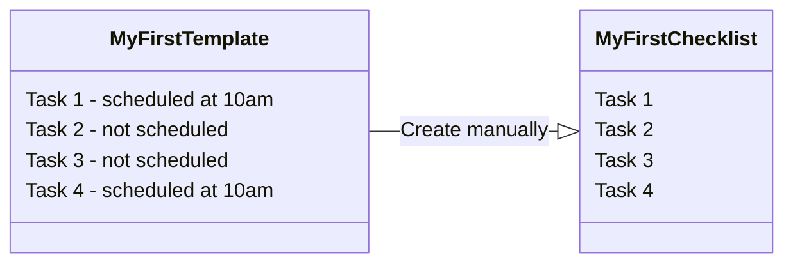
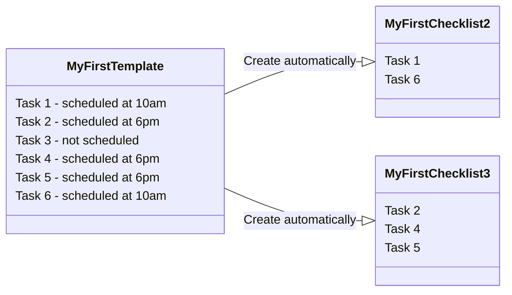
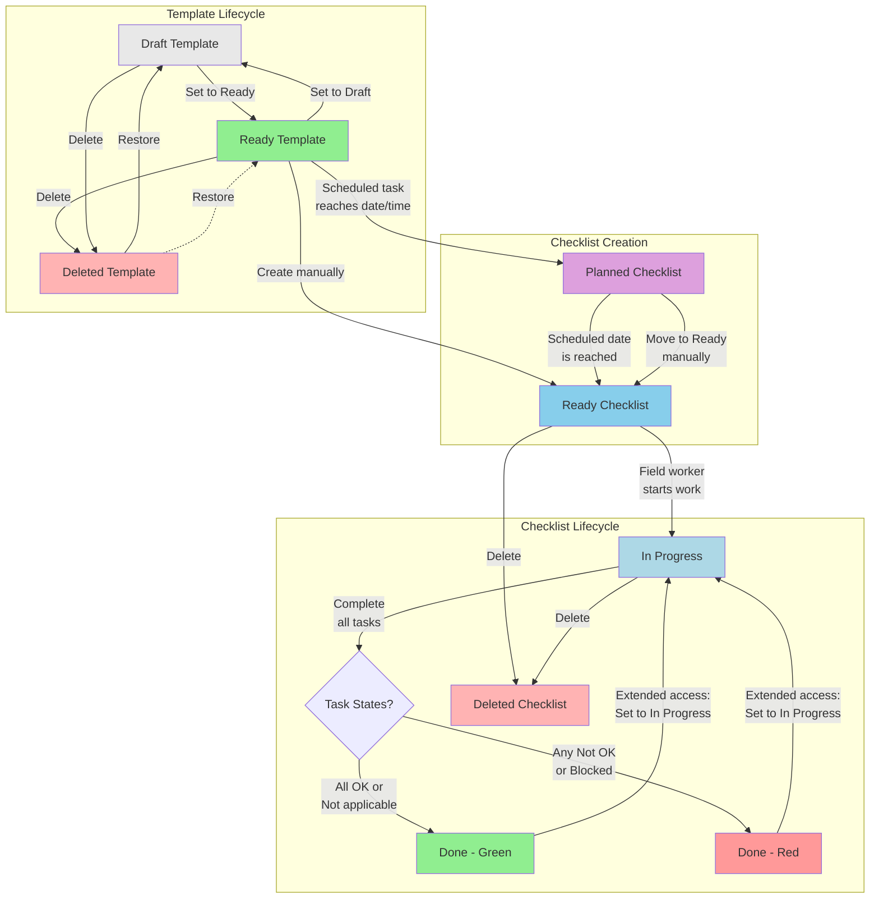

# INFIELD Documentation
Generated from: docs.cognite.com (infield)


<!-- SOURCE_START: docs.cognite.com/docs\cdf\infield\guides\config.mdx -->
## File: docs.cognite.com/docs\cdf\infield\guides\config.mdx

---
title: Configure InField
description: Plan and configure the source data and the Cognite Data Fusion project that will power the InField application and set up assets and visualize data.
content-type: procedure
audience: administrator
experience-level: 200
lifecycle: deprecated
article-type: article
---

<Warning>
This documentation is preserved for reference only for existing customers who have already implemented InField using the APM configuration. For all new InField implementations, follow the [InField configuration documentation using data models](/cdf/infield/guides/config_idm).
</Warning>

Proper planning is crucial to setting up the InField application. This section helps you plan and configure the source data and the Cognite Data Fusion (CDF) project that will power the application and describes how to set up assets and visualize data in InField.
You can also use the [Cognite Toolkit](/cdf/deploy/cdf_toolkit/guides/set_up_infield) to use pre-built configurations to set up InField.

## Before you start

Make sure you have the following:

- A project registered in [CDF](https://fusion.cognite.com).
- [The Cognite API and the CDF application registered in Microsoft Entra ID](/cdf/access/entra/guides/configure_cdf_azure_oidc) and [Microsoft Entra ID and CDF groups set up to control access to CDF data](/cdf/access/entra/guides/create_groups_oidc).
- Data in the CDF project, an asset-centric data model must be in place.
- [URLs](/cdf/admin/allowlist) in your allowlist.

<Warning>
[Set up locations in InField](#configure-a-root-location) even if you have these set up in CDF. At the moment, CDF and InField use different location concepts.
</Warning>

## Set up access

You can use your existing identity provider (IdP) framework to manage access to InField and choose admin users. We currently support Microsoft Entra ID, Microsoft's cloud-based identity and access management service. By creating groups, you can assign different sets of capabilities to users and thus give different access rights to each group.

### Create an admin group

Create a group of users who can configure the InField application across all locations.

<Steps>

<Step title="Navigate to Manage access">
Go to [<span class="ui-element">CDF</span>](https://fusion.cognite.com) > <span class="ui-element">Manage</span> > <span class="ui-element">Manage access</span>.
</Step>

<Step title="Create a group">
Create a group and name it `applications-configuration`.
</Step>

<Step title="Assign capabilities">
Give `read` and `write` access to all capabilities with the scope `All`, or have the minimum set of capabilities.
</Step>

</Steps>

| Capability type      | Action                         | Scope                            | Description                                                                                       |
| -------------------- | ------------------------------ | -------------------------------- | ------------------------------------------------------------------------------------------------- |
| Assets               | `assets: read`                 | All                              | View asset data from the CDF project that InField runs on top of.                                 |
| Groups               | `groups: read`, `groups: list` | All                              | For InField administrators to grant access to users.                                              |
| 3D                   | `3D: read`                     | All                              | Upload 3D models to display in InField.                                                           |
| Data sets            | `datasets: read`               | All                              | Get data from work order management system, such as SAP, and work orders. |
| Data models          | `dataModel: read`              | All                              | Organize and structure data.                                     |
| Data model instances | `dataModelInstance:read`       | All                              | Access data organized in data models.                                    |
| Data model instances | `dataModelInstance:write`      | `cognite_app_data`, `APM_Config` | Access and edit data organized in data models and spaces.                |

### Create standard user groups

Create groups of users who can view checklists, administer checklists and templates, and work with checklists in the field. You can create similar groups for different locations. The groups can have the same capabilities but different access based on the group name.

<Note>
Group names are suggestions and can differ from user to user.
</Note>

#### Read only access

Create a group of users who can view but not edit checklists. You can name the group `infield_dev_location_viewers`, where `dev` is the InField environment, and `location` is the location that the group will have access to.

| Capability type      | Action                         | Scope                                                                                                                                                  | Description                                               |
| -------------------- | ------------------------------ | ------------------------------------------------------------------------------------------------------------------------------------------------------ | --------------------------------------------------------- |
| Groups               | `groups: read`, `groups: list` | All                                                                                                                                                    | View user groups.                                         |
| Assets               | `assets: read`                 | `asset_datasets`                                                                                                                                       | View and analyze asset details.                           |
| 3D                   | `3D: read`                     | `threed_datasets`                                                                                                                                      | View and analyze 3D models.                               |
| Files                | `files: read`                  | `files_datasets, infield_app_data_dataset`                                                                                                             | View and analyze images and files.                        |
| Relationships        | `relationships: read`          | `relationship_datasets`                                                                                                                                | View relationships between assets.                        |
| Time series          | `timeseries: read`             | `timeseries_datasets, infield_app_data_dataset`                                                                                                        | View and analyze time series data.                        |
| Data models          | `dataModel: read`              | `APM_Config , cdf_apm , cdf_infield ,  cdf_core , cdf_apps_shared , apm_source_datamodel_space`- the space where the `APM_SourceData` model is defined | View and analyze the data created in InField.             |
| Data model instances | `dataModelInstance:read`       | `APM_Config , cdf_apm , cognite_app_data , location_app_data_space , location_source_data_space`                                                       | View and analyze the data created in InField.             |
| Data model instances | `dataModelInstance:write`      | `cognite_app_data`                                                                                                                                     | Access and edit data organized in data models and spaces. |

#### Read and write access

Create a group of users who can administer checklists and templates and work with checklists in the field. This can be a single group for all users or 3 different groups. If you create 3 separate groups, you can use the following naming suggestions.

| Name                                    | Description                                                                                                                            |
| --------------------------------------- | -------------------------------------------------------------------------------------------------------------------------------------- |
| `infield_dev_location_checklist_admins` | Users in this group can create, update, delete, and approve checklists in the specified location (`location`) and environment (`dev`). |
| `infield_dev_location_template_admins`  | Users in this group can create, update, and delete templates in the specified location (`location`) and environment (`dev`). They can also create, update, and delete observations and send them to SAP.           |
| `infield_dev_location_checklist_users`  | Users in this group can work with checklists and create observations in the specified location (`location`) and environment (`dev`).   |

To create a group of users who can view and edit checklists, add the following capabilities:

- [Read only](#read-only-access) capabilities.
- The following write capabilities:

| Capability type      | Action                    | Scope                      | Description                                                         |
| -------------------- | ------------------------- | -------------------------- | ------------------------------------------------------------------- |
| Files                | `files: write`            | `infield_app_data_dataset` | View and edit documents and files.                                  |
| Relationships        | `relationships: write`    | `infield_app_data_dataset` | Relationships represent connections between pairs of CDF resources. |
| Data model instances | `dataModelInstance:write` | `location_app_data_space`  | Access and edit data organized in data models and spaces.           |
| Time series          | `timeseries: write`             | `timeseries_datasets, infield_app_data_dataset`                                                                                                        | View, create, and edit time series data.                        |

To add checklist and template admins to your root location:

<Steps>

<Step title="Navigate to Template/checklist admins">
In [InField](https://cognite-infield.cogniteapp.com), go to <span class="ui-element">Application configuration</span> > <span class="ui-element">Root Location</span> > <span class="ui-element">Edit location</span> > <span class="ui-element">Template/checklist admins</span>.
</Step>

<Step title="Assign groups and save">
Select the corresponding group for each dropdown and save the configuration.
</Step>

</Steps>

<Info>
Assigned admin user groups and their access capabilities apply to InField only.
</Info>

#### SAP writeback (optional)

Assign the **SAP writeback** capability to the standard user groups to let them send observations to SAP.

| Capability type      | Action                    | Scope                      | Description                                                         |
| -------------------- | ------------------------- | -------------------------- | ------------------------------------------------------------------- |
| SAP writeback requests | `sapwritebackrequests: write`, `sapwritebackrequests: list` | All | Create requests to send data, such as work orders, assets, and observations, to SAP. |

See [SAP writeback service](/cdf/integration/guides/interfaces/sap_writeback) for more information.

## Create data modeling spaces

InField has two ways of storing assets: classic asset hierarchy and asset data modeling. You need to create at least 5 spaces to store your data and data models.

| Space name                     | Description                                                                                                                                                        |
| ------------------------------ | ------------------------------------------------------------------------------------------------------------------------------------------------------------------ |
| `cognite_app_data`             | This space holds user data, such as user profiles.                                                                                                                 |
| `APM_Config`                   | This space holds configurations in Asset Performance Management (APM).                                                                                             |
| `APM_SourceData`               | This space holds the schemas/data models for the data types that should be stored in the `yourRootLocation_source_data` space.                                     |
| `yourRootLocation_source_data` | This space holds space data (data coming from a customer source system, such as SAP) for a particular location.                                                    |
| `yourRootLocation_app_data`    | This space holds data coming from InField (from checklists and templates) for a particular location.                                                               |
| `ApmAppData`                   | You don't need to set up or change this space. `ApmAppData` is a system data model that's present in all projects by default. The data model has the `System` tag. |

<Tip>
Create new `yourRootLocation_source_data` and `yourRootLocation_app_data` spaces for each root location you have.
</Tip>

You can create spaces in the following ways:

- All 5 spaces with the [Cognite Python SDK](#spaces-created-with-sdk).
- 3 spaces with the [Cognite API and 2 spaces manually](#spaces-created-with-api) in the Cognite Data Fusion (CDF) or automatically by using the script.

### Spaces created with SDK

You can create all 5 spaces using [Cognite Python SDK](https://cognite-sdk-python.readthedocs-hosted.com/en/latest/index.html). Use the following Python code and replace `yourRootLocation` with your root location/asset name in `yourRootLocation_source_data`, `yourRootLocation_app_data`.

<Accordion title="Create spaces">

```python
from cognite.client.data_classes.data_modeling import SpaceApply

# List of spaces to create
spaces_to_create = ["yourRootLocation_source_data", "yourRootLocation_app_data", "APM_SourceData", "APM_Config", "cognite_app_data"]

# Apply spaces
for space_name in spaces_to_create:
 client.data_modeling.spaces.apply(SpaceApply(space=space_name))
```

</Accordion>

### Spaces created with API

Create the following 3 spaces using the [API endpoint](https://api-docs.cognite.com/20230101/tag/Spaces/operation/ApplySpaces):

- `cognite_app_data`
- `yourRootLocation_source_data`
- `yourRootLocation_app_data`

Use the same names for the `space` and `name` attributes. The `space` attribute is also the space ID.
Replace `yourRootLocation` with your root location/asset name in `yourRootLocation_source_data`, `yourRootLocation_app_data`.

`APM_Config` and `APM_SourceData` are the spaces that you can create manually in CDF or automatically by running the script. You create these spaces by creating corresponding data models.

**To create the spaces manually:**

<Steps>

<Step title="Navigate to Create data model">
Go to [<span class="ui-element">CDF</span>](https://fusion.cognite.com) > <span class="ui-element">Data management</span> > <span class="ui-element">Data models</span> > <span class="ui-element">Create data model</span>.
</Step>

<Step title="Name the data model">
Name the data model `APM_Config` and add a description if needed.
</Step>

<Step title="Create new space">
Select <span class="ui-element">From scratch</span> > <span class="ui-element">Space name</span> > <span class="ui-element">+ Create new space</span>.
</Step>

<Step title="Name the space">
Name the space `APM_Config`.
</Step>

</Steps>

Follow the same steps to create the `APM_SourceData` data model and space.

**To create the spaces automatically:**

1. [Run the scripts in the repository](https://github.com/cognitedata/apm_datamodels) for `APM_Config` and `APM_SourceData` to automatically deploy these data models for your project.

## Add a scheduling function

With the scheduling function, users can create checklists from template tasks based on the schedule.

**To add the scheduling function:**

1. Go to the GitHub repository and follow the [manual deployment process](https://github.com/cognitedata/infield-functions?tab=readme-ov-file#manual-deployment-process) instructions.

The scheduling functionality in InField follows Google Calendar behavior with a few exceptions. See how to schedule checklists from template tasks in the InField application.

## AWS cluster

If you are on the AWS cluster and you want to enable file upload to it, add your project to the [feature flag](https://unleash-apps.cogniteapp.com/projects/default/features/INFIELD_IS_AWS_PROJECT).

## Configure `APM_Config` in CDF

A data model is an abstract model that organizes data elements and standardizes how they relate to one another and the properties of real-world entities. The CDF data model collects industrial data by [resource types](/dev/concepts/resource_types) that let you define the data elements, specify their attributes, and model the relationships between them. The different resource types are used to both store and organize data.

To create the `APM_Config` model and the corresponding space:

<Steps>

<Step title="Navigate to APM_Config model">
Go to [<span class="ui-element">CDF</span>](https://fusion.cognite.com) > <span class="ui-element">Data management</span> > <span class="ui-element">Explore</span> > <span class="ui-element">Model your data</span> > <span class="ui-element">APM_Config</span>.
</Step>

<Step title="Paste the model code">
In the <span class="ui-element">Editor</span>, delete the existing code snippet and paste the `APM_Config` model data code snippet.
</Step>

</Steps>

<Accordion title="APM_Config model">

```python
type APM_Config @view (version: "1"){
  name: String
  appDataSpaceId: String
  appDataSpaceVersion: String
  customerDataSpaceId: String
  customerDataSpaceVersion: String
  featureConfiguration: JSONObject
  fieldConfiguration: JSONObject
  rootLocationsConfiguration: JSONObject
  isDefault: Boolean
}
```

</Accordion>

<Warning>
Populate the `APM_SourceData` model only after you've set up your root location in the InField application.
</Warning>

## Create transformations

Populate your locations with asset data. As you already have a classic asset hierarchy in place, you can use transformations to convert this data into assets in data modeling.

Read about [data transformation](/cdf/integration/concepts/transformation) and how to [transform data in CDF](/cdf/integration/guides/transformation/transformations).

First, create a transformation via the [API](https://api-docs.cognite.com/20230101/tag/Transformations/operation/createTransformations) or SDK since certain functionality is unavailable in CDF.

For the code snippets, change the key for the `instanceSpace` attribute to `yourRootLocation_source_data` you created earlier. Ensure the parameters in the `view` object remain unchanged.

<Tip>
If you're using Postman, replace `{cluster}` and `{your_project}` with the actual project name.
</Tip>

<Accordion title="API code snippet">

```json
{
  "items": [
    {
      "name": "migrate-classic-asset-to-core-asset",
      "query": "/* MAPPING_MODE_ENABLED: false */\n/* {\"version\":1,\"sourceType\":\"clean\",\"mappings\":[{\"from\":\"externalId\",\"to\":\"externalId\",\"asType\":\"STRING\"},{\"from\":\"\",\"to\":\"parent\",\"asType\":\"STRUCT<`space`:STRING, `externalId`:STRING>\"},{\"from\":\"\",\"to\":\"source\",\"asType\":\"STRING\"},{\"from\":\"\",\"to\":\"root\",\"asType\":\"STRUCT<`space`:STRING, `externalId`:STRING>\"},{\"from\":\"\",\"to\":\"description\",\"asType\":\"STRING\"},{\"from\":\"\",\"to\":\"labels\",\"asType\":\"ARRAY<STRING>\"},{\"from\":\"\",\"to\":\"title\",\"asType\":\"STRING\"},{\"from\":\"\",\"to\":\"sourceId\",\"asType\":\"STRING\"}],\"sourceLevel1\":\"_cdf\",\"sourceLevel2\":\"assets\"} */\nselect\n  cast(asset.externalId as STRING) as externalId,\n  \n  (case \n    when isnull(asset.parentExternalId) then null\n    else node_reference('location_source_data_instance_space', asset.parentExternalId)\n  end )as parent,\n  cast(\"CDF Classic\" as STRING) as source,\n  node_reference('location_source_data_instance_space', cast(rootAsset.externalId as STRING)) as root,\n  cast(asset.description as STRING) as description,\n  cast(asset.name as STRING) as title,\n  cast(asset.externalId as STRING) as sourceId\nfrom\n  cdf_assetSubtree('configured_location_externalId') as asset \n  inner join cdf_assetSubtree('configured_location_externalId') as rootAsset on asset.rootId = rootAsset.id ",
      "destination": {
        "view": {
          "space": "cdf_core",
          "externalId": "Asset",
          "version": "v1"
        },
        "instanceSpace": "location_source_data_instance_space",
        "type": "nodes"
      },
      "conflictMode": "upsert",
      "isPublic": true,
      "externalId": "tr-migrate-classic-asset-to-core-asset",
      "ignoreNullFields": true
    }
  ]
}
```

</Accordion>

<Accordion title="SDK code snippet">

```json
import json
_body = {
    "items": [
        {
            "name": "migrate-classic-asset-to-core-asset",
            "query": "/* MAPPING_MODE_ENABLED: false */\n/* {\"version\":1,\"sourceType\":\"clean\",\"mappings\":[{\"from\":\"externalId\",\"to\":\"externalId\",\"asType\":\"STRING\"},{\"from\":\"\",\"to\":\"parent\",\"asType\":\"STRUCT<`space`:STRING, `externalId`:STRING>\"},{\"from\":\"\",\"to\":\"source\",\"asType\":\"STRING\"},{\"from\":\"\",\"to\":\"root\",\"asType\":\"STRUCT<`space`:STRING, `externalId`:STRING>\"},{\"from\":\"\",\"to\":\"description\",\"asType\":\"STRING\"},{\"from\":\"\",\"to\":\"labels\",\"asType\":\"ARRAY<STRING>\"},{\"from\":\"\",\"to\":\"title\",\"asType\":\"STRING\"},{\"from\":\"\",\"to\":\"sourceId\",\"asType\":\"STRING\"}],\"sourceLevel1\":\"_cdf\",\"sourceLevel2\":\"assets\"} */\nselect\n  cast(asset.externalId as STRING) as externalId,\n  \n  (case \n    when isnull(asset.parentExternalId) then null\n    else node_reference('location_source_data_instance_space', asset.parentExternalId)\n  end )as parent,\n  cast(\"CDF Classic\" as STRING) as source,\n  node_reference('location_source_data_instance_space', cast(rootAsset.externalId as STRING)) as root,\n  cast(asset.description as STRING) as description,\n  cast(asset.name as STRING) as title,\n  cast(asset.externalId as STRING) as sourceId\nfrom\n  cdf_assetSubtree('configured_location_externalId') as asset \n  inner join cdf_assetSubtree('configured_location_externalId') as rootAsset on asset.rootId = rootAsset.id ",
            "destination": {
                "view": {
                    "space": "cdf_core",
                    "externalId": "Asset",
                    "version": "v1"
                },
                "instanceSpace": "location_source_data_instance_space",
                "type": "nodes"
            },
            "conflictMode": "upsert",
            "isPublic": True,
            "externalId": "tr-2-migrate-classic-asset-to-core-asset",
            "ignoreNullFields": True
        }
    ]
}

body = json.dumps(_body, ensure_ascii=False, indent=2)
print(body)

client.post("/api/v1/projects/{sdf-project}/transformations", json=_body)
```

</Accordion>

Once you've created the transformation, do the following:

<Steps>

<Step title="Select the transformation">
In [<span class="ui-element">CDF</span>](https://fusion.cognite.com), go to <span class="ui-element">Integrate</span> > <span class="ui-element">Transform data</span>, and then select the `migrate-classic-asset-to-core-asset` transformation.
</Step>

<Step title="Update the SQL editor">
In the SQL editor, you need to switch the `location_source_data_instance_space` with your `location_space` (the space you created via the API in the beginning), and the `configured_location_externalId` with the `externalId` of your root asset.
</Step>

<Step title="Preview the transformation">
Select <span class="ui-element">Preview</span> to test the transformation.
</Step>

<Step title="Comment out relations">
Comment out parent and root direct relation since you don't have assets yet to create relations.
</Step>

<Step title="Run the transformation">
Select <span class="ui-element">Run</span> when the populated table looks correct.
</Step>

<Step title="Run again with relations">
Include parent and root direct relation and run the transformation again.
</Step>

</Steps>

<Tip>
When you run a transformation, make sure you create parents before children. It's also possible to create two transformations, one that creates the assets without direct relationships and then a second transformation that just updates the assets with these relationships.
</Tip>

## Configure a root location

<Info>
The users need to have admin rights to be able to work with the root location configuration.
</Info>

Root location is a root asset that's at the top of the [asset hierarchy](/dev/concepts/resource_types/assets). The root asset is a digital representation of a site, such as an oil platform, a plant, or an installation. Each site in InField should have a root location. For each location you want to be available in InField, complete the detailed configuration to visualize the data in the InField application.

<Steps>

<Step title="Add Root Location">
Sign in to [InField](https://cognite-infield.cogniteapp.com), select <span class="ui-element">Application configuration</span> (⚙) > <span class="ui-element">Root Location</span> > <span class="ui-element">Add Root Location</span>.
</Step>

<Step title="Add a location">
Select the root asset name or enter the location external ID and select <span class="ui-element">Add</span>.
</Step>

<Step title="Edit and configure">
Select <span class="ui-element">Edit asset</span> to set up some asset cards for the asset overview page and complete location configuration.
</Step>

</Steps>

<Frame>

</Frame>

### Features

Configure what features your users can access and what asset details they can see in the asset explorer.

<Steps>

<Step title="Configure features">
In the <span class="ui-element">Features</span> section, select what features to show in the application for the users in each location. Turn the features on or off to show or hide them. By default, the users can access all features except <span class="ui-element">Observations</span>.

| Feature                  | Description                                                                                                                                                                                                                                                                                                                                                       |
| ------------------------ | ----------------------------------------------------------------------------------------------------------------------------------------------------------------------------------------------------------------------------------------------------------------------------------------------------------------------------------------------------------------- |
| Templates and checklists | Create templates, create checklists out of a template or its tasks, assign checklists to disciplines, view and analyze the collected data on the <span class="ui-element">Overview</span> page.                                                                                                                                                                                             |
| Work orders              | Create checklists from a work order or its tasks that come from a work management system and view and analyze the collected data on the <span class="ui-element">Overview</span> page.                                                                                                                                                                                                      |
| Observations             | Create observations on malfunctioning equipment or record other issues. When this feature is turned on, you can customize the fields on the observation form on the <span class="ui-element">Observations</span> tab. <br/><br/> Provide external IDs for the Notifications and Attachments endpoints. You'll have these IDs when you create an SAP instance in the new write-back service. |
| Write-back to SAP        | Send an observation copy as a Notification to SAP. Make sure that you provide external IDs for the Notifications and Attachments endpoints.                                                                                                                                                                                                                       |
</Step>

<Step title="Configure Asset explorer cards">
In the <span class="ui-element">Asset explorer</span> section, select what cards to show for the assets in each location. Turn the cards on or off to show or hide them for the users.
</Step>

<Step title="Save configuration">
Save configuration.
</Step>

</Steps>

### 3D

Set up [3D models](/cdf/3d) for your location to view them on the 3D card on the asset overview page.

To display a 3D model on the 3D card:

1. Under <span class="ui-element">Full weight model</span>, select <span class="ui-element">Add 3d model</span>. The 3D model must already exist in CDF.

If your 3D model has [asset mappings](https://api-docs.cognite.com/20230101/tag/3D-Asset-Mapping/operation/create3DMappings), the 3D viewer will automatically display the selected asset.

You can add several 3D models per root location. The 3D viewer only shows models with asset mappings containing the current asset. If several models are available, the user can select which model to open.

<Info>
The lightweight model is a low-resolution 3D model shown on the 3D card, which can be used to locate the current asset. Configuring such models isn't recommended since they require manual creation and provide limited value.
</Info>

### Data set

Add the data set ID from a previously created data set that stores data (time series and files) created in InField. The time series created in InField gets a metadata field (`source`=`APP`) to identify its origin.

When adding a numerical reading, you can connect it to the time series created directly in InField and the time series stored in the data set for the selected location.

### Checklist and template admins (optional)

Specify groups of users who can create and edit templates (template admins) and who can view and approve checklists (checklist admins). If you don't select any group, all users will have the same access.

### AppData Instance Space

Enter the name of the space you created (`yourRootLocation_app_data`) to hold data on templates, checklists, and observations created in the application.

### SourceData Instance Space

Enter the name of the space you created (`yourRootLocation_source_data`) to hold data on assets, work orders, notifications, and other APM-related types.

To display work orders on the **Work orders** card:

1. Upload the work orders into the configured space. Make sure that:

- `assetExternalId` is set to the correct asset
- `cloneOf` = `null`
- `source` is NOT `APP`
- `space` = `yourRootLocation_source_data`

You can also configure how users see work orders data on the <span class="ui-element">Work orders</span> card on the asset overview page.

<Steps>

<Step title="Navigate to Activities">
Return to the <span class="ui-element">Application configuration</span> page and select <span class="ui-element">Activities</span>.
</Step>

<Step title="Configure filters">
Add fields to filter on and add accepted values. The work orders on the card will be filtered based on the values provided. For example, if you set the filter to show work orders based on their status with values _RDEX_ or _VARX_, then the work order card will show work orders with the _RDEX_ or _VARX_ status. To view all work orders, select <span class="ui-element">Open</span>.
</Step>

</Steps>

### Configure custom data filters

Custom data filtering lets you configure locations to see data from several asset subtrees and root assets in asset hierarchy and from data modeling service. You can filter on general data that includes all data types. You can also filter individually on assets, time series, and files.

To get access to data filtering:

<Steps>

<Step title="Navigate to Custom data filtering">
In InField, go to <span class="ui-element">Application configuration</span> > <span class="ui-element">Root location</span> > <span class="ui-element">Edit asset</span> > <span class="ui-element">Custom data filtering</span>.
</Step>

<Step title="Create new configuration version">
Copy the external ID **APP_CONFIG_V2** for a new version of the `APM_Config` model and select <span class="ui-element">Create</span>. This will create a copy of the existing model and add new fields to allow custom data filtering. All data configured in **APM_Config** will be available in the new instance.
</Step>

</Steps>

<Warning>
Make sure to copy the external ID **APP_CONFIG_V2**. You'll need this ID to delete the new configuration from CDF if something goes wrong. When you delete the new configuration, the original configuration will automatically revert all changes.
</Warning>

To add assets to filter data in asset hierarchy:

<Steps>

<Step title="Add general asset IDs">
Under <span class="ui-element">General</span>, add external IDs of the assets you want to filter on in addition to your root location. Make sure your root location ID is included in the comma-separated list. Assets, time series, and files will inherit the provided IDs.
</Step>

<Step title="Configure asset filters">
Under <span class="ui-element">Assets</span>, add prefixes of the external IDs of the assets that will be used to filter assets.
</Step>

<Step title="Configure time series filters">
Under <span class="ui-element">Time series</span>, add prefixes of the external IDs of the assets that will be used to filter time series.

In the <span class="ui-element">Data set IDs</span> field, provide the data set ID that holds time series and files created in InField and add more data set IDs to filter time series. If you don't want to filter on data sets, leave the field empty.
</Step>

<Step title="Configure file filters">
Under <span class="ui-element">Files</span>, add prefixes of the external IDs of the assets that will be used to filter files.

In the <span class="ui-element">Data set IDs</span> field, provide the data set ID that holds time series and files created in InField and add more data set IDs to filter time series. If you don't want to filter on data sets, leave the field empty.
</Step>

</Steps>

To add assets to filter data in data modeling service:

1. Under <span class="ui-element">General</span>, add external IDs of the assets you want to filter on in addition to your default root location. Make sure your root location and the root locations that you add belong to the same space.

### Observations

Once you turn on the <span class="ui-element">Observations</span> feature, you can customize the observation form fields for your users to collect the most relevant data on malfunctioning equipment. Go to <span class="ui-element">Application configuration</span> > <span class="ui-element">Root location</span> > <span class="ui-element">Edit asset</span> > <span class="ui-element">Observations</span>. Here, you'll have a default list of fields the users will need to fill out when creating an observation. You can change these fields according to your needs and make them required or not.

<Tip>
Use the preferred language for each location when changing titles and descriptions of the fields.
</Tip>

| Section name    | Description                                                                                   |
| --------------- | --------------------------------------------------------------------------------------------- |
| Media           | Users can attach a video or an image in this field. The maximum file size to upload is 50 MB. |
| Description     | Users can give details about what happened and where.                                         |
| Asset           | Users can select an asset that's faulty or needs attention.                                   |
| Priority        | Users can select how critical the issue is and how quickly it must be resolved.               |
| Type            | Users can select the type of observation.                                                     |
| Troubleshooting | Users can describe the actions they've taken to resolve the issue.                            |

The <span class="ui-element">Priority</span> and <span class="ui-element">Type</span> fields have a list of options to choose from. You can add and remove options.

- The left-hand options **aren't visible** to users. These options should match those in your work management system (write-back service), and they'll be stored in CDF. If you've turned on the write-back to SAP, it will be also sent as a Notification to SAP.

- The right-hand options **are visible** to users. You can customize these options and use the preferred language for each location.

## Configure `APM_SourceData` in CDF

`APM_SourceData` holds the schema for the data that comes from the customer source systems, such as SAP.

<Warning>
Populate this model after you've set up your root location in the InField application.
</Warning>

InField uses the following data model entities:

| Data entity | View | Description |
|-------------|------| ---- |
| Asset | cdf_core.Asset | Preconfigured and can't be modified. |
| Maintenance orders (work orders/activities) | Apm_SourceData.CogniteMaintenanceOrder | Must be populated and can be modified. See [Populate data models](#populate-data-models). |
| Operations | Apm_SourceData.Operations | Must be populated and can be modified. See [Populate data models](#populate-data-models). |
| Notifications | Apm_SourceData.Notification | Must be populated and can be modified. See [Populate data models](#populate-data-models). |
| Files (P&IDs) | cdf_core.File | Preconfigured and can't be modified. |
| Annotations (file contextualization) | cdf_core.DiagramAnnotation (edge) | Preconfigured and can't be modified. |
| 3D | Ingested through 3D APIs | Preconfigured and can't be modified. |
{/* + a section about App_data - for checklists observations templates - data models populated from InField */}
### Populate data models

Populate the data model:

<Steps>

<Step title="Navigate to APM_SourceData model">
Go to [<span class="ui-element">CDF</span>](https://fusion.cognite.com) > <span class="ui-element">Data management</span> > <span class="ui-element">Explore</span> > <span class="ui-element">Model your data</span> > <span class="ui-element">APM_SourceData</span>.
</Step>

<Step title="Paste data types code">
In the <span class="ui-element">Editor</span> on the left, delete the existing code snippet and paste the data types code snippet of the `APM_Activity`, `APM_Notification`, and `APM_Operation` types.
</Step>

</Steps>

<Accordion title="Data types to populate the model">

```python
type APM_Activity
  @container(
    indexes: [
      {
        identifier: "apm-activity-startTime-cursorable"
        indexType: BTREE
        cursorable: true
        fields: ["startTime"]
      }
      {
        identifier: "apm-activity-endTime-cursorable"
        indexType: BTREE
        cursorable: true
        fields: ["endTime"]
      }
      {
        identifier: "apm-activity-startTime"
        indexType: BTREE
        fields: ["startTime"]
      }
      {
        identifier: "apm-activity-endTime"
        indexType: BTREE
        fields: ["endTime"]
      }
      { identifier: "assetExternalId", fields: ["assetExternalId"] }
    ]
  )
  @view(version: "1") {
  "Basic details"
  id: String
  title: String
  description: String
  source: String # e.g. SAP, COMOS, APP
  "Scheduling"
  startTime: Timestamp
  endTime: Timestamp

  "Contextualisation"
  assetExternalIds: [String]
  assetExternalId: String
  functionalLocation: String
  rootLocation: String
  notifications: [APM_Notification]
  assignedTo: [String]
  subActivities: [String]

  "Standard Activity Details"
  resource: String
  type: String # e.g. Corrective, Preventive
  status: String

  "System data"
  isArchived: Boolean
  isInApp: Boolean # In order to show this activity in the app, this must be TRUE.
  createdAt: Timestamp
  createdBy: String
  lastUpdatedDate: Timestamp
  mutatedBy: String
  cloneOf: String
  mutatedFields: [String]
  isMutated: Boolean
}

type APM_Operation
  @container(
    indexes: [{ identifier: "assetExternalId", fields: ["assetExternalId"] }]
  )
  @view(version: "1") {
  "Basic details"
  id: String
  title: String
  description: String
  source: String # e.g. SAP, COMOS, APP
  parentActivityId: String
  labels: [String]

  "Scheduling"
  startTime: Timestamp
  endTime: Timestamp

  "Contextualisation"
  assetExternalId: String
  files: [String]
  assignedTo: [String]

  "Standard operation data"
  mainResource: String
  personHours: Int
  numberOfMainResource: Int
  order: Int
  type: String
  status: String
  subOrder: Int

  "System data"
  isInApp: Boolean # In order to show this activity in the app, this must be TRUE.
  createdAt: Timestamp
  createdBy: String
  lastUpdatedDate: Timestamp
  cloneOf: String
  mutatedBy: String
  mutatedFields: [String]
  isMutated: Boolean
}

type APM_Notification
  @container(
    indexes: [{ identifier: "assetExternalId", fields: ["assetExternalId"] }]
  )
  @view(version: "1") {
  "Basic details"
  sourceId: String
  title: String
  description: String
  source: String # e.g. SAP, COMOS, APP

  "Contextualisation"
  assetExternalId: String
  rootLocationExternalId: String

  "Standard Notification Details"
  status: String
  type: String # M5, M1
  priority: String # Heigh, Medium, Low
  createdDate: Timestamp
}
```

</Accordion>

<Warning>
Make sure the `view` version always matches the data model version. Otherwise, the table on the Overview page won't work correctly.
</Warning>

### Add custom columns

The `APM_Activity` data type has a default set of columns with sorting and filtering. You can also add custom columns that will be fetched dynamically.

To add custom columns along with their filtering and sorting:

<Steps>

<Step title="Find APM_Activity data type">
In the `APM_SourceData`data model, find the `APM_Activity` data type.
</Step>

<Step title="Add column name">
Add the column name as the parameter key to the `APM_Activity` type, for example, `ID:`. The names provided aren't translated.
</Step>

<Step title="Configure data types for filtering and sorting">
Filtering and sorting is available with certain data types.
- Use the `Date` data type for sorting, for example, `ID: Date`. Index these fields to ensure efficient sorting, specifically with large data sets.
- Use the `String` or `[String]` data types for filtering, for example, `ID: String` or `ID:[String]`. Index these fields to ensure efficient filtering, specifically with large data sets.
</Step>

<Step title="Publish updates">
Publish the updates once you've added the columns.
</Step>

</Steps>

<Info>
Users can apply aggregated options provided for filtering per their requirements. If aggregated options exceed 1000, only the top 1000 options will be displayed for filtering purposes.
</Info>

### Run transformations

Once you've populated the `APM_SourceData` model, you can run a transformation for each data type.

<Tip>
If you want to separate the data into spaces based on location, run each transformation as many times as you have locations.
</Tip>

<Steps>

<Step title="Create new transformation">
Go to **Integrate** > **Transform data** > **+ Create**.
</Step>

<Step title="Select target data model">
Select `APM_SourceData` as your target data model.
</Step>

<Step title="Select target space">
Select `yourRootLocation_source_data` as your target space.
</Step>

<Step title="Select target type">
Select `APM_Activity` as your target type.
</Step>

<Step title="Enter transformation values">
In the SQL editor, enter the transformation values.
</Step>

</Steps>

<Accordion title="APM_Activity transformation">

```python

With
  root_asset AS (
    SELECT
      id,
      externalId,
      name
    FROM
      `_cdf`.`assets`
    WHERE
      isnull(parentId)
      and dataSetId = dataset_id("dataset:aveva-net-assets")
  ),
  relationship AS (
 select
        rel.sourceExternalId,
        rel.targetExternalId,
        ave.rootId
 from
    _cdf.relationships rel,
        _cdf.assets ave
 where
    rel.dataSetId = dataset_id("dataset:e2e-maintenance-sap")
   and array_contains(rel.labels, "label:sap-functional-location-mounted-to-aveva-asset")
    and ave.dataSetId = dataset_id("dataset:aveva-net-assets")
    and ave.externalId = rel.targetExternalId
   and ave.metadata["WORKFLOW STATUS"] not in ("Void", "Removed")
   and rel.targetExternalId not like '% - %'
 )

SELECT
  -- Mandatory fields
  wo_event.externalId AS externalId,
  wo_event.metadata['woOrder'] AS id,
  wo_event.description AS title,
  wo_event.metadata['woLongText'] AS description,
  wo_event.source AS source,
  wo_event.startTime AS startTime,
  wo_event.endTime AS endTime,
  rel.targetExternalId as assetExternalId,
  wo_event.metadata['referenceFunctionalLocation'] AS functionalLocation,
  root.externalId as rootLocation,
  wo_event.metadata["woMainWorkCenter"] AS resource,
  wo_event.metadata['woType'] as type,
  wo_event.metadata['woUserStatus'] AS status,
  array("") AS assignedTo,
  true AS isInApp
  -- Custom fields
  -- wo_event.metadata['woSystemStatus'] AS systemStatus
FROM
  _cdf.events AS wo_event,
  relationship AS rel,
  root_asset AS root
WHERE
  wo_event.type = 'work_order'
  AND wo_event.dataSetId = dataset_id("dataset:e2e-maintenance-sap")
  AND CONCAT('sap_apim_floc_', wo_event.metadata['referenceFunctionalLocation']) = rel.sourceExternalId
  AND root.id = rel.rootId

```

</Accordion>

<Warning>
The transformations provided are only examples and can vary depending on the SAP structure.
</Warning>

Repeat the same steps for the `APM_Notification` and `APM_Operation` types.

<Accordion title="APM_Notification transformation">

```python

With
  relationship AS (
   select
    sourceExternalId,
    targetExternalId
 from
    _cdf.relationships
 where
    dataSetId = dataset_id("dataset:e2e-maintenance-sap")
   and array_contains(labels, "label:sap-functional-location-mounted-to-aveva-asset")
  )

Select
  concat(wo_notif.externalId, ".", COALESCE(rel.targetExternalId, "")) as externalId,
  wo_notif.metadata["notNotificationPriority"] as priority,
  wo_notif.source as source,
  rel.targetExternalId as assetExternalId,
  wo_notif.metadata["mainFunctionalLocation"] as rootLocationExternalId,
  wo_notif.metadata["notLongText"] as description,
  wo_notif.metadata["woUserStatus"] as status,
  wo_notif.metadata["notNotification"] as sourceId,
  wo_notif.description AS title,
  wo_notif.metadata["notNotificationType"] as type,
  true as isInApp

from
  _cdf.events AS wo_notif,
  _cdf.assets as asset

  INNER JOIN _cdf.events AS wo_event
         ON  wo_event.type = "work_order"
         AND wo_event.metadata.woOrder = wo_notif.metadata.woOrder
  LEFT JOIN relationship AS rel
         ON rel.sourceExternalId = asset.externalId

where
  wo_notif.type = 'notification'
  AND wo_notif.dataSetId = dataset_id("dataset:e2e-maintenance-sap")
  AND asset.id = wo_notif.assetIds[0]

```

</Accordion>

<Accordion title="APM_Operation transformation">

```python

With
  relationship AS (
   select
    sourceExternalId,
    targetExternalId
 from
    _cdf.relationships
 where
    dataSetId = dataset_id("dataset:e2e-maintenance-sap")
   and array_contains(labels, "label:sap-functional-location-mounted-to-aveva-asset")
  ),
  op_events as (
   select
    externalId,
    description,
    source,
    metadata,
    startTime,
    endTime,
    explode(events.assetIds) as assetIds,
    type,
    dataSetId
   from
    _cdf.events as events
   where
    events.type = 'work_order_operation'
    AND events.dataSetId = dataset_id("dataset:e2e-maintenance-sap")
  )

Select
  concat(wo_op_event.externalId, ".", COALESCE(rel.targetExternalId, concat(".", asset.externalId))) as externalId,
  wo_op_event.metadata['opUniqueOperation'] AS id,
  wo_op_event.description AS title,
  wo_op_event.description AS description,
  wo_op_event.source AS source,
  node_reference("APM_SourceData", wo_event.externalId) AS parentActivity,
  wo_event.externalId as parentActivityId,
  array("") AS labels,
  wo_op_event.startTime AS startTime,
  wo_op_event.endTime AS endTime,
  COALESCE(rel.targetExternalId, asset.externalId) as assetExternalId,
  array("") AS files,
  wo_op_event.metadata['opWorkCenter'] as mainResource,
  cast(wo_op_event.metadata['opDurationHours'] as double) as personHours,
  cast(NULL AS integer) AS numberOfMainResource,
  cast(wo_op_event.metadata['opOperationCounter'] as integer) as order,
  wo_op_event.metadata.woType AS type,
  wo_op_event.metadata['opSystemStatus'] as status,
  array("") AS assignedTo,
  true AS isInApp
From
  op_events AS wo_op_event,
  _cdf.assets AS asset

  INNER JOIN _cdf.events AS wo_event
         ON  wo_event.type = "work_order"
         AND wo_event.metadata.woOrder = wo_op_event.metadata.woOrder
  LEFT JOIN relationship AS rel
         ON rel.sourceExternalId = asset.externalId
WHERE
 wo_op_event.assetIds = asset.id
   AND wo_op_event.type = 'work_order_operation'
 AND wo_op_event.dataSetId = dataset_id("dataset:e2e-maintenance-sap")
 -- AND array_contains(wo_op_event.assetIds, asset.id)

```

</Accordion>

Once you've run these transformations, go to the [InField application](https://cognite-infield.cogniteapp.com) > <span class="ui-element">Application configuration</span> (⚙) > <span class="ui-element">FDM</span>, and select the latest version for the `APM_SourceData` space.

## Configure an asset overview page

To see the asset overview page, select the asset you're interested in. The page has several cards that contain data on the selected asset. Two of the cards you've configured when configuring the root location settings are <span class="ui-element">3D</span> and <span class="ui-element">Work orders</span>. Configure the remaining cards to view the relevant data.

<Frame>

</Frame>

You can find cards configuration on the <span class="ui-element">Application configuration</span> page.

<Frame>

</Frame>

### Documents

<Steps>

<Step title="Enable Documents card">
Select <span class="ui-element">Documents</span> for the <span class="ui-element">Documents</span> card to display a list of documents that are contextualized to the current asset.

InField supports the following MIME (Multimedia Internet Mail Extensions) types:

- 'text/plain'
- 'text/csv'
- 'application/json'
- 'application/pdf'
- 'image/svg+xml'

<Note>
In InField, you can view only the files directly linked to the current asset. CDF Data explorer also displays files linked to child assets.
</Note>
</Step>

<Step title="Configure document properties">
Fill out the obligatory **Title** and **Description** fields and the optional **Type** field. You need to decide which properties you will use in these fields. You receive the file properties from the [File API](https://api-docs.cognite.com/20230101/tag/Files/operation/listFiles#!c=200&path=items&t=response) request. Property names are case-sensitive and are written in `camelCase`.
</Step>

</Steps>

<span class="ui-element">Type</span> is a metadata field. All documents are grouped by this field. If you leave the field empty, the group for the documents will be **Unknown Document Type**.

### Notifications

<Steps>

<Step title="Enable Notifications card">
Select <span class="ui-element">Notifications</span> to configure how users see notifications data on the <span class="ui-element">Notifications</span> card.
</Step>

<Step title="Configure filters">
Add fields to filter on and add accepted values. Fields are configured by their CDF field names, for example, **ID**, **Name**, or **metadata.title**.
</Step>

</Steps>

### Properties

<Steps>

<Step title="Navigate to Asset configuration">
Select <span class="ui-element">Asset</span> to configure which properties are clickable and highlighted on the <span class="ui-element">Properties</span> card on the asset overview page.
</Step>

<Step title="Configure properties">
Fill out the <span class="ui-element">Highlighted properties</span> and <span class="ui-element">Linkable asset keys</span> fields.
</Step>

</Steps>

<span class="ui-element">Highlighted properties</span> has a comma-separated list of metadata fields (case-sensitive) that will be visible on the card.

<span class="ui-element">Linkable asset keys</span> has a list of comma-separated metadata fields with the `externalId` of a related asset, for example, a parent or a child asset. Adding them to this list will make them clickable and linked to that asset's overview page.

The card shows just a few of the configured properties. Expand the card to see the full list of properties.

### Media

InField supports the following MIME types (Multimedia Internet Mail Extensions) with a maximum of 100 files per type:

- 'image/png'
- 'image/jpeg'
- 'video/quicktime'
- 'video/mp4'

<Note>
Make sure to contextualize the files to the current asset to see them on the card.
</Note>

**`ChecklistItem` view**

You can query all media added to a checklist. Adding and removing media displays in the `ChecklistItem` view in the `ApmAppData` model. When you query this view, you can receive one of the following values for the `files` attribute:

- `files: None` - nothing has been populated for the property.
- `files: []` - an explicitly empty list has been populated.
- `files: [None]` - a list of a single file that was populated once, and that file has since been deleted.

### Trends

The trends card displays time series data relevant to the current asset.

There are 2 ways of contextualizing a time series; using the first one is recommended:

<Steps>

<Step title="Set assetId field">
Set the `assetId` field of the time series.
</Step>

<Step title="Create a relationship">
Create a relationship where the source is the time series, and the target is the `assetExternalId`.
</Step>

</Steps>

<Warning>
InField supports time series with numerical values only, not string values.
</Warning>

To highlight a time series (display it on the card), set the `timeSeries.metadata.is_highlighted` to `true`. Only one time series is displayed on the <span class="ui-element">Trends</span> card at a time. Data for the highlighted time series is automatically refreshed every 2 seconds to provide the most recent data.

## Additional configurations

Complete the application configuration.

### Disciplines

Add disciplines to make sure you assign work orders and checklists to field workers who are experts on the particular tasks.

### AI

Use AI to find information about an asset in the attached documents. Remember that using AI doesn't guarantee that the answers are always accurate. To make sure the information you receive is accurate:

- Make sure the documents are formatted and structured, as AI relies on processed information to search and suggest content.
- Use clear instructions and ask about one thing per question.
- Verify the source of the answers to make sure they're correct.

To learn how using AI complies with the existing privacy, security and compliance commitments, refer to the [Trust and security](/cdf/trust/security#cognite-ai) article.

## Overview: Work orders

A work order can consist of one or several operations. Operations are individual steps in an order or individual tasks in a checklist. Some operations from the work management system, such as SAP, have an order or an operation number. Several operations have the same order/operation number and the same work order number (parentActivityId), which is why one operation in a work order can generate several tasks in a checklist.

For example, you have a work order with 2 operations: operation A and operation B. Operation A doesn't have an order/operation number, and operation B has an order/operation number 10. In your work management system, you have 3 operations with the same order/operation number that belong to the same work order number (parentActivityId). This means that instead of having 1 operation B, that is shown in your work order, you'll get 3 operations/tasks when you create a checklist from this operation.

<Info>
You can create checklists from work orders only if they have at least one operation.
</Info>

You can find and filter on the order number:
- In CDF, <span class="ui-element">Data management</span> > <span class="ui-element">Data models</span> > <span class="ui-element">APM_SourceData</span> > <span class="ui-element">APM_Operation</span>.
- In InField, <span class="ui-element">Overview</span> > expand work orders to see what operation number operations have. To check if there's more than one operation with the same order/operation number, select the work order > <span class="ui-element">Operations</span>.

<!-- SOURCE_END: docs.cognite.com/docs\cdf\infield\guides\config.mdx -->

================================================================================


<!-- SOURCE_START: docs.cognite.com/docs\cdf\infield\guides\config_idm.mdx -->
## File: docs.cognite.com/docs\cdf\infield\guides\config_idm.mdx

---
title: Configure data models for InField
description: Plan and configure the source data and the Cognite Data Fusion project that will power InField with data modeling.
content-type: procedure
audience: administrator
experience-level: 100
lifecycle: use
article-type: article
---

<Warning>
The features described in this section are currently in [beta](/cdf/product_feature_status) testing and are subject to change.
</Warning>

Proper planning is crucial to setting up InField. This section helps you plan and configure the source data and the Cognite Data Fusion (CDF) project that will power the application and describes how to set up assets and visualize data in InField.
You can also use the [Cognite Toolkit](/cdf/deploy/cdf_toolkit/guides/set_up_infield) to use pre-built configurations to set up InField.

<Note>
Looking for legacy APM configuration documentation for reference purposes, see [here](/cdf/infield/guides/config).
</Note>

## Before you start

Make sure you have the following:

- A project registered in the [CDF application](https://fusion.cognite.com). It must be a **Data Modeling only** project.
- [The CDF API and the CDF application registered in Microsoft Entra ID](/cdf/access/entra/guides/configure_cdf_azure_oidc) and [Microsoft Entra ID and CDF groups set up to control access to CDF data](/cdf/access/entra/guides/create_groups_oidc).
- Assets in the CDF project populated in the [`CogniteAsset` concept](/cdf/dm/dm_reference/dm_core_data_model#asset) .
- [URLs](/cdf/admin/allowlist) in your allowlist.

<Warning>
Make sure to [set up locations in InField](#configure-locations) even if you have them set up in CDF. At the moment, CDF and InField use different location concepts.
</Warning>

## Set up access

You can use your existing identity provider (IdP) framework to manage access to InField and choose admin users. We currently support Microsoft Entra ID. By creating groups, you can assign different sets of capabilities to users.

### Create an admin group

Create a group of users who can configure the InField application across all [locations](/cdf/locations/guides). See also how to [configure locations](#configure-locations) in InField.

<Steps>

<Step title="Navigate to Manage access">
Go to [<span class="ui-element">CDF</span>](https://fusion.cognite.com) > <span class="ui-element">Manage</span> > <span class="ui-element">Manage access</span>.
</Step>

<Step title="Create the group">
Create a group with the required name `applications-configuration`.
</Step>

<Step title="Assign capabilities">
Give `read` and `write` access to all capabilities with the scope `All`, or have the minimum set of capabilities.
</Step>

</Steps>

| Capability type      | Action                         | Scope                            | Description                                                                                       |
| -------------------- | ------------------------------ | -------------------------------- | ------------------------------------------------------------------------------------------------- |
| Groups               | `groups: read`, `groups: list` | All                              | For InField administrators to grant access to users.                                              |
| Data models          | `dataModel:read`              | All                              | View data models.                  |
| Data model instances | `dataModelInstance:read`       | All                              | Access data organized in data models.                                 |
| Data model instances | `dataModelInstance:write`      | `cognite_app_data`, `APM_Config` | Access and edit data organized in data models and spaces. |
| Data model instances | `dataModelInstance:write_properties` | Spaces with time series instances | Access, create and edit time series data. |
| Location filters     | `locationfilters:read`, `locationfilters:write`         | All | View locations in your InField project. |

### Create user groups

Create groups of users who can view checklists, administer checklists and templates, and work with checklists in the field. You can create similar groups for different locations. The groups can have the same capabilities but different access based on the group name.

<Note>
Group names are suggestions and can differ from user to user.
</Note>

| Name                                    | Description                                                                                                                            |
| --------------------------------------- | -------------------------------------------------------------------------------------------------------------------------------------- |
| `infield_dev_location_viewers` | Users in the group can view but not edit checklists in the specified location (`location`) and environment (`dev`). |
| `infield_dev_location_checklist_admins` | Users in this group can create, update, delete, and approve checklists in the specified location (`location`) and environment (`dev`). |
| `infield_dev_location_template_admins`  | Users in this group can create, update, and delete templates in the specified location (`location`) and environment (`dev`).           |
| `infield_dev_location_checklist_users`  | Users in this group can work with checklists and create observations in the specified location (`location`) and environment (`dev`). |

Assign the following group capabilities:

| Capability type      | Action                         |  Scope                                                                                                                                                  | Description                                               |
| -------------------- | ------------------------------ | ------------------------------------------------------------------------------------------------------------------------------------------------------ | --------------------------------------------------------- |
| Groups               | `groups:read`, `groups: list` | All                | View user groups.  |
| Data models          | `dataModel:read`              | `cdf_cdm` , `cdf_idm`, `APM_Config, cdf_infield, cdf_apps_shared , idm_customer_datamodel_space`- where you can extend the views if necessary | View and analyze the data created in InField.             |
| Data model instances | `dataModelInstance:read`       | `APM_Config, cognite_app_data, location_app_data_space, location_source_data_space` - a list of spaces to read the data from; `cdf_cdm_units` - a space to use units for time series. Add all such spaces you want to read the data from to the scope. | View and analyze the data created in InField.  |
| Data model instances | `dataModelInstance:write`      | `cognite_app_data` | Access and edit data organized in data models and spaces. |
| Data model instances | `dataModelInstance:write_properties` | Spaces with time series instances | Access, create and edit time series data. |
| Location filters     | `locationfilters:read`         | All                | View locations in InField. |

## Create data modeling spaces

InField stores asset data in [data models](/cdf/dm). You need to create at least 4 spaces to store your data and data models.

| Space name                     | Description                                                          |
| ------------------------------ | ---------------------------------------------------------------------|
| `cognite_app_data`             | This space holds user data, such as user profiles.               |
| `APM_Config` | This space holds configurations in Asset Performance Management (APM).        |
| `yourRootLocation_source_data` | This space holds data from your source systems (like SAP) for one root location. Replace `yourRootLocation` with the name of your root location/asset. |
| `yourRootLocation_app_data`    | This space holds data created in InField (like checklists and templates) for one root location. Replace `yourRootLocation` with the name of your root location/asset. |
| `ApmAppData`                   | You don't need to set up or change this space. `ApmAppData` is a system data model that's present in all projects by default. The data model has the `System` tag. |

<Note>
Create a unique pair of `_source_data` and `_app_data` spaces for **each** root location you want to configure in InField. For example, if you have two root locations named `plant-a` and `plant-b`, you will need to create four spaces in total:
- `plant-a_source_data`
- `plant-a_app_data`
- `plant-b_source_data`
- `plant-b_app_data`
</Note>

You can create spaces in the following ways:

- With the [Cognite Python SDK](#spaces-created-with-sdk).
- With the [Cognite API](#spaces-created-with-api).
- 2 location spaces directly in [InField](#spaces-created-in-infield).

### Spaces created with SDK

You can create the spaces using [Cognite Python SDK](https://cognite-sdk-python.readthedocs-hosted.com/en/latest/index.html). Use the following Python code and replace `yourRootLocation` with your root location/asset name in `yourRootLocation_source_data`, `yourRootLocation_app_data`.

<Accordion title="Create spaces">

```python

from cognite.client.data_classes.data_modeling import SpaceApply

# List of spaces to create
spaces_to_create = ["yourRootLocation_source_data", "yourRootLocation_app_data", "APM_Config", "cognite_app_data"]

# Apply spaces
for space_name in spaces_to_create:
 client.data_modeling.spaces.apply(SpaceApply(space=space_name))

```

</Accordion>

### Spaces created with API

You can create the spaces using the [API endpoint](https://api-docs.cognite.com/20230101/tag/Spaces/operation/ApplySpaces):

- `cognite_app_data`
- `APM_Config`
- `yourRootLocation_source_data`
- `yourRootLocation_app_data`

Use the same names for the `space` and `name` attributes. The `space` attribute is also the space ID.
Replace `yourRootLocation` with your root location/asset name in `yourRootLocation_source_data`, `yourRootLocation_app_data`.

`APM_Config` is the space that you can create manually in CDF or automatically by running the script. You create this space by creating corresponding data model.

### Spaces created in InField

To create location spaces in InField:

<Steps>

<Step title="Navigate to location settings">
Sign in to InField and select ⚙ > location to which you want to add spaces.
</Step>

<Step title="Add customer instance space">
On the <span class="ui-element">Customer instance spaces</span> tab, select the space from the list or enter the name of the space, for example, `yourRootLocation_source_data` and press <kbd>Enter</kbd>.
</Step>

<Step title="Add InField instance space">
On the <span class="ui-element">InField instance spaces</span> tab, select the space from the list or enter the name of the space, for example, `yourRootLocation_app_data` and press <kbd>Enter</kbd>.
</Step>

</Steps>

## Configure locations

<Tip>
Users need admin rights to configure locations.
</Tip>

The <span class="ui-element">Locations</span> page lists your root locations. Root location is a root asset that's at the top of the asset hierarchy. The root asset is a digital representation of a site, such as an oil platform, a plant, or an installation. Each site in InField should have a root location. For each location you want to be available in InField, complete the configuration in the InField application.

<Steps>

<Step title="Add location">
Sign in to [InField](https://cognite-infield.cogniteapp.com), select (⚙) > <span class="ui-element">+ Add location</span>.
</Step>

<Step title="Name and describe">
Enter the name and the description and select <span class="ui-element">Add</span>.
</Step>

<Step title="Complete configuration">
Select the location to complete configuration.
</Step>

</Steps>

### Location details

Update the name and description of your location.

### View mappings

[Views](/cdf/dm/dm_concepts#view) contain a group of properties that you can change for specific cases. By default, InField uses the Cognite process industries data model that extends the core data model to meet the needs of the process industries. You can customize entity definitions (or views), such as `CogniteAsset` and `CogniteMaintenanceOrder` by extending them with properties that are specific to your operations. For example, to extend the `CogniteMaintenanceOrder` property, you can create a new view and add the `Cost` field to this property.

In InField, you can select the entities you want to use, such as activities, assets, etc., with views defined in the `cdf_idm` ([Process industries data model](/cdf/dm/dm_reference/dm_process_industry_data_model)), `cdf_cdm` ([Core data model](/cdf/dm/dm_reference/dm_core_data_model)) spaces, or the space where you store your custom views.

| Data entity | View | Extendable |
|-------------|------| ------------------ |
| Asset | cdf_cdm.CogniteAsset | Yes |
| Activity (work orders) | cdf_idm.CogniteMaintenanceOrder | Yes |
| Operations | cdf_idm.CogniteOperations | Yes |
| Notifications | cdf_idm.CogniteNotification |  Yes |
| Files (P&IDs) | cdf_cdm.CogniteFile | No |
| Annotations (file Contextualization) | cdf_cdm.CogniteDiagramAnnotation (edge) | No |
| 3D | Ingested through 3D APIs | No |

To configure the views you want to use:

<Steps>

<Step title="Navigate to View mappings">
Go to <span class="ui-element">Locations</span> > <span class="ui-element">View mappings</span>.
</Step>

<Step title="Select spaces for properties">
For each property, select either the default space or the space where you created custom views. In the current implementation, you can configure view mappings of 4 entities only.
</Step>

<Step title="Save changes">
Save to apply the changes.
</Step>

</Steps>

<Warning>
Make sure the view version always matches the data model version. Otherwise, the table on the Overview page won't work correctly.
</Warning>

Each entity type, such as activity, asset, etc., has a standard view defined in the `cdf_idm` system space. To view and customize views, go to [**CDF**](https://fusion.cognite.com) > **Data management** > **Data models** > find and select **CogniteProcessIndustries**.

### Customer instance space

Select the space to store data on assets, work orders, notifications, and other data coming from a customer source system, such as SAP, for a particular location. Currently, you can select only one space.

### InField instance space

Select the space to store data on templates, checklists, and observations created in the application for a particular location.

### Observations

Configure observations to allow field workers to report issues and track maintenance needs. Observations are now fully supported on IDM (Industrial Data Model) projects.

To enable and configure observations:

<Steps>

<Step title="Navigate to Features">
Go to <span class="ui-element">Application configuration</span> <icon name="settings" /> select your location > <span class="ui-element">Features</span>.
</Step>

<Step title="Enable observations">
Enable the <span class="ui-element">Observations</span> feature.
</Step>

<Step title="Configure observation form fields">
Configure observation form fields to collect relevant information:
   - **Asset hierarchy search** &mdash; enabled by default, allows users to search and select assets from the asset hierarchy when creating observations.
   - **Assignment** &mdash; configure which user groups or disciplines can be assigned observations.
   - **Due dates** &mdash; enable due date tracking for observations to ensure timely follow-up.
</Step>

<Step title="Optional. Configure SAP writeback">
Configure SAP writeback to send completed observations to SAP as notifications.
</Step>

</Steps>

<Info>
Observations created in InField are stored in the `location_app_data_space` for the current location and can be queried using the data model APIs.
</Info>

### Asset explorer

To display related data, such as work orders, time series, and documents on the **Asset explorer** page, ensure these data objects are connected to the corresponding assets in Cognite Data Fusion. InField uses these relationships to find and display the relevant information for each asset.

| Data object           | Requirements                                                                                                                                                                                                                                                          |
| -------------------- | -------------------------------------------------------------------------------------------------------------------------------------------------------------------------------------------------------------------------------------------------------------------- |
| 3D                   | The `CogniteAsset.object3D` property needs to have a 3D model linked to the asset in the `source_instance_space`.                                                                                                                                                      |
| Trends (time series) | The `CogniteTimeSeries.assets` property needs to have a direct relation to the asset in either the `app_instance_space` or `source_instance_space` of the current location.                                                                                             |
| Documents            | The `CogniteFile.assets` property needs to have a direct relation to the asset in either the `app_instance_space` or `source_instance_space` of the current location. Supported document types in `CogniteFile.mimeType` include 'text/plain', 'text/csv', 'application/json', 'application/pdf', 'image/svg+xml'. |
| Work orders          | The `CogniteMaintenanceOrder.mainAsset` property needs to have a direct relation to the asset in the `source_instance_space` of the current location.                                                                                                                  |
| Notifications        | The `CogniteNotification.asset` property needs to have a direct relation to the asset in the `source_instance_space` of the current location.                                                                                                                        |
| Properties           | The `CogniteAsset` view needs to be extended with any custom properties you want to display for the asset.                                                                                                                                                             |
| Media                | The `CogniteFile.assets` property needs to have a direct relation to the asset in either the `app_instance_space` or `source_instance_space`. Supported file types in `CogniteFile.mimeType` include 'video/quicktime', 'video/mp4', 'image/jpeg', and 'image/png'. |

<Tip>
Make sure to contextualize files to the relevant asset to see them on the asset's card.
</Tip>

To test the location you just configured:

<Steps>

<Step title="Navigate to Select location">
In the top right, select your profile > **Manage account** > **Select location**.
</Step>

<Step title="Select the new location">
From the list, select the location you just created.
</Step>

</Steps>

Once the application reloads, you can work in your new location.

<!-- SOURCE_END: docs.cognite.com/docs\cdf\infield\guides\config_idm.mdx -->

================================================================================


<!-- SOURCE_START: docs.cognite.com/docs\cdf\infield\guides\create_templates.mdx -->
## File: docs.cognite.com/docs\cdf\infield\guides\create_templates.mdx

---
title: Create templates and checklists
description: Create templates, add tasks and schedules, and generate checklists for field workers to perform at regular intervals.
content-type: procedure
audience: businessUser
to-L10N: true
experience-level: 200
lifecycle: use
article-type: article
---
Use the <span class="ui-element">Templates</span> tab to create and plan tasks that the field workers perform at regular intervals, such as weekly installation operator rounds.

<Frame>

</Frame>

① **Action menu** — create templates, add tasks, change the template's status, assign and create checklists, and more (...).

② **Filter** — filter the templates by name, status, labels, and assignee. By default, you see <span class="ui-element">Ready</span> templates assigned to you. You can select **X** to remove filters.

③ **Templates list** — view the list of templates with details.

④ **Tasks list** — view and interact with the list of tasks in your template.

⑤ **Add task** — fill out your tasks with the required details to perform the work in the field.

## Step 1. Create templates

<Steps>

<Step title="Create and name a template">
Select <span class="ui-element">+ Create template</span> and name the template.
</Step>

<Step title="Optional. Add labels">
Add existing or create new labels to organize, categorize, and filter work. You can also add labels to existing *Draft* templates when editing them (&mldr; > **Edit template**).
</Step>

<Step title="Enter task details">
Enter name and description, and, optionally, link the task to an asset. A description can be a step-by-step instruction for the task with links where necessary.
</Step>

<Step title="Optional. Add task components">
Select <span class="ui-element">Add to task</span> and then select:

<Tabs>
  <Tab title="Numerical reading">

Ask field workers to add measurement readings from equipment. You can set the measurement unit, for example, _bar_ for pressure readings and minimum and maximum values. You can search and connect time series created in InField only.

   <Tip>
   InField stores the measurements as time series in CDF, and you can trend and analyze the values using [Charts](/cdf/explore/charts).

   If you've **removed a numerical reading** from a checklist, it's still available as a time series.

   </Tip>

To create a numerical reading:

1. Select **+** and fill out the required fields to create the time series.

2. Optional. Link the time series to a specific asset, otherwise, the time series is linked to the root asset.

3. Optional. Enter the description for the time series. If provided, the description is used as the numerical reading name in checklists.

</Tab>

<Tab title="Check item">

Add to the task an item that requires a check, verification, inspection, etc.

1. Add a description of what needs to be done.

2. Enter the button name, select its color, and link the button to the task status. The task will change its status based on the button field workers select. For example:

   - When field workers work on the checklist and select the button with the linked **OK** status, their task status changes to **OK**.
   - If there's a numerical reading that's out of range (**Not OK**) and field workers select the button with the linked **OK** status, the task status will change to **Not OK** as this task requires attention. In this example, field workers should fill out all numerical readings and items to check for the status to change automatically.

3. Select <span class="ui-element">+ Add button</span> to add another possible response to the description.

</Tab>

<Tab title="Schedule">

**Schedule** tasks to automatically create them as checklists at regular intervals. You can set checklists to open automatically on specific days, every two weeks, twice a month on Mondays, every 2 years, etc.

To schedule a task:

1. Set the time range when the field workers should complete the task. The initial start time is 6 AM in the computer's local time zone. You can change the start time to half-hour intervals.

2. Optional. Select the time zone <Icon icon="settings" /> .

3. Specify how often you want field workers to work on this task. For intervals other than daily, weekly, monthly, and yearly, set the start date when to create the first checklist from the task. By default, the date of adding a task is used.

    Once you schedule the task, hover over the calendar icon <Icon icon="calendar-check" /> next to it to see when the next checklist is created.

</Tab>

<Tab title="Message">

Ask field workers to give a written response to a request, question, message, etc.

</Tab>

<Tab title="Condition">

Set what subtask field workers need to perform if a checklist task gets a certain status. For example,  if the task's status changes to <span class="ui-element">Not OK</span>, field workers need to explain the reason in free text.

</Tab>

</Tabs>

</Step>

<Step title="Add more tasks">
Select <span class="ui-element">+ Add task</span> to add another task.

<Info>
One template has a limit of 500 tasks. However, to make it easy for the field worker to navigate them in the field, keep them as short as possible.
</Info>
</Step>

<Step title="Set template to Ready">
Ready templates can be assigned to disciplines or users and can be [created as checklists manually and automatically](#step-3-create-checklists).

<Frame>

</Frame>

The templates left in <span class="ui-element">Draft</span> will remain templates and won't appear as checklists.
</Step>

</Steps>

<Info>

You need **extended access** to plan and schedule tasks, and you need to assign activities using the InField desktop version, not mobile.

</Info>

## Step 2. Manage tasks

To work with several tasks at once, you can:

<Frame>

</Frame>

① **Select tasks** — create task groups, schedule several tasks at once, duplicate, and delete tasks.

② **Edit a group** — select <span class="ui-element">More options</span> (&mldr;) to ungroup the tasks or rename the group.

## Step 3. Create checklists

A checklist is a task or a list of tasks generated from a template or a work order. On the <span class="ui-element">Templates</span> tab, you can create a checklist from a template or its tasks in two ways:

- **Manually**. Select a template in the <span class="ui-element">Ready</span> status and, on the right, select <span class="ui-element">Create checklist</span>. Suggest a start and end date and confirm the creation. The dates are used for sorting only. You'll create a checklist that's a copy of the template, even if some tasks are scheduled for a different date and time.



<Tip>
Field workers can also create checklists on their [mobile devices](/cdf/infield/guides/perform#create-checklists).
</Tip>

- **Automatically**. Once you add a schedule to a task or a group of tasks, the tasks automatically appear in the created checklist based on the schedule. Remember to move the templates to <span class="ui-element">Ready</span>, otherwise, the schedule won't start. Template tasks that aren't scheduled won't be included in the checklist created from the scheduled tasks.



<Info>
Automatic scheduling creates checklists with a delay unless you create them before the task start time.
</Info>

## Delete and restore templates and tasks

To delete a template, select <span class="ui-element">More options</span> (&mldr;) to the right of <span class="ui-element">+ Add task</span> > <span class="ui-element">Delete template</span>.

To restore a template, select <span class="ui-element">Deleted</span> in the left panel > <span class="ui-element">More options</span> (&mldr;) to the right of the template you want to restore  > <span class="ui-element">Restore template</span>.

You can't restore a task that has been deleted from a template.

<!-- SOURCE_END: docs.cognite.com/docs\cdf\infield\guides\create_templates.mdx -->

================================================================================


<!-- SOURCE_START: docs.cognite.com/docs\cdf\infield\guides\observations.mdx -->
## File: docs.cognite.com/docs\cdf\infield\guides\observations.mdx

---
title: Create and view observations
description: Record equipment issues discovered during work, track their status, and send reports.
content-type: procedure
audience: businessUser
to-L10N: true
experience-level: 100
lifecycle: use
article-type: article
---
Observations are information collected from field workers on malfunctioning equipment that needs further evaluation. Depending on whether you're on a desktop or mobile version, you can create and view or only create observations.

<Note>
The observations functionality may differ depending on your project configuration.
</Note>

On the <span class="ui-element">Observations</span> tab, you can:

<Frame>

</Frame>

➀ **Create observations** &mdash; select <span class="ui-element">+ Create observation</span> to fill out an observation form.

➁ **View observation details** &mdash; view the details of all observations and how many new observations you have today. Available on the desktop version only.

➂ **Select observations** &mdash; select observation to bulk delete or send to SAP (the SAP feature must be turned on). You can delete observations in the *Draft* and *Not sent* statuses, and send observations in the *Completed* status only.

<Note>
The SAP integration is only available for projects that are not using CDM (Core Data Model).
</Note>

An observation can have one of the following statuses:

| Status | Meaning |
| ----- | ------- |
| Draft         | The observation is in progress. |
| Completed     | The user filled out all information and selected _Completed_. |

SAP-related statuses are:

| Status | Meaning |
| ----- | ------- |
| Sent          | The user completed the observation and sent it to SAP. |
| File not sent | The observation was sent to SAP but not the attached media files. |
| Not sent      | The observation wasn't sent to SAP. |

## Create observations on mobile

If you think an asset requires attention, you can create an observation for it:

- When working on a checklist, select **(+)** > <span class="ui-element">Create observation</span>.
- In the top left, select the menu tab > <span class="ui-element">Create observation</span>.

{/* You can also search for assets, assign observations to users or disciplines, and set due dates from the mobile version following the same steps as on desktop. */}

<!-- SOURCE_END: docs.cognite.com/docs\cdf\infield\guides\observations.mdx -->

================================================================================


<!-- SOURCE_START: docs.cognite.com/docs\cdf\infield\guides\perform.mdx -->
## File: docs.cognite.com/docs\cdf\infield\guides\perform.mdx

---
title: Perform activities
description: Work with checklists to complete tasks, add measurement readings, record observations, and work offline on your mobile device.
content-type: procedure
audience: businessUser
to-L10N: true
experience-level: 100
lifecycle: use
article-type: article
---
To perform activities in InField, you use checklists. Field workers can work on the checklists that are already added to the <span class="ui-element">Checklists</span> tab or create checklists from templates on the [<span class="ui-element">Templates</span>](#create-checklists) tab. A checklist has a set of tasks where you add a status, such as <span class="ui-element">OK</span>, <span class="ui-element">Not OK</span>, or <span class="ui-element">Blocked</span>. You can also add images, videos, and observations for malfunctions you notice while working. For some tasks, you may also see fields for adding measurement readings and check items.

## Work with checklists

<Frame>

</Frame>

➀ **Filter checklists** &mdash; filter checklists by status, assignees, or use search.

➁ **Select work days** &mdash; select a date range to view checklists for the past 7 days, with the most recent date at the top.

<Steps>

<Step title="Select a checklist">
Select a checklist from the list. By default, you see <span class="ui-element">Ready</span> checklists assigned to you and your discipline.

<Tip>
If you can't find a checklist, try sorting on the checklist status <span class="ui-element">Ready</span>, <span class="ui-element">In progress</span>, or <span class="ui-element">Done</span>, assignees, or use search.
</Tip>
</Step>

<Step title="Enter measurement values">
Enter any measurement values your supervisor has requested. Once you start working on the checklist, the status changes from <span class="ui-element">Ready</span> to <span class="ui-element">In progress</span>.
</Step>

<Step title="Optional. Respond to requests">
Respond to the supervisor's request by selecting an action button, for example, **Low**, **Normal**, **High**, or **Open**, **Closed**.
</Step>

<Step title="Set task status">
For each task, select <span class="ui-element">OK</span> or a different status from <span class="ui-element">Other</span>.

If you want to bulk change the statuses of the remaining tasks, select <span class="ui-element">More options</span> (&mldr;) > <span class="ui-element">Set remaining tasks to</span> and select the status. You can do that for the tasks in the group and outside the group and only once.
</Step>

<Step title="Add media or observations">
Select <span class="ui-element">+</span> to add images and videos, enter text, or create observations. Fill out the [<span class="ui-element">Observations</span>](/cdf/infield/guides/observations) form if an asset requires a closer look, for example, due to malfunctions.
</Step>

<Step title="Mark checklist as done">
When you've completed all tasks, set the checklist to <span class="ui-element">Done</span>. You can no longer update it.

<Warning>
The checklist doesn't move automatically to <span class="ui-element">Done</span> when you complete all tasks.
</Warning>
</Step>

</Steps>

## Create checklists

To create checklists from templates on your mobile device:

<Steps>

<Step title="Navigate to Templates">
On the left panel, select <span class="ui-element">Templates</span>. You'll see the list of <span class="ui-element">Ready</span> templates assigned to you.

<Tip>
Select **X** to remove the filter.
</Tip>
</Step>

<Step title="Create checklist from template">
Select the template you want to create a checklist from and select <span class="ui-element">Create checklist</span>. The assignee is the person who created the checklist.
</Step>

<Step title="Start working or create more">
Start working on the checklist or go back to create more checklists.
</Step>

</Steps>

## Explore assets

To see information linked to an asset, such as 3D images, documents, time series, or other assets, search for the asset or select an asset ID displayed as a blue link.

- Select the search icon <Icon icon="search" /> to search for assets, time series, or documents.
- Select the search icon <Icon icon="search" /> > <span class="ui-element">Hierarchy</span> to find equipment linked to the asset you're working with.

## Work offline

Field workers can complete operator rounds and work orders with slow or no network connectivity on their mobile devices.

To work offline, open the checklist while you still have network connectivity. If you go offline, you can still complete tasks but you can't access the asset explorer, upload media, and create observations. When you're back online, all data collected offline will be uploaded.

<Tip>
To stop repetitive connectivity notifications, turn on airplane mode or ensure a steady network connection. To download data when offline, turn off airplane mode and wait until the data is uploaded. In the meantime, do NOT close the application or exit the checklist.
</Tip>

For a minimum required bandwidth, refer to [Connectivity and bandwidth](/cdf/admin/connectivity).

<!-- SOURCE_END: docs.cognite.com/docs\cdf\infield\guides\perform.mdx -->

================================================================================


<!-- SOURCE_START: docs.cognite.com/docs\cdf\infield\guides\plan.mdx -->
## File: docs.cognite.com/docs\cdf\infield\guides\plan.mdx

---
title: Plan, schedule, and assign activities
description: View work orders and checklists, assign activities to disciplines or users, create checklists from work orders, and track task progress.
content-type: procedure
audience: businessUser
to-L10N: true
experience-level: 200
lifecycle: use
article-type: article
---
You can view and interact with the planned work on the <span class="ui-element">Overview</span> and the <span class="ui-element">[Schedules](#view-scheduled-work)</span> tabs.

On the <span class="ui-element">Overview</span> tab, you'll see all planned activities divided into <span class="ui-element">Work orders</span> (maintenance work) and <span class="ui-element">Checklists</span> (operator rounds). You can assign these activities to a group of users (disciplines), such as all electricians, or directly to specific users. Also, you can suggest a start and end date for each activity, but these are only used for sorting.

<Frame>

</Frame>

On the <span class="ui-element">Overview</span> tab, you can:

➀ **Change location** &mdash; switch between different work locations. You can also select your profile at the top right > <span class="ui-element">Manage account</span> > <span class="ui-element">Select location</span>.

➁ **Search and filter** &mdash; adjust the table view with the search field, date picker, number of columns and [save the view as a filter](#create-filters).

➂ **Create and assign** &mdash; [create checklists from a work order or its tasks](#create-checklists-from-work-orders) and assign or reassign work orders and checklists.

➃ **Change view** &mdash; switch between the <span class="ui-element">Work orders</span> and <span class="ui-element">Checklists</span> view.

<Tabs>

  <Tab title="Work orders">

    The <span class="ui-element">Work orders</span> tab shows the work orders imported from a work management application, such as SAP. Here, you can:

    - View work order details with a list of tasks (operations) to perform. Expand the task to see if it applies to several assets.
    - Select <span class="ui-element">Create & Assign</span> to create a checklist from work order tasks. Once you create the checklist, you can check its progress by selecting the number of tasks in the <span class="ui-element">Checklist Progress</span> column.
    - Create checklists from several work order tasks relevant to a field worker. If there are tasks left, you can also create another checklist. The work order will remain in progress until field workers complete all tasks in the work order.

  </Tab>

  <Tab title="Checklists">

    The **Checklists** tab shows recurring tasks generated from templates that are created by an admin on the <span class="ui-element">Templates</span> tab. Here, you can:

    - View the checklist details.
    - Assign or reassign checklists.
    - [Track and complete checklist tasks](/cdf/infield/guides/plan#track-and-complete-tasks).
    - Delete checklists. If the field worker collects the data before you delete the checklist, the data is saved and stored in InField. You can only restore the deleted checklist through the Cognite API.

  </Tab>

</Tabs>

<Tip>
When planning the work, you can also use <span class="ui-element">Search</span> <Icon icon="search" /> to find and analyze time series, assets, and documents in your selected location.
</Tip>

## Create filters

On the <span class="ui-element">Overview</span> tab, you can adjust the filters to view the most relevant data and save the selection as a filter.

<Frame>

</Frame>

➀ **Create** &mdash; save selected filters and create a filter preset you can use later.

➁ **Select** &mdash; select the saved filter preset to view relevant information.

➂ **Edit** &mdash; change saved filters, make them default, or delete them.

To create a filter for columns:

<Steps>

<Step title="Configure columns">
Select <span class="ui-element">Hidden columns</span>, select the columns to display, reorder them if needed, and select <span class="ui-element">Apply</span>.
</Step>

<Step title="Filter and sort">
For example, select a certain checklist status.
</Step>

<Step title="Save the filter">
Next to <span class="ui-element">Clear filters</span>, select the dropdown arrow and save the filter.
</Step>

<Step title="Name the filter">
Name and save the filter.
</Step>

</Steps>

In the dropdown, you can see a list of all created filters. You can select a filter to apply to the <span class="ui-element">Overview</span> tab or make it default for the tab.

<Note>
You must create separate filters for work orders and checklists. Search results and a date range don't apply to the filter preset.
</Note>

## Create checklists from work orders

A checklist is a task or a list of tasks created from a [template](/cdf/infield/guides/create_templates) or created from a work order. You can create a checklist from a work order or its tasks (operations) only manually.

<Steps>

<Step title="Navigate to Work orders">
Go to <span class="ui-element">Overview</span> > <span class="ui-element">Work orders</span>.
</Step>

<Step title="Select work order or tasks">
Create a checklist from a work order or several work order tasks:

- Select the work order to create a checklist from all tasks within it.
- Expand the work order and select the operations you want on your checklist.
</Step>

</Steps>

A work order can consist of one or several operations. Operations are individual steps in an order or individual tasks in a checklist. Some operations that come from the work management system, such as SAP, have an order or an operation number. One operation in a work order can generate several tasks in a checklist if several operations have the same order/operation number and the same work order number (parentActivityId).

## Track and complete tasks

As the field workers complete the tasks on a checklist, they update the status and add relevant images, measurements, and observations. You'll find the status of all activities along with their progress on the <span class="ui-element">Overview</span> tab, where you can sort the columns and select relevant dates. To set the status for a checklist or work order, select the item > <span class="ui-element">More options</span> (&mldr;) > <span class="ui-element">Set checklist to</span> > <span class="ui-element">Done</span>.

You can't update checklists or work orders with the status <span class="ui-element">Done</span>. However, **extended access** lets you change the status to <span class="ui-element">In progress</span> and update the checklist.

The meaning of the checklist status colors.

| Color | Meaning |
| ----- | ------- |
| Grey  | The operator hasn't completed any tasks. |
| Green | The operator completed the checklist and all tasks have the <span class="ui-element">OK</span> or <span class="ui-element">Not applicable</span> state.  |
| Blue  | The operator has started, but not completed, the checklist. |
| Red   | The operator set the state of at least one of the tasks to <span class="ui-element">Not OK</span> or <span class="ui-element">Blocked</span>.|

## View scheduled work

<Warning>
The features described in this section are currently in [beta](/cdf/product_feature_status) testing and are subject to change.
</Warning>

On the <span class="ui-element">Schedules</span> tab, you'll see all planned activities created from templates manually or automatically. As a template and checklist admin, you can view the checklists planned for the current and upcoming weeks and what has already been worked on, and move planned work to <span class="ui-element">Ready</span>.

<Frame>

</Frame>

On the **Schedules** tab, you can:

➀ **Select a work week** &mdash; select the week to view details of checklists for past, current, and upcoming weeks.

➁ **View checklists** &mdash; review the checklist details, such as its status and assignees, who created it, and when the checklist becomes <span class="ui-element">Ready</span>. Here you can view <span class="ui-element">Planned</span> checklists.

<span class="ui-element">Planned</span> is a transition status, meaning that the template is <span class="ui-element">Ready</span> and scheduled, but the checklist isn't <span class="ui-element">Ready</span> to start work on yet. Once the checklist reaches the scheduled date, it changes the status to <span class="ui-element">Ready</span>.

➂ **Move checklists to Ready** &mdash; manually transition checklists from <span class="ui-element">Planned</span> to <span class="ui-element">Ready</span> if you want field workers to start working on scheduled checklists before the planned date.

➃ **Preview checklists** &mdash; select a checklist to preview the tasks details before starting work.

<Info>
You can move checklists only in the <span class="ui-element">Planned</span> status.
</Info>

## Template and checklist status flow

Study the flowchart to see how template and checklist statuses interact and the key differences between them.



<!-- SOURCE_END: docs.cognite.com/docs\cdf\infield\guides\plan.mdx -->

================================================================================


<!-- SOURCE_START: docs.cognite.com/docs\cdf\infield\guides\troubleshoot.mdx -->
## File: docs.cognite.com/docs\cdf\infield\guides\troubleshoot.mdx

---
title: Troubleshooting
description: Find information to help you troubleshoot common issues.
content-type: troubleshooting
audience: businessUser
to-L10N: true
experience-level: 100
lifecycle: support
article-type: article
---
## I'm not seeing my checklist

If you can't find the checklist you want to work with:

<Steps>

<Step title="Navigate to Checklist tab">
Navigate to the <span class="ui-element">Checklist</span> tab.
</Step>

<Step title="Sort by status">
Select <span class="ui-element">Ready</span>, <span class="ui-element">In Progress</span>, or <span class="ui-element">Done</span> from the sidebar to sort the checklists on their status.
</Step>

</Steps>

<Tip>
If you can't find a checklist you've started working on, your supervisor may have set the checklist to
<span class="ui-element">Done</span>.

</Tip>

If you haven't started working on the checklist, contact your supervisor to verify that:

- It has the right start and end time.
- It's assigned to the right group or user.
- It has the right status.

Still not finding it? Contact your IT admin or Cognite Support.

## My device switches between the mobile and desktop versions

If you want to set a default mode for your device:

<Steps>

<Step title="Navigate to Manage account">
Navigate to <span class="ui-element">Account</span> > <span class="ui-element">Manage account</span>.
</Step>

<Step title="Set device mode">
Select <span class="ui-element">Device mode</span> and switch to the desired version of the application.
</Step>

</Steps>

If you use several devices, the setting won't affect another device's mode, and you can set the default version on the other device similarly.

## I can't enter negative values in my numerical readings

If you want to add negative values or a special symbol to a numerical reading:

<Steps>

<Step title="Navigate to Manage account">
Navigate to <span class="ui-element">Account</span> > <span class="ui-element">Manage account</span>.
</Step>

<Step title="Change keyboard settings">
Select <span class="ui-element">Device settings</span> > <span class="ui-element">Mobile</span> and switch to the desired keyboard.
</Step>

<Step title="Optional. Test the keyboard">
Test the selected keyboard.
</Step>

</Steps>

## I don't know what work order the checklist is created from

If you want to see the details of a work order the checklist is created from:

<Steps>

<Step title="Navigate to Checklists">
On the InField desktop, select <span class="ui-element">Checklists</span>.
</Step>

<Step title="Open the checklist">
Open the checklist created from a work order.
</Step>

<Step title="Select the checklist name">
Select the checklist name displayed as a blue link.
</Step>

</Steps>

If the name isn't displayed as a blue link, the checklist is created from a template or its tasks.

## I'm not seeing my scheduled checklists

<Warning>
The feature described is currently available to **early adopters** only and is subject to change.
</Warning>

If you can't find your scheduled checklists:

<Steps>

<Step title="Navigate to Overview tab">
Navigate to the <span class="ui-element">Overview</span> tab.
</Step>

<Step title="Check for missing checklists">
In the right corner, select **More options** (&mldr;) > <span class="ui-element">Check for missing checklists</span>. It may take up to 10 seconds to find the checklists.
</Step>

<Step title="Create missing checklists">
Select <span class="ui-element">Create checklists</span> if there are scheduled checklists that weren't created.
</Step>

<Step title="View the checklists">
Select <span class="ui-element">View</span> to see the details of the checklists you just created.
</Step>

</Steps>

When you search for missing checklists:

- You must be a template or checklist admin.
- You can search within a 7-day range only.
- You can search the current date and past dates, not future dates.
- You must use the desktop version of InField.
- Make sure that the checklist you're trying to find is in Ready and has been in Ready at the moment you're referring to.
- Make sure that the checklists are still scheduled.

<!-- SOURCE_END: docs.cognite.com/docs\cdf\infield\guides\troubleshoot.mdx -->

================================================================================


<!-- SOURCE_START: docs.cognite.com/docs\cdf\infield\index.mdx -->
## File: docs.cognite.com/docs\cdf\infield\index.mdx

---
title: About Cognite InField
description: Help field workers and supervisors efficiently plan and perform their tasks replacing paper-based data-gathering
content-type: concept
audience: businessUser
to-L10N: true
mode: wide
experience-level: 100
lifecycle: use
article-type: map
---
As a **field worker**, use InField to complete your tasks and capture measurements and observations when you work.

As a **supervisor**, use InField to plan, schedule and assign work activities.

## Key workflows

<CardGroup cols={4}>

<Card title="Build reusable templates" icon="square-pen" href="/cdf/infield/guides/create_templates">
Create templates, add tasks and schedules to generate checklists automatically.
</Card>

<Card title="Organize and assign work" icon="calendar-days" href="/cdf/infield/guides/plan">
Manage work orders and checklists, assign to teams or users, and track completion progress.
</Card>

<Card title="Complete checklists and capture data" icon="list-check" href="/cdf/infield/guides/perform">
Complete tasks, add measurement readings, and work offline on your mobile device.
</Card>

<Card title="Track equipment issues" icon="eye" href="/cdf/infield/guides/observations">
Record equipment malfunction, track status, and send observations to SAP.
</Card>

</CardGroup>

## Support and access

<CardGroup cols={2}>

<Card title="Resolve common issues" icon="wrench" href="/cdf/infield/guides/troubleshoot">
Find solutions for common issues, such as missing checklists, device mode switching, etc.
</Card>

<Card title="Sign in to InField" icon="arrow-right" href="https://cognite-infield.cogniteapp.com/">
Access the InField application to start planning, scheduling, and completing your field work activities.
</Card>

</CardGroup>


<!-- SOURCE_END: docs.cognite.com/docs\cdf\infield\index.mdx -->

================================================================================
