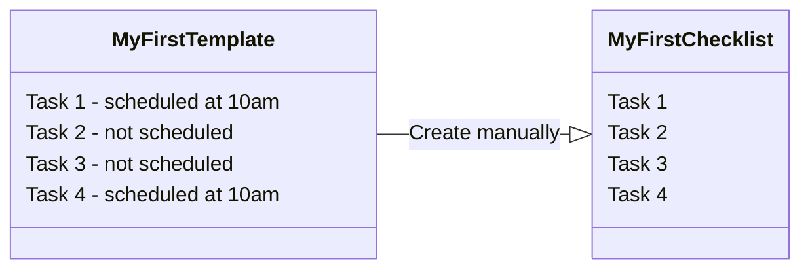
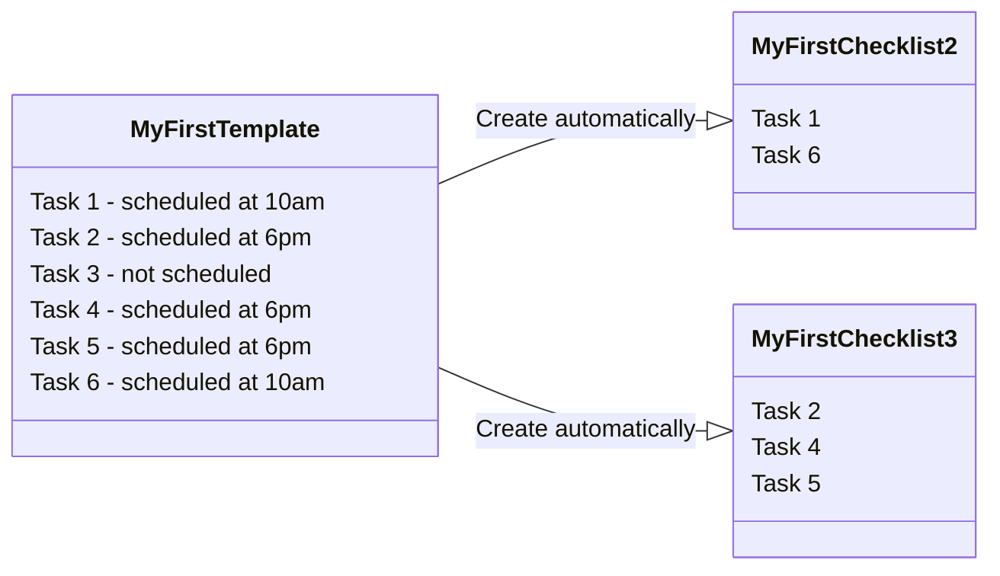

# INFIELD_VNEXT Documentation
Generated from: docs.cognite.com (infield_vnext) - Legacy/Archived content

<!-- SOURCE_START: docs.cognite.com/infield_vnext (legacy) -->
## File: docs.cognite.com/infield_vnext (legacy content)

---
pagination_next: infield_vnext/guides/create_templates
pagination_prev: null
title: About InField
audience: business_user
to-L10N: true
---

<>

  <p class="landingImage"></p>
  <p class="landingTitle">Cognite InField</p>
  <p class="landingDesc">Help field workers and supervisors efficiently plan and perform their tasks.</p>
</>

<div class="landingContent">

# About ~~Cognite InField~~

~~Cognite InField~~ helps you **plan**, **schedule**, and **assign** activities, such as completing work orders, conducting operator rounds, or performing maintenance procedures. With ~~InField~~, you replace paper-based data-gathering and improve reliability and efficiency.
<br/>

As a **field worker**, use ~~InField~~ to complete your tasks and capture measurements and observations when you work.
<br/>

As a **supervisor**, use ~~InField~~ to schedule and assign work activities:

- **Work orders** that have been imported from a work management application, such as ~~SAP~~ or ~~WorkMate~~.

- **Recurring tasks** generated from templates for checklists you want field workers to perform at regular intervals.

To sign in to ~~InField~~, navigate to https://cognite-infield.cogniteapp.com/.
</div>

---
title: Configure data models for InField
pagination_next: null
pagination_prev: null
audience: administrator
---

# Configure data models for InField

:::caution Beta
The features described in this section are currently in [beta](cdf/product_feature_status.md) testing and are subject to change.
:::

Proper planning is crucial to setting up InField. This section helps you plan and configure the source data and the Cognite Data Fusion (CDF) project that will power the application and describes how to set up assets and visualize data in InField.
You can also use the [Cognite Toolkit](/cdf/deploy/cdf_toolkit/guides/set_up_infield) to use pre-built configurations to set up InField.

:::tip TIP
Looking for the InField configuration documentation on APM? See [here](../guides/config_vnext.md).
:::

## Before you start

Make sure you have the following:

- A project registered in the [CDF application](https://fusion.cognite.com). It must be a **Data Modeling only** project.
- [The CDF API and the CDF application registered in Microsoft Entra ID](/cdf/access/guides/configure_cdf_azure_oidc/) and [Microsoft Entra ID and CDF groups set up to control access to CDF data](/cdf/access/guides/create_groups_oidc/).
- Assets in the CDF project populated in the [`CogniteAsset` concept](/cdf/dm/dm_reference/dm_core_data_model#asset) .
- [URLs](/cdf/admin/allowlist/) in your allowlist.

:::caution Caution
Make sure to [set up locations in InField](#configure-locations) even if you have them set up in CDF. At the moment, CDF and InField use different location concepts.
:::

## Set up access

You can use your existing identity provider (IdP) framework to manage access to InField and choose admin users. We currently support Microsoft Entra ID. By creating groups, you can assign different sets of capabilities to users.

### Create an admin group

Create a group of users who can configure the InField application across all [locations](/cdf/locations/guides/). See also how to [configure locations](#configure-locations) in InField.

1. Go to [**_CDF_**](https://fusion.cognite.com) > **_Manage_** > **_Manage access_**.
2. Create a group with the required name `applications-configuration`.
3. Give `read` and `write` access to all capabilities with the scope `All`, or have the minimum set of capabilities.

| Capability type      | Action                         | Scope                            | Description                                                                                       |
| -------------------- | ------------------------------ | -------------------------------- | ------------------------------------------------------------------------------------------------- |
| Groups               | `groups: read`, `groups: list` | All                              | For InField administrators to grant access to users.                                              |
| Data models          | `dataModel:read`              | All                              | View data models.                  |
| Data model instances | `dataModelInstance:read`       | All                              | Access data organized in data models.                                 |
| Data model instances | `dataModelInstance:write`      | `cognite_app_data`, `APM_Config` | Access and edit data organized in data models and spaces. |
| Data model instances | `dataModelInstance:write_properties` | Spaces with time series instances | Access, create and edit time series data. |
| Location filters     | `locationfilters:read`, `locationfilters:write`         | All | View locations in your InField project. |

### Create user groups

Create groups of users who can view checklists, administer checklists and templates, and work with checklists in the field. You can create similar groups for different locations. The groups can have the same capabilities but different access based on the group name.

:::info Note
Group names are suggestions and can differ from user to user.
:::

| Name                                    | Description                                                                                                                            |
| --------------------------------------- | -------------------------------------------------------------------------------------------------------------------------------------- |
| `infield_dev_location_viewers` | Users in the group can view but not edit checklists in the specified location (`location`) and environment (`dev`). |
| `infield_dev_location_checklist_admins` | Users in this group can create, update, delete, and approve checklists in the specified location (`location`) and environment (`dev`). |
| `infield_dev_location_template_admins`  | Users in this group can create, update, and delete templates in the specified location (`location`) and environment (`dev`).           |
| `infield_dev_location_checklist_users`  | Users in this group can work with checklists and create observations in the specified location (`location`) and environment (`dev`). |

Assign the following group capabilities:

| Capability type      | Action                         |  Scope                                                                                                                                                  | Description                                               |
| -------------------- | ------------------------------ | ------------------------------------------------------------------------------------------------------------------------------------------------------ | --------------------------------------------------------- |
| Groups               | `groups:read`, `groups: list` | All                | View user groups.  |
| Data models          | `dataModel:read`              | `cdf_cdm` , `cdf_idm`, `APM_Config, cdf_infield, cdf_apps_shared , idm_customer_datamodel_space`- where you can extend the views if necessary | View and analyze the data created in InField.             |
| Data model instances | `dataModelInstance:read`       | `APM_Config, cognite_app_data, location_app_data_space, location_source_data_space` - a list of spaces to read the data from; `cdf_cdm_units` - a space to use units for time series. Add all such spaces you want to read the data from to the scope. | View and analyze the data created in InField.  |
| Data model instances | `dataModelInstance:write`      | `cognite_app_data` | Access and edit data organized in data models and spaces. |
| Data model instances | `dataModelInstance:write_properties` | Spaces with time series instances | Access, create and edit time series data. |
| Location filters     | `locationfilters:read`         | All                | View locations in InField. |

## Create data modeling spaces

~~InField~~ stores asset data in [data models](/cdf/dm/). You need to create at least 4 spaces to store your data and data models.

| Space name                     | Description                                                          |
| ------------------------------ | ---------------------------------------------------------------------|
| `cognite_app_data`             | This space holds user data, such as user profiles.               |
| `APM_Config` | This space holds configurations in Asset Performance Management (APM).        |
| `yourRootLocation_source_data` | This space holds data from your source systems (like SAP) for one root location. Replace `yourRootLocation` with the name of your root location/asset. |
| `yourRootLocation_app_data`    | This space holds data created in InField (like checklists and templates) for one root location. Replace `yourRootLocation` with the name of your root location/asset. |
| `ApmAppData`                   | You don't need to set up or change this space. `ApmAppData` is a system data model that's present in all projects by default. The data model has the `System` tag. |

:::info NOTE
Create a unique pair of `_source_data` and `_app_data` spaces for **each** root location you want to configure in InField. For example, if you have two root locations named `plant-a` and `plant-b`, you will need to create four spaces in total:
- `plant-a_source_data`
- `plant-a_app_data`
- `plant-b_source_data`
- `plant-b_app_data`
:::

You can create spaces in the following ways:

- With the [Cognite Python SDK](#spaces-created-with-sdk).
- With the [Cognite API](#spaces-created-with-api).
- 2 location spaces directly in [InField](#spaces-created-in-infield).

### Spaces created with SDK

You can create the spaces using [Cognite Python SDK](https://cognite-sdk-python.readthedocs-hosted.com/en/latest/index.html). Use the following Python code and replace `yourRootLocation` with your root location/asset name in `yourRootLocation_source_data`, `yourRootLocation_app_data`.

<details>

<summary>Create spaces</summary>

```python

from cognite.client.data_classes.data_modeling import SpaceApply

# List of spaces to create
spaces_to_create = ["yourRootLocation_source_data", "yourRootLocation_app_data", "APM_Config", "cognite_app_data"]

# Apply spaces
for space_name in spaces_to_create:
 client.data_modeling.spaces.apply(SpaceApply(space=space_name))

```

</details>

### Spaces created with API

You can create the spaces using the [API endpoint](https://developer.cognite.com/api/#tag/Spaces/operation/ApplySpaces/):

- `cognite_app_data`
- `APM_Config`
- `yourRootLocation_source_data`
- `yourRootLocation_app_data`

Use the same names for the `space` and `name` attributes. The `space` attribute is also the space ID.
Replace `yourRootLocation` with your root location/asset name in `yourRootLocation_source_data`, `yourRootLocation_app_data`.

`APM_Config` is the space that you can create manually in CDF or automatically by running the script. You create this space by creating corresponding data model.

### Spaces created in InField

To create location spaces in ~~InField~~:

1. Sign in to ~~InField~~ and select :gear: > location to which you want to add spaces.
2. On the **_Customer instance spaces_** tab, select the space from the list or enter the name of the space, for example, `yourRootLocation_source_data` and press <kbd>Enter</kbd>.
3. On the **_InField instance spaces_** tab, select the space from the list or enter the name of the space, for example, `yourRootLocation_app_data` and press <kbd>Enter</kbd>.

## Configure locations

:::caution Note
Users need admin rights to configure locations.
:::

The **_Locations_** page lists your root locations. Root location is a root asset that's at the top of the asset hierarchy. The root asset is a digital representation of a site, such as an oil platform, a plant, or an installation. Each site in InField should have a root location. For each location you want to be available in InField, complete the configuration in the InField application.

1. Sign in to [~~InField~~](https://cognite-infield.cogniteapp.com), select (:gear:) > **_+ Add location_**.
2. Enter the name and the description and select **_Add_**.
3. Select the location to complete configuration.

### Location details

Update the name and description of your location.

### View mappings

[Views](/cdf/dm/dm_concepts/#view) contain a group of properties that you can change for specific cases. By default, ~~InField~~ uses the Cognite process industries data model that extends the core data model to meet the needs of the process industries. You can customize entity definitions (or views), such as `CogniteAsset` and `CogniteMaintenanceOrder` by extending them with properties that are specific to your operations. For example, to extend the `CogniteMaintenanceOrder` property, you can create a new view and add the `Cost` field to this property.

In ~~InField~~, you can select the entities you want to use, such as activities, assets, etc., with views defined in the `cdf_idm` ([Process industries data model](/cdf/dm/dm_reference/dm_process_industry_data_model)), `cdf_cdm` ([Core data model](/cdf/dm/dm_reference/dm_core_data_model)) spaces, or the space where you store your custom views.

| Data entity | View | Extendable |
|-------------|------| ------------------ |
| Asset | cdf_cdm.CogniteAsset | Yes |
| Activity (work orders) | cdf_idm.CogniteMaintenanceOrder | Yes |
| Operations | cdf_idm.CogniteOperations | Yes |
| Notifications | cdf_idm.CogniteNotification |  Yes |
| Files (P&IDs) | cdf_cdm.CogniteFile | No |
| Annotations (file Contextualization) | cdf_cdm.CogniteDiagramAnnotation (edge) | No |
| 3D | Ingested through 3D APIs | No |

To configure the views you want to use:

1. Go to **_Locations_** > **_View mappings_**.
2. For each property, select either the default space or the space where you created custom views. In the current implementation, you can configure view mappings of 4 entities only.
3. Save to apply the changes.

:::caution Caution
Make sure the view version always matches the data model version. Otherwise, the table on the Overview page won't work correctly.
:::

Each entity type, such as activity, asset, etc., has a standard view defined in the `cdf_idm` system space. To view and customize views, go to [**CDF**](https://fusion.cognite.com) > **Data management** > **Data models** > find and select **CogniteProcessIndustries**.

### Customer instance space

Select the space to store data on assets, work orders, notifications, and other data coming from a customer source system, such as SAP, for a particular location. Currently, you can select only one space.

### InField instance space

Select the space to store data on templates, checklists, and observations created in the application for a particular location.

### Asset explorer

To display related data, such as work orders, time series, and documents on the **Asset explorer** page, ensure these data objects are connected to the corresponding assets in Cognite Data Fusion. InField uses these relationships to find and display the relevant information for each asset.

| Data object           | Requirements                                                                                                                                                                                                                                                          |
| -------------------- | -------------------------------------------------------------------------------------------------------------------------------------------------------------------------------------------------------------------------------------------------------------------- |
| 3D                   | The `CogniteAsset.object3D` property needs to have a 3D model linked to the asset in the `source_instance_space`.                                                                                                                                                      |
| Trends (time series) | The `CogniteTimeSeries.assets` property needs to have a direct relation to the asset in either the `app_instance_space` or `source_instance_space` of the current location.                                                                                             |
| Documents            | The `CogniteFile.assets` property needs to have a direct relation to the asset in either the `app_instance_space` or `source_instance_space` of the current location.                                                                                                   |
| Work orders          | The `CogniteMaintenanceOrder.mainAsset` property needs to have a direct relation to the asset in the `source_instance_space` of the current location.                                                                                                                  |
| Notifications        | The `CogniteNotification.asset` property needs to have a direct relation to the asset in the `source_instance_space` of the current location.                                                                                                                        |
| Properties           | The `CogniteAsset` view needs to be extended with any custom properties you want to display for the asset.                                                                                                                                                             |
| Media                | The `CogniteFile.assets` property needs to have a direct relation to the asset in either the `app_instance_space` or `source_instance_space`. Supported file types in `CogniteFile.mimeType` include "video/quicktime", "video/mp4", "image/jpeg", and "image/png". |

:::info NOTE
Make sure to contextualize files to the relevant asset to see them on the asset's card.
:::
<br></br>

To test the location you just configured:

1. In the top right, select your profile > **Manage account** > **Select location**.
2. From the list, select the location you just created.

    Once the application reloads, you can work in your new location.

---
pagination_next: null
pagination_prev: infield_vnext/guides/observations
audience: business_user
to-L10N: true
---

# Troubleshooting

Find information to help you troubleshoot common checklist issues.

<!--Group the issues? -->

## I'm not seeing my checklist {#i'm-not-seeing-my-checklist}

If you can't find the checklist you want to work with:

1. Navigate to the **_Checklist_** tab.
1. Select **_Ready_**, **_In Progress_**, or **_Done_** from the sidebar to sort the checklists on their status.

:::tip

If you can't find a checklist you've started working on, your supervisor may have set the checklist to
**_Done_**.

:::

If you haven't started working on the checklist, contact your supervisor to verify that:

- It has the right start and end time.
- It's assigned to the right group or user.
- It has the right status.

Still not finding it? Contact your IT admin or ~~Cognite Support~~.

## My device switches between the mobile and desktop versions {#my-device-switches-between-the-mobile-and-desktop-versions}

If you want to set a default mode for your device:

1. Navigate to **_Account_** > **_Manage account_**.
2. Select **_Device mode_** and switch to the desired version of the application.

If you use several devices, the setting won't affect another device's mode, and you can set the default version on the other device similarly.

## I can't enter negative values in my numerical readings

If you want to add negative values or a special symbol to a numerical reading:

1. Navigate to **_Account_** > **_Manage account_**.
2. Select **_Device settings** > **_Mobile_** and switch to the desired keyboard.
3. Optional. Test the selected keyboard.

## I don't know what work order the checklist is created from

If you want to see the details of a work order the checklist is created from:

1. On the ~~InField~~ desktop, select **_Checklists_**.
2. Open the checklist created from a work order.
3. Select the checklist name displayed as a blue link.
<br/>

If the name isn't displayed as a blue link, the checklist is created from a template or its tasks.

## I'm not seeing my scheduled checklists {#missing-checklists}

:::caution Early adopters

The feature described is currently available to **early adopters** only and is subject to change.

:::

If you can't find your scheduled checklists:

1. Navigate to the **_Overview_** tab.
2. In the right corner, select **More options** (...) > **_Check for missing checklists_**. It may take up to 10 seconds to find the checklists.
3. Select **_Create checklists_** if there are scheduled checklists that weren't created.
4. Select **_View_** to see the details of the checklists you just created.
<br/>

When you search for missing checklists:

- You must be a template or checklist admin.
- You can search within a 7-day range only.
- You can search the current date and past dates, not future dates.
- You must use the desktop version of InField.
- Make sure that the checklist you're trying to find is in Ready and has been in Ready at the moment you're referring to.
- Make sure that the checklists are still scheduled.

---
pagination_next: infield_vnext/guides/observations
pagination_prev: infield_vnext/guides/plan
title: Perform activities
audience: business_user
to-L10N: true
---

# Perform activities

To perform activities in ~~InField~~, you use checklists. Field workers can work on the checklists that are already added to the **_Checklists_** tab or create checklists from templates on the [**_Templates_**](#create-checklists) tab. A checklist has a set of tasks where you add a status, such as **_OK_**, **_Not OK_**, or **_Blocked_**. You can also add images, videos, and observations for malfunctions you notice while working. For some tasks, you may also see fields for adding measurement readings and check items.

## Work with checklists {#work-with-checklists}


1. Select a checklist from the list. By default, you see **_Ready_** checklists assigned to you and your discipline.

   :::tip

   If you can't find a checklist, try sorting on the checklist status **_Ready_**, **_In progress_**, or **_Done_**, assignees, or use search.

   :::

2. Enter any measurement values your supervisor has requested. Once you start working on the checklist, the status changes from **_Ready_** to **_In progress_**.
3. Optional. Respond to the supervisor's request by selecting an action button, for example, **Low**, **Normal**, **High**, or **Open**, **Closed**.
4. For each task, select **_OK_** or a different status from **_Other_**.
If you want to bulk change the statuses of the remaining tasks, select **_More options_** (...) > **_Set remaining tasks to_** and select the status. You can do that for the tasks in the group and outside the group and only once.
1. Select **_+_** to add images and videos<!-- up to 50 MB -->, enter text, or create observations. Fill out the [**_Observations_**](/infield_vnext/guides/observations) form if an asset requires a closer look, for example, due to malfunctions.
2. When you've completed all tasks, set the checklist to **_Done_**. You can no longer update it.
   :::caution Note
   The checklist doesn't move automatically to **_Done_** when you complete all tasks.
   :::

## Create checklists

To create checklists from templates on your mobile device:

1. On the left panel, select **_Templates_**. You'll see the list of **_Ready_** templates assigned to you.
    :::tip TIP
    Select **X** to remove the filter.
    :::
2. Select the template you want to create a checklist from and select **_Create checklist_**. The assignee is the person who created the checklist.
3. Start working on the checklist or go back to create more checklists.

## Explore assets {#explore-assets}

To see information linked to an asset, such as 3D images, documents, time series, or other assets, search for the asset or select an asset ID displayed as a blue link.

- Select the search icon () to search for assets, time series, or documents.
- Select the search icon () > **_Hierarchy_** to find equipment linked to the asset you're working with.

## Work offline {#work-offline}

Field workers can complete operator rounds and work orders with slow or no network connectivity on their mobile devices.

To work offline, open the checklist while you still have network connectivity. If you go offline, you can still complete tasks but you can't access the asset explorer, upload media, and create observations. When you're back online, all data collected offline will be uploaded.

:::tip
To stop repetitive connectivity notifications, turn on airplane mode or ensure a steady network connection. To download data when offline, turn off airplane mode and wait until the data is uploaded. In the meantime, do NOT close the application or exit the checklist.
:::

For a minimum required bandwidth, refer to [Connectivity and bandwidth](/cdf/admin/connectivity).

---
pagination_next: infield_vnext/guides/troubleshoot
pagination_prev: infield_vnext/guides/perform
title: Create and view observations
audience: business_user
to-L10N: true
---

# Create and view observations {#create-and-view-observations}

Observations are information collected from field workers on malfunctioning equipment that needs further evaluation. Depending on whether you're on a desktop or mobile version, you can create and view or only create observations.

## Create and view observations on desktop {#create-and-view-observations-on-desktop}

On the **_Observations_** tab, you can:

- View the details of all asset observations and how many new observations you have today. Available on the desktop version only.

- Create observations by selecting **_+Create observation_**. All observations are saved as drafts until you select **_Complete_**.

- Edit observations that haven't been sent to SAP (the SAP feature must be turned on). Only completed observations can be sent to SAP.

- Delete observations in the *Draft* and *Not sent* statuses.

An observation can have one of the statuses:

| Status | Meaning |
| ----- | ------- |
| Draft         | The observation is in progress. |
| Completed     | The user filled out all information and selected **_Completed_**. |
| Sent          | The user completed the observation and sent it to SAP. |
| File not sent | The observation was sent to SAP but not the attached media files. |
| Not sent      | The observation wasn't sent to SAP. |

## Create observations on mobile {#create-observations-on-mobile}

If you think an asset requires attention, you can create an observation for it:

- When working on a checklist, select (+) > **_Create observation_**.
- In the top left, select the menu tab > **_Create observation_**.

---
pagination_next: infield_vnext/guides/perform
pagination_prev: infield_vnext/guides/create_templates
audience: business_user
to-L10N: true
---

import Tabs from '@theme/Tabs';
import TabItem from '@theme/TabItem';

# Plan, schedule, and assign activities

You can view and interact with the planned work on the **_Overview_** and the **_[Schedules](#view-scheduled-work)_** tabs.

On the **_Overview_** tab, you'll see all planned activities divided into **_Work orders_** (maintenance work) and **_Checklists_** (operator rounds). You can assign these activities to a group of users (disciplines), such as all electricians, or directly to specific users. Also, you can suggest a start and end date for each activity, but these are only used for sorting.


On the **_Overview_** tab, you can:

➀ **Change location** &mdash; switch between different work locations. You can also select your profile at the top right > **_Manage account_** > **_Select location_**.

➁ **Search and filter** &mdash; adjust the table view with the search field, date picker, number of columns and [save the view as a filter](#create-filters).

➂ **Create and assign** &mdash; [create checklists from a work order or its tasks](#create-checklists-from-work-orders) and assign or reassign work orders and checklists.

➃ **Change view** &mdash; switch between the **_Work orders_** and **_Checklists_** view.

<Tabs>

  <TabItem value="Work orders" label="Work orders" default>

    The **_Work orders_** tab shows the work orders imported from a work management application, such as SAP. Here, you can:

    - View work order details with a list of tasks (operations) to perform. Expand the task to see if it applies to several assets.
    - Select **_Create & Assign_** to create a checklist from work order tasks. Once you create the checklist, you can check its progress by selecting the number of tasks in the **_Checklist Progress_** column.
    - Create checklists from several work order tasks relevant to a field worker. If there are tasks left, you can also create another checklist. The work order will remain in progress until field workers complete all tasks in the work order.

  </TabItem>

  <TabItem value="Checklists" label="Checklists">

    The **Checklists** tab shows recurring tasks generated from templates that are created by an admin on the **_Templates_** tab. Here, you can:

    - View the checklist details.
    - Assign or reassign checklists.
    - [Track and complete checklist tasks](/infield_vnext/guides/plan#track-and-complete-tasks).
    - Delete checklists. If the field worker collects the data before you delete the checklist, the data is saved and stored in InField. You can only restore the deleted checklist through the Cognite API.

  </TabItem>

</Tabs>

:::tip
When planning the work, you can also use **_Search_** (:mag:) to find and analyze time series, assets, and documents in your selected location.
:::

## Create filters

On the **_Overview_** tab, you can adjust the filters to view the most relevant data and save the selection as a filter.


➀ **Create** &mdash; save selected filters and create a filter preset you can use later.

➁ **Select** &mdash; select the saved filter preset to view relevant information.

➂ **Edit** &mdash; change saved filters, make them default, or delete them.

➃ **Find missing checklists** &mdash; check if you have checklists that weren't created according to the schedule.

To create a filter for columns:

1. Select **_Hidden columns_**, select the columns to display, reorder them if needed, and select **_Apply_**.
2. Filter and sort the columns. For example, select a certain checklist status.
3. Next to **_Clear filters_**, select the dropdown arrow and save the filter.
4. Name and save the filter.

In the dropdown, you can see a list of all created filters. You can select a filter to apply to the **_Overview_** tab or make it default for the tab.

:::note
You must create separate filters for work orders and checklists. Search results and a date range don't apply to the filter preset.
:::

## Create checklists from work orders

A checklist is a task or a list of tasks created from a [template](/infield_vnext/create_templates#create-checklists) or created from a work order. You can create a checklist from a work order or its tasks (operations) only manually.

1. Go to **_Overview_** > **_Work orders_**.
2. Create a checklist from a work order or several work order tasks:
- Select the work order to create a checklist from all tasks within it.
- Expand the work order and select the operations you want on your checklist.

A work order can consist of one or several operations. Operations are individual steps in an order or individual tasks in a checklist. Some operations that come from the work management system, such as SAP, have an order or an operation number. One operation in a work order can generate several tasks in a checklist if several operations have the same order/operation number and the same work order number (parentActivityId).

## Track and complete tasks {#track-and-complete-tasks}

As the field workers complete the tasks on a checklist, they update the status and add relevant images, measurements, and observations. You'll find the status of all activities along with their progress on the **_Overview_** tab, where you can sort the columns and select relevant dates. To set the status for a checklist or work order, select the item > **_More options_** (&mldr;) > **_Set checklist to_** > **_Done_**.

You can't update checklists or work orders with the status **_Done_**. However, **extended access** lets you change the status to **_In progress_** and update the checklist.

The meaning of the checklist status colors.

| Color | Meaning |
| ----- | ------- |
| Grey  | The operator hasn't completed any tasks. |
| Green | The operator completed the checklist and all tasks have the **_OK_** or **_Not applicable_** state.  |
| Blue  | The operator has started, but not completed, the checklist. |
| Red   | The operator set the state of at least one of the tasks to **_Not OK_** or **_Blocked_**.|

## View scheduled work

:::caution Beta
The features described in this section are currently in [beta](cdf/product_feature_status.md) testing and are subject to change.
:::

As a template and checklist admin, you can view the checklists planned for the current and upcoming weeks and what has already been worked on. On the **_Schedules_** tab, you'll see all planned activities created from templates either manually or automatically.


On the **Schedules** tab, you can:

1. **Select a work week** &mdash; select the week to view details of checklists for past, current, and upcoming weeks.

2. **View checklists** &mdash; review the checklist details, such as its status and assignees, who created it, and when the checklist becomes **_Ready_**. Here you can view **_Planned_** checklists.

    **_Planned_** is a transition status, meaning that the template is **_Ready_** and scheduled, but the checklist isn't **_Ready_** to start work on yet. Once the checklist reaches the scheduled date, it changes the status to **_Ready_**.

---
pagination_next: infield_vnext/guides/plan
pagination_prev: infield_vnext/index
title: Create templates and checklists
audience: business_user
to-L10N: true
---

import Tabs from '@theme/Tabs';
import TabItem from '@theme/TabItem';

# Create templates and checklists {#create-templates-and-checklists}

Use the **_Templates_** tab to create and plan tasks that the field workers perform at regular intervals, such as weekly installation operator rounds.


➀ **Action menu** &mdash; create templates, add tasks, change the template's status, assign and create checklists, and more (...).

➁ **Filter** &mdash; filter the templates by name, status, and assignee. By default, you see **_Ready_** templates assigned to you. You can select **X** to remove filters. **Templates list** &mdash; view the list of templates with details.

➂ **Templates list** &mdash; view the list of templates with details.

➃ **Tasks list** &mdash; view and interact with the list of tasks in your template.

⑤ **Add task** &mdash; fill out your tasks with the required details to perform the work in the field.

<!-- ➀ ➁ ➂ ➃ ⑤ ➅ -->

## Step 1. Create templates {#step-1-create-tempaltes}

1. Select **_+ Create template_** and name the template.
2. Enter task details, such as name and description, and, optionally, link the task to an asset.
   A description can be a step-by-step instruction for the task with links where necessary.
3. Optional. Select **_Add to task_** and then select:

<Tabs>
  <TabItem value="Numerical reading" label="Numerical reading" default>

Ask field workers to add measurement readings from equipment. You can set the measurement unit, for example, _bar_ for pressure readings and minimum and maximum values. You can search and connect time series created in InField only.

   :::tip

   ~~InField~~ stores the measurements as time series in ~~CDF~~, and you can trend and analyze the values using [~~Charts~~](../../cdf/charts/index.md).

   If you've **removed a numerical reading** from a checklist, it's still available as a time series.

   :::

To create a numerical reading:
<br></br>

1. Select **+** and fill out the required fields to create the time series.
2. Optional. Link the time series to a specific asset, otherwise, the time series is linked to the root asset.
3. Optional. Enter the description for the time series. If provided, the description is used as the numerical reading name in checklists.

  </TabItem>

  <TabItem value="Check item" label="Check item">

Add to the task an item that requires a check, verification, inspection, etc.
<br></br>

1. Add a description of what needs to be done.
2. Enter the button name, select its color, and link the button to the task status. The task will change its status based on the button field workers select. For example:
   - When field workers work on the checklist and select the button with the linked **OK** status, their task status changes to **OK**.
   - If there's a numerical reading that's out of range (**Not OK**) and field workers select the button with the linked **OK** status, the task status will change to **Not OK** as this task requires attention. In this example, field workers should fill out all numerical readings and items to check for the status to change automatically.
3. Select **_+ Add button_** to add another possible response to the description.<br/>
</TabItem>

<TabItem value="Schedule" label="Schedule">

**Schedule** tasks to automatically create them as checklists at regular intervals. You can set checklists to open automatically on specific days, every two weeks, twice a month on Mondays, every 2 years, etc.
<br></br>

To schedule a task:
<br></br>

1. Set the time range when the field workers should complete the task. The initial start time is 6 AM in the computer's local time zone. You can change the start time to half-hour intervals.
2. Optional. Select the time zone (:gear:).
3. Specify how often you want field workers to work on this task. For intervals other than daily, weekly, monthly, and yearly, set the start date when to create the first checklist from the task. By default, the date of adding a task is used.

    Once you schedule the task, hover over the calendar icon  next to it to see when the next checklist is created.

</TabItem>

<TabItem value="Message" label="Message">

Ask field workers to give a written response to a request, question, message, etc.

</TabItem>

<TabItem value="Condition" label="Condition">

Set what subtask field workers need to perform if a checklist task gets a certain status. For example,  if the task's status changes to **_Not OK_**, field workers need to explain the reason in free text.

</TabItem>

</Tabs>

1. Select **_+ Add task_** to add another task.

   :::info Note
   One template has a limit of 500 tasks. However, to make it easy for the field worker to navigate them in the field, keep them as short as possible.
   :::
2. Set the template to **_Ready_**. Ready templates can be assigned to disciplines or users and can be [created as checklists manually and automatically](#step-3-create-checklists).


The templates left in **_Draft_** will remain templates and won't appear as checklists.

:::info Note

You need **extended access** to plan and schedule tasks, and you need to assign activities using the ~~InField~~ desktop version, not mobile.

:::

<!--
1. Optional. Select **_Assign_** to assign disciplines or users to perform work checklists.
2. Optional. Select **_Create checklist_** to start work on the checklist immediately. The checklist is created from the whole template even though some tasks are scheduled differently. -->

## Step 2. Manage tasks

To work with several tasks at once, you can:


➀ **Select tasks** &mdash; to create task groups, schedule several tasks at once, duplicate, and delete tasks.

➁ **Edit a group** &mdash; select More options (**...**) to ungroup the tasks or rename the group.

## Step 3. Create checklists

A checklist is a task or a list of tasks generated from a template or a work order. On the **_Templates_** tab, you can create a checklist from a template or its tasks in two ways:

- **Manually**. Select a template in the **_Ready_** status and, on the right, select **_Create checklist_**. Suggest a start and end date and confirm the creation. The dates are used for sorting only. You'll create a checklist that's a copy of the template, even if some tasks are scheduled for a different date and time.



:::tip TIP
Field workers can also create checklists on their [mobile devices](/infield_vnext/guides/perform#create-checklists).
:::

- **Automatically**. Once you add a schedule to a task or a group of tasks, the tasks automatically appear in the created checklist based on the schedule. Remember to move the templates to **_Ready_**, otherwise, the schedule won't start. Template tasks that aren't scheduled won't be included in the checklist created from the scheduled tasks.



:::info Note
Automatic scheduling creates checklists with a delay unless you create them before the task start time.
:::

## Delete and restore templates and tasks {#delete-and-restore-templates-and-tasks}

To delete a template, select **_More options_** (&mldr;) to the right of **_+ Add task_** > **_Delete template_**.

To restore a template, select **_Deleted_** in the left panel > **_More options_** (&mldr;) to the right of the template you want to restore  > **_Restore template_**.

You can't restore a task that has been deleted from a template.

---
pagination_next: null
pagination_prev: null
audience: administrator
---

# Configure InField

:::caution Beta
The features described in this section are currently in [beta](cdf/product_feature_status.md) testing and are subject to change.
:::

Proper planning is crucial to setting up the InField application. This section helps you plan and configure the source data and the Cognite Data Fusion (CDF) project that will power the application and describes how to set up assets and visualize data in InField.
You can also use the [Cognite Toolkit](/cdf/deploy/cdf_toolkit/guides/set_up_infield) to use pre-built configurations to set up InField.

:::tip TIP
Looking for the InField configuration documentation on IDM? See [here](../guides/config_idm.md).
:::

## Before you start {#before-you-start}

Make sure you have the following:

1. A project registered in [CDF](https://fusion.cognite.com).
2. [The Cognite API and the CDF application registered in Microsoft Entra ID](/cdf/access/guides/configure_cdf_azure_oidc/) and [Microsoft Entra ID and CDF groups set up to control access to CDF data](/cdf/access/guides/create_groups_oidc/).
3. Data in the CDF project, an asset-centric data model must be in place.
4. [URLs](/cdf/admin/allowlist/) in your allowlist.
<br/>

:::caution Caution
[Set up locations in InField](#configure-a-root-location) even if you have these set up in CDF. At the moment, CDF and InField use different location concepts.
:::

## Set up access {#set-up-access}

You can use your existing identity provider (IdP) framework to manage access to InField and choose admin users. We currently support Microsoft Entra ID, Microsoft's cloud-based identity and access management service. By creating groups, you can assign different sets of capabilities to users and thus give different access rights to each group.

### Create an admin group {#create-admin-group}

Create a group of users who can configure the InField application across all locations.

1. Go to [**_CDF_**](https://fusion.cognite.com) > **_Manage_** > **_Manage access_**.
2. Create a group and name it `applications-configuration`.
3. Give `read` and `write` access to all capabilities with the scope `All`, or have the minimum set of capabilities.

| Capability type      | Action                         | Scope                            | Description                                                                                       |
| -------------------- | ------------------------------ | -------------------------------- | ------------------------------------------------------------------------------------------------- |
| Assets               | `assets: read`                 | All                              | View asset data from the CDF project that InField runs on top of.                                 |
| Groups               | `groups: read`, `groups: list` | All                              | For InField administrators to grant access to users.                                              |
| 3D                   | `3D: read`                     | All                              | Upload 3D models to display in InField.                                                           |
| Data sets            | `datasets: read`               | All                              | Get data from work order management system, such as SAP, and work orders. |
| Data models          | `dataModel: read`              | All                              | Organize and structure data.                                     |
| Data model instances | `dataModelInstance:read`       | All                              | Access data organized in data models.                                    |
| Data model instances | `dataModelInstance:write`      | `cognite_app_data`, `APM_Config` | Access and edit data organized in data models and spaces.                |

### Create standard user groups {#create-standard-user-groups}

Create groups of users who can view checklists, administer checklists and templates, and work with checklists in the field. You can create similar groups for different locations. The groups can have the same capabilities but different access based on the group name.

:::note
Group names are suggestions and can differ from user to user.
:::

#### Read only access {#read-only-access}

Create a group of users who can view but not edit checklists. You can name the group `infield_dev_location_viewers`, where `dev` is the InField environment, and `location` is the location that the group will have access to.

| Capability type      | Action                         | Scope                                                                                                                                                  | Description                                               |
| -------------------- | ------------------------------ | ------------------------------------------------------------------------------------------------------------------------------------------------------ | --------------------------------------------------------- |
| Groups               | `groups: read`, `groups: list` | All                                                                                                                                                    | View user groups.                                         |
| Assets               | `assets: read`                 | `asset_datasets`                                                                                                                                       | View and analyze asset details.                           |
| 3D                   | `3D: read`                     | `threed_datasets`                                                                                                                                      | View and analyze 3D models.                               |
| Files                | `files: read`                  | `files_datasets, infield_app_data_dataset`                                                                                                             | View and analyze images and files.                        |
| Relationships        | `relationships: read`          | `relationship_datasets`                                                                                                                                | View relationships between assets.                        |
| Time series          | `timeseries: read`             | `timeseries_datasets, infield_app_data_dataset`                                                                                                        | View and analyze time series data.                        |
| Data models          | `dataModel: read`              | `APM_Config , cdf_apm , cdf_infield ,  cdf_core , cdf_apps_shared , apm_source_datamodel_space`- the space where the `APM_SourceData` model is defined | View and analyze the data created in InField.             |
| Data model instances | `dataModelInstance:read`       | `APM_Config , cdf_apm , cognite_app_data , location_app_data_space , location_source_data_space`                                                       | View and analyze the data created in InField.             |
| Data model instances | `dataModelInstance:write`      | `cognite_app_data`                                                                                                                                     | Access and edit data organized in data models and spaces. |

#### Read and write access {#read-and-write-access}

Create a group of users who can administer checklists and templates and work with checklists in the field. This can be a single group for all users or 3 different groups. If you create 3 separate groups, you can use the following naming suggestions.

| Name                                    | Description                                                                                                                            |
| --------------------------------------- | -------------------------------------------------------------------------------------------------------------------------------------- |
| `infield_dev_location_checklist_admins` | Users in this group can create, update, delete, and approve checklists in the specified location (`location`) and environment (`dev`). |
| `infield_dev_location_template_admins`  | Users in this group can create, update, and delete templates in the specified location (`location`) and environment (`dev`). They can also create, update, and delete observations and send them to SAP.           |
| `infield_dev_location_checklist_users`  | Users in this group can work with checklists and create observations in the specified location (`location`) and environment (`dev`).   |

To create a group of users who can view and edit checklists:

1. Add [read only](#read-only-access) capabilities.
2. Add the following write capabilities.

| Capability type      | Action                    | Scope                      | Description                                                         |
| -------------------- | ------------------------- | -------------------------- | ------------------------------------------------------------------- |
| Files                | `files: write`            | `infield_app_data_dataset` | View and edit documents and files.                                  |
| Relationships        | `relationships: write`    | `infield_app_data_dataset` | Relationships represent connections between pairs of CDF resources. |
| Data model instances | `dataModelInstance:write` | `location_app_data_space`  | Access and edit data organized in data models and spaces.           |
| Time series          | `timeseries: write`             | `timeseries_datasets, infield_app_data_dataset`                                                                                                        | View, create, and edit time series data.                        |

To add checklist and template admins to your root location:

1. In [~~InField~~](https://cognite-infield.cogniteapp.com), go to **_Application configuration_** > **_Root Location_** > **_Edit location_** > **_Template/checklist admins_**.
2. Select the corresponding group for each dropdown and save the configuration.

:::caution NOTE
Assigned admin user groups and their access capabilities apply to ~~InField~~ only.
:::

#### SAP writeback (optional)

Assign the **SAP writeback** capability to the standard user groups to let them send observations to SAP.

| Capability type      | Action                    | Scope                      | Description                                                         |
| -------------------- | ------------------------- | -------------------------- | ------------------------------------------------------------------- |
| SAP writeback requests | `sapwritebackrequests: write`, `sapwritebackrequests: list` | All | Create requests to send data, such as work orders, assets, and observations, to SAP. |

See [SAP writeback service](/cdf/integration/guides/interfaces/sap_writeback/) for more information.

## Create data modeling spaces {#create-data-modeling-spaces}

~~InField~~ has two ways of storing assets: classic asset hierarchy and asset data modeling. You need to create at least 5 spaces to store your data and data models.

| Space name                     | Description                                                                                                                                                        |
| ------------------------------ | ------------------------------------------------------------------------------------------------------------------------------------------------------------------ |
| `cognite_app_data`             | This space holds user data, such as user profiles.                                                                                                                 |
| `APM_Config`                   | This space holds configurations in Asset Performance Management (APM).                                                                                             |
| `APM_SourceData`               | This space holds the schemas/data models for the data types that should be stored in the `yourRootLocation_source_data` space.                                     |
| `yourRootLocation_source_data` | This space holds space data (data coming from a customer source system, such as SAP) for a particular location.                                                    |
| `yourRootLocation_app_data`    | This space holds data coming from InField (from checklists and templates) for a particular location.                                                               |
| `ApmAppData`                   | You don't need to set up or change this space. `ApmAppData` is a system data model that's present in all projects by default. The data model has the `System` tag. |

:::tip
Create new `yourRootLocation_source_data` and `yourRootLocation_app_data` spaces for each root location you have.
:::

You can create spaces in the following ways:

- All 5 spaces with the [Cognite Python SDK](#spaces-created-with-sdk).
- 3 spaces with the [Cognite API and 2 spaces manually](#spaces-created-with-api) in the Cognite Data Fusion (CDF) or automatically by using the script.

### Spaces created with SDK {#spaces-created-with-sdk}

You can create all 5 spaces using [Cognite Python SDK](https://cognite-sdk-python.readthedocs-hosted.com/en/latest/index.html). Use the following Python code and replace `yourRootLocation` with your root location/asset name in `yourRootLocation_source_data`, `yourRootLocation_app_data`.

<details>

<summary>Create spaces</summary>

```python

from cognite.client.data_classes.data_modeling import SpaceApply

# List of spaces to create
spaces_to_create = ["yourRootLocation_source_data", "yourRootLocation_app_data", "APM_SourceData", "APM_Config", "cognite_app_data"]

# Apply spaces
for space_name in spaces_to_create:
 client.data_modeling.spaces.apply(SpaceApply(space=space_name))

```

</details>

### Spaces created with API {#spaces-created-with-api}

Create the following 3 spaces using the [API endpoint](https://developer.cognite.com/api/#tag/Spaces/operation/ApplySpaces/):

- `cognite_app_data`
- `yourRootLocation_source_data`
- `yourRootLocation_app_data`

Use the same names for the `space` and `name` attributes. The `space` attribute is also the space ID.
Replace `yourRootLocation` with your root location/asset name in `yourRootLocation_source_data`, `yourRootLocation_app_data`.

`APM_Config` and `APM_SourceData` are the spaces that you can create manually in CDF or automatically by running the script. You create these spaces by creating corresponding data models.

**To create the spaces manually:**

1. Go to [**_CDF_**](https://fusion.cognite.com) > **_Data management_** > **_Data models_** > **_Create data model_**.
2. Name the data model `APM_Config` and add a description if needed.
3. Select **_From scratch_** > **_Space name_** > **_+ Create new space_**.
4. Name the space `APM_Config`.

Follow the same steps to create the `APM_SourceData` data model and space.

**To create the spaces automatically:**

1. [Run the scripts in the repository](https://github.com/cognitedata/apm_datamodels) for `APM_Config` and `APM_SourceData` to automatically deploy these data models for your project.

## Add a scheduling function

With the scheduling function, users can create checklists from template tasks based on the schedule.

To add the scheduling function:

1. Go to the GitHub repository and follow the [manual deployment process](https://github.com/cognitedata/infield-functions?tab=readme-ov-file#manual-deployment-process) instructions.

The scheduling functionality in InField follows Google Calendar behavior with a few exceptions. See how to schedule checklists from template tasks in the ~~InField~~ application.

## AWS cluster

If you are on the AWS cluster and you want to enable file upload to it, add your project to the [feature flag](https://unleash-apps.cogniteapp.com/projects/default/features/INFIELD_IS_AWS_PROJECT).

## Configure `APM_Config` in CDF {#configure-apm-config-in-cdf}

A data model is an abstract model that organizes data elements and standardizes how they relate to one another and the properties of real-world entities. The CDF data model collects industrial data by [resource types](https://developer.cognite.com/dev/concepts/resource_types/) that let you define the data elements, specify their attributes, and model the relationships between them. The different resource types are used to both store and organize data.

To create the `APM_Config` model and the corresponding space:

1. Go to [**_CDF_**](https://fusion.cognite.com) > **_Data management_** > **_Explore_** > **_Model your data_** > **_APM_Config_**.
2. In the **_Editor_** , delete the existing code snippet and paste the `APM_Config` model data code snippet.

<details>
<summary>APM_Config model</summary>

```python

type APM_Config @view (version: "1"){
  name: String
  appDataSpaceId: String
  appDataSpaceVersion: String
  customerDataSpaceId: String
  customerDataSpaceVersion: String
  featureConfiguration: JSONObject
  fieldConfiguration: JSONObject
  rootLocationsConfiguration: JSONObject
  isDefault: Boolean
}
```

</details>

:::caution
Populate the `APM_SourceData` model only after you've set up your root location in the ~~InField~~ application.
:::

## Create transformations {#create-transformations}

Populate your locations with asset data. As you already have a classic asset hierarchy in place, you can use transformations to convert this data into assets in data modeling.

Read about [data transformation](/cdf/integration/concepts/transformation/) and how to [transform data in CDF](/cdf/integration/guides/transformation/transformations/).

First, create a transformation via the [API](https://developer.cognite.com/api/#tag/Transformations/operation/createTransformations) or SDK since certain functionality is unavailable in CDF.

For the code snippets, change the key for the `instanceSpace` attribute to `yourRootLocation_source_data` you created earlier. Ensure the parameters in the `view` object remain unchanged.

:::tip
If you're using Postman, replace `{cluster}` and `{your_project}` with the actual project name.
:::

<details>
<summary>API code snippet</summary>

```json
{
  "items": [
    {
      "name": "migrate-classic-asset-to-core-asset",
      "query": "/* MAPPING_MODE_ENABLED: false */\n/* {\"version\":1,\"sourceType\":\"clean\",\"mappings\":[{\"from\":\"externalId\",\"to\":\"externalId\",\"asType\":\"STRING\"},{\"from\":\"\",\"to\":\"parent\",\"asType\":\"STRUCT<`space`:STRING, `externalId`:STRING>\"},{\"from\":\"\",\"to\":\"source\",\"asType\":\"STRING\"},{\"from\":\"\",\"to\":\"root\",\"asType\":\"STRUCT<`space`:STRING, `externalId`:STRING>\"},{\"from\":\"\",\"to\":\"description\",\"asType\":\"STRING\"},{\"from\":\"\",\"to\":\"labels\",\"asType\":\"ARRAY<STRING>\"},{\"from\":\"\",\"to\":\"title\",\"asType\":\"STRING\"},{\"from\":\"\",\"to\":\"sourceId\",\"asType\":\"STRING\"}],\"sourceLevel1\":\"_cdf\",\"sourceLevel2\":\"assets\"} */\nselect\n  cast(asset.externalId as STRING) as externalId,\n  \n  (case \n    when isnull(asset.parentExternalId) then null\n    else node_reference('location_source_data_instance_space', asset.parentExternalId)\n  end )as parent,\n  cast(\"CDF Classic\" as STRING) as source,\n  node_reference('location_source_data_instance_space', cast(rootAsset.externalId as STRING)) as root,\n  cast(asset.description as STRING) as description,\n  cast(asset.name as STRING) as title,\n  cast(asset.externalId as STRING) as sourceId\nfrom\n  cdf_assetSubtree('configured_location_externalId') as asset \n  inner join cdf_assetSubtree('configured_location_externalId') as rootAsset on asset.rootId = rootAsset.id ",
      "destination": {
        "view": {
          "space": "cdf_core",
          "externalId": "Asset",
          "version": "v1"
        },
        "instanceSpace": "location_source_data_instance_space",
        "type": "nodes"
      },
      "conflictMode": "upsert",
      "isPublic": true,
      "externalId": "tr-migrate-classic-asset-to-core-asset",
      "ignoreNullFields": true
    }
  ]
}
```

</details>

<details>
<summary>SDK code snippet</summary>

```json
import json
_body = {
    "items": [
        {
            "name": "migrate-classic-asset-to-core-asset",
            "query": "/* MAPPING_MODE_ENABLED: false */\n/* {\"version\":1,\"sourceType\":\"clean\",\"mappings\":[{\"from\":\"externalId\",\"to\":\"externalId\",\"asType\":\"STRING\"},{\"from\":\"\",\"to\":\"parent\",\"asType\":\"STRUCT<`space`:STRING, `externalId`:STRING>\"},{\"from\":\"\",\"to\":\"source\",\"asType\":\"STRING\"},{\"from\":\"\",\"to\":\"root\",\"asType\":\"STRUCT<`space`:STRING, `externalId`:STRING>\"},{\"from\":\"\",\"to\":\"description\",\"asType\":\"STRING\"},{\"from\":\"\",\"to\":\"labels\",\"asType\":\"ARRAY<STRING>\"},{\"from\":\"\",\"to\":\"title\",\"asType\":\"STRING\"},{\"from\":\"\",\"to\":\"sourceId\",\"asType\":\"STRING\"}],\"sourceLevel1\":\"_cdf\",\"sourceLevel2\":\"assets\"} */\nselect\n  cast(asset.externalId as STRING) as externalId,\n  \n  (case \n    when isnull(asset.parentExternalId) then null\n    else node_reference('location_source_data_instance_space', asset.parentExternalId)\n  end )as parent,\n  cast(\"CDF Classic\" as STRING) as source,\n  node_reference('location_source_data_instance_space', cast(rootAsset.externalId as STRING)) as root,\n  cast(asset.description as STRING) as description,\n  cast(asset.name as STRING) as title,\n  cast(asset.externalId as STRING) as sourceId\nfrom\n  cdf_assetSubtree('configured_location_externalId') as asset \n  inner join cdf_assetSubtree('configured_location_externalId') as rootAsset on asset.rootId = rootAsset.id ",
            "destination": {
                "view": {
                    "space": "cdf_core",
                    "externalId": "Asset",
                    "version": "v1"
                },
                "instanceSpace": "location_source_data_instance_space",
                "type": "nodes"
            },
            "conflictMode": "upsert",
            "isPublic": True,
            "externalId": "tr-2-migrate-classic-asset-to-core-asset",
            "ignoreNullFields": True
        }
    ]
}

body = json.dumps(_body, ensure_ascii=False, indent=2)
print(body)

client.post("/api/v1/projects/{sdf-project}/transformations", json=_body)
```

</details>

Once you've created the transformation, do the following:

1. In [**_CDF_**](https://fusion.cognite.com), go to **_Integrate_** > **_Transform data_**, and then select the `migrate-classic-asset-to-core-asset` transformation.
2. In the SQL editor, you need to switch the `location_source_data_instance_space` with your `location_space` (the space you created via the API in the beginning), and the `configured_location_externalId` with the `externalId` of your root asset.
3. Select **_Preview_** to test the transformation.
4. Comment out parent and root direct relation since you don't have assets yet to create relations.
5. Select **_Run_** when the populated table looks correct.
6. Include parent and root direct relation and run the transformation again.

:::note Tip
When you run a transformation, make sure you create parents before children. It's also possible to create two transformations, one that creates the assets without direct relationships and then a second transformation that just updates the assets with these relationships.
:::

## Configure a root location

:::info Note
The users need to have admin rights to be able to work with the root location configuration.
:::

Root location is a root asset that's at the top of the [asset hierarchy](https://developer.cognite.com/dev/concepts/resource_types/assets/). The root asset is a digital representation of a site, such as an oil platform, a plant, or an installation. Each site in InField should have a root location. For each location you want to be available in InField, complete the detailed configuration to visualize the data in the InField application.

1. Sign in to [~~InField~~](https://cognite-infield.cogniteapp.com), select **_Application configuration_** (:gear:) > **_Root Location_** > **_Add Root Location_**.
2. Select the root asset name or enter the location external ID and select **_Add_**.
3. Select **_Edit asset_** to set up some asset cards for the asset overview page and complete location configuration.


### Features {#features}

Configure what features your users can access and what asset details they can see in the asset explorer.

1. In the **_Features_** section, select what features to show in the application for the users in each location. Turn the features on or off to show or hide them. By default, the users can access all features except **_Observations_**.

| Feature                  | Description                                                                                                                                                                                                                                                                                                                                                       |
| ------------------------ | ----------------------------------------------------------------------------------------------------------------------------------------------------------------------------------------------------------------------------------------------------------------------------------------------------------------------------------------------------------------- |
| Templates and checklists | Create templates, create checklists out of a template or its tasks, assign checklists to disciplines, view and analyze the collected data on the **_Overview_** page.                                                                                                                                                                                             |
| Work orders              | Create checklists from a work order or its tasks that come from a work management system and view and analyze the collected data on the **_Overview_** page.                                                                                                                                                                                                      |
| Observations             | Create observations on malfunctioning equipment or record other issues. When this feature is turned on, you can customize the fields on the observation form on the **_Observations_** tab. <br/><br/> Provide external IDs for the Notifications and Attachments endpoints. You'll have these IDs when you create an SAP instance in the new write-back service. |
| Write-back to SAP        | Send an observation copy as a Notification to SAP. Make sure that you provide external IDs for the Notifications and Attachments endpoints.                                                                                                                                                                                                                       |

2. In the **_Asset explorer_** section, select what cards to show for the assets in each location. Turn the cards on or off to show or hide them for the users.

3. Save configuration.

### 3D {#3D}

Set up [3D models](/cdf/3d/) for your location to view them on the 3D card on the asset overview page. To display a 3D model on the 3D card:

1. Under **_Full weight model_**, select **_Add 3d model_**. The 3D model must already exist in CDF.
   If your 3D model has [asset mappings](https://developer.cognite.com/api/#tag/3D-Asset-Mapping/operation/create3DMappings/), the 3D viewer will automatically display the selected asset.

You can add several 3D models per root location. The 3D viewer only shows models with asset mappings containing the current asset. If several models are available, the user can select which model to open.

:::info Note
The lightweight model is a low-resolution 3D model shown on the 3D card, which can be used to locate the current asset. Configuring such models isn't recommended since they require manual creation and provide limited value.
:::

### Data set {#data-set}

Add the data set ID from a previously created data set that stores data (time series and files) created in ~~InField~~. The time series created in InField gets a metadata field (`source`=`APP`) to identify its origin.

When adding a numerical reading, you can connect it to the time series created directly in ~~InField~~ and the time series stored in the data set for the selected location.

### Checklist and template admins (optional) {#checklist-and-template-admins}

Specify groups of users who can create and edit templates (template admins) and who can view and approve checklists (checklist admins). If you don't select any group, all users will have the same access.

### AppData Instance Space {#appdata-instance-space}

Enter the name of the space you created (`yourRootLocation_app_data`) to hold data on templates, checklists, and observations created in the application.

### SourceData Instance Space {#sourcedata-instance-space}

Enter the name of the space you created (`yourRootLocation_source_data`) to hold data on assets, work orders, notifications, and other APM-related types.

To display work orders on the **_Work orders_** card

1. Upload the work orders into the configured space. Make sure that:
   - `assetExternalId` is set to the correct asset
   - `cloneOf` = `null`
   - `source` is NOT `APP`
   - `space` = `yourRootLocation_source_data`

You can also configure how users see work orders data on the **_Work orders_** card on the asset overview page.

1. Return to the **_Application configuration_** page and select **_Activities_**.
2. Add fields to filter on and add accepted values. The work orders on the card will be filtered based on the values provided. For example, if you set the filter to show work orders based on their status with values _RDEX_ or _VARX_, then the work order card will show work orders with the _RDEX_ or _VARX_ status. To view all work orders, select **_Open_**.

### Configure custom data filters

Custom data filtering lets you configure locations to see data from several asset subtrees and root assets in asset hierarchy and from data modeling service. You can filter on general data that includes all data types. You can also filter individually on assets, time series, and files.

To get access to data filtering:

1. In InField, go to **_Application configuration_** > **_Root location_** > **_Edit asset_** > **_Custom data filtering_**.
2. Copy the external ID **APP_CONFIG_V2** for a new version of the `APM_Config` model and select **_Create_**. This will create a copy of the existing model and add new fields to allow custom data filtering. All data configured in **APM_Config** will be available in the new instance.

:::caution
Make sure to copy the external ID **APP_CONFIG_V2**. You'll need this ID to delete the new configuration from CDF if something goes wrong. When you delete the new configuration, the original configuration will automatically revert all changes.
:::

To add assets to filter data in asset hierarchy:

1. Under **_General_**, add external IDs of the assets you want to filter on in addition to your root location. Make sure your root location ID is included in the comma-separated list. Assets, time series, and files will inherit the provided IDs.
2. Under **_Assets_**, add prefixes of the external IDs of the assets that will be used to filter assets.
3. Under **_Time series_**, add prefixes of the external IDs of the assets that will be used to filter time series.
   1. In the **_Data set IDs_** field, provide the data set ID that holds time series and files created in InField and add more data set IDs to filter time series. If you don't want to filter on data sets, leave the field empty.
4. Under **_Files_**, add prefixes of the external IDs of the assets that will be used to filter files.
   1. In the **_Data set IDs_** field, provide the data set ID that holds time series and files created in InField and add more data set IDs to filter time series. If you don't want to filter on data sets, leave the field empty.

To add assets to filter data in data modeling service:

1. Under **_General_**, add external IDs of the assets you want to filter on in addition to your default root location. Make sure your root location and the root locations that you add belong to the same space.

### Observations {#observations}

Once you turn on the **_Observations_** feature, you can customize the observation form fields for your users to collect the most relevant data on malfunctioning equipment. Go to **_Application configuration_** > **_Root location_** > **_Edit asset_** > **_Observations_**. Here, you'll have a default list of fields the users will need to fill out when creating an observation. You can change these fields according to your needs and make them required or not.

:::tip
Use the preferred language for each location when changing titles and descriptions of the fields.
:::

| Section name    | Description                                                                                   |
| --------------- | --------------------------------------------------------------------------------------------- |
| Media           | Users can attach a video or an image in this field. The maximum file size to upload is 50 MB. |
| Description     | Users can give details about what happened and where.                                         |
| Asset           | Users can select an asset that's faulty or needs attention.                                   |
| Priority        | Users can select how critical the issue is and how quickly it must be resolved.               |
| Type            | Users can select the type of observation.                                                     |
| Troubleshooting | Users can describe the actions they've taken to resolve the issue.                            |

The **_Priority_** and **_Type_** fields have a list of options to choose from. You can add and remove options.

- The left-hand options **aren't visible** to users. These options should match those in your work management system (write-back service), and they'll be stored in CDF. If you've turned on the write-back to SAP, it will be also sent as a Notification to SAP.

- The right-hand options **are visible** to users. You can customize these options and use the preferred language for each location.

## Configure `APM_SourceData` in CDF {#configure-apm-sourcedata-in-cdf}

`APM_SourceData` holds the schema for the data that comes from the customer source systems, such as SAP.

:::caution
Populate this model after you've set up your root location in the ~~InField~~ application.
:::

InField uses the following data model entities:

| Data entity | View | Description |
|-------------|------| ---- |
| Asset | cdf_core.Asset | Preconfigured and can't be modified. |
| Maintenance orders (work orders/activities) | Apm_SourceData.CogniteMaintenanceOrder | Must be populated and can be modified. See [Populate data models](#populate-data-models). |
| Operations | Apm_SourceData.Operations | Must be populated and can be modified. See [Populate data models](#populate-data-models). |
| Notifications | Apm_SourceData.Notification | Must be populated and can be modified. See [Populate data models](#populate-data-models). |
| Files (P&IDs) | cdf_core.File | Preconfigured and can't be modified. |
| Annotations (file contextualization) | cdf_core.DiagramAnnotation (edge) | Preconfigured and can't be modified. |
| 3D | Ingested through 3D APIs | Preconfigured and can't be modified. |
<!-- + a section about App_data - for checklists observations templates - data models populated from InField -->
### Populate data models

Populate the data model:

1. Go to [**_CDF_**](https://fusion.cognite.com) > **_Data management_** > **_Explore_** > **_Model your data_** > **_APM_SourceData_**.
2. In the **_Editor_** on the left, delete the existing code snippet and paste the data types code snippet of the `APM_Activity`, `APM_Notification`, and `APM_Operation` types.

<details>
<summary>Data types to populate the model</summary>

```python
type APM_Activity
  @container(
    indexes: [
      {
        identifier: "apm-activity-startTime-cursorable"
        indexType: BTREE
        cursorable: true
        fields: ["startTime"]
      }
      {
        identifier: "apm-activity-endTime-cursorable"
        indexType: BTREE
        cursorable: true
        fields: ["endTime"]
      }
      {
        identifier: "apm-activity-startTime"
        indexType: BTREE
        fields: ["startTime"]
      }
      {
        identifier: "apm-activity-endTime"
        indexType: BTREE
        fields: ["endTime"]
      }
      { identifier: "assetExternalId", fields: ["assetExternalId"] }
    ]
  )
  @view(version: "1") {
  "Basic details"
  id: String
  title: String
  description: String
  source: String # e.g. SAP, COMOS, APP
  "Scheduling"
  startTime: Timestamp
  endTime: Timestamp

  "Contextualisation"
  assetExternalIds: [String]
  assetExternalId: String
  functionalLocation: String
  rootLocation: String
  notifications: [APM_Notification]
  assignedTo: [String]
  subActivities: [String]

  "Standard Activity Details"
  resource: String
  type: String # e.g. Corrective, Preventive
  status: String

  "System data"
  isArchived: Boolean
  isInApp: Boolean # In order to show this activity in the app, this must be TRUE.
  createdAt: Timestamp
  createdBy: String
  lastUpdatedDate: Timestamp
  mutatedBy: String
  cloneOf: String
  mutatedFields: [String]
  isMutated: Boolean
}

type APM_Operation
  @container(
    indexes: [{ identifier: "assetExternalId", fields: ["assetExternalId"] }]
  )
  @view(version: "1") {
  "Basic details"
  id: String
  title: String
  description: String
  source: String # e.g. SAP, COMOS, APP
  parentActivityId: String
  labels: [String]

  "Scheduling"
  startTime: Timestamp
  endTime: Timestamp

  "Contextualisation"
  assetExternalId: String
  files: [String]
  assignedTo: [String]

  "Standard operation data"
  mainResource: String
  personHours: Int
  numberOfMainResource: Int
  order: Int
  type: String
  status: String
  subOrder: Int

  "System data"
  isInApp: Boolean # In order to show this activity in the app, this must be TRUE.
  createdAt: Timestamp
  createdBy: String
  lastUpdatedDate: Timestamp
  cloneOf: String
  mutatedBy: String
  mutatedFields: [String]
  isMutated: Boolean
}

type APM_Notification
  @container(
    indexes: [{ identifier: "assetExternalId", fields: ["assetExternalId"] }]
  )
  @view(version: "1") {
  "Basic details"
  sourceId: String
  title: String
  description: String
  source: String # e.g. SAP, COMOS, APP

  "Contextualisation"
  assetExternalId: String
  rootLocationExternalId: String

  "Standard Notification Details"
  status: String
  type: String # M5, M1
  priority: String # Heigh, Medium, Low
  createdDate: Timestamp
}
```

</details>

:::caution
Make sure the `view` version always matches the data model version. Otherwise, the table on the Overview page won't work correctly.
:::

### Add custom columns

The `APM_Activity` data type has a default set of columns with sorting and filtering. You can also add custom columns that will be fetched dynamically.

To add custom columns along with their filtering and sorting:

1. In the `APM_SourceData`data model, find the `APM_Activity` data type.
2. Add the column name as the parameter key to the `APM_Activity` type, for example, `ID:`. The names provided aren't translated.
3. Filtering and sorting is available with certain data types.
   - Use the `Date` data type for sorting, for example, `ID: Date`. Index these fields to ensure efficient sorting, specifically with large data sets.
   - Use the `String` or `[String]` data types for filtering, for example, `ID: String` or `ID:[String]`. Index these fields to ensure efficient filtering, specifically with large data sets.
4. Publish the updates once you've added the columns.

:::info Note
Users can apply aggregated options provided for filtering per their requirements. If aggregated options exceed 1000, only the top 1000 options will be displayed for filtering purposes.
:::

### Run transformations

Once you've populated the `APM_SourceData` model, you can run a transformation for each data type.

:::tip
If you want to separate the data into spaces based on location, run each transformation as many times as you have locations.
:::

1. Go to **Integrate** > **Transform data** > **+ Create**.
2. Select `APM_SourceData` as your target data model.
3. Select `yourRootLocation_source_data` as your target space.
4. Select `APM_Activity` as your target type.
5. In the SQL editor, enter the transformation values.

<details>
<summary>APM_Activity transformation</summary>

```python

With
  root_asset AS (
    SELECT
      id,
      externalId,
      name
    FROM
      `_cdf`.`assets`
    WHERE
      isnull(parentId)
      and dataSetId = dataset_id("dataset:aveva-net-assets")
  ),
  relationship AS (
 select
        rel.sourceExternalId,
        rel.targetExternalId,
        ave.rootId
 from
    _cdf.relationships rel,
        _cdf.assets ave
 where
    rel.dataSetId = dataset_id("dataset:e2e-maintenance-sap")
   and array_contains(rel.labels, "label:sap-functional-location-mounted-to-aveva-asset")
    and ave.dataSetId = dataset_id("dataset:aveva-net-assets")
    and ave.externalId = rel.targetExternalId
   and ave.metadata["WORKFLOW STATUS"] not in ("Void", "Removed")
   and rel.targetExternalId not like '% - %'
 )

SELECT
  -- Mandatory fields
  wo_event.externalId AS externalId,
  wo_event.metadata['woOrder'] AS id,
  wo_event.description AS title,
  wo_event.metadata['woLongText'] AS description,
  wo_event.source AS source,
  wo_event.startTime AS startTime,
  wo_event.endTime AS endTime,
  rel.targetExternalId as assetExternalId,
  wo_event.metadata['referenceFunctionalLocation'] AS functionalLocation,
  root.externalId as rootLocation,
  wo_event.metadata["woMainWorkCenter"] AS resource,
  wo_event.metadata['woType'] as type,
  wo_event.metadata['woUserStatus'] AS status,
  array("") AS assignedTo,
  true AS isInApp
  -- Custom fields
  -- wo_event.metadata['woSystemStatus'] AS systemStatus
FROM
  _cdf.events AS wo_event,
  relationship AS rel,
  root_asset AS root
WHERE
  wo_event.type = 'work_order'
  AND wo_event.dataSetId = dataset_id("dataset:e2e-maintenance-sap")
  AND CONCAT('sap_apim_floc_', wo_event.metadata['referenceFunctionalLocation']) = rel.sourceExternalId
  AND root.id = rel.rootId

```

</details>

:::caution
The transformations provided are only examples and can vary depending on the SAP structure.
:::

Repeat the same steps for the `APM_Notification` and `APM_Operation` types.

<details>
<summary>APM_Notification transformation</summary>

```python

With
  relationship AS (
   select
    sourceExternalId,
    targetExternalId
 from
    _cdf.relationships
 where
    dataSetId = dataset_id("dataset:e2e-maintenance-sap")
   and array_contains(labels, "label:sap-functional-location-mounted-to-aveva-asset")
  )

Select
  concat(wo_notif.externalId, ".", COALESCE(rel.targetExternalId, "")) as externalId,
  wo_notif.metadata["notNotificationPriority"] as priority,
  wo_notif.source as source,
  rel.targetExternalId as assetExternalId,
  wo_notif.metadata["mainFunctionalLocation"] as rootLocationExternalId,
  wo_notif.metadata["notLongText"] as description,
  wo_notif.metadata["woUserStatus"] as status,
  wo_notif.metadata["notNotification"] as sourceId,
  wo_notif.description AS title,
  wo_notif.metadata["notNotificationType"] as type,
  true as isInApp

from
  _cdf.events AS wo_notif,
  _cdf.assets as asset

  INNER JOIN _cdf.events AS wo_event
         ON  wo_event.type = "work_order"
         AND wo_event.metadata.woOrder = wo_notif.metadata.woOrder
  LEFT JOIN relationship AS rel
         ON rel.sourceExternalId = asset.externalId

where
  wo_notif.type = 'notification'
  AND wo_notif.dataSetId = dataset_id("dataset:e2e-maintenance-sap")
  AND asset.id = wo_notif.assetIds[0]

```

</details>

<details>
<summary>APM_Operation transformation</summary>

```python

With
  relationship AS (
   select
    sourceExternalId,
    targetExternalId
 from
    _cdf.relationships
 where
    dataSetId = dataset_id("dataset:e2e-maintenance-sap")
   and array_contains(labels, "label:sap-functional-location-mounted-to-aveva-asset")
  ),
  op_events as (
   select
    externalId,
    description,
    source,
    metadata,
    startTime,
    endTime,
    explode(events.assetIds) as assetIds,
    type,
    dataSetId
   from
    _cdf.events as events
   where
    events.type = 'work_order_operation'
    AND events.dataSetId = dataset_id("dataset:e2e-maintenance-sap")
  )

Select
  concat(wo_op_event.externalId, ".", COALESCE(rel.targetExternalId, concat(".", asset.externalId))) as externalId,
  wo_op_event.metadata['opUniqueOperation'] AS id,
  wo_op_event.description AS title,
  wo_op_event.description AS description,
  wo_op_event.source AS source,
  node_reference("APM_SourceData", wo_event.externalId) AS parentActivity,
  wo_event.externalId as parentActivityId,
  array("") AS labels,
  wo_op_event.startTime AS startTime,
  wo_op_event.endTime AS endTime,
  COALESCE(rel.targetExternalId, asset.externalId) as assetExternalId,
  array("") AS files,
  wo_op_event.metadata['opWorkCenter'] as mainResource,
  cast(wo_op_event.metadata['opDurationHours'] as double) as personHours,
  cast(NULL AS integer) AS numberOfMainResource,
  cast(wo_op_event.metadata['opOperationCounter'] as integer) as order,
  wo_op_event.metadata.woType AS type,
  wo_op_event.metadata['opSystemStatus'] as status,
  array("") AS assignedTo,
  true AS isInApp
From
  op_events AS wo_op_event,
  _cdf.assets AS asset

  INNER JOIN _cdf.events AS wo_event
         ON  wo_event.type = "work_order"
         AND wo_event.metadata.woOrder = wo_op_event.metadata.woOrder
  LEFT JOIN relationship AS rel
         ON rel.sourceExternalId = asset.externalId
WHERE
 wo_op_event.assetIds = asset.id
   AND wo_op_event.type = 'work_order_operation'
 AND wo_op_event.dataSetId = dataset_id("dataset:e2e-maintenance-sap")
 -- AND array_contains(wo_op_event.assetIds, asset.id)

```

</details>

Once you've run these transformations, go to the [InField application](https://cognite-infield.cogniteapp.com) > **_Application configuration_** (:gear:) > **_FDM_**, and select the latest version for the `APM_SourceData` space.

## Configure an asset overview page {#configure-asset-overview-page}

To see the asset overview page, select the asset you're interested in. The page has several cards that contain data on the selected asset. Two of the cards you've configured when configuring the root location settings are **_3D_** and **_Work orders_**. Configure the remaining cards to view the relevant data.


You can find cards configuration on the **_Application configuration_** page.


### Documents {#documents}

1. Select **_Documents_** for the **_Documents_** card to display a list of documents that are contextualized to the current asset.

~~InField~~ supports the following MIME (Multimedia Internet Mail Extensions) types:

- 'text/plain'
- 'text/csv'
- 'application/json'
- 'application/pdf'
- 'image/svg+xml'

:::note
In ~~InField~~, you can view only the files directly linked to the current asset. CDF Data explorer also displays files linked to child assets.
:::

1. Fill out the obligatory **Title** and **Description** fields and the optional **Type** field. You need to decide which properties you will use in these fields. You receive the file properties from the [File API](https://developer.cognite.com/api/#tag/Files/operation/listFiles/#!c=200&path=items&t=response) request. Property names are case-sensitive and are written in `camelCase`.

**_Type_** is a metadata field. All documents are grouped by this field. If you leave the field empty, the group for the documents will be **Unknown Document Type**.

### Notifications {#notifications}

1. Select **_Notifications_** to configure how users see notifications data on the **_Notifications_** card.
2. Add fields to filter on and add accepted values.
   Fields are configured by their CDF field names, for example, **ID**, **Name**, or **metadata.title**.

### Properties {#properties}

1. Select **_Asset_** to configure which properties are clickable and highlighted on the **_Properties_** card on the asset overview page.
2. Fill out the **_Highlighted properties_** and **_Linkable asset keys_** fields.

**_Highlighted properties_** has a comma-separated list of metadata fields (case-sensitive) that will be visible on the card.

**_Linkable asset keys_** has a list of comma-separated metadata fields with the `externalId` of a related asset, for example, a parent or a child asset. Adding them to this list will make them clickable and linked to that asset’s overview page.

The card shows just a few of the configured properties. Expand the card to see the full list of properties.

### Media {#media}

~~InField~~ supports the following MIME types (Multimedia Internet Mail Extensions) with a maximum of 100 files per type:

- 'image/png'
- 'image/jpeg'
- 'video/quicktime'
- 'video/mp4'

:::note
Make sure to contextualize the files to the current asset to see them on the card.
:::

**`ChecklistItem` view**

You can query all media added to a checklist. Adding and removing media displays in the `ChecklistItem` view in the `ApmAppData` model. When you query this view, you can receive one of the following values for the `files` attribute:

- `files: None` - nothing has been populated for the property.
- `files: []` - an explicitly empty list has been populated.
- `files: [None]` - a list of a single file that was populated once, and that file has since been deleted.

### Trends {#trends}

The trends card displays time series data relevant to the current asset.

There are 2 ways of contextualizing a time series; using the first one is recommended:

1. Set the `assetId` field of the time series.
2. Create a relationship where the source is the time series, and the target is the `assetExternalId`.

:::caution
~~InField~~ supports time series with numerical values only, not string values.
:::

To highlight a time series (display it on the card), set the `timeSeries.metadata.is_highlighted` to `true`. Only one time series is displayed on the **_Trends_** card at a time. Data for the highlighted time series is automatically refreshed every 2 seconds to provide the most recent data.

## Additional configurations {#additional-configuration}

Complete the application configuration.

### Disciplines {#disciplines}

Add disciplines to make sure you assign work orders and checklists to field workers who are experts on the particular tasks.

### AI {#ai}

Use AI to find information about an asset in the attached documents. Remember that using AI doesn't guarantee that the answers are always accurate. To make sure the information you receive is accurate:

- Make sure the documents are formatted and structured, as AI relies on processed information to search and suggest content.
- Use clear instructions and ask about one thing per question.
- Verify the source of the answers to make sure they're correct.

To learn how using AI complies with the existing privacy, security and compliance commitments, refer to the [Trust and security](/cdf/trust/security/#cognite-ai) article.

## Overview: Work orders

A work order can consist of one or several operations. Operations are individual steps in an order or individual tasks in a checklist. Some operations from the work management system, such as SAP, have an order or an operation number. Several operations have the same order/operation number and the same work order number (parentActivityId), which is why one operation in a work order can generate several tasks in a checklist.

For example, you have a work order with 2 operations: operation A and operation B. Operation A doesn't have an order/operation number, and operation B has an order/operation number 10. In your work management system, you have 3 operations with the same order/operation number that belong to the same work order number (parentActivityId). This means that instead of having 1 operation B, that is shown in your work order, you'll get 3 operations/tasks when you create a checklist from this operation.

:::info Note
You can create checklists from work orders only if they have at least one operation.
:::

You can find and filter on the order number:
- In ~~CDF~~, **_Data management_** > **_Data models_** > **_APM_SourceData_** > **_APM_Operation_**.
- In ~~InField~~, **_Overview_** > expand work orders to see what operation number operations have. To check if there's more than one operation with the same order/operation number, select the work order > **_Operations_**.


<!-- SOURCE_END: docs.cognite.com/infield_vnext (legacy) -->
