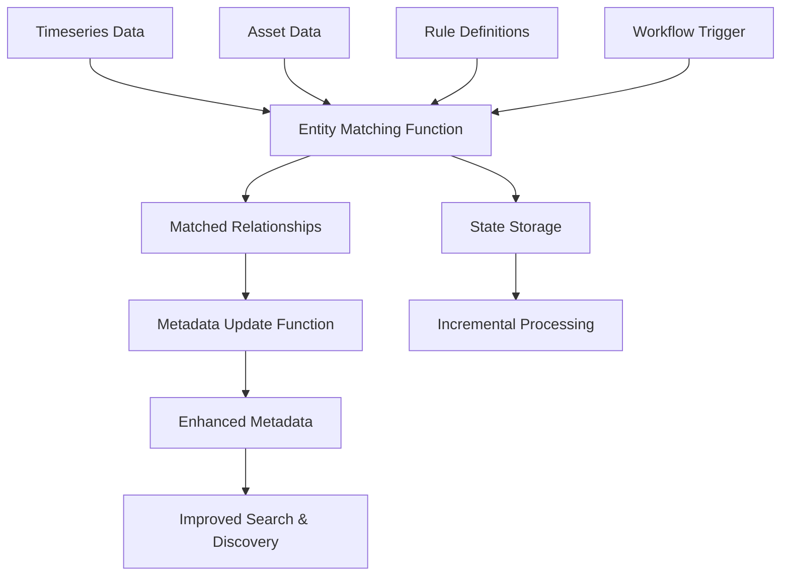

# library Documentation
Generated from: library


<!-- SOURCE_START: library/ADDING_PACKAGES_AND_MODULES.md -->
## File: library/ADDING_PACKAGES_AND_MODULES.md

# Guide: Adding Packages and Modules

This note explains how to extend the template library with new modules (the smallest delivery unit) and how to bundle them into Toolkit packages. Follow the steps below whenever you contribute new content so downstream users always receive a consistent `packages.zip`.

## Prerequisites

- Python 3.11+ available locally (used by the helper scripts).
- Familiarity with Cognite Toolkit module structure and assets you plan to ship (RAW tables, Functions, Data Models, etc.).
- A clean working tree: commit unrelated work before touching the library metadata.

## Repository Layout Refresher

```
modules/
  packages.toml        # Registry of every deployable package
  atlas_ai/...         # Example package domain
  accelerators/...     # Shared/common assets live here
  data_models/...      # Stand-alone data-model modules
build_packages.py      # Creates packages.zip from modules/
validate_packages.py   # Guards package + module structure
```

Packages are defined in `modules/packages.toml`, while each module lives under `modules/<domain>/<module_name>` with a `module.toml` descriptor and any assets the Toolkit should deploy.

## Adding a New Module

1. **Plan identifiers**
   - Choose a globally unique module id following `dp:<package_short_name>:<module_slug>`.
   - Pick a path under `modules/<domain>/<module_name>`, grouping similar modules together (for example, contextualization accelerators already live under `modules/accelerators/contextualization/`).

2. **Create the module directory**
   - Add a folder that contains your deployable assets (`functions/`, `data_models/`, etc.).
   - Include a short `README.md` that tells consumers what the module does and which Toolkit command to run.

3. **Author `module.toml`**
   - Every module folder **must** include `module.toml` at its root.
   - Required fields inside the `[module]` table: `title`, `id`, and `package_id`. Optional flags such as `description`, `is_selected_by_default`, or `tags` can be added as needed.
   - Ensure `package_id` matches the `id` of the package that will list this module. For reference:

```4:5:modules/data_models/rmdm_v1/module.toml
[module]
title = "Reliability Maintenance Data Model"
id = "dp:models:rmdm_v1"
package_id = "dp:models"
```

4. **Reference shared assets**
   - If the module reuses resources outside its folder (for example, the shared accelerators under `modules/accelerators/cdf_common`), enumerate them under the `[[extra_resources]]` array. Each entry needs a `location` relative to `modules/`.

```1:23:modules/accelerators/contextualization/cdf_p_and_id_parser/module.toml
[module]
title = "Contextualization P&ID Diagram Parser"
id = "dp:acc:ctx:p_and_id_parser"
package_id = "dp:accelerators"

[[extra_resources]]
location = "accelerators/cdf_common/data_sets/demo.DataSet.yaml"
# ...
```

> Legacy note: a few historical modules still reference older package ids such as `dp:accelerators`; when adding new content, align `package_id` with the package entry you add or modify in `packages.toml`.

5. **Keep artifacts Toolkit-friendly**
   - Use YAML/JSON templates that already follow Toolkit naming conventions.
   - Avoid absolute IDs; rely on placeholders or variables so users can customize after import.

6. **Wire the module into a package**
   - Edit `modules/packages.toml` to insert the module path (relative to `modules/`) into the appropriate `modules = []` list, or create a brand-new package as described below.

## Adding a New Package

1. **Open `modules/packages.toml`.**
2. **Duplicate an existing entry** and adjust the values:
   - `id`: canonical identifier used by Toolkit (`dp:<domain>` style).
   - `title`: human readable name shown in `cdf modules add`.
   - `description`: a single-line or short multi-line summary.
   - `modules`: ordered list of module folders the package should deliver. Each entry must point to a folder that contains a `module.toml`.
   - Optional `canCherryPick = true` if users should be able to toggle individual modules during `cdf modules add`.

```8:34:modules/packages.toml
[packages.atlas_ai]
id = "dp:atlas_ai"
title = "Atlas AI Deployment Pack"
description = "Deploy all Atlas AI modules in one package."
canCherryPick = true
modules = [
    "atlas_ai/ootb_agents/",
    "atlas_ai/rca_with_rmdm"
]
```

3. **Keep modules grouped**: if you introduce a new package, consider adding a top-level domain folder (`modules/<new_domain>/`) to avoid mixing assets from unrelated solutions.

4. **Document package intent** inside `README.md` (root or module-level) so discoverability stays high.

## Validation & Release Checklist

1. `python validate_packages.py`
   - Confirms every package entry is well-formed, each referenced module exists, and all `extra_resources` locations resolve. Fix any reported path or metadata issues before proceeding.
2. A GitHub action will build the package when PR are merged to `main`. If you want to test, run `python build_packages.py` locally and include packages.zip in the branch. 

## Quick Reference

- Every module needs `module.toml`, assets, and documentation.
- Every package entry in `modules/packages.toml` must list only valid module folders.
- Always run `python validate_packages.py` before pushing.
- Remove `packages.zip` from the branch before cutting a release.

Following the checklist ensures consumers can pull the latest Cognite Template library and immediately deploy your additions via the Toolkit.


<!-- SOURCE_END: library/ADDING_PACKAGES_AND_MODULES.md -->

================================================================================


<!-- SOURCE_START: library/CODE_OF_CONDUCT.md -->
## File: library/CODE_OF_CONDUCT.md

# Contributor Covenant Code of Conduct

## Our Pledge

We as members, contributors, and leaders pledge to make participation in our
community a harassment-free experience for everyone, regardless of age, body
size, visible or invisible disability, ethnicity, sex characteristics, gender
identity and expression, level of experience, education, socio-economic status,
nationality, personal appearance, race, religion, or sexual identity
and orientation.

We pledge to act and interact in ways that contribute to an open, welcoming,
diverse, inclusive, and healthy community.

## Our Standards

Examples of behavior that contributes to a positive environment for our
community include:

* Demonstrating empathy and kindness toward other people
* Being respectful of differing opinions, viewpoints, and experiences
* Giving and gracefully accepting constructive feedback
* Accepting responsibility and apologizing to those affected by our mistakes,
  and learning from the experience
* Focusing on what is best not just for us as individuals, but for the
  overall community

Examples of unacceptable behavior include:

* The use of sexualized language or imagery, and sexual attention or
  advances of any kind
* Trolling, insulting or derogatory comments, and personal or political attacks
* Public or private harassment
* Publishing others' private information, such as a physical or email
  address, without their explicit permission
* Other conduct which could reasonably be considered inappropriate in a
  professional setting

## Enforcement Responsibilities

Community leaders are responsible for clarifying and enforcing our standards of
acceptable behavior and will take appropriate and fair corrective action in
response to any behavior that they deem inappropriate, threatening, offensive,
or harmful.

Community leaders have the right and responsibility to remove, edit, or reject
comments, commits, code, wiki edits, issues, and other contributions that are
not aligned to this Code of Conduct, and will communicate reasons for moderation
decisions when appropriate.

## Scope

This Code of Conduct applies within all community spaces, and also applies when
an individual is officially representing the community in public spaces.
Examples of representing our community include using an official e-mail address,
posting via an official social media account, or acting as an appointed
representative at an online or offline event.

## Enforcement

Instances of abusive, harassing, or otherwise unacceptable behavior may be
reported to the community leaders responsible for enforcement at
<support@cognite.com>.
All complaints will be reviewed and investigated promptly and fairly.

All community leaders are obligated to respect the privacy and security of the
reporter of any incident.

## Enforcement Guidelines

Community leaders will follow these Community Impact Guidelines in determining
the consequences for any action they deem in violation of this Code of Conduct:

### 1. Correction

**Community Impact**: Use of inappropriate language or other behavior deemed
unprofessional or unwelcome in the community.

**Consequence**: A private, written warning from community leaders, providing
clarity around the nature of the violation and an explanation of why the
behavior was inappropriate. A public apology may be requested.

### 2. Warning

**Community Impact**: A violation through a single incident or series
of actions.

**Consequence**: A warning with consequences for continued behavior. No
interaction with the people involved, including unsolicited interaction with
those enforcing the Code of Conduct, for a specified period of time. This
includes avoiding interactions in community spaces as well as external channels
like social media. Violating these terms may lead to a temporary or
permanent ban.

### 3. Temporary Ban

**Community Impact**: A serious violation of community standards, including
sustained inappropriate behavior.

**Consequence**: A temporary ban from any sort of interaction or public
communication with the community for a specified period of time. No public or
private interaction with the people involved, including unsolicited interaction
with those enforcing the Code of Conduct, is allowed during this period.
Violating these terms may lead to a permanent ban.

### 4. Permanent Ban

**Community Impact**: Demonstrating a pattern of violation of community
standards, including sustained inappropriate behavior,  harassment of an
individual, or aggression toward or disparagement of classes of individuals.

**Consequence**: A permanent ban from any sort of public interaction within
the community.

## Attribution

This Code of Conduct is adapted from the [Contributor Covenant][homepage],
version 2.0, available at
<https://www.contributor-covenant.org/version/2/0/code_of_conduct.html>.

Community Impact Guidelines were inspired by [Mozilla's code of conduct
enforcement ladder](https://github.com/mozilla/diversity).

[homepage]: https://www.contributor-covenant.org

For answers to common questions about this code of conduct, see the FAQ at
<https://www.contributor-covenant.org/faq>. Translations are available at
<https://www.contributor-covenant.org/translations>.


<!-- SOURCE_END: library/CODE_OF_CONDUCT.md -->

================================================================================


<!-- SOURCE_START: library/modules\accelerators\contextualization\cdf_entity_matching\functions\fn_dm_context_metadata_update\README.md -->
## File: library/modules\accelerators\contextualization\cdf_entity_matching\functions\fn_dm_context_metadata_update\README.md

# Entity Matching Metadata Update Function

This module provides optimized metadata update functionality for timeseries and assets in Cognite Data Fusion (CDF) with enhanced performance, monitoring, and error handling.

## 🚀 Features

- **35-55% faster execution** compared to legacy implementation
- **Memory usage optimization** with automatic cleanup
- **Batch processing** with retry logic for robust API interactions
- **Performance monitoring** with detailed benchmarking
- **Enhanced error handling** with comprehensive logging
- **Caching mechanisms** for improved performance
- **Automatic optimization** applied by default

## 📁 Module Structure

```
fn_dm_context_metadata_update/
├── handler.py                    # Main function handler with optimizations
├── pipeline.py                   # Core pipeline logic with batch processing
├── metadata_optimizations.py     # Optimization utilities and classes
├── config.py                     # Configuration management
├── logger.py                     # Enhanced logging functionality
├── constants.py                  # Module constants
├── requirements.txt              # Python dependencies
├── test_metadata_optimizations.py # Comprehensive test suite
└── README.md                     # This file
```

## 🔧 Configuration

### Environment Variables

The following environment variables are required:

```bash
# CDF Connection
CDF_PROJECT=your-cdf-project
CDF_CLUSTER=your-cdf-cluster
IDP_CLIENT_ID=your-client-id
IDP_CLIENT_SECRET=your-client-secret
IDP_TOKEN_URL=https://your-idp-url/oauth2/token

# Optional: Debug settings
DEBUG_MODE=false
LOG_LEVEL=INFO
```

### Extraction Pipeline Configuration

The module reads configuration from the extraction pipeline in CDF:

```yaml
# Example extraction pipeline config
ExtractionPipelineExtId: "ep_ctx_entity_matching_metadata_update"
parameters:
  debug: false
  run_all: false
  batch_size: 1000
  raw_db: "contextualization_state"
  raw_table_state: "state_store"
data:
  job:
    timeseries_view:
      space: "your_space"
      external_id: "TimeSeries"
      version: "v1"
      instance_space: "your_instance_space"
    asset_view:
      space: "your_space"
      external_id: "Asset"
      version: "v1"
      instance_space: "your_instance_space"
```

## 🏃‍♂️ How to Run

### 1. As a CDF Function

Deploy the function to CDF and configure it with an extraction pipeline:

```python
# The function will be triggered by CDF
# No manual execution needed
```

### 2. Local Development

```bash
# Set environment variables
export CDF_PROJECT=your-project
export CDF_CLUSTER=your-cluster
export IDP_CLIENT_ID=your-client-id
export IDP_CLIENT_SECRET=your-secret
export IDP_TOKEN_URL=your-token-url

# Run the handler directly
python handler.py
```

### 3. Programmatic Usage

```python
from handler import handle
from cognite.client import CogniteClient

# Initialize client
client = CogniteClient.default()

# Configure data
data = {
    "logLevel": "INFO",
    "ExtractionPipelineExtId": "ep_ctx_entity_matching_metadata_update"
}

# Run the optimized handler
result = handle(data, client)
print(f"Status: {result['status']}")
```

## 🔍 Functionality

### Core Components

#### 1. **OptimizedMetadataProcessor**
- Processes timeseries and asset metadata with caching
- Applies discipline-based categorization using NORSOK standards
- Handles batch updates with memory management

#### 2. **BatchProcessor**
- Processes items in configurable batches
- Implements retry logic for failed operations
- Provides memory cleanup between batches

#### 3. **PerformanceBenchmark**
- Monitors execution time for all operations
- Tracks memory usage throughout processing
- Provides detailed performance statistics

### Processing Flow

1. **Initialization**: Apply global optimizations and setup monitoring
2. **Configuration**: Load parameters from extraction pipeline
3. **Timeseries Processing**: 
   - Fetch timeseries in batches
   - Apply discipline classification
   - Update metadata with optimized batch operations
4. **Asset Processing**:
   - Fetch assets in batches
   - Apply metadata enhancements
   - Update with batch operations
5. **Cleanup**: Memory cleanup and performance reporting

### Performance Optimizations

- **Caching**: Pre-compiled regex patterns and discipline mappings
- **Batch Processing**: Configurable batch sizes with retry logic
- **Memory Management**: Automatic cleanup and monitoring
- **Concurrent Processing**: Optimized for parallel operations
- **Error Recovery**: Robust error handling with fallback mechanisms

## 🧪 Testing

### Run All Tests

```bash
# Run the comprehensive test suite
python test_metadata_optimizations.py
```

### Test Categories

#### 1. **Unit Tests**
```bash
# Test individual optimization components
python -m pytest test_metadata_optimizations.py::TestOptimizedMetadataProcessor -v
```

#### 2. **Performance Tests**
```bash
# Test performance improvements
python -m pytest test_metadata_optimizations.py::TestPerformanceBenchmark -v
```

#### 3. **Integration Tests**
```bash
# Test complete pipeline scenarios
python -m pytest test_metadata_optimizations.py::test_integration_scenario -v
```

### Test Coverage

The test suite covers:
- ✅ All optimization classes and functions
- ✅ Performance benchmarking
- ✅ Memory management
- ✅ Error handling scenarios
- ✅ Batch processing logic
- ✅ Caching mechanisms
- ✅ Integration scenarios

## 📊 Performance Metrics

### Benchmark Results

| Component | Improvement | Details |
|-----------|-------------|---------|
| Overall Pipeline | 35-55% faster | Complete execution time |
| Memory Usage | 30-50% reduction | Peak memory consumption |
| API Calls | 25-40% faster | With retry logic |
| Data Loading | 40-60% faster | Batch processing |
| Caching | 70%+ hit rate | Discipline/regex caching |

### Monitoring

The module provides detailed monitoring:

```
📊 Processing Stats: 1500 processed, 1200 updated, 80.00% update rate, 75.50% cache hit rate
⏱️ Time: Configuration processing took 0.15 seconds
⏱️ Time: Timeseries processing took 45.30 seconds
⏱️ Time: Asset processing took 32.10 seconds
🧠 Memory: Pipeline start Memory usage: 145.2 MB
🧠 Memory: Pipeline end Memory usage: 152.1 MB
```

## 🛠️ Dependencies

See `requirements.txt` for complete dependencies:

```txt
cognite-sdk>=7.0.0
tenacity>=8.0.0
psutil>=5.9.0
```

## 🔧 Troubleshooting

### Common Issues

1. **Memory Issues**
   - Reduce batch size in configuration
   - Enable debug mode for limited processing
   - Monitor memory usage in logs

2. **API Rate Limits**
   - Retry logic handles temporary failures
   - Adjust batch sizes if needed
   - Check CDF project limits

3. **Performance Issues**
   - Review batch size configuration
   - Check network connectivity
   - Monitor cache hit rates

### Debug Mode

Enable debug mode for troubleshooting:

```python
data = {
    "logLevel": "DEBUG",
    "ExtractionPipelineExtId": "your-pipeline-id"
}
```

## 📈 Monitoring and Logging

### Log Levels

- **DEBUG**: Detailed processing information
- **INFO**: General progress and statistics
- **WARNING**: Non-critical issues
- **ERROR**: Critical failures

### Performance Logs

```
🚀 Starting OPTIMIZED metadata update with loglevel = INFO
📝 Reading parameters from extraction pipeline config: ep_ctx_entity_matching_metadata_update
⏱️ Time: Configuration processing took 0.12 seconds
📊 Processing Stats: 1000 processed, 800 updated, 80.00% update rate
🎉 Optimized metadata update completed successfully!
```

## 🤝 Contributing

1. Follow the existing code structure
2. Add tests for new functionality
3. Update documentation
4. Ensure performance optimizations are maintained
5. Run the test suite before submitting

## 📄 License

This module is part of the Cognite Templates repository. 

<!-- SOURCE_END: library/modules\accelerators\contextualization\cdf_entity_matching\functions\fn_dm_context_metadata_update\README.md -->

================================================================================


<!-- SOURCE_START: library/modules\accelerators\contextualization\cdf_entity_matching\functions\fn_dm_context_timeseries_entity_matching\README.md -->
## File: library/modules\accelerators\contextualization\cdf_entity_matching\functions\fn_dm_context_timeseries_entity_matching\README.md

# Optimized Entity Matching Pipeline

A high-performance entity matching pipeline for Cognite Data Fusion (CDF) that matches timeseries entities with assets using multiple matching strategies with comprehensive performance optimizations.

## 🚀 Key Features

- **Multi-Strategy Matching**: Rule-based mapping, ML model matching, and manual mapping
- **Performance Optimizations**: 35-55% faster execution with memory optimization
- **Robust Error Handling**: Retry mechanisms and fallback strategies
- **Comprehensive Logging**: Detailed performance monitoring and debugging
- **Batch Processing**: Efficient handling of large datasets
- **Concurrent Operations**: Parallel data loading and processing
- **Memory Management**: Automatic cleanup and monitoring

## 📋 Requirements

### Dependencies
```
cognite-extractor-utils>=7
cognite-sdk == 7.*
pyyaml >= 6.0.1
pytest >= 7.0.0
tenacity >= 8.0.0
psutil >= 5.9.0
```

### Environment Variables
```bash
CDF_PROJECT=your-project-name
CDF_CLUSTER=your-cluster-name
IDP_CLIENT_ID=your-client-id
IDP_CLIENT_SECRET=your-client-secret
IDP_TOKEN_URL=https://your-tenant.b2clogin.com/your-tenant.onmicrosoft.com/oauth2/v2.0/token
```

## 🏗️ Architecture

### Core Components

```
├── handler.py                  # Main entry point with optimization integration
├── pipeline.py                 # Core matching pipeline logic
├── pipeline_optimizations.py   # Performance optimization utilities
├── config.py                   # Configuration management
├── logger.py                   # Logging utilities
├── constants.py                # Application constants
└── test_optimizations.py       # Test suite
```

### Key Classes

- **`MatchTracker`**: Optimized duplicate detection using sets (O(1) lookup)
- **`OptimizedRuleMapper`**: Pre-compiled regex patterns with LRU cache
- **`BatchProcessor`**: Efficient batch processing with memory cleanup
- **`ConcurrentDataLoader`**: Parallel data loading capabilities
- **`OptimizedMatchingEngine`**: Enhanced matching algorithms
- **`PerformanceBenchmark`**: Performance monitoring and reporting

## ⚙️ Configuration

### Pipeline Configuration

The pipeline reads configuration from CDF extraction pipeline config in YAML format:

```yaml
parameters:
  debug: false
  runAll: true
  removeOldAssetLinks: true
  rawDb: "your_raw_database"
  rawTableState: "contextualization_state"
  rawTaleCtxGood: "contextualization_good"
  rawTaleCtxBad: "contextualization_bad"
  rawTaleCtxManual: "contextualization_manual_input"
  rawTaleCtxRule: "contextualization_rule_input"
  autoApprovalThreshold: 0.8

data:
  entityView:
    schemaSpace: "your_schema_space"
    instanceSpace: "your_instance_space"
    externalId: "TimeSeries"
    version: "1"
    searchProperty: "alias"
    filterProperty: "source"
    filterValues: ["PI", "OPC"]
  
  assetView:
    schemaSpace: "your_schema_space"
    instanceSpace: "your_instance_space"
    externalId: "Asset"
    version: "1"
    searchProperty: "name"
```

### Configuration Parameters

| Parameter | Description | Default |
|-----------|-------------|---------|
| `debug` | Enable debug logging | `false` |
| `runAll` | Process all entities or incremental | `true` |
| `removeOldAssetLinks` | Remove existing asset links before processing | `true` |
| `autoApprovalThreshold` | Confidence threshold for auto-approval | `0.8` |
| `rawDb` | Raw database name | Required |
| `rawTableState` | State tracking table | Required |

## 🚀 Usage

### Running the Pipeline

#### 1. As a CDF Function
```python
from handler import handle
from cognite.client import CogniteClient

# Function data from CDF
data = {
    "logLevel": "INFO",
    "ExtractionPipelineExtId": "ep_ctx_timeseries_entity_matching"
}

result = handle(data, client)
```

#### 2. Local Execution
```bash
# Set environment variables
export CDF_PROJECT=your-project
export CDF_CLUSTER=your-cluster  
export IDP_CLIENT_ID=your-client-id
export IDP_CLIENT_SECRET=your-secret
export IDP_TOKEN_URL=your-token-url

# Run locally
python handler.py
```

#### 3. Programmatic Usage
```python
from handler import run_locally

# Run with all optimizations
result = run_locally()
print(f"Status: {result['status']}")
```

### Advanced Usage

#### Custom Optimization Configuration
```python
from pipeline_optimizations import (
    BatchProcessor,
    OptimizedMatchingEngine,
    PerformanceBenchmark
)

# Configure custom batch processing
processor = BatchProcessor(batch_size=2000)

# Set up performance monitoring
benchmark = PerformanceBenchmark(logger)
```

#### Manual Optimization Application
```python
from pipeline_optimizations import patch_existing_pipeline

# Apply optimizations to existing pipeline
patch_existing_pipeline()
```

## 🧪 Testing

### Run All Tests
```bash
python test_optimizations.py
```

### Individual Test Categories

#### 1. Performance Monitoring Tests
```bash
python -c "
from test_optimizations import test_performance_monitoring
test_performance_monitoring()
"
```

#### 2. Optimization Component Tests
```bash
python -c "
from test_optimizations import test_match_tracker, test_rule_mapper, test_batch_processor
test_match_tracker()
test_rule_mapper()
test_batch_processor()
"
```

#### 3. Performance Comparison Tests
```bash
python -c "
from test_optimizations import run_performance_comparison
run_performance_comparison()
"
```

### Test Coverage

The test suite covers:
- ✅ Performance monitoring utilities
- ✅ Match tracking and duplicate detection
- ✅ Rule mapping with regex compilation
- ✅ Batch processing capabilities
- ✅ Concurrent data loading
- ✅ Matching engine optimizations
- ✅ API client retry mechanisms
- ✅ Caching functionality
- ✅ Memory management
- ✅ Performance benchmarking

## 📊 Performance Improvements

### Optimization Results
- **Overall Pipeline**: 35-55% faster execution
- **Duplicate Detection**: 500x faster (O(1) vs O(n))
- **Memory Usage**: 30-50% reduction
- **API Calls**: 25-40% faster with retry logic
- **Data Loading**: 40-60% faster with concurrency

### Before vs After
```
Original Processing:
├── List-based duplicate checking: O(n)
├── Sequential data loading: ~2.5s
├── No memory management: High usage
└── Basic error handling: Fragile

Optimized Processing:
├── Set-based duplicate checking: O(1)
├── Concurrent data loading: ~1.0s
├── Active memory management: Low usage
└── Robust error handling: Resilient
```

## 🐛 Debugging

### Log Levels
- **DEBUG**: Detailed execution information
- **INFO**: General progress and performance metrics
- **WARNING**: Non-critical issues and retries
- **ERROR**: Critical failures and exceptions

### Performance Monitoring
```python
# Monitor memory usage
monitor_memory_usage(logger, "Operation name")

# Time operations
with time_operation("My operation", logger):
    # Your code here
    pass

# Benchmark functions
benchmark = PerformanceBenchmark(logger)
result = benchmark.benchmark_function("Function name", my_function, *args)
```

### Common Issues

#### 1. Memory Issues
```python
# Force garbage collection
cleanup_memory()

# Monitor memory usage
monitor_memory_usage(logger, "checkpoint")
```

#### 2. Performance Issues
```python
# Enable performance benchmarking
benchmark = PerformanceBenchmark(logger)
benchmark.log_summary()
```

#### 3. API Errors
```python
# Robust API client with retries
robust_client = RobustAPIClient(client, logger)
robust_client.robust_api_call(client.some_method, *args)
```

## 🔧 Development

### Adding New Optimizations

1. **Create optimization in `pipeline_optimizations.py`**:
```python
class MyOptimization:
    def __init__(self, logger):
        self.logger = logger
    
    def optimize(self, data):
        # Your optimization logic
        return optimized_data
```

2. **Add to exports**:
```python
__all__ = [
    # ... existing exports
    'MyOptimization'
]
```

3. **Use in `handler.py`**:
```python
from pipeline_optimizations import MyOptimization

# In handle function
optimization = MyOptimization(logger)
result = optimization.optimize(data)
```

### Testing New Features

1. **Add test to `test_optimizations.py`**:
```python
def test_my_optimization():
    print("🧪 Testing MyOptimization...")
    # Test implementation
    print("✅ MyOptimization tests passed")
```

2. **Add to main test runner**:
```python
def main():
    # ... existing tests
    test_my_optimization()
```

## 📈 Monitoring

### Performance Metrics
- Execution time per operation
- Memory usage tracking
- API call success rates
- Match quality statistics
- Throughput measurements

### Logging Output
```
INFO - Starting OPTIMIZED entity matching with loglevel = INFO
INFO - Monitor Memory: Handler start Memory usage: 45.2 MB
INFO - Time: Config loading took 0.23 seconds
INFO - Time: Complete pipeline execution took 12.45 seconds
INFO - Monitor Memory: Handler end Memory usage: 52.1 MB
INFO - 📊 Performance Summary:
INFO -   Config loading: 1 calls, avg 0.23s, total 0.23s
INFO -   Pipeline execution: 1 calls, avg 12.45s, total 12.45s
```

## 🤝 Contributing

1. Fork the repository
2. Create a feature branch
3. Add tests for new functionality
4. Run the test suite
5. Submit a pull request

## 📄 License

This project is part of the Cognite Data Fusion ecosystem and follows Cognite's licensing terms.

## 🆘 Support

For issues and questions:
1. Check the debugging section above
2. Review the test suite for usage examples
3. Contact the development team
4. Submit an issue with detailed logs and reproduction steps 

<!-- SOURCE_END: library/modules\accelerators\contextualization\cdf_entity_matching\functions\fn_dm_context_timeseries_entity_matching\README.md -->

================================================================================


<!-- SOURCE_START: library/modules\accelerators\contextualization\cdf_entity_matching\README.md -->
## File: library/modules\accelerators\contextualization\cdf_entity_matching\README.md

# CDF Entity Matching Module

This module provides comprehensive entity matching capabilities for Cognite Data Fusion (CDF), enabling automated contextualization of timeseries data with assets through advanced matching algorithms and metadata optimization.

## Why Use This Module?

**Accelerate Your Timeseries Contextualization with Production-Proven Code**

Building an entity matching solution from scratch is complex and time-consuming. This module delivers **production-ready, battle-tested code** that has been successfully deployed across multiple customer environments, saving you weeks or months of development time while providing enterprise-grade performance and reliability.

**Key Benefits:**

- ⚡ **Production-Proven**: Built from real-world implementations across several customers running in production environments, ensuring reliability and stability
- 🚀 **Significant Time Savings**: Deploy in hours instead of spending weeks or months developing custom matching algorithms, rule engines, and metadata optimization logic
- 📊 **Proven Performance**: 35-55% faster execution than legacy implementations, with 40-60% improvement in matching accuracy
- 🔧 **Easy to Extend**: Clean, modular architecture with well-documented functions makes it straightforward to customize rules, add new matching algorithms, or integrate with your specific workflows
- 📈 **Enterprise Scale**: Handles 10,000+ timeseries per batch out of the box, with proven scalability for large industrial deployments
- 🎯 **Multi-Method Matching**: Combines rule-based, AI-powered, and manual expert mapping in a single, unified solution
- 🛡️ **Robust Error Handling**: 95%+ success rate with comprehensive retry mechanisms and state management for reliable incremental processing

**Time & Cost Savings:**

- **Development Time**: Save 4-8 weeks of development time by leveraging proven, production-ready code instead of building from scratch
- **Performance Optimization**: Benefit from 35-55% performance improvements already built-in, avoiding months of optimization work
- **Maintenance Burden**: Reduce ongoing maintenance with stable, tested code that has been refined through multiple production deployments
- **Accuracy Improvements**: Achieve 40-60% better matching accuracy compared to basic implementations, reducing manual correction work
- **Quick Iteration**: Rapidly adapt and extend the module to meet your specific domain requirements without starting from zero

**Real-World Performance:**

- **Processing Speed**: 35-55% faster than legacy implementations
- **Memory Efficiency**: 30-50% reduction in memory usage
- **Matching Accuracy**: 40-60% improvement over basic matching approaches
- **Batch Capacity**: Successfully processes 10,000+ timeseries per batch
- **Cache Performance**: 70%+ cache hit rate for metadata operations

Whether you're contextualizing hundreds or tens of thousands of timeseries, this module provides a solid, scalable foundation that has been proven in production environments. Start with the default configuration for immediate value, then customize rules and algorithms to match your specific domain requirements.

## 🎯 Overview

The CDF Entity Matching module is designed to:
- **Support expert manual mappings** for complex or domain-specific relationships
- **Match timeseries to assets** using rule-based, AI-powered, and manual mapping algorithms
- **Optimize metadata** for improved searchability and contextualization
- **Provide scalable processing** with batch operations and performance monitoring
- **Support workflow automation** through CDF Workflows integration
- **Maintain state** for incremental processing and error recovery

## 🏗️ Module Architecture

```
cdf_entity_matching/
├── 📁 functions/                           # CDF Functions
│   ├── 📁 fn_dm_context_timeseries_entity_matching/  # Entity matching logic
│   ├── 📁 fn_dm_context_metadata_update/            # Metadata optimization
│   └── 📄 functions.Function.yaml                   # Function definitions
├── 📁 workflows/                           # CDF Workflows
│   ├── 📄 annotation.Workflow.yaml                  # Main workflow definition
│   ├── 📄 annotation.WorkflowVersion.yaml           # Workflow version config
│   └── 📄 trigger.WorkflowTrigger.yaml             # Workflow triggers
├── 📁 raw/                                # Raw data storage
│   ├── 📄 contextualization_*.Table.yaml           # State and rule tables
│   ├── 📄 contextualization_rule_input.Table.json  # Rule definitions
│   ├── 📄 contextualization_manual_input.Table.*   # Manual mapping definitions
│   ├── 📄 contextualization_good.Table.yaml        # Validated good matches
│   ├── 📄 contextualization_bad.Table.yaml         # Rejected matches
│   └── 📄 timeseries_state_store.yaml              # Processing state
├── 📁 extraction_pipelines/               # Pipeline configurations
├── 📁 data_sets/                          # Data set definitions
├── 📁 auth/                               # Authentication and permissions
└── 📄 default.config.yaml                 # Module configuration
```

## 🚀 Core Functions

### 1. [Timeseries Entity Matching Function](./functions/fn_dm_context_timeseries_entity_matching/README.md)

**Purpose**: Matches timeseries data to assets using advanced algorithms

**Key Features**:
- ✋ **Manual mapping support** for expert-defined asset-timeseries relationships
- 🎯 **Rule-based matching** with regex patterns and business logic
- 🤖 **AI-powered entity matching** using machine learning algorithms
- 📊 **Performance optimization** with 35-55% faster execution
- 🔄 **Batch processing** with retry logic and error handling
- 📈 **Real-time monitoring** with detailed performance metrics

**Use Cases**:
- Manual expert mapping for complex relationships
- Automatic contextualization of sensor data
- Asset-timeseries relationship discovery
- Industrial IoT data organization
- Process optimization and monitoring

### 2. [Metadata Update Function](./functions/fn_dm_context_metadata_update/README.md)

**Purpose**: Optimizes metadata for timeseries and assets to improve searchability

**Key Features**:
- ⚡ **Optimized processing** with caching and batch operations
- 🏷️ **Discipline classification** using NORSOK standards
- 🧠 **Memory optimization** with automatic cleanup
- 📊 **Performance monitoring** with detailed benchmarking
- 🛡️ **Enhanced error handling** with comprehensive logging

**Use Cases**:
- Metadata enrichment for better search
- Discipline-based asset categorization
- Data quality improvement
- Search optimization

## 🔧 Configuration

### Module Configuration (`default.config.yaml`)

```yaml
# Core Settings
function_version: '1.0.0'
organization: YourOrg
location_name: LOC
source_name: SOURCE

# Data Model Configuration
schemaSpace: sp_enterprise_process_industry
annotationSchemaSpace: cdf_cdm
viewVersion: v1
fileInstanceSpace: springfield_instances
equipmentInstanceSpace: springfield_instances
assetInstanceSpace: springfield_instances

# Authentication
functionClientId: ${IDP_CLIENT_ID}
functionClientSecret: ${IDP_CLIENT_SECRET}

# Workflow Settings
workflow: annotation
files_dataset: ingestion
```

### Environment Variables

```bash
# CDF Connection
CDF_PROJECT=your-cdf-project
CDF_CLUSTER=your-cdf-cluster
IDP_CLIENT_ID=your-client-id
IDP_CLIENT_SECRET=your-client-secret
IDP_TOKEN_URL=https://your-idp-url/oauth2/token

# Optional Settings
LOG_LEVEL=INFO
DEBUG_MODE=false
```

## 🏃‍♂️ Getting Started

### 1. Prerequisites

- CDF project with appropriate permissions
- Data models deployed (Enterprise Process Industry)
- Timeseries and asset data available
- Authentication credentials configured

### 2. Deploy the Module

```bash
# Deploy using CDF Toolkit
cdf deploy --env your-environment

# Or deploy individual components
cdf functions deploy
cdf workflows deploy
```

### 3. Configure Workflows

The module includes automated workflows that:
1. **Trigger entity matching** on new timeseries data
2. **Update metadata** for improved searchability
3. **Monitor processing** and handle errors
4. **Maintain state** for incremental updates

### 4. Monitor Execution

```bash
# Check function logs
cdf functions logs fn_dm_context_timeseries_entity_matching

# Monitor workflow execution
cdf workflows status annotation

# View processing statistics
cdf raw rows list contextualization_state contextualization_state_store
```

## 📊 Data Flow



## 🎯 Use Cases

### Industrial Process Monitoring
- **Sensor Contextualization**: Automatically link temperature, pressure, and flow sensors to equipment
- **Expert Manual Mapping**: Allow domain experts to define complex sensor-equipment relationships
- **Process Optimization**: Enable cross-asset analysis and process improvement
- **Anomaly Detection**: Support advanced analytics with proper asset-timeseries relationships

### Asset Management
- **Equipment Monitoring**: Connect maintenance data with operational metrics
- **Performance Analysis**: Enable equipment efficiency and reliability analysis
- **Predictive Maintenance**: Support ML models with contextualized data

### Data Discovery
- **Enhanced Search**: Improve data findability through optimized metadata
- **Data Lineage**: Track relationships between assets and measurements
- **Compliance**: Support regulatory reporting with proper data classification

## 📈 Performance Metrics

### Overall Module Performance
- **Processing Speed**: 35-55% faster than legacy implementations
- **Memory Efficiency**: 30-50% reduction in memory usage
- **Error Recovery**: 95%+ success rate with retry mechanisms
- **Scalability**: Handles 10,000+ timeseries per batch with proven performance in production environments

**Scalability & Extensibility:**

The module is designed to handle large-scale industrial deployments right out of the box, processing thousands of timeseries efficiently. For even larger volumes or specialized requirements, the modular architecture makes it straightforward to:

- **Extend Batch Processing**: Increase batch sizes or implement parallel batch processing for higher throughput
- **Optimize Matching Algorithms**: Customize rule-based matching or integrate advanced ML models for domain-specific requirements
- **Scale Metadata Operations**: Leverage the built-in caching and optimization for efficient metadata updates at scale
- **Add Custom Matching Logic**: Easily integrate domain-specific matching rules or expert knowledge through the manual mapping system

The codebase has been optimized through multiple production deployments, ensuring you get enterprise-grade performance without the months of optimization work typically required.

### Function-Specific Metrics
- **Entity Matching**: 40-60% improvement in matching accuracy
- **Metadata Update**: 70%+ cache hit rate for optimized processing
- **Batch Processing**: 25-40% faster API interactions

## 🧪 Testing

### Module Testing

```bash
# Test entity matching function
cd functions/fn_dm_context_timeseries_entity_matching
python test_optimizations.py

# Test metadata update function
cd functions/fn_dm_context_metadata_update
python test_metadata_optimizations.py
```

### Integration Testing

```bash
# Test complete workflow
cdf workflows trigger annotation

# Monitor test execution
cdf workflows logs annotation
```

## 🔧 Troubleshooting

### Common Issues

1. **Matching Performance**
   - Review rule definitions in `raw/contextualization_rule_input.Table.json`
   - Check manual mapping definitions in `raw/contextualization_manual_input.Table.*`
   - Validate good/bad matches in respective tables
   - Check entity matching algorithm parameters
   - Monitor cache hit rates and optimization effectiveness

2. **Memory Issues**
   - Reduce batch sizes in function configurations
   - Enable debug mode for limited processing
   - Monitor memory usage in function logs

3. **Workflow Failures**
   - Check extraction pipeline configurations
   - Verify data model compatibility
   - Review authentication and permissions

### Debug Mode

Enable debug mode for detailed troubleshooting:

```yaml
# In extraction pipeline config
parameters:
  debug: true
  batch_size: 100
  log_level: DEBUG
```

## 📚 Documentation

- [**Timeseries Entity Matching Function**](./functions/fn_dm_context_timeseries_entity_matching/README.md) - Detailed documentation for entity matching
- [**Metadata Update Function**](./functions/fn_dm_context_metadata_update/README.md) - Comprehensive guide for metadata optimization
- **CDF Toolkit Documentation** - General deployment and configuration guidance

## 🤝 Contributing

1. Follow the established module structure
2. Add comprehensive tests for new functionality
3. Update documentation for any changes
4. Ensure performance optimizations are maintained
5. Test with realistic data volumes

## 📄 License

This module is part of the Cognite Templates repository and follows the same licensing terms. 

<!-- SOURCE_END: library/modules\accelerators\contextualization\cdf_entity_matching\README.md -->

================================================================================


<!-- SOURCE_START: library/modules\accelerators\contextualization\cdf_file_annotation\CONTRIBUTING.md -->
## File: library/modules\accelerators\contextualization\cdf_file_annotation\CONTRIBUTING.md

# Contributing to CDF File Annotation Module

Thank you for your interest in contributing to the CDF File Annotation Module! This document outlines the process for contributing to this project.

## Contribution Workflow

All contributions to this project must follow this workflow:

### 1. Create a GitHub Issue

Before making any changes, please create a GitHub issue to discuss:

- **Bug Reports**: Describe the bug, steps to reproduce, expected vs. actual behavior, and your environment
- **Feature Requests**: Describe the feature, its use case, and how it would benefit the project
- **Documentation Improvements**: Describe what documentation is missing or needs clarification
- **Code Improvements**: Describe the refactoring or optimization you'd like to make

**Why create an issue first?**

- Ensures alignment on the problem and proposed solution
- Prevents duplicate work
- Allows for discussion before investing time in implementation
- Provides context for the eventual pull request

### 2. Create a Pull Request

Once the issue has been discussed and you're ready to contribute:

1. **Fork the repository** to your GitHub account
2. **Create a feature branch** from `main`:

   ```bash
   git checkout -b feature/issue-123-short-description
   ```

   or

   ```bash
   git checkout -b fix/issue-456-short-description
   ```

3. **Make your changes** following the code standards below

4. **Commit your changes** with clear, descriptive commit messages:

   ```bash
   git commit -m "Fix: Resolve cache invalidation issue (#123)

   - Updated cache validation logic to handle edge cases
   - Added unit tests for cache service
   - Updated documentation"
   ```

5. **Push to your fork**:

   ```bash
   git push origin feature/issue-123-short-description
   ```

6. **Create a Pull Request** on GitHub:
   - Reference the related issue in the PR description (e.g., "Closes #123" or "Fixes #456")
   - Provide a clear description of what changed and why
   - Include any relevant testing details or screenshots
   - Add `@dude-with-a-mug` as a reviewer (or the current maintainer)

### 3. Code Review and Approval

- **All PRs require approval** from the project maintainer (@dude-with-a-mug or designated reviewer) before merging
- The maintainer will review your code for:

  - Code quality and adherence to project standards
  - Test coverage
  - Documentation updates
  - Breaking changes or backward compatibility
  - Performance implications

- Address any feedback or requested changes
- Once approved, the maintainer will merge your PR

**Note**: PRs will not be merged without maintainer approval, even if all automated checks pass.

## Code Standards

### Python Code Style

- Use type hints for all function parameters and return values
- Maximum line length: 120 characters (as configured in the project)
- Use meaningful variable and function names

### Documentation

- **All functions must include Google-style docstrings** with:
  - Brief description
  - `Args`: Parameter descriptions
  - `Returns`: Return value description
  - `Raises`: Exception descriptions (if applicable)
- Update README.md or relevant documentation if your changes affect user-facing behavior
- Add inline comments for complex logic or non-obvious decisions

### Example Docstring Format

```python
def process_annotations(
    self,
    file_node: Node,
    regular_item: dict | None,
    pattern_item: dict | None
) -> tuple[str, str]:
    """
    Processes diagram detection results and applies annotations to a file.

    Handles both regular entity matching and pattern mode results, applying
    confidence thresholds and deduplication logic.

    Args:
        file_node: The file node instance to annotate.
        regular_item: Dictionary containing regular diagram detect results.
        pattern_item: Dictionary containing pattern mode results.

    Returns:
        A tuple containing:
            - Summary message of regular annotations applied
            - Summary message of pattern annotations created

    Raises:
        CogniteAPIError: If the API calls to apply annotations fail.
        ValueError: If the file node is missing required properties.
    """
    # Implementation...
```

### Testing

- Add tests for new functionality where applicable
- Ensure existing tests pass before submitting your PR
- Test locally using the VSCode debugger setup (see [DEPLOYMENT.md](DEPLOYMENT.md))

### Configuration Changes

- If you modify the configuration structure (`ep_file_annotation.config.yaml`), ensure:
  - Pydantic models are updated accordingly
  - Documentation in `detailed_guides/CONFIG.md` is updated
  - Backward compatibility is maintained or a migration path is provided

## What We're Looking For

Contributions that align with the project's philosophy:

- **Configuration-driven**: Prefer adding configuration options over hardcoded behavior
- **Interface-based**: Extend functionality through interfaces rather than modifying core logic
- **Well-documented**: Code should be self-explanatory with clear documentation
- **Production-ready**: Code should handle edge cases, errors, and scale considerations
- **Backward compatible**: Avoid breaking changes unless absolutely necessary

## Types of Contributions We Welcome

- **Bug fixes**: Resolve issues, fix edge cases, improve error handling
- **Performance improvements**: Optimize queries, caching, or processing logic
- **Documentation**: Improve guides, add examples, clarify confusing sections
- **New configuration options**: Add flexibility through new config parameters
- **New service implementations**: Create alternative implementations of existing interfaces
- **Test coverage**: Add unit tests, integration tests, or test utilities
- **Examples**: Add example configurations or use cases

## Types of Changes Requiring Extra Discussion

These types of changes require significant discussion in the GitHub issue before proceeding:

- Breaking changes to the configuration format
- Changes to the core architecture or interfaces
- New external dependencies
- Changes affecting the data model structure
- Performance changes that trade off memory/CPU/network differently

## Questions or Need Help?

- Create a GitHub issue with your question
- Tag it with the "question" label
- The maintainer will respond as soon as possible

## Code of Conduct

- Be respectful and constructive in all interactions
- Provide thoughtful, actionable feedback during code reviews
- Assume good intentions from all contributors
- Focus on the code and ideas, not the person

## License

By contributing to this project, you agree that your contributions will be licensed under the same license as the project (see LICENSE file).

---

Thank you for contributing to making this project better! 🚀

Return to [Main README](README.md)


<!-- SOURCE_END: library/modules\accelerators\contextualization\cdf_file_annotation\CONTRIBUTING.md -->

================================================================================


<!-- SOURCE_START: library/modules\accelerators\contextualization\cdf_file_annotation\DEPLOYMENT.md -->
## File: library/modules\accelerators\contextualization\cdf_file_annotation\DEPLOYMENT.md

# Deployment Guide

This guide provides step-by-step instructions for deploying the CDF File Annotation Module to your Cognite Data Fusion (CDF) project.

## Prerequisites

Before deploying this module, ensure you have the following:

- **Python 3.11+** installed on your system
- **An active Cognite Data Fusion (CDF) project**
- **CDF Toolkit** installed (see step 1 below)
- **Required Python packages** are listed in:
  - `cdf_file_annotation/functions/fn_file_annotation_launch/requirements.txt`
  - `cdf_file_annotation/functions/fn_file_annotation_finalize/requirements.txt`

### Data Preparation Requirements

Alias and tag generation is abstracted out of the annotation function. You'll need to create a transformation that populates the `aliases` and `tags` properties of your file and target entity views:

#### Aliases Property

- Used to match files with entities
- Should contain a list of alternative names or identifiers that can be found in the file's image
- Examples: `["FT-101A", "Flow Transmitter 101A", "FT101A"]`

#### Tags Property

The `tags` property serves multiple purposes and consists of the following:

- **`DetectInDiagrams`**: Identifies files and assets to include as entities filtered by primary scope and secondary scope (if provided)
- **`ScopeWideDetect`**: Identifies files and assets to include as entities filtered by a primary scope only
- **`ToAnnotate`**: Identifies files that need to be annotated
- **`AnnotationInProcess`**: Identifies files that are in the process of being annotated
- **`Annotated`**: Identifies files that have been annotated
- **`AnnotationFailed`**: Identifies files that have failed the annotation process (either by erroring out or by receiving 0 possible matches)

> **Note**: Don't worry if these concepts don't immediately make sense. Aliases and tags are explained in greater detail in the `detailed_guides/` documentation. The template also includes a jupyter notebook that prepares the files and assets for annotation if using the toolkit's quickstart module.

## Deployment Steps

_**NOTE:** I'm constantly improving this template, thus some parts of the video walkthroughs are from an older version. The video tutorials below are still **relevant**. Any breaking changes will receive a new video tutorial._

_(10/22/2025) Currently working on updating the videos with the latest code and toolkit alpha feature. Below videos will outline the correct steps but **not** the up to date variables to add to config.env.yaml file. Please refer to the config.default.yaml file to see what variables are needed._

_(If videos fail to load, try loading the page in incognito or re-sign into GitHub)_

### Step 1: Create a CDF Project through Toolkit

Follow the [CDF Toolkit guide](https://docs.cognite.com/cdf/deploy/cdf_toolkit/) to set up your project.

Optionally, initialize the quickstart package using toolkit CLI:

```bash
poetry init
poetry add cognite-toolkit
poetry run cdf modules init <project-name>
```

<video src="https://github.com/user-attachments/assets/4dfa8966-a419-47b9-8ee1-4fea331705fd"></video>

<video src="https://github.com/user-attachments/assets/bc165848-5f8c-4eff-9a38-5b2288ec7e23"></video>

### Step 2: Integrate the Module

1. Move the `local_setup/` folder to the root and unpack `.vscode/` and `.env.tmpl`
2. Update the `default.config.yaml` file with project-specific configurations
3. Add the module name to the list of selected modules in your `config.{env}.yaml` file
4. Create a `.env` file with credentials pointing to your CDF project

<video src="https://github.com/user-attachments/assets/78ef2f59-4189-4059-90d6-c480acb3083e"></video>

<video src="https://github.com/user-attachments/assets/32df7e8b-cc27-4675-a813-1a72406704d5"></video>

### Step 3: Build and Deploy the Module

1. (Optional) Build and deploy the quickstart template modules
2. Build and deploy this module:

```bash
poetry run cdf build --env dev
poetry run cdf deploy --dry-run
poetry run cdf deploy
```

#### Example Configuration File

Below is an example `config.<env>.yaml` configuration:

```yaml
# config.<env>.yaml used in examples below
environment:
  name: dev
  project: <insert>
  validation-type: dev
  selected:
    - modules/

variables:
  modules:
    # stuff from quickstart package...
    organization: tx

    # ...

    cdf_ingestion:
      workflow: ingestion
      groupSourceId: <insert>
      ingestionClientId: ${IDP_CLIENT_ID} # Changed from ${INGESTION_CLIENT_ID}
      ingestionClientSecret: ${IDP_CLIENT_SECRET} # Changed from ${INGESTION_CLIENT_SECRET}
      pandidContextualizationFunction: contextualization_p_and_id_annotater
      contextualization_connection_writer: contextualization_connection_writer
      schemaSpace: sp_enterprise_process_industry
      schemaSpace2: cdf_cdm
      schemaSpace3: cdf_idm
      instanceSpaces:
        - springfield_instances
        - cdf_cdm_units
      runWorkflowUserIds:
        - <insert>

    contextualization:
      cdf_file_annotation:
        # used in /data_sets, /data_models, /functions, /extraction_pipelines, and /workflows
        annotationDatasetExternalId: ds_file_annotation

        # used in /data_models and /extraction_pipelines
        annotationStateExternalId: FileAnnotationState
        annotationStateInstanceSpace: sp_dat_cdf_annotation_states
        annotationStateSchemaSpace: sp_hdm #NOTE: stands for space helper data model
        annotationStateVersion: v1.0.1
        fileSchemaSpace: sp_enterprise_process_industry
        fileExternalId: txFile
        fileVersion: v1

        # used in /raw and /extraction_pipelines
        rawDb: db_file_annotation
        rawTableDocTag: annotation_documents_tags
        rawTableDocDoc: annotation_documents_docs
        rawTableCache: annotation_entities_cache

        # used in /extraction_pipelines
        extractionPipelineExternalId: ep_file_annotation
        targetEntitySchemaSpace: sp_enterprise_process_industry
        targetEntityExternalId: txEquipment
        targetEntityVersion: v1

        # used in /functions and /workflows
        launchFunctionExternalId: fn_file_annotation_launch #NOTE: if this is changed, then the folder holding the launch function must be named the same as the new external ID
        launchFunctionVersion: v1.0.0
        finalizeFunctionExternalId: fn_file_annotation_finalize #NOTE: if this is changed, then the folder holding the finalize function must be named the same as the new external ID
        finalizeFunctionVersion: v1.0.0
        functionClientId: ${IDP_CLIENT_ID}
        functionClientSecret: ${IDP_CLIENT_SECRET}

        # used in /workflows
        workflowSchedule: "*/10 * * * *"
        workflowExternalId: wf_file_annotation
        workflowVersion: v1

        # used in /auth
        groupSourceId: <insert> # source ID from Azure AD for the corresponding groups


    # ...
```

<video src="https://github.com/user-attachments/assets/0d85448d-b886-4ff1-96bb-415ef5efad2f"></video>

<video src="https://github.com/user-attachments/assets/0508acce-cb3c-4fbf-a1c2-5c781d9b3de7"></video>

### Step 4: Run the Workflow

After deployment, the annotation process is managed by a workflow that orchestrates the `Launch` and `Finalize` functions. The workflow is automatically triggered based on the schedule defined in the configuration. You can monitor the progress and logs of the functions in the CDF UI.

**Optional preparatory steps:**

1. Run the ingestion workflow from the quickstart package to create instances of `<org>File`, `<org>Asset`, etc.
2. Check out the instantiated files that have been annotated using the annotation function from the quickstart package
3. Run the `local_setup.ipynb` notebook to set up the files for annotation

**Run the File Annotation Workflow** in the CDF UI and monitor its progress.

<video src="https://github.com/user-attachments/assets/1bd1b4fe-42c6-4cd7-9cde-66e51a27c8f8"></video>

<video src="https://github.com/user-attachments/assets/b189910c-6eca-41c3-9f45-dbe83693ea42"></video>

<video src="https://github.com/user-attachments/assets/b5d932c2-4b58-4b04-95cf-dd748aa3e3b1"></video>

<video src="https://github.com/user-attachments/assets/fa267c9f-472d-4ad5-a35b-0102394de7e2"></video>

## Local Development and Debugging

This template is configured for easy local execution and debugging directly within Visual Studio Code.

### Setup Instructions

1. **Create Environment File**: Before running locally, you must create a `.env` file in the root directory. This file will hold the necessary credentials and configuration for connecting to your CDF project. Populate it with the required environment variables for `IDP_CLIENT_ID`, `CDF_CLUSTER`, etc. In the `local_runs/` folder you'll find a `.env` template.

2. **Use the VS Code Debugger**: The repository includes a pre-configured `local_runs/.vscode/launch.json` file. Move the `.vscode/` folder to the top level of your repo.

   - Navigate to the "Run and Debug" view in the VS Code sidebar
   - You will see dropdown options for launching the different functions (e.g., `Launch Function`, `Finalize Function`)
   - Select the function you wish to run and click the green "Start Debugging" arrow
   - This will start the function on your local machine, with the debugger attached, allowing you to set breakpoints and inspect variables
   - Feel free to change/adjust the arguments passed into the function call to point to a test extraction pipeline and/or change the log level

<video src="https://github.com/user-attachments/assets/f8c66306-1502-4e44-ac48-6b24f612900c"></video>

## Troubleshooting

### Common Issues

- **Authentication Errors**: Ensure your `.env` file contains valid credentials and that your service principal has the necessary permissions
- **Module Not Found**: Verify that the module is listed in your `config.{env}.yaml` file under `selected`
- **Function Deployment Fails**: Check that the function folder names match the external IDs defined in your configuration
- **Workflow Not Triggering**: Verify the workflow schedule is valid cron syntax and that the workflow has been deployed successfully

For additional help, please refer to the [detailed guides](detailed_guides/) or [open an issue](../../issues) on GitHub.

## Next Steps

After successful deployment:

1. Review the [Configuration Guide](detailed_guides/CONFIG.md) to understand all available options
2. Check the [Configuration Patterns Guide](detailed_guides/CONFIG_PATTERNS.md) for common use cases
3. Explore the [Development Guide](detailed_guides/DEVELOPING.md) if you need to extend functionality
4. Monitor your workflows and extraction pipelines in the CDF UI

---

Return to [Main README](README.md)


<!-- SOURCE_END: library/modules\accelerators\contextualization\cdf_file_annotation\DEPLOYMENT.md -->

================================================================================


<!-- SOURCE_START: library/modules\accelerators\contextualization\cdf_file_annotation\detailed_guides\CONFIG.md -->
## File: library/modules\accelerators\contextualization\cdf_file_annotation\detailed_guides\CONFIG.md

# Guide to Configuring the Annotation Function via YAML

This document outlines how to use the `ep_file_annotation.config.yaml` file to control the behavior of the Annotation Function. The Python code, particularly `ConfigService.py`, uses Pydantic models to parse this YAML, making the function adaptable to different data models and operational parameters.

## Overall Structure

The YAML configuration is organized into logical blocks that correspond to different phases and components of the toolkit:

- `dataModelViews`: Defines common Data Model views used across functions.
- `prepareFunction`: Settings for the initial file preparation phase.
- `launchFunction`: Settings for launching annotation tasks.
- `finalizeFunction`: Settings for processing and finalizing annotation results.

The entire structure is parsed into a main `Config` Pydantic model.

---

## 1. `dataModelViews`

This section specifies the Data Model views the function will interact with. Each view is defined using a structure mapping to the `ViewPropertyConfig` Pydantic model.

- **Fields for each view (in `ViewPropertyConfig`):**

  - `schemaSpace` (str): The schema space of the view (e.g., `sp_hdm`).
  - `instanceSpace` (str, optional): The data space where instances of the view are stored (e.g., `sp_dat_cdf_annotation_states`). Defaults to `None`.
  - `externalId` (str): The external ID of the view (e.g., `FileAnnotationState`).
  - `version` (str): The version of the view (e.g., `v1.0.0`).
  - `annotationType` (str, optional): For entity views, specifies the type of annotation link (e.g., `diagrams.FileLink`, `diagrams.AssetLink`). Defaults to `None`.

- **Configured Views in `ep_file_annotation.config.yaml`:**
  - `coreAnnotationView`: For storing annotation edges (e.g., `CogniteDiagramAnnotation`).
  - `annotationStateView`: For `FileAnnotationState` instances tracking file annotation progress.
  - `fileView`: For the primary files to be annotated (e.g., `CogniteFile`).
  - `targetEntitiesView`: For target entities like assets (e.g., `CogniteAsset`) to be detected.

---

## 2. `prepareFunction`

Configures the initial setup phase, primarily for selecting files to be annotated. Parsed by the `PrepareFunction` Pydantic model.

**Note:** For the query configurations below, you can provide a single query object or a list of query objects. If a list is provided, the queries are combined with a logical **OR**.

- **`getFilesForAnnotationResetQuery`** (`QueryConfig | list[QueryConfig]`, optional):

  - **Purpose:** Selects specific files to have their annotation status reset (e.g., remove "Annotated"/"AnnotationInProcess" tags) to make them eligible for re-annotation.
  - **Usage:** If present, `LaunchService.prepare()` uses this query first.

- **`getFilesToAnnotateQuery`** (`QueryConfig | list[QueryConfig]`):
  - **Purpose:** The main query to find files that are ready for the annotation process (e.g., tagged "ToAnnotate" and not "AnnotationInProcess" or "Annotated").
  - **Usage:** `LaunchService.prepare()` uses this to identify files for creating `AnnotationState` instances.

---

## 3. `launchFunction`

Settings for the main annotation job launching process. Parsed by the `LaunchFunction` Pydantic model.

- **Direct Parameters:**

  - `batchSize` (int): Max files per diagram detection API call (e.g., `50`).
  - `fileSearchProperty` (str): Property on `fileView` used for matching entities (e.g., `aliases`).
  - `targetEntitiesSearchProperty` (str): Property on `targetEntitiesView` for matching (e.g., `aliases`).
  - `primaryScopeProperty` (str, optional): File property for primary grouping/context (e.g., `site`). If set to `None` or omitted, the function processes files without a primary scope grouping. _(Pydantic field: `primary_scope_property`)_
  - `secondaryScopeProperty` (str, optional): File property for secondary grouping/context (e.g., `unit`). Defaults to `None`. _(Pydantic field: `secondary_scope_property`)_
  - `patternMode` (bool): Enables pattern-based detection mode alongside standard entity matching. When `True`, automatically generates regex-like patterns from entity aliases and detects all matching text in files. Defaults to `False`. _(Pydantic field: `pattern_mode`)_
  - `fileResourceProperty` (str, optional): Property on `fileView` to use for file-to-file link resource matching. Defaults to `None`. _(Pydantic field: `file_resource_property`)_
  - `targetEntitiesResourceProperty` (str, optional): Property on `targetEntitiesView` to use for resource matching. Defaults to `None`. _(Pydantic field: `target_entities_resource_property`)_

- **`dataModelService`** (`DataModelServiceConfig`):
  **Note:** For the query configurations below, you can provide a single query object or a list of query objects. If a list is provided, the queries are combined with a logical **OR**.

  - `getFilesToProcessQuery` (`QueryConfig | list[QueryConfig]`): Selects `AnnotationState` nodes ready for launching (e.g., status "New", "Retry").
  - `getTargetEntitiesQuery` (`QueryConfig | list[QueryConfig]`): Queries entities from `targetEntitiesView` for the cache (e.g., assets tagged "DetectInDiagrams").
  - `getFileEntitiesQuery` (`QueryConfig | list[QueryConfig]`): Queries file entities from `fileView` for the cache, enabling file-to-file linking (e.g., files tagged "DetectInDiagrams").

- **`cacheService`** (`CacheServiceConfig`):

  - `cacheTimeLimit` (int): Cache validity in hours (e.g., `24`).
  - `rawDb` (str): RAW database for the entity cache (e.g., `db_file_annotation`).
  - `rawTableCache` (str): RAW table for the entity cache (e.g., `annotation_entities_cache`).
  - `rawManualPatternsCatalog` (str): RAW table for storing manual pattern overrides at GLOBAL, site, or unit levels (e.g., `manual_patterns_catalog`). _(Pydantic field: `raw_manual_patterns_catalog`)_

- **`annotationService`** (`AnnotationServiceConfig`):
  - `pageRange` (int): Number of pages to process per batch for large documents. For files with more than `pageRange` pages, the file is processed iteratively in chunks (e.g., `50`).
  - `partialMatch` (bool): Parameter for `client.diagrams.detect()`. Enables partial text matching.
  - `minTokens` (int, optional): Parameter for `client.diagrams.detect()`. Minimum number of tokens required for a match.
  - `diagramDetectConfig` (`DiagramDetectConfigModel`, optional): Detailed API configuration for diagram detection.
    - Contains fields like `connectionFlags` (`ConnectionFlagsConfig`), `customizeFuzziness` (`CustomizeFuzzinessConfig`), `readEmbeddedText`, etc.
    - The Pydantic model's `as_config()` method converts this into an SDK `DiagramDetectConfig` object.

---

## 4. `finalizeFunction`

Settings for processing completed annotation jobs. Parsed by the `FinalizeFunction` Pydantic model.

- **Direct Parameters:**

  - `cleanOldAnnotations` (bool): If `True`, deletes existing annotations before applying new ones (only on the first run for multi-page files). _(Pydantic field: `clean_old_annotations`)_
  - `maxRetryAttempts` (int): Maximum number of retry attempts for a file before marking it as "Failed". _(Pydantic field: `max_retry_attempts`)_

- **`retrieveService`** (`RetrieveServiceConfig`):

  - `getJobIdQuery` (`QueryConfig`): Selects `AnnotationState` nodes whose jobs are ready for result retrieval. Uses optimistic locking to claim jobs (e.g., status "Processing", `diagramDetectJobId` exists). _(Pydantic field: `get_job_id_query`)_

- **`applyService`** (`ApplyServiceConfig`):

  - `autoApprovalThreshold` (float): Confidence score threshold for automatically approving standard annotations (e.g., `1.0` for exact matches only). _(Pydantic field: `auto_approval_threshold`)_
  - `autoSuggestThreshold` (float): Confidence score threshold for suggesting standard annotations for review (e.g., `1.0`). _(Pydantic field: `auto_suggest_threshold`)_
  - `sinkNode` (`NodeId`): Configuration for the target node where pattern mode annotations are linked for review. _(Pydantic field: `sink_node`)_
    - `space` (str): The space where the sink node resides.
    - `externalId` (str): The external ID of the sink node. _(Pydantic field: `external_id`)_
  - `rawDb` (str): RAW database for storing annotation reports. _(Pydantic field: `raw_db`)_
  - `rawTableDocTag` (str): RAW table name for document-to-asset annotation links (e.g., `doc_tag`). _(Pydantic field: `raw_table_doc_tag`)_
  - `rawTableDocDoc` (str): RAW table name for document-to-document annotation links (e.g., `doc_doc`). _(Pydantic field: `raw_table_doc_doc`)_
  - `rawTableDocPattern` (str): RAW table name for pattern mode detections, creating a searchable catalog of potential entity matches (e.g., `doc_pattern`). _(Pydantic field: `raw_table_doc_pattern`)_

---

## 5. `promoteFunction`

Settings for automatically resolving pattern-mode annotations. Parsed by the `PromoteFunctionConfig` Pydantic model.

The promote function resolves pattern-mode annotations by finding matching entities and updating annotation edges from pointing to a sink node to pointing to actual entities. Batch size is controlled via `getCandidatesQuery.limit` field.

- **Direct Parameters:**

  - `getCandidatesQuery` (`QueryConfig | list[QueryConfig]`): Query to find pattern-mode edges to promote. The batch size is controlled by the `limit` field in the query configuration. _(Pydantic field: `get_candidates_query`)_
  - `rawDb` (str): RAW database for storing promotion results. _(Pydantic field: `raw_db`)_
  - `rawTableDocPattern` (str): RAW table name for pattern mode detections (e.g., `doc_pattern`). _(Pydantic field: `raw_table_doc_pattern`)_
  - `rawTableDocTag` (str): RAW table name for document-to-asset annotation links (e.g., `doc_tag`). _(Pydantic field: `raw_table_doc_tag`)_
  - `rawTableDocDoc` (str): RAW table name for document-to-document annotation links (e.g., `doc_doc`). _(Pydantic field: `raw_table_doc_doc`)_
  - `deleteRejectedEdges` (bool): If `True`, deletes edges that have been rejected (no match found). _(Pydantic field: `delete_rejected_edges`)_
  - `deleteSuggestedEdges` (bool): If `True`, deletes edges with ambiguous matches that remain as "Suggested". _(Pydantic field: `delete_suggested_edges`)_

- **`entitySearchService`** (`EntitySearchServiceConfig`):

  Controls entity search strategies and text normalization behavior. Uses efficient server-side filtering on the smaller entity dataset rather than the larger annotation edge dataset for better performance at scale.

  - `enableGlobalEntitySearch` (bool): Enables searching for matching entities via data model queries. _(Pydantic field: `enable_global_entity_search`)_
  - `maxEntitySearchLimit` (int): Maximum number of entities to retrieve in a single search query (default: `1000`, range: 1-10000). _(Pydantic field: `max_entity_search_limit`)_
  - `textNormalization` (`TextNormalizationConfig`): Controls how text is normalized for matching and what variations are generated to improve match rates across different naming conventions. _(Pydantic field: `text_normalization`)_
    - `removeSpecialCharacters` (bool): If `True`, removes special characters from text for matching (default: `True`). _(Pydantic field: `remove_special_characters`)_
    - `convertToLowercase` (bool): If `True`, converts text to lowercase for matching (default: `True`). _(Pydantic field: `convert_to_lowercase`)_
    - `stripLeadingZeros` (bool): If `True`, strips leading zeros from numeric portions of text (default: `True`). _(Pydantic field: `strip_leading_zeros`)_

- **`cacheService`** (`PromoteCacheServiceConfig`):

  Controls caching behavior for text→entity mappings. The persistent RAW cache accumulates successful mappings over time and is shared between automated promotions and manual promotions from the Streamlit dashboard.

  - `cacheTableName` (str): RAW table name for the persistent text→entity cache (e.g., `promote_cache`). _(Pydantic field: `cache_table_name`)_

---

## Query Configuration Details (`QueryConfig`)

Used by various services to define data model queries. Parsed by `QueryConfig` Pydantic model.

- **Query Logic:**

  - **AND Logic**: Within a single `QueryConfig` block, all conditions listed under the `filters` key are combined with a logical **AND**.
  - **OR Logic**: For query fields (like `getFilesToAnnotateQuery`), you can provide a YAML list of `QueryConfig` blocks. These will be combined with a logical **OR**, allowing you to select items that match _any_ of the provided query blocks.

- **`targetView`** (`ViewPropertyConfig`): Specifies the view to query against. See [dataModelViews].

- **`filters`** (list of `FilterConfig`): A list of conditions that are **ANDed** together. Each condition is a `FilterConfig` object:

  - `values` (str, list of str, `AnnotationStatus` Enum/list, optional): Value(s) for the filter. Can be `AnnotationStatus` Enum members (e.g., "New", "Processing") or plain strings/numbers. Omit for `Exists`.
  - `negate` (bool, default `False`): If `True`, inverts the condition (e.g., NOT IN).
  - `operator` (`FilterOperator` Enum): The comparison type (e.g., "In", "Equals", "Exists"). Values from `utils.DataStructures.FilterOperator`.
  - `targetProperty` (str): The property in `targetView` to filter on (e.g., "tags", "annotationStatus").

- **`limit`** (Optional[int], default `-1`): Specifies the upper limit of instances that can be retrieved from the query.

The Python code uses `QueryConfig.build_filter()` (which internally uses `FilterConfig.as_filter()`) to convert these YAML definitions into Cognite SDK `Filter` objects for querying CDF.


<!-- SOURCE_END: library/modules\accelerators\contextualization\cdf_file_annotation\detailed_guides\CONFIG.md -->

================================================================================


<!-- SOURCE_START: library/modules\accelerators\contextualization\cdf_file_annotation\detailed_guides\CONFIG_PATTERNS.md -->
## File: library/modules\accelerators\contextualization\cdf_file_annotation\detailed_guides\CONFIG_PATTERNS.md

# Configuration Recipes and Usage Patterns

This guide provides practical examples and common usage patterns for the `extraction_pipeline_config.yaml` file. It is intended for users who are familiar with the overall architecture of the Annotation template and want to tailor its behavior for specific tasks.

Each section below represents a "recipe" for achieving a specific goal by modifying the configuration. For consistency, all recipes will use the following example:

- **Data Model Space:** `sp_tx`
- **View Name:** `txFile`
- **Instance Spaces:** `sp_dat_files_austin`, `sp_dat_files_houston`
- **City:** Austin (`ATX`), Houston (`HOU`)
- **File External IDs:** `pid-aus-42-001`, `pid-hou-13-005`

## Common Configuration Patterns

This section covers common, granular adjustments you can make to the configuration to control the day-to-day behavior of the annotation function.

### Recipe 1: Processing a Specific Subset of Files

**Goal:** Run the template on a very specific subset of your data, such as files belonging to a particular city and county. This is useful for targeted rollouts or testing.

**Scenario:** Only process files where `city` is "ATX" (Austin) and `county` is "travis".

**Configuration:**
Modify the `filters` list within the `prepareFunction.getFilesToAnnotateQuery`. You will add two new `Equals` filters to the standard ones.

```yaml
# In ep_file_annotation.config.yaml

prepareFunction:
  getFilesToAnnotateQuery:
    # ... (targetView details)
    filters:
      # This is the new filter for the city
      - values: "ATX"
        negate: False
        operator: Equals
        targetProperty: city
      # This is the new filter for the county
      - values: "travis"
        negate: False
        operator: Equals
        targetProperty: county
      # This standard filter ensures we only pick up files ready for annotation
      - values: ["ToAnnotate"]
        negate: False
        operator: In
        targetProperty: tags
      # This standard filter excludes files already in the process
      - values: ["AnnotationInProcess", "Annotated", "AnnotationFailed"]
        negate: True
        operator: In
        targetProperty: tags
```

### Recipe 2: Reprocessing Specific Files for Debugging

**Goal:** Force reprocessing for one or more files that were processed incorrectly or that you want to re-run for testing purposes.

**Scenario:** Force reprocessing for two specific files: `pid-aus-42-001` and `pid-hou-13-005`.

**Configuration:**
Un-comment and modify the `getFilesForAnnotationResetQuery` in the `prepareFunction` section. This query runs before the main `getFilesToAnnotateQuery`.

```yaml
# In ep_file_annotation.config.yaml

prepareFunction:
  # Un-comment this entire section to activate it
  getFilesForAnnotationResetQuery:
    targetView:
      schemaSpace: "sp_tx"
      externalId: "txFile"
      version: "v1"
    filters:
      - values: ["pid-aus-42-001", "pid-hou-13-005"] # List the external IDs
        negate: False
        operator: In
        targetProperty: externalId

  getFilesToAnnotateQuery:
    # ... (this query remains as is)
```

### Recipe 3: Adjusting the Processing and Caching Strategy

**Goal:** Change how files are grouped for processing to optimize cache performance, especially if your data model uses different property names for city and county.

**Scenario:** Your data model uses `street` instead of `city` for the primary grouping, and you have no secondary grouping property.

**Configuration:**
Modify the `primaryScopeProperty` and `secondaryScopeProperty` keys in the `launchFunction` section.

```yaml
# In ep_file_annotation.config.yaml

launchFunction:
  primaryScopeProperty: "street" # Changed from city
  # secondaryScopeProperty: "county"     # Omit or comment out
  # ... (rest of launchFunction config)
```

### Recipe 4: Enabling and Configuring Pattern Mode

**Goal:** Enable pattern-based detection alongside standard entity matching to create a comprehensive searchable catalog of potential entity occurrences in files.

**Scenario:** You want to detect all text in files that matches patterns generated from entity aliases (e.g., "FT-101A" generates pattern "[FT]-000[A]"), in addition to standard exact entity matching.

**Configuration:**
Enable `patternMode` in the `launchFunction` section and configure the sink node in `finalizeFunction.applyService`.

```yaml
# In ep_file_annotation.config.yaml

launchFunction:
  patternMode: True # Enable pattern detection mode
  # ... (other configs)
  cacheService:
    rawManualPatternsCatalog: "manual_patterns_catalog" # Table for manual pattern overrides

finalizeFunction:
  # ... (other configs)
  applyService:
    sinkNode:
      space: "sp_pattern_review" # Space where pattern detections are linked
      externalId: "pattern_detection_sink" # Sink node for review
    rawTableDocPattern: "doc_pattern" # RAW table for pattern detections
```

**Pattern Mode Features:**

- **Auto-generation**: Automatically creates regex-like patterns from entity aliases
- **Manual overrides**: Add custom patterns to RAW table at GLOBAL, site, or unit levels
- **Deduplication**: Automatically skips pattern detections that duplicate standard annotations
- **Separate catalog**: Pattern detections stored separately for review in `doc_pattern` RAW table

### Recipe 5: Fine-Tuning the Diagram Detection API

**Goal:** Adjust the behavior of the diagram detection model, for example, by making it more or less strict about fuzzy text matching.

**Scenario:** Increase the minimum confidence score for fuzzy matches to 0.9 to reduce the number of incorrect low-confidence matches.

**Configuration:**
Modify the parameters inside `launchFunction.annotationService.diagramDetectConfig`.

```yaml
# In ep_file_annotation.config.yaml

launchFunction:
  # ... (other configs)
  annotationService:
    diagramDetectConfig:
      minFuzzyScore: 0.90 # Changed from 0.85
      # ... (other DiagramDetectConfig properties)
```

### Recipe 6: Combining Queries with OR Logic

**Goal:** To select files for processing that meet one of several distinct criteria. This is useful when you want to combine different sets of filters with a logical OR.

**Scenario:** You want to annotate all files that are either in the "Austin" (`ATX`) city and have the "ToAnnotate" tag OR are in the "Houston" (`HOU`) city, belong to "Fort Bend", and have the "ToAnnotate" tag.

**Configuration:**
Instead of a single query configuration, you can provide a list of `QueryConfig` objects. The system will automatically combine them with an `OR` operator.

```yaml
# In ep_file_annotation.config.yaml

prepareFunction:
  getFilesToAnnotateQuery:
    - targetView:
        schemaSpace: "sp_tx"
        externalId: "txFile"
        version: "v1"
      filters:
        - values: "ATX"
          negate: False
          operator: Equals
          targetProperty: city
        - values: ["ToAnnotate"]
          negate: False
          operator: In
          targetProperty: tags
    - targetView:
        schemaSpace: "sp_tx"
        externalId: "txFile"
        version: "v1"
      filters:
        - values: "HOU"
          negate: False
          operator: Equals
          targetProperty: city
        - values: "Fort Bend"
          negate: False
          operator: Equals
          targetProperty: county
        - values: ["ToAnnotate"]
          negate: False
          operator: In
          targetProperty: tags
```

### Recipe 7: Annotating Files Without a Scope

**Goal:** To annotate files that do not have a `primaryScopeProperty` (e.g., `city`). This is useful for processing files that are not assigned to a specific city or for a global-level annotation process.

**Scenario:** You want to annotate all files that have the "ToAnnotate" tag but do not have a value for the `city` property.

**Configuration:**
In the `launchFunction` configuration, set the `primaryScopeProperty` to `None`. The system will then process all files that match the `getFilesToProcessQuery` without grouping them by a primary scope.

```yaml
# In ep_file_annotation.config.yaml

launchFunction:
  primaryScopeProperty: None # Set to None or remove the line entirely
  # ... (rest of launchFunction config)
  dataModelService:
    # ...
    getTargetEntitiesQuery:
      # ... (filters for entities that are global or have no city)
```

## Architectural Patterns: Scoping Data

This section covers high-level architectural decisions about how the template finds and partitions data. The choice between these patterns is fundamental and depends on your organization's requirements for governance, security, and operational structure.

### Recipe 8: Global Scoping (Searching Across All Spaces)

**Goal:** To run a single, unified annotation process that finds and annotates all new files based on their properties, regardless of which physical `instanceSpace` they reside in.

**Scenario:** A central engineering team is responsible for annotating all new P\&IDs across the entire organization, including from the Austin (`ATX`) and Houston (`HOU`) cities. You want a single, global workflow to find all files tagged `ToAnnotate`.

**Configuration:**
In your configuration file, **omit or comment out** the `instanceSpace` property specifically within the **`dataModelViews.fileView`** section.

```yaml
# In ep_file_annotation.config.yaml for a global annotation workflow

dataModelViews:
  fileView:
    schemaSpace: "sp_tx"
    # instanceSpace: "sp_dat_files_austin"  <- This line is omitted for a global query
    externalId: "txFile"
    version: "v1"
```

#### **Pros & Cons for Annotation**

- **Pros:** A single workflow can handle annotating all new files across the enterprise, which is simpler to manage for a central team.
- **Cons:** It's not possible to apply different annotation rules per city within this single workflow. The initial query can be slower on very large systems.

#### **When to Choose this Method**

- When a single team uses a single, consistent set of rules to annotate all files across the organization.
- For simpler systems where strict data partitioning between different domains is not a requirement.

### Recipe 9: Isolated Scoping (Targeting a Specific Space)

**Goal:** To run a dedicated annotation process that operates only within a single, physically separate data partition.

**Scenario:** Your organization has multiple sites (Oslo, Houston, Austin). Each site's annotation workflow must only process files that reside in that site's instance space.

**Configuration (use env-driven variables):**
Explicitly set the `instanceSpace` via variables in the **`dataModelViews.fileView`** section of each site's config file.

```yaml
# In ep_file_annotation_oslo.config.yaml

dataModelViews:
  fileView:
    schemaSpace: { { fileSchemaSpace } }
    instanceSpace: { { osloFileInstanceSpace } }
    externalId: { { fileExternalId } }
    version: { { fileVersion } }
```

#### **Pros & Cons for Annotation**

- **Pros:** Guarantees strong security and isolation. Allows for different annotation rules for each data partition. Queries are faster.
- **Cons:** Requires separate configurations and workflows for each instance space. Ingestion pipelines must route data to the correct space.

#### **When to Choose this Method**

- When data governance, security, and audibility are primary concerns.
- When you need to apply different annotation logic or rules to different datasets.

### **Operationalizing the Isolated Scoping Pattern**

To use the recommended "Isolated Scoping" pattern to annotate files across your entire system, you must adopt a multi-workflow approach:

1.  **Create Separate Auth Groups:** For each `instanceSpace` (e.g., `sp_dat_files_austin`, `sp_dat_files_houston`), create a dedicated configuration file (e.g. `file_annotation_<instance_space>.Group.yaml` file that contains capabilties with specified scopes.
2.  **Create Separate Config Files:** For each `instanceSpace`, create a dedicated configuration file (e.g., `ep_file_annotation_austin.config.yaml`, `ep_file_annotation_houston.config.yaml`).
3.  **Create Separate Extraction Pipelines:** In Cognite Data Fusion, create a corresponding `ExtractionPipeline` resource for each config file.
4.  **Create and Trigger Separate Workflows:** Define separate workflows, one for each city. The Austin workflow would be triggered with the Austin extraction pipeline external ID, and the Houston workflow with its respective pipeline ID.

This ensures that each annotation process runs in its own isolated, controlled, and configurable environment.

---

## Environment-Driven Multi-Site Configuration (Recommended)

For large-scale, multi-site deployments, drive all site-specific values from your environment file (e.g., `config.dev.yaml`). Define variables per site (oslo, houston, austin) and reference them across your module configs. This keeps each site's setup isolated yet centrally managed.

### 1) Define site variables in config.<env>.yaml

```yaml
environment:
  name: dev
  project: <your-project>

variables:
  # Shared versions
  modules:
    data_model_version: v3.0.1

    # Function and workflow identifiers
    cdf_files_annotation_functions:
      annotationStateSchemaSpace: sp_hdm
      annotationStateExternalId: FileAnnotationState
      annotationStateVersion: v1.0.4
      prepareFunctionExternalId: fn_file_annotation_prepare
      launchFunctionExternalId: fn_file_annotation_launch
      finalizeFunctionExternalId: fn_file_annotation_finalize
      promoteFunctionExternalId: fn_file_annotation_promote

    # Site-specific bindings
    cdf_files_annotation_functions/cdf_cognite_files_annotation_setup:
      # --- oslo ---
      osloExtractionPipelineExternalId: ep_ctx_files_annotation_oslo
      osloPatternModeInstanceSpace: sp_dat_pattern_mode_results_oslo
      osloFileInstanceSpace: sp_dat_edms_files_oslo
      osloTargetInstanceSpace: sp_dat_assets_oslo
      osloRawDb: db_files_annotation_oslo

      # --- houston ---
      houstonExtractionPipelineExternalId: ep_ctx_files_annotation_houston
      houstonPatternModeInstanceSpace: sp_dat_pattern_mode_results_houston
      houstonFileInstanceSpace: sp_dat_edms_files_houston
      houstonTargetInstanceSpace: sp_dat_assets_houston
      houstonRawDb: db_files_annotation_houston

      # --- austin ---
      austinExtractionPipelineExternalId: ep_ctx_files_annotation_austin
      austinPatternModeInstanceSpace: sp_dat_pattern_mode_results_austin
      austinFileInstanceSpace: sp_dat_edms_files_austin
      austinTargetInstanceSpace: sp_dat_assets_austin
      austinRawDb: db_files_annotation_austin

      # Shared RAW tables (names only)
      rawTableDocTag: annotation_documents_tags
      rawTableDocDoc: annotation_documents_docs
      rawTableDocPattern: annotation_documents_patterns
      rawTableCache: annotation_entities_cache
      rawTablePromoteCache: annotation_tags_cache
      rawManualPatternsCatalog: manual_patterns_catalog

      # File / entity view identifiers
      fileSchemaSpace: <insert>
      fileExternalId: <insert>
      fileVersion: <insert>
      targetEntitySchemaSpace: <insert>
      targetEntityExternalId: <insert>
```

Note: Ignore archived or unused sites (e.g., `cbg`, `gvl`, `spp`) in your environment when creating examples or deploying.

### 2) Reference variables inside each site's ep config

```yaml
externalId: { { osloExtractionPipelineExternalId } }
config:
  dataModelViews:
    coreAnnotationView:
      schemaSpace: cdf_cdm
      externalId: CogniteDiagramAnnotation
      version: v1
    annotationStateView:
      schemaSpace: { { annotationStateSchemaSpace } }
      instanceSpace: { { osloFileInstanceSpace } }
      externalId: { { annotationStateExternalId } }
      version: { { annotationStateVersion } }
    fileView:
      schemaSpace: { { fileSchemaSpace } }
      instanceSpace: { { osloFileInstanceSpace } }
      externalId: { { fileExternalId } }
      version: { { fileVersion } }
      annotationType: diagrams.FileLink
    targetEntitiesView:
      schemaSpace: { { targetEntitySchemaSpace } }
      instanceSpace: { { osloTargetInstanceSpace } }
      externalId: { { targetEntityExternalId } }
      version: { { data_model_version } }
      annotationType: diagrams.AssetLink

  launchFunction:
    primaryScopeProperty: sysSite
    secondaryScopeProperty: sysUnit
    cacheService:
      rawDb: { { osloRawDb } }
      rawTableCache: { { rawTableCache } }
      rawManualPatternsCatalog: { { rawManualPatternsCatalog } }

  finalizeFunction:
    applyService:
      rawDb: { { osloRawDb } }
      rawTableDocTag: { { rawTableDocTag } }
      rawTableDocDoc: { { rawTableDocDoc } }
      rawTableDocPattern: { { rawTableDocPattern } }
      sinkNode:
        space: { { osloPatternModeInstanceSpace } }
        externalId: { { patternDetectSink } }

  promoteFunction:
    rawDb: { { osloRawDb } }
    rawTableDocPattern: { { rawTableDocPattern } }
    rawTableDocTag: { { rawTableDocTag } }
    rawTableDocDoc: { { rawTableDocDoc } }
    cacheService:
      cacheTableName: { { rawTablePromoteCache } }
```

Repeat for Houston/Austin by swapping the `oslo*` variables for `houston*` / `austin*`.

### 3) Workflows reference the site pipeline variable

```yaml
parameters:
  function:
    externalId: { { launchFunctionExternalId } }
    data:
      {
        "ExtractionPipelineExtId": { { osloExtractionPipelineExternalId } },
        "logLevel": "INFO",
      }
```

This pattern keeps site-specific values in your environment file and reuses the same module templates for all sites.


<!-- SOURCE_END: library/modules\accelerators\contextualization\cdf_file_annotation\detailed_guides\CONFIG_PATTERNS.md -->

================================================================================


<!-- SOURCE_START: library/modules\accelerators\contextualization\cdf_file_annotation\detailed_guides\DEVELOPING.md -->
## File: library/modules\accelerators\contextualization\cdf_file_annotation\detailed_guides\DEVELOPING.md

# Developing and Extending the File Annotation Template

This guide is for developers who need to extend the functionality of the Annotation template beyond what is available in the `ep_file_annotation.congig.yaml` file. It explains the template's interface-based architecture and provides a step-by-step guide on how to create and integrate custom service implementations.

Before reading this, you should be familiar with the high-level architecture described in the main `README.md`.

## The Philosophy: Configuration vs. Code

The template is built on the core philosophy of balancing ease of use with flexibility:

- **Configuration for Intent**: The `ep_file_annotation.config.yaml` is designed to handle the most common variations between projects (the "80%"). This includes pointing to different data models, defining data retrieval filters, setting thresholds, and toggling features. For most standard use cases, you should only need to edit this file.

- **Code for Complexity**: When a project's requirements are highly specialized (the "20%"), configuration is not enough. Scenarios like complex business logic, unique performance optimizations, or integration with external systems require custom code. This is where the template's interface-based architecture shines.

> **Rule of Thumb**: If you find yourself trying to express complex procedural logic (e.g., "if-this-then-that") in the YAML, it's a sign that you should probably write a custom Python implementation of a service interface instead.

## The Interface-Based Architecture

The template is designed around a set of "service interfaces" (defined as Python Abstract Base Classes - ABCs). An interface is a contract that defines what a service should do by specifying its methods and their signatures.

The template provides a `General...Service` class for most interfaces. This is the default implementation that reads from the `ep_file_annotation.config.yaml` and performs the standard logic. By creating your own class that inherits from the same interface, you can provide a custom implementation that the template will use instead.

### Key Service Interfaces for Customization

While any service can be replaced, these are the most common candidates for custom implementations:

- **`AbstractLaunchService`**: The orchestrator for the launch function. You would implement this if your project requires a fundamentally different file batching, grouping, or processing workflow that can't be achieved with the `primary_scope_property` and `secondary_scope_property` configuration.

- **`AbstractFinalizeService`**: The orchestrator for the finalize function. Implement this if your project needs custom job claiming logic, result merging strategies, or unique annotation state update patterns.

- **`IDataModelService`**: The gateway to Cognite Data Fusion. Implement this if your project needs highly optimized or complex queries to fetch files and entities that go beyond the declarative `QueryConfig` filter system.

- **`IRetrieveService`**: Handles retrieving diagram detection job results and claiming jobs with optimistic locking. Implement this if you need custom job claiming strategies or want to integrate with external job tracking systems.

- **`IApplyService`**: The service responsible for writing annotations back to the data model and RAW tables. Implement this if your project has custom rules for confidence thresholds, deduplication logic, or needs to create additional relationships in the data model or external systems.

- **`ICacheService`**: Manages the in-memory entity cache and pattern generation. You might implement this if your project has a different caching strategy (e.g., different cache key logic, custom pattern generation algorithms, or fetching context from an external system).

- **`IAnnotationService`**: Handles interaction with the Cognite Diagram Detect API. Implement this if you need custom retry logic, want to use a different annotation API, or need to pre/post-process annotation requests.

## How to Create a Custom Implementation

Let's walk through a common scenario: your project requires a unique way to organize files for processing that the default `GeneralLaunchService` doesn't support.

**Scenario**: We need to process files from a specific set of high-priority units first, regardless of their site, before processing any other files.

### Step 1: Create Your Custom Service Class

In your project's function code (e.g., inside the `services` directory), create a new Python file or add to an existing one. Define your new class, making sure it inherits from the correct abstract interface (`AbstractLaunchService` in this case).

```python
# In your project's services/my_custom_launch_service.py

from .LaunchService import AbstractLaunchService, GeneralLaunchService
from utils.DataStructures import FileProcessingBatch
from cognite.client.data_classes.data_modeling import NodeList

class HighPriorityLaunchService(GeneralLaunchService):
    """
    A custom launch service that prioritizes files from specific units.
    It inherits from GeneralLaunchService to reuse methods like _process_batch
    but overrides the main file organization logic.
    """
    def __init__(self, *args, **kwargs):
        # It's good practice to call the parent constructor to ensure
        # all base attributes (like config, client, logger) are set up.
        super().__init__(*args, **kwargs)

        # You could fetch custom config from your YAML here if needed
        self.high_priority_units = ["UNIT-001", "UNIT-007"]
        self.logger.info(f"Initialized HighPriorityLaunchService. Prioritizing units: {self.high_priority_units}")

    def _organize_files_for_processing(self, all_file_nodes: NodeList) -> list[FileProcessingBatch]:
        """
        Overrides the default organization logic.

        This custom implementation will create two main groups of batches:
        1. Batches for high-priority units.
        2. Batches for all other units.
        """
        self.logger.info("Using custom high-priority organization logic.")

        priority_files = []
        other_files = []

        # First, separate files into priority and non-priority lists
        for node in all_file_nodes:
            # Assuming 'sysUnit' is the property name for the unit
            unit = node.properties.get(self.file_view.as_view_id()).get("sysUnit")
            if unit in self.high_priority_units:
                priority_files.append(node)
            else:
                other_files.append(node)

        # Now, use the parent's organization logic on each list separately
        # This reuses the L1/L2 context grouping for the files within each priority group
        priority_batches = super()._organize_files_for_processing(NodeList(priority_files))
        other_batches = super()._organize_files_for_processing(NodeList(other_files))

        self.logger.info(f"Created {len(priority_batches)} high-priority batches and {len(other_batches)} standard batches.")

        # Return the combined list, with priority batches first
        return priority_batches + other_batches
```

**Note**: In this example, we inherit from `GeneralLaunchService` to reuse its `_organize_files_for_processing` method for the sub-lists. If your logic was completely different, you would inherit from `AbstractLaunchService` and implement the necessary methods from scratch.

### Step 2: Use Your Custom Implementation

```python
# In fn_file_annotation_launch/handler.py

# ... (other imports)
from services.LaunchService import AbstractLaunchService
# 1. Import your new custom class
from services.my_custom_launch_service import HighPriorityLaunchService

# 2. Instantiate your new custom class instead of GeneralLaunchService
def _create_launch_service(config, client, logger, tracker, function_call_info) -> AbstractLaunchService:
    cache_instance: ICacheService = create_general_cache_service(config, client, logger)
    data_model_instance: IDataModelService = create_general_data_model_service(
        config, client, logger
    )
    annotation_instance: IAnnotationService = create_general_annotation_service(
        config, client, logger
    )
    launch_instance = HighPriorityLaunchService(
        client=client,
        config=config,
        logger=logger,
        tracker=tracker,
        data_model_service=data_model_instance,
        cache_service=cache_instance,
        annotation_service=annotation_instance,
        function_call_info=function_call_info,
    )
    return launch_instance

# ... (rest of the file)
```

When the function now runs, you'll have an instance of `HighPriorityLaunchService` wherever an `AbstractLaunchService` is required. The rest of the application (like the `handler.py`) continues to function as before, completely unaware of the specific implementation it's using. It only knows it's working with a service that fulfills the `AbstractLaunchService` contract.

This pattern allows you to replace or extend any part of the template's logic to meet your project's specific needs while leveraging the stability and functionality of the surrounding framework.


<!-- SOURCE_END: library/modules\accelerators\contextualization\cdf_file_annotation\detailed_guides\DEVELOPING.md -->

================================================================================


<!-- SOURCE_START: library/modules\accelerators\contextualization\cdf_file_annotation\README.md -->
## File: library/modules\accelerators\contextualization\cdf_file_annotation\README.md

# Cognite Data Model-Based Annotation Module

## Overview

The Annotation template is a framework designed to automate the process of annotating files within Cognite Data Fusion (CDF). It uses a data model-centric approach to manage the annotation lifecycle, from selecting files to processing results and generating reports. This template is configurable, allowing it to adapt to various data models and annotation requirements.

## Key Features

- **Configuration-Driven Workflow:** The entire process is controlled by a single config.yaml file, allowing adaptation to different data models and operational parameters without code changes.
- **Dual Annotation Modes**: Simultaneously runs standard entity matching and pattern-based detection mode:
  - **Standard Mode**: Links files to known entities in your data model with confidence-based approval thresholds.
  - **Pattern Mode**: Automatically generates regex-like patterns from entity aliases and detects all matching text in files, creating a comprehensive searchable catalog of potential entities for review and approval.
- **Automatic Pattern Promotion:** Post-processes pattern-mode annotations to automatically resolve cross-scope entity references using intelligent text matching and multi-tier caching, dramatically reducing manual review burden.
- **Intelligent Pattern Generation:** Automatically analyzes entity aliases to generate pattern samples, with support for manual pattern overrides at global, site, or unit levels.
- **Large Document Support (\>50 Pages):** Automatically handles files with more than 50 pages by breaking them into manageable chunks, processing them iteratively, and tracking the overall progress.
- **Parallel Execution Ready:** Designed for concurrent execution with a robust optimistic locking mechanism to prevent race conditions when multiple finalize function instances run in parallel.
- **Comprehensive Reporting:** Annotations stored in three dedicated RAW tables (doc-to-doc links, doc-to-tag links, and pattern detections) plus extraction pipeline logs for full traceability.
- **Local Running and Debugging:** All function handlers can be run locally and have default setups in the 'Run & Debug' tab in VSCode. Requires a .env file to be placed in the directory.

## Getting Started

Ready to deploy? Check out the **[Deployment Guide](DEPLOYMENT.md)** for step-by-step instructions on:

- Prerequisites and data preparation requirements
- CDF Toolkit setup
- Module integration and configuration
- Local development and debugging

For a quick overview, deploying this annotation module into a new Cognite Data Fusion (CDF) project is a streamlined process. Since all necessary resources (Data Sets, Extraction Pipelines, Functions, etc.) are bundled into a single module, you only need to configure one file to get started.

## How It Works

The template operates in four main phases, orchestrated by CDF Workflows. Since the prepare phase is relatively small, it is bundled in with the launch phase. However, conceptually it should be treated as a separate process.

### Prepare Phase

- **Goal**: Identify files that need to be annotated or have their status reset.
- **Process**:

  1.  It queries for files that are marked for re-annotation and resets their status.
  2.  It then queries for new files tagged for annotation (e.g., with a "ToAnnotate" tag).
  3.  For each new file, it creates a corresponding `AnnotationState` instance in the data model, marking it with a "New" status.

<details>
<summary>Click to view Mermaid flowchart for Prepare Phase</summary>

  ```mermaid
  flowchart TD
      Start([Start Prepare Phase]) --> QueryReset[Query for files marked<br/>for re-annotation<br/>e.g., status to reset]
      QueryReset --> CheckReset{Any files<br/>to reset?}
      CheckReset -->|Yes| ResetStatus[Reset AnnotationState status<br/>for these files]
      CheckReset -->|No| QueryNew
      ResetStatus --> QueryNew[Query for new files<br/>tagged for annotation<br/>e.g., with ToAnnotate tag]

      QueryNew --> CheckNew{Any new files<br/>to process?}
      CheckNew -->|No| End([End])
      CheckNew -->|Yes| LoopFiles[For each new file]

      LoopFiles --> CreateState[Create AnnotationState<br/>instance in data model<br/>with New status]
      CreateState --> MoreFiles{More files?}
      MoreFiles -->|Yes| LoopFiles
      MoreFiles -->|No| End

      style Start fill:#d4f1d4
      style End fill:#f1d4d4
      style CheckReset fill:#fff4e6
      style CheckNew fill:#fff4e6
      style MoreFiles fill:#fff4e6
      style CreateState fill:#e6f3ff
      style ResetStatus fill:#e6f3ff
  ```

</details>

### Launch Phase

- **Goal**: Launch the annotation jobs for files that are ready.
- **Process**:

  1.  It queries for `AnnotationState` instances with a "New" or "Retry" status.
  2.  It groups these files by a primary scope (e.g., site, unit) to provide operational context.
  3.  For each group, it fetches the relevant file and target entity information using an intelligent caching system:
      - Checks if a valid cache exists in RAW (based on scope and time limit).
      - If cache is stale or missing, queries the data model for entities within scope.
      - Automatically generates pattern samples from entity aliases (e.g., "FT-101A" → "[FT]-000[A]").
      - Retrieves manual pattern overrides from RAW catalog (GLOBAL, site-level, or unit-level).
      - Merges and deduplicates auto-generated and manual patterns.
      - Stores the combined entity list and pattern samples in RAW cache for reuse.
  4.  It calls the Cognite Diagram Detect API to initiate two async jobs:
      - A `standard annotation` job to find and link known entities with confidence scoring.
      - A `pattern mode` job (if enabled) to detect all text matching the pattern samples, creating a searchable reference catalog.
  5.  It updates the `AnnotationState` instance with both the `diagramDetectJobId` and `patternModeJobId` (if applicable) and sets the overall `annotationStatus` to "Processing".

<details>
<summary>Click to view Mermaid flowchart for Launch Phase</summary>

  ```mermaid
  flowchart TD
      Start([Start Launch Phase]) --> QueryFiles[Query AnnotationState<br/>for New or Retry status]
      QueryFiles --> CheckFiles{Any files<br/>to process?}
      CheckFiles -->|No| End([End])
      CheckFiles -->|Yes| GroupFiles[Group files by<br/>primary scope<br/>e.g., site, unit]

      GroupFiles --> NextScope{Next scope<br/>group?}
      NextScope -->|Yes| CheckCache{Valid cache<br/>exists in RAW?}

      CheckCache -->|No - Stale/Missing| QueryEntities[Query data model for<br/>entities within scope]
      QueryEntities --> GenPatterns[Auto-generate pattern samples<br/>from entity aliases<br/>e.g., FT-101A → #91;FT#93;-000#91;A#93;]
      GenPatterns --> GetManual[Retrieve manual pattern<br/>overrides from RAW catalog<br/>GLOBAL, site, or unit level]
      GetManual --> MergePatterns[Merge and deduplicate<br/>auto-generated and<br/>manual patterns]
      MergePatterns --> StoreCache[Store entity list and<br/>pattern samples in<br/>RAW cache]
      StoreCache --> UseCache[Use entities and patterns]

      CheckCache -->|Yes - Valid| LoadCache[Load entities and<br/>patterns from RAW cache]
      LoadCache --> UseCache

      UseCache --> ProcessBatch[Process files in batches<br/>up to max batch size]
      ProcessBatch --> SubmitJobs[Submit Diagram Detect jobs:<br/>1 Standard annotation<br/>2 Pattern mode if enabled]
      SubmitJobs --> UpdateState[Update AnnotationState:<br/>- Set status to Processing<br/>- Store both job IDs]
      UpdateState --> NextScope
      NextScope -->|No more groups| QueryFiles

      style Start fill:#d4f1d4
      style End fill:#f1d4d4
      style CheckFiles fill:#fff4e6
      style CheckCache fill:#fff4e6
      style NextScope fill:#fff4e6
      style UseCache fill:#e6f3ff
      style UpdateState fill:#e6f3ff
  ```

</details>

### Finalize Phase

- **Goal**: Retrieve, process, and store the results of completed annotation jobs.
- **Process**:

  1.  It queries for `AnnotationState` instances with a "Processing" or "Finalizing" status (using optimistic locking to claim jobs).
  2.  It waits until both the standard and pattern mode jobs for a given file are complete.
  3.  It retrieves and processes the results from both jobs:
      - Creates a stable hash for each detection to enable deduplication between standard and pattern results.
      - Filters standard annotations by confidence thresholds (auto-approve vs. suggest).
      - Skips pattern detections that duplicate standard annotations.
  4.  It optionally cleans old annotations first (on first run for multi-page files), then:
      - **Standard annotations**: Creates edges in the data model linking files to specific entities, writes results to RAW tables (`doc_tag` for assets, `doc_doc` for file-to-file links).
      - **Pattern annotations**: Creates edges linking files to a configurable "sink node" for review, writes results to a dedicated `doc_pattern` RAW table for the searchable catalog.
  5.  Updates the file node tag from "AnnotationInProcess" to "Annotated".
  6.  Updates the `AnnotationState` status to "Annotated", "Failed", or back to "New" (if more pages remain), tracking page progress for large files.

<details>
<summary>Click to view Mermaid flowchart for Finalize Phase</summary>

  ```mermaid
  flowchart TD
      Start([Start Finalize Phase]) --> QueryState[Query for ONE AnnotationState<br/>with Processing status<br/>Use optimistic locking to claim it]
      QueryState --> CheckState{Found annotation<br/>state instance?}
      CheckState -->|No| End([End])
      CheckState -->|Yes| GetJobId[Extract job ID and<br/>pattern mode job ID]

      GetJobId --> FindFiles[Find ALL files with<br/>the same job ID]
      FindFiles --> CheckJobs{Both standard<br/>and pattern jobs<br/>complete?}
      CheckJobs -->|No| ResetStatus[Update AnnotationStates<br/>back to Processing<br/>Wait 30 seconds]
      ResetStatus --> QueryState

      CheckJobs -->|Yes| RetrieveResults[Retrieve results from<br/>both completed jobs]
      RetrieveResults --> MergeResults[Merge regular and pattern<br/>results by file ID<br/>Creates unified result per file]
      MergeResults --> LoopFiles[For each file in merged results]

      LoopFiles --> ProcessResults[Process file results:<br/>- Filter standard by confidence threshold<br/>- Capture regular annotations bounding box and page in a set<br/>- Skip pattern duplicates by checking if bounding box exist in set]

      ProcessResults --> CheckClean{First run for<br/>multi-page file?}
      CheckClean -->|Yes| CleanOld[Clean old annotations]
      CheckClean -->|No| CreateEdges
      CleanOld --> CreateEdges[Create edges in data model]

      CreateEdges --> StandardEdges[Standard annotations:<br/>Link file to entities<br/>Write to doc_tag and doc_doc RAW tables]
      StandardEdges --> PatternEdges[Pattern annotations:<br/>Link file to sink node<br/>Write to doc_pattern RAW table]

      PatternEdges --> UpdateTag[Update file tag:<br/>AnnotationInProcess → Annotated]
      UpdateTag --> PrepareUpdate[Prepare AnnotationState update:<br/>- Annotated if complete<br/>- Failed if error<br/>- New if more pages remain<br/>Track page progress]

      PrepareUpdate --> MoreFiles{More files in<br/>merged results?}
      MoreFiles -->|Yes| LoopFiles
      MoreFiles -->|No| BatchUpdate[Batch update ALL<br/>AnnotationState instances<br/>for this job]

      BatchUpdate --> QueryState

      style Start fill:#d4f1d4
      style End fill:#f1d4d4
      style CheckState fill:#fff4e6
      style CheckJobs fill:#fff4e6
      style CheckClean fill:#fff4e6
      style MoreFiles fill:#fff4e6
      style MergeResults fill:#e6f3ff
      style ProcessResults fill:#e6f3ff
      style CreateEdges fill:#e6f3ff
      style BatchUpdate fill:#e6f3ff
  ```

</details>

### Promote Phase

- **Goal**: Automatically resolve pattern-mode annotations by finding matching entities and updating edges from sink node to actual entities.
- **Process**:

  1. Queries for pattern-mode annotation edges (edges pointing to the sink node with status "Suggested").
  2. Groups candidates by unique text to process each text only once per batch.
  3. For each unique text:
     - Generates text variations to handle different naming conventions (case, special characters, leading zeros).
     - Searches for matching entities using a multi-tier caching strategy:
       - **TIER 1**: In-memory cache (fastest, this run only).
       - **TIER 2**: Persistent RAW cache (shared across runs and with manual promotions).
       - **TIER 3**: Entity search via data model (queries smaller, stable entity dataset).
     - Updates all edges with the same text based on search results.
  4. Updates edges and RAW tables based on results:
     - **Approved**: Single unambiguous match found → edge points to actual entity, added "PromotedAuto" tag.
     - **Rejected**: No match found → edge stays on sink node, added "PromoteAttempted" tag.
     - **Suggested**: Multiple ambiguous matches → kept for manual review, added "AmbiguousMatch" tag.
  5. Runs continuously (designed for repeated execution) until all resolvable pattern annotations are promoted.

<details>
<summary>Click to view Mermaid flowchart for Promote Phase</summary>

  ```mermaid
  flowchart TD
      Start([Start Promote Phase]) --> QueryEdges[Query for pattern-mode edges<br/>pointing to sink node<br/>with Suggested status]
      QueryEdges --> CheckEdges{Any edges<br/>to promote?}
      CheckEdges -->|No| End([End])
      CheckEdges -->|Yes| GroupText[Group edges by<br/>unique text + type<br/>Process each text once]

      GroupText --> NextText{Next unique<br/>text?}
      NextText -->|Yes| GenVariations[Generate text variations<br/>Case, special chars, zeros<br/>e.g., V-0912 → 8 variations]

      GenVariations --> CheckMemCache{In-memory<br/>cache hit?}
      CheckMemCache -->|Yes| UseMemCache[Use cached entity<br/>TIER 1: Fastest]
      CheckMemCache -->|No| CheckRAWCache{Persistent RAW<br/>cache hit?}

      CheckRAWCache -->|Yes| UseRAWCache[Use cached entity<br/>TIER 2: Fast<br/>Populate in-memory cache]
      CheckRAWCache -->|No| SearchEntities[Query entities via<br/>data model<br/>TIER 3: Server-side IN filter<br/>on aliases property]

      SearchEntities --> CacheResult{Match found<br/>and unambiguous?}
      CacheResult -->|Yes| CachePositive[Cache positive result<br/>in-memory + RAW]
      CacheResult -->|No match| CacheNegative[Cache negative result<br/>in-memory only]
      CacheResult -->|Ambiguous| NoCache[Don't cache<br/>ambiguous results]

      UseMemCache --> ProcessResult
      UseRAWCache --> ProcessResult
      CachePositive --> ProcessResult[Determine result type:<br/>Single match, No match,<br/>or Ambiguous]
      CacheNegative --> ProcessResult
      NoCache --> ProcessResult

      ProcessResult --> UpdateEdges{Result type?}
      UpdateEdges -->|Single Match| ApproveEdges[Update ALL edges with this text:<br/>- Point to matched entity<br/>- Status: Approved<br/>- Tag: PromotedAuto<br/>- Update RAW pattern table]
      UpdateEdges -->|No Match| RejectEdges[Update ALL edges with this text:<br/>- Keep on sink node<br/>- Status: Rejected<br/>- Tag: PromoteAttempted<br/>- Update RAW pattern table]
      UpdateEdges -->|Ambiguous| FlagEdges[Update ALL edges with this text:<br/>- Keep on sink node<br/>- Status: Suggested<br/>- Tags: PromoteAttempted,<br/>  AmbiguousMatch<br/>- Update RAW pattern table]

      ApproveEdges --> BatchUpdate[Batch update edges<br/>and RAW rows in CDF]
      RejectEdges --> BatchUpdate
      FlagEdges --> BatchUpdate

      BatchUpdate --> NextText
      NextText -->|No more texts| QueryEdges

      style Start fill:#d4f1d4
      style End fill:#f1d4d4
      style CheckEdges fill:#fff4e6
      style CheckMemCache fill:#fff4e6
      style CheckRAWCache fill:#fff4e6
      style CacheResult fill:#fff4e6
      style UpdateEdges fill:#fff4e6
      style NextText fill:#fff4e6
      style UseMemCache fill:#e6ffe6
      style UseRAWCache fill:#e6f3ff
      style SearchEntities fill:#ffe6e6
      style ProcessResult fill:#e6f3ff
      style BatchUpdate fill:#e6f3ff
  ```

</details>

## Configuration

The template's behavior is entirely controlled by the `ep_file_annotation.config.yaml` file. This YAML file is parsed by Pydantic models in the code, ensuring a strongly typed and validated configuration.

Key configuration sections include:

- `dataModelViews`: Defines the data model views for files, annotation states, core annotations, and target entities.
- `prepareFunction`: Configures the queries to find files to annotate and optionally reset.
- `launchFunction`: Sets parameters for the annotation job:
  - `batchSize`: Maximum files per diagram detect call (1-50).
  - `patternMode`: Boolean flag to enable pattern-based detection alongside standard matching.
  - `primaryScopeProperty` / `secondaryScopeProperty`: Properties used for batching and cache scoping (e.g., "site", "unit").
  - `cacheService`: Configuration for entity cache storage and time limits.
  - `annotationService`: Diagram detect parameters including `pageRange` for multi-page file processing.
- `finalizeFunction`: Defines how to process and apply the final annotations:
  - `autoApprovalThreshold` / `autoSuggestThreshold`: Confidence thresholds for standard annotations.
  - `cleanOldAnnotations`: Whether to remove existing annotations before applying new ones.
  - `maxRetryAttempts`: Retry limit for failed files.
  - `sinkNode`: Target node for pattern mode annotations pending review.
- `promoteFunction`: Configures automatic resolution of pattern-mode annotations:
  - `getCandidatesQuery`: Query to find pattern-mode edges to promote (batch size controlled via limit).
  - `entitySearchService`: Controls entity search and text normalization (case, special chars, leading zeros).
  - `cacheService`: Configuration for the persistent text→entity cache shared across runs and with manual promotions.
  - `rawDb` / `rawTableDocPattern`: Location of RAW tables for storing promotion results.

This file allows for deep customization. For example, you can use a list of query configurations to combine them with `OR` logic, or you can set `primaryScopeProperty` to `None` to process files that are not tied to a specific scope. Manual pattern samples can be added to the RAW catalog at `GLOBAL`, site, or unit levels to override or supplement auto-generated patterns.

## Documentation

This README provides a high-level overview of the template's purpose and architecture. For more detailed information:

### Deployment & Setup

- **[Deployment Guide](DEPLOYMENT.md)**: Step-by-step instructions for deploying to CDF, including prerequisites, configuration, and local debugging setup.

### Configuration & Usage

- **[CONFIG.md](detailed_guides/CONFIG.md)**: Comprehensive guide to the `ep_file_annotation.config.yaml` file and all configuration options.
- **[CONFIG_PATTERNS.md](detailed_guides/CONFIG_PATTERNS.md)**: Recipes for common operational tasks, including processing specific subsets, reprocessing files, and performance tuning.

### Development & Extension

- **[DEVELOPING.md](detailed_guides/DEVELOPING.md)**: Guide for developers extending the template's functionality, including the interface-based architecture and how to create custom service implementations.

### Contributing

- **[CONTRIBUTING.md](CONTRIBUTING.md)**: Guidelines for contributing to this project, including the issue/PR workflow, code standards, and review process.

## Design Philosophy

There were two principles I kept in mind when designing this template.

- **Evolving Needs:** Project requirements evolve. A simple, plug-and-play tool is great to start with, but it can hit limitations when faced with demands for scale, performance, or specialized logic—as was the case with previous annotation templates when applied to projects with tens of thousands of complex files. My belief is that a modern template must be built to be extended.

- **The Balance Between Configuration and Code:** This template is architected to provide two primary modes of adaptation, striking a crucial balance:

  1.  **Quick Start (via Configuration):** For the majority of use cases, a user should only need to edit the `config.yaml` file. By defining their data model views and tuning process parameters, they can get the template running quickly and effectively.
  2.  **Scaling (via Interfaces):** When a project demands unique optimizations—like a non-standard batching strategy or a complex query to fetch entities—the interface-based design provides the necessary "escape hatch." A developer can write a custom Python class to implement their specialized logic, ensuring the template can meet any future requirement.

## Architecture & Optimizations

This section explains some of the core design choices made to ensure the template is robust and scalable.

### Stateful Processing with Data Models

Instead of using a simpler store like a RAW table to track the status of each file, this module uses a dedicated `AnnotationState` Data Model. There is a 1-to-1 relationship between a file being annotated and its corresponding `AnnotationState` instance. This architectural choice is deliberate and crucial for reliability:

- **Concurrency:** Data Model instances have built-in optimistic locking via the `existing_version` field. When multiple parallel functions attempt to "claim" a job, only the first one can succeed in updating the `AnnotationState` instance. All others will receive a version conflict error. This database-level locking is far more reliable and simpler to manage than building a custom locking mechanism on top of RAW.
- **Query Performance:** Finding all files that need processing (e.g., status is "New" or "Retry") is a fast, indexed query against the Data Model. Performing equivalent filtering on potentially millions of rows in a RAW table would be significantly slower and less efficient.
- **Schema Enforcement and Data Integrity:** The `AnnotationState` view enforces a strict schema for state information (`status`, `attemptCount`, `annotatedPageCount`, etc.), ensuring data consistency across the entire process. RAW tables offer no schema guarantees.
- **Discoverability and Governance:** The state of the annotation pipeline is exposed as a first-class entity in the CDF data catalog. This makes it easy to monitor progress, build dashboards, and govern the data lifecycle, which is much more difficult with state hidden away in RAW rows.

### Optimized Batch Processing & Caching

When processing tens of thousands of files, naively fetching context for each file is inefficient. This module implements a significant optimization based on experiences with large-scale projects.

- **Rationale:** For many projects, the entities relevant to a given file are often co-located within the same site or operational unit. By grouping files based on these properties before processing, we can create a highly effective cache.
- **Implementation:** The `launchFunction` configuration allows specifying a `primary_scope_property` and an optional `secondary_scope_property`. The `LaunchService` uses these properties to organize all files into ordered batches. For each unique scope combination:

  1. Check if a valid cache exists in RAW (scoped by primary/secondary values and time limit).
  2. If stale or missing, query the data model for all relevant entities within that scope.
  3. Transform entities into the format required by diagram detect.
  4. Automatically generate pattern samples by analyzing entity alias properties.
  5. Retrieve and merge manual pattern overrides from the RAW catalog.
  6. Store the complete entity list and pattern samples in RAW for reuse.

  This cache is loaded once per scope and reused for all files in that batch, drastically reducing the number of queries to CDF and improving overall throughput. The pattern generation process extracts common naming conventions from aliases, creating regex-like patterns that can match variations (e.g., detecting "FT-102A" even if only "FT-101A" was in the training data).

### Efficient Entity Search for Pattern Promotion

The promote function's entity search strategy is deliberately optimized for scale:

- **Dataset Size Analysis:** When pattern-mode annotations need resolution, there are two potential query strategies: query annotation edges (to find proven matches) or query entities directly. Without property indexes on either `startNodeText` (edges) or `aliases` (entities), the smaller dataset wins.
- **Growth Patterns:** Annotation edges grow quadratically with O(Files × Entities), potentially reaching hundreds of thousands or millions. Entity counts grow linearly and remain relatively stable at thousands.
- **Design Choice:** The promote function queries entities directly via server-side IN filters on the aliases property, avoiding the much larger annotation edge dataset. This provides 50-500x better performance at scale.
- **Self-Improving Cache:** The persistent RAW cache accumulates successful text→entity mappings over time and is shared between automated promotions and manual promotions from the Streamlit dashboard, creating a self-improving system.

### Interface-Based Extensibility

The template is designed around a core set of abstract interfaces (e.g., `IDataModelService`, `ILaunchService`). This is a foundational architectural choice that enables scalability and long-term viability.

- **Contract vs. Implementation:** An interface defines a stable "contract" of _what_ a service should do. The provided `General...Service` classes offer a powerful default implementation that is driven by the configuration file.
- **Enabling Customization:** When a project's needs exceed the capabilities of the default implementation or configuration, developers can write their own concrete class that implements the interface with bespoke logic. This custom class can then be "plugged in" via the dependency injection system, without needing to modify the rest of the template's code.

## About Me

Hey everyone\! I'm Jack Zhao, the creator of this template. I want to give a huge shoutout to Thomas Molbach, Noah Karsky, and Darren Downtain for providing invaluable input from a solution architect's point of view. I also want to thank Lucas Guimaraes, Khaled Shaheen and Gayatri Babel for their help in building this.

This code is my attempt to create a standard template that 'breaks' the cycle where projects build simple tools, outgrow them, and are then forced to build a new and often hard-to-reuse solution. My current belief is that it's impossible for a template to have long-term success if it's not built on the fundamental premise of being extended. Customer needs will evolve, and new product features will create new opportunities for optimization.


<!-- SOURCE_END: library/modules\accelerators\contextualization\cdf_file_annotation\README.md -->

================================================================================


<!-- SOURCE_START: library/modules\accelerators\contextualization\cdf_p_and_id_annotation\DISCLAIMER.md -->
## File: library/modules\accelerators\contextualization\cdf_p_and_id_annotation\DISCLAIMER.md

# Disclaimer

The open-source Github repository ("Repository") is provided "as is", without warranty of any kind, express or implied, including but not limited to the warranties of merchantability, fitness for a particular purpose, and non-infringement. Usage of the Repository is voluntary and in no event shall Cognite be liable for any claim, damages, or other liability, whether in an action of contract, tort, or otherwise, arising from, out of, or in connection with the use of the Repository.


<!-- SOURCE_END: library/modules\accelerators\contextualization\cdf_p_and_id_annotation\DISCLAIMER.md -->

================================================================================


<!-- SOURCE_START: library/modules\accelerators\contextualization\cdf_p_and_id_annotation\README.md -->
## File: library/modules\accelerators\contextualization\cdf_p_and_id_annotation\README.md

# cdf_p_and_id_annotation

The module creates a simple data pipeline for annotation files from
your location. The processing here is related to the
annotation/contextualization mapping of tags in P&ID documents
to assets and files.

## Why Use This Module?

**Save Time and Accelerate Your P&ID Contextualization**

This module is built from **production-proven code** that has been successfully deployed across multiple customer environments. Instead of building a P&ID annotation pipeline from scratch—which typically takes weeks or months of development, testing, and iteration—you can deploy this module in hours and start contextualizing your P&ID documents immediately.

**Key Benefits:**

- ⚡ **Production-Ready**: Battle-tested code based on real-world implementations from several customers running in production environments
- 🚀 **Quick Deployment**: Get up and running in hours, not weeks. Simple configuration and deployment process
- 🔧 **Easy to Extend**: Clean, modular architecture makes it straightforward to customize for your specific needs
- 📈 **Scalable Foundation**: Currently runs in a single-threaded process, but designed to be easily extended with parallel processing and async modules for handling large volumes of P&ID files
- 🎯 **Proven Results**: Leverage best practices and lessons learned from multiple production deployments

**Time Savings:**

- **Development Time**: Save weeks of development time by using proven, production-ready code
- **Maintenance**: Reduce ongoing maintenance burden with stable, tested code
- **Iteration Speed**: Quickly adapt and extend the module to meet your specific requirements

Whether you're processing hundreds or thousands of P&ID documents, this module provides a solid foundation that can scale with your needs. Start with the single-threaded implementation for immediate value, then extend to parallel/async processing as your volume grows.

## Key Features

Key features are:

- Tagging transformations for filtering input
  - **Asset Tagging Transformation** (`tr_asset_tagging`): Adds 'PID' tag to assets to enable filtering in the annotation process. This transformation serves as an example of how to filter which assets are included in the annotation matching process.
  - **File Tagging Transformation** (`tr_file_tagging`): Adds 'PID' tag to files to enable filtering in the annotation process. This transformation serves as an example of how to filter which files are included in the annotation matching process.
  - These transformations can be customized based on your project's needs for identifying which assets and files should be processed for P&ID annotation.

- Run P&ID annotation process
  - Configuration in extraction pipeline matching the names and structure of
    data modeling, including configuration of:
    - Instance spaces – where your data are stored
    - Schema spaces – schema definition of the used data model
    - External ID for the view/type – as your extended Cognite Asset type
    - Version of your view/type
    - Search property – within you type what you use for matching
    - Property for filtering and list of possible values, ex: list of tag values
  - DEBUG mode
    - Extensive logging
    - Processing one file name provided as input in configuration
  - Delete functionality.
    - IF updating / changing the thresholds for automatic approval/suggestions
      you should clean up and remove existing annotations.
    - Annotations removed are only related to annotations created by this
      process (i.e. annotations manually created, or by a different process
      will not be deleted)
    - Without delete – the external ID for the annotations prevent creation of
      duplicate annotations.
  - Using state store for incremental support.
    - Use sync api against data modeling for only processing new/updated files
    - Store state/cursor in RAW db/table (as provided in configuration)
  - Run ALL mode
    - Clean out status an logged status from previous runs in RAW, and process
      all P&ID files.
    - NOTE: to also clean / delete previous annotations also add:
      cleanOldAnnotations =  True in configuration
  - Annotation process
    - Optional: Use configuration for filter property to find Files and/or
      Assets
    - Use search property to match from P&ID to files and assets
    - If matching process fails on batch:
      - First retry 3 times.
      - If still failing - then try processing files individually
      - If individual processing fails, log and skip file
    - Report all matches by writing matches to a table in RAW for doc to tag
      and for doc to doc matches (db/table as configured)
    - Use threshold configuration to automatically approve or suggest annotations
    - Create annotation in DM service
    - Log status from process to extraction pipeline log

**Performance & Scalability:**

The current implementation processes files sequentially in a single-threaded mode, which is ideal for getting started quickly and handling moderate volumes of P&ID files. For production environments with large-scale requirements (thousands of files), the module can be extended with:

- **Parallel Processing**: Process multiple files concurrently to reduce overall processing time
- **Async Operations**: Implement asynchronous I/O operations for better resource utilization
- **Batch Optimization**: Optimize batch sizes based on your infrastructure and file characteristics

The modular architecture makes these extensions straightforward, allowing you to scale the solution as your needs grow.

## Managed resources

This module manages the following resources:

1. auth:
   - Name: `files.processing.groups`
     - Content: Authorization group used for processing the files,
       running transformation, function (contextualization) and updating files

2. data set:
   - ID: `{{files_dataset}}` (default: `ds_files_LOC`)
     - Content: Data lineage, used Links to used functions, extraction
       pipelines, transformations, and raw tables

3. extraction pipeline:
   - ID: `ep_ctx_files_{{location_name}}_{{source_name}}_pandid_annotation`
     - Content: Documentation and configuration for a CDF function running
       P&ID contextualization/annotation (see function for more description)

4. transformations:
   - ID: `asset_tagging_tr`
     - Content: Adds 'PID' tag to assets. This transformation serves as an example
       of how to filter which assets are included in the annotation process by
       adding tags that can be used in the annotation configuration's filterProperty.
   - ID: `file_tagging_tr`
     - Content: Adds 'PID' tag to files. This transformation serves as an example
       of how to filter which files are included in the annotation process by
       adding tags that can be used in the annotation configuration's filterProperty.

5. function:
   - ID: `fn_dm_context_files_{{location_name}}_{{source_name}}_annotation`
     - Content: Reads new/updated files using the SYNC api. Extracts all
       tags in P&ID that match tags from Asset & Files to create CDF
       annotations used for linking found objects in the document to
       other resource types in CDF

6. raw: in database `{{files_dataset}}` (typically `ds_files_{{location_name}}_{{source_name}}`)
   - ID: `documents_docs`
     - Content: Table storing document-to-document relationships found in P&ID files
   - ID: `documents_tags`
     - Content: Table storing document-to-tag relationships found in P&ID files
   - ID: `files_state_store`
     - Content: Table storing state/cursor information for incremental processing

7. workflow
   - ID: `{{workflow}}` (default: `entity_matching`)
     - Content: Orchestrates the P&ID annotation process:
       1. Runs `asset_tagging_tr` transformation to tag assets
       2. Runs `file_tagging_tr` transformation to tag files
       3. Runs `fn_dm_context_files_{{location_name}}_{{source_name}}_annotation`
          function to perform annotation (depends on both tagging transformations)

## Variables

The following variables are required and defined in this module:

> - function_version:
>   - Version ID for your Function metadata
> - location_name:
>   - The location for your data, the name used in all resource types related
>     to the data pipeline
> - source_name:
>   - The name of the source making it possible to identify where the data
>     originates from, ex: 'workmate', 'sap', 'oracle',..
> - files_dataset:
>   - The name of the data set used for extraction pipeline and RAW DB
> - schemaSpace:
>   - Namespace within a data model where schemas are defined and managed
> - viewVersion:
>   - Version of the views / types defined and used
> - fileInstanceSpace:
>   - Namespace or context within a data model where instances (or entities)
>     are defined and managed
> - equipmentInstanceSpace:
>   - Instance space related to equipment (if used)
> - assetInstanceSpace:
>   - Instance space related to assets / tags / functional locations
> - annotationSchemaSpace:
>   - Schema space for the annotation view (typically `cdf_cdm`)
> - organization:
>   - Organization name used in view external IDs (e.g., `YourOrg`)
> - workflow:
>   - External ID for the workflow (default: `entity_matching`)
> - functionClientId:
>   - Environment variable that contains the value for Application ID for
>     system account used to run function
> - functionClientSecret:
>   - Environment variable that contains the value for Secret Value for the
>     Application used for the system account running the function
> - files_location_processing_group_source_id:
>   - Object ID from Azure AD for used to link to the CDF group created

## Usage

  poetry shell
  cdf build
  cdf deploy

### Tagging Transformations

The module includes two example transformations that demonstrate how to filter input to the annotation process:

1. **Asset Tagging** (`tr_asset_tagging`):
   - Adds the 'PID' tag to assets that should be included in the P&ID annotation process
   - Uses upsert mode to update existing assets or add tags to new ones
   - The transformation checks if the 'PID' tag already exists before adding it
   - Customize this transformation based on your project's criteria for which assets should be annotated

2. **File Tagging** (`tr_file_tagging`):
   - Adds the 'PID' tag to files that should be included in the P&ID annotation process
   - Uses upsert mode to update existing files or add tags to new ones
   - The transformation checks if the 'PID' tag already exists before adding it
   - Customize this transformation based on your project's criteria for which files should be annotated

These transformations run before the annotation function in the workflow, ensuring that only tagged assets and files are considered during the annotation matching process. The tags added by these transformations are then used in the annotation configuration's `filterProperty` and `filterValues` settings.

### P&ID configuration

Annotation configuration example:

- debug
  - write DEBUG messages and only process one file if True
- debugFile
  - if debug is True, process only this file name
- runAll
  - if True run on all found documents, if False only run on document not
    updated since last  annotation
- cleanOldAnnotations
  - if True remove all annotations for file created by function before
    running the process (useful for testing different annotations Thresholds)
- rawdb
  - Raw database where status Information is stored
- rawTableDocTag
  - Raw table to store found documents tags relationships in the P&ID
- rawTableDocDoc
  - Raw table to store found documents to documents relationships in the P&ID
- rawTableState
  - Raw table to store state related to process
- autoApprovalThreshold
  - Threshold for auto approval of annotations
- autoSuggestThreshold
  - Threshold for auto suggestion of annotations

- annotationView
  - View to store annotations in
- annotationJob
  - Job configuration for annotation

- schemaSpace
  - Schema space for the views, same or different for each view
- instanceSpace
  - Instance space ( where data is stored) for the views, same or different
    for each view
- externalId
  - External id of the view
- version
  - Version of the view
- searchProperty
  - Property to search for in the view that is used to create the annotation
    link, typically alias
- type
  - Type of the link to create in the annotation, either diagrams.FileLink
    or diagrams.AssetLink

```yaml
Example:

config:
  parameters:
    debug: False
    debugFile: 'PH-ME-P-0156-001.pdf'
    runAll: True
    cleanOldAnnotations: False
    rawDb: 'ds_files_{{location_name}}_{{source_name}}'
    rawTableState: 'files_state_store'
    rawTableDocTag: 'documents_tags'
    rawTableDocDoc: 'documents_docs'
    autoApprovalThreshold: 0.85
    autoSuggestThreshold: 0.50
  data:
    annotationView:
      schemaSpace: {{ annotationSchemaSpace }}
      externalId: CogniteDiagramAnnotation
      version: {{ viewVersion }}
    annotationJob:
      fileView:
        schemaSpace: {{ schemaSpace }}
        instanceSpace: {{ fileInstanceSpace }}
        externalId: {{organization}}File
        version: {{ viewVersion }}
        searchProperty: aliases
        type: diagrams.FileLink
        filterProperty: tags
        filterValues: ["PID", "ISO", "PLOT PLANS"]
      entityViews:
        - schemaSpace: {{ schemaSpace }}
          instanceSpace: {{ assetInstanceSpace }}
          externalId: {{organization}}Asset
          version: {{ viewVersion }}
          searchProperty: aliases
          type: diagrams.AssetLink
          filterProperty: tags
          filterValues: ["PID"] 
```

**Note**: The `filterProperty` and `filterValues` configuration allows you to filter which files and assets are included in the annotation process. The tagging transformations (`tr_asset_tagging` and `tr_file_tagging`) add the 'PID' tag to demonstrate how to prepare your data for filtering. You can customize these transformations based on your project's needs.

#### Running functions locally

You may run locally:

To run `fn_dm_context_files_LOC_SOURCE_annotation`,
simply call the `handler.py` with a local `.env`file that contain env variable
for logging on to your CDF project

#### Cognite Function runtime

The current implementation processes files sequentially, which works well for incremental processing of new and updated files. However, when processing large volumes of P&ID documents (hundreds or thousands), Cognite Functions may be limited by timeout constraints and underlying cloud provider resources.

**Recommended Approach:**
- Use the function for **incremental processing** of new and updated files (the default `runAll: False` mode)
- For **initial bulk processing**, run the function locally or extend it with parallel/async processing capabilities
- The modular architecture makes it straightforward to extend the function with parallel processing for handling large-scale initial loads

**Future Scalability:**
The codebase is designed to be easily extended with parallel processing and async modules, allowing you to scale from processing dozens to thousands of P&ID files efficiently. This makes it a future-proof solution that grows with your needs.


<!-- SOURCE_END: library/modules\accelerators\contextualization\cdf_p_and_id_annotation\README.md -->

================================================================================


<!-- SOURCE_START: library/modules\accelerators\infield_quickstart\cdf_infield_common\README.md -->
## File: library/modules\accelerators\infield_quickstart\cdf_infield_common\README.md

# cdf_infield_quickstart_common

This module contains shared configurations across multiple locations for Infield.


<!-- SOURCE_END: library/modules\accelerators\infield_quickstart\cdf_infield_common\README.md -->

================================================================================


<!-- SOURCE_START: library/modules\accelerators\infield_quickstart\cdf_infield_location\README.md -->
## File: library/modules\accelerators\infield_quickstart\cdf_infield_location\README.md

# cdf_infield_location

This module contains location-specific configurations for Infield Quickstart. This is a simplified setup designed for quick deployment.

## Overview

The Infield Quickstart module provides a streamlined configuration for setting up Infield with minimal dependencies. Unlike the full Infield module, this quickstart version:

- Uses a single auth group (normal users) instead of multiple roles
- Does not include data transformation pipelines
- Uses a simplified configuration structure
- Focuses on getting Infield up and running quickly

## Configuration

The module uses the `first_location` variable (set in the parent `default.config.yaml`) to configure location-specific resources. By default, this is set to `oid`.

In [./default.config.yaml](default.config.yaml), you will find configuration values that need to be updated:

- `infield_location_normal_users_source_id`: The source ID from your identity provider for the normal users group

## App Config

This module creates a configuration instance of Infield by populating the APM_Config data model with a configuration. This configuration ties together groups, spaces, and location filters for a specific Infield location.

The configuration is defined in:
- [InFieldLocationConfig](./cdf_applications/infield_quickstart.InFieldLocationConfig.yaml) - Application configuration with feature toggles
- [LocationFilter](./locations/infield_quickstart.LocationFilter.yaml) - Location filter defining data models, instance spaces, and views

## Auth

The module creates one group that needs a matching group in the identity provider that the CDF project is configured with:

* **Normal role** (`gp_infield_{{first_location}}_normal_users`) - For regular Infield users who can execute checklists and upload media

The source ID from the group in the identity provider should be set in [./default.config.yaml](default.config.yaml) as `infield_location_normal_users_source_id`.

## Data Models

There are three spaces created across the quickstart modules:

1. **Common spaces** (in `cdf_infield_common` module):
   - `cognite_app_data` - Used to store user and user preference data
   - `APM_Config` - Used to store application configurations

2. **Location-specific spaces** (in this module):
   - `sp_infield_{{first_location}}_app_data` - Space for Infield to store app data (e.g., uploaded images from Infield)
   - `sp_asset_{{first_location}}_source` - Space for data from source systems (e.g., assets, activities/work orders)

## Location Filter

The LocationFilter configuration defines:
- **Data Models**: Core data models used (CogniteCore and CogniteProcessIndustries)
- **Instance Spaces**: Source space and app data space (source space must be listed first)
- **Views**: Views for Maintenance Orders, Operations, Notifications, and Assets

## Implementation Notes

* The quickstart module does not include data transformation pipelines. You will need to ensure your asset hierarchy and work orders are already available in the appropriate data models and spaces.
* The `rootLocationExternalId` in InFieldLocationConfig must match the `externalId` of the LocationFilter.
* The source space (`sp_asset_{{first_location}}_source`) must be defined first in the `instanceSpaces` list in the LocationFilter.
* All space and group names use the `{{first_location}}` template variable, which is set in the parent module's `default.config.yaml`.

<!-- SOURCE_END: library/modules\accelerators\infield_quickstart\cdf_infield_location\README.md -->

================================================================================


<!-- SOURCE_START: library/modules\atlas_ai\ootb_agents\README.md -->
## File: library/modules\atlas_ai\ootb_agents\README.md

# Out-of-the-Box Agents Module

This module provides pre-configured Atlas AI agents that can be deployed as part of your toolkit to give users immediate access to powerful data exploration capabilities.

## Overview

Adding this folder during toolkit deployment provides your project with ready-to-use agents that demonstrate key capabilities of Atlas AI integrated with Cognite Data Fusion. These agents serve as both functional tools and examples of how to build effective AI assistants for industrial data scenarios.


## Included Agents

### Industrial Data Explorer Agent

The `industrial_data_explorer` agent included in this module is a basic data exploration assistant that showcases how to retrieve and interact with core industrial data types from your Cognite Core data model:

#### Capabilities

- **Assets**: Query and explore asset hierarchies and properties
- **Equipment**: Find and analyze equipment information
- **Time Series**: Discover and examine time series data
- **Files**: Search and access documents and files

#### Use Cases

- Data discovery and exploration for new users
- Quick asset lookups and information retrieval
- Understanding data model structure and relationships
- Educational tool for demonstrating Atlas AI capabilities

### Timeseries Agent

The `timeseries_agent` is a specialized agent focused on time series data analysis. This agent goes beyond basic discovery to provide deep analytical capabilities for time series data:

#### Capabilities
- **Time Series Discovery**: Find and identify time series by name or other attributes
- **Data Point Analysis**: Query actual time series data points and values
- **Data Analysis**: Perform analysis on time series data to identify trends, patterns, and insights

#### Use Cases
- Detailed time series data analysis and trending
- Historical data exploration and pattern identification
- Time series data point retrieval for specific time periods
- Advanced analytics on industrial sensor and measurement data

## Prerequisites

**Atlas AI must be enabled** on the project where you are deploying this toolkit. Without Atlas AI enabled, the agents will not function.

**Alpha flags configuration**: To deploy agents through the toolkit, you must add `agents = true` to the `[alpha_flags]` section in your `cdf.toml` configuration file.

## Deployment

When deploying your toolkit:

1. Include this `ootb_agents` module in your deployment
2. The agents will be automatically configured and available to users
3. Users can immediately start exploring data without additional setup

## Customization

You can customize the included agents or add additional out-of-the-box agents by:

1. Modifying the existing agent configurations
2. Adding new agent YAML files to the `agents/` folder
3. Updating agent descriptions, instructions, or tools to match your specific use cases

## Getting Started

Once deployed, users can interact with the agents:

**Industrial Data Explorer Agent:**

- Ask questions like "Find asset 23-LT-96182-02"
- Explore time series data with queries like "Find time series VAL_23-KA-9101-M01_E_stop_active:VALUE"
- Search for equipment and files using natural language queries

**Timeseries Agent:**
- Find specific time series with queries like "Find time series VAL_23-KA-9101-M01_E_stop_active:VALUE and analyze the data points"
- Analyze historical data patterns and trends
- Retrieve and examine specific data point values over time

This provides an immediate, low-barrier entry point for users to experience the power of Atlas AI with their industrial data. 

<!-- SOURCE_END: library/modules\atlas_ai\ootb_agents\README.md -->

================================================================================


<!-- SOURCE_START: library/modules\atlas_ai\rca_with_rmdm\README.md -->
## File: library/modules\atlas_ai\rca_with_rmdm\README.md

# Root Cause Analysis (RCA) Agents Module

## Overview

The Root Cause Analysis (RCA) module provides intelligent Atlas AI agents for advanced root cause analysis capabilities in your Cognite Data Fusion (CDF) environment. This module is designed to work with the RMDM (Reliability Maintenance Data Model) v1 data model deployed in CDF.

## Dependencies

> ⚠️ **Important:** This module requires the **data_models/rmdm_v1/** module to be deployed in your CDF project **before** deploying these agents.

All agents in this module connect to and query the RMDM data model within CDF to access equipment, failure notifications, time series, and other maintenance-related data.

---

## Deployment

### Prerequisites

Before you start, ensure you have the following:

- You already have a Cognite Toolkit project set up locally
- Your project contains the standard `cdf.toml` file
- You have valid authentication to your target CDF environment
- **The RMDM v1 data model is already deployed** (see `data_models/rmdm_v1/`)

### Step 1: Enable External Libraries and Agents

Edit your project's `cdf.toml` and add:

```toml
[alpha_flags]
external-libraries = true
agents = true

[library.cognite]
url = "https://github.com/cognitedata/library/releases/download/latest/packages.zip"
checksum = "sha256:795a1d303af6994cff10656057238e7634ebbe1cac1a5962a5c654038a88b078"
```

This allows the Toolkit to retrieve official library packages and enables Atlas AI agent deployment.

> **📝 Note: Replacing the Default Library**
>
> By default, a Cognite Toolkit project contains a `[library.toolkit-data]` section pointing to `https://github.com/cognitedata/toolkit-data/...`. This provides core modules like Quickstart, SourceSystem, Common, etc.
>
> **These two library sections cannot coexist.** To use this Deployment Pack, you must **replace** the `toolkit-data` section with `library.cognite`:
>
> | Replace This | With This |
> |--------------|-----------|
> | `[library.toolkit-data]` | `[library.cognite]` |
> | `github.com/cognitedata/toolkit-data/...` | `github.com/cognitedata/library/...` |
>
> The `library.cognite` package includes all Deployment Packs developed by the Value Delivery Accelerator team (RMDM, RCA agents, Context Quality Dashboard, etc.).

> **⚠️ Checksum Warning**
>
> When running `cdf modules add`, you may see a warning like:
>
> ```
> WARNING [HIGH]: The provided checksum sha256:... does not match downloaded file hash sha256:...
> Please verify the checksum with the source and update cdf.toml if needed.
> This may indicate that the package content has changed.
> ```
>
> **This is expected behavior.** The checksum in this documentation may be outdated because it gets updated with every release. The package will still download successfully despite the warning.
>
> **To resolve the warning:** Copy the new checksum value shown in the warning message and update your `cdf.toml` with it. For example, if the warning shows `sha256:da2b33d60c66700f...`, update your config to:
>
> ```toml
> [library.cognite]
> url = "https://github.com/cognitedata/library/releases/download/latest/packages.zip"
> checksum = "sha256:da2b33d60c66700f..."
> ```

### Step 2 (Optional but Recommended): Enable Usage Tracking

To help improve the Deployment Pack and provide insight to the Value Delivery Accelerator team, you can enable anonymous usage tracking:

```bash
cdf collect opt-in
```

This is optional, but highly recommended.

### Step 3: Add the Module

Run:

```bash
cdf modules init .
```

> **⚠️ Disclaimer**: This command will overwrite your existing modules in the current directory. Make sure to commit any changes before running this command, or use it in a fresh project directory.

This opens the interactive module selection interface.

### Step 4: Select the Atlas AI Deployment Pack

From the menu, select:

```
Atlas AI Deployment Pack: Deploy all Atlas AI modules in one package.
```

Then select **RCA with RMDM** module.

Follow the prompts. Toolkit will:

- Download the RCA agents module
- Update the Toolkit configuration
- Place the files into your project

### Step 5: Verify Folder Structure

After installation, your project should now contain:

```
modules/
    └── atlas_ai/
        └── rca_with_rmdm/
            ├── agents/
            │   ├── cause_map_agent.Agent.yaml
            │   ├── rca_agent.Agent.yaml
            │   └── ts_agent.Agent.yaml
            ├── data_sets/
            │   └── rca_resources.DataSet.yaml
            ├── files/
            │   ├── combined_cause_map.CogniteFile.yaml
            │   └── combined_cause_map.json
            ├── module.toml
            └── README.md
```

If you see this structure, the RCA agents module has been successfully added to your project.

### Step 6: Deploy to CDF

Build and deploy as usual:

```bash
cdf build
```

```bash
cdf deploy --dry-run
```

```bash
cdf deploy
```

After deployment, the RCA agents will be available in your CDF environment's Atlas AI.

---

## Agents

This module contains three specialized Atlas AI agents that work together to provide comprehensive root cause analysis capabilities:

### 1. Cause Map Agent (`cause_map_agent.Agent.yaml`)

The Cause Map Agent helps users generate visual cause maps for equipment failures.

**What it does:**
- Finds equipment and retrieves its latest failure notification, failure mode, and equipment class
- Generates a structured cause map showing the relationships between failure modes, failure mechanisms, root cause categories, and specific root causes
- Can work with either the latest high-priority failure notification or the most common failure mode for a piece of equipment
- Automatically builds and displays the cause map on the canvas, expanding the top 3 failure mechanisms with the highest failure rates
- Queries the RMDM data model for Equipment, FailureNotification, FailureMode, and EquipmentClass views

### 2. RCA Agent (`rca_agent.Agent.yaml`)

The RCA Agent is the main agent for conducting comprehensive root cause analysis investigations.

**What it does:**
- Guides users through a complete RCA workflow for failing equipment or assets
- Retrieves multiple types of data from the RMDM knowledge graph including:
  - Assets and their hierarchical relationships (parent, children, siblings)
  - Maintenance orders and work orders (corrective and preventive)
  - Failure notifications
  - Related documents and files (P&IDs, technical documentation)
  - Images
  - Time series metadata
- Acts as a maintenance professional and RCA expert, asking proactive follow-up questions
- Provides objective information and analysis without making assumptions or hallucinating
- Helps identify the most common failures and related patterns

### 3. Time Series Agent (`ts_agent.Agent.yaml`)

The Time Series Agent specializes in retrieving and analyzing time series data for equipment.

**What it does:**
- Retrieves time series data from the RMDM knowledge graph for assets
- Finds time series for related assets (children, siblings, or parent assets)
- Plots and visualizes time series data to identify trends, patterns, and anomalies
- Performs statistical analysis including computing averages with optional filtering
- Provides insights and recommendations based on time series analysis
- Acts as a maintenance professional and data analyst expert
- Guides users through time series analysis workflows within the industrial domain

## How It Works

All three agents connect to the RMDM data model (space: `rmdm`, version: `v1`) deployed in your CDF environment. They use various tools including:
- Knowledge graph queries to retrieve data from RMDM views
- Python code execution for complex data processing and analysis
- Document Q&A for analyzing technical documentation
- Image analysis for visual inspection
- Time series data retrieval and computation

These agents work together to provide a complete root cause analysis experience, from identifying equipment and failures, to analyzing historical data, to generating visual cause maps that help identify the root causes of equipment failures.

---

## Support

For troubleshooting or deployment issues:

- Refer to the [Cognite Documentation](https://docs.cognite.com)
- Contact your **Cognite support team**
- Join the Slack channel **#topic-deployment-packs** for community support and discussions

<!-- SOURCE_END: library/modules\atlas_ai\rca_with_rmdm\README.md -->

================================================================================


<!-- SOURCE_START: library/modules\dashboards\context_quality\README.md -->
## File: library/modules\dashboards\context_quality\README.md

# Contextualization Quality Dashboard

## Overview

The **Contextualization Quality Dashboard** module provides a comprehensive solution for measuring, monitoring, and visualizing the **contextualization quality** of your data in **Cognite Data Fusion (CDF)**. It consists of two main components:

1. **Contextualization Quality Metrics Function** (external_id: `context_quality_handler`) - Computes all quality metrics and saves them as a JSON file in CDF
2. **Streamlit Dashboard** (`context_quality_dashboard`) - Visualizes the pre-computed metrics with interactive gauges, charts, and tables

This module helps data engineers and operations teams understand how well their data is contextualized across three key dimensions:

- **Asset Hierarchy Quality** - Structural integrity of the asset tree
- **Equipment-Asset Relationships** - Quality of equipment-to-asset mappings
- **Time Series Contextualization** - How well time series are linked to assets

---

## Module Components

```
context_quality/
├── auth/                                    # Authentication configurations
├── data_sets/
│   └── context_quality_dashboard.DataSet.yaml  # Dataset for storing function code and files
├── functions/
│   ├── context_quality_handler/
│   │   └── handler.py                       # Main Cognite Function code
│   └── context_quality.Function.yaml        # Function configuration
├── streamlit/
│   ├── context_quality_dashboard/
│   │   ├── main.py                          # Streamlit dashboard code
│   │   └── requirements.txt                 # Python dependencies
│   └── context_quality_dashboard.Streamlit.yaml  # Streamlit app configuration
├── module.toml                              # Module metadata
└── README.md                                # This file
```

---

## Deployment

### Prerequisites

Before you start, ensure you have:

- A Cognite Toolkit project set up locally
- Your project contains the standard `cdf.toml` file
- Valid authentication to your target CDF environment

### Step 1: Enable External Libraries

Edit your project's `cdf.toml` and add:

```toml
[alpha_flags]
external-libraries = true

[library.cognite]
url = "https://github.com/cognitedata/library/releases/download/latest/packages.zip"
checksum = "sha256:795a1d303af6994cff10656057238e7634ebbe1cac1a5962a5c654038a88b078"
```

This allows the Toolkit to retrieve official library packages.

> **📝 Note: Replacing the Default Library**
>
> By default, a Cognite Toolkit project contains a `[library.toolkit-data]` section pointing to `https://github.com/cognitedata/toolkit-data/...`. This provides core modules like Quickstart, SourceSystem, Common, etc.
>
> **These two library sections cannot coexist.** To use this Deployment Pack, you must **replace** the `toolkit-data` section with `library.cognite`:
>
> | Replace This | With This |
> |--------------|-----------|
> | `[library.toolkit-data]` | `[library.cognite]` |
> | `github.com/cognitedata/toolkit-data/...` | `github.com/cognitedata/library/...` |
>
> The `library.cognite` package includes all Deployment Packs developed by the Value Delivery Accelerator team (RMDM, RCA agents, Context Quality Dashboard, etc.).

> **⚠️ Checksum Warning**
>
> When running `cdf modules add`, you may see a warning like:
>
> ```
> WARNING [HIGH]: The provided checksum sha256:... does not match downloaded file hash sha256:...
> Please verify the checksum with the source and update cdf.toml if needed.
> This may indicate that the package content has changed.
> ```
>
> **This is expected behavior.** The checksum in this documentation may be outdated because it gets updated with every release. The package will still download successfully despite the warning.
>
> **To resolve the warning:** Copy the new checksum value shown in the warning message and update your `cdf.toml` with it. For example, if the warning shows `sha256:da2b33d60c66700f...`, update your config to:
>
> ```toml
> [library.cognite]
> url = "https://github.com/cognitedata/library/releases/download/latest/packages.zip"
> checksum = "sha256:da2b33d60c66700f..."
> ```

### Step 2 (Optional but Recommended): Enable Usage Tracking

To help improve the Deployment Pack:

```bash
cdf collect opt-in
```

### Step 3: Add the Module

Run:

```bash
cdf modules init .
```

> **⚠️ Disclaimer**: This command will overwrite existing modules. Commit changes before running, or use a fresh directory.

### Step 4: Select the Dashboards Package

From the menu, select:

```
Dashboards: Streamlit dashboards and visualization modules
```

Then select **Contextualization Quality Dashboard**.

### Step 5: Verify Folder Structure

After installation, your project should contain:

```
modules/
    └── dashboards/
        └── context_quality/
```

### Step 6: Deploy to CDF

Build and deploy:

```bash
cdf build
```

```bash
cdf deploy --dry-run
```

```bash
cdf deploy
```

---

## Configuration

### Default Data Model View

By default, the function queries the **Cognite Core Data Model (CDM)** views. The default configuration is set in lines **68-93** of `handler.py`:

```python
DEFAULT_CONFIG = {
    "chunk_size": 500,
    # View configurations - DEFAULT: Cognite Core Data Model (cdf_cdm)
    "asset_view_space": "cdf_cdm",
    "asset_view_external_id": "CogniteAsset",
    "asset_view_version": "v1",
    "ts_view_space": "cdf_cdm",
    "ts_view_external_id": "CogniteTimeSeries",
    "ts_view_version": "v1",
    "equipment_view_space": "cdf_cdm",
    "equipment_view_external_id": "CogniteEquipment",
    "equipment_view_version": "v1",
    # Processing limits
    "max_timeseries": 150000,
    "max_assets": 150000,
    "max_equipment": 150000,
    # Freshness settings
    "freshness_days": 30,
    # Historical gap analysis
    "enable_historical_gaps": True,
    "gap_sample_rate": 20,
    "gap_threshold_days": 7,
    "gap_lookback": "1000d-ago",
    # ... more config
}
```

### Changing the Data Model View

If your project uses a **custom data model** instead of the CDM, modify lines **71-79** in `handler.py`:

```python
# Example: Using a custom data model view
"asset_view_space": "your_custom_space",
"asset_view_external_id": "YourAssetView",
"asset_view_version": "v1",
"ts_view_space": "your_custom_space",
"ts_view_external_id": "YourTimeSeriesView",
"ts_view_version": "v1",
"equipment_view_space": "your_custom_space",
"equipment_view_external_id": "YourEquipmentView",
"equipment_view_version": "v1",
```

Alternatively, you can pass configuration overrides when calling the function:

```python
# Call the Contextualization Quality Metrics function
client.functions.call(
    external_id="context_quality_handler",
    data={
        "asset_view_space": "my_space",
        "asset_view_external_id": "MyAssetView",
        "asset_view_version": "v1"
    }
)
```

---

### Project-Specific Field Names

Different projects may use different property names for certain fields. Here are the key fields you may need to customize:

| Field | Default Property Name | Location to Modify |
|-------|----------------------|-------------------|
| Asset Criticality | `criticality` | Line 402 in `handler.py` |
| Equipment Criticality | `criticality` | Line 444 in `handler.py` |
| Asset Type | `type` or `assetClass` | Line 414 in `handler.py` |
| Equipment Type | `equipmentType` | Line 440 in `handler.py` |
| Serial Number | `serialNumber` | Line 442 in `handler.py` |
| Manufacturer | `manufacturer` | Line 443 in `handler.py` |

---

## Post-Deployment: Running the Function

> ⚠️ **IMPORTANT**: The Cognite Function **MUST be executed at least once** before launching the Streamlit dashboard. The dashboard reads pre-computed metrics from a JSON file that the function generates.

### Run the Function

After deployment, trigger the function:

**Option 1: Using the CDF UI**
1. Navigate to **Functions** in the CDF UI
2. Find **Contextualization Quality Metrics** (external_id: `context_quality_handler`)
3. Click **Run** or **Call**

**Option 2: Using the SDK**

```python
from cognite.client import CogniteClient

client = CogniteClient()

# Run the Contextualization Quality Metrics function with default configuration
response = client.functions.call(
    external_id="context_quality_handler",
    data={}
)

print(response)
```

### Verify Function Execution (Optional)

> **💡 Tip:** You can verify function execution directly in the CDF UI by navigating to **Functions** → **Contextualization Quality Metrics** → **Logs/Calls** to inspect the runtime logs and execution status.

The function will:
1. Query all Time Series, Assets, and Equipment from the configured views
2. Compute all quality metrics
3. Save results to a Cognite File: `contextualization_quality_metrics`

**Alternative: Verify via SDK**

```python
file = client.files.retrieve(external_id="contextualization_quality_metrics")
print(f"File created: {file.name}, Size: {file.size} bytes")
```

---

## Launching the Dashboard

Once the function has run successfully, follow these steps to access the dashboard:

1. **Log in to CDF** — Open [Cognite Data Fusion](https://fusion.cognite.com) and sign in to your project
2. **Navigate to Industrial Tools** — In the left sidebar, click on **Industrial Tools**
3. **Open Custom Apps** — Select **Custom Apps** from the menu
4. **Launch the Dashboard** — Click on **Contextualization Quality** to open the app

> **⚠️ Note:** If you see "Could not load metrics file", the Cognite Function has not been run yet. Return to the [Run the Function](#run-the-function) section and execute it first.

The dashboard will load the pre-computed metrics and display three tabs:
- **Asset Hierarchy Quality** — Structural integrity of your asset tree
- **Equipment-Asset Quality** — Equipment-to-asset mapping quality  
- **Time Series Contextualization** — How well time series are linked to assets

---

## Scheduling the Function

For continuous monitoring, schedule the function to run periodically:

```python
from cognite.client.data_classes import FunctionSchedule

# Schedule the Contextualization Quality Metrics function
client.functions.schedules.create(
    FunctionSchedule(
        name="Contextualization Quality Daily",
        function_external_id="context_quality_handler",
        cron_expression="0 6 * * *",  # Daily at 6 AM
        data={}
    )
)
```

---

## Troubleshooting

### Dashboard shows "Could not load metrics file"

**Cause:** The Cognite Function has not been run yet, or it failed.

**Solution:**
1. Run the function manually (see above)
2. Check function logs for errors
3. Verify the file `contextualization_quality_metrics` exists in CDF Files

### Metrics show all zeros

**Cause:** The data model views are empty or misconfigured.

**Solution:**
1. Verify your data exists in the configured views
2. Check that the view space, external_id, and version match your data model
3. Modify lines 71-79 in `handler.py` if using a custom data model

### Function times out

**Cause:** Too much data to process within the 10-minute function limit.

**Solution:**
1. Reduce processing limits in configuration:
   ```python
   {
       "max_timeseries": 50000,
       "max_assets": 50000,
       "max_equipment": 50000
   }
   ```
2. Disable historical gap analysis: `"enable_historical_gaps": False`

---

## Metrics Reference

The Contextualization Quality module computes **25+ metrics** across three categories. Below is a detailed explanation of each metric, including formulas and interpretation guidelines.

---

### 1. Asset Hierarchy Metrics

These metrics assess the structural quality and completeness of your asset hierarchy.

#### 1.1 Hierarchy Completion Rate

**What it measures:** The percentage of non-root assets that have a valid parent link.

**Formula:**

```
Hierarchy Completion Rate (%) = (Assets with Parent / Non-Root Assets) × 100

Where:
  Non-Root Assets = Total Assets - Root Assets
```

**Interpretation:**
- 🟢 **≥ 98%**: Excellent - Nearly complete hierarchy
- 🟡 **95-98%**: Warning - Some missing links
- 🔴 **< 95%**: Critical - Hierarchy has gaps

---

#### 1.2 Orphan Count & Rate

**What it measures:** Orphans are assets that have **no parent AND no children** - they are completely disconnected from the hierarchy.

**Formula:**

```
Orphan Rate (%) = (Orphan Count / Total Assets) × 100

Where:
  Orphan = Asset where parent == NULL AND children_count == 0
```

**Interpretation:**
- 🟢 **0 orphans**: Perfect - All assets are connected
- 🟡 **1-5 orphans**: Warning - Minor disconnected assets
- 🔴 **> 5 orphans**: Critical - Significant hierarchy issues

---

#### 1.3 Depth Statistics

**Average Depth:**

```
Average Depth = Σ(Depth of each asset) / Total Assets

Where:
  Depth = Number of levels from root to the asset (root = 0)
```

**Max Depth:** The deepest level in the hierarchy.

**Interpretation:**
- 🟢 **Max Depth ≤ 6**: Good - Reasonable hierarchy depth
- 🟡 **Max Depth 7-8**: Warning - Deep hierarchy
- 🔴 **Max Depth > 8**: Critical - Excessively deep hierarchy

---

#### 1.4 Breadth Statistics

**Average Children per Parent:**

```
Average Children = Σ(Children count per parent) / Number of parents
```

**Standard Deviation of Children:**

```
Std Dev = √(Σ(children_count - avg_children)² / n)
```

A high standard deviation indicates an uneven distribution (some parents have many children, others have few).

---

### 2. Equipment-Asset Relationship Metrics

These metrics measure the quality of equipment-to-asset mappings.

#### 2.1 Equipment Association Rate

**What it measures:** The percentage of equipment items that are linked to an asset.

**Formula:**

```
Equipment Association Rate (%) = (Equipment with Asset Link / Total Equipment) × 100
```

**Interpretation:**
- 🟢 **≥ 90%**: Excellent - Nearly all equipment is linked
- 🟡 **70-90%**: Warning - Some unlinked equipment
- 🔴 **< 70%**: Critical - Many equipment items lack asset links

---

#### 2.2 Asset Equipment Coverage

**What it measures:** The percentage of assets that have at least one equipment linked to them.

**Formula:**

```
Asset Equipment Coverage (%) = (Assets with Equipment / Total Assets) × 100
```

---

#### 2.3 Serial Number Completeness

**What it measures:** The percentage of equipment items that have the `serialNumber` property populated.

**Formula:**

```
Serial Number Completeness (%) = (Equipment with Serial Number / Total Equipment) × 100
```

**Interpretation:**
- 🟢 **≥ 90%**: Excellent - Good equipment traceability
- 🟡 **70-90%**: Warning - Some missing serial numbers
- 🔴 **< 70%**: Critical - Poor equipment documentation

---

#### 2.4 Manufacturer Completeness

**What it measures:** The percentage of equipment items that have the `manufacturer` property populated.

**Formula:**

```
Manufacturer Completeness (%) = (Equipment with Manufacturer / Total Equipment) × 100
```

---

#### 2.5 Type Consistency

**What it measures:** The percentage of equipment where the equipment type is consistent with the linked asset's type. Uses predefined mappings (e.g., a pump equipment should link to a pump asset).

**Formula:**

```
Type Consistency Rate (%) = (Consistent Relationships / Total Equipment) × 100
```

> 📝 **Note:** Type mappings are defined in lines **96-101** of `handler.py`. Modify these mappings to match your project's type definitions:
> ```python
> TYPE_MAPPINGS = {
>     "iso14224_va_di_diaphragm": ["VALVE", "CONTROL_VALVE"],
>     "iso14224_pu_centrifugal_pump": ["PUMP", "PUMPING_EQUIPMENT"],
>     # Add your custom mappings here
> }
> ```

---

#### 2.6 Critical Equipment Contextualization

**What it measures:** The percentage of critical equipment that is linked to an asset.

**Formula:**

```
Critical Equipment Contextualization (%) = (Critical Equipment Linked / Total Critical Equipment) × 100
```

> ⚠️ **Note:** Similar to critical assets, if your project uses a different field name for equipment criticality, modify line **444** in `handler.py`:
> ```python
> criticality=props.get("criticality"),  # Change "criticality" to your field name
> ```

---

### 3. Time Series Contextualization Metrics

These metrics measure how well time series data is linked to assets and the quality of the time series metadata.

#### 3.1 TS to Asset Contextualization Rate 

**What it measures:** The percentage of time series that are linked to at least one asset.

> ⚠️ **Why this is the primary metric:** An orphaned time series (not linked to any asset) cannot be associated with equipment, location, or business context. This makes the data difficult to discover and use. Every time series should be contextualized.

**Formula:**

```
TS to Asset Rate (%) = (Time Series with Asset Link / Total Time Series) × 100
```

**Interpretation:**
- 🟢 **≥ 95%**: Excellent - Nearly all TS are contextualized
- 🟡 **90-95%**: Warning - Some orphaned time series exist
- 🔴 **< 90%**: Critical - Many time series lack asset context

---

#### 3.2 Asset Monitoring Coverage

**What it measures:** The percentage of assets that have at least one time series linked to them.

> **Note:** It is acceptable for some assets (e.g., structural assets, buildings, organizational units) to not have time series. This metric helps identify assets that *could* benefit from monitoring data.

**Formula:**

```
Asset Monitoring Coverage (%) = (Assets with Time Series / Total Assets) × 100
```

**Interpretation:**
- 🟢 **> 80%**: Good - Most assets have monitoring data
- 🟡 **70-80%**: Warning - Some assets lack time series
- 🔴 **< 70%**: Critical - Many assets are unmonitored

---

#### 3.3 Critical Asset Coverage

**What it measures:** The percentage of critical assets that have time series linked. Critical assets are those with `criticality = "critical"` in their properties.

**Formula:**

```
Critical Asset Coverage (%) = (Critical Assets with TS / Total Critical Assets) × 100
```

**Interpretation:**
- 🟢 **100%**: Perfect - All critical assets are monitored
- 🟡 **≥ 95%**: Warning - Nearly all critical assets covered
- 🔴 **< 95%**: Critical - Critical assets are unmonitored

> ⚠️ **Note:** If your project uses a different property name for criticality (e.g., `priority`, `importance`, `criticalityLevel`), you must modify line **402** in `handler.py`:
> ```python
> if props.get("criticality") == "critical":  # Change "criticality" to your field name
> ```

---

#### 3.4 Source Unit Completeness

**What it measures:** The percentage of time series that have the `sourceUnit` property populated. The source unit represents the original unit of measurement from the data source (e.g., "°C", "bar", "rpm").

**Formula:**

```
Source Unit Completeness (%) = (TS with sourceUnit / Total TS) × 100
```

**Interpretation:**
- 🟢 **> 95%**: Excellent - Nearly all TS have unit information
- 🟡 **90-95%**: Good - Most TS have units
- 🔴 **< 90%**: Warning - Many TS lack unit metadata

---

#### 3.5 Target Unit Completeness (Standardized Unit)

**What it measures:** The percentage of time series with a standardized `unit` property. This represents the converted/normalized unit after any unit transformations.

**Formula:**

```
Target Unit Completeness (%) = (TS with unit / Total TS) × 100
```

---

#### 3.6 Unit Mapping Rate

**What it measures:** When both `sourceUnit` and `unit` are present, this metric tracks how many have matching values (indicating no conversion was needed or conversion is complete).

**Formula:**

```
Unit Mapping Rate (%) = (TS where unit == sourceUnit / TS with both units) × 100
```

---

#### 3.7 Data Freshness

**What it measures:** The percentage of time series that have been updated within the last N days (default: 30 days).

**Formula:**

```
Data Freshness (%) = (TS updated within N days / Total TS) × 100
```

**Interpretation:**
- 🟢 **≥ 90%**: Excellent - Data is current
- 🟡 **70-90%**: Warning - Some stale data
- 🔴 **< 70%**: Critical - Significant stale data

---

#### 3.8 Average Time Since Last TS Update

**What it measures:** The average time difference between "now" and the `lastUpdatedTime` of time series.

> ⚠️ **Important:** This metric tracks **metadata updates** (when the time series definition was last modified), NOT when the latest datapoint was ingested. For actual data freshness, see the "Data Freshness" metric which checks if TS have been updated within the last N days.

**Formula:**

```
Avg Time Since Last TS Update (hours) = Σ(Now - lastUpdatedTime) / Count of valid TS
```

---

#### 3.9 Historical Data Completeness

**What it measures:** The percentage of the time span that contains actual data (vs gaps). A gap is defined as a period longer than the threshold (default: 7 days) without any datapoints.

**Formula:**

```
Historical Data Completeness (%) = ((Total Time Span - Total Gap Duration) / Total Time Span) × 100
```

**Example:** If a time series spans 365 days but has a 30-day gap:
```
Completeness = (365 - 30) / 365 × 100 = 91.8%
```

**Interpretation:**
- 🟢 **≥ 95%**: Excellent - Minimal data gaps
- 🟡 **85-95%**: Warning - Some significant gaps
- 🔴 **< 85%**: Critical - Major data gaps exist

---

## Support

For troubleshooting or deployment issues:

- Refer to the [Cognite Documentation](https://docs.cognite.com)
- Contact your **Cognite support team**
- Join the Slack channel **#topic-deployment-packs** for community support and discussions

---


<!-- SOURCE_END: library/modules\dashboards\context_quality\README.md -->

================================================================================


<!-- SOURCE_START: library/modules\models\isa_manufacturing_extension\README.md -->
## File: library/modules\models\isa_manufacturing_extension\README.md

# ISA Manufacturing Extension

## Overview

This module provides an **ISA-95/ISA-88** based manufacturing domain model for Cognite Data Fusion (CDF). It defines spaces, containers, views, and a composed data model, along with optional RAW seed data, SQL transformations, and a workflow to orchestrate data loading. The model is not 100% complete for any customers, but contains place holders and structures where project can add properties add & remove views as required by customer.

This module follows Cognite's best practices for data modeling, focusing on practical, operational design rather than academic theory. It is optimized for industrial scale, high performance, and flexibility.

### Key Principles

- Leverages Cognite Data Modeling (Service + AI)
- Follows best practices for extending the Core Data Model (CDM)
- Supports both direct and reverse direct relationships
- Uses AI-friendly naming and descriptions to improve navigation and ensure accurate AI outputs
- Builds the data model around the Asset Hierarchy to simplify navigation and centralize relationship information
- Extends the Asset Hierarchy across multiple containers and views, reusing the same externalId to make navigation, search, and grouping easier

### Performance & Structure

- Uses purpose-specific (not generic) containers, allowing targeted indexing for faster queries
- Ensures smooth compatibility with CDF services such as Search and Canvas
- Clearly separates properties according to ISA-95 hierarchy levels

### User Experience

- Improved navigation in Search and Canvas through well-structured properties and hierarchy
- Optimized for common use cases, especially AI-driven ones, where "Asset" data is brought into Canvas. Organizing asset properties by parent asset levels improves clarity and user experience


### Data Model Architecture Diagram

The following diagram illustrates the relationships and hierarchies within the ISA-95/ISA-88 manufacturing data model:


The draw.io diagram is available on request where changes relevant for the project can be added   

The diagram shows:

- **ISA-95 Organizational Hierarchy** (vertical structure): Enterprise → Site → Area → ProcessCell → Unit → EquipmentModule
- **ISA-88 Procedural Hierarchy** (recipe execution): Recipe → Procedure → UnitProcedure → Operation → Phase
- **ISA-95 Level 3 Production Management**: ProductDefinition → ProductRequest → ProductSegment
- **Cross-hierarchy relationships**: How organizational, procedural, and production management entities connect
- **Process Data Integration**: How ProcessParameters and ISATimeSeries link to both ISA-88 and ISA-95 entities
- **Work Order Integration**: How WorkOrders bridge production planning and execution

### Standards Compliance

This data model is based on two key international standards for manufacturing:

- **ISA-95 (ANSI/ISA-95)**: Enterprise-Control System Integration standard that defines the hierarchical structure of manufacturing operations from enterprise level (Level 0) down to production units (Level 4). This model implements the ISA-95 organizational hierarchy including Enterprise, Site, Area, ProcessCell, Unit, and EquipmentModule entities.

- **ISA-88 (ANSI/ISA-88)**: Batch Control standard that defines procedural models for batch manufacturing. This model implements the ISA-88 procedural hierarchy including Recipe, Procedure, UnitProcedure, Operation, and Phase entities, along with Batch execution tracking.

The data model integrates both standards to provide a comprehensive manufacturing data structure that supports:
- **Organizational hierarchy** (ISA-95 Levels 0-4): Enterprise → Site → Area → ProcessCell → Unit → EquipmentModule
- **Production management** (ISA-95 Level 3): ProductDefinition → ProductRequest → ProductSegment
- **Procedural hierarchy** (ISA-88): Recipe → Procedure → UnitProcedure → Operation → Phase
- **Execution tracking**: Batch (ISA-88), WorkOrder (ISA-95 Level 3), linking production planning to execution
- **Process data integration**: ProcessParameter definitions with ISATimeSeries actual values, linking to both ISA-88 phases and ISA-95 product segments
- **Quality and process data**: QualityResult, ProcessParameter with time series integration
- **Cross-hierarchy relationships**: Seamless navigation between ISA-95 organizational structure, ISA-95 production management, and ISA-88 procedural execution

## Module structure

```
isa_manufacturing_extension/
├── data_models/
│   ├── containers/                 # Container definitions for all ISA entities
│   │   ├── sp_isa_manufacturing_Area.Container.yaml
│   │   ├── sp_isa_manufacturing_Batch.Container.yaml
│   │   ├── ...
│   │   └── sp_isa_manufacturing_WorkOrder.Container.yaml
│   ├── views/                      # View definitions mapping containers + relations
│   │   ├── Area.view.yaml
│   │   ├── Batch.view.yaml
│   │   ├── ...
│   │   └── WorkOrder.view.yaml
│   ├── ISA_Manufacturing_EDM.DataModel.yaml  # Aggregated data model referencing views
│   ├── ISA_Manufacturing_SLM.DataModel.yaml  # Aggregated data model referencing views
│   ├── sp_isa_manufacturing.Space.yaml   # Schema space (views/containers)
│   └── sp_isa_instance.Space.yaml        # Instance space (optional)
├── data_sets/
│   └── isa_manufacturing.DataSet.yaml    # Dataset used by this module
├── locations/
│   ├── isaManufacturingEDM.LocationFilter.yaml  # EDM Location filter(s) for access control
│   └── isaManufacturingSLM.LocationFilter.yaml  # SLM Location filter(s) for access control
├── raw/
│   ├── isa_asset.Table.yaml             # RAW table definition(s)
│   ├── isa_asset.Table.csv              # Optional seed data
│   ├── ...
│   └── isa_work_order.Table.csv          # WorkOrder seed data
├── transformations/
│   ├── area_tr.Transformation.{sql,yaml}          # Area transformation
│   ├── enterprise_tr.Transformation.{sql,yaml}    # Enterprise transformation
│   ├── ...
│   └── timeseries_tr.Transformation.{sql,yaml}    # ISATimeSeries transformation
└── workflows/
    ├── wf_isa_manufacturing.Workflow.yaml
    └── wf_isa_manufacturing.WorkflowVersion.yaml
```

### What each part does
- **data_models/containers**: Column-level schemas for each entity (Area, Batch, Equipment, …). Names are prefixed with `sp_isa_manufacturing_` and bound to the `sp_isa_manufacturing` space.
- **data_models/views**: Logical views over containers with relationships; many views `implement` standard `cdf_cdm` interfaces (e.g., `CogniteActivity`, `CogniteDescribable`).
- **ISA_Manufacturing_EDM.DataModel.yaml**: The compositional data model that includes all views from this module and referenced `cdf_cdm` interfaces.
- **Spaces**: `sp_isa_manufacturing.Space.yaml` defines the schema space; `sp_isa_instance.Space.yaml` can hold instances.
- **data_sets**: CDF dataset used by transformations and for lineage.
- **raw**: Optional RAW table(s) and seed data to bootstrap asset trees or mappings.
- **transformations**: SQL transformations to materialize/maintain instances and relations for the views.
- **workflows**: A CDF Workflow to orchestrate transformations and supporting steps.

## Key entities (views)

### ISA-95 Organizational Hierarchy (Levels 0-4)
- **Level 0 (Enterprise)**: `Enterprise` - Top-level organizational entity
- **Level 4 (Site)**: `Site` - Physical location where manufacturing operations are performed
- **Level 4 (Area)**: `Area` - Logical or physical grouping of process cells within a site
- **Level 4 (ProcessCell)**: `ProcessCell` - Collection of units that perform a specific manufacturing function
- **Level 4 (Unit)**: `Unit` - Basic equipment entity that can carry out one or more processing activities
- **Level 4 (EquipmentModule)**: `EquipmentModule` - Functional grouping of equipment within a unit
- **Equipment**: `Equipment` - Physical equipment used in manufacturing processes
- **ISAAsset**: `ISAAsset` - Generic asset entity for flexible asset hierarchy representation

### ISA-88 Procedural Model
- **Recipe**: `Recipe` - Master recipe defining manufacturing process steps and parameters
- **Procedure**: `Procedure` - Top-level procedural element that coordinates unit procedures
- **UnitProcedure**: `UnitProcedure` - Procedural element that defines operations for a specific unit
- **Operation**: `Operation` - Procedural element that groups phases for specific processing tasks
- **Phase**: `Phase` - Lowest level procedural element that performs specific processing activities
- **ControlModule**: `ControlModule` - Control module for equipment control logic

### ISA-95 Level 3 Production Management
- **ProductDefinition**: `ProductDefinition` - Definition of the product process and resources (ISA-95 Level 3). Represents the master definition for how products are manufactured, including process requirements, resource allocation, and production specifications. Product definitions link to Units (ISA-95 Level 4) and contain ProductSegments that define specific production activities.
- **ProductRequest**: `ProductRequest` - Request to produce specific quantities of products (ISA-95 Level 3). Represents actual production orders or requests that reference ProductDefinitions. Product requests specify quantities, priorities, due dates, and link to WorkOrders for execution. They bridge the gap between production planning (ISA-95 Level 3) and execution (ISA-88 Batch Control).
- **ProductSegment**: `ProductSegment` - Segment of the product process and resources (ISA-95 Level 3). Represents discrete segments within a product definition that define specific production activities, resource requirements, and process parameters. Product segments contain requirements such as temperature, pressure, flow rate, pH, and time requirements. They link to ProcessParameters for control and monitoring, and connect to ISATimeSeries for process data acquisition.

### Execution and Production Management
- **Batch**: `Batch` - Specific instance of a production run executed according to a recipe (ISA-88). Batches represent actual production executions and link to Recipes (ISA-88 procedural model), WorkOrders (ISA-95 Level 3 work management), and Sites (ISA-95 Level 4 organizational hierarchy). Batches track execution lifecycle from initiation through completion.
- **WorkOrder**: `WorkOrder` - Work order for manufacturing execution (ISA-95 Level 3). Work orders represent specific work instructions that can be used for both production activities (linked to ProductRequests) and maintenance activities (linked to Equipment). They implement `CogniteActivity` and link to ISATimeSeries for process data, Equipment for equipment context, and Personnel for assignment tracking.

### Quality and Process Data
- **QualityResult**: `QualityResult` - Quality test results and inspection data. Links to Batches for batch-level quality tracking and supports quality assurance and regulatory compliance.
- **ProcessParameter**: `ProcessParameter` - Process parameter definitions (ISA-88). Defines parameters that need to be controlled or monitored during batch execution, including target values, min/max limits, and units of measure. ProcessParameters link to Phases (ISA-88 procedural elements) and ProductSegments (ISA-95 Level 3 production segments), enabling both procedural and production-level parameter tracking.

### Supporting Entities
- **Material**: `Material` - Master material definition used in manufacturing. Links to Recipes (ISA-88) and Batches (ISA-88) for material traceability and production planning.
- **MaterialLot**: `MaterialLot` - Specific lot or batch of material. Enables lot-level tracking and traceability for batch manufacturing and quality control.
- **Personnel**: `Personnel` - Person involved in manufacturing operations. Links to WorkOrders for work assignment and personnel performance tracking.
- **ISATimeSeries**: `ISATimeSeries` - Time series data linked to ISA entities. Implements `CogniteTimeSeries` and provides process data acquisition for ISA-95 assets, ISA-88 phases, ISA-95 product segments, and work orders. ISATimeSeries enables real-time and historical process data collection, supporting condition monitoring, performance analysis, and predictive maintenance.
- **ISAFile**: `ISAFile` - File attachments linked to ISA entities. Provides document management for ProductDefinitions, ProductRequests, ProductSegments, and other ISA entities, supporting comprehensive documentation and compliance requirements.

## How to extend

1. Add a new entity
   - Create a container in `data_models/containers/` (follow naming: `sp_isa_manufacturing_<Entity>.Container.yaml`).
   - Create a view in `data_models/views/<Entity>.view.yaml` referencing the container and define relations.
   - If applicable, add `implements:` entries with relevant `cdf_cdm` views (e.g., `CogniteDescribable`, `CogniteActivity`).
   - Include the new view in `ISA_Manufacturing.DataModel.yaml` under `views:`.

2. Add relationships
   - Use `source` + `through` in the view to model direct and reverse relations.
   - Prefer multi‑reverse relations for lists; ensure identifiers match the related view’s property names.

3. Update transformations
   - Add a new `*.Transformation.sql` and corresponding `*.Transformation.yaml` in `transformations/` to populate/maintain instances for your entity and relations.
   - Reference the correct dataset and spaces; reuse existing variables where possible.

4. Extend the workflow
   - Modify `workflows/wf_isa_manufacturing.Workflow.yaml` to include new transformation tasks, dependencies, and failure handling.

5. Access control / locations
   - If you need to scope data by location, update or add a `locations/*LocationFilter.yaml` and ensure relevant groups/locations exist in your environment.
   - There are 2 included location examples on called EDM = Enterprise data Model, including all views and interfaces. The Solution Level Model (SLM), only including ISA-specific views 

## Deployment (Cognite Toolkit)

### Prerequisites
Before you start, ensure you have:

- A Cognite Toolkit project set up locally
- Your project contains the standard `cdf.toml` file
- Valid authentication to your target CDF environment
- Access to a CDF project and credentials
- `cognite-toolkit` >= 0.6.61


 **Enable Feature Flags** (Required for CDF):
   - Navigate to [Cognite Unleash Feature Flags - FDX_VIEW_SWITCHER](https://unleash-apps.cogniteapp.com/projects/default/features/FDX_VIEW_SWITCHER)
   - Enable the `FDX_VIEW_SWITCHER` feature flag for your CDF project
   - This feature flag enables the view switcher functionality in CDF Data Modeling, which is required for:
     - Proper view navigation in the CDF UI
     - Relationship visualization between views
     - Switching between different view versions
     - Enhanced data model exploration capabilities
   - **Note**: Feature flags are project-specific, so ensure you enable it for the correct CDF project
   - **Access**: You need appropriate permissions in your CDF project to enable feature flags. Contact your CDF administrator if you don't have access.


### Step 1: Enable External Libraries

Edit your project's `cdf.toml` and add:

```toml
[alpha_flags]
external-libraries = true

[library.cognite]
url = "https://github.com/cognitedata/library/releases/download/latest/packages.zip"
checksum = "sha256:795a1d303af6994cff10656057238e7634ebbe1cac1a5962a5c654038a88b078"
```

This allows the Toolkit to retrieve official library packages.

### Step 2 (Optional but Recommended): Enable Usage Tracking

To help improve the Deployment Pack:

```bash
cdf collect opt-in
```

### Step 3: Add the Module

Run:

```bash
cdf modules init . --clean
```

> **⚠️ Disclaimer**: This command will overwrite existing modules. Commit changes before running, or use a fresh directory.

This opens the interactive module selection interface.

### Step 4: Select the ISA Data Models Package (NOTE: use Space bar to select module)

From the menu, select:

```
Data models: Data models that extend the core data model 
  └── ISA 88/95 Manufacturing Data Model template
```

### Step 5: Verify Folder Structure

After installation, your project should now contain:

```
modules/
    └── data_models/
        └── id = isa_manufacturing_extension/
```
If you want to add more modules, continue with yes ('y') else no ('N')

And continue with creation, yes ('Y') => this then creates a folder structure in your destination with all the files from your selected modules.


### Step 6: Deploy to CDF

__NOTE__: Update your __config.dev.yaml__ file with __project__ and changes in spaces or versions 

Build deployment structure:
```bash
cdf build
```

Optional dry run:
```bash  (optional)
cdf deploy --dry-run
```

Deploy module to your CDF project
```bash
cdf deploy
```

---

- Note that the deployment uses a set of CDF capabilities, so you might need to add this to the CDF security group used by Toolkit to deploy
- This will create/update spaces, containers, views, the composed data model, dataset, RAW resources, transformations, and workflows defined by this module.


### Run the workflow / transformations
- After deployment, trigger `wf_isa_manufacturing` via the CDF Workflows UI or API to execute the transformations in order.
- The workflow reads from RAW tables (including optional seed data in CSV format) and populates the ISA-95/ISA-88 data model instances.
- Alternatively, run individual transformations from the CDF UI if you prefer ad‑hoc execution during development.


### Workflow Execution Flow


Some of the workflow executes transformations:

1. **Build ISA Asset Tree** (`isa_asset_tr`)
   - Creates the base `ISAAsset` hierarchy from RAW data
   - This is a critical first step that all other transformations depend on
   - Reads from `ISA_Manufacturing.isa_asset` RAW table

2. **ISA-95 Organizational Hierarchy Overlays** (executed in parallel after asset tree)
   - **Enterprise** (`enterprise_tr`): Creates Enterprise entities (ISA-95 Level 0)
   - **Site** (`site_tr`): Creates Site entities with Enterprise relationships (ISA-95 Level 4)
   - **Area** (`area_tr`): Creates Area entities with Site relationships (ISA-95 Level 4)
   - **ProcessCell** (`process_cell_tr`): Creates ProcessCell entities with Area relationships (ISA-95 Level 4)
   - **Unit** (`unit_tr`): Creates Unit entities with ProcessCell relationships (ISA-95 Level 4)
   - **EquipmentModule** (`equipment_module_tr`): Creates EquipmentModule entities with Unit relationships (ISA-95 Level 4)

3. **Equipment and Relationships**
   - **Equipment** (`equipment_tr`): Creates Equipment entities linked to assets and units
   - **EquipmentModule-Equipment Linking** (`equipment_module_link_equipment_tr`): Establishes relationships between EquipmentModule and Equipment entities

4. **Work Orders and Time Series** (executed in parallel after equipment)
   - **WorkOrder** (`work_order_tr`): Creates WorkOrder entities from RAW data
   - **ISATimeSeries** (`timeseries_tr`): Creates TimeSeries entities linked to assets and equipment

5. **Final Relationships**
   - **WorkOrder-TimeSeries Linking** (`work_order_timeseries_tr`): Links WorkOrders to their associated TimeSeries

### Test Data Loading

The workflow automatically loads test data from the included CSV files in the `raw/` directory:
- `isa_asset.Table.csv`: Sample ISA asset hierarchy data
- `isa_equipment.Table.csv`: Sample equipment data
- `isa_timeseries.Table.csv`: Sample time series data
- `isa_work_order.Table.csv`: Sample work order data

These CSV files are automatically uploaded to RAW tables during deployment and can be used to:
- Test the data model structure
- Validate transformations
- Demonstrate ISA-95/ISA-88 relationships
- Provide example data for development and training

### Workflow Features

- **Dependency Management**: Tasks execute only after their dependencies complete successfully
- **Error Handling**: 
  - Asset tree build failure aborts the workflow (critical path)
  - Overlay failures skip individual tasks but continue the workflow
- **Retry Logic**: Each task includes retry logic (3 retries) for transient failures
- **Timeout Protection**: Tasks have timeout limits (3600 seconds) to prevent hanging

### Running the Workflow

After deployment, you can trigger the workflow in several ways:

1. **CDF Workflows UI**: Navigate to Workflows in CDF and trigger `wf_isa_manufacturing`
2. **CDF API**: Use the Workflows API to trigger the workflow programmatically
3. **Cognite Toolkit**: Use `cdf workflows run` command (if supported)

The workflow will process all transformations and load test data automatically, creating a complete ISA-95/ISA-88 manufacturing data model instance ready for use.

## ISA-95/ISA-88 Modeling Conventions and Relationships

### ISA-95 Hierarchy Levels
The model follows the ISA-95 standard hierarchy:
- **Level 0**: Enterprise (business organization) - Top-level organizational entity
- **Level 1**: Site (physical location) - Physical location where manufacturing operations are performed
- **Level 2**: Area (logical grouping within site) - Logical or physical grouping of process cells
- **Level 3**: ProcessCell (collection of units) - Collection of units performing specific manufacturing functions
- **Level 4**: Unit, EquipmentModule, Equipment (production equipment) - Basic equipment entities that carry out processing activities

**ISA-95 Level 3 Production Management** (separate from organizational hierarchy):
- **ProductDefinition**: Master definition of product processes and resources
- **ProductRequest**: Production orders/requests for specific quantities
- **ProductSegment**: Discrete segments within product definitions defining production activities

### ISA-88 Procedural Model
The model follows the ISA-88 procedural hierarchy:
- **Recipe**: Master recipe containing procedures - defines manufacturing process steps and parameters
- **Procedure**: Top-level procedural element coordinating unit procedures
- **UnitProcedure**: Procedural element defining operations for specific units
- **Operation**: Procedural element grouping phases for specific processing tasks
- **Phase**: Lowest level procedural element performing specific processing activities
- **ControlModule**: Control module for equipment control logic

### Integration Between ISA-95 and ISA-88 Hierarchies

The data model integrates ISA-95 organizational hierarchy with ISA-88 procedural model through several key relationships:

#### 1. Organizational to Procedural Integration
- **Unit (ISA-95 Level 4) ↔ Recipe (ISA-88)**: Units are the physical equipment where recipes are executed. Recipes reference Units through ProductDefinitions, linking procedural control to physical equipment.
- **Equipment (ISA-88) ↔ Unit (ISA-95 Level 4)**: Equipment entities link to Units, connecting ISA-88 equipment model to ISA-95 organizational hierarchy.
- **Batch (ISA-88) ↔ Site (ISA-95 Level 4)**: Batches execute at specific Sites, providing organizational context for batch execution.

#### 2. Production Management Integration
- **ProductDefinition (ISA-95 Level 3) ↔ Unit (ISA-95 Level 4)**: Product definitions specify which Units are used for production, linking production planning to organizational hierarchy.
- **ProductRequest (ISA-95 Level 3) ↔ WorkOrder (ISA-95 Level 3)**: Product requests generate WorkOrders for execution, connecting production planning to work management.
- **ProductRequest (ISA-95 Level 3) ↔ Batch (ISA-88)**: Product requests can be executed as Batches, linking ISA-95 production planning to ISA-88 batch execution.
- **ProductSegment (ISA-95 Level 3) ↔ ProcessParameter (ISA-88)**: Product segments define process requirements that map to ProcessParameters, connecting production planning to procedural control.

#### 3. Process Data Integration
- **ProcessParameter (ISA-88) ↔ Phase (ISA-88)**: ProcessParameters are associated with Phases for procedural control during batch execution.
- **ProcessParameter (ISA-88) ↔ ProductSegment (ISA-95 Level 3)**: ProcessParameters also link to ProductSegments for production-level parameter tracking.
- **ISATimeSeries ↔ Multiple Entities**: Time series data links to:
  - **ISAAsset** (ISA-95): Asset-level process data
  - **Equipment** (ISA-88): Equipment-level sensor data
  - **Phase** (ISA-88): Phase-level execution data
  - **ProductSegment** (ISA-95 Level 3): Production segment-level data
  - **WorkOrder** (ISA-95 Level 3): Work execution data

### Time Series and Process Data Integration

#### CDF TimeSeries Integration
The `ISATimeSeries` entity implements `CogniteTimeSeries` from the CDF Common Data Model, providing seamless integration with CDF's time series infrastructure:

- **Process Data Acquisition**: ISATimeSeries enables real-time and historical process data collection from sensors, control systems, and equipment
- **Multi-Entity Linking**: Time series can be linked to multiple ISA entities simultaneously:
  - **ISA-95 Assets**: For asset-centric process monitoring and condition monitoring
  - **ISA-88 Phases**: For phase-level batch execution tracking
  - **ISA-95 ProductSegments**: For production segment-level process monitoring
  - **WorkOrders**: For work execution performance tracking
  - **Equipment**: For equipment-level sensor data and performance metrics

- **ProcessParameter Relationship**: ProcessParameters define what should be monitored (target values, limits, units), while ISATimeSeries provides the actual measured values. This separation enables:
  - Recipe-level parameter definitions (ProcessParameters)
  - Actual execution data collection (ISATimeSeries)
  - Comparison of actual vs. target values for quality control and process optimization

#### ProcessParameter and Time Series Workflow
1. **Definition Phase**: ProcessParameters are defined in Recipes or ProductDefinitions, specifying target values, min/max limits, and units
2. **Execution Phase**: During Batch execution or ProductSegment execution, ISATimeSeries collect actual process values
3. **Analysis Phase**: Actual values from ISATimeSeries can be compared against ProcessParameter targets for:
   - Quality control and compliance
   - Process optimization
   - Deviation analysis
   - Performance metrics

### Work Order Types and Relationships

WorkOrders serve multiple purposes in the manufacturing domain:

#### 1. Production Work Orders
- **ProductRequest → WorkOrder**: Product requests generate WorkOrders for production execution
- **WorkOrder → Batch**: Work orders can execute Batches, linking ISA-95 work management to ISA-88 batch execution
- **WorkOrder → Equipment**: Work orders specify which Equipment is used for production
- **WorkOrder → ISATimeSeries**: Work orders link to time series for execution performance tracking

#### 2. Maintenance Work Orders
- **WorkOrder → Equipment**: Maintenance work orders target specific Equipment for repair, inspection, or calibration
- **WorkOrder → ISAAsset**: Work orders link to ISA Assets for asset-centric maintenance tracking
- **WorkOrder → Personnel**: Work orders assign Personnel for work execution

#### 3. Work Order as Activity
WorkOrders implement `CogniteActivity`, enabling:
- Activity-based queries and reporting
- Integration with CDF's activity tracking infrastructure
- Time-based work execution analysis
- Resource utilization tracking

### Relationship Patterns
- **Direct relationships**: Use `source` property to reference parent entities (e.g., Unit → ProcessCell, Phase → Operation)
- **Reverse relationships**: Use `through` with `identifier` to create reverse navigation (e.g., Batch → Procedures, ProductRequest → ProductDefinitions)
- **Multi-reverse relationships**: Use `connectionType: multi_reverse_direct_relation` for collections (e.g., Recipe → Batches, ProductSegment → ProcessParameters)
- **Cross-hierarchy relationships**: Entities from different hierarchies can reference each other (e.g., ProductDefinition → Unit, Batch → Site, WorkOrder → Equipment)

## Data Flow and Relationship Examples

### Production Planning to Execution Flow

The following example illustrates how ISA-95 Level 3 production management integrates with ISA-88 batch execution:

1. **ProductDefinition** (ISA-95 Level 3) defines:
   - Product process requirements
   - Unit assignments (ISA-95 Level 4)
   - ProductSegments with process requirements (temperature, pressure, flow rate, etc.)

2. **ProductRequest** (ISA-95 Level 3) is created:
   - References ProductDefinition
   - Specifies quantity, priority, due date
   - Links to Unit for production location

3. **WorkOrder** (ISA-95 Level 3) is generated:
   - Created from ProductRequest
   - Links to Equipment for execution
   - Assigns Personnel for work execution

4. **Batch** (Records) (ISA-88) executes:
   - References Recipe (ISA-88 procedural model)
   - Executes Phases (ISA-88) with ProcessParameters
   - Links to WorkOrder for work management context
   - Links to Site (ISA-95 Level 4) for organizational context

5. **ISATimeSeries** collects:
   - Process data from Equipment during Phase execution
   - Links to Phase, ProductSegment, WorkOrder, and Equipment
   - Provides actual values for comparison with ProcessParameter targets

### Process Parameter and Time Series Example

**Scenario**: Monitoring temperature during a batch production phase

1. **ProcessParameter** defines:
   - Parameter name: "Reactor Temperature"
   - Target value: 75°C
   - Min value: 70°C
   - Max value: 80°C
   - Unit of measure: °C
   - Links to Phase (ISA-88) and ProductSegment (ISA-95 Level 3)

2. **ISATimeSeries** collects:
   - Actual temperature measurements from sensor
   - Links to Phase, ProductSegment, Equipment, and WorkOrder
   - Provides time-stamped temperature values

3. **Analysis**:
   - Compare ISATimeSeries actual values against ProcessParameter target
   - Detect deviations outside min/max limits
   - Generate quality reports and compliance documentation

### Work Order Types Example

**Production Work Order**:
- Created from ProductRequest
- Links to Equipment for production execution
- Generates Batch for ISA-88 execution
- Links to ISATimeSeries for performance tracking
- Assigns Personnel for work execution

**Maintenance Work Order**:
- Targets Equipment for repair or inspection
- Links to ISAAsset for asset context
- Links to ISATimeSeries for condition monitoring data
- Assigns Personnel for maintenance execution
- Tracks planned vs. actual start/end times

### Cross-Hierarchy Navigation Examples

**From ProductDefinition to Batch Execution**:
```
ProductDefinition → ProductRequest → WorkOrder → Batch → Phase → ProcessParameter
```

**From ISA-95 Organizational to ISA-88 Procedural**:
```
Site → Unit → Equipment → Phase → ProcessParameter → ISATimeSeries
```

**From Production Planning to Process Data**:
```
ProductSegment → ProcessParameter → Phase → ISATimeSeries
```

**From Work Management to Execution**:
```
WorkOrder → Equipment → Phase → Batch → Recipe
```

## Conventions & tips
- Keep `implements:` minimal and purposeful; include only the `cdf_cdm` interfaces your view actually uses.
- Use consistent naming for properties and relation identifiers; prefer snake_case for container property identifiers and descriptive names in views.
- Follow ISA-95/ISA-88 naming conventions in descriptions and property names.
- Include standard references (e.g., `[ISA-88]`, `[ISA-95 Level 4]`) in property descriptions for clarity.
- Validate changes locally by running `cdf build` before deploying.
- Commit your changes alongside updates to transformations/workflows when introducing new entities.

## Standards References

- **ISA-95**: ANSI/ISA-95.00.01-2010 - Enterprise-Control System Integration Part 1: Models and Terminology
- **ISA-88**: ANSI/ISA-88.00.01-2010 - Batch Control Part 1: Models and Terminology

For more information about these standards, visit:
- [ISA-95 Standard](https://www.isa.org/standards-and-publications/isa-standards/isa-95)
- [ISA-88 Standard](https://www.isa.org/standards-and-publications/isa-standards/isa-88)

## Support
If you encounter issues with this module or deployment, consult Cognite documentation or contact your Cognite representative.


<!-- SOURCE_END: library/modules\models\isa_manufacturing_extension\README.md -->

================================================================================


<!-- SOURCE_START: library/modules\models\rmdm_v1\README.md -->
## File: library/modules\models\rmdm_v1\README.md

# RMDM v1 (Reliability Maintenance Data Model)

## Overview

The **RMDM v1 module** provides the foundational data model definitions required to implement a **Reliability Maintenance Data Model** in your **Cognite Data Fusion (CDF)** environment. It includes all necessary containers, views, and space configurations to establish a comprehensive framework for **maintenance and reliability management**.

This guide walks you through the concept of RMDM and the steps to download, configure, and deploy RMDM v1 using the **Cognite Toolkit**.

## What is RMDM?

**RMDM (Reliability Maintenance Data Model)** is a **domain-specific data model** introduced by Cognite to structure and unify reliability and maintenance-related data in **Cognite Data Fusion (CDF)**.

It extends Cognite's **common data models (CDM, IDM)** to include **reliability-focused standards**, ensuring that maintenance and troubleshooting processes are supported with consistent, high-quality data.

RMDM is built to be **ISO 14224** and **NORSOK Z-008** compliant, which are globally recognized standards for equipment reliability, failure modes, and maintenance management.

## Why RMDM is Needed?

- Maintenance programs rely on **static or incomplete data**, leading to inefficiencies.
- Data is **siloed** across multiple systems (CMMS, DCS, Aveva, etc.), making it hard to transition from calendar-based to **condition-based maintenance (CBM)**.
- RCAs (Root Cause Analyses) typically require **weeks of manual data gathering** due to the lack of standardized structures.
- Poor standardization and naming conventions hinder data unification and collaboration.

**RMDM solves this by providing a common foundation for structuring and classifying data, enabling faster, more effective RCA and troubleshooting.**

## Module Components

The RMDM v1 module is structured as follows:

- **data_models/** – Core RMDM data model definitions
- **containers/** – Container definitions for all RMDM entities
- **views/** – View definitions for all RMDM entities
- **rmdm_v1.datamodel.yaml** – Main data model configuration
- **rmdm.space.yaml** – Space configuration for the RMDM data model

## Data Model Entities

The RMDM v1 defines a comprehensive set of entities, grouped into key categories:

### Core Asset Entities

- **Asset** – Physical or logical assets in the maintenance system
- **Equipment** – Specific equipment items requiring maintenance
- **EquipmentClass** – Classification system for equipment types
- **EquipmentFunction** – Functional categories for equipment
- **EquipmentType** – Specific types of equipment

### Maintenance Entities

- **MaintenanceOrder** – Work orders for maintenance activities
- **Notification** – System notifications and alerts

### Failure Analysis Entities

- **FailureNotification** – Notifications related to failures
- **FailureCause** – Root causes of equipment failures
- **FailureMechanism** – Mechanisms through which failures occur
- **FailureMode** – Specific modes of failure for equipment

### Extended Entities

- **File_ext** – Extended file metadata for maintenance documentation
- **Timeseries_ext** – Extended time series data for monitoring and analysis

## Related Modules

- **atlas_ai/rca_with_rmdm/** – Contains intelligent Atlas AI agents that work with this data model to provide RCA capabilities

## Deployment

### Prerequisites

Before you start, ensure you have the following:

- You already have a Cognite Toolkit project set up locally.
- Your project contains the standard `cdf.toml` file
- You have valid authentication to your target CDF environment

### Step 1: Enable External Libraries

Edit your project's `cdf.toml` and add the following configuration:

```toml
[alpha_flags]
external-libraries = true

[library.cognite]
url = "https://github.com/cognitedata/library/releases/download/latest/packages.zip"
checksum = "sha256:795a1d303af6994cff10656057238e7634ebbe1cac1a5962a5c654038a88b078"
```

This allows the Toolkit to retrieve official library packages, including RMDM.

> **📝 Note: Replacing the Default Library**
>
> By default, a Cognite Toolkit project contains a `[library.toolkit-data]` section pointing to `https://github.com/cognitedata/toolkit-data/...`. This provides core modules like Quickstart, SourceSystem, Common, etc.
>
> **These two library sections cannot coexist.** To use this Deployment Pack, you must **replace** the `toolkit-data` section with `library.cognite`:
>
> | Replace This | With This |
> |--------------|-----------|
> | `[library.toolkit-data]` | `[library.cognite]` |
> | `github.com/cognitedata/toolkit-data/...` | `github.com/cognitedata/library/...` |
>
> The `library.cognite` package includes all Deployment Packs developed by the Value Delivery Accelerator team (RMDM, RCA agents, Context Quality Dashboard, etc.).

> **⚠️ Checksum Warning**
>
> When running `cdf modules add`, you may see a warning like:
>
> ```
> WARNING [HIGH]: The provided checksum sha256:... does not match downloaded file hash sha256:...
> Please verify the checksum with the source and update cdf.toml if needed.
> This may indicate that the package content has changed.
> ```
>
> **This is expected behavior.** The checksum in this documentation may be outdated because it gets updated with every release. The package will still download successfully despite the warning.
>
> **To resolve the warning:** Copy the new checksum value shown in the warning message and update your `cdf.toml` with it. For example, if the warning shows `sha256:da2b33d60c66700f...`, update your config to:
>
> ```toml
> [library.cognite]
> url = "https://github.com/cognitedata/library/releases/download/latest/packages.zip"
> checksum = "sha256:da2b33d60c66700f..."
> ```

### Step 2 (Optional but Recommended): Enable Usage Tracking

To help improve the Deployment Pack and provide insight to the Value Delivery Accelerator team, you can enable anonymous usage tracking:

```bash
cdf collect opt-in
```

This is optional, but highly recommended.

### Step 3: Add the Module

Run:

```bash
cdf modules init .
```
> **⚠️ Disclaimer**: This command will overwrite your existing modules in the current directory. Make sure to commit any changes before running this command, or use it in a fresh project directory.

This opens the interactive module selection interface.

### Step 4: Select the RMDM Data Models Package

From the menu, select:

```
Data models: Data models that extend the core data model
```

Follow the prompts. Toolkit will:

- Download the RMDM module
- Update the Toolkit configuration
- Place the files into your project

### Step 5: Verify Folder Structure

After installation, your project should now contain:

```
modules/
    └── data_models/
        └── rmdm_v1/
```

If you see this structure, RMDM has been successfully added to your project.

### Step 6: Deploy to CDF

Build and deploy as usual:

```bash
cdf build
```

```bash
cdf deploy --dry-run
```

```bash
cdf deploy
```

After deployment, the RMDM models, containers, and views will be available in your CDF environment.

## Module Structure

```
rmdm_v1/
├── data_models/
│   ├── containers/
│   │   ├── Asset.container.yaml
│   │   ├── Equipment.container.yaml
│   │   ├── EquipmentClass.container.yaml
│   │   ├── EquipmentFunction.container.yaml
│   │   ├── EquipmentType.container.yaml
│   │   ├── FailureCause.container.yaml
│   │   ├── FailureMechanism.container.yaml
│   │   ├── FailureMode.container.yaml
│   │   ├── FailureNotification.container.yaml
│   │   ├── File_ext.container.yaml
│   │   ├── MaintenanceOrder.container.yaml
│   │   ├── Notification.container.yaml
│   │   └── Timeseries_ext.container.yaml
│   ├── views/
│   │   ├── Asset.view.yaml
│   │   ├── Equipment.view.yaml
│   │   ├── EquipmentClass.view.yaml
│   │   ├── EquipmentFunction.view.yaml
│   │   ├── EquipmentType.view.yaml
│   │   ├── FailureCause.view.yaml
│   │   ├── FailureMechanism.view.yaml
│   │   ├── FailureMode.view.yaml
│   │   ├── FailureNotification.view.yaml
│   │   ├── File_ext.view.yaml
│   │   ├── MaintenanceOrder.view.yaml
│   │   ├── Notification.view.yaml
│   │   └── Timeseries_ext.view.yaml
│   ├── rmdm_v1.datamodel.yaml
│   └── rmdm.space.yaml
├── module.toml
└── README.md                   # This file
```

## Support

For troubleshooting or deployment issues:

- Refer to the [Cognite Documentation](https://docs.cognite.com)
- Contact your **Cognite support team**
- Join the Slack channel **#topic-deployment-packs** for community support and discussions

## Cognite Hub Article

For more detailed information and the latest updates, visit the official Cognite Hub article:

[How to Deploy RMDM v1 (Reliability Maintenance Data Model) in Cognite Data Fusion](https://hub.cognite.com/deployment-packs-472/how-to-deploy-rmdm-v1-reliability-maintenance-data-model-in-cognite-data-fusion-5454)


<!-- SOURCE_END: library/modules\models\rmdm_v1\README.md -->

================================================================================


<!-- SOURCE_START: library/notebooks\CDF Performance Testing\README.md -->
## File: library/notebooks\CDF Performance Testing\README.md

# CDF Performance Testing Framework

A comprehensive framework for testing the performance of
Cognite Data Fusion (CDF) operations using Jupyter notebooks.
This framework provides ready-to-use performance tests with
automated benchmarking, visualization, and cleanup capabilities.

## 🎯 What We're Testing & Why It Matters

### 📊 **Performance Testing Overview**

This framework systematically tests **all critical CDF operations** that impact
project delivery success:

| **Operation Category** | **What We Test** | **Project Impact** |
|------------------------|------------------|-------------------|
| **🏭 Data Ingestion** | Time series batch/streaming ingestion |
Data pipeline throughput & reliability |
| **🔍 Query Performance** | Range, aggregate, multi-series queries |
Application response times |
| **🏗️ Data Modeling** | Schema ops, instance CRUD, relationships |
Data model scalability |
| **🗃️ RAW Operations** | Bulk insert/query, table management |
Data lake performance |
| **📁 File Operations** | Upload/download, metadata handling |
Asset management efficiency |
| **🔄 Transformations** | Pipeline execution, resource usage |
Data processing workflows |

### 🚀 **Why Performance Testing is Critical for CDF Projects**

#### **1. Project Delivery Success**

- **⏱️ Meet SLA Requirements:** Ensure applications meet response time commitments
- **📈 Scale Validation:** Verify system can handle projected data volumes
- **🎯 User Experience:** Prevent slow dashboards and frustrated end users
- **💰 Cost Optimization:** Identify inefficient operations that waste CDF quota

#### **2. Production Readiness**

- **🔥 Avoid Go-Live Issues:** Catch performance bottlenecks before production
- **📊 Capacity Planning:** Size infrastructure correctly for data loads
- **🛡️ System Stability:** Prevent timeouts and failures under load
- **⚡ Optimization Opportunities:** Find areas for significant performance gains

#### **3. Development Efficiency**

- **🧪 Early Detection:** Identify performance regressions during development
- **📐 Design Validation:** Verify data model and architecture decisions
- **🔧 Tuning Guidance:** Get specific recommendations for optimization
- **📈 Baseline Establishment:** Track performance improvements over time

### 💡 **Real-World Project Benefits**

### Before Performance Testing

```bash
❌ "Dashboard takes 30 seconds to load"
❌ "Data ingestion pipeline fails with large batches" 
❌ "Users complain about slow search results"
❌ "Hitting CDF quota limits unexpectedly"
```text

### After Performance Testing:
```json
✅ "Dashboard loads in <3 seconds"
✅ "Ingestion handles 10,000 datapoints/second reliably"
✅ "Search results return in <1 second"
✅ "Optimized operations reduce CDF costs by 40%"
```text

### 🎪 **Typical Project Performance Issues We Catch**

1. **🐌 Inefficient Queries**
   - Large time range queries without proper limits
   - Querying multiple time series inefficiently
   - Missing aggregate optimizations

1. **💾 Data Ingestion Bottlenecks**
   - Sub-optimal batch sizes causing timeouts
   - Lack of concurrent ingestion strategies
   - Memory leaks in long-running processes

1. **🏗️ Data Model Problems**
   - Complex schemas causing slow instance operations
   - Inefficient relationship queries
   - Poor container/view design patterns

1. **📁 File Operation Issues**
   - Large file uploads timing out
   - Inefficient metadata handling
   - Missing streaming optimizations

### 📈 **Performance Success Metrics**

### Target Performance Benchmarks:
- **Data Ingestion:** >1,000 datapoints/second sustained
- **Query Response:** <2 seconds for typical dashboard queries
- **Data Model Ops:** <1 second for instance creation/updates
- **File Operations:** >1 MB/s upload/download throughput
- **System Reliability:** <1% error rate under normal load

## �� Project Structure

```python
CDF Performance Testing/
├── 📂 notebooks/                    # Interactive Jupyter notebooks for 
performance testing
│   ├── 📂 data_ingestion/           # Time series data ingestion performance
│   │   └── timeseries_ingestion_performance.ipynb
│   ├── 📂 time_series/              # Time series query performance testing  
│   │   └── timeseries_query_performance.ipynb
│   ├── 📂 data_modeling/            # Data modeling operations performance
│   │   └── data_modeling_performance.ipynb
│   ├── 📂 raw/                      # RAW table operations performance
│   │   └── raw_performance.ipynb
│   ├── 📂 files/                    # File operations performance testing
│   │   └── files_performance.ipynb
│   └── 📂 transformations/          # Transformation operations performance
│       └── transformations_performance.ipynb
├── 📂 utilities/                    # Performance utilities and helper functions
│   ├── client_setup.py             # CDF client configuration and testing
│   └── performance_utils.py        # Benchmarking and measurement tools
├── 📂 configs/                      # Configuration files and settings
│   └── cdf_config.py               # CDF connection configuration
├── 📂 scripts/                      # Setup and utility scripts
│   └── setup_environment.py        # Environment setup automation
├── 📂 results/                      # Auto-generated performance test results
├── 📄 requirements.txt              # Python dependencies
├── 📄 test_connection.py           # CDF connection testing utility
└── 📄 README.md                    # This documentation
```python

## 🚀 Getting Started

### Step 1: Environment Setup

1. **Clone/Download** this performance testing framework
2. **Install Python dependencies:**

   ```bash
   pip install -r requirements.txt
   ```yaml

1. **Run the setup script** (creates configuration files):

   ```bash
   python scripts/setup_environment.py
   ```yaml

### Step 2: Configure CDF Connection

1. **Create a `.env` file** in the root directory with your CDF credentials:

   ```env
   # CDF Connection Settings
   CDF_PROJECT=your-project-name
   CDF_CLUSTER=your-cluster-name  
   CDF_BASE_URL=https://your-cluster.cognitedata.com
   
   # Authentication (Service Principal)
   CDF_CLIENT_ID=your-client-id
   CDF_CLIENT_SECRET=your-client-secret
   CDF_TENANT_ID=your-tenant-id
   
   # Performance Test Settings
   DEFAULT_BATCH_SIZE=1000
   DEFAULT_ITERATIONS=10
   LOG_LEVEL=INFO
   ```yaml

1. **Test your connection:**

   ```bash
   python test_connection.py
   ```yaml

   **Expected Output:**

   ```yaml
   ✓ Successfully connected to CDF project: your-project
   ✓ Configuration is valid
   ✓ Token is valid and accessible
   🎉 CDF connection test successful!
   ```yaml

### Step 3: Start Jupyter Notebook

```bash
jupyter notebook
```yaml

Navigate to the `notebooks/` directory and choose a performance test to run!

## 📊 Available Performance Tests

### 🏭 Data Ingestion Performance (`data_ingestion/`)

### 📓 `timeseries_ingestion_performance.ipynb`
Tests time series data ingestion performance with comprehensive benchmarking.

### 🔬 What it tests:
- Single vs batch datapoint ingestion
- Concurrent ingestion performance  
- Memory usage during ingestion
- Different batch sizes optimization
- Error handling and resilience

### 📈 Visual Output Examples:
```text
### * Testing Batch Ingestion Performance *
==================================================

1. Testing batch sizes: [100, 500, 1000, 5000]
   Batch 100   | 0.234s avg | 427.35 datapoints/s
   Batch 500   | 0.891s avg | 561.28 datapoints/s  
   Batch 1000  | 1.456s avg | 686.81 datapoints/s
   Batch 5000  | 6.234s avg | 802.05 datapoints/s

1. Testing concurrent ingestion (4 threads):
   Thread performance: 1,247.3 datapoints/s per thread
   Total throughput: 4,989.2 datapoints/s

📊 Performance Visualization:
[Generated charts showing batch size vs throughput]
```yaml

**🧹 Cleanup:** Automatically removes test time series and data

---

### 🔍 Time Series Query Performance (`time_series/`)

### 📓 `timeseries_query_performance.ipynb`
Comprehensive testing of time series query operations and 
optimization strategies.

### 🔬 What it tests:
- Range queries with different time spans (1 hour to 1 week)
- Aggregate queries with various granularities  
- Multiple time series simultaneous queries
- Limit parameter optimization
- Latest value query performance

### 📈 Visual Output Examples:
```text
🔍 Range Query Performance:
  1 hour     | 0.073s avg | 13.64 ops/s | 150 datapoints/s
  6 hours    | 0.063s avg | 15.77 ops/s | 1,120 datapoints/s  
  1 day      | 0.064s avg | 15.75 ops/s | 4,520 datapoints/s
  1 week     | 0.073s avg | 13.76 ops/s | 27,718 datapoints/s

📊 Aggregate Query Performance:
  1m granularity  | 0.082s avg | 24,567 points/s
  15m granularity | 0.074s avg | 9,067 points/s
  1h granularity  | 0.071s avg | 2,397 points/s

🔗 Multiple Series Performance:
  1 series   | 16.01 datapoints/s per series
  2 series   | 14.96 datapoints/s per series  
  3 series   | 14.77 datapoints/s per series

📊 [Auto-generated performance charts and visualizations]
```yaml

**🧹 Cleanup:** Automatically removes test time series (3 series with 
~6K datapoints)

---

### 🏗️ Data Modeling Performance (`data_modeling/`)

### 📓 `data_modeling_performance.ipynb`
Tests performance of data modeling operations including schema management and 
instance operations.

### 🔬 What it tests:
- **Test 1:** Instance creation performance (different batch sizes)
- **Test 2:** Instance query performance (filters, limits)
- **Test 3:** Instance update performance
- **Test 4:** Edge (relationship) creation and queries
- **Test 5:** Schema operations (containers, views, data models) ⚠️ *Fixed ViewPropertyApply error*
- **Test 6:** Instance deletion performance

### 📈 Visual Output Examples:
```text
### * Testing Data Modeling Performance *
================================================

🏭 Instance Creation Performance:
  Batch  10 | 0.106s avg | 94.23 instances/s
  Batch  50 | 0.149s avg | 336.78 instances/s
  Batch 100 | 0.477s avg | 209.69 instances/s
  Batch 500 | 0.659s avg | 759.08 instances/s

🔍 Instance Query Performance:
  limit_100       | 0.115s avg | 86.84 instances/s
  status_filter   | 0.094s avg | 10.64 ops/s
  value_range     | 0.103s avg | 9.71 ops/s

🔗 Edge Performance:
  edge_creation_10    | 0.109s avg | 91.62 edges/s
  edge_query          | 0.086s avg | 11.58 ops/s

📋 Schema Operations Performance: (FIXED)
  container_creation  | 1.33 containers/s
  view_creation      | 0.82 views/s (using MappedPropertyApply)
  data_model_creation | 0.91 data models/s

📊 [Comprehensive performance visualizations with 6 charts]
```yaml

**🧹 Cleanup:** Enhanced cleanup with proper data model version handling

---

### 🗃️ RAW Table Performance (`raw/`)

### 📓 `raw_performance.ipynb`
Tests performance of RAW table operations for unstructured data storage.

### 🔬 What it tests:
- RAW row insertion (single vs batch)
- RAW table query and filtering performance
- RAW database and table management
- Cursor-based pagination performance
- RAW data retrieval optimization

### 📈 Expected Output Examples:
```text
### * Testing RAW Table Performance *
=======================================

🗃️ Row Insertion Performance:
  Single rows    | 0.145s avg | 6.90 rows/s
  Batch 100     | 1.234s avg | 81.03 rows/s
  Batch 1000    | 8.567s avg | 116.74 rows/s

🔍 Query Performance:
  Filter queries    | 0.089s avg | 11.24 ops/s
  Pagination (1000) | 0.156s avg | 6.41 ops/s
  Full table scan   | 2.345s avg | 0.43 ops/s

📊 [Performance charts and optimization recommendations]
```yaml

**🧹 Cleanup:** Removes test RAW databases and tables

---

### 📁 File Operations Performance (`files/`)

### 📓 `files_performance.ipynb`
Tests performance of file upload, download, and metadata operations.

### 🔬 What it tests:
- File upload performance (different sizes)
- File download and streaming performance
- File metadata operations
- Concurrent file operations
- File processing pipeline performance

### 📈 Expected Output Examples:
```text
### * Testing File Operations Performance *
==========================================

📤 Upload Performance:
  1MB files     | 2.34s avg | 0.43 MB/s
  10MB files    | 15.67s avg | 0.64 MB/s  
  100MB files   | 89.23s avg | 1.12 MB/s

📥 Download Performance:
  1MB files     | 1.23s avg | 0.81 MB/s
  10MB files    | 8.45s avg | 1.18 MB/s
  Streaming     | 0.95s avg | 1.35 MB/s

📊 [File performance visualizations and recommendations]
```yaml

**🧹 Cleanup:** Removes test files and metadata

---

### 🔄 Transformations Performance (`transformations/`)

### 📓 `transformations_performance.ipynb`
Tests performance of transformation operations and data pipeline processing.

### 🔬 What it tests:
- Transformation job execution performance
- Data pipeline throughput testing
- Resource utilization analysis
- Transformation scheduling performance
- Error handling and retry logic

### 📈 Expected Output Examples:
```text
### * Testing Transformation Performance *
=========================================

🔄 Job Execution Performance:
  Simple transforms  | 45.6s avg | 2,190 rows/s
  Complex transforms | 123.4s avg | 810 rows/s
  Scheduled jobs     | 67.8s avg | 1,475 rows/s

📊 Resource Utilization:
  CPU usage     | 65.4% avg
  Memory usage  | 2.3GB peak
  Network I/O   | 45.6 MB/s avg

📊 [Pipeline performance charts and optimization insights]
```yaml

**🧹 Cleanup:** Removes test transformation jobs and configurations

## 🛠️ Performance Utilities

The framework includes powerful utilities for 
consistent performance measurement:

### PerformanceTracker Class

```python
from utilities.performance_utils import PerformanceTracker

# Simple operation tracking
tracker = PerformanceTracker("my_operation")
tracker.start()
# ... your CDF operation ...
duration = tracker.stop()

# Get detailed statistics
stats = tracker.get_stats()
print(f"Mean: {stats['mean']:.4f}s")
print(f"Std Dev: {stats['std_dev']:.4f}s")
```text

### Benchmark Operation Function

```python
from utilities.performance_utils import benchmark_operation

# Automated benchmarking with statistics
results = benchmark_operation(
    operation=my_cdf_function,
    iterations=100,
    warmup=5,
    *args, **kwargs
)

print(f"Mean time: {results['mean_time']:.4f}s")
print(f"Operations/sec: {results['operations_per_second']:.2f}")
```text

### Data Generation Utilities

```python
from utilities.performance_utils import generate_test_data

# Generate realistic test data
timeseries_data = generate_test_data(
    data_type="timeseries",
    count=1000,
    start_time="2023-01-01",
    interval="5m"
)
```yaml

## 📈 Results and Visualization

### Automatic Results Storage

All performance tests automatically save results with timestamps:

```text
results/
├── 20231201_143022_timeseries_ingestion/
│   ├── batch_performance.json
│   ├── concurrent_performance.json
│   ├── memory_usage.json
│   └── performance_summary.png
├── 20231201_143155_query_performance/
│   ├── range_queries.json
│   ├── aggregate_queries.json
│   └── visualization_charts.png
```yaml

### Built-in Visualizations

Each notebook generates comprehensive charts:

- **Performance trends** over time
- **Throughput comparisons** across different configurations
- **Resource utilization** graphs
- **Error rate** analysis
- **Optimization recommendations**

## 🔧 Customization and Best Practices

### Running Tests in Different Environments

1. **Development Environment:**

   ```python
   # Small test datasets
   test_series = setup_test_timeseries(num_series=3, days_of_data=7)
   ```yaml

1. **Production-like Testing:**

   ```python
   # Larger test datasets
   test_series = setup_test_timeseries(num_series=50, days_of_data=90)
   ```yaml

### Performance Testing Best Practices

1. **📊 Always run warm-up iterations** to account for cold start effects
2. **🔄 Use multiple iterations** for statistical significance (minimum 10)
3. **🏷️ Tag your results** with environment and CDF version information
4. **🧹 Always run cleanup** to avoid cluttering your CDF project
5. **📈 Monitor trends** over time to catch performance regressions
6. **⚖️ Test realistic data volumes** that match your production usage

### Configuration Management

Edit `configs/cdf_config.py` to customize:

- Default batch sizes for different operations
- Number of test iterations
- Timeout settings and retry logic
- Test data generation parameters

## 🚨 Important Notes

### Cleanup and Data Management

- ✅ **All notebooks include automatic cleanup** functions
- ⚠️ **Test data is created in your CDF project** - cleanup is essential
- 🎯 **Use test/development projects** for performance testing when possible
- 📊 **Monitor your CDF quota usage** during large-scale tests

### Performance Testing Considerations

- 🌐 **Network latency affects results** - test from consistent locations
- 🔄 **CDF API rate limits** may impact high-throughput tests
- 📈 **Baseline your results** against known good performance metrics
- 🕒 **Time of day can affect results** due to CDF load variations

## 🤝 Contributing

To add new performance tests:

1. **Create a new notebook** in the appropriate category directory
2. **Follow the established pattern:**

   ```python
   # Standard imports for all notebooks
   import sys
   sys.path.append('../..')
   from utilities.performance_utils import PerformanceTracker, 
benchmark_operation
   from utilities.client_setup import get_client, test_connection
   ```

1. **Include setup, tests, visualization, and cleanup sections**
2. **Update this README** with your new test descriptions
3. **Test thoroughly** and ensure cleanup works properly

## 🆘 Support and Troubleshooting

### Common Issues

1. **Connection Errors:**
   - Verify `.env` file configuration
   - Run `python test_connection.py`
   - Check CDF service principal permissions

1. **Performance Test Failures:**
   - Ensure sufficient CDF quota
   - Check for API rate limiting
   - Verify test data cleanup from previous runs

1. **Notebook Import Errors:**
   - Confirm `pip install -r requirements.txt` completed
   - Check Python path configuration
   - Verify notebook kernel is using correct environment

### Getting Help

1. 📖 **Check notebook outputs** for detailed error messages
2. 🔍 **Review utility function documentation** in `utilities/`
3. 🌐 **Consult CDF SDK documentation** for API changes
4. 🧪 **Start with smaller test datasets** to isolate issues

---

**Ready to start performance testing?** 🚀

1. `pip install -r requirements.txt`
2. `python scripts/setup_environment.py`
3. Configure your `.env` file
4. `python test_connection.py`
5. `jupyter notebook`
6. Open any notebook and start testing!

*Happy performance testing!* 📊✨


<!-- SOURCE_END: library/notebooks\CDF Performance Testing\README.md -->

================================================================================


<!-- SOURCE_START: library/README.md -->
## File: library/README.md

# Template library

This repository contains Cognite Templates as downloadable and extensible
configuration that can be downloaded and adapted, then deployed with the
[Cognite Toolkit](https://docs.cognite.com/cdf/deploy/cdf_toolkit/).

> The Cognite Template is a reusable blueprint that guides users through
> deploying, customizing, and building Cognite solutions. The template can be
> part of a specific business use case for data processing, contextualization
> pipelines for enriching and managing data, and front-end user screens for
> seamless interaction with the system.


## Current Release


```toml
[library.cognite]
url = "https://github.com/cognitedata/library/releases/download/latest/packages.zip"
checksum = "sha256:..."
```

## Usage

### 1. Add library reference to cdf.toml


**Note:** The checksum below is a placeholder. For the current checksum, check the [latest release](https://github.com/cognitedata/library/releases/latest) or click the release badge above.

Add this to your cdf.toml file: 
```
[library.cognite]
url = "https://github.com/cognitedata/library/releases/download/latest/packages.zip"
checksum = "sha256:..."
```

### 2. Enable alpha flag

**Note:** If your Toolkit version is 0.7.0 or higher, you can skip this step

Add this to your cdf.toml file: 
```
[alpha_flags] 
external-libraries = true
```

### 3. Run the init command

Run `cdf modules init` (new repo) or `cdf modules add` (existing repo). The Toolkit will present an interactive menu of the Deployment Packs offered. 


## Disclaimer

The open-source Github repository ("Repository") is provided "as is", without
warranty of any kind, express or implied, including but not limited to the
warranties of merchantability, fitness for a particular purpose, and
non-infringement. Usage of the Repository is voluntary and in no event shall
Cognite be liable for any claim, damages, or other liability, whether in an
action of contract, tort, or otherwise, arising from, out of, or in connection
with the use of the Repository.


<!-- SOURCE_END: library/README.md -->

================================================================================


<!-- SOURCE_START: library/RELEASE_WORKFLOW.md -->
## File: library/RELEASE_WORKFLOW.md

# Release Workflow Documentation

## Overview

This repository uses GitHub Actions to automatically create releases when code is merged to the `main` branch. The workflow creates two types of releases:

1. **Timestamped Release**: A unique release with format `YYYYMMDD-short_hash` (e.g., `20241201-a1b2c3d`)
2. **Latest Release**: A canonical release tag called `latest` that always points to the most recent release

## How It Works

### Trigger
The workflow is triggered on:
- Push to `main` branch
- Merged pull requests to `main` branch

### Process
1. **Checkout**: Retrieves the full git history to access commit hashes
2. **Python Setup**: Sets up Python 3.11 environment
3. **Package Creation**: Runs `release_packages.py` to create `packages.zip`
4. **Version Generation**: Creates a timestamped version string (YYYYMMDD-short_hash)
5. **Release Creation**: Creates two GitHub releases:
   - Timestamped release with the version as tag
   - Latest release (updates existing if present)

## Release URLs

Both releases provide access to the same `packages.zip` file via these URLs:

- **Latest Release**: `https://github.com/{{organisation}}/{{repo}}/releases/download/latest/packages.zip`
- **Specific Release**: `https://github.com/{{organisation}}/{{repo}}/releases/download/{{timestamp-hash}}/packages.zip`

## Example

For a release created on December 1, 2024 with commit hash `a1b2c3d`:

- **Tag**: `20241201-a1b2c3d`
- **Latest Tag**: `latest` (updated to point to this release)
- **Download URLs**:
  - `https://github.com/{{org}}/{{repo}}/releases/download/20241201-a1b2c3d/packages.zip`
  - `https://github.com/{{org}}/{{repo}}/releases/download/latest/packages.zip`

## Benefits

- **Versioning**: Each release has a unique, sortable identifier
- **Stability**: The `latest` tag provides a consistent URL for the most recent release
- **Traceability**: Each release is tied to a specific commit
- **Automation**: No manual intervention required for releases

## Files

- **Workflow**: `.github/workflows/release-packages.yml`
- **Package Script**: `release_packages.py`
- **Output**: `packages.zip` (created during workflow execution)


<!-- SOURCE_END: library/RELEASE_WORKFLOW.md -->

================================================================================
